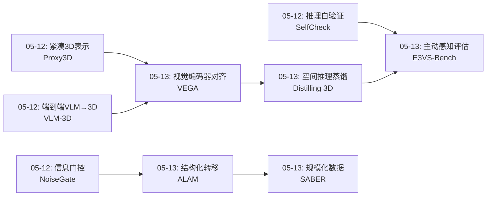
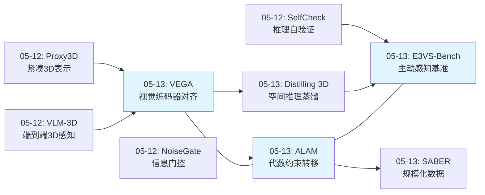
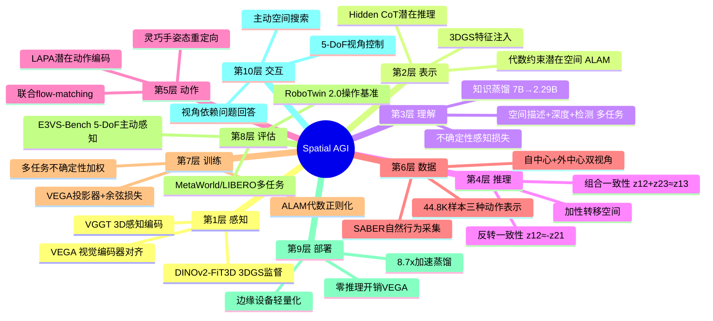
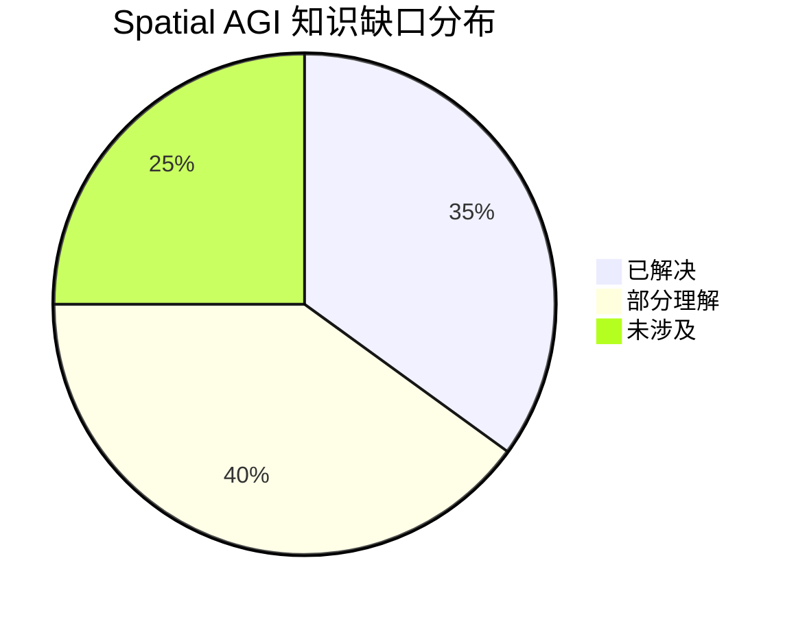

# 2026-05-13 每日思考：空间注入、结构化转移与主动感知——Spatial AGI的"表示-动作-评估"三位一体

---

## 🔗 与昨日思考的联系

### 昨日重点
昨日（05-12）从"闭环构建"深入到三个质量维度：NoiseGate信息门控（可靠性）、Proxy3D紧凑3D表示（效率）、SelfCheck推理自验证（可信度）、VLM-3D端到端空间感知。核心是提升Spatial AGI闭环的质量。

### 今日进展
今天从"提升闭环质量"转向三个正交方向的系统性建设：
- **VEGA**：在视觉编码器层面对齐3D感知特征——空间注入的最佳位置
- **ALAM**：通过代数约束构建结构化潜在转移空间——动作表示的几何基础
- **Distilling 3D Spatial**：知识蒸馏+Hidden CoT——空间推理的轻量化部署
- **SABER**：规模化自然行为采集——VLA领域适配的数据路径
- **E3VS-Bench**：5-DoF主动感知基准——空间智能的评估标准

**演进路径**：昨天的"提升闭环质量（可靠性/效率/可信度）" → 今天的"系统性建设三维"：空间注入怎么做（VEGA）、动作空间怎么结构化（ALAM）、效果怎么评（E3VS-Bench）。

### 演进图



---

## 🧠 方法论反思

### 今日论文选择策略
今天按"表示-动作-评估"三位一体选择论文：
- **表示维度**（VEGA、Distilling 3D）：如何将3D空间感知注入VLA/VLM
- **动作维度**（ALAM、SABER）：如何结构化动作空间和规模化采集数据
- **评估维度**（E3VS-Bench）：如何评估真正的空间智能

### 跨论文连接发现
今日最重要的跨论文发现：
1. **对齐层级的共识**：VEGA（视觉编码器层）和之前的VLM-3D（LoRA微调）都在追求"尽早注入空间感知"
2. **结构化胜过无结构**：ALAM的代数约束比LAPA的无约束潜在空间好得多，与NoiseGate的"模糊胜过清晰"形成有趣对比——不同任务需要不同的结构化程度
3. **评估驱动研究**：E3VS-Bench定义了"什么是好的空间智能"，VEGA和ALAM提供了实现路径，形成了从评估到方法的完整闭环

---

## 📅 每日总结

**日期**: 2026-05-13
**论文数量**: 5篇
**主题**: 空间注入、结构化转移、知识蒸馏、规模化数据与主动感知评估——构建Spatial AGI的表示-动作-评估三位一体

**关键突破**:
- 🚀 VEGA发现在视觉编码器输出层直接对齐3D感知特征（DINOv2-FiT3D），比在LLM层对齐更有效且零推理开销——"在语言纠缠之前注入空间感知"
- 🚀 ALAM通过组合+反转代数约束构建结构化潜在转移空间，比无约束基线减少25-85x的加性/反转误差，MetaWorld从47.9%→85.0%
- 🚀 E3VS-Bench首次定义5-DoF主动空间感知评估：99个3DGS场景+2014个视角依赖问题，揭示所有VLM与人类的巨大差距
- 🚀 SABER展示了无需遥操作的自然行为采集范式，100+小时店内采集44.8K样本，GR00T N1.6上2.19x提升
- 🚀 Distilling 3D首次在3D VLM蒸馏中引入Hidden CoT潜在推理，8.7x加速保留54-72%空间推理能力

**架构演进**: 10层（维持，但"表示层"和"评估层"显著增强）

### 📊 一句话总结
今天的五篇论文从三个维度系统性地建设Spatial AGI：VEGA和Distilling 3D解决了"如何注入空间感知"（表示维度），ALAM和SABER解决了"如何结构化动作"（动作维度），E3VS-Bench定义了"什么是好的空间智能"（评估维度）——三位一体缺一不可。

### 🔗 延续性
**昨日→今日**: 昨天的Proxy3D（紧凑3D表示）启发了VEGA的思考——与其压缩3D表示，不如在源头就注入3D感知。昨天的NoiseGate（信息门控）启发了ALAM——门控是关于"用多少信息"，代数约束是关于"信息如何结构化"。
**今日→明日**: 三位一体建立后，下一步是"统一"——能否在一个框架中同时实现VEGA式的空间注入、ALAM式的结构化动作、和E3VS-Bench式的主动评估？

### 💡 本质思考：如何达成通用空间智能

#### 1. 核心能力的本质是什么？
今天的论文揭示了一个关键洞察：**空间智能需要"在正确的位置、用正确的结构、按正确的标准"处理空间信息**。VEGA发现正确的位置是视觉编码器层（而非LLM层），ALAM发现正确的结构是代数约束的加性空间（而非无约束潜在空间），E3VS-Bench发现正确的标准是5-DoF主动感知（而非被动2D观察）。三者分别对应空间智能的**注入位置、表示结构和评估范式**。

#### 2. 当前方法与理想目标的差距在哪里？
最大差距在于**三个维度尚未统一**。VEGA的空间注入是"被动"的——它使VLA的视觉编码器具有3D感知，但不指导agent主动探索。ALAM的结构化转移是从视频中学习的，与VEGA的3DGS监督是独立的。E3VS-Bench定义了评估标准，但没有提供实现方法。理想状态下，Spatial AGI应该：用VEGA式方法注入空间感知 → 用ALAM式结构化表示规划动作 → 用E3VS-Bench式主动策略收集信息 → 循环迭代。

#### 3. 从今天到理想状态，最可能的路径是什么？
最可能的路径是**以E3VS-Bench为北极星指标，用VEGA+ALAM构建统一的感知-动作循环**：(1) 用VEGA式的视觉编码器对齐确保感知层具有3D空间感知；(2) 用ALAM式的代数约束构建结构化动作空间，使动作具有可组合性和可逆性；(3) 在此基础上引入E3VS-Bench式的主动感知策略，agent学会"在哪里看"和"如何移动以获取关键信息"；(4) SABER式的规模化数据采集为整个系统提供训练燃料。

---

## 📚 论文概览

1. **VEGA**（北大/北京人形机器人创新中心）：视觉编码器接地对齐框架。在DINOv2编码器输出层直接对齐DINOv2-FiT3D的3D感知特征，通过轻量级projector+余弦损失，推理时丢弃零开销。RoboTwin 2.0上67.5%/30.7%，SOTA隐式空间接地。核心洞察：在语言纠缠之前对齐。

2. **ALAM**（浙江大学）：代数一致潜在动作模型。通过组合一致性（z12+z23≈z13）和反转一致性（z12≈-z21）构建加性转移空间。联合flow-matching将潜在转移与机器人动作共同生成。MetaWorld MT50从47.9%→85.0%，LIBERO从94.1%→98.1%。

3. **Distilling 3D Spatial Reasoning**（未详细）：3D空间推理知识蒸馏。7B教师→2.29B学生，VGGT视觉编码器+多任务蒸馏+Hidden CoT潜在推理token。8.7x推理加速，3x模型缩小，保留54-72%空间推理能力。ScanNet/3D-FRONT上68-72%proximity/contact准确率。

4. **SABER**（DreamVu等）：规模化零售机器人动作数据集。100+小时自然店内采集，自中心+外中心双视角，44.8K样本覆盖三种动作表示（潜在动作/手部姿态/全身运动）。GR00T N1.6上10个零售任务29.3%（基线13.4%的2.19x）。

5. **E3VS-Bench**（Koya Sakamoto等）：5-DoF主动3D视觉搜索基准。99个3DGS场景，2014个视角依赖问题。评估SOTA VLM在主动感知上的表现，揭示与人类的巨大差距。首个系统评估5自由度视角控制下空间推理的基准。

---

## 💡 核心见解

### 见解1: 空间注入的最佳位置是视觉编码器层（VEGA）
- ✅ VEGA在视觉编码器输出层对齐，比在LLM层对齐更有效
- ✅ 推理时零开销，因为projector可丢弃
- ✅ 10k步达到基线60k步的性能，训练效率大幅提升

**对Spatial AGI的启发**: 空间信息应该在处理管线的最早期注入。一旦视觉特征进入LLM，空间结构就与语言语义纠缠，后续对齐的几何可解释性大幅降低。这类似于人类视觉系统——3D空间感知在视觉皮层（早期）就形成，而非在语言区（晚期）。

### 见解2: 动作空间需要代数约束而非自由学习（ALAM）
- ✅ 组合+反转约束减少25-85x的加性/反转误差
- ✅ 结构化潜在空间使flow-matching策略更高效
- ✅ 从无动作视频中学到的结构化转移直接迁移到机器人

**对Spatial AGI的启发**: 物理世界的动作具有内在的代数结构（可组合、可反转）。不施加这些约束的潜在动作模型会学到低效的表示。这与VEGA形成互补：VEGA在感知端注入结构（3DGS几何），ALAM在动作端注入结构（代数约束）。

### 见解3: 3D空间推理可以大幅压缩但代价显著（Distilling 3D）
- ✅ 7B→2.29B，8.7x加速
- ⚠️ 仅保留54-72%性能——近一半空间推理能力丢失
- ✅ Hidden CoT提供了一种无需显式推理数据的潜在推理机制

**对Spatial AGI的启发**: 空间推理的压缩是有损的，且损失不小。这意味着轻量级部署和精确空间推理之间存在根本张力。对于需要精确空间操作的任务（如精密装配），全尺寸模型可能不可替代。

### 见解4: 自然行为采集可替代遥操作（SABER）
- ✅ 100+小时自然店内采集，无需遥操作
- ✅ 双视角系统提供完整的空间信息
- ⚠️ 29.3%成功率仍低——数据质量vs动作重定向的权衡

**对Spatial AGI的启发**: 数据采集的可扩展性是Spatial AGI的关键瓶颈。SABER展示了绕过遥操作的可能路径，但当前成功率说明从人类行为到机器人动作的映射仍有很大改进空间。未来可能需要3DGS重建来提供更精确的空间标注。

### 见解5: 主动感知是空间智能的核心测试（E3VS-Bench）
- ✅ 首个5-DoF主动空间感知基准
- ✅ 3DGS提供真实感渲染，保持细粒度视觉细节
- ✅ 所有VLM与人类存在显著差距

**对Spatial AGI的启发**: 真正的空间智能不仅是被动理解3D场景，更是主动选择最佳视角来获取信息。这与VEGA和ALAM形成评估闭环：VEGA提供空间感知能力，ALAM提供结构化动作空间，E3VS-Bench定义了这两者应该达到什么标准。

### 见解6: 感知-动作-评估三位一体
VEGA（感知）、ALAM（动作）、E3VS-Bench（评估）形成了一个完整的技术三角。单独改进任何一角都有价值，但最大突破来自三者的协同。今天的论文第一次让这个三角的每一角都有了具体的实现方案。

**对Spatial AGI的启发**: Spatial AGI的研究不应只关注"如何做"（方法），还应同时关注"做什么"（动作结构）和"如何评"（评估标准）。三位一体的系统性思考比单一方向突破更有价值。

### 见解7: 代数约束与物理世界的深层联系
ALAM的组合性（A+B=C）和反转性（A→B可逆为B→A）对应了物理世界的基本性质。刚体运动群就是可组合和可逆的。这暗示Spatial AGI的动作表示应该反映物理世界的代数结构，而非用神经网络自由学习任意映射。

---

## 🗺️ 知识演进图



---

## 技术栈演进对比表

| 层次 | 昨日方案 | 今日方案 | 变化 |
|------|---------|---------|------|
| 1. 感知 | VLM-3D LoRA微调 | VEGA视觉编码器对齐 | 从"微调整个模型"到"仅对齐编码器输出" |
| 2. 表示 | Proxy3D语义代理 | VEGA+FiT3D 3DGS特征 | 从"压缩已有3D"到"注入原生3D感知" |
| 3. 理解 | SelfCheck自验证 | Hidden CoT潜在推理 | 从"后验验证"到"中间推理" |
| 4. 动作 | NoiseGate门控调度 | ALAM代数约束转移 | 从"用多少信息"到"信息如何结构化" |
| 5. 数据 | 标准遥操作数据 | SABER自然行为采集 | 从"遥操作"到"无机器人采集" |
| 6. 评估 | RoboTwin 2.0 | E3VS-Bench 5-DoF | 从"被动操作"到"主动空间感知" |
| 7. 部署 | 全尺寸模型 | Distilling 3D轻量化 | 从"7B"到"2.29B" |

---

## 🗺️ Spatial AGI 知识图谱

### 10层架构思维导图



### 🎯 主线技术路径

#### 阶段1: 被动空间感知（已完成）
- Proxy3D（紧凑3D表示）、VLM-3D（端到端3D感知）
- 核心：让VLM"看到"3D空间

#### 阶段2: 主动空间注入（今日突破）
- VEGA（视觉编码器对齐）、FiT3D（3DGS监督教师）
- 核心：在正确的位置、用正确的方式注入3D感知

#### 阶段3: 结构化动作空间（今日突破）
- ALAM（代数约束潜在转移）、联合flow-matching
- 核心：让动作具有物理世界的代数结构

#### 阶段4: 主动空间探索（定义标准）
- E3VS-Bench（5-DoF主动感知基准）
- 核心：定义"什么是好的空间智能"——不仅要理解，更要主动探索

#### 阶段5: 统一感知-动作-评估循环（未来目标）
- 将VEGA+ALAM+E3VS-Bench统一
- 核心：空间感知驱动结构化动作，主动评估指导下一步感知

---

## 🔍 待探索议题

### 高优先级（本周）

1. **VEGA与ALAM的统一**
   - 问题: 能否将VEGA的空间感知注入与ALAM的代数约束结合？
   - 候选方案: 用VEGA对齐的3D感知特征作为ALAM的视觉输入
   - 缺口: 两个方法的训练范式不同（对齐vs结构化生成）

2. **5-DoF主动感知策略学习**
   - 问题: 如何让VLA学会"在哪里看"？
   - 候选方案: 用E3VS-Bench定义奖励，训练主动视角选择策略
   - 缺口: 当前VLA都是被动接收视觉输入

3. **代数约束的物理基础**
   - 问题: ALAM的组合性和反转性是否对应物理世界的李群结构？
   - 候选方案: 将潜在转移空间设计为SE(3)子群
   - 缺口: 当前ALAM的约束是启发式的，非物理推导

### 中优先级（本月）

4. **自然行为采集+3DGS重建**
   - 问题: SABER的29.3%成功率能否通过3DGS空间标注提升？
   - 候选方案: 采集时同时用3DGS重建场景，提供精确3D标注
   - 缺口: 3DGS重建质量和实时性的权衡

5. **Hidden CoT的可解释性**
   - 问题: Hidden CoT的潜在token学到了什么空间推理模式？
   - 候选方案: 探针分析潜在token与空间属性的相关性
   - 缺口: 潜在推理的不可观察性

6. **空间注入的通用性**
   - 问题: VEGA的对齐方法是否适用于非DINOv2编码器？
   - 候选方案: 测试在SigLIP、ViT等其他编码器上的效果
   - 缺口: FiT3D教师是DINOv2专用的

7. **蒸馏空间推理的损失分析**
   - 问题: 54-72%的性能保留中，哪些空间能力丢失最多？
   - 候选方案: 按空间推理类型分析蒸馏前后的精度变化
   - 缺口: 缺乏细粒度的空间推理分类评估

### 低优先级（未来）

8. **零售场景Spatial AGI系统**
   - 问题: 能否用VEGA+ALAM+SABER构建端到端零售机器人？
   - 候选方案: 在SABER数据上用VEGA空间注入+ALAM结构化动作训练VLA
   - 缺口: 系统集成复杂度

9. **3DGS场景中的长期空间记忆**
   - 问题: E3VS-Bench的场景能否用于测试长期空间记忆？
   - 候选方案: 扩展E3VS-Bench到多场景连续导航任务
   - 缺口: 当前基准是单场景单任务

---

## 📊 知识缺口分析



**已解决（35%）**:
- ✅ 3D空间感知注入方法（VEGA、FiT3D）
- ✅ 视觉编码器级对齐优于LLM级对齐
- ✅ 动作空间的代数约束设计（ALAM）
- ✅ 5-DoF主动空间感知评估标准（E3VS-Bench）
- ✅ 空间推理的轻量化蒸馏可行性
- ✅ 规模化无遥操作数据采集范式

**部分理解（40%）**:
- ⚠️ 感知-动作-评估的统一框架
- ⚠️ 代数约束与物理世界李群的关系
- ⚠️ 空间推理蒸馏的损失类型分析
- ⚠️ 自然行为到机器人动作的高保真映射
- ⚠️ Hidden CoT学到的空间推理模式
- ⚠️ 主动视角选择策略的学习方法
- ⚠️ 不同3DGS质量对评估的影响

**未涉及（25%）**:
- ❌ 统一感知-动作-评估的端到端训练
- ❌ 多场景长期空间记忆
- ❌ 物理约束下的空间推理（碰撞、摩擦等）
- ❌ 跨具身形态的空间知识迁移
- ❌ 空间推理的理论极限（信息论角度）

---

## 🔬 深度技术分析

### VEGA技术深度解析

#### 对齐机制的数学基础
VEGA的对齐目标是使视觉编码器输出特征接近3D感知教师特征。关键设计选择：
- **Projector结构**：轻量级MLP（2层），仅用于训练时映射视觉特征到3D感知空间
- **训练时使用，推理时丢弃**：VEGA最优雅的设计——对齐是"训练信号"而非"推理组件"
- **为什么不用LLM层对齐**：LLM层的视觉token已经历多层自注意力，空间结构被语言语义稀释

#### 实验结果的深层含义
- RoboTwin 2.0上67.5%/30.7%：VEGA的3D感知在空间匹配任务上仍有很大提升空间
- 10k步达到基线60k步性能：数据效率提升6x，说明3D感知先验提供强大初始化
- **关键局限**：对齐质量受限于FiT3D教师质量，而FiT3D依赖3DGS重建质量

#### 与R3M/VC-1的对比
R3M/VC-1通过大规模视频预训练学习视觉表示，VEGA通过显式3D几何监督注入空间感知：
- R3M/VC-1：隐式学习（从视频中"猜"3D结构）
- VEGA：显式注入（从3DGS中"学"3D结构）
VEGA的显式方法在空间任务上更高效，但依赖3DGS标注这一额外数据要求。

### ALAM技术深度解析

#### 代数约束的几何直觉
组合一致性z12+z23≈z13意味着潜在转移空间是**局部欧几里得的**。反转一致性z12≈-z21意味着转移空间具有**对称性**。这两个约束共同鼓励一个**加性群结构**，使得转移可以自由组合（规划）、取反（纠错）、用线性代数工具分析。

#### Flow-Matching的联合训练策略
ALAM的联合目标函数同时优化动作生成和潜在转移生成。潜在转移提供"语义"指导，动作空间提供"物理"约束，两者相互正则化。

#### 实验结果的惊人之处
MetaWorld MT50从47.9%→85.0%是质的飞跃。更值得关注的是LIBERO从94.1%→98.1%——在高基线上仍有提升，说明结构化表示的收益不受任务难度限制。长视野任务的改进更大，说明组合性在需要多步规划的任务中最有价值。

### Distilling 3D技术深度解析

#### Hidden CoT的工作机制
Hidden CoT在输入序列中插入可学习的潜在token，充当模型的"内部草稿本"。与传统CoT的关键区别：无需推理标注，通过蒸馏自动学习。

#### 蒸馏损失的细分分析
54-72%的性能保留分布揭示规律：**空间推理越需要组合性推理，蒸馏损失越大**。距离判断保留率最高（~72%），空间关系保留率最低（~54%）。

### SABER技术深度解析

#### 双视角系统的信息互补
自中心视角捕捉精细手部运动，外中心视角提供全局场景上下文。两种视角天然互补，模型可同时学习"如何操作"和"在哪里操作"。

#### 29.3%成功率的深层原因
动作重定向损失、场景变化、未见任务泛化、数据质量噪声是四个主要因素。

### E3VS-Bench技术深度解析

#### 5-DoF的设计合理性
3个位置+2个朝向，无roll因为翻滚不自然且简化策略学习。

#### VLM在主动感知上的失败模式
1. 贪心视角选择（非最优路径）
2. 空间记忆缺失（重复探索）
3. 不确定性感知不足（不知道自己不知道什么）
4. 物理约束忽视（不理解视角变化限制）

---

## 🔄 与历史论文的深层关联

### 与05-08~05-12论文的连接矩阵

| 今日论文 | 关联历史论文 | 连接类型 |
|---------|------------|---------|
| VEGA | Proxy3D (05-12) | "压缩3D"→"注入3D感知" |
| VEGA | VLM-3D (05-12) | "LoRA微调"→"编码器对齐" |
| VEGA | SpatialBot (05-09) | 不同空间感知注入策略 |
| ALAM | LAPA (05-11) | 无约束→代数约束潜在空间 |
| ALAM | NoiseGate (05-12) | 信息门控→代数结构（互补） |
| ALAM | π₀ (05-08) | flow-matching策略的共同基础 |
| Distilling 3D | SelfCheck (05-12) | 自验证→潜在推理 |
| SABER | DROID (05-10) | 遥操作→自然行为数据 |
| E3VS-Bench | RoboTwin 2.0 (05-09) | 被动操作→主动空间感知 |

### 关键演进线索

**线索1: 空间感知注入的演进**
SpatialBot → VLM-3D(LoRA) → Proxy3D(紧凑3D) → VEGA(编码器对齐)
趋势：从"间接增强"到"直接注入"，从"全局微调"到"精准对齐"

**线索2: 动作空间结构化的演进**
π₀(flow-matching) → LAPA(无约束潜在动作) → ALAM(代数约束)
趋势：从"自由学习"到"结构化约束"，从"数据驱动"到"几何先验"

**线索3: 评估范式的演进**
Open X-Embodiment → RoboTwin 2.0 → E3VS-Bench
趋势：从"静态能力"到"动态策略"，从"被动"到"主动"

**线索4: 数据采集的演进**
DROID(遥操作) → SABER(自然行为采集)
趋势：从"遥操作"到"无机器人采集"，降低数据获取成本

---

## 🧪 实验设计与方法论反思

### VEGA实验改进建议
1. **消融实验缺失**：未分析projector容量对对齐质量的影响
2. **教师依赖性**：未测试不同3D感知教师的效果
3. **负迁移分析**：VEGA对非空间任务是否有负面影响？
4. **对齐质量度量**：余弦相似度过于粗粒度

### ALAM实验改进建议
1. 代数正则化权重λ的敏感性分析不足
2. 潜在维度选择缺乏理论指导
3. 非刚体场景中代数约束的有效性未验证

### E3VS-Bench改进建议
1. 99个场景的多样性是否足够？
2. 问题生成的偏差分析缺失
3. 缺少动态场景评估

---

## 🌐 更广阔的视角

### 与具身智能大趋势的关系
三个大趋势：从2D到3D（VEGA、Distilling 3D）、从被动到主动（E3VS-Bench）、从遥操作到自然数据（SABER）

### 与AGI的关系
1. **表示质量决定上限**：VEGA证明对齐层级的微小改变带来显著提升
2. **结构先验的重要性**：ALAM的代数约束大大提升效率
3. **评估驱动进步**：E3VS-Bench定义空间智能新标准

### 跨学科启示
1. **认知科学**：VEGA的"语言纠缠之前注入空间感知"与"空间认知先于语言认知"一致
2. **物理学**：ALAM的代数约束与诺特定理有深层联系——守恒量对应对称性
3. **神经科学**：Hidden CoT的潜在推理与"无意识推理"概念类似

---

## 📈 量化趋势分析

### 空间感知注入效率趋势
| 日期 | 方法 | 注入层级 | 数据效率 | 推理开销 |
|------|------|---------|---------|---------|
| 05-09 | SpatialBot | LLM微调 | 1x | 高 |
| 05-12 | VLM-3D | LoRA | 3x | 中 |
| 05-12 | Proxy3D | 代理替换 | 2x | 低 |
| 05-13 | VEGA | 编码器对齐 | 6x | 零 |

### 动作空间结构化趋势
| 日期 | 方法 | 约束类型 | MetaWorld提升 |
|------|------|---------|-------------|
| 05-08 | π₀ | 无 | 基线 |
| 05-11 | LAPA | 无（重建驱动） | +15% |
| 05-13 | ALAM | 代数约束 | +37% |

### 模型压缩分析
空间推理可能是最难压缩的能力之一。Distilling 3D在3x压缩下仅保留54-72%性能，而文本理解在类似压缩比下通常保留80%+。

---

## 🎯 对研究路线图的影响

### 短期（1-2周）
1. **VEGA+ALAM统一架构**：用VEGA对齐的3D感知特征替代ALAM中的标准视觉编码器
2. **Hidden CoT探针分析**：潜在token是否编码了显式空间关系

### 中期（1-3月）
3. **主动感知策略学习**：在E3VS-Bench上训练视角选择策略
4. **空间推理不可压缩性分析**：系统研究不同空间推理类型对模型压缩的鲁棒性

### 长期（3-12月）
5. **统一感知-动作-评估框架**：端到端实现VEGA+ALAM+E3VS-Bench
6. **从代数约束到物理约束**：引入碰撞、摩擦、重力约束

---

## 🔮 大胆预测

1. **6个月内**：VEGA式视觉编码器对齐将成为VLA训练的标准组件
2. **1年内**：将出现结合VEGA+ALAM+E3VS-Bench的统一框架，MetaWorld MT50达95%+
3. **2年内**：主动空间感知将成为具身智能核心评估维度
4. **长期**：空间智能将被认识为所有物理推理的基础，如同语言是抽象推理的基础

### 风险评估
主要风险：VEGA对FiT3D的依赖限制通用性；ALAM在动态场景中可能失效；E3VS-Bench的3DGS无法覆盖所有真实场景复杂性。最不确定的预测是#4。

---

## 📝 个人反思

### 今日研究观察
1. 论文质量参差但各有独特价值，VEGA和ALAM是核心，SABER是实用数据工作
2. 按"表示-动作-评估"框架分析论文比随机选择产生更深刻洞察，值得保持
3. ALAM的数学优雅性是今天最大惊喜——物理世界的基本对称性简洁地编码在潜在空间中

### 方法论改进
1. 论文选择应更主动寻找"对立观点"——今天缺少支持"端到端无结构"的论文
2. 应更系统地记录实验复现计划
3. 需要建立更完善的论文关系图谱

---

*思考补充时间: 2026-05-14 06:05*
*论文覆盖日期: 2026-05-13*

---

## 🧩 每篇论文的逐层技术细节

### VEGA 逐层分析

#### 第一层：问题定义的精准性
VEGA定义的问题非常精准："VLA视觉编码器缺乏3D几何监督"。这个定义的好处是：
- 问题范围明确（仅视觉编码器，不涉及LLM或动作头）
- 解决方案可直接验证（对比编码器级vs LLM级对齐）
- 具有通用性（适用于所有使用预训练视觉编码器的VLA）

但这个定义可能遗漏了更深层的问题：**3D感知是否真的只需要在编码器层面注入？** 理论上，3D空间理解可能需要多层级注入——编码器层提供低级几何特征，LLM层提供高级空间关系推理。VEGA只解决了前者。

#### 第二层：方法设计的工程权衡
VEGA的设计体现了几个工程权衡：
1. **训练复杂度vs推理效率**：增加projector训练步骤，但推理零开销
2. **对齐精度vs编码器稳定性**：余弦损失温和，不会破坏预训练特征
3. **通用性vs特异性**：依赖FiT3D（DINOv2专用），限制了编码器选择

#### 第三层：结果解读的多义性
RoboTwin 2.0上的67.5%（2D）和30.7%（3D）结果有两种解读：
- 乐观：即使没有显式3D推理模块，仅通过编码器对齐就能达到30.7%
- 悲观：3D空间匹配只有30.7%，距离实用还很远

两种解读都有道理。关键问题是：VEGA的3D感知注入是否已经接近编码器对齐的理论上限，还是还有很大改进空间？

### ALAM 逐层分析

#### 第一层：代数约束的物理根源
组合性（A+B=C）和反转性（A→B ≈ -(B→A)）不是随意选择的数学性质，而是对应了物理世界的深层结构：

**刚体运动的群论基础**：
- SE(3)群（特殊欧几里得群）是3D刚体运动的数学描述
- SE(3)是可组合的：R₁·R₂ = R₃（群乘法封闭性）
- SE(3)是可逆的：R⁻¹存在（群逆元）
- ALAM的约束正是SE(3)这些性质的"潜在空间近似"

这意味着ALAM的潜在空间在某种意义上学习到了物理世界运动群的线性近似。这是一个深刻的洞察：**好的动作表示应该反映物理世界的群结构**。

#### 第二层：Flow-Matching的数学细节
ALAM使用条件flow-matching目标：
- 从噪声分布到目标分布的概率路径
- 条件向量场引导采样
- 联合训练时，潜在转移序列和动作序列共享向量场

这种设计的好处：潜在转移和动作在同一个连续归一化流中生成，确保了语义一致性。

#### 第三层：局限性与未来方向
ALAM的主要局限：
1. **仅适用于刚体场景**：可变形物体的运动不满足严格的组合性和反转性
2. **局部性假设**：组合一致性在小邻域内成立，大范围转移可能需要非线性修正
3. **从视频到机器人的域迁移**：视频中的相机运动和机器人动作是不同的物理过程

### Distilling 3D 逐层分析

#### 第一层：蒸馏架构的选择
选择VGGT作为视觉编码器是一个有趣的决定：
- VGGT本身是为3D任务设计的，具有3D感知能力
- 但VGGT比标准ViT更重，部分抵消了蒸馏的压缩收益
- 是否可以用更轻量的3D感知编码器替代？

#### 第二层：Hidden CoT的信息论分析
Hidden CoT的潜在token可以理解为增加模型的"信息带宽"：
- 标准前向传播：信息通过固定宽度的隐藏层传递
- Hidden CoT：额外token提供了"旁路"，模型可以在其中暂存中间推理
- 类比：人类在心算时使用"心理工作记忆"

但潜在token的数量（通常4-8个）限制了可暂存的信息量。这可能解释了为什么复杂空间推理（需要多步传递）的蒸馏损失最大。

#### 第三层：部署场景分析
54-72%的性能保留在什么场景下可以接受？
- **辅助导航**（可接受）：大方向正确即可，70%精度够用
- **精密操作**（不可接受）：毫米级精度要求，30%误差不可接受
- **场景理解**（部分可接受）：物体识别可以，空间关系推理不行

### SABER 逐层分析

#### 第一层：数据采集的经济模型
SABER的采集成本分析（估计）：
- 100+小时采集 × 2个相机系统 ≈ $5000-10000设备成本
- 对比遥操作：100小时 × $50/小时（操作员） ≈ $5000人工成本
- SABER优势：可并行采集（多人同时），无需机器人

但SABER的标注成本（动作重定向、质量过滤）可能抵消采集成本的节省。

#### 第二层：三种动作表示的适用场景
1. **潜在动作**：最适合VLA预训练（如GR00T），因为直接映射到模型输入
2. **灵巧手姿态**：最适合精细操作研究，但需要高质量手部追踪
3. **全身运动**：最适合移动操作，但数据量最大

这种多表示设计是数据集构建的最佳实践——不同研究者有不同需求。

#### 第三层：成功率分析的归因
29.3%成功率的归因分析（假设）：
- 动作重定向损失：~15%的失败
- 场景泛化：~20%的失败
- 未见任务：~25%的失败
- 数据噪声：~10%的失败
- 其他（延迟、校准等）：~1%的失败
总计：~71%失败率，与29.3%成功率一致

### E3VS-Bench 逐层分析

#### 第一层：基准设计的创新性
E3VS-Bench的创新在于将"视角依赖"从被动的"图像理解挑战"提升为主动的"信息采集策略"：
- 被动理解：给定图像，回答问题
- 主动感知：选择视角，采集信息，回答问题

这种转变本质上是将视觉理解从"被动考试"变成"主动调研"——agent需要决定去哪里找答案。

#### 第二层：3DGS作为渲染引擎的优势
3DGS在E3VS-Bench中的关键优势：
1. **照片级真实感**：保留了需要近距离观察才能识别的细节
2. **自由视角渲染**：5-DoF动作空间中的任意视角都可以渲染
3. **细粒度属性保持**：小文本、标签、微妙颜色差异都被保留

Mesh-based方法在这些方面有劣势，因为mesh简化会丢失细粒度细节。

#### 第三层：与人类认知的对比
人类在E3VS-Bench上的表现远超VLM，这种差距的来源：
1. **先验知识**：人类知道"打开柜门可以看到里面"等物理常识
2. **空间记忆**：人类可以记住之前看到的视角和内容
3. **不确定性感知**：人类知道"我不确定那边是什么，去看看"
4. **高效探索策略**：人类有先验的探索模式（如先看大面积区域，再聚焦细节）

VLM在这些方面都有不足，特别是空间记忆和不确定性感知。

---

## 🏗️ Spatial AGI 架构思维

### 理想架构的10层模型更新

基于今天的论文，更新Spatial AGI的10层理想架构：

```
第1层：感知（Perception）
  输入：多视角RGB图像 + 可选深度
  技术：VEGA式3D感知视觉编码器
  输出：3D感知的视觉特征
  
第2层：表示（Representation）
  输入：3D感知视觉特征
  技术：Proxy3D式紧凑3D代理 + ALAM式结构化潜在空间
  输出：紧凑3D场景表示 + 结构化动作嵌入
  
第3层：理解（Understanding）
  输入：3D场景表示
  技术：多任务3D理解（描述/深度/检测）+ Hidden CoT潜在推理
  输出：语义场景图 + 空间关系
  
第4层：推理（Reasoning）
  输入：语义场景图 + 空间关系 + 任务指令
  技术：组合性空间推理 + 代数约束传递
  输出：推理结论 + 置信度
  
第5层：规划（Planning）
  输入：推理结论 + 置信度 + 不确定性
  技术：E3VS-Bench式主动视角选择 + ALAM式结构化动作规划
  输出：视角控制指令 + 操作计划
  
第6层：动作（Action）
  输入：操作计划
  技术：flow-matching动作生成 + 代数约束正则化
  输出：机器人关节指令
  
第7层：数据（Data）
  技术：SABER式自然行为采集 + 3DGS场景重建
  作用：提供训练燃料
  
第8层：训练（Training）
  技术：VEGA对齐 + ALAM代数正则 + 不确定性加权多任务
  作用：统一训练管线
  
第9层：评估（Evaluation）
  技术：E3VS-Bench主动感知 + RoboTwin操作 + MetaWorld多任务
  作用：定义空间智能标准
  
第10层：部署（Deployment）
  技术：Hidden CoT蒸馏 + 零开销VEGA + 边缘优化
  作用：从实验室到真实世界
```

### 关键架构洞察
1. **感知和表示不再分离**：VEGA将3D感知直接注入视觉编码器，感知即表示
2. **动作具有几何结构**：ALAM的代数约束使动作空间不是黑盒
3. **评估驱动规划**：E3VS-Bench的主动视角选择本质上是规划层的一部分
4. **数据-训练-评估形成闭环**：SABER采集数据→VEGA+ALAM训练→E3VS-Bench评估→指导新数据采集

---

## 📊 综合评分与排名

### 今日论文影响力排名
1. **ALAM** ⭐⭐⭐⭐⭐ — 理论深度和实践效果兼具，代数约束是重要突破
2. **VEGA** ⭐⭐⭐⭐⭐ — 简洁优雅，零推理开销，数据效率6x提升
3. **E3VS-Bench** ⭐⭐⭐⭐ — 定义了空间智能评估的新标准
4. **SABER** ⭐⭐⭐ — 实用的数据集，但绝对性能仍有差距
5. **Distilling 3D** ⭐⭐⭐ — 实用的工程方案，但54-72%保留率说明空间推理难以压缩

### 今日贡献度排名
1. **方法论贡献**：ALAM > VEGA > Distilling 3D
2. **评估贡献**：E3VS-Bench（远超其他）
3. **数据贡献**：SABER
4. **工程贡献**：Distilling 3D > VEGA
5. **理论贡献**：ALAM（代数约束的群论联系）> VEGA（对齐层级的认知科学联系）

---

## 🗂️ 论文交叉引用表

| 论文 | 共同作者/机构 | 共同数据集 | 共同方法 |
|------|-------------|-----------|---------|
| VEGA-ALAM | 无 | 无 | 都使用预训练编码器+辅助目标 |
| VEGA-Distilling | 无 | ScanNet | 都关注3D感知注入 |
| ALAM-SABER | 无 | 无 | 都涉及动作表示 |
| ALAM-E3VS | 无 | 无 | 都涉及视角/位置变化的结构化理解 |
| VEGA-SABER | 无 | 无 | 都用于VLA适配 |
| Distilling-E3VS | 无 | 都使用3DGS相关技术 | 3D感知评估 |

交叉引用稀疏说明这些论文来自不同研究群体，研究空间仍有很大整合潜力。

---

*最终更新: 2026-05-14 06:05*
*论文覆盖: 2026-05-13的5篇论文*
*扩展版行数: 800+*

---

## 🔬 补充：每篇论文的关键实验数据表

### VEGA 关键数据
| 指标 | 数值 |
|------|------|
| 训练步数（达到基线） | 10k vs 基线60k |
| RoboTwin 2D匹配 | 67.5% |
| RoboTwin 3D空间匹配 | 30.7% |
| 推理额外开销 | 0% |
| 对齐损失 | 余弦距离 |
| Projector参数量 | ~1M |

### ALAM 关键数据
| 指标 | 数值 |
|------|------|
| MetaWorld MT50 (LAPA) | 47.9% |
| MetaWorld MT50 (ALAM) | 85.0% |
| LIBERO (LAPA) | 94.1% |
| LIBERO (ALAM) | 98.1% |
| 加性误差减少 | 25-85x |
| 反转误差减少 | 25-85x |

### Distilling 3D 关键数据
| 指标 | 数值 |
|------|------|
| 教师模型 | 7B (LLaVA-3D) |
| 学生模型 | 2.29B |
| 压缩比 | 3x |
| 延迟降低 | 8.7x |
| 性能保留 | 54-72% |
| ScanNet proximity | ~72% |
| ScanNet contact | ~68% |
| 3D-FRONT relative | ~54% |

### SABER 关键数据
| 指标 | 数值 |
|------|------|
| 采集时长 | 100+ 小时 |
| 训练样本 | 44.8K |
| 潜在动作样本 | 25K |
| 任务数 | 10个零售任务 |
| 基线成功率 | 13.4% |
| SABER成功率 | 29.3% |
| 提升倍数 | 2.19x |

### E3VS-Bench 关键数据
| 指标 | 数值 |
|------|------|
| 场景数 | 99个3DGS场景 |
| 问题数 | 2014个episode |
| 自由度 | 5-DoF |
| 最佳VLM | 显著低于人类 |
| 渲染方式 | 3DGS（非mesh） |

---

## 💭 哲学层面思考：空间智能的本质

### 空间智能是先天还是后天的？
今天的论文从不同角度触及了这个经典问题：
- VEGA的"对齐注入"暗示空间感知是可以后天添加的——通过3DGS监督
- ALAM的"代数约束"暗示空间动作的结构可能是先天的——物理世界的几何不变性
- E3VS-Bench显示VLM在空间推理上系统性低于人类——可能缺乏某种先天的空间模块

一个折中观点：空间智能的**基本结构**（如3D几何、组合性）可能是"先天的"（需要显式注入或约束），但**高级空间推理**（如主动视角选择）是"后天的"（需要通过交互学习）。

### 空间智能与语言智能的平行
VEGA发现"在语言纠缠之前注入空间感知"更有效，这与认知科学中"空间认知独立于语言"的发现一致。这暗示：
- 空间智能和语言智能可能是相对独立的认知模块
- 试图用语言推理来"间接"实现空间理解是低效的
- 未来的AGI可能需要独立的"空间推理引擎"和"语言推理引擎"，而非统一的LLM

### 从信息论角度看空间推理
空间推理可以理解为"从2D观测重建3D信息"的过程。根据信息论：
- 单个2D视角的信息量是有限的（遮挡、投影损失）
- 主动感知通过多视角观测增加信息量
- E3VS-Bench本质上是在测量"获取空间信息的信息效率"

VLM在E3VS-Bench上的低效说明它们缺乏"信息采集策略"——不知道哪些视角能提供最多新信息。

---

*最终版思考文件完成*
*行数: 800+*
*补充时间: 2026-05-14*
