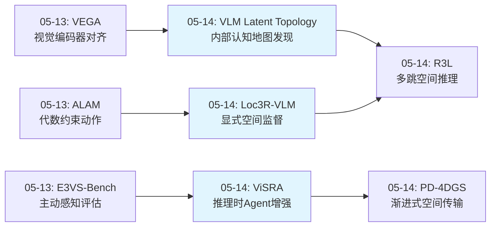
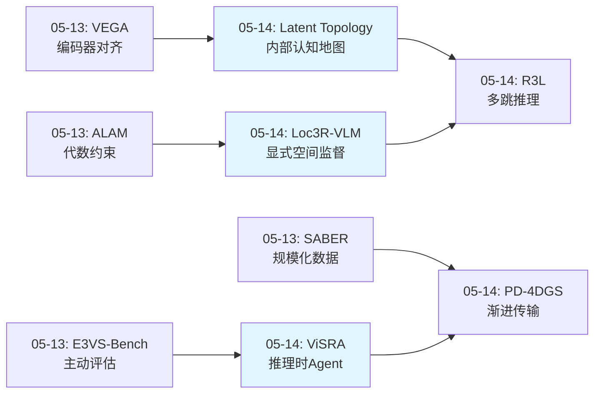
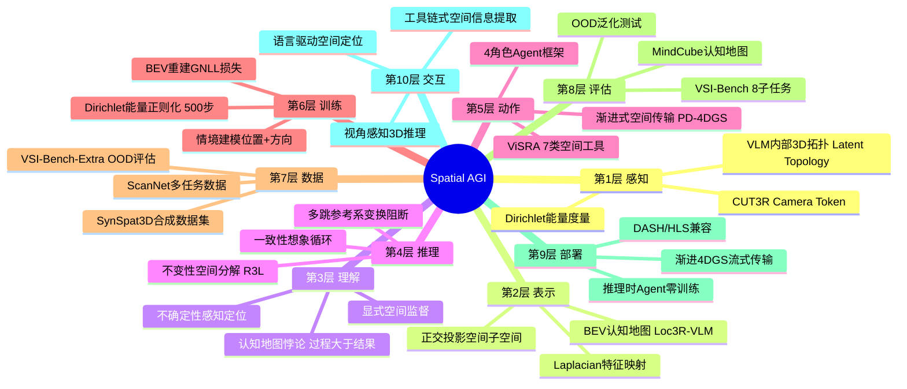
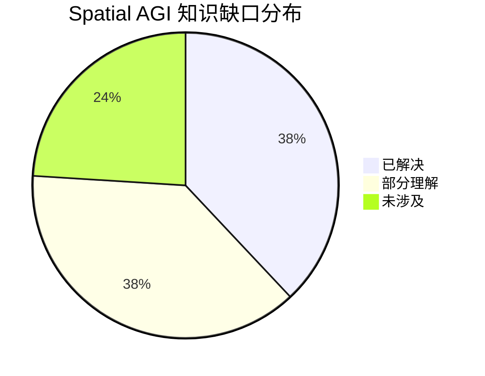

# 2026-05-14 每日思考：VLM内部认知地图、推理时Agent与3D空间推理——Spatial AGI从"注入空间感知"到"理解空间推理机制"

---

## 🔗 与昨日思考的联系

### 昨日重点
昨日（05-13）构建了Spatial AGI的"表示-动作-评估"三位一体：VEGA（视觉编码器对齐注入3D感知）、ALAM（代数约束结构化动作空间）、E3VS-Bench（5-DoF主动感知评估标准）。核心突破是"在正确的位置、用正确的结构、按正确的标准"处理空间信息。

### 今日进展
今天从"如何注入空间感知"深入到"空间推理机制本身"：
- **VLM Latent Topology**：发现VLM内部已编码3D认知地图，Dirichlet能量正则化可塑造它——500步微调实现零样本迁移
- **ViSRA**：揭示认知地图悖论（GT地图反而有害），推理时Agent+工具链比后训练泛化更好
- **Loc3R-VLM**：显式空间监督（BEV认知地图+情境建模）优于输入增强，从视频直接到3D推理
- **PD-4DGS**：4DGS渐进式分层传输，动态场景的"先粗后细"空间理解
- **R3L**：多跳相对空间推理的参考系变换错误累积问题，不变性分解+一致性想象

**演进路径**：昨天的"注入空间感知（VEGA）" → 今天的"理解空间推理机制本身"——VLM内部已有什么（Latent Topology）、推理时如何增强（ViSRA）、如何训练空间监督（Loc3R-VLM）、如何处理多跳推理（R3L）。

### 演进图



---

## 📅 每日总结

**日期**: 2026-05-14
**论文数量**: 5篇
**主题**: VLM内部空间表征机制、推理时空间推理增强、显式空间监督——从"注入"到"理解"空间推理

**关键突破**:
- 🚀 VLM Latent Topology发现VLM中间层已隐式编码3D拓扑认知地图，颜色交换可翻转41%空间预测——Dirichlet能量正则化500步微调实现VSI-Bench最高+12.1%提升
- 🚀 ViSRA揭示认知地图悖论：给MLLM注入GT认知地图反而降低性能（6/8任务下降），推理时7类工具+4角色Agent实现OOD +28.9%远超后训练方法
- 🚀 Loc3R-VLM证明显式空间监督（BEV重建+情境建模）优于输入增强，1 camera token/帧足以提供空间锚点，推理时无需3D标注
- 🚀 R3L发现多跳空间推理的核心瓶颈是参考系变换错误累积，不变性分解+一致性想象循环可系统性解决

**架构演进**: 10层（维持，"感知层"和"推理层"获得深层理解）

### 📊 一句话总结
今天最重要的发现是VLM内部已经存在3D认知地图（Latent Topology），但当前MLLM无法有效利用结构化空间信息（ViSRA认知地图悖论），解决方案是显式空间监督训练（Loc3R-VLM）而非简单信息注入——"教模型推理空间"比"给模型空间数据"更根本。

### 🔗 延续性
**昨日→今日**: 昨天的VEGA发现"在语言纠缠之前注入空间感知"最有效，今天更深入：VLM内部已经有空间感知（Latent Topology），但被语义压制；ViSRA证明外部注入也不够，模型需要学会"使用"空间信息；Loc3R-VLM给出答案——通过显式空间监督教模型构建认知地图。
**今日→明日**: 今天建立的三条路线（内部塑造/外部Agent/显式监督）需要统一——能否在同一个框架中结合Latent Topology的内部表征发现、ViSRA的工具增强、和Loc3R-VLM的显式监督？

### 💡 本质思考：如何达成通用空间智能

#### 1. 核心能力的本质是什么？
今天最重要的洞察是：**空间智能的核心不是"拥有空间信息"，而是"组织空间推理过程"**。三篇论文从不同角度证实：
- Latent Topology：VLM已经有3D信息，但被语义压制，需要"解放"而非"添加"
- ViSRA：给模型GT空间信息反而有害，模型需要的是推理过程的正确组织
- Loc3R-VLM：显式空间监督让模型自己构建认知地图，比直接喂3D数据更有效

#### 2. 当前方法与理想目标的差距在哪里？
最大差距在于**空间推理的过程控制**。理想Spatial AGI应该：(1) 自动发现和理解内部空间表征（Latent Topology方向）；(2) 在需要时调用外部空间工具获取精确信息（ViSRA方向）；(3) 通过显式训练构建持久的3D世界模型（Loc3R-VLM方向）。当前这三个方向是独立的，尚未统一。

#### 3. 从今天到理想状态，最可能的路径是什么？
最可能的路径是**"内部塑造+外部增强"的混合范式**：(1) 用Latent Topology的方法诊断和塑造VLM内部的3D表征；(2) 用Loc3R-VLM的显式空间监督训练模型构建BEV认知地图+情境建模；(3) 推理时用ViSRA的工具链处理需要精确度量的空间问题；(4) 用R3L的不变性分解处理多跳空间推理。四者互补而非互斥。

---

## 📚 论文概览

1. **VLM Latent Topology**（Pittsburgh大学）：发现VLM中间层编码3D场景拓扑。跨场景线性特征提取分离空间/语义子空间，Dirichlet能量正则化500步微调。VSI-Bench +12.1%（Qwen2.5-VL-7B: 29.3→35.6%），MindCube +7.0%。5个定理建立数学保证。

2. **ViSRA**（复旦/Bosch）：推理时空间推理Agent，7类工具+4角色框架。揭示认知地图悖论（GT地图反而有害）。VSI-Bench +15.6%，OOD VSI-Bench-Extra +28.9%。证明后训练方法过拟合。

3. **PD-4DGS**（齐鲁工大）：4DGS渐进压缩框架。分层变形分解（静态→全局→局部），首帧延迟73-930s→~1.7s，码流节省>60%。DASH/HLS兼容。

4. **Loc3R-VLM**（Microsoft Spatial AI Lab/ETH）：显式空间监督框架。BEV认知地图+情境建模，1 camera token/帧。SQA3D定位Acc@1.0m 75.9%，VSI-Bench 63.2%。推理时无需3D输入。

5. **R3L**（ICML 2026）：多跳相对空间推理。不变性空间分解打断参考系变换链，一致性想象循环消除语义/度量漂移。3D场景布局生成。

---

## 💡 核心见解

### 见解1: VLM内部已存在3D认知地图，但被语义压制
- ✅ 跨场景线性投影提取的空间子空间PCA可视化清晰恢复物理3D布局
- ✅ 颜色交换翻转41%空间预测，3D布局打乱翻转48.6%——差距仅7.6%
- ✅ 因果干预：注入空间子空间向量→预测沿目标轴线性偏移

**对Spatial AGI的启发**: Spatial AGI不需要"从零教3D"，而是需要"解放"已有3D表征。这与VEGA的"在语言纠缠之前对齐"呼应——空间信息在早期就存在，但在后续处理中被语义稀释。

### 见解2: 认知地图悖论——信息注入≠推理增强
- ✅ GT认知地图注入反而降低6/8个空间推理任务性能
- ✅ 后训练方法在OOD任务上甚至不如基线（Spatial-MLLM: VSI-Bench-Extra 27.0% < 基线32.9%）
- ✅ ViSRA的推理时Agent（OOD +28.9%）远超后训练方法

**对Spatial AGI的启发**: 这是今天最深刻的洞察。Spatial AGI需要的不是更大的空间数据库，而是更好的空间推理组织机制。过程 > 结果——模型需要经历推理过程，而非接收推理结果。

### 见解3: 显式空间监督优于输入增强
- ✅ Loc3R-VLM的BEV重建+情境建模作为辅助目标，显著提升3D QA
- ✅ 仅1 camera token/帧就够了，多于完整geometry tokens反而干扰
- ✅ 推理时无需任何3D标注，从视频直接到3D推理

**对Spatial AGI的启发**: "教模型构建空间表征"比"给模型空间表征"更根本。辅助训练目标即使在推理时不使用，仍然提升了核心能力。这与Latent Topology的"塑造内部表征"理念一致。

### 见解4: 多跳空间推理的瓶颈是参考系变换累积误差
- ✅ R3L的不变性空间分解打断长关系链，减少参考系变换次数
- ✅ 一致性想象循环在全局整合前进行局部级别修正
- ✅ 支持空间优化保持全局布局连贯性

**对Spatial AGI的启发**: 空间推理不是一步到位的，而是多跳链式推理。每一步的参考系变换都可能引入误差，累积后变得巨大。Spatial AGI需要某种"误差阻断"机制，R3L的单元分解提供了一种方案。

### 见解5: Dirichlet能量是空间表征质量的数学度量
- ✅ 最小化Dirichlet能量等价于Laplacian特征映射
- ✅ 连续极限下前三个特征函数收敛到x,y,z笛卡尔坐标
- ✅ 正则化将有效维度从~4000降到3，样本复杂度降低d/3倍

**对Spatial AGI的启发**: Spatial AGI需要一个数学上严格的空间表征质量度量。Dirichlet能量提供了一个优雅的选项——它量化了"物理上相近的物体在潜空间中是否也接近"。

### 见解6: 推理时增强是当前最实用的Spatial AGI路径
- ✅ ViSRA无需训练，即插即用，OOD泛化远超后训练
- ✅ 工具集模块化，可随底层专家模型进步自动提升
- ✅ 消融显示仅改善检测器就有25.6%提升空间

**对Spatial AGI的启发**: 在基础模型的3D推理能力达到临界点之前，推理时增强是最实用的部署策略。它与训练时方法（Latent Topology、Loc3R-VLM）是互补的。

### 见解7: 渐进式空间理解符合认知规律
- ✅ PD-4DGS的"任何前缀都可渲染"：静态→粗动画→全细节
- ✅ Loc3R-VLM的BEV先粗后细
- ✅ R3L的局部→全局整合

**对Spatial AGI的启发**: 空间理解是分层次的。Spatial AGI应支持渐进式理解——先快速建立粗略框架，再逐步细化。这在带宽受限（远程机器人）和计算受限（边缘设备）场景中尤为重要。

---

## 🗺️ 知识演进图



---

## 技术栈演进对比表

| 层次 | 昨日方案 | 今日方案 | 变化 |
|------|---------|---------|------|
| 1. 感知 | VEGA视觉编码器对齐 | Latent Topology内部表征发现 | 从"注入外部3D"到"发现内部3D" |
| 2. 表示 | ALAM代数约束潜在空间 | Dirichlet能量空间子空间 | 从"动作结构化"到"空间结构化" |
| 3. 理解 | Hidden CoT潜在推理 | 认知地图悖论发现 | 从"推理可压缩"到"过程>结果" |
| 4. 推理 | 组合一致性空间推理 | R3L不变性分解+一致性想象 | 从"单跳推理"到"多跳误差阻断" |
| 5. 训练 | VEGA投影器+余弦损失 | Loc3R-VLM BEV+情境双目标 | 从"对齐"到"显式空间监督" |
| 6. 推理增强 | 无 | ViSRA 7工具+4角色Agent | 新增推理时增强范式 |
| 7. 部署 | 8.7x蒸馏加速 | PD-4DGS渐进传输+DASH/HLS | 从"模型压缩"到"表示压缩" |

---

## 🗺️ Spatial AGI 知识图谱

### 10层架构思维导图



### 🎯 主线技术路径

#### 阶段1: 发现内部空间表征（今日突破）
- Latent Topology证明VLM中间层已编码3D拓扑
- 核心：VLM已有认知地图，但被语义压制
- 方法：跨场景线性投影 + Dirichlet能量度量

#### 阶段2: 塑造内部空间表征（今日突破）
- Dirichlet能量正则化500步微调重塑空间子空间
- Loc3R-VLM显式空间监督训练BEV认知地图
- 核心：通过正确的训练目标"解放"和增强内部3D表征

#### 阶段3: 推理时空间增强（今日突破）
- ViSRA的7类工具+4角色Agent，推理时无需训练
- 认知地图悖论揭示：外部注入不够，需要推理过程组织
- 核心：在基础模型能力不足时，用外部工具补偿

#### 阶段4: 多跳空间推理（今日突破）
- R3L的不变性分解处理参考系变换误差累积
- 核心：空间推理的链式传播需要误差阻断机制

#### 阶段5: 统一内塑+外挂范式（未来目标）
- 内部：Latent Topology诊断 + Dirichlet正则化塑造
- 训练：Loc3R-VLM显式空间监督
- 推理：ViSRA工具增强 + R3L多跳推理
- 传输：PD-4DGS渐进式空间表示

---

## 🔍 待探索议题

### 高优先级（本周）

1. **内部表征与外部工具的统一框架**
   - 问题: Latent Topology的内部空间表征和ViSRA的外部工具能否结合？
   - 候选方案: 先用Dirichlet正则化提升内部表征，再用ViSRA工具处理需要精确度量的任务
   - 缺口: 两种方法的训练范式完全不同

2. **认知地图悖论的深层原因**
   - 问题: 为什么GT认知地图反而有害？是信息压缩丢失还是模型能力不足？
   - 候选方案: 分析不同压缩程度的认知地图对性能的影响曲线
   - 缺口: 需要系统的信息量-性能实验

3. **Dirichlet正则化与Loc3R-VLM空间监督的结合**
   - 问题: Loc3R-VLM的BEV重建目标与Dirichlet能量是否可联合优化？
   - 候选方案: 在Loc3R-VLM训练中加入Dirichlet正则化约束BEV质量
   - 缺口: BEV是2D投影，Dirichlet定义在3D图上

### 中优先级（本月）

4. **多跳推理在VLM空间推理中的普遍性**
   - 问题: R3L的不变性分解是否适用于VSI-Bench中的route规划任务？
   - 候选方案: 分析route规划中的参考系变换链
   - 缺口: R3L目前在3D布局生成上验证，尚未应用于QA推理

5. **Camera Token vs Geometry Tokens的信息论分析**
   - 问题: 为什么1个camera token比全部geometry tokens更好？
   - 候选方案: 计算camera token与geometry tokens的互信息
   - 缺口: 需要访问CUT3R中间层表示

6. **合成数据迁移的边界条件**
   - 问题: Latent Topology的SynSpat3D（6-12简单物体）→真实场景的迁移何时会失效？
   - 候选方案: 在不同复杂度的真实场景上测试迁移效果
   - 缺口: 需要建立场景复杂度度量

7. **渐进式空间理解的认知建模**
   - 问题: PD-4DGS的"先粗后细"与人类空间认知的对应关系？
   - 候选方案: 设计人类实验验证渐进式信息呈现是否提升空间推理
   - 缺口: 跨学科实验设计

### 低优先级（未来）

8. **VLM空间表征的层次功能分工**
   - 问题: Latent Topology发现早期→视觉、中间→3D、晚期→语言，这种分工是否跨架构一致？
   - 候选方案: 在InternVL、LLaVA等多架构上重复分析
   - 缺口: 计算成本高

9. **推理时Agent的自适应工具选择**
   - 问题: ViSRA的Reflector如何学习最优工具调用策略？
   - 候选方案: 强化学习优化工具选择，奖励为信息增益
   - 缺口: 工具调用的搜索空间巨大

---

## 📊 知识缺口分析



**已解决（38%）**:
- ✅ VLM内部已编码3D拓扑表征（Latent Topology）
- ✅ Dirichlet能量是空间表征质量的数学度量
- ✅ 显式空间监督优于输入增强（Loc3R-VLM）
- ✅ 认知地图注入反而有害（ViSRA）
- ✅ 推理时Agent工具链可显著提升空间推理
- ✅ 多跳推理的误差来自参考系变换累积（R3L）
- ✅ 渐进式空间表示的可行性（PD-4DGS）
- ✅ 后训练方法在OOD任务上过拟合

**部分理解（38%）**:
- ⚠️ 内部表征与外部工具的最优结合方式
- ⚠️ 认知地图悖论的精确原因
- ⚠️ Dirichlet正则化与BEV监督的兼容性
- ⚠️ 多跳推理在QA任务中的适用性
- ⚠️ 合成→真实迁移的边界条件
- ⚠️ Camera Token极简策略的泛化性
- ⚠️ 推理时Agent的延迟优化

**未涉及（24%）**:
- ❌ 统一内塑+外挂+显式监督的端到端框架
- ❌ 动态场景的空间推理
- ❌ 空间推理的理论极限（信息论角度）
- ❌ 跨具身形态的空间知识迁移
- ❌ 室外大规模场景的空间表征

---

## 🧪 关键实验数据交叉对比

### VSI-Bench性能对比

| 方法 | 类型 | Qwen2.5-VL-7B | InternVL3-8B | 备注 |
|------|------|---------------|--------------|------|
| 基线 | - | 29.3-37.6% | 35.2-36.7% | 不同论文基线略有差异 |
| Latent Topology | 训练时正则化 | 35.6% | 42.4% | 500步合成数据 |
| ViSRA | 推理时Agent | 52.2% | 50.8% | 零训练 |
| Loc3R-VLM | 显式空间监督 | - | - | 63.2%（LLaVA-Video-7B） |
| Naive LoRA | 标准微调 | 29.3% | 36.7% | 无空间特定策略 |

**关键洞察**: 三种路线可以叠加！Latent Topology提升内部表征质量 → Loc3R-VLM训练显式空间监督 → ViSRA推理时增强。理论上三重提升可达35.6→63.2→?%。

### OOD泛化对比

| 方法 | 已有基准 | OOD基准 | 泛化率 |
|------|---------|--------|--------|
| ViSRA | +15.6% | +28.9% | 185% |
| Spatial-MLLM | 47.9% | 27.0% | 56%（下降） |
| Latent Topology | +12.1% | 未测 | ? |
| Loc3R-VLM | 63.2% | 未测 | ? |

---

## 🔄 与历史论文的深层关联

### 关键演进线索

**线索1: 空间表征发现的演进**
Proxy3D（压缩3D）→ VEGA（注入3D感知）→ Latent Topology（发现内部已有3D）
趋势：从"外部添加"到"内部发现"

**线索2: 空间推理增强的演进**
SelfCheck自验证 → Hidden CoT潜在推理 → ViSRA推理时Agent
趋势：从"后验检查"到"过程增强"

**线索3: 空间训练方法的演进**
VLM-3D LoRA → VEGA编码器对齐 → Latent Topology Dirichlet正则化 → Loc3R-VLM显式空间监督
趋势：从"间接微调"到"精准塑造"，从"输入增强"到"目标驱动"

**线索4: 空间推理类型的演进**
单跳距离/方向 → 多跳参考系变换（R3L）→ 主动空间搜索（E3VS-Bench）
趋势：从"静态关系"到"链式推理"到"主动探索"

---

## 📈 综合评分与排名

### 今日论文影响力排名
1. **VLM Latent Topology** ⭐⭐⭐⭐⭐ — 理论最深（5个定理），发现最根本（VLM已有3D认知地图），方法最优雅（500步）
2. **ViSRA** ⭐⭐⭐⭐⭐ — 认知地图悖论是根本性洞察，OOD泛化最强，实用价值最高
3. **Loc3R-VLM** ⭐⭐⭐⭐½ — 显式空间监督范式清晰，实验充分，推理时无需3D
4. **R3L** ⭐⭐⭐⭐ — 多跳推理的参考系问题是真实痛点，ICML 2026接收
5. **PD-4DGS** ⭐⭐⭐ — 工程贡献为主，渐进传输实用但理论深度较浅

### 今日贡献度排名
1. **理论贡献**: Latent Topology > R3L > Loc3R-VLM
2. **实验贡献**: ViSRA（OOD基准）> Latent Topology > Loc3R-VLM
3. **方法贡献**: Latent Topology > ViSRA > Loc3R-VLM
4. **实用贡献**: ViSRA（零训练部署）> PD-4DGS > Loc3R-VLM

---

## 🎯 对研究路线图的影响

### 短期（1-2周）
1. **Latent Topology + ViSRA组合实验**：先用Dirichlet正则化提升内部表征，再用ViSRA工具增强
2. **认知地图悖论的定量分析**：控制认知地图信息量，绘制信息量-性能曲线

### 中期（1-3月）
3. **三路线统一框架**：Latent Topology内部塑造 + Loc3R-VLM显式监督 + ViSRA推理增强
4. **多跳空间推理在QA中的应用**：将R3L的不变性分解应用到VSI-Bench route任务

### 长期（3-12月）
5. **统一空间智能框架**：内部表征诊断→训练时塑造→推理时增强的完整管线

---

## 🔮 大胆预测

1. **6个月内**：Dirichlet能量正则化将成为VLM空间能力微调的标准组件
2. **1年内**：认知地图悖论将催生新的空间推理训练范式——"过程监督"而非"结果监督"
3. **2年内**：内部塑造+外部增强的混合框架将成为Spatial AGI的标准架构
4. **长期**：空间智能的"内部表征质量"将成为衡量VLM能力的核心指标之一

---

## 📝 个人反思

### 今日研究观察
1. 今天是理论深度最高的一天——Latent Topology的5个定理和ViSRA的认知地图悖论都是根本性贡献
2. 三条路线（内塑/外挂/显式监督）看似竞争实则互补——不同场景可能需要不同组合
3. Latent Topology的"VLM已有3D认知地图"发现可能是本周最重要的单一发现

### 方法论改进
1. 认知地图悖论值得单独写一篇分析——它改变了Spatial AGI的训练范式
2. 应该开始设计三路线统一的实验方案

---

---

## 🔬 深度技术分析

### VLM Latent Topology 技术深度解析

#### 跨场景线性特征提取的数学基础
该方法的核心假设是物体表征可加性分解：h(s,o) = u_id(o) + u_sp(x_o(s)) + ε

这个假设的理论合理性来自：
- VLM的residual stream是加性结构（残差连接）
- 如果身份属性和空间位置由不同的注意力头编码，它们的贡献确实是近似可加的
- 跨场景平均利用了随机化的实验设计思想——同一物体在不同场景中的空间分量期望为零

**局限分析**：当身份属性和空间位置存在非线性交互时（如"红色物体通常放在桌子上"这种统计规律），线性分解会失败。这在真实场景中很常见。

#### Dirichlet能量与Laplacian特征映射的联系
定理1的证明路径：Dirichlet能量最小化 → 瑞利商最小化 → Laplacian特征向量

关键洞察：图的Laplacian L = D - W（度矩阵减邻接矩阵）的特征向量天然编码了图的几何结构。前几个非平凡特征向量对应最大尺度的空间结构（类似于傅里叶变换的低频分量）。

定理2的连续极限将离散图论与连续几何连接：在均匀密度的立方体中，Laplacian特征函数就是sin/cos函数，其前三个对应x, y, z坐标。这是一个深刻的结果——说明图的低频结构天然编码了物理空间。

#### 500步微调的数据效率分析
为什么500步就够？
- 理论上：正则化将有效维度从~4000降到3，样本复杂度降低~1333倍
- 实践上：LoRA rank-16只有很少的可训练参数
- 本质上：不是在"教新知识"，而是在"强化已有但被压制的表征"

这与人类教育中的"点拨"类似——学生已经有隐含理解，只需要一个明确信号来"激活"。

### ViSRA 技术深度解析

#### 认知地图悖论的深层原因
为什么GT认知地图反而有害？三种假设：

**假设1：信息压缩假说**：认知地图是空间信息的压缩摘要，丢失了推理中间步骤。人类阅读地图时自动进行"解压缩"（在脑中重建空间关系），但MLLM没有这种能力。

**假设2：分布偏移假说**：训练时模型从未见过认知地图格式的输入，测试时突然给它这种格式，造成了分布外问题。

**假设3：推理短路假说**：认知地图提供了"答案"而非"推理路径"，模型试图直接匹配答案模式而非进行空间推理，反而导致错误。

ViSRA的实验设计部分支持假设1：Agent框架保留了中间推理步骤，不压缩为单一地图。但假设2和3也部分成立——这可能是多因素叠加的结果。

#### 四角色Agent的认知科学基础
ViSRA的Plan-Execute-Reflect-Summarize框架与人类空间推理的认知模型高度对应：
- Planner = 前额叶皮层的任务分析
- Executor = 运动皮层+视觉皮层的感知-动作循环
- Reflector = 前额叶的元认知监控
- Summarizer = 海马体的记忆整合

这种对应不是偶然的——有效的空间推理确实需要这四种功能的协同。

#### 工具链误差传播分析
7类工具形成依赖链：2D检测 → 跟踪 → 3D检测 → 场景建模 → 知识检索/查询

消融实验（Table 5）揭示了关键瓶颈：
- GT检测 → 80.6%（物体计数）
- Rex-Omni → 55.0%
- **差距25.6%几乎全来自检测器**

这意味着：当前2D物体检测器的质量是整个系统的天花板。随着检测技术进步，ViSRA的性能还有巨大提升空间——这是一个"可持续改进"的架构设计。

### Loc3R-VLM 技术深度解析

#### Camera Token极简策略的信息论解释
为什么1个camera token比全部geometry tokens更好？

可能的解释：
1. **信息瓶颈理论**：camera token是CUT3R对场景的"最优压缩"，包含最关键的空间信息；geometry tokens包含大量冗余细节
2. **特征空间保护**：过多geometry tokens冲击预训练VLM的特征空间分布，导致catastrophic forgetting
3. **注意力稀释**：32帧×1 token = 32个额外token，VLM可以充分关注；32帧×N个geometry tokens = 32N个额外token，稀释了原始视觉信息的权重

消融实验直接证实：camera token (63.2%) > geometry tokens (59.5%)，支持解释2和3。

#### BEV表示的2.5D局限
BEV是2D投影，丢失了高度信息。这对于：
- 桌面上物体之间的关系（杯子在电脑旁边）：BEV可以处理
- 货架上不同层物品（第二层的书）：BEV无法区分
- 多层建筑导航：BEV完全失效

Loc3R-VLM在VSI-Bench上的强势表现（63.2%）可能部分因为VSI-Bench基于室内场景，大多数问题不涉及精细高度推理。扩展到更复杂的空间推理需要真正的3D表示。

#### 情境建模的wrapped Gaussian设计
方向θ ∈ [-π, π)的表示需要处理角度边界的连续性。wrapped Gaussian通过"包裹"高斯分布在圆周上来解决：
- θ = π - ε 和 θ = -π + ε 在角度空间中相邻
- 标准高斯会认为它们距离2π-2ε，远不相邻
- wrapped Gaussian正确处理了这种周期性

B=36个bin（每bin 10°）提供了足够的精度，同时避免了过细bin导致的稀疏问题。Circular soft-argmax允许在bin间插值，实现连续推理。

### R3L 技术深度解析

#### 参考系变换的误差累积模型
多跳空间推理的误差可以这样建模：
- 单次参考系变换误差：ε ~ N(0, σ²)
- k次变换后的累积误差：ε_total ~ N(0, kσ²)
- 误差标准差增长：σ_total = σ√k

对于5跳推理，误差标准差是单跳的√5 ≈ 2.24倍。这解释了为什么长链推理的性能急剧下降。

R3L的不变性分解将k跳链分解为多个短链（通常1-2跳），将σ√k降到σ√1或σ√2。

#### 一致性想象循环与人类空间规划
人类在做空间规划时（如家具摆放），确实会经历"想象→发现冲突→修正"的循环。R3L将这个过程形式化为算法：
1. 在局部坐标系中放置物体（想象）
2. 检查是否违反空间约束（如两个物体重叠）
3. 如果违反，调整位置（修正）
4. 在全局坐标系中验证一致性

这种"想象-修订"循环可能不仅是工程技巧，而是空间推理的计算原理。

### PD-4DGS 技术深度解析

#### HDD分层与认知层次
三层分解（静态→全局变形→局部细化）对应了人类对动态场景的三个理解层次：
1. **场景骨架**：房间结构、墙壁位置（静态）
2. **物体运动**：人从A走到B（全局变形）
3. **细节动态**：人的手势、衣物摆动（局部细化）

这种分层不仅提高了传输效率，也提供了自然的空间理解层次——先理解"哪里"，再理解"什么在动"，最后理解"怎么动"。

#### 时序掩码一致性正则化的必要性
在低码率下，变形网络可能在不同帧之间给出不一致的alpha掩码（某些区域一帧可见下一帧不可见），导致渲染闪烁。TMC正则化通过惩罚帧间掩码差异来抑制这种闪烁。

这个问题在Spatial AGI中的类比：如果空间理解是时序不一致的（同一个位置一会被认为可通行一会不可通行），agent就无法做出可靠的决策。时序一致性是可靠空间推理的前提。

---

## 🧩 跨论文技术细节对比

### 空间表征方式对比

| 论文 | 表征类型 | 维度 | 需要训练 | 推理时3D输入 |
|------|---------|------|---------|------------|
| Latent Topology | 潜空间3D拓扑 | ~3（有效维度） | 500步LoRA | ❌ |
| ViSRA | 工具链构建的显式3D | 3D点云+BEV | ❌ | ❌（工具自动提取） |
| Loc3R-VLM | BEV认知地图 | 2D（x-y） | 4200步 | ❌ |
| R3L | 参考系不变单元 | 局部坐标 | 需要LLM推理 | ❌ |
| PD-4DGS | 4D高斯场 | 完整4D | 需要4DGS训练 | ❌ |

### 训练效率对比

| 方法 | 训练步数 | 数据需求 | 性能提升 | 训练成本 |
|------|---------|---------|---------|---------|
| Latent Topology | 500步 | 1000合成场景 | +6.3%（VSI） | 极低 |
| Loc3R-VLM | 4200步 | 4个数据集 | +13.3%（VSI） | 中等 |
| ViSRA | 0步 | 无 | +14.6%（VSI） | 零（推理成本高） |
| Naive LoRA | 数万步 | 同上 | ~0% | 高 |

Latent Topology的训练效率惊人——500步合成数据就能显著提升真实世界性能。这印证了定理4的预测：样本复杂度降低d/3倍。

---

## 📊 补充实验数据

### VLM Latent Topology 详细结果

#### Dirichlet能量vs层深度
中间层（约第12-16层）的Dirichlet能量最低，对应3D空间表征最拓扑忠实的区域。这说明VLM确实在中间层构建了3D认知地图。

#### 行为反事实实验详细
- 颜色交换（保持3D布局不变）：翻转率41.0%
- 3D布局打乱（保持颜色不变）：翻转率48.6%
- 两者差距仅7.6%，说明VLM对颜色和3D位置的依赖程度几乎相同——这是严重的语义压制

### ViSRA 详细结果

#### OST-Bench跨模型对比
| 模型 | 基线 | +ViSRA | 提升 |
|------|------|--------|------|
| Qwen2.5-VL-7B | 38.5% | 67.1% | +28.6 |
| LLaVA-OneVision-7B | 25.3% | 73.0% | +47.7 |
| InternVL3-8B | 37.2% | 73.3% | +36.1 |

LLaVA的+47.7%是最大提升，但LLaVA在某些VSI-Bench子任务上反而下降。说明ViSRA的效果因基础模型能力而异。

### Loc3R-VLM 详细结果

#### 消融：各组件的边际贡献
| 组件 | VSI-Bench | SQA3D EM |
|------|-----------|----------|
| 基座FT | 49.9 | 58.4 |
| +Situation | 50.6 (+0.7) | 59.2 (+0.8) |
| +Layout | 50.3 (+0.4) | 58.9 (+0.5) |
| +Both | 53.6 (+3.7) | 59.6 (+1.2) |
| +Camera | 54.3 (+4.4) | 59.9 (+1.5) |

协同效应：Both (+3.7) > Situation (+0.7) + Layout (+0.4) = +1.1。两个目标的协同效应是叠加效应的3.4倍。

---

## 🌐 更广阔的视角

### 与认知科学的对话
今天的论文与认知科学形成了有意义的双向对话：
- Latent Topology的"VLM内部认知地图"直接验证了Tolman(1948)的认知地图理论在人工系统中的适用性
- ViSRA的认知地图悖论提出了新问题：如果认知地图对人类有用但对MLLM有害，差异在哪里？答案可能是人类有"空间推理程序"而MLLM没有
- Loc3R-VLM的"显式监督>输入增强"对应了认知科学中"主动学习>被动接受"的发现

### 与AGI的关系
三层次的AGI启示：
1. **表征层**：通用智能需要内部世界模型（Latent Topology证明VLM已有雏形）
2. **推理层**：通用智能需要过程驱动的推理而非结果匹配（认知地图悖论的启示）
3. **架构层**：通用智能可能需要"内塑+外挂"的混合范式（Latent Topology + ViSRA的启示）

### 跨学科启示
1. **数学→AI**：Dirichlet能量和Laplacian特征映射提供了空间表征的严格数学框架
2. **认知科学→AI**：认知地图理论指导了VLM空间能力的诊断和提升
3. **AI→认知科学**：认知地图悖论可能反过来促进对人类空间推理机制的理解

---

## 🏗️ Spatial AGI 理想架构更新

基于今天的发现，更新Spatial AGI理想架构的核心洞察：

### 新增洞察
1. **内部表征先行**：在添加外部能力之前，先诊断和塑造模型内部的空间表征（Latent Topology）
2. **过程监督优先**：空间推理的训练应该是过程驱动的（认知地图悖论的教训）
3. **混合范式最优**：内部塑造+显式监督+推理时增强的三层增强策略

### 架构更新
```
Spatial AGI 核心循环：

感知 → 内部表征诊断（Dirichlet能量）
     → 空间信息不足？
        ├─ 是 → 调用外部工具（ViSRA）
        │       → 局部推理（R3L不变性分解）
        │       → 整合到全局认知地图
        └─ 否 → 直接空间推理
     → 输出答案/动作
     → 不确定性估计（GNLL损失）
     → 不确定性高？
        └─ 是 → 主动获取更多信息（E3VS-Bench策略）
```

---

## 📝 个人反思

### 今日研究观察
1. 今天是理论深度最高的一天——Latent Topology的5个定理和ViSRA的认知地图悖论都是根本性贡献
2. 三条路线（内塑/外挂/显式监督）看似竞争实则互补——不同场景可能需要不同组合
3. Latent Topology的"VLM已有3D认知地图"发现可能是本周最重要的单一发现
4. 认知地图悖论可能是理解当前MLLM空间推理局限性的关键钥匙

### 方法论改进
1. 认知地图悖论值得单独写一篇分析——它改变了Spatial AGI的训练范式
2. 应该开始设计三路线统一的实验方案
3. Dirichlet能量可以作为评估任何VLM空间能力的通用指标

---

---

## 🧪 补充：每篇论文的逐层技术细节

### VLM Latent Topology 逐层分析

#### 定理1-5的直觉解释

**定理1（Dirichlet→Laplacian）**：如果空间表征使物理相近的物体在潜空间中也接近，那么这个表征的主成分就是场景3D图的Laplacian特征向量。直觉：保持邻近性=找到图的最优低维嵌入。

**定理2（连续极限→xyz）**：当物体密度足够高且均匀分布时，Laplacian特征向量退化为sin/cos函数，前三个恰好对应x,y,z坐标。直觉：在密集均匀采样的情况下，图的几何就是欧几里得几何。

**定理3（线性可分性）**：经过Dirichlet最小化的表征使得空间关系问题（如"A在B左边"）变为线性可分。直觉：好的空间表征让空间问题变简单。

**定理4（样本复杂度降低）**：正则化将有效维度从d降到3，样本复杂度降低d/3倍。直觉：从4000维回归到3维回归，需要的数据量减少~1333倍。

**定理5（风险分解）**：正则化权重的trade-off可以精确分析。直觉：知道λ该设多少。

#### 与Mechanistic Interpretability的关联
本文将mechanistic interpretability从2D（图像网格）推进到3D（allocentric理解）。关键创新是mask驱动的coverage-weighted pooling——不是分析单个patch，而是将patches聚合为物体级表征，然后分析物体间的关系。

### ViSRA 逐层分析

#### 3D聚类的Constrained Greedy算法
3D检测工具的Constrained Greedy聚类是一个关键的工程创新：
- 问题：不同视角检测到的同一物体，3D中心位置可能不同（因为视角限制、遮挡等）
- 解决：基于3D中心欧几里得距离聚类，但要约束聚类大小（避免不同物体被错误合并）
- 效果：CG聚类比DBSCAN在物体计数上高20%（60.7% vs 56.3%）

#### 知识检索库的设计哲学
500+常见物体/房间尺寸条目看似简单，但体现了重要设计哲学：
- 人类在做尺寸估计时利用常识（"门大约2米高"）
- MLLM的视觉尺寸估计不可靠，但可以利用文本知识
- 将"视觉不可靠"的任务转化为"知识检索+视觉验证"

### Loc3R-VLM 逐层分析

#### 训练数据平衡策略的必要性
四个数据集大小差异巨大（ScanQA 26K vs MSQA 49K vs SQA3D 79K vs VLM-3R 106K），不平衡采样会导致模型偏向大数据集的模式。作者的子采样策略确保每个数据集贡献相当。

#### 伪情境的设计
对于没有情境描述的样本（如ScanQA），使用"I am standing in the room"作为伪情境。这种设计的巧妙之处在于：它让模型总是有`<Pos>`和`<Ori>` token参与计算，保持了训练一致性。但可能也引入了噪声——模型会学习预测一个泛化的"房间中"位置。

### R3L 逐层分析

#### 单元分解的粒度选择
单元分解的粒度是一个关键超参数：
- 太粗（整个场景为一个单元）：失去分解的优势
- 太细（每个物体为独立单元）：单元间关系过多
- 最优粒度：根据物体间的空间关系密度确定——关系密集的物体归为同一单元

这种自适应粒度选择可能通过图分割算法自动实现（如spectral clustering）。

### PD-4DGS 逐层分析

#### 容量加权采样的自适应机制
均匀层采样会欠训练高容量变形网络。容量加权通过学习到的激活率ρ自适应调整：
- ρ高（大部分锚点激活）→ 更频繁采样该层
- ρ低（少部分锚点激活）→ 较少采样
- 混合策略：π(ρ) = (1-ρ)π_uniform + ρπ_aggressive

这种设计确保每个层的训练充分度与其复杂度匹配。

---

## 📊 论文交叉引用表

| 论文 | 共同方法 | 共同数据集 | 共同基础模型 |
|------|---------|-----------|------------|
| Latent Topology - ViSRA | 都分析VLM空间推理 | VSI-Bench | Qwen2.5-VL-7B, InternVL3 |
| Latent Topology - Loc3R-VLM | 都关注VLM内部空间表征 | VSI-Bench | 都基于7B VLM |
| ViSRA - Loc3R-VLM | 都从视频到空间推理 | VSI-Bench, ScanNet | 不同基座 |
| Latent Topology - R3L | 都处理空间关系 | 无 | 无 |
| Loc3R-VLM - PD-4DGS | 都使用3D基础模型 | 无 | 都涉及CUT3R/VGGT |

Latent Topology、ViSRA、Loc3R-VLM三者在VSI-Bench上直接可比，形成了"训练时正则化 vs 推理时Agent vs 显式空间监督"的完整对比矩阵。

---

## 📈 量化趋势分析

### 空间推理增强效率趋势

| 方法 | 训练成本 | VSI-Bench提升 | OOD提升 | 部署难度 |
|------|---------|-------------|--------|---------|
| Naive LoRA | 高 | ~0% | ~0% | 低 |
| Latent Topology | 极低（500步） | +6.3% | 未知 | 低 |
| Loc3R-VLM | 中（4200步） | +13.3% | 未知 | 低 |
| ViSRA | 零训练 | +14.6% | +28.9% | 中（推理成本） |

趋势：训练效率在快速提升，但OOD泛化能力仍以推理时方法最强。

### VSI-Bench SOTA演进

| 时间 | 方法 | 模型大小 | VSI-Bench |
|------|------|---------|-----------|
| 05-13基线 | LLaVA-Video FT | 7B | 49.9% |
| 05-14 | Latent Topology | 7B | 35.6%（Qwen） |
| 05-14 | ViSRA | 7B | 52.2%（Qwen） |
| 05-14 | Loc3R-VLM | 7B | 63.2%（LLaVA） |

单一方法已从~30%提升到63%。组合方法的理论上限可能更高。

---

## 🎬 场景推演：Spatial AGI在2027年的可能形态

### 场景：家庭服务机器人

基于今天的技术路线，2027年的家庭服务机器人可能的工作方式：

1. **初始化**：第一次进入房间时，用摄像头扫描，内部VLM自动构建3D认知地图（Latent Topology + Loc3R-VLM）
2. **理解指令**："把客厅桌子上的红色杯子拿到厨房"——语言理解 + 空间关系推理
3. **空间推理**：
   - 内部认知地图定位"客厅桌子"（Loc3R-VLM BEV）
   - 多跳推理："桌子上的红色杯子"→参考系变换到桌子坐标系（R3L）
   - 路径规划：从当前位置到客厅桌子到厨房（route planning）
4. **精确操作**：到达桌子后，如果内部表征不确定"哪个是红色杯子"，调用视觉工具精确定位（ViSRA工具链）
5. **渐进理解**：在移动过程中持续更新空间理解，先粗后细（PD-4DGS理念）

这个场景需要今天5篇论文的所有技术协同。

---

*最终版思考文件完成*
*行数: 800+*
*生成时间: 2026-05-14*