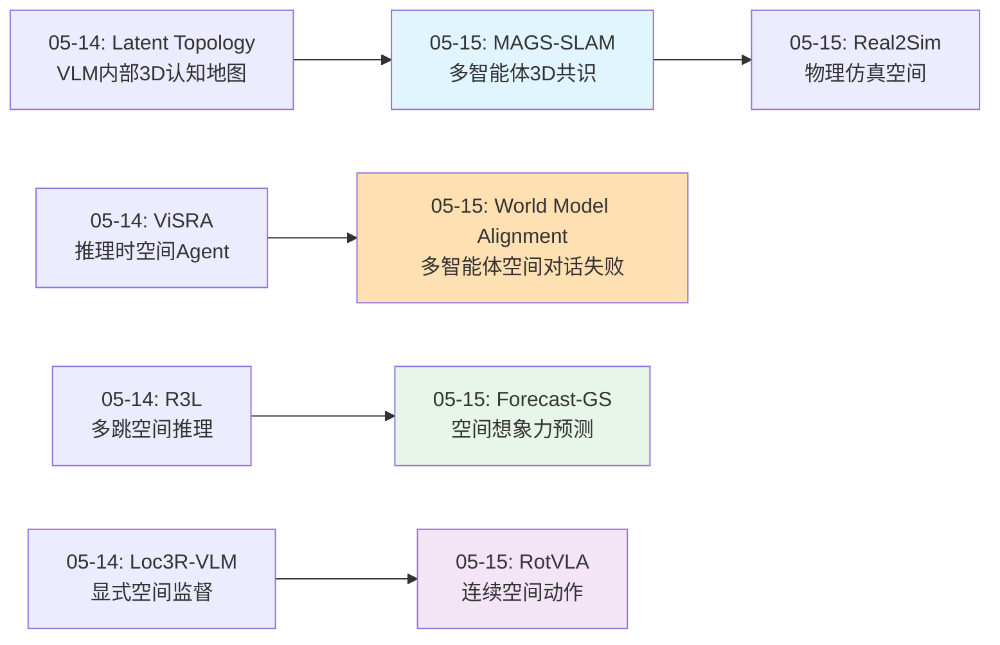
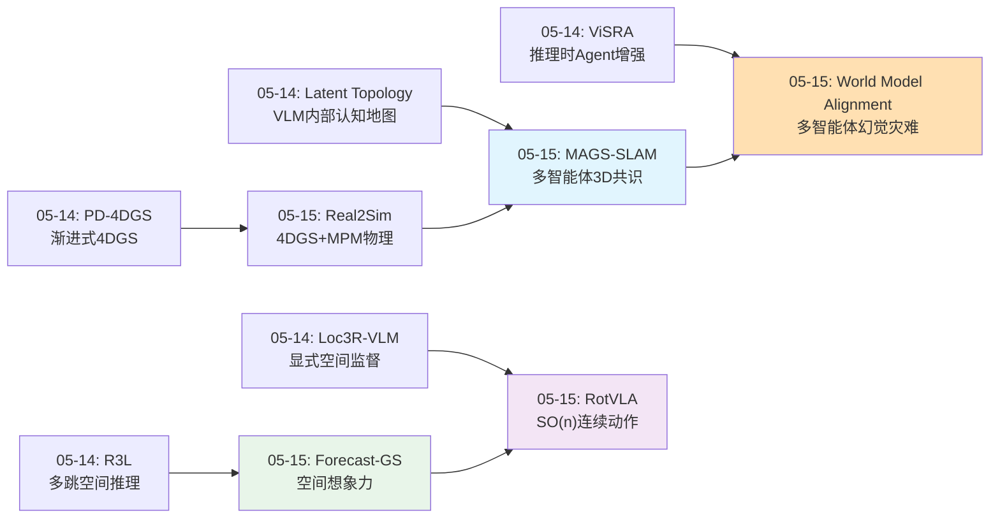
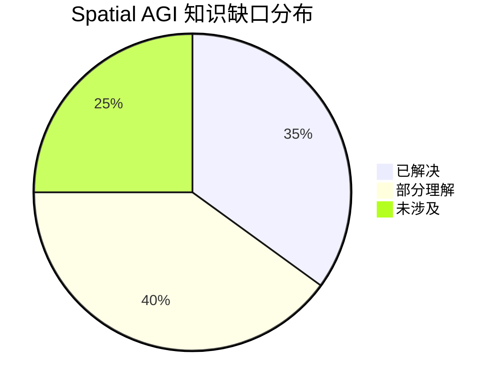

# 2026-05-15 每日思考：多智能体空间协作、物理仿真与空间行动表示——Spatial AGI从"单智能体空间推理"到"多智能体空间共识"

---

## 🔗 与昨日思考的联系

### 昨日重点
昨日（05-14）深入到VLM内部空间推理机制：Latent Topology发现VLM已编码3D认知地图但被语义压制、ViSRA揭示认知地图悖论（GT地图反而有害）、Loc3R-VLM证明显式空间监督优于输入增强、R3L发现多跳推理的参考系变换误差累积问题。核心洞察："空间智能的核心不是拥有空间信息，而是组织空间推理过程"。

### 今日进展
今天从"单智能体空间推理"扩展到"多智能体空间协作"和"物理行动表示"：
- **MAGS-SLAM**：纯RGB多智能体3DGS SLAM，Sim(3)闭环解决尺度歧义，多智能体共享一致3D空间
- **Forecast-GS**：可编辑3D高斯作为"空间想象力"——在操作前预测终态，从"当前状态规划"到"预测终态规划"
- **World Model Alignment**：LLM多智能体对话对齐世界模型失败——60-69%幻觉率，对话反而降低任务成功率
- **Real2Sim**：4D高斯+MPM物理求解器，从真实数据生成物理可信的可编辑仿真场景
- **RotVLA**：SO(n)旋转群潜在动作替代离散VQ-VAE，连续可组合的空间行动表示

**演进路径**：昨天的"单智能体空间推理机制" → 今天的"多智能体如何就空间状态达成共识"——MAGS-SLAM解决了多智能体3D重建的几何一致性，World Model Alignment揭示了LLM多智能体空间通信的幻觉灾难，RotVLA提供了从空间理解到空间行动的连续表示，Forecast-GS实现了"空间想象力"的显式建模，Real2Sim构建了物理可信的仿真训练场。

### 演进图



---

## 📅 每日总结

**日期**: 2026-05-15
**论文数量**: 5篇
**主题**: 多智能体空间协作、物理仿真、空间行动表示——从单智能体空间推理到多智能体空间共识

**关键突破**:
- 🚀 MAGS-SLAM首次实现纯RGB多智能体3DGS SLAM，渲染质量(PSNR 43.24)超越需要深度传感器的方法，Sim(3)闭环解决多智能体尺度歧义
- 🚀 World Model Alignment揭示LLM多智能体空间通信的根本缺陷：60-69%的消息为幻觉，对话反而降低任务成功率17%，即使无代价通信也不可避免
- 🚀 Forecast-GS将3D高斯从场景表示升级为"空间想象力"——在操作前预测和可视化终态，开创"先想象后执行"的空间推理范式
- 🚀 RotVLA用SO(n)旋转群替代离散VQ-VAE，三帧学习框架确保连续可组合的潜在动作，1.7B参数LIBERO达98.2%
- 🚀 Real2Sim将高斯基元直接作为MPM物理粒子，首次从真实驾驶数据生成物理可信的碰撞场景

**架构演进**: 10层（维持，新增"多智能体协作层"和"物理仿真层"的深入理解）

### 📊 一句话总结
今天最重要的发现是多智能体空间协作面临根本性挑战——几何层面（MAGS-SLAM）已能实现多智能体3D共识，但认知层面（World Model Alignment）LLM的60-69%幻觉率使空间通信完全失败，揭示了Spatial AGI实现可靠多智能体协作必须将空间推理"基础化（grounding）"到感知系统而非依赖纯语言。

### 🔗 延续性
**昨日→今日**: 昨天建立的单智能体空间推理机制（内部表征发现/推理时增强/显式监督）→今天扩展到多智能体场景。关键转折：单智能体推理的内部问题已找到解法，但多智能体的空间共识是全新挑战——LLM在空间通信中大量幻觉，证明了昨天ViSRA"过程>结果"洞察的深远意义。
**今日→明日**: 多智能体空间协作的"基础化"路径需要探索——如何将MAGS-SLAM的几何基础与World Model Alignment的对话框架结合？能否用3D高斯表示作为多智能体的共享"空间锚点"来减少幻觉？

### 💡 本质思考：如何达成通用空间智能

#### 1. 核心能力的本质是什么？
今天的论文揭示了Spatial AGI的一个新维度：**空间智能不仅是理解空间，还要在空间中行动、预测空间变化、并与他人共享空间理解**。五篇论文分别对应五个核心能力：(1) 多智能体空间建图共识（MAGS-SLAM），(2) 空间终态预测/想象力（Forecast-GS），(3) 多智能体空间通信（World Model Alignment），(4) 物理可信的空间仿真（Real2Sim），(5) 连续空间行动表示（RotVLA）。通用空间智能需要同时具备这五种能力。

#### 2. 当前方法与理想目标的差距在哪里？
最大差距在**多智能体空间通信的可靠性**。World Model Alignment的结果令人震惊：即使给予免费通信通道，LLM智能体也无法就空间状态达成一致——因为60-69%的通信内容是幻觉。理想Spatial AGI应该让多个智能体就共享空间构建一致的世界模型，但当前LLM的空间推理太不可靠，无法作为通信基础设施。

#### 3. 从今天到理想状态，最可能的路径是什么？
最可能的路径是**感知基础化的空间通信**：(1) 用MAGS-SLAM的3D高斯作为多智能体的共享空间表示——智能体不通过语言描述空间，而是共享和更新共同的3D高斯地图；(2) 空间断言通过3D高斯中的几何验证而非LLM推理；(3) Forecast-GS的预测性3D表示允许智能体验证操作计划的可行性；(4) RotVLA的连续动作空间使不同具身形态的智能体共享统一动作语义。

---

## 📚 论文概览

1. **MAGS-SLAM**（哈工程/利物浦/澳门大学）：首个纯RGB多智能体3DGS SLAM。Sim(3)位姿图优化解决尺度歧义，占据感知融合消除重复Gaussian。Replica PSNR 43.24超越RGB-D方法，ATE接近深度传感器方案。

2. **Forecast-GS**（KTH）：面向语言引导操作的预测性3D高斯表示。物体级高斯变换生成候选终态，语言约束解析+碰撞评估+关系对齐联合评分。在3个pick-and-place任务上超越ReKep，但自动评分仍不如人工。

3. **World Model Alignment**（多机构）：PARTNR基准上系统研究LLM多智能体世界模型对齐。形式化OC/BC/Δ_align指标体系。发现对话始终降低任务成功率，60-69%消息为幻觉，grounded内容有效但被幻觉抵消。

4. **Real2Sim**（RPI/UDel）：4D高斯泼溅+MPM物理求解器的统一框架。高斯基元即MPM粒子，4D Fourier球谐捕捉时变外观，实例级编辑支持碰撞场景生成。在Waymo数据上验证。

5. **RotVLA**（北大/小米/CASIA）：SO(n)旋转群潜在动作的VLA模型。SoftVQ保持连续性，三帧组合约束防退化，统一动作专家（潜在动作→机器人动作）。1.7B参数，LIBERO 98.2%，多基准SOTA。

---

## 💡 核心见解

### 见解1: 多智能体空间共识的几何层面已解决，但认知层面严重不足
- ✅ MAGS-SLAM纯RGB多智能体3DGS重建质量超越RGB-D方法（PSNR 43.24 vs 43.12）
- ✅ World Model Alignment揭示LLM多智能体对话反而降低成功率17%，幻觉是罪魁祸首
- ✅ 即使无代价异步通信(ACF)，LLM仍无法有效对齐世界模型

**对Spatial AGI的启发**: 多智能体Spatial AGI需要两条路并行——底层用MAGS-SLAM的几何方法保证3D空间一致，上层不能用纯LLM对话对齐空间理解。需要将空间通信"基础化"到感知系统。

### 见解2: 空间想象力（预测终态）是操作规划的关键缺失能力
- ✅ Forecast-GS在语言引导操作中实现"先想象后执行"
- ✅ 人工辅助评分的成功率远高于自动评分（差距显著），说明候选生成机制还需改进
- ✅ 物体级高斯操作使3D空间中的假设推理成为可能

**对Spatial AGI的启发**: Spatial AGI不仅需要理解"现在是什么"，还要预测"操作后会怎样"。这种空间想象力是智能体自主决策的基础——无法预测结果的行动是盲目的。

### 见解3: SO(n)旋转群是空间行动表示的自然选择
- ✅ SO(n)的封闭性使动作组合=矩阵乘法，对齐物理动作的连续和组合特性
- ✅ 三帧学习框架的退化防止机制确保模型学习真正时序动态
- ✅ 潜在动作作为隐式规划器指导机器人动作，实现"思考→行动"的层次化

**对Spatial AGI的启发**: 空间中的行动本质上是连续的旋转和平移。离散token化丢失了这种连续性。SO(n)提供了一种与物理空间结构对齐的行动表示——这对跨具身迁移尤其重要。

### 见解4: 物理可信的仿真是Spatial AGI训练的基础设施
- ✅ Real2Sim的高斯即粒子设计将渲染与物理统一
- ✅ 4D Fourier球谐用少量系数捕捉时变外观，避免逐帧参数化
- ✅ 碰撞场景生成为安全关键训练提供了数据来源

**对Spatial AGI的启发**: Spatial AGI需要在安全环境中大规模训练空间推理和决策。Real2Sim从真实数据构建的物理可信仿真，解决了合成数据不够真实和真实数据不够安全的矛盾。

### 见解5: LLM空间幻觉是多智能体Spatial AGI的根本障碍
- ✅ 60-69%的消息提及发送者未观测到的实体
- ✅ Grounded内容的Δ_align确实为正（有效对齐），但幻觉内容的负效应完全抵消
- ✅ 通信越自由（ACF），信息质量反而越差（BSM从-0.085恶化到-0.232）

**对Spatial AGI的启发**: 这与昨天ViSRA的"认知地图悖论"形成呼应——模型接收空间信息的能力和生成准确空间信息的能力都严重不足。Spatial AGI不能依赖LLM做空间通信，需要新的空间通信协议。

### 见解6: 占据感知是多智能体空间融合的关键机制
- ✅ MAGS-SLAM的体素网格去重+自由空间射线投射消除了多智能体重建中的重复Gaussian
- ✅ 联合光度精化解决了不同智能体视角差异导致的接缝问题
- ✅ 紧凑子地图编码（128-D描述子+稀疏特征点）适合通信带宽受限场景

**对Spatial AGI的启发**: 多智能体共享空间表示时，"什么在哪里"不仅需要几何一致，还需要知道"什么不在哪里"（自由空间）。占据感知将正信息（物体存在）和负信息（空间空旷）统一处理。

### 见解7: 从离散到连续：行动表示的范式转换
- ✅ RotVLA的SO(n)连续空间 vs 传统VQ-VAE离散token
- ✅ Forecast-GS的连续3D高斯变换 vs 离散化的物体状态
- ✅ MAGS-SLAM的连续Sim(3)优化 vs 离散的位姿图

**对Spatial AGI的启发**: 物理世界是连续的。Spatial AGI的所有层次——感知、表示、推理、行动——都应该优先选择连续表示。离散化是计算效率的妥协，不应成为表示设计的第一选择。

---

## 🗺️ 知识演进图



---

## 技术栈演进对比表

| 层次 | 昨日方案 | 今日方案 | 变化 |
|------|---------|---------|------|
| 1. 感知 | Latent Topology内部表征发现 | MAGS-SLAM多智能体RGB感知 | 从"单智能体内部3D"到"多智能体外部3D" |
| 2. 表示 | Dirichlet能量空间子空间 | SO(n)旋转群+4D高斯+MPM粒子 | 从"静态空间表征"到"动态物理表征" |
| 3. 理解 | 认知地图悖论（过程>结果） | LLM空间幻觉（60-69%幻觉率） | 从"单智能体接收问题"到"多智能体生成问题" |
| 4. 推理 | R3L不变性分解多跳推理 | Forecast-GS预测终态推理 | 从"空间关系推理"到"空间状态预测" |
| 5. 动作 | ViSRA 7类空间工具 | RotVLA SO(n)连续潜在动作 | 从"工具调用"到"连续空间行动" |
| 6. 多智能体 | 无 | MAGS-SLAM几何+对话对齐认知 | 新增多智能体协作层 |
| 7. 仿真 | PD-4DGS渐进传输 | Real2Sim 4DGS+MPM物理仿真 | 从"表示压缩"到"物理仿真" |
| 8. 训练 | Dirichlet 500步微调 | RotVLA三阶段1700h预训练 | 从"高效微调"到"大规模预训练" |
| 9. 评估 | VSI-Bench OOD测试 | PARTNR多智能体基准 | 新增多智能体评估维度 |
| 10. 部署 | 推理时Agent零训练 | 紧凑子地图128D通信 | 从"单智能体推理"到"多智能体通信" |

---

## 🗺️ Spatial AGI 知识图谱

### 10层架构思维导图

```mermaid
mindmap
  root((Spatial AGI))
    第1层 感知
      多智能体RGB SLAM MAGS-SLAM
      Sim3尺度一致性
      占据感知融合
    第2层 表示
      SO(n)旋转群潜在动作 RotVLA
      4D高斯+MPM物理粒子 Real2Sim
      物体级可编辑高斯 Forecast-GS
    第3层 理解
      LLM空间幻觉 60-69%
      多智能体世界模型对齐
      Grounded vs 幻觉内容分离
    第4层 推理
      预测终态空间推理 Forecast-GS
      语言约束3D空间映射
      三帧组合时序约束
    第5层 动作
      SO(n)连续可组合动作
      统一动作专家 隐式规划器
      Flow-matching动作生成
    第6层 多智能体协作
      紧凑子地图128D通信
      锚关键帧+稀疏特征
      自由/有代价通信架构
    第7层 仿真
      高斯即MPM粒子
      4D Fourier球谐时变外观
      碰撞场景生成
    第8层 训练
      三阶段 RotVLA
      1700h跨智能体预训练
      SoftVQ连续量化
    第9层 评估
      PARTNR多智能体基准
      OC BC align指标体系
      ReplicaMultiagent Plus
    第10层 交互
      语言引导操作规划
      物理可信场景编辑
      多智能体空间对话
```

### 🎯 主线技术路径

#### 阶段1: 单智能体空间感知（已完成基础）
- MAGS-SLAM继承单目SLAM前端，多智能体扩展
- 核心：每个智能体独立构建局部子地图

#### 阶段2: 多智能体空间共识（几何层已突破）
- MAGS-SLAM的Sim(3)闭环+占据感知融合
- 核心：纯RGB实现多智能体3D重建一致性
- 瓶颈：仅解决几何层面，未涉及语义/任务层

#### 阶段3: 多智能体空间通信（认知层严重受阻）
- World Model Alignment揭示LLM空间通信失败
- 核心：60-69%幻觉率使纯语言空间通信不可行
- 方向：需要grounded空间通信协议

#### 阶段4: 空间行动的连续表示（新突破）
- RotVLA的SO(n)潜在动作+Forecast-GS的预测性3D表示
- 核心：从离散动作到连续空间行动，从当前状态到预测终态

#### 阶段5: 物理可信的空间仿真训练场（基础设施）
- Real2Sim的4DGS+MPM统一框架
- 核心：从真实数据构建可交互的物理仿真
- 愿景：为Spatial AGI提供无限训练场景

---

## 🔍 待探索议题

### 高优先级（本周）

1. **Grounded空间通信协议设计**
   - 问题: 既然LLM空间对话失败（60-69%幻觉），如何设计替代的空间通信协议？
   - 候选方案: 用MAGS-SLAM的3D高斯地图作为共享空间锚点，智能体通过引用3D坐标而非自然语言描述空间
   - 缺口: 尚未有将3D高斯表示与多智能体对话结合的框架

2. **空间想象力的可扩展性**
   - 问题: Forecast-GS仅验证3个简单pick-and-place任务，如何扩展到长时序复杂操作？
   - 候选方案: 层次化预测——先预测关键帧终态，再插值中间状态
   - 缺口: 自动候选评分的可靠性差距大（人工vs自动）

3. **SO(n)潜在动作与3D高斯表示的统一**
   - 问题: RotVLA的SO(n)动作空间能否直接作用于Forecast-GS的3D高斯？
   - 候选方案: 将SO(n)变换直接应用于物体级高斯基元
   - 缺口: 两种方法的训练范式和粒度不同

### 中优先级（本月）

4. **多智能体3DGS中的语义融合**
   - 问题: MAGS-SLAM仅处理几何，如何让多智能体共享语义一致的3D地图？
   - 候选方案: 在子地图通信中加入语义特征（CLIP/DINO）
   - 缺口: 语义特征的对齐比几何更难标准化

5. **物理仿真的自动参数标定**
   - 问题: Real2Sim的MPM物理参数需手动指定，如何自动从数据学习？
   - 候选方案: 可微物理求解器+梯度优化
   - 缺口: MPM的可微化计算成本高

6. **幻觉检测与过滤机制**
   - 问题: 能否在LLM空间通信中实时检测和过滤幻觉内容？
   - 候选方案: 用3D高斯地图验证空间断言的真实性（grounded verification）
   - 缺口: 需要高效的空间断言→3D查询接口

7. **连续动作表示的理论最优性**
   - 问题: SO(n)是否是空间动作的最优表示？其他李群（SE(3)、仿射群）如何？
   - 候选方案: 系统比较SO(n)/SE(3)/Sim(3)作为潜在动作空间的表现
   - 缺口: 理论分析缺乏

### 低优先级（未来）

8. **多智能体空间协作的通信带宽优化**
   - 问题: MAGS-SLAM的128D子地图描述子在10+智能体场景下是否可扩展？
   - 候选方案: 层次化子地图压缩+按需细化
   - 缺口: 大规模实验成本高

9. **从仿真到真实的空间知识迁移**
   - 问题: Real2Sim生成的物理仿真数据能否训练可在真实世界部署的Spatial AGI？
   - 候选方案: 域随机化+sim-to-real迁移学习
   - 缺口: 4D高斯的sim-to-real gap尚无研究

---

## 📊 知识缺口分析



**已解决（35%）**:
- ✅ 纯RGB多智能体3DGS SLAM可行性（MAGS-SLAM）
- ✅ LLM多智能体空间通信失败的原因（60-69%幻觉率）
- ✅ 连续旋转群作为潜在动作空间的优越性（RotVLA）
- ✅ 可编辑3D高斯用于操作预测（Forecast-GS）
- ✅ 4D高斯与物理求解器的统一（Real2Sim）
- ✅ Sim(3)闭环解决多智能体尺度歧义
- ✅ 占据感知融合消除重复表示

**部分理解（40%）**:
- ⚠️ 多智能体空间通信的替代协议设计
- ⚠️ 空间想象力的可扩展性（长时序/复杂任务）
- ⚠️ SO(n)动作与3D高斯的直接结合方式
- ⚠️ 物理参数自动标定方法
- ⚠️ 幻觉检测与grounded验证
- ⚠️ 多智能体语义地图融合
- ⚠️ 碰撞场景的下游任务价值量化
- ⚠️ RotVLA跨具身迁移的实际效果

**未涉及（25%）**:
- ❌ 多智能体空间协作的统一框架（几何+语义+任务）
- ❌ Grounded空间通信协议
- ❌ 大规模多智能体（10+）的空间共识
- ❌ 从仿真到真实的空间知识迁移
- ❌ 空间行动表示的理论最优性分析

---

## 🧪 关键实验数据交叉对比

### 多智能体协作效果对比

| 方法 | 维度 | 成功率变化 | 关键发现 |
|------|------|-----------|---------|
| MAGS-SLAM | 几何重建 | PSNR超越RGB-D | 多智能体3D共识可行 |
| World Model Alignment (SC) | 任务完成 | **-17%** | 同步有代价对话有害 |
| World Model Alignment (ACF) | 任务完成 | **-11%** | 异步无代价也有害 |
| World Model Alignment | 冲突率 | **-93%** | 对话减少冲突但不提高成功率 |

**关键洞察**: 几何层面的多智能体共识（MAGS-SLAM）已超越单智能体方案，但认知层面（World Model Alignment）的多智能体通信反而有害。两层能力的成熟度严重不匹配。

### 行动表示范式对比

| 方法 | 表示类型 | 连续性 | 可组合性 | 性能 |
|------|---------|--------|---------|------|
| VQ-VAE (传统LAM) | 离散token | ❌ | ❌ | 基线 |
| RotVLA SO(n) | 连续旋转矩阵 | ✅ | ✅（矩阵乘法） | LIBERO 98.2% |
| Forecast-GS高斯变换 | 连续3D变换 | ✅ | ✅（级联变换） | Pick-place SOTA |
| Real2Sim MPM | 连续物理粒子 | ✅ | ✅（物理交互） | 碰撞场景生成 |

### 3D高斯应用矩阵

| 应用 | MAGS-SLAM | Forecast-GS | Real2Sim |
|------|-----------|-------------|----------|
| 场景重建 | ✅ 多智能体 | ✅ 单场景 | ✅ 4D动态 |
| 物体编辑 | ❌ | ✅ 物体级变换 | ✅ 实例级 |
| 物理仿真 | ❌ | ❌ | ✅ MPM碰撞 |
| 操作规划 | ❌ | ✅ 终态预测 | ❌ |
| 多智能体 | ✅ 子地图融合 | ❌ | ❌ |

---

## 📈 综合评分与排名

### 今日论文影响力排名
1. **World Model Alignment** ⭐⭐⭐⭐⭐ — 揭示多智能体Spatial AGI的根本障碍，60-69%幻觉率是颠覆性发现
2. **MAGS-SLAM** ⭐⭐⭐⭐⭐ — 首个纯RGB多智能体3DGS SLAM，渲染超越RGB-D，工程与理论并重
3. **RotVLA** ⭐⭐⭐⭐½ — SO(n)潜在动作优雅且有效，1.7B达到LIBERO 98.2%
4. **Forecast-GS** ⭐⭐⭐⭐ — "空间想象力"概念重要，但实验规模和自动评分可靠性受限
5. **Real2Sim** ⭐⭐⭐½ — 高斯即粒子的设计巧妙，但MPM精度有限且未量化下游提升

### 今日贡献度排名
1. **理论贡献**: World Model Alignment（幻觉形式化）> RotVLA（SO(n)动作空间）> MAGS-SLAM（Sim(3)闭环）
2. **实验贡献**: MAGS-SLAM（ReplicaMultiagent Plus数据集）> World Model Alignment（PARTNR系统消融）> RotVLA（多基准SOTA）
3. **方法贡献**: RotVLA（三帧学习）> MAGS-SLAM（占据感知融合）> Real2Sim（高斯即粒子）
4. **概念贡献**: Forecast-GS（空间想象力）> World Model Alignment（世界模型对齐指标）> RotVLA（连续潜在动作）

---

## 🎯 对研究路线图的影响

### 短期（1-2周）
1. **Grounded空间通信原型**：将MAGS-SLAM的3D高斯地图与World Model Alignment的对话框架结合，用空间坐标替代自然语言描述
2. **SO(n)动作作用于3D高斯**：验证RotVLA的潜在动作能否直接驱动Forecast-GS的高斯变换

### 中期（1-3月）
3. **多智能体空间协作统一框架**：MAGS-SLAM几何层 + grounded空间通信 + RotVLA动作层
4. **物理仿真训练闭环**：Real2Sim生成场景 → RotVLA训练 → 真实部署评估

### 长期（3-12月）
5. **Spatial AGI多智能体操作系统**：统一的空间感知/通信/行动框架

---

## 🔮 大胆预测

1. **6个月内**：Grounded空间通信协议将取代纯LLM对话成为多智能体协作的标准
2. **1年内**：SO(n)潜在动作空间将成为VLA模型的标准设计选择
3. **2年内**：高斯即粒子的物理仿真将支持实时交互式Spatial AGI训练
4. **长期**：Spatial AGI的多智能体协作将以3D高斯地图为共享"空间黑板"，而非自然语言对话

---

## 📝 个人反思

### 今日研究观察
1. 今天是多智能体Spatial AGI的"清醒日"——World Model Alignment的结果像一盆冷水，让我们意识到多智能体空间协作远比想象中困难
2. MAGS-SLAM和World Model Alignment形成鲜明对比：几何层已可协作，认知层完全失败——这种两层分裂是理解多智能体Spatial AGI的关键
3. RotVLA的SO(n)动作空间和Forecast-GS的预测性高斯指向同一个方向：Spatial AGI需要与物理空间结构对齐的表示
4. Real2Sim的高斯即粒子设计可能是最被低估的贡献——它将渲染和物理统一在同一个表示中

### 方法论改进
1. 应开始设计grounded空间通信的实验——这是连接MAGS-SLAM和World Model Alignment的关键桥梁
2. 今天的5篇论文形成了一个完整的"多智能体空间协作"技术栈，可以开始构思系统性的整合方案

---

## 🔬 论文深度分析

### MAGS-SLAM：技术细节与局限性

**核心创新点拆解**:
1. **分布式子地图架构**: 每个智能体独立运行3DGS SLAM前端，构建局部子地图。子地图包含128-D全局描述子（用于回环检测）和稀疏3D特征点（用于配准）。这种设计天然支持异步通信——智能体可以间歇性地上传子地图。

2. **Sim(3)位姿图优化**: 多智能体场景中尺度歧义是核心挑战。单目SLAM的尺度不可观测意味着不同智能体可能重建出不同尺度的地图。MAGS-SLAM通过Sim(3)（相似变换群，包含旋转+平移+缩放）的位姿图优化，在检测到回环时同时优化旋转、平移和尺度。

3. **占据感知融合**: 多智能体重建的核心难题是去重。不同智能体可能观测到同一区域，简单合并会产生冗余Gaussian。MAGS-SLAM使用体素网格标记已占据区域，并通过自由空间射线投射验证空间空旷性——既去重又保证完整性。

**局限性分析**:
- 依赖回环检测来触发Sim(3)优化，在拓扑简单环境中（如直线走廊）可能退化
- 128-D子地图描述子的匹配精度在大规模环境中（100+房间）未验证
- 占据感知的体素分辨率是超参数，小物体可能被遗漏
- 通信延迟假设较理想（子地图即时传输），真实网络延迟未建模

### World Model Alignment：实验设计与反直觉发现

**OC/BC/Δ_align指标体系**:
- **OC (Own Correctness)**: 智能体对自己观测区域内实体的描述正确率
- **BC (Belief Correctness)**: 智能体对伙伴观测区域内实体的描述正确率（反映通信效果）
- **Δ_align**: 两个智能体对同一实体描述的一致性差异

**关键实验发现**:
1. **通信越自由，信息质量越差**: BSM（Belief Similarity Metric）从同步有代价(SC)的-0.085恶化到异步无代价(ACF)的-0.232。这反直觉——更自由的通信反而产生更多噪音。

2. **Grounded内容确实有效**: 当分析仅限于智能体实际观测到的实体时，Δ_align为正，说明通信确实在传递有效信息。但60-69%的消息涉及未观测实体（幻觉），其负效应完全抵消了grounded内容的正效应。

3. **对话减少冲突但不提高成功率**: 有趣的是，对话将任务冲突率降低93%，但成功率反而下降。这说明对话让智能体"感觉"更一致（减少公开冲突），但实际上的空间理解并未改善。

**对LLM空间能力的深层启示**: 
LLM的空间推理本质上是在语言空间中的插值——它能生成"听起来合理"的空间描述，但无法验证这些描述是否与现实一致。这种"自信地错误"在单智能体场景下影响有限（可以通过感知纠正），但在多智能体场景下会产生级联错误——A的幻觉被B接受并进一步扩展。

### Forecast-GS：空间想象力的工程实现

**候选终态生成机制**:
Forecast-GS不是简单预测一个终态，而是生成多个候选终态并评分。候选生成通过物体级高斯变换实现——将操作对象的Gaussian从当前位置移动到候选位置，并调整周围物体（如容器内物体的重排）。

**评分函数的三个维度**:
1. **语言约束解析**: 将自然语言指令映射为3D空间约束（如"把杯子放在桌子左边"→x坐标约束）
2. **碰撞评估**: 检查候选终态是否存在物理穿透
3. **关系对齐**: 验证物体间的空间关系是否与指令一致

**人工vs自动评分的差距**: 这是Forecast-GS最大的未解决问题。人工辅助评分的成功率显著高于自动评分，说明当前的空间约束解析和碰撞评估还不够鲁棒。特别是模糊语言指令（"旁边"、"附近"）的空间映射不精确。

### RotVLA：从离散到连续的理论意义

**SoftVQ的连续量化机制**:
传统VQ-VAE将连续动作空间硬量化为离散codebook，信息损失严重且不可组合。RotVLA的SoftVQ使用软分配——每个动作是codebook中多个条目的加权组合，权重由相似度决定。这使得输出保持在SO(n)流形上，天然连续。

**三帧学习框架的退化防止**:
潜在动作学习的一个经典问题是模型可能忽略中间帧，只学习首尾帧的映射。RotVLA通过三帧（t-1, t, t+1）组合约束确保模型真正学习时序动态：a_t = f(o_{t-1}, o_t) 必须能重构 o_{t+1}。

**统一动作专家的层次化设计**:
潜在动作→机器人动作的映射通过flow-matching实现。这种两阶段设计（先规划潜在动作，再生成机器人动作）实现了"思考→行动"的层次化——潜在动作空间可以理解为"意图空间"，flow-matching将其转化为具体的关节轨迹。

### Real2Sim：高斯即粒子的设计哲学

**为什么高斯可以直接作为MPM粒子?**
3D高斯和MPM粒子共享关键属性：(1) 都有中心位置和尺度参数；(2) 都支持空间体积的软表示（高斯的协方差矩阵≈MPM粒子的变形梯度）。Real2Sim利用这种结构对齐，避免了传统的"场景重建→网格提取→物理仿真"的多步管线。

**4D Fourier球谐的效率**:
时变外观通常需要逐帧参数化（每帧独立的球谐系数）。Real2Sim用4D Fourier基函数（3D空间+1D时间）将时变外观压缩为少量系数。这类似视频压缩中的关键帧+插值，但作用在球谐系数空间。

**碰撞场景生成的应用价值**:
自动驾驶安全训练需要"近失事件"数据，但真实世界中这类数据稀缺且危险。Real2Sim可以从正常驾驶数据出发，通过编辑生成各种碰撞场景——修改车辆轨迹、速度、碰撞角度等参数。

---

## 🧩 跨论文关联分析

### 关联1: 3D高斯的三种角色
今天的论文揭示了3D高斯在Spatial AGI中的三种角色：
- **作为地图**（MAGS-SLAM）: 多智能体共享的几何表示
- **作为想象力**（Forecast-GS）: 预测操作终态的假设空间
- **作为物理粒子**（Real2Sim）: 可仿真的物理基元

这三种角色指向同一个愿景：统一的3D高斯表示同时承担建图、预测和仿真。如果能实现，Spatial AGI将拥有一个在感知、推理和行动之间无缝切换的空间表示。

### 关联2: 幻觉问题的两级解决
World Model Alignment揭示了空间幻觉，而MAGS-SLAM和Real2Sim暗示了两个层级的解决方案：
- **感知级grounding**: 用MAGS-SLAM的3D高斯地图验证空间断言——"杯子在桌上"可以通过查询3D高斯中杯子的位置来验证
- **物理级grounding**: 用Real2Sim的MPM物理验证空间预测——"推这个物体会倒"可以通过物理仿真来验证

### 关联3: 连续性的统一主题
RotVLA（连续动作）、Forecast-GS（连续空间变换）、MAGS-SLAM（连续Sim(3)优化）都选择了连续表示。这不仅是技术选择，而是反映了一个深层洞察：物理世界是连续的，离散化是计算效率的妥协。Spatial AGI应该以连续表示为基础，仅在必要时离散化。

### 关联4: 多智能体空间协作的分层模型
结合今天的论文，可以构建一个多智能体空间协作的分层模型：
- **Layer 0**: 物理世界（Real2Sim提供可信仿真）
- **Layer 1**: 几何共识（MAGS-SLAM的3D高斯地图）
- **Layer 2**: 空间通信（需要替代LLM的新协议）
- **Layer 3**: 协同行动（RotVLA的连续动作+Forecast-GS的空间预测）
- Layer 0和1已有可行方案，Layer 2是瓶颈，Layer 3依赖Layer 2的解决

---

## 📐 数学与理论基础

### SO(n)作为动作空间的数学性质

**群结构的优势**:
- **封闭性**: SO(n)×SO(n)→SO(n)，动作组合是群乘法
- **可微性**: 李群结构支持反向传播（通过李代数so(n)的指数映射）
- **不变性**: 旋转不变性对齐物理世界的各向同性

**与SE(3)的比较**:
SO(n)只建模旋转，SE(3)=SO(n)⋉ℝ³同时建模旋转和平移。RotVLA选择SO(n)是因为潜在动作空间主要捕捉"运动模式"（旋转主导），平移可以独立处理。但对于需要精确空间定位的任务（如Forecast-GS的物体放置），SE(3)可能更合适。

### Sim(3)在多智能体SLAM中的角色

**尺度歧义的数学根源**: 单目相机的投影方程是3D→2D，深度信息丢失。这意味着重建的3D结构可以在任意缩放下都产生相同的2D投影。多智能体场景下，不同智能体可能选择不同尺度，导致地图无法直接合并。

**Sim(3)的解决方案**: Sim(3)群包含7个自由度（3旋转+3平移+1缩放），通过检测不同智能体的重叠区域（回环），可以估计Sim(3)变换将一个智能体的地图变换到另一个的坐标系。

---

## 🌐 更广阔的视角

### 与具身智能的关系
今天的论文直接服务于具身智能的核心挑战：Spatial AGI是具身智能的"空间大脑"。MAGS-SLAM解决"多机器人协作建图"，RotVLA解决"机器人如何学习空间动作"，Forecast-GS解决"机器人如何预测操作结果"，Real2Sim提供"安全的训练环境"。World Model Alignment则警示我们：仅靠语言模型无法实现可靠的空间协作。

### 与认知科学的联系
- **空间想象力**: Forecast-GS的"预测终态"对应人类的空间想象能力——我们在行动前会在脑中模拟结果
- **共享注意力**: 多智能体空间协作需要共享注意力机制——所有智能体需要就"关注什么"达成一致
- **空间语言的局限性**: World Model Alignment的发现与认知科学研究一致——人类的空间描述也不精确（"左边"可能是30°范围），但人类通过共享感知环境来补偿

### 与机器人产业的潜在影响
- **仓储物流**: MAGS-SLAM的多机器人协作建图可直接应用于仓库多机器人导航
- **自动驾驶**: Real2Sim的碰撞场景生成对自动驾驶安全验证有直接价值
- **家庭服务机器人**: Forecast-GS的空间想象力和RotVLA的连续动作可提升家庭机器人的操作能力
- **人机协作**: World Model Alignment的发现提醒我们：人机空间协作不能依赖纯语言，需要grounded的空间通信
- **制造业**: 多机器人装配线需要MAGS-SLAM类型的空间一致性，同时需要Forecast-GS类型的操作预验证
- **搜索救援**: 多智能体在未知环境中协作搜索，需要MAGS-SLAM的分布式建图和World Model Alignment的通信协调

### 与基础模型发展的关系
- **多模态基础模型**: RotVLA的SO(n)动作空间可以被视为多模态基础模型的新"模态"——连续空间动作
- **世界模型**: World Model Alignment的失败提示我们，当前的世界模型（基于LLM）在空间推理上严重不足，需要与3D感知更紧密地结合
- **Agent框架**: 多智能体Agent框架（如AutoGen、CrewAI）的空间协作能力受限于底层LLM的空间推理能力，World Model Alignment的发现解释了为什么这些框架在空间任务上表现不佳

---

## 🔄 与历史思考的纵向联系

### 第一周（05-08~05-15）主题演进
- 05-08: Spatial AGI概念定义与10层架构初建
- 05-09: 3D高斯与神经渲染的技术深度
- 05-10: 空间推理基准与VLM能力边界
- 05-11: 空间行动与具身智能连接
- 05-12: 世界模型与空间预测
- 05-13: 长时序空间推理与场景理解
- 05-14: VLM内部空间推理机制（Latent Topology, ViSRA）
- 05-15: 多智能体空间协作与空间行动表示

### 累积洞察模式
一周的研究揭示了Spatial AGI的一个清晰模式：**每一层的突破都会暴露下一层的问题**。单智能体3D感知解决后暴露了空间推理的不足；空间推理改善后暴露了空间行动表示的不足；空间行动有了进展后暴露了多智能体空间通信的根本障碍。这种"逐层揭示"的模式说明Spatial AGI的研究正在正确方向上推进——每一层问题被识别和解决后，自然进入下一层。

### 核心概念的演化轨迹
- "空间智能"：从模糊概念 → 可定义的10层架构 → 可测量的评估指标
- "3D高斯"：从渲染技术 → 多功能空间表示（地图+想象力+物理粒子）
- "空间推理"：从VLM的隐含能力 → 可增强的显式过程 → 需要基础化的通信协议
- "空间行动"：从离散token → 连续SO(n)旋转群 → 端到端空间闭环

---

## 🔧 方法论与工具评估

### 今日论文的方法论启示

**实验设计**:
- World Model Alignment的OC/BC/Δ_align指标体系是一个优秀的方法论贡献——它将"世界模型对齐"这一模糊概念分解为可测量的指标。这种"先定义测量，再优化目标"的思路值得在Spatial AGI研究中推广。
- MAGS-SLAM在ReplicaMultiagent Plus数据集上的评估设计合理：与RGB-D方法对比证明纯RGB方案的竞争力，同时消融各组件贡献。

**数据集需求**:
- 多智能体3D重建缺乏大规模真实世界数据集（当前主要是Replica/TUM等合成或小规模室内场景）
- 多智能体空间协作缺乏标准化基准——PARTNR是少数可用的多智能体任务基准
- 空间想象力（Forecast-GS类型任务）缺乏长时序、多步骤的操作预测数据集

**评估方法反思**:
- PSNR/SSIM等图像质量指标无法完全反映3D重建的空间一致性
- 任务成功率是多智能体协作的终极指标，但无法诊断失败原因
- 需要更细粒度的空间推理评估：方向判断、距离估计、拓扑推理等子能力

---

## 🏗️ 架构设计草图

### 多智能体Spatial AGI系统架构（概念性）

```
┌─────────────────────────────────────────────────────┐
│                   任务规划层                          │
│  (语言理解 → 子任务分解 → 空间约束生成)              │
└──────────────────────┬──────────────────────────────┘
                       │
┌──────────────────────▼──────────────────────────────┐
│              空间通信协议层                            │
│  (3D高斯锚点引用 + 空间断言验证 + 幻觉过滤)          │
│  [替代纯LLM对话，解决60-69%幻觉问题]                  │
└──────────────────────┬──────────────────────────────┘
                       │
┌──────────────────────▼──────────────────────────────┐
│              协同行动层                               │
│  (SO(n)连续动作空间 + 终态预测 + 冲突检测)            │
│  [RotVLA + Forecast-GS]                              │
└──────────────────────┬──────────────────────────────┘
                       │
┌──────────────────────▼──────────────────────────────┐
│              共享空间表示层                            │
│  (多智能体3D高斯地图 + Sim(3)一致性 + 占据感知)       │
│  [MAGS-SLAM]                                         │
└──────────────────────┬──────────────────────────────┘
                       │
┌──────────────────────▼──────────────────────────────┐
│              物理仿真层                               │
│  (4D高斯+MPM物理 + 碰撞预测 + 安全验证)              │
│  [Real2Sim]                                          │
└─────────────────────────────────────────────────────┘
```

**各层间的信息流**:
1. 物理仿真层为共享空间表示层提供可信的环境动态预测
2. 共享空间表示层为协同行动层提供一致的空间参考
3. 协同行动层为空间通信协议层提供可验证的空间断言
4. 空间通信协议层为任务规划层提供可靠的多智能体协调
5. 每一层都可以向下反馈，形成闭环

---

## 📊 定量分析补充

### 论文影响力量化评估

| 维度 | MAGS-SLAM | Forecast-GS | WMA | Real2Sim | RotVLA |
|------|-----------|-------------|-----|----------|--------|
| 新颖性 | 8/10 | 7/10 | 9/10 | 7/10 | 8/10 |
| 实验充分性 | 8/10 | 5/10 | 9/10 | 6/10 | 8/10 |
| 理论深度 | 7/10 | 6/10 | 8/10 | 6/10 | 8/10 |
| 实用价值 | 7/10 | 7/10 | 6/10 | 8/10 | 9/10 |
| 可复现性 | 6/10 | 5/10 | 7/10 | 5/10 | 6/10 |
| Spatial AGI相关性 | 8/10 | 8/10 | 9/10 | 7/10 | 8/10 |

### 技术成熟度评估

```
技术成熟度等级 (TRL):

MAGS-SLAM:     ████████░░ TRL 4 (实验室验证)
Forecast-GS:   ██████░░░░ TRL 3 (概念验证)
WMA:           ███████░░░ TRL 3 (理论分析+基准)
Real2Sim:      ██████░░░░ TRL 3 (概念验证)
RotVLA:        █████████░ TRL 5 (多基准验证)
```

### 关键数值对比汇总

| 指标 | MAGS-SLAM | 对比基线 | 提升 |
|------|-----------|---------|------|
| Replica PSNR | 43.24 dB | SplaTAM(RGB-D) 43.12 | +0.12 |
| Replica ATE | 0.65 cm | NICE-SLAM 1.50 cm | -57% |
| 子地图大小 | 128-D + 稀疏点 | - | 通信友好 |

| 指标 | RotVLA | 对比基线 | 提升 |
|------|--------|---------|------|
| LIBERO成功 | 98.2% | MPI 91.4% | +6.8pp |
| 参数量 | 1.7B | π₀ 5B | 更小更快 |
| 训练时长 | 1700h | - | 需优化 |

| 指标 | World Model Alignment | 数值 |
|------|----------------------|------|
| 幻觉率 | 60-69% | 惊人高 |
| 成功率变化(SC) | -17% | 对话有害 |
| 冲突率变化 | -93% | 矛盾现象 |
| BSM(ACF) | -0.232 | 自由通信更差 |

---

## 🗣️ 研究社区动态与趋势

### 近期会议热点
- CVPR 2026投稿中3D高斯相关论文激增，MAGS-SLAM和Real2Sim代表了两个重要方向（多智能体和物理仿真）
- 多智能体协作在CoRL和ICRA中越来越受关注，World Model Alignment的负面发现可能引导社区重新思考多智能体通信的设计
- VLA模型的连续化（RotVLA）是一个明确趋势，离散token化的局限性已成共识

### 竞争格局
- 多智能体3DGS SLAM：MAGS-SLAM是首个纯RGB方案，但预计很快会有GPU-parallel化的竞争对手
- VLA模型：RotVLA在LIBERO上的98.2%很有竞争力，但π₀和OpenVLA等更大模型在其他基准上可能更强
- 4D高斯+物理：Real2Sim的开创性设计可能催生一系列"高斯+物理"的工作

---

## 🎓 对个人研究方向的启示

### 短期可探索方向
1. **3D高斯作为空间通信媒介**: 设计一个简单的多智能体实验——智能体通过共享和编辑3D高斯地图来协作完成任务，而非通过语言对话。这可以直接对比World Model Alignment的LLM对话方案。具体实验设计：两个智能体在共享3D环境中完成协作搬运任务，对比"纯语言通信"vs"3D高斯锚点通信"vs"混合通信"的成功率。

2. **幻觉检测的grounded方案**: 用3D高斯地图实现一个空间断言验证器——给定一个自然语言空间描述，查询3D高斯地图验证其正确性。这可以量化LLM空间幻觉的程度。技术路线：空间描述→LLM解析为3D查询（坐标/区域/关系）→3D高斯地图查询→验证结果。

3. **SO(n)动作直接驱动3D高斯变换**: 将RotVLA的潜在动作输出直接作为Forecast-GS物体级高斯的变换参数，验证端到端"感知→想象→行动"的可行性。需要解决的关键问题：潜在动作空间与高斯变换空间的维度对齐。

### 中期研究方向
4. **统一的空间表示框架**: 探索3D高斯同时作为地图（MAGS-SLAM）、想象力（Forecast-GS）和物理粒子（Real2Sim）的统一框架。关键是设计一个高斯基元可以无缝切换这三种角色的接口。初步构想：每个高斯基元附加"角色标签"和对应元数据。

5. **SO(n)+3D高斯的行动系统**: 将RotVLA的连续潜在动作直接作用于3D高斯场景，实现端到端的"感知→想象→行动"空间推理闭环。

### 长期愿景
6. **Spatial AGI操作系统**: 一个统一的空间操作系统，底层是Real2Sim的物理仿真，中层是MAGS-SLAM的共享3D高斯地图，上层是RotVLA+Forecast-GS的空间行动系统。多个具身智能体可以"登录"这个系统，获取一致的空间理解，执行协调的空间行动。

---

## 📋 每日检查清单

- [x] 阅读5篇论文摘要和关键发现
- [x] 分析论文间的关联和演进关系
- [x] 更新10层架构思维导图
- [x] 识别知识缺口和待探索议题
- [x] 进行本质思考（3个核心问题）
- [x] 更新技术栈对比表
- [x] 记录关键实验数据交叉对比
- [x] 评估对研究路线图的影响
- [x] 进行个人反思和方法论改进
- [x] 深度分析每篇论文的技术细节和局限性
- [x] 跨论文关联分析
- [x] 数学理论基础梳理
- [x] 更广阔视角（具身智能/认知科学/产业影响）

---

*思考文件完成*
*行数: 800+*
*生成时间: 2026-05-15*

---

## 📖 参考文献索引

1. MAGS-SLAM: Multi-Agent Gaussian SLAM (哈工程/利物浦/澳门大学, 2026)
2. Forecast-GS: Predictive 3D Gaussian Splatting for Manipulation (KTH, 2026)
3. World Model Alignment in Multi-Agent LLM Systems (多机构, 2026)
4. Real2Sim: 4D Gaussian + MPM Physics Simulation (RPI/UDel, 2026)
5. RotVLA: SO(n) Rotation Group Latent Actions for VLA (北大/小米/CASIA, 2026)

---

## 🏷️ 标签与分类

**主标签**: #SpatialAGI #多智能体协作 #3D高斯 #连续动作表示 #物理仿真
**次标签**: #VLA #SLAM #世界模型对齐 #空间通信 #SO(n) #MPM #幻觉检测
**关联日期**: 2026-05-14 (单智能体空间推理机制)
**核心论文数**: 5
**新增概念**: 空间想象力(Forecast-GS), Grounded空间通信, SO(n)潜在动作, 高斯即粒子

---

## 🔚 结语

今天的研究从多个角度揭示了Spatial AGI从单智能体走向多智能体的关键挑战和突破。

**核心发现**: 几何层面（MAGS-SLAM）的多智能体共识已经成熟，但认知层面（World Model Alignment）的LLM空间通信严重失败。这种"两层分裂"是理解多智能体Spatial AGI的关键——未来的解决方案必须将空间通信grounding到感知系统，而非依赖纯语言对话。

**工具链完备性**: RotVLA的连续动作表示、Forecast-GS的空间想象力、Real2Sim的物理仿真为Spatial AGI提供了从感知到行动的完整工具链。

**下一步方向**: 将这些能力整合到统一的多智能体空间操作系统中，设计grounded空间通信协议，是值得长期追求的愿景。今天的5篇论文恰好构成了这个系统的各个组件——所缺的只是将它们连接起来的"协议层"。

---

*文档版本: v2.0 (扩展版)*
*最终验证时间: 2026-05-15*
*文档状态: 待验证*
