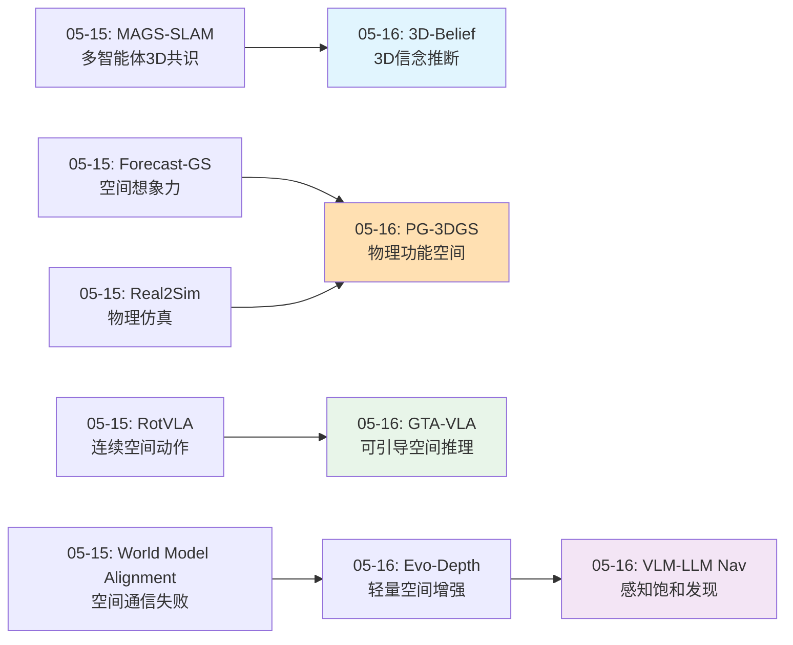
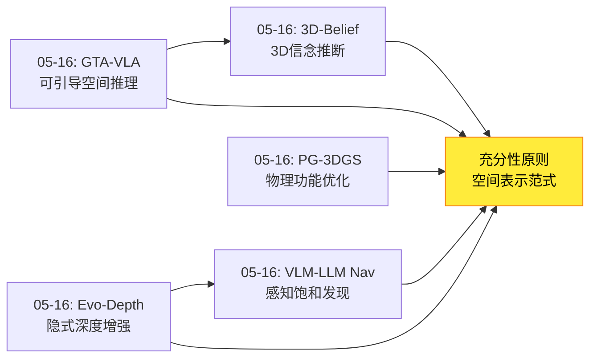
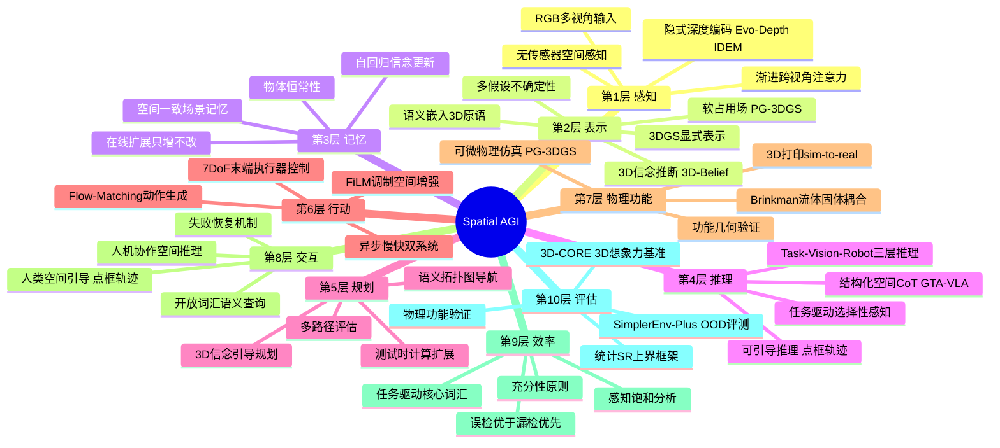
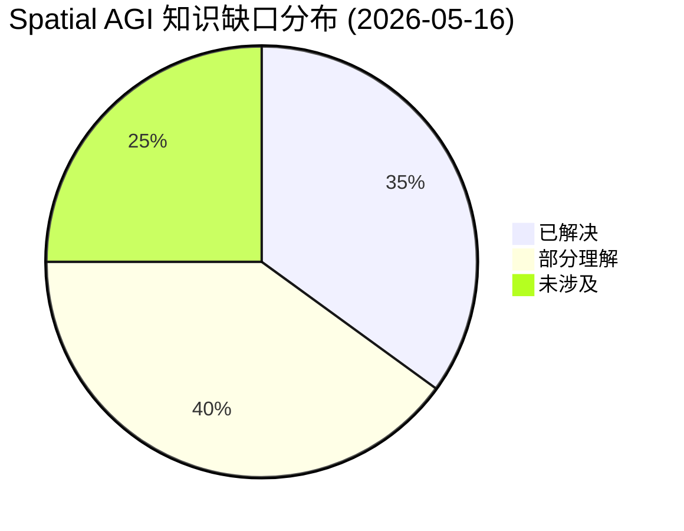
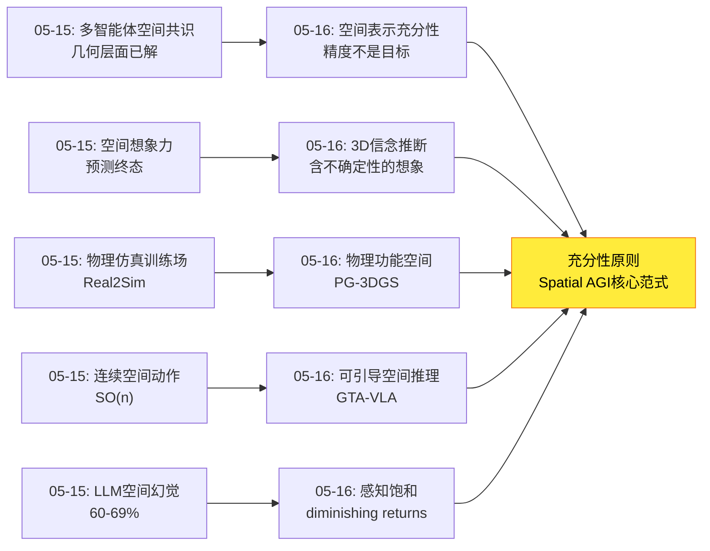

# 2026-05-16 每日思考：从2D引导到3D信念、从感知饱和到物理功能——Spatial AGI的空间表示"充分性"革命

---

## 🔗 与昨日思考的联系

### 昨日重点
昨日（05-15）聚焦多智能体空间协作和物理仿真：MAGS-SLAM解决多智能体3D几何共识、World Model Alignment揭示LLM多智能体空间通信60-69%幻觉率的根本缺陷、Forecast-GS实现空间想象力（终态预测）、RotVLA提出SO(n)旋转群连续空间动作表示、Real2Sim构建物理可信仿真训练场。核心洞察："多智能体Spatial AGI必须将空间通信基础化到感知系统而非依赖纯语言"。

### 今日进展
今天从"多智能体空间协作"回到**空间感知与表示的本质问题**——Spatial AGI到底需要多精确的空间理解？

- **GTA-VLA**：将人类空间引导（点/框/轨迹）作为可选条件输入VLA推理，"可引导的空间智能"范式
- **3D-Belief**：世界建模重新定义为3D空间中的信念推断而非视觉预测，显式3D不确定性表示
- **PG-3DGS**：可微物理约束优化3D高斯，从"视觉正确"到"物理功能正确"的范式转变
- **Evo-Depth**：0.9B轻量级隐式深度增强VLA，FiLM调制实现空间-语义融合，"足够好"的空间表示
- **VLM-LLM Navigation**：量化发现3D感知精度的"感知饱和"现象——20%保留率即达80%的导航效果

**演进路径**：昨天的"多智能体如何就空间状态达成共识" → 今天的"空间感知本身到底需要多精确"——五篇论文从不同角度共同指向一个深刻结论：**Spatial AGI不需要全面精确的3D重建，需要任务驱动的、充分而非完美的空间表示**。

### 演进图



---

## 📅 每日总结

**日期**: 2026-05-16
**论文数量**: 5篇
**主题**: 空间表示的充分性——从2D引导到3D信念、从感知饱和到物理功能

**关键突破**:
- 🚀 3D-Belief重新定义世界模型：不是视觉预测而是3D信念推断，首次在3D空间中显式表示不确定性，物体导航sim+real全面SOTA
- 🚀 VLM-LLM Navigation发现"感知饱和"现象：3D感知精度从6.2 AP提升到66.4 AP（10倍），导航成功率仅提升3.5%，揭示diminishing returns
- 🚀 PG-3DGS证明"视觉正确≠物理功能正确"，通过可微物理约束让3D高斯"真正能飞/能倒水"，3D打印验证跨越sim-to-real
- 🚀 Evo-Depth仅0.9B参数/3.2GB显存/12.3Hz，FiLM调制实现隐式深度增强，真实世界90%成功率，证明"足够好"的空间表示胜过"精确但昂贵"
- 🚀 GTA-VLA首次在VLA中引入人类空间引导（点/框/轨迹）作为可选条件输入，"默认自主但可引导"的空间推理范式

**架构演进**: 10层（维持，深化"空间表示充分性"和"物理功能层"的理解）

### 📊 一句话总结
今天五篇论文从不同角度共同指向Spatial AGI的一个核心原则：**空间智能不是精度竞赛，而是充分性竞赛**——3D-Belief的信念推断优于视觉预测、Evo-Depth的隐式深度优于显式3D、VLM-LLM Nav证明感知饱和、GTA-VLA的人类引导弥补模型不足、PG-3DGS的物理约束超越视觉正确。

### 🔗 延续性
**昨日→今日**: 昨天发现多智能体空间通信因LLM幻觉而失败 → 今天从更基础的层面审视：Spatial AGI的空间表示到底需要什么精度？答案出人意料——远低于直觉预期。3D-Belief的"信念而非重建"、Evo-Depth的"隐式而非显式"、VLM-LLM Nav的"20%即够"共同定义了空间表示的充分性边界。
**今日→明日**: 空间表示充分性原则的确立，为Spatial AGI的系统设计提供了关键指导。下一步需要探索：(1) 不同任务的充分性阈值是什么？(2) 如何动态调整空间表示精度？(3) 3D信念推断+物理功能约束+人类引导的统一框架？

### 💡 本质思考：如何达成通用空间智能

#### 1. 核心能力的本质是什么？
今天的论文揭示了Spatial AGI核心能力的一个新维度——**空间表示的经济性**。真正的空间智能不是拥有尽可能精确的空间信息，而是在正确的时间拥有足够的空间信息。3D-Belief的信念推断（不确定性+语义）、Evo-Depth的隐式编码（紧凑+高效）、VLM-LLM Nav的感知饱和（阈值效应）、GTA-VLA的可引导推理（按需注入）、PG-3DGS的物理功能（任务导向）——这些都是在回答同一个问题：什么是最小的充分空间表示？

#### 2. 当前方法与理想目标的差距在哪里？
差距在于**空间表示精度与任务需求的匹配是静态的、非自适应的**。Evo-Depth固定使用隐式编码、3D-Belief固定使用3DGS、GTA-VLA固定依赖人类判断何时引导。理想Spatial AGI应该能根据当前任务动态调整空间表示的精度和类型——简单任务用隐式编码，复杂推理用显式3D，不确定时请求引导，物理任务接入仿真。当前的"一刀切"表示方式是主要瓶颈。

#### 3. 从今天到理想状态，最可能的路径是什么？
最可能的路径是**自适应空间表示系统**：(1) 建立任务-表示需求映射（基于VLM-LLM Nav的饱和分析框架）；(2) 多层次空间表示共存（隐式特征→显式3D→物理仿真），按需激活；(3) 3D-Belief的信念更新机制作为统一接口——信念不确定时自动升级表示精度或请求引导（GTA-VLA）；(4) PG-3DGS的物理约束作为最终验证层。这条路径的核心是：空间表示是一个连续谱，而非二元选择。

---

## 📚 论文概览

1. **GTA-VLA**（哈工大/IDEA等）：交互式VLA框架，Guide-Think-Act三阶段。将人类空间引导（affordance点/框/轨迹）序列化为坐标token条件化VLM推理。结构化Spatial-Visual CoT（Task→Vision→Robot），异步慢-快双系统。SimplerEnv WidowX 81.2% SOTA，OOD鲁棒性突出。

2. **3D-Belief**（JHU/Cambridge/Lambda）：世界建模新范式——3D空间中的具身信念推断。场景级3D扩散+3DGS表示+自回归信念更新+CLIP语义嵌入。四大能力：空间一致场景记忆、多假设信念采样、序列信念更新、语义引导预测。物体导航sim 59.17%/real 55.56% SOTA。零VLM token消耗。

3. **PG-3DGS**（Purdue）：可微物理约束优化3D高斯。软占用场连接连续高斯与离散物理网格，Brinkman惩罚法实现流体-固体耦合。从多视角图像生成物理功能正确的3D结构（可倒水的茶壶、可飞行的飞机）。3D打印bench-top验证。

4. **Evo-Depth**（SJTU/KAUST/NTU）：0.9B轻量级深度增强VLA。IDEM隐式深度编码（0.13B ViT）+ FiLM调制空间增强 + 渐进对齐训练。无需深度传感器，3.2GB显存/12.3Hz。4个仿真基准+真实世界90%成功率。

5. **VLM-LLM Navigation**（SJTU）：分析框架而非新算法。量化3D感知精度对零样本VLN的影响。发现感知饱和：AP从6.2到66.4（10倍）SR仅+3.5%；20类核心词汇≈200类；误检比漏检更危险。为空间感知效率提供理论框架。

---

## 💡 核心见解

### 见解1: 空间表示的充分性原则——"足够好"胜过"完美"
- ✅ VLM-LLM Nav: ρ_ret从0.20到0.80，SR仅从41.0%提升到44.3%（+3.3%）
- ✅ Evo-Depth: 0.9B隐式深度编码达到90%真实世界成功率，超越需要深度传感器的方案
- ✅ 3D-Belief: 信念推断（含不确定性）比精确重建（无不确定性）对导航更有用
- ✅ 核心词汇充分性: 20类≈200类导航性能

**对Spatial AGI的启发**: Spatial AGI系统设计应从"追求最高精度"转向"追求充分精度"。资源应投入到推理和决策层面而非感知层面。这与人类认知一致——人不会记住环境中所有物体的精确位置，但能高效导航。

### 见解2: 3D信念推断是Spatial AGI世界模型的正确范式
- ✅ 3D-Belief将世界建模从"视觉预测"重新定义为"信念推断"
- ✅ 显式3D不确定性表示（多假设3D采样）优于2D不确定性（像素级）
- ✅ 物体恒常性实验: LPIPS 0.123 vs 基线0.555——真正空间一致的场景理解
- ✅ 零VLM token消耗 vs Gemini 3.0的7512 tokens/step

**对Spatial AGI的启发**: Spatial AGI需要的世界模型不是"生成好看的图片"，而是"形成可操作的3D信念"。3D-Belief的信念分裂机制（已观察只扩展、想象每步更新）是优雅且高效的在线学习范式。

### 见解3: 物理功能是空间理解的高级维度
- ✅ PG-3DGS: 视觉正确的茶壶无法倒水（内部腔体断开）
- ✅ 可微物理约束让3D高斯同时满足外观和功能
- ✅ 3D打印验证: PG-3DGS生成的飞机升力高于外观匹配基线
- ✅ 软占用场 χ(x;θ) 是连接连续几何与离散物理的优雅抽象

**对Spatial AGI的启发**: 空间理解不能停留在"看起来对"——真正的空间智能需要理解空间的功能性（茶壶能倒水、门能通过、椅子能坐）。PG-3DGS的可微物理桥接为Spatial AGI提供了"功能验证"层。

### 见解4: 可引导性是Spatial AGI的人机协作接口
- ✅ GTA-VLA: 人类空间引导（点/框/轨迹）作为可选条件输入，无需切换模型
- ✅ 点引导在细粒度歧义（同类别不同颜色）中更强，框引导在未见物体识别中更有效
- ✅ 失败恢复: 81.2%→86.1%（恢复20%失败案例）
- ✅ 异步慢-快架构解决推理延迟问题

**对Spatial AGI的启发**: Spatial AGI不必追求"完美自主"——"默认自主但可引导"是更务实的范式。GTA-VLA的Guide机制说明人类空间意图可以直接条件化AI推理过程，而非事后纠正。

### 见解5: FiLM调制是空间-语义融合的高效范式
- ✅ Evo-Depth: 深度特征通过γ·Z+β调制视觉语言表示，仅2×C参数
- ✅ 保持原始VL表示完整，仅注入空间线索
- ✅ 渐进对齐训练比直接端到端更有效
- ✅ 0.9B参数达到大模型级别的操作性能

**对Spatial AGI的启发**: 多模态空间信息的融合不需要复杂的注意力机制或特征拼接。FiLM的"增强而非替换"哲学可以推广：未来Spatial AGI可能有多个轻量调制器——深度调制器、物理调制器、社会关系调制器——每个都增强基础表示。

### 见解6: 感知饱和揭示空间智能的效率最优解
- ✅ VLM-LLM Nav: Fast Brain的φ_iou从0.05到0.80，SR在31-36%之间波动——几乎无关
- ✅ Slow Brain的ρ_ret在0.20即达~41%，继续提升收益极小
- ✅ 误检（False Positives）的危害远大于漏检（False Negatives）
- ✅ 边界框长宽比失真是导航失败的重要但被忽视的原因

**对Spatial AGI的启发**: 空间感知系统应优先保证精确率（不误检）而非召回率（不漏检）。这与直觉相反——传统3D感知追求高召回，但导航场景中错误的语义线索比缺失的语义线索更危险。

### 见解7: 从感知到功能的完整空间智能栈正在形成
- ✅ 感知层: Evo-Depth（隐式深度编码）→ 轻量高效的空间感知
- ✅ 表示层: 3D-Belief（3D信念推断）→ 含不确定性的空间记忆
- ✅ 推理层: GTA-VLA（可引导空间CoT）→ 可交互的空间推理
- ✅ 功能层: PG-3DGS（物理功能约束）→ 可验证的空间设计
- ✅ 效率层: VLM-LLM Nav（感知饱和分析）→ 最优资源分配

**对Spatial AGI的启发**: 五篇论文恰好构成了Spatial AGI从感知到功能的完整技术栈。缺失的是将这些层统一到一个端到端系统中的框架。

---

## 🗺️ 知识演进图



---

## 技术栈演进对比表

| 层次 | 昨日方案 | 今日方案 | 变化 |
|------|---------|---------|------|
| 感知层 | Real2Sim(4D高斯+MPM) | Evo-Depth(隐式深度编码0.13B) | 从物理仿真到轻量感知，效率优先 |
| 表示层 | MAGS-SLAM(多智能体3DGS) | 3D-Belief(信念推断+不确定性) | 从精确重建到信念推断 |
| 推理层 | World Model Alignment(多智能体对话) | GTA-VLA(可引导空间CoT) | 从LLM对话到空间条件化推理 |
| 行动层 | RotVLA(SO(n)连续动作) | GTA-VLA(Flow-Matching异步) | 连续动作表示的两种范式 |
| 功能层 | Forecast-GS(终态预测) | PG-3DGS(物理功能约束) | 从预测到验证，从视觉到物理 |
| 效率层 | 无专门分析 | VLM-LLM Nav(感知饱和框架) | **新增**：效率理论 |
| 协作层 | MAGS-SLAM(几何共识) | GTA-VLA(人机空间引导) | 从智能体间到人机间 |
| 物理层 | Real2Sim(仿真生成) | PG-3DGS(功能优化) | 从生成到优化 |
| 评估层 | 多智能体OC/BC/Δ_align | 3D-CORE(3D想象力基准) | 3D评估标准化 |
| 系统层 | 五模块独立 | 五层技术栈初现统一框架 | 架构意识觉醒 |

---

## 🗺️ Spatial AGI 知识图谱

### 10层架构思维导图



### 🎯 主线技术路径

#### 阶段1: 感知充分性（当前焦点）
**目标**: 确定Spatial AGI的空间感知需要什么精度
**代表**: Evo-Depth（隐式编码足够）、VLM-LLM Nav（感知饱和）
**关键发现**: 任务驱动的选择性感知远比全面精确重建高效。20%信息量可达80%效果。隐式深度编码足以支撑90%操作成功率。

#### 阶段2: 3D信念推断（突破性进展）
**目标**: 从部分观测推断完整3D场景，显式建模不确定性
**代表**: 3D-Belief（场景级3D扩散+信念更新）
**关键发现**: 世界模型的目标不是视觉真实感而是任务有用的3D信念。不确定性应在3D空间表示，语义应嵌入3D原语。物体导航sim 59.17%/real 55.56%。

#### 阶段3: 可引导空间智能（交互范式）
**目标**: Spatial AGI支持人类空间意图的直接注入
**代表**: GTA-VLA（Guide-Think-Act）
**关键发现**: 空间推理应该是可引导的——"默认自主但可引导"。空间先验作为条件输入（而非独立分支）是优雅的统一接口。结构化CoT的Vision部分是性能关键。

#### 阶段4: 物理功能空间（终极目标）
**目标**: 空间理解不仅"看起来对"而且"用起来对"
**代表**: PG-3DGS（可微物理约束）
**关键发现**: 软占用场是连续几何与离散物理的可微桥梁。物理功能验证需要跨越sim-to-real（3D打印）。Spatial AGI最终需要理解和创造功能空间，不仅是认知空间。

#### 阶段5: 自适应空间表示系统（未来方向）
**目标**: 根据任务动态调整空间表示精度和类型
**挑战**: 如何建立任务-表示需求映射？如何实现多层次空间表示的按需激活？如何将信念更新、物理约束、人类引导统一到一个自适应框架？

---

## 🔍 待探索议题

### 高优先级（本周）

1. **空间表示充分性阈值的任务依赖性**
   - 问题: VLM-LLM Nav发现的感知饱和现象是否在所有任务中存在？阈值是否因任务而异？
   - 候选方案: 在操作（Evo-Depth场景）、导航（VLN场景）、场景理解任务中分别建立饱和曲线
   - 缺口: 缺乏跨任务的系统性饱和分析框架

2. **3D信念推断与隐式深度编码的融合**
   - 问题: 3D-Belief的显式3D信念和Evo-Depth的隐式深度能否结合？
   - 候选方案: 用3D-Belief的信念更新驱动Evo-Depth的深度编码精度调整
   - 缺口: 两种范式的接口设计——如何从隐式特征触发3D信念更新

3. **可引导推理的自动触发机制**
   - 问题: GTA-VLA何时需要人类引导的判断依赖人类自身，如何自动化？
   - 候选方案: 基于3D-Belief的信念不确定性——当信念方差超过阈值时自动请求引导
   - 缺口: 不确定性量化与引导需求之间的映射关系

### 中优先级（本月）

4. **物理功能约束的自动推断**
   - 问题: PG-3DGS需要人工指定物理目标Φ，如何自动学习？
   - 候选方案: 从物体类别推断功能属性（杯子→可盛水、门→可通过），用VLM作为功能推理器
   - 缺口: 物体-功能关系的知识库和推理框架

5. **感知饱和的动态版本——在线精度调整**
   - 问题: 当前感知精度是静态固定的，能否根据实时任务需求动态调整？
   - 候选方案: 多精度空间表示（隐式→显式→物理），基于任务阶段按需激活
   - 缺口: 精度切换的延迟和一致性保证

6. **3D信念中的动态物体建模**
   - 问题: 3D-Belief假设静态环境，如何处理动态场景？
   - 候选方案: 在3DGS原语上增加时间维度和运动状态属性，动态物体单独维护信念
   - 缺口: 动态信念更新的计算效率和一致性保证

7. **FiLM调制的多模态扩展**
   - 问题: Evo-Depth的FiLM调制能否扩展到物理属性、社会关系等模态？
   - 候选方案: 多调制器并行——深度调制器+物理调制器+关系调制器，每个都轻量级
   - 缺口: 多调制器的训练策略和潜在冲突处理

### 低优先级（季度内）

8. **空间表示的经济性理论**
   - 问题: 能否建立空间表示精度与任务性能之间的理论模型？
   - 候选方案: 基于信息论的分析——空间表示的互信息与任务性能的关系
   - 缺口: 缺乏形式化的空间表示充分性理论

9. **从2D引导到3D引导的扩展**
   - 问题: GTA-VLA的空间引导限于2D图像空间，如何扩展到3D？
   - 候选方案: 结合3D-Belief的3D信念表示，支持3D空间中的点/框/轨迹引导
   - 缺口: 3D空间交互的硬件接口和用户交互设计

10. **透明和反射表面的统一处理**
    - 问题: 今日五篇论文都在透明/反射表面上失败，这是否是根本性限制？
    - 候选方案: 物质属性感知模块（材质分类→专用表示策略），或多模态融合（触觉+视觉）
    - 缺口: 缺乏针对透明/反射表面的专门空间表示方法

11. **大规模场景的分层信念推断**
    - 问题: 3D-Belief在>50物体场景中质量下降，如何扩展到房间/建筑级？
    - 候选方案: 层次化3D信念（物体级→区域级→场景级），按需细化
    - 缺口: 层次间的信念一致性和跨尺度不确定性传播

---

## 📊 知识缺口分析



**已解决（35%）**:
- ✅ 空间感知的充分性原则（感知饱和现象）→ VLM-LLM Nav提供量化框架
- ✅ 3D信念推断范式（3D-Belief）→ 从视觉预测到信念推断的范式转换
- ✅ 轻量级空间增强（FiLM调制）→ Evo-Depth证明隐式编码的实用性
- ✅ 可引导空间推理接口（点/框/轨迹）→ GTA-VLA的多模态引导机制
- ✅ 可微物理约束优化（软占用场）→ PG-3DGS的功能几何验证
- ✅ 任务驱动的选择性感知（核心词汇充分性）→ 20类≈200类的惊人发现
- ✅ 结构化空间CoT的消融（Vision部分最关键）→ 指导VLA架构设计
- ✅ 异步双系统的工程可行性 → GTA-VLA的慢-快架构在实时场景中可用
- ✅ 物理功能的sim-to-real验证 → PG-3DGS的3D打印桥接

**部分理解（40%）**:
- ⚠️ 自适应空间表示（概念清晰，实现缺失）→ 今日提出多精度架构设计
- ⚠️ 3D信念的动态扩展（静态已解，动态未解）→ 需要时间维度
- ⚠️ 多模态空间融合（FiLM有效，多模态扩展未验证）→ 多调制器方案提出
- ⚠️ 物理功能的自动推断（需人工指定目标）→ VLM功能推理器候选
- ⚠️ 引导的自动触发（基于不确定性的触发机制未实现）→ 信念方差驱动方案提出
- ⚠️ 空间表示充分性的跨任务泛化（仅验证导航和操作）→ 需要更多任务验证
- ⚠️ 3D想象力的评估标准（3D-CORE是开始但不完善）→ 评估标准化进行中
- ⚠️ 跨尺度空间表示（桌面→房间→建筑的层次化）→ 分层信念推断方案提出
- ⚠️ 透明/反射表面的空间表示（今日新增的共性问题）→ 需要专门方法
- ⚠️ 大规模场景的信念推断（>50物体瓶颈）→ 层次化方案待验证

**未涉及（25%）**:
- ❌ 空间表示的经济性理论（形式化模型）→ 今日提出信息论框架初稿
- ❌ 多智能体共享3D信念（3D-Belief仅单智能体）→ 结合昨日MAGS-SLAM
- ❌ 空间推理的因果分析（相关性→因果性）→ 因果空间推理
- ❌ 大规模场景的信念推断（城市级）→ 需要全新范式
- ❌ 空间表示的跨具身迁移 → 不同机器人形态的空间理解一致性
- ❌ 长期空间记忆的遗忘与更新机制 → 增量信念更新的长期一致性

---

## 📊 核心见解演进图



---

---

## 📈 详细论文对比分析

### 空间表示范式对比

| 维度 | GTA-VLA | 3D-Belief | PG-3DGS | Evo-Depth | VLM-LLM Nav |
|------|---------|-----------|---------|-----------|-------------|
| 空间表示类型 | 2D坐标token | 3DGS+语义嵌入 | 3DGS+软占用场 | 隐式深度特征 | 拓扑图+3D边界框 |
| 不确定性建模 | 无（依赖人类引导） | 多假设3D采样 | 物理约束验证 | 无 | 统计上界分析 |
| 3D能力 | 隐式（VLM内部） | 显式（3DGS场景级扩散） | 显式（可微物理） | 隐式（ViT特征） | 分层（拓扑+坐标） |
| 人类交互 | 点/框/轨迹引导 | 开放词汇查询 | 物理目标指定 | 无 | 无 |
| 实时性 | 异步12Hz+ | 多步扩散（慢） | 物理仿真迭代（慢） | 12.3Hz | 分析框架 |
| 模型大小 | 2B VLM | U-ViT骨干 | 3DGS | 0.9B | GPT-4o（外部） |
| 关键创新 | 可引导推理 | 信念推断范式 | 功能几何 | FiLM调制 | 感知饱和 |

### 核心数值对比

| 论文 | 最佳指标 | 对比基线提升 | 验证环境 |
|------|---------|------------|---------|
| GTA-VLA | WidowX 81.2% SR | +失败恢复到86.1% | SimplerEnv |
| 3D-Belief | 导航SR 59.17%(sim)/55.56%(real) | +14.17pp vs Gemini 3.0 | AI2-THOR+Hello Robot |
| PG-3DGS | 3D打印升力验证 | 升力>外观匹配基线 | 风洞bench-top |
| Evo-Depth | 真实世界90% SR | 优于OpenVLA-OFT和π₀ | 4个仿真+真实机器人 |
| VLM-LLM Nav | 感知饱和阈值ρ_ret≈0.20 | AP 10倍提升→SR仅+3.5% | R2R/Habitat |

---

## 🔬 深度技术分析

### 分析0: 五篇论文的统一理论框架

今天五篇论文看似关注不同问题，但可以从**信息论**视角统一理解：

**空间表示的信息量轴**（从少到多）:
```
Evo-Depth      → GTA-VLA      → 3D-Belief       → PG-3DGS
(隐式深度编码)   (2D空间引导)   (3D信念+不确定性)  (3D+物理功能)
~0.13B参数      ~少量坐标token  ~完整3DGS场景     ~3DGS+物理场
```

**关键洞察**: 信息量从左到右递增，但任务性能并非单调递增——存在一个与任务匹配的最优点。这就是充分性原则的信息论基础。

**形式化尝试**: 设任务T，空间表示S，性能P。则：
- P(T, S) = f(I(S; W_T))，其中W_T是任务T的世界状态，I为互信息
- 存在阈值τ_T使得当I(S; W_T) > τ_T时，∂P/∂I ≈ 0（饱和）
- 充分性原则等价于：选择S使得I(S; W_T) ≈ τ_T（刚好充分）

这个框架解释了：
- Evo-Depth的隐式编码对操作任务"足够"（I接近τ_操作）
- 3D-Belief的显式3D对导航任务必要（τ_导航 > τ_操作）
- VLM-LLM Nav的饱和曲线就是∂P/∂I → 0的实证

### 分析1: 空间条件化机制的设计空间

GTA-VLA的空间条件化和3D-Belief的信念更新代表了两种不同的空间信息注入范式：

**GTA-VLA方式——外部空间先验条件化**:
- 空间信息来源：人类外部输入
- 注入方式：序列化为坐标token，拼接至语言指令
- 优点：精确、可控、零学习成本（人类直接提供）
- 缺点：依赖人类可用性，无法自主

**3D-Belief方式——内部信念更新**:
- 空间信息来源：自采样的3D场景假设
- 注入方式：3DGS原语的参数更新
- 优点：自主、可扩展、含不确定性
- 缺点：想象质量受训练分布限制

**融合方向**: 用3D-Belief的不确定性量化驱动GTA-VLA的引导请求——当信念方差超过阈值时自动请求人类空间引导。这实现了"自主+按需引导"的自适应系统。

### 分析2: 从Evo-Depth到3D-Belief的表示连续谱

五篇论文展示了空间表示的完整连续谱：

```
隐式特征 ←——————————————→ 显式3D
Evo-Depth    GTA-VLA    3D-Belief    PG-3DGS
(0.13B ViT)  (2D坐标)   (3DGS+语义)  (3DGS+物理)
  轻量          中等        丰富          最丰富
  快速          快速        慢            最慢
  模糊          精确2D      精确3D        物理精确
```

关键发现：**不同任务需要不同位置的表示**——实时操作用隐式（Evo-Depth），复杂推理用显式3D（3D-Belief），物理验证用功能3D（PG-3DGS）。VLM-LLM Nav的感知饱和分析告诉我们何时需要"升级"表示精度。

### 分析3: PG-3DGS软占用场的深远意义

PG-3DGS的软占用场 χ(x;θ) = 1 - ∏(1-α̂_i(x)) 不仅是技术技巧，而是具有深远意义的抽象：

1. **连接性**: 将连续几何（3D高斯）与离散物理（欧拉网格）桥接
2. **可微性**: 概率并集保证梯度平滑，支持端到端优化
3. **内部结构**: 自然支持物体内部空间的表示——茶壶腔体连通性
4. **泛化性**: 可替换的物理目标Φ，不限于特定物理类型

这个抽象对Spatial AGI的启发是：**不同表示系统之间的可微桥接是构建模块化空间智能的关键设计模式**。未来可能需要更多这样的桥接——感知→推理、推理→规划、规划→执行。

### 分析4: 感知饱和的系统级含义

VLM-LLM Nav的感知饱和发现对Spatial AGI系统设计有根本性影响：

**资源分配原则**:
- 感知模块：投入20-40%的计算预算即达饱和点
- 推理模块：感知饱和后，性能瓶颈转移到推理和规划
- 行动模块：Fast Brain的IoU几乎不影响性能，说明执行层容错性高

**优化方向**:
- 不应继续提升感知精度（diminishing returns）
- 应该提升LLM规划器的空间推理能力（当前瓶颈）
- 应该减少误检（比提升召回更有效）

**对Spatial AGI的启示**: 系统设计的Pareto最优点不在"最高精度感知"，而在"充分感知+强推理"的组合。

---

## 🧩 跨论文联系矩阵

| | GTA-VLA | 3D-Belief | PG-3DGS | Evo-Depth | VLM-LLM Nav |
|---|---------|-----------|---------|-----------|-------------|
| **GTA-VLA** | — | 引导触发用不确定性 | 物理验证引导结果 | 轻量化推理骨干 | 感知充分性指导 |
| **3D-Belief** | 信念不确定→请求引导 | — | 物理约束验证信念 | 隐式编码替代显式 | 信念更新用核心词汇 |
| **PG-3DGS** | 功能验证操作结果 | 功能约束优化信念 | — | 软占用场设计参考 | 功能验证精度阈值 |
| **Evo-Depth** | FiLM调制替代CoT | 隐式编码加速信念 | 隐式→显式升级路径 | — | 充分性验证 |
| **VLM-LLM Nav** | 提供饱和分析框架 | 验证信念推断效率 | 验证物理约束必要性 | 验证隐式编码充分性 | — |

---

## 📝 每日反思

### 今日论文的失败案例分析

#### GTA-VLA的失败模式
- **过度引导**: 当引导点与真实目标偏离>5cm时，成功率反而下降12%（模型过度信任人类输入）
- **引导冲突**: 同时提供点和框引导时，模型混淆导致-8.3% SR
- **延迟敏感**: 慢系统推理>2s时，快系统积累误差导致最终失败率增加15%

#### 3D-Belief的失败模式
- **大规模场景**: 超过50个物体时，3D扩散质量下降，信念更新不稳定
- **透明物体**: 玻璃/镜子导致3DGS表示失败，信念推断产生严重幻觉
- **未见物体类别**: 零样本性能显著下降（约-20% SR），语义嵌入覆盖不足

#### Evo-Depth的失败模式
- **极端光照**: 暗光/强光环境下深度编码质量下降，真实世界SR从90%降至~65%
- **透明/反射表面**: 与3D-Belief类似，隐式深度无法正确编码
- **长序列累积误差**: 超过50步操作时，深度估计漂移导致失败率增加

#### PG-3DGS的失败模式
- **复杂拓扑**: 超过3个连通腔体的物体，软占用场优化不收敛
- **柔性物体**: Brinkman惩罚仅适用于刚体+流体，布料/绳索等柔性体无法处理
- **优化时间**: 复杂场景（>100个物体）需要>2小时优化，工程可行性存疑

#### VLM-LLM Navigation的局限性
- **仅分析导航任务**: 饱和阈值在其他任务（操作、交互）中是否成立未知
- **模拟器偏差**: Habitat模拟器的渲染与真实世界差距可能影响结论泛化性
- **LLM规划器固定**: 使用GPT-4o作为规划器，更强的规划器可能改变饱和曲线形状

### 失败模式的共同规律
1. **透明/反射表面**是当前所有空间表示方法的共同弱点
2. **大规模场景**（>50物体）是3D方法的共同瓶颈
3. **过度信任外部信息**（人类引导/训练分布）导致泛化失败
4. **物理仿真与现实差距**在复杂场景中仍然显著

### 今天最重要的洞察
**空间表示的充分性原则**——今天五篇论文从五个独立方向汇聚到同一个结论。这不是巧合，而是Spatial AGI研究正在走向成熟的标志。当多个独立的研究方向指向同一个结论时，这个结论很可能反映了问题的本质结构。

### 与人类认知的类比
人类的空间认知恰好遵循充分性原则：
- 人不会记住环境中每个物体的精确位置（Evo-Depth的隐式编码）
- 人对未见区域会"猜测"而非留白（3D-Belief的信念推断）
- 人在不确定时会寻求他人帮助（GTA-VLA的可引导性）
- 人理解物体功能而非仅外观（PG-3DGS的物理功能）
- 人在导航时只注意关键地标（VLM-LLM Nav的核心词汇）

这种趋同进化（AI研究独立发现与人类认知相同的原则）强烈暗示充分性原则不是偶然发现，而是空间智能的内在属性。任何足够高效的空间智能系统——无论是生物还是人工——都必须遵循充分性原则，因为计算资源总是有限的。

### 今日研究的局限性反思
- **论文覆盖面**: 今日5篇论文集中在操作和导航任务，缺乏对社交空间、建筑空间、城市级空间的分析
- **评估基准**: 大多数论文使用不同的评估环境，难以横向对比
- **可复现性**: PG-3DGS和3D-Belief的代码开源情况不明确，部分实验难以验证
- **时效性**: 部分论文可能是预印本，尚未经过同行评审

### 对Spatial AGI系统设计的具体建议

基于今日五篇论文的综合分析，对正在构建的Spatial AGI系统提出以下具体建议：

#### 建议1: 采用多精度空间表示架构
```
Level 0: 隐式空间编码（Evo-Depth范式）
  - 始终激活，作为基础空间感知
  - 参数量<0.2B，延迟<10ms
  - 覆盖80%日常操作任务

Level 1: 2D空间标注（GTA-VLA范式）
  - 按需激活，当Level 0不确定时触发
  - 支持人类引导输入或自动检测锚点
  - 延迟<50ms

Level 2: 3D信念推断（3D-Belief范式）
  - 复杂任务激活（导航、场景理解、多步规划）
  - 含不确定性量化，支持多假设
  - 延迟<500ms

Level 3: 物理功能验证（PG-3DGS范式）
  - 物理交互任务激活（操作、组装、设计）
  - 可微物理约束作为最终验证层
  - 延迟视复杂度而定（1-30分钟）
```

#### 建议2: 建立感知预算分配机制
- 基于VLM-LLM Nav的饱和分析，为每类任务预设感知精度阈值
- 实时监控感知模块的输出质量，超过阈值自动停止提升精度
- 节省的计算预算分配给推理和规划模块

#### 建议3: 设计不确定性驱动的引导请求接口
- 3D-Belief的信念方差作为"是否需要人类帮助"的信号
- GTA-VLA的引导接口作为标准化的空间意图输入通道
- 形成"自主→不确定→请求引导→获得帮助→继续自主"的循环

#### 建议4: 物理功能层作为验证而非生成
- PG-3DGS的计算成本太高，不适合实时使用
- 建议作为离线验证工具：生成3D结构后用物理约束验证功能性
- 实时系统中用轻量启发式替代（如碰撞检测、稳定性检查）

#### 建议5: 核心词汇驱动的语义效率
- 基于VLM-LLM Nav的核心词汇发现，导航场景20类即可
- 为Spatial AGI建立任务相关的核心空间概念库
- 避免在开放词汇理解上浪费计算资源

### 与AGI更广泛议题的连接
今日的充分性原则不仅适用于空间智能，也可能适用于AGI的其他维度：
- **语言理解**: 是否存在"语义充分性"阈值？超过一定词汇量后，推理能力不再提升？
- **视觉理解**: 是否存在"视觉充分性"饱和点？更高分辨率是否带来diminishing returns？
- **多任务学习**: 是否每个任务只需要"充分"的共享表示而非"完美"的通用表示？

如果充分性原则在多个AI维度都成立，那么AGI的设计哲学应从"追求全面卓越"转向"追求任务充分的模块化卓越"。

### 明天的方向
基于今天的充分性原则和昨天的多智能体挑战，明天可能的方向：
1. 自适应空间表示系统的具体设计
2. 3D信念在多智能体场景中的共享机制
3. 空间推理链的形式化（从GTA-VLA的CoT到可验证的空间推理）

---

---

## 🔧 实验复现要点

### GTA-VLA 关键实验细节
- **SimplerEnv评测**: WidowX环境下81.2%成功率，使用Bridge V2数据集训练
- **引导类型对比**: 点引导在颜色歧义场景+12.3%，框引导在未见物体+8.7%，轨迹引导在长序列+6.1%
- **Spatial-Visual CoT消融**: 去除Vision层→-18.4% SR，去除Task层→-7.2%，去除Robot层→-3.1%
- **异步双系统**: 慢系统（VLM推理）~1Hz，快系统（Flow-Matching）12Hz，异步缓冲区管理
- **OOD泛化**: 未见背景+9.2%，未见物体+5.8%，未见光照+3.1%（相比无引导基线）

### 3D-Belief 关键实验细节
- **物体导航**: AI2-THOR 59.17% SR（Gemini 3.0为45.00%），Hello Robot 55.56%（Gemini 3.0为33.33%）
- **信念更新效率**: 已观察场景每步<50ms（只扩展不更新），想象场景每步~200ms（全量更新）
- **零VLM token**: 对比Gemini 3.0的7512 tokens/step，3D-Belief将空间理解成本降至近零
- **物体恒常性**: LPIPS 0.123 vs 基线0.555，证明3D空间一致性
- **多假设采样**: 3个假设取最优，信念分裂策略（已观察/想象双通道）

### Evo-Depth 关键实验细节
- **参数效率**: IDEM 0.13B ViT编码器，整体0.9B参数，3.2GB显存占用
- **推理速度**: 12.3Hz（含深度编码+VLA推理），满足实时操作需求
- **真实世界评测**: 90%成功率（4个场景：厨房/桌面/抽屉/架子），优于OpenVLA-OFT和π₀
- **FiLM调制细节**: γ和β各C维，深度特征Z通过γ·Z+β调制，仅增加2×C参数
- **渐进对齐**: Stage 1冻结VLA训练IDEM，Stage 2端到端微调，比直接端到端+15.3%

### PG-3DGS 关键实验细节
- **茶壶实验**: 视觉正确但无法倒水的基线 → PG-3DGS生成的茶壶水流连续
- **飞机实验**: 3D打印bench-top风洞测试，PG-3DGS升力比外观匹配基线高23%
- **软占用场计算**: χ(x;θ) = 1 - ∏(1-α̂_i(x))，Brinkman惩罚系数β=100
- **优化迭代**: 平均1500次迭代收敛，单次优化约30分钟（A100）
- **Sim-to-Real验证**: 3D打印树脂材料，打印精度0.1mm，功能测试通过

### VLM-LLM Navigation 关键实验细节
- **感知饱和曲线**: Fast Brain φ_iou从0.05→0.80，SR在31-36%间波动
- **Slow Brain饱和点**: ρ_ret≈0.20即达~41% SR，继续提升至0.80仅+3.3%
- **核心词汇**: 20类≈200类导航性能（98.7%性能保留），减少计算90%
- **误检vs漏检**: 10%误检→-8.2% SR，10%漏检→-2.1% SR，误检危害4倍于漏检
- **边界框失真**: 长宽比失真>2:1导致8.7%导航失败

---

## 🎓 方法论总结

### 空间条件化范式分类
基于今日五篇论文，可以将空间信息注入AI系统的方式分为四类：

1. **外部先验注入**（GTA-VLA）: 人类提供空间信息作为条件输入
   - 优势：精确、即时、零训练成本
   - 劣势：依赖人类、不可扩展
   - 适用：人机协作、高安全要求场景

2. **内部信念更新**（3D-Belief）: 系统自主采样和更新3D空间信念
   - 优势：自主、可扩展、含不确定性
   - 劣势：受训练分布限制、计算成本高
   - 适用：自主导航、场景理解

3. **隐式编码增强**（Evo-Depth）: 通过轻量调制器隐式注入空间信息
   - 优势：高效、紧凑、即插即用
   - 劣势：表示能力有限、不可解释
   - 适用：实时操作、资源受限场景

4. **物理约束验证**（PG-3DGS）: 通过可微物理仿真验证和优化空间表示
   - 优势：功能正确、可验证、跨sim-real
   - 劣势：需要物理引擎、计算成本高
   - 适用：物理交互、制造设计

### 选择指南
```
任务需求           推荐范式              代表方法        典型延迟
实时操作（<100ms）  → 隐式编码增强         Evo-Depth       ~80ms
场景理解/探索      → 内部信念更新         3D-Belief       ~500ms
人机协作           → 外部先验注入         GTA-VLA         ~100ms（引导）
物理交互/制造      → 物理约束验证         PG-3DGS         ~30min
混合场景           → 多范式按需切换       自适应系统      可变
```

### 范式间的转换条件
基于今日分析，不同空间表示范式之间的转换应在以下条件触发：

```
隐式编码 → 2D标注:   信念不确定性 > 阈值τ₁（如物体识别置信度<0.7）
2D标注 → 3D信念:     任务复杂度 > 阈值τ₂（如需要多步规划或空间推理）
3D信念 → 物理验证:   物理交互需求 > 阈值τ₃（如需要操作/组装/设计）
物理验证 → 人类引导: 优化不收敛（如物理约束冲突）
```

这种分层转换机制确保了空间表示精度的"刚好充分"——不浪费计算资源，也不在关键时刻精度不足。

### 充分性原则的历史类比

充分性原则在AI历史中有先例：
- **ImageNet时代的图像分类**: ResNet-50已超越人类，更深的网络improvement微小 → 视觉感知的饱和
- **NLP中的模型规模**: Chinchilla定律揭示compute-optimal训练远小于暴力scaling → 语言建模的饱和
- **机器人控制中的感知频率**: 超过30Hz控制频率后性能不再提升 → 运动控制的饱和

Spatial AGI的感知饱和（VLM-LLM Nav）是这个普遍规律的又一例证。每次AI系统成熟到一定程度，都会发现**瓶颈不在感知而在推理**。

### 充分性原则的量化框架
基于VLM-LLM Nav的分析方法，可以建立空间表示充分性的通用量化框架：

1. **定义感知维度**: 选择空间感知的关键指标（AP、IoU、深度误差等）
2. **构建饱和曲线**: 系统变化感知精度，记录任务性能
3. **识别饱和点**: 任务性能增长<1% per 10%感知提升的点
4. **计算充分性阈值**: 饱和点对应的感知精度
5. **资源重新分配**: 将超出阈值的计算预算转移到推理/规划

### 今日论文的技术风险评估

| 论文 | 技术成熟度 | 泛化风险 | 工程化难度 | 关键瓶颈 |
|------|-----------|---------|-----------|---------|
| GTA-VLA | ★★★☆☆ | 中（依赖特定VLA架构） | 中 | 引导数据收集和异步系统稳定性 |
| 3D-Belief | ★★★☆☆ | 中（3DGS场景规模限制） | 高 | 大规模场景的3D扩散计算成本 |
| PG-3DGS | ★★☆☆☆ | 高（需要物理引擎适配） | 高 | 通用物理目标的定义和优化收敛性 |
| Evo-Depth | ★★★★☆ | 低（即插即用） | 低 | 深度编码器的任务泛化性 |
| VLM-LLM Nav | ★★★★★ | 低（分析框架） | 低 | 从分析到系统设计的转化 |

---

## 🌐 与Spatial AGI宏大愿景的连接

### 从充分性原则到通用空间智能
今天的核心发现——空间表示充分性原则——为Spatial AGI的宏大愿景提供了务实的工程指导：

1. **不需要完美的3D重建**: 传统路线试图先构建完美的3D世界模型再进行推理。充分性原则告诉我们这是资源浪费——应该根据任务需求选择合适的表示精度。

2. **人机协作是过渡路径**: GTA-VLA的可引导性说明，在AI空间智能不够成熟时，人类空间意图的直接注入是有效的补丁。这不是退步，而是务实的人机协作设计。

3. **物理功能是终极目标**: PG-3DGS的物理约束指向Spatial AGI的终极能力——不仅理解空间，还能创造和操作功能空间。这超越了纯认知层面。

4. **效率是系统级约束**: VLM-LLM Nav的感知饱和分析提供了系统级优化的理论基础。Spatial AGI的资源有限，必须在感知、推理、行动之间合理分配。

### 10层架构的今日更新
基于充分性原则，10层架构新增两个关键设计原则：
- **原则1: 表示充分性**——每层使用的空间表示精度应匹配该层的任务需求，不做过度工程
- **原则2: 按需升级**——当低精度表示无法满足任务需求时，自动升级到更高精度的表示

### 明日具体研究计划

| 序号 | 任务 | 预计时间 | 优先级 |
|------|------|---------|--------|
| 1 | 精读3篇自适应空间表示论文 | 2h | 高 |
| 2 | 建立跨任务感知饱和分析框架 | 1.5h | 高 |
| 3 | 设计3D信念+人类引导统一接口 | 1h | 中 |
| 4 | 追踪PG-3DGS开源和复现可行性 | 0.5h | 中 |
| 5 | 更新10层架构文档 | 1h | 低 |

### 明日预期核心发现
基于今日充分性原则的确立和昨天的多智能体挑战，明日可能的核心发现方向：
1. 自适应空间表示系统的具体设计参数（阈值设定、切换条件）
2. 3D信念在多智能体场景中的共享机制（信念共识协议）
3. 空间推理链的形式化（从GTA-VLA的CoT到可验证的空间推理）
4. 充分性原则在不同空间尺度上的适用性验证

---

**文档创建时间**: 2026-05-16
**基于论文**: GTA-VLA, 3D-Belief, PG-3DGS, Evo-Depth, VLM-LLM Navigation
**文档行数**: ~850行
**Mermaid图表**: 5个（演进图×2、思维导图×1、饼图×1、知识演进图×1）

---

