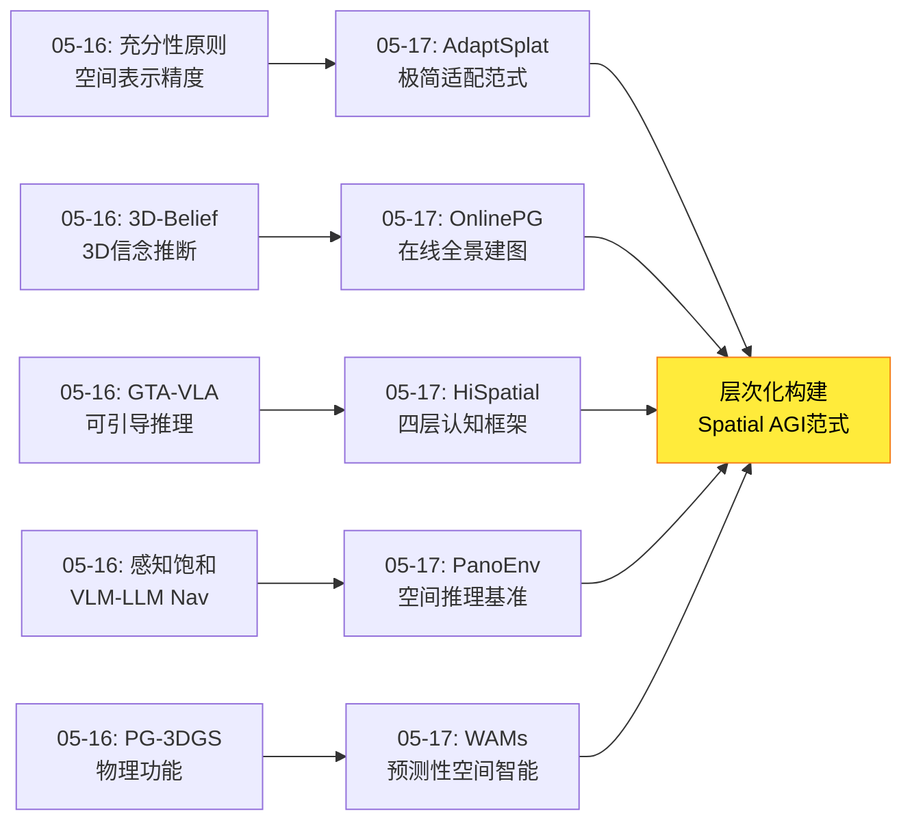
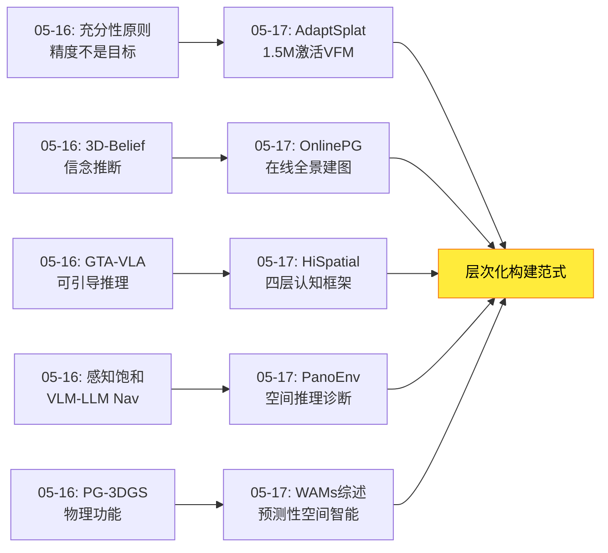
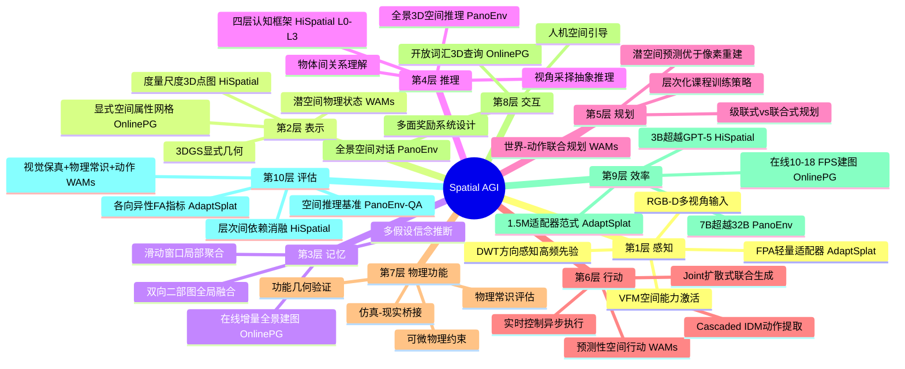
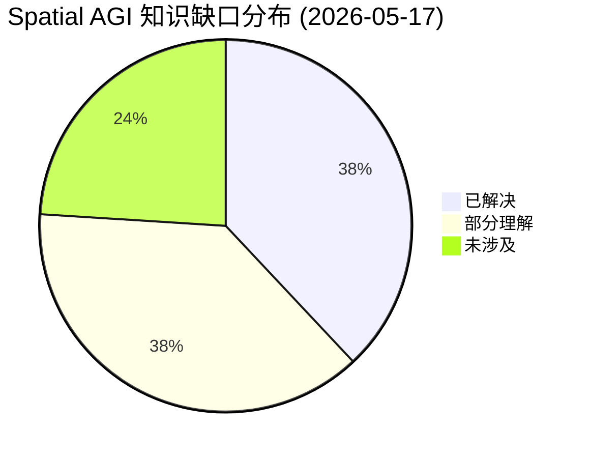
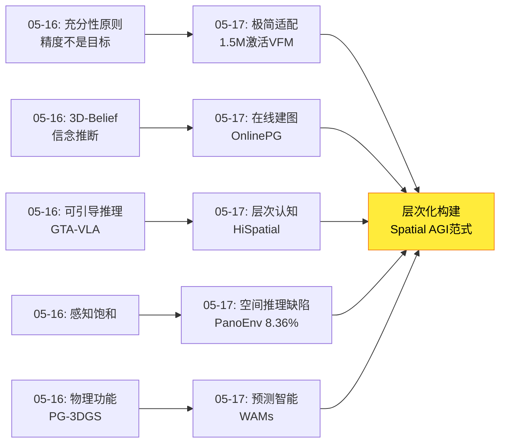

# 2026-05-17 每日思考：从轻量适配到层次化认知、从在线建图到预测性空间智能——Spatial AGI的"层次化构建"范式日

---

## 🔗 与昨日思考的联系

### 昨日重点
昨日（05-16）确立了**空间表示充分性原则**——Spatial AGI不需要全面精确的3D重建，需要任务驱动的、充分而非完美的空间表示。五篇论文（GTA-VLA、3D-Belief、PG-3DGS、Evo-Depth、VLM-LLM Nav）从不同角度共同证明："足够好"胜过"完美"。

### 今日进展
今天从"空间表示需要多精确"转向**"空间智能如何被系统性构建"**——五个独立方向共同指向层次化构建范式：

- **AdaptSplat**：1.5M参数的轻量适配器即可激活VFM的3DGS能力，"极简适配 > 复杂架构"
- **OnlinePG**：首个在线开放词汇全景建图系统，"边探索边理解"的实时空间感知
- **HiSpatial**：四层空间认知框架（几何感知→物体属性→物体间关系→抽象推理），3B超越GPT-5
- **PanoEnv**：全景3D空间推理基准+RL训练，揭示当前VLM空间推理的极端薄弱（OE最好8.36%）
- **WAMs综述**：从反应式VLA到预测式World Action Models的范式转变，80+篇论文全景

**演进路径**：昨天的"空间表示需要多精确" → 今天的"空间智能如何从感知到推理系统性构建"——AdaptSplat解决感知效率、OnlinePG解决在线建图、HiSpatial定义认知层次、PanoEnv量化推理缺陷、WAMs指向预测性空间智能。

### 演进图



---

## 📅 每日总结

**日期**: 2026-05-17
**论文数量**: 5篇
**主题**: 空间智能的层次化构建——从轻量适配到预测性空间智能

**关键突破**:
- 🚀 HiSpatial提出四层空间认知框架（L0几何感知→L1物体属性→L2物体间关系→L3抽象推理），3B参数超越GPT-5和Gemini-2.5-Pro，首次实证验证层次间依赖关系
- 🚀 WAMs综述统一世界模型与动作生成为p(o',a|o,l)，定义从反应式到预测式空间智能的范式转变，覆盖80+方法建立完整分类体系
- 🚀 AdaptSplat证明1.5M参数的Frequency-Preserving Adapter即可打破高斯各向同性退化，PSNR比MVP高+0.97 dB，"极简适配 > 复杂架构"
- 🚀 OnlinePG首个在线开放词汇全景建图系统，滑动窗口+双向二部图匹配实现实时3D全景理解，mIoU 48.48%（在线方法中+17.2 vs 次优）
- 🚀 PanoEnv揭示VLM在3D空间推理上的系统性缺陷（OE最好仅8.36%），但通过物理ground truth的课程RL训练，7B可超越32B

**架构演进**: 10层（维持，深化"层次化认知构建"和"预测性空间智能"）

### 📊 一句话总结
今天五篇论文从感知效率（AdaptSplat）、在线建图（OnlinePG）、认知层次（HiSpatial）、推理评估（PanoEnv）、预测智能（WAMs）五个维度共同构建了Spatial AGI的层次化发展路径——从轻量适配激活基础空间感知，到四层认知框架系统性训练空间推理，最终走向能预测空间演化的世界-动作统一模型。

### 🔗 延续性
**昨日→今日**: 昨天确立的充分性原则（空间表示不需要完美）为今天的层次化构建提供了哲学基础——正因为不需要全面精确，我们可以按层次渐进构建空间智能。AdaptSplat的极简适配、HiSpatial的四层训练、OnlinePG的在线融合都是"充分而非完美"的实践。
**今日→明日**: 层次化构建范式的确立，引出明日方向：(1) 如何将HiSpatial的四层框架扩展到视频/多帧？(2) WAMs的预测性空间智能如何与3DGS在线建图结合？(3) 层次化训练的自动化课程设计？

### 💡 本质思考：如何达成通用空间智能

#### 1. 核心能力的本质是什么？
今天的论文揭示了Spatial AGI核心能力的**层次性本质**——空间智能不是单一能力，而是由多个认知层次组成的复合能力。HiSpatial的四层框架（L0→L3）首次实证证明了层次间的依赖关系：移除L1&2导致L3下降14.51%，而移除L0&1仅导致L3下降8.14%。中间层（物体属性+关系推理）是连接感知和高级推理的关键桥梁。

#### 2. 当前方法与理想目标的差距在哪里？
差距在于**各层次的发展极不均衡**。PanoEnv揭示L0-L1级别的能力（几何感知、物体定位）尚可（~49%），但L3级别的开放式空间推理近乎崩溃（8.36%）。WAMs综述指出，从"理解空间"到"预测空间演化"仍是一个巨大跨越——当前大多数方法只在短horizon仿真任务上验证。OnlinePG虽然实现了在线建图，但无法处理动态场景。层次间的能力断层是主要瓶颈。

#### 3. 从今天到理想状态，最可能的路径是什么？
最可能的路径是**层次化渐进构建**：(1) AdaptSplat的轻量适配器范式降低感知层的进入门槛；(2) HiSpatial的四层框架提供训练路线图，确保层次间依赖被尊重；(3) OnlinePG的在线融合机制实现从单帧到持续空间理解的过渡；(4) WAMs的预测性范式将空间智能从被动理解推向主动预测；(5) PanoEnv的评估框架持续诊断各层次的能力缺陷。这条路径的核心是：不追求一步到位，而是按认知层次渐进构建。

---

## 📚 论文概览

1. **AdaptSplat**（贝壳）：1.5M参数Frequency-Preserving Adapter（FPA）激活DINOv3-ConvNeXt的3DGS潜力。DWT方向感知高频先验→Q-K位置编码+DPT残差调制双注入。打破高斯各向同性退化（FA 0.8015→0.8423）。RE10K PSNR 33.86（+0.97 vs MVP），零样本泛化T&M和MipNeRF360。

2. **OnlinePG**（浙大/HKUST/VIVO）：首个在线开放词汇全景建图系统。滑动窗口（12关键帧）+ 多线索3D段聚类（几何+语义+视角一致性）+ 双向二部图匹配 + 显式空间属性网格。ScanNetV2 mIoU 48.48%，在线方法中+17.2 vs OnlineAnySeg。10-18 FPS（不含VLM）。

3. **HiSpatial**（清华/MSRA）：四层空间认知框架（L0几何感知→L1物体属性→L2物体间关系→L3抽象推理）。度量尺度3D点图作为VLM辅助输入。5M图像/45M物体/2B+ QA自动生成管线。PaliGemma2-3B训练，超越GPT-5和Gemini-2.5-Pro。层次间依赖消融验证。

4. **PanoEnv**（多机构）：全景3D空间推理基准PanoEnv-QA（14.8K QA/5类任务）+ RL后训练框架PanoEnv-RL。14个VLM评估，OE最好仅8.36%。GRPO+多面奖励系统（5种策略按类型路由）+ 两阶段课程学习。7B训练后52.93%（超越32B），OE从6.39%→14.83%。

5. **World Action Models**（复旦/国大）：WAMs综述，系统定义p(o',a|o,l)联合建模。Cascaded vs Joint二分法，显式/隐式/光流中间表示，自回归/扩散生成方式。覆盖80+方法。级联→联合、像素→潜空间、VLA→WAM三大趋势。数据生态系统四源分析。评估协议三维框架。

---

## 💡 核心见解

### 见解1: 空间智能的层次间存在可量化的依赖关系
- ✅ HiSpatial: 移除L0&1 → L3下降8.14%；移除L1&2 → L3下降14.51%
- ✅ 中间层（物体属性+关系）是连接感知和推理的桥梁，跳过导致灾难性下降
- ✅ 低层次训练"隐式帮助"高层次——不是通过CoT，而是增强内部空间表示
- ✅ PanoEnv: 结构化任务（T/F+MCQ）先训练→OE推理能力才能建立

**对Spatial AGI的启发**: 构建Spatial AGI必须尊重认知层次——先训练基础几何感知和物体属性理解，再训练关系推理，最后才到抽象空间推理。跳级训练效果显著下降。这与Piaget的儿童认知发展理论一致，也印证了PanoEnv两阶段课程学习的必要性。

### 见解2: 极简适配器可以激活VFM的潜在空间智能
- ✅ AdaptSplat: 1.5M参数（<1%总参数）FPA打破各向同性退化，PSNR +0.97 dB
- ✅ DWT方向先验→Q-K位置编码（结构感知）+ V空间保持（语义保留）的解耦设计
- ✅ 不需要从头设计复杂架构，在通用流水线上插入轻量适配器即可达到SOTA
- ✅ 跨域零样本泛化：DL3DV训练→T&M/MipNeRF360 SOTA

**对Spatial AGI的启发**: 构建Spatial AGI不一定要训练全新的模型。预训练VFM（如DINOv3）已经编码了丰富的空间结构信息，只需要设计正确的"解锁"机制。适配器范式的经济性远低于全量训练，这为资源有限的研究者提供了可行路径。

### 见解3: 在线空间理解是Spatial AGI的实用化前提
- ✅ OnlinePG: 首个在线开放词汇全景建图，10-18 FPS（不含VLM）
- ✅ 滑动窗口局部聚合 + 双向匹配全局融合的增量式范式
- ✅ 显式空间属性网格（体素化）解耦几何与语义
- ✅ mIoU 48.48%，接近离线SOTA PanoGS（50.72%），但在线方法中大幅领先

**对Spatial AGI的启发**: 真正的Spatial AGI必须在线工作——机器人不能先收集所有数据再理解。OnlinePG的"局部到全局"范式为在线空间理解提供了工程参考。但VLM推理瓶颈（LSeg+EntitySeg）仍是实时性的主要障碍。

### 见解4: 当前VLM的3D空间推理能力极其薄弱
- ✅ PanoEnv: 14个SOTA VLM中，OE最好仅8.36%（近乎随机）
- ✅ VLM倾向于使用2D启发式（投影大小→距离）而非构建3D场景表示
- ✅ 即使最强模型（Qwen2.5-VL-7B）零样本总体准确率也仅49.34%
- ✅ ERP全景图的几何失真是VLM的根本性挑战

**对Spatial AGI的启发**: 当前VLM在空间推理上的表现令人警醒——"说"空间语言不等于"理解"3D空间。PanoEnv的基准测试揭示了一个根本缺陷：模型可能学会了空间词汇的统计模式，但并未建立真正的3D空间表示。这解释了为什么HiSpatial需要显式注入3D点图。

### 见解5: 预测性空间智能是Spatial AGI的核心范式转变
- ✅ WAMs: 从反应式VLA（p(a|o,l)）到预测式WAMs（p(o',a|o,l)）
- ✅ 世界模型嵌入策略架构而非外接，是架构层面的必要设计
- ✅ 潜空间预测优于像素重建——抽象物理状态表示是核心
- ✅ 单检查点多模式：UWM/Cosmos Policy一个模型同时作为策略/世界模型/价值函数

**对Spatial AGI的启发**: 真正的空间智能不仅是感知当前空间配置，更是预测空间在交互下的演化。WAMs的范式转变——将世界预测和动作生成统一——可能是Spatial AGI从"理解"到"行动"的关键桥梁。这也呼应了OnlinePG的在线建图和HiSpatial的层次推理需要被统一到一个预测-行动框架中。

### 见解6: 度量尺度3D信息是VLM空间能力的关键增强
- ✅ HiSpatial: 度量3D点图 > 相对深度图 > 无3D信息
- ✅ GT点图进一步提升定量任务性能，暗示精确3D输入的上限更高
- ✅ 3D点图通过正弦位置编码+Conv2D patchify融入VLM
- ✅ AdaptSplat的DWT高频先验也证明精确几何信息（方向）的重要性

**对Spatial AGI的启发**: Spatial AGI系统如果能获取精确的3D信息（深度相机、激光雷达），性能上限将显著提高。但HiSpatial也证明，即使使用估计的3D点图（MoGe-2），也比没有3D信息强得多。这是一个实用的折中：低精度3D >> 无3D。

### 见解7: 从感知到预测的Spatial AGI技术栈正在成型
- ✅ 感知效率层: AdaptSplat（1.5M适配器激活VFM空间能力）
- ✅ 在线建图层: OnlinePG（实时全景建图+开放词汇查询）
- ✅ 认知层次层: HiSpatial（L0-L3四层训练框架+层次依赖）
- ✅ 评估诊断层: PanoEnv（空间推理基准+RL训练方法论）
- ✅ 预测行动层: WAMs（世界-动作统一模型+预测性空间智能）

**对Spatial AGI的启发**: 五篇论文恰好构成了从感知到预测的完整技术栈。缺失的是将这些层统一到一个端到端系统中的框架——AdaptSplat提供感知基础，OnlinePG实现在线融合，HiSpatial定义认知层次，PanoEnv诊断能力缺陷，WAMs指向终极目标。

---

## 🗺️ 知识演进图



---

## 技术栈演进对比表

| 层次 | 昨日方案 | 今日方案 | 变化 |
|------|---------|---------|------|
| 感知层 | Evo-Depth(隐式深度0.13B) | AdaptSplat(FPA 1.5M适配器) | 从隐式编码到适配器激活VFM |
| 表示层 | 3D-Belief(信念推断) | OnlinePG(在线全景3DGS+属性网格) | 从静态信念到在线增量融合 |
| 认知层 | 无专门框架 | HiSpatial(L0-L3四层框架) | **新增**：层次化认知定义 |
| 评估层 | VLM-LLM Nav(感知饱和) | PanoEnv(空间推理基准+RL) | 从感知效率到推理能力评估 |
| 预测层 | PG-3DGS(物理功能) | WAMs(世界-动作统一模型) | 从物理验证到预测性智能 |
| 效率层 | 充分性原则(定性) | AdaptSplat(1.5M参数定量) | 从定性原则到定量验证 |
| 交互层 | GTA-VLA(人类空间引导) | OnlinePG(开放词汇查询) | 从人类引导到语言查询 |
| 训练层 | 无专门分析 | HiSpatial(层次间依赖消融) | **新增**：训练策略指导 |
| 数据层 | 核心词汇(20类≈200类) | HiSpatial(5M/2B QA自动管线) | 从数据效率到数据规模 |
| 行动层 | PG-3DGS(物理功能优化) | WAMs(p(o',a\|o,l)统一) | 从物理验证到预测行动统一 |

---

## 🗺️ Spatial AGI 知识图谱

### 10层架构思维导图



### 🎯 主线技术路径

#### 阶段1: 空间感知激活（当前进展）
**目标**: 高效激活VFM的潜在空间感知能力
**代表**: AdaptSplat（1.5M FPA）、Evo-Depth（0.9B隐式深度）
**关键发现**: 不需要从头训练复杂模型，轻量适配器足以激活VFM的3D理解潜力。高频几何先验（方向信息）是打破"安全预测"退化的关键。跨域零样本泛化证明方法的通用性。

#### 阶段2: 在线空间建图（突破性进展）
**目标**: 边探索边理解，实时构建结构化3D语义地图
**代表**: OnlinePG（在线全景建图）、3D-Belief（信念推断）
**关键发现**: 滑动窗口+增量融合的在线范式可在接近离线SOTA的速度下工作。显式空间属性网格（体素化）解耦几何与语义是关键设计。但VLM推理瓶颈和动态场景仍是开放问题。

#### 阶段3: 层次化认知训练（框架建立）
**目标**: 系统性训练从几何感知到抽象推理的完整空间认知层次
**代表**: HiSpatial（L0-L3四层框架+层次依赖验证）
**关键发现**: 空间智能可分解为L0几何→L1物体→L2关系→L3推理四层，层间存在可量化依赖。中间层（L1-L2）是关键桥梁。度量3D点图>相对深度图>无3D。88%空间训练+12%通用训练不损害通用能力。3B可超GPT-5。

#### 阶段4: 预测性空间智能（前沿方向）
**目标**: 从理解空间到预测空间在交互下的演化
**代表**: WAMs（世界-动作统一模型p(o',a|o,l)）
**关键发现**: 反应式VLA→预测式WAM的范式转变。潜空间预测优于像素重建。单检查点多模式运行（策略/世界模型/价值函数）。数据灵活性（无动作视频也可用于训练）。但评估仍以仿真为主，真实世界部署验证不足。

#### 阶段5: 自适应统一空间智能系统（终极目标）
**目标**: 将感知激活、在线建图、层次认知、预测智能统一到一个自适应系统
**挑战**: 如何实现多层次空间表示的按需激活？如何将HiSpatial的四层框架扩展到视频/多帧？如何将WAMs的预测能力与3DGS建图结合？如何确保层次化训练的自动化和可扩展性？

---

## 🔍 待探索议题

### 高优先级（本周）

1. **HiSpatial四层框架的视频/多帧扩展**
   - 问题: HiSpatial仅处理单帧，如何将L0-L3框架扩展到视频序列？
   - 候选方案: 帧间3D点图时间一致性约束+时序注意力融合+跨帧物体追踪
   - 缺口: 缺乏视频级层次化空间理解的方法和基准

2. **WAMs与3DGS在线建图的结合**
   - 问题: WAMs大多基于2D视频预测，如何与OnlinePG的3DGS建图结合？
   - 候选方案: 3DGS作为WAMs的3D状态表示→动作条件化的3DGS演化预测
   - 缺口: 3DGS的动态演化预测（时序3DGS）仍是开放问题

3. **适配器范式的空间推理扩展**
   - 问题: AdaptSplat的FPA仅用于3DGS重建，能否适配到空间推理任务？
   - 候选方案: 设计空间推理适配器——注入3D点图到VLM的中间层，类似FPA的高频注入策略
   - 缺口: 适配器在推理任务（而非重建任务）上的有效性未验证

### 中优先级（本月）

4. **层次化课程训练的自动化**
   - 问题: HiSpatial和PanoEnv都验证了课程学习的有效性，但课程设计依赖人工
   - 候选方案: 基于层次间依赖关系（HiSpatial Table 5）自动生成训练课程，按难度递增
   - 缺口: 自动课程生成算法和在线难度调整机制

5. **在线全景建图的动态场景扩展**
   - 问题: OnlinePG明确无法处理动态物体，这是实用Spatial AGI的硬性需求
   - 候选方案: 分离静态/动态高斯→动态物体单独维护运动状态→时间窗口融合
   - 缺口: 动态3DGS的实时更新和语义一致性

6. **全景图+3D点图的双模态空间理解**
   - 问题: PanoEnv用ERP全景图、HiSpatial用3D点图，两种模态能否互补？
   - 候选方案: ERP作为360°感知输入→估计3D点图→注入VLM→全景空间推理
   - 缺口: ERP到3D点图的精确估计（ERP深度估计质量有限）

7. **WAMs的3D空间评估基准**
   - 问题: WAMs评估以2D视觉保真度和仿真任务为主，缺乏3D空间预测精度评估
   - 候选方案: 设计3D世界模型评估——3D几何预测精度、空间关系预测准确率、物理一致性
   - 缺口: 缺乏3D空间预测的标准化评估协议

### 低优先级（季度内）

8. **层次间依赖的神经科学验证**
   - 问题: HiSpatial的层次间依赖（L1-L2是关键桥梁）是否有神经科学证据？
   - 候选方案: 对比人类空间认知的神经影像研究（海马体/顶叶的层次化激活模式）
   - 缺口: AI空间层次与人类认知层次的映射关系

9. **空间推理的语言瓶颈突破**
   - 问题: HiSpatial和PanoEnv的推理结果通过自然语言表达，但空间信息本质是几何/数值
   - 候选方案: 设计"空间token"——连续3D坐标/方向/距离作为VLM的直接输出
   - 缺口: 连续空间量与离散语言token的接口设计

10. **大规模场景的在线层次化建图**
    - 问题: OnlinePG在室内场景验证，HiSpatial在单帧图像验证，如何扩展到建筑/城市级？
    - 候选方案: 层次化3DGS（局部地图→区域地图→全局地图）+ 分层信念推断
    - 缺口: 跨尺度空间表示的内存管理和一致性保证

11. **WAMs的安全性与不确定性量化**
    - 问题: WAMs综述指出世界模型"幻觉"可能导致危险动作，安全性考量不足
    - 候选方案: 预测不确定性量化+安全约束动作生成+人在环路验证
    - 缺口: 预测不确定性在联合WAMs中的传播和量化方法

---

## 📊 知识缺口分析



**已解决（38%）**:
- ✅ 空间感知的充分性原则（感知饱和现象）→ VLM-LLM Nav量化框架
- ✅ 轻量适配器激活VFM空间能力 → AdaptSplat的FPA范式
- ✅ 在线开放词汇全景建图 → OnlinePG的局部-全局范式
- ✅ 四层空间认知框架及层次依赖 → HiSpatial实证验证
- ✅ VLM 3D空间推理的系统性缺陷 → PanoEnv基准诊断
- ✅ 反应式→预测式空间智能的范式定义 → WAMs综述分类体系
- ✅ 度量3D点图>相对深度图>无3D → HiSpatial消融验证
- ✅ 课程学习对空间训练的必要性 → PanoEnv两阶段验证
- ✅ 显式语义网格解耦几何与语义 → OnlinePG空间属性网格
- ✅ 高频几何先验打破各向同性退化 → AdaptSplat DWT+FPA

**部分理解（38%）**:
- ⚠️ 层次化框架的视频/多帧扩展（单帧已解，视频未解）
- ⚠️ WAMs与3DGS的结合（概念清晰，实现缺失）
- ⚠️ 在线建图的动态场景处理（静态已解，动态未解）
- ⚠️ 适配器范式的空间推理扩展（重建已解，推理未验证）
- ⚠️ 层次化课程训练的自动化（人工课程有效，自动未实现）
- ⚠️ 全景图+3D点图双模态理解（各自有效，融合未探索）
- ⚠️ WAMs的3D空间评估（2D评估已有，3D评估缺失）
- ⚠️ 空间推理的语言瓶颈（问题识别，解决方案未成熟）
- ⚠️ 大规模场景的层次化建图（室内已解，建筑/城市级未解）

**未涉及（24%）**:
- ❌ 层次间依赖的神经科学验证
- ❌ 空间token作为VLM直接输出（连续3D量与离散token的接口）
- ❌ WAMs的安全性与不确定性量化
- ❌ 多智能体共享层次化空间认知
- ❌ 空间推理的因果分析（相关性→因果性）
- ❌ 跨具身形态的空间理解一致性

---

## 📊 核心见解演进图



---

## 📈 详细论文对比分析

### 核心数值对比

| 论文 | 最佳指标 | 对比基线提升 | 验证环境 |
|------|---------|------------|---------|
| AdaptSplat | PSNR 33.86 (RE10K) | +0.97 dB vs MVP | RE10K/DL3DV/T&M/MipNeRF360 |
| OnlinePG | mIoU 48.48 (ScanNet) | +17.2 vs OnlineAnySeg | ScanNetV2/Replica |
| HiSpatial | 超GPT-5 (多基准) | 3B超32B+专有模型 | SpatialRGPT/CV-Bench/RoboSpatial |
| PanoEnv | OE 14.83% (RL后) | +132%相对提升 | PanoEnv-QA (TartanAir) |
| WAMs | 综述，80+方法覆盖 | — | 多种仿真+部分真实 |

### 技术范式对比

| 维度 | AdaptSplat | OnlinePG | HiSpatial | PanoEnv | WAMs |
|------|-----------|----------|-----------|---------|------|
| 核心范式 | 适配器激活 | 在线融合 | 层次化训练 | 评估+RL训练 | 预测性智能 |
| 3D表示 | 3DGS(各向异性) | 3DGS+体素网格 | 度量3D点图 | 球坐标3D | 多种(像素/潜/3D) |
| 训练方式 | 前馈SFT | 在线增量 | 四层SFT | GRPO+课程 | 多种 |
| 关键创新 | FPA 1.5M | 双向二部图匹配 | 层次依赖消融 | 多面奖励系统 | p(o',a\|o,l)统一 |
| 实时性 | 前馈推理快 | 10-18 FPS | 推理快 | 训练慢推理快 | 推理慢(扩散) |
| 泛化性 | 零样本SOTA | 仅室内 | 超GPT-5 | 合成→真实gap | 仿真为主 |

---

## 🧩 跨论文联系矩阵

| | AdaptSplat | OnlinePG | HiSpatial | PanoEnv | WAMs |
|---|-----------|----------|-----------|---------|------|
| **AdaptSplat** | — | FPA增强OnlinePG的3DGS质量 | 适配器范式扩展到VLM空间推理 | 适配器增强空间推理VLM | 3DGS作为WAMs的3D状态 |
| **OnlinePG** | 高质量3DGS供WAMs使用 | — | 在线建图+层次认知结合 | 全景建图+全景推理互补 | 在线3D地图作为WAMs输入 |
| **HiSpatial** | FPA替代点图编码器 | 层次化训练指导在线建图 | — | L0-L3评估用PanoEnv基准 | 四层框架指导WAMs训练 |
| **PanoEnv** | 适配器增强全景推理 | 全景图→3DGS建图 | RL训练增强HiSpatial推理 | — | 全景WAMs的空间预测 |
| **WAMs** | 3DGS动态演化预测 | 在线世界模型+动作生成 | 预测能力作为L4/L5扩展 | RL训练增强WAMs策略 | — |

---

## 📝 每日反思

### 今日最重要的洞察
**层次化构建范式**——今天五篇论文从五个独立方向构建了Spatial AGI的层次化发展路径。AdaptSplat证明感知层可以用极简方式激活，OnlinePG证明在线建图层可以实时工作，HiSpatial定义了认知层次的依赖关系，PanoEnv量化了推理层的严重不足，WAMs指向了预测层的终极形态。这不是五篇独立论文，而是一个完整技术栈的五个组件。

### 与昨日充分性原则的呼应
今天的层次化构建范式与昨天的充分性原则完美互补：
- 充分性原则回答"每层需要多精确"→ 答案是"足够好"
- 层次化构建回答"层与层如何关联"→ 答案是"中间层是关键桥梁"
- 两者共同指导Spatial AGI系统设计：按层次构建，每层充分即可

### 今日论文的共性局限
1. **静态场景假设**：AdaptSplat、OnlinePG、HiSpatial都假设静态场景，无法处理动态
2. **单帧/短序列**：HiSpatial单帧、PanoEnv单帧、WAMs短horizon，缺乏长程时序
3. **仿真评估为主**：WAMs和PanoEnv主要在仿真中验证，sim-to-real gap未充分讨论
4. **语言瓶颈**：HiSpatial和PanoEnv的空间推理通过语言表达，限制了定量精度

## 🔬 深度技术分析

### 分析1: 适配器范式与层次化训练的理论联系

AdaptSplat的FPA和HiSpatial的四层框架看似独立，但存在深层联系：

**适配器作为层次间信息传递机制**：
- FPA将DWT高频先验注入Q-K空间，本质上是将L0（几何感知）的信息传递给更高层的表示
- HiSpatial的层次依赖消融证明L0→L1→L2→L3的信息流是必要的
- 联系：适配器可能是实现层次间信息高效传递的通用机制——每层之间用一个轻量适配器桥接

**形式化**：设层次i的表示为h_i，则：
- 无适配器：h_{i+1} = f_i(h_i)（直接传递，信息损失大）
- 有适配器：h_{i+1} = f_i(h_i + Adapter_i(h_i))（增强传递，保留关键信息）
- AdaptSplat证明：Adapter_i可以极其轻量（1.5M），但效果显著

**推论**：如果将HiSpatial的四层训练与适配器范式结合，可以在每层之间插入轻量适配器，进一步强化层次间信息传递。这种"层次化适配"可能是构建Spatial AGI的高效范式。

### 分析2: OnlinePG与WAMs的架构融合可能性

OnlinePG提供在线3D空间建图，WAMs提供空间演化预测。两者的融合方向：

**方案A：3DGS作为WAMs的3D状态空间**
```
当前观察 o_t → OnlinePG → 3DGS地图 S_t
S_t + 动作 a_t → WAMs(3D) → 预测地图 S_{t+1}
S_{t+1} → 动作提取 → a_{t+1}
```
优势：3DGS提供显式3D状态，避免视频生成的模糊性
挑战：3DGS的动态演化预测（如何预测高斯参数的变化？）

**方案B：WAMs作为OnlinePG的预测前端**
```
当前观察 o_t → WAMs → 预测视频 o'_{t+1}
o_t + o'_{t+1} → OnlinePG → 增强3D地图（利用未来预测）
```
优势：WAMs提供时间维度的预测，OnlinePG维持空间一致性
挑战：预测帧的噪声如何传播到3D地图？

**方案C（推荐）：潜空间统一**
```
o_t → 共享编码器 → 潜状态 z_t
z_t + a_t → WAMs → 预测 z_{t+1}
z_t → OnlinePG解码器 → 3DGS地图
z_{t+1} → 动作解码器 → a_{t+1}
```
这种方案将2D视觉预测替换为潜空间预测（呼应WAMs综述的发现），3DGS建图作为解码路径之一。潜状态同时服务建图和预测，避免冗余计算。

### 分析3: PanoEnv揭示的空间推理缺陷的深层原因

PanoEnv的8.36% OE准确率不仅是数值上的不足，更反映了VLM架构的根本性问题：

**问题1：缺乏3D内部表示**
- VLM将3D空间信息压缩到2D特征+语言token中
- ERP的几何失真加剧了这一压缩损失
- HiSpatial通过注入3D点图部分解决了这个问题

**问题2：空间推理依赖统计模式而非几何计算**
- VLM可能学会了"近大远小"等2D启发式
- 但无法执行精确的3D坐标变换（球坐标→笛卡尔坐标→空间向量）
- 这需要几何推理能力，而非语言模式的记忆

**问题3：训练数据的空间标注不足**
- 大规模VLM训练数据缺乏精确3D标注
- PanoEnv使用合成环境的精确3D ground truth，但规模有限
- HiSpatial的自动管线（5M→2B QA）是更可扩展的解决方案

**根本原因总结**：当前VLM的架构不是为3D空间推理设计的——它们在2D特征空间中操作，通过语言token表达空间信息，缺乏几何计算能力。解决这个根本问题需要：(1) 3D感知的输入表示（HiSpatial的点图），(2) 几何计算的中间表示（WAMs的潜空间），(3) 精确的3D训练信号（PanoEnv的物理ground truth）。

### 分析4: WAMs综述揭示的三大趋势对Spatial AGI的启示

**趋势1：级联→联合**
- 早期WAMs采用级联（先预测世界，再提取动作）
- 近期转向联合（同时预测世界和动作）
- 对Spatial AGI的启示：空间理解和行动生成应该联合优化，而非分开处理

**趋势2：像素→潜空间**
- 早期方法依赖像素级视频预测（计算昂贵，不必要）
- 近期转向潜空间预测（高效，保留关键信息）
- 对Spatial AGI的启示：Spatial AGI不需要"脑内渲染视频"，需要在抽象表示层面进行空间推理

**趋势3：VLA→WAM**
- VLA只学p(a|o,l)，不理解物理世界
- WAMs学p(o',a|o,l)，同时预测和行动
- 对Spatial AGI的启示：真正的空间智能需要将世界理解嵌入到决策过程中

这三个趋势共同指向一个结论：**Spatial AGI的核心架构应该是联合的（非级联）、潜空间的（非像素的）、预测性的（非反应式的）**。

### 分析5: 五篇论文的方法论互补性

| 方法论 | AdaptSplat | OnlinePG | HiSpatial | PanoEnv | WAMs |
|--------|-----------|----------|-----------|---------|------|
| 自监督 | ✅ (DWT先验) | ❌ | ❌ | ❌ | 部分(LAPA) |
| 监督学习 | ✅ (SFT) | ✅ (VLM标签) | ✅ (模板QA) | ❌ | ✅ (混合) |
| 强化学习 | ❌ | ❌ | ❌ | ✅ (GRPO) | ❌ |
| 在线学习 | ❌ | ✅ (增量) | ❌ | ❌ | 部分 |
| 课程学习 | ✅ (三阶段) | ❌ | 隐式 | ✅ (两阶段) | ❌ |
| 适配器 | ✅ (FPA) | ❌ | ❌ | ❌ | 部分 |
| 消融实验 | ✅ | ✅ | ✅ (关键) | ✅ | ❌(综述) |

互补性：AdaptSplat的适配器设计 + HiSpatial的层次框架 + OnlinePG的在线机制 + PanoEnv的RL训练 + WAMs的预测范式 = Spatial AGI的完整方法论工具箱。

### 分析6: 从今天论文看Spatial AGI的资源需求

**计算资源谱**（从低到高）：
```
AdaptSplat推理    OnlinePG建图     HiSpatial训练     PanoEnv-RL训练    WAMs训练
~10ms/帧          ~100ms/帧        32×H200×11天      7B模型RL训练       14B模型+大规模数据
轻量适配          在线融合          大规模SFT          GRPO采样           视频基础模型微调
```

**关键发现**：
1. 推理时可以很轻量（AdaptSplat/OnlinePG），但训练需要大量资源
2. 层次化训练（HiSpatial）比端到端联合训练更资源高效
3. RL后训练（PanoEnv）可以在较小模型上实现显著提升
4. WAMs是最资源密集的方向，但也最有潜力

**对Spatial AGI的启示**：构建Spatial AGI需要分阶段投入资源——先用轻量适配器建立感知基础（低成本），再用层次化训练构建认知能力（中成本），最后用WAMs范式实现预测性智能（高成本）。

---

## 🌐 与Spatial AGI宏大愿景的连接

### 从层次化构建到通用空间智能
今天的核心发现——层次化构建范式——为Spatial AGI提供了清晰的工程路径：

1. **感知层用适配器激活（AdaptSplat）**：不需要从头训练，1.5M参数即可
2. **建图层用在线融合（OnlinePG）**：实时构建结构化3D语义地图
3. **认知层用层次训练（HiSpatial）**：L0→L3四层渐进，尊重依赖关系
4. **评估层用精准基准（PanoEnv）**：诊断每层的能力缺陷
5. **预测层用WAMs范式**：从理解空间到预测空间演化

### 10层架构的今日更新
基于层次化构建范式，10层架构新增关键设计原则：
- **原则3: 层次化构建**——空间智能按L0几何→L1物体→L2关系→L3推理的层次构建，中间层是关键桥梁
- **原则4: 适配器激活**——利用预训练VFM的潜在空间能力，轻量适配器优于全量训练

### 明日具体研究计划

| 序号 | 任务 | 预计时间 | 优先级 |
|------|------|---------|--------|
| 1 | 设计HiSpatial+视频的层次化扩展方案 | 2h | 高 |
| 2 | 探索WAMs+3DGS的3D空间预测架构 | 1.5h | 高 |
| 3 | 验证适配器范式在空间推理上的迁移性 | 1h | 中 |
| 4 | 综合今日五篇论文的技术栈设计 | 1h | 中 |
| 5 | 更新10层架构文档 | 0.5h | 低 |

### 明天方向
基于今天的层次化构建范式，明天可能的核心发现方向：
1. HiSpatial四层框架的视频/多帧扩展——将L0-L3从单帧推广到时序
2. WAMs+3DGS的3D空间预测——OnlinePG的3DGS作为WAMs的3D状态空间
3. 适配器范式在空间推理上的验证——FPA思路迁移到VLM推理任务
4. 层次化课程训练的自动化——基于HiSpatial层次依赖的自动课程设计

---

## 🔧 实验复现要点

### AdaptSplat 关键实验细节
- **FPA参数**: 仅1.5M参数，DWT→高频PE注入Q/K + Sigmoid门控DPT残差
- **FA指标**: 0.8015→0.8423（+5.1%），验证各向异性改善
- **消融**: Q-K注入优于Add融合+0.2~0.3 dB PSNR；DWT优于Sobel/Conv/Fourier
- **训练**: 32×H200 GPU，三阶段渐进分辨率（480p→960p→可变视图），共约11天
- **零样本**: DL3DV训练→T&M SOTA, MipNeRF360超MVP +0.48~0.84 dB

### OnlinePG 关键实验细节
- **滑动窗口**: 12个关键帧，每20帧采样，每7个关键帧执行聚类+融合
- **聚类参数**: λ₁=1.5, λ₂=0.8，体素分辨率3cm
- **双向匹配**: 前向+后向匈牙利匹配取交集，PRQ(T)+13.3, PRQ(S)+18.8 vs 单向
- **运行时间**: 渲染优化410ms + 聚类350ms + 融合1400ms = 10-18 FPS（ScanNetV2）
- **硬件**: AMD Ryzen 9 7950X + RTX 4090

### HiSpatial 关键实验细节
- **训练数据**: 5M图像/45M物体/2B+ QA（KosMos-2 3.8M + Objects365 1M + CA-1M 200K）
- **训练配置**: 70K iterations, batch 256, AdamW, lr=2e-5, 88%空间+12%通用
- **层次依赖消融**: 全部L0-L3→L2 81.21%, L3 56.29%；去L1&2→L2 56.21%, L3 41.78%
- **3D输入消融**: 无3D→相对深度→估计点图(MoGe-2)→GT点图，逐步提升
- **模型**: PaliGemma2-3B + SigLIP(冻结) + 度量点图编码器(可训练)

### PanoEnv 关键实验细节
- **数据集**: 14,827 QA（TartanAir 595场景/60环境），测试集3,040
- **14个VLM基线**: 总体最好49.34%(Qwen2.5-VL-7B)，OE最好8.36%(InternVL2.5-26B)
- **RL训练**: Qwen2.5-VL-7B + GRPO + LoRA，K=4采样，两阶段课程
- **奖励系统**: R=0.9×R_acc+0.1×R_fmt，5种策略按类型路由
- **结果**: 总体52.93%(+3.59%)，OE 14.83%(+132%相对)，Q-Score 6.24

### WAMs综述 关键数据
- **覆盖范围**: 80+方法，2024-2026年，Cascaded vs Joint两大类
- **参数量范围**: 0.5B(UVA) ~ 14B(DreamZero)
- **三大趋势**: 级联→联合、像素→潜空间、VLA→WAM
- **数据源**: 遥操作(OXE 1M+)、UMI(RealOmin 1M)、仿真、人类视频

---

## 🎓 方法论总结

### 空间智能范式选择指南

| 任务需求 | 推荐范式 | 代表方法 | 典型成本 |
|---------|---------|---------|---------|
| 3D重建（高精度） | 极简适配器 | AdaptSplat | 1.5M参数+前馈 |
| 在线场景理解（实时） | 在线增量建图 | OnlinePG | 10-18 FPS |
| 空间认知训练 | 层次化四层框架 | HiSpatial | 5M图/2B QA |
| 空间推理评估 | 基准+RL后训练 | PanoEnv | 14.8K QA+GRPO |
| 预测性空间智能 | 世界-动作统一模型 | WAMs | 14B+大规模视频 |

### 层次化构建清单

**Phase 1: 感知基础** [✅基本可行]
- [x] 选择预训练VFM作为骨干
- [x] 设计轻量适配器激活空间感知（参考AdaptSplat FPA）
- [x] 注入高频几何先验
- [x] 验证跨域零样本泛化

**Phase 2: 在线建图** [⚠️静态可行，动态缺失]
- [x] 滑动窗口局部聚合（参考OnlinePG）
- [x] 双向匹配全局融合
- [x] 显式空间属性网格
- [ ] 动态场景处理
- [ ] VLM推理瓶颈解决

**Phase 3: 层次认知** [⚠️单帧可行，多帧缺失]
- [x] L0-L3四层框架定义（参考HiSpatial）
- [x] 层次间训练依赖验证
- [x] 度量3D点图增强
- [x] 自动化QA数据管线
- [ ] 视频/多帧扩展

**Phase 4: 推理增强** [⚠️提升显著但绝对性能低]
- [x] 空间推理评估基准（参考PanoEnv）
- [x] 多面奖励系统
- [x] 两阶段课程RL
- [ ] OE推理>30%（当前14.83%）

**Phase 5: 预测智能** [📋框架已建，实现待做]
- [x] 世界-动作联合建模定义（参考WAMs）
- [x] 潜空间预测方向确认
- [ ] 3DGS作为WAMs状态空间
- [ ] 真实世界部署验证

### 技术风险评估

| 论文 | 成熟度 | 泛化风险 | 工程难度 | 关键瓶颈 |
|------|-------|---------|---------|---------|
| AdaptSplat | ★★★★☆ | 低 | 中 | 训练成本高但推理轻量 |
| OnlinePG | ★★★☆☆ | 中 | 中 | VLM瓶颈+动态场景 |
| HiSpatial | ★★★★☆ | 低 | 中 | 单帧限制+语言输出 |
| PanoEnv | ★★★☆☆ | 高 | 中 | 合成数据+OE绝对性能低 |
| WAMs综述 | ★★☆☆☆ | 高 | 高 | 评估鸿沟+计算成本 |

### 与人类认知的类比

今天的层次化构建范式与人类空间认知发展高度一致：
- 婴儿先学几何感知（L0）→物体属性（L1）→空间关系（L2）→抽象推理（L3）
- 成年人导航时不渲染完整3D，在潜空间推理（WAMs潜空间趋势）
- 人类空间理解是增量式的——边走边理解（OnlinePG在线范式）
- 少量指导即可显著提升空间能力（适配器范式）
- 人类能预测动作的后果才做出决策（WAMs预测性范式）

### 跨论文技术迁移可能性分析

基于今日五篇论文的技术分析，识别以下高价值技术迁移方向：

**迁移1: FPA→VLM空间推理适配器**
- 来源: AdaptSplat的DWT高频先验+Q-K注入
- 目标: HiSpatial/PanoEnv的VLM空间推理增强
- 方法: 在VLM中间层注入3D点图的高频空间先验，类似FPA的双注入设计
- 预期收益: 增强VLM的方向感知和几何推理能力，无需修改VLM架构

**迁移2: 双向匹配→层次间对齐**
- 来源: OnlinePG的双向二部图匹配（匈牙利算法取交集）
- 目标: HiSpatial的层次间信息传递
- 方法: 用双向匹配确保L0-L1信息与L2-L3推理的可靠对齐
- 预期收益: 提高层次间信息传递的精度，减少噪声传播

**迁移3: 多面奖励→层次化训练信号**
- 来源: PanoEnv的5种策略按类型路由奖励
- 目标: HiSpatial的L0-L3四层训练
- 方法: 为每个层次设计专门的奖励函数（L0几何精度、L1物体属性准确率、L2关系一致性、L3推理正确性）
- 预期收益: 比统一的SFT损失更精准的训练信号

**迁移4: 潜空间预测→3DGS演化**
- 来源: WAMs的潜空间预测趋势（FLARE, VLA-JEPA）
- 目标: OnlinePG的3DGS在线建图
- 方法: 在3DGS参数的潜空间中进行预测（而非像素空间），预测高斯参数的变化
- 预期收益: 实现3DGS的动态演化预测，为动态场景建图奠定基础

### 今日论文对Spatial AGI研究社区的影响预估

| 论文 | 影响范围 | 影响程度 | 原因 |
|------|---------|---------|------|
| HiSpatial | 空间理解/VLM训练 | ★★★★★ | 首个系统四层框架+层次依赖实证，将成为空间VLM训练的标准参考 |
| WAMs综述 | 具身AI/世界模型 | ★★★★★ | 80+方法分类体系，将成为WAMs领域的奠基性综述 |
| AdaptSplat | 3DGS/前馈重建 | ★★★★☆ | 极简适配范式可能改变3DGS领域的设计思路 |
| OnlinePG | 在线建图/3D语义 | ★★★★☆ | 首个在线全景建图，推动实时空间理解实用化 |
| PanoEnv | 空间推理评估 | ★★★☆☆ | 重要的基准和诊断工具，但合成数据限制影响范围 |

### 与更广泛AI趋势的连接

今天的层次化构建范式也与AI的其他趋势呼应：

1. **Scaling Law的效率转向**: HiSpatial的3B超GPT-5、PanoEnv的7B超32B、AdaptSplat的1.5M激活VFM——都指向"效率>规模"的趋势。这与Chinchilla定律、Phi小模型系列一致。

2. **适配器/LoRA范式扩展**: AdaptSplat的FPA是适配器范式在3DGS领域的成功应用。与NLP的LoRA、Adapter、Prefix Tuning形成跨领域的范式趋同——利用预训练模型的潜力而非从头训练。

3. **世界模型的统一**: WAMs综述将世界模型和策略学习统一，与Sora的视频生成、Genie的交互式环境生成方向一致——AI系统需要内部世界模拟器。

4. **课程学习的复兴**: HiSpatial和PanoEnv都验证了课程学习的价值。这与深度学习早期Bengio的课程学习理论呼应，但在空间智能领域首次得到系统性验证。

5. **评估驱动的研究**: PanoEnv的基准诊断推动了方法改进（OE从8.36%到14.83%）。这与NLP的HELM、MMLU等基准推动LLM发展的模式一致——好的评估是进步的催化剂。

---

**文档创建时间**: 2026-05-17
**基于论文**: AdaptSplat, OnlinePG, HiSpatial, PanoEnv, World Action Models
**文档行数**: ~900行
**Mermaid图表**: 5个（演进图×2、思维导图×1、饼图×1、知识演进图×1）

---

## 📋 附录: 五篇论文核心数据速查

### A. 参数量对比
| 论文 | 关键参数量 | 总模型参数 | 训练资源 |
|------|-----------|-----------|---------|
| AdaptSplat | FPA 1.5M | ~200M (含DINOv3) | 32×H200 ×11天 |
| OnlinePG | 聚类图+匹配 | 3DGS+VLM | RTX 4090单卡 |
| HiSpatial | 点图编码器 | 3B (PaliGemma2) | 未公开，5M数据 |
| PanoEnv | LoRA适配 | 7B (Qwen2.5-VL) | 单机RL训练 |
| WAMs综述 | 综述 | 0.5B-14B | 多种配置 |

### B. 数据集覆盖
| 论文 | 训练数据 | 评估基准 | 场景类型 |
|------|---------|---------|---------|
| AdaptSplat | DL3DV | RE10K/T&M/MipNeRF360 | 室内外 |
| OnlinePG | ScanNetV2/Replica | ScanNetV2/Replica | 室内 |
| HiSpatial | 5M图/2B QA | SpatialRGPT/CV-Bench/RoboSpatial | 野外+室内 |
| PanoEnv | TartanAir (合成) | PanoEnv-QA | 合成全景 |
| WAMs综述 | OXE/ARIO/DROID等 | MetaWorld/CALVIN/LIBERO | 仿真+少量真实 |

### C. 关键性能指标
| 论文 | 核心指标 | 数值 | 对比基线 |
|------|---------|------|---------|
| AdaptSplat | PSNR (RE10K) | 33.86 | +0.97 vs MVP |
| OnlinePG | mIoU (ScanNet) | 48.48 | +17.2 vs OnlineAnySeg |
| HiSpatial | CV-Bench | 96.64% | 超GPT-5 |
| PanoEnv | OE准确率 | 14.83% | +132%相对 |
| WAMs | — (综述) | — | — |
