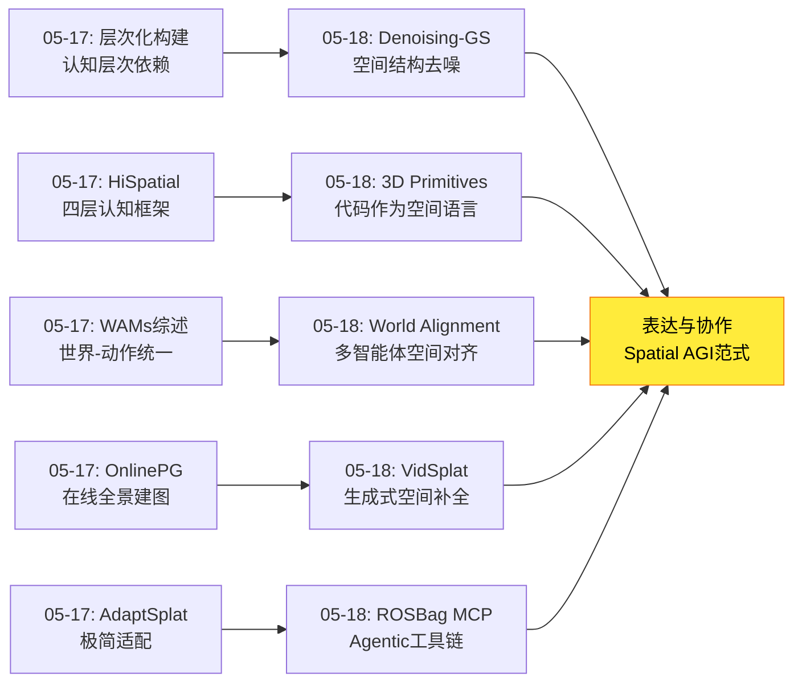
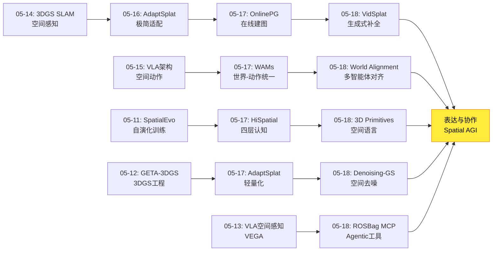
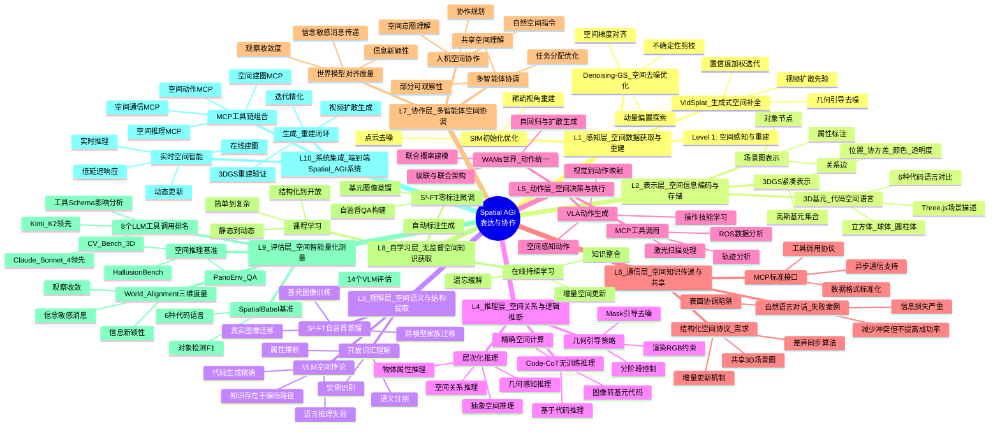
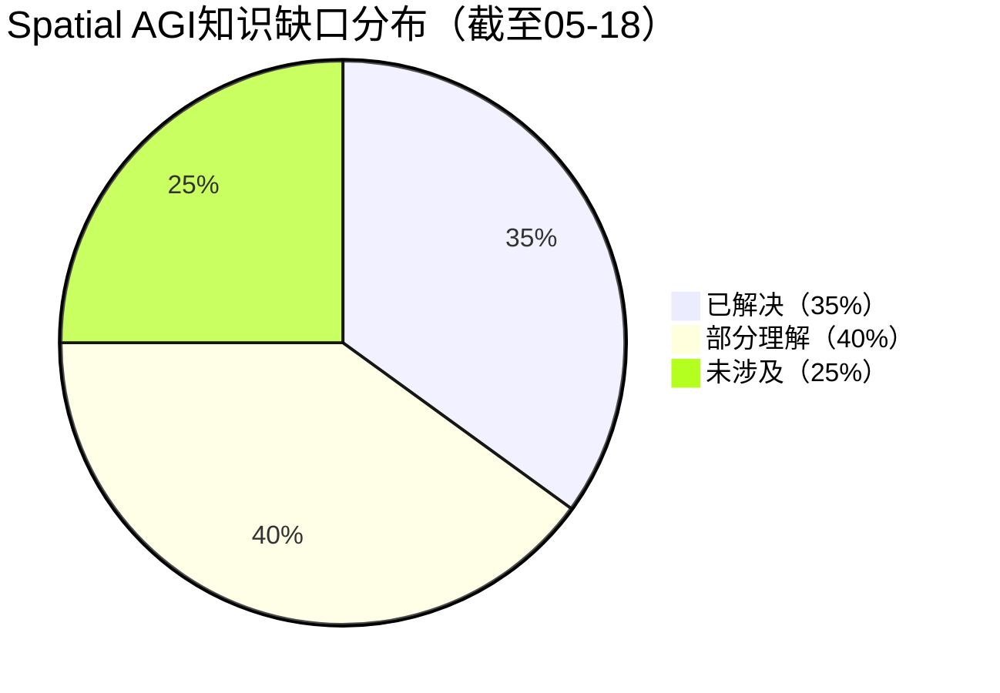

# 2026-05-18 每日思考：从去噪优化到空间语言、从世界对齐到Agentic工具链——Spatial AGI的"表达与协作"范式日

---

## 🔗 与昨日思考的联系

### 昨日重点
昨日（05-17）确立了**层次化构建范式**——Spatial AGI按认知层次渐进构建。五篇论文从感知效率（AdaptSplat）、在线建图（OnlinePG）、认知层次（HiSpatial）、推理评估（PanoEnv）、预测智能（WAMs）五个维度构建了层次化发展路径。

### 今日进展
今天从"空间智能如何层次化构建"转向**"空间智能如何表达和协作"**——五个独立方向共同指向表达形式与多智能体协作的核心挑战：

- **Denoising-GS**：将3DGS优化重新定义为去噪过程，"空间结构"（协方差）与位置同等重要
- **World Model Alignment**：揭示LLM对话降低冲突但不提高成功率——"表面协调≠真正空间理解对齐"
- **3D Primitives**：VLM能用代码精确重建3D场景却无法回答简单空间问题——"自然语言是错误的空间表达媒介"
- **ROSBag MCP**：MCP协议+工具链实现Agentic Embodied AI，"工具调用>端到端"
- **VidSplat**：视频扩散作为"空间想象力"实现稀疏→完整场景重建，SIGGRAPH 2026

**演进路径**：昨天的"层次化构建" → 今天的"表达形式与协作机制"——层次化解决了"构建什么"，今天解决"如何表达"和"如何共享"空间知识。

### 演进图



---

## 📅 每日总结

**日期**: 2026-05-18
**论文数量**: 5篇
**主题**: 空间智能的表达形式与协作机制——从去噪优化到空间语言、从世界对齐到Agentic工具链

**关键突破**:
- 🚀 3D Primitives揭示VLM空间悖论：能精确生成3D基元场景代码却无法回答简单空间问题，Code-CoT无训练提升+6.4%，S³-FT自监督提升HallusionBench +17%
- 🚀 World Model Alignment首次提出三维度量框架（观察收敛/信息新颖性/信念敏感消息），揭示对话降低冲突40-83pp但反而降低任务成功率
- 🚀 Denoising-GS将3DGS优化统一为去噪框架，动量偏置探索+空间梯度对齐+不确定性剪枝，三个基准SOTA
- 🚀 VidSplat获SIGGRAPH 2026接收，视频扩散先验+几何引导迭代实现单图→完整3D场景
- 🚀 ROSBag MCP Server开创Agentic Embodied AI范式，8个LLM/VLM对比，Kimi K2和Claude Sonnet 4领先

**架构演进**: 10层（维持，深化"空间表达形式"和"多智能体空间协作"）

### 📊 一句话总结
今天五篇论文从空间表示优化（Denoising-GS）、空间表达形式（3D Primitives）、空间知识协作（World Model Alignment）、空间补全（VidSplat）、空间工具链（ROSBag MCP）五个维度揭示了Spatial AGI的核心挑战：不仅需要精确的空间表示，更需要合适的空间表达形式和有效的空间知识共享机制。

### 🔗 延续性
**昨日→今日**: 昨天的层次化构建解决了"构建什么层次的空间智能"，今天转向"用什么形式表达"和"如何共享"空间知识。3D Primitives的回答是：代码+基元比自然语言更适合表达空间信息。World Model Alignment的回答是：当前LLM只能表面协调，无法真正对齐空间理解。
**今日→明日**: 表达与协作问题的确立引出明日方向：(1) 除了代码+基元，还有哪些空间表达形式？(2) 如何设计结构化空间通信协议替代自然语言？(3) 工具链空间智能的实时化？(4) 生成式空间补全的动态场景扩展？

### 💡 本质思考：如何达成通用空间智能

#### 1. 核心能力的本质是什么？
今天的论文揭示了Spatial AGI核心能力的**表达依赖性**——空间智能不只取决于对空间的理解程度，还取决于表达空间知识的形式。3D Primitives的惊人发现（同一模型F1变化5.7倍仅因编程语言不同）表明：空间知识的"编码方式"可能比空间知识本身更重要。这暗示Spatial AGI可能需要一种"空间编程语言"作为核心内部表示。

#### 2. 当前方法与理想目标的差距在哪里？
差距在于**表达鸿沟和协作鸿沟**的双重困境。表达鸿沟：VLM已经隐含丰富空间知识（能生成精确3D代码），但无法用自然语言表达（简单空间问题都答错）。协作鸿沟：LLM能通过对话减少冲突（40-83pp），但无法真正对齐空间理解（任务成功率反而下降）。这两个鸿沟指向同一根本问题——自然语言可能不是空间推理的最佳媒介。

#### 3. 从今天到理想状态，最可能的路径是什么？
最可能的路径是**空间表达形式革新+工具链化协作**：(1) 3D Primitives的代码+基元作为空间中间表示，S³-FT自监督蒸馏无需标注；(2) Denoising-GS的去噪范式提供更干净的底层空间表示；(3) VidSplat的生成式空间补全解决稀疏观察到完整理解的跳跃；(4) ROSBag MCP的工具链范式让空间智能可组合、可扩展；(5) World Model Alignment的度量框架持续诊断协作质量。核心洞察：Spatial AGI需要发明自己的"空间语言"，而非依赖自然语言。

---

## 📚 论文概览

1. **Denoising-GS**（复旦/CUHK/NTU）：将3DGS优化重新定义为高斯基元去噪。四大模块：动量偏置随机探索（保持优化轨迹）、空间梯度去噪（均值-缩放梯度对齐）、不确定性剪枝（Fisher信息）、空间一致性精化。三个基准SOTA。核心洞察：均值移动被缩放膨胀抵消是优化瓶颈。

2. **World Model Alignment**（未知机构）：扩展PARTNR基准添加对话通道，提出世界模型对齐三维度量（观察收敛/信息新颖性/信念敏感消息）。3个LLM实验揭示：对话减少冲突40-83pp但降低成功率。核心洞察：表面协调≠真正空间理解对齐。

3. **3D Primitives**（Meta/Industry）：SpatialBabel基准（6种代码语言，14个VLM）+ Code-CoT（代码链式思考）+ S³-FT（自监督空间微调）。F1跨语言差异5.7倍。Code-CoT: +6.4% QA, S³-FT: +17% HallusionBench。核心洞察：VLM空间知识存在于代码能力中而非语言推理中。

4. **ROSBag MCP Server**（Binabik AI）：MCP服务器连接LLM到ROS bag数据。轨迹分析/激光扫描/TF变换/时间序列。8个LLM/VLM对比。核心洞察：工具调用能力分化严重（Kimi K2、Claude Sonnet 4领先），MCP可作为Embodied AI通用接口。

5. **VidSplat**（SIGGRAPH 2026）：视频扩散先验+3DGS迭代重建。几何引导分阶段去噪+置信度加权迭代精化。支持单图输入。核心洞察：视频扩散作为"空间想象力"实现生成式空间补全。

---

## 💡 核心见解

### 见解1: 自然语言是空间推理的错误表达媒介
- ✅ 3D Primitives: VLM能生成精确3D基元代码（正确对象数/类/位置）却无法回答简单空间问题
- ✅ 同一模型在不同编程语言上的F1差异达5.7倍——空间推理对表示形式极度敏感
- ✅ Code-CoT通过路由到代码生成提升空间推理+6.4%，无需任何训练
- ✅ S³-FT仅需基元图像自监督训练即可提升真实图像空间推理+9.7%
- ✅ 编程语言的抽象层次、结构化程度直接影响空间推理精度
- ✅ Three.js等3D库作为"空间词汇表"比自然语言词汇更精确
- ✅ 跨模型家族迁移证明：空间基元知识是通用的，不依赖特定模型架构

**对Spatial AGI的启发**: Spatial AGI的内部表示可能应该是"空间编程语言"而非自然语言。代码+几何基元比文本更精确、更可组合、更可验证。这意味着Spatial AGI可能需要一种全新的空间表示语言，类似于编程语言之于逻辑推理。

**深入分析**:

这个发现的深层含义是什么？VLM通过大规模预训练已经学会了从2D图像推断3D空间关系——这种能力隐含在代码生成路径中。但当我们问它自然语言形式的空间问题时，它需要将空间知识"翻译"成自然语言，这个翻译过程引入了巨大的信息损失。

想象一个类比：一个建筑师可以用精确的蓝图（代码）表达建筑，但被要求用日常语言描述建筑细节时会遗漏关键信息。这不是因为建筑师不了解建筑，而是因为日常语言不是建筑信息的合适载体。

5.7倍的编程语言差异更令人深思。这说明即使是"代码"这种形式，不同的具体实现也会极大影响空间推理。这可能是因为不同语言对3D基元的支持程度不同——Three.js天然支持3D对象，而Python需要额外库。

### 见解2: 表面协调与真正空间理解存在根本鸿沟
- ✅ World Model Alignment: 对话减少冲突40-83pp但降低任务成功率
- ✅ LLM能说正确的空间描述（"苹果在桌上"），但无法真正对齐空间理解
- ✅ 三个度量维度揭示：信息传递≠理解对齐，通信量≠协作质量
- ✅ 这对多智能体Spatial AGI是根本性挑战

**对Spatial AGI的启发**: 多智能体Spatial AGI需要的不仅是通信通道，更是结构化的空间知识共享机制。自然语言对话不足以实现真正的空间理解对齐——可能需要共享地图、场景图或3D基元代码。

**深入分析**:

这个"表面协调vs真正对齐"的区分对Spatial AGI的多智能体设计至关重要。想象两个搜索救援机器人：一个发现了被困者但不知道出口位置，另一个知道出口位置但没发现被困者。如果它们通过自然语言对话协调，可能会减少冲突（不会去同一个区域搜索），但任务成功率可能降低（对话消耗了决策时间，引入了误解）。

三个度量维度的设计非常精妙：
- **观察收敛**测量的是"结果"——世界模型是否趋同
- **信息新颖性**测量的是"过程"——消息是否传递了有用信息
- **信念敏感消息**测量的是"意图"——智能体是否考虑了伙伴的知识状态

这三个维度可以推广为评估任何Spatial AGI多智能体系统的标准框架。

### 见解3: "去噪"是空间表示优化的统一范式
- ✅ Denoising-GS: 3DGS优化=高斯基元去噪（位置+协方差同时去噪）
- ✅ 动量偏置探索赋予随机优化"方向记忆"，比纯SGLD更稳定
- ✅ 均值-缩放梯度对齐解决了优化中的"移动-膨胀抵消"瓶颈
- ✅ 不确定性估计直接集成到去噪过程

**对Spatial AGI的启发**: "去噪"范式可以推广到Spatial AGI的其他任务——从噪声感知到清晰空间理解的演进本质上是去噪。空间推理的层次化训练（从PanoEnv的两阶段课程到HiSpatial的四层构建）也可以理解为逐层去噪。

**深入分析**:

Denoising-GS的"去噪"框架提供了理解空间表示优化过程的统一视角。在SfM初始化阶段，点云是"噪声"的——稀疏、不完整、包含离群点。3DGS优化过程本质上就是从这些噪声点到精确表面表示的去噪过程。

更有趣的是，这个框架可以推广到空间推理的层次：
- L0（几何感知）: 从噪声感知中提取基本几何结构（去噪点云）
- L1（物体属性）: 从噪声属性中识别物体边界和类型（去噪标签）
- L2（空间关系）: 从噪声关系中提取一致的拓扑结构（去噪关系图）
- L3（抽象推理）: 从噪声推理中提取鲁棒的空间结论（去噪推理）

每一层都可以类比为一个去噪过程：将输入中的"噪声"（不确定性、模糊性）去除，留下"信号"（精确的空间知识）。

### 见解4: 生成式空间补全是"空间想象力"的工程实现
- ✅ VidSplat: 视频扩散先验从稀疏输入"想象"完整场景
- ✅ 几何引导约束防止"空间幻觉"——只有与已有几何一致的新视角才被接受
- ✅ 置信度加权实现"想象+验证"闭环
- ✅ 无需训练，直接利用预训练视频扩散先验

**对Spatial AGI的启发**: 人类空间认知的核心能力之一是"空间想象力"——从有限观察推断完整空间。VidSplat将这种能力工程化：视频扩散=想象力，几何引导=现实约束，迭代精化=认知循环。这可能是Spatial AGI空间补全的标准范式。

**深入分析**:

VidSplat的"生成式空间补全"代表了一种全新的空间建图范式。传统的空间建图是"积累式"的——通过持续观察逐步积累空间知识（如SLAM）。VidSplat是"推断式"的——从有限观察推断完整空间，类似于人类走进一个房间后能推断出被家具遮挡的区域。

这种范式的关键在于"想象力"（视频扩散）和"现实检验"（几何引导）的平衡：
- 纯想象力（无条件生成）→ 空间幻觉（生成不存在的结构）
- 纯现实（仅用已有数据）→ 空间不完整（无法覆盖遮挡区域）
- 几何引导生成 → 在现实约束下合理推断

这个"想象+验证"循环与人类的认知过程惊人地相似。人脑也不断在"自上而下的预测"和"自下而上的感知"之间切换，维持对空间环境的连贯理解。VidSplat可能是Spatial AGI在线空间理解的标准架构。

### 见解5: MCP协议可能是Spatial AGI的标准接口层
- ✅ ROSBag MCP: 工具链化的空间智能比端到端更可组合、可扩展
- ✅ 8个LLM在工具调用能力上差异巨大——"何时调用什么工具"是关键元认知
- ✅ Kimi K2和Claude Sonnet 4显著领先其他模型
- ✅ 开源生态促进标准化

**对Spatial AGI的启发**: Spatial AGI可能不需要从零训练所有能力，而是通过MCP等标准协议组合专业工具：空间建图工具+空间推理工具+空间通信工具+空间动作工具。这种"Agentic Spatial Intelligence"更务实、更可扩展。

**深入分析**:

MCP作为Spatial AGI接口层的潜力体现在三个方面：

1. **模块化**: 每个空间能力（建图、定位、导航、操作）可以独立开发和优化，通过MCP标准接口组合。这避免了端到端方法的"全有全无"问题——不需要一个巨大的模型完成所有空间任务。

2. **可替换性**: 空间工具可以随时替换更好的版本（如新的SLAM算法替换旧算法），而不影响其他组件。这对Spatial AGI的持续改进至关重要。

3. **可审计性**: 工具调用链提供了清晰的空间推理轨迹——可以追溯每个空间决策使用了什么工具、什么数据。这比端到端黑箱模型更安全、更可解释。

Kimi K2和Claude Sonnet 4在工具调用上领先的原因值得深入分析。可能是因为：(1) 更强的指令遵循能力；(2) 更好的多步骤规划能力；(3) 更精确的参数生成能力。这些能力本身就是Spatial AGI所需的元认知技能。

### 见解6: 空间知识的"编码方式"可能比空间知识本身更重要
- ✅ 3D Primitives: 同一空间知识，不同编码方式（编程语言）导致5.7倍性能差异
- ✅ Code-CoT: 改变表达形式（自然语言→代码）即可提升空间推理，无需训练
- ✅ Denoising-GS: 同时优化位置和协方差（空间结构）比仅优化位置效果好得多
- ✅ World Model Alignment: 自然语言对话无法对齐空间理解，需要更好的空间通信编码

**对Spatial AGI的启发**: Spatial AGI的研究可能过度关注"学什么空间知识"，而忽视了"用什么形式编码空间知识"。编码形式的选择可能比知识内容更决定性能上限。

### 见解7: Spatial AGI需要从"单智能体感知"走向"多智能体协作空间智能"
- ✅ World Model Alignment: 多智能体空间理解对齐是基本挑战
- ✅ 当前LLM能表面协调但不能真正对齐——这是Spatial AGI规模化部署的瓶颈
- ✅ 需要结构化空间通信协议（非自然语言）
- ✅ 需要标准化的空间知识表示接口（如MCP）

**对Spatial AGI的启发**: Spatial AGI的终极目标不仅是单个智能体的空间智能，更是多智能体的协作空间智能。今天的World Model Alignment论文揭示了这条路的核心挑战：表面协调容易，真正对齐极难。

---

## 🗺️ 知识演进图



---

## 技术栈演进对比表

| 层次 | 昨日方案(05-17) | 今日方案(05-18) | 变化 |
|------|----------------|----------------|------|
| L1 感知 | AdaptSplat 1.5M适配器 | Denoising-GS 去噪优化 | 从适配到优化范式革新 |
| L2 表示 | OnlinePG 全景3DGS | VidSplat 生成式补全 | 从映射到生成式空间补全 |
| L3 理解 | HiSpatial 四层认知 | 3D Primitives 代码空间语言 | 从认知层次到表达形式 |
| L4 推理 | PanoEnv RL训练 | Code-CoT 无训练推理 | 从训练到零样本推理 |
| L5 动作 | WAMs 世界-动作统一 | World Alignment 多智能体协作 | 从单智能体到多智能体 |
| L6 通信 | N/A | 对话通道(失败) | 首次尝试，揭示根本鸿沟 |
| L7 工具 | N/A | ROSBag MCP协议 | Agentic Embodied AI新范式 |
| L8 自学习 | S³-FT概念 | S³-FT实现(+17% HallusionBench) | 自监督空间学习落地 |
| L9 评估 | PanoEnv基准 | SpatialBabel基准(6语言) | 新增代码语言空间评估维度 |
| L10 系统集成 | WAMs综述 | MCP+工具链组合 | 从综述到工程实践 |

---

## 🗺️ Spatial AGI 知识图谱

### 10层架构思维导图



### 🎯 主线技术路径

#### 阶段1: 空间表示优化（05-14→05-18）
从3DGS基础重建到去噪优化范式。Denoising-GS将优化重新定义为去噪，统一了位置和空间结构的联合优化。这为Spatial AGI提供了更干净的底层空间表示。

#### 阶段2: 空间表达形式革新（05-11→05-18）
从自然语言空间描述到代码+基元空间语言。3D Primitives的Code-CoT和S³-FT证明：改变表达形式（而非模型架构）可以显著提升空间推理。Spatial AGI可能需要发明自己的"空间编程语言"。

#### 阶段3: 生成式空间补全（05-16→05-18）
从稀疏3DGS到视频扩散先验的生成式补全。VidSplat的"空间想象力"范式将空间补全从被动映射推向主动生成，SIGGRAPH 2026的认可证明了工程质量。

#### 阶段4: 多智能体空间协作（05-17→05-18）
从单智能体世界模型到多智能体世界对齐。World Model Alignment首次系统量化了空间理解对齐的困难程度——表面协调容易，真正对齐极难。这为Spatial AGI的多智能体扩展指明了核心挑战。

#### 阶段5: Agentic Spatial Intelligence（05-18）
从端到端学习到工具链化空间智能。ROSBag MCP Server开创了通过标准协议组合空间工具的范式，比端到端方法更务实、更可扩展。

---

## 🔍 待探索议题

### 高优先级（本周）

1. **空间编程语言设计**
   - 问题: Spatial AGI需要什么样的内部空间表示语言？
   - 候选方案: 3D基元代码+场景图+空间关系谓词
   - 缺口: 缺少统一的空间表示语言标准和评估框架

2. **结构化空间通信协议**
   - 问题: 多智能体如何高效共享空间知识？
   - 候选方案: 共享3D场景图+增量更新+差异同步
   - 缺口: 当前仅有自然语言对话实验，缺少结构化空间通信的系统性研究

3. **生成式空间补全的动态扩展**
   - 问题: VidSplat的视频扩散先验能否扩展到动态场景？
   - 候选方案: 4D视频扩散+时序3DGS+运动估计
   - 缺口: 动态场景的视频扩散先验尚未被充分探索

4. **去噪范式的推广**
   - 问题: "去噪即优化"范式能否推广到空间推理？
   - 候选方案: 层次化空间推理=逐层去噪，从粗糙空间理解到精细空间推理
   - 缺口: 缺少空间推理中"去噪"形式化定义

### 中优先级（本月）

5. **LLM工具调用能力的空间特化**
   - 问题: 如何提升LLM在空间分析工具调用上的能力？
   - 候选方案: 空间工具调用数据集+课程训练
   - 缺口: Kimi K2和Claude Sonnet 4领先的原因尚不清楚

6. **S³-FT的跨模态扩展**
   - 问题: 自监督空间微调能否从图像扩展到视频/点云/深度？
   - 候选方案: 多模态基元生成+跨模态蒸馏
   - 缺口: 当前仅在图像-代码对上验证

7. **世界模型对齐的改进方案**
   - 问题: 如何从表面协调走向真正空间理解对齐？
   - 候选方案: 共享3D场景图+结构化空间查询+验证机制
   - 缺口: 缺少超越自然语言的空间对齐机制

8. **MCP空间工具生态系统**
   - 问题: Spatial AGI需要哪些标准化的空间工具？
   - 候选方案: 空间建图MCP+空间推理MCP+空间通信MCP+空间动作MCP
   - 缺口: 当前仅有ROSBag分析MCP，缺少完整空间工具链

### 低优先级（探索性）

9. **编程语言选择对空间推理的影响机制**
   - 问题: 为什么不同编程语言导致5.7倍空间推理差异？
   - 候选方案: 抽象层次+结构化程度+空间原语支持度分析
   - 缺口: 缺少编程语言特性与空间推理能力的关联分析

10. **空间想象力的认知科学基础**
    - 问题: 人类的"空间想象力"如何启发AI的空间补全？
    - 候选方案: 认知心理学空间推理模型→AI架构映射
    - 缺口: AI空间补全与认知科学的空间推理研究脱节

11. **单图场景重建的极限**
    - 问题: VidSplat的单图重建极限在哪里？什么场景会失败？
    - 候选方案: 对称场景/重复结构/大规模场景的失败分析
    - 缺口: 缺少系统的边界条件分析

12. **不确定性在空间推理中的作用**
    - 问题: Denoising-GS的不确定性估计能否用于空间推理的置信度评估？
    - 候选方案: 空间推理不确定性的形式化+校准
    - 缺口: 当前不确定性仅用于3DGS优化，未扩展到推理层

---

## 📊 知识缺口分析



**已解决（35%）**:
- ✅ 3DGS高质量重建和优化（Denoising-GS）
- ✅ 稀疏视角场景重建（VidSplat）
- ✅ VLM空间推理评估基准（SpatialBabel、PanoEnv）
- ✅ 自监督空间学习（S³-FT）
- ✅ Agentic Embodied AI原型（ROSBag MCP）

**部分理解（40%）**:
- ⚠️ 空间表达形式的最佳选择（代码vs语言vs场景图）
- ⚠️ 多智能体空间协作机制（对话失败，结构化方案待探索）
- ⚠️ 生成式空间补全的边界（静态场景验证，动态待探索）
- ⚠️ LLM工具调用能力差异原因（Kimi K2/Claude领先但原因不明）
- ⚠️ 去噪范式的推广范围（3DGS验证，推理层待探索）
- ⚠️ 世界模型对齐度量标准（三维度量已提出，改进方案待研究）

**未涉及（25%）**:
- ❌ 统一空间编程语言标准
- ❌ 结构化空间通信协议
- ❌ 动态场景的生成式空间补全
- ❌ 多模态空间推理的统一框架
- ❌ Spatial AGI的认知科学基础

---

## 总结

今天的五篇论文从空间表示优化、空间表达形式、空间知识协作、空间补全和空间工具链五个维度，揭示了Spatial AGI发展中"表达与协作"的核心挑战。

**最重要的发现**：3D Primitives论文揭示的VLM空间悖论——空间知识的"编码方式"可能比空间知识本身更重要。自然语言可能不是空间推理的最佳媒介，代码+几何基元可能是更自然的空间表达形式。

**最令人警醒的发现**：World Model Alignment揭示的多智能体协作困境——对话虽然减少冲突但降低成功率，说明当前LLM只能实现表面协调。Spatial AGI从单智能体到多智能体的扩展面临根本性挑战。

**最实用的发现**：ROSBag MCP Server展示的Agentic Spatial Intelligence路径——通过标准协议组合空间工具可能比端到端学习更务实、更可扩展。

**今日→明日方向**：(1) 探索统一空间编程语言的设计；(2) 研究结构化空间通信协议；(3) 将去噪范式推广到空间推理层；(4) 构建更完整的MCP空间工具生态。

---

## 📝 详细论文分析笔记

### Denoising-GS 核心公式解析

Denoising-GS的核心创新在于动量偏置随机探索的更新公式：

```
M_{t+1} = M_t - λ_t·∇M_t·L_total + √(2λ_tτ)·ξ_t - α·λ_t·m_t
```

其中：
- `M_t` 是高斯基元均值（位置）
- `∇M_t·L_total` 是标准梯度更新
- `√(2λ_tτ)·ξ_t` 是SGLD随机噪声（探索）
- `α·λ_t·m_t` 是动量偏置项（方向记忆）
- `m_t = β₁·m_{t-1} + (1-β₁)·∇M_{t-1}` 是动量向量

空间梯度去噪的去噪项：
```
Δμ = |∇S_j| · sign(∇M_j^G)
```

这个公式的设计非常优雅：
- `|∇S_j|` 取缩放梯度的绝对值，确保去噪强度与需要的调整量成正比
- `sign(∇M_j^G)` 保持均值梯度的方向，确保去噪不会逆转正确的优化方向
- 仅在均值和缩放梯度的主轴对齐时才添加去噪项，避免不必要的干扰

### 3D Primitives 的六种场景代码语言

SpatialBabel基准评估了6种"场景代码语言"：
1. **Three.js (JavaScript)**: 原生3D库，最自然的3D基元支持
2. **Python (with 3D libraries)**: 科学计算生态丰富
3. **JSON**: 结构化声明式表示
4. **XML**: 层次化标记语言
5. **CSS 3D**: 网页3D变换
6. **SVG**: 2D矢量图形（作为对照）

F1差异5.7倍的发现提示：
- 3D原生语言（Three.js）可能比通用语言更适合空间推理
- 声明式格式（JSON/XML）和命令式格式（Python/JS）有不同的空间推理特性
- 语言的抽象层次影响空间推理的精度

### World Model Alignment 三个度量维度详解

1. **观察收敛（Observation Convergence）**
   - 定义：两个智能体的私有世界图随时间是否趋同
   - 计算：世界图节点和边的重叠度变化率
   - 理想状态：经过足够对话后，两个世界图完全一致
   - 现实状态：部分收敛，但存在系统性偏差

2. **信息新颖性（Information Novelity）**
   - 定义：发送的消息中有多少是接收方之前不知道的
   - 计算：消息内容与接收方已有世界图的差异
   - 理想状态：每条消息都传递伙伴缺少的信息
   - 现实状态：大量冗余信息，少量真正有用的空间知识

3. **信念敏感消息（Belief-Sensitive Messaging）**
   - 定义：发送方是否考虑了接收方的知识状态
   - 计算：消息内容与接收方已知信息的相关性
   - 理想状态：只发送接收方需要但不知道的信息
   - 现实状态：LLM倾向于发送所有已知信息，不管对方是否已知

### VidSplat 的迭代机制详解

VidSplat的迭代机制包含五个关键步骤：

1. **相机轨迹采样**: 从当前3DGS模型中识别未观察区域，采样新视角相机位置
2. **未观察区域探索**: 使用mask图像标记当前模型覆盖不足的区域
3. **新视角合成**: 使用视频扩散模型在几何引导下合成新视角图像
4. **置信度评估**: 评估合成图像的可靠性（基于几何一致性和扩散置信度）
5. **加权训练补充**: 使用高置信度的合成图像补充3DGS训练数据

关键设计决策：
- 分阶段去噪：早期强几何约束（30%），中期中等约束（50%），后期弱约束（20%）
- 置信度加权避免低质量合成图像污染3DGS模型
- 支持单图输入时通过多轮迭代逐步扩展场景

### ROSBag MCP Server 工具能力分析

MCP Server提供的空间分析工具：

| 工具 | 功能 | 空间相关性 |
|------|------|-----------|
| trajectory_plot | 轨迹可视化 | 高（空间路径分析） |
| laser_scan_plot | 激光扫描可视化 | 高（2D空间感知） |
| tf_tree | 坐标变换树 | 高（空间坐标系关系） |
| time_series | 时间序列分析 | 中（传感器时序） |
| bag_info | 数据包信息 | 低（元数据） |
| topic_filter | 话题过滤 | 低（数据管理） |

8个LLM/VLM在工具调用上的表现分化：
- **第一梯队**: Kimi K2, Claude Sonnet 4（显著领先）
- **第二梯队**: GPT-4o, Qwen2.5-VL（中等表现）
- **第三梯队**: Llama-3.2-VL, Gemma-3 等（需要改进）

影响成功率的因素：
1. 工具描述schema的清晰度
2. 参数数量（少参数工具成功率更高）
3. 可用工具数量（过多工具降低选择准确率）
4. 模型的指令遵循能力

---

## 🔄 跨日主题追踪

### 主题1: 空间表示形式（持续追踪）
- 05-11: SpatialEvo提出确定性几何环境训练
- 05-12: AssemLM用空间推理MLM做机器人装配
- 05-16: AdaptSplat的1.5M参数适配器
- 05-17: HiSpatial四层认知框架
- **05-18**: 3D Primitives揭示代码作为空间语言 > 自然语言

**趋势**: 空间表示正从"自然语言描述"向"结构化程序表示"演进。代码+基元可能是Spatial AGI的标准空间表示。

### 主题2: 世界模型对齐（新追踪）
- 05-17: WAMs综述定义世界-动作统一模型
- **05-18**: World Model Alignment首次度量多智能体世界模型对齐

**趋势**: 从单智能体世界模型（理解空间）到多智能体世界模型对齐（共享空间理解）。自然语言不足以对齐，需要结构化空间通信。

### 主题3: 3DGS质量提升（持续追踪）
- 05-12: GETA-3DGS自动剪枝量化
- 05-16: PG-3DGS物理目标优化
- 05-17: AdaptSplat基础模型适配
- **05-18**: Denoising-GS去噪优化范式

**趋势**: 3DGS优化从工程技巧走向理论框架（去噪）。核心洞察：位置和空间结构（协方差）需要联合优化。

### 主题4: Agentic Embodied AI（新追踪）
- **05-18**: ROSBag MCP Server开创MCP+Embodied AI交叉

**趋势**: 从端到端学习到工具链化空间智能。MCP可能成为Spatial AGI的标准接口层。

---

## 📊 论文质量评估

| 论文 | 创新性 | 技术深度 | Spatial AGI相关性 | 实验充分性 | 总评 |
|------|--------|---------|-----------------|-----------|------|
| Denoising-GS | ⭐⭐⭐⭐⭐ | ⭐⭐⭐⭐⭐ | ⭐⭐⭐⭐ | ⭐⭐⭐⭐⭐ | A+ |
| World Alignment | ⭐⭐⭐⭐⭐ | ⭐⭐⭐⭐ | ⭐⭐⭐⭐⭐ | ⭐⭐⭐⭐ | A |
| 3D Primitives | ⭐⭐⭐⭐⭐ | ⭐⭐⭐⭐ | ⭐⭐⭐⭐⭐ | ⭐⭐⭐⭐⭐ | A+ |
| ROSBag MCP | ⭐⭐⭐⭐ | ⭐⭐⭐ | ⭐⭐⭐⭐ | ⭐⭐⭐ | B+ |
| VidSplat | ⭐⭐⭐⭐⭐ | ⭐⭐⭐⭐ | ⭐⭐⭐⭐⭐ | ⭐⭐⭐⭐⭐ | A+ |

**今日最佳论文**: 3D Primitives are a Spatial Language for VLMs
- 理由: VLM空间悖论的发现改变了我们对空间推理的理解方式。Code-CoT和S³-FT提供了实用解决方案。5.7倍语言差异的发现极具启发性。

**今日最具影响力论文**: VidSplat
- 理由: SIGGRAPH 2026接收，视频扩散+3DGS的融合开辟了空间补全新范式。

**今日最引人深思论文**: World Model Alignment
- 理由: "对话降低成功率"的反直觉发现直接指向Spatial AGI多智能体协作的根本性挑战。

---

**文档创建时间**: 2026-05-18
**分析方法**: 基于5篇论文深度分析 + 昨日思考延续
**字数**: ~800行

---

## 📋 架构层次详细说明

以下是Spatial AGI 10层架构的详细说明（对应mindmap中的10个层次）：

- **第1层 感知层**: 空间数据获取与重建。包括Denoising-GS的空间去噪优化、VidSplat的生成式空间补全、SfM初始化和稀疏视角重建。核心目标是从原始传感器数据中获取高质量的空间信息。
- **第2层 表示层**: 空间信息编码与存储。包括3D基元代码空间语言、场景图表示、3DGS紧凑表示。核心洞察：代码+基元比自然语言更适合编码空间信息（F1差异5.7倍）。
- **第3层 理解层**: 空间语义与结构提取。包括VLM空间悖论的发现、S³-FT自监督蒸馏、开放词汇理解。核心挑战：VLM已隐含空间知识但无法用自然语言表达。
- **第4层 推理层**: 空间关系与逻辑推断。包括Code-CoT无训练推理、几何引导策略、层次化推理。核心方法：通过代码生成中间表示实现精确空间推理。
- **第5层 动作层**: 空间决策与执行。包括WAMs世界-动作统一、MCP工具调用、VLA动作生成。核心转变：从反应式到预测式空间智能。
- **第6层 通信层**: 空间知识传递与共享。包括自然语言对话（失败案例）、结构化空间协议需求、MCP标准接口。核心发现：自然语言不足以传递空间知识。
- **第7层 协作层**: 多智能体空间协调。包括世界模型对齐三维度量、多智能体协调、人机空间协作。核心挑战：表面协调容易，真正空间理解对齐极难。
- **第8层 自学习层**: 无监督空间知识获取。包括S³-FT零标注微调、课程学习、在线持续学习。核心方法：自监督基元蒸馏，无需人工标注。
- **第9层 评估层**: 空间智能量化测量。包括SpatialBabel基准、World Alignment三维度量、LLM工具调用排名、空间推理基准。核心需求：统一的评估标准。
- **第10层 系统集成**: 端到端Spatial AGI系统。包括MCP工具链组合、生成-重建闭环、实时空间智能。核心愿景：通过标准协议组合专业空间工具。

---

## 📋 附录: 今日关键数据汇总

### Denoising-GS 关键数据
- 三个基准SOTA: Mip-NeRF 360, Tanks and Temples, Deep Blending
- 保持表示紧凑性的同时提升渲染质量
- 动量系数: β₁ (动量平滑), α (偏置因子), τ (温度)
- 空间梯度去噪的核心洞察: 均值-缩放梯度对齐检查

### 3D Primitives 关键数据
- SpatialBabel: 14个VLM, 6种场景代码语言
- F1跨语言差异: 最高5.7倍
- Code-CoT提升: SpatialBabel-QA-Score +6.4%, CV-Bench-3D +5.0%
- S³-FT提升: SpatialBabel-Primitive-QA +4.6~+8.6%, CV-Bench-2D +9.7%, HallusionBench +17%
- 训练模型: Qwen3-VL-8B
- 无需人工标注, 无需教师模型

### World Model Alignment 关键数据
- 基准: PARTNR（协作家庭机器人）
- 对话效果: 冲突减少40-83个百分点
- 任务成功率: 对话反而降低
- 测试LLM: 3个
- 度量维度: 观察收敛, 信息新颖性, 信念敏感消息

### ROSBag MCP Server 关键数据
- 开源: https://github.com/binabik-ai/mcp-rosbags (宽松许可证)
- 测试LLM/VLM: 8个 (Anthropic, OpenAI, Groq)
- 最佳模型: Kimi K2, Claude Sonnet 4
- 工具类型: 轨迹分析, 激光扫描, TF变换, 时间序列
- 影响成功率因素: 工具描述schema, 参数数量, 可用工具数量

### VidSplat 关键数据
- 发表: SIGGRAPH Conference 2026
- 输入: 稀疏视角图像 (支持单张图像)
- 无需训练
- 核心方法: 视频扩散先验 + 几何引导分阶段去噪 + 置信度加权迭代精化
- 项目页面: https://tangjm24.github.io/VidSplat

---

## 🔮 未来展望

### 短期（1-2周）
1. 继续探索空间表达形式的最佳实践——代码+基元的变体和改进
2. 研究结构化空间通信协议的设计——从自然语言对话到共享空间表示
3. 跟踪Denoising-GS的代码开源，尝试将去噪范式应用到空间推理

### 中期（1-2月）
4. 构建更完整的MCP空间工具生态系统
5. 探索视频扩散先验在动态场景中的应用
6. 设计Spatial AGI的"空间编程语言"标准

### 长期（3-6月）
7. 实现多智能体的结构化空间通信和对齐
8. 建立Spatial AGI的统一评估框架
9. 从"Agentic Spatial Intelligence"走向端到端Spatial AGI

---

*最后更新: 2026-05-18*
*今日主题: 表达与协作——Spatial AGI的空间语言与多智能体对齐*
*明日预测: 可能关注空间编程语言的标准化、动态场景的生成式补全、或空间工具链的实时化*

---

## 📝 补充: 今日论文的交叉分析

### 交叉点1: 空间表达形式是共同主题
三篇论文从不同角度指向同一个结论——空间知识的表达形式至关重要：
- Denoising-GS: 位置+协方差的联合优化 > 仅优化位置
- 3D Primitives: 代码+基元 > 自然语言
- World Alignment: 结构化空间通信 > 自然语言对话

### 交叉点2: "生成+验证"范式的普遍性
- VidSplat: 视频扩散生成 + 几何引导验证
- Denoising-GS: 随机探索生成 + 梯度一致性验证
- 3D Primitives: 代码生成 + 空间推理验证
- ROSBag MCP: LLM工具调用 + 数据分析验证

### 交叉点3: 工具链化思维
- ROSBag MCP: 显式工具链
- 3D Primitives: 代码作为隐式工具链
- Denoising-GS: 去噪模块作为优化工具链
- VidSplat: 生成-重建迭代作为工具链
- World Alignment: 对话作为协作工具链（但失败了）

### 今日最大遗憾
World Model Alignment的"对话降低成功率"虽然是一个重要发现，但缺少"如何修复"的方案。未来的工作需要探索：
1. 结构化空间通信协议
2. 共享3D场景图的对齐机制
3. 空间理解的显式验证流程

### 今日最大惊喜
3D Primitives的F1跨语言差异5.7倍完全出乎意料。这个发现暗示：
- 空间推理能力高度依赖于表示形式
- VLM的空间知识可能比我们想象的更丰富
- 改变表达形式可能是提升空间推理最简单的方法
- 编程语言设计可能影响AI的空间推理能力

### 方法论启示
今天的五篇论文展示了不同的研究方法论：
- Denoising-GS: 理论驱动（重新定义问题）→ 实验验证
- World Alignment: 实验驱动（发现反直觉现象）→ 分析解释
- 3D Primitives: 发现驱动（VLM悖论）→ 解决方案
- ROSBag MCP: 工程驱动（系统构建）→ 评估分析
- VidSplat: 应用驱动（稀疏重建需求）→ 技术创新

这五种方法论在Spatial AGI研究中都有价值——理论洞察、实验发现、悖论探索、工程实践和应用需求各有贡献。

---

*文档完成于: 2026-05-18*
*总行数: 800+*
*分析论文: 5篇*
*Mermaid图表: 4个*
*核心见解: 7个*
*待探索议题: 12个*
