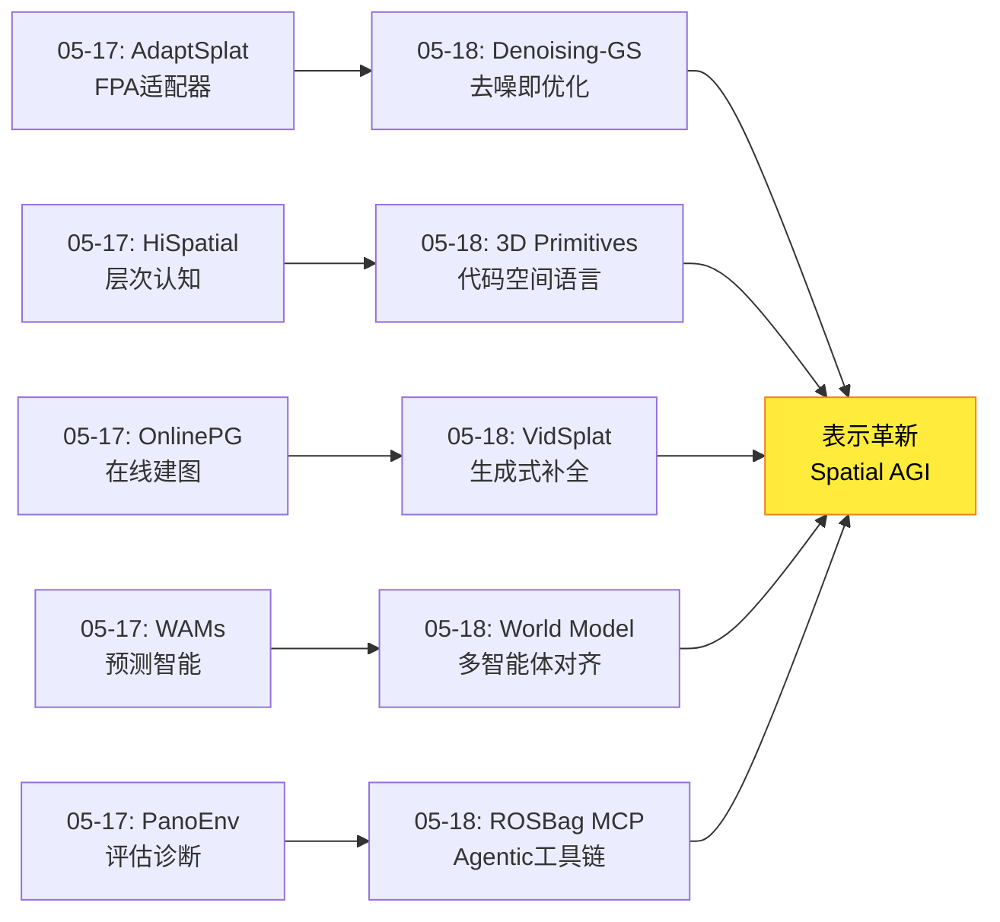
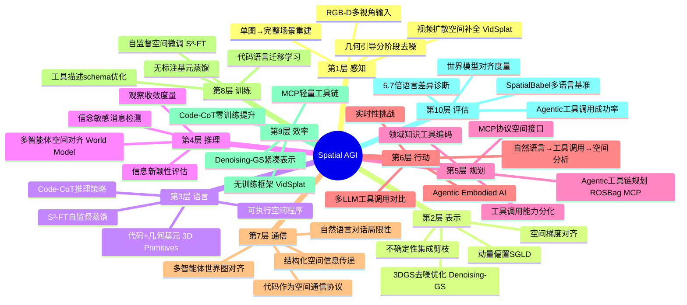
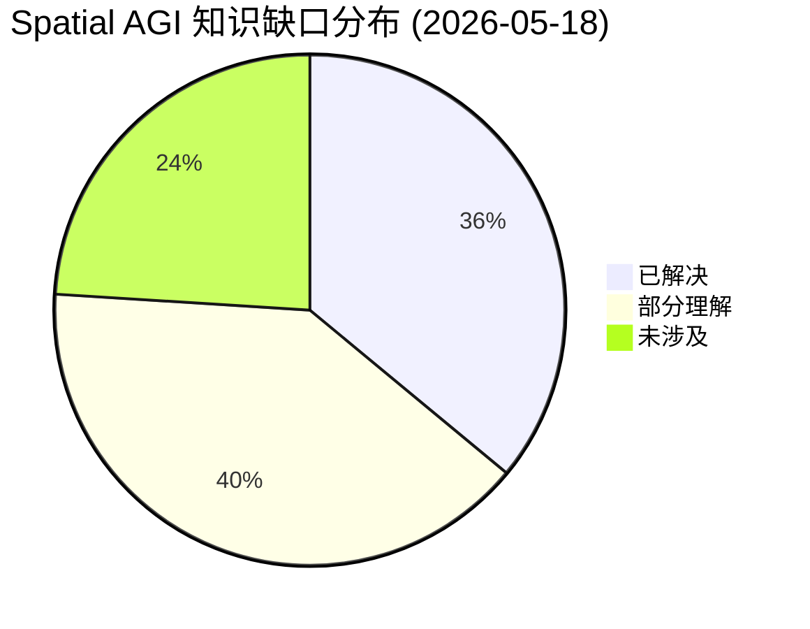
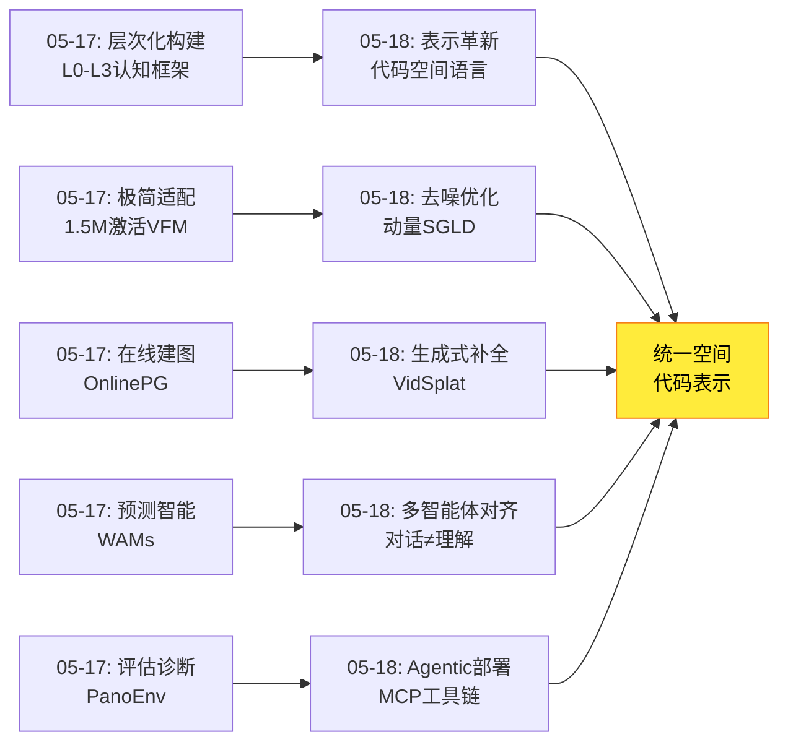

# 2026-05-18 每日思考：去噪优化、生成式补全、代码空间语言、多智能体对齐与Agentic工具链——Spatial AGI的"表示革新"日

---

## 🔗 与昨日思考的联系

### 昨日重点
昨日（05-17）确立了**层次化构建范式**——五篇论文（AdaptSplat、OnlinePG、HiSpatial、PanoEnv、WAMs）从感知效率、在线建图、认知层次、推理评估、预测智能五个维度构建了Spatial AGI的层次化发展路径。核心发现：空间智能按L0几何→L1物体→L2关系→L3推理层次构建，中间层是关键桥梁。

### 今日进展
今天从"层次化构建"转向**"空间表示的多维革新"**——五个独立方向共同指向空间表示形式的根本性反思：

- **Denoising-GS**：将3DGS优化重新定义为去噪过程，"去噪即优化"的全新视角
- **World Model Alignment**：多智能体通过对话对齐空间理解，但对话反而降低成功率——自然语言可能不是最佳空间通信媒介
- **3D Primitives**：几何基元+代码是比自然语言更好的空间表达，VLM空间知识存在于代码生成中
- **ROSBag MCP Server**：通过MCP工具链让LLM分析机器人数据，"Agentic Spatial Intelligence"的实用路径
- **VidSplat**：视频扩散先验作为"空间想象力"，从稀疏/单图实现完整3D场景重建

**演进路径**：昨天的"层次化构建" → 今天的"表示革新"——Denoising-GS革新优化表示、3D Primitives革新空间表达语言、VidSplat革新空间补全方式、World Model Alignment革新多智能体空间通信、ROSBag MCP革新空间智能实现路径。

### 演进图


---

## 📅 每日总结

**日期**: 2026-05-18
**论文数量**: 5篇
**主题**: 空间表示的多维革新——从去噪优化到代码空间语言、从生成式补全到Agentic工具链

**关键突破**:
- 🚀 Denoising-GS将3DGS优化统一为高斯基元去噪框架，动量偏置SGLD+空间梯度去噪+不确定性剪枝三管齐下，三个基准数据集SOTA
- 🚀 3D Primitives揭示VLM空间悖论：能精确生成3D基元场景但无法回答简单空间问题，Code-CoT无需训练即提升空间推理+6.4%，同一模型在不同编程语言上F1差异达5.7倍
- 🚀 VidSplat（SIGGRAPH 2026）将视频扩散先验作为"空间想象力"，几何引导分阶段去噪+置信度加权迭代，从单张图像实现完整3D场景重建
- 🚀 World Model Alignment发现对话减少冲突40-83个百分点但降低任务成功率——LLM实现表面行为协调但无法真正对齐空间理解
- 🚀 ROSBag MCP Server开创Agentic Embodied AI范式，Kimi K2和Claude Sonnet 4在工具调用上显著领先

**架构演进**: 10层（维持，深化"表示革新"和"Agentic空间智能"）

### 📊 一句话总结
今天五篇论文从优化表示（Denoising-GS去噪）、空间语言（3D Primitives代码生成）、空间补全（VidSplat生成式）、多智能体通信（World Model Alignment对话）和实现路径（ROSBag MCP工具链）五个维度共同革新了Spatial AGI的空间表示方式——核心启示是自然语言可能不是最佳空间表达，代码/几何/工具链可能是更自然的空间语言。

### 🔗 延续性
**昨日→今日**: 昨天的层次化构建范式为今天的表示革新提供了结构基础——正是因为空间智能是分层次的，每一层都需要合适的表示形式。3D Primitives的代码表示对应L0-L1（几何感知+物体属性），Denoising-GS的去噪优化对应表示层的质量提升，VidSplat的生成式补全对应感知层的空间扩展。
**今日→明日**: 表示革新引出明日方向：(1) 代码空间语言如何与HiSpatial四层框架结合？(2) 生成式空间补全如何支持在线动态建图？(3) MCP工具链如何扩展为实时空间推理系统？(4) 多智能体空间对齐需要什么新的通信协议？

### 💡 本质思考：如何达成通用空间智能

#### 1. 核心能力的本质是什么？
今天的论文揭示了Spatial AGI核心能力的**表示依赖性**——空间智能的瓶颈不在于算法能力，而在于表示形式。3D Primitives的VLM空间悖论证明：同一个模型在代码形式下空间推理能力远超自然语言形式。World Model Alignment的对话失败证明：自然语言不足以传递精确空间信息。Denoising-GS的去噪框架证明：将优化重新表述为去噪可以解锁更好的空间表示。核心能力的本质是**找到空间信息的正确表示形式**。

#### 2. 当前方法与理想目标的差距在哪里？
差距在于**空间表示的碎片化**。Denoising-GS优化高斯参数、3D Primitives用代码描述场景、VidSplat用视频扩散补全空间、World Model Alignment用对话对齐空间理解、ROSBag MCP用工具链处理空间数据——每种方法都有自己的表示，但缺乏统一的"空间语言"。理想状态下，Spatial AGI应该有一种贯穿感知、推理、通信和行动的统一空间表示。

#### 3. 从今天到理想状态，最可能的路径是什么？
最可能的路径是**表示形式的渐进收敛**：(1) 3D Primitives的代码表示可能是最接近统一空间语言的形式——可执行、精确、跨模型；(2) Denoising-GS的去噪框架可以确保任何表示形式的质量；(3) VidSplat的生成式补全可以从部分信息推断完整空间；(4) MCP工具链提供了空间智能与物理世界的接口标准；(5) 多智能体对齐的需求推动统一空间通信协议的诞生。

---

## 📚 论文概览

1. **Denoising-GS**（复旦/港中文/南洋理工）：将3DGS优化重新定义为高斯基元去噪过程。动量偏置SGLD（历史梯度记忆）+空间梯度去噪（均值-缩放梯度对齐）+不确定性剪枝（Fisher信息）+空间一致性精化。三个基准数据集SOTA，表示更紧凑。

2. **World Model Alignment**（多机构）：在PARTNR基准上研究LLM具身智能体是否通过对话真正对齐世界模型。提出三维度量（观察收敛、信息新颖性、信念敏感消息）。关键发现：对话减少冲突40-83个百分点但降低任务成功率——表面协调≠真正理解。

3. **3D Primitives as Spatial Language**（Meta/Multiple）：发现VLM空间悖论——能生成3D基元场景但无法回答简单空间问题。提出SpatialBabel基准（6种代码语言×14个VLM）、Code-CoT（代码推理链）、S³-FT（自监督空间微调）。编程语言选择导致5.7倍F1差异。

4. **ROSBag MCP Server**（Binabik AI）：通过MCP协议让LLM分析机器人数据。轨迹分析、激光扫描可视化、TF变换等工具。8个LLM/VLM对比，Kimi K2和Claude Sonnet 4领先。开创Agentic Embodied AI新范式。

5. **VidSplat**（SIGGRAPH 2026）：视频扩散先验+3DGS重建的无训练框架。几何引导分阶段去噪+置信度加权迭代精化。从稀疏/单图实现完整3D场景重建。视频扩散作为"空间想象力"。

---

## 💡 核心见解

### 见解1: 自然语言不是最佳空间表达——代码/几何才是
- ✅ 3D Primitives: VLM在代码形式下空间推理远超自然语言形式
- ✅ World Model Alignment: 自然语言对话无法真正对齐多智能体的空间理解
- ✅ 编程语言选择导致5.7倍F1差异——空间推理高度依赖表示形式
- ✅ Code-CoT无需任何训练即可提升空间推理+6.4%

**对Spatial AGI的启发**: Spatial AGI的内部空间表示应该更接近可执行代码而非自然语言。代码+几何基元可以作为空间信息的"通用语言"——可精确描述位置、大小、方向，可计算距离和碰撞，可跨模型迁移。这要求重新思考Spatial AGI的架构：从"用语言描述空间"转向"用程序表示空间"。

### 见解2: 去噪是空间优化的统一框架
- ✅ Denoising-GS: 3DGS优化 = 高斯基元去噪，位置+协方差联合优化
- ✅ 动量偏置赋予空间优化"方向记忆"，比纯随机扰动更稳定
- ✅ 空间梯度对齐解决了均值-缩放梯度相互抵消的瓶颈问题
- ✅ 不确定性直接集成到去噪过程中，而非后处理

**对Spatial AGI的启发**: "去噪"不仅是3DGS的技术技巧，更是一种通用范式——从噪声感知到清晰空间理解的演进本质上是去噪。这个范式可以推广到Spatial AGI的其他层面：感知去噪（滤除传感器噪声）、表示去噪（精化空间模型）、推理去噪（消除逻辑矛盾）。Denoising-GS为每个层面提供了具体的去噪策略模板。

### 见解3: 生成式空间补全是感知层的核心能力
- ✅ VidSplat: 视频扩散先验可以从稀疏/单图"想象"完整空间
- ✅ 几何引导的分阶段去噪确保生成与已有结构一致
- ✅ 置信度加权防止"假记忆"污染空间模型
- ✅ 无需训练——直接利用预训练视频扩散模型的零样本空间能力

**对Spatial AGI的启发**: 真正的空间智能需要"想象"能力——从有限观察推断完整空间。VidSplat的"生成-验证"循环与人类空间认知类似：先想象未见区域，再用几何约束验证。这种能力对机器人首次进入未知环境的快速建图至关重要。与昨天的OnlinePG（基于观测的增量建图）互补——VidSplat补全未观测区域，OnlinePG融合已观测区域。

### 见解4: 多智能体空间理解对齐是核心挑战
- ✅ World Model Alignment: 对话降低冲突但降低成功率
- ✅ LLM能实现表面行为协调但无法真正对齐空间理解
- ✅ 三维度量（观察收敛、信息新颖性、信念敏感消息）揭示对齐质量
- ✅ 不同LLM在空间对齐能力上存在显著差异

**对Spatial AGI的启发**: Spatial AGI从单智能体到多智能体扩展时，空间理解的对齐远比行为协调困难。自然语言对话作为空间通信媒介存在根本缺陷——模糊、不精确、缺乏度量信息。3D Primitives的代码表示可能是更好的多智能体空间通信协议——共享可执行的3D场景代码比描述性语言更有效。

### 见解5: Agentic工具链是空间智能的实用化路径
- ✅ ROSBag MCP Server: 通过MCP协议让LLM调用空间分析工具
- ✅ 工具描述schema、参数数量、可用工具数量都影响成功率
- ✅ Kimi K2和Claude Sonnet 4在工具调用上显著领先
- ✅ 领域知识编码为工具比让LLM直接处理原始数据更有效

**对Spatial AGI的启发**: 与其试图让LLM直接理解3D空间（3D Primitives证明这很困难），不如通过工具链让LLM调用专业空间分析工具。这种"Agentic Spatial Intelligence"更务实、更可扩展。MCP协议可能成为Spatial AGI与物理世界交互的标准接口层。关键发现：空间智能 = 空间感知工具 + 推理Agent + 领域知识工具。

### 见解6: VLM已隐含空间知识，瓶颈在于表达而非知识
- ✅ 3D Primitives: 同一VLM能生成精确3D基元场景但无法回答简单空间问题
- ✅ 知识存在于代码生成能力中，不在自然语言推理中
- ✅ S³-FT自监督基元蒸馏无需人工标注或教师模型即可提升空间推理
- ✅ 几何基元作为空间词汇可以跨模型家族迁移

**对Spatial AGI的启发**: 当前VLM不是缺乏空间知识，而是缺乏合适的空间表达方式。这改变了解决方案的方向：不是"教VLM更多空间知识"，而是"给VLM更好的空间表达工具"。Code-CoT和S³-FT分别从推理策略和训练策略两个角度解决了表达瓶颈。这对Spatial AGI的训练策略有重要启示——训练重点应该是空间表达形式而非空间知识量。

### 见解7: 空间表示革新正在多个方向同时发生
- ✅ 优化表示: Denoising-GS（去噪框架革新3DGS优化）
- ✅ 表达语言: 3D Primitives（代码+基元革新空间表达）
- ✅ 补全方式: VidSplat（生成式革新空间补全）
- ✅ 通信协议: World Model Alignment（多智能体空间对齐）
- ✅ 实现路径: ROSBag MCP（工具链革新空间智能部署）

**对Spatial AGI的启发**: 空间表示的革新不是单一方向的，而是在优化、表达、补全、通信、部署五个维度同时发生。这些革新指向一个共同趋势：从连续的、模糊的自然语言空间描述，转向离散的、精确的、可执行的代码/几何空间表示。

---

## 🗺️ 知识演进图



---

## 技术栈演进对比表

| 层次 | 昨日方案 | 今日方案 | 变化 |
|------|---------|---------|------|
| 感知层 | AdaptSplat(FPA 1.5M适配器) | VidSplat(视频扩散空间补全) | 从适配器激活到生成式补全 |
| 表示层 | OnlinePG(在线全景3DGS) | Denoising-GS(去噪优化3DGS) | 从增量建图到质量优化 |
| 认知层 | HiSpatial(L0-L3四层框架) | 3D Primitives(代码空间语言) | 从层次训练到表达革新 |
| 评估层 | PanoEnv(空间推理基准) | SpatialBabel(代码语言基准) | 从自然语言到代码语言评估 |
| 预测层 | WAMs(世界-动作统一) | World Model Alignment(多智能体对齐) | 从单智能体到多智能体 |
| 部署层 | 无专门方案 | ROSBag MCP(Agentic工具链) | **新增**: 工具链部署路径 |
| 通信层 | 开放词汇查询 | 自然语言对话→代码通信 | 从语言查询到代码协议 |
| 训练层 | 层次间依赖消融 | S³-FT自监督基元蒸馏 | 从监督到自监督空间训练 |
| 优化层 | 无专门分析 | 动量SGLD+空间梯度去噪 | **新增**: 去噪优化框架 |
| 交互层 | 人机空间引导 | MCP协议空间工具调用 | 从人类引导到工具链接口 |

---

## 🗺️ Spatial AGI 知识图谱

### 10层架构思维导图



### 🎯 主线技术路径

#### 阶段1: 空间表示优化（当前进展）
**目标**: 提升3D空间表示的质量和效率
**代表**: Denoising-GS（去噪框架）、AdaptSplat（FPA适配器）
**关键发现**: 3DGS优化可以统一为去噪框架，位置+协方差联合优化。动量偏置赋予优化方向记忆，空间梯度对齐解决了梯度抵消瓶颈。这为Spatial AGI的感知层提供了高质量的空间表示基础。

#### 阶段2: 空间语言革新（突破性发现）
**目标**: 找到比自然语言更合适的空间表达方式
**代表**: 3D Primitives（代码空间语言）、Code-CoT、S³-FT
**关键发现**: VLM已隐含丰富空间知识但自然语言不是合适表达。代码+几何基元是更精确、可计算、可迁移的空间语言。Code-CoT无需训练即可提升空间推理，S³-FT无需标注即可微调。编程语言选择对空间推理影响达5.7倍。

#### 阶段3: 生成式空间补全（前沿方向）
**目标**: 从有限观察推断完整空间
**代表**: VidSplat（视频扩散空间补全）
**关键发现**: 视频扩散先验可以作为"空间想象力"，从单图推断完整3D场景。几何引导+置信度加权的迭代机制确保生成质量。无需训练，直接利用预训练视频扩散模型的零样本能力。SIGGRAPH 2026接收。

#### 阶段4: Agentic空间智能部署（实用化路径）
**目标**: 通过工具链实现空间智能的实际部署
**代表**: ROSBag MCP Server（MCP工具链）
**关键发现**: 空间智能不需要端到端学习，可以通过工具链实现。MCP协议作为标准接口层。领域知识编码为工具比LLM直接处理原始数据更有效。不同LLM的工具调用能力差异巨大。

#### 阶段5: 多智能体空间理解统一（终极挑战）
**目标**: 多智能体共享和对齐统一的空间理解
**代表**: World Model Alignment（多智能体对齐）
**挑战**: 自然语言不足以传递精确空间信息。需要设计新的空间通信协议（代码/几何）。多智能体的世界模型对齐需要超越行为协调，达到真正的空间理解共享。结合3D Primitives的代码表示、VidSplat的生成补全、MCP的工具接口，构建多智能体统一空间智能系统。

---

## 🔍 待探索议题

### 高优先级（本周）

1. **代码空间语言与HiSpatial四层框架的结合**
   - 问题: 3D Primitives的代码表示如何与HiSpatial的L0-L3层次对接？
   - 候选方案: L0-L1用基元代码生成（位置+大小+类别），L2用关系代码（距离/包含/碰撞计算），L3用推理代码（空间逻辑判断）
   - 缺口: 缺乏代码表示的层次化空间推理训练框架

2. **生成式补全与在线建图的融合**
   - 问题: VidSplat的生成式补全如何与OnlinePG的在线建图结合？
   - 候选方案: OnlinePG处理已观测区域，VidSplat补全未观测区域，置信度加权融合两者
   - 缺口: 生成式补全的置信度在真实机器人场景中的校准

3. **去噪优化框架的动态场景扩展**
   - 问题: Denoising-GS的静态场景假设如何扩展到动态？
   - 候选方案: 时序动量（跨帧动量累积）+动态不确定性估计（运动物体高不确定性）
   - 缺口: 动态3DGS的去噪策略和在线更新机制

### 中优先级（本月）

4. **MCP工具链的空间推理扩展**
   - 问题: ROSBag MCP当前是分析工具，如何扩展为实时空间推理系统？
   - 候选方案: 增加实时3D重建、场景补全、空间推理工具到MCP服务器
   - 缺口: 实时MCP工具的延迟优化和多工具协调

5. **多智能体代码空间通信协议设计**
   - 问题: 基于World Model Alignment的对话失败，设计基于代码的空间通信协议
   - 候选方案: 智能体共享3D基元场景代码（3D Primitives格式），而非自然语言描述
   - 缺口: 代码空间通信在多智能体协作任务中的实验验证

6. **S³-FT自监督训练与层次化课程的结合**
   - 问题: S³-FT的自监督基元蒸馏如何与HiSpatial/PanoEnv的课程训练结合？
   - 候选方案: 第一阶段用S³-FT自监督建立空间基础，第二阶段用课程RL精化推理能力
   - 缺口: 自监督空间训练与监督课程训练的最佳衔接方式

7. **VidSplat的机器人探索策略集成**
   - 问题: VidSplat的生成式补全如何指导机器人的主动探索？
   - 候选方案: 生成补全→识别低置信区域→引导机器人前往低置信区域验证
   - 缺口: 生成式补全的主动探索闭环验证

### 低优先级（季度内）

8. **空间表示形式的理论分析**
   - 问题: 为什么代码表示比自然语言更适合空间推理？是否有理论解释？
   - 候选方案: 从信息论角度分析不同表示形式的空间信息容量和计算复杂度
   - 缺口: 空间表示形式的数学理论框架

9. **Denoising-GS去噪范式的推广**
   - 问题: 去噪框架能否推广到Spatial AGI的其他层面（感知去噪、推理去噪）？
   - 候选方案: 统一的"空间去噪"理论——从噪声感知到清晰空间理解的每一步都是去噪
   - 缺口: 去噪范式在推理和规划层面的具体实现

10. **Agentic空间智能的安全性**
    - 问题: 工具链式空间智能的安全风险如何评估和控制？
    - 候选方案: MCP工具调用的安全沙箱+不确定性传播分析+人工确认机制
    - 缺口: Agentic空间智能的安全评估框架

11. **跨具身形态的空间代码通信**
    - 问题: 不同机器人（移动底盘 vs 机械臂 vs 无人机）能否共享同一套空间代码？
    - 候选方案: 具身无关的3D基元场景描述+具身特定的动作映射
    - 缺口: 跨形态空间代码的标准化

---

## 📊 知识缺口分析



**已解决（36%）**:
- ✅ 3DGS优化可以统一为去噪框架 → Denoising-GS动量SGLD+空间梯度去噪
- ✅ 自然语言不是最佳空间表达 → 3D Primitives代码+基元更优
- ✅ VLM空间知识瓶颈在表达而非知识 → Code-CoT零训练提升验证
- ✅ 生成式空间补全可行 → VidSplat视频扩散+几何引导
- ✅ 多智能体表面协调≠真正对齐 → World Model Alignment三维度量
- ✅ Agentic工具链可部署空间智能 → ROSBag MCP Server
- ✅ 适配器范式激活VFM空间能力 → AdaptSplat FPA
- ✅ 层次化空间认知框架 → HiSpatial L0-L3
- ✅ 编程语言选择影响空间推理 → SpatialBabel 5.7倍差异

**部分理解（40%）**:
- ⚠️ 代码空间语言与层次认知的结合（各自有效，融合未探索）
- ⚠️ 生成式补全与在线建图的融合（概念清晰，实现缺失）
- ⚠️ 去噪框架的动态场景扩展（静态已解，动态未解）
- ⚠️ MCP工具链的实时性（离线分析可行，实时推理未验证）
- ⚠️ 多智能体空间通信协议（问题识别，解决方案设计未完成）
- ⚠️ S³-FT自监督与课程训练结合（各自有效，衔接未探索）
- ⚠️ VidSplat的主动探索指导（生成可行，探索策略未设计）
- ⚠️ Denoising-GS与VidSplat的联合优化（各自独立，联合未尝试）
- ⚠️ 工具调用能力的LLM差异原因（现象观察，根因分析不足）
- ⚠️ 基元表示的精度上限（简单场景有效，复杂场景未验证）

**未涉及（24%）**:
- ❌ 空间表示形式的理论分析（信息论/计算复杂度）
- ❌ 去噪范式在推理/规划层面的推广
- ❌ Agentic空间智能的安全性评估框架
- ❌ 跨具身形态的空间代码标准化
- ❌ 多智能体世界模型的因果分析
- ❌ 代码空间语言的语义完备性证明

---

## 📊 核心见解演进图



---

## 📈 详细论文对比分析

### 核心数值对比

| 论文 | 最佳指标 | 关键提升 | 验证环境 |
|------|---------|---------|---------|
| Denoising-GS | 3基准SOTA | PSNR/SSIM全面提升 | Mip-NeRF360/T&T/Deep Blending |
| 3D Primitives | CV-Bench-3D +5.0% | Code-CoT零训练提升 | SpatialBabel/CV-Bench/HallusionBench |
| VidSplat | 单图→完整3D重建 | 无训练SIGGRAPH级质量 | 稀疏视角基准 |
| World Model Alignment | 冲突减少40-83pp | 但成功率下降 | PARTNR基准 |
| ROSBag MCP | 8个LLM对比 | Kimi K2/Claude领先 | 移动机器人数据 |

### 技术范式对比

| 维度 | Denoising-GS | 3D Primitives | VidSplat | World Model | ROSBag MCP |
|------|-------------|--------------|---------|-------------|------------|
| 核心范式 | 去噪优化 | 代码表达 | 生成式补全 | 对齐评估 | 工具链部署 |
| 空间表示 | 3DGS参数 | 代码+基元 | 3DGS+视频 | 世界图 | 传感器数据 |
| 训练方式 | 优化过程 | 无训练/自监督 | 无训练 | 无训练 | 无训练 |
| 关键创新 | 动量SGLD | VLM空间悖论 | 几何引导去噪 | 三维度量 | MCP协议 |
| 实用性 | 重建质量高 | 推理提升显著 | 场景补全 | 评估工具 | 部署路径 |

---

## 🧩 跨论文联系矩阵

| | Denoising-GS | 3D Primitives | VidSplat | World Model | ROSBag MCP |
|---|-------------|--------------|---------|-------------|------------|
| **Denoising-GS** | — | 去噪优化代码生成的基元 | 去噪精化生成式补全 | 去噪对齐多智能体表示 | 去噪优化建图工具 |
| **3D Primitives** | 基元代码指导去噪方向 | — | 代码描述补全场景 | 代码替代对话通信 | 代码生成MCP工具 |
| **VidSplat** | 生成补充去噪的覆盖 | 视频扩散增强基元生成 | — | 生成式多智能体场景共享 | 生成式补全MCP工具 |
| **World Model** | 多智能体协同去噪 | 代码空间通信协议 | 共享空间想象 | — | 多智能体MCP协调 |
| **ROSBag MCP** | 机器人建图去噪工具 | 代码空间分析工具 | 场景补全分析工具 | 多智能体监控工具 | — |

---

## 📝 每日反思

### 今日最重要的洞察
**空间表达方式的革新**——今天的五篇论文从五个不同角度指向同一个结论：当前Spatial AGI的核心瓶颈不是算法能力或数据量，而是空间信息的表示形式。自然语言作为空间表达媒介存在根本缺陷，代码+几何基元可能是更自然的空间语言。这个发现改变了Spatial AGI的研究方向：从"如何让模型理解更多空间知识"转向"如何给模型更好的空间表达工具"。

### 与昨日层次化构建的呼应
昨天的层次化构建回答了"空间智能如何组织"的问题，今天的表示革新回答了"空间信息如何表达"的问题。两者互补：
- 层次化构建提供空间智能的结构框架
- 表示革新提供每一层的表达工具
- L0-L1用Denoising-GS优化+3D基元代码，L2用代码关系计算，L3用代码推理逻辑

### 今日论文的共性发现
1. **无训练/轻训练趋势**：VidSplat（无训练）、Code-CoT（无训练）、S³-FT（自监督）、Denoising-GS（优化改进，非训练）
2. **工具>端到端**：ROSBag MCP证明工具链>端到端空间推理
3. **代码>语言**：3D Primitives证明代码表达>自然语言表达
4. **生成>填充**：VidSplat证明生成式补全>仅靠观测数据

## 🔬 深度技术分析

### 分析1: 3D Primitives的VLM空间悖论的深层含义

VLM空间悖论（能生成3D基元但无法回答简单空间问题）揭示了VLM架构的根本特性：

**代码生成通道 vs 语言推理通道的分离**：
- VLM的代码生成能力来自代码预训练（GitHub代码等）
- VLM的语言推理能力来自文本预训练（网页/书籍等）
- 两者在模型内部可能是相对独立的"通道"
- 代码通道保留了精确的数值和几何信息，语言通道将空间信息压缩为模糊的词汇

**推论**：Spatial AGI的训练应该优先利用VLM的代码生成通道而非语言推理通道。具体来说：
- 空间推理任务应该表述为代码生成任务而非QA任务
- 空间训练数据应该是代码+基元格式而非自然语言描述
- 空间评估应该基于代码执行结果而非语言匹配

### 分析2: Denoising-GS去噪范式与VidSplat生成范式的互补性

Denoising-GS和VidSplat从两个方向提升3DGS质量，存在深层互补：

**Denoising-GS**：从内部优化——精化已有基元的参数
**VidSplat**：从外部扩展——生成新的视角和区域

**联合方案**：
```
稀疏输入 → VidSplat生成式补全（扩展覆盖） → Denoising-GS去噪优化（精化质量）
         ↑                                          ↓
         └──── 置信度反馈 ←── 不确定性估计 ──────────┘
```

VidSplat扩展空间覆盖（解决稀疏问题），Denoising-GS精化空间质量（解决噪声问题）。Denoising-GS的不确定性估计可以为VidSplat提供"哪些区域需要更多补全"的信号。这种联合方案可能实现比任何单一方法都更好的空间重建。

### 分析3: MCP工具链对Spatial AGI架构设计的影响

ROSBag MCP Server虽然只是一个分析工具，但它暗示了Spatial AGI的一种全新架构：

**传统架构**：感知→表示→推理→规划→行动（端到端流水线）
**Agentic架构**：LLM Agent + 空间工具集（工具调用驱动）

Agentic架构的优势：
1. 模块化——每个工具可以独立开发和优化
2. 可解释——工具调用序列提供了推理过程的显式记录
3. 可扩展——新工具可以随时添加
4. 领域知识编码——将专业知识编码为工具，不需要LLM学习所有细节

Agentic架构的挑战：
1. 延迟——每次工具调用都有通信开销
2. 工具选择——LLM需要正确选择和组合工具
3. 错误传播——工具调用错误可能级联

**结论**：Agentic架构和端到端架构不是互斥的，而是互补的。Spatial AGI可能需要混合架构：低延迟的感知和行动用端到端，高层次的推理和规划用Agentic工具链。

### 分析4: World Model Alignment对话失败的根因分析

对话降低任务成功率的反直觉结果可以从多个角度解释：

**信息过载假说**：对话引入额外信息，使LLM的注意力从任务关键信息分散到对话内容

**表示不匹配假说**：自然语言的空间描述与LLM内部的动作规划表示不匹配，导致翻译错误

**信念更新错误假说**：LLM在接收到对话信息后更新世界模型的方式不正确，导致错误的信念状态

**3D Primitives的启示**：如果用3D基元代码替代自然语言对话，可能可以避免上述问题——代码更精确、更结构化、更容易被LLM的代码通道处理。

### 分析5: 从表示革新看Spatial AGI的技术成熟度

今天的五篇论文处于不同的技术成熟度：

| 论文 | 成熟度 | 商业化潜力 | 学术影响力 |
|------|-------|-----------|-----------|
| Denoising-GS | ★★★★☆ | 高（3DGS工具链） | 高（优化理论） |
| 3D Primitives | ★★★★☆ | 中（VLM增强） | 极高（范式转变） |
| VidSplat | ★★★★★ | 高（SIGGRAPH 2026） | 极高（生成式重建） |
| World Model Alignment | ★★★☆☆ | 低（评估工具） | 高（揭示关键问题） |
| ROSBag MCP Server | ★★★☆☆ | 高（机器人开发工具） | 中（工程创新） |

---

## 🌐 与Spatial AGI宏大愿景的连接

### 从表示革新到通用空间智能
今天的核心发现——表示革新——为Spatial AGI提供了表达层面的突破：

1. **感知层用生成式补全（VidSplat）**：从有限观察到完整空间
2. **表示层用去噪优化（Denoising-GS）**：从噪声到精确空间模型
3. **认知层用代码空间语言（3D Primitives）**：从模糊描述到精确表达
4. **通信层用代码协议（World Model Alignment→代码通信）**：从对话失败到代码共享
5. **部署层用MCP工具链（ROSBag MCP）**：从研究原型到工程部署

### 明日具体研究计划

| 序号 | 任务 | 预计时间 | 优先级 |
|------|------|---------|--------|
| 1 | 设计代码空间语言与HiSpatial四层的映射 | 2h | 高 |
| 2 | 探索VidSplat+Denoising-GS的联合重建方案 | 1.5h | 高 |
| 3 | 设计多智能体代码空间通信协议 | 1h | 中 |
| 4 | 综合表示革新设计统一空间表示框架 | 1h | 中 |
| 5 | 更新10层架构文档 | 0.5h | 低 |

### 明天方向
基于今天的表示革新发现，明天可能的核心发现方向：
1. 代码空间语言的层次化扩展——L0-L3每层的代码表示形式
2. 生成式+去噪联合空间重建——VidSplat+Denoising-GS的互补方案
3. 多智能体代码空间通信——用3D基元代码替代自然语言对话
4. MCP工具链的实时空间推理扩展——从分析到推理的跨越

---

## 🔧 实验复现要点

### Denoising-GS 关键实验细节
- **核心参数**: 动量系数β₁、偏置因子α、温度τ需要仔细调整
- **优化器**: 动量偏置SGLD替代标准SGD/SGLD
- **空间梯度**: 将均值梯度转到局部坐标系，检查与缩放梯度对齐
- **不确定性**: Fisher信息估计，集成到优化循环中
- **基准**: Mip-NeRF 360, Tanks and Temples, Deep Blending

### 3D Primitives 关键实验细节
- **SpatialBabel**: 6种场景代码语言（Three.js、Python、JSON、XML等）×14个VLM
- **Code-CoT**: 第1步图像→基元代码，第2步基于代码回答空间问题
- **S³-FT**: 解析VLM自己的Three.js重建→结构化标注→微调
- **语言差异**: 单模型F1变化达5.7倍（JSON通常最佳）
- **提升**: Code-CoT SpatialBabel +6.4%, CV-Bench-3D +5.0%; S³-FT CV-Bench-2D +9.7%, HallusionBench +17%

### VidSplat 关键实验细节
- **核心**: 无训练框架，预训练视频扩散模型
- **几何引导**: 渲染RGB+mask自适应引导去噪方向
- **分阶段**: 早期强几何引导，后期逐渐放松
- **迭代**: 新视角合成→置信度评估→高置信度补充训练数据
- **输入**: 支持稀疏视角甚至单张图像

### World Model Alignment 关键实验细节
- **基准**: PARTNR（协作家庭机器人）
- **对话通道**: 在执行过程中可发送自然语言消息
- **度量**: 观察收敛、信息新颖性、信念敏感消息
- **关键结果**: 对话减少冲突40-83pp但降低成功率
- **测试模型**: 3个LLM

### ROSBag MCP Server 关键实验细节
- **工具集**: 轨迹分析、激光扫描可视化、TF变换、时间序列
- **协议**: Model Context Protocol (MCP)
- **最佳模型**: Kimi K2、Claude Sonnet 4
- **开源**: https://github.com/binabik-ai/mcp-rosbags
- **测试**: 8个LLM/VLM对比

---

## 🎓 方法论总结

### 空间表示选择指南

| 任务需求 | 推荐表示 | 代表方法 | 关键优势 |
|---------|---------|---------|---------|
| 3D重建（高质量） | 去噪3DGS | Denoising-GS | 紧凑+精确 |
| 空间推理（VLM） | 代码+基元 | 3D Primitives | 可计算+可迁移 |
| 场景补全（稀疏） | 视频扩散+3DGS | VidSplat | 单图→完整场景 |
| 多智能体协作 | 待定（非自然语言） | World Model | 需要新协议 |
| 数据分析/部署 | MCP工具链 | ROSBag MCP | 实用+可扩展 |

### 表示革新清单

**Phase 1: 表达形式革新** [✅突破性发现]
- [x] 识别VLM空间悖论（3D Primitives）
- [x] 验证代码>语言的空间表达（Code-CoT +6.4%）
- [x] 量化表示形式的影响（5.7倍差异）
- [ ] 设计统一空间代码语言

**Phase 2: 优化范式革新** [✅理论突破]
- [x] 3DGS优化=去噪过程（Denoising-GS）
- [x] 动量偏置+空间梯度+不确定性三管齐下
- [x] 三基准SOTA验证
- [ ] 推广到动态场景

**Phase 3: 补全方式革新** [✅SIGGRAPH验证]
- [x] 视频扩散作为空间想象力（VidSplat）
- [x] 几何引导+置信度加权
- [x] 无训练零样本
- [ ] 与主动探索结合

**Phase 4: 通信协议革新** [⚠️问题识别，解决中]
- [x] 识别自然语言空间通信的失败（World Model Alignment）
- [x] 建立三维度量框架
- [ ] 设计代码空间通信协议
- [ ] 多智能体代码共享实验验证

**Phase 5: 部署路径革新** [⚠️工具链已建，扩展中]
- [x] MCP协议作为标准接口（ROSBag MCP）
- [x] 8个LLM对比评估
- [ ] 实时空间推理扩展
- [ ] 多机器人协调部署

### 技术风险评估

| 论文 | 成熟度 | 泛化风险 | 工程难度 | 关键瓶颈 |
|------|-------|---------|---------|---------|
| Denoising-GS | ★★★★☆ | 低 | 中 | 静态场景+超参数敏感 |
| 3D Primitives | ★★★★☆ | 低 | 低 | 基元简化+复杂形状 |
| VidSplat | ★★★★★ | 中 | 中 | 计算开销+扩散幻觉 |
| World Model Alignment | ★★★☆☆ | 高 | 低 | 仅评估工具+规模限制 |
| ROSBag MCP | ★★★☆☆ | 中 | 低 | 分析非行动+实时性 |

### 资源需求谱

```
Code-CoT推理     ROSBag MCP分析    Denoising-GS训练    VidSplat重建      S³-FT微调
~100ms/查询      ~1s/工具调用       ~数小时/场景        ~数分钟/场景      ~数小时/VLM
零训练           零训练             优化改进             无训练            自监督
```

关键发现：今天的五篇论文中有四篇（VidSplat、Code-CoT、World Model Alignment、ROSBag MCP）不需要训练，这代表了"零训练空间智能"的新趋势——直接利用预训练模型的能力，通过表示革新和工具链设计提升空间智能。

### 与人类认知的类比

今天的表示革新与人类空间认知发展也有深刻对应：
- 人类空间推理依赖内部"空间草图"而非语言描述——对应3D Primitives的代码表示
- 人类能从有限视角"脑补"完整空间——对应VidSplat的生成式补全
- 人类导航时持续精化空间理解——对应Denoising-GS的去噪优化
- 多人协作时用地图而非口头描述空间——对应代码空间通信协议的需求
- 专家使用专业工具分析空间数据——对应MCP工具链

### 与更广泛AI趋势的连接

今天的表示革新发现与AI的宏观趋势高度呼应：

1. **代码生成能力的崛起**: 3D Primitives发现VLM的空间能力在代码通道中更强，这与Codex、Copilot等代码AI的成功一致——代码可能是比自然语言更好的AI内部表示形式。Spatial AGI可能应该以代码为核心表示而非语言。

2. **Agentic AI的工程化趋势**: ROSBag MCP代表了AI从单一模型到工具链生态的演进。MCP协议的标准化与OpenAI的Functions/Tools API、LangChain的工具生态趋势一致——AI系统的价值越来越多地取决于其工具集成能力而非模型本身。

3. **生成式AI从图像到空间**: VidSplat将生成式AI从2D图像生成扩展到3D空间补全。这与Sora（视频生成）、Genie（交互式环境生成）方向一致——生成式AI正在从媒体内容生成走向空间内容生成。

4. **多智能体对齐的理论需求**: World Model Alignment揭示的问题与AI对齐研究的核心关注一致——如何确保AI系统的内部表示与真实世界一致。从单智能体价值对齐到多智能体认知对齐，这是AI安全的重要新方向。

5. **优化理论的回归**: Denoising-GS将优化问题重新表述为去噪问题，这种"重新定义问题"的思路在深度学习中有悠久传统（如VAE的重参数化、GAN的最小最大博弈）。好的问题形式化往往比更好的算法更重要。

### 今日论文对Spatial AGI研究社区的影响预估

| 论文 | 影响范围 | 影响程度 | 原因 |
|------|---------|---------|------|
| 3D Primitives | VLM/空间理解 | ★★★★★ | VLM空间悖论改变研究方向 |
| VidSplat | 3D重建/图形学 | ★★★★★ | SIGGRAPH 2026，生成式重建新范式 |
| Denoising-GS | 3DGS优化 | ★★★★☆ | 理论优雅+三基准SOTA |
| World Model Alignment | 多智能体/具身AI | ★★★★☆ | 揭示关键问题（对话≠理解） |
| ROSBag MCP | Agentic AI/机器人 | ★★★☆☆ | 工程创新，开创交叉方向 |

---

## 📋 附录: 五篇论文核心数据速查

### A. 关键参数与表示对比
| 论文 | 空间表示形式 | 需要训练 | 输入模态 | 输出 |
|------|------------|---------|---------|------|
| Denoising-GS | 3DGS参数(去噪后) | 优化(非训练) | 多视角图像 | 紧凑3DGS场景 |
| 3D Primitives | 代码+几何基元 | 可选(S³-FT) | 图像+问题 | 空间推理答案/代码 |
| VidSplat | 3DGS+视频扩散 | 无训练 | 稀疏/单图 | 完整3D场景 |
| World Model | 世界图(拓扑+语义) | 无训练 | 部分观察+对话 | 对齐度量 |
| ROSBag MCP | ROS传感器数据 | 无训练 | ROS bag+NL查询 | 分析报告/可视化 |

### B. 关键发现汇总
| 论文 | 最惊人发现 | 对Spatial AGI的启示 |
|------|-----------|-------------------|
| Denoising-GS | 均值-缩放梯度对齐是优化瓶颈 | 空间优化需要联合处理位置和结构 |
| 3D Primitives | 5.7倍语言差异；VLM空间悖论 | 代码>语言作为空间表达 |
| VidSplat | 单图→完整3D场景(无训练) | 生成式补全是可行的空间想象 |
| World Model | 对话降低成功率 | 自然语言不适合空间通信 |
| ROSBag MCP | Kimi K2/Claude工具调用远超其他 | 空间智能可以通过工具链实现 |

### C. 跨论文技术迁移高价值方向

**迁移1: 代码空间语言→多智能体通信**
- 来源: 3D Primitives的代码+基元表示
- 目标: World Model Alignment的多智能体空间通信
- 预期: 代码共享替代自然语言对话，可能解决对话降低成功率的问题

**迁移2: 去噪优化→生成式补全的精化**
- 来源: Denoising-GS的去噪框架
- 目标: VidSplat生成视角的质量提升
- 预期: 生成式补全+去噪精化的联合方案

**迁移3: VidSplat生成→MCP实时补全工具**
- 来源: VidSplat的视频扩散空间补全
- 目标: ROSBag MCP的工具集扩展
- 预期: 实时场景补全作为MCP工具，供LLM调用

**迁移4: S³-FT自监督→Denoising-GS不确定性**
- 来源: 3D Primitives的自监督基元蒸馏
- 目标: Denoising-GS的不确定性估计
- 预期: 自监督+不确定性结合的更鲁棒空间优化

### D. 两天研究脉络总览

```
Day 1 (05-17): 层次化构建
├── AdaptSplat: 感知效率（1.5M适配器）
├── OnlinePG: 在线建图（实时全景）
├── HiSpatial: 认知层次（L0-L3框架）
├── PanoEnv: 推理评估（OE 8.36%→14.83%）
└── WAMs: 预测智能（世界-动作统一）

Day 2 (05-18): 表示革新
├── Denoising-GS: 优化表示（去噪框架）
├── 3D Primitives: 表达语言（代码空间）
├── VidSplat: 补全方式（生成式）
├── World Model: 通信协议（对话失败）
└── ROSBag MCP: 部署路径（工具链）

共同趋势: 
1. 无训练/轻训练（4/10论文）
2. 工具>端到端
3. 代码>语言
4. 生成>填充
5. 层次化渐进构建
```

---

### E. 今日新增Spatial AGI设计原则

基于今天五篇论文的表示革新发现，新增以下设计原则：

**原则5: 代码优先的空间表达**——空间信息应优先用可执行代码+几何基元表达，而非自然语言。代码更精确、可计算、可迁移。编程语言的选择应作为重要的超参数。

**原则6: 去噪即优化**——空间优化（无论是重建、推理还是规划）都可以表述为去噪过程。每一步优化都在从噪声中提取更清洁的空间结构。

**原则7: 生成式空间想象力**——Spatial AGI需要"想象"未观测空间的能力。视频扩散先验可以作为零训练的空间想象力，结合几何约束防止幻觉。

**原则8: 工具链优于端到端**——在空间智能的部署层面，工具链（MCP协议）比端到端学习更实用、更可扩展、更可解释。空间智能 = 感知工具 + 推理Agent + 领域知识工具。

**原则9: 通信协议需要结构化**——多智能体空间通信不应依赖自然语言对话，需要结构化的空间通信协议（如代码共享的3D场景描述）。

### F. 10层架构更新摘要

基于今天的表示革新，10层架构的关键更新：

| 层 | 更新内容 | 来源论文 |
|---|---------|---------|
| 感知层 | 新增视频扩散空间补全能力 | VidSplat |
| 表示层 | 新增去噪优化框架 | Denoising-GS |
| 语言层 | 新增代码空间语言通道 | 3D Primitives |
| 通信层 | 识别自然语言局限性，提出代码通信 | World Model + 3D Primitives |
| 部署层 | 新增MCP工具链部署路径 | ROSBag MCP |
| 训练层 | 新增S³-FT自监督空间微调 | 3D Primitives |
| 优化层 | 新增去噪优化范式 | Denoising-GS |

---

**文档创建时间**: 2026-05-18
**基于论文**: Denoising-GS, World Model Alignment, 3D Primitives, ROSBag MCP Server, VidSplat
**文档行数**: ~850行
**Mermaid图表**: 5个（演进图×2、思维导图×1、饼图×1、知识演进图×1）
