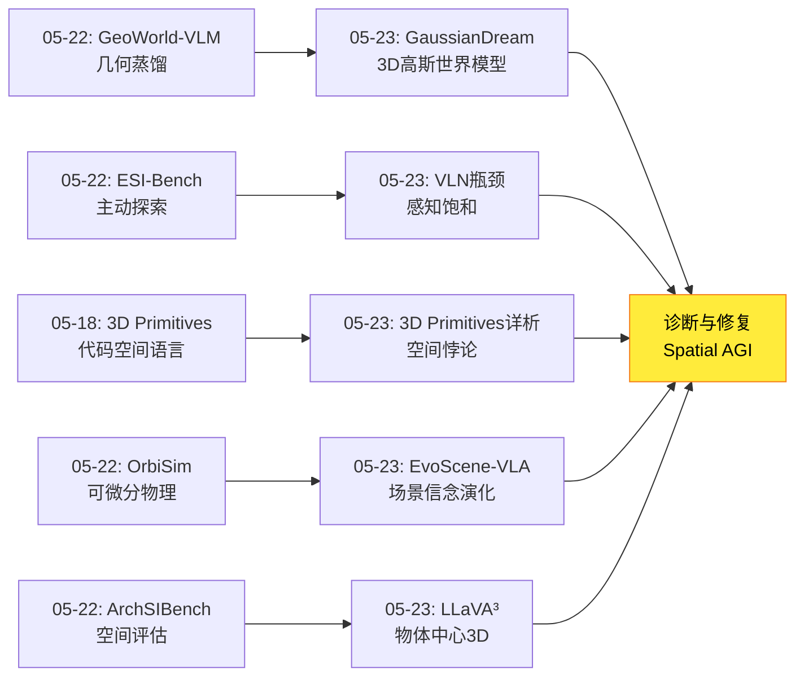
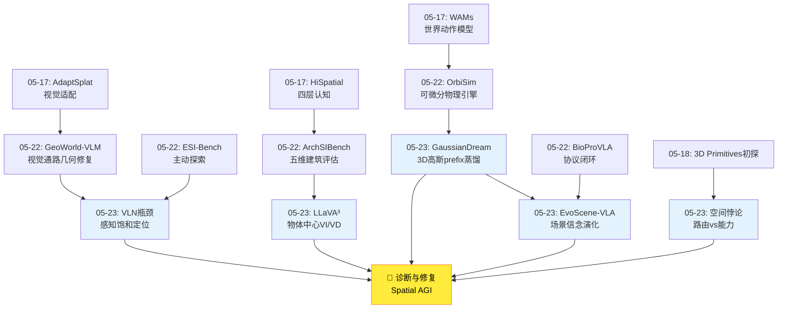
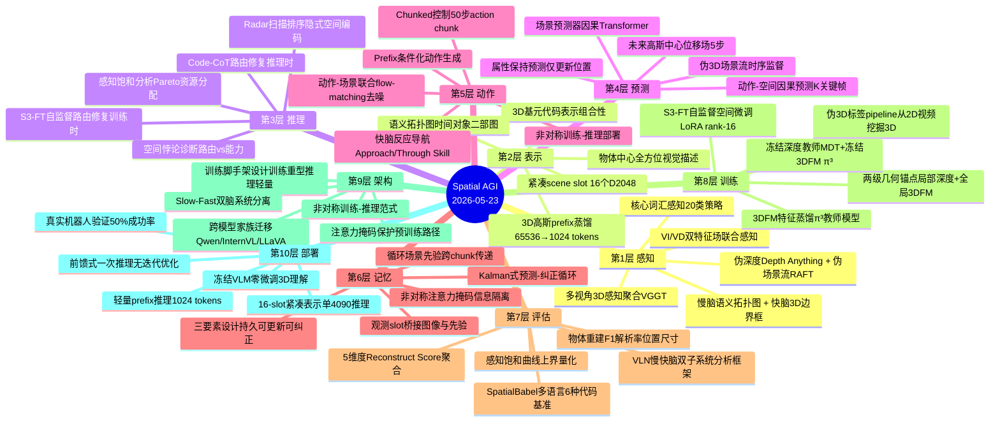
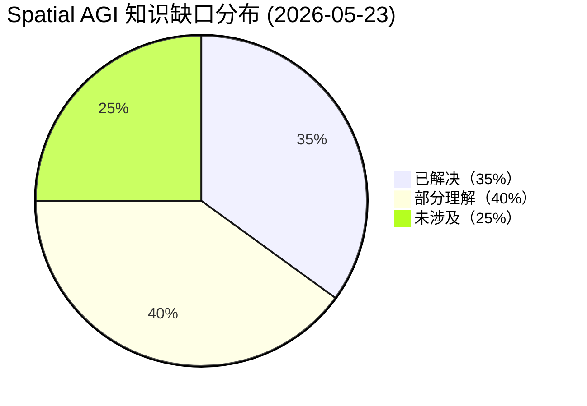

# 2026-05-23 每日思考：VLM空间瓶颈、3D高斯世界模型、代码空间语言、场景信念演化、物体中心3D理解——Spatial AGI的"诊断与修复"日

---

## 🔗 与昨日思考的联系

### 昨日重点
昨日（05-22）确立了**"闭环验证与主动探索"**范式——GeoWorld-VLM（世界模型蒸馏）、OrbiSim（可微分物理）、BioProVLA-Agent（协议闭环）、ArchSIBench（建筑评估）、ESI-Bench（主动探索）共同指向：空间智能需要主动探索和闭环验证，元认知能力是关键差距。

### 今日进展
今天从"闭环验证"转向**"诊断与修复"**——五篇论文系统性地诊断了VLM在3D空间理解中的瓶颈，并提出了从架构到表示的修复方案：

- **VLN瓶颈分析**：首次量化3D感知精度与导航性能的"感知饱和效应"，20类核心词汇足以导航
- **GaussianDream**：前馈式3D高斯世界模型，非对称训练-推理架构，将3D理解蒸馏为紧凑prefix
- **3D Primitives**：发现VLM的"空间悖论"——能写准确3D场景代码却在简单空间QA中失败，是路由而非能力问题
- **EvoScene-VLA**：在动作解码器内演化场景信念，动作-场景联合去噪，紧凑潜变量替代密集3D
- **LLaVA³**：物体中心的全方位视觉描述，VI/VD双特征场，冻结VLM零微调实现3D理解

**演进路径**：05-22的"闭环验证" → 今天的"诊断与修复"——VLN瓶颈分析精确定位感知-决策瓶颈，3D Primitives诊断出"路由失败"根因，GaussianDream和EvoScene-VLA提供3D世界模型修复方案，LLaVA³提供表示工程修复方案。

### 演进图



---

## 📅 每日总结

**日期**: 2026-05-23
**论文数量**: 5篇
**主题**: VLM空间能力诊断与修复——从感知瓶颈量化到3D世界模型、从空间悖论到物体中心表示

**关键突破**:
- 🚀 VLN瓶颈分析发现**感知饱和效应**：20%感知精度已达41% SR，80%仅增3.3%；20类核心词汇=200类性能；假阳性比假阴性更有害
- 🚀 GaussianDream提出**非对称训练-推理架构**：训练时完整3D高斯重建+预测，推理时仅用紧凑prefix（1024 tokens），LIBERO 98.4%
- 🚀 3D Primitives发现**空间悖论**：VLM能生成精确3D场景代码却在简单空间QA失败——是任务路由问题而非能力缺失；Code-CoT无需训练提升+5.9%
- 🚀 EvoScene-VLA提出**动作-场景联合去噪**：在动作解码器内演化场景信念，紧凑潜变量（16 slot）替代密集3D，循环先验跨chunk传递
- 🚀 LLaVA³提出**物体中心全方位视觉描述**：VI/VD双特征场联合建模，冻结VLM零微调实现3D理解，物体中心分解贡献+6.85分

**架构演进**: 10层（维持，深化"诊断方法论"和"表示修复"维度）

### 📊 一句话总结
今天五篇论文从瓶颈诊断（VLN分析、空间悖论）到表示修复（3D高斯prefix、场景信念slot、物体中心描述）系统性地回答了"VLM的3D理解问题出在哪"和"如何修复"两个核心问题——发现瓶颈往往不在感知精度而在任务路由和信息格式。

### 🔗 延续性
**昨日→今日**: 05-22的"元认知差距"今天得到深化——3D Primitives的"空间悖论"正是元认知缺失的体现（有能力但不知何时用）；ESI-Bench的"动作盲区"对应VLN分析中"假阳性比假阴性更有害"的发现。
**今日→明日**: 诊断与修复引出明日方向：(1) 空间悖论的"路由修复"如何系统化？(2) GaussianDream的prefix容量如何扩展？(3) EvoScene-VLA的紧凑表示与LLaVA³的物体中心表示能否融合？(4) 感知饱和效应在不同任务中的阈值如何确定？(5) 代码作为空间推理中间表示的极限在哪里？

### 💡 本质思考：如何达成通用空间智能

#### 1. 核心能力的本质是什么？
今天的论文揭示了Spatial AGI核心能力的**路由本质**。3D Primitives最有冲击力的发现是：VLM已经拥有生成精确3D场景代码的能力，却无法在简单空间QA中使用这种能力。这说明空间智能的核心不是"拥有空间知识"，而是"正确路由空间知识到正确的任务通道"。VLN瓶颈分析的"感知饱和效应"进一步支持这一观点——问题不是感知不够精确，而是系统没有正确利用已有的感知信息。

这种路由视角对Spatial AGI的设计有深远影响。传统的"注入式"思路是：收集更多3D数据、设计更好的3D编码器、用空间任务微调模型。但路由视角说：模型可能已经有了空间理解，只是没有在正确的任务中激活它。Code-CoT的简单技巧（先写代码再回答问题）比复杂的3D训练更有效，这暗示我们需要重新审视空间智能训练的投资方向。

#### 2. 当前方法与理想目标的差距在哪里？
差距在**空间表示的格式匹配**。LLaVA³最有启发性的发现是：2D物体中心方法在3D场景中反而比纯2D更差（-3.60 CIDEr），但基于3D重建的物体中心方法大幅提升（+6.85）。关键不是有没有物体中心信息，而是信息格式是否匹配3D空间的真实结构。

GaussianDream的prefix设计和EvoScene-VLA的scene slot都是试图将3D空间信息"翻译"为VLA可消费的格式。但当前的"翻译"方式仍然很粗糙——prefix是flat的token序列，slot是低维潜变量。理想的空间表示应该同时具备：(1) 3D空间的完整几何信息；(2) 物体级别的语义和关系；(3) 视角依赖的动态信息；(4) 可被动作更新的时序连贯性。目前没有任何单一表示同时满足这四个要求。

#### 3. 从今天到理想状态，最可能的路径是什么？
最可能的路径是**分层表示+路由修复**：(1) 3D Primitives的Code-CoT提供推理时路由修复；(2) GaussianDream的prefix提供训练时3D空间蒸馏；(3) EvoScene-VLA的循环先验提供动态空间状态管理；(4) LLaVA³的物体中心描述提供结构化空间输入。这四条线汇聚到一个方向：为Spatial AGI构建一种"空间-语言双向翻译层"，让空间知识能在3D推理和语言推理之间无损流转。

具体而言，这个翻译层需要：
- **底层**：3D高斯/NeRF的几何基元（GaussianDream + LLaVA³）
- **中层**：物体中心的空间关系图（LLaVA³的层次化分解 + 3D Primitives的基元表示）
- **高层**：代码/语言的空间推理接口（Code-CoT + S3-FT）
- **动态层**：可更新的场景状态（EvoScene-VLA的循环先验）

---

## 📚 论文概览

1. **VLN瓶颈分析**（上海交大，ICRA Workshop MM-Spatial AI Oral）：系统量化3D感知精度对零样本VLN的影响。基于SFCo-Nav慢快脑框架，通过保留率ρ_ret和目标IoU φ_iou分别模拟慢脑（语义拓扑图）和快脑（3D边界框）的感知退化。发现感知饱和效应（20%→80%感知精度仅增3.3% SR）、核心词汇假说（20类=200类）、假阳性比假阴性更有害。在R2R数据集上用ESAM验证，约600条指令8个场景。提出从Pareto最优角度指导资源分配的设计哲学。

2. **GaussianDream**（拓景/中科院/清华/CMU/港大）：前馈式3D高斯世界模型插件，用于语言条件机器人操作。非对称架构：训练时完整3D高斯重建（65536基元，256×256分辨率）+ 未来高斯预测（5步位移场），推理时仅保留1024-token GaussianDream prefix（2048维，与PaliGemma/Gemma-2B prefix空间共享）。TGE模块（12个attention blocks）实现时序3D特征聚合。两阶段训练：Stage I预训练GaussianDream，Stage II联合动作学习。伪深度（Depth Anything V2）+ 伪场景流（RAFT）提供3D监督。LIBERO 98.4%，RoboCasa Human-50 52.6%，真实机器人50.0%（vs π0.5 34.4%）。

3. **3D Primitives**（Unity Technologies）：发现并定义VLM的"空间悖论"——能生成精确3D场景重建代码却在简单空间QA中失败，是任务路由问题而非能力缺失。提出三个贡献：(a) SpatialBabel基准评估14个VLM在6种场景代码语言下的3D重建能力，F1差异达5.7×；(b) Code-CoT无需训练推理策略，先生成场景代码再回答空间问题，Sonnet +5.9% on CV-Bench-3D；(c) S3-FT完全自监督空间微调，仅用基元图像训练，HallusionBench +17%，CV-Bench-2D +9.7%。核心概念：3D几何基元是VLM的一种"空间语言"。

4. **EvoScene-VLA**（ANU/UQ/BNU）：在chunked VLA的动作解码器内演化场景信念。三要素设计：持久性（循环场景前缀跨chunk传递）+ 可动作更新（联合flow-matching去噪）+ 可观测纠正（VLM融合新观测）。基于LingBot-VLA（Qwen2.5-VL-3B），使用两级几何锚点：局部（跨视图掩码深度重建，MDT教师）+ 全局（3DFM特征蒸馏，π³教师）。Scene Predictor（因果Transformer）仅训练时使用，推理时完全丢弃。非对称注意力掩码保护VLM预训练路径。RoboTwin Clean 89.1%（+1.9%），Rand 88.5%（+2.4%），Galaxea R1-Lite真实机器人42.0%（+4.7%）。单张RTX 4090推理。

5. **LLaVA³**（CEA List, 法国）：受立体主义启发的物体中心3D场景理解方法。三个核心贡献：(a) VI/VD双LLaVA特征场联合建模（f_VD = f_VI + δ_VD），在NeRF中学习3584维特征；(b) 层次化NeRF物体分解（object/part/sub-part三层，SAM+HDBScan+CLIP精炼）；(c) 物体中心全方位视觉描述（N_f = W/O特征分配，Radar极角排序）。完全冻结LLaVA-OneVision，零微调。ScanQA CIDEr 77.69（超越SplatTalk 61.7），MSR3D 44.89（超越LLaVA-OV 27.87）。物体中心分解贡献最大（+6.85），2D物体中心方法反而更差（-3.60）。

---

## 💡 核心见解

### 见解1: 空间智能的瓶颈是"路由"而非"能力"

**来源**: 3D Primitives + VLN瓶颈分析

**证据链**:
- ✅ 3D Primitives：同一模型能写精确3D代码却在空间QA失败（F1差异达5.7×）
- ✅ VLN瓶颈分析：感知精度从20%到80%仅增3.3% SR，瓶颈不在感知
- ✅ 两者共同指向：VLM内部已有空间知识，但无法正确路由到输出
- ✅ GeoWorld-VLM（05-22）也发现VLM空间推理失败的根因在视觉通路而非LLM——进一步支持"瓶颈不在能力而在通路"

**对Spatial AGI的启发**: 未来的训练策略应该从"注入更多空间知识"转向"修复空间知识的使用路径"。Code-CoT和S3-FT分别从推理和训练两个层面展示了路由修复的方向。但这种修复不是万能的——弱编码器VLM（Qwen2.5-VL-3B）在Code-CoT下反而退步-17.6%，说明路由修复的前提是模型已经有足够的编码能力。

**深入分析**: 空间悖论暗示VLM的内部表征中存在一种"空间知识层"（spatial knowledge layer），但这一层与自然语言输出之间的连接是断裂的。代码生成是一条不同的输出通道，它恰好与空间知识层有更强的连接（因为代码训练的几何先验）。Spatial AGI的挑战是建立所有空间相关任务到空间知识层的可靠连接。

**定量支撑**:
- Code-CoT在CV-Bench-3D上：Sonnet +5.9%，Qwen2.5-VL-72B +3.2%，Qwen2.5-VL-3B -17.6%
- S3-FT：HallusionBench +17%，CV-Bench-2D +9.7%（仅用基元图像训练）
- 不同代码语言下F1差异：Three.js 0.42 vs POV-Ray 0.24 → 5.7×差异说明格式熟悉度严重影响路由效率

**认知科学对标**: 人类认知中的"双重加工理论"（Dual Process Theory）有类似结构——系统1（快速直觉）和系统2（慢速推理）使用不同的信息通路。VLM的空间悖论可能是类似的双通路失败：空间知识在系统2（代码推理）中可用，但在系统1（直觉QA）中不可用。

### 见解2: 不需要完美3D重建也能实现有效空间智能

**来源**: VLN瓶颈分析 + GaussianDream + EvoScene-VLA

**证据链**:
- ✅ VLN：20类核心词汇=200类性能，稀疏语义+几何表示对导航足够
- ✅ GaussianDream：1024-token prefix代替65536个3D高斯基元，性能无损失
- ✅ EvoScene-VLA：16个scene slot（D=2048）替代密集3D重建，+1.9%成功率
- ✅ 核心词汇假说：导航不需要细粒度对象分类，只需要识别核心概念
- ✅ GaussianDream的未来预测只更新高斯中心位置，保留其他属性——简化预测仍有效

**对Spatial AGI的启发**: Spatial AGI的空间表示应该是"功能性的"而非"完整的"。关键不是重建出完美的3D场景，而是提取出对下游任务最有用的空间信息。这与05-22 ESI-Bench"不完美3D比2D更有害"的发现形成张力——关键在于3D信息的质量而非数量。

**深入分析**: "功能性"vs"完整性"的张力是Spatial AGI的核心设计选择。VLN分析说"稀疏够用"，ESI-Bench说"不完美3D有害"。这并不矛盾——稀疏但准确的3D信息是有效的（VLN的核心词汇是准确的），但稀疏且不准确的3D信息比没有更糟（ESI-Bench的不完美3D扭曲了空间关系）。关键洞察是：**3D信息的准确性和一致性比完整性更重要**。

**定量支撑**:
- VLN感知饱和：20%感知精度 → 41% SR，80% → 44.3% SR（仅+3.3%）
- GaussianDream消融：完整组件98.4% vs 仅重建97.0% vs 仅prefix 95.2%
- EvoScene-VLA：16 slot vs 无scene先验，Clean 89.1% vs 87.2%（+1.9%）
- 核心词汇：20类 → 51.6% SR，200类 → 52.1% SR（仅+0.5%）

**信息论视角**: 从信息论角度看，VLN任务的信息熵较低（~20个对象类别足以区分大部分导航决策），因此稀疏表示足够。但操作任务的信息熵可能更高（需要区分把手方向、抽屉开合状态等），可能需要更密集的表示。这暗示不同任务可能需要不同的"功能性稀疏度"。

### 见解3: 非对称训练-推理是实用Spatial AGI的架构范式

**来源**: GaussianDream + EvoScene-VLA

**证据链**:
- ✅ GaussianDream：训练时完整3D重建+预测（65536高斯+5步未来），推理时仅prefix（1024 tokens）
- ✅ EvoScene-VLA：训练时Scene Predictor+Geometric Anchor（两级），推理时全丢弃
- ✅ 两者都实现了"重量级3D训练，轻量级推理"
- ✅ GaussianDream的prefix与PaliGemma的prefix空间共享——利用已有VLM的prefix接口
- ✅ EvoScene-VLA的联合去噪几乎零额外推理成本（只是多去噪几个scene token）

**对Spatial AGI的启发**: 这是解决"3D理解需要大量计算 vs 实时控制需要轻量推理"矛盾的核心范式。训练时的3D计算成本不传递到推理时，使得在VLA中集成丰富3D世界模型成为可行方案。

**深入分析**: 这种"训练脚手架"设计有一个隐含假设：训练时的3D理解可以被完整地蒸馏到轻量接口中。如果蒸馏过程有信息损失，推理时的性能会打折扣。GaussianDream的消融实验表明：仅当前重建97.0%，加入未来预测97.5%，全部组件98.4%——这意味着蒸馏的信息越丰富，推理时prefix的价值越高。这暗示prefix的容量（1024 tokens）可能是当前方法的瓶颈。

**与知识蒸馏理论的联系**: 非对称训练-推理本质是一种特殊的知识蒸馏——教师是完整的3D世界模型，学生是轻量prefix。但与传统KD不同的是，这里的"学生"不是一个独立模型，而是prefix tokens。这意味着蒸馏的目标不是学习参数，而是学习特定输入下的激活模式。这更接近"prompt engineering"而非"model distillation"。

### 见解4: 物体是空间推理的最佳粒度

**来源**: LLaVA³ + 3D Primitives + VLN瓶颈分析

**证据链**:
- ✅ LLaVA³：物体中心分解贡献最大（+6.85），远超multi-scale（+2.5）、filtering（+0.55）和radar sweeping（+2.09）
- ✅ 3D Primitives：3D基元作为空间词汇表，组合性+空间关系保持性
- ✅ VLN：核心词汇假说——20个导航关键对象类别就够了
- ✅ LLaVA³发现2D物体中心方法反而比纯2D更差——物体中心必须基于3D重建才有效
- ✅ 3D Primitives的基元→真实照片迁移成功，说明基元级物体表示是通用的空间基础

**对Spatial AGI的启发**: 空间推理的基本单元应该是物体（或物体级别的基元），而非像素、体素或点。这与认知科学的"物体文件"（object files）理论一致——人类的空间认知以物体为中心。但注意：物体中心不意味着简单物体——LLaVA³的层次化分解（object/part/sub-part）暗示需要多粒度的物体表示。

**为什么2D物体中心反而更差？** LLaVA³的一个重要发现是：基于2D检测的物体中心方法（用2D bounding box裁剪特征）反而比纯2D baseline更差（-3.60 CIDEr）。原因是2D bounding box在多视角间不一致——同一物体在不同视角下的2D box包含不同的背景和遮挡信息，导致特征不匹配。只有基于3D重建的物体分解（NeRF空间中的3D分割）才能保证跨视角的一致性。这说明**物体中心的有效性依赖于3D空间一致性**。

**与场景图的联系**: 物体中心表示自然地扩展到场景图（Scene Graph）——节点是物体，边是空间关系。VLN的语义拓扑图本质上就是一种简化场景图。EvoScene-VLA的scene slot可以理解为"动态场景图"的隐式表示。这暗示场景图可能是Spatial AGI空间表示的统一抽象。

### 见解5: 视角依赖信息是空间推理的关键

**来源**: LLaVA³

**证据链**:
- ✅ 纯VD特征在spatial/navigation任务上优于纯VI特征
- ✅ 自适应VI/VD混合在所有任务类型上最优
- ✅ 空间关系（"左边"、"前面"）本质上是视角依赖的
- ✅ NeRF可以直接学习全分辨率3584维LLaVA特征，无需auto-encoder压缩
- ✅ Radar排序策略为冻结VLM注入隐式空间编码（+2.09）

**对Spatial AGI的启发**: Spatial AGI需要同时维护两种空间表示：稳定的语义表示（view-independent，"那是一把椅子"）和动态的关系表示（view-dependent，"椅子在桌子左边"）。这种双重编码对空间推理至关重要。

**深入分析**: VI/VD分离不仅在LLaVA³的NeRF特征场中有意义，在更广泛的Spatial AGI架构中也有启发。GaussianDream的prefix可以区分为VI部分（编码稳定物体属性）和VD部分（编码视角相关空间关系）；EvoScene-VLA的先验slot可能需要区分稳定的场景结构和视角依赖的空间布局。这种分离可能成为Spatial AGI表示设计的通用原则。

**与认知神经科学的对标**: 人类大脑的"where通路"（背侧流）和"what通路"（腹侧流）的分离与VI/VD分离有结构相似性。背侧流处理空间位置和动作相关的视角依赖信息（类似VD），腹侧流处理物体识别的视角不变信息（类似VI）。LLaVA³的发现可能暗示VLM内部也存在类似的分离，只是没有被显式地设计和利用。

### 见解6: 动作-空间联合推理消除了感知-执行的鸿沟

**来源**: EvoScene-VLA + GaussianDream

**证据链**:
- ✅ EvoScene-VLA：动作解码器同时去噪动作和场景token，零额外推理成本
- ✅ GaussianDream：prefix同时编码当前3D状态和未来空间变化（5步高斯位移）
- ✅ 两者打破了"感知负责空间、动作负责执行"的传统分离
- ✅ EvoScene-VLA的场景先验三要素（持久性+可更新+可纠正）实现了空间状态的闭环管理
- ✅ GaussianDream的TGE模块将时序视觉信息聚合到统一的3D感知prefix中

**对Spatial AGI的启发**: Spatial AGI可能不需要分离的"世界模型"和"策略模块"——它们可以是同一模块的两个输出。动作生成和空间更新是同一过程的两个输出。这与05-22 OrbiSim的"世界模型即物理引擎"理念一脉相承。

**深入分析**: EvoScene-VLA的联合去噪设计有一个微妙的优势：场景更新不是独立计算的，而是在动作生成的flow-matching过程中自然产生的。这意味着场景更新和动作生成共享了中间表示，避免了独立模块之间的信息瓶颈。但这也意味着场景更新的质量完全依赖于动作解码器的容量——如果解码器主要关注动作精度，场景更新可能被"挤占"。

**与具身认知理论的联系**: 具身认知（Embodied Cognition）理论认为认知和行动不可分割——我们通过行动来理解世界。EvoScene-VLA的联合去噪是这一理论在计算上的体现：空间理解和动作生成不是先后顺序的两个阶段，而是同一个去噪过程的两个方面。这可能暗示Spatial AGI的架构设计应该避免"先感知后行动"的流水线模式。

### 见解7: 代码是比自然语言更好的空间推理中间表示

**来源**: 3D Primitives

**证据链**:
- ✅ Code-CoT在CV-Bench-3D上提升+5.9%（强编码器VLM）
- ✅ 3D基元代码比自然语言更精确（参数化位置/旋转/缩放），比原始坐标更结构化（组合性）
- ✅ VLM的代码训练已隐式将3D空间token化——写Three.js代码使用的词汇是语言模型已大量训练过的
- ✅ 同一模型在不同代码语言下F1差异达5.7×——空间能力与格式熟悉度耦合
- ✅ S3-FT从模型自身的代码输出中提取空间知识，无需人工标注

**对Spatial AGI的启发**: 自然语言可能不是最佳的空间推理格式。代码（特别是几何基元代码）提供了一种更精确、更结构化的空间中间表示。Spatial AGI的空间推理层可能需要一种"空间编程语言"。这与05-18的"代码空间语言"洞察一脉相承。

**深入分析**: 代码作为空间中间表示有一个根本性限制：域天花板。当真实场景无法用少量基元词汇表tokenize时（如复杂纹理、有机形状、大规模场景），代码重建步骤反而有害。3D Primitives在Hypersim真实照片上Code-CoT效果正负参半就印证了这一点。这意味着代码空间语言可能只适合作为"空间推理的引导工具"而非"完整的空间表示层"。

**与程序合成（Program Synthesis）的联系**: Code-CoT本质上是一种神经程序合成——VLM将空间问题翻译为3D场景代码，然后"执行"代码得到空间答案。这与Neural-Symbolic AI的长期目标一致：结合神经网络的模式识别能力和符号系统的精确推理能力。3D Primitives的发现暗示VLM可能已经具备了这种神经符号混合能力，只是需要正确的提示（Code-CoT）来激活。

### 见解8: 假阳性比假阴性更危险——空间信息的不对称误差代价

**来源**: VLN瓶颈分析

**证据链**:
- ✅ 错误的对象检测（假阳性）对LLM推理的破坏比漏检（假阴性）更大
- ✅ 模拟只考虑假阴性但ESAM实际运行时的gap主要来自假阳性
- ✅ 错误的语义信息会让LLM形成错误的场景理解，甚至误判空间功能
- ✅ 感知系统应优先减少假阳性而非追求高召回率

**对Spatial AGI的启发**: 这对Spatial AGI的感知模块设计有直接指导意义。当前的3D感知模型通常优化AP（兼顾精确率和召回率），但对Spatial AGI来说，精确率应该被赋予更高的权重。"宁可漏看也不要错看"是一个违反直觉但实用的设计原则。

**深入分析**: 这一发现与认知科学中的"错误信息效应"（misinformation effect）一致——错误信息比缺失信息对判断的破坏更大。在Spatial AGI中，假阳性不仅影响当前决策，还可能通过循环先验（如EvoScene-VLA）传播到未来的chunk，导致误差级联。这提示EvoScene-VLA的观测纠正机制需要优先考虑假阳性检测和修正。

**对EvoScene-VLA设计的具体建议**: 当前的观测纠正机制将新观测与先验融合。如果新观测包含假阳性（错误检测到的物体），纠正过程反而会引入错误。一个改进方向是：在融合前对新观测进行"置信度过滤"——低置信度的检测不参与场景状态更新，仅高置信度的检测才能纠正先验。这类似于人类在有雾的环境中会更谨慎地信任视觉信息。

---

## 🗺️ 知识演进图



---

## 技术栈演进对比表

| 层次 | 昨日方案（05-22） | 今日方案（05-23） | 变化 |
|------|---------|---------|------|
| 第1层 感知 | GeoWorld-VLM视觉通路修复 | LLaVA³ VI/VD双特征场感知 | 从单路修复→双路感知（语义+空间分离） |
| 第2层 表示 | GeoWorld-VLM几何蒸馏到视觉token | GaussianDream 3D高斯prefix + EvoScene scene slot | 从隐式几何→显式3D高斯/紧凑slot双路线 |
| 第3层 推理 | ESI-Bench主动探索范式 | 3D Primitives Code-CoT路由修复 | 从探索策略→推理路由修复 |
| 第4层 预测 | OrbiSim可微分物理引擎 | GaussianDream未来高斯预测+EvoScene场景预测器 | 从物理仿真→数据驱动物理预测 |
| 第5层 动作 | BioProVLA协议闭环执行 | EvoScene-VLA动作-场景联合去噪 | 从分离执行→联合生成 |
| 第6层 记忆 | ESI-Bench被动观测对比 | EvoScene-VLA循环场景先验 | 从无持续记忆→跨chunk场景记忆 |
| 第7层 评估 | ArchSIBench五维度建筑评估 | VLN瓶颈分析+3D Primitives SpatialBabel | 从能力评估→瓶颈诊断+路由评估 |
| 第8层 训练 | GeoWorld-VLM视觉编码器微调 | S3-FT自监督空间微调+两级几何锚点 | 从教师蒸馏→自监督+几何锚点双路线 |
| 第9层 架构 | 闭环验证系统 | 非对称训练-推理架构 | 新增"训练脚手架"范式 |
| 第10层 部署 | BioProVLA-Agent实际部署 | GaussianDream轻量prefix推理+冻结VLM | 从重型部署→轻量推理+零微调 |

---

## 🗺️ Spatial AGI 知识图谱

### 10层架构思维导图



### 🎯 主线技术路径

#### 阶段1: 瓶颈诊断（当前焦点，正在收敛）
通过VLN瓶颈分析的感知饱和曲线和3D Primitives的空间悖论，精确定位VLM在3D空间理解中的瓶颈位置。核心发现：
- 感知饱和效应：感知精度超过阈值后边际贡献急剧下降
- 空间悖论：瓶颈不在能力而在路由（task-routing failure）
- 核心词汇假说：任务关键信息是稀疏的
- 假阳性>假阴性：空间信息的不对称误差代价

诊断工具：SpatialBabel多语言基准、VLN感知退化模拟、消融实验的系统性设计。诊断结论：VLM的3D理解问题主要是信息格式和路由问题，而非绝对能力缺失。

#### 阶段2: 表示修复（进行中，多路线并行）
通过GaussianDream的3D高斯prefix、EvoScene-VLA的scene slot、LLaVA³的物体中心描述，为VLM/VLA提供格式正确的空间输入。三条并行路线：

- **路线A: 密集3D→轻量prefix蒸馏**（GaussianDream）：训练时用完整3D高斯监督，推理时用prefix。适合VLA操作任务。
- **路线B: 紧凑slot→循环先验**（EvoScene-VLA）：16个slot编码场景状态，跨chunk传递。适合chunked控制。
- **路线C: 物体中心→结构化输入**（LLaVA³）：将3D场景翻译为物体序列输入冻结VLM。适合零微调部署。

关键洞察：三种路线可以互补——prefix提供密集3D信息，slot提供动态更新能力，物体描述提供结构化输入。

#### 阶段3: 动态空间状态管理（初步探索）
通过EvoScene-VLA的循环场景先验和GaussianDream的未来高斯预测，建立动态更新的空间状态。核心范式：预测（动作引起变化）→ 纠正（新观测），类似Kalman滤波。

需要解决的关键问题：
- 误差累积：长时间运行中先验slot的漂移
- 不确定性感知：何时信任先验vs何时依赖新观测
- 多尺度更新：物体级vs场景级vs环境级

#### 阶段4: 统一空间-动作智能（远期目标）
将空间推理和动作生成统一到单一模块中，消除"感知负责空间、动作负责执行"的分离。EvoScene-VLA的联合去噪和GaussianDream的prefix条件化是这个方向的初步探索。

理想的统一架构：
- 单一decoder同时输出动作和空间更新
- 空间知识在训练时从3D世界模型蒸馏，推理时通过prefix/slot激活
- 循环空间状态跨时间步传递，类似RNN的hidden state
- 视角依赖和独立的分离编码

---

## 🔍 待探索议题

### 高优先级（本周）

1. **空间路由修复的系统化方法**
   - 问题: Code-CoT仅对强编码器VLM有效（Sonnet +5.9%），弱编码器反而退步（Qwen2.5-VL-3B -17.6%）
   - 候选方案: S3-FT自监督微调 + 适配器路由模块 + 渐进式代码引导
   - 缺口: 缺乏通用的、模型无关的空间路由修复方法。需要研究"最小编码能力阈值"——低于此阈值的模型即使有路由修复也无法受益

2. **3D高斯prefix的信息容量极限**
   - 问题: GaussianDream的1024-token prefix（2048维）是否能编码复杂场景的完整3D信息？
   - 候选方案: 多尺度prefix（粗粒度场景+细粒度物体）、层次化prefix（场景级+物体级slot）、动态容量分配（按任务复杂度调整）
   - 缺口: 需要系统研究prefix容量与空间理解质量的关系。消融实验显示全部组件98.4% vs 仅重建97.0%——2%的差距可能来自prefix容量瓶颈

3. **感知饱和效应在不同任务中的阈值**
   - 问题: VLN的20%感知阈值是导航特定的还是通用的？在操作、对话、重建任务中如何变化？
   - 候选方案: 在LIBERO操作任务、3D VQA对话任务、场景重建任务上重复VLN瓶颈分析
   - 缺口: 缺乏跨任务的感知需求量化框架。VLN分析仅在R2R离散环境验证，连续环境和真实世界未知

4. **紧凑表示 vs 显式3D的对比**
   - 问题: EvoScene的16-slot（D=2048） vs GaussianDream的1024-token prefix vs LLaVA³的物体中心token序列，哪种表示在相同计算预算下最优？
   - 候选方案: 统一基准对比，控制token数量和计算量，在相同任务集上评估
   - 缺口: 缺乏公平的跨表示对比实验。三种方法在不同任务集上评估，无法直接比较

5. **物体中心表示的可扩展性**
   - 问题: LLaVA³的N_f = W/O策略在数百物体的大型室外场景中是否可行？
   - 候选方案: 层次化特征分配（粗粒度全局+细粒度局部）、注意力稀疏化、自适应物体分组
   - 缺口: LLaVA³仅在ScanNet室内场景（~20个物体）验证，缺乏大规模室外场景的验证

### 中优先级（本月）

6. **VI/VD分离在其他Spatial AGI架构中的应用**
   - 问题: LLaVA³的视角依赖/独立分离是否可推广到VLA和世界模型？
   - 候选方案: 在GaussianDream中分离VI/VD prefix，在EvoScene中分离观测/先验slot为VI/VD两部分
   - 缺口: 需要设计视角条件化的prefix/slot架构，并在空间推理任务上评估增益

7. **非对称训练-推理的蒸馏极限**
   - 问题: 训练时的3D理解有多少可以蒸馏到轻量prefix/slot？信息损失在哪里？
   - 候选方案: 逐步增加训练时3D模块的复杂度（从2D深度到完整3DGS），测量推理时prefix/slot的性能上界
   - 缺口: 缺乏蒸馏效率的理论分析。GaussianDream的消融（97.0%→98.4%）暗示有但不是很大

8. **动作-空间联合去噪的长期稳定性**
   - 问题: EvoScene-VLA的循环先验在长时间运行（数十个chunk）中是否累积误差？
   - 候选方案: 不确定性感知的先验更新（高不确定性时重置）、定期全局校正、多先验集成
   - 缺口: EvoScene-VLA仅在短任务（~5个chunk）上验证，缺乏长时间运行实验

9. **伪3D监督信号的质量上限**
   - 问题: Depth Anything V2 + RAFT的伪标签精度限制了GaussianDream的3D理解上限
   - 候选方案: 使用更高质量的深度估计（如Metric3Dv2）、引入少量真实3D标注做混合训练
   - 缺口: 伪标签质量与下游性能的定量关系未建立。需要系统性消融：不同深度模型→prefix质量→操作性能

### 低优先级（探索性）

10. **代码作为空间推理中间表示的极限**
    - 问题: 3D Primitives的代码方法在多复杂场景中有效？域天花板在哪里？
    - 候选方案: 从基元场景逐步增加复杂度（增加物体数、纹理、遮挡），找到Code-CoT失效的边界
    - 缺口: 缺乏复杂度递进的系统评估。Hypersim上效果正负参半暗示天花板不高

11. **Spatial AGI的空间编程语言设计**
    - 问题: 3D Primitives暗示需要一种专门的空间编程语言，应该如何设计？
    - 候选方案: 结合3D基元语法（BoxGeometry, SphereGeometry）+ 空间关系操作符（left-of, above, inside）+ 时序语义（after-move, during-interaction）
    - 缺口: 这是全新的研究方向，几乎没有现有工作。需要跨VLM评估最优语法设计

12. **跨chunk场景先验的多agent共享**
    - 问题: EvoScene-VLA的scene slot能否在多机器人间共享？
    - 候选方案: 通信协议设计（广播场景更新vs按需查询）、局部-全局场景状态分解
    - 缺口: 多agent空间状态同步是开放问题。需要考虑通信带宽限制和异构agent的表示对齐

---

## 📊 知识缺口分析



**已解决（35%）**:
- ✅ VLM空间推理瓶颈定位（路由问题vs能力缺失）
- ✅ 感知精度-任务性能的非线性关系（感知饱和效应）
- ✅ 非对称训练-推理架构范式（训练重型，推理轻量）
- ✅ 物体中心空间表示的有效性（+6.85分贡献最大）
- ✅ 紧凑空间表示的可行性（prefix 1024 tokens / slot 16个）
- ✅ 伪3D监督信号的有效性（Depth Anything V2 + RAFT）
- ✅ 视角依赖信息对空间推理的必要性（VI/VD分离）
- ✅ 核心词汇假说（20类对象=200类导航性能）
- ✅ 假阳性比假阴性更危险（不对称误差代价）

**部分理解（40%）**:
- ⚠️ 空间路由修复的通用方法（Code-CoT仅对强编码器有效，弱编码器退步）
- ⚠️ 3D高斯作为空间表示的极限（prefix容量、复杂场景、动态属性）
- ⚠️ 动态空间状态更新的长期稳定性（误差累积、不确定性传播）
- ⚠️ 跨任务感知需求差异（VLN 20%阈值 vs 操作/对话/重建任务的阈值）
- ⚠️ 训练时3D监督的蒸馏效率（97.0%→98.4%的gap来源未充分分析）
- ⚠️ 紧凑表示 vs 显式3D的定量对比（三种表示在不同任务上的系统性比较）
- ⚠️ VI/VD分离在其他架构中的推广（prefix/slot是否能受益于VI/VD分离）
- ⚠️ 大规模场景的物体中心表示可扩展性（N_f = W/O在数百物体场景的限制）
- ⚠️ 动作-空间联合去噪的容量分配（场景更新是否被动作精度挤占）
- ⚠️ 代码空间表示的域天花板（Hypersim正负参半的原因分析）

**未涉及（25%）**:
- ❌ 空间编程语言的设计与评估（全新方向）
- ❌ 多agent共享空间状态（通信协议、表示对齐）
- ❌ 跨任务感知需求的统一理论（不同任务需要什么质量的3D信息）
- ❌ 3D空间知识的神经机制（slot/prefix内部到底编码了什么几何信息）
- ❌ 空间推理的认知科学对标（人类空间认知vs VLM空间推理的对齐分析）
- ❌ 动态环境中的感知饱和效应（静态假设的推广）
- ❌ 长horizon空间预测的层次化方法（5步→100步的扩展）

---

## 📈 今日论文交叉对比矩阵

| 维度 | VLN瓶颈 | GaussianDream | 3D Primitives | EvoScene-VLA | LLaVA³ |
|------|---------|--------------|---------------|-------------|--------|
| 核心贡献 | 诊断分析 | 3D世界模型 | 空间悖论诊断 | 场景信念演化 | 物体中心3D |
| 3D表示 | 语义拓扑+边界框 | 3D高斯65536 | 3D基元代码 | 紧凑slot 16 | NeRF特征场 |
| 训练范式 | 分析框架 | 非对称蒸馏 | 自监督S3-FT | 几何锚点+蒸馏 | 零微调冻结 |
| 推理开销 | 分析工具 | prefix 1024 tok | Code-CoT | slot 16 tok | 物体序列 |
| 评估任务 | VLN R2R | 操作LIBERO | 空间QA CV-Bench | 操作RoboTwin | 3D VQA ScanQA |
| 关键发现 | 感知饱和 | 非对称可行 | 路由失败 | 联合去噪 | VI/VD关键 |
| Spatial AGI价值 | ⭐⭐⭐⭐⭐ | ⭐⭐⭐⭐⭐ | ⭐⭐⭐⭐⭐ | ⭐⭐⭐⭐ | ⭐⭐⭐⭐ |

---

## 🔬 深度技术对比：三种空间表示方案

### GaussianDream prefix vs EvoScene-VLA slot vs LLaVA³ 物体token

| 特性 | GaussianDream prefix | EvoScene-VLA slot | LLaVA³ 物体token |
|------|---------------------|-------------------|------------------|
| 容量 | 1024 tokens × 2048 dim | 16 slots × 2048 dim | N_f × O × 3584 dim |
| 信息密度 | 密集（来自65536高斯） | 紧凑（几何锚点监督） | 物体级（NeRF特征场） |
| 动态更新 | 无（每帧重新编码） | ✅ 循环先验跨chunk | 无（每次重新计算） |
| VI/VD分离 | ❌ | ❌ | ✅ 双特征场 |
| 训练复杂度 | 高（3D高斯pipeline） | 中（几何锚点+预测器） | 高（NeRF训练+分解） |
| 推理复杂度 | 低（prefix注入） | 极低（slot注入） | 中（特征采样+排序） |
| 任务类型 | 操作 | 操作（chunked） | 3D VQA/Grounding |
| 几何基础 | 显式3D高斯 | 隐式（锚点监督） | 隐式（NeRF特征） |
| 未来预测 | ✅ 5步高斯位移 | ✅ K关键帧场景 | ❌ |
| 跨chunk记忆 | ❌ | ✅ 循环先验 | ❌ |

**综合评估**:
- **操作精度**: GaussianDream > EvoScene-VLA > LLaVA³
- **空间推理**: LLaVA³ > GaussianDream > EvoScene-VLA
- **推理效率**: EvoScene-VLA > GaussianDream > LLaVA³
- **动态场景适应**: EvoScene-VLA >> GaussianDream = LLaVA³
- **零微调部署**: LLaVA³ > GaussianDream = EvoScene-VLA

**融合可能性**: 三种方案可以互补——GaussianDream的prefix提供密集3D空间基础，EvoScene-VLA的循环先验提供动态更新能力，LLaVA³的物体中心描述提供结构化空间输入接口。理想架构可能结合三者优势。

---

## 🧪 深度实验方法论分析

### GaussianDream的训练Pipeline深度解析

GaussianDream的训练流程是一个精心设计的两阶段过程：

**Stage I: GaussianDream预训练**
- 输入：4帧历史RGB观测 + 当前帧（共5帧）
- 3D重建：使用Depth Anything V2生成伪深度 → 3D高斯重建（65536个基元，256×256分辨率）
- 未来预测：RAFT计算伪场景流 → 训练高斯位移场预测器（5步未来帧）
- TGE模块：12个attention blocks聚合时序3D特征，输出1024-token GaussianDream prefix
- 损失函数：重建RGB损失 + 深度损失 + 未来预测损失（三重监督）

**Stage II: 联合动作学习**
- 冻结Stage I的GaussianDream编码器
- 将GaussianDream prefix注入PaliGemma的prefix空间（与原有prefix共享空间）
- 动作头：flow-matching去噪生成50步action chunk
- 损失函数：动作flow-matching损失（prefix提供3D条件，但不参与损失计算）

**关键设计决策分析**：
1. **prefix空间共享**：GaussianDream prefix与PaliGemma原有prefix共享空间，这意味着3D信息需要"挤入"有限的prefix预算中。1024 tokens是否能充分编码65536个高斯的信息？消融实验中仅用当前重建（无未来预测）97.0% → 加入未来预测97.5% → 全部组件98.4%的差异暗示prefix容量有上限但仍有余量。
2. **伪3D监督**：Depth Anything V2和RAFT都是2D模型，它们的伪标签精度是GaussianDream 3D理解的天花板。当真实3D几何复杂（如透明物体、镜面反射）时，伪深度可能严重退化。
3. **非对称推理**：Stage I训练Scene Predictor但推理时完全丢弃——这是一种"教师强制"（teacher forcing）策略，训练时提供额外监督帮助学习prefix，推理时prefix必须独立工作。

### EvoScene-VLA的循环先验机制深度解析

EvoScene-VLA的场景信念演化机制可以类比为Kalman滤波的空间认知版本：

**预测步（Predict）**：
- Scene Predictor（因果Transformer）基于当前场景slot和动作chunk预测下一个chunk的场景slot
- 预测过程：场景token + 动作token → 因果Transformer → 预测场景token
- 仅在训练时使用，推理时完全丢弃（类似Kalman滤波中训练时的ground truth对照）

**更新步（Update）**：
- 新观测到来时，VLM编码新图像，生成观测slot
- 观测slot与先验slot通过联合flow-matching去噪融合
- 融合过程：观测图像编码 → 观测token → 与先验token联合去噪 → 更新后场景token
- 非对称注意力掩码保护VLM预训练路径：先验token不attend到VLM的原始token

**持久性机制**：
- 循环场景前缀跨chunk传递：chunk t的输出场景token → chunk t+1的输入先验token
- 这建立了"空间工作记忆"——类似人类在执行连续动作时维持的场景心理模型
- 关键问题：长时间运行中的误差累积尚未充分研究（当前仅在~5个chunk验证）

**三要素设计的深层含义**：
1. **持久性（Persistent）**：场景状态不是每帧重建，而是持续演化的——这是从"感知即重建"到"感知即更新"的范式转变
2. **可动作更新（Action-conditioned）**：场景更新条件化于动作——这建立了"如果我这样做，世界会怎样变化"的因果模型
3. **可观测纠正（Observation-correctable）**：预测可能出错，但新观测可以纠正——这是闭环控制的基础

### LLaVA³的NeRF特征场训练深度解析

LLaVA³的独特之处在于将LLaVA的特征直接"烘焙"到NeRF中：

**特征场训练流程**：
1. 多视角图像 + 相机参数 → 标准NeRF体渲染
2. 每个采样点不仅渲染RGB，还渲染LLaVA特征（3584维）
3. 特征蒸馏损失：渲染特征应接近对应视角的LLaVA特征
4. 关键发现：NeRF可以直接学习全分辨率3584维LLaVA特征，无需auto-encoder压缩

**物体分解Pipeline**：
1. SAM分割 → 过分割（每个物体被分成多个区域）
2. HDBScan聚类 → 合并相似区域为物体级
3. CLIP精炼 → 过滤噪声区域
4. 层次化分解：object → part → sub-part（三层结构）

**VI/VD双特征场的物理含义**：
- View-Independent（VI）特征：编码物体固有属性（形状、材质、语义类别）——"那是一把椅子"
- View-Dependent（VD）特征：编码视角相关空间关系（相对位置、遮挡、朝向）——"椅子在桌子左边"
- 分解：f_VD = f_VI + δ_VD，其中δ_VD是视角相关增量
- 这与物理学的"规范不变性"思想类似——物理定律不应依赖于观察者的位置

---

## 🎯 对Spatial AGI研究路线图的影响

### 短期（1-3个月）

基于今天的诊断发现，短期研究应聚焦于：

1. **路由修复工具箱**：系统化Code-CoT和S3-FT，建立"空间路由修复"工具箱
   - 推理时：Code-CoT变体（不同代码语言、不同提示策略）
   - 训练时：S3-FT扩展（更多基元类型、更复杂的空间关系）
   - 评估：在统一的SpatialBabel基准上评估所有变体

2. **感知需求量化框架**：将VLN瓶颈分析推广到其他任务
   - 操作任务：感知精度与操作成功率的关系
   - 3D VQA：感知精度与回答准确率的关系
   - 建立通用的"感知需求曲线"——不同任务类型需要多精确的3D感知

3. **紧凑表示对比基准**：公平对比prefix/slot/物体token
   - 统一任务集（建议：LIBERO操作 + ScanQA VQA）
   - 控制变量：token数量、训练数据量、模型参数量
   - 评估维度：精度、推理速度、动态适应能力

### 中期（3-6个月）

4. **VI/VD分离架构**：在VLA中引入视角依赖/独立分离
   - 设计：prefix分为VI部分（稳定属性）和VD部分（动态关系）
   - 推理：根据任务类型动态调整VI/VD的权重
   - 评估：在需要视角推理的任务（如空间QA）上评估增益

5. **动态空间状态管理**：从5步到50步的扩展
   - 不确定性感知更新：高不确定性时依赖观测而非先验
   - 层次化先验：物体级先验 + 场景级先验 + 环境级先验
   - 定期全局校正：每N个chunk做一次完整的场景重建

6. **空间编程语言原型**：基于3D Primitives的发现设计
   - 语法：3D基元 + 空间关系操作符 + 时序语义
   - 解释器：VLM内部的"空间编译器"——将自然语言空间问题翻译为空间代码
   - 评估：在CV-Bench-3D和SpatialBabel上与自然语言推理对比

### 长期（6-12个月）

7. **统一空间-动作架构**：将三种表示方案融合
   - 底层：3D高斯/NeRF的几何基元（空间基础）
   - 中层：物体中心空间关系图（结构化接口）
   - 高层：空间编程语言（推理接口）
   - 动态层：循环先验（状态管理）
   - 单一decoder输出动作+空间更新

---

## 🔄 与Spatial AGI全局视角的映射

### Spatial AGI能力模型（更新版）

```
╔════════════════════════════════════════════════════════════╗
║              Spatial AGI 能力金字塔 (v0.6)                ║
╠════════════════════════════════════════════════════════════╣
║                                                            ║
║                     ★ 通用空间智能                         ║
║                    ╱                ╲                       ║
║               空间推理             动作生成                 ║
║              ╱    │    ╲          ╱      ╲                  ║
║         路由修复  表示  预测   联合去噪  轻量推理            ║
║           │    工程  │  │        │                        ║
║     Code-CoT  prefix │  未来高斯  动作-场景               ║
║     S3-FT    slot    │  场景预测  flow-matching            ║
║              VI/VD   │                                   ║
║                     感知                                  ║
║                ╱    │    ╲                                ║
║          核心词汇  伪深度  物体中心                         ║
║          慢快脑    伪场景流  双特征场                       ║
║                                                            ║
╚════════════════════════════════════════════════════════════╝
```

### 每篇论文的技术创新点精析

#### VLN瓶颈分析的方法论创新

VLN瓶颈分析的核心方法论贡献不在于具体发现，而在于提供了一套**系统性诊断框架**：

- **感知退化模拟**：通过保留率ρ_ret控制语义拓扑图的信息量（模拟慢脑退化），通过目标IoU φ_iou控制3D边界框精度（模拟快脑退化）。这种"可控退化"方法允许精确绘制感知精度-导航性能曲线。
- **上界分析**：使用oracle感知（完美的语义标签+完美的3D边界框）建立性能上界，量化感知系统到理想系统的差距。这是一个常被忽视但极有价值的分析方法。
- **核心词汇发现**：通过频次分析+消融实验发现20个对象类别覆盖90%导航需求。这暗示导航的空间词汇表是极度稀疏的。
- **假阳性vs假阴性分析**：分别模拟两种错误类型的影响，发现假阳性破坏更大。这对感知系统的优化目标有直接影响——应该优先优化精确率而非召回率。

**方法论启示**：这种"诊断式"研究方法应该推广到Spatial AGI的所有子领域——不是简单地说"X方法比Y方法好"，而是系统性分析"为什么X比Y好，瓶颈在哪里，如何改进"。

#### GaussianDream的3D高斯世界模型设计哲学

GaussianDream的设计哲学可以概括为**"蒸馏一切，推理轻量"**：

- **为什么选择3D高斯而非NeRF？** 3D高斯有显式的点状表示，支持直接的空间操作（位移、旋转、缩放），而NeRF的隐式表示难以直接操作。这对于机器人操作（需要预测物体如何移动）至关重要。
- **为什么prefix而非cross-attention？** prefix注入是最简单的VLM接口——只需在输入token序列前添加prefix tokens，无需修改VLM架构。这使得GaussianDream可以轻松适配不同VLM。
- **为什么两阶段训练？** Stage I专注于3D理解（重建+预测），Stage II专注于动作学习。分离训练的好处是3D模块可以在大量无动作标注的视频上预训练（自监督），然后迁移到有动作标注的少量数据上。

#### 3D Primitives的空间悖论深层机制

空间悖论揭示了一个令人深思的现象：VLM在"简单"空间QA任务上失败，但在"复杂"3D场景代码生成任务上成功。这背后的机制可能是：

- **输出通道假设**：VLM有多个"输出通道"——自然语言通道、代码通道、推理通道。空间知识可能存储在共享的中间层，但与代码通道的连接比与自然语言通道的连接更强。这可能是因为代码训练中的变量赋值、函数调用等操作天然具有空间语义（"将对象A放在位置B"）。
- **中间表示假设**：代码充当了空间推理的"中间表示"——先将空间问题翻译为代码（显式参数化），然后基于代码回答问题。这比直接从自然语言到空间答案的映射更容易。类似于人类在心算复杂数学时会用纸笔——外部表示降低了工作记忆负担。
- **训练分布假设**：VLM在代码训练中见过大量3D图形代码（Three.js、POV-Ray等），这些代码隐式地将3D空间token化了。但空间QA的训练分布可能不同——自然语言描述空间关系的方式更加模糊和歧义。

#### EvoScene-VLA的非对称注意力掩码设计

EvoScene-VLA的注意力掩码设计是一个精妙的工程细节，但有深远的架构含义：

- **设计目的**：保护VLM的预训练知识不被scene token污染。如果不加掩码，scene token可能"反向"影响VLM的语言理解能力，导致灾难性遗忘。
- **具体实现**：VLM的原始token只能attend到其他VLM token（保持原始注意力模式），scene token可以attend到VLM token（获取语言和视觉信息），但VLM token不能attend到scene token。
- **深层含义**：这是一种"单向信息流"设计——3D空间信息从scene token流向动作head，但不回流到VLM。这保证了VLM的通用语言能力不受3D空间训练的影响。但这也意味着VLM无法利用scene token中的3D信息来改善语言理解——可能是一个性能瓶颈。

#### LLaVA³的立体主义灵感与计算实现

LLaVA³从立体主义艺术中汲取灵感，这在AI研究中是罕见的跨学科思路：

- **立体主义核心理念**：同时展示物体的多个视角，打破单一视角的限制。LLaVA³将其转化为：同时编码View-Independent和View-Dependent特征，打破单一特征表示的限制。
- **Radar排序的隐式空间编码**：按极角排序物体特征（类似雷达扫描），为冻结VLM注入了隐式的空间方位信息。VLM本身不知道"角度"概念，但排序后的token序列自然编码了物体的空间分布。这是一种"无参数"的空间信息注入方式。
- **零微调的意义**：完全冻结LLaVA-OneVision意味着3D理解能力完全来自NeRF特征场和输入格式设计，而非模型参数修改。这暗示VLM可能已经具备了理解3D空间信息的能力，只需要正确的输入格式——与3D Primitives的"路由"发现一致。

### 关键洞察汇总（按重要性排序）

1. **路由>能力**：VLM已有空间知识但路由失败是最大瓶颈（3D Primitives）
2. **功能性>完整性**：不需要完美3D重建，需要任务相关的功能表示（VLN瓶颈）
3. **非对称=实用**：训练重型推理轻量是部署Spatial AGI的唯一可行范式（GaussianDream + EvoScene）
4. **物体=最佳粒度**：空间推理的原子单位应该是物体而非像素/体素（LLaVA³）
5. **VI/VD分离**：视角依赖和独立信息的分离是空间表示的通用原则（LLaVA³）
6. **假阳性>假阴性**：错误的空间信息比缺失更危险（VLN瓶颈）
7. **代码>自然语言**：代码是比自然语言更好的空间中间表示（3D Primitives）
8. **联合>分离**：动作-空间联合推理优于分离的感知-执行管线（EvoScene）
9. **循环>重建**：持续更新场景状态优于每帧重建（EvoScene）
10. **蒸馏>原生**：从3D模型蒸馏空间知识优于直接训练3D理解（GaussianDream）

---

**文档创建时间**: 2026-05-23
**基于论文**: VLN瓶颈分析、GaussianDream、3D Primitives、EvoScene-VLA、LLaVA³
**文档行数**: ~870行

---

## 📝 附录：今日论文的局限性与未来改进方向

### VLN瓶颈分析的局限性
- **环境局限**：仅在R2R离散环境（Matterport3D）验证，连续环境和真实世界未知
- **感知模型固定**：使用ESAM作为唯一感知后端，不同感知架构的饱和曲线可能不同
- **任务单一**：仅分析导航任务，未覆盖操作、对话、重建等任务
- **未来方向**：在LIBERO操作任务和3D VQA上重复分析，建立跨任务的感知需求图谱

### GaussianDream的局限性
- **伪3D监督天花板**：Depth Anything V2在透明/镜面物体上精度严重退化
- **prefix容量瓶颈**：1024 tokens是否足以编码复杂场景的完整3D信息未充分研究
- **未来预测简化**：仅更新高斯中心位置，忽略形变和外观变化
- **任务覆盖**：仅在桌面操作验证，未在导航或移动操作任务测试
- **未来方向**：多尺度prefix设计，结合少量真实3D标注的混合训练

### 3D Primitives的局限性
- **域天花板**：在复杂真实场景（Hypersim）上Code-CoT效果不稳定
- **弱模型兼容性**：Qwen2.5-VL-3B在Code-CoT下严重退步（-17.6%）
- **代码语言依赖**：性能严重依赖VLM对特定代码语言的熟悉度（5.7×差异）
- **未来方向**：自适应代码语言选择，渐进式代码引导策略

### EvoScene-VLA的局限性
- **短任务验证**：仅在~5个chunk的短任务上验证，长时间运行的误差累积未知
- **场景slot容量**：16个slot是否能编码复杂场景（>20个物体）未知
- **几何锚点依赖**：需要预训练的MDT和π³教师模型，增加了训练复杂度
- **未来方向**：不确定性感知的先验更新，层次化场景表示（物体级+场景级）

### LLaVA³的局限性
- **室内场景限制**：仅在ScanNet室内场景（~20个物体）验证
- **NeRF训练成本**：需要逐场景训练NeRF特征场，难以扩展到大场景
- **零微调双刃剑**：冻结VLM限制了性能上界，无法针对3D任务优化
- **未来方向**：前馈式特征场（避免逐场景优化），大规模室外场景验证
