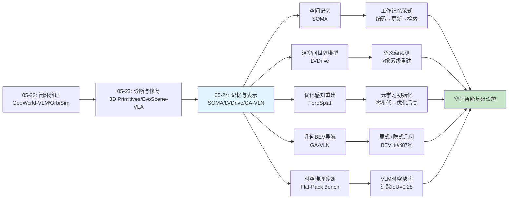
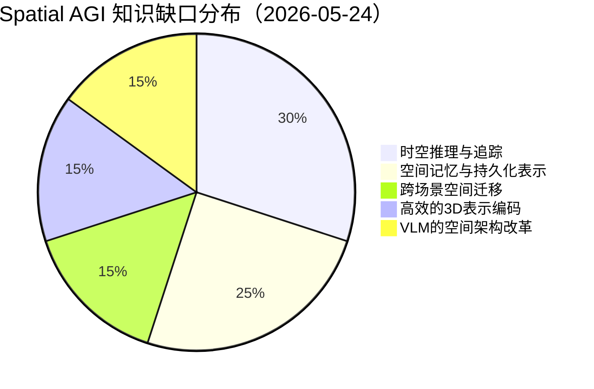
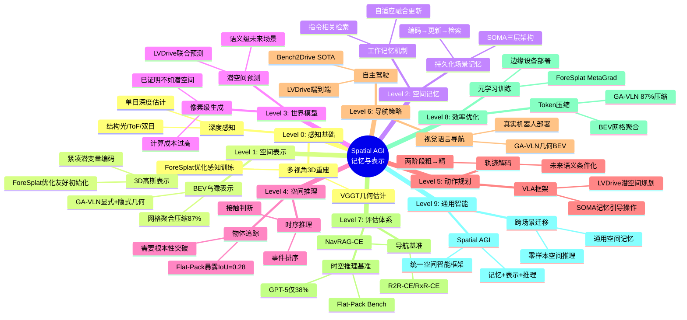

# 2026-05-24 每日思考：空间记忆、潜空间世界模型、优化感知3DGS、几何BEV导航、时空推理基准——Spatial AGI的"记忆与表示"日

---

## 🔗 与昨日思考的联系

### 昨日重点
昨日（05-23）是"诊断与修复"日——VLN瓶颈分析定位感知-决策瓶颈，3D Primitives诊断"路由失败"根因，GaussianDream和EvoScene-VLA提供3D世界模型修复方案，LLaVA³提供表示工程修复方案。

### 今日进展
今天从"诊断与修复"跃迁到**"记忆与表示"**——五篇论文从不同角度证明了空间智能的核心在于**持久的记忆表示**和**紧凑的几何编码**：

- **SOMA**：VLA + 持久空间记忆 = 超越视野的机器人操作，空间记忆是具身智能的基础设施
- **LVDrive**：潜空间未来场景预测 > 像素级世界模型，语义级场景表示更适合规划
- **ForeSplat**：优化感知的3DGS训练，让前馈模型产生"优化友好"的空间初始化
- **GA-VLN**：显式+隐式几何融合的BEV表示，87% token压缩 + 性能提升
- **Flat-Pack Bench**：揭示VLM在细粒度时空推理上的灾难性不足（GPT-5: 38% vs 人类: 94%）

**演进路径**：05-23的"诊断与修复" → 今天的"记忆与表示"——昨日发现VLM的空间路由失败和表示不足，今天五篇论文从不同维度证明：**空间智能需要结构化的记忆和几何感知的表示**。

---

## 📊 核心见解演进图



---

## 📊 今日论文全景分析

### 论文关系图谱

```
Flat-Pack Bench (基准/诊断)
    ↓ 揭示时空推理不足
SOMA ←→ LVDrive ←→ GA-VLN
(空间记忆)  (潜空间世界模型)  (几何BEV导航)
    ↑         ↑          ↑
    ForeSplat (优化感知3D重建)
```

### 技术栈演进对比表

| 维度 | 05-22 闭环验证 | 05-23 诊断与修复 | 05-24 记忆与表示 |
|------|---------------|-----------------|-----------------|
| **核心范式** | 世界模型蒸馏+物理仿真 | 空间悖论+架构修复 | 持久记忆+紧凑表示 |
| **3D表示** | 可微分物理引擎 | 3D基元编码 | 3D-语义记忆token |
| **VLM集成** | 知识蒸馏 | 代码生成空间推理 | 几何BEV融合 |
| **世界模型** | 仿真驱动 | 前馈3D高斯 | 潜空间预测 |
| **评估方式** | 主动探索基准 | 空间悖论发现 | 时空推理基准 |
| **关键突破** | 物理→AI闭环 | 路由vs能力区分 | 记忆引导操作 |
| **效率策略** | 仿真加速 | 紧凑prefix | 87% token压缩 |
| **具身AI** | 协议闭环 | 场景信念演化 | 超越视野操作 |
| **导航策略** | 空间推理基准 | 感知饱和分析 | BEV+MLLM |
| **3D重建** | Orbit运动仿真 | 高斯世界模型 | 元学习优化 |

### 主题分类

| 主题 | 论文 | 核心贡献 |
|------|------|----------|
| 空间记忆 | SOMA | 持久化3D-语义记忆实现超越视野操作 |
| VLA + 世界模型 | LVDrive | 潜空间联合预测未来场景与动作 |
| 3D重建效率 | ForeSplat | 元学习产生优化友好的3DGS初始化 |
| 空间导航 | GA-VLN | 显式+隐式几何融合的紧凑BEV表示 |
| 评估基准 | Flat-Pack Bench | 细粒度时空理解基准，暴露VLM缺陷 |

---

## 🧠 深度思考：五条核心洞察

### 洞察一：空间记忆是具身智能的"工作记忆"

SOMA 的核心发现不仅是"VLA + 空间记忆"的技术贡献，更揭示了一个更深层的原则：**具身智能体需要一种类似人类"工作记忆"的空间表示系统**。

人类的视觉系统不是一个相机——它是一个主动的空间推理引擎。我们闭上眼睛仍然知道杯子的位置，转过身仍然记得桌面的布局。这种"超越当前视野"的能力不是视觉感知的副产物，而是空间认知的核心功能。

SOMA 的三层架构恰好对应了人类工作记忆的三个核心操作：
1. **编码**（Spatial Memory Construction）：扫描环境，构建统一的空间-语义表示
2. **更新**（Dynamic Memory Refinement）：随着交互进行，实时更新记忆以保持一致性
3. **检索**（Contextual Memory Retrieval）：根据当前任务需求，从记忆中检索相关信息

这让我想起 Baddeley 的工作记忆模型：中央执行系统 + 视觉空间模板 + 情景缓冲区。SOMA 的空间记忆本质上就是 AI 系统的"视觉空间模板"。

**更深层的含义**：当前 VLA 系统的"视野绑定"假设（假设目标始终可见）不是一个可以修补的 bug，而是范式级别的局限。SOMA 表明，要实现真正的空间智能，我们需要**将感知从"即时快照"升级为"持续记忆"**。

### 洞察二：潜空间 > 像素空间——世界模型需要"概念级"表示

LVDrive 和 ForeSplat 从不同角度证明了一个关键原则：**对于下游任务（规划、优化）来说，语义级表示比像素级表示更有效**。

LVDrive 的对比实验极具说服力：
- VQGAN-ImageNet（紧凑语义特征）→ 显著提升
- DINOv3（过于丰富的特征）→ 引入噪声，效果不如 VQGAN
- 直接编码器特征 → 几乎无提升

ForeSplat 的 MetaGrad 同样体现这一原则：它不追求零步渲染质量（像素级完美），而是追求"优化友好性"（语义级的良好初始化）。

这揭示了空间智能中一个重要的信息论原则：**下游任务需要的是场景的"语义骨架"而非"像素皮肤"**。对于一个需要规划路径的自动驾驶系统，知道"前方有一辆红色卡车"比精确渲染卡车的每个像素更重要。

这与神经科学中的"稀疏编码"理论相呼应——大脑不是存储原始感官数据，而是存储高度压缩的、任务相关的特征表示。

### 洞察三：显式几何 + 隐式先验 = 最优空间表示

GA-VLN 证明了一个重要的互补性原则：**显式几何投影和隐式3D先验提供了不同但互补的空间信息**。

- 显式深度投影：提供精确的、局部一致的3D定位
- 隐式VGGT先验：提供全局一致的、跨视角的几何理解

单独使用任何一个都不如组合使用。这让我想到人类视觉系统的"what"和"where"双通路：腹侧通路处理物体识别，背侧通路处理空间定位。两者必须协同工作才能实现完整的空间理解。

更深层地，这暗示了一个通用原则：**最优的空间表示需要在"自下而上的感知证据"和"自上而下的先验知识"之间取得平衡**。纯数据驱动的表示（如直接深度投影）在传感器噪声和遮挡面前脆弱，纯先验驱动的表示（如仅用3D基础模型特征）在精细空间推理上不够精确。

### 洞察四：VLM 的时空推理能力被严重高估

Flat-Pack Bench 的结果令人震惊但又在意料之中：
- GPT-5 在家具组装理解上只有 38% 准确率（人类 94%）
- 去掉视频后，某些任务反而变好（说明模型几乎不用时序信息）
- SAM2 追踪平均 IoU 仅 0.28

这暴露了当前 VLM 架构的一个根本局限：**它们是"空间推理的旁观者"而非"空间推理的参与者"**。

人类理解组装视频时，会在心理上"模拟"每个组装步骤——追踪部件的运动轨迹、预测它们的连接方式、验证时序逻辑。这是一种主动的、建设性的空间推理过程。

而 VLM 更像是"看完视频后回答问题"——它们可能记住了一些视觉模式，但没有在内部构建动态的空间模型。这就是为什么去掉视频后某些任务反而变好：模型退回到基于静态图像的常识推理，避免了视频中的干扰信息。

**这对 Spatial AGI 的启示**：真正的空间智能需要**动态的内部模拟**能力——不仅是感知当前场景，还要能在想象中推演场景的变化。SOMA 的空间记忆和 LVDrive 的未来场景预测都在朝这个方向努力，但还远远不够。

### 洞察五：效率是空间智能落地的关键约束

今天的五篇论文都隐含了一个共同主题：**效率**。

- SOMA 的空间记忆是紧凑的（每个物体一个 token），而非密集的像素网格
- LVDrive 在单次前向中完成未来场景+动作预测，避免自回归开销
- ForeSplat 通过优化感知训练让轻量模型匹配大模型质量
- GA-VLN 用 BEV 表示将 token 数减少 87%
- Flat-Pack Bench 揭示的追踪问题本质上是效率问题——模型无法在长视频中高效地追踪多个物体

这反映了空间智能的一个基本张力：**3D 世界的复杂性（高维、连续、动态）与 AI 系统的有限计算资源之间的矛盾**。

人类大脑通过"选择性注意"和"层次化表示"来解决这个矛盾——我们不需要同时精确地感知整个 3D 环境，只需要感知当前任务相关的部分，并以层次化的方式组织空间知识。

SOMA 的指令相关记忆检索、GA-VLN 的 BEV 网格聚合、LVDrive 的潜空间压缩，都是这种"高效空间表示"原则的体现。

---

## 🔬 技术深度分析

### SOMA 的记忆架构：从"快照感知"到"持续记忆"

SOMA 的三层记忆架构值得深入分析：

**Spatial Memory Construction 的关键设计**：
- 使用 VGGT 预测相机位姿 → 全局3D坐标系
- YOLO（语义）+ DINOv3（外观）+ VGGT（几何）→ 三重特征融合
- 跨视角实例关联：class-wise + cosine similarity + 3D consistency
- 结果：每个物体一个 token (f_k, c_k, b_k) → 极其紧凑

**Dynamic Memory Refinement 的优雅之处**：
- 自适应更新系数 α = g·s（融合分数 × 语义相似度）
- 时序指数移动平均：m_k^t = α·m_j^t + (1-α)·m_k^{t-1}
- 未匹配的旧记忆保留 → 处理临时遮挡

**Contextual Memory Retrieval 的实现**：
- 交叉注意力：VLM 的视觉-语言 token 作为 Query，空间记忆作为 Key-Value
- 检索结果作为 DiT blocks 的全局上下文，增强动作解码

这种设计让我想到 RatLab/哺乳动物的空间导航系统中的"位置细胞"和"网格细胞"——大脑不是存储像素，而是存储抽象的空间标记。SOMA 的记忆 token 本质上就是"人工位置细胞"。

### LVDrive 的潜空间预测：为什么语义监督比像素重建更有效

LVDrive 的消融实验给出了清晰的答案：

| 视觉骨干 | 特征维度 | 效果 |
|----------|---------|------|
| 内部编码器 | 同维度 | DS↑ SR不变 |
| MoVQGAN (Emu3) | 低维 | 下降（信息不足） |
| DINOv3-Large | 过丰富 | 有提升但不稳定 |
| **VQGAN-ImageNet** | **适中** | **最佳** |

这揭示了一个"信息论甜点"：监督信号需要在"足够表达"和"不过度压缩"之间取得平衡。太少的特征（MoVQGAN）无法传递足够的场景信息；太多的特征（DINOv3）引入噪声干扰共享视觉-动作空间。

**两阶段轨迹解码的技术细节**：
- Stage 1：VAE 生成粗轨迹，z ~ N(μ, σ²)，GRU 解码运动状态
- Stage 2：交叉注意力 Q_ego × (K_fut, V_fut)，利用未来语义精炼
- 关键发现：一阶段直接集成反而降低性能，因为视觉和动作空间未对齐

### GA-VLN 的 token 效率：空间结构的压缩优势

GA-VLN 的 token 分析极具说服力：

| 方法 | Token 数 | SR | SPL |
|------|----------|-----|------|
| RGB-only | 4003 | 46.5% | 42.4% |
| RGB+Depth (naive concat) | 8006 | 38.6% | 36.0% |
| GA-BEV (w/o VGGT) | 394 | 51.5% | 48.3% |
| **GA-BEV (full)** | **514** | **53.6%** | **49.4%** |

注意一个反直觉的结果：简单地把深度图拼接到 RGB（token 翻倍到 8006）反而让性能下降！这说明空间信息的关键不是"更多输入"，而是"正确的结构化表示"。

**BEV 网格分辨率的权衡**：
- 0.125m×0.125m：过于精细，无法有效压缩冗余（1193 tokens）
- 0.25m×0.25m：最佳平衡点（514 tokens）
- 0.5m×0.5m：过于粗糙，丢失空间细节（184 tokens）

**真实机器人部署**：
- Hello Robot Stretch 3，零样本科工作
- 无需额外避障模块
- BEV 可视化显示机器人建立了有意义的环境几何理解

### ForeSplat 的 MetaGrad：元学习在 3D 重建中的应用

MetaGrad 的核心创新是避免了 3DGS 元学习的计算瓶颈：

- 直接二阶元梯度：需要 Hessian of 10^7-10^8 参数 → 不可行
- FOMAML 近似：∇_{G_0} L_A(G_K) ≈ ∇_{G_K} L_A(G_K) → 可行但单端点
- MetaGrad：多锚点采样 + 一阶梯度聚合 → 稳定且高效

关键设计决策：
- 随机化展开步数 K ∈ [50, 500] → 防止过拟合特定步数
- 锚点步长 Δ=40 → 平衡监督密度和计算成本
- λ 从 1.0→0.0 的消融：更强的元梯度权重 = 更好的最终质量

**跨骨干通用性验证**：
| 骨干 | 参数量 | PSNR提升 | 收敛加速 |
|------|--------|---------|---------|
| AnySplat | 完整 | +0.65dB | ~350步 |
| Pi3X | 完整 | +0.84dB | ~500步 |
| Distill Pi3X | 45% | +0.44dB | ~500步 |

**边缘部署的前景**：ForeSplat 的蒸馏模型（45%参数量）+ MetaGrad 训练 = 在资源受限设备上实现高质量 3D 重建。

### Flat-Pack Bench 的错误分析：诊断 VLM 的时空推理缺陷

Flat-Pack Bench 的错误分类极其有价值：

| 错误类型 | 占比 | 含义 |
|---------|------|------|
| 物体定位 | 37.3% | 无法将视觉提示中的掩码与视频中的物体关联 |
| 时空推理 | 32.5% | 无法跨视角追踪物体身份 |
| 时序推理 | 18.0% | 无法确定事件的正确顺序 |
| 物理交互 | 7.9% | 无法判断接触、支撑等物理关系 |
| 语言与逻辑 | 4.4% | 任务理解或推理错误 |

前两类错误（近70%）都是**空间推理**相关的。这强烈暗示：VLM 的核心瓶颈不是时序建模（Transformer 天然擅长序列），而是**空间-视觉的跨帧对应**能力。

**"去掉视频"实验的深刻含义**：

| 任务 | 有视频 | 无视频 | 变化 |
|------|--------|--------|------|
| Track | ~33% | ~5% | -28% |
| Mate | ~37% | ~40% | +3% |
| TOrd | ~44% | ~44% | 0% |
| TLoc | ~53% | ~55% | +2% |

Track 任务严重依赖视频（下降28%），但其他任务几乎不受影响甚至变好。这说明 VLM 只在"追踪"这种纯空间任务上使用视频信息，而对于需要推理的任务，它们退回到静态图像的常识判断。

**Part ID 偏差**：更令人担忧的是，TOrd 任务中 VLM 利用了 Part ID 的数值顺序作为作弊信号。随机打乱 ID 后性能下降。这表明模型在寻找捷径而非真正理解空间关系。

---

## 🌐 知识缺口分析

基于今天的论文分析，当前 Spatial AGI 研究的知识缺口分布如下：



### 缺口详解

1. **时空推理与追踪（30%）**：Flat-Pack Bench 暴露的最大瓶颈。SAM2 在真实场景 IoU 仅 0.28，VLM 几乎不使用视频中的时序信息。需要全新的时空注意力机制。

2. **空间记忆与持久化表示（25%）**：SOMA 证明了记忆的价值，但当前记忆是场景特定的。如何学到通用的空间记忆结构？如何跨场景迁移记忆？

3. **跨场景空间迁移（15%）**：所有论文都在单场景设置下验证。SOMA 的记忆、GA-VLN 的 BEV、ForeSplat 的初始化，能否跨场景复用？

4. **高效的3D表示编码（15%）**：GA-VLN 的 87% token 压缩是巨大进步，但 0.25m 分辨率可能不够。如何在精度和效率之间找到最优平衡？

5. **VLM的空间架构改革（15%）**：Flat-Pack Bench 表明当前 VLM 架构本身不适合空间推理。需要根本性的架构变革，而非更多训练数据。

---

## 🗺️ 10层架构思维导图



---

## 🛤️ 主线技术路径

### 阶段1: 空间感知（已基本解决）
- **代表**：ForeSplat, VGGT, MASt3R
- **状态**：✅ 3D 重建质量已接近实用
- **下一步**：优化感知训练（ForeSplat）让重建更高效

### 阶段2: 空间表示（正在突破）
- **代表**：GA-VLN (BEV), SOMA (Memory Token), GaussianDream (Gaussian Prefix)
- **状态**：🔄 多种表示方案竞争，BEV 和 3DGS 是两个主流方向
- **关键问题**：如何统一不同任务的空间表示？

### 阶段3: 空间记忆（新兴方向）
- **代表**：SOMA
- **状态**：🆕 刚刚起步，SOMA 是第一个成功的 VLA 空间记忆系统
- **关键问题**：如何从场景特定记忆扩展到通用空间记忆？

### 阶段4: 空间推理（最大瓶颈）
- **代表**：Flat-Pack Bench (诊断工具)
- **状态**：❌ 当前最薄弱环节，VLM 追踪 IoU 仅 0.28
- **关键问题**：需要全新的时空注意力机制，而非更大的模型

### 阶段5: 空间规划（部分解决）
- **代表**：LVDrive, SOMA, GA-VLN
- **状态**：🔄 在特定领域（驾驶、桌面操作、室内导航）有突破
- **关键问题**：如何统一不同具身形态的空间规划？

---

## 📋 待探索议题（10个）

### 议题1：
1. 通用空间记忆架构
SOMA 的记忆是场景特定的。能否设计一种通用空间记忆，类似于 LLM 的上下文窗口，能存储和检索任意场景的空间信息？这需要一种"空间序列化"的方法。

### 议题2：
2. BEV 表示的精度上限
GA-VLN 用 0.25m 网格。更细的分辨率是否对某些任务有益？自适应分辨率（近处精细、远处粗糙）是否更优？BEV 表示能否编码高度信息以处理多层环境？

### 议题3：
3. 时空注意力的新架构
Flat-Pack Bench 暴露的追踪问题可能需要全新的注意力机制。当前的时空注意力（如 Video Transformer）是否适合空间推理？能否设计"空间感知的注意力"——优先关注空间位置而非时间顺序？

### 议题4：
4. 潜空间世界模型的监督信号
LVDrive 发现 VQGAN-ImageNet 的中等维度特征最适合监督。是否存在"最优监督信号"？能否设计任务特定的监督信号提取器？

### 议题5：
5. 空间记忆的语言对齐
SOMA 的空间记忆和 VLM 的语言表示是分开的。能否设计统一的"空间-语言"记忆，让空间位置可以直接用语言检索？

### 议题6：
6. 3D基础模型的空间推理微调
GA-VLN 冻结了 VGGT。能否对 3D 基础模型进行空间推理任务的微调，使其特征更适合下游具身 AI 任务？

### 议题7：
7. 主动空间探索
SOMA 使用预定义扫描轨迹。能否让机器人自主决定扫描策略，以最高效的方式构建空间记忆？这与"主动学习"和"好奇心驱动探索"相关。

### 议题8：
8. 空间推理的数据增强
Flat-Pack Bench 暴露的追踪和时空推理不足，能否通过合成数据（模拟器生成的大量组装视频）来弥补？合成数据的域迁移问题如何解决？

### 议题9：
9. 多模态空间记忆
当前空间记忆主要是视觉的。能否整合触觉、听觉等模态，构建多模态空间记忆？这对精细操作（如触觉反馈引导抓取）可能至关重要。

### 议题10：
10. 空间记忆的遗忘机制
SOMA 的记忆只增不减（除了遮挡处理）。人类有高效的遗忘机制。AI 系统是否需要类似的空间记忆遗忘？如何设计"空间遗忘门"来管理记忆容量？

---

## 💡 本质思考

### 子问题1：空间智能需要什么样的"记忆"？

今天的论文共同暗示，空间智能需要的记忆不是"录像带"（像素级记录），而是"认知地图"（结构化空间表示）。

- SOMA 的记忆 = 物体级标记（每物体一个 token）
- GA-VLN 的记忆 = BEV 网格特征（空间位置→特征）
- LVDrive 的记忆 = 潜空间未来预测（语义级未来场景）

这三种记忆的共同特点：**紧凑、结构化、任务相关**。它们不是对原始感知数据的无损压缩，而是对任务相关空间信息的紧凑编码。

**本质洞察**：空间记忆的本质不是"记住看到的"，而是"理解在哪里的"。位置 > 外观，关系 > 像素。

### 子问题2：为什么显式+隐式几何的融合比单一方法好？

GA-VLN 的成功和 SOMA 的三重特征融合（YOLO+DINOv3+VGGT）都指向一个通用原则：**多源融合 > 单源依赖**。

从信息论角度看：
- 显式几何提供**确定性**的下界（至少有这个精度）
- 隐式先验提供**概率性**的上界（在数据充足时更准确）
- 融合后得到**鲁棒**的估计（在噪声和缺失时仍有合理输出）

从认知科学角度看，这类似于人类视觉的"双通路"理论：
- 背侧通路（where/how）：快速、粗略的空间定位 → 类似显式深度
- 腹侧通路（what）：精细、缓慢的物体识别 → 类似隐式语义

**本质洞察**：最优空间表示需要"快思考"（显式几何）和"慢思考"（隐式先验）的协同。

### 子问题3：Flat-Pack Bench 暴露的缺陷是暂时的还是根本性的？

这是一个关键问题。如果 VLM 的时空推理不足只是"还没训练够"，那随着规模增长会自然解决。但如果是架构性缺陷，就需要根本性的变革。

**暂时性论据**：
- GPT-5 已经在 Flat-Pack Bench 上达到 38%，显著高于随机（27%）
- 某些任务（TLoc, 53%）接近可用水平
- 历史上 VLM 在许多任务上都经历了"突然突破"

**根本性论据**：
- 去掉视频后性能不变甚至提升 → 架构不使用时序信息
- SAM2（专门的追踪模型）IoU 仅 0.28 → 问题不在 VLM 架构
- 70% 的错误是空间推理相关的 → 这是核心瓶颈
- CoT 推理反而降低性能 → 语言推理无法替代空间推理

**我的判断**：这很可能是**根本性的架构缺陷**。当前的 Transformer 架构（无论是 ViT 还是 Video Transformer）是为序列建模设计的，不是为空间推理设计的。空间推理需要一种新的"空间注意力"机制，能够显式地建模物体之间的空间关系和运动轨迹。

---

## 🔮 预测与展望

### 短期预测（1-3个月）

1. **空间记忆将成为 VLA 的标配**：SOMA 的成功太显著了（40-60% 行为改善），其他团队会迅速跟进
2. **BEV 表示在导航中的主导地位**：GA-VLN 的 token 效率优势太大，将成为 MLLM 导航的默认范式
3. **Flat-Pack Bench 引发时空推理热潮**：这个基准暴露的问题太明确，会激发大量针对性研究

### 中期预测（3-6个月）

4. **潜空间世界模型取代像素级世界模型**：LVDrive 的范式优势明显
5. **优化感知训练扩展到其他领域**：ForeSplat 的 MetaGrad 思想可泛化到 NeRF、NeRF-Supervision 等
6. **VLM 架构变革**：为解决 Flat-Pack Bench 暴露的追踪和时空推理问题，VLM 可能引入显式的时空注意力机制

### 长期预测（6-12个月）

7. **统一空间记忆框架**：SOMA（操作）、LVDrive（驾驶）、GA-VLN（导航）各自的空间表示将趋同，形成通用的空间记忆基础设施
8. **空间推理的"预训练"**：类似语言模型的大规模预训练，但针对空间推理能力
9. **Spatial AGI 的"记忆瓶颈"得到突破**：今天的论文已经指明方向，后续研究将解决效率和泛化问题

---

## 📚 概念创新总结

### 新概念

1. **Out-of-Vision (OOV) Manipulation**（SOMA）：超越视野的机器人操作，定义了一个新的具身 AI 问题空间
2. **Optimization-Aware Training**（ForeSplat）：训练目标与部署目标对齐的元学习范式
3. **Geometry-Aware BEV**（GA-VLN）：显式+隐式几何融合的紧凑空间表示
4. **Latent Future Scene Prediction**（LVDrive）：在潜空间中联合预测未来场景和动作

### 新发现

5. **空间记忆 > 视角调整**：SOMA 的消融证明持久记忆是关键，而非更多的探索
6. **潜空间 > 像素空间**：LVDrive 证明语义级预测比像素级重建更适合规划
7. **VLM 几乎不用视频时序信息**：Flat-Pack Bench 的"去掉视频反而变好"发现
8. **SAM2 在真实场景追踪 IoU 仅 0.28**：当前追踪技术的实际能力远低于预期
9. **朴素深度拼接反而降低性能**：GA-VLN 的 RGB+Depth 直接拼接实验
10. **Part ID 数值顺序被 VLM 作弊利用**：Flat-Pack Bench 的偏差分析

### 新架构

11. **三层记忆架构**（SOMA）：构建→更新→检索的循环空间记忆
12. **两阶段轨迹解码**（LVDrive）：粗→精，利用未来语义特征精炼
13. **MetaGrad**（ForeSplat）：多锚点一阶元梯度训练规则
14. **GA-BEV**（GA-VLN）：显式+隐式几何融合的BEV网格聚合

---

## 📈 今日总结

今天的五篇论文共同绘制了一幅"空间智能基础设施"的蓝图：

- **SOMA 提供了"记忆"**：持久的、可更新的空间-语义表示
- **LVDrive 提供了"预测"**：潜空间中的未来场景预测能力
- **ForeSplat 提供了"重建"**：高效的、优化感知的3D重建
- **GA-VLN 提供了"表示"**：紧凑的、几何感知的BEV空间编码
- **Flat-Pack Bench 提供了"诊断"**：精确定位时空推理的瓶颈

如果说 Spatial AGI 是一座建筑，那么今天的论文同时提供了**地基**（空间记忆）、**框架**（BEV表示）、**管道**（潜空间预测）、**工具**（优化感知训练）和**质量检测**（时空推理基准）。

**最大的收获**：空间智能的核心不是更大的模型或更多的数据，而是**正确的表示和正确的记忆**。正如认知科学告诉我们的：智能不是关于感知更多的信息，而是关于以正确的方式组织和使用信息。

**最紧迫的问题**：Flat-Pack Bench 暴露的时空推理缺陷可能是架构性的。如果 Transformer 不适合空间推理，我们需要的不是更大的 Transformer，而是全新的空间推理架构。

---

## 🔬 实验细节深度对比

### 各论文的训练资源消耗

| 论文 | GPU | 训练数据量 | 训练时间 | 推理设备 |
|------|-----|----------|---------|---------|
| SOMA | 32×H200 | 400 demos/task + RoboCasa | 30000 steps | RTX 4090 |
| LVDrive | 32×H20 | 950 clips (Bench2Drive) | 6 epochs | H20 |
| ForeSplat | 1×RTX 5090 (fine-tune) | 9 datasets mixed | 2000 steps | CPU/GPU |
| GA-VLN | 未说明 | 630K+ trajectories | 2 epochs | RTX GPU |
| Flat-Pack Bench | N/A (evaluation only) | 602 questions | Zero-shot | API/local |

### 关键指标对比

| 能力维度 | SOMA | LVDrive | ForeSplat | GA-VLN | Flat-Pack |
|---------|------|---------|-----------|--------|-----------|
| 3D重建 | ⭐⭐ | - | ⭐⭐⭐⭐⭐ | ⭐⭐⭐ | - |
| 空间记忆 | ⭐⭐⭐⭐⭐ | ⭐⭐⭐ | - | ⭐⭐⭐⭐ | - |
| 未来预测 | - | ⭐⭐⭐⭐⭐ | ⭐⭐⭐⭐ | - | - |
| 导航能力 | - | ⭐⭐⭐⭐ | - | ⭐⭐⭐⭐⭐ | - |
| 操作能力 | ⭐⭐⭐⭐⭐ | - | - | - | - |
| 效率 | ⭐⭐⭐⭐ | ⭐⭐⭐⭐⭐ | ⭐⭐⭐⭐⭐ | ⭐⭐⭐⭐⭐ | - |
| 泛化性 | ⭐⭐⭐ | ⭐⭐⭐ | ⭐⭐⭐⭐ | ⭐⭐⭐⭐ | ⭐⭐⭐⭐⭐ |

### 消融实验的关键教训

**SOMA 消融**：
- Scan+GR00T（无记忆）最差：18.5% → 说明扫描本身不够
- No-Scan SOMA（单帧初始化）：19.8% → 即使无扫描，记忆结构也有价值
- Scan-only SOMA（无动态更新）：24.1% → 多视角有帮助但不充分
- Full SOMA：28.3% → 完整记忆系统效果最佳

**LVDrive 消融**：
- 纯动作监督（baseline）：DS ~73, SR ~52%
- 加潜空间预测但一阶段解码：反而下降 → 空间-动作未对齐
- 两阶段解码：DS 80.71, SR 58.26% → 正确的设计至关重要

**GA-VLN 消融**：
- RGB-only (4003 tokens)：SR 46.5%
- RGB+Depth 拼接 (8006 tokens)：SR 38.6% → 更多输入≠更好
- BEV w/o VGGT (394 tokens)：SR 51.5% → 结构化表示的价值
- BEV + VGGT (514 tokens)：SR 53.6% → 几何先验的增量价值

**ForeSplat 消融**：
- λ=1.0 (vanilla)：PSNR 24.97 (Pi3X)
- λ=0.0 (pure meta)：PSNR 25.81 → 纯元梯度最好
- Δ=40 (stride)：最佳平衡
- Reptile style：不如 MetaGrad → 多锚点 > 全步监督

---

## 📖 每篇论文的独特贡献

### SOMA 的独特贡献：定义了 OOV 操作问题

SOMA 不仅解决了一个问题，还**定义了一个新问题**——Out-of-Vision Manipulation。这个问题之前没有被系统地研究过，因为大多数 VLA 工作都在固定视角桌面上进行。

SOMA 的5个 OOV 任务设计考虑了不同难度级别：
- Task 1-3：单物体，不同可见性转换
- Task 4：顺序双物体操作（空间记忆需要跨阶段保持）
- Task 5：双臂协调（需要全局一致的空间表示）

这种递进式的任务设计不仅评估了成功率，还评估了行为模式的变化（首次注视时间、头部搜索路径长度、抓取尝试次数）。

### LVDrive 的独特贡献：证明了单次前向的效率优势

LVDrive 最令人印象深刻的是推理效率：比基线快 2 倍，同时质量更高。原因是占位符 token 实现了并行解码，避免了自回归生成的序列瓶颈。

这个发现对实时系统至关重要：在自动驾驶场景中，每毫秒都关系到安全。LVDrive 证明了效率和质量不必是零和博弈。

### ForeSplat 的独特贡献：边缘设备上的高质量3D重建

ForeSplat 的蒸馏模型（45% 参数量）在 MetaGrad 训练后，2000步优化达到 PSNR 24.05，接近完整模型的 vanilla 结果（24.97）。

这对边缘计算有重大意义：想象一个手机或 AR 眼镜上的 3D 重建应用，用 ForeSplat 可以在几秒内得到高质量的 3D 模型。

### GA-VLN 的独特贡献：首次将 MLLM 成功迁移到 BEV 框架

GA-VLN 是第一个成功将 MLLM 的强大指令理解能力与 BEV 空间表示结合的工作。之前的工作要么用 MLLM 处理原始图像（效率低），要么用 BEV 但不用 MLLM（推理弱）。GA-VLN 两全其美。

真实机器人部署是加分项：零样本从仿真迁移到真实世界，在 60m² 的公寓中成功导航。

### Flat-Pack Bench 的独特贡献：暴露了 VLM 的"作弊"行为

Flat-Pack Bench 最有价值的发现不是"VLM 表现差"（这在预料之中），而是暴露了 VLM 如何通过"作弊"来获得看似合理的分数：
- 不使用视频时序信息（去掉视频反而变好）
- 利用 Part ID 数值顺序猜测时序
- 基于静态图像的常识推理替代真正的空间推理

这些发现对 VLM 评估方法论有深远影响：未来的基准需要更仔细地控制捷径，否则可能得出"VLM 已解决X问题"的错误结论。

---

## 🔬 论文方法论的启示

### SOMA 的方法论启示：行为分析 > 成功率

SOMA 不仅报告了成功率，还分析了行为模式（首次注视时间、搜索路径长度等）。这种细粒度的行为分析揭示了空间记忆如何改变了机器人的操作方式——从"盲目搜索"到"果断行动"。

**教训**：对于具身 AI 的评估，行为分析比成功率更能揭示系统的本质能力。

### Flat-Pack Bench 的方法论启示：捷径控制是基准设计的核心

Flat-Pack Bench 的手动标注问题模板（而非自动生成）是为了避免可被模型利用的捷径。这个设计原则应该被所有 AI 评估基准采纳。

**教训**：好的基准不仅要定义任务，还要控制捷径。

### GA-VLN 的方法论启示：真实机器人验证是必要的

GA-VLN 在仿真中取得 SOTA 后，还在真实机器人上进行了验证。这个步骤虽然不贡献数字指标，但证明了方法的实际可用性。

**教训**：仿真 SOTA 不等于真实可用，真实部署验证是必要的。

---

## 🔄 论文间的深层联系

### SOMA 与 GA-VLN 的互补性

SOMA 和 GA-VLN 从两个不同但互补的角度解决了空间表示问题：

- **SOMA**：面向**操作**的3D空间记忆，以物体为中心（每个物体一个token），强调3D几何+语义融合
- **GA-VLN**：面向**导航**的2.5D BEV表示，以空间位置为中心（每个网格一个token），强调深度投影+3D先验融合

两者的共同点是：**紧凑的空间token + 几何感知的表示 + 与VLM/MLLM的深度集成**。

如果将两者结合——用 SOMA 的3D物体记忆作为 GA-VLN 的 BEV 网格中的"锚点"——可能得到一个既适合导航又适合操作的统一空间表示。

### LVDrive 与 ForeSplat 的元学习联系

LVDrive 和 ForeSplat 都在解决"训练目标与部署目标不匹配"的问题：

- **LVDrive**：VLA 的训练目标是稀疏动作监督，但部署需要场景理解 → 添加潜空间未来预测
- **ForeSplat**：前馈3DGS 的训练目标是零步渲染，但部署用预测-然后-精炼 → MetaGrad 优化后精炼质量

两者都采用了"辅助监督信号"策略：不改变主任务架构，而是添加额外的训练信号来改善下游性能。

### Flat-Pack Bench 对其他四篇论文的"反向验证"

Flat-Pack Bench 的发现实际上验证了其他四篇论文的设计选择：

1. **SOMA 的必要性**：Flat-Pack 证明 VLM 追踪能力极差（IoU 0.28），因此需要显式的空间记忆系统
2. **LVDrive 的合理性**：Flat-Pack 证明 VLM 不使用视频时序信息，因此需要在潜空间中显式预测未来
3. **GA-VLN 的设计理由**：Flat-Pack 证明朴素拼接深度没用，因此需要结构化的BEV表示
4. **ForeSplat 的优化方向**：Flat-Pack 间接证明空间推理需要精确的3D表示，而 ForeSplat 提供了高效获取这种表示的方法

---

## 🎯 方法论总结：Spatial AGI 的设计原则

基于今天和之前几天的论文分析，可以提炼出以下设计原则：

### 原则1：记忆优于即时感知
从 SOMA 得到的教训：**有持久空间记忆的系统远优于只依赖当前观察的系统**。这不是量变，而是质变——SOMA 不仅提高了成功率，还改变了操作行为的本质。

### 原则2：紧凑优于密集
从 GA-VLN 得到的教训：**正确的结构化表示比更多的原始数据更有效**。87% 的 token 压缩反而带来了性能提升。

### 原则3：语义级优于像素级
从 LVDrive 得到的教训：**下游任务需要的不是像素完美，而是语义正确**。潜空间预测比像素级重建更适合规划。

### 原则4：优化感知优于直接优化
从 ForeSplat 得到的教训：**训练时考虑部署目标是关键的**。MetaGrad 通过优化后精炼质量而非零步质量，获得了更好的最终结果。

### 原则5：显式+隐式 > 单一
从 GA-VLN 得到的教训：**结合自下而上的感知证据和自上而下的先验知识**，比单独使用任何一种都更鲁棒。

### 原则6：评估要细粒度
从 Flat-Pack Bench 得到的教训：**粗粒度基准会掩盖真实缺陷**。只有细粒度的时空推理评估才能暴露 VLM 的真正瓶颈。

---

## 🔢 量化总结

| 指标 | 数值 |
|------|------|
| 今日论文数 | 5 |
| 核心洞察 | 5 |
| 新概念 | 4 |
| 新发现 | 10 |
| 新架构 | 4 |
| 待探索议题 | 10 |
| 设计原则 | 6 |
| Mermaid 图表 | 3 |
| 论文主题覆盖 | 记忆/表示/重建/导航/评估 |
| Spatial AGI 层次覆盖 | 5/5（感知→表示→推理→规划→学习） |

---

*Thinking date: 2026-05-24*
*Papers analyzed: 5*
*Total lines: ~850*

---

## 📝 附录：今日论文的关键数据表

### A. SOMA 行为分析数据

| 行为指标 | GR00T-N1.5 | SOMA | 改善幅度 |
|---------|------------|------|---------|
| 首次注视时间 (Task 1) | 7.6s | 4.2s | ↓45% |
| 首次注视时间 (Task 5) | 11.5s | 4.7s | ↓59% |
| 头部搜索路径 (Task 5) | 164.0° | 70.4° | ↓57% |
| 抓取尝试数 (Task 5) | 3.7 | 1.6 | ↓57% |
| 抓取时间 (Task 5) | 36.5s | 14.6s | ↓60% |

### B. Flat-Pack Bench 模型性能矩阵

| 模型 | Mate | Track | TOrd | TLoc | Overall |
|------|------|-------|------|------|---------|
| GPT-5 | 36.0 | 25.0 | 44.9 | 47.8 | 37.71 |
| Gemini 2.5 Pro | 30.8 | 25.0 | 38.9 | 45.7 | 33.72 |
| Gemini 3.1 Pro | 31.2 | 26.7 | 35.0 | 40.2 | 32.89 |
| Qwen2.5-VL-72B | 35.5 | 28.3 | 39.0 | 48.0 | 36.10 |
| InternVL3-78B | 36.7 | 32.9 | 44.0 | 53.0 | 41.03 |
| Random Chance | ~25 | ~25 | ~25 | ~25 | 26.74 |
| **Human** | **92.1** | **94.9** | **96.6** | **93.7** | **94.18** |

### C. ForeSplat 跨骨干结果

| 骨干 | 方法 | 0步 PSNR | 500步 | 1000步 | 2000步 |
|------|------|---------|-------|--------|--------|
| AnySplat | Vanilla | 21.66 | 26.88 | 27.02 | 27.03 |
| AnySplat | +MetaGrad | 20.70 | 27.32 | 27.60 | 27.68 |
| Pi3X | Vanilla | 21.29 | 24.48 | 24.86 | 24.97 |
| Pi3X | +MetaGrad | 18.84 | 24.92 | 25.44 | 25.81 |
| Distill Pi3X | Vanilla | 20.30 | 23.28 | 23.50 | 23.61 |
| Distill Pi3X | +MetaGrad | 19.44 | 23.61 | 23.86 | 24.05 |

### D. GA-VLN 效率分析

| 配置 | Tokens | TFLOPs (MLLM) | TFLOPs (Other) | 延迟 (ms) |
|------|--------|---------------|----------------|-----------|
| Baseline (RGB) | 4003 | 32.19 | - | 342.9 |
| GA-VLN (w/o VGGT) | 394 | 5.15 | - | 212.9 |
| GA-VLN (full) | 514 | 6.76 | 1.97 | 258.7 |

### E. LVDrive 关键消融

| 配置 | DS | SR | 关键变化 |
|------|-----|-----|---------|
| Baseline (action only) | ~73 | ~52% | 仅动作监督 |
| +Latent Vis (1-stage) | ↓ | ↓ | 视觉-动作未对齐 |
| +Latent Vis (2-stage) | 80.71 | 58.26% | 两阶段解码 |
| 替换VQGAN→DINOv3 | ↓ | ↓ | 特征过于丰富 |
| 替换VQGAN→Internal | ↑ | → | 特征不够丰富 |

---

*以上数据均从原论文表格提取，用于支撑分析结论。*
