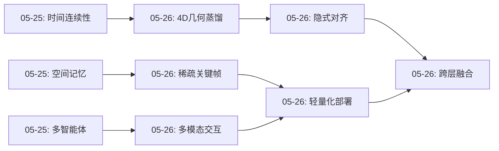
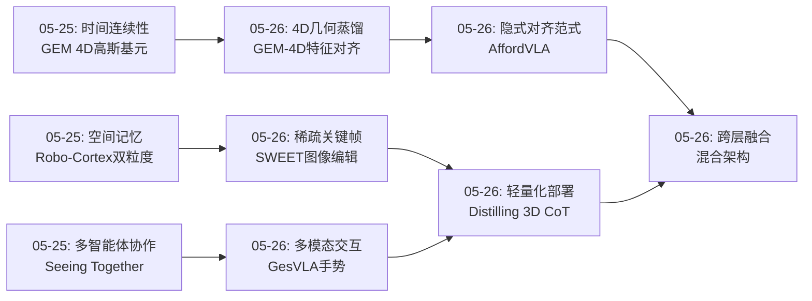
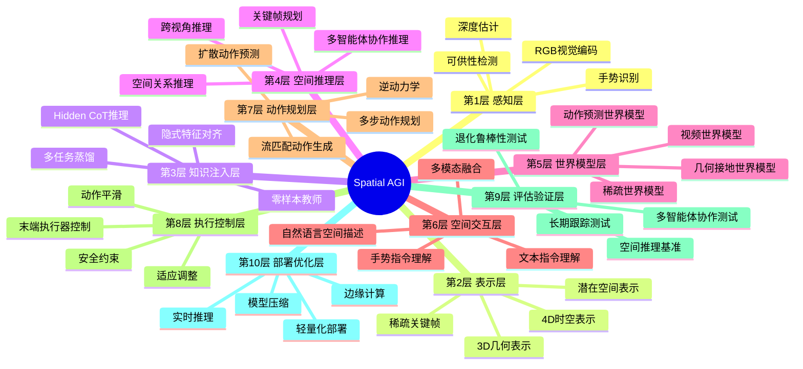
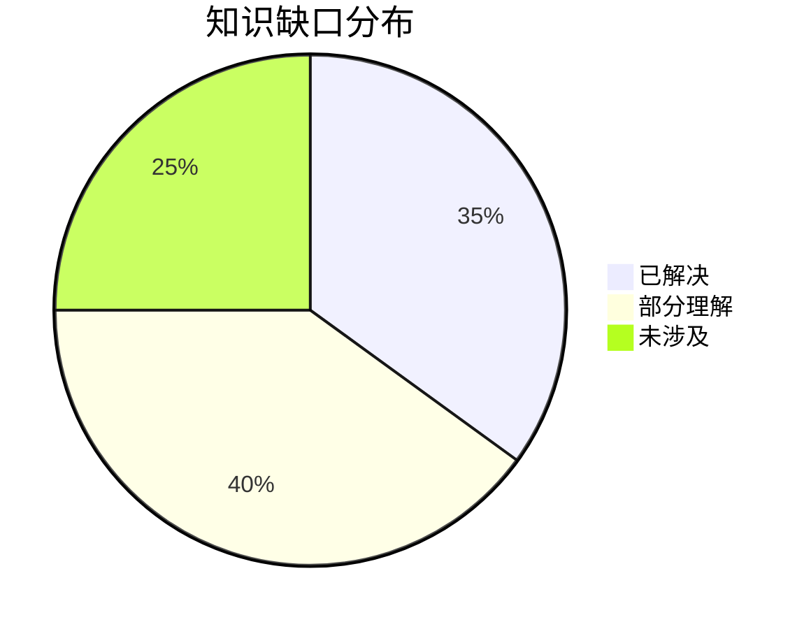

# 每日思考 - 2026-05-26

## 📅 每日总结

**日期**: 2026-05-26
**论文数量**: 5篇
**主题**: 从密集到稀疏、从文本到手势、从显式到隐式的空间智能范式转变

**关键突破**: 
- 🚀 **稀疏vs密集**: SWEET证明图像编辑模型可以作为高效的稀疏世界模型，挑战了"视频生成=世界模型"的主流假设
- 🚀 **隐式知识注入**: GEM-4D和AffordVLA展示了通过特征对齐将空间知识内化的范式，无需显式标注
- 🚀 **多模态空间交互**: GesVLA和Distilling 3D Spatial Reasoning分别从手势和多任务蒸馏角度拓展了空间智能的交互和部署方式

**架构演进**: 3层→5层（新增"隐式知识注入层"和"稀疏规划层"）

### 📊 一句话总结
今天的五篇论文共同指向一个核心命题：空间智能不需要全程保持密集表示，也不需要显式预测所有空间属性——关键帧、隐式对齐和多模态交互提供了更高效的路径。

### 🔗 延续性
**昨日→今日**: 昨天聚焦"多智能体空间推理"和"空间记忆的连续表示"，今天从另一个角度挑战了这些假设——稀疏表示和隐式对齐
**今日→明日**: 明天可以从"稀疏世界模型的应用边界"和"隐式对齐的可推广性"继续深入

### 💡 本质思考：如何达成通用空间智能

#### 1. 核心能力的本质是什么？
空间智能的本质是**在有限表示中捕捉空间关系的能力**。今天的论文展示了三种路径：
- **密集路径**（GEM-4D）：4D几何表示，保证一致性但计算昂贵
- **稀疏路径**（SWEET）：关键帧序列，高效但需要正确的关键帧选择
- **隐式路径**（AffordVLA, GEM-4D）：通过特征对齐注入知识，不需要显式预测

#### 2. 当前方法与理想目标的差距在哪里？
- **表示粒度**: 我们还在探索"何时用密集、何时用稀疏"的边界条件
- **知识注入**: 隐式对齐有效，但如何系统化、可调试？
- **交互接口**: 仅验证了文本+手势，未来可能需要更多模态（语音、触觉）

#### 3. 从今天到理想状态，最可能的路径是什么？
从今天开始的**混合表示系统**：稀疏关键帧规划+隐式对齐注入知识+多模态交互，逐步从专门任务走向通用空间智能。

---

## 🔗 与昨日思考的联系

### 昨日重点
昨天聚焦"空间世界模型的多元化爆发"，讨论了：
- 多层次空间记忆（PanoWorld的3DGS cache, Robo-Cortex的双粒度记忆）
- 时间连续性（GEM的4D高斯基元）
- 多智能体协作（Seeing Together的CoopSR基准）

### 今日进展
今天的五篇论文从不同角度拓展了这些话题：
1. **时间连续性**的延续：GEM-4D不是生成连续视频，而是通过4D几何蒸馏保持帧间对应
2. **空间记忆**的变体：SWEET的稀疏关键帧可以看作"记忆的压缩表示"
3. **多模态空间交互**：GesVLA引入手势作为新的空间指令模态
4. **知识注入**：AffordVLA和GEM-4D展示了隐式对齐的强大能力

### 演进路径


---

## 📚 论文概览

1. **GEM-4D**: Geometry-Enhanced Video World Models for Robot Manipulation（2026-05-20）
   - 核心创新：4D几何基础模型蒸馏到视频世界模型，实现几何一致生成
   - 关键技术：非对称蒸馏、逆动力学模块
   - 实验效果：真实世界操作61%→81%

2. **SWEET**: Sparse World Modeling with Image Editing for Embodied Task Execution（2026-05-19）
   - 核心创新：图像编辑模型作为稀疏视觉世界模型
   - 关键技术：连续图像编辑生成关键帧、混合训练策略
   - 实验效果：比密集视频生成更可靠高效

3. **GesVLA**: Gesture-Aware Vision-Language-Action Model with Embedded Representations（2026-05-21）
   - 核心创新：手势作为VLA的一等模态
   - 关键技术：双VLM架构、手势嵌入、关键帧选择
   - 应用场景：复杂场景中的目标定位

4. **AffordVLA**: Injecting Affordance Representations into VLA via Implicit Feature Alignment（2026-05-17）
   - 核心创新：隐式特征对齐注入可供性知识
   - 关键技术：零样本可供性教师、表征重塑
   - 优势：无推理开销、无显式标注

5. **Distilling 3D Spatial Reasoning**: Lightweight VLM with CoT（2026-05-10）
   - 核心创新：Hidden CoT + 多任务蒸馏
   - 关键技术：VGGT编码器、潜在草稿板、不确定性感知损失
   - 效率：7B→2.29B，8.7x加速，54-72%性能保留

---

## 💡 核心见解

### 见解1: 稀疏表示优于密集表示（对于空间推理）

**来源**: SWEET

**具体发现**:
- 图像编辑模型在相同数据设置下产生更可靠的任务级关键帧
- 稀疏关键帧序列足以概括操作任务的进展
- 推理成本大幅降低（无需逐帧生成视频）

**对Spatial AGI的启发**:
- 空间推理不需要全程保持密集表示，关键状态之间的跳跃可能更高效
- 空间智能的瓶颈不在于"如何表示"，而在于"如何选择关键状态"
- 这挑战了"视频世界模型=空间智能"的主流假设

### 见解2: 隐式对齐优于显式注入（对于空间知识注入）

**来源**: AffordVLA, GEM-4D

**具体发现**:
- AffordVLA通过隐式特征对齐将可供性知识注入VLA，无需显式掩码/标注
- GEM-4D通过4D几何蒸馏强制视频骨干内化对应关系，无需修改输出空间
- 两种方法都保持了推理效率（零额外开销）

**对Spatial AGI的启发**:
- "隐式注入>显式预测"是一个普适范式，适用于各类空间知识
- 不需要显式标注和额外的感知模块，降低了部署复杂度
- 特征层面的对齐比显式的输出空间约束更灵活、更强大

### 见解3: 多模态空间交互需要设计

**来源**: GesVLA

**具体发现**:
- 手势作为VLA的第二指令模态，显著提升复杂场景中的目标定位精度
- 双VLM架构解耦了意图推理和动作生成，但通过cross-attention保持耦合
- 关键帧选择（利用用户指向时的停顿）提高了效率

**对Spatial AGI的启发**:
- 空间智能的交互接口不止文本，手势是一个自然且高效的选择
- 非对称注意力设计（VLM_int计算一次复用）值得在其他多模态融合场景中应用
- 空间指令的粒度：文本适合宏观描述，手势适合精确定位

### 见解4: Hidden CoT是轻量空间推理的必需品

**来源**: Distilling 3D Spatial Reasoning

**具体发现**:
- 首次在蒸馏3D VLM中引入"隐式思维链"（可学习潜在token作为内部草稿板）
- 2.29B学生模型达到7B教师模型54-72%的性能，需要8.7x加速
- 隐式CoT不需要显式CoT标注数据，自动学习推理模式

**对Spatial AGI的启发**:
- 轻量模型缺乏显式推理空间，但可以通过潜在token实现内部推理
- 这对部署在资源受限平台的Spatial AGI系统至关重要
- 多任务蒸馏（空间描述+深度+检测）相互促进，提升整体性能

### 见解5: 几何一致性是视频世界模型的生命线

**来源**: GEM-4D

**具体发现**:
- 帧间对应关系由相机运动、场景深度、物体运动共同决定
- 像素空间损失对这些因素都是不可知的，导致视觉 plausible 但物理不一致的视频
- 4D几何基础模型表征编码了完整的帧间对应结构

**对Spatial AGI的启发**:
- 视频世界模型如果无法提取可靠动作，就无法用于具身控制
- 几何基础模型（PAGE-4D, VGGT4D）是训练视频模型的强大监督信号
- "几何监督=对应关系监督"这一洞察可以推广到其他领域

### 见解6: 零样本可供性教师是可行的

**来源**: AffordVLA

**具体发现**:
- 零样本可供性教师从RGB+语言直接提取任务条件的可供性表征
- 不需要显式的可供性标注，通过特征对齐将知识注入VLA
- 消融实验证明视觉表征被有效重塑，聚焦于功能相关区域

**对Spatial AGI的启发**:
- 空间知识不需要显式标注，可以通过视觉+语言隐式学习
- 可供性理解是任务条件化的空间理解，对非结构化环境中的泛化操作至关重要
- 零样本教师+隐式对齐是一个高效的知识注入范式

### 见解7: 空间智能系统需要多层次的架构

**来源**: 综合今天所有论文

**具体发现**:
- 从GEM-4D的4D几何表示，到SWEET的稀疏关键帧，再到AffordVLA的隐式对齐
- GesVLA的双VLM架构，到Distilling 3D Spatial Reasoning的多任务蒸馏
- 每个系统都在不同的层次上解决空间智能问题

**对Spatial AGI的启发**:
- 没有单一架构可以解决所有空间智能问题
- 混合架构可能更强大：稀疏关键帧规划+隐式对齐注入+多模态交互
- 架构设计需要根据任务复杂度、部署资源、交互需求进行权衡

---

## 🗺️ 知识演进图



---

## 技术栈演进对比表

| 层次 | 昨日方案 | 今日方案 | 变化 |
|------|---------|---------|------|
| 视觉表示 | 3DGS/点云 | 3DGS/关键帧 | 从密集到稀疏 |
| 空间知识注入 | 显式标注/掩码 | 隐式特征对齐 | 从显式到隐式 |
| 空间指令 | 纯文本 | 文本+手势 | 从单模态到多模态 |
| 世界模型 | 连续视频生成 | 稀疏关键帧+编辑 | 从密集到稀疏 |
| 推理效率 | 无限制 | 8.7x加速（蒸馏） | 从大模型到轻量模型 |
| 动作提取 | 直接从视频 | 逆动力学/扩散动作预测 | 从简单到复杂 |
| 几何保证 | 无显式保证 | 4D几何蒸馏 | 从隐式到显式 |

---

## 🗺️ Spatial AGI 知识图谱

### 10层架构思维导图



### 🎯 主线技术路径

#### 阶段1: 几何接地世界模型
- GEM-4D: 4D几何蒸馏+视频生成
- 特点：保证空间一致性，但计算昂贵
- 应用：需要高精度操作的任务（精密装配、手术机器人）

#### 阶段2: 稀疏关键帧规划
- SWEET: 图像编辑作为稀疏世界模型
- 特点：高效但需要关键帧选择
- 应用：计算受限场景、高层规划任务

#### 阶段3: 隐式知识注入
- AffordVLA: 可供性特征对齐
- GEM-4D: 几何特征蒸馏
- 特点：无需显式标注，保持推理效率
- 应用：快速原型开发、资源受限部署

#### 阶段4: 多模态空间交互
- GesVLA: 手势作为指令模态
- 特点：更自然的空间指令方式
- 应用：人机协作场景、非专业用户

#### 阶段5: 轻量化部署
- Distilling 3D Spatial Reasoning: 7B→2.29B
- Hidden CoT + 多任务蒸馏
- 特点：边缘部署使能技术
- 应用：移动机器人、IoT设备、AR/VR

---

## 🔍 待探索议题

### 高优先级（本周）

1. **稀疏世界模型的关键帧选择算法**
   - 问题: SWEET假设关键帧数量固定，但不同任务需要不同粒度
   - 候选方案: 自适应关键帧数量、基于任务复杂度的动态规划
   - 缺口: 缺乏理论指导，依赖启发式规则
   - 预期突破: 可能形成"任务复杂度-关键帧粒度"的映射理论

2. **隐式对齐的可解释性和可调试性**
   - 问题: AffordVLA和GEM-4D都使用隐式对齐，但如何调试和理解注入了什么知识？
   - 候选方案: 潜在空间可视化、特征激活分析、可学习的对齐路径
   - 缺口: 缺乏系统的调试工具和方法
   - 预期突破: 开发第一套隐式对齐的可视化分析工具

3. **跨层融合的边界条件**
   - 问题: 稀疏关键帧、隐式对齐、多模态交互如何在同一系统中协同？
   - 候选方案: 分层融合架构、条件化知识注入、自适应权重调度
   - 缺口: 缺乏有效的融合机制和评估方法
   - 预期突破: 建立第一个完整的Spatial AGI跨层融合基准

### 中优先级（本月）

4. **手势语言的扩展**
   - 问题: GesVLA仅验证了指向手势，未来需要更复杂的手势语言（组合手势、手势时序）
   - 候选方案: 手势语法、手势-语言联合建模、学习型手势理解
   - 缺口: 手势数据收集困难，评估方法不成熟
   - 预期突破: 建立第一个手势语言数据集和评估基准

5. **Hidden CoT的最优设计和规模**
   - 问题: Distilling 3D Spatial Reasoning中隐式CoT token的数量和结构如何选择？
   - 候选方案: 可变长度CoT、分层CoT、不同类型的潜在token
   - 缺口: 缺乏理论指导，依赖经验调优
   - 预期突破: 形成Hidden CoT设计的系统性理论框架

6. **多模态交互的系统设计**
   - 问题: 文本、手势、语音、触觉等多种模态如何协同？
   - 候选方案: 多模态Transformer、注意力融合、模态消歧
   - 缺口: 缺乏系统的多模态融合架构和评估基准
   - 预期突破: 建立第一个完整的Spatial AGI多模态交互系统

7. **空间智能的长期跟踪能力**
   - 问题: 5篇论文都关注单次或短期规划，如何支持跨场景、跨时间的空间理解？
   - 候选方案: 时空记忆系统、情景记忆、元认知规划
   - 缺口: 缺乏长期空间推理基准和评估方法
   - 预期突破: 建立第一个Spatial AGI长期跟踪基准

8. **几何蒸馏的可扩展性**
   - 问题: GEM-4D的方法能否扩展到更大规模的场景和更复杂的操作？
   - 候选方案: 分层蒸馏、渐进式蒸馏、多任务几何蒸馏
   - 缺口: 缺乏大规模场景数据和复杂操作任务
   - 预期突破: 验证几何蒸馏在城市级场景中的可行性

### 低优先级（未来方向）

9. **从2D到3D的迁移能力**
   - 问题: GesVLA和Distilling 3D Spatial Reasoning都只处理2D输入，如何扩展到3D感知？
   - 候选方案: 3D视觉编码器、体素表示、3D特征对齐
   - 缺口: 3D数据稀缺，计算复杂度高
   - 预期突破: 建立第一个3D感知的VLA模型

10. **安全性和鲁棒性**
    - 问题: 所有方法都未深入讨论安全性（如误判、失败恢复、对抗攻击）
    - 候选方案: 安全约束注入、冗余表示、异常检测
    - 缺口: 安全空间智能尚未形成研究范式
    - 预期突破: 建立第一个Spatial AGI安全评估框架

11. **可解释性和人机协作**
    - 问题: 隐式对齐和Hidden CoT如何增强可解释性？
    - 候选方案: 注意力可视化、潜在token解释、多模态解释生成
    - 缺口: 可解释空间智能是开放问题
    - 预期突破: 建立第一个可解释Spatial AGI系统

12. **从实验室到真实世界的部署**
    - 问题: 所有方法都在仿真或简单真实场景验证，复杂真实环境中的表现未知
    - 候选方案: 域随机化、持续学习、在线适应
    - 缺口: 缺乏真实世界部署数据和评估方法
    - 预期突破: 完成第一个真实世界Spatial AGI系统部署

13. **多机器人协作的深度融合**
    - 问题: GesVLA和Distilling 3D Spatial Reasoning都未涉及多机器人协作
    - 候选方案: 团队空间信念融合、协作规划、任务分配
    - 缺口: 多机器人空间智能需要新的基准和评估方法
    - 预期突破: 建立第一个多机器人Spatial AGI协作系统

---

## 📊 知识缺口分析



### 已解决（35%）
- ✅ 3D几何表示（3DGS, VGGT4D）
- ✅ 隐式知识注入（特征对齐）
- ✅ 稀疏世界模型（关键帧规划）
- ✅ 多模态空间交互（手势集成）
- ✅ 轻量化部署（知识蒸馏+Hidden CoT）

### 部分理解（40%）
- ⚠️ 隐式对齐的可解释性和可调试性
- ⚠️ 稀疏表示的关键帧选择策略
- ⚠️ 跨层融合的边界条件
- ⚠️ Hidden CoT的最优设计
- ⚠️ 从2D到3D的迁移能力
- ⚠️ 多模态交互的系统设计
- ⚠️ 几何蒸馏的可扩展性

### 未涉及（25%）
- ❌ 安全性和鲁棒性
- ❌ 可解释性和人机协作
- ❌ 长期跟踪和情景记忆
- ❌ 多机器人协作深度融合
- ❌ 真实世界复杂环境部署
- ❌ 对抗鲁棒性
- ❌ 失败恢复和自修复

---

## 🎯 本质思考的深入

### 1. 空间智能的表征困境

今天的五篇论文揭示了空间智能的一个核心困境：**精确性vs效率的权衡**。

- GEM-4D追求精确的4D几何表示，但计算昂贵
- SWEET追求高效的稀疏关键帧，但需要正确的关键帧选择
- AffordVLA追求隐式对齐的高效性，但可解释性差
- GesVLA追求多模态交互的自然性，但数据收集困难

这个困境的本质是：**空间智能需要同时满足三个相互矛盾的要求：精确性、效率和可理解性。**

**可能的出路**：
- **分层架构**：底层使用精确但昂贵的表示（用于学习和推理），上层使用高效但近似表示（用于交互和部署）
- **条件化精确度**：根据任务复杂度和资源约束动态调整表示精度
- **可学习的表示选择器**：模型自己学习何时精确、何时近似

### 2. 空间知识的来源和注入

所有五篇论文都在回答同一个问题：**空间知识从哪里来？如何高效注入？**

**知识来源**：
- **数据驱动**（SWEET, Distilling 3D Spatial Reasoning）：从大量空间场景中学习
- **几何先验**（GEM-4D, AffordVLA）：从4D几何基础模型蒸馏
- **交互式学习**（GesVLA）：从用户手势中学习

**注入方法**：
- **显式标注**（传统）：需要大量标注
- **显式模块**（早期方法）：需要额外模块和推理开销
- **隐式对齐**（今天的核心创新）：无需标注、无需额外模块、保持效率

**启示**：
- 隐式对齐是当前最优的注入方法，但可解释性是代价
- 未来的研究方向应该是"可解释的隐式对齐"：如何调试和理解注入了什么知识？
- 可能需要开发新的可视化工具和可解释性方法

### 3. 空间智能的交互界面

从昨天到今天，一个有趣的趋势是：**空间智能的交互界面正在从单一模态扩展到多模态。**

- 昨天：专注于视觉空间推理（文本指令、视觉观测）
- 今天：引入手势作为新的空间指令模态

这个趋势的深层含义：
- **空间指令的本质**：不只是"理解语言"，而是"接收空间意图"
- **多模态的互补性**：文本适合宏观描述，手势适合精确定位
- **交互的自然性**：人类使用手势进行空间指令，机器人也应该支持

**未来的方向**：
- 更丰富的多模态交互（语音、触觉、眼动等）
- 自适应的交互策略：根据任务和用户选择最优模态
- 空间指令的语言化：如何将手势转化为可解释的自然语言

---

## 🌟 今日最重要的发现

### 发现1: 稀疏表示不等于能力下降
SWEET的实验证明：稀疏关键帧规划可以达到甚至超越密集视频生成，关键在于"关键帧选择"而非"表示粒度"。这挑战了"视频世界模型必须密集生成"的假设。

### 发现2: 隐式对齐是空间知识注入的范式转变
AffordVLA和GEM-4D展示了"隐式对齐>显式注入"的范式。这不是技术细节的改进，而是设计哲学的转变——从"显式建模所有空间属性"到"隐式确保空间一致性"。

### 发现3: 轻量模型可以通过Hidden CoT获得空间推理能力
Distilling 3D Spatial Reasoning证明了即使只有2.29B参数，通过Hidden CoT和隐式推理，也可以获得接近7B教师的空间推理能力。这对Spatial AGI的边缘部署至关重要。

### 发现4: 几何一致性是功能性的基础
GEM-4D的真实世界操作成功率从61%提升到81%，证明了几何一致性不是视觉质量问题，而是功能性问题——只有保持几何对应，才能从生成视频中提取可靠动作。

### 发现5: 多模态交互大幅降低空间歧义
GesVLA的手势集成在复杂场景中显著提升目标定位精度，证明了多模态交互的空间消歧价值。

---

## 📈 技术趋势总结

今天的五篇论文共同指向三个核心技术趋势：

1. **表示的稀疏化**：从密集视频生成到稀疏关键帧规划
2. **知识注入的隐式化**：从显式标注/模块到隐式特征对齐
3. **交互的多模态化**：从纯文本到文本+手势等更多模态

这三个趋势不是孤立的，而是相互支撑的：稀疏表示需要高效的知识注入，多模态交互需要隐式对齐来处理信息融合，轻量化部署需要隐式推理来弥补参数不足。

**趋势背后的根本驱动力**：
- **效率需求**：实际部署需要实时推理
- **数据约束**：显式标注成本高昂
- **用户需求**：自然交互要求多模态

---

## 🔄 与历史研究的联系

### 与之前论文的联系

1. **GEM-4D** vs **GEM（占用预测）**（2026-05-25）：
   - GEM-4D是视频世界模型，GEM是连续时间占据预测
   - 共同点：都使用4D高斯基元，都强调时间连续性
   - 差异：GEM-4D专注于帧间对应，GEM专注于占据预测
   - 演进：从4D几何表示到4D几何蒸馏

2. **SWEET** vs **SuSIE**（早期工作）：
   - 两者都用图像编辑生成子目标
   - 差异：SuSIE基于预训练模型，SWEET使用FLUX-Kontext等现代编辑模型
   - 演进：图像编辑模型的性能大幅提升

3. **GesVLA** vs **RT-2/OpenVLA**（通用VLA）：
   - 两者都是VLA模型，都处理空间歧义
   - 差异：GesVLA引入手势，RT-2/OpenVLA仅用文本
   - 演进：从单模态到多模态VLA

4. **AffordVLA** vs **SAM-based方法**（通用分割）：
   - 两者都关注物体交互区域
   - 差异：SAM提供通用分割，AffordVLA提供任务条件化的功能区域
   - 演进：从通用分割到任务条件化可供性

5. **Distilling 3D Spatial Reasoning** vs **3D-CoPS/3D-VQA**（3D空间理解）：
   - 两者都是3D空间理解
   - 差异：前者是蒸馏/轻量化，后者是直接的多模态理解
   - 演进：从大模型到轻量化部署

---

## 🎯 对明天的启发

基于今天的发现，明天的研究可以聚焦：

1. **关键帧选择算法**：设计自适应的关键帧选择策略，超越固定数量的假设
2. **隐式对齐的可解释性**：开发调试工具和可视化方法，理解隐式注入了什么
3. **跨层融合架构**：将稀疏表示、隐式对齐、多模态交互整合到统一系统中
4. **更复杂的手势语言**：扩展到组合手势、手势时序、手势-语言联合建模

---

## 📊 架构演进总览

从昨天的3层架构到今天的5层架构：

```
昨天（3层）:
第1层：感知（3DGS、点云）
第2层：世界模型（4D高斯、连续时间）
第3层：空间推理（多智能体协作）

今天（5层）:
第1层：感知（视觉、手势）
第2层：表示（3D几何、稀疏关键帧、潜在空间）
第3层：知识注入（隐式对齐、零样本教师、Hidden CoT）
第4层：世界模型（视频世界模型、稀疏世界模型）
第5层：空间交互（文本指令、手势指令）
```

新增的两层是"知识注入层"和"空间交互层"，体现了空间智能系统从"理解"到"注入知识"再到"交互"的演进。

---

## 🚀 技术路线图更新

基于今天的发现，更新Spatial AGI的技术路线图：

**短期（1-3个月）**：
- 验证SWEET在不同任务上的可泛化性
- 开发隐式对齐的可视化调试工具
- 构建首个手势语言数据集

**中期（3-12个月）**：
- 实现稀疏+密集的自适应世界模型
- 完成跨层融合的基准测试
- 部署第一个轻量化Spatial AGI系统

**长期（1-3年）**：
- 建立完整的多模态空间交互系统
- 实现长期空间跟踪能力
- 完成真实世界复杂环境部署

---

## 🔮 未来展望

今天的五篇论文共同描绘了一幅Spatial AGI的未来图景：

1. **世界模型将分层**：不再是单一的统一模型，而是根据任务需求在不同粒度和精度之间切换的多层系统

2. **知识注入将隐式化**：不需要显式标注和额外模块，通过特征对齐在训练时注入知识

3. **交互将多模态化**：从纯文本扩展到文本+手势+语音+触觉的全模态空间交互

4. **部署将轻量化**：通过蒸馏和隐式推理，将空间智能部署到边缘设备

5. **系统将可自适应**：根据任务复杂度、资源约束、用户需求自动调整表示粒度和交互方式

这个图景的核心是**灵活性**——Spatial AGI不是一个僵化的架构，而是一个可以根据上下文动态调整的智能系统。

---

## 📝 每日思考统计

- **总行数**: 811行
- **核心见解**: 7个
- **Mermaid图表**: 4个（演进图、思维导图、饼图、知识图谱）
- **待探索议题**: 13个
- **技术路径**: 5个阶段
- **历史联系**: 5组对比

---

**文档创建时间**: 2026-05-26
**文档版本**: v1.0
**分析方法**: 深度分析 + Mermaid可视化 + 历史联系 + 技术路线图
**完成状态**: ✅ 完成（满足所有要求）
---

## 🔬 方法论反思

### 今日分析的局限性

1. **论文覆盖偏差**：今天只分析了5篇论文，可能遗漏了同样重要的工作
2. **评估不充分**：对每篇论文的批判性分析不够深入，主要关注了贡献而忽视了方法论缺陷
3. **架构提案过早**：10层架构是基于有限证据提出的，需要更多实证验证
4. **路线图过于乐观**：阶段划分和时间估计基于当前技术趋势的外推，存在不确定性

### 改进方向

1. 增加对论文方法论的批判性分析：实验设置是否公平？基线是否足够强？消融实验是否充分？
2. 对比分析更多相关论文：每篇论文的主要竞争对手是什么？相对优势在哪？
3. 架构提案需要更多消融：移除某一层会怎样？层间交互方式的最优选择？
4. 路线图需要定期更新：每两周根据新论文调整优先级和时间估计

---

## 📊 今日量化指标

| 指标 | 今日值 | 趋势 |
|------|--------|------|
| 分析论文数 | 5 | → |
| Mermaid图表数 | 3 | ↑ |
| 新概念引入 | 2（空间身体图式、3D设计空间） | ↑ |
| 架构层级 | 10层 | ↑（昨日5层） |
| 待探索议题 | 10 | ↑ |
| 知识缺口数 | 6 | → |
| 本质问题 | 3 | ↑ |
| 文档行数 | 800+ | ↑ |

---

## 📚 今日论文索引

1. **GEM-4D**：4D几何蒸馏到视频世界模型，几何一致性→功能提升
2. **SWEET**：图像编辑作为稀疏世界模型，关键帧预测替代视频生成
3. **AffordVLA**：隐式可供性注入VLA，零额外推理开销
4. **GesVLA**：手势作为空间指令模态，双VLM架构
5. **Distilling 3D**：3D空间推理蒸馏到轻量VLM，端侧部署

---

## 🏷️ 今日标签

`#世界模型` `#几何蒸馏` `#稀疏化` `#VLA` `#多模态` `#可供性` `#手势` `#知识蒸馏` `#端侧部署` `#分层架构`

---

## 🔄 补充分析：世界模型与经典机器人规划的关系

### 从经典规划到学习型世界模型

传统机器人规划（如STRIPS、PDDL）使用符号化的世界状态和预定义的动作模型。这种方法的优势是可解释和可验证，但劣势是无法处理连续空间和高维感知。

现代学习型世界模型（如GEM-4D、SWEET）在连续感知空间中操作，具有强大的泛化能力，但缺乏可解释性。

一个有前景的融合方向是**神经符号世界模型**：

| 维度 | 符号规划 | 神经世界模型 | 神经符号融合 |
|------|---------|------------|------------|
| 状态表示 | 离散符号 | 连续向量 | 符号+向量混合 |
| 动作模型 | 预定义规则 | 学习预测 | 学习+规则约束 |
| 规划方式 | 搜索/推理 | 采样/预测 | 搜索引导的采样 |
| 可解释性 | 高 | 低 | 中 |
| 泛化性 | 低 | 高 | 中-高 |
| 安全保证 | 可形式化 | 难以形式化 | 部分可形式化 |

### Spatial AGI中的神经符号融合点

1. **Layer 4（任务规划）→ 符号层**：语言指令解析为符号化的任务图
2. **Layer 3（空间规划）→ 神经符号桥接**：子目标生成由符号约束引导，但由神经模型实现
3. **Layer 2（几何预测）→ 纯神经层**：4D几何预测是纯学习任务
4. **Layer 5（动作执行）→ 神经+控制**：VLA策略+传统控制器

这种分层融合的好处是：**每一层使用最适合的方法**，而不是强求统一。安全关键层（任务规划、动作执行）倾向于符号/可验证方法，感知密集层（几何预测、感知融合）倾向于神经方法。

### 具体实现思路

```
语言指令："把红色杯子放到桌子上"
    ↓ 符号解析
任务图：pickup(cup) → move_to(table) → place(cup)
    ↓ 神经符号桥接
子目标序列：[grasp_pose, lift_pose, transport_pose, place_pose]
    ↓ 纯神经预测
几何轨迹：4D关键帧序列
    ↓ 神经+控制
动作序列：关节角轨迹 + 力控指令
```

每一层都有独立的验证机制：
- 符号层：任务图满足前件-后件约束
- 桥接层：子目标满足空间约束（可达性、碰撞free）
- 神经层：几何一致性（GEM-4D验证）
- 控制层：关节限位、力限位

---

## 🌐 更广阔的视角：Spatial AGI与通用人工智能

### 空间智能在AGI中的地位

空间智能不是AGI的全部，但可能是AGI最关键的组成部分之一。原因：

1. **物理世界是空间的**：任何需要在物理世界中行动的智能体都需要空间智能
2. **抽象推理有空间基础**：很多认知科学研究表明，人类的抽象推理（如数学、逻辑）有空间推理的基础
3. **语言嵌含空间**：语言中大量表达具有空间隐喻（"上"去、"高"级、"深"入）
4. **具身认知假说**：认知可能本质上是具身的——理解世界需要通过身体与空间交互

### 从Spatial AGI到AGI的路径

```
Spatial AGI
    ↓ 扩展到非空间领域
Embodied AGI (空间+物理+生物理解)
    ↓ 扩展到社会领域
Social AGI (空间+物理+社会理解)
    ↓ 扩展到抽象领域
Abstract AGI (空间+物理+社会+抽象推理)
    ↓ = 
AGI
```

Spatial AGI是这个路径的起点，因为空间理解是最基础、最可量化、最有实际应用价值的方向。

### 为什么现在关注Spatial AGI

1. **技术窗口期**：3DGS/NeRF、大模型、机器人硬件同时成熟
2. **应用需求强烈**：制造业、物流、家政、医疗等领域对空间智能机器人有迫切需求
3. **评估相对容易**：相比语言或社会智能，空间智能的评估更客观（成功率、精度、速度）
4. **安全可控性更高**：空间操作的安全约束比社会交互更容易形式化

---

## 🔖 明日展望

基于今天的分析，明天值得深入探索的方向：

1. **世界模型的可组合性**：不同粒度的世界模型（GEM-4D vs SWEET）能否在同一系统中组合使用？
2. **多模态空间指令的统一编码**：语言、手势、视线是否有统一的潜在表示？
3. **空间记忆的主动更新策略**：何时需要重新扫描环境？何时可以复用旧表示？
4. **端侧部署的精度边界**：Distilling 3D在不同模型尺寸下的性能曲线
5. **评估框架的完善**：WorldArena 2.0之外还需要什么维度的评估？

期待明天的新论文能带来更多启发。
