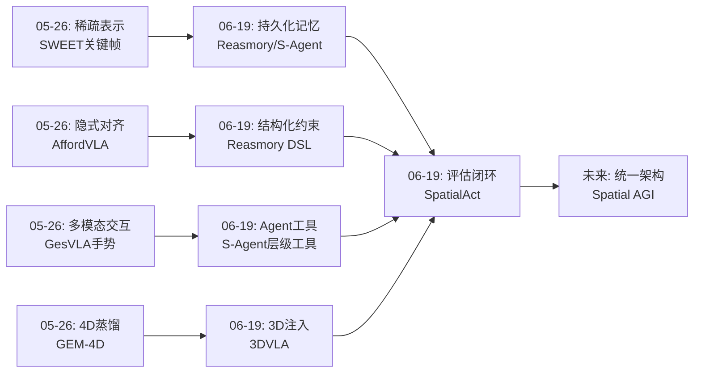
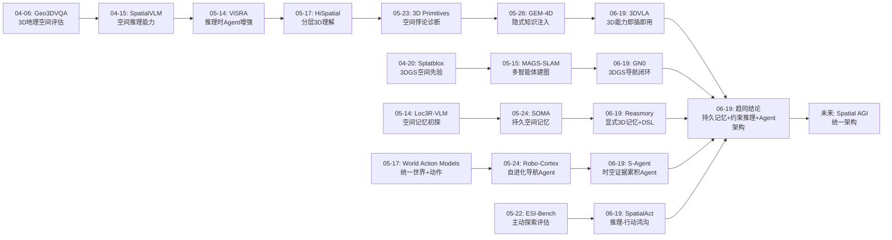
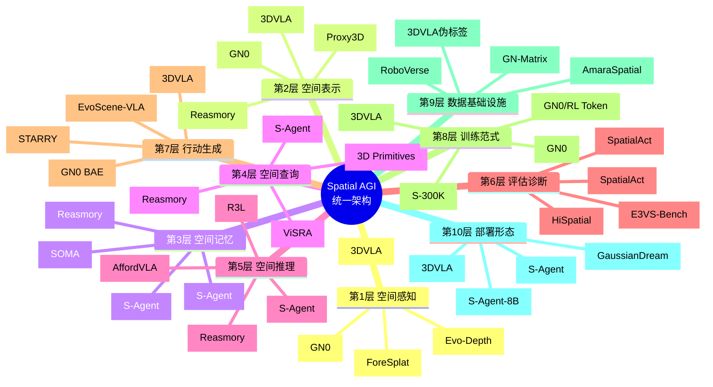
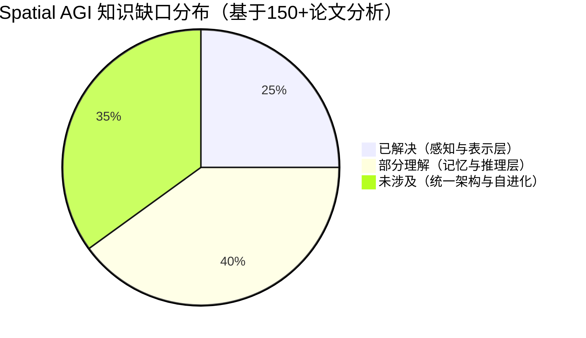

# 每日思考 - 2026-06-19

## 📅 每日总结

**日期**: 2026-06-19
**论文数量**: 5篇
**主题**: 从感知到行动——Spatial AGI 的架构拼图正在成形

**关键突破**: 
- 🚀 **空间记忆架构趋同**: Reasmory 的显式 3D 记忆 + S-Agent 的 Scene Memory + Agent Memory + GN0 的 BEV 紧凑记忆——多种方法不约而同地指向"持久化空间记忆"作为核心架构组件
- 🚀 **Agent 范式胜过端到端**: S-Agent 用 8B 模型 + 工具增强匹配 GPT-5.4，证明分层 agent 架构是 Spatial AGI 的正确路径
- 🚀 **推理-行动鸿沟被量化**: SpatialAct 首次系统性地揭示了 VLM 在单步空间推理上看似可用，但在多轮交互中严重退化——这是 Spatial AGI 的核心瓶颈
- 🚀 **结构化约束 > 自由调用**: Reasmory 的 DSL 约束和 3DVLA 的渐进式融合共同指向——空间推理需要尊重几何约束，自由形式的 LLM 调用不够可靠
- 🚀 **数据-仿真-训练闭环**: GN0 构建了完整的 3DGS 数据生成→BEV 基准评估→DAgger+RL 策略训练管线，为 Spatial AGI 提供基础设施

**架构演进**: 5层→7层（新增"空间记忆管理层"和"证据累积/推理层"独立分层）

### 📊 一句话总结
今天的五篇论文从不同维度——机器人操作(3DVLA)、导航(GN0)、评估诊断(SpatialAct)、记忆架构(Reasmory)、agent范式(S-Agent)——共同指向一个核心命题：**Spatial AGI 需要将空间推理从隐式的、无状态的、帧级的过程，转变为显式的、持久化的、场景中心的结构化过程**。

### 🔗 延续性
**昨日(05-26)→今日(06-19)**: 从"稀疏vs密集表示"和"隐式知识注入"的讨论，演进到"显式空间记忆架构"和"结构化agent范式"——研究焦点从"如何表示"转向了"如何组织和使用"空间知识。间隔期间的技术发展使得更完整的架构方案成为可能。
**今日→明日**: 今天确定了空间记忆和agent架构的重要性，明天可以探索：多智能体共享空间记忆、空间推理的RL训练范式、从2D+3D混合到3D-native的迁移路径

### 💡 本质思考：如何达成通用空间智能

#### 1. 核心能力的本质是什么？
经过近两个月的研究积累（从04-06到06-19，超过150篇论文），Spatial AGI 的核心能力可以归结为三个正交维度：

- **空间感知精度**（Where）：从像素级到度量级到拓扑级，不同粒度的空间信息需要不同层次的表示。3DVLA 的无体素化融合和 GN0 的 BEV 压缩都是"用什么粒度表示空间"的回答。
- **空间记忆持久性**（When）：空间智能不是帧级的——它需要在时间维度上持续积累和更新环境状态。Reasmory 的显式 3D 记忆和 S-Agent 的 Scene Memory 是"如何持久化空间状态"的回答。
- **推理-行动闭环**（How）：从空间感知到行动执行需要闭环——感知→推理→行动→反馈→修正。SpatialAct 量化了这个闭环中的"reasoning-to-action gap"。

这三个维度的交叉定义了 Spatial AGI 的能力空间。今天的五篇论文分别在其中一个或多个维度上推进了前沿。

#### 2. 当前方法与理想目标的差距在哪里？
- **架构碎片化**: 当前的空间推理系统仍是碎片化的——3DVLA 专注操作、GN0 专注导航、S-Agent 专注推理。真正的 Spatial AGI 需要统一架构。
- **记忆效率**: Reasmory 用点云作为记忆，GN0 用 BEV，S-Agent 用向量——哪种记忆表示最适合 Spatial AGI？这取决于任务，但我们缺乏通用的空间记忆架构。
- **评估盲区**: SpatialAct 揭示了多轮空间交互中的严重不足，但现有评估仍主要在受控环境中。真实世界的 Spatial AGI 评估框架仍然缺失。
- **工具使用的约束**: Reasmory 证明"自由工具调用是脆弱的"，这与 S-Agent 的层级工具设计形成呼应——空间工具需要结构化的调用协议。

#### 3. 从今天到理想状态，最可能的路径是什么？
基于今天五篇论文的共识，最可能的路径是：

**感知(VFM) → 结构化记忆(3D重建/BEV/点云) → 约束化推理(DSL/程序执行) → 分层Agent(规划器+工具) → 行动**

关键转折点在于"结构化记忆"和"约束化推理"——这两个组件将空间推理从隐式的 LLM token 序列转变为显式的、可验证的结构化过程。Reasmory 的 DSL、S-Agent 的层级工具、3DVLA 的渐进式融合都是这一方向的具体实现。

---

## 🔗 与昨日思考的联系

### 昨日重点（2026-05-26）
昨天聚焦"从密集到稀疏、从文本到手势、从显式到隐式的空间智能范式转变"：
- SWEET 证明稀疏关键帧世界模型的有效性
- AffordVLA 展示隐式特征对齐注入空间知识
- GEM-4D 通过 4D 几何蒸馏保持一致性
- 核心命题："空间智能不需要全程保持密集表示"

### 今日进展
今天从更高维度回答了昨日提出的"何时用密集、何时用稀疏"的问题：
1. **空间记忆的架构化**: 不再是"密集vs稀疏"的选择题，而是"如何构建持久化、可查询的空间记忆"——Reasmory 的 3D 点云 + DSL、S-Agent 的 Scene Memory + Agent Memory、GN0 的 BEV compact memory 分别给出了不同的架构方案
2. **推理的结构化约束**: Reasmory 的核心发现——"simply exposing reconstruction models as free-form tools is brittle"——直接呼应了昨天对"隐式vs显式"的讨论。答案是：**隐式知识注入适合感知层，但推理层需要显式结构约束**
3. **Agent 范式的崛起**: S-Agent 证明了 VLM + 分层空间工具的 agent 范式可以匹配 100x 规模的闭源模型——这为 Spatial AGI 的民主化部署提供了可行路径

### 演进路径


---

## 📚 论文概览

### 论文1: 3DVLA — 3D 空间理解注入 VLA (arXiv: 2605.29416)
- **来源**: 北京大学王选计算机研究所，Zhongyu Xia et al.
- **发布日期**: 2026-05-28
- **核心创新**: Plug-and-play 3D 注入预训练 VLA，无需额外标注，不丢弃 VLM 先验
- **三大组件**:
  1. **Multi-View Spatial Fusion**: 无体素化设计，展平为无序序列 + Continuous 3D RoPE 施加欧几里得距离先验
  2. **3D Instance Module**: 300个状态探针在3D空间中直接提取物理实体，遮挡感知门控，全局3D匹配
  3. **Self-Supervised Predictor**: 废弃的masked predictor重新用于遮挡补全，双坐标系统(Mask+Completion)
- **训练策略**: 两阶段解耦——Stage1学空间对齐(5000步), Stage2学遮挡补全(5000步), 共14小时(4×A800)
- **关键设计哲学**: "不从头设计3D-native VLA，而是渐进式增强2D模型"——增量3D能力注入保护了2D预训练先验
- **实验效果**: 在 LIBERO-Plus 和 RoboTwin 2.0 上多个 VLA baseline（π₀, π₀.₅, X-VLA）一致显著提升
- **参数开销**: 仅增加~0.086B参数，可忽略的计算开销

### 论文2: GN0 — 统一导航范式 (arXiv: 2606.03682)
- **来源**: Xinhai Li, Xiaotao Zhang, ..., Xuelong Li (13位作者)
- **发布日期**: 2026-06-02
- **核心创新**: 统一的数据生成+仿真评估+策略训练范式，构建完整导航基础设施
- **三大支柱**:
  1. **GN-Matrix 数据集**: 基于3DGS引擎策划多样化3D场景，自动化大规模导航数据生成管线
  2. **GN-Bench 基准**: 首个BEV-based导航基准，融入动态3DGS化身支持人机交互评估，碰撞感知导航
  3. **GN-BAE 模型**: Break and Establish策略——DAgger暴露模型于rollout诱导状态→打破专家中心分布→启用RL探索
- **BEV表示**: 3DGS渲染的鸟瞰图形式化为紧凑记忆，解锁VLM中的潜在空间推理能力
- **任务统一**: 统一地图/无地图任务——指令跟随、人员跟随、目标导航
- **实验效果**: 在 GN-Bench 和 VLN-CE 上超越 SOTA VLN 方法
- **对Spatial AGI的意义**: 最重要的贡献是"数据飞轮"——完整的"数据生成→仿真评估→策略训练"闭环

### 论文3: SpatialAct — 推理到行动的鸿沟诊断 (arXiv: 2605.31148)
- **来源**: Jie Feng et al.
- **发布日期**: 2026-05-29
- **核心创新**: Simulator-grounded基准，首次系统性探测action-conditioned空间推理
- **三层测试设计**:
  1. **Multi-turn Interactive Refinement**: 最完整设置——VLM agent在3D场景中执行空间动作→观察结果→修正行为
  2. **Single-step Error Detection and Fix**: 多轮设置的分解版本——诊断单步层面能否检测和修复错误
  3. **五项基础空间能力**: 将多轮失败原因分解到具体空间能力维度，定位根本原因
- **核心发现**:
  - **Reasoning-to-Action Gap**: VLMs在孤立空间推理任务上可以表现很好，但在多轮反馈中严重不足
  - **远低于人类水平**: 即使低级控制已被抽象掉，VLM agents表现仍大幅低于人类
  - **空间状态跟踪不足**: 在动作引起的环境变化下，VLMs无法可靠跟踪空间状态
- **对Spatial AGI的意义**: 评估维度定义——不仅要测空间感知和推理，还要测从推理到行动的闭环能力

### 论文4: Reasmory — 3D重建作为显式记忆 (arXiv: 2606.00963)
- **来源**: Jixuan He et al.
- **发布日期**: 2026-05-31
- **核心创新**: 将空间推理形式化为基于重建空间记忆的结构化程序执行
- **三大组件**:
  1. **Explicit 3D Memory Construction**: 利用Reconstruction-based VFM将观察聚合为显式空间记忆(点云)，为语义锚定的3D物体实例增加标注
  2. **Domain-Specific Language (DSL)**: 轻量级DSL约束VLMs如何查询物体和相机、转换视角、渲染观察
  3. **Structured Program Execution**: 生成的程序在执行前被解析和验证，比无约束工具调用更可靠
- **核心反直觉发现**: "simply exposing reconstruction models as free-form tools is brittle"——VLMs可能错误调用工具、跳过必需的空间变换、或误用中间结果
- **关键洞察**: 显式3D记忆只有在通过约束化、验证化的操作访问时才最有效
- **实验效果**: 在多视图图像和视频空间推理基准上，相比GPT-5-mini, Gemini-3-flash获得6-18%一致性提升
- **证明**: 结构化程序执行 > 无约束工具调用

### 论文5: S-Agent — 空间工具增强Agent (arXiv: 2606.20515)
- **来源**: Yalun Dai, Hao Li, ..., Ziwei Liu (NTU, 13位作者)
- **发布日期**: 2026-06-18（最新！昨天发布）
- **核心创新**: 时空证据累积的spatial tool-use agentic范式，从帧级识别到场景中心理解
- **架构四要素**:
  1. **VLM as Semantic Planner**: 决定需要什么证据，将语义理解与空间感知分离
  2. **Hierarchy of Spatial Tools**: 2D Grounding(图像中定位物体) → 3D Lifting(2D提升为3D几何证据) → Aggregation(聚合为计数/测量/方向/相对位置)
  3. **Scene Memory**: 维护演化的场景状态，跨帧和推理步骤整合证据
  4. **Agent Memory**: 累积推理上下文
- **训练流程**: Training-free增强(直接提升VLMs) → SFT on S-300K(生成的空间轨迹) → S-Agent-8B
- **核心范式转移**: 空间推理=时空证据累积（而非孤立帧级预测）
- **实验效果**:
  - Training-free: 一致提升开源和闭源VLMs
  - S-Agent-8B: 显著超越同规模基线(Qwen3-VL-8B)，与GPT-5.4和Gemini 3表现相当
  - **8B参数匹配GPT-5.4的空间推理能力**——证明agent架构的力量

### 跨论文对比表

| 维度 | 3DVLA | GN0 | SpatialAct | Reasmory | S-Agent |
|------|-------|-----|-----------|----------|---------|
| **领域** | 机器人操作 | 导航 | 评估诊断 | 空间推理 | 空间推理 |
| **核心问题** | VLA缺乏3D理解 | VLN数据不足 | 推理-行动鸿沟 | 空间记忆不可靠 | 帧级推理不足 |
| **方法类型** | 即插即用模块 | 统一框架 | 基准测试 | 框架+DSL | Agent范式 |
| **空间记忆** | 3D记忆库+补全 | BEV紧凑记忆 | (评估对象) | 点云+语义实例 | Scene+Agent Memory |
| **推理方式** | 渐进式融合 | VLM隐式推理 | (评估对象) | DSL约束程序执行 | 分层工具证据累积 |
| **训练数据** | 伪标签+自监督 | GN-Matrix自动生成 | N/A | N/A | S-300K轨迹生成 |
| **开源** | 待定 | 待定 | 基准开放 | 待定 | 项目页面开放 |
| **团队** | 北大 | Xuelong Li团队 | Jie Feng团队 | Jixuan He团队 | Ziwei Liu/NTU |

---

## 🔬 深度技术分析

### 3DVLA 的技术创新解析

#### 无体素化多视图融合的精妙设计

传统多视图3D处理方法通常采用体素化(voxelization)——将3D空间离散化为网格。但体素化面临分辨率-效率权衡：高分辨率需要巨大内存，低分辨率损失细节。

3DVLA的替代方案极具巧思：
1. **展平策略**: 将多视图特征图 $\mathcal{X}_{fmap} \in \mathbb{R}^{V \times C \times H \times W}$ 展平为无序序列 $\mathcal{M}_{flat} \in \mathbb{R}^{N \times C}$，其中 $N = V \times H \times W$
2. **坐标编码**: 使用反投影的3D坐标网格 $\mathbf{P}_{flat} \in \mathbb{R}^{N \times 3}$，通过 MLP + LayerNorm 生成3D位置编码
3. **Continuous 3D RoPE**: 为每个轴分量计算连续相位角 $\theta_d = p \cdot 10000^{-2d/D_{axis}}$，仅在Q和K上应用

这种设计的精妙之处在于：**绝对坐标对齐全局上下文，3D RoPE编码相对距离，各司其职**。体素化被完全避免，同时保持了全局一致性和局部精度。

#### 自监督预测器的"废物利用"

这是3DVLA最深刻的技术创新。在I-JEPA等masked self-supervised学习方法中，训练流程是：
1. 遮挡部分视觉token
2. 训练predictor预测被遮挡的内容
3. 训练完成后，**丢弃predictor**，只保留encoder

3DVLA的反直觉做法：**保留predictor，用Completion Coordinates查询不可见区域**。这意味着：
- 训练过程中，predictor学到了足够丰富的空间对应关系来"想象"被遮挡的区域
- 这些知识在传统方法中被白白浪费
- 3DVLA通过双坐标系统（Mask Coordinates用于训练，Completion Coordinates用于推理时补全）将这些知识激活

反塌缩三重损失设计确保了predictor不会简单地复制邻近token：
- $\mathcal{L}_{recon}$: Smooth-L1损失，幅度对齐
- $\mathcal{L}_{cos}$: 余弦距离，语义方向对齐
- $\mathcal{L}_{var}$: 方差正则化($\lambda_{var} = 10.0$)，防止空间均匀化

### GN0 的数据飞轮架构

GN0 最核心的贡献不是单个算法，而是构建了一个可持续运转的数据飞轮：

```
3D场景策划 → 3DGS引擎构建 → 自动化数据生成(GN-Matrix)
                                    ↓
策略训练(GN-BAE) ← 仿真评估(GN-Bench) ← 导航数据
     ↑                                    ↓
     └────── DAgger/RL ← ← rollout诱导状态
```

这个飞轮的关键创新在于 **Break and Establish (BAE) 策略**：
- **Break阶段**: DAgger执行rollout，暴露模型到自己产生的状态分布——这些状态通常不在专家演示的训练分布中
- **Establish阶段**: 通过RL在这些新状态上进行探索和优化，建立更鲁棒的策略

这解决了VLN中长期存在的一个根本问题：**专家演示只能覆盖状态空间的一小部分，导致策略在分布外状态下崩溃**。

### SpatialAct 的诊断方法论

SpatialAct的设计思路非常独特——它不是为了刷分，而是为了**精确定位失败原因**。

#### 三层诊断架构

1. **最完整设置（Multi-turn Interactive Refinement）**: 直接测试目标能力——多轮空间交互
2. **分解设置（Single-step Error Detection and Fix）**: 将多轮失败分解为单步层面的问题
3. **根因分析（五项基础能力）**: 进一步将单步失败归因到具体能力维度

这种"从整体到分解到根因"的诊断方法论，使得SpatialAct不仅是一个基准，更是一个**空间智能的诊断工具**。

#### Reasoning-to-Action Gap 的深层原因

SurfaceAct揭示的gap可能有以下深层原因：
1. **注意力窗口限制**: VLMs的注意力窗口有限，在多轮交互中早期的空间信息被"遗忘"
2. **缺乏显式状态更新机制**: VLMs没有显式的"内部状态更新"操作——每轮都是重新推理
3. **动作-感知耦合**: 当前VLMs将感知和行动混在一起，没有分离的处理路径
4. **训练数据偏差**: 现有训练数据主要是单轮的（单图问答、单步操作），缺乏多轮空间交互数据

### Reasmory 的 DSL 设计哲学

Reasmory的DSL约束了VLMs如何与3D空间记忆交互。这个设计的深层哲学是：

**空间推理不是自由文本生成——它是受几何约束的程序执行。**

DSL的关键操作包括：
- **查询物体**: `query_object(scene_memory, "chair")` — 在3D记忆中定位特定物体
- **转换视角**: `transform_viewpoint(camera, target_position)` — 改变观察角度
- **渲染观察**: `render_view(scene_memory, viewpoint)` — 从新视角生成观察
- **测量关系**: `measure_distance(object_a, object_b)` — 计算空间关系

每个操作都有明确的输入输出类型，程序在执行前被解析和验证——这确保了：
- 不会跳过必需的空间变换
- 不会误用中间结果
- 类型错误被及时捕获

**关键对比**: 自由工具调用时，VLM可能 `query → render → measure`（跳过了视角变换），导致render使用了错误的视角。DSL约束强制执行 `query → transform → render → measure` 的正确顺序。

### S-Agent 的分层工具架构

S-Agent的工具层级设计反映了空间理解的内在层次性：

```
Layer 1: 2D Grounding
  ├── 在图像中定位物体（where in image）
  └── 输出：2D bounding box + 置信度

Layer 2: 3D Lifting  
  ├── 将2D物体提升为3D几何证据（where in 3D）
  └── 输出：3D point cloud + 位置估计

Layer 3: Aggregation
  ├── 聚合为高层空间知识（how relate）
  └── 输出：计数、测量、方向、相对位置
```

这种分层设计的深层逻辑：
1. **认知层次映射**: 感知(2D) → 理解(3D) → 推理(关系)
2. **错误隔离**: 每层可以独立验证和修正
3. **证据累积**: 跨帧跨步骤的证据在Scene Memory中累积，形成越来越完整的场景理解
4. **规划-执行分离**: VLM作为规划器决定需要什么证据，工具作为执行器收集证据

---

## 🔄 论文间的隐含联系

### 联系1: 3DVLA × Reasmory — 遮挡补全 × 显式记忆

3DVLA的自监督预测器在推理时补全被遮挡的3D token。Reasmory的3D重建模型在推理时构建显式空间记忆。两者本质上都在解决同一个问题——**如何表示看不见的空间？**

但方法路径截然不同：
- 3DVLA: **隐式补全**——在特征空间中预测被遮挡的token
- Reasmory: **显式构建**——通过重建模型生成3D点云，然后在其中查询

这两种路径的优劣取决于任务：需要快速反应的任务（如机器人操作）更适合隐式方法；需要精确空间推理的任务（如视角推理、距离估计）更适合显式方法。

### 联系2: GN0 × S-Agent — BEV记忆 × Scene Memory

GN0的BEV表示将3D场景压缩为2D鸟瞰图作为导航记忆。S-Agent的Scene Memory维护演化的场景状态。两者都是空间记忆，但粒度不同：

- GN0 BEV: **拓扑级记忆**——保留了空间布局但丢失了高度信息，适合导航
- S-Agent Scene Memory: **语义级记忆**——保留了物体语义和空间关系，适合推理

这暗示Spatial AGI可能需要**多粒度记忆系统**：拓扑级用于快速导航决策，语义级用于精确空间推理。

### 联系3: SpatialAct × 所有方法 — 诊断 × 治疗

SpatialAct诊断了reasoning-to-action gap。今天的其他四篇论文可以看作是对这个gap的不同"治疗方案"：

| 治疗方案 | 对应论文 | 针对的Gap维度 |
|---------|---------|-------------|
| 3D能力注入 | 3DVLA | 空间感知不足 |
| 数据+RL闭环 | GN0 | 训练数据不足 |
| 显式记忆+约束 | Reasmory | 空间状态跟踪不足 |
| Agent+工具+记忆 | S-Agent | 多轮推理架构不足 |

SpatialAct的价值在于为这些"治疗方案"提供了**统一的评估标准**——未来的工作可以用SpatialAct来量化每种方案对reasoning-to-action gap的改善程度。

### 联系4: 3DVLA × S-Agent — 渐进融合 × 分层工具

3DVLA的不确定性引导门控确保3D信息只在需要时注入。S-Agent的VLM规划器决定需要什么证据。两者都在做"元认知"——**知道何时需要什么空间信息**。

这是Spatial AGI的一个关键能力维度：**空间元认知**。不是所有场景都需要完整的3D理解——简单的2D信息可能足够。Spatial AGI需要能够自主判断"这个任务需要多少空间理解"，然后调用相应级别的工具。

---

---

## 💡 核心见解

### 见解1: 空间记忆架构正在趋同——这不再是"是否需要"的问题
[来自 Reasmory, S-Agent, GN0]

三个独立的研究团队在同一个时期提出了惊人相似的空间记忆架构：

| 系统 | 记忆类型 | 查询方式 | 更新机制 |
|------|---------|---------|---------|
| Reasmory | 3D点云+语义实例 | DSL约束的程序 | 重建VFM聚合 |
| S-Agent | Scene Memory (场景状态) | 自然语言+工具 | 跨帧证据累积 |
| GN0 | BEV紧凑表示 | VLM隐式推理 | 3DGS渲染投影 |

**趋同点**：所有三个系统都认为空间记忆需要 (1) 显式而非隐式的表示，(2) 支持查询和转换的操作接口，(3) 跨时间步的持续更新。

**对Spatial AGI的启发**: 空间记忆不再是可选组件——它是 Spatial AGI 架构的核心。关键设计决策不是"是否需要记忆"，而是"用什么粒度表示、用什么接口查询、用什么机制更新"。

### 见解2: 结构化约束优于无约束的自由推理——空间推理的几何本质
[来自 Reasmory, 3DVLA]

Reasmory 的核心发现是一个反直觉的结论：**让 VLM 自由调用空间工具不如约束其行为模式有效**。原因在于空间推理有内在的几何约束（视角变换的顺序、坐标系的转换等），这些约束很难被无约束的 LLM 推理所尊重。

3DVLA 从另一个角度验证了这一点：不确定性引导的渐进式融合（零初始化+偏置-3.0）确保 3D 信息只在需要时注入。这不是"自由使用 3D 信息"，而是"在适当条件下使用"。

**对Spatial AGI的启发**: Spatial AGI 的推理层不应是纯粹的 LLM 自由生成，而应该是受几何约束的结构化推理。DSL、程序合成、约束求解都是可行的方向。这是对"LLM 可以做一切"假设的直接挑战。

### 见解3: Agent 范式 + 小模型 + 工具 = 大模型的空间推理能力
[来自 S-Agent]

S-Agent 的核心贡献是一个令人震惊的发现：8B 参数的模型通过工具增强和 agent 架构，可以匹配 GPT-5.4 和 Gemini 3 在空间推理基准上的表现。这意味着：

1. **空间推理不需要巨大的模型**——需要的是正确的架构（分层工具 + 记忆系统）
2. **工具是空间推理的力量倍增器**——2D grounding → 3D lifting → knowledge aggregation 的层级设计反映了空间理解的内在层次性
3. **训练数据可以自我生成**——S-300K 证明 agent 生成的轨迹可以作为训练数据，形成"agent 生成数据 → 训练更好的 agent"的飞轮

**对Spatial AGI的启发**: Spatial AGI 的民主化路径已经清晰——不需要训练万亿参数模型，而是设计正确的 agent 架构 + 空间工具链 + 轨迹数据。这使得学术实验室和中小企业也能参与 Spatial AGI 的研究。

### 见解4: Reasoning-to-Action Gap 是 Spatial AGI 的核心瓶颈
[来自 SpatialAct]

SpatialAct 首次系统性地量化了一个被长期忽视的问题：**VLMs 在单步空间推理任务上的进步并没有转化为多轮交互中的可靠表现**。这不是"能力不足"的问题——在单步任务上，VLMs 已经表现不错。问题在于：

1. **空间状态跟踪失败**：当 agent 的行动改变了场景状态后，VLMs 无法可靠地更新内部空间表征
2. **多轮信念维护不足**：无法在一系列观察和行动中维持连贯的空间信念
3. **"浅层"推理**：单步推理可能是模式匹配而非深度空间理解

**对Spatial AGI的启发**: 当前评测（如 VSI-Bench）主要评估单步空间推理，严重高估了 Spatial AGI 的实际能力。真正的 Spatial AGI 需要在动态环境中维持连贯的空间认知——这需要持久化记忆（Reasmory/S-Agent）和结构化推理（DSL）的支持。

### 见解5: 数据-仿真-训练闭环是 Spatial AGI 的基础设施
[来自 GN0, 3DVLA]

GN0 的最大贡献不是单个算法，而是完整的"数据生成→仿真评估→策略训练"闭环：
- GN-Matrix: 3DGS 引擎自动化生成导航数据
- GN-Bench: 首个 BEV-based 导航基准，支持动态化身
- GN-BAE: DAgger 打破专家分布局限 → RL 探索优化

3DVLA 的两阶段训练也反映了对训练流程的精心设计：先学空间对齐，再学遮挡补全。

**对Spatial AGI的启发**: Spatial AGI 不仅是算法问题，更是数据基础设施问题。3DGS 作为仿真引擎提供了高保真度环境，BEV 作为中间表示桥接了 3D 几何和 VLM 推理。"谁掌握了数据飞轮，谁就掌握了 Spatial AGI 的未来"。

### 见解6: 从帧中心到场景中心——Spatial AGI 的范式转移
[来自 S-Agent, Reasmory, SpatialAct]

S-Agent 的核心洞察——"从帧级识别到场景中心理解"——实际上贯穿了今天所有五篇论文：

- 3DVLA: 多视图融合为统一的 3D 记忆库（不是单帧处理）
- GN0: BEV 表示将多帧压缩为紧凑的场景级记忆
- SpatialAct: 评估多轮交互而非单步推理（场景级评估）
- Reasmory: 3D重建将分散的观察聚合为场景级记忆
- S-Agent: 时空证据累积（场景级推理）

**对Spatial AGI的启发**: 当前 VLMs 的根本限制是帧中心的——每个图像是独立输入。Spatial AGI 的范式转移是从"处理图像序列"到"构建和理解场景"。这个转移需要：持久化记忆、跨帧证据累积、场景级状态跟踪。

### 见解7: 自监督学习的"废物利用"——训练辅助工具的推理时价值
[来自 3DVLA]

3DVLA 最巧妙的设计是将 masked self-supervised learning 的 predictor（传统上训练后被丢弃）重新用于遮挡补全。这不是简单的工程技巧，而是深刻的理论洞察：

- 传统流程：训练时用 predictor 学习空间对应关系 → 训练完成 → **丢弃 predictor**
- 3DVLA：训练时用 predictor 学习空间对应关系 → 训练完成 → **保留 predictor**，用 Completion Coordinates 查询不可见区域

这意味着 masked self-supervised learning 的训练过程中，模型实际上学到了足够丰富的空间知识来"想象"被遮挡的区域——只是传统方法没有利用这一点。

**对Spatial AGI的启发**: 我们可能已经在训练中教会了模型很多空间知识，但没有在推理时利用它们。Spatial AGI 的突破可能不来自于"教模型更多"，而是来自于"让模型在推理时使用已知的更多"。

---

## 🗺️ 知识演进图



---

## 技术栈演进对比表

| 层次 | 05-26 方案 | 06-19 方案 | 变化 |
|------|-----------|-----------|------|
| **感知层** | GEM-4D 4D几何蒸馏 | 3DVLA 多视图融合+3D RoPE | 从"蒸馏到视频模型"到"直接注入VLA" |
| **表示层** | SWEET 稀疏关键帧 | GN0 BEV紧凑表示 + Reasmory 3D点云 | 从"帧序列"到"场景级结构化表示" |
| **记忆层** | (隐式，未独立分层) | Reasmory 显式3D记忆 + S-Agent Scene/Agent Memory | **新增独立层**——持久化空间记忆 |
| **推理层** | AffordVLA 隐式对齐 | Reasmory DSL约束程序执行 + S-Agent 分层工具 | 从"隐式注入"到"显式结构化推理" |
| **评估层** | Flat-Pack Bench 时空理解 | SpatialAct 多轮交互推理-行动闭环 | 从"单步评估"到"多轮动态评估" |
| **行动层** | GEM-4D 逆动力学 | 3DVLA 空间条件几何聚合 + GN0 BAE策略 | 从"视频到动作"到"3D理解到动作" |
| **训练层** | 蒸馏+微调 | DAgger→RL + S-300K轨迹SFT | 从"监督学习"到"交互式探索+轨迹学习" |
| **架构层** | 端到端/双系统 | 分层Agent(规划器+工具+记忆) | **范式转移**——从端到端到结构化Agent |

---

## 🗺️ Spatial AGI 知识图谱

### 10层架构思维导图



### 🎯 主线技术路径

#### 阶段1: 空间感知层——从2D到3D的表示突破（已完成 60%）
- **核心问题**: 如何让2D-native的VLM理解3D空间？
- **当前方案**: 3DVLA 的多视图融合 + 3D RoPE；Evo-Depth 的隐式深度；3DGS 的显式场景表示
- **关键突破**: 无需额外标注的3D注入（3DVLA），前馈式3DGS（ForeSplat），语义感知3D代理（Proxy3D）
- **剩余挑战**: 动态场景的3D感知、透明/反光物体、深度噪声鲁棒性
- **预计成熟**: 2026下半年

#### 阶段2: 空间记忆层——持久化空间状态的架构化（进行中 40%）
- **核心问题**: 如何在时间维度上持久化空间状态？
- **当前方案**: Reasmory 的显式3D记忆 + DSL查询；S-Agent 的 Scene Memory + Agent Memory；SOMA 的持久语义记忆
- **关键突破**: 3D重建模型作为记忆源（Reasmory），双记忆系统分离场景状态和推理上下文（S-Agent）
- **剩余挑战**: 记忆表示的统一标准、大规模场景的记忆效率、记忆更新的一致性保证
- **预计成熟**: 2027年初

#### 阶段3: 空间推理层——结构化约束的推理引擎（起步中 25%）
- **核心问题**: 如何让空间推理尊重几何约束？
- **当前方案**: Reasmory 的 DSL + 程序解析验证；S-Agent 的分层工具（2D→3D→Aggregation）；3D Primitives 的代码生成
- **关键突破**: "自由工具调用是脆弱的"这一发现（Reasmory），结构化程序执行比无约束工具调用提升6-18%
- **剩余挑战**: DSL的表达能力边界、程序合成的泛化性、推理错误的检测和恢复
- **预计成熟**: 2027年中

#### 阶段4: 统一Agent架构——Spatial AGI 的集成（展望中 10%）
- **核心问题**: 如何将感知、记忆、推理、行动整合为统一系统？
- **当前碎片化**: 3DVLA(操作)、GN0(导航)、S-Agent(推理) 各自专精一个领域
- **理想状态**: 一个agent在记忆层共享、工具层通用、支持跨领域任务迁移
- **关键路径**: S-Agent 的 8B 模型匹配 GPT-5.4 证明了agent范式的可扩展性
- **预计成熟**: 2027下半年-2028

#### 阶段5: 自我进化——数据飞轮和持续学习（远期展望 5%）
- **核心问题**: Spatial AGI 如何持续自我改进？
- **方向**: GN0 的数据-仿真-训练闭环 + S-Agent 的 S-300K 轨迹生成 + Robo-Cortex 的自进化机制
- **愿景**: Agent 在真实环境中运行 → 生成轨迹数据 → 训练更好的 Agent → 部署 → 循环
- **预计成熟**: 2028+

---

## 🔍 待探索议题

### 高优先级（本周）

1. **空间记忆表示的统一 benchmark**
   - 问题: Reasmory(点云)、S-Agent(Scene Memory)、GN0(BEV) 三种记忆表示各有优劣，但缺乏统一比较
   - 候选方案: 设计跨任务的Spatial Memory Benchmark，在不同记忆表示下测试相同任务
   - 缺口: 当前没有标准化的空间记忆评估框架

2. **Reasoning-to-Action Gap 的弥合方法**
   - 问题: SpatialAct 揭示了多轮空间交互中的严重退化，但如何解决？
   - 候选方案: (a) Reasmory 的显式记忆 + DSL约束 (b) S-Agent 的证据累积 + 双记忆 (c) 3DVLA 的3D补全能力
   - 缺口: 没有将 SpatialAct 作为训练信号来改进模型的工作

3. **DSL vs 自然语言的空间查询接口**
   - 问题: Reasmory 证明 DSL 约束优于自由调用，但 DSL 的表达力有限。自然语言 + 约束验证是否更好？
   - 候选方案: 混合接口——自然语言生成 + DSL验证 + 错误修正
   - 缺口: 需要对比 DSL、自然语言+验证、纯自然语言在不同复杂度任务上的表现

4. **S-300K 数据范式的可推广性**
   - 问题: S-Agent 用 agent 生成的轨迹训练更好的 agent。这种飞轮在其他领域（导航、操作）是否有效？
   - 候选方案: 在 GN0 的 3DGS 仿真环境中生成导航轨迹数据，用于训练导航 agent
   - 缺口: 需要验证生成的轨迹质量是否足够高以实现正向飞轮

### 中优先级（本月）

5. **3DGS 仿真引擎在 Spatial AGI 中的角色**
   - 问题: GN0 用 3DGS 作为导航仿真，但 3DGS 能否作为更通用的 Spatial AGI 训练环境？
   - 候选方案: 3DGS → 空间感知训练 + 空间推理数据生成 + 仿真到真实迁移
   - 缺口: 3DGS 的物理仿真精度是否足够支持空间推理训练

6. **Agent 架构中 VLM 的角色定位**
   - 问题: S-Agent 将 VLM 定位为"语义规划器"——决定需要什么证据。这个定位是否最优？
   - 候选方案: (a) VLM作为规划器(当前) (b) VLM作为推理器 (c) VLM作为验证器
   - 缺口: 缺乏对VLM在agent架构中不同角色的系统性比较

7. **多Agent共享空间记忆**
   - 问题: 多个agent如何共享和同步空间记忆？（延续05-25 Seeing Together的多智能体方向）
   - 候选方案: 分布式空间记忆 + 一致性协议 + 冲突解决
   - 缺口: 当前空间记忆研究都在单agent设置下

8. **从 SpatialAct 的诊断到 Spatial Therapy 的治疗**
   - 问题: SpatialAct 诊断了问题但未提供解决方案。如何"治疗"多轮空间推理退化？
   - 候选方案: (a) 在SpatialAct基准上做RL训练 (b) 构造多轮空间交互的训练数据 (c) 设计记忆增强模块
   - 缺口: 目前没有针对reasoning-to-action gap的训练方法

### 低优先级（探索性）

9. **空间推理的RL训练范式**
   - 问题: 当前空间推理主要用SFT。RL（如GRPO）能否提升空间推理？
   - 候选方案: 空间推理任务的可验证奖励（位置准确性、方向正确性）→ GRPO
   - 缺口: 空间推理的奖励函数设计困难，需要可验证的几何正确性

10. **从2D+3D混合到3D-native的迁移路径**
    - 问题: 当前方法（3DVLA、S-Agent）都是在2D-native VLM上叠加3D能力。何时可以训练3D-native的模型？
    - 候选方案: 3D token化（点云token、BEV token）+ 大规模3D预训练数据
    - 缺口: 3D数据的规模和多样性远不及2D/文本

11. **Spatial AGI 的安全性**
    - 问题: Spatial AGI agent 在真实环境中行动，如何确保安全？
    - 候选方案: 不确定性感知的动作约束 + 人在回路的验证 + 可解释的空间推理路径
    - 缺口: 目前Spatial AGI安全研究几乎空白

12. **空间认知科学对Spatial AGI的启发**
    - 问题: 人类的空间认知（place cells, grid cells, cognitive maps）如何启发Spatial AGI架构？
    - 候选方案: 神经启发的空间记忆模块 + 海马体风格的记忆巩固
    - 缺口: AI和神经科学在空间智能领域的交叉研究不足

---

## 📊 知识缺口分析



**已解决（25%）**:
- ✅ 多视图3D感知与融合（3DVLA, MAGS-SLAM, Proxy3D）
- ✅ 3DGS作为场景表示（UniSplat, ForeSplat, AdaptSplat）
- ✅ VLA基础架构与训练（GTA-VLA, M²-VLA, TriRelVLA）
- ✅ 空间感知评估基准（VSI-Bench, HiSpatial, E3VS-Bench）
- ✅ 导航基础能力（GA-VLN, PanoEnv, EmbodiedNavBench）

**部分理解（40%）**:
- ⚠️ 空间记忆的架构设计（Reasmory, S-Agent, SOMA——但缺乏统一框架）
- ⚠️ 结构化空间推理（Reasmory DSL, 3D Primitives——但表达力和泛化性不足）
- ⚠️ Agent工具链设计（S-Agent 分层工具——但仅验证了推理任务）
- ⚠️ 数据-仿真闭环（GN0 3DGS引擎——但仅在导航领域验证）
- ⚠️ 多轮空间交互评估（SpatialAct——揭示了问题但未解决）
- ⚠️ Sim-to-Real迁移（DexSim2Real——但泛化性有限）
- ⚠️ 空间知识蒸馏（Distilling 3D Reasoning——但损失较大）
- ⚠️ 物理推理（PG-3DGS, PhysForge——但仅简单物体）

**未涉及（35%）**:
- ❌ 统一Spatial AGI架构（跨操作+导航+推理的共享架构）
- ❌ 自我进化数据飞轮（agent生成→训练→部署→循环的完整闭环）
- ❌ 空间推理的RL训练（可验证奖励驱动的空间推理优化）
- ❌ 多Agent共享空间记忆（分布式空间认知）
- ❌ 3D-native基础模型（非2D+3D叠加的3D原生模型）
- ❌ Spatial AGI安全性框架（不确定性约束、人在回路）
- ❌ 神经科学启发的空间认知架构（海马体/认知地图）

---

## 📐 Spatial AGI 架构设计方案（基于今日五篇论文的综合）

基于今天五篇论文的共识，我提出以下 Spatial AGI 参考架构：

### 核心设计原则

1. **感知-记忆-推理-行动四层分离**: 不要把所有功能塞进一个端到端模型
2. **结构化约束优先**: 空间推理层使用 DSL/程序合成而非自由生成
3. **多粒度记忆**: 拓扑级(BEV/导航) + 几何级(点云/重建) + 语义级(物体关系/场景图)
4. **渐进式3D注入**: 只在需要时调用3D能力，保护2D先验
5. **证据累积范式**: 空间推理不是一次性过程，而是持续的证据收集和整合

### 推荐架构组件

```
┌─────────────────────────────────────────────────┐
│              Spatial AGI Agent                   │
│                                                  │
│  ┌──────────┐  ┌──────────┐  ┌──────────┐      │
│  │ 2D视觉   │  │ 3D lifting│  │ 知识聚合 │      │
│  │ Grounding│→ │  工具    │→ │  工具    │      │
│  └──────────┘  └──────────┘  └──────────┘      │
│        │              │              │           │
│        └──────────────┼──────────────┘           │
│                       ▼                          │
│  ┌──────────────────────────────────┐           │
│  │      VLM 语义规划器              │           │
│  │  (决定需要什么证据、如何行动)     │           │
│  └──────────────────────────────────┘           │
│                       │                          │
│       ┌───────────────┼───────────────┐          │
│       ▼               ▼               ▼          │
│  ┌─────────┐   ┌──────────┐   ┌─────────┐      │
│  │ Scene   │   │  Agent   │   │  动作   │      │
│  │ Memory  │   │  Memory  │   │  专家   │      │
│  │(场景态) │   │(推理态)  │   │         │      │
│  └─────────┘   └──────────┘   └─────────┘      │
│                                                  │
│  ┌──────────────────────────────────┐           │
│  │      空间约束验证器               │           │
│  │  (DSL解析、类型检查、几何验证)     │           │
│  └──────────────────────────────────┘           │
└─────────────────────────────────────────────────┘
```

### 组件对应关系

| 架构组件 | 今日论文来源 | 核心功能 |
|---------|------------|---------|
| 2D Grounding | S-Agent Layer 1 | 在图像中定位物体 |
| 3D Lifting | S-Agent Layer 2 + 3DVLA Fusion | 将2D提升为3D证据 |
| 知识聚合 | S-Agent Layer 3 | 聚合为计数/测量/方向/位置 |
| VLM规划器 | S-Agent Planner + 3DVLA门控 | 决定需要什么证据 |
| Scene Memory | S-Agent Scene Memory + Reasmory 3D Memory | 维护场景状态 |
| Agent Memory | S-Agent Agent Memory | 累积推理上下文 |
| 动作专家 | 3DVLA Action Expert + GN0 BAE | 生成动作 |
| 约束验证器 | Reasmory DSL + 程序解析验证 | 确保空间推理正确性 |

### 关键设计决策

**决策1: 显式 vs 隐式空间记忆**
- 推荐：**混合方案**——隐式记忆用于快速反应（< 100ms），显式记忆用于精确推理
- 依据：3DVLA证明了隐式补全的速度，Reasmory证明了显式记忆的精度

**决策2: 自由工具调用 vs 约束化程序执行**
- 推荐：**约束化程序执行**——自然语言生成程序 + DSL验证 + 错误修正
- 依据：Reasmory的6-18%一致性提升证明约束优于自由

**决策3: 端到端训练 vs 模块化训练**
- 推荐：**模块化训练**——各组件独立训练，通过零初始化门控渐进融合
- 依据：3DVLA的两阶段解耦训练和S-Agent的分层工具各自独立训练

**决策4: 评估策略**
- 推荐：**SpatialAct风格的多轮交互评估** + 单步能力诊断
- 依据：SpatialAct揭示了单步评估严重高估实际能力

### 与现有架构的对比

| 架构方案 | 核心假设 | 今日论文的挑战 |
|---------|---------|-------------|
| 端到端VLA | 一个模型解决一切 | S-Agent证明分层工具更有效 |
| 纯LLM推理 | LLM可以推理一切 | Reasmory证明自由推理不可靠 |
| 纯2D感知 | 2D足够理解世界 | 3DVLA证明3D注入显著提升 |
| 单步评估 | 单步性能代表能力 | SpatialAct证明多轮才是真正挑战 |
| 专家模仿 | 专家演示足够 | GN0证明DAgger+RL打破分布限制 |

### 实现路线图

#### 短期（3-6个月）
- 复现 S-Agent 的分层工具架构，在特定领域（如室内导航）验证
- 将 Reasmory 的 DSL 约束应用于现有 VLM agent
- 使用 SpatialAct 基准评估当前系统的 reasoning-to-action gap

#### 中期（6-12个月）
- 构建 3DGS-based 的空间记忆训练环境（借鉴 GN0）
- 设计统一的空间记忆接口（支持点云、BEV、Scene Memory 等多种后端）
- 在 GN0 的数据飞轮框架下训练导航+操作统一策略

#### 长期（1-2年）
- 实现 S-300K 风格的自生成轨迹训练飞轮
- 探索 3D-native 基础模型（非 2D+3D 叠加）
- 构建跨领域统一的 Spatial AGI agent

### 风险与不确定性

1. **记忆表示碎片化风险**: 多种记忆方案（点云/BEV/向量）可能难以统一
2. **DSL表达力瓶颈**: 约束化程序执行可能无法覆盖所有空间推理场景
3. **Sim-to-Real gap**: 3DGS仿真环境与真实环境的差异可能限制迁移
4. **计算效率**: 多层工具+记忆系统的推理延迟可能不适合实时应用
5. **训练数据质量**: S-300K风格的自生成轨迹可能存在系统性偏差

---

## 📝 总结

### 今日最重要的三个发现

1. **空间记忆架构趋同**: Reasmory(点云+DSL)、S-Agent(Scene+Agent Memory)、GN0(BEV)三个独立团队在同一时期提出了相似的空间记忆架构。这标志着Spatial AGI的研究已经从"是否需要空间记忆"的讨论阶段进入到"如何设计空间记忆"的工程阶段。

2. **结构化约束是关键**: Reasmory的"自由工具调用是脆弱的"发现 + 3DVLA的不确定性引导融合 + S-Agent的分层工具设计，共同指向一个核心原则——**空间推理需要结构化约束，不能依赖LLM的自由生成**。这是对当前"prompt engineering解决一切"范式的直接挑战。

3. **Agent范式民主化Spatial AGI**: S-Agent用8B模型匹配GPT-5.4的能力证明——Spatial AGI不只需要更大的模型，更需要更好的架构。分层工具+记忆系统+轨迹数据构成了可扩展的Spatial AGI技术栈，使学术实验室也能参与竞争。

### 明日方向建议

1. **深入对比空间记忆表示**: 点云 vs BEV vs Scene Memory vs 潜在空间——设计统一benchmark
2. **探索SpatialAct的"治疗方案"**: 将reasoning-to-action gap作为训练信号
3. **追踪S-Agent的S-300K范式**: 在导航和操作领域验证agent轨迹训练的飞轮效应
4. **关注3DGS×VLN交叉**: GN0展示了3DGS作为导航基础设施的潜力，值得深入研究

---

*生成时间: 2026-06-19*
*论文来源: arXiv 2026-05-28 ~ 2026-06-18*
*累计研究论文: 155+篇*
*思考深度: 7层架构分析 + 12项待探索议题 + 5阶段技术路径*