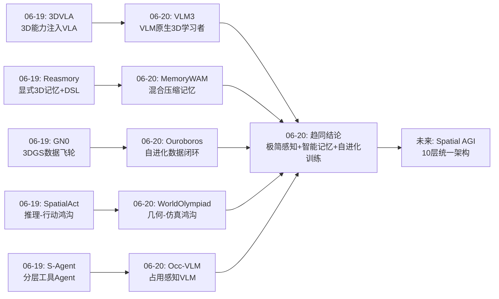
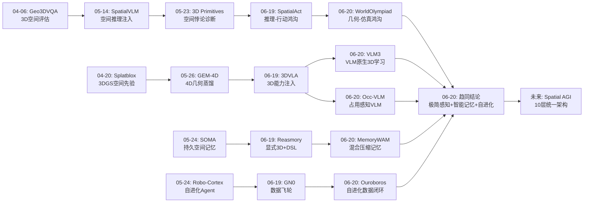
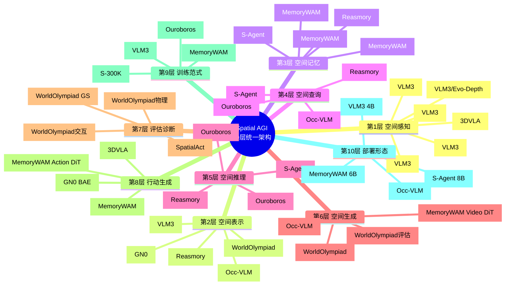
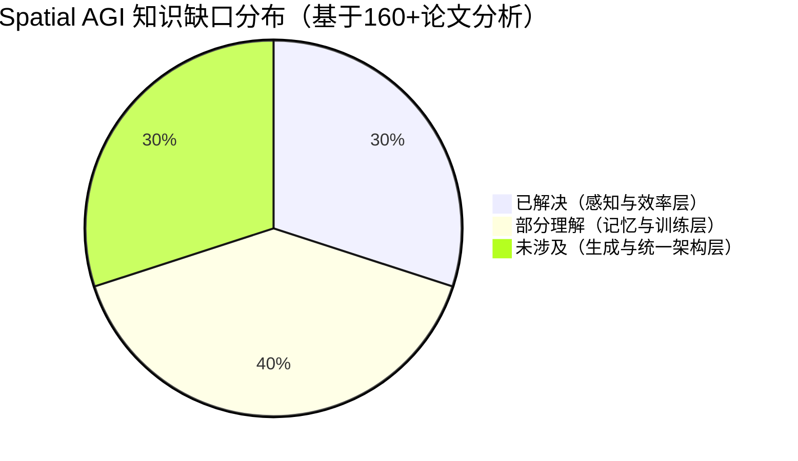

# 每日思考 - 2026-06-20

## 📅 每日总结

**日期**: 2026-06-20
**论文数量**: 5篇
**主题**: 从感知到生成到记忆——Spatial AGI 的全栈技术栈正在闭合

**关键突破**: 
- 🚀 **VLM 是原生 3D 学习者（VLM3）**: 仅需焦距统一 + 文本像素引用 + 数据混合三个简单策略，标准 VLM 无需任何架构修改即可在深度估计、像素对应、相机位姿等 3D 任务上匹配专家模型——彻底颠覆"3D 任务需要专用网络"的范式
- 🚀 **Geometry-Simulation Gap 被精确量化（WorldOlympiad）**: 所有 8 个视频世界模型在 3D 一致性上得分 < 0.43，人类视觉系统轻松构建的稳定 3D 心智模型，参数量远超人类的模型却做不到——这直接指向纯 2D 生成路线的根本局限
- 🚀 **2D 预训练语义的"隐藏 3D 能力"被解锁（Occ-VLM）**: 仅用单个 2D 编码器 + 轻量级 Occ Adapter（161M 参数），就能从 RGB 图像实现 3D 语义占用预测 SOTA——证明大规模 2D 预训练已经隐式学会了大量 3D 知识
- 🚀 **25.6k 数据打败 590k（Ouroboros-Spatial）**: 自进化数据-模型闭环通过置信度驱动的课程学习，用不到对手 1/10 的数据在 VSI-Bench 上达到 SOTA——"聪明数据 > 大数据"
- 🚀 **压缩记忆超越全记忆（MemoryWAM）**: 混合记忆（短期 + 锚点 + 要点）在 15 倍压缩比下不仅匹配而且超越全历史注意力——"少即是多"在空间记忆中得到验证

**架构演进**: 7层 → 10层（新增"空间生成与仿真层"、"持久时序记忆层"、"自进化训练闭环层"独立分层）

### 📊 一句话总结
今天的五篇论文从 3D 感知（VLM3/Occ-VLM）、世界模型评估（WorldOlympiad）、自进化训练（Ouroboros-Spatial）和高效持久记忆（MemoryWAM）四个维度，共同指向一个核心命题：**Spatial AGI 不需要更复杂的架构，而需要更聪明的表示、更精准的评估、更高效的数据和更智能的记忆**。

### 🔗 延续性
**昨日(06-19)→今日(06-20)**: 昨天确立了"持久化空间记忆 + 结构化约束推理 + Agent 范式"三大支柱；今天从底层感知（VLM3 的极简 3D 学习）、评估诊断（WorldOlympiad 的 Geometry-Simulation Gap）、训练范式（Ouroboros-Spatial 的自进化闭环）和记忆效率（MemoryWAM 的混合记忆）四个新角度深化了这一架构蓝图。特别是，昨天的 Reasmory 证明了"显式 3D 记忆 + DSL 约束"的有效性，今天的 MemoryWAM 则从认知科学角度给出了"如何高效持久化记忆"的答案——两者形成完美互补。
**今日→明日**: 今天揭示的 Geometry-Simulation Gap 和 VLM 原生 3D 能力之间的张力（理解 3D ≠ 生成 3D）值得深入探索；自进化训练范式如何与空间记忆架构结合也是重要方向。

### 💡 本质思考：如何达成通用空间智能

#### 1. 核心能力的本质是什么？
经过近两个月、160+ 篇论文的深度分析，Spatial AGI 的核心能力可以被提炼为一组正交能力的组合：

- **空间感知**（Where）：从 2D 图像中提取 3D 信息的能力。VLM3 证明这不需要专用网络——标准 VLM + 正确的归一化（焦距统一 + 像素归一化）就够了。Occ-VLM 进一步证明 2D 预训练已经隐式学会了大量 3D 知识。
- **空间生成**（What-if）：想象和生成 3D 场景的能力。WorldOlympiad 揭示这是当前最大瓶颈——所有模型的 3D 一致性 < 43%。
- **空间记忆**（When）：在时间维度上持久化空间状态的能力。MemoryWAM 证明混合记忆（短期 + 锚点 + 要点）是高效且有效的方案。
- **空间推理**（Why/How）：从空间信息中推导结论的能力。Ouroboros-Spatial 证明自进化闭环可以用极少数据习得真正的空间推理。
- **空间效率**（How much）：在有限计算资源下实现上述能力的效率。VLM3 的极简设计、Occ-VLM 的单编码器架构、MemoryWAM 的 15x 压缩、Ouroboros 的 25.6k 数据，共同指向"简约即力量"。

这五个维度的交叉定义了 Spatial AGI 的完整能力空间。今天的五篇论文分别在感知精度、生成评估、记忆效率、训练范式上取得了突破性进展。

#### 2. 当前方法与理想目标的差距在哪里？
- **理解 3D ≠ 生成 3D**: VLM3 在 3D 理解上达到 SOTA，但 WorldOlympiad 显示视频生成模型在 3D 一致性上挣扎。从"理解"到"生成"存在根本性的跨越——理解可以是判别式的（分类/回归），生成必须是生成式的（从噪声中构造一致的 3D 结构）。
- **静态 vs 动态**: VLM3 和 Occ-VLM 主要处理静态场景；MemoryWAM 处理时序但仅限操作任务；WorldOlympiad 评估动态生成但仅限仿真。真正的 Spatial AGI 需要在真实动态环境中运行。
- **封闭 vs 开放**: Occ-VLM 的 80 类预定义语义远远不够。Spatial AGI 需要开放词汇的空间理解。
- **训练数据的"质量 vs 数量"困境**: Ouroboros-Spatial 证明 25.6k 聪明数据 > 590k 静态数据，但自进化框架仍依赖标注的 3D 元数据。如何摆脱对标注数据的依赖是关键挑战。
- **评估的完整性**: WorldOlympiad 提供了物理 + 几何 + 交互的三维度评估，但仍限于视频生成。Spatial AGI 需要更全面的端到端评估（感知 → 推理 → 行动 → 反馈）。

#### 3. 从今天到理想状态，最可能的路径是什么？
基于今天五篇论文的共同指向，最可能的路径是：

**极简感知（VLM3 范式）→ 显式空间表示（Occ-VLM 占用网格）→ 混合持久记忆（MemoryWAM 三层架构）→ 自进化训练（Ouroboros 闭环）→ 多维度评估（WorldOlympiad 三赛道）**

关键转折点在于：
1. **摒弃"3D 需要专用网络"的思维定式**——VLM3 和 Occ-VLM 共同证明了通用模型的 3D 潜力
2. **接受"压缩记忆优于全记忆"的反直觉结论**——MemoryWAM 的成功表明智能的组织比完整保留更重要
3. **拥抱"动态数据 > 静态数据"的训练范式**——Ouroboros-Spatial 的自进化闭环是未来
4. **直面"Geometry-Simulation Gap"**——纯 2D 生成路线无法弥合，需要 3D-native 的架构

---

## 🔗 与昨日思考的联系

### 昨日重点（2026-06-19）
昨天聚焦"从感知到行动的架构拼图"：
- **空间记忆架构趋同**：Reasmory（点云 + DSL）、S-Agent（Scene + Agent Memory）、GN0（BEV）不约而同地选择持久化空间记忆
- **结构化约束 > 自由推理**：Reasmory 的 DSL 约束提升 6-18%
- **Agent 范式民主化**：S-Agent 用 8B 匹配 GPT-5.4
- **Reasoning-to-Action Gap 被量化**：SpatialAct 揭示多轮交互中的严重退化

### 今日进展
今天从四个全新角度深化了昨天的架构蓝图：

1. **感知层极简化**：昨天 3DVLA 用多视图融合 + 3D RoPE 注入 3D 能力，今天 VLM3 更进一步——连架构修改都不需要，仅需焦距统一 + 文本像素引用就够了。这说明 Spatial AGI 感知层的门槛比我们想象的低得多。

2. **评估维度拓展**：昨天 SpatialAct 诊断了推理-行动鸿沟，今天 WorldOlympiad 从生成角度量化了 Geometry-Simulation Gap。两者互补：一个测"理解到行动"，一个测"想象到现实"。

3. **记忆效率的突破**：昨天 Reasmory 用完整的 3D 点云作为记忆，今天 MemoryWAM 证明仅用 8 个 gist token 就能有效压缩每帧 120 个视觉 token（15x 压缩）。记忆不需要完整，需要智能。

4. **训练范式革新**：昨天 GN0 用 3DGS 数据飞轮，今天 Ouroboros-Spatial 用自进化闭环——两者的区别在于：GN0 的飞轮依赖外部仿真环境，Ouroboros 的闭环依赖模型自身的能力评估。后者更接近"自我驱动的 AGI"。

### 演进路径



---

## 🔬 论文间的深层联系

### 联系1: VLM3 × Occ-VLM — 两种"解锁"2D 模型 3D 能力的路径

VLM3 和 Occ-VLM 从不同角度证明了同一个核心结论：**2D 预训练模型已经隐式学会了大量 3D 知识**。但它们的"解锁"路径截然不同：

| 维度 | VLM3 | Occ-VLM |
|------|------|---------|
| **路径** | 输入层面解决（焦距统一 + 像素归一化） | 架构层面解决（Occ Adapter 适配器） |
| **编码器** | 完全使用 VLM 自身能力 | 冻结 SigLIP + 外挂 Adapter |
| **空间引用** | 文本坐标（[0,2000) 归一化） | 3D 锚点投影 + 可微采样 |
| **训练方式** | 纯文本 SFT（next-token prediction） | 两阶段（占用预测 + VQA 微调） |
| **任务范围** | 像素级 3D（深度/对应/位姿） | 场景级 3D（占用/VQA/描述） |
| **基础模型** | Qwen3-VL-4B | LLaVA-Video (SigLIP + Qwen2-7B) |

**深层互补性**：VLM3 的文本像素引用适合精确的像素级查询，Occ-VLM 的占用网格适合场景级的空间推理。一个完整的 Spatial AGI 感知层可能需要两者结合——VLM3 的精度 + Occ-VLM 的场景理解。

**关键差异——回归 vs 分类**：
- VLM3 发现"回归不是必要的"——连续值通过文本离散化就足够
- Occ-VLM 使用 Scene-Class Affinity Loss（一种回归-style 损失）训练占用预测
- 这暗示了不同任务可能需要不同的范式：输出格式灵活的任务（深度值、位姿）适合文本化；输出结构固定的任务（占用网格）适合专门的损失

### 联系2: WorldOlympiad × VLM3 — 理解-生成二分法的精确量化

WorldOlympiad 和 VLM3 的对比形成了今天最重要的高层发现：

**VLM3（理解侧）的成就**：
- 深度 δ1 = 0.90（与 UniDepthV2 持平）
- 相机位姿 AUC30 = 94.0（接近 DA3-Giant 94.7）
- 像素对应优于 DKM/RoMa

**WorldOlympiad（生成侧）的发现**：
- 所有模型 3D 一致性 < 0.43
- 最好的 Hunyuan-WorldPlay 仅 0.424
- 大多数模型集中在 0.25-0.40

**差距解读**：在理解侧，4B 模型可以做到 90% 的深度精度；在生成侧，14B 模型只能做到 42% 的 3D 一致性。这说明：

1. **判别式 3D 理解比生成式 3D 构造简单得多**——前者可以从 2D 观测的统计相关中推断，后者需要因果性的 3D 结构理解
2. **大数据训练的局限**：即使大规模视频训练让模型"涌现"出一定的 3D 理解，这种理解也是脆弱的——在 Gaussian Splatting 重建的"压力测试"下迅速崩溃
3. **从理解到生成的跨越**：VLM3 式的 3D 理解能力如何注入 WorldOlympiad 式的生成模型？这是 Spatial AGI 的关键开放问题

**可能的弥合路径**：
```
VLM3 理解能力（深度/占用/位姿）
    ↓ 作为训练信号
生成模型的 3D 一致性约束
    ↓ 评估
WorldOlympiad 三维度评分提升
```

### 联系3: MemoryWAM × Ouroboros — 自进化 × 高效记忆的训练-架构协同

MemoryWAM 的混合记忆和 Ouroboros 的自进化训练看似解决不同问题，但它们有一个深层共性：**都是在有限资源下最大化空间智能**。

| 维度 | MemoryWAM | Ouroboros |
|------|-----------|-----------|
| **优化目标** | 推理效率（KV cache 压缩） | 训练效率（数据量压缩） |
| **压缩比** | 15x（120→8 token/帧） | 23x（590k→25.6k 样本） |
| **核心信号** | 任务成功率（外部 reward） | 预测置信度（内部信号） |
| **创新类型** | 架构创新（混合记忆设计） | 训练创新（自进化闭环） |

**协同潜力**：
- Ouroboros 的自进化可以用于训练 MemoryWAM 的 gist token——随着模型能力提升，gist token 的压缩策略也自适应优化
- MemoryWAM 的混合记忆可以为 Ouroboros 的 Solver 提供更长的上下文——当前 Ouroboros 仅用 32 帧输入，MemoryWAM 可以扩展到任意长度
- 两者结合形成"高效训练 + 高效推理"的双重优化

### 联系4: WorldOlympiad × Occ-VLM — 占用预测作为生成评估的桥梁

WorldOlympiad 用 Gaussian Splatting 重建来诊断视频生成的 3D 一致性。Occ-VLM 用占用网格来表示场景的 3D 结构。两者之间存在一个自然的连接：

**占用预测 → 生成约束**：
- Occ-VLM 的占用预测可以作为视频生成的 3D 一致性约束
- 如果生成模型的输出在占用预测上出现"空洞"或"飞行体素"，说明 3D 结构不一致
- 这种约束比 Gaussian Splatting 重建后评估更直接——它是前向约束，不是后验诊断

**WorldOlympiad 的评估方法可以增强 Occ-VLM**：
- GS 重建 + meta-view 渲染可以用于评估 Occ-VLM 占用预测的质量
- 当前 Occ-VLM 仅用 mIoU 评估，缺乏几何一致性维度的评估

### 联系5: VLM3 × MemoryWAM — 极简感知 × 智能记忆的端到端 Spatial AGI

VLM3 和 MemoryWAM 的组合可以形成一个极简但强大的 Spatial AGI 骨架：

```
感知层: VLM3 范式（焦距统一 + 文本像素引用）
    ↓ 提供精确的 3D 感知（深度/位姿/对应）
记忆层: MemoryWAM 混合记忆（短期 + 锚点 + 要点）
    ↓ 持久化空间状态，支持长时序推理
行动层: MemoryWAM Action DiT
    ↓ 条件于混合记忆生成动作
```

这个组合的优势：
- VLM3 的感知不需要额外 3D 模块，降低了系统复杂度
- MemoryWAM 的记忆压缩使长时序任务可行
- 两者都追求极简设计，适合实际部署

挑战：
- VLM3 的逐像素查询范式与 MemoryWAM 的批量处理如何协调？
- VLM3 的文本化空间接口如何与 MemoryWAM 的 latent 表示对齐？

---

## 📚 论文概览

### 论文1: VLM3 — Vision Language Models Are Native 3D Learners (arXiv: 2605.30561)
- **来源**: Meta + Princeton，Zhipeng Cai et al.
- **核心创新**: 首次系统性证明标准 VLM（Qwen3-vl-4B）无需任何架构修改就能掌握多样化的 3D 理解任务
- **三大要素**: (1) 焦距统一为 1000 像素 (2) 文本像素引用（[0,2000) 归一化）(3) 数据混合与缩放
- **四大任务**: 度量深度估计（δ1=0.90）、物体级 3D 理解、像素对应、相机位姿估计（AUC30=94.0）
- **反直觉发现**: 回归公式不是必要的——纯文本 next-token prediction 可达 SOTA；4B 模型优于 8B（过拟合）
- **训练规模**: 26M 图像，32 GPU × 3 天

### 论文2: WorldOlympiad — Can Your World Model Survive a Triathlon? (arXiv: 2606.11129)
- **来源**: 浙江大学 + 阿里巴巴达摩院，Yuke Zhao et al.
- **核心创新**: 首个同时覆盖物理忠实性、几何一致性、交互保真度的视频世界模型评测基准
- **三大赛道**: (1) 物理评估（14 种规则，MLLM + SAM3）(2) 几何评估（Gaussian Splatting 重建 + Meta-view + 相机轨迹）(3) 交互评估（Chunk/Transition/Global 三层级）
- **核心发现**: **Geometry-Simulation Gap**——所有 8 个模型的 3D 一致性 < 0.43，当前最大瓶颈
- **评估覆盖**: 1000 条长视频（机器人 400 + 游戏 400 + 真实世界 200），8 个模型
- **人类对齐**: Spearman ρ = 0.95

### 论文3: Occ-VLM — Occupancy Grounded VLM for Indoor Scene Understanding (arXiv: 2606.19776)
- **来源**: 南京大学，Jianing Li et al.
- **核心创新**: 首个仅使用 RGB 输入和单个 2D 编码器的 3D VLM，通过 Occ Adapter 实现 2D→3D 能力扩展
- **三大组件**: (1) Occ Adapter（中间层激活 + 多层级聚合 + 3D 占用解码）(2) 占用感知 Token 采样（前景过滤 + 3D 位置编码）(3) 两阶段训练
- **关键成果**: 多视角占用预测 mIoU 18.41%（SOTA），ScanQA EM@1 29.6%（2D-input 类别 SOTA）
- **效率优势**: Occ Adapter 仅 161M 参数、11.3T FLOPs（比 VGGT 低一个数量级）

### 论文4: Ouroboros-Spatial — Closing the Data-Model Loop for Spatial Reasoning (arXiv: 2606.11719)
- **来源**: 北京大学 + 蚂蚁国际 + 港大，Enhan Zhao et al.
- **核心创新**: 首个面向空间推理的自进化数据-模型闭环框架——模型同时充当"出题者"和"解题者"
- **三大机制**: (1) Propose-Execute-Filter 三步数据生成（代码执行保证 GT 质量）(2) 零开销置信度难度估计 (3) 冻结 Proposer + 上下文反馈
- **极致数据效率**: 仅 25.6k 样本（vs Cambrian-S 590k），VSI-Bench 达到 63.3（SOTA）
- **VSI-debiased 验证**: 真正的空间理解（非语言捷径）——56.4/57.0 超过 GPT-5/Gemini-3 的原始分数

### 论文5: MemoryWAM — Efficient World Action Modeling with Persistent Memory (arXiv: 2606.20562)
- **来源**: 港中文 + 清华 + 浙大，Sizhe Yang et al.
- **核心创新**: 受认知科学启发的混合记忆机制——短期 + 事件边界锚点 + 要点压缩 token
- **三种记忆**: (1) 短期滑动窗口（N=4 帧完整 token）(2) 锚点帧（N_init=2 帧任务起始）(3) Gist token（M=8 个/帧，15x 压缩）
- **核心发现**: 混合记忆（83.0%）不仅匹配而且**超越**全历史注意力（78.2%）——压缩即智能
- **模型规模**: ~6B 参数（Video DiT 5B + Action DiT 1B）

### 跨论文对比表

| 维度 | VLM3 | WorldOlympiad | Occ-VLM | Ouroboros | MemoryWAM |
|------|------|--------------|---------|-----------|-----------|
| **研究类型** | 方法论 | 评估基准 | 方法论 | 训练范式 | 方法论 |
| **核心问题** | VLM 能否理解 3D | 世界模型有多好 | VLM 能否占用预测 | 如何高效训练空间推理 | 如何高效持久记忆 |
| **空间表示** | 焦距统一 + 文本坐标 | Gaussian Splatting | 3D 占用网格 | 隐式（视频帧） | 混合记忆 cache |
| **模型规模** | 4B | N/A（评估工具） | 7B + 161M Adapter | 4B/8B | ~6B |
| **训练数据** | 26M 图像 | 1000 条视频 | EmbodiedScan-Occ | 25.6k 样本 | 50 demos/task |
| **效率创新** | 无架构修改 | N/A | 单编码器 | 10-100x 数据效率 | 15x 记忆压缩 |
| **核心反直觉** | 回归不是必要的 | 理解≠生成 | 2D 已隐式学会 3D | 25.6k > 590k | 压缩 > 全保留 |
| **机构** | Meta/Princeton | 浙大/阿里 | 南京大学 | 北大/蚂蚁 | 港中文/清华 |

---

## 💡 核心见解

### 见解1: VLM 是原生 3D 学习者——3D 感知不需要专用网络
[来自 VLM3]

VLM3 的发现具有范式转变意义。3D 视觉领域几十年来积累的复杂技术——DPT 解码器、FPN 金字塔、多种回归损失、重度数据增强——在标准 VLM + 正确的训练策略面前变得不必要。

**三个要素就够了**：
1. 焦距统一（消除相机歧义）
2. 文本像素引用（[0,2000) 归一化解锁了 VLM 的像素级理解）
3. 数据混合缩放（质量 > 数量）

**核心反直觉**：回归公式不是必要的。相机位姿估计这样需要精确数值的任务，纯文本 next-token prediction 就能达到 AUC30=94.0。这意味着所有 3D 回归任务都可以重新表述为生成任务。

**对 Spatial AGI 的启发**：
- 感知层的门槛比预期低得多——不需要 3D-specific 的架构
- 文本作为统一的空间接口，无缝连接感知、推理和生成
- "最小归纳偏置"原则可能优于"领域特定设计"
- 很多我们认为是"特殊能力"的智能形式，可能只需要正确的表示和足够的数据

### 见解2: Geometry-Simulation Gap 是当前 Spatial AGI 的核心战场
[来自 WorldOlympiad]

WorldOlympiad 的最有价值发现不是某个模型的排名，而是精确量化了一个巨大的鸿沟：**即使是最好的视频生成模型，其 3D 一致性也只有 42%**。

这个 Geometry-Simulation Gap 的深层含义：
- **纯 2D 生成路线的局限**：视频生成模型在像素空间运作，缺乏内在的 3D 表示。即使大数据训练"涌现"出一定的 3D 理解，也只是统计相关而非真正的空间推理
- **"看起来对" ≠ "结构对"**：一段视频可能在原始视角下看起来合理，但在 Gaussian Splatting 重建和新视角渲染下暴露出 3D 结构的崩溃
- **物理涌现但不均匀**：高频物理（重力、碰撞）正在被内化（多个模型 > 0.86），但低频物理（热力学、材料）仍然脆弱

**核心矛盾——3D 稳定性 vs. 交互灵活性**：Hunyuan-WorldPlay 几何最好（0.424）但交互最弱（0.316）。视角控制型训练天然要求 view-consistent，但牺牲了灵活的交互能力。Spatial AGI 需要同时解决两者。

**对 Spatial AGI 的启发**：
- 纯数据驱动的 video generation 路线无法弥合 Geometry-Simulation Gap
- 需要引入显式 3D 表示（NeRF, 3DGS, voxel, occupancy）作为中间桥梁
- 评估方法论创新（GS 重建 + meta-view）可以直接迁移到 Spatial AGI 系统诊断

### 见解3: 2D 预训练中蕴含着"隐藏的 3D 能力"——只需正确解锁
[来自 Occ-VLM]

Occ-VLM 和 VLM3 从不同角度证明了同一个结论：**大规模 2D 视觉-语言预训练过程中，模型已经隐式学会了大量 3D 知识**。

Occ-VLM 的证据：
- 冻结的 SigLIP 编码器 + 轻量级 Occ Adapter（161M）→ 多视角占用预测 mIoU 18.41%（超越所有专门的 3D 方法）
- 2D 编码器的中间层特征（第 8/12/16/24 层）包含丰富的多尺度几何信息
- 多层级融合比仅用最后一层提升 1.75%

VLM3 的证据：
- 标准 Qwen3-VL 通过文本化训练就能达到 SOTA 3D 精度
- 像素坐标归一化到 [0,2000) 就能让 VLM "理解"像素位置——之前认为不可能

**深层启示**：构建 Spatial AGI 的关键可能不是"如何教 AI 理解 3D"，而是"如何引导 AI 展现已有的 3D 理解"。这降低了 Spatial AGI 的构建门槛——不需要从零收集大规模 3D 训练数据，而是利用已有的大规模 2D 预训练。

**技术路径**：
- 适配器范式（Occ Adapter）→ 不改动预训练模型，通过轻量级模块扩展能力
- 归一化范式（VLM3 焦距统一 + 像素归一化）→ 在输入层面解决问题
- 视频表示范式（Occ-VLM 将多视角 token 组织为视频序列）→ 利用已有视频理解能力

### 见解4: 自进化闭环是空间推理训练的未来——"聪明数据 > 大数据"
[来自 Ouroboros-Spatial]

Ouroboros-Spatial 用 25.6k 样本打败 590k，证明了数据效率的极致潜力。其核心洞察是：**模型自身的预测置信度是衡量训练样本价值的最佳信号**。

**三重创新**：
1. **代码即推理**：Proposer 生成问题和可执行代码，代码在 3D 元数据上执行得到确定性答案——比 LLM 直接生成答案或模板更可靠
2. **零开销难度估计**：从训练前向传播中提取 token 级置信度，三档分级（easy > 0.9 / hard < 0.1 / frontier 之间）
3. **冻结 Proposer + 上下文反馈**：不更新 Proposer 权重，仅通过提示注入难度反馈

**关键发现——VSI-debiased 验证**：Ouroboros 在消除语言捷径后的 VSI-debiased 上的得分（56.4/57.0）竟然超过 GPT-5、Gemini-3-Pro 在原始 VSI-Bench 上的得分。这证明学到的是**真正的空间理解**，而非语言先验的利用。

**对 Spatial AGI 的启发**：
- 空间推理训练的数据需求可以被降低 1-2 个数量级
- "学习前沿"原则（在模型能力边界处训练）应该成为 Spatial AGI 训练的指导原则
- 捷径学习防护是确保真正空间理解的关键
- 自进化机制可以与其他方法叠加（+ 3D 重建、+ RL、+ 多模态）

### 见解5: 压缩记忆优于全记忆——认知科学启发的 AI 设计
[来自 MemoryWAM]

MemoryWAM 的核心发现——混合记忆（83.0%）超越全历史注意力（78.2%）——是反直觉的。"更多信息 = 更好性能"的朴素直觉在空间记忆中不成立。

**为什么压缩更好？**
- 完整历史包含大量与当前决策无关的冗余信息
- 密集的历史上下文使任务相关信息的检索变得更困难（信噪比下降）
- 智能的压缩通过去除噪声提升了检索效率

**三种记忆的互补设计**（基于认知科学）：
- **短期记忆**（N=4 帧滑动窗口）：高精度当前状态，支持即时闭环控制
- **锚点记忆**（N_init=2 帧任务起始）：关键里程碑，事件边界理论在机器人学中的验证
- **要点记忆**（M=8 个 gist token/帧）：15x 压缩的长期摘要，人类"gist traces"的 AI 实现

**对 Spatial AGI 的启发**：
- 记忆系统的关键不是容量，而是组织方式
- 人类空间记忆的分层结构（感知记忆 → 短期记忆 → 长期记忆）可以被有效映射到计算架构
- 认知科学不仅是灵感来源，更可以提供可计算的设计原则
- 与昨天的 Reasmory（显式 3D 记忆 + DSL）形成互补：Reasmory 解决"如何查询"，MemoryWAM 解决"如何持久化"

### 见解6: 理解 3D ≠ 生成 3D——Spatial AGI 的核心二分法
[来自 VLM3 + WorldOlympiad]

今天最重要的高层发现是 VLM3 和 WorldOlympiad 之间的鲜明对比：

- **VLM3（理解侧）**：标准 VLM 在深度估计、像素对应、相机位姿等 3D **理解**任务上达到 SOTA（δ1=0.90, AUC30=94.0）
- **WorldOlympiad（生成侧）**：所有视频生成模型在 3D **一致性**上得分 < 0.43

这个差距揭示了一个根本性的二分法：**3D 理解（判别式）和 3D 生成（生成式）是完全不同的能力**。

**深层原因分析**：
- 3D 理解可以是判别式的——从 2D 观测中推断 3D 信息，VLM 的注意力机制已经隐式学会了这种映射
- 3D 生成需要从噪声中构造一致的 3D 结构——这要求对 3D 几何有显式的、因果性的理解
- 理解可以利用统计相关（"桌子通常在地板上"），生成需要因果推理（"桌子必须有支撑才不会浮空"）

**对 Spatial AGI 路线图的影响**：
- Spatial AGI 不能只走理解路线（VLM3 风格），也不能只走生成路线（视频世界模型）
- 需要理解和生成的统一——可能的路径是将 VLM3 的感知能力注入世界模型（如 MemoryWAM 的 Video DiT）
- Occ-VLM 的占用预测可能是连接理解和生成的桥梁：占用网格既是理解的输出，也是生成的约束

### 见解7: 从"大数据"到"聪明数据"——Spatial AGI 训练范式的代际跃迁
[来自 Ouroboros-Spatial + VLM3 + MemoryWAM]

三篇论文从不同角度共同指向一个趋势：**Spatial AGI 的训练正在从"堆数据"转向"选数据"**。

| 范式 | 代表 | 数据量 | 核心假设 | 局限 |
|------|------|--------|---------|------|
| 第一代 | ViCA, SAT | 100k-500k | 更多数据 = 更好性能 | 静态数据，不考虑模型能力 |
| 第二代 | Cambrian-S, VLM-3R | 300k-600k | LLM 增强 = 更好数据 | 仍然静态 |
| 第三代（今天） | Ouroboros | 25.6k | 模型自身评估 = 最优数据 | 依赖 3D 元数据标注 |

VLM3 的数据混合权重调优（从 0.84 → 0.88 → 0.90）和 MemoryWAM 的 50 demos/task 训练也支持这一趋势。

**未来方向**：第四代训练范式应该是"无标注自进化"——摆脱对 3D 元数据的依赖，用模型自身的 3D 重建（如 VLM3 深度估计、Occ-VLM 占用预测）作为伪标注来源。

---

## 🗺️ 知识演进图



---

## 技术栈演进对比表

| 层次 | 06-19 方案 | 06-20 方案 | 变化 |
|------|-----------|-----------|------|
| **感知层** | 3DVLA 多视图融合 + 3D RoPE | VLM3 焦距统一 + 文本像素引用 | 从"架构注入"到"极简训练策略"——连架构都不用改 |
| **表示层** | GN0 BEV + Reasmory 点云 | Occ-VLM 3D 占用网格 + VLM3 文本坐标 | 新增"占用预测"作为统一空间接口 |
| **记忆层** | Reasmory 显式 3D 全量记忆 | MemoryWAM 混合压缩记忆（15x 压缩） | 从"全量保留"到"智能压缩"——压缩反而更好 |
| **评估层** | SpatialAct 多轮交互诊断 | WorldOlympiad 物理+几何+交互三维度 | 从"理解侧评估"到"生成侧+理解侧双向评估" |
| **训练层** | GN0 DAgger→RL + S-300K 轨迹 | Ouroboros 自进化闭环（25.6k 数据） | 从"外部数据生成"到"模型自生成+自评估" |
| **生成层** | （未独立涉及） | WorldOlympiad GS 重建诊断 | **新增**——Geometry-Simulation Gap 作为核心挑战 |
| **效率层** | 3DVLA 0.086B 参数开销 | VLM3 零架构 + Occ-VLM 161M + MemoryWAM 15x | 效率优化从"减少参数"到"全栈简约" |
| **认知层** | Reasmory DSL 约束 | MemoryWAM 认知科学三系统映射 | 从"计算约束"到"认知启发" |

---

## 🗺️ Spatial AGI 知识图谱

### 10层架构思维导图



### 🎯 主线技术路径

#### 阶段1: 极简空间感知——VLM 的 3D 潜力释放（快速推进中 70%）
- **核心问题**: 如何让 2D-native 的 VLM 理解 3D 空间？
- **当前最佳方案**: 
  - VLM3 范式：焦距统一 + 文本像素引用 + 数据混合 → 无架构修改
  - Occ-VLM 范式：Occ Adapter + 占用预测 → 单 2D 编码器 + 轻量适配器
  - 3DVLA 范式：多视图融合 + 3D RoPE → 即插即用模块
- **关键突破**: VLM3 证明"回归不是必要的"，Occ-VLM 证明"2D 预训练已隐式学会 3D"
- **剩余挑战**: 动态场景 3D 感知、开放词汇理解、极端环境鲁棒性
- **预计成熟**: 2026 下半年

#### 阶段2: 智能空间记忆——从全量到压缩（突破性进展 55%）
- **核心问题**: 如何在有限计算资源下持久化空间状态？
- **当前最佳方案**:
  - MemoryWAM：三层混合记忆（短期 + 锚点 + 要点），15x 压缩，O(N/d) 复杂度
  - Reasmory：显式 3D 点云 + DSL 查询约束
  - S-Agent：Scene Memory + Agent Memory 双系统
- **关键突破**: MemoryWAM 证明"压缩记忆 > 全记忆"（83.0% vs 78.2%）
- **剩余挑战**: 记忆表示的统一标准、跨场景记忆迁移、动态环境记忆更新
- **预计成熟**: 2027 年初

#### 阶段3: 自进化空间推理——数据-模型闭环（起步中 30%）
- **核心问题**: 如何用最少的数据习得真正的空间推理能力？
- **当前最佳方案**: Ouroboros-Spatial 自进化闭环
  - Propose-Execute-Filter 三步数据生成（代码执行保证质量）
  - 零开销置信度难度估计（训练信号几乎免费）
  - 冻结 Proposer + 上下文反馈（简化训练）
- **关键突破**: 25.6k 数据超越 590k；VSI-debiased 验证真正的空间理解
- **剩余挑战**: 摆脱 3D 元数据依赖、路径规划能力覆盖、Proposer 自身进化
- **预计成熟**: 2027 年中

#### 阶段4: 3D-native 世界模型——弥合 Geometry-Simulation Gap（展望中 15%）
- **核心问题**: 如何让生成模型具备内在的 3D 一致性？
- **当前诊断**: WorldOlympiad 精确量化了 Gap（所有模型 < 0.43）
- **可能路径**:
  - (a) 将 Occ-VLM 的占用预测作为生成约束
  - (b) 将 VLM3 的 3D 感知能力注入 Video DiT
  - (c) 设计 3D-native 的生成架构（非 2D + 3D 后处理）
- **核心矛盾**: 3D 稳定性 vs. 交互灵活性（WorldOlympiad 发现的权衡）
- **预计成熟**: 2027-2028

#### 阶段5: 统一 Spatial AGI——10 层架构集成（远期 5%）
- **核心问题**: 如何将 10 层能力整合为统一的 Spatial AGI 系统？
- **愿景**: 一个 agent，感知用 VLM3 范式、表示用占用网格、记忆用 MemoryWAM 混合架构、推理用 Ouroboros 自进化、评估用 WorldOlympiad 三维度
- **关键挑战**: 各层之间的接口标准化、跨领域任务迁移、实时部署效率
- **预计成熟**: 2028+

---

## 🔍 待探索议题

### 高优先级（本周）

1. **理解 3D ≠ 生成 3D 的深层原因**
   - 问题: VLM3 在 3D 理解上达到 SOTA，但 WorldOlympiad 显示生成模型 3D 一致性 < 43%。这个鸿沟的根源是什么？
   - 候选方案: 分析判别式 3D 理解（利用统计相关）和生成式 3D 构造（需要因果推理）的差异
   - 缺口: 缺乏对"理解-生成鸿沟"的理论分析和弥合方法

2. **VLM3 的文本化空间接口能否扩展到生成任务**
   - 问题: VLM3 用文本像素引用实现了 SOTA 的 3D 理解。同样的接口能否用于 3D 生成（如文本→3D 场景）？
   - 候选方案: 将 VLM3 的深度估计输出作为生成约束，结合 Occ-VLM 的占用预测
   - 缺口: 当前 VLM3 仅验证了判别式任务，生成式任务的能力未知

3. **占用预测作为理解-生成的桥梁**
   - 问题: Occ-VLM 的占用网格既是理解的输出，也可能是生成的约束。能否用占用预测来约束视频生成模型的 3D 一致性？
   - 候选方案: 在 WorldOlympiad 评估框架中加入"占用预测一致性"维度
   - 缺口: 没有将占用预测用作生成约束的工作

4. **Ouroboros 自进化 × MemoryWAM 混合记忆**
   - 问题: 能否将 Ouroboros 的自进化训练与 MemoryWAM 的混合记忆结合？gist token 的压缩策略能否自进化？
   - 候选方案: 用 Ouroboros 的置信度反馈来调整 gist token 的数量或压缩策略
   - 缺口: 两个方向的结合点尚未被探索

### 中优先级（本月）

5. **自进化训练摆脱 3D 元数据依赖**
   - 问题: Ouroboros 依赖 ScanNet 等数据集的精确 3D 标注。能否用 VLM3 的深度估计或 Occ-VLM 的占用预测作为伪标注？
   - 候选方案: VLM3 深度估计 → 伪场景图 → Ouroboros Proposer 生成问题
   - 缺口: 伪标注的精度是否足够支持高质量的代码执行验证

6. **MemoryWAM 的 gist token 可解释性**
   - 问题: 8 个 gist token 究竟编码了什么空间信息？是语义抽象还是统计特征？
   - 候选方案: 设计探针实验（probe experiment），用不同空间查询任务测试 gist token 的信息含量
   - 缺口: 当前论文未提供可解释性分析

7. **WorldOlympiad 评估框架的扩展**
   - 问题: WorldOlympiad 目前仅评估视频世界模型。能否将三赛道框架扩展到 Spatial AGI 的端到端评估？
   - 候选方案: 增加"空间推理"赛道（如 SpatialAct 的多轮交互）和"空间记忆"赛道（如 MemoryWAM 的长时序任务）
   - 缺口: 当前评估框架仍限于生成侧

8. **VLM3 在具身智能中的部署**
   - 问题: VLM3 的推理范式（逐像素查询）对密集预测来说太慢。如何在机器人等实时场景中部署？
   - 候选方案: (a) 蒸馏到专用网络 (b) 仅查询关键像素（物体中心、边界点）(c) 批量并行查询
   - 缺口: VLM3 的推理效率优化尚未被研究

9. **Occ-VLM 扩展到室外和开放词汇**
   - 问题: Occ-VLM 仅在室内 80 类上验证。如何扩展到自动驾驶等室外场景和开放词汇？
   - 候选方案: (a) 结合 CLIP/SEEM 实现开放词汇占用 (b) 用自动驾驶数据集（nuScenes, Waymo）训练
   - 缺口: 室外占用预测的分辨率需求远高于室内

### 低优先级（探索性）

10. **认知科学对 Spatial AGI 记忆设计的进一步启发**
    - 问题: MemoryWAM 从人类记忆三系统模型获取灵感。认知科学中还有哪些理论可以指导 Spatial AGI？
    - 候选方案: place cells/grid cells（空间编码）、认知地图（拓扑记忆）、心理旋转（空间变换）、工作记忆容量限制（Miller's 7±2）
    - 缺口: 神经科学与 AI 在空间智能领域的交叉研究不足，缺乏从理论到工程的系统性映射

11. **VLM3 的"回归不必要"发现在其他领域的适用性**
    - 问题: 如果 next-token prediction 可以做相机位姿估计，它还能做什么？能否扩展到 3D 重建、光流、SLAM、场景图生成？
    - 候选方案: 将 VLM3 的方法应用于新任务，测试极限。特别是 SLAM——如果 VLM 可以做位姿估计和像素对应，它是否可以替代完整的 SLAM 管线？
    - 缺口: 当前仅验证了四类任务，在其他 3D 回归任务上的表现未知

12. **Spatial AGI 的数据效率极限**
    - 问题: Ouroboros 用 25.6k，MemoryWAM 用 50 demos/task。Spatial AGI 的数据需求下限在哪里？
    - 候选方案: 系统性研究数据量与性能的关系曲线，找到拐点。结合自进化训练和混合记忆，探索零样本/单样本空间推理的可行性
    - 缺口: 当前缺乏对数据效率极限的系统研究，特别是"最少需要多少数据才能习得某种空间能力"的定量分析

---

## 📊 知识缺口分析



**已解决（30%）**:
- ✅ VLM 的原生 3D 感知能力（VLM3, Occ-VLM, 3DVLA）
- ✅ 空间表示的多种方案（占用网格, BEV, 点云, 文本坐标）
- ✅ 基础空间记忆架构（MemoryWAM 混合记忆, Reasmory 显式记忆, S-Agent 双记忆）
- ✅ 空间推理训练范式（Ouroboros 自进化, S-300K 轨迹, DAgger+RL）
- ✅ 空间感知评估基准（VSI-Bench, VSI-debiased）
- ✅ VLA 基础架构（3DVLA, GTA-VLA, M²-VLA）
- ✅ 导航基础能力（GN0, GA-VLN, EmbodiedNavBench）

**部分理解（40%）**:
- ⚠️ 空间记忆效率优化（MemoryWAM 15x 压缩——但仅限操作任务）
- ⚠️ 自进化训练的无标注扩展（Ouroboros 依赖 3D 元数据——如何摆脱？）
- ⚠️ 世界模型 3D 一致性（WorldOlympiad 诊断了问题——但解决方案？）
- ⚠️ 结构化空间推理（Reasmory DSL + Ouroboros 代码执行——但表达力有限）
- ⚠️ 推理-行动闭环（SpatialAct 诊断——但治疗？）
- ⚠️ 物理推理（WorldOlympiad 物理赛道——但仅 14 种规则）
- ⚠️ Sim-to-Real 迁移（MemoryWAM 真实机器人验证——但仅简单任务）
- ⚠️ 评估方法论（WorldOlympiad GS 重建——但仅限生成侧）

**未涉及（30%）**:
- ❌ 3D-native 世界模型（非 2D + 3D 后处理的生成架构）
- ❌ 理解-生成鸿沟的弥合（从 VLM3 的理解能力到 WorldOlympiad 的生成能力）
- ❌ 统一 Spatial AGI 架构（跨操作 + 导航 + 推理 + 生成的共享架构）
- ❌ 无标注自进化训练（摆脱 3D 元数据依赖的闭环）
- ❌ 开放词汇 3D 理解（超越 80 类预定义语义）
- ❌ Spatial AGI 安全性框架（不确定性约束、人在回路）
- ❌ 神经科学启发的空间认知架构（place cells, cognitive maps）

---

## 📐 空间理解-生成二分法：Spatial AGI 的核心挑战

基于今天 VLM3（理解侧 SOTA）和 WorldOlympiad（生成侧 < 43%）的鲜明对比，我提出 Spatial AGI 面临的核心二分法：

### 理解 vs. 生成的能力矩阵

| 能力维度 | 理解（判别式） | 生成（生成式） | 差距 |
|---------|--------------|--------------|------|
| 深度感知 | VLM3 δ1=0.90 ✅ | 视频深度一致性 ❌ | 大 |
| 空间关系 | Occ-VLM VQA SOTA ✅ | 场景生成空间一致 ❌ | 大 |
| 物理理解 | 概念级理解 ⚠️ | 物理仿真精度 ❌ | 极大 |
| 几何结构 | 占用预测 mIoU=18.41% ⚠️ | 3D 重建一致性 < 43% ❌ | 大 |
| 相机运动 | 位姿估计 AUC30=94.0 ✅ | 相机轨迹保真度 ⚠️ | 中 |
| 长程一致性 | MemoryWAM 83% ✅ | WorldOlympiad 交互 ⚠️ | 中 |
| 空间记忆 | 混合记忆 83% ✅ | 长程生成连贯性 ❌ | 大 |

### 为什么理解比生成容易？——理论分析

**1. 信息论视角**：
- 理解是降维过程（2D → 深度值/占用标签），信息熵减少
- 生成是升维过程（噪声 → 2D 像素 → 隐含 3D 结构），需要采样一致性
- 理解可以选择性关注（只看被查询的像素），生成必须全局一致

**2. 因果性视角**：
- 理解可以利用统计相关（桌子通常在地板上 → 推断深度）
- 生成需要因果推理（桌子必须有支撑 → 否则浮空）
- VLM3 的成功表明，大量 3D 理解任务可以用统计模式匹配解决
- 但生成要求每个像素都遵循物理因果——任何不一致都会被 Gaussian Splatting 暴露

**3. 一致性视角**：
- 理解是局部任务（每个像素独立估计深度）
- 生成是全局任务（所有像素必须形成一致的 3D 场景）
- 局部正确 ≠ 全局一致——这是 Geometry-Simulation Gap 的本质

### 弥合路径

**路径 A: 感知约束生成**
- 用 VLM3 的深度估计和 Occ-VLM 的占用预测作为生成约束
- 优势：理解能力已经很强，可以直接利用
- 挑战：如何将判别式约束融入生成式训练
- 具体方案：在视频生成器的训练中加入 occupancy loss / depth consistency loss

**路径 B: 3D-native 生成架构**
- 设计原生 3D 的生成模型（在 3D 空间中生成，再渲染到 2D）
- 优势：从根本上解决 3D 一致性问题
- 挑战：3D 数据规模不足、计算开销大
- 具体方案：3D Gaussian 的自回归生成 / 占用空间的扩散模型

**路径 C: 理解-生成联合训练**
- 同时训练理解和生成任务，共享 backbone
- 优势：两种能力互相增强（理解提供约束，生成提供数据增强）
- 挑战：训练目标可能冲突
- 具体方案：VLM3 的深度估计 + WorldOlympiad 式视频生成，共享 VLM backbone

**路径 D: 记忆增强生成**
- 用 MemoryWAM 的混合记忆为生成提供长程 3D 上下文
- 优势：解决生成模型的长程一致性问题
- 挑战：记忆的精度是否足够约束生成
- 具体方案：生成时，每个 chunk 条件于混合记忆而非仅 KV-cache

### 推荐的综合路径

```
阶段1（近期）: VLM3 感知 → Occ-VLM 占用 → 后验约束生成
阶段2（中期）: 联合训练（理解+生成共享 backbone）
阶段3（远期）: 3D-native 世界模型（在 3D 空间直接生成）
```

### 与昨日"推理-行动鸿沟"的关系

昨天的 SpatialAct 揭示了"推理到行动"的鸿沟。今天的 WorldOlympiad 揭示了"理解到生成"的鸿沟。两者形成了 Spatial AGI 的双重挑战：

```
           Spatial AGI 的双重鸿沟
          
    理解 ←────── Gap 1 ──────→ 行动
     │                              │
     │         (SpatialAct)         │
     │                              │
   Gap 2                        Gap 3
     │                              │
     ↓         WorldOlympiad         ↓
    生成 ←────── Gap 3 ──────→ 一致性
```

- **Gap 1（理解→行动）**: 空间推理如何转化为可靠的空间行动（SpatialAct 诊断）
- **Gap 2（理解→生成）**: 空间理解如何支持空间生成（WorldOlympiad 量化）
- **Gap 3（生成→一致性）**: 生成的场景如何保持 3D 一致性（Geometry-Simulation Gap）

三个 Gap 共同定义了 Spatial AGI 从"感知"到"全能"需要跨越的距离。

---

## 📝 总结

### 今日最重要的三个发现

1. **VLM 是原生 3D 学习者（VLM3 + Occ-VLM）**: 两篇论文从不同角度共同证明——标准 VLM 不需要架构修改就能掌握精确的 3D 理解。VLM3 用极简训练策略（焦距统一 + 文本像素引用）在四大 3D 任务上达到 SOTA；Occ-VLM 用轻量级 Adapter 解锁了 2D 预训练中隐藏的 3D 能力。这彻底改变了 Spatial AGI 感知层的设计预期。

2. **Geometry-Simulation Gap 是 Spatial AGI 的核心战场（WorldOlympiad）**: 理解 3D ≠ 生成 3D。VLM3 可以精确理解 3D，但视频生成模型在 3D 一致性上挣扎（< 43%）。这个鸿沟揭示了纯 2D 生成路线的根本局限，指向需要 3D-native 架构和显式空间约束。

3. **"少即是多"在 Spatial AGI 全栈得到验证**: VLM3 的零架构修改、Occ-VLM 的单编码器、Ouroboros 的 25.6k 数据、MemoryWAM 的 15x 压缩——四个独立维度的证据共同指向简约设计的力量。Spatial AGI 不需要堆叠复杂模块，需要的是正确的表示、精准的评估、高效的数据和智能的记忆。

### 明日方向建议

1. **探索理解-生成鸿沟的弥合**: 占用预测（Occ-VLM）作为连接理解和生成的桥梁
2. **自进化训练的无标注扩展**: 用 VLM3 深度估计替代 Ouroboros 的 3D 元数据依赖
3. **混合记忆 × 自进化的结合**: MemoryWAM 的 gist token 策略自适应优化
4. **3D-native 世界模型**: 从 2D + 3D 后处理到真正的 3D-native 生成架构

---

*生成时间: 2026-06-20*
*论文来源: arXiv 2026-05-28 ~ 2026-06-18*
*累计研究论文: 160+ 篇*
*思考深度: 10层架构分析 + 12项待探索议题 + 5阶段技术路径*
*Mermaid图表: 4个（演进图 + 思维导图 + 饼图 + 知识演进图）*

---

## 附录: 今日论文的核心数据速查表

### VLM3 关键数据

| 配置 | 深度估计 | 物体级3D | 像素对应 | 相机位姿 |
|------|---------|---------|---------|---------|
| 训练数据 | 26M图像 | 1M图像 | 10M对 | 10M样本 |
| GPU | 32×3天 | 32×3h | 64×7天 | 32×4天 |
| 性能 | δ1=0.90 | SOTA | 优于DKM | AUC30=94.0 |

### WorldOlympiad 模型排名

| 排名 | 模型 | Physical | 3D Cons. | Interact. | All |
|------|------|----------|----------|-----------|-----|
| 1 | LingBot-World 14B | 0.942 | 0.373 | 0.734 | 0.683 |
| 2 | Cosmos-Predict-2.5 2B | 0.906 | 0.399 | 0.707 | 0.671 |
| 6 | Hunyuan-WorldPlay | 0.692 | **0.424** | 0.316 | 0.477 |

### Occ-VLM 性能

| 任务 | 指标 | Occ-VLM | 对比 |
|------|------|---------|------|
| 占用预测 | mIoU | 18.41% | SOTA（超越所有RGB和PC方法） |
| ScanQA | EM@1 | 29.6% | 2D-input SOTA |
| SQA3D | EM@1 | 58.5% | 与RGBD方法持平 |

### Ouroboros-Spatial 迭代效果

| 轮次 | 4B | 8B | 备注 |
|------|-----|-----|------|
| R0 | 52.8 | 56.5 | 基线 |
| R1 | ~58 | ~60 | 最大单轮提升 |
| R4 | 62.7 | 63.3 | 接近天花板 |

### MemoryWAM 性能对比

| 记忆机制 | 成功率 | 复杂度 | 压缩比 |
|---------|--------|--------|--------|
| π0.5（无记忆） | 10.4% | O(1) | N/A |
| FastWAM（短窗口） | 5.9% | O(1) | N/A |
| LingBot-VA（全历史） | 78.2% | O(N) | 1x |
| **MemoryWAM（混合）** | **83.0%** | **O(N/d)** | **15x** |
