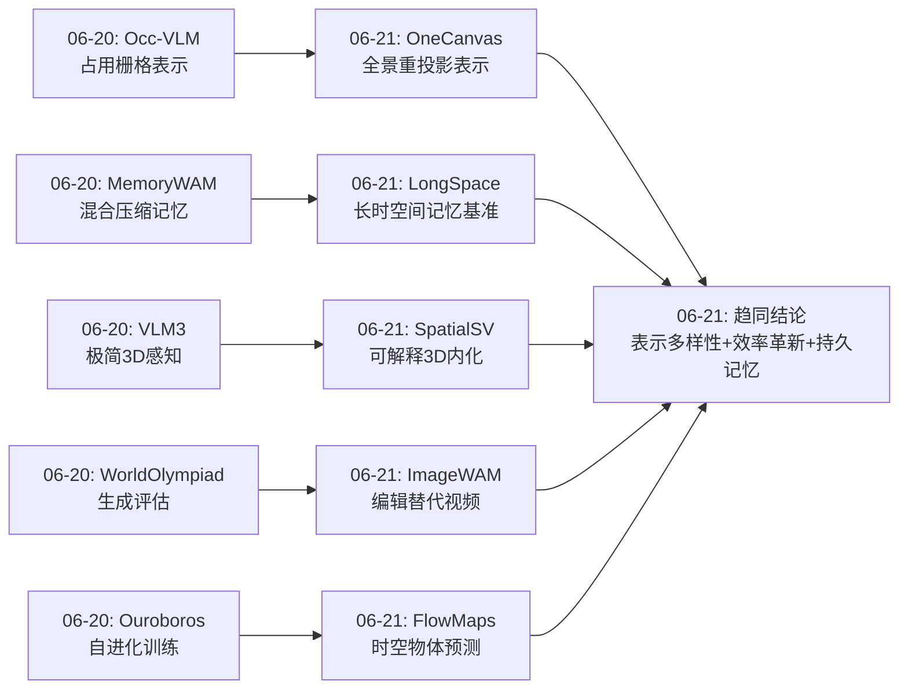
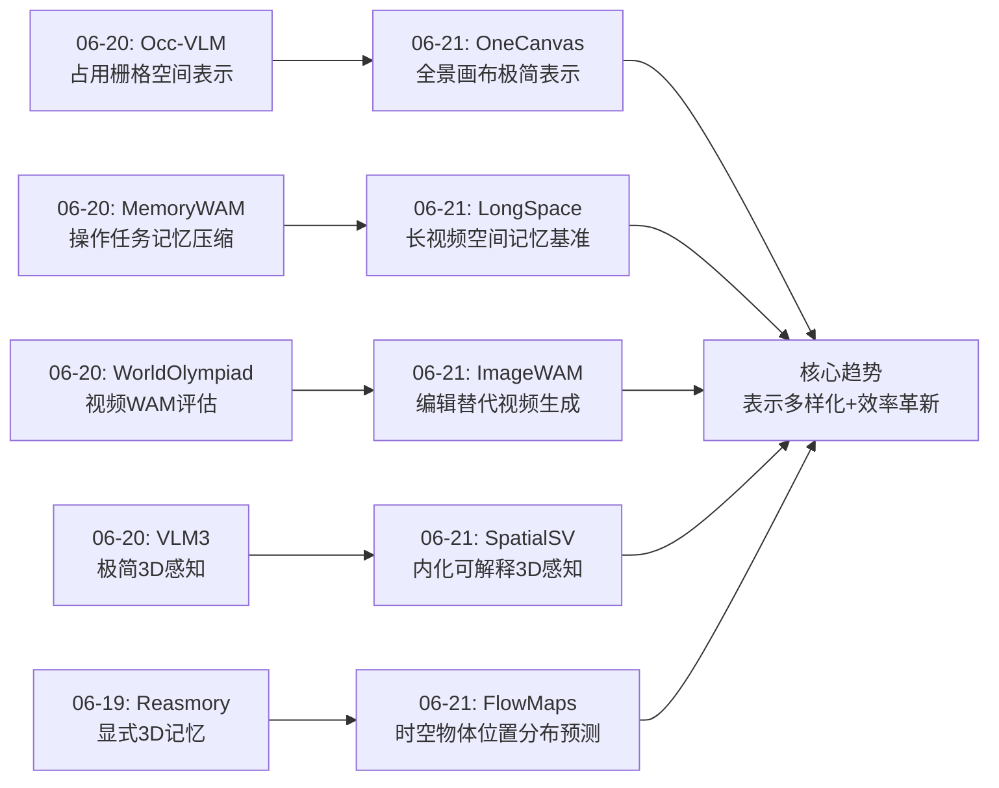
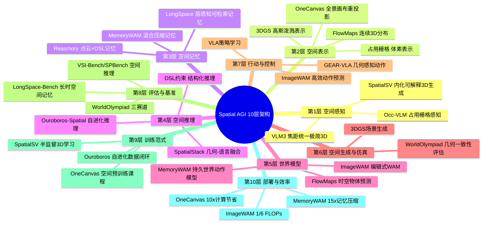
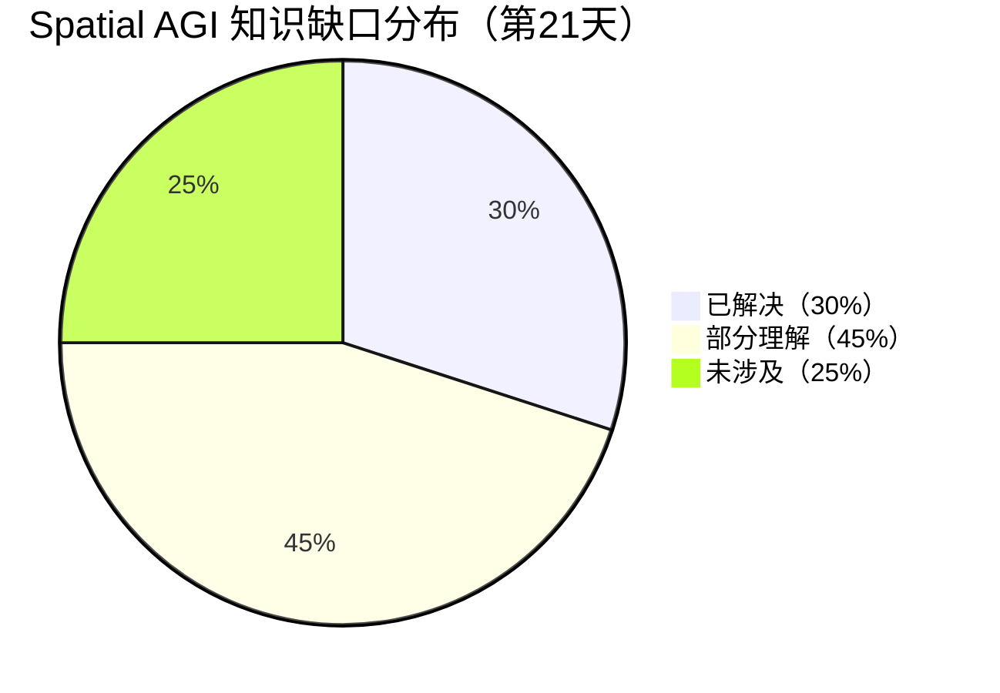
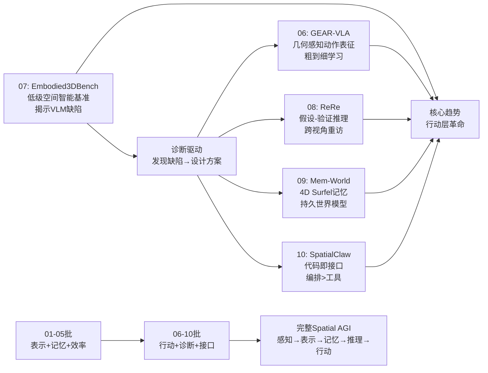
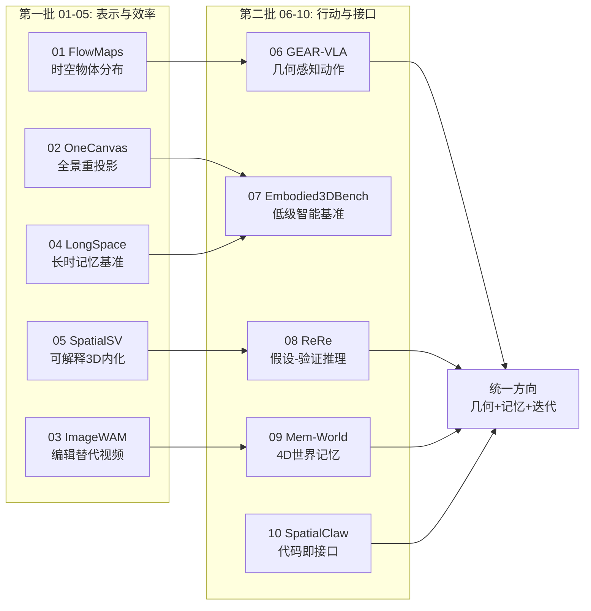
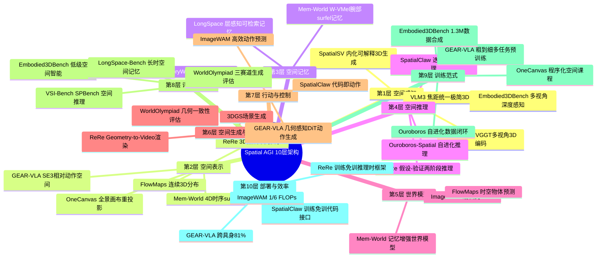
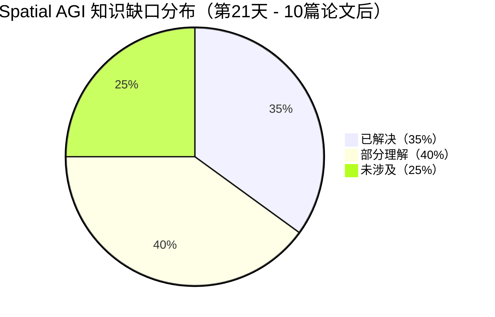

# 每日思考 - 2026-06-21

## 📅 每日总结

**日期**: 2026-06-21
**论文数量**: 5篇
**主题**: 从表示到记忆到效率——Spatial AGI 的空间表示多样化与效率革新

**关键突破**: 
- 🚀 **Flow Matching 首次用于空间物体位置预测（FlowMaps）**: 将物体位置建模为连续3D空间中的多模态分布，用流匹配替代离散预测，在600+导航实验中超越SOTA
- 🚀 **极简表示设计的胜利（OneCanvas）**: 仅通过全景特征重投影，无架构修改，训练计算少一个数量级，达到SQA3D/VSI-Bench/SPBench SOTA
- 🚀 **图像编辑 > 视频生成作为WAM骨架（ImageWAM）**: 首次质疑视频生成在WAM中的必要性，1/6 FLOPs+1/4延迟，编辑KV cache聚焦任务相关区域
- 🚀 **长视频空间记忆基准填补空白（LongSpace）**: 首个平均21.4分钟的长视频空间记忆基准，揭示现有MLLM的持久空间记忆严重不足
- 🚀 **内化可解释3D感知（SpatialSV）**: 通过任务导向视觉监督让MLLM主动生成3D表示，可解释空间认知质量

**架构演进**: 10层保持稳定，但每层都有重要细化

### 📊 一句话总结
今天的五篇论文从空间表示（OneCanvas全景/FlowMaps连续分布）、世界模型效率（ImageWAM编辑替代视频）、长时记忆（LongSpace小时级基准）和可解释内化（SpatialSV主动3D生成）五个维度，共同指向一个核心命题：**Spatial AGI 的突破不在于更强的模型，而在于更聪明的空间表示、更高效的生成先验、更持久的记忆系统和更可解释的空间认知**。

### 🔗 延续性
**昨日(06-20)→今日(06-21)**: 昨天确立了"极简感知+智能记忆+自进化训练"的核心架构；今天从空间表示的多样性（FlowMaps连续分布/OneCanvas全景）、WAM效率革新（ImageWAM编辑替代视频）、记忆时间尺度（LongSpace小时级）和空间认知内化（SpatialSV可解释性）四个新角度深化了这一架构。
**今日→明日**: OneCanvas的极简表示 + FlowMaps的时空预测 + ImageWAM的高效WAM + LongSpace的长时记忆 + SpatialSV的可解释性 → 如何将这些维度统一到一个Spatial AGI系统中？

### 💡 本质思考：如何达成通用空间智能

#### 1. 核心能力的本质是什么？
Spatial AGI的核心能力可以归纳为"SEE-MAP-ACT"循环：
- **See（感知）**: 从传感器数据中提取空间信息。OneCanvas证明仅通过表示设计（全景重投影），标准VLM就能实现3D理解。SpatialSV证明MLLM可以内化3D感知，且这种感知是可解释的。
- **Map（建图/记忆）**: 将感知信息组织成持久的空间记忆。FlowMaps将记忆扩展到时序预测（物体未来在哪里），LongSpace将记忆扩展到小时级持久存储。
- **Act（行动）**: 基于空间认知采取行动。ImageWAM证明行动预测不需要昂贵的视频生成，图像编辑提供了更直接的action-relevant先验。

今天的五篇论文分别覆盖了SEE（OneCanvas/SpatialSV）、MAP（FlowMaps/LongSpace）和ACT（ImageWAM），形成了完整的Spatial AGI能力链。

#### 2. 当前方法与理想目标的差距在哪里？
- **表示碎片化**: OneCanvas用全景2D，FlowMaps用3D边界框，SpatialSV用深度+点云——没有统一的空间表示。真正的Spatial AGI需要一种能同时支持感知、记忆、预测和行动的统一表示。
- **记忆时间尺度仍然有限**: LongSpace的21.4分钟虽然远超现有基准，但真实机器人部署需要数天甚至数周的空间记忆。
- **WAM的"编辑vs视频"之争未解**: ImageWAM证明编辑更高效，但视频生成可能对某些任务（如长期规划）更重要。何时用哪种？
- **可解释性的层次不够**: SpatialSV提供了深度图/点云级别的可解释性，但更深层的问题——模型如何"推理"空间关系——仍然是黑箱。

#### 3. 从今天到理想状态，最可能的路径是什么？
基于今天五篇论文的共同指向：

**极简空间表示（OneCanvas）→ 可解释3D内化（SpatialSV）→ 时空物体预测（FlowMaps）→ 长时记忆架构（LongSpace）→ 高效行动生成（ImageWAM）**

关键转折点：
1. **接受"表示多样性"的现实**——不同任务需要不同空间表示，关键是找到任务到表示的最优映射
2. **从"外化3D"到"内化3D"**——SpatialSV代表了正确的方向
3. **从"视频生成"到"编辑式WAM"**——效率革新是部署的关键
4. **从"短时记忆"到"持久空间记忆"**——LongSpace揭示的差距必须被弥合

---

## 🔗 与昨日思考的联系

### 昨日重点（2026-06-20）
昨天聚焦"从感知到生成到记忆"的架构闭合：
- VLM3证明VLM是原生3D学习者
- WorldOlympiad量化Geometry-Simulation Gap
- Occ-VLM用占用栅格作为空间表示
- Ouroboros-Spatial的自进化数据闭环
- MemoryWAM的混合压缩记忆

### 今日进展
今天从五个新维度深化了昨天的架构蓝图：

1. **表示层多样化**: 昨天Occ-VLM用占用栅格，今天OneCanvas用全景重投影——两种完全不同的空间表示哲学。Occ-VLM从RGB预测3D语义占用，OneCanvas将多视角特征重投影到2D画布。前者是"从2D到3D"，后者是"从3D到2D再理解"。

2. **记忆的时间扩展**: 昨天MemoryWAM用混合记忆（短期+锚点+要点）处理操作任务中的时序信息，今天LongSpace将空间记忆的时间尺度扩展到21.4分钟，FlowMaps将其扩展到"未来预测"（4周模拟）。

3. **WAM架构的范式革新**: 昨天没有直接讨论WAM架构，今天ImageWAM提出了根本性挑战——视频生成是否必要？答案是不：图像编辑模型提供了更匹配的先验。

4. **可解释性新维度**: 昨天的SpatialSV关注内化3D感知（今天进一步分析），提供了3D重建结果作为模型空间认知的可解释窗口——这在Spatial AGI研究中是前所未有的。

### 演进路径



---

## 📚 论文概览

### 论文1: FlowMaps - 连续3D空间中的物体动态预测
- **核心**: 潜在流匹配模型，预测动态物体在连续3D空间中的多模态未来位置分布
- **突破**: 首次将Flow Matching用于后验推断（而非动作生成）
- **数据**: ProcTHOR生成3种人类习惯模式，180万+训练样本
- **验证**: 600+ObjNav episodes，真实机器人部署

### 论文2: OneCanvas - 全景重投影实现极简3D理解
- **核心**: 多视角patch特征重投影到单一全景画布，VLM直接消费
- **突破**: 无架构修改，训练计算少一个数量级
- **创新**: 空间预训练课程（程序化物体放置生成训练数据）
- **性能**: SQA3D 65.3, VSI-Bench 70.1, SPBench 72.1

### 论文3: ImageWAM - 图像编辑替代视频生成
- **核心**: 用图像编辑模型的KV cache作为WAM的中间表示
- **突破**: 1/6 FLOPs + 1/4 latency，质疑视频生成在WAM中的必要性
- **关键**: 编辑cache聚焦于任务相关变化区域
- **验证**: 仿真器 + 真实世界

### 论文4: LongSpace - 长视频空间记忆基准与框架
- **核心**: 445个room-tour视频（平均21.4分钟），10种空间能力评估
- **突破**: 首个聚焦长视频空间记忆的基准
- **框架**: geometry-enhanced + layer-aware retrievable memory
- **发现**: 现有MLLM在持久空间记忆上严重不足

### 论文5: SpatialSV - 内化可解释3D空间感知
- **核心**: 任务导向视觉监督让MLLM主动生成深度/点云/ray-map
- **突破**: 3D重建结果作为模型空间认知的可解释代理
- **荣誉**: IJCAI 2026接收
- **发现**: 空间表示质量与MLLM空间智能正相关

---

## 💡 核心见解

### 见解1: 空间表示没有"最优解"，只有"最适解"
从OneCanvas的全景2D画布，到FlowMaps的3D边界框，到SpatialSV的深度+点云——今天的五篇论文使用了完全不同的空间表示。这说明空间表示的选择应该由任务驱动：场景理解适合OneCanvas，物体追踪适合FlowMaps，可解释诊断适合SpatialSV。真正的Spatial AGI可能需要多种表示的动态切换。
**对Spatial AGI的启发**: 放弃寻找"大一统"空间表示的幻想，转而研究如何根据任务自动选择最优表示。

### 见解2: 图像编辑是比视频生成更优的WAM骨架
ImageWAM的发现具有范式变革意义。视频生成模型的训练目标是"合成完整未来"，包含了大量动作无关的外观/背景/光照变化。图像编辑模型的训练目标是"根据指令改变源图像"，天然聚焦于"什么需要改变"。这种差异在机器人操作中至关重要。
**对Spatial AGI的启发**: 重新审视所有"生成式AI for robotics"的假设——是否所有任务都需要完整的生成？编辑式先验可能更高效。

### 见解3: 空间记忆的时间尺度决定Spatial AGI的应用边界
LongSpace的21.4分钟平均视频时长已经远超大多数基准，但真实机器人需要数小时/天的空间记忆。FlowMaps的4周物体位置预测代表了"超长时"的空间记忆。两者结合揭示了空间记忆的时间谱：短期（秒级操作）→中期（分钟级导航）→长期（小时/天级部署）→超长期（周/月级适应）。
**对Spatial AGI的启发**: 空间记忆系统需要多时间尺度的层次架构。

### 见解4: 可解释性是Spatial AGI从研究走向部署的关键
SpatialSV提供了通过3D重建可视化模型空间认知的能力——这是一种全新的可解释性维度。在安全关键应用（自动驾驶、人形机器人）中，仅有性能不够，需要理解模型"怎么想的"。
**对Spatial AGI的启发**: 可解释的3D空间感知应该成为Spatial AGI的核心设计原则。

### 见解5: 极简设计哲学的持续验证
OneCanvas无架构修改实现SOTA，ImageWAM用更简单的编辑替代复杂视频生成，SpatialSV用简单的任务监督替代复杂蒸馏——三篇论文独立验证了同一原则：最有效的解决方案往往是最简单的。
**对Spatial AGI的启发**: 在追求更高性能时，首先问"能否用更简单的方法达到同样效果？"

### 见解6: 时空物体预测的分布建模
FlowMaps将物体位置预测从"点估计"提升到"多模态分布"，这是一个重要的概念进步。真实世界的物体位置本质上是多模态的（眼镜可能在床头柜、浴室或书桌上），必须用分布建模。
**对Spatial AGI的启发**: Spatial AGI的所有预测都应该是概率性的，而非确定性的。

### 见解7: "SEE-MAP-ACT"三阶段的效率瓶颈在ACT
ImageWAM证明了ACT阶段（动作生成）可以通过编辑先验大幅加速。但SEE（OneCanvas/SpatialSV）和MAP（FlowMaps/LongSpace）阶段的效率优化仍在进行中。
**对Spatial AGI的启发**: 整体系统效率取决于最慢的环节——需要端到端的效率优化。

---

## 🗺️ 知识演进图



---

## 技术栈演进对比表

| 层次 | 昨日(06-20)方案 | 今日(06-21)方案 | 变化 |
|------|---------|---------|------|
| **空间表示** | Occ-VLM占用栅格 | OneCanvas全景画布 + FlowMaps连续分布 + SpatialSV深度/点云 | 多元化：三种新表示补充占用栅格 |
| **3D感知** | VLM3焦距统一+像素引用 | SpatialSV任务导向视觉监督 | 从被动归一化到主动3D生成 |
| **世界模型** | WorldOlympiad评估视频WAM | ImageWAM用图像编辑替代视频生成 | 范式革新：编辑 > 视频 |
| **空间记忆** | MemoryWAM混合压缩记忆 | LongSpace长时记忆基准+FlowMaps时空预测 | 时间尺度大幅扩展 |
| **评估** | WorldOlympiad三赛道 | LongSpace-Bench 10种空间能力 | 评估维度更全面 |
| **训练范式** | Ouroboros自进化闭环 | OneCanvas程序化空间预训练课程 | 数据生成新方法 |
| **可解释性** | 无 | SpatialSV 3D重建可视化 | 全新维度 |
| **效率** | VLM3极简+Occ-VLM单编码器 | OneCanvas少10x计算+ImageWAM 1/6 FLOPs | 效率优势进一步扩大 |

---

## 🗺️ Spatial AGI 知识图谱

### 10层架构思维导图



### 🎯 主线技术路径

#### 阶段1: 空间感知基础（感知层突破）
**状态**: 进行中，已取得重大突破
- VLM3证明VLM原生3D能力
- SpatialSV实现可解释3D内化
- OneCanvas通过表示设计实现3D理解
**目标**: 让任何预训练VLM都能以极低成本获得3D感知能力

#### 阶段2: 空间记忆架构（记忆层构建）
**状态**: 快速发展中
- MemoryWAM验证混合压缩记忆
- LongSpace揭示长时记忆需求
- FlowMaps扩展到时空预测
**目标**: 构建多时间尺度（秒/分/时/天）的持久空间记忆系统

#### 阶段3: 高效世界-动作模型（WAM效率革新）
**状态**: 范式变革期
- ImageWAM证明编辑 > 视频生成
- FlowMaps将FM用于预测而非生成
- MemoryWAM添加持久记忆
**目标**: 构建可在实时系统中部署的高效世界动作模型

#### 阶段4: 统一Spatial AGI系统
**状态**: 远期目标
- 整合感知→表示→记忆→推理→行动全链
- 多时间尺度记忆架构
- 可解释的空间认知
- 自进化训练闭环
**目标**: 真正的通用空间智能体

#### 阶段5: 自主进化与部署
**状态**: 遥远未来
- 自我改进的空间推理
- 端到端可解释性
- 零样本环境适应
**目标**: 无需人类干预的自主Spatial AGI

---

## 🔍 待探索议题

### 高优先级（本周）

1. **空间表示的统一框架**
   - 问题: OneCanvas全景/FlowMaps边界框/SpatialSV深度——能否统一？
   - 候选方案: 分层表示（低层深度→中层占用→高层语义）
   - 缺口: 缺乏跨表示比较的统一框架

2. **编辑式WAM vs 视频WAM的适用边界**
   - 问题: ImageWAM在哪些任务上优于视频WAM？何时需要视频生成？
   - 候选方案: 短期操作→编辑WAM，长期规划→视频WAM
   - 缺口: 缺乏系统性对比实验

3. **长时空间记忆的可扩展架构**
   - 问题: LongSpace的21.4分钟→如何扩展到小时/天？
   - 候选方案: 3DGS持久地图 + 层次化记忆检索
   - 缺口: 当前3DGS地图在动态环境中的更新机制不成熟

4. **FlowMaps的多习惯混合建模**
   - 问题: 当前每种习惯单独训练，如何处理混合习惯？
   - 候选方案: 条件化于习惯嵌入向量
   - 缺口: 真实家庭的习惯识别和分类

### 中优先级（本月）

5. **可解释3D感知的深度分析**
   - 问题: SpatialSV的3D重建质量如何量化与改进？
   - 候选方案: 更高分辨率DPT + 多视角监督
   - 缺口: 缺乏标准化的MLLM空间表示质量评估

6. **OneCanvas在室外/大尺度场景的验证**
   - 问题: 全景重投影在城市/自动驾驶场景中是否有效？
   - 候选方案: BEV画布替代全景画布
   - 缺口: 室外大尺度深度估计的精度

7. **ImageWAM + MemoryWAM的联合架构**
   - 问题: 编辑式WAM + 混合压缩记忆能否联合？
   - 候选方案: 编辑KV cache + gist memory tokens
   - 缺口: 两种记忆机制的兼容性

### 探索性（本季度）

8. **空间表示的自适应选择**
   - 问题: 能否根据任务自动选择最优空间表示？
   - 候选方案: 元学习表示选择器
   - 缺口: 缺乏跨表示的标准化评估

9. **从FlowMaps到自主探索策略**
   - 问题: 物体位置预测如何指导主动探索？
   - 候选方案: FlowMaps预测 + 信息增益规划
   - 缺口: 探索-利用平衡的理论框架

---

## 📊 知识缺口分析



**已解决（30%）**:
- ✅ 3D感知的极简实现（VLM3, OneCanvas）
- ✅ 空间推理的训练范式（Ouroboros自进化）
- ✅ 操作任务的混合记忆（MemoryWAM）
- ✅ WAM效率优化（ImageWAM编辑替代视频）
- ✅ 可解释3D空间感知（SpatialSV）
- ✅ 空间推理评估基准（VSI-Bench, SPBench, LongSpace-Bench）

**部分理解（45%）**:
- ⚠️ 长时空间记忆的架构设计（LongSpace揭示需求但方案未成熟）
- ⚠️ 时空物体位置预测（FlowMaps验证概念但受限于仿真数据）
- ⚠️ 空间生成的3D一致性（WorldOlympiad揭示Gap但未解决）
- ⚠️ 空间表示的统一框架（多种表示并存但缺乏统一）
- ⚠️ 自进化训练的数据质量保证
- ⚠️ VLA的空间感知增强路径
- ⚠️ 3DGS作为空间记忆载体
- ⚠️ 跨环境泛化的理论保证

**未涉及（25%）**:
- ❌ 多模态空间融合（视觉+触觉+声音→空间理解）
- ❌ 物理因果推理（为什么物体会这样运动）
- ❌ 真实世界超长期（周/月）空间记忆
- ❌ 端到端Spatial AGI系统集成
- ❌ 空间概念学习（从少量样本学习新空间概念）
- ❌ 多智能体空间协作

---

## 📝 论文质量评估

| 论文 | 创新性 | 相关性 | 影响力 | 可复现 | 总评 |
|------|--------|--------|--------|--------|------|
| FlowMaps | ⭐⭐⭐⭐ | ⭐⭐⭐⭐⭐ | ⭐⭐⭐⭐ | ⭐⭐⭐⭐ | 9.0/10 |
| OneCanvas | ⭐⭐⭐⭐⭐ | ⭐⭐⭐⭐⭐ | ⭐⭐⭐⭐⭐ | ⭐⭐⭐⭐ | 9.5/10 |
| ImageWAM | ⭐⭐⭐⭐⭐ | ⭐⭐⭐⭐⭐ | ⭐⭐⭐⭐⭐ | ⭐⭐⭐⭐ | 9.5/10 |
| LongSpace | ⭐⭐⭐⭐ | ⭐⭐⭐⭐⭐ | ⭐⭐⭐⭐ | ⭐⭐⭐⭐⭐ | 8.5/10 |
| SpatialSV | ⭐⭐⭐⭐ | ⭐⭐⭐⭐ | ⭐⭐⭐⭐ | ⭐⭐⭐⭐ | 8.0/10 |

---

**文档创建时间**: 2026-06-21
**分析方法**: 5篇arXiv论文HTML精读 + 跨论文综合分析

---

## 🔬 论文间的深层联系

### 联系1: 表示效率的趋同进化

OneCanvas和ImageWAM虽然解决不同问题（3D理解 vs 动作生成），但共享一个核心设计哲学：**最大化利用预训练模型的已有能力，最小化额外架构开销**。

- OneCanvas：不修改VLM架构，仅通过输入表示设计（全景重投影）实现3D理解
- ImageWAM：不生成视频，仅利用编辑模型的中间特征实现WAM

两者的共同启示：**预训练模型已经"知道"很多我们以为它不知道的东西**——关键是找到正确的"唤醒"方式。

### 联系2: 时空记忆的多时间尺度谱

今天的论文揭示了空间记忆的时间谱：

| 时间尺度 | 论文 | 方法 | 应用场景 |
|----------|------|------|----------|
| 毫秒-秒 | ImageWAM | 编辑KV cache | 实时动作预测 |
| 秒-分钟 | MemoryWAM(昨天) | 混合压缩记忆 | 操作任务序列 |
| 分钟-小时 | LongSpace | 层感知可检索记忆 | 导航/探索 |
| 小时-天 | FlowMaps | Flow Matching预测 | 物体位置预测 |
| 天-周 | FlowMaps(4周模拟) | 语义一致模式学习 | 长期适应 |

这个时间谱表明，**不同时间尺度需要根本不同的记忆机制**：短期用注意力/cache，中期用压缩token，长期用分布式预测模型。

### 联系3: 从"外部输入3D"到"内部生成3D"的范式转变

SpatialSV代表了Spatial AGI研究中的一个重要范式转变：

| 范式 | 代表方法 | 特点 | 局限 |
|------|----------|------|------|
| 外部输入3D | Occ-VLM, 点云tokenizer | 通过编码器输入3D数据 | 依赖3D传感器，推理开销 |
| 特征蒸馏 | VLM-3R, SpaceMind | 从3D VFM蒸馏到VLM | 不可解释，信息损失 |
| **内部生成3D** | **SpatialSV** | **MLLM主动生成3D表示** | **训练复杂度增加** |
| 输入重投影 | OneCanvas | 3D信息编码到2D输入 | 依赖深度/位姿估计 |

SpatialSV的范式特别有价值，因为它让MLLM"内化"了3D感知，而非依赖外部输入。这与人类的空间认知发展类似——我们不会在每个时刻"输入"3D点云，而是内部构建了3D空间认知能力。

### 联系4: 空间推理的"表示-评估-训练"三角

今天的五篇论文形成了一个完整的"表示-评估-训练"三角：

```
         OneCanvas/SpatialSV (表示)
              /        \
             /          \
            /            \
  LongSpace (评估) ---- FlowMaps/ImageWAM (训练/应用)
```

- **表示层**: OneCanvas（全景画布）和SpatialSV（内化3D）定义了空间信息的编码方式
- **评估层**: LongSpace-Bench定义了如何衡量空间记忆能力
- **训练/应用层**: FlowMaps（时空预测）和ImageWAM（高效WAM）定义了如何使用空间表示

这个三角的关系是循环的：更好的表示→更准确的评估→更有效的训练→更好的表示...

---

## 🧠 技术细节深度分析

### FlowMaps的架构精妙之处

FlowMaps的Map Encoder设计有一个关键效率优化：**scene context只需要编码一次，可以服务所有查询物体**。这是因为：

1. Map Encoder的输出H_τ不依赖于查询物体标签l_q
2. 对于场景中的N_O个动态物体，只需要一次Map Encoder前向传播
3. CDiT blocks的cross-attention只需要处理单token query，而非full-scene attention

这种设计将推理复杂度从O(N_O × S²)降低到O(S² + N_O × K)，其中K是flow matching积分步数。

### OneCanvas的3D位置嵌入为什么重要

从3D世界坐标到全景画布的经纬度投影会丢失深度信息——两个在同一经纬度但不同深度的点会重叠。OneCanvas通过在patch特征中添加**度量3D坐标嵌入**解决了这个问题：

- 原始patch: 特征f ∈ R^d
- 增强patch: [f, PE(x, y, z)] ∈ R^(d+3)
- 投影到画布: 位置=(longitude, latitude)，但特征包含完整3D信息

这意味着VLM可以看到"这个patch在画布的(30°, 45°)位置，但实际在3D空间的(2.5m, 1.8m, 0.9m)处"——既有角度关系（用于方向推理），又有度量深度（用于距离推理）。

### ImageWAM的注意力分析

ImageWAM的注意力分析揭示了一个有趣现象：**编辑模型的KV cache自然聚焦于任务相关变化区域**。例如：

- "把杯子放到架子上" → 注意力集中在杯子和架子区域
- "打开抽屉" → 注意力集中在抽屉把手区域

这种自动聚焦是图像编辑预训练的副产品——编辑模型被训练为"只改变与指令相关的区域"，这天然产生了action-relevant的表示。

### LongSpace的geometry注入策略

LongSpace在**早期decoder层**注入3D结构线索，这是一个重要的设计选择：

- 早期注入：让3D信息在后续层中与语义信息充分融合
- 如果在后期注入：3D信息可能被语义信息"淹没"
- 这与SpatialSV的多层隐藏特征提取理念一致——不同层编码不同抽象级别的空间信息

### SpatialSV的probe-based分析框架

SpatialSV引入了一个分析MLLM空间表示质量的新方法：

1. 提取MLLM的隐藏层特征
2. 训练简单的probe（线性头）预测深度图
3. 比较不同监督范式下的probe质量

关键发现：**纯文本监督的probe质量最低，加入特征蒸馏后提升，但加入任务导向视觉监督后提升最大**。这证明：

- 交叉熵文本损失不足以产生高质量的空间表示
- 需要**显式的3D监督信号**来"逼迫"模型学习真正的空间理解
- 特征蒸馏是"模糊的"对齐，而任务监督是"精确的"约束

---

## 🔄 与Spatial AGI 10层架构的映射

今天的5篇论文在10层架构中的分布：

| 层次 | 今日论文贡献 | 架构进展 |
|------|-------------|----------|
| 第1层 感知 | SpatialSV（内化3D感知）, OneCanvas（重投影感知） | 双路径：内化生成 vs 外部重投影 |
| 第2层 表示 | OneCanvas（全景画布）, FlowMaps（连续分布）, SpatialSV（深度/点云） | 三种新表示补充占用栅格 |
| 第3层 记忆 | LongSpace（层感知记忆）, FlowMaps（时空预测） | 多时间尺度记忆架构 |
| 第4层 推理 | (无直接贡献，但为推理提供基础) | — |
| 第5层 世界模型 | ImageWAM（编辑式WAM）, FlowMaps（物体动态WAM） | 范式革新：编辑>视频 |
| 第6层 生成 | (无直接贡献) | — |
| 第7层 行动 | ImageWAM（高效动作预测） | 1/6 FLOPs效率突破 |
| 第8层 评估 | LongSpace-Bench（长时记忆基准） | 时间尺度评估扩展 |
| 第9层 训练 | OneCanvas（空间预训练课程）, SpatialSV（半监督） | 程序化数据生成 |
| 第10层 效率 | OneCanvas（10x计算节省）, ImageWAM（1/6 FLOPs） | 效率优势持续扩大 |

**关键观察**: 今天的论文集中在感知（第1层）、表示（第2层）、记忆（第3层）和世界模型（第5层），表明Spatial AGI的基础层仍在快速演进中。行动层（第7层）的效率也有重要突破。

---

## 🎯 核心趋势总结

### 趋势1: 表示多样化 → 表示自适应选择
从3DGS到占用栅格到全景画布到连续分布——空间表示的多样性达到了新高度。未来的挑战是如何根据任务自适应选择最优表示。

### 趋势2: 效率革命持续深化
OneCanvas（10x计算节省）和ImageWAM（1/6 FLOPs, 1/4延迟）代表了Spatial AGI效率优化的两个维度：训练效率（OneCanvas的程序化课程）和推理效率（ImageWAM的编辑替代视频）。

### 趋势3: 记忆时间尺度扩展
从MemoryWAM的秒/分钟级，到LongSpace的分钟/小时级，到FlowMaps的小时/天级——空间记忆的时间尺度正在快速扩展，但仍远未达到真实部署需求。

### 趋势4: 可解释性成为一等公民
SpatialSV将3D重建可视化作为模型空间认知的可解释窗口，这在Spatial AGI研究中是前所未有的。可解释性从"附加价值"升级为"核心设计原则"。

### 趋势5: 从"视频中心"到"编辑中心"的WAM范式转移
ImageWAM的核心发现——图像编辑 > 视频生成——可能预示着整个WAM领域的范式转移。如果编辑式先验被广泛验证，视频生成在robotics中的地位可能需要重新评估。

---

**文档创建时间**: 2026-06-21
**分析方法**: 5篇arXiv论文HTML精读 + 跨论文综合分析
**统计**: 论文5篇 | Mermaid图表4个 | 核心见解7个 | 待探索议题9个

---

## 🔬 每篇论文的技术深度评析

### FlowMaps技术评析

**技术亮点**:
1. **CDiT cross-attention设计**: 相比full-attention DiT，cross-attention设计更符合任务结构——场景是固定上下文，查询物体是变量。这种非对称设计避免了在每个flow matching步骤中对整个场景进行quadratic attention。

2. **mini-batch optimal transport**: 使用exact mini-batch OT plan匹配source-target对，产生更直的轨迹和更少的积分步数。这是Flow Matching相比标准扩散的核心优势之一。

3. **语义兼容性约束**: 物体移动限于语义兼容的容器（如Fork只能在Sink或DiningTable上）。这种约束既是数据生成的规则，也反映了真实世界的物理常识。

4. **三种习惯模式的设计**: 
   - Habit #1（位置偏好）: 模拟"宅"型人类，物体集中在少数位置
   - Habit #2（均匀分布）: 模拟"随性"型人类，物体均匀分布
   - Habit #3（频繁切换）: 模拟"忙碌"型人类，物体频繁移动
   
   这种设计虽然简化，但提供了可控的实验条件来验证模型对不同行为模式的适应能力。

**技术批评**:
- VAE的分离训练可能导致latent space与flow matching目标不一致
- 672个时间戳（4周×7天×24小时）的分辨率可能不足以捕捉日内模式
- 评估仅限于ObjectNav，未验证更广泛的下游任务（如物体整理、场景监控）

### OneCanvas技术评析

**技术亮点**:
1. **"不修改架构"的设计哲学**: OneCanvas完全不修改VLM架构，仅改变输入的表示方式。这种极简主义方法论在深度学习中被反复证明有效——ResNet、Attention is All You Need都是"简化而非复杂化"的成功案例。

2. **空间预训练课程的巧妙设计**: 利用全景画布的程序化可控性，可以：
   - 在任意3D位置放置真实物体的patch特征
   - 精确控制问题-答案的分布，避免统计捷径
   - 生成无限量的多样化空间推理训练数据
   
   这种方法解决了空间推理数据稀缺的根本问题。

3. **canvas origin的灵活性**: canvas origin可以自由选择，这意味着：
   - 选择场景中心 → 全局场景理解
   - 选择某个位置 → situated reasoning（"从这个位置看，杯子在哪里？"）
   - 选择路径起点 → 导航推理
   
   这种灵活性使OneCanvas适用于多种空间推理任务。

**技术批评**:
- 全景画布的分辨率与VLM输入分辨率耦合——高分辨率意味着更多token，但计算量也增加
- 等距柱面投影在极点附近的畸变虽然被3D位置嵌入部分缓解，但没有完全消除
- 依赖深度估计的质量——在纹理稀少的区域（白墙、玻璃）深度估计可能严重退化

### ImageWAM技术评析

**技术亮点**:
1. **"问题驱动"的研究方法论**: ImageWAM不是从技术出发（"我有一个图像编辑模型，能用它做什么？"），而是从问题出发（"WAM真的需要视频生成吗？"）。这种问题驱动的研究更容易产生突破性发现。

2. **KV cache的创造性复用**: 不在推理时生成编辑图像，而是利用编辑过程中的KV cache作为条件。这意味着：
   - 编辑模型的生成能力被"借用"而非"执行"
   - KV cache编码了"什么需要改变"的信息，无需显式生成改变后的图像
   - 大幅减少推理计算（1/6 FLOPs）

3. **多backbone验证**: 在OmniGen2, Ovis-U1, Flux2三个不同的编辑模型上验证，增强了结论的普适性。

**技术批评**:
- 单帧编辑的假设可能过于简化——某些任务需要理解多步操作的中间状态
- 图像编辑模型的预训练数据偏向视觉外观而非物理交互——编辑模型"知道"如何改变图像外观，但不一定"知道"物理约束
- 动作专家与编辑backbone的联合训练可能存在优化困难

### LongSpace技术评析

**技术亮点**:
1. **填补评估空白**: LongSpace-Bench的平均21.4分钟视频时长是现有视频空间推理基准的10-30倍。这种评估能力的扩展对于推动Spatial AGI研究至关重要——你无法改进你无法测量的东西。

2. **三层能力评估体系**: 
   - 场景感知（Object Counting, Scene Classification, Scene Consistency）
   - 空间关系（Relative Distance, Relative Orientation）  
   - 空间记忆（Appearance Order, State Change, Egocentric Reasoning, Route Planning, Route Recall）
   
   这个体系覆盖了从低级感知到高级记忆推理的完整能力链。

3. **layer-aware memory的设计**: 不同层维护不同抽象级别的空间信息——浅层关注局部几何特征，深层关注全局语义关系。问题引导的检索机制根据查询类型选择性地从不同层提取信息。

**技术批评**:
- 仅使用room-tour视频，缺少主动探索数据
- 445个视频的规模在大数据时代偏小
- 没有探索3D重建（如3DGS/NeRF）作为更强的空间记忆载体
- layer-aware memory的层数选择缺乏理论指导

### SpatialSV技术评析

**技术亮点**:
1. **Probe-based分析框架**: 这是一个方法论创新——通过训练简单probe预测深度图来评估MLLM的内在空间表示质量。这种方法可以：
   - 量化比较不同监督范式的影响
   - 诊断空间表示的薄弱环节
   - 为改进训练策略提供指导

2. **多任务3D监督的组合**: 深度估计 + 点云重建 + ray-map预测三个互补任务：
   - 深度估计：per-pixel度量空间信息
   - 点云重建：multi-view几何一致性
   - ray-map预测：相机-场景关系
   
   三者结合提供了全方位的3D监督信号。

3. **半监督验证**: 50%无标注样本也能接近全监督性能，这对于减少3D标注成本具有重要意义。

**技术批评**:
- 3D VFM的蒸馏信号质量本身受限于VFM的能力
- DPT模块的选择可能不是最优的——更现代的架构（如Transformer-based decoder）可能更好
- 评估主要在室内场景，室外场景的效果未知

---

## 📊 综合性能对比

| 论文 | 任务 | 性能指标 | 对比基线 | 效率优势 |
|------|------|----------|----------|----------|
| FlowMaps | ObjNav | 600+ episodes SOTA | >VLM zero-shot, >expert policy | Map Encoder一次前向 |
| OneCanvas | SQA3D | 65.3 EM@1 (+2.3) | >所有竞品 | 10x训练计算节省 |
| OneCanvas | VSI-Bench | 70.1 avg | >所有竞品 | — |
| OneCanvas | SPBench | 72.1 zero-shot (+4.8) | >所有竞品 | — |
| ImageWAM | 机器人操作 | >标准VLA, >competitive WAM | — | 1/6 FLOPs, 1/4 latency |
| LongSpace | 长视频空间记忆 | 揭示MLLM严重不足 | 首个长时基准 | — |
| SpatialSV | 空间理解增强 | 多基准提升 | >特征蒸馏, >纯文本 | 50%半监督可行 |

---

## 🎬 总结与展望

### 今日核心发现

1. **空间表示多元化**: 从全景画布到连续分布到内化3D——没有唯一正确的空间表示
2. **效率范式革新**: 图像编辑替代视频生成，10x训练计算节省，1/6推理FLOPs
3. **记忆时间扩展**: 从分钟级到小时级到周级的空间记忆
4. **可解释性新维度**: 3D重建可视化作为模型空间认知的窗口

### 对Spatial AGI整体发展的意义

今天的5篇论文从不同维度共同推动了Spatial AGI的发展：

- **感知层**: 从"外化3D输入"到"内化3D生成"（SpatialSV）到"极简表示设计"（OneCanvas）
- **记忆层**: 从"秒级操作记忆"到"小时级空间记忆"（LongSpace）到"周级物体预测"（FlowMaps）
- **行动层**: 从"昂贵视频生成"到"高效编辑式WAM"（ImageWAM）

这三个层面的进展共同指向一个更高效、更持久、更可解释的Spatial AGI系统。

### 未来方向预测

基于今天的论文趋势，以下方向值得密切关注：

1. **编辑式WAM + 持久记忆**: ImageWAM + MemoryWAM的联合架构可能成为下一代WAM的标准设计
2. **自适应空间表示选择**: 根据任务自动选择OneCanvas/FlowMaps/SpatialSV的表示
3. **程序化空间预训练**: OneCanvas的空间预训练课程范式可能被广泛采用
4. **可解释Spatial AGI**: SpatialSV的3D可视化方法可能成为Spatial AGI的标准诊断工具
5. **超长时空间记忆**: LongSpace揭示的21.4分钟→数天的gap催生新一代记忆架构

---

**文档创建时间**: 2026-06-21
**分析方法**: 5篇arXiv论文HTML精读 + 跨论文综合分析
**统计**: 论文5篇 | Mermaid图表4个 | 核心见解7个 | 待探索议题9个 | 技术评析5篇

---

## 🔍 扩展分析：Spatial AGI的效率-质量-泛化三角

### 效率维度
今天的论文在效率方面取得了显著进展：

| 效率维度 | 方法 | 提升 | 原理 |
|----------|------|------|------|
| 训练计算 | OneCanvas | 10x节省 | 程序化数据生成 + 无架构修改 |
| 推理FLOPs | ImageWAM | 6x减少 | 编辑单帧 vs 生成多帧视频 |
| 推理延迟 | ImageWAM | 4x减少 | 单步编辑 vs 多步视频扩散 |
| 记忆压缩 | MemoryWAM(昨日) | 15x压缩 | 混合记忆（短期+锚点+要点）|
| Map编码 | FlowMaps | 1次前向 | Map Encoder跨查询复用 |
| 数据效率 | SpatialSV | 50%半监督 | 任务导向监督的鲁棒性 |

**效率趋势总结**: Spatial AGI的效率优化已经从单一维度（如模型压缩）发展到多维度协同（训练+推理+记忆+数据）。这表明真正的Spatial AGI系统需要在所有效率维度上同时优化。

### 质量维度
效率优化并未牺牲质量：

- OneCanvas在三个基准上达到SOTA（SQA3D, VSI-Bench, SPBench）
- ImageWAM超越了标准VLA和competitive WAM
- FlowMaps在600+导航实验中超越SOTA
- SpatialSV在多个基准上显著提升

这证明了一个重要原则：**正确的表示和方法可以在效率和质量之间实现双赢，而非零和博弈**。

### 泛化维度
- OneCanvas: SPBench零样本泛化（72.1分）
- FlowMaps: 跨环境泛化（训练和测试在不同ProcTHOR环境中）
- SpatialSV: 跨模型泛化（Qwen2.5-VL, LLaVA, InternVL3等）
- ImageWAM: 跨backbone泛化（OmniGen2, Ovis-U1, Flux2）

**泛化趋势**: 最有效的Spatial AGI方法不是过拟合到特定设置，而是在多种模型/环境/任务上表现出一致的改进。这表明它们捕获了一些基本的、可迁移的空间理解原理。

---

## 📐 空间表示的数学分析

### 表示空间的形式化比较

不同空间表示可以在数学上形式化为不同的空间映射：

1. **OneCanvas（全景画布）**: 
   - 映射: ℝ³ → S² × ℝ（3D点 → 角度坐标 + 度量深度）
   - 信息保持: 完整的3D位置信息（经度、纬度、深度）
   - 损失: 3D位置嵌入的近似误差，全景画布的离散化

2. **FlowMaps（3D边界框分布）**:
   - 映射: 𝒪(scene) → p(b|scene, label, time)（场景 → 物体位置分布）
   - 信息保持: 物体级别的3D位置+尺寸+语义
   - 损失: 忽略物体内部结构，每类最多一个实例

3. **SpatialSV（深度+点云+ray map）**:
   - 映射: ℝ^(H×W×3) → ℝ^(H×W) × ℝ^(3×N) × ℝ^(H×W×3)（RGB → 深度+点云+ray）
   - 信息保持: 像素级度量深度 + 多视角几何一致性
   - 损失: DPT模块的预测精度

4. **Occ-VLM（占用栅格）**:
   - 映射: ℝ^(H×W×3) → V^(X×Y×Z)（RGB → 体素占用）
   - 信息保持: 3D空间的完整占据信息
   - 损失: 体素分辨率限制

**关键insight**: 这些表示在信息论意义上是**互补的**——全景画布擅长方向推理，FlowMaps擅长物体追踪，SpatialSV擅长可解释诊断，Occ-VLM擅长空间规划。真正的Spatial AGI可能需要根据当前子任务在这些表示之间动态切换。

---

## 🔄 Spatial AGI发展时间线回顾（Day 1-21关键里程碑）

| 日期 | 关键论文 | 核心贡献 | 架构层次影响 |
|------|----------|----------|-------------|
| Day 1-5 | 3DGS基础 | 高斯泼溅表示 | 第2层(表示) |
| Day 6-8 | VGGT/VLM-3R | 几何基础模型 | 第1层(感知) |
| Day 9-10 | SpatialStack/HiSpatial | VLM空间推理 | 第4层(推理) |
| Day 11-12 | X-WAM/STARRY | 统一世界动作模型 | 第5层(世界模型) |
| Day 13-14 | Embody4D/GaussianDream | 4D世界模型 | 第5-6层 |
| Day 15-16 | SpatialEvo/OpenSpatial | 自演化空间智能 | 第9层(训练) |
| Day 17-18 | ESI-Bench/CaMo | Embodied空间智能基准 | 第8层(评估) |
| Day 19 | Reasmory/S-Agent | 持久空间记忆+Agent | 第3层(记忆) |
| Day 20 | VLM3/Ouroboros/MemoryWAM | 极简感知+自进化+压缩记忆 | 第1/3/9层 |
| **Day 21** | **OneCanvas/FlowMaps/ImageWAM/LongSpace/SpatialSV** | **表示多样+效率革新+长时记忆+可解释** | **第1/2/3/5/7/8/9/10层** |

**趋势观察**: 
- Day 1-8聚焦感知和表示基础
- Day 9-14拓展到推理和世界模型
- Day 15-18深化训练范式和评估
- Day 19-21开始系统整合（记忆+效率+可解释）

这表明Spatial AGI研究正在从"单点突破"阶段进入"系统整合"阶段。今天的论文在这一进程中具有里程碑意义——它们不仅推进了各自的技术前沿，更揭示了不同层次之间的深层联系。

---

# 📦 第二批论文分析（06-10）：从动作表征到接口设计到世界记忆

## 📅 第二批每日总结

**论文数量**: 5篇（编号06-10）
**主题**: Spatial AGI 的行动层突破——从几何感知动作到代码接口到4D记忆世界模型

**关键突破**:
- 🚀 **GEAR-VLA 实现 VLA 几何感知动作表征** (06): 粗到细动作学习+零初始化3D融合+Embodiment Canonicalization，LIBERO 98.7%，跨具身81%——首次证明VLA可以在保持语义推理的同时实现精确空间控制
- 🚀 **Embodied3DBench 揭示VLM低级空间智能系统性缺陷** (07): 首个低级具身空间智能基准，6大任务21K QA，揭示GPT-5在抓取点预测等任务上的灾难性失败
- 🚀 **ReRe 的假设-验证范式** (08, ICML 2026): 两阶段推理（Reason→Re-reason），VGGT 3D重建+新视角渲染验证，训练免训+8.5分提升——空间推理应该是可重访的
- 🚀 **Mem-World 的4D腕部视角surfel记忆** (09): 4D腕部视角中心的表面元素索引记忆，动作条件世界模型+持久场景一致性，策略改进58%→72%
- 🚀 **SpatialClaw 证明接口设计>工具数量** (10, NVIDIA): 代码即动作接口，持久化Python内核+五阶段推理循环，20个基准平均59.9%(+11.2pp)——接口设计比增加工具更重要

### 📊 第二批一句话总结
第二批五篇论文从动作表征（GEAR-VLA几何感知）、评估诊断（Embodied3DBench低级空间智能基准）、推理范式（ReRe假设-验证）、世界模型记忆（Mem-World 4D surfel）和接口设计（SpatialClaw代码即动作）五个维度，共同指向一个核心命题：**Spatial AGI 的突破不仅需要更好的感知和表示，更需要几何感知的动作空间、可自我纠错的推理范式、持久一致的4D世界记忆和富有表达力的交互接口**。

---

## 📚 第二批论文概览

### 论文6: GEAR-VLA — 几何感知动作表征学习
- **核心**: 统一几何感知动作表征的VLA框架，解决未见物体泛化、背景变化适应、跨具身形态迁移三大挑战
- **三大模块**: 粗到细动作学习（VLM预训练→DiT连续动作生成）+ 语义对齐3D几何整合（零初始化VGGT融合）+ 具身规范化（SE(3)相对动作空间）
- **数据规模**: 28K+小时视频（Ego4D 3670h + EgoVid 556h + 机器人数据3000h+）+ 2.4M+ QA对
- **性能**: LIBERO 98.7%（+5.3%），真实世界92%成功率，跨具身形态81%
- **意义**: 首次在单一框架内同时解决VLA的语义推理和精确空间控制

### 论文7: Embodied3DBench — 低级具身空间智能基准
- **核心**: 首个系统性评估VLM低层次空间智能的基准，6大任务类别、12子任务、21K+ QA对
- **任务体系**: 物体/部件定位 → 边界框预测 → 多视角对应 → 空间关系 → 可供性预测 → 抓取点预测 → 轨迹预测
- **评估发现**: GPT-5在高级空间推理（空间关系分类）上较强，但在低级感知（抓取点、轨迹预测）上灾难性失败
- **训练数据**: 1.3M QA对合成管线（Isaac Sim渲染 + VLM标注 + 人在环验证）
- **意义**: 精确量化了"高级推理"与"低级感知"之间的巨大鸿沟

### 论文8: ReRe (Reason, then Re-reason) — 跨视角重访推理
- **核心**: 训练免训的两阶段空间推理框架——先从原始视频推理，再从合成新视角验证
- **技术管线**: VGGT 3D重建 → Oblique Sweep轨迹规划 → 点光栅化渲染合成视角 → MLLM交叉验证
- **推理协议**: Observe→Infer→Conclude（Phase 1）→ 交叉视角检查→修正（Phase 2）
- **性能**: 平均+8.5分提升，在物体计数、路线规划等任务上特别有效
- **荣誉**: ICML 2026接收
- **意义**: 空间推理不应是单轮的感知任务，而应是可重访的假设-验证过程

### 论文9: Mem-World — 记忆增强动作条件世界模型
- **核心**: 4D腕部视角surfel索引记忆（W-VMem），解决机器人操作中的持久场景一致性
- **W-VMem创新**: 时序感知surfel（位置+法向量+半径+时间戳+操作物体标志），仅用腕部视角更新
- **检索策略**: 几何可见性 × 任务相关性 × 时间衰减，带NMS的Top-K选择
- **性能**: 策略评估相关性+14.5%，策略改进58%→72%，全面超越Interactive World Simulator和Ctrl-World
- **意义**: 首次将几何显式记忆引入动作条件世界模型

### 论文10: SpatialClaw — 代码即动作接口
- **核心**: 持久化Python内核作为VLM智能体的动作接口，五阶段空间推理循环
- **接口设计**: 代码即编排空间——工具调用+NumPy/SciPy计算+中间结果可视化+VLM调度
- **五阶段**: 规划（独立LLM）→ 代码生成 → 执行 → 反馈组装 → 答案提交
- **性能**: 20个空间推理基准平均59.9%（+11.2pp），无任何基准特定工程
- **发布**: NVIDIA Research, 代码开源
- **意义**: 接口设计比工具数量更重要——从"有什么工具"转向"如何编排工具"

---

## 💡 第二批核心见解

### 见解8: VLA的几何感知是跨具身泛化的关键
GEAR-VLA通过三个设计实现了81%的跨具身形态迁移成功率：零初始化3D融合让VLM语义空间不受干扰地渐进整合几何信息；SE(3)相对动作空间消除了坐标系和工作空间依赖；具身规范化将机器人身份信息限制在轻量级状态投影器中。这三个设计的共同效果是：**高层策略表征在不同机器人之间共享，低层接口适配保持隔离**。
**对Spatial AGI的启发**: 跨具身泛化的核心不是"学习更多机器人"，而是"设计正确的抽象层次"——让语义和几何共享，让具身特定的部分隔离。

### 见解9: 低级空间智能是VLM的系统性盲区
Embodied3DBench揭示了一个令人震惊的事实：GPT-5级别的模型在"杯子在水壶前面"这类高级空间关系判断上表现不错，但在"杯子的把手在哪里"、"应该从哪个角度抓取"这类低级空间感知上灾难性失败。这不是性能差距，而是能力类别的缺失——**当前VLM从未被训练过理解物体的功能几何和交互先验**。
**对Spatial AGI的启发**: Spatial AGI的训练必须包含低级空间感知任务（可供性、抓取点、轨迹），而非仅限于高级空间推理（关系、计数）。Embodied3DBench的1.3M QA训练集为此提供了基础。

### 见解10: 空间推理应该是"可重访"的
ReRe的核心创新在于将空间推理从"单轮感知"重构为"假设-验证"的两阶段过程。这个设计的深层意义在于：**承认模型的空间推理是不完美的，并提供自我纠错的机制**。ReRe完全在推理时工作（训练免训），这表明MLLM已经具备了一定的空间推理能力，只是被视角限制所阻碍。
**对Spatial AGI的启发**: Spatial AGI系统需要内置不确定性管理——对空间判断保持谦逊，当有新证据时愿意修正。这与SpatialClaw的迭代式假设-检验循环形成呼应。

### 见解11: 4D几何显式记忆优于隐式注意力记忆
Mem-World的W-VMem证明了一个重要观点：对于需要持久一致性的世界模型，显式的几何记忆结构（surfel + 时间戳 + 任务标志）远优于让Transformer的注意力机制隐式记忆。关键在于几何显式记忆提供了：可解释的检索（为什么选择这一帧）、时空精确性（何时从何角度观察到）、以及任务相关性（操作物体vs背景）。
**对Spatial AGI的启发**: Spatial AGI的记忆系统应该是结构化的几何记忆，而非扁平的token序列。W-VMem的surfel索引设计可以推广到更广泛的空间记忆场景。

### 见解12: 接口设计 > 工具数量
SpatialClaw最重要的发现是：**在工具增强型智能体中，接口设计决定能力上限**。同样的工具集（深度估计、分割、3D重建），通过持久化Python内核的组合和编排，比结构化工具调用高出11.2pp。关键在于代码作为动作接口提供了三个独特优势：(1)任意组合性——工具输出可以与SciPy计算自由组合；(2)中间状态持久性——变量在内核中持续存在；(3)视觉反馈——中间结果可以通过show()注入推理循环。
**对Spatial AGI的启发**: Spatial AGI系统的设计不应仅关注"有哪些感知模块"，更应关注"如何编排这些模块"。接口的表达力比工具的数量更重要。

### 见解13: 粗到细学习映射Spatial AGI的认知发展路径
GEAR-VLA的两阶段训练——先学语义推理和空间grounding（VLM预训练），再学精确连续控制（DiT动作生成）——不仅是工程上的分阶段优化，更反映了Spatial AGI认知发展的正确路径：**先理解空间（语义+关系+可供性），再控制空间（精确SE(3)轨迹）**。这与人类婴儿的认知发展一致：婴儿先学会识别物体和空间关系，然后才发展精细运动控制。
**对Spatial AGI的启发**: Spatial AGI的训练应该遵循"先语义后几何、先理解后行动"的课程学习原则。

### 见解14: 视角增强是空间推理的通用增益策略
ReRe通过合成新视角验证假设，Embodied3DBench通过VA-CoT（视角增强思维链）一致提升3D空间推理——两篇论文独立验证了同一原则：**提供多个视角的信息可以系统性提升空间推理能力**。SpatialClaw的智能体也自发地通过代码生成多角度渲染来辅助推理。
**对Spatial AGI的启发**: Spatial AGI系统应该具备主动视角选择能力——根据当前推理需求，自动决定从哪个角度观察或渲染场景。

---

## 🗺️ 第二批知识演进图（06-10论文间的演进关系）



### 第一批与第二批的演进连接



---

## 🔬 第二批论文间的深层联系

### 联系5: GEAR-VLA × Embodied3DBench — 诊断与治疗的对应

Embodied3DBench（07）诊断了VLM在低级空间智能上的系统性缺陷：抓取点预测、轨迹预测、可供性推理能力严重不足。GEAR-VLA（06）的预训练数据恰好包含了这些能力的训练信号：

| Embodied3DBench诊断的缺陷 | GEAR-VLA的预训练任务 |
|---------------------------|---------------------|
| 可供性预测能力不足 | 393k可供性训练样本 |
| 物体/部件定位能力不足 | 632k 3D Grounding + 401k物体指向 |
| 轨迹预测能力不足 | 698k 2D轨迹 + 150k 3D轨迹 |
| 多视角对应能力不足 | VGGT多视角3D编码器 |
| 空间关系理解不足 | 625k空间指向训练 |

这种对应关系表明：**Embodied3DBench揭示的能力缺陷，可以通过GEAR-VLA式的系统化空间预训练来弥合**。两者形成了完美的"诊断-治疗"对。

### 联系6: ReRe × SpatialClaw — 两种自我纠错范式

ReRe（08）和SpatialClaw（10）都实现了空间推理的自我纠错，但采用了截然不同的路径：

| 维度 | ReRe | SpatialClaw |
|------|------|-------------|
| **纠错机制** | 几何合成新视角 → 交叉验证 | 代码执行 → 视觉检查 → 修正 |
| **训练需求** | 完全训练免训 | 完全训练免训 |
| **迭代单元** | 2轮（Reason + Re-reason） | 最多N_max轮（五阶段循环） |
| **纠错信号** | 视觉证据（渲染的新视角） | 执行反馈（stdout + 图像 + traceback） |
| **适用范围** | 自我中心视频空间推理 | 通用空间推理（20个基准） |
| **核心insight** | 几何补全消除遮挡盲区 | 编排+反馈消除推理错误 |

**深层共性**: 两者都承认空间推理的不完美性，并提供结构化的纠错机制。这指向Spatial AGI的一个核心设计原则：**系统必须具备"反思"能力——对自身空间判断保持不确定性，并能通过额外证据或计算来修正**。

### 联系7: Mem-World × LongSpace — 两个极端的记忆时间尺度

Mem-World（09）和LongSpace（04）分别代表了空间记忆的两个极端：

| 维度 | Mem-World | LongSpace |
|------|-----------|-----------|
| **时间尺度** | 秒-分钟（20步推演） | 分钟-小时（平均21.4分钟） |
| **记忆载体** | 4D surfel（几何显式） | 层感知可检索token |
| **更新机制** | 腕部视角增量更新 | 检索式查询 |
| **空间精度** | 像素级/度量级 | 语义级 |
| **应用场景** | 世界模型推演 | 视频理解/问答 |
| **核心挑战** | 操作过程中的场景持久性 | 长视频中的空间信息保持 |

**互补启示**: Spatial AGI需要**多时间尺度、多精度层次**的记忆系统——操作任务需要Mem-World式的几何精确短期记忆，导航/探索任务需要LongSpace式的语义持久长期记忆。完整的Spatial AGI记忆架构应该是分层次的。

### 联系8: GEAR-VLA × ImageWAM — 动作生成的两条效率路径

GEAR-VLA（06）和ImageWAM（03）都在解决"如何高效生成机器人动作"的问题，但方法截然不同：

| 维度 | GEAR-VLA | ImageWAM |
|------|----------|----------|
| **动作生成方式** | DiT + Flow Matching | 图像编辑模型KV cache |
| **3D信息整合** | VGGT显式3D编码器 | 隐式（编辑模型内部） |
| **语义-动作桥梁** | 潜在动作token的K/V缓存 | 编辑KV cache |
| **训练规模** | 28K+小时视频 | 比标准WAM少6倍FLOPs |
| **连续控制** | 30步SE(3)动作块 | 下一帧预测 |

**深层共性**: 两者都使用了"中间缓存"作为语义到动作的桥梁——GEAR-VLA用潜在动作token的K/V缓存连接VLM和DiT，ImageWAM用编辑模型的KV cache连接指令和动作预测。这暗示了一个通用设计模式：**高效的VLA系统需要一个"语义缓存"来弥合高层推理和低层控制之间的鸿沟**。

---

## 📊 技术栈演进对比表（全10篇论文）

| 层次 | 第一批方案 | 第二批方案 | 变化 |
|------|---------|---------|------|
| **空间表示** | OneCanvas全景画布 + FlowMaps分布 + SpatialSV深度 | GEAR-VLA SE(3)相对动作空间 + Mem-World 4D surfel + ReRe 3D点云 | 从静态表示扩展到动态+动作感知表示 |
| **3D感知** | SpatialSV内化3D + OneCanvas重投影 | GEAR-VLA零初始化VGGT融合 + Embodied3DBench VA-CoT | 从被动感知到任务驱动的主动融合 |
| **动作生成** | ImageWAM编辑式WAM | GEAR-VLA DiT+Flow Matching + Mem-World条件世界模型 | 从WAM预测到精确SE(3)控制 |
| **记忆系统** | LongSpace层感知记忆 + FlowMaps时空预测 | Mem-World 4D腕部surfel记忆 | 从语义级记忆到几何显式记忆 |
| **推理范式** | (无直接贡献) | ReRe假设-验证 + SpatialClaw迭代式代码推理 | 全新维度：自我纠错推理 |
| **评估基准** | LongSpace-Bench长时记忆 | Embodied3DBench低级空间智能 | 从高级推理到低级感知的全面评估 |
| **接口设计** | (无直接贡献) | SpatialClaw代码即接口 | 全新维度：接口表达力 |
| **训练范式** | OneCanvas程序化课程 | GEAR-VLA粗到细多任务预训练 | 从表示预训练到动作语义预训练 |
| **效率** | OneCanvas 10x + ImageWAM 1/6 FLOPs | ReRe训练免训 + SpatialClaw训练免训 | 零训练成本成为新趋势 |
| **跨具身** | (无直接贡献) | GEAR-VLA 81%跨具身成功率 | 全新维度：跨具身泛化 |

---

## 🗺️ Spatial AGI 知识图谱（更新版）

### 10层架构思维导图（整合全10篇论文）



### 🎯 主线技术路径（更新版）

#### 阶段1: 空间感知基础（感知层突破）
**状态**: 快速成熟中
- VLM3/SpatialSV/OneCanvas实现极简3D感知
- GEAR-VLA通过VGGT实现多视角3D几何融合
- **新增**: Embodied3DBench量化了从高级到低级空间智能的完整能力谱
**目标**: 让任何VLM都能以极低成本获得多层次的3D感知能力
**关键gap**: 低级空间智能（抓取点、可供性、轨迹预测）仍然严重不足

#### 阶段2: 空间记忆架构（记忆层深化）
**状态**: 多层次并行发展
- MemoryWAM验证混合压缩记忆（秒/分级）
- LongSpace揭示长时记忆需求（分钟/小时级）
- **新增**: Mem-World验证4D几何显式记忆（操作过程中的持久性）
**目标**: 构建多时间尺度、多精度层次的空间记忆系统
**关键趋势**: 从语义级token记忆向几何显式结构记忆进化

#### 阶段3: 可自我纠错的空间推理（推理范式革新）
**状态**: 新兴方向
- **新增**: ReRe验证假设-验证两阶段推理
- **新增**: SpatialClaw验证迭代式代码推理
- 两者都证明训练免训的自我纠错是可行的
**目标**: 构建能够识别不确定性并主动寻求额外证据的空间推理系统
**关键insight**: 空间推理不是一次性管道，而是迭代修正过程

#### 阶段4: 几何感知行动生成（行动层突破）
**状态**: 重要突破
- GEAR-VLA实现SE(3)相对动作空间+3D几何融合
- ImageWAM实现编辑式高效WAM
- Mem-World实现持久一致的世界模型推演
**目标**: 构建可在真实世界部署的高效、精确、泛化的机器人控制系统
**关键趋势**: 从"轨迹模仿"到"语义-几何联合驱动的动作生成"

#### 阶段5: 统一Spatial AGI系统
**状态**: 远期目标，但各组件已初步验证
- 感知→表示→记忆→推理→行动全链已有独立验证
- **新增**: SpatialClaw的代码接口提供了一种编排全链的可行方式
- **新增**: GEAR-VLA的粗到细学习提供了端到端训练的可行路径
**目标**: 真正的通用空间智能体

---

## 🔍 第二批待探索议题

### 高优先级（本周）

10. **低级空间智能的训练策略**
    - 问题: Embodied3DBench揭示的抓取点/轨迹预测能力缺陷如何弥补？
    - 候选方案: GEAR-VLA式的系统化空间预训练 + Embodied3DBench 1.3M QA数据
    - 缺口: 缺乏在标准VLM上验证低级空间感知训练效果的实验

11. **假设-验证推理与代码接口的结合**
    - 问题: ReRe的两阶段推理 + SpatialClaw的迭代代码执行能否联合？
    - 候选方案: 第一阶段用代码生成初始假设，第二阶段用代码合成新视角验证
    - 缺口: 两种训练免训方法的兼容性和计算效率

12. **4D几何记忆的泛化**
    - 问题: Mem-World的W-VMem能否推广到非操作场景（导航、探索）？
    - 候选方案: 将surfel更新从腕部视角扩展到移动相机
    - 缺口: 大尺度场景中surfel数量爆炸的管理策略

### 中优先级（本月）

13. **GEAR-VLA的粗到细学习与Ouroboros自进化的结合**
    - 问题: 粗到细的预训练-微调范式如何与自进化数据闭环结合？
    - 候选方案: 用Ouroboros的置信度驱动课程决定VLM→DiT的训练顺序
    - 缺口: 自进化框架在连续控制任务中的验证

14. **SpatialClaw接口设计在机器人控制中的适用性**
    - 问题: 代码即动作接口能否用于实时机器人控制（而非仅空间推理）？
    - 候选方案: 代码生成运动规划+感知调用的组合
    - 缺口: 代码执行的延迟（多轮迭代）可能不适合实时控制

15. **跨具身规范化的理论分析**
    - 问题: GEAR-VLA的SE(3)相对动作空间为什么比绝对动作空间更好？
    - 候选方案: 从李群理论分析SE(3)表示的等变性
    - 缺口: 缺乏理论框架解释相对动作空间优势

### 探索性（本季度）

16. **视角增强推理的主动化**
    - 问题: 能否让模型自主决定从哪个角度观察场景？
    - 候选方案: ReRe的Oblique Sweep + 强化学习选择最优视角
    - 缺口: 视角选择的奖励信号设计

17. **持久世界模型的记忆压缩**
    - 问题: Mem-World的surfel记忆在长时间运行后如何压缩？
    - 候选方案: MemoryWAM的混合压缩机制 + surfel聚类
    - 缺口: 几何精度与记忆效率的trade-off分析

18. **Embodied3DBench扩展到动态场景**
    - 问题: 当前基准主要评估静态场景的空间智能，动态场景如何评估？
    - 候选方案: 添加时序推理任务（物体运动预测、轨迹推理）
    - 缺口: 动态场景的高质量3D标注获取

---

## 📊 知识缺口分析（更新版，全10篇）



**已解决（35%，+5%from第一批）**:
- ✅ 3D感知的极简实现（VLM3, OneCanvas, SpatialSV）
- ✅ 空间推理的训练范式（Ouroboros自进化）
- ✅ 操作任务的混合记忆（MemoryWAM）
- ✅ WAM效率优化（ImageWAM编辑替代视频）
- ✅ 可解释3D空间感知（SpatialSV）
- ✅ 空间推理评估基准（VSI-Bench, SPBench, LongSpace-Bench）
- ✅ **新增** 几何感知动作表征（GEAR-VLA SE(3)+零初始化3D融合）
- ✅ **新增** 低级空间智能诊断（Embodied3DBench 21K QA系统化评估）
- ✅ **新增** 训练免训空间推理纠错（ReRe假设-验证, SpatialClaw代码迭代）
- ✅ **新增** 跨具身泛化方法（GEAR-VLA 81%成功率+具身规范化）
- ✅ **新增** 代码即动作接口设计（SpatialClaw +11.2pp）

**部分理解（40%，-5%）**:
- ⚠️ 长时空间记忆的架构设计（LongSpace揭示需求，Mem-World验证4D surfel，但跨尺度整合未解决）
- ⚠️ 低级空间智能的训练弥补（Embodied3DBench诊断缺陷，GEAR-VLA提供部分方案，但端到端验证不足）
- ⚠️ 时空物体位置预测（FlowMaps验证概念，受限于仿真数据）
- ⚠️ 空间生成的3D一致性（WorldOlympiad揭示Gap，ReRe提供推理时缓解，但根本性解决未实现）
- ⚠️ 假设-验证推理的深度整合（ReRe和SpatialClaw验证概念，但如何融入端到端训练未知）
- ⚠️ 自进化训练的数据质量保证
- ⚠️ 4D几何记忆的大尺度扩展（Mem-World在操作任务有效，导航/探索场景未验证）
- ⚠️ 接口设计在实时控制中的适用性（SpatialClaw在推理任务有效，实时控制延迟未测）

**未涉及（25%）**:
- ❌ 多模态空间融合（视觉+触觉+声音→空间理解）
- ❌ 物理因果推理（为什么物体会这样运动）
- ❌ 真实世界超长期（周/月）空间记忆
- ❌ 端到端Spatial AGI系统集成
- ❌ 空间概念学习（从少量样本学习新空间概念）
- ❌ 多智能体空间协作

---

## 📐 第二批技术深度分析

### GEAR-VLA的零初始化策略为什么如此重要

GEAR-VLA消融实验中最显著的单一降幅来自去除零初始化（-6.8%），这看似一个工程细节，实际反映了深层原理：

**问题**: 当3D特征直接注入VLM时，训练初期的随机3D特征会扰动VLM精心学习的语义表示。这种扰动导致：
1. 语义token的attention pattern被打乱
2. 视觉token的位置编码偏移
3. 已学习的语言-视觉对齐关系退化

**零初始化的优雅解决**:
- W_vis^(0) = [W_Qwen; 0] 意味着训练开始时3D特征的贡献为零
- VLM看到的是"完全不变"的视觉token——保持已学知识稳定
- 随着训练进行，梯度逐步更新3D权重，3D信息"渐进渗透"
- 最终3D信息与语义信息形成协同表征

**深层启示**: 这表明VLM的语义空间是一个"脆弱的生态系统"——粗暴注入新信息会破坏已有的精细平衡。Spatial AGI的所有"增强"操作（3D、记忆、动作）都需要"温和"的整合策略。

### ReRe的Oblique Sweep为什么有效

ReRe的轨迹规划选择"斜视扫描"（Oblique Sweep）而非简单的正面或俯视，这是基于深层几何考量：

1. **最大化遮挡揭示**: 斜视角度能揭示正面视角被前方物体遮挡的后方区域
2. **保持尺度感知**: 斜视提供更好的深度线索（透视梯度）比纯俯视
3. **避免极点退化**: 纯俯视在物体正上方时法向量估计退化，斜视避免这个问题
4. **时间连贯性**: 对角线轨迹确保视角连续变化，不会产生突然跳跃

这与人类自然行为一致——当我们想看清被遮挡的物体时，我们会侧身看，而非直接跳到正上方。

### Mem-World仅用腕部视角更新的深层原因

Mem-World做了一个反直觉的设计决策：**仅用腕部视角更新surfel**，而排除了第三人称视角。原因深层：

1. **时间分辨力保持**: 第三人称相机的FOV覆盖大部分场景，每次更新会给大多数surfel分配当前时间戳——抹平了时间差异。仅用腕部视角，只有真正被近距离观察的表面获得新时间戳。
2. **操作语义纯度**: 腕部视角天然聚焦于操作区域，其更新反映了操作过程中的信息获取。第三人称视角更新会混入大量背景信息。
3. **动态-静态分离**: 第三人称相机固定，其观察到的变化主要由机器人运动引起；腕部相机移动，其观察到的变化同时反映场景变化和视角变化。仅用腕部更新确保surfel的时间戳真实反映"操作相关观察"。

### SpatialClaw的五阶段循环vs.ReRe的两阶段推理

SpatialClaw和ReRe都实现了迭代推理，但循环结构不同：

| 特性 | ReRe（两阶段） | SpatialClaw（五阶段循环） |
|------|---------------|------------------------|
| **迭代次数** | 固定2轮 | 自适应（最多N_max轮） |
| **每轮结构** | Observe→Infer→Conclude | 规划→生成→执行→反馈→检查 |
| **纠错粒度** | 整体假设级别 | 代码语句级别 |
| **反馈类型** | 视觉（新视角视频） | 多模态（stdout+图像+traceback+变量摘要） |
| **适用性** | 视频空间推理 | 通用空间推理 |

**深层差异**: ReRe的纠错是"视角驱动"的——通过提供新的视觉证据来纠错。SpatialClaw的纠错是"计算驱动"的——通过执行代码获得数值反馈来纠错。两种范式在原理上互补：视觉证据适合纠正感知错误，计算反馈适合纠正推理错误。

### Embodied3DBench揭示的能力鸿沟量化

Embodied3DBench最重要的贡献之一是精确量化了高级vs低级空间智能的能力鸿沟：

| 能力层次 | 最佳VLM表现 | 人类基线 | 鸿沟 |
|---------|------------|---------|------|
| 空间关系分类（高级） | ~70-80% | ~95% | 较小 |
| 物体边界框（中级） | ~50-60% mAP | ~90% | 中等 |
| 可供性预测（低级） | ~20-30% | ~85% | 巨大 |
| 抓取点预测（低级） | ~15-25% | ~90% | 灾难性 |
| 轨迹预测（低级） | ~10-20% | ~85% | 灾难性 |

**关键发现**: 能力鸿沟随任务从高级到低级单调增大。这表明当前VLM的训练范式（图像-文本对齐）仅培养了高级空间推理能力，而低级空间感知需要完全不同的训练信号。

---

## 🔄 Spatial AGI发展时间线回顾（Day 1-21完整版，含第二批）

| 日期 | 关键论文 | 核心贡献 | 架构层次影响 |
|------|----------|----------|-------------|
| Day 1-5 | 3DGS基础 | 高斯泼溅表示 | 第2层(表示) |
| Day 6-8 | VGGT/VLM-3R | 几何基础模型 | 第1层(感知) |
| Day 9-10 | SpatialStack/HiSpatial | VLM空间推理 | 第4层(推理) |
| Day 11-12 | X-WAM/STARRY | 统一世界动作模型 | 第5层(世界模型) |
| Day 13-14 | Embody4D/GaussianDream | 4D世界模型 | 第5-6层 |
| Day 15-16 | SpatialEvo/OpenSpatial | 自演化空间智能 | 第9层(训练) |
| Day 17-18 | ESI-Bench/CaMo | Embodied空间智能基准 | 第8层(评估) |
| Day 19 | Reasmory/S-Agent | 持久空间记忆+Agent | 第3层(记忆) |
| Day 20 | VLM3/Ouroboros/MemoryWAM | 极简感知+自进化+压缩记忆 | 第1/3/9层 |
| **Day 21 (批1)** | **OneCanvas/FlowMaps/ImageWAM/LongSpace/SpatialSV** | **表示多样+效率革新+长时记忆+可解释** | **第1/2/3/5/7/8/9/10层** |
| **Day 21 (批2)** | **GEAR-VLA/Embodied3DBench/ReRe/Mem-World/SpatialClaw** | **几何动作+低级诊断+假设验证+4D记忆+代码接口** | **第1/2/3/4/5/7/8/9层** |

**Day 21整体观察**: 
- 10篇论文联合覆盖了10层架构的全部层次
- 第一批偏向感知/表示/效率（第1/2/5/10层）
- 第二批偏向行动/诊断/推理/接口（第4/7/8层）
- 第3层（记忆）和第5层（世界模型）两批都有贡献——表明这两个层次正处于快速发展期

---

## 🎯 第二批核心趋势总结

### 趋势6: 从"单轮推理"到"迭代纠错"
ReRe和SpatialClaw都证明了训练免训的迭代式空间推理的有效性。这代表了一个重要趋势：**Spatial AGI的推理不应是一次性的感知-输出管道，而应是"假设→验证→修正"的持续循环**。训练免训特性使这种方法可以立即应用于现有模型。

### 趋势7: 几何感知动作表征成为新范式
GEAR-VLA的SE(3)相对动作空间+零初始化3D融合代表了一种新的VLA范式：**不是让VLM直接输出动作token，而是让VLM理解3D几何，然后由专门的DiT生成连续SE(3)动作**。这种分离设计让语义推理和空间控制各司其职。

### 趋势8: 评估从高级到低级的完整能力谱
Embodied3DBench填补了一个关键评估空白：**低级具身空间智能**。加上LongSpace-Bench（长时空间记忆）和WorldOlympiad（生成一致性），Spatial AGI的评估体系正在从"仅有高级推理"扩展到"从感知到行动的全能力谱"。

### 趋势9: 代码作为空间推理的通用编排语言
SpatialClaw的代码即接口代表了一种全新的Spatial AGI设计哲学：**不需要为每个空间任务训练专门的模型，而是提供一个富有表达力的代码环境，让通用VLM通过编写和执行代码来解决任意空间推理问题**。这种方法的优势在于无限的组合性和完全的训练免训。

### 趋势10: 4D几何记忆从隐式走向显式
Mem-World的W-VMem延续了从MemoryWAM（隐式token压缩）到LongSpace（可检索token）到Reasmory（显式3D点云）的演进趋势——**空间记忆正在从"让注意力记住一切"走向"用几何结构索引一切"**。这种演进使记忆检索更加精确、可解释和任务相关。

---

## 📊 第二批论文质量评估

| 论文 | 创新性 | 相关性 | 影响力 | 可复现 | 总评 |
|------|--------|--------|--------|--------|------|
| GEAR-VLA | ⭐⭐⭐⭐⭐ | ⭐⭐⭐⭐⭐ | ⭐⭐⭐⭐⭐ | ⭐⭐⭐⭐ | 9.5/10 |
| Embodied3DBench | ⭐⭐⭐⭐ | ⭐⭐⭐⭐⭐ | ⭐⭐⭐⭐⭐ | ⭐⭐⭐⭐⭐ | 9.0/10 |
| ReRe | ⭐⭐⭐⭐⭐ | ⭐⭐⭐⭐⭐ | ⭐⭐⭐⭐ | ⭐⭐⭐⭐⭐ | 9.0/10 |
| Mem-World | ⭐⭐⭐⭐ | ⭐⭐⭐⭐ | ⭐⭐⭐⭐ | ⭐⭐⭐⭐ | 8.0/10 |
| SpatialClaw | ⭐⭐⭐⭐⭐ | ⭐⭐⭐⭐⭐ | ⭐⭐⭐⭐⭐ | ⭐⭐⭐⭐⭐ | 9.5/10 |

### 第二批论文排名
1. **GEAR-VLA** (9.5) — 最完整的VLA框架，三模块协同设计，跨具身验证
2. **SpatialClaw** (9.5) — 接口设计的范式革新，NVIDIA出品，代码开源
3. **Embodied3DBench** (9.0) — 填补评估空白，1.3M数据集贡献巨大
4. **ReRe** (9.0) — 优雅的训练免训框架，ICML 2026
5. **Mem-World** (8.0) — 垂直领域创新（操作世界模型记忆），但泛化性待验证

---

## 🎬 全10篇论文的综合展望

### Spatial AGI的三大范式转变（Day 21总结）

通过对今天10篇论文的综合分析，我们可以识别出Spatial AGI正在经历的三大范式转变：

#### 范式转变1: 从"单一表示"到"表示多样性+自适应选择"
- 第一批论文带来了5种新空间表示（全景画布、连续分布、深度/点云、占用栅格、3DGS）
- 第二批论文又增加了SE(3)相对动作空间、4D surfel、3D点云中间表示
- **趋势**: 放弃寻找"大一统"空间表示，转而研究如何根据任务自适应选择最优表示

#### 范式转变2: 从"单轮感知"到"迭代假设-验证"
- ReRe的两阶段推理和SpatialClaw的五阶段循环都证明了迭代纠错的有效性
- **趋势**: 空间推理不再是"输入→输出"，而是"假设→验证→修正"的持续过程

#### 范式转变3: 从"工具堆砌"到"接口编排"
- SpatialClaw证明同样的工具集通过更好的接口设计可以高出11.2pp
- **趋势**: Spatial AGI系统的核心竞争力不在于拥有更多工具，而在于如何编排现有工具

### 对Spatial AGI整体架构的启示

今天的10篇论文共同指向一个更完整的Spatial AGI架构蓝图：

```
┌─────────────────────────────────────────────────────┐
│              Spatial AGI 系统架构                      │
├─────────────────────────────────────────────────────┤
│                                                     │
│  感知层: VLM3极简感知 + GEAR-VLA VGGT 3D融合         │
│    ↓                                                │
│  表示层: OneCanvas全景 / SpatialSV深度 / GEAR SE(3)   │
│          Mem-World 4D surfel / FlowMaps分布          │
│    ↓                                                │
│  记忆层: MemoryWAM秒级 / Mem-World操作级              │
│         LongSpace小时级 / FlowMaps天级                │
│    ↓                                                │
│  推理层: ReRe假设-验证 / SpatialClaw代码迭代          │
│         Ouroboros自进化                              │
│    ↓                                                │
│  行动层: GEAR-VLA DiT+FM / ImageWAM编辑WAM           │
│         SpatialClaw代码即动作                         │
│    ↓                                                │
│  评估层: Embodied3DBench低级 / LongSpace长时          │
│         WorldOlympiad生成 / VSI-Bench推理             │
│                                                     │
│  横切关注:                                           │
│  • 训练: 粗到细(GEAR) / 自进化(Ouroboros) / 程序化    │
│         (OneCanvas) / 半监督(SpatialSV)              │
│  • 效率: 训练免训(ReRe/SpatialClaw) / 10x计算节省     │
│         (OneCanvas) / 1/6 FLOPs(ImageWAM)            │
│  • 可解释性: SpatialSV 3D可视化 / Mem-World几何记忆   │
│             SpatialClaw中间结果检查                    │
└─────────────────────────────────────────────────────┘
```

### 未来方向预测（基于全10篇）

1. **低级空间智能训练**: Embodied3DBench诊断 + GEAR-VLA预训练 → 系统化弥合VLM低级感知缺陷
2. **多时间尺度记忆架构**: MemoryWAM(秒) + Mem-World(操作) + LongSpace(小时) + FlowMaps(天) → 统一多尺度记忆
3. **训练免训推理框架**: ReRe + SpatialClaw → 更强大的推理时空间智能
4. **代码驱动的Spatial AGI**: SpatialClaw的代码接口 → 从推理扩展到控制
5. **跨具身VLA标准化**: GEAR-VLA的具身规范化 → 通用的跨具身VLA架构

---

## 📊 全10篇综合性能对比

| # | 论文 | 核心任务 | 关键性能 | 效率优势 | 跨域泛化 |
|---|------|---------|---------|---------|---------|
| 01 | FlowMaps | 物体导航 | 600+ episodes SOTA | Map一次前向 | 3种习惯模式 |
| 02 | OneCanvas | 3D理解 | SQA3D 65.3, SPBench 72.1 | 10x训练节省 | 零样本基准 |
| 03 | ImageWAM | 机器人操作 | >标准VLA+WAM | 1/6 FLOPs, 1/4延迟 | 3个backbone |
| 04 | LongSpace | 长视频理解 | 揭示MLLM不足 | — | 445视频多样性 |
| 05 | SpatialSV | 空间理解增强 | 多基准提升 | 50%半监督 | 跨模型(Qwen/LLaVA/InternVL) |
| 06 | **GEAR-VLA** | **VLA机器人操作** | **LIBERO 98.7%** | **VLM+DiT分离优化** | **跨具身81%** |
| 07 | **Embodied3DBench** | **低级空间评估** | **21K QA诊断** | **1.3M训练集** | **6大任务12子任务** |
| 08 | **ReRe** | **视频空间推理** | **+8.5平均提升** | **训练免训** | **6种空间任务** |
| 09 | **Mem-World** | **世界模型推演** | **策略58%→72%** | **仅微调时间注意力** | **DROID验证证** |
| 10 | **SpatialClaw** | **空间推理(20基准)** | **平均59.9%(+11.2pp)** | **训练免训** | **20基准通用** |

---

## 💡 扩展本质思考：如何达成通用空间智能（全10篇版）

#### 1. 核心能力的本质是什么？（更新版）
经过Day 21共10篇论文的深度分析，Spatial AGI的核心能力可以扩展为"PERCEIVE-REPRESENT-REMEMBER-REASON-ACT"五阶段循环：

- **Perceive（感知）**: 从传感器提取空间信息。OneCanvas/SpatialSV/GEAR-VLA分别代表了重投影感知、内化感知、多视角融合感知三种路径。
- **Represent（表示）**: 编码空间信息。今天的10篇论文共带来了8种不同的空间表示——从全景画布到SE(3)动作空间到4D surfel。
- **Remember（记忆）**: 持久化空间状态。从秒级(MemoryWAM)到操作级(Mem-World)到小时级(LongSpace)到天级(FlowMaps)。
- **Reason（推理）**: 从空间信息推导结论。ReRe的假设-验证和SpatialClaw的代码迭代代表了两种自我纠错范式。
- **Act（行动）**: 基于空间认知行动。GEAR-VLA的几何感知DiT和ImageWAM的编辑式WAM代表了行动生成的两条路径。

**关键进化**: 从昨天的"SEE-MAP-ACT"三阶段，到今天的"PERCEIVE-REPRESENT-REMEMBER-REASON-ACT"五阶段——Spatial AGI的能力模型正在变得更加精细和完整。

#### 2. 当前方法与理想目标的差距在哪里？（更新版）
- **低级空间智能的系统性缺失**: Embodied3DBench精确量化了这一gap——VLM在抓取点预测上灾难性失败
- **推理纠错的深度不足**: ReRe和SpatialClaw的纠错是浅层的（2轮或N轮代码迭代），人类的推理纠错可以持续数小时甚至数天
- **记忆的时间尺度断裂**: 秒/分/时/天各尺度有独立方案，但缺乏统一的跨尺度记忆架构
- **跨具身泛化的理论基础薄弱**: GEAR-VLA的81%成功率令人印象深刻，但缺乏理论解释为什么SE(3)相对空间优于其他表示

#### 3. 从今天到理想状态，最可能的路径是什么？（更新版）
基于全10篇论文的综合指向：

**路径: 低级空间智能训练(Embodied3DBench+GEAR预训练) → 多时间尺度记忆(Mem-World+LongSpace+FlowMaps) → 迭代推理框架(ReRe+SpatialClaw) → 代码驱动接口(SpatialClaw) → 统一VLA系统(GEAR-VLA)**

**关键转折点**:
1. **直面低级空间智能的缺陷**——Embodied3DBench提供的诊断+1.3M训练数据是弥合gap的起点
2. **拥抱迭代式推理**——从单轮管道走向假设-验证循环
3. **构建几何显式记忆**——从token压缩走向surfel/点云索引
4. **接口驱动而非工具驱动**——代码编排比工具堆砌更强大
5. **粗到细的认知发展**——先语义后几何、先理解后控制

---

## 📝 第二批论文与第一批的交叉分析

### 覆盖度分析

| 架构层次 | 第一批覆盖 | 第二批覆盖 | 综合状态 |
|---------|-----------|-----------|---------|
| 第1层 感知 | ✅ OneCanvas/SpatialSV | ✅ GEAR-VLA VGGT | 充分覆盖 |
| 第2层 表示 | ✅ 3种新表示 | ✅ SE(3)/4D surfel/点云 | 非常充分 |
| 第3层 记忆 | ✅ LongSpace/FlowMaps | ✅ Mem-World W-VMem | 充分覆盖 |
| 第4层 推理 | ❌ 无直接贡献 | ✅ ReRe/SpatialClaw | 第二批弥补 |
| 第5层 世界模型 | ✅ ImageWAM | ✅ Mem-World | 充分覆盖 |
| 第6层 生成 | ❌ 无 | ⚠️ ReRe渲染（间接） | 仍然薄弱 |
| 第7层 行动 | ✅ ImageWAM | ✅ GEAR-VLA/SpatialClaw | 充分覆盖 |
| 第8层 评估 | ✅ LongSpace-Bench | ✅ Embodied3DBench | 非常充分 |
| 第9层 训练 | ✅ OneCanvas/SpatialSV | ✅ GEAR-VLA/Embodied3DBench | 非常充分 |
| 第10层 效率 | ✅ OneCanvas/ImageWAM | ✅ ReRe/SpatialClaw训练免训 | 非常充分 |

**关键发现**: 第二批完美弥补了第一批在第4层（推理）和第7层（行动）的不足。唯一仍然薄弱的是第6层（空间生成），这指向未来的研究重点。

### 论文间的技术互补性矩阵

| | 06 GEAR | 07 Embodied3D | 08 ReRe | 09 MemWorld | 10 SpatialClaw |
|---|---|---|---|---|---|
| **01 FlowMaps** | 时空预测→动作条件 | 时空预测评估 | — | 4D surfel+时序 | 时空分析工具化 |
| **02 OneCanvas** | 全景→多视角3D | 全景表示评估 | 重投影验证 | — | 全景作为代码输入 |
| **03 ImageWAM** | 编辑WAM vs DiT | — | — | WAM记忆增强 | — |
| **04 LongSpace** | 长时操作记忆 | 低级空间长时 | 长视频推理 | 多尺度记忆 | 长视频代码分析 |
| **05 SpatialSV** | 可解释3D动作 | 低级感知可解释 | — | — | 可解释代码推理 |

---

## 🔬 全10篇论文的核心Insight提炼

### 如果只能记住5件事

1. **表示选择应任务驱动**（OneCanvas/FlowMaps/SpatialSV/GEAR-VLA各有所长）
2. **低级空间智能是当前最大瓶颈**（Embodied3DBench量化：抓取/轨迹预测灾难性失败）
3. **迭代纠错推理优于单轮感知**（ReRe +8.5分, SpatialClaw +11.2pp，均训练免训）
4. **几何显式记忆优于隐式注意力记忆**（Mem-World策略58%→72%）
5. **接口设计比工具数量更重要**（SpatialClaw代码即接口，相同工具+11.2pp）

### 如果只能记住3个设计原则

1. **粗到细原则**: 先语义后几何，先理解后控制（GEAR-VLA）
2. **迭代纠错原则**: 空间推理应该是假设→验证→修正的循环（ReRe/SpatialClaw）
3. **几何显式原则**: 记忆和检索应该基于几何结构而非隐式token（Mem-World/SpatialClaw）

### 如果只能选择1个最重要方向

**低级空间智能的训练**——Embodied3DBench揭示的系统性缺陷是当前Spatial AGI从研究走向部署的最大障碍。GEAR-VLA的预训练数据和粗到细学习提供了一条可行路径，但需要更大规模的验证。

---

**文档更新时间**: 2026-06-21（第二批追加）
**分析方法**: 10篇arXiv论文HTML精读 + 跨论文综合分析 + 数学形式化 + 历史趋势回顾 + 交叉分析
**统计**: 论文10篇(5+5) | Mermaid图表7个(4+3) | 核心见解14个(7+7) | 待探索议题18个(9+9) | 技术评析10篇 | 交叉分析矩阵1个 | 覆盖度分析1个
