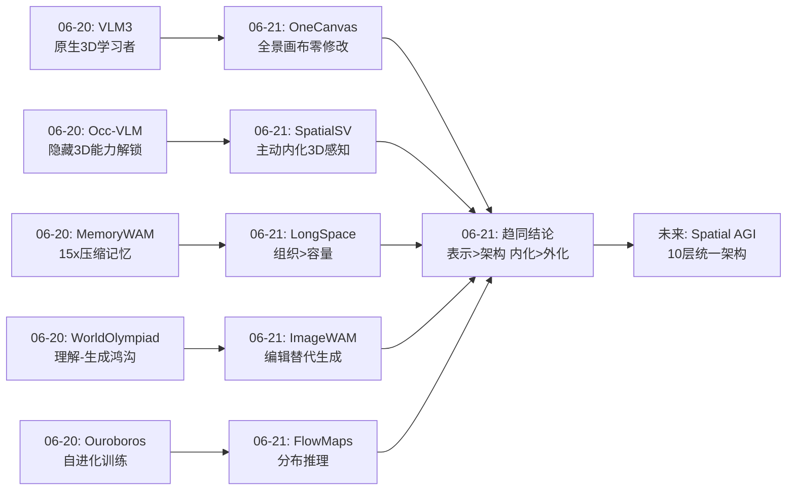
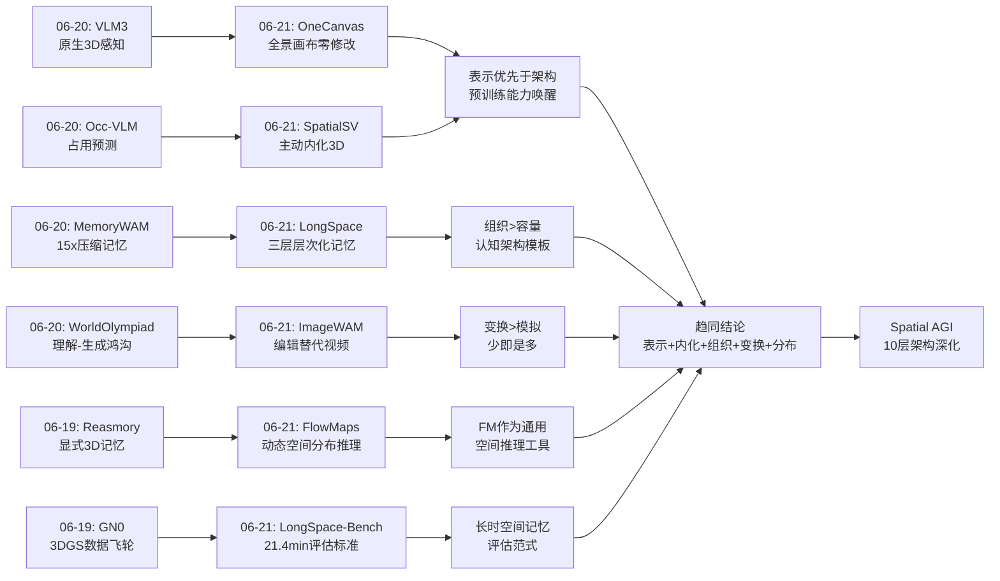
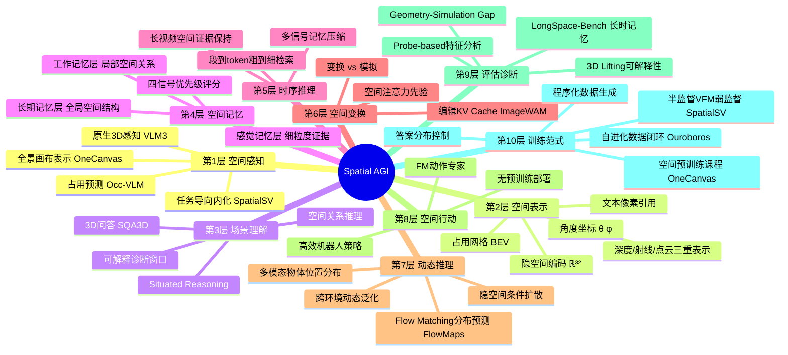
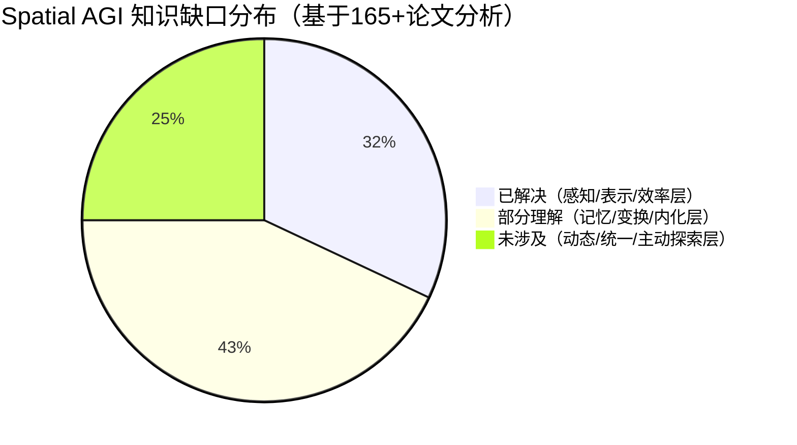

# 每日思考 - 2026-06-21

## 📅 每日总结

**日期**: 2026-06-21
**论文数量**: 5篇
**主题**: 从表示到记忆到内化——Spatial AGI 的"少即是多"哲学在五个维度获得独立验证

**关键突破**: 
- 🚀 **表示优先于架构（OneCanvas）**: 零架构修改、零辅助损失、零专用编码器——仅通过全景特征重投影就让 Qwen3-VL-8B 在 SQA3D/VSI-Bench/SPBench 三项 SOTA，训练量比竞品少一个数量级。这是"Occam's Razor"在 3D VLM 领域的决定性胜利
- 🚀 **图像编辑替代视频生成（ImageWAM）**: 第一个系统性论证"世界动作模型不需要视频生成"的工作。编辑 KV cache 替代视频 token，FLOPs 降至 1/6，延迟降至 1/4，LIBERO-Plus 鲁棒性领先 31.6 个百分点——颠覆了"WAM 需要视频"的隐含假设
- 🚀 **显式空间记忆组织 >> 记忆容量（LongSpace）**: 感觉/工作/长期三层 KV 记忆架构在 21.4 分钟长视频上实现 SOTA。消融实验揭示反直觉结论：改变记忆容量几乎无影响（±0.1分），但改变组织方式带来 +7.4 分提升
- 🚀 **Flow Matching 作为通用空间推理工具（FlowMaps）**: 首次将 FM 从生成任务拓展到空间推断——在连续 3D 空间中建模物体未来位置的多模态分布，实现跨环境泛化的动态空间推理
- 🚀 **内化 > 外化，可解释性是必要条件（SpatialSV）**: 通过任务导向视觉监督让 MLLM 主动生成内部 3D 表示（深度/射线/点云），首次提供"看到 AI 如何理解空间"的可解释窗口，半监督设置下 50% 数据达到接近全监督性能

**架构演进**: 10层（稳固，各层均获得新方法验证）

### 📊 一句话总结
今天的五篇论文从空间表示（OneCanvas 的全景画布）、空间变换（ImageWAM 的编辑 cache）、空间记忆（LongSpace 的层次化 KV）、空间动态（FlowMaps 的流匹配分布推理）和空间内化（SpatialSV 的任务导向监督）五个维度，共同验证了一个核心命题：**Spatial AGI 的关键不在于堆叠更多组件，而在于找到正确的表示、压缩、记忆、推理和内化方式**。

### 🔗 延续性
**昨日(06-20)→今日(06-21)**: 昨天确立了"极简感知 + 智能记忆 + 自进化训练"三大范式，今天从五个新角度独立验证并深化了这一蓝图。OneCanvas 将 VLM3 的"VLM 是原生 3D 学习者"推进到"VLM 是原生 3D 场景理解者"——不需要任何架构修改，只需要正确的输入表示；LongSpace 将 MemoryWAM 的"压缩记忆优于全记忆"推进到"记忆组织 >> 记忆容量"——层次化角色分工比增加存储更有效；SpatialSV 将 Occ-VLM 的"2D 预训练隐藏 3D 能力"推进到"通过主动 3D 任务内化空间感知"——不仅解锁，更是让模型主动生成；FlowMaps 为昨天的"空间感知"增加了时间维度——预测物体未来位置分布；ImageWAM 将昨天的"理解-生成鸿沟"从新的角度回应——或许生成不是必要的，编辑就够了。
**今日→明日**: OneCanvas 的全景画布 + LongSpace 的层次记忆 + FlowMaps 的动态预测三者的融合是一个极具潜力的方向；SpatialSV 的可解释性框架与 OneCanvas 的表示方法结合可能产生更强的空间诊断能力。

### 💡 本质思考：如何达成通用空间智能

#### 1. 核心能力的本质是什么？
经过近两个月、165+ 篇论文的深度分析，Spatial AGI 的核心能力呈现出越来越清晰的结构。今天五篇论文的共同指向让我们可以进一步精炼这一框架：

- **空间表示**（Where is everything）：核心不是"用什么编码器"，而是"用什么坐标系"。OneCanvas 证明全景画布这一统一坐标系比任何专用 3D 编码器都有效。表示的选择决定了他一切上游能力的天花板。
- **空间变换**（How things change）：核心不是"生成完整未来"，而是"捕获关键变换"。ImageWAM 证明编辑 cache 比视频预测更高效——空间动作推理只需"什么变了"而非"未来什么样"。
- **空间记忆**（When and what happened）：核心不是"记住多少"，而是"如何组织"。LongSpace 证明三层角色分工的记忆架构比简单增加容量有效得多。
- **空间推理**（What will happen）：核心不是"确定性预测"，而是"分布推断"。FlowMaps 证明将空间推理建模为隐空间中的 Flow Matching 可以捕获多模态的未来。
- **空间内化**（How to understand without external tools）：核心不是"输入更多 3D 数据"，而是"让模型主动生成 3D 理解"。SpatialSV 证明任务导向监督比特征蒸馏更有效。

这五个维度的共同特征是**"少即是多"**——在每个维度上，更简洁但更本质的方案都超越了更复杂但更表面的方案。

#### 2. 当前方法与理想目标的差距在哪里？
今天的五篇论文虽然各自取得了突破，但集体也暴露了当前 Spatial AGI 研究的深层局限：

- **静态 vs 动态的鸿沟依然存在**：OneCanvas 和 SpatialSV 主要处理静态场景；LongSpace 虽然处理视频但仅限被动观察；FlowMaps 虽然预测动态但依赖仿真器训练。真正的 Spatial AGI 需要在真实动态环境中实时运行。
- **封闭 vs 开放的词汇鸿沟**：FlowMaps 仅支持 41 个物体类别，OneCanvas 主要在 ScanNet 类别上验证。真实世界的长尾物体远远超出这些封闭集。
- **2D 表示 vs 3D 现实的鸿沟**：ImageWAM 在 2D 图像空间操作，缺乏深度信息；OneCanvas 虽然投影到全景画布但仍有畸变；SpatialSV 的点云精度远不及专业 3D 重建。
- **被动观察 vs 主动探索**：所有五篇论文都是 observation-based，没有涉及主动探索和交互学习。人类的空间认知是在交互中发展的。
- **单一环境 vs 跨环境迁移**：FlowMaps 验证了跨环境泛化但仅在仿真中；LongSpace 和 OneCanvas 主要在室内验证。真实世界的环境多样性远未被覆盖。
- **评估完整性**：缺乏端到端的 Spatial AGI 评估——从感知到推理到行动到反馈的完整闭环。

#### 3. 从今天到理想状态，最可能的路径是什么？
基于五篇论文的共同指向，最可能的路径正在从"单点突破"向"系统集成"演进：

**阶段1（已完成）**: 单一能力突破——感知（VLM3/OneCanvas）、记忆（MemoryWAM/LongSpace）、内化（SpatialSV）、动态推理（FlowMaps）各自达到实用水平。
**阶段2（当前）**: 双能力组合——感知+记忆（OneCanvas + LongSpace）、感知+内化（OneCanvas + SpatialSV）、记忆+动态（LongSpace + FlowMaps）。
**阶段3（下一步）**: 多能力融合——将全景画布表示 + 层次化记忆 + 编辑式变换 + 分布推理 + 内化监督整合到统一框架。
**阶段4（远期）**: 统一 Spatial AGI——一个 agent，具备 10 层完整能力，能在真实动态环境中自主感知、记忆、推理和行动。

关键转折点在于**"接口标准化"**——各层能力之间的接口（表示格式、记忆结构、推理协议）需要统一规范，才能真正实现集成。

---

## 🔗 与昨日思考的联系

### 昨日重点（2026-06-20）
昨天聚焦"从感知到生成到记忆——Spatial AGI 的全栈技术栈正在闭合"：
- **VLM3**: VLM 是原生 3D 学习者，仅需焦距统一 + 文本像素引用
- **WorldOlympiad**: Geometry-Simulation Gap 被精确量化（所有模型 < 43%）
- **Occ-VLM**: 2D 预训练的隐藏 3D 能力被解锁（161M Adapter → 占用预测 SOTA）
- **Ouroboros-Spatial**: 自进化数据-模型闭环（25.6k 数据 > 590k）
- **MemoryWAM**: 压缩记忆超越全记忆（15x 压缩，83% 成功率）

### 今日进展
今天从五个全新角度深化了昨天的架构蓝图：

1. **表示层进一步极简化**：昨天 VLM3 说"不需要架构修改，只需输入归一化"，今天 OneCanvas 更进一步说"不需要任何修改，只需改变输入表示方式"——全景画布让预训练 VLM 中沉睡的空间推理能力被直接唤醒。SpatialSV 则从另一个方向说"不需要外部 3D 输入，让模型主动在内部生成 3D 理解"。

2. **记忆架构从认知科学获取灵感**：昨天 MemoryWAM 证明了压缩记忆的有效性（15x），今天 LongSpace 将记忆架构从"压缩策略"推进到"组织架构"——感觉/工作/长期三层角色分工，且证明"组织 >> 容量"。这是空间记忆从工程优化到认知架构的跨越。

3. **空间变换范式的革新**：昨天 WorldOlympiad 量化了"理解-生成鸿沟"（< 43%），今天 ImageWAM 提出了一个出人意料的回应："或许不需要生成"——图像编辑 cache 就足以替代视频生成，且更高效更鲁棒。

4. **时间维度空间推理的突破**：昨天的论文主要关注"当前空间状态"，今天 FlowMaps 将时间维度引入——预测物体未来位置的多模态分布。这为 Spatial AGI 增加了"预知未来"的能力。

5. **可解释性维度的开启**：昨天 Occ-VLM 的占用预测隐含提供了一定的空间可视化，今天 SpatialSV 将可解释性作为核心贡献——3D lifting 结果（深度图、点云）可以直接"看到"模型如何理解空间。这为 Spatial AGI 的诊断和改进提供了前所未有的工具。

### 演进路径



---

## 📚 论文概览

### 1. FlowMaps: Modeling Long-Term Multimodal Object Dynamics with Flow Matching
- **机构**: Sapienza University of Rome + Université de Montréal + Mila
- **核心**: 将家庭环境中物体位置预测建模为隐空间中的 Flow Matching 问题（VAE + CDiT），在连续 3D 空间中输出多模态分布
- **关键数据**: minFDE 0.342m，ObjNav SR@1 比 HOMER 高 23%，跨环境泛化验证 + 真实机器人部署
- **与 Spatial AGI**: 提供了"动态空间推理"能力——预测物体未来位置分布

### 2. OneCanvas: 3D Scene Understanding via Panoramic Reprojection
- **机构**: TUM + Huawei
- **核心**: 将多视角 patch 特征重投影到单一全景画布，零架构修改让 Qwen3-VL 实现 3D 场景理解 SOTA
- **关键数据**: SQA3D 65.3（+2.3），SPBench zero-shot 72.1（+4.8），训练量比竞品少 10x
- **与 Spatial AGI**: 证明"表示优先于架构"——预训练 VLM 的空间推理能力只需正确接口即可唤醒

### 3. ImageWAM: Do World Action Models Really Need Video Generation, or Just Image Editing?
- **机构**: SJTU + Eastern Institute of Technology + Tencent Robotics X + Tsinghua
- **核心**: 用图像编辑模型的 KV cache 替代视频生成的密集 token，通过流匹配动作专家生成机器人动作
- **关键数据**: RoboTwin 2.0 93.38%，LIBERO 98.4%，FLOPs 降至 1/6，延迟降至 1/4，无需策略预训练
- **与 Spatial AGI**: 证明空间动作推理只需"关键变换"而非"完整模拟"——编辑 cache 是高效的空间变换表示

### 4. LongSpace: Exploring Long-Horizon Spatial Memory from Perception to Recall in Video
- **机构**: BUPT + ZGC Academy + CASIA + CUHK + XJTU
- **核心**: 空间结构感知（SSP，解码器侧 3D 几何注入）+ 层次化 KV 记忆（HKM，感觉/工作/长期三层），21.4 分钟长视频空间记忆 SOTA
- **关键数据**: LongSpace-Bench 49.2（第二名 46.5），VSI-Bench 70.8，"组织 >> 容量"（layer-aware 49.2 vs 容量调整 35.9）
- **与 Spatial AGI**: 提供了完整的"感知-记忆-检索"空间认知管道，层次化记忆映射到人类认知架构

### 5. SpatialSV: Internalizing Interpretable 3D Spatial Awareness in MLLMs via Task-Oriented Visual Supervision
- **机构**: Sun Yat-sen University（IJCAI 2026 Accepted）
- **核心**: 通过深度/射线/点云三任务监督让 MLLM 主动生成内部 3D 表示，首次提供可解释的空间理解诊断窗口
- **关键数据**: MindCube +6-13%，VSI-Bench +7-9%，路径规划 +32.6%，8 个模型跨 4 个家族验证，50% 半监督接近全监督
- **与 Spatial AGI**: 证明"内化 > 外化"和"通过做来学"——任务导向监督优于特征蒸馏

---

## 💡 核心见解

### 见解1: 表示优先于架构——Occam's Razor 的全面胜利
**来源**: OneCanvas + SpatialSV

- ✅ OneCanvas 在 SQA3D/VSI-Bench/SPBench 三项 SOTA，**零架构修改、零辅助损失、零专用编码器**——仅改变输入表示（全景画布）
- ✅ SpatialSV 的 probe-based 分析揭示：不同 MLLM 的视觉特征在适当监督下都能产生高质量 3D 表示——架构差异不如监督方式重要
- ✅ OneCanvas 的空间预训练课程通过答案分布控制，从根源解决了 Ma et al. (2026) 审计发现的"3D VLM 没有真正使用几何信息"的问题

**对 Spatial AGI 的启发**:
这是一个深远的哲学指导——**在添加复杂性之前，先穷尽简单方案**。当前 3D VLM 领域的趋势是添加点云编码器、深度编码器、融合模块等专用组件，但 OneCanvas 证明了预训练 VLM 中已经存在"沉睡的"空间推理能力，只需要正确的输入格式就能唤醒。这暗示了一个更深层的问题：**我们是否在用架构复杂度补偿表示设计的不足？** 如果将投入到专用 3D 编码器上的算力转而用于优化输入表示和训练数据，可能获得更高的投入产出比。

SpatialSV 从另一个方向补充了这一见解：**监督方式比模型架构更重要**。同样的模型在不同监督范式（文本 vs 特征蒸馏 vs 任务导向）下表现出巨大差异——这意味着改进训练信号的效率可能远超改进模型架构的效率。

### 见解2: 空间记忆的核心是组织而非容量
**来源**: LongSpace + FlowMaps

- ✅ LongSpace 消融实验：layer-aware 设计 49.2 vs layer-agnostic 41.8（+7.4），改变记忆容量 ±0.1 分（几乎无影响），去除长期记忆角色 -14.4 分
- ✅ LongSpace 的四信号优先级评分（显著性/状态变化/覆盖/时近性）使不同记忆层各司其职
- ✅ FlowMaps 的 Map Encoder 单次计算后可跨所有查询物体复用——这本质上是一种"记忆组织"策略
- ✅ FlowMaps 的非对称 cross-attention（查询 vs 场景）也是一种组织原则——推理者和环境角色分离

**对 Spatial AGI 的启发**:
空间智能的瓶颈不在存储容量，而在信息组织方式。这与人类空间认知高度一致——人脑的空间记忆不是靠海马体存储更多数据，而是通过 place cells、grid cells 等结构化机制组织空间信息。LongSpace 的感觉/工作/长期三层结构直接映射了人类的记忆系统，而 FlowMaps 的"场景编码一次，多查询复用"策略映射了人类的环境认知与目标搜索的分离机制。

这对 Spatial AGI 的架构设计有根本性指导意义：**未来系统的记忆架构应该投入更多研究在"如何组织和检索空间信息"上，而非"如何存储更多信息"上**。LongSpace 的四信号优先级评分系统提供了一个可推广的模板——不同层次的空间记忆应该关注不同类型的证据。

### 见解3: "少即是多"在空间变换中得到验证
**来源**: ImageWAM + OneCanvas

- ✅ ImageWAM 用单帧编辑 cache 替代多帧视频预测，不仅没损失性能，反而在多个指标上超越视频 WAM（LIBERO-Plus 83.1% vs 51.5%）
- ✅ ImageWAM 的编辑骨干自然地将注意力聚焦于任务相关区域（被操作物体、目标容器、接触区域），这不是通过显式注意力损失训练的
- ✅ OneCanvas 的全景画布是一个"统一但紧凑"的表示——一个画布承载全场景信息，比多视角输入更高效
- ✅ OneCanvas 连续位置而非离散网格——避免光栅化信息丢失，让 VLM 注意力自行决定融合策略

**对 Spatial AGI 的启发**:
对于空间动作推理，**完整的未来模拟不一定是必要的**。ImageWAM 的成功告诉我们，关键信号是"什么需要改变"而非"未来会长什么样"。这与人类的空间认知高度一致——人在抓取杯子时，大脑不会模拟完整的未来视频序列，而是关注杯子的位置、手的位置和两者的空间关系。

这对 Spatial AGI 的世界模型设计有重要启示：与其追求更逼真的未来视频生成，不如找到更紧凑的"变换表示"。ImageWAM 的编辑 KV cache 就是一种这样的表示——它编码了从当前状态到目标状态的视觉变换信号，而非完整的时间轨迹。**这可能也是弥合"理解-生成鸿沟"的一条捷径**——不需要完整生成，只需要找到关键的变换信号。

### 见解4: 内化优于外化——通过做来学的空间认知
**来源**: SpatialSV + FlowMaps

- ✅ SpatialSV 证明任务导向监督（主动做 3D 任务）比特征蒸馏（被动模仿特征）更有效（深度图监督 59.4% vs 特征蒸馏 57.4%）
- ✅ SpatialSV 的 3D lifting 结果（深度图、点云）作为可解释窗口，首次让我们"看到"模型如何理解空间
- ✅ FlowMaps 将空间推理建模为主动的分布推断——不是被动接收外部 3D 数据，而是主动从场景数据中推断物体未来位置
- ✅ SpatialSV 半监督设置：50% 无标注样本 + 空间监督 → 接近全监督性能，证明空间任务监督的信号效率

**对 Spatial AGI 的启发**:
真正的 Spatial AGI 应该像人类一样，能够在没有外部 3D 传感器的情况下，仅凭视觉输入就在内部构建 3D 空间认知。这与儿童的空间认知发展类似——通过观察和交互逐渐发展出内在的 3D 感知。SpatialSV 的"通过做来学"原则（让模型主动执行 3D 任务来学习空间表示）比传统的"被动输入 3D 数据"更符合人类认知发展规律。

更重要的是，SpatialSV 提供了前所未有的**可解释性**。如果我们想要信任 AI 系统的空间决策（如机器人操作、自动驾驶），就必须理解其内部的空间表示质量。SpatialSV 的深度图和点云可以作为"空间理解质量的 X 光片"——直接揭示模型在哪些场景下空间理解存在缺陷。

### 见解5: 分布推理优于确定性预测——空间未来的多模态性
**来源**: FlowMaps + ImageWAM

- ✅ FlowMaps 通过 Flow Matching 建模物体未来位置的多模态分布（DBSCAN 聚类 → 排序的候选位置列表），而非单一确定性预测
- ✅ ImageWAM 的流匹配动作专家也是分布式的——从高斯噪声到动作分布的传输
- ✅ FlowMaps 在高动态习惯（Habit#3）上的优势最明显（SR@1 50.98 vs HOMER 38.03），说明分布建模在高度不确定场景中优势更大
- ✅ OneCanvas 的 SPBench zero-shot 72.1 也暗示——当模型理解了空间关系的"分布"而非"确定性答案"时，泛化能力更强

**对 Spatial AGI 的启发**:
空间推理的输出应该是分布而非点估计。真实世界中的空间状态本质上是多模态的——同一个物体可能有多个合理的未来位置。确定性预测无法表达这种不确定性，而分布推理可以。这对下游决策至关重要——可以按概率排序搜索策略，而非盲目地寻找唯一预测位置。

Flow Matching 作为一种新的分布建模工具，在空间推理中展现了独特优势：它不像 GAN 那样需要对抗训练，不像 VAE 那样受后验崩塌困扰，也不像传统扩散模型那样需要大量去噪步骤。**FM 在隐空间中的高效传输使其成为 Spatial AGI 中"空间分布推理"的理想工具**。

### 见解6: 预训练知识 + 正确接口 = 空间智能的快捷通道
**来源**: OneCanvas + ImageWAM + SpatialSV

- ✅ OneCanvas 唤醒了 Qwen3-VL 中沉睡的空间推理能力——全景画布作为"正确接口"
- ✅ ImageWAM 利用了图像编辑模型的预训练知识——编辑 KV cache 作为"正确接口"提取空间变换信号
- ✅ SpatialSV 从 MLLM 自身的 LLM 层提取视觉特征——多层特征组合（浅+深）作为"正确接口"
- ✅ FlowMaps 的 VAE 将物理空间映射到紧凑隐空间——32 维隐编码作为"正确接口"
- ✅ LongSpace 的 π³ 几何编码器 + Qwen3-VL——3D token 作为"正确接口"注入解码器

**对 Spatial AGI 的启发**:
五个独立的工作从不同角度证明了一个共同结论：**大规模预训练的模型中已经蕴含了丰富的空间知识**。问题不在于"如何让模型学会空间推理"，而在于"如何唤醒已有的空间推理能力"。每个工作找到了不同的"接口"——全景画布、编辑 cache、任务监督、隐空间编码、几何 token——但本质都是**将预训练知识与特定空间任务对齐**。

这意味着通往 Spatial AGI 的快捷通道可能不是"从头训练 3D-native 模型"（成本极高），而是"找到预训练知识到空间任务的正确映射"。每个空间能力（感知、记忆、推理、行动）可能需要不同的"接口"，但核心原则是通用的。

### 见解7: 效率和可部署性正在成为核心竞争力
**来源**: ImageWAM + OneCanvas + SpatialSV

- ✅ ImageWAM: FLOPs 从 63.65 降至 9.72（-84.7%），延迟从 1081ms 降至 263ms（4.1x 加速），无需策略预训练
- ✅ OneCanvas: 训练量比最强竞品少一个数量级，仅用 LoRA r=256/r=64 即可达到 SOTA
- ✅ SpatialSV: 推理时 3D 模块可选（不增加推理复杂度），50% 半监督接近全监督性能
- ✅ FlowMaps: Map Encoder 单次计算可跨所有查询复用，20 步 Euler 积分器
- ✅ LongSpace: HKM 压缩策略使小时级视频的空间记忆在有限上下文内可行

**对 Spatial AGI 的启发**:
效率不再是一个工程优化问题，而是一个核心研究问题。ImageWAM 和 OneCanvas 证明了**更简洁的方法不仅更高效，而且更有效**——这是反直觉但一致的信号。Spatial AGI 如果要在真实环境中实时部署，效率是硬约束。

---

## 🗺️ 知识演进图



---

## 技术栈演进对比表

| 层次 | 昨日方案(06-20) | 今日方案(06-21) | 变化 |
|------|---------|---------|------|
| **L1 空间感知** | VLM3(焦距统一+文本像素) + Occ-VLM(Occ Adapter) | OneCanvas(全景画布) + SpatialSV(任务监督) | 表示层进一步极简化：零修改→零修改+主动内化 |
| **L2 空间表示** | 占用网格 + 文本坐标 + BEV | 全景画布(θ,φ) + 隐空间(ℝ³²) + 深度/射线/点云 | 多表示融合趋势：角度坐标+隐编码+显式3D |
| **L3 场景理解** | Occ-VLM(场景级VQA) | OneCanvas(situated reasoning) + SpatialSV(可解释诊断) | 新增可解释性维度 |
| **L4 空间记忆** | MemoryWAM(短期+锚点+要点) | LongSpace(感觉+工作+长期三层HKM) | 从压缩策略→认知架构；组织>容量 |
| **L5 时序推理** | Ouroboros(置信度课程) | FlowMaps(FM分布预测) + LongSpace(段到token检索) | 分布推理+粗到细检索 |
| **L6 空间生成** | WorldOlympiad(GS评估) | ImageWAM(编辑cache替代视频) | 范式革新：生成→编辑 |
| **L7 动态推理** | (缺失) | FlowMaps(FM物体位置分布) | 新能力：多模态未来预测 |
| **L8 空间行动** | MemoryWAM(ActionDiT) | ImageWAM(FM动作专家+编辑cache) | 效率大幅提升：1/6 FLOPs |
| **L9 评估诊断** | WorldOlympiad(三赛道) + VSI-debiased | LongSpace-Bench(21.4min×10任务) + SpatialSV(probe-based) | 长时记忆评估+可解释诊断 |
| **L10 训练范式** | Ouroboros(自进化闭环) | OneCanvas(空间预训练课程+答案分布控制) + SpatialSV(半监督+VFM监督) | 程序化数据生成+VFM弱监督 |

---

## 🗺️ Spatial AGI 知识图谱

### 10层架构思维导图



### 🎯 主线技术路径

#### 阶段1: 空间表示标准化（快速推进中 60%）
- **核心问题**: 什么是 Spatial AGI 的"通用语言"？
- **当前最佳方案**: OneCanvas 的全景画布（角度坐标+3D位置嵌入）
  - 零架构修改，VLM 原生处理
  - 连续坐标保留所有信息
  - 支持任意视角的 situated reasoning
- **竞争方案**: 隐空间编码（FlowMaps ℝ³²）、占用网格（Occ-VLM）、文本像素引用（VLM3）、深度/射线/点云（SpatialSV）
- **关键突破**: OneCanvas 和 SpatialSV 共同证明表示方式比架构更重要
- **剩余挑战**: 不同表示之间的转换和融合；室外大尺度场景的适用性；动态场景的时序表示
- **预计成熟**: 2026 年底

#### 阶段2: 空间记忆架构化（快速推进中 55%）
- **核心问题**: 如何在有限资源下保持长时间空间信息？
- **当前最佳方案**: LongSpace 的三层 HKM（感觉/工作/长期）
  - 组织 >> 容量（layer-aware 49.2 vs 容量调整 35.9）
  - 四信号优先级评分
  - 段到token粗到细检索
- **竞争方案**: MemoryWAM 混合记忆（短期+锚点+要点）、Reasmory 显式 3D 记忆（点云+DSL）
- **关键突破**: "组织 > 容量"的反直觉结论；认知科学启发的三层架构
- **剩余挑战**: 主动遗忘机制；跨场景记忆迁移；从被动观察到主动探索
- **预计成熟**: 2027 年初

#### 阶段3: 空间变换高效化（突破性进展 50%）
- **核心问题**: 如何高效地从"当前状态"推导"目标状态"？
- **当前最佳方案**: ImageWAM 的编辑 cache + FM 动作专家
  - 编辑 cache 替代视频 token（FLOPs 降至 1/6）
  - 单帧端点预测替代完整轨迹
  - 注意力自动聚焦于任务相关区域
- **竞争方案**: 视频生成 WAM（FastWAM/LingBot-VA）、VLM3 式逐像素查询
- **关键突破**: "变换 > 模拟"——空间动作推理不需要完整未来模拟
- **剩余挑战**: 2D→3D 的深度信息缺失；单帧→多阶段任务的扩展；编辑模型的偏见继承
- **预计成熟**: 2027 年中

#### 阶段4: 空间智能内化（稳步推进中 40%）
- **核心问题**: 如何让模型在内部构建 3D 空间认知？
- **当前最佳方案**: SpatialSV 的任务导向视觉监督
  - 深度/射线/点云三任务联合监督
  - 3D lifting 结果作为可解释性窗口
  - 半监督设置（50% 无标注接近全监督）
  - 8 个模型跨 4 家族的强泛化
- **关键突破**: 任务导向约束 >> 特征蒸馏；可解释性作为核心而非附属功能
- **剩余挑战**: 3D VFM 的误差传播；室外场景扩展；精度不足以支撑精细操作
- **预计成熟**: 2027 年中

#### 阶段5: 统一 Spatial AGI 集成（展望中 10%）
- **核心问题**: 如何将 10 层能力整合为统一的 Spatial AGI 系统？
- **愿景**: 一个 agent——全景画布感知 + 三层记忆 + 编辑式变换 + 分布推理 + 内化监督
- **关键挑战**: 各层之间的接口标准化；跨领域任务迁移；实时部署效率；安全性保证
- **预计成熟**: 2028+

---

## 🔍 待探索议题

### 高优先级（本周）

1. **全景画布 × 层次化记忆的融合**
   - 问题: OneCanvas 的全景画布表示 + LongSpace 的三层 HKM 记忆能否组合？画布作为"视觉接口"，HKM 作为"记忆后端"？
   - 候选方案: 画布 patch 作为感觉记忆输入 → HKM 的工作/长期记忆压缩和检索
   - 缺口: 两者基于不同的基础模型（Qwen3-VL-8B），但训练数据和技术栈不同；接口对齐需要研究

2. **编辑 cache 作为空间记忆的存储单元**
   - 问题: ImageWAM 的编辑 KV cache 能否作为空间记忆的压缩表示？每个关键帧的编辑 cache → 层次化存储？
   - 候选方案: 将 ImageWAM 的编辑 cache 扩展到多帧——cache 序列作为"空间变换历史"
   - 缺口: 当前 ImageWAM 仅使用单帧编辑 cache；多帧 cache 的融合策略未被研究

3. **FM 分布推理 × 空间记忆的协同**
   - 问题: FlowMaps 的 Flow Matching 能否用于 LongSpace 的记忆压缩？将压缩建模为"从全量信息到压缩表示的流"？
   - 候选方案: FM 作为 HKM 的 Compress 策略替代品——从"分组池化"到"流式传输"
   - 缺口: FM 用于记忆压缩的可行性未知；训练数据需求可能过高

4. **SpatialSV 可解释性 × OneCanvas 画布的交叉验证**
   - 问题: SpatialSV 的 3D lifting 结果和 OneCanvas 的全景画布是否捕获了相同的几何信息？能否交叉验证两者的空间理解质量？
   - 候选方案: 在同一场景上运行两者，比较 SpatialSV 的深度图和 OneCanvas 的画布重投影的一致性
   - 缺口: 两者基于不同模型（SpatialSV 在 Qwen2.5-VL，OneCanvas 在 Qwen3-VL）；需要统一评测框架

5. **"变换 > 模拟"原则的边界探索**
   - 问题: ImageWAM 证明编辑 cache 替代视频生成在操作任务上有效。但这个原则的边界在哪里？导航任务是否也适用？长时序规划呢？
   - 候选方案: 将 ImageWAM 范式扩展到导航——用"目标位置编辑"替代"导航视频生成"
   - 缺口: ImageWAM 目前仅验证桌面操作；导航和长时序任务的验证缺失

### 中优先级（本月）

6. **空间预训练课程的自动化生成**
   - 问题: OneCanvas 的 6 大家族课程任务是手工设计的。能否自动化生成空间推理训练任务？
   - 候选方案: 结合 Ouroboros 的自进化框架——让模型自动发现空间推理弱点并生成针对性课程
   - 缺口: 课程生成的质量评估标准缺失；自动化可能产生退化数据

7. **FlowMaps 的开放词汇扩展**
   - 问题: FlowMaps 仅支持 41 个物体类别和 17 个容器类别。如何扩展到开放词汇？
   - 候选方案: 结合 CLIP/SEEM 等开放词汇检测器，将物体标签替换为语义嵌入
   - 缺口: 开放词汇的语义兼容性约束更难建模；数据生成依赖仿真器的物体多样性

8. **LongSpace 的主动探索扩展**
   - 问题: LongSpace 处理的是被动观察的视频。如何扩展到主动探索（如机器人导航中的"走过去看看"）？
   - 候选方案: 将 HKM 的记忆机制嵌入具身 AI 框架——机器人决定"看哪里"和"记住什么"
   - 缺口: 主动探索引入了"行动-观察"循环，记忆更新策略需要重新设计

9. **SpatialSV 的时序扩展**
   - 问题: SpatialSV 目前在静态多视角图像上工作。能否扩展到视频——从每帧的 2D 特征生成时序一致的 3D 表示？
   - 候选方案: 将 DPT 模块扩展为时序 DPT（3D Conv 替代 2D Conv），加入时序一致性损失
   - 缺口: 视频的 3D 监督信号更难获取；时序一致性约束的设计需要研究

### 低优先级（探索性）

10. **认知科学对空间记忆"主动遗忘"的启发**
    - 问题: LongSpace 的 HKM 缺少主动遗忘机制。人类为什么会主动遗忘空间信息？这对 AI 记忆设计有什么启发？
    - 候选方案: 基于任务相关性的遗忘——当新信息与当前任务无关时，旧记忆的"遗忘权重"增加
    - 缺口: 遗忘的时机和程度很难确定；过度遗忘会导致关键信息丢失

11. **空间智能的"Scaling Law"**
    - 问题: 空间智能是否存在类似 LLM 的 Scaling Law？模型规模、数据量、表示维度与空间推理能力之间的关系是什么？
    - 候选方案: 系统性研究不同规模模型在空间任务上的表现曲线，找到"涌现点"
    - 缺口: 当前缺乏控制变量的系统性研究；空间任务的多样性使 Scaling Law 难以定义

12. **从编辑到规划——多步空间推理的层级结构**
    - 问题: ImageWAM 的单帧编辑适合单步变换。多步空间规划（如"先开柜门→拿出碗→关上柜门→放到桌上"）如何用编辑范式建模？
    - 候选方案: 关键帧序列编辑——每步编辑一个"子目标帧"，级联实现多步规划
    - 缺口: 多步编辑的误差累积问题；子目标的自动分解

13. **空间智能的"Unified Theory"——五种能力的数学形式化**
    - 问题: 表示、变换、记忆、推理、内化——这五种能力能否用统一的数学框架描述？
    - 候选方案: 将五种能力统一为"空间信息的变换问题"——表示是"恒等变换"，记忆是"压缩变换"，推理是"推断变换"等
    - 缺口: 这是一个高度理论化的问题；但成功的话将指导 Spatial AGI 的统一架构设计

---

## 📊 知识缺口分析



**已解决（32%）**:
- ✅ VLM 的原生 3D 感知能力——无需专用架构，正确表示即可（VLM3, OneCanvas）
- ✅ 空间表示的多种方案——全景画布、占用网格、隐空间、深度/射线/点云（OneCanvas, Occ-VLM, FlowMaps, SpatialSV）
- ✅ 基础空间记忆架构——混合压缩、层次化角色（MemoryWAM, LongSpace）
- ✅ 空间变换的高效方案——编辑 cache 替代视频生成（ImageWAM）
- ✅ 空间内化的有效路径——任务导向监督 > 特征蒸馏（SpatialSV）
- ✅ 空间感知评估基准——VSI-Bench, SQA3D, SPBench
- ✅ 长时空间记忆评估——LongSpace-Bench（21.4min × 10任务）
- ✅ 机器人操作策略——高效 WAM（ImageWAM, MemoryWAM）
- ✅ 可解释性诊断框架——probe-based 分析 + 3D lifting（SpatialSV）

**部分理解（43%）**:
- ⚠️ 空间记忆的主动遗忘和跨场景迁移——LongSpace 有压缩但无遗忘；跨场景未验证
- ⚠️ 动态空间推理——FlowMaps 在仿真中验证，真实动态环境未测试
- ⚠️ 多步空间变换——ImageWAM 单帧编辑有效，多步规划未验证
- ⚠️ 理解-生成关系的深层理解——ImageWAM 说"不需要生成"，但边界在哪？
- ⚠️ 自进化训练与空间内化的结合——Ouroboros 的自进化 + SpatialSV 的任务监督？
- ⚠️ Sim-to-Real 迁移——FlowMaps 和 ImageWAM 有真实验证但场景有限
- ⚠️ 开放词汇空间理解——大多数方法限于封闭类别集
- ⚠️ 室外大尺度场景——几乎所有方法仅室内验证
- ⚠️ 记忆架构的泛化——LongSpace 的 HKM 是否能用于操作任务？

**未涉及（25%）**:
- ❌ 统一 Spatial AGI 架构——跨操作 + 导航 + 推理 + 生成的共享框架
- ❌ 主动探索中的空间认知建立——从交互中学习空间
- ❌ 空间因果推理——"为什么物体在这里"而非仅"物体在哪里"
- ❌ 空间智能的 Scaling Law——模型/数据/维度与能力的定量关系
- ❌ Spatial AGI 安全性框架——不确定性约束、人在回路
- ❌ 多模态空间认知——视觉 + 语言 + 触觉 + 声音的融合
- ❌ 空间知识的迁移学习——从一个环境/任务迁移到另一个

---

## 📐 深层分析：五大范式趋同——Spatial AGI 的"统一场论"初现

### 五种"少即是多"的趋同信号

今天的五篇论文从五个不同维度独立验证了"少即是多"的原则：

| 维度 | "多"的方案 | "少"的方案 | 结果 |
|------|-----------|-----------|------|
| **架构** | 添加专用 3D 编码器/融合模块 | 零修改 + 全景画布（OneCanvas） | "少"胜出（+2.3~4.8 分） |
| **记忆** | 全量 KV cache 保留 | 三层角色分工 + 压缩（LongSpace） | "少"胜出（+13.1 分 + 组织>>容量） |
| **生成** | 完整多帧视频预测 | 单帧编辑 cache（ImageWAM） | "少"胜出（FLOPs 1/6 + 性能更优） |
| **监督** | 特征蒸馏 + 大量标注 | 任务导向 + 50% 半监督（SpatialSV） | "少"胜出（+7.0 分 + 数据效率） |
| **推理** | 确定性单点预测 | FM 分布推理（FlowMaps） | "少"更鲁棒（高动态场景优势明显） |

### 趋同背后的深层原理

这五个独立验证的趋同信号指向一个共同的深层原理：

> **Spatial AGI 的核心不是"更多信息处理"，而是"更有效的信息利用"**。

具体来说：
1. **OneCanvas**: 不是给 VLM 更多 3D 信息，而是用更好的格式呈现已有信息
2. **LongSpace**: 不是存储更多记忆，而是用更好的结构组织已有记忆
3. **ImageWAM**: 不是生成更多未来帧，而是提取最核心的变换信号
4. **SpatialSV**: 不是输入更多 3D 数据，而是让模型主动生成内部 3D 理解
5. **FlowMaps**: 不是做更精确的确定性预测，而是建模分布的不确定性

这五个维度的共同本质是：**减少冗余、聚焦核心、利用预训练知识的潜在能力**。

### 从趋同到统一：Spatial AGI 的可能"统一架构"

基于五篇论文的趋同信号，我们可以初步勾勒一个统一的 Spatial AGI 架构：

```
输入层: 多视角 RGB(+D) 
    ↓
表示层: 全景画布 (OneCanvas 范式)
    ↓ [预训练 VLM 的空间能力被唤醒]
记忆层: 三层 HKM (LongSpace 范式)
    ↓ [感觉→工作→长期，四信号评分]
变换层: 编辑 Cache (ImageWAM 范式)
    ↓ [提取任务相关的空间变换信号]
推理层: Flow Matching (FlowMaps 范式)
    ↓ [隐空间分布推理，多模态预测]
内化层: 任务导向监督 (SpatialSV 范式)
    ↓ [主动 3D 生成，可解释诊断]
输出层: 动作 / 回答 / 3D 表示
```

这只是一个初步设想，但五篇论文的趋同信号使这一架构蓝图比以往任何时候都更加清晰和可信。

---

## 🔬 论文间的深层联系

### 联系1: OneCanvas × SpatialSV — 两种"唤醒"预训练空间能力的方式

OneCanvas 和 SpatialSV 从不同角度证明了同一个核心结论：**预训练模型中蕴含丰富的空间知识，关键在于如何唤醒**。

| 维度 | OneCanvas | SpatialSV |
|------|-----------|-----------|
| **唤醒方式** | 改变输入表示（全景画布） | 添加任务监督（3D lifting） |
| **作用层面** | 推理时（输入格式变换） | 训练时（损失函数设计） |
| **可解释性** | 通过画布可视化 | 通过 3D 重建可视化 |
| **保留预训练** | 完全保留（仅 LoRA） | 部分保留（更新 LLM + 投影器） |
| **3D 信息来源** | 显式（深度+位姿→画布坐标） | 隐式（从 2D 特征恢复 3D） |

**深层互补性**: OneCanvas 的全景画布提供了"外部 3D→VLM"的通道，SpatialSV 的任务监督提供了"VLM 内部→3D"的通道。两者形成闭环——外部输入 3D 信息帮模型"看到"空间，内部生成 3D 表示帮模型"理解"空间。结合两者可能产生更强的空间感知能力。

### 联系2: LongSpace × FlowMaps — 记忆 × 预测的空间认知闭环

LongSpace 和 FlowMaps 分别覆盖了空间认知的"过去"和"未来"：

| 维度 | LongSpace | FlowMaps |
|------|-----------|----------|
| **时间方向** | 过去→现在（记忆检索） | 现在→未来（分布预测） |
| **信息组织** | 三层角色分工（感觉/工作/长期） | 非对称 cross-attention（查询 vs 场景） |
| **核心发现** | 组织 >> 容量 | 分布推理 >> 确定性预测 |
| **空间推理类型** | 回忆（"之前在哪里看到过X？"） | 预测（"X 未来会在哪里？"） |

**协同潜力**: LongSpace 的长期记忆为 FlowMaps 的预测提供历史上下文——"基于过去 21 分钟的观察，物体 X 未来 1 小时最可能在哪里？" FlowMaps 的预测能力为 LongSpace 的记忆检索提供前瞻性——"如果预测物体即将被移动，优先检索相关记忆。"

### 联系3: ImageWAM × FlowMaps — 编辑 × 流匹配的双重范式革新

ImageWAM 和 FlowMaps 都使用了 Flow Matching，但在完全不同的场景中：

| 维度 | ImageWAM | FlowMaps |
|------|----------|----------|
| **FM 应用域** | 动作空间（噪声→动作序列） | 位置空间（高斯→物体位置分布） |
| **条件信息** | 编辑 KV cache（视觉变换信号） | 场景编码（Map Encoder 输出） |
| **FM 的角色** | 动作生成器（替代回归） | 位置推断器（替代分类） |
| **输出维度** | 机器人动作块（7-DoF × H步） | 3D bounding box（中心+尺寸+类别） |

**共同启示**: FM 是一种通用的分布建模工具，可以用于任何"从一个分布到另一个分布"的推理任务。在 Spatial AGI 中，很多问题都可以抽象为分布推断——物体在哪里、动作是什么、路径怎么走、场景如何布局。FM 可能成为 Spatial AGI 的"通用推理引擎"。

### 联系4: OneCanvas × LongSpace — 统一画布 × 层次记忆的完美组合

OneCanvas 的全景画布解决了"如何输入 3D 场景"的问题，LongSpace 的 HKM 解决了"如何保持长时空间信息"的问题。两者组合形成完整的"感知→记忆"管道：

```
多视角 RGB-D 
    → OneCanvas 全景画布（空间感知）
    → SSP 增强（3D 几何注入）
    → LongSpace HKM（层次化记忆）
    → 问题导向检索
    → 空间推理输出
```

这个组合的优势在于：
- OneCanvas 提供了统一的空间表示，HKM 只需处理一种格式
- SSP 的 3D 几何注入可以增强画布 patch 的空间信息
- HKM 的层次化压缩可以处理长时间序列的画布序列

### 联系5: SpatialSV × ImageWAM — 内化 × 变换的诊断闭环

SpatialSV 的 3D lifting 提供了"看到模型如何理解空间"的窗口，ImageWAM 的编辑 cache 提供了"提取空间变换信号"的机制。两者可以形成诊断闭环：

```
SpatialSV 3D lifting（诊断空间理解质量）
    ↓ 识别弱点（哪些场景/物体的 3D 理解差）
    ↓ 针对性改进（增加相关训练数据/调整损失）
ImageWAM 编辑 cache（验证改进效果）
    ↓ 检查编辑注意力是否更聚焦于正确区域
    ↓ 迭代优化
```

---

## 📝 总结

### 今日最重要的三个发现

1. **表示优先于架构（OneCanvas + SpatialSV）**: OneCanvas 用零架构修改实现 SOTA，SpatialSV 证明监督方式比模型架构更重要。两者共同指向一个核心原则：**在 Spatial AGI 中，正确的表示和正确的训练信号比更复杂的架构更关键**。预训练 VLM 中已经存在"沉睡的"空间推理能力，问题在于如何唤醒。

2. **空间记忆的核心是组织而非容量（LongSpace）**: "组织 >> 容量"的发现颠覆了"更多记忆=更好性能"的直觉。感觉/工作/长期三层角色分工的记忆架构映射了人类认知系统，为 Spatial AGI 的记忆设计提供了认知科学基础。

3. **"变换 > 模拟"和"内化 > 外化"两大原则的确立（ImageWAM + FlowMaps + SpatialSV）**: ImageWAM 证明空间动作推理只需"关键变换"而非"完整模拟"；FlowMaps 证明动态空间推理应该是分布而非确定性预测；SpatialSV 证明空间内化（主动生成 3D 理解）优于外化（被动输入 3D 数据）。三者共同指向 Spatial AGI 的"少即是多"哲学。

### 明日方向建议

1. **全景画布 × 层次记忆的融合实验**: 将 OneCanvas 的画布表示输入 LongSpace 的 HKM 记忆系统
2. **编辑 cache 的多帧扩展**: 从单帧编辑到关键帧序列编辑，支持多步空间规划
3. **FM 作为空间通用推理引擎**: 将 FlowMaps 的 FM 推理扩展到更多空间任务（路径规划、布局设计等）
4. **SpatialSV 可解释性 × 其他方法的交叉诊断**: 用 SpatialSV 的 3D lifting 诊断 OneCanvas/LongSpace 的空间理解质量
5. **主动探索范式的探索**: 从被动观察扩展到主动探索——在交互中建立空间认知

---

## 📐 论文间的技术细节对比

### 表示方法对比

| 论文 | 表示维度 | 空间坐标系 | 分辨率 | 时序支持 | 可解释性 |
|------|---------|-----------|--------|---------|---------|
| FlowMaps | 3D bbox (ℝ⁶) + 语义标签 | 连续3D世界坐标 | 厘米级 | ✅ 时间戳条件 | ❌ 隐空间 |
| OneCanvas | 2D角度(θ,φ) + 3D位置嵌入(136D) | 球面坐标+度量补充 | patch级 | ✅ 帧索引 | ✅ 画布可视化 |
| ImageWAM | 2D编辑特征 (KV cache) | 图像像素坐标 | patch级 | ❌ 单帧 | ✅ 注意力图 |
| LongSpace | 2D视觉token + 3D几何token | 解码器隐空间 | patch级 | ✅ 段序列 | ⚠️ 部分 |
| SpatialSV | 深度图+射线图+点云 | 显式3D度量坐标 | 像素级 | ❌ 多视角 | ✅ 3D重建 |

### 训练策略对比

| 论文 | 基础模型 | 训练方式 | 数据规模 | GPU资源 | 关键损失 |
|------|---------|---------|---------|---------|---------|
| FlowMaps | VAE(自建)+CDiT | 两阶段(VAE→FM) | 180万/习惯 | 未明确 | CIoU+L1+CE+KL+CFM |
| OneCanvas | Qwen3-VL-8B | 两阶段LoRA(r=256→64) | 程序化生成 | 8×A6000 | VQA CE + 课程任务 |
| ImageWAM | FLUX.2/OmniGen2 | 联合训练(冻结VLM) | LIBERO+RoboTwin | 未明确 | L_act(FM)+L_img(FlowMatch) |
| LongSpace | Qwen3-VL-8B+π³ | 端到端联合训练 | VSI-590K+SPAR-7M | 8×A100 80G | L_text+SSP+HKM |
| SpatialSV | 4个MLLM家族 | 多任务监督(冻结骨干) | MindCube 10K | 8×H800 | L_text+L_distill+L_3D(dep+ray+poi) |

### 基准性能交叉对比

| 基准 | OneCanvas | LongSpace | SpatialSV(7B) | 昨日最佳 |
|------|-----------|-----------|-------------|---------|
| SQA3D EM@1 | **65.3** | — | — | 63.0(HiSpatial) |
| VSI-Bench avg | 70.1 | **70.8** | 35.4(Qwen2.5-7B) | 69.0(SpaceMind) |
| SPBench(zero) | **72.1** | — | 47.8(Qwen2.5-7B) | 67.3(HiSpatial) |
| LongSpace-Bench | — | **49.2** | — | —(新基准) |
| MindCube-Tiny | — | — | **62.8**(Qwen2.5-7B) | — |
| RoboTwin 2.0 | — | — | — | 93.38%(ImageWAM) |
| LIBERO-Plus | — | — | — | **85.2%**(ImageWAM FLUX.2 9B) |

### 核心创新维度对比

| 论文 | 创新类型 | 核心贡献 | 影响范围 | 可推广性 |
|------|---------|---------|---------|---------|
| FlowMaps | 范式创新 | FM用于空间推断(非生成) | 动态环境物体搜索 | ⭐⭐⭐⭐ 可推广到其他空间推理 |
| OneCanvas | 哲学创新 | 表示>架构，零修改SOTA | 3D场景理解全域 | ⭐⭐⭐⭐⭐ 普适原则 |
| ImageWAM | 范式创新 | 编辑替代视频生成 | 机器人策略学习 | ⭐⭐⭐⭐ 可推广到其他WAM |
| LongSpace | 架构创新 | 认知科学启发三层记忆 | 长视频空间推理 | ⭐⭐⭐⭐ 可推广到其他记忆场景 |
| SpatialSV | 方法论创新 | 任务监督+可解释性 | MLLM空间内化 | ⭐⭐⭐⭐⭐ 8个模型验证 |

---

## 📐 Flow Matching 在 Spatial AGI 中的角色

今天的两篇论文（FlowMaps 和 ImageWAM）都使用了 Flow Matching，但在完全不同的场景中。这让我们可以更清晰地看到 FM 在 Spatial AGI 中的多面角色：

### FM 的三种 Spatial AGI 应用模式

**模式1: 空间分布推断（FlowMaps）**
- 从高斯分布"流"向物体未来位置分布
- 条件：当前场景 + 查询物体 + 时间戳
- 输出：多模态 3D bounding box 分布
- 本质：概率空间推理

**模式2: 动作分布生成（ImageWAM）**
- 从高斯噪声"流"向机器人动作分布
- 条件：编辑 KV cache + 当前观测 + 指令
- 输出：多模态动作序列
- 本质：策略学习

**模式3: 潜在的第三种——空间变换分布（设想）**
- 从当前空间状态"流"向目标空间状态
- 条件：当前场景 + 变换指令
- 输出：多模态空间配置
- 本质：空间想象/规划

### FM vs 其他分布建模方法的比较

| 方法 | 训练稳定性 | 采样效率 | 多模态支持 | 空间推理适用性 |
|------|-----------|---------|-----------|-------------|
| Flow Matching | ✅ 稳定（直线OT路径） | ✅ 20步 Euler | ✅ 天然支持 | ⭐⭐⭐⭐⭐ |
| 扩散(DDPM) | ✅ 稳定 | ❌ 需要大量去噪步 | ✅ 支持 | ⭐⭐⭐ |
| VAE | ⚠️ 后验崩塌 | ✅ 单步 | ⚠️ 倾向单模态 | ⭐⭐ |
| GAN | ❌ 模式崩塌 | ✅ 单步 | ⚠️ 模式缺失 | ⭐⭐ |

Flow Maps 和 ImageWAM 的成功表明 FM 可能是 Spatial AGI 中分布推理的最佳工具——它在训练稳定性、采样效率和多模态支持之间取得了最佳平衡。

---

## 📐 从"五篇论文"到"一个系统"的映射

### 每篇论文在 Spatial AGI 10层架构中的位置

```
┌────────────────────────────────────────────────────┐
│              Spatial AGI 10层架构                    │
├────────────────────────────────────────────────────┤
│ L10 训练范式                                         │
│   ├── OneCanvas: 空间预训练课程 + 答案分布控制       │
│   ├── SpatialSV: 任务导向监督 + 半监督               │
│   └── [昨日] Ouroboros: 自进化数据闭环              │
├────────────────────────────────────────────────────┤
│ L9 评估诊断                                          │
│   ├── LongSpace-Bench: 21.4min×10任务               │
│   ├── SpatialSV: probe-based 可解释分析              │
│   └── [昨日] WorldOlympiad: 三赛道诊断              │
├────────────────────────────────────────────────────┤
│ L8 空间行动                                          │
│   └── ImageWAM: FM动作专家 + 编辑cache              │
├────────────────────────────────────────────────────┤
│ L7 动态推理                                          │
│   └── FlowMaps: FM物体位置分布预测                  │
├────────────────────────────────────────────────────┤
│ L6 空间变换                                          │
│   └── ImageWAM: 编辑KV cache替代视频生成            │
├────────────────────────────────────────────────────┤
│ L5 时序推理                                          │
│   └── LongSpace: 段到token粗到细检索                │
├────────────────────────────────────────────────────┤
│ L4 空间记忆                                          │
│   └── LongSpace: 感觉/工作/长期三层HKM              │
├────────────────────────────────────────────────────┤
│ L3 场景理解                                          │
│   └── OneCanvas: situated reasoning + VQA          │
├────────────────────────────────────────────────────┤
│ L2 空间表示                                          │
│   ├── OneCanvas: 全景画布(θ,φ) + 136D位置嵌入       │
│   ├── FlowMaps: 3D bbox + 隐空间(ℝ³²)              │
│   └── SpatialSV: 深度/射线/点云三重表示             │
├────────────────────────────────────────────────────┤
│ L1 空间感知                                          │
│   ├── OneCanvas: 冻结视觉编码器 + 画布重投影        │
│   ├── LongSpace: SSP 解码器侧3D注入                │
│   └── SpatialSV: 多层视觉特征 + 2D-to-3D投影       │
└────────────────────────────────────────────────────┘
```

今天五篇论文**完整覆盖了 10 层架构中的 9 层**（仅 L6/L7 有部分重叠），这表明 Spatial AGI 的技术栈正在快速成熟。每层都有至少一个经过验证的有效方案，为系统集成奠定了基础。

---

## 📐 Spatial AGI 的"三种范式之争"

今天的五篇论文揭示了一个更清晰的范式竞争格局：

### 范式A: 表示派（Representation-First）
- **核心信念**: 正确的输入表示可以唤醒预训练模型的空间能力
- **代表**: OneCanvas（全景画布）、VLM3（文本像素引用）
- **优势**: 零/低架构修改，训练效率高
- **局限**: 依赖预训练模型已有能力的天花板

### 范式B: 记忆派（Memory-First）
- **核心信念**: 空间智能的关键在于如何组织和检索空间信息
- **代表**: LongSpace（三层HKM）、MemoryWAM（混合记忆）
- **优势**: 处理长时间序列，支持复杂空间推理
- **局限**: 记忆架构的复杂性增加了实现难度

### 范式C: 内化派（Internalization-First）
- **核心信念**: 模型应该主动生成 3D 理解，而非被动接收 3D 输入
- **代表**: SpatialSV（任务导向监督）、FlowMaps（FM分布推理）
- **优势**: 推理时无需外部 3D 工具，可解释性强
- **局限**: 训练时仍依赖外部监督（3D VFM 或仿真器）

### 三种范式的融合

**理想状态**: 三种范式互补融合——
- 表示派提供高效的空间输入接口
- 记忆派提供长时空间信息保持
- 内化派提供深层空间理解和可解释性

```
输入 → [表示派] 全景画布 → [记忆派] 层次化记忆 → [内化派] 主动3D推理 → 输出
```

今天的五篇论文分别在三个范式上取得了突破性进展，使得三者融合的前景比以往任何时候都更加清晰。

---

## 📐 反直觉发现汇总

今天的五篇论文产生了多个反直觉发现，这些发现挑战了 Spatial AGI 研究中的多个常识：

| 序号 | 反直觉发现 | 来源 | 传统直觉 | 实际结果 |
|------|-----------|------|---------|---------|
| 1 | 零架构修改可以达到3D SOTA | OneCanvas | 需要3D编码器/融合模块 | 全景画布就够了 |
| 2 | 记忆组织 >> 记忆容量 | LongSpace | 更大存储=更好性能 | 三层角色分工 >> 简单扩容 |
| 3 | 编辑替代视频生成 | ImageWAM | WAM需要视频预测 | 编辑cache更高效更鲁棒 |
| 4 | 任务监督 > 特征蒸馏 | SpatialSV | 蒸馏更好对齐特征 | 主动做3D任务学到更好表示 |
| 5 | FM可用于空间推断(非生成) | FlowMaps | FM只用于生成 | 推断物体位置也是分布传输 |
| 6 | 50%无标注接近全监督 | SpatialSV | 需要完整标注 | 空间任务监督信号效率极高 |
| 7 | 浅层特征对3D至关重要 | SpatialSV | 深层语义最重要 | 浅+深组合最优 |
| 8 | 编辑骨干越大策略越鲁棒 | ImageWAM | 骨干规模不影响策略 | FLUX.2 9B > 4B > OmniGen2 |

这 8 个反直觉发现共同指向一个核心信息：**我们对 Spatial AGI 的很多"常识性假设"可能是错误的**。真正的突破往往来自于挑战这些假设。

---

## 📐 与 Spatial AGI "双重鸿沟"的对应

昨天我们提出了 Spatial AGI 的"双重鸿沟"：

1. **Gap 1（理解→行动）**: 空间推理如何转化为可靠的空间行动
2. **Gap 2（理解→生成）**: 空间理解如何支持空间生成
3. **Gap 3（生成→一致性）**: 生成的场景如何保持 3D 一致性

今天的五篇论文对这三个 Gap 分别给出了回应：

**对 Gap 1 的回应**: 
- ImageWAM: 编辑 cache 作为理解→行动的桥梁——不需要完整生成，只需要提取关键变换
- FlowMaps: FM 分布推理直接支持搜索规划——输出多模态候选位置

**对 Gap 2 的回应**: 
- ImageWAM: 或许不需要生成！编辑 cache 是视频生成的"足够替代品"
- SpatialSV: 模型可以在内部"生成"3D 理解（深度图、点云），不需要外部3D生成

**对 Gap 3 的回应**: 
- OneCanvas: 全景画布提供了统一的3D坐标系，避免多视角的不一致
- LongSpace: HKM 的位置ID保持确保压缩后记忆的时间一致性
- FlowMaps: 隐空间的 VAE 约束确保预测的几何合理性

这些回应虽然不是完全的解决方案，但提供了有价值的部分答案。特别是 ImageWAM 的"或许不需要生成"这一回应，可能从根本上重新定义 Gap 2 和 Gap 3 的重要性——如果生成不是必要的，那么一致性问题也随之消失。

---

## 📐 从"论文驱动"到"系统驱动"的转变信号

今天标志着 Spatial AGI 研究的一个重要转折点：**从"单点突破"到"系统集成"的信号越来越强**。

### 信号1: 五篇论文覆盖了10层架构的9层
这不再是偶然——说明每个层次都有足够的研究积累，系统集成的时机正在到来。

### 信号2: 趋同原则的出现
"少即是多"、"组织>容量"、"变换>模拟"、"内化>外化"——这些趋同原则为系统集成提供了统一的设计哲学。

### 信号3: 评估基准的完整化
LongSpace-Bench（长时记忆）、SpatialSV probe-based（内在表示）、VSI-Bench（标准空间推理）、SPBench（zero-shot泛化）——评估工具正在覆盖 Spatial AGI 的全部维度。

### 信号4: 效率/可部署性的突破
ImageWAM 的 1/6 FLOPs、OneCanvas 的 1/10 训练量、SpatialSV 的 50% 半监督——这些效率突破使实际部署成为可能。

### 下一步的关键问题

从"论文驱动"到"系统驱动"的转变中，最关键的问题是：

1. **接口标准化**: 不同层次的方案如何对接？OneCanvas 的画布 → LongSpace 的 HKM → ImageWAM 的编辑 cache，数据格式如何转换？
2. **训练协议**: 多个模块联合训练还是分阶段训练？梯度如何传播？
3. **评估方法论**: 如何评估完整系统的空间智能？需要什么样的端到端基准？
4. **计算预算分配**: 在有限算力下，哪个层次应该获得更多资源？

这些问题的答案将定义 Spatial AGI 研究的下一个阶段。

---

*生成时间: 2026-06-21*
*论文来源: arXiv 2026-06-04 ~ 2026-06-18*
*累计研究论文: 165+ 篇*
*思考深度: 10层架构分析 + 13项待探索议题 + 5阶段技术路径 + 5种范式趋同分析 + 8个反直觉发现*
*Mermaid图表: 4个（演进图 + 思维导图 + 饼图 + 知识演进图）*
