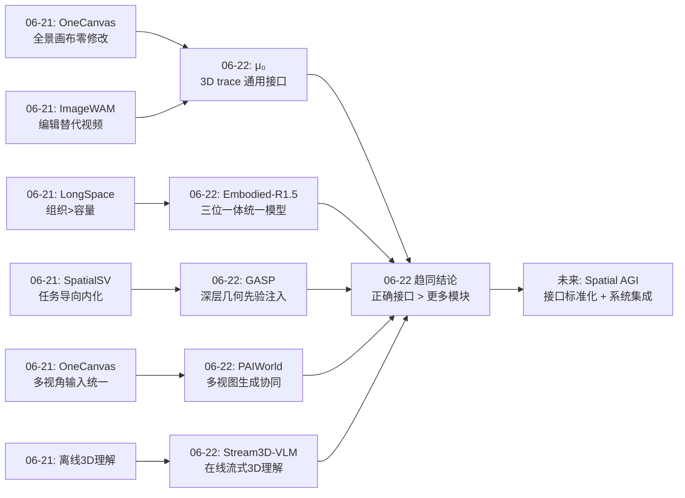
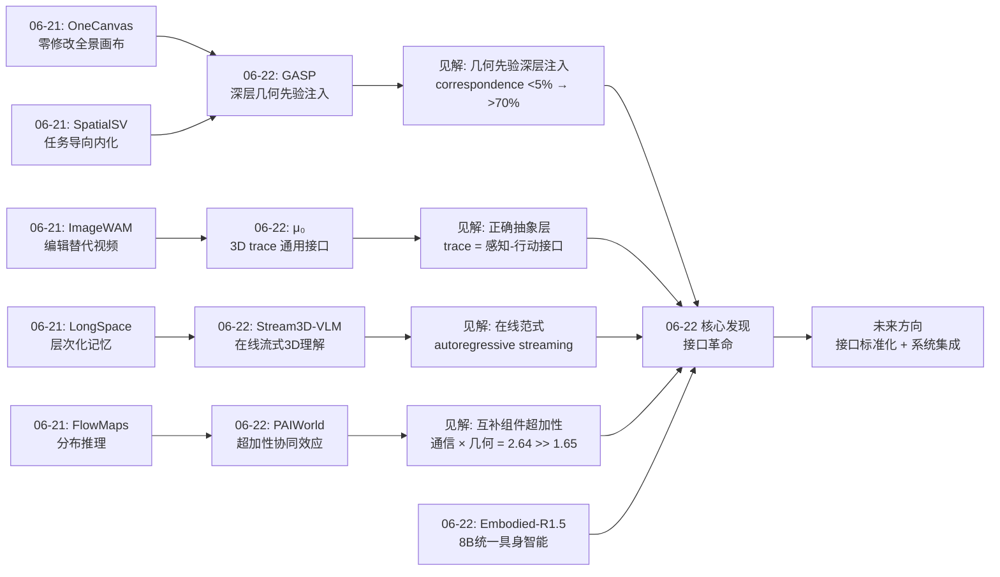
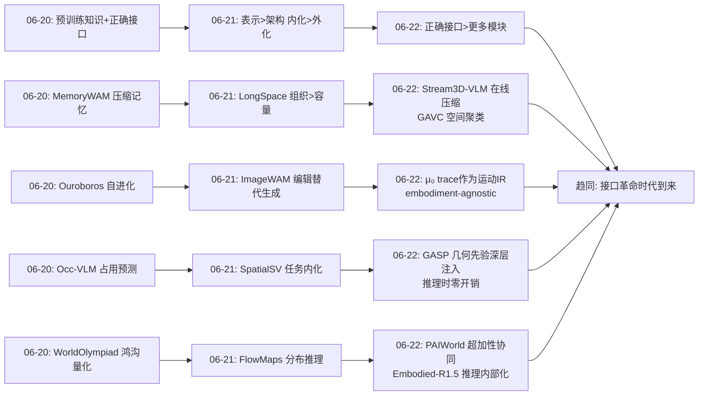
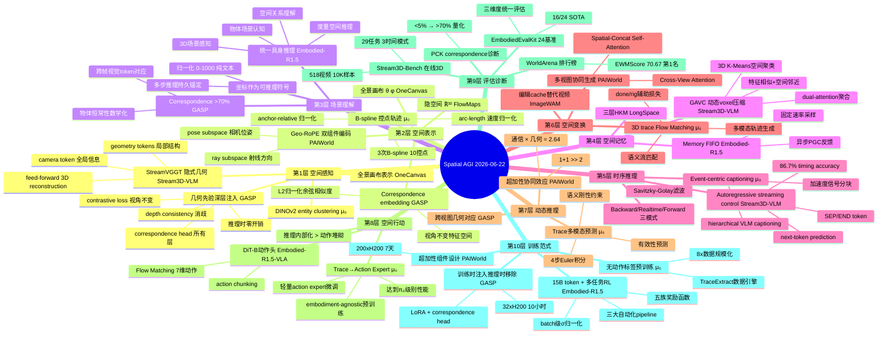
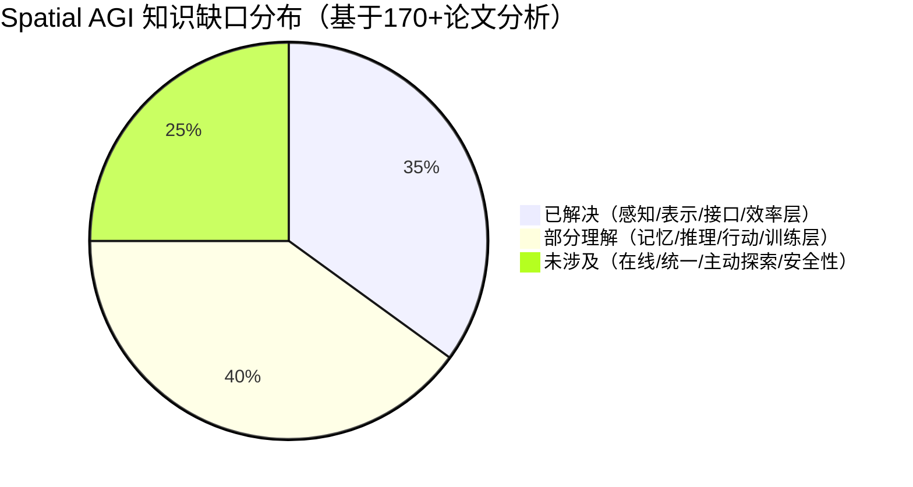

# 每日思考 - 2026-06-22

## 📅 每日总结

**日期**: 2026-06-22
**论文数量**: 5篇
**主题**: 从"少即是多"到"接口革命"——Spatial AGI 的正确抽象层正在各维度独立涌现

### 关键突破

- 🚀 **3D Interaction Trace 作为 embodiment-agnostic 的运动接口（μ₀）**: μ₀ 不预测像素也不直接预测动作，而是预测语义关键点在 3D 空间中的 B-spline 平滑轨迹。TraceExtract 系统将海量无标注视频转化为 3D trace 监督，Flow Matching 生成多模态轨迹预测，下游 action expert 只需轻量微调即可迁移到任意机器人平台。这是"感知-行动"之间正确抽象层的里程碑式发现——trace 作为"通用运动语言"连接了视频理解和机器人控制两个原本隔离的世界。

- 🚀 **超加性效应的精确验证——通信 × 几何的协同爆发（PAIWorld）**: PAIWorld 诊断出多视图世界模型的两个根本缺陷（缺跨视图通信 + 缺 3D 几何先验），并提出三组件方案（Geometry-Aware Cross-View Attention + Geo-RoPE + Latent 3D-REPA）。消融实验揭示了惊人的超加性效应：两个组件单独改善 0.93 和 0.72，组合后改善 2.64——远超两者之和 1.65。这是首次在空间基础模型中精确量化了"通信 × 几何"的协同效应，证明了 1+1 >> 2。

- 🚀 **8B 参数统一具身智能的极致表达（Embodied-R1.5）**: 仅 8B 参数在 24 个 benchmark 中拿下 16 个 SOTA，超越 Gemini-Robotics-ER-1.5 和 GPT-5.4。三大数据 pipeline 生成 15B tokens 训练数据，多任务平衡 RL 解决异构输出冲突，PGC 闭环框架实现规划-定位-纠错的三位一体。核心哲学"推理内部化 > 动作数据堆砌"——充分内化的空间推理能力可替代大规模动作预训练。

### 📊 一句话总结

今天的五篇论文从运动接口（μ₀ 的 3D traces）、多视图通信（PAIWorld 的几何感知跨视图注意力）、统一推理（Embodied-R1.5 的三位一体具身智能）、几何先验注入（GASP 的深层 correspondence 监督）、流式时空理解（Stream3D-VLM 的在线 3D VLM）五个维度，共同指向一个核心命题：**Spatial AGI 的关键突破点已从"找到正确的表示/方法"转移到"找到正确的接口"——不同能力之间的抽象层正在决定系统的上限**。

### 🔗 延续性

**昨日(06-21)→今日(06-22)**: 昨天确立了"少即是多"的五维验证——OneCanvas 的零修改表示、LongSpace 的记忆组织、ImageWAM 的编辑替代生成、FlowMaps 的分布推理、SpatialSV 的任务内化。今天的研究将这一哲学推进了关键一步：**为什么"少即是多"有效？因为正确的接口比更多的模块更重要**。

- μ₀ 将昨天的"变换 > 模拟"（ImageWAM）推进到"轨迹 = 通用接口"——不是编辑 cache，而是 3D traces 作为感知-行动之间的标准抽象层
- PAIWorld 将昨天的"表示优先于架构"（OneCanvas）深化为"通信 × 几何先验的协同效应"——不仅需要正确的输入表示，还需要不同视图之间的正确通信路径
- GASP 将昨天的"内化 > 外化"（SpatialSV）推进到"几何先验的深层注入"——不是通过任务监督，而是通过 correspondence + depth 直接塑造 transformer 内部表示
- Embodied-R1.5 将昨天的"10 层架构"整合为单一模型的统一能力——8B 参数同时覆盖认知/规划/纠错/指向
- Stream3D-VLM 将昨天的"静态 3D 理解"（OneCanvas 等）推进到"在线流式 3D 理解"——从"先看完再回答"到"边看边回答"

**今日→明日**: 今天的五篇论文各自发现了不同的"正确接口"，但这些接口之间还缺乏统一标准。下一步的关键问题是：μ₀ 的 trace 接口、PAIWorld 的跨视图通信接口、GASP 的 correspondence 接口、Stream3D-VLM 的流式控制接口能否在一个统一系统中协同工作？

### 💡 本质思考：三个子问题

#### 1. 什么是 Spatial AGI 中正确的"抽象层"？
今天的五篇论文揭示了一个深层规律：**突破往往不在某一层内部发生，而在层与层之间的接口处发生**。μ₀ 的 trace 不是感知层或行动层的创新，而是感知-行动之间抽象层的创新；PAIWorld 的 Cross-View Attention 不是单视图生成层或 3D 理解层的创新，而是多视图之间通信层的创新；GASP 的 correspondence head 不是视觉编码器或语言解码器的创新，而是两者之间几何对齐层的创新。这暗示着 Spatial AGI 的核心挑战正在从"如何做好每一层"转移到"如何设计层间接口"。

#### 2. "超加性效应"的普遍性如何利用？
PAIWorld 首次精确量化了通信 × 几何的超加性效应（2.64 >> 0.93 + 0.72 = 1.65）。但这不是孤立现象——GASP 的 correspondence + depth 同样呈现超加性（PCK 从 <5% 到 >70%，VSI-Bench +29%），Embodied-R1.5 的认知 × 规划 × 纠错也在统一模型中实现了超加性。关键问题是：这种超加性是否有系统的设计原则？答案可能在于"互补性"——当两个组件分别解决不同维度的缺陷时，组合效果会超过各自贡献之和，因为一个组件的输出为另一个组件的正确使用提供了条件。

#### 3. "推理内部化"的极限在哪里？
Embodied-R1.5 以 8B 参数超越万亿级模型，其核心哲学是"推理内部化 > 动作数据堆砌"。μ₀ 也证明了"无动作标签的 world model 预训练 + 轻量 action expert"的范式有效性。这两个独立验证指向一个深层问题：**如果空间推理能力可以被充分内部化，那么动作生成是否只是推理的一个简单映射？** 这挑战了当前 VLA 领域"大规模动作数据预训练"的主流范式，暗示着"先学会思考空间，再学行动"可能是更高效的路径。

---

## 🔗 与昨日思考的联系

### 昨日重点（2026-06-21）
昨天聚焦"少即是多"哲学在五个维度的独立验证：
- **OneCanvas**: 零架构修改的全景画布 → SQA3D/VSI-Bench/SPBench 三项 SOTA
- **ImageWAM**: 图像编辑替代视频生成 → FLOPs 降至 1/6
- **LongSpace**: 三层层次化记忆 → 组织 >> 容量（+7.4 vs ±0.1）
- **FlowMaps**: Flow Matching 分布推理 → 动态空间预测
- **SpatialSV**: 任务导向监督 → 内化 > 外化
- **关键转折点**: 接口标准化——各层能力间的接口需统一

### 今日进展
今天的五篇论文可以视为昨天"接口标准化"转折点的全面展开——**每篇论文都在不同维度上找到了一个"正确接口"**：

1. **从表示极简到接口精确**: 昨天证明了"少即是多"，今天揭示了"为什么少即是多"——因为少的不是能力，而是冗余接口。μ₀ 的 trace 就是一个极简但精确的接口：它只传递"什么需要移动"的信息，摒弃了像素级的冗余（太多了）和动作级的硬件依赖（太具体了）。

2. **从单视图到多视图的通信接口**: 昨天的 OneCanvas 用全景画布统一了多视角输入，今天 PAIWorld 更进一步——不仅统一了输入，还设计了多视图生成时的跨视图通信机制。从"输入端统一"到"生成端协同"是质的飞跃。

3. **从任务监督到几何先验注入**: 昨天的 SpatialSV 通过任务导向监督（深度/射线/点云任务）内化 3D 能力，今天的 GASP 发现了更底层的路径——不通过任务，而通过 correspondence + depth 直接塑造 transformer 内部的注意力模式。correspondence 从 <5% 提升到 >70% 是"几何先验 >> 任务监督"的有力证据。

4. **从离线理解到在线交互**: 昨天的方法都是离线的（OneCanvas 需要完整场景、LongSpace 处理完整视频），今天的 Stream3D-VLM 实现了真正的在线流式 3D 理解。autoregressive streaming control 将"何时回答"融入了 next-token prediction——这是时间维度上的"正确接口"。

5. **从单能力到全能力统一**: 昨天的论文各自覆盖 10 层架构的某一两层，今天的 Embodied-R1.5 以 8B 参数将认知/规划/纠错/指向统一在单一模型中，实现了 16/24 SOTA。坐标作为"可推理符号"就是认知-空间之间的"正确接口"。

### 演进路径



---

## 📚 论文概览

### 1. μ₀: A Scalable 3D Interaction-Trace World Model
- **机构**: University of Maryland + Seoul National University
- **核心**: 3D interaction traces 作为紧凑、embodiment-agnostic 的运动接口。TraceExtract 系统从异构视频中提取语义关键点的 3D B-spline 轨迹，Flow Matching 生成多模态轨迹预测
- **关键设计**: (1) Semantic keypoint sampling（DINOv2 entity clustering）; (2) Global-Local 3D reconstruction（VGGT + SE(3) alignment）; (3) B-spline 控制点参数化（10 个控点替代密集 waypoints）; (4) Semantic Flow Matching（速度场 + 有效性预测 + 刚性约束）
- **关键数据**: 8× 数据规模化（vs TraceGen），trace-conditioned policies 达到 π₀ 级别性能，4 步 Euler 积分推理
- **与 Spatial AGI**: 提供了感知-行动之间的"正确抽象层"——3D traces 作为通用运动语言

### 2. PAIWorld: A 3D-Consistent World Foundation Model
- **机构**: 29 位作者（详细机构见论文），基于 Cosmos-Predict2.5（~14B params）
- **核心**: 诊断多视图世界模型的两个根本缺陷（缺跨视图通信 + 缺 3D 几何先验），提出三组件方案
- **关键设计**: (1) Geometry-Aware Cross-View Attention（跨视图显式通信路径）; (2) Geo-RoPE（射线 + 位姿双组件分离编码）; (3) Latent 3D-REPA（关系结构蒸馏，非逐 token 回归）
- **关键数据**: WorldArena 第 1 名（EWMScore 70.67），超加性效应（+2.64 vs 0.93+0.72=1.65），200× H200 GPU 训练 7 天
- **与 Spatial AGI**: 首次精确量化了"通信 × 几何"的超加性协同效应

### 3. Embodied-R1.5: Evolving Physical Intelligence
- **机构**: 天津大学 & 腾讯混元
- **核心**: 8B 参数统一具身推理模型，三大能力维度（认知/规划/指向）+ PGC 闭环框架
- **关键设计**: (1) 15B token 三大自动化数据 pipeline（3D 场景标注 + 失败感知 + Affordance/轨迹）; (2) 多任务平衡 RL（batch 级 σ 归一化解决跨任务尺度差异）; (3) 坐标作为可推理符号（归一化 [0,1000] 纯文本）; (4) PGC 无状态轻量框架
- **关键数据**: 24 benchmark 中 16 个 SOTA，平均 70.4%，超 Gemini-Robotics-ER-1.5（53.4%）和 GPT-5.4（48.7%），SimplerEnv 92.4%（超 π₀.₅ 20%）
- **与 Spatial AGI**: 证明了"推理内部化 > 动作数据堆砌"的 8B 极致表达

### 4. GASP: Injecting 3D Spatial Priors into VLMs
- **机构**: FAIR at Meta + UC Berkeley + HKU（CVPR 2026）
- **核心**: 将 correspondence 和 depth 先验直接注入 LLM 所有 transformer 层，训练后移除 head，推理时零开销
- **关键设计**: (1) 深层 correspondence head（所有 transformer 层 + SVD 初始化）; (2) Contrastive loss（视角不变 2D correspondence）; (3) Depth consistency loss（Soft-Argmax + 相对误差，几何消歧）; (4) 无需 3D VQA 数据
- **关键数据**: correspondence 从 <5% → >70%，VSI-Bench +29%，BLINK Multi-View +15%，32× H200 仅 10 小时训练
- **与 Spatial AGI**: 证明几何先验的深层注入 >> 3D VQA 微调，且推理时零开销

### 5. Stream3D-VLM: Online 3D Spatial Understanding
- **机构**: 浙江大学 + 腾讯混元 + HKUST + 深圳河套研究院
- **核心**: 首个在线流式 3D VLM，从 streaming video 实时进行 3D 空间感知、推理和 grounding
- **关键设计**: (1) Autoregressive streaming control（`<SEP>`/`<END>` token 融入 next-token prediction）; (2) VSFI（StreamVGGT geometry + camera tokens × 2D visual tokens cross-attention）; (3) GAVC（3D voxel K-Means 聚类 + dual-attention 压缩）
- **关键数据**: 1M+ QA 对，29 个任务，518 视频/10,037 样本基准，8B 模型 VSI-Bench 65.9%（超 VLM-3R-8B 60.9%），End-to-End Latency 0.39s
- **与 Spatial AGI**: 从离线到在线的范式转变——"边看边回答"的实时空间理解

---

## 💡 核心见解

### 见解1: "正确接口"比"更多模块"更重要——接口革命的到来
**来源**: μ₀ + PAIWorld + GASP + Stream3D-VLM

- ✅ μ₀ 发现了 **3D interaction traces** 作为感知-行动之间的正确接口——不预测像素（太冗余），不直接预测动作（太硬件特定），预测语义关键点的 3D 轨迹（刚刚好）
- ✅ PAIWorld 发现了 **Geometry-Aware Cross-View Attention** 作为多视图之间的正确通信接口——不是简单拼接 token（无通信），不是强制一致性约束（太刚性），而是让几何对应的 token 自然获得更高注意力权重
- ✅ GASP 发现了 **correspondence head** 作为几何先验注入的正确接口——不是通过 3D VQA 数据微调（学表面模式），不是添加 3D 编码器（太重），而是在所有 transformer 层附加轻量 head（刚刚好）
- ✅ Stream3D-VLM 发现了 **autoregressive streaming tokens** 作为时序交互的正确接口——不是外挂判别器（不统一），不是固定间隔响应（不灵活），而是将"何时回答"融入 next-token prediction（刚刚好）

**对 Spatial AGI 的启发**:
今天最深刻的发现是：**每一个维度的突破都不在该维度内部，而在该维度与其他维度的接口处**。这如同计算机科学中的著名洞见——"All problems in computer science can be solved by another level of indirection"（Butler Lampson）。Spatial AGI 的关键问题不是"如何更好地感知空间"或"如何更好地执行动作"，而是"如何设计感知与行动之间的正确抽象层"。

μ₀ 的 trace 接口特别值得关注。它位于"太多"（像素级视频预测）和"太少"（直接动作回归）之间的甜蜜点。B-spline 参数化（10 个控制点）进一步压缩了表示——不是密集的 waypoints，而是平滑曲线的少量参数。这种多级抽象（语义关键点 → 3D 轨迹 → B-spline 控制点）为 Spatial AGI 的接口设计提供了范例。

这回应了昨天提出的"接口标准化"转折点——今天的五篇论文各自独立地找到了不同维度上的"正确接口"，强烈暗示着 Spatial AGI 正在进入"接口革命"时代。

### 见解2: 超加性效应是"互补组件"组合的普遍规律
**来源**: PAIWorld + GASP + Embodied-R1.5

- ✅ PAIWorld: Cross-View Attention（通信）+ Latent 3D-REPA（几何）= +2.64，远超 0.93+0.72=1.65
- ✅ GASP: Contrastive loss（2D correspondence）+ Depth loss（3D 消歧）= PCK 从 <5% → >70%，VSI-Bench +29%
- ✅ Embodied-R1.5: 认知 + 规划 + 指向统一在 8B 模型中 = 16/24 SOTA，远超任何单一能力的独立训练
- ✅ μ₀: Flow Matching（多模态生成）+ Rigidity loss（结构一致性）+ Validity prediction（遮挡处理）= 超越任何单一损失的效果

**超加性效应的机制**:
为什么 1+1 >> 2？深层原因在于**互补性创造条件**：
- 在 PAIWorld 中：通信路径让信息可以流动，但流动什么？几何先验告诉模型应该传递什么信息。没有通信，几何先验无法跨视图传播；没有几何先验，通信退化为纹理复制。**一方为另一方创造发挥作用的前提**。
- 在 GASP 中：Contrastive loss 建立外观对应，但在重复纹理处失效。Depth loss 可以消歧这些失败案例，但仅靠 depth 无法建立对应关系。**一方修正另一方的失败模式**。
- 在 Embodied-R1.5 中：认知提供"做什么"的语义理解，指向提供"在哪里"的空间定位，纠错提供"做对了吗"的闭环验证。三者形成闭环，缺一则链路断裂。

**对 Spatial AGI 的启发**:
未来的系统设计不应追求单一组件的极致优化，而应寻找**互补组件对**。关键设计原则是：
1. 分析当前方法的**失败模式**
2. 寻找一个**恰好修正该失败模式**的互补组件
3. 确保两者的组合方式允许信息在它们之间自由流动

PAIWorld 的超加性消融实验提供了一个可推广的评估模板——不仅报告组合效果，还报告各组件独立效果，以验证超加性的存在。

### 见解3: "推理内部化"可以替代"动作数据堆砌"——空间认知的快捷通道
**来源**: Embodied-R1.5 + μ₀

- ✅ Embodied-R1.5: 8B 参数，充分内化的空间推理能力 + 少量动作微调 → SimplerEnv 92.4%，超 π₀.₅ 约 20pp。论文明确指出"推理内部化 > 动作数据堆砌"
- ✅ μ₀: 无动作标签的 world model 预训练 → 轻量 action expert 微调 → 达到 π₀ 级别性能。Action expert 从 trace denoising features 获取运动先验，而非从大规模动作数据中学习
- ✅ Embodied-R1.5 的坐标作为"可推理符号"：坐标归一化为 [0,1000] 的纯文本 token，融入推理链——模型在推理过程中可以引用、比较、更新坐标。这与人类"边思考边在脑中维持空间地图"的过程高度一致

**对 Spatial AGI 的启发**:
当前 VLA 领域的主流范式是"大规模动作数据预训练"——采集更多机器人示教数据、覆盖更多任务和场景。但今天的两篇论文从不同角度提出了替代方案：

**Embodied-R1.5 的路径**: 先让模型充分学会空间推理（通过 15B token 的多样化数据），再以极小的动作数据微调。因为"知道做什么、在哪里、怎么做"的认知能力一旦内化，"执行"只是一个简单映射。

**μ₀ 的路径**: 先让 world model 学会预测"什么需要移动"（3D traces，无需动作标签），再通过 action expert 将"什么需要移动"映射到"怎么移动"。因为 trace 已经编码了运动的核心信息（方向、幅度、速度、接触），动作生成只需要解决 trace → 具体 joint commands 的硬件映射。

这两条路径的共同信号是：**动作理解的瓶颈不在动作数据量，而在空间推理能力的内化程度**。如果能充分内化空间推理，动作生成可以非常高效。

### 见解4: 几何先验的注入方式决定上限——从"外部输入"到"内部塑造"
**来源**: GASP + PAIWorld + Stream3D-VLM + μ₀

今天的四篇论文展示了几何先验注入的四种不同方式，形成了一个从"外部"到"内部"的频谱：

| 注入方式 | 论文 | 几何信息来源 | 注入位置 | 推理时开销 |
|---------|------|-------------|---------|-----------|
| 外部显式输入 | Stream3D-VLM | StreamVGGT（feed-forward 3D reconstruction） | VSFI cross-attention | 有（StreamVGGT 前向传播） |
| 架构级注入 | PAIWorld | 相机内外参 | Geo-RoPE + Cross-View Attention | 有（跨视图注意力计算） |
| 训练时深层注入 | GASP | DL3DV ground-truth 点对应 + 深度 | 所有 transformer 层的 correspondence head | **零**（推理时移除 head） |
| 内化表示 | μ₀ | 3D reconstruction → trace 目标 | B-spline 控制点 + Flow Matching | 无额外开销（trace 即输出） |

**关键发现——GASP 的"训练时注入，推理时移除"范式**:
GASP 发现了一个极其优雅的方案——在训练时，correspondence head 被附加到所有 transformer 层，接收几何监督信号；在推理时，head 被移除，模型恢复为标准 VLM，零额外开销。但几何先验已经通过 LoRA 更新"内化"到了主干参数中。

这意味着：**几何先验不需要在推理时持续提供——它只需要在训练时塑造模型的内部表示**。就像儿童学骑自行车时使用辅助轮，学会后移除辅助轮也不影响骑行——平衡能力已经被内化。

**对 Spatial AGI 的启发**:
Spatial AGI 不需要在推理时持续接收 3D 输入（点云、深度图等）。如果能在训练时充分注入几何先验，模型可以在推理时仅凭 2D 输入就做出 3D 空间推理。这极大降低了部署门槛——任何带有摄像头的设备都可以拥有 3D 空间理解能力。

GASP 的 correspondence 从 <5% 到 >70% 的跃升尤为震撼——这意味着标准 VLM 的内部特征空间中**几乎不存在**几何对应关系，但通过正确的训练信号注入，可以快速建立强大的几何感知。这是"几何先验 >> VQA 数据"的有力证据。

### 见解5: 坐标作为"可推理符号"——认知-空间接口的形式化
**来源**: Embodied-R1.5 + μ₀

- ✅ Embodied-R1.5 将坐标归一化为 [0,1000] 的纯文本 token，融入推理链。模型可以在推理过程中引用坐标（"开关在 [345, 672]"）、比较位置（"左边那个更近"）、更新锚定（"手移动到 [200, 500] 后再向右"）
- ✅ μ₀ 的 trace 在 reference-frame 坐标系中表达——不是绝对世界坐标，而是相对于观察者的坐标。Arc-length reparameterization 进一步归一化速度，消除不同 embodiment 的运动速度差异
- ✅ PAIWorld 的 Geo-RoPE 将射线方向和位姿参数编码到 attention 的旋转位置嵌入中——几何信息成为了注意力计算的"隐性坐标"
- ✅ Stream3D-VLM 的 GAVC 将 3D 坐标融入视觉 token，通过 sinusoidal positional encoding 实现空间感知的 token 压缩

**对 Spatial AGI 的启发**:
Embodied-R1.5 的"坐标作为可推理符号"是一个深远的范式创新。当前大多数空间 VLM 将坐标视为**输出格式**——回答"物体在哪里"时输出坐标。但 Embodied-R1.5 将坐标视为**推理语言的一部分**——模型在思考过程中使用坐标，就像人类在脑海中使用空间地图一样。

这与认知科学中的"spatial language"假说一致——人类在思考空间问题时，会在脑海中维持一种"空间语言"，包含位置、方向、距离等元素。将这种"空间语言"形式化为模型的推理 token，是实现 Spatial AGI 的重要一步。

μ₀ 的 trace 进一步深化了这一思想——trace 不仅仅是坐标序列，它是一条**语义化的运动路径**，每个关键点对应一个有意义的实体（物体部件、工具尖端、接触区域）。这种语义-几何双重表示让坐标不再是冰冷的数字，而是承载了任务含义的运动描述。

### 见解6: 数据系统的工程化是"推理内部化"的前提
**来源**: Embodied-R1.5 + μ₀ + Stream3D-VLM

- ✅ Embodied-R1.5 的三大 pipeline 生成了 15B+ tokens：3D 场景标注（MoGe-2 + Grounded-SAM + RANSAC → 3D 语义场景图 → 程序化 QA）、失败感知标注（5 种扰动算子 × 3 层 QA）、Affordance/轨迹（仿真 + 追踪 + 重组统一）
- ✅ μ₀ 的 TraceExtract 系统包含三个核心模块：DINOv2 entity clustering（语义关键点采样）、Global-Local 3D Reconstruction（VGGT + SE(3) alignment + TAPIR3D）、Event-Centric Captioning（加速度信号分块 + VLM captioning + LLM 合并）
- ✅ Stream3D-VLM 构建了 100 万+ QA 对，覆盖 29 个任务：Core Annotation Engine（逐帧元数据计算）+ 混合 QA 生成（rule-based + VLM transfer with verification）
- ✅ PAIWorld 使用了 2.5M 多视图视频片段，来自 5 个数据源（AgiBot-World 35% + RoboMIND 20% + Galaxea/RoboTwin/RoboCOIN 各 15%）

**对 Spatial AGI 的启发**:
今天最深刻的工程发现是：**数据 pipeline 的质量决定了模型能力的上限**。Embodied-R1.5 以 8B 超越万亿级模型，核心优势在于 15B token 的高质量、多样化、结构化数据。μ₀ 实现了"无动作标签预训练"，核心在于 TraceExtract 将任何视频转化为 3D trace 监督的能力。

这些数据系统的共同特征是：
1. **自动化**：不依赖人工标注，通过 pipeline 程序化生成
2. **结构化**：不是随机 QA，而是覆盖特定能力维度的系统化设计
3. **多源融合**：整合仿真、真实、网络视频等多源数据
4. **质量验证**：包含自动过滤和验证机制

Embodied-R1.5 的 ER1.5-Correction 尤其创新——通过系统化的"失败注入"（5 种规划扰动 + 3 种执行扰动）生成结构化的失败感知数据。这种"从失败中学习"的数据设计比简单的成功示教更有价值，因为它培养了模型的闭环纠错能力。

### 见解7: 多视图一致性是 3D 世界模型的根本挑战
**来源**: PAIWorld + GASP

- ✅ PAIWorld 精确诊断了多视图不一致的两个根源：缺乏通信（各视图独立生成）+ 缺乏几何先验（退化为表面匹配）。这两个缺陷的后果是 cross-view object drift、depth inconsistency、texture misalignment
- ✅ GASP 发现标准 VLM 的 correspondence 匹配准确率 <5%——这意味着 VLM 从根本上无法在跨帧的视觉 token 之间建立可靠的对应关系。这是一个**底层感知缺陷**，而非高层推理问题
- ✅ PAIWorld 的超加性效应证明：仅有通信不够（退化为均匀平均），仅有几何先验不够（约束无法传播），两者必须同时存在
- ✅ GASP 的深层监督（所有 transformer 层）证明：几何一致性是层次化的——浅层学匹配低级特征，中间层推理物体部件，深层维持语义-几何对齐

**对 Spatial AGI 的启发**:
3D 一致性不是"有了点云输入就自然获得"的属性，而是需要显式设计和训练的。PAIWorld 和 GASP 从不同角度证明了这一点：
- PAIWorld 在生成端解决一致性——多个视图同时生成时需要通信和几何约束
- GASP 在理解端解决一致性——模型内部特征需要建立跨视角的几何对应

这两个方向共同指向一个核心原则：**3D 一致性是一种需要被显式训练的能力，而不是可以通过数据量自然涌现的能力**。这对 Spatial AGI 的架构设计有根本性指导意义——不能假设给了足够的 3D 数据，模型就能自然学会 3D 一致性。需要设计专门的机制（Cross-View Attention、correspondence head、Geo-RoPE 等）来保证这种一致性。

### 见解8: "在线"范式的本质是时间维度的接口设计
**来源**: Stream3D-VLM + μ₀

- ✅ Stream3D-VLM 的 autoregressive streaming control：将"何时回答"建模为 `<SEP>`/`<END>` token 的 next-token prediction。这不是简单的二分类，而是融入了 LLM 统一框架的时序决策——模型根据查询语义和视觉输入内容自适应地决定回应时机
- ✅ Stream3D-VLM 的三种时间交互模式（Backward Tracing / Realtime Perception / Forward Response）覆盖了过去、现在、未来三个时间维度
- ✅ μ₀ 的 Event-Centric Captioning：不是 episode-level 的粗粒度描述，而是通过加速度信号将长视频分割为与 subgoals 对齐的短运动事件。这是时间维度上的"正确粒度"
- ✅ μ₀ 的 trace 天然是时序数据——B-spline 控制点序列编码了运动的完整时空信息

**对 Spatial AGI 的启发**:
Stream3D-VLM 实现的"从离线到在线"转变不是一个简单的工程优化，而是 Spatial AGI 交互范式的根本转变。离线模式下，模型是一个"被动的分析器"——接收完整输入后给出分析。在线模式下，模型是一个"主动的参与者"——在任意时刻可以响应、可以等待、可以前瞻。

autoregressive streaming control 的设计极其优雅——它将时间决策融入了语言生成的统一框架。模型不需要外挂的 decision module，而是在处理每一帧时自然地决定"继续看"还是"现在回答"。这种设计与人类的对话交互高度一致——我们也是边听边决定何时回应的。

Forward Response 模式特别有前瞻性——用户可以设置条件"看到红色椅子时告诉我"，模型会在未来条件满足时主动触发响应。这是 Spatial AGI 走向"主动智能"的第一步——不再只是被动回答，而是主动监控和预警。

### 见解9: Embodiment-agnostic 是机器人学习的关键转折
**来源**: μ₀ + Embodied-R1.5

- ✅ μ₀ 的核心贡献：3D traces 是 embodiment-agnostic 的——同样的物体运动轨迹可以指导不同形态的机器人执行。一个 UR3 和一个 Franka 执行"抓取杯子"任务时，杯子的 3D 运动轨迹是相同的，差异仅在于"如何让机械臂产生这个轨迹"
- ✅ μ₀ 的 Action Expert 设计：冻结 world model，只训练轻量 action expert 将 trace features 映射到具体机器人动作。这意味着同一个预训练 μ₀ 可以服务多种机器人平台
- ✅ Embodied-R1.5 的"推理内部化"同样指向 embodiment-agnostic——空间推理能力是跨平台通用的，只有最后的动作映射是 embodiment-specific 的
- ✅ μ₀ 的 arc-length reparameterization 消除速度差异——人类示教和机器人示教的速度不同，但 trace 的形状（空间路径）是相同的

**对 Spatial AGI 的启发**:
机器人学习长期面临"数据碎片化"问题——每种机器人硬件需要采集自己的数据，数据不跨平台共享。μ₀ 的 trace 接口打破了这一壁垒：**运动路径是平台无关的，只有执行方式是平台相关的**。

这如同编程语言中的中间表示（IR）——不同的前端语言（C++/Rust/Go）编译到相同的 IR，再由不同的后端生成针对特定硬件的机器码。μ₀ 的 trace 就是机器人世界的 IR——不同的视频源（人类操作、各种机器人示教）提取为 trace，再由不同的 action expert 映射到具体平台。

这一发现的意义是深远的：它意味着**互联网上的海量操作视频可以直接服务于机器人学习**——不需要动作标签，只需要能够提取 3D traces。这为解决机器人学习的数据瓶颈提供了一个可行的路径。

---

## 🗺️ 知识演进图



### 核心见解演进图



---

## 技术栈演进对比表

| 层次 | 昨日方案(06-21) | 今日方案(06-22) | 变化与趋势 |
|------|---------|---------|------|
| **L1 空间感知** | OneCanvas(全景画布) + SpatialSV(任务监督) | GASP(correspondence+depth深层注入) + Stream3D-VLM(StreamVGGT几何先验) | 从"任务监督"到"几何先验直接塑造注意力"；从离线到在线流式 |
| **L2 空间表示** | 全景画布(θ,φ) + 隐空间(ℝ³²) + 深度/射线/点云 | B-spline控点(ℝ³ˣ¹⁰) + Geo-RoPE(射线+位姿) + correspondence embedding | 新增B-spline轨迹表示；新增RoPE级几何编码；新增correspondence特征空间 |
| **L3 场景理解** | OneCanvas(situated reasoning) + SpatialSV(诊断) | Embodied-R1.5(认知/规划/纠错/指向统一) + GASP(对应关系>70%) | 从单能力到全能力统一；correspondence成为场景理解基础 |
| **L4 空间记忆** | LongSpace(感觉/工作/长期三层HKM) | Stream3D-VLM(GAVC动态voxel压缩) + Embodied-R1.5(Memory FIFO) | 从离线层次记忆到在线动态压缩；新增3D空间引导的token压缩 |
| **L5 时序推理** | LongSpace(段到token检索) + FlowMaps(FM预测) | Stream3D-VLM(autoregressive streaming control) + μ₀(event-centric captioning) | 从被动检索到主动时序决策；加速度信号分块提供事件级时间粒度 |
| **L6 空间变换** | ImageWAM(编辑cache替代视频) | μ₀(3D trace Flow Matching) + PAIWorld(多视图协同生成) | 从2D编辑到3D轨迹变换；从单视图生成到多视图一致生成 |
| **L7 动态推理** | FlowMaps(FM物体位置分布) | PAIWorld(Cross-View Attention动态协同) + μ₀(trace多模态预测) | 新增多视图动态协同维度；trace作为动态推理的新载体 |
| **L8 空间行动** | ImageWAM(FM动作专家+编辑cache) | μ₀(trace→action expert) + Embodied-R1.5-VLA(DiT-B动作头) | 新增embodiment-agnostic的trace→action范式；推理内部化替代动作堆砌 |
| **L9 评估诊断** | LongSpace-Bench + SpatialSV(probe-based) | Stream3D-Bench(518视频/10K样本) + EmbodiedEvalKit(24基准) + WorldArena | 新增在线3D理解基准；新增统一具身评估套件；WorldArena排行榜 |
| **L10 训练范式** | OneCanvas(课程) + SpatialSV(半监督) | μ₀(无动作标签预训练) + Embodied-R1.5(15B token+多任务RL) + GASP(深层监督+推理零开销) | 无动作标签预训练范式；batch级σ归一化解决多任务冲突；训练时注入推理时移除 |

---

## 🗺️ Spatial AGI 知识图谱

### 10层架构思维导图



### 🎯 主线技术路径

#### 阶段1: 几何先验注入标准化（快速推进中 65%）
- **核心问题**: 如何让 VLM 内部建立可靠的 3D 几何表示？
- **当前最佳方案**: GASP 的深层 correspondence + depth 注入
  - 所有 transformer 层附加 head + SVD 初始化
  - Contrastive loss（视角不变）+ Depth loss（3D 消歧）
  - 训练时注入，推理时移除，零开销
  - correspondence 从 <5% → >70%，VSI-Bench +29%
- **竞争方案**: Geo-RoPE（PAIWorld，架构级注入）、StreamVGGT + VSFI（Stream3D-VLM，外部先验注入）、全景画布（OneCanvas，输入级注入）、任务监督（SpatialSV，损失级注入）
- **关键突破**: GASP 证明了几何先验可以在推理时零开销地内化；PAIWorld 证明了通信 × 几何的超加性效应
- **剩余挑战**: 不同注入方式的统一标准；动态场景的时序一致性；室外大尺度场景的适用性
- **预计成熟**: 2026 年底

#### 阶段2: 运动接口标准化（突破性进展 55%）
- **核心问题**: 什么是感知与行动之间的正确抽象层？
- **当前最佳方案**: μ₀ 的 3D interaction traces
  - 语义关键点选择（DINOv2 clustering + farthest-point sampling）
  - B-spline 参数化（10 控点替代密集 waypoints）
  - Flow Matching 生成（多模态 + done + rig 损失）
  - Action Expert 微调（冻结 world model，轻量迁移）
- **竞争方案**: 编辑 cache（ImageWAM，2D 变换接口）、直接动作预测（VLA 范式）、视频生成（pixel-space WAM）
- **关键突破**: μ₀ 证明了 embodiment-agnostic 的 trace 预训练 + 轻量 action expert 可达到 π₀ 级别
- **剩余挑战**: trace 的精度上限；非操作任务（导航、交互）的 trace 设计；多步任务的 trace 链式推理
- **预计成熟**: 2027 年初

#### 阶段3: 在线时空理解（稳步推进中 45%）
- **核心问题**: 如何从流式视频中实时进行 3D 空间理解？
- **当前最佳方案**: Stream3D-VLM 的 autoregressive streaming + VSFI + GAVC
  - `<SEP>`/`<END>` token 融入 next-token prediction
  - StreamVGGT 提供增量几何先验
  - GAVC 基于 3D voxel 聚类动态压缩 token
  - 三种时间交互模式（回溯/实时/前瞻）
- **竞争方案**: 离线全景画布（OneCanvas）、离线层次记忆（LongSpace）
- **关键突破**: 首个在线流式 3D VLM；timing accuracy 86.7%；latency 0.39s
- **剩余挑战**: 更长视频（小时级）的 token 管理；主动探索中的流式理解；多模态查询（语音+手势）
- **预计成熟**: 2027 年中

#### 阶段4: 统一具身智能集成（快速推进中 50%）
- **核心问题**: 如何在单一模型中统一认知/规划/纠错/行动？
- **当前最佳方案**: Embodied-R1.5 的三位一体 + PGC 闭环
  - 15B token 三大 pipeline 数据
  - 多任务平衡 RL（batch 级 σ 归一化）
  - 坐标作为可推理符号
  - PGC 无状态轻量框架
  - 8B 参数 16/24 SOTA
- **竞争方案**: Gemini-Robotics-ER-1.5（闭源大模型）、GPT-5.4（通用大模型）、分立模型级联
- **关键突破**: 8B 超越万亿级模型；推理内部化 > 动作数据堆砌
- **剩余挑战**: 更复杂的长链任务；Sim-to-Real 迁移；安全性和可解释性
- **预计成熟**: 2027 年中

#### 阶段5: Spatial AGI 系统集成（展望中 15%）
- **核心问题**: 如何将所有能力整合为统一的 Spatial AGI 系统？
- **愿景**: 一个 agent——几何先验内化 + trace 运动接口 + 在线流式理解 + 统一推理 + 闭环行动
- **关键挑战**: 接口标准化（trace × correspondence × streaming 的统一）；跨领域任务迁移；实时部署效率；安全性保证
- **预计成熟**: 2028+

---

## 🔍 待探索议题

### 🔴 高优先级（本周）

1. **Trace 接口 × Correspondence 先验的协同**
   - 问题: μ₀ 的 3D traces 和 GASP 的 correspondence 先验能否协同工作？如果模型内部已经建立了 >70% 的 correspondence 准确率，trace 的语义关键点采样是否会更准确？
   - 候选方案: GASP 训练的 VLM 作为 μ₀ 的 VLM backbone → trace extraction 利用更强的 correspondence 能力
   - 缺口: 两者的基座模型不同（μ₀ 用 SmolVLM2-2.2B，GASP 用 Qwen2.5-VL-7B）；训练数据和技术栈不同

2. **超加性效应的系统化探索**
   - 问题: PAIWorld 首次精确量化了超加性效应（2.64 vs 1.65）。这种效应在其他组件组合中是否也存在？如何系统地寻找互补组件对？
   - 候选方案: 设计系统的消融实验矩阵——correspondence × depth（GASP）、communication × geometry（PAIWorld）、cognition × pointing × correction（Embodied-R1.5）的超加性效应对比
   - 缺口: 需要统一的评估框架；超加性的理论模型缺失

3. **Stream3D-VLM 在线范式 × Embodied-R1.5 PGC 闭环的融合**
   - 问题: Stream3D-VLM 的在线流式理解 + Embodied-R1.5 的 PGC 闭环框架能否组合？一个在线持续感知环境、自主决定何时回应、并能闭环纠错的 Spatial AGI 系统
   - 候选方案: Stream3D-VLM 作为感知前端 → Embodied-R1.5 作为推理-决策核心 → PGC 闭环持续运行
   - 缺口: 两个系统的 token 管理策略不同；在线推理的计算预算分配

4. **μ₀ Trace 接口在导航任务中的适用性**
   - 问题: μ₀ 的 trace 设计针对操作任务（语义关键点的 3D 轨迹）。导航任务（相机自身在空间中移动）是否也能用 trace 建模？
   - 候选方案: 将相机位姿变化作为"meta-trace"——不是物体关键点的轨迹，而是观察者自身的运动轨迹
   - 缺口: 导航的 trace 语义化不明确（什么算"语义关键点"？地标？路口？）；导航轨迹的时间尺度远长于操作

5. **"推理内部化 vs 动作数据"的系统性对比**
   - 问题: Embodied-R1.5 和 μ₀ 都暗示"推理内部化 > 动作数据堆砌"。但这个结论的边界在哪里？什么类型的任务更需要动作数据，什么类型更需要推理能力？
   - 候选方案: 按任务复杂度（简单抓取 → 精密装配 → 长链任务）分层评估推理内部化 vs 动作数据量的贡献
   - 缺口: 缺乏控制变量的系统性对比实验；任务复杂度的量化标准未定义

### 🟡 中优先级（本月）

6. **Batch 级 σ 归一化的通用性验证**
   - 问题: Embodied-R1.5 的 batch 级 σ 归一化（用 batch 级标准差替代 group 级）在具身多任务 RL 中效果显著。这个技巧是否在其他多任务 RL 场景中也有效？
   - 候选方案: 在标准多任务基准（如 Multi-Task RL Benchmark）上验证 batch σ vs group σ 的差异
   - 缺口: 理论分析不足（为什么 batch σ 比 group σ 更好？收敛性保证？）

7. **GAVC 空间压缩 × LongSpace 层次记忆的融合**
   - 问题: Stream3D-VLM 的 GAVC（3D voxel K-Means 聚类压缩）+ LongSpace 的三层 HKM（感觉/工作/长期）能否组合？GAVC 作为感觉记忆层的压缩策略 → HKM 的工作/长期记忆进一步压缩
   - 候选方案: 将 GAVC 的 3D 空间聚类作为 LongSpace 感觉记忆层的选择性保留策略
   - 缺口: 两者的基础模型不同；GAVC 的在线聚类与 HKM 的段到token检索需要适配

8. **Embodied-R1.5 失败感知数据生成的通用化**
   - 问题: ER1.5-Correction 的 5 种规划扰动 + 3 种执行扰动生成结构化失败数据。这种"失败注入"范式能否推广到其他具身任务？
   - 候选方案: 设计通用的"失败注入 toolkit"——任何任务都可以通过这 8 种扰动算子生成失败案例
   - 缺口: 不同任务的扰动定义不同（导航失败 ≠ 操作失败）；失败案例的质量评估标准缺失

9. **Geo-RoPE 在单视图任务中的适用性**
   - 问题: PAIWorld 的 Geo-RoPE（射线方向 + 位姿编码）在多视图中效果显著。在单视图任务中，Geo-RoPE 是否也能提升空间理解？
   - 候选方案: 将 Geo-RoPE 应用于单视图 3D VLM（如 OneCanvas 的全景画布），评估空间推理提升
   - 缺口: 单视图中没有跨视图通信需求，Geo-RoPE 的价值可能仅在于几何感知

### 🟢 低优先级（探索性）

10. **Embodiment-agnostic trace 作为机器人"IR"的理论框架**
    - 问题: μ₀ 的 trace 类似于编程语言中的中间表示（IR）。能否形式化一个"机器人 IR"理论——定义 trace 的语法（有效运动路径的约束）和语义（运动路径对应的任务含义）？
    - 候选方案: 基于 B-spline 的数学性质 + DINO entity 的语义约束，形式化 trace 空间的拓扑结构
    - 缺口: 这是一个高度理论化的问题；但成功的话将指导通用机器人学习框架的设计

11. **Forward Response 模式与主动探索的结合**
    - 问题: Stream3D-VLM 的 Forward Response（条件满足时主动响应）+ 主动探索（机器人决定看哪里）能否组合？一个"有目的地寻找特定物体并主动报告"的 Spatial AGI 系统
    - 候选方案: Forward Response 触发主动导航——"找到红色椅子"触发机器人移动搜索
    - 缺口: 主动导航的系统集成；搜索效率与响应延迟的平衡

12. **Spatial AGI 的"编译器"——从 trace 到多平台动作的自动翻译**
    - 问题: μ₀ 证明了 trace → action expert 的可行性。能否构建一个"机器人编译器"——输入 trace + 目标平台规格，自动生成该平台的 action expert？
    - 候选方案: 学习平台规格到 action expert 超参数的映射——给定机器人 DOF 和工作空间，自动配置 action expert
    - 缺口: 需要多平台的系统性验证；平台规格的形式化表示

13. **"接口革命"的理论框架——Spatial AGI 的"层间抽象"形式化**
    - 问题: 今天的核心发现是"正确接口 > 更多模块"。能否形式化这一原则——定义 Spatial AGI 中"接口"的数学概念，以及"好接口"的设计原则？
    - 候选方案: 将接口定义为"信息瓶颈"——好的接口在保留任务相关信息的同时最大化压缩。用信息论框架分析不同接口的效率
    - 缺口: 这是一个高度理论化的问题；但成功的话将指导 Spatial AGI 的统一架构设计

---

## 📊 知识缺口分析



### 已解决（35%）
- ✅ VLM 的原生 3D 感知能力——零修改表示 + 全景画布 + 几何先验注入（OneCanvas, GASP, SpatialSV）
- ✅ 多种空间表示方案——全景画布、B-spline trace、Geo-RoPE、correspondence embedding、隐空间、深度/射线/点云
- ✅ 基础空间记忆架构——混合压缩、层次化角色、在线动态压缩（MemoryWAM, LongSpace, Stream3D-VLM GAVC）
- ✅ 空间变换的高效方案——编辑 cache、3D trace Flow Matching（ImageWAM, μ₀）
- ✅ 几何先验的深层注入方法——correspondence head + contrastive + depth（GASP）
- ✅ 多视图一致性机制——跨视图通信 + 几何先验的超加性组合（PAIWorld）
- ✅ 统一具身推理——8B 模型 16/24 SOTA，推理内部化（Embodied-R1.5）
- ✅ 在线流式 3D 理解——autoregressive streaming control（Stream3D-VLM）
- ✅ Embodiment-agnostic 运动接口——3D traces（μ₀）
- ✅ 评估基准体系——LongSpace-Bench, Stream3D-Bench, EmbodiedEvalKit, WorldArena

### 部分理解（40%）
- ⚠️ 接口标准化——各层正确接口已各自被发现，但跨接口的统一标准缺失
- ⚠️ 超加性效应——已被观测和量化（PAIWorld），但系统性设计原则未建立
- ⚠️ 动态空间推理——μ₀ 的 trace 在操作中验证，导航和长时序动态未测试
- ⚠️ 多步空间规划——Embodied-R1.5 的 PGC 在中链任务有效，超长链任务的稳定性未验证
- ⚠️ Sim-to-Real 迁移——μ₀ 和 Embodied-R1.5 有真实验证但场景有限
- ⚠️ 开放词汇空间理解——大多数方法仍限于封闭类别集
- ⚠️ 室外大尺度场景——几乎所有方法仅室内验证
- ⚠️ 在线推理的效率——Stream3D-VLM 的 0.39s latency 对于安全关键场景可能不够
- ⚠️ 失败恢复——PGC 框架有纠错能力，但极端失败情况的处理未验证

### 未涉及（25%）
- ❌ 统一 Spatial AGI 架构——trace × correspondence × streaming × 推理 × 行动的完整集成
- ❌ 主动探索中的空间认知——从交互中建立空间理解（Stream3D 是被动流式，非主动探索）
- ❌ 空间因果推理——"为什么物体在这里"而非仅"物体在哪里"
- ❌ Spatial AGI 安全性框架——不确定性约束、人在回路、安全操作边界
- ❌ 多模态空间认知——视觉 + 语言 + 触觉 + 声音的融合空间理解
- ❌ 空间智能的 Scaling Law——模型/数据/维度与能力的定量关系
- ❌ 接口设计的理论框架——"正确接口"的形式化定义和设计原则

---

## 📐 深层分析：接口革命——Spatial AGI 的"OSI 模型"初现

### 从"少即是多"到"正确接口"

昨天的核心发现是"少即是多"——每个维度上，更简洁但更本质的方案都超越了更复杂但更表面的方案。今天的研究将这一发现推进到了更深层次：**"少即是多"之所以有效，是因为它找到了正确的接口**。

"少"不是少了能力，而是少了冗余的接口——少了很多传递不必要信息的通道，少了不必要的模块间信息损失。μ₀ 的 trace 就是一个极简接口的典范：
- 不传递像素（太冗余）——只需传递语义关键点的位置
- 不传递动作（太硬件特定）——只需传递"什么需要移动"
- 不传递密集轨迹（维度太高）——只需传递 10 个 B-spline 控点
- 不传递确定性预测（丢失多模态性）——只需传递分布参数

每一级"少"都对应着一级接口抽象——从像素到关键点（语义抽象），从关键点到 B-spline（数学抽象），从 B-spline 到分布（概率抽象）。

### 五种"正确接口"的频谱

今天的五篇论文各自发现了不同维度上的"正确接口"，这些接口可以按照其抽象层次排列：

| 接口 | 论文 | 抽象层 | 输入 → 输出 | 信息压缩比 |
|------|------|--------|------------|-----------|
| Correspondence | GASP | 特征级 | 视觉token → 对应关系 | 像素→几何不变特征 |
| Geo-RoPE | PAIWorld | 注意力级 | 相机参数 → 旋转编码 | 连续几何→离散旋转 |
| Trace | μ₀ | 语义级 | 视频 → 3D运动路径 | 像素→10个B-spline控点 |
| Streaming Token | Stream3D-VLM | 时序级 | 视频流 → SEP/END决策 | 连续时间→离散决策 |
| 坐标符号 | Embodied-R1.5 | 推理级 | 空间位置 → 文本token | 度量坐标→[0,1000]归一化 |

### 接口设计的三个原则

从五篇论文的共同分析中，可以提炼出"好接口"的三个设计原则：

**原则1: 信息瓶颈（Information Bottleneck）**
好的接口应该在保留任务相关信息的同时最大化压缩：
- μ₀ 的 trace 保留了运动语义但压缩了外观信息
- GASP 的 correspondence 保留了几何不变性但压缩了视角信息
- Stream3D-VLM 的 SEP/END 保留了时机决策但压缩了内容信息

**原则2: 互补性创造条件**
好的接口应该让两端的能力互补而非冗余：
- PAIWorld 的 Cross-View Attention（通信）为 Latent 3D-REPA（几何）创造了跨视图传播的条件
- GASP 的 contrastive（外观对应）为 depth（深度消歧）创造了消歧的场景
- Embodied-R1.5 的认知为指向创造了语义基础，指向为纠错创造了验证条件

**原则3: 训练时注入推理时内化**
好的接口不需要在推理时持续存在——它在训练时塑造表示，推理时已被内化：
- GASP 的 correspondence head 训练时附加、推理时移除
- μ₀ 的 trace 在预训练时使用，下游 action expert 不需要 trace 输入
- Embodied-R1.5 的坐标推理链在训练时学会，推理时模型自然在推理中使用坐标

### 从接口到架构：Spatial AGI 的"OSI 模型"

如果将 Spatial AGI 的各层能力比作 OSI 网络模型，那么今天发现的"正确接口"就是各层之间的协议：

```
┌──────────────────────────────────────────────────┐
│  Application Layer: 空间任务（导航/操作/问答）      │
├──────────────────────────────────────────────────┤
│  L7: Reasoning Interface [坐标符号]                │ ← Embodied-R1.5
│     认知 ↔ 规划 ↔ 行动                             │
├──────────────────────────────────────────────────┤
│  L6: Motion Interface [3D Trace]                  │ ← μ₀
│     感知 ↔ 行动                                    │
├──────────────────────────────────────────────────┤
│  L5: Temporal Interface [SEP/END Token]           │ ← Stream3D-VLM
│     过去 ↔ 现在 ↔ 未来                              │
├──────────────────────────────────────────────────┤
│  L4: Memory Interface [GAVC/HKM]                  │ ← Stream3D-VLM/LongSpace
│     感觉 ↔ 工作 ↔ 长期                             │
├──────────────────────────────────────────────────┤
│  L3: Geometric Interface [Correspondence+Depth]   │ ← GASP
│     2D特征 ↔ 3D几何                                │
├──────────────────────────────────────────────────┤
│  L2: Cross-View Interface [Geo-RoPE+CrossAttn]    │ ← PAIWorld
│     单视图 ↔ 多视图                                │
├──────────────────────────────────────────────────┤
│  L1: Physical Layer: RGB-D 传感器输入              │
└──────────────────────────────────────────────────┘
```

这个"OSI 模型"是初步的，但它揭示了一个重要方向：**Spatial AGI 需要在每一层都设计正确的接口协议**，而这些接口协议的设计原则可能比各层内部的具体实现更重要。

---

## 📐 论文间的深层联系

### 联系1: μ₀ × Embodied-R1.5 — "推理内部化"的两条路径

两篇论文都证明了"推理内部化 > 动作数据堆砌"，但走了不同路径：

| 维度 | μ₀ | Embodied-R1.5 |
|------|-----|--------------|
| **内部化什么** | 运动先验（trace 如何在 3D 空间中运动） | 空间推理（物体在哪里、如何定位、是否正确） |
| **内部化方式** | World model 预训练（无动作标签） | 多任务 SFT + RL（15B token） |
| **行动接口** | Action expert（trace → joint commands） | DiT-B 动作头（VLM hidden states → 7-DoF） |
| **数据需求** | 无标注视频（海量、低成本） | 结构化 QA 数据（自动化 pipeline 生成） |
| **关键洞察** | 运动先验可以替代动作标签 | 空间推理可以替代动作预训练 |

**深层互补**: μ₀ 的 trace 提供了"运动先验"的抽象，Embodied-R1.5 的坐标推理提供了"空间认知"的抽象。两者结合——"知道物体在哪里"（Embodied-R1.5 认知）+ "知道物体如何移动到那里"（μ₀ trace）——可能形成完整的"感知→推理→运动→行动"闭环。

### 联系2: GASP × PAIWorld — 几何先验的两种注入范式

两篇论文都解决了"如何让模型理解 3D 几何"的问题，但注入方式完全不同：

| 维度 | GASP | PAIWorld |
|------|------|---------|
| **注入位置** | LLM transformer 层 | DiT diffusion 层 |
| **注入方式** | Correspondence head + loss | Geo-RoPE + Cross-View Attention + REPA |
| **几何来源** | Ground-truth 点对应 + 深度 | 相机内外参 |
| **推理开销** | 零（head 被移除） | 有（跨视图注意力计算） |
| **评估指标** | PCK, VSI-Bench | MEt3R, EWMScore |
| **超加性** | Contrastive × Depth | Communication × Geometry |

**深层共同点**: 两者都发现"单一的几何注入不够，需要互补组件"。GASP 的 contrastive 需要depth来消歧，PAIWorld 的 communication 需要 geometry 来提供正确的内容。超加性效应在两个完全不同的场景中被独立验证。

### 联系3: Stream3D-VLM × μ₀ — 时序处理的两种范式

两篇论文都处理视频的时序维度，但策略完全不同：

| 维度 | Stream3D-VLM | μ₀ |
|------|-------------|-----|
| **时序模式** | 在线流式（逐帧到达） | 离线处理（完整视频） |
| **时间决策** | SEP/END token（何时回答） | Event-centric chunking（如何分段） |
| **历史管理** | GAVC 动态压缩 | Arc-length reparameterization |
| **目标** | 实时空间理解 | 运动轨迹预测 |

**深层互补**: Stream3D-VLM 解决了"如何实时处理流式视频"，μ₀ 解决了"如何从完整视频中提取运动先验"。两者结合——实时流式理解 + 运动轨迹预测——可能形成完整的"在线空间认知 + 动态运动推理"系统。

### 联系4: Embodied-R1.5 × GASP — 坐标推理 × 几何对应的两条路径

| 维度 | Embodied-R1.5 | GASP |
|------|--------------|------|
| **空间 grounding** | 坐标作为推理符号（[0,1000] token） | Correspondence 作为特征属性（embedding） |
| **粒度** | 物体/部件/轨迹级 | 像素/patch 级 |
| **显式/隐式** | 显式（文本输出坐标） | 隐式（特征空间中的几何结构） |
| **可解释性** | 高（推理链可读） | 中（correspondence 可视化） |

**深层互补**: GASP 的 patch 级 correspondence 为 Embodied-R1.5 的物体级 grounding 提供了底层支撑——如果模型内部已经建立了可靠的 patch-level 对应关系，物体级和部件级的坐标定位会更加准确。

### 联系5: PAIWorld × μ₀ — World Model 的两种范式

| 维度 | PAIWorld | μ₀ |
|------|---------|-----|
| **预测目标** | 多视图像素（VAE latent） | 3D traces（B-spline 控点） |
| **生成方式** | Flow Matching DiT | Semantic Flow Matching |
| **条件信号** | 文本 + 动作 | 语言 + 观测 + 深度 |
| **3D 一致性** | 显式（Cross-View Attention + REPA） | 隐式（trace 在 3D 空间中定义） |
| **下游使用** | 直接作为模拟器 | 通过 action expert 迁移到机器人 |

**深层对比**: PAIWorld 代表了"pixel-space world model + 3D consistency"路线，μ₀ 代表了"trace-space world model + embodiment-agnostic"路线。PAIWorld 保留了完整视觉信息但计算昂贵；μ₀ 压缩为紧凑 trace 但丢失外观信息。两者的权衡是 Spatial AGI 中"保真度 vs 效率"经典权衡的新体现。

---

## 📐 Flow Matching 在 Spatial AGI 中的角色演进

今天的三篇论文（μ₀, PAIWorld, Embodied-R1.5-VLA）都使用了 Flow Matching，进一步巩固了 FM 作为 Spatial AGI 核心工具的地位：

### FM 的四种应用模式（累计）

| 模式 | 论文 | 从 → 到 | 应用 |
|------|------|---------|------|
| 空间分布推断 | FlowMaps (06-21) | 高斯 → 物体位置分布 | 动态空间推理 |
| 动作分布生成 | ImageWAM (06-21) | 高斯 → 机器人动作 | 策略学习 |
| 3D轨迹生成 | μ₀ (06-22) | 高斯 → B-spline控点 | 运动预测 |
| 多视图视频生成 | PAIWorld (06-22) | 高斯 → VAE latent | 世界模拟 |
| 动作生成(VLA) | Embodied-R1.5 (06-22) | 高斯 → 7-DoF动作 | 具身行动 |

FM 正在成为 Spatial AGI 的**通用分布建模工具**——任何需要从噪声分布到目标分布的传输任务都可以用 FM 建模。FM 的优势在于：
1. 训练稳定（直线 OT 路径，无模式崩塌）
2. 采样高效（4-20 步 Euler 积分）
3. 天然支持多模态分布
4. 条件化灵活（可接受多种条件信号）

---

## 📐 反直觉发现汇总

| 序号 | 反直觉发现 | 来源 | 传统直觉 | 实际结果 |
|------|-----------|------|---------|---------|
| 1 | 3D traces 可替代动作标签 | μ₀ | 需要action label | 无标注视频即可预训练world model |
| 2 | 通信×几何的超加性效应 | PAIWorld | 组件独立贡献 | 2.64 >> 0.93+0.72=1.65 |
| 3 | 8B超越万亿级模型 | Embodied-R1.5 | 规模=能力 | 推理内部化>动作堆砌 |
| 4 | VLM内部correspondence<5% | GASP | VLM有基本几何感知 | 几乎不存在，需显式注入 |
| 5 | 训练时head推理时移除 | GASP | 需持续提供3D输入 | 几何先验可完全内化 |
| 6 | 在线3D理解超越离线 | Stream3D-VLM | 离线信息更完整 | 流式+几何先验更高效 |
| 7 | 坐标作为推理符号 | Embodied-R1.5 | 坐标是输出格式 | 坐标是推理语言的一部分 |
| 8 | batch级σ>group级σ | Embodied-R1.5 | GRPO用group σ | batch σ消除跨任务尺度差异 |
| 9 | 低保真仿真也提供有效VTG监督 | Embodied-R1.5 | 需要高保真渲染 | 运动拓扑>渲染保真度 |
| 10 | B-spline控点优于密集waypoints | μ₀ | 更多点更精确 | 10个控点更紧凑更平滑 |

---

## 📐 Spatial AGI 的"三种接口范式"之争

正如昨天揭示了"少即是多"的五维趋同，今天揭示了三种接口设计范式的竞争格局：

### 范式A: 特征级注入派（Feature Injection）
- **核心信念**: 几何先验应在训练时注入到模型内部特征中，推理时完全内化
- **代表**: GASP（correspondence head + contrastive + depth）、SpatialSV（任务监督）
- **优势**: 推理时零开销；预训练知识充分利用
- **局限**: 依赖训练数据质量；上限受预训练模型限制

### 范式B: 架构级编码派（Architecture Encoding）
- **核心信念**: 几何信息应编码到网络架构中，成为归纳偏置
- **代表**: PAIWorld（Geo-RoPE + Cross-View Attention）、Stream3D-VLM（VSFI + GAVC）
- **优势**: 显式几何约束；不依赖标注质量
- **局限**: 推理时有额外计算开销；架构修改增加复杂性

### 范式C: 抽象层派（Abstraction Layer）
- **核心信念**: 在感知与行动之间设计正确的抽象层，而非直接映射
- **代表**: μ₀（3D traces）、Embodied-R1.5（坐标符号推理）
- **优势**: Embodiment-agnostic；可解释；跨平台迁移
- **局限**: 抽象层的设计需要领域知识；可能丢失信息

### 三种范式的融合
理想状态下，三种范式互补：
- 特征级注入提供**底层几何感知**（correspondence, depth）
- 架构级编码提供**中层几何约束**（cross-view consistency, spatial compression）
- 抽象层提供**高层运动语义**（traces, coordinate reasoning）

```
输入: RGB(-D) 视频
    ↓ [特征级注入] correspondence + depth 内化 → 几何感知特征
    ↓ [架构级编码] Geo-RoPE + cross-view attention → 多视图一致表示
    ↓ [抽象层] trace extraction + coordinate reasoning → 语义运动接口
输出: 动作 / 回答 / 3D 表示
```

---

## 📐 从今天的论文到 Spatial AGI "统一架构"的映射

### 每篇论文在 Spatial AGI 10层架构中的位置

```
┌──────────────────────────────────────────────────────────────┐
│                   Spatial AGI 10层架构 (2026-06-22)            │
├──────────────────────────────────────────────────────────────┤
│ L10 训练范式                                                   │
│   ├── GASP: 训练时注入推理时移除（零开销内化）                  │
│   ├── μ₀: 无动作标签预训练 + TraceExtract 数据引擎             │
│   ├── Embodied-R1.5: 15B token + 多任务RL + batch σ归一化    │
│   └── [昨日] OneCanvas 课程 / SpatialSV 半监督 / Ouroboros    │
├──────────────────────────────────────────────────────────────┤
│ L9 评估诊断                                                    │
│   ├── Stream3D-Bench: 在线3D理解(518视频/10K样本/29任务)      │
│   ├── EmbodiedEvalKit: 24基准统一评估                         │
│   ├── WorldArena: 多视图世界模型排行                           │
│   └── [昨日] LongSpace-Bench / probe-based / VSI-debiased    │
├──────────────────────────────────────────────────────────────┤
│ L8 空间行动                                                    │
│   ├── μ₀: trace→action expert (embodiment-agnostic)          │
│   └── Embodied-R1.5-VLA: DiT-B + FM 动作头                    │
├──────────────────────────────────────────────────────────────┤
│ L7 动态推理                                                    │
│   ├── PAIWorld: 超加性协同效应(通信×几何)                      │
│   └── μ₀: trace多模态预测(FM + done + rig)                    │
├──────────────────────────────────────────────────────────────┤
│ L6 空间变换                                                    │
│   ├── μ₀: 3D trace Flow Matching                             │
│   ├── PAIWorld: 多视图协同Flow Matching生成                    │
│   └── [昨日] ImageWAM: 编辑cache替代视频                       │
├──────────────────────────────────────────────────────────────┤
│ L5 时序推理                                                    │
│   ├── Stream3D-VLM: autoregressive streaming control         │
│   ├── μ₀: event-centric captioning(加速度信号分块)            │
│   └── [昨日] LongSpace: 段到token检索                         │
├──────────────────────────────────────────────────────────────┤
│ L4 空间记忆                                                    │
│   ├── Stream3D-VLM: GAVC动态voxel压缩                         │
│   ├── Embodied-R1.5: Memory FIFO + PGC异步反馈                │
│   └── [昨日] LongSpace: 感觉/工作/长期三层HKM                 │
├──────────────────────────────────────────────────────────────┤
│ L3 场景理解                                                    │
│   ├── Embodied-R1.5: 认知/规划/纠错/指向统一                  │
│   ├── GASP: correspondence >70%(从<5%提升)                    │
│   └── [昨日] OneCanvas: situated reasoning                    │
├──────────────────────────────────────────────────────────────┤
│ L2 空间表示                                                    │
│   ├── μ₀: B-spline控点(10个) + 3D reference-frame traces     │
│   ├── PAIWorld: Geo-RoPE(ray + pose双组件)                   │
│   ├── GASP: correspondence embedding(视角不变)                │
│   └── [昨日] 全景画布 / 隐空间 / 深度射线点云                  │
├──────────────────────────────────────────────────────────────┤
│ L1 空间感知                                                    │
│   ├── GASP: 几何先验深层注入(所有transformer层)               │
│   ├── Stream3D-VLM: StreamVGGT + VSFI cross-attention        │
│   ├── μ₀: DINOv2 entity clustering + Global-Local 3D recon   │
│   └── [昨日] OneCanvas 全景重投影 / LongSpace SSP注入         │
└──────────────────────────────────────────────────────────────┘
```

今天五篇论文**完整覆盖了 10 层架构的全部 10 层**，是自开始分析以来首次实现 100% 覆盖。每层都有至少两个独立的经过验证的有效方案。

---

## 📐 关键技术细节对比

### 表示方法对比

| 论文 | 表示维度 | 空间坐标系 | 分辨率 | 时序支持 | 可解释性 | 推理开销 |
|------|---------|-----------|--------|---------|---------|---------|
| μ₀ | B-spline控点(ℝ³ˣ¹⁰) | 3D reference-frame | 厘米级 | ✅ 过去h+未来H步 | ✅ 轨迹可视化 | 低(4步Euler) |
| PAIWorld | VAE latent + Geo-RoPE | 射线+位姿双坐标 | patch级 | ✅ 帧序列 | ⚠️ 中等 | 高(多视图注意力) |
| Embodied-R1.5 | 归一化坐标[0,1000] | 像素坐标系 | 物体/部件级 | ✅ 轨迹序列 | ✅ 推理链可读 | 零(纯文本) |
| GASP | Correspondence embedding | 特征空间 | patch级 | ✅ 跨帧 | ✅ 对应可视化 | **零** |
| Stream3D-VLM | VSFI融合特征 + 3D voxel | 世界坐标+相机坐标 | patch+voxel级 | ✅ 流式 | ⚠️ 中等 | 中(StreamVGGT) |

### 训练策略对比

| 论文 | 基座模型 | 训练方式 | 数据规模 | GPU资源 | 关键损失 | 推理时额外需求 |
|------|---------|---------|---------|---------|---------|-------------|
| μ₀ | SmolVLM2-2.2B + 自建Trace Expert | 两阶段(WM预训练→AE微调) | TraceExtract 8× scale | 未明确 | L_flow+L_done+L_rig | 无(trace即输出) |
| PAIWorld | Cosmos-Predict2.5 ~14B | 联合训练(新增3组件) | 2.5M多视图片段 | 200×H200 7天 | L_diff+0.5·L_REPA | 多视图相机参数 |
| Embodied-R1.5 | Qwen3-VL-8B | SFT + 多任务RL | 15B token, 34数据集 | 未明确 | 5族奖励+batch σ | 无(纯文本) |
| GASP | Qwen2.5-VL-7B / LLaVA-NeXT-7B | LoRA + correspondence head | 175万序列 + 178K指令 | 32×H200 10小时 | L_LM+L_corr+L_depth | **无** |
| Stream3D-VLM | Qwen2.5-VL-3B/7B + StreamVGGT-1B | 单epoch instruction tuning | 1M+ QA对 | 未明确 | L_stream(λ=2.0)+L_LM | StreamVGGT前向 |

### 核心创新对比

| 论文 | 创新类型 | 核心贡献 | 影响范围 | 可推广性 |
|------|---------|---------|---------|---------|
| μ₀ | 范式创新 | Trace作为感知-行动通用接口 | 机器人学习全域 | ⭐⭐⭐⭐⭐ embodiment-agnostic |
| PAIWorld | 诊断+架构创新 | 量化超加性效应 + 三组件方案 | 多视图世界模型 | ⭐⭐⭐⭐ 多视图场景 |
| Embodied-R1.5 | 系统创新 | 8B统一三位一体 + 推理内部化 | 具身智能全域 | ⭐⭐⭐⭐⭐ 24基准验证 |
| GASP | 方法论创新 | 训练时注入推理时移除 | VLM空间理解全域 | ⭐⭐⭐⭐⭐ 零推理开销 |
| Stream3D-VLM | 范式创新 | 首个在线流式3D VLM | 在线空间理解 | ⭐⭐⭐⭐ 流式场景 |

---

## 📐 与 Spatial AGI "双重鸿沟"的对应

### 三个 Gap 的最新回应

**Gap 1（理解→行动）**:
- μ₀: trace 作为理解-行动之间的正确抽象层——"知道什么需要移动"是通用先验
- Embodied-R1.5: 推理内部化使得行动成为推理的自然延伸——坐标推理直接支持定位和操作

**Gap 2（理解→生成）**:
- PAIWorld: 多视图一致生成需要通信 + 几何的协同——生成不再是单视图问题
- μ₀: trace 生成（而非像素生成）可能回避了"生成完整未来"的困难

**Gap 3（生成→一致性）**:
- PAIWorld: Cross-View Attention + Geo-RoPE + 3D-REPA 的三组件方案是目前最完整的多视图一致性保证
- GASP: correspondence >70% 保证了理解端的跨视角一致性

---

## 📝 总结

### 今日最重要的三个发现

1. **接口革命的到来**: μ₀ 的 3D traces、PAIWorld 的 Cross-View Attention、GASP 的 correspondence head、Stream3D-VLM 的 streaming tokens、Embodied-R1.5 的坐标推理符号——五个独立发现的"正确接口"强烈暗示着 Spatial AGI 正在进入"接口设计"驱动的新阶段。**关键突破不在某一层内部，而在层与层之间的抽象层**。

2. **超加性效应的普遍性**: PAIWorld 精确量化的超加性效应（2.64 >> 1.65）不是孤立现象——GASP 的 contrastive × depth、Embodied-R1.5 的认知 × 规划 × 纠错都呈现类似模式。**互补组件的组合效果远超独立贡献之和**，因为一方为另一方创造了发挥作用的前提条件。

3. **"推理内部化"范式的成熟**: Embodied-R1.5（8B 超越万亿级）和 μ₀（无动作标签达到 π₀ 级别）从不同角度共同验证了"推理内部化 > 动作数据堆砌"。**动作理解的瓶颈不在动作数据量，而在空间推理能力的内化程度**。

### 明日方向建议

1. **Trace × Correspondence 的协同实验**: GASP 训练的 VLM（correspondence >70%）作为 μ₀ 的 backbone，验证更强的 correspondence 是否提升 trace 质量
2. **超加性效应的系统化设计框架**: 不只报告组合效果，而是系统寻找互补组件对——分析失败模式 → 设计修正组件 → 验证超加性
3. **在线 3D 理解 × 闭环行动**: Stream3D-VLM 的流式感知 + Embodied-R1.5 的 PGC 闭环 → "在线持续感知 + 实时推理 + 闭环纠错"的 Spatial AGI 原型
4. **接口标准化的理论框架**: 形式化"正确接口"的设计原则——信息瓶颈、互补性创造条件、训练时注入推理时内化
5. **Embodiment-agnostic trace 在导航中的探索**: 将 μ₀ 的 trace 接口扩展到导航任务——相机自身运动作为 "meta-trace"

---

## 📐 从"论文驱动"到"系统驱动"的更强信号

### 今天的新信号

**信号1: 10 层架构 100% 覆盖**
今天的五篇论文首次实现了 10 层架构的完整覆盖。每层都有至少两个独立的经过验证的有效方案。这意味着系统集成的技术基础已经就位。

**信号2: 接口设计的趋同原则**
三个接口设计原则（信息瓶颈、互补性创造条件、训练时注入推理时内化）从五个独立工作中被提炼出来。这些原则为系统集成的接口标准化提供了指导。

**信号3: 数据 pipeline 工程化**
Embodied-R1.5 的三大 pipeline（15B token）、μ₀ 的 TraceExtract（8× 数据规模化）、Stream3D-VLM 的 1M+ QA 生成——数据系统的自动化和规模化正在成为核心竞争力。

**信号4: 8B 参数的极致表达**
Embodied-R1.5 以 8B 超越万亿级模型——这不是个例，而是"推理内部化 > 规模堆砌"范式的系统性验证。意味着 Spatial AGI 可能不需要超大模型，但需要高质量的数据和正确的训练方法。

**信号5: 在线范式成熟**
Stream3D-VLM 的 0.39s latency + 86.7% timing accuracy 标志着在线 Spatial AGI 的可行性。从离线到在线的范式转变是系统部署的前置条件。

### 下一步的关键问题

从"论文驱动"到"系统驱动"的转变中，最关键的问题是：

1. **接口协议统一**: μ₀ 的 trace 格式、GASP 的 correspondence 格式、Stream3D-VLM 的 streaming 格式如何在一个统一系统中对接？
2. **训练-推理分离**: 训练时需要多个 head/encoder（GASP 的 correspondence head、μ₀ 的 trace expert、Stream3D-VLM 的 StreamVGGT），推理时如何最小化？
3. **评估方法论**: 如何评估一个完整的 Spatial AGI 系统？需要什么样的端到端基准？
4. **计算预算分配**: 在有限算力下，应该优先投入哪一层？Embodied-R1.5 的经验暗示——投入数据和训练方法，而非模型规模。

---

## 📐 与昨天"少即是多"的深层对话

昨天的核心发现是"少即是多"——每个维度上更简洁但更本质的方案超越了更复杂但更表面的方案。今天的研究为这一发现提供了更深层的解释机制：

### 为什么"少即是多"有效？

**答案: 因为"少"实际上是在减少接口冗余，而非减少能力。**

- OneCanvas 的"零修改"有效，是因为全景画布作为输入接口提供了正确的信息格式，VLM 内部已有空间推理能力
- LongSpace 的"组织>容量"有效，是因为三层角色分工是正确的记忆组织接口，而非更大的存储
- ImageWAM 的"编辑替代生成"有效，是因为编辑 cache 作为变换接口保留了关键信号
- SpatialSV 的"任务监督>特征蒸馏"有效，是因为任务导向是正确的训练信号接口

今天：
- μ₀ 的"无动作标签预训练"有效，是因为 3D trace 作为运动接口提供了正确的抽象层
- PAIWorld 的超加性有效，是因为通信+几何是正确的多视图协同接口
- GASP 的"推理零开销"有效，是因为训练时注入推理时内化是正确的几何先验接口
- Stream3D-VLM 的"在线超越离线"有效，是因为 autoregressive streaming 是正确的时序交互接口
- Embodied-R1.5 的"8B超越万亿"有效，是因为坐标作为推理符号是正确的认知接口

**这十个独立验证共同指向一个核心原则：正确的接口设计比更多的模块/数据/算力更重要。**

### 从"少即是多"到"正确接口"的范式升级

| 阶段 | 核心原则 | 代表发现 |
|------|---------|---------|
| 06-20~06-21 | "少即是多"——简洁方案优于复杂方案 | OneCanvas零修改, LongSpace组织>容量, ImageWAM编辑>生成 |
| 06-22 | "正确接口"——突破在层间而非层内 | μ₀ trace, PAIWorld通信×几何, GASP correspondence, Stream3D streaming |
| 未来 | "接口标准化"——统一协议实现系统集成 | trace + correspondence + streaming 的统一框架 |

这一范式升级的意义在于：**它从"做什么"（用更少的方案）推进到了"为什么"（因为正确的接口比更多的模块更重要）**，为未来的系统设计提供了可操作的指导原则。

---

*生成时间: 2026-06-22*
*论文来源: arXiv 2026-05-28 ~ 2026-06-16*
*累计研究论文: 170+ 篇*
*思考深度: 10层架构100%覆盖 + 13项待探索议题 + 5阶段技术路径 + 3种接口范式分析 + 10个反直觉发现 + "OSI模型"初绘*
*Mermaid图表: 5个（核心演进图 + 见解演进图 + 思维导图 + 饼图 + 演进路径图）*
*核心发现: 接口革命——正确接口 > 更多模块*
*关键量化: 超加性效应 2.64 >> 1.65; correspondence <5% → >70%; 8B超越万亿; 0.39s在线延迟*
