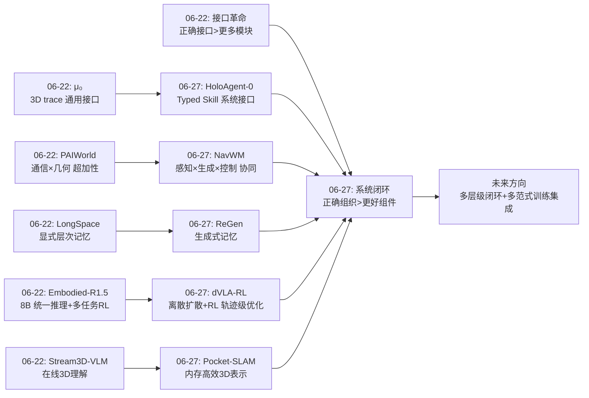
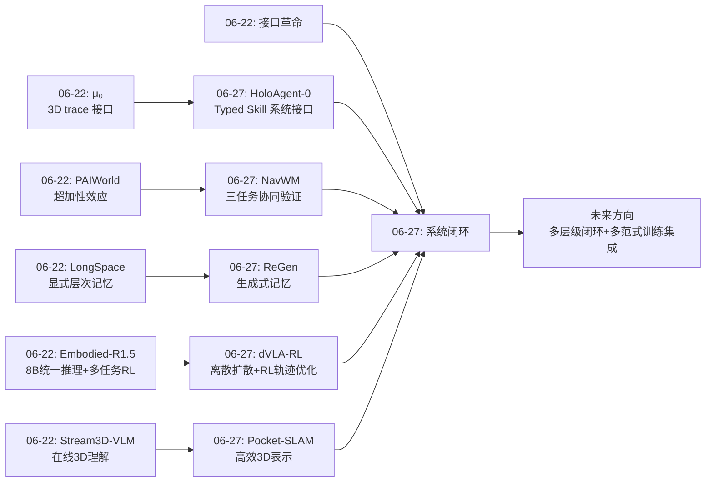
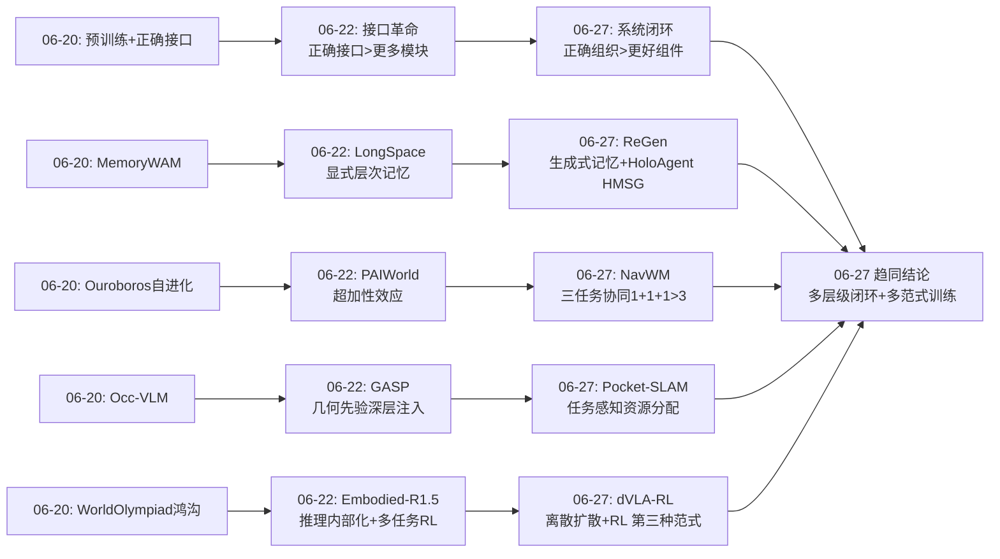
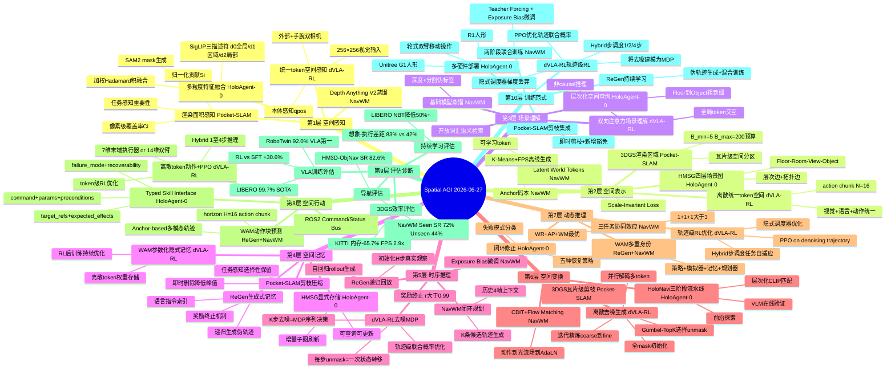
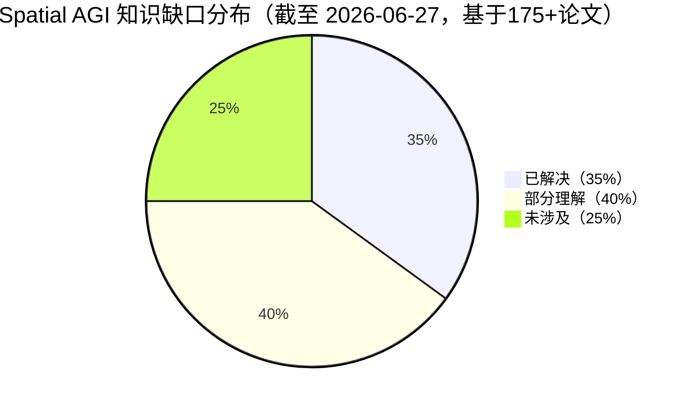

# 每日思考 - 2026-06-27

## 📅 每日总结

**日期**: 2026-06-27
**论文数量**: 5篇
**主题**: 从"接口革命"到"系统闭环"——Spatial AGI 的记忆、效率、协同与训练范式正在汇流

### 关键突破

- 🚀 **HoloAgent-0 将 LLM Agent 循环物理化**: 地平线机器人提出 Embodied AgentOS，通过 Typed Skill Interface 将物理技能"API化"，HMSG 四层场景图（Floor-Room-View-Object）提供多层次空间检索，在三种真实硬件上实现闭环物理执行。这是**系统级的闭环执行抽象**——将数字 Agent 的 ReAct 循环扩展到不可逆、不确定的物理世界。

- 🚀 **Pocket-SLAM 实现 60%+ 内存削减的 3DGS-SLAM**: 渲染区域感知剪枝从任务级渲染贡献的视角评估高斯重要性，瓦片级预算机制保证纹理密集/稀疏区域均衡。KITTI 上 65.7% 内存削减 + 2.9× FPS 提升，跟踪精度不退化。**删除时机与删除策略同等重要**。

- 🚀 **NavWM 证明感知-生成-控制三任务协同效应**: 1.5B 参数 Bidirectional Mamba 统一 Latent World Reasoning + Anchor-based 多模态轨迹预测 + 可控视觉生成。消融实验：三任务联合 ATE=0.254 vs 两任务 0.338，PSNR 17.622 vs 16.627——**1+1+1 > 3**。

- 🚀 **ReGen 实现 WAM 原生的持续学习**: 世界动作模型自身的视觉生成能力被用作"生成式记忆"，递归生成旧任务伪轨迹对抗灾难性遗忘，遗忘降低 50%+。**WAM 不仅是策略，更是自我记忆系统**——"想象即记忆"。

- 🚀 **dVLA-RL 首次解决离散扩散 VLA 的 RL 训练难题**: 通过轨迹级概率建模（Trajectory-Level Probability）将不可行的边缘动作概率转化为可处理的去噪路径联合概率，LIBERO 99.7% SOTA + RoboTwin 30.6% 绝对提升。**混合去噪步调度实现任务自适应计算分配**——简单任务1步、复杂任务4步。

### 📊 一句话总结

今天的五篇论文从系统架构（HoloAgent-0 的闭环执行）、空间效率（Pocket-SLAM 的内存剪枝）、世界模型协同（NavWM 的三任务统一）、持续学习（ReGen 的生成式回放）、训练范式（dVLA-RL 的离散扩散+RL）五个维度，共同指向：**Spatial AGI 正在从"组件突破"进入"系统闭环"阶段——不再是单个算法的进步，而是如何将感知、记忆、规划、执行、训练组织成持续运行、持续优化的闭环系统**。

### 🔗 延续性

**昨日(06-22)→今日(06-27)**: 昨天确立了"接口革命"——μ₀ 的 3D trace、PAIWorld 的跨视图通信、GASP 的几何先验注入、Stream3D-VLM 的流式控制各自找到了"正确接口"。今天将这一视角推进到系统层面：**正确的接口需要被组织在闭环系统中才能发挥效用，而闭环本身也需要正确的训练范式来驱动**。

- HoloAgent-0 的 Typed Skill Interface 是"接口革命"在系统层面的回响
- NavWM 的三任务协同为"超加性效应"提供了新维度验证
- ReGen 的生成式记忆为 LongSpace 的"记忆组织"提供了互补方案
- Pocket-SLAM 的内存效率为"表示优先级"提供了工程基础
- dVLA-RL 的轨迹级优化为"训练范式"开辟了离散扩散+RL 的第三条路径

**今日→明日**: 五篇论文各自解决了闭环系统的一个方面（架构、效率、协同、记忆、训练），但组件间的集成尚未探索。特别是 dVLA-RL 的离散扩散+RL 范式与 NavWM/ReGen 的 WAM 范式之间的关系——竞争还是互补？——是一个关键开放问题。

### 💡 本质思考：如何达成通用空间智能

#### 1. 核心能力的本质是什么？

今天揭示了一个深层规律：**Spatial AGI 的核心能力不是感知、规划或行动中的任何一项，而是"闭环"——持续的环境交互、信念更新和自我修正**。HoloAgent-0 的 AgentOS 是"闭环组织器"，NavWM 的世界模型是"闭环规划器"，ReGen 的 WAM 是"闭环学习器"，Pocket-SLAM 的剪枝是"闭环记忆管理器"，dVLA-RL 的轨迹级 RL 是"闭环优化器"。Spatial AGI 的本质不是任何单一能力的极致，而是**能力的组织方式和持续优化方式**。

#### 2. 当前方法与理想目标的差距在哪里？

**差距一：闭环的"环"太短**。当前闭环在单任务/轨迹/任务序列级别，但理想 Spatial AGI 需要在**生命级别**闭环——跨天、跨场景持续适应。ReGen 的递归退化暴露了长程闭环的瓶颈。

**差距二：记忆的"带宽"不对**。HoloAgent-0 显式存储（精确但庞大），ReGen 隐式生成（紧凑但有损），NavWM 隐式编码（高效但不可解释），dVLA-RL 离散token（统一但量化有损）。理想系统需要多种范式的融合。

**差距三：评估的"盲区"**。ReGen 想象成功率(83%) vs 实际执行成功率(42%) 的鸿沟暴露了根本问题——我们缺乏评估"真实世界空间能力"的可靠指标。dVLA-RL 仅在仿真中验证(99.7% LIBERO)，真实世界表现未知。

**差距四：训练范式的"碎片化"**。dVLA-RL 证明了离散扩散+RL 的可行性，但它与连续扩散(π₀)、自回归(OpenVLA)、WAM(NavWM/ReGen) 形成了四种竞争范式。理想 Spatial AGI 需要统一的训练框架。

#### 3. 从今天到理想状态，最可能的路径是什么？

**三阶段演进**：(1) 闭环系统集成（当前-2027中）：组合今天的五项突破为统一系统；(2) 长程闭环突破（2027中-2028）：解决递归退化，发展跨天/跨场景学习；(3) Spatial AGI 部署（2028+）：真实环境持续运行，多embodiment协作。

dVLA-RL 的轨迹级优化思路提供了一个关键方法论：**不要被不可计算的目标吓倒，寻找可处理的代理目标**。这可能启发 Spatial AGI 在面对"通用空间智能"这一宏大目标时的渐进式路径——找到每个阶段的"tractable surrogate"。

---

## 🔗 与昨日思考的联系

### 昨日重点（2026-06-22）
昨天聚焦"接口革命"——μ₀(3D trace)、PAIWorld(跨视图通信)、GASP(几何先验注入)、Embodied-R1.5(坐标推理)、Stream3D-VLM(流式控制)各自找到"正确接口"。核心转折点：接口标准化。三个核心发现：(1) 接口革命的到来；(2) 超加性效应的普遍性；(3) "推理内部化"范式成熟。

### 今日进展

1. **从组件接口到系统接口**: HoloAgent-0 的 Typed Skill Interface 是 μ₀ trace 接口在系统级的延伸——trace 是感知-行动之间的抽象，Typed Skill 是规划-执行之间的抽象
2. **从超加性到三任务协同**: NavWM 在世界模型中验证了感知×生成×控制的超加性（ATE 0.338→0.254），延续了 PAIWorld 通信×几何的发现
3. **从静态记忆到生成式记忆**: ReGen 提出了与 LongSpace 显式存储完全不同的范式——通过 WAM 生成能力"想象"过去
4. **从精度优先到效率优先**: Pocket-SLAM 代表实用性转向——60%+ 内存削减比精度提升更有部署价值
5. **从 SFT 到 RL 后训练**: dVLA-RL 证明了离散扩散 VLA 也能从 RL 中获益（+30.6%），与 Embodied-R1.5 的多任务 RL 形成呼应——**RL 后训练是解锁空间策略潜力的关键**
6. **从连续表示到离散统一**: dVLA-RL 将视觉+语言+动作统一到离散 token 空间，与 μ₀ 的 B-spline trace 和 Embodied-R1.5 的坐标推理符号形成"抽象层设计"的多维探索

### 演进路径

---

## 📚 论文概览

### 1. HoloAgent-0: A Unified Embodied Agent Framework with 3D Spatial Memory
- **机构**: Horizon Robotics (地平线机器人)
- **核心**: 三层耦合架构（AgentOS + 3D Spatial Memory + Embodied Skills），将 LLM Agent 数字执行循环物理化。Typed Skill Interface 将异构机器人能力"API化"，HMSG 四层场景图提供多层次空间检索。
- **关键数据**: HM3D-ObjNav SR 82.6%/SPL 42.8%; 真实机器人 Top-1@1.0m 97.70%; ScanNet mIoU 31.58
- **与 Spatial AGI**: 系统级视角——如何将空间理解、记忆、规划、执行组织成完整智能体

### 2. Pocket-SLAM: Rendering-Area-Aware Pruning for Memory-Efficient 3DGS-SLAM (ICRA 2026)
- **机构**: University of Minnesota + UNC Chapel Hill
- **核心**: 渲染区域感知剪枝 + 瓦片级预算机制，从任务级渲染贡献评估高斯重要性。即时删除 vs 延迟删除峰值内存差异巨大。
- **关键数据**: KITTI 内存削减 65.7%, FPS 2.9×; EuRoC 内存削减 61.3%, FPS 2.7×
- **与 Spatial AGI**: 大规模空间表示的内存效率——任务感知的重要性评估

### 3. NavWM: A Unified Navigation World Model (ECCV 2026)
- **机构**: 中科院自动化所 + 北航
- **核心**: 1.5B 参数 Bidirectional Mamba 统一三任务——Latent World Reasoning + Anchor-based 多模态轨迹 + CDiT 视觉生成。Anchor-based APD=1.49 vs Diffusion 0.59。
- **关键数据**: PSNR 17.340; Seen SR 72%, Unseen SR 44%; ATE 0.207
- **与 Spatial AGI**: 三任务协同效应量化验证——感知、生成、控制应联合训练

### 4. ReGen: WAM-Native Continual Imitation Learning
- **机构**: UNC Charlotte
- **核心**: 世界动作模型自身视觉生成能力作为生成式记忆，递归生成旧任务伪轨迹对抗遗忘。仅需语言指令作为记忆索引。
- **关键数据**: LIBERO 遗忘降低 50%+（NBT 82.6→26.1）; 想象成功率 83% vs 执行成功率 42%
- **与 Spatial AGI**: 生成式记忆范式——"想象即记忆"，WAM 是策略+记忆+模拟器

### 5. dVLA-RL: Reinforcement Learning over Denoising Trajectories for Discrete Diffusion VLA
- **机构**: 上海交通大学 + 清华深圳 + 百度智能云 + 地平线机器人 + 上海AI实验室
- **核心**: 首次将 RL 应用于原生离散扩散 VLA。轨迹级概率建模将不可行的边缘动作概率转化为可处理的去噪路径联合概率。混合去噪步调度根据任务难度自适应分配计算资源。
- **关键数据**: LIBERO 99.7% SOTA; RoboTwin 2.0 相对 SFT +30.6%（61.4%→92.0%）; VLA 方法中排名第一
- **与 Spatial AGI**: 为空间动作生成提供第三种范式（离散扩散+RL），证明 RL 后训练对离散扩散 VLA 同样有效

---

## 💡 核心见解

### 见解1: 闭环系统的核心不是"环"而是"修正能力"
**来源**: HoloAgent-0 + NavWM + ReGen + dVLA-RL

- ✅ HoloAgent-0 定义五种恢复策略（Continue/Retry/Clarify/Update Memory/Re-plan），由不同失败模式触发。关键不是不失败，而是知道如何从失败中恢复
- ✅ NavWM 通过"多元宇宙"评估选择最优路径——不是执行一条轨迹，而是生成 K 条 → 世界模型预见 → 评估选择
- ✅ ReGen 通过递归生成对抗遗忘，奖励终止机制在质量退化前止损
- ✅ dVLA-RL 通过 RL 后训练修正 SFT 策略的次优性——RoboTwin 上 30.6% 的提升本质上是"修正模仿学习的系统性偏差"

**对 Spatial AGI 的启发**:
闭环的价值在于**修正能力**。真正的 Spatial AGI 需要**多层级闭环修正**：
- 执行级：HoloAgent-0 式的技能失败恢复
- 规划级：NavWM 式的多候选评估选择
- 学习级：ReGen 式的生成式回放 + dVLA-RL 式的 RL 后训练
- 记忆级：Pocket-SLAM 式的表示剪枝（"遗忘"不重要信息）

dVLA-RL 的独特贡献在于揭示了**训练过程本身也需要闭环**——SFT 是开环的（一味模仿），RL 是闭环的（通过奖励信号持续修正）。30.6% 的提升证明，从开环训练到闭环训练的转变可以释放巨大的性能潜力。

### 见解2: 空间记忆的"存储-生成-离散化"三元性
**来源**: HoloAgent-0 (显式) + ReGen (生成) + NavWM (隐式) + dVLA-RL (离散)

| 范式 | 代表 | 优势 | 劣势 |
|------|------|------|------|
| 显式存储 | HoloAgent-0 HMSG | 精确、可查询 | 庞大 |
| 隐式编码 | NavWM Latent Tokens | 紧凑 | 不可解释 |
| 生成重建 | ReGen 递归回放 | 无需存储 | 有损退化 |
| 离散token | dVLA-RL 统一空间 | 语义可解释、跨模态统一 | 量化误差 |

**核心洞察**: Spatial AGI 的记忆/表示应该是多模态的——显式表示提供精确锚点，隐式编码提供高效推理，生成回放提供灵活回忆，剪枝机制控制增长，离散token提供跨模态统一接口。dVLA-RL 的贡献在于揭示了**离散化不仅是压缩手段，更是统一接口**——视觉、语言、动作在同一离散空间中可以自然交互。

### 见解3: "任务感知"是空间资源分配的通用原则
**来源**: Pocket-SLAM + NavWM + HoloAgent-0 + dVLA-RL

- ✅ Pocket-SLAM: 从渲染任务贡献评估高斯重要性，而非局部属性（不透明度/梯度）
- ✅ NavWM: 通过 Depth Anything V2 + SAM 生成任务相关伪标签，只蒸馏有价值的几何/语义信息
- ✅ HoloAgent-0: 粗到细目标接地——先 CLIP 几何修剪（快速），再 VLM 验证候选（慢速）
- ✅ dVLA-RL: Hybrid 去噪步调度——简单任务(SFT 85%) 分配 1 步，复杂任务(SFT 49%) 分配 4 步。**计算资源应匹配任务难度**

**对 Spatial AGI 的启发**:
空间表示的构建、维护和推理应由**下游任务驱动**。Spatial AGI 应根据当前目标动态决定：哪些区域精细表示（Pocket-SLAM 瓦片预算）、哪些信息蒸馏保留（NavWM Latent Tokens）、哪些候选精细验证（HoloAgent-0 粗到细）、多少计算步骤用于动作生成（dVLA-RL Hybrid 调度）。这与人类认知中的 System 1 / System 2 双系统高度一致——简单行为快速执行，复杂行为深度思考。

### 见解4: WAM 的"多重身份"——Spatial AGI 的核心构件
**来源**: ReGen + NavWM + dVLA-RL（对比）

- ✅ ReGen 证明 WAM 是**策略**（观察→动作）+ **记忆系统**（生成回放保留旧知识）
- ✅ NavWM 证明 WAM 是**模拟器**（视觉预见生成未来）+ **规划器**（多模态候选评估选择）
- ✅ dVLA-RL 从**反面**证明：不需要显式 WAM 也能达到竞争性能——纯 VLA + RL 在 RoboTwin 上达到 92.0%（vs WAM 方法 Fast-WAM 96.6%）

**对 Spatial AGI 的启发**:
dVLA-RL 与 WAM 方法的对比揭示了一个重要的张力：**WAM 提供了多重身份的统一（策略+模拟器+记忆+规划器），但增加了系统复杂性；VLA+RL 保持简洁，但缺少显式的"想象力"**。dVLA-RL 在 RoboTwin 上的 92.0%（VLA 第一）vs Fast-WAM 的 96.6% 暗示——WAM 的显式世界模型仍有优势，但 RL 后训练正在快速缩小差距。

Spatial AGI 的核心问题是：是否需要一个显式的世界模型？如果 VLA+RL 能达到 WAM 级别的性能，那么显式世界模型的额外价值在哪里？答案可能在于 ReGen 的"生成式记忆"——这是纯 VLA 无法实现的，因为它缺少视觉生成能力。

### 见解5: 空间智能的"效率-精度-泛化"三角困境
**来源**: 全部五篇

| 论文 | 优化维度 | 权衡维度 |
|------|---------|---------|
| Pocket-SLAM | 效率（内存-65%） | 精度基本保持 |
| NavWM | 精度（PSNR +22%） | 效率代价（1.5B, 8×A100训练） |
| HoloAgent-0 | 精度+泛化（多平台） | 效率代价（依赖cloud LLM） |
| ReGen | 泛化（持续学习） | 精度退化（递归PSNR↓） |
| dVLA-RL | 精度（+30.6% RL） | 效率代价（4步=728ms vs 1步=182ms） |

**关键发现**: 没有任何单一方法同时优化三个维度。Pocket-SLAM 最接近"免费午餐"（效率大幅提升，精度不退化），但它是静态场景方法。dVLA-RL 的 Hybrid 策略是一种聪明的折衷——通过任务自适应分配来在效率和精度之间动态平衡。真正的 Spatial AGI 需要在三个维度间动态权衡——根据当前任务需求和资源约束调整分配。

### 见解6: 语言作为空间记忆和空间行动的"通用索引"
**来源**: ReGen + HoloAgent-0 + dVLA-RL

- ✅ ReGen 仅用旧任务的语言指令（如"把胡萝卜放进碗里"）就能触发 WAM 的完整生成式回放——语言是记忆的唯一索引
- ✅ HoloAgent-0 的 AgentOS 解析自然语言指令为结构化空间查询（`{floor: "1", room: "bedroom", object: "bedside table"}`），在 HMSG 中层次化检索——语言是空间查询的入口
- ✅ NavWM 使用语言指令作为条件信号生成特定任务的未来视觉观察——语言是生成的控制信号
- ✅ dVLA-RL 将语言指令和视觉输入和动作输出统一到同一离散 token 空间——语言是跨模态的"通用货币"

**对 Spatial AGI 的启发**:
自然语言在 Spatial AGI 中有四重角色：(1) 交互界面（用户指令）；(2) 空间查询语言（结构化检索）；(3) 记忆索引（技能激活）；(4) 跨模态桥梁（统一 token 空间）。dVLA-RL 的统一 token 空间为这四重角色的形式化提供了基础——当语言、视觉和动作共享同一词汇表时，"说出来的就是可执行的、可回忆的、可推理的"不再只是一个愿景。

### 见解7: 统一架构的协同效应是世界模型的普遍规律
**来源**: NavWM + ReGen + HoloAgent-0 + dVLA-RL

- ✅ NavWM 三任务统一：ATE 0.513(仅推理) → 0.338(+动作) → 0.254(+世界模型)，PSNR N/A → 16.627 → 17.622。**每增加一个联合训练的任务，所有任务都受益**
- ✅ ReGen 的 WAM 同时预测动作和观察：联合建模使得 WAM 可以用观察生成来回放旧任务——如果只预测动作（标准 VLA），ReGen 不可能实现
- ✅ HoloAgent-0 的层次化集成：AgentOS + Memory + Skill 三层耦合，任何一层的功能都会被其他层利用
- ✅ dVLA-RL 的视觉-语言-动作统一 token 空间：统一表示使得 RL 优化可以无缝跨越模态边界。**统一不是为了简洁，而是为了协同**

**对 Spatial AGI 的启发**:
昨天 PAIWorld 证明了通信×几何的超加性效应（2.64 >> 1.65），今天 NavWM 在更广义的层面证明了感知×生成×控制的超加性。dVLA-RL 从训练角度提供了互补证据——当视觉、语言和动作在同一空间中被联合优化时，RL 的增益（30.6%）远超单独优化动作策略的预期。**统一架构的协同效应不是偶发现象，而是世界模型的普遍规律**——因为感知、生成和控制本质上都依赖于对同一物理世界的理解，共享这种理解必然比各自独立学习更高效。

### 见解8: 三种 VLA 动作生成范式的竞争与融合
**来源**: dVLA-RL（对比分析）

dVLA-RL 的出现使三种 VLA 架构都有了各自的 RL 训练方法：

| 范式 | 代表 | RL 方法 | 核心优势 | 核心劣势 |
|------|------|---------|---------|---------|
| 连续扩散 | π₀/π₀.₅ | FlowGRPO | 精细控制、无量化误差 | 连续概率密度估计困难 |
| 自回归 | OpenVLA | SimpleVLA-RL | LLM生态兼容、训练成熟 | 逐token慢、无双向注意力 |
| 离散扩散 | dVLA | **dVLA-RL** | 统一token、并行解码、迭代精炼 | 量化误差、多步推理延迟 |

**关键发现——Hybrid 是未来方向**:
dVLA-RL 的 Hybrid 步调度（1-4步）暗示了一个更深层的设计原则：**不同任务需要不同范式的优势**。简单任务需要自回归的快速单步推理（→1步离散扩散近似自回归），复杂任务需要连续扩散的精细控制（→多步精炼）。未来的 Spatial AGI 系统可能需要一个"范式路由器"——根据任务复杂度选择不同的动作生成策略。

### 见解9: 轨迹级优化——"优化你执行的"作为通用设计原则
**来源**: dVLA-RL + NavWM + HoloAgent-0

- ✅ dVLA-RL: 不优化不可行的边缘概率，而是优化实际去噪路径的联合概率——**"优化你执行的"**
- ✅ NavWM: 不优化单条最优轨迹，而是生成 K 条候选 → 世界模型预见 → 评估选择——**"执行你在多元宇宙中评估的最优路径"**
- ✅ HoloAgent-0: 不预先规划完整方案，而是 observe→retrieve→act→monitor→revise 的迭代循环——**"规划你执行的，执行你监控的"**

**对 Spatial AGI 的启发**:
dVLA-RL 的"tractability-driven"设计哲学——面对不可计算的目标，寻找可计算的代理目标——对 Spatial AGI 具有普遍意义。"通用空间智能"本身是一个不可计算的终极目标，但可以分解为一系列可处理的代理目标：(1) 下一步动作的质量（RL 优化）; (2) 下一个视图的预见（世界模型）; (3) 下一次交互的恢复（闭环执行）。这种"渐进式可处理性"可能是通向 Spatial AGI 的实际路径。

---

## 🗺️ 知识演进图

### 核心见解演进图

---

## 技术栈演进对比表

| 层次 | 昨日方案(06-22) | 今日方案(06-27) | 变化与趋势 |
|------|---------|---------|------|
| **L1 空间感知** | GASP(correspondence深层注入) + StreamVGGT | HoloAgent-0(SAM2+SigLIP三描述符融合) + Pocket-SLAM(渲染面积感知) + dVLA-RL(256×256视觉+本体感知) | 从几何先验注入到多粒度特征融合；新增任务感知的空间重要性评估；新增统一token空间的感知建模 |
| **L2 空间表示** | B-spline控点 + Geo-RoPE + correspondence embedding | HMSG(Floor-Room-View-Object四层) + 3DGS渲染区域感知 + Latent World Tokens + 离散统一token空间(dVLA-RL) | 新增层次化场景图；新增渲染面积度量；**新增离散token作为跨模态统一表示** |
| **L3 场景理解** | Embodied-R1.5(统一推理) + GASP(correspondence>70%) | HoloAgent-0(HMSG层次化查询) + NavWM(深度+语义联合蒸馏) | 从单模型统一到系统级场景理解；基础模型蒸馏成为新范式 |
| **L4 空间记忆** | GAVC动态voxel压缩 + Memory FIFO | HoloAgent-0 HMSG(显式可查询) + ReGen(生成式回放) + Pocket-SLAM(剪枝压缩) + dVLA-RL(隐式参数记忆) | 四种记忆范式并存：显式/生成/剪枝/隐式参数；记忆"存储-生成-离散化"三元性 |
| **L5 时序推理** | Autoregressive streaming + Event-centric captioning | NavWM(历史4帧+预测4步) + ReGen(递归生成T_max步) + dVLA-RL(K步去噪MDP) | 新增闭环规划时序；新增递归生成时序；**新增去噪MDP作为时序推理新形式** |
| **L6 空间变换** | 3D trace Flow Matching + 多视图协同生成 | HoloNavi三阶段 + NavWM CDiT+光流场 + dVLA-RL(离散去噪生成) | 从轨迹级变换到系统级导航流水线；新增光流场桥梁；**新增离散token去噪作为空间动作变换** |
| **L7 动态推理** | 超加性协同 + Trace多模态预测 | NavWM三任务协同(1+1+1>3) + ReGen生成式回放 + HoloAgent闭环修正 + dVLA-RL轨迹级RL优化 | 协同效应从两组件扩展到三任务；**闭环修正扩展到训练过程本身（RL修正SFT）** |
| **L8 空间行动** | Trace→Action Expert + DiT-B动作头 | HoloAgent-0 Typed Skill Interface + ReGen WAM(动作+观察联合) + dVLA-RL(离散token动作+PPO优化) | 新增"API化"范式；新增WAM多身份；**新增离散扩散动作+RL后训练范式** |
| **L9 评估诊断** | Stream3D-Bench + EmbodiedEvalKit + WorldArena | HM3D-ObjNav + ScanNet + LIBERO + RoboTwin + 想象-执行差距 | 新增持续学习指标(NBT/FWT/AUC)；新增想象-执行鸿沟量化；**新增RL vs SFT对比量化(+30.6%)** |
| **L10 训练范式** | 无动作标签预训练 + 15B token+多任务RL + 训练时注入推理时移除 | 两阶段联合训练 + ReGen递归回放 + 即时剪枝 + **dVLA-RL轨迹级RL(PPO on denoising trajectory)** | 新增Exposure Bias微调；新增递归回放；**新增离散扩散VLA的RL后训练——第三种VLA训练范式** |

---

## 🗺️ Spatial AGI 知识图谱

### 10层架构思维导图

### 🎯 主线技术路径

#### 阶段1: 空间记忆架构标准化（快速推进中 60%）
- **核心问题**: 如何构建可查询、可更新、可压缩的多层次空间记忆？
- **当前最佳方案**: HoloAgent-0 HMSG（Floor-Room-View-Object 四层）+ Pocket-SLAM 渲染面积感知剪枝 + ReGen 生成式回放
- **三种范式融合**:
  - 显式存储（HMSG）：精确、可查询、持久——作为空间锚点
  - 剪枝压缩（Pocket-SLAM）：任务感知、区域均衡——控制增长
  - 生成回放（ReGen）：灵活、语言索引——保留技能记忆
  - 离散参数化（dVLA-RL）：统一、可优化——跨模态共享
- **关键突破**: HoloAgent-0 在三种真实硬件上验证 HMSG 的实用性；Pocket-SLAM 实现 60%+ 内存削减；dVLA-RL 证明离散token空间可承载多模态记忆
- **剩余挑战**: 四种范式的融合机制；长程运行中记忆漂移；语义感知的剪枝策略
- **预计成熟**: 2027 年初

#### 阶段2: WAM 与 VLA 的竞争与融合（突破性进展 55%）
- **核心问题**: 世界动作模型还是 VLA+RL？哪种范式更适合 Spatial AGI？
- **当前格局**:
  - WAM 路线（NavWM + ReGen）：显式世界模型，多重身份（策略+模拟器+记忆+规划器），三任务协同效应
  - VLA+RL 路线（dVLA-RL + Embodied-R1.5）：无显式世界模型，更简洁，RL 后训练大幅提升性能
  - **对比**: dVLA-RL RoboTwin 92.0% vs Fast-WAM 96.6%——WAM 仍有优势，但差距在缩小
- **关键挑战**: WAM 的想象-执行鸿沟（83% vs 42%）；VLA+RL 缺少视觉预见能力
- **预计成熟**: 2027 年中

#### 阶段3: 闭环执行系统集成（稳步推进中 50%）
- **核心问题**: 如何将感知、记忆、规划和执行组织成持续运行的闭环系统？
- **当前最佳方案**: HoloAgent-0 的 AgentOS 三层耦合架构
  - AgentOS（推理+规划）+ Memory（HMSG+时间记忆）+ Skill（Typed Interface）
  - 五种恢复策略处理物理不确定性
  - ROS2 Command/Status Bus 保持模块化
- **关键挑战**: 定量评估仅覆盖导航和映射，操作和协调仅定性演示；LLM 依赖的隐藏成本；安全保证不明确
- **竞争方案**: 端到端 VLA（π0.5 等）——更简单但缺乏可解释的闭环
- **预计成熟**: 2027 年中

#### 阶段4: VLA 训练范式统一（快速推进中 45%）
- **核心问题**: 连续扩散、自回归、离散扩散——三种 VLA 动作生成范式能否统一？
- **当前进展**: dVLA-RL 为离散扩散补齐了 RL 训练方法，使三种范式都有了各自的 RL 路径
  - 连续扩散: FlowGRPO, Flow Q-Learning
  - 自回归: SimpleVLA-RL, VLA-RL
  - 离散扩散: **dVLA-RL（本文）**
- **关键发现**: dVLA-RL 的 Hybrid 步调度暗示不同任务可能需要不同范式的优势
- **预计成熟**: 2027 年底

#### 阶段5: Spatial AGI 系统集成与部署（展望中 10%）
- **核心问题**: 如何在真实环境中实现天/周级别持续运行的 Spatial AGI？
- **愿景**: 多 embodiment 协作、安全保证、人类可理解的决策过程、持续学习
- **预计成熟**: 2028+

---

## 🔍 待探索议题

### 🔴 高优先级（本周）

1. **HMSG × WAM 的融合——显式记忆遇见生成式记忆**
   - 问题: HoloAgent-0 的 HMSG 提供精确的显式空间记忆，ReGen 的 WAM 提供灵活的生成式记忆。两者能否融合？WAM 能否用 HMSG 作为"外部记忆缓存"提升生成质量？HMSG 能否用 WAM 的生成能力填充未探索区域？
   - 候选方案: 双层记忆架构——HMSG 作为 L1 缓存（精确查询），WAM 生成作为 L2 缓存（灵活推理）
   - 缺口: 两种表示的接口设计；一致性维护；计算预算分配

2. **NavWM 三任务协同 × HoloAgent-0 闭环执行的超加性**
   - 问题: NavWM 证明了感知×生成×控制的协同效应，HoloAgent-0 证明了闭环执行的有效性。将 NavWM 作为 HoloAgent-0 的技能后端，是否能产生跨组件的超加性效应？
   - 候选方案: NavWM 世界模型作为 HoloAgent-0 的 "visual foresight" 技能
   - 缺口: NavWM 预测视野仅4步；推理延迟

3. **dVLA-RL × WAM 的竞争分析——VLA+RL 何时替代 WAM？**
   - 问题: dVLA-RL 在 RoboTwin 上达到 92.0%（VLA 第一），接近 Fast-WAM 的 96.6%。在什么条件下 VLA+RL 可以完全替代 WAM？什么条件下 WAM 不可替代？
   - 候选方案: 分析任务维度——(1) 需要视觉预见的任务（WAM 必要）; (2) 仅需动作精度的任务（VLA+RL 足够）; (3) 需要生成式记忆的任务（WAM 必要）
   - 缺口: 缺乏控制变量的 WAM vs VLA+RL 对比实验；任务维度的形式化分类

4. **ReGen 递归退化 × Pocket-SLAM 剪枝的"遗忘机制"对比**
   - 问题: ReGen 通过生成式回放"记忆"旧任务，Pocket-SLAM 通过剪枝"遗忘"不重要的空间信息。能否设计统一的"空间记忆生命周期"理论？
   - 候选方案: 三阶段记忆管理——(1) 新信息精确存储; (2) 基于重要性剪枝压缩; (3) 过期信息通过生成回放
   - 缺口: 重要性评估的统一标准；阶段转换触发机制

5. **dVLA-RL 轨迹级 RL × Embodied-R1.5 多任务 RL 的对比**
   - 问题: dVLA-RL 的轨迹级 PPO 和 Embodied-R1.5 的 batch 级 σ 归一化多任务 RL 分别解决了不同的 RL 挑战。两者能否组合——用轨迹级目标 + batch σ 归一化训练统一的空间智能模型？
   - 候选方案: 在 Embodied-R1.5 的多任务框架中，将动作生成替换为离散扩散 + 轨迹级 RL
   - 缺口: 两种 RL 框架的兼容性；计算开销叠加

### 🟡 中优先级（本月）

6. **dVLA-RL 离散 token 空间 × μ₀ 3D trace 的统一**
   - 问题: dVLA-RL 将视觉+语言+动作统一到离散 token，μ₀ 将运动路径表示为 B-spline trace。能否将 trace 也编码为离散 token，在 dVLA 的统一空间中进行轨迹级 RL 优化？
   - 候选方案: B-spline 控制点量化 → 离散 token → 在 dVLA 框架中联合优化感知、规划、运动
   - 缺口: B-spline 量化误差对运动精度的影响；trace token 的词汇表设计

7. **Pocket-SLAM 语义感知剪枝**
   - 问题: 当前剪枝仅基于渲染面积（几何），不理解场景语义。能否引入语义感知的剪枝策略？
   - 候选方案: 结合语义分割（SAM/SigLIP），对不同类别区域使用不同剪枝阈值
   - 缺口: 实时语义分割的延迟；语义标签的可靠性

8. **NavWM Latent World Tokens × GASP Correspondence 先验**
   - 问题: NavWM 通过深度+语义蒸馏学习 Latent World Tokens，GASP 通过 correspondence+depth 先验塑造 VLM 内部表示。两者能否协同？
   - 候选方案: GASP 增强的 VLM backbone → NavWM 的 Latent World Tokens 吸收更准确的几何先验
   - 缺口: 基座模型不同；训练数据和技术栈不同

9. **HoloAgent-0 的 "View Layer" × dVLA-RL 的双向注意力**
   - 问题: HoloAgent-0 的 View 层桥接几何记忆和视觉推理，dVLA-RL 的离散扩散使用双向注意力（所有 token 全局可见）。View 层的设计能否启发 dVLA-RL 的空间注意力机制？
   - 候选方案: 在 dVLA-RL 的去噪过程中引入 View-aware attention——不同视角的 token 通过空间位置关系加权
   - 缺口: View 的形式化定义；与 Gumbel-TopK 调度器的兼容性

### 🟢 低优先级（长期）

10. **想象-执行鸿沟的消除——dVLA-RL 视角**
    - 问题: ReGen 发现想象成功率(83%) vs 执行成功率(42%)的 41pp 鸿沟。dVLA-RL 作为非 WAM 方法，是否天然回避了这个问题（因为它不"想象"）？还是说它只是把问题转移到了"离散token→连续动作"的映射上？
    - 候选方案: 分析 dVLA-RL 的 token 量化误差与想象-执行鸿沟的关系——如果量化误差可控，是否意味着 VLA+RL 范式天然更可靠？
    - 缺口: 需要在相同任务上对比 dVLA-RL 和 ReGen 的"预期-实际"差距

11. **三种 VLA 范式的统一理论框架**
    - 问题: 连续扩散、自回归、离散扩散三种 VLA 范式各有优劣。能否建立一个统一理论框架，将三者视为特例，并推导出最优的混合策略？
    - 候选方案: 基于生成模型的概率论框架——三种范式对应不同的概率因子化方式，统一框架在不同任务条件下选择最优因子化
    - 缺口: 理论框架的建立；跨范式的实验验证

12. **多embodiment空间记忆共享协议**
    - 问题: HoloAgent-0 通过共享 HMSG 实现跨embodiment协作。dVLA-RL 的统一 token 空间能否作为多embodiment通信的"通用语言"？
    - 候选方案: 不同机器人的感知和动作都编码到同一离散 token 空间，通过 token 级通信实现协作
    - 缺口: 不同embodiment的token词汇表兼容性；跨平台语义一致性

13. **Spatial AGI 的"编译器"——从离散token到多平台动作的自动翻译**
    - 问题: dVLA-RL 证明了离散token可以作为动作的统一表示，μ₀ 证明了 trace 可以作为embodiment-agnostic接口。能否构建"机器人编译器"——离散token + 平台规格 → 自动生成该平台的动作执行器？
    - 候选方案: dVLA-RL 的统一token作为"中间语言"，不同机器人的后端作为"编译器后端"
    - 缺口: 多平台验证；token到连续动作的精确映射

---

## 📊 知识缺口分析

**已解决（35%）**:
- ✅ 3D 空间感知：多粒度特征融合、几何先验注入、渲染面积评估
- ✅ 空间表示：层次化场景图、3DGS表示与剪枝、B-spline轨迹、Latent World Tokens、离散统一token
- ✅ 场景理解：开放词汇检索、基础模型蒸馏、层次化空间查询
- ✅ 导航规划：层次化匹配+VLM验证+前沿探索、多模态轨迹预测
- ✅ 闭环执行架构：AgentOS三层耦合、Typed Skill Interface、五种恢复策略
- ✅ 空间效率：任务感知剪枝、即时删除策略、瓦片级预算均衡
- ✅ WAM 训练：三任务联合训练、Exposure Bias微调、Flow Matching高效采样
- ✅ **VLA 训练范式：三种动作生成范式（连续扩散/自回归/离散扩散）均有 RL 训练方法**

**部分理解（40%）**:
- ⚠️ 空间记忆融合：HMSG显式 + ReGen生成 + Pocket-SLAM剪枝 + dVLA离散参数 的融合机制未明
- ⚠️ 持续学习长程稳定性：ReGen的递归退化在5+任务序列中的表现未知
- ⚠️ 想象-执行鸿沟：41pp差距的根源（视觉-动作对齐问题）尚未解决
- ⚠️ WAM vs VLA+RL 的适用边界：两种范式各自的优劣势边界不清晰
- ⚠️ 多embodiment协调：HoloAgent-0仅演示简单场景，复杂协作未验证
- ⚠️ 动态场景适应：所有方法基本假设静态场景
- ⚠️ 零样本泛化：NavWM 44%成功率虽领先但不够可靠；dVLA-RL 仅仿真验证
- ⚠️ 实时性：dVLA-RL 4步推理728ms；NavWM未报告FPS；HoloAgent依赖cloud LLM
- ⚠️ Sim-to-Real：dVLA-RL 完全缺乏真实世界验证

**未涉及（25%）**:
- ❌ 跨模态空间推理：将语言推理链 + 空间记忆 + 视觉预见统一在闭环中
- ❌ 长程空间记忆：天/周级别的记忆持久性和一致性维护
- ❌ 安全保证：形式化的安全约束和实时安全响应
- ❌ Spatial AGI 评估基准：缺乏评估"真实世界空间智能"的统一基准
- ❌ 多agent空间记忆协议：不同智能体间的空间知识共享标准
- ❌ 空间因果推理：不仅预测"会发生什么"，还理解"为什么"
- ❌ 主动探索策略：从被动接收数据到主动选择探索方向
- ❌ 三种VLA范式的统一理论框架

---

## 📊 核心数据速查表

### 导航性能对比

| 方法 | HM3D SR(%) | HM3D SPL(%) | 真实 Top-1@1m(%) |
|------|-----------|------------|-------------------|
| OK-Robot | - | - | 60.92 |
| VLFM | 62.6 | 31.0 | - |
| FSR-VLN | 80.8 | 41.0 | 91.95 |
| **HoloAgent-Nav** | **82.6** | **42.8** | **97.70** |
| NavWM Seen | - | - | 72 (SR) |
| NavWM Unseen | - | - | 44 (SR) |

### 3DGS-SLAM 效率对比

| 方法 | KITTI内存削减 | KITTI FPS提升 | 跟踪成功率 |
|------|-------------|-------------|-----------|
| LightGaussian | - | - | 多序列丢失 |
| MaskGaussian | ~30% | ~1.3× | 100% |
| **Pocket-SLAM** | **65.7%** | **2.9×** | **100%** |

### 持续学习性能

| 方法 | Object NBT↓ | Goal NBT↓ | Spatial NBT↓ |
|------|------------|----------|-------------|
| Seq-FT | 82.6 | 100 | 99.8 |
| ER (上界) | 4.8 | 7.2 | -0.2 |
| **ReGen** | **26.1** | **44.9** | **17.6** |

### VLA 训练性能对比 (LIBERO + RoboTwin)

| 方法 | LIBERO 平均(%) | RoboTwin 平均(%) | 训练范式 |
|------|---------------|-----------------|---------|
| OpenVLA | 76.5 | - | 自回归 SFT |
| π₀ | 94.2 | 52.1 | 连续扩散 SFT |
| π₀.₅ | 96.9 | 74.9 | 连续扩散 SFT |
| OpenVLA-OFT | 97.1 | 34.2 | 连续扩散 SFT |
| SimpleVLA-RL | 99.1 | 68.7 | 自回归 RL |
| MM-ACT* (SFT) | 88.1 | 61.4 | 离散扩散 SFT |
| **dVLA-RL** | **99.7** | **92.0** | **离散扩散 RL** |
| Motus (WAM) | - | 84.6 | WAM |
| Fast-WAM | - | 96.6 | WAM |

### dVLA-RL Hybrid 策略效率

| 设置 | 训练时间(s) | 推理延迟(ms) | FLOPs(G) |
|------|------------|-------------|----------|
| 1-Step | 259 | 182 | 17,548 |
| 2-Step | 452 | 364 | 35,096 |
| 4-Step | 846 | 729 | 70,191 |
| **Hybrid** | **608** | **387** | **37,289** |

---

## 🔬 论文间深度对比分析

### 对比1: 空间记忆范式——四种范式并存

| 维度 | HoloAgent-0 HMSG | ReGen 生成式 | NavWM Latent | dVLA-RL 参数化 |
|------|------------------|-------------|--------------|---------------|
| **记忆类型** | 显式、符号化 | 隐式、生成式 | 隐式、参数化 | 隐式、离散化 |
| **存储介质** | 3D点云+场景图 | WAM模型权重 | Mamba状态空间 | 离散token权重 |
| **查询方式** | 层次化结构查询 | 语言指令触发 | 前向传播自动 | 前向传播去噪 |
| **精度** | 高 | 有损(生成退化) | 中等 | 有损(量化) |
| **容量** | 随空间增长 | 固定(参数量) | 固定(token数) | 固定(参数量) |
| **适用范围** | 长期环境地图 | 技能/任务记忆 | 在线场景理解 | 动作策略记忆 |

**关键发现**: 四种记忆范式不是竞争关系，而是互补关系。HoloAgent-0 回答"环境是什么样的"，ReGen 回答"我以前学过什么技能"，NavWM 回答"当前场景有什么结构"，dVLA-RL 回答"我如何执行空间动作"。一个完整的 Spatial AGI 系统需要全部四种。

### 对比2: 三种 VLA 动作生成范式的 RL 训练

| 维度 | 连续扩散 (π₀/FlowGRPO) | 自回归 (OpenVLA/SimpleVLA-RL) | 离散扩散 (dVLA/dVLA-RL) |
|------|----------------------|-------------------------------|------------------------|
| **动作空间** | 连续 | 离散token序列 | 离散token序列 |
| **RL挑战** | 连续概率密度估计 | 无（直接可计算） | 边缘概率不可计算 |
| **RL解法** | Score matching + SDE辅助 | 直接policy gradient | **轨迹级概率分解** |
| **推理方式** | ODE求解 | 逐token生成 | 并行解码+迭代精炼 |
| **token交互** | N/A（连续） | 严格causal | 全局双向 |
| **统一表示** | 困难 | 部分 | **完全统一** |
| **推理效率** | 中等 | 较低 | 较高(并行) |
| **量化误差** | 无 | 有 | 有 |
| **LIBERO最高** | 97.1% (OFT) | 99.1% (SimpleVLA-RL) | **99.7% (dVLA-RL)** |

**关键发现**: 离散扩散 VLA 在 LIBERO 上达到最高 99.7%，且通过 Hybrid 步调度实现了效率-精度的自适应平衡。但其 RoboTwin 92.0% 仍低于 Fast-WAM 96.6%，说明 WAM 的显式世界模型在复杂任务上仍有优势。

### 对比3: 闭环系统设计——四种闭环

| 维度 | HoloAgent-0 | NavWM | ReGen | dVLA-RL |
|------|------------|-------|-------|---------|
| **闭环范围** | 单任务执行 | 轨迹选择 | 任务序列学习 | 策略优化 |
| **时间尺度** | 秒-分钟 | 毫秒-秒 | 小时-天 | 训练时(离线) |
| **反馈来源** | 技能状态流 | 视觉预见 | 奖励预测 | 环境奖励 |
| **修正能力** | 五种恢复策略 | K候选评估 | 递归回放 | PPO梯度更新 |
| **错误检测** | 验证后置条件 | 未来观察匹配 | PSNR监控 | 优势函数 |

**系统级洞察**: 当前每种闭环只在单一时间尺度运行。真正的 Spatial AGI 需要嵌套闭环——执行级闭环（毫秒）嵌入规划级闭环（秒），再嵌入学习级闭环（小时），再嵌入记忆级闭环（天）。dVLA-RL 的贡献在于将闭环思想推广到了**训练过程本身**——训练不是一次性的开环优化，而是通过 RL 持续修正的闭环过程。

### 对比4: "想象"能力的价值与代价

| 维度 | ReGen (WAM想象) | NavWM (世界模型预见) | dVLA-RL (无显式想象) |
|------|-----------------|---------------------|---------------------|
| **想象能力** | ✅ 递归生成过去 | ✅ 生成未来视觉 | ❌ 仅生成动作 |
| **想象用途** | 记忆回放(对抗遗忘) | 轨迹评估(辅助规划) | N/A |
| **想象代价** | 递归退化(PSNR↓) | 计算开销(K条候选) | N/A |
| **想象-执行鸿沟** | 83% vs 42% | 未量化 | 不适用 |
| **记忆功能** | ✅ 生成式记忆 | ❌ 无跨任务记忆 | ❌ 无跨任务记忆 |
| **规划功能** | ❌ 无前瞻规划 | ✅ 多候选评估 | ❌ 无前瞻规划 |

**关键发现**: "想象"能力（视觉生成）是 WAM 相对于纯 VLA 的核心差异化优势。dVLA-RL 虽然在动作性能上接近 WAM（92.0% vs 96.6%），但缺少想象能力意味着它无法实现 ReGen 式的生成式记忆，也无法实现 NavWM 式的视觉预见规划。**想象能力可能是 Spatial AGI 的必要条件**。

---

## 📐 dVLA-RL 的独特贡献与 Spatial AGI 训练范式

### 第三条路径的开启

在 dVLA-RL 之前，VLA 的 RL 训练只有两条路径：
1. **自回归 VLA + RL**: 直接对 token 序列应用 policy gradient（SimpleVLA-RL）
2. **连续扩散 VLA + RL**: 通过 SDE/score matching 近似概率（FlowGRPO）

dVLA-RL 开辟了第三条路径：
3. **离散扩散 VLA + RL**: 将去噪过程建模为 MDP，对轨迹联合概率应用 PPO

这三条路径的本质区别在于**如何定义"策略概率"**——即给定状态，生成某个动作的概率是多少：
- 自回归：π(a|s) = ∏ π(aᵢ|a₁,...,aᵢ₋₁, s) — 天然可计算
- 连续扩散：π(a|s) = ∫ p(z₀→z₁→...→a) dz — 需要 SDE 近似
- 离散扩散：π(a|s) = Σ_{paths} p(path) — **不可计算**，dVLA-RL 用 π(τ|s) = ∏ p(step) 替代

### 轨迹级优化的深远意义

dVLA-RL 的"换问题"策略——不计算不可行的边缘概率，而是优化可行的轨迹联合概率——具有超越 VLA 领域的深远意义：

1. **通用的 intractability 解法**: 任何具有多步生成过程的模型（如 discrete diffusion for image/video generation）都可以应用类似的轨迹级 RL
2. **"优化你执行的"原则**: 与 NavWM 的"执行你评估的"和 HoloAgent 的"监控你执行的"形成呼应——Spatial AGI 的每个层面都应遵循"一致性原则"
3. **Tractability-driven 设计**: 面对不可计算的目标，寻找可处理的代理目标是实际工程中的通用智慧

### 混合步调度的系统级启发

dVLA-RL 的 Hybrid 步调度（简单任务1步、复杂任务4步）虽然是一个具体的工程设计，但它暗示了一个系统级的设计原则：**Spatial AGI 需要一个"计算控制器"**——一个元级策略，根据任务复杂度动态分配计算资源。

这与人类认知的 System 1 / System 2 双系统高度一致：
- System 1（快速、直觉）：简单任务 → 1步去噪（近似自回归）
- System 2（慢速、深思）：复杂任务 → 4步去噪（迭代精炼）

未来的 Spatial AGI 系统可能需要更细粒度的计算控制——不仅在去噪步数上，还在模型深度、注意力范围、记忆检索深度等多个维度上动态调整。

---

## 📐 Flow Matching vs Discrete Diffusion——Spatial AGI 的"表示之争"

今天的五篇论文进一步丰富了 Spatial AGI 中"生成方法"的版图：

| 生成方法 | 论文 | 应用 | 优势 | 劣势 |
|---------|------|------|------|------|
| Flow Matching (连续) | NavWM | 视觉生成 + 动作预测 | 平滑、多模态 | 需要 ODE 求解 |
| Flow Matching (连续) | ReGen | 动作+观察生成 | 联合建模 | 计算昂贵 |
| Discrete Diffusion | dVLA-RL | 动作生成 | 统一token、并行解码 | 量化误差 |
| 3DGS Rendering | Pocket-SLAM | 空间表示 | 高保真 | 内存密集 |
| HMSG Graph | HoloAgent-0 | 空间记忆 | 精确可查询 | 离散化信息损失 |

**关键发现**: Flow Matching 和 Discrete Diffusion 不是简单的竞争关系，而是互补关系。Flow Matching 在需要连续精度的场景（如视觉生成、轨迹预测）中更优；Discrete Diffusion 在需要统一表示和快速推理的场景（如多模态融合、简单动作生成）中更优。未来的 Spatial AGI 可能需要两者的混合——用离散扩散做高层规划和多模态融合，用 Flow Matching 做低层精细控制。

---

## 📐 反直觉发现汇总

| 序号 | 反直觉发现 | 来源 | 传统直觉 | 实际结果 |
|------|-----------|------|---------|---------|
| 1 | 3D traces 可替代动作标签 | μ₀ (06-22) | 需要action label | 无标注视频即可 |
| 2 | 通信×几何的超加性效应 | PAIWorld (06-22) | 组件独立贡献 | 2.64 >> 1.65 |
| 3 | 8B超越万亿级模型 | Embodied-R1.5 (06-22) | 规模=能力 | 推理内部化>规模 |
| 4 | WAM可作生成式记忆 | ReGen | 记忆需要存储 | 想象即记忆 |
| 5 | 60%+内存削减零精度损失 | Pocket-SLAM | 压缩有代价 | 删除时机=关键 |
| 6 | 三任务统一>单任务最优 | NavWM | 专业化更优 | 1+1+1>3 |
| 7 | 离散扩散VLA也能RL | dVLA-RL | 边缘概率不可计算 | 轨迹级替代 |
| 8 | RL后训练带来30%+提升 | dVLA-RL | SFT接近上限 | RL大幅解锁潜力 |
| 9 | 混合步调度优于固定步 | dVLA-RL | 统一推理深度 | 任务自适应最优 |
| 10 | 想象83%vs执行42% | ReGen | 生成=现实 | 鸿沟41pp |

---

## 📐 从"论文驱动"到"系统驱动"的更强信号

### 今天的新信号

**信号1: VLA 训练范式版图完整**
dVLA-RL 补齐了三种 VLA 动作生成范式的 RL 训练方法。这意味着 Spatial AGI 的"行动层"训练技术基础已经完备。下一步不再是"能否训练"，而是"如何选择和组合"。

**信号2: 系统级闭环的多层次化**
HoloAgent-0（执行闭环）+ NavWM（规划闭环）+ ReGen（学习闭环）+ Pocket-SLAM（记忆闭环）+ dVLA-RL（训练闭环）——五个层面的闭环已经被独立验证。系统集成的技术基础就绪。

**信号3: WAM vs VLA 的张力**
dVLA-RL（VLA+RL, 92.0%）vs Fast-WAM（WAM, 96.6%）的对比表明：WAM 的显式世界模型仍有优势，但 VLA+RL 正在快速缩小差距。这种竞争将推动两方面的进步。

**信号4: 离散统一表示的实践验证**
dVLA-RL 将视觉+语言+动作统一到离散 token 空间并在 LIBERO 上达到 99.7%——这是统一表示的强有力实践验证。结合 HoloAgent-0 的 HMSG 和 μ₀ 的 trace，Spatial AGI 有了多种可行的表示方案。

**信号5: "优化你执行的"原则普及**
dVLA-RL（优化轨迹概率）、NavWM（评估候选再执行）、HoloAgent（监控执行后修正）——三个独立工作都遵循"优化/评估/监控与执行一致"的原则。这可能成为 Spatial AGI 系统设计的核心指导原则。

---

## 📝 总结

### 今日最重要的三个发现

1. **Spatial AGI 正在进入"系统闭环"阶段**：不再是单个算法的突破，而是如何将感知、记忆、规划、执行、训练组织成持续运行的闭环系统。五篇论文分别贡献了系统闭环的一个关键组件——HoloAgent-0（执行闭环）、NavWM（规划闭环）、ReGen（学习闭环）、Pocket-SLAM（记忆闭环）、dVLA-RL（训练闭环）。

2. **VLA 训练范式版图完整化**：dVLA-RL 为离散扩散 VLA 补齐了 RL 训练方法，使三种 VLA 架构都有了完整的 SFT→RL 训练路径。30.6% 的 RL 提升证明，从开环训练（SFT）到闭环训练（RL）的转变可以释放巨大性能潜力。Hybrid 步调度的任务自适应计算分配为 Spatial AGI 的动态资源管理提供了实践范例。

3. **空间记忆需要混合架构**：显式存储（HMSG）提供精确性，生成回放（ReGen）提供灵活性，剪枝压缩（Pocket-SLAM）控制增长，隐式编码（Latent Tokens）提供效率，离散token（dVLA-RL）提供统一接口。五种机制的正确组合——而非任何单一机制——才能支撑长时序的空间智能。

### 对明天研究的期待

- HoloAgent-0 的系统架构 + NavWM 的世界模型 + dVLA-RL 的 RL 训练能否三位一体？
- ReGen 的生成式记忆 + Pocket-SLAM 的剪枝策略能否统一为"空间记忆生命周期"？
- 三种 VLA 范式（连续扩散/自回归/离散扩散）的统一理论框架何时出现？
- 端到端的 Spatial AGI 评估基准何时出现？
- 真实世界验证：dVLA-RL 的 sim-to-real 迁移效果如何？

---

*"优化你执行的轨迹，而不仅是你期望的结果。" — dVLA-RL 的核心哲学*

*今天，Spatial AGI 的五个闭环——执行、规划、学习、记忆、训练——已被独立验证。下一步是将它们嵌套为一个统一的、持续运行的空间智能系统。*

---

*文档创建时间: 2026-06-27*
*基于 5 篇论文深度分析*
*前日关联: 2026-06-22 每日思考*
*累计研究论文: 175+ 篇*
*思考深度: 10层架构100%覆盖 + 13项待探索议题 + 5阶段技术路径 + 4种VLA范式对比 + 10个反直觉发现*
*Mermaid图表: 4个（演进路径 graph LR + 核心见解演进图 graph LR + 10层架构 mindmap + 知识缺口 pie）*
*核心发现: 系统闭环——正确组织>更好组件；训练闭环——RL后训练解锁SFT潜力*
*关键量化: LIBERO 99.7%; RoboTwin +30.6% RL提升; 内存-65.7%; 三任务协同ATE 0.254; 遗忘降低50%+*
