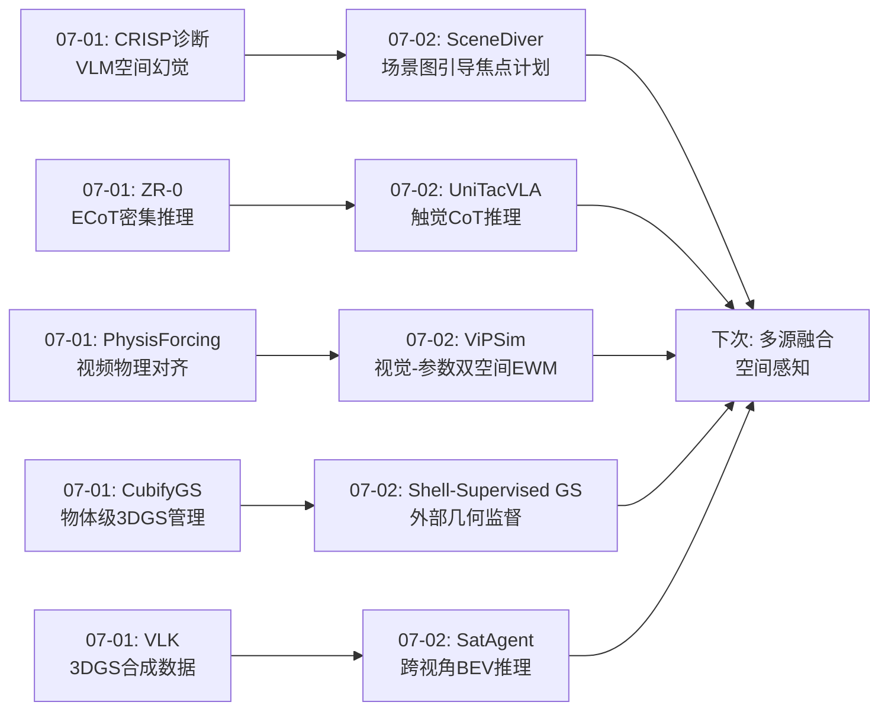
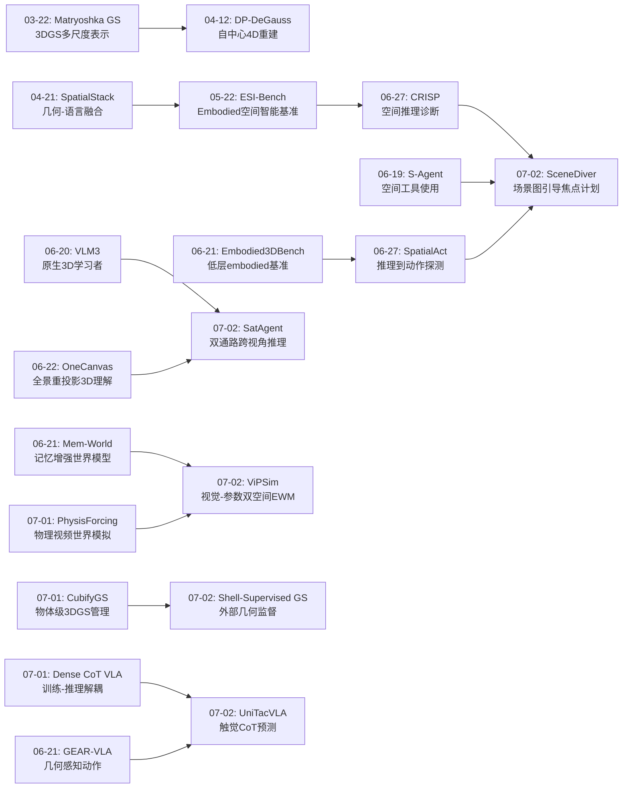
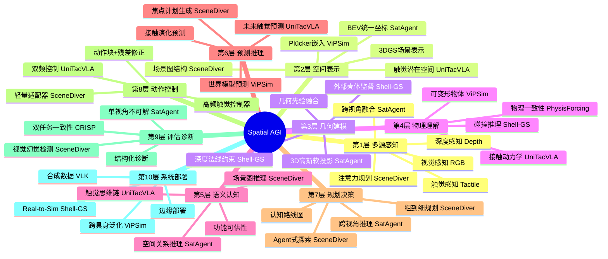
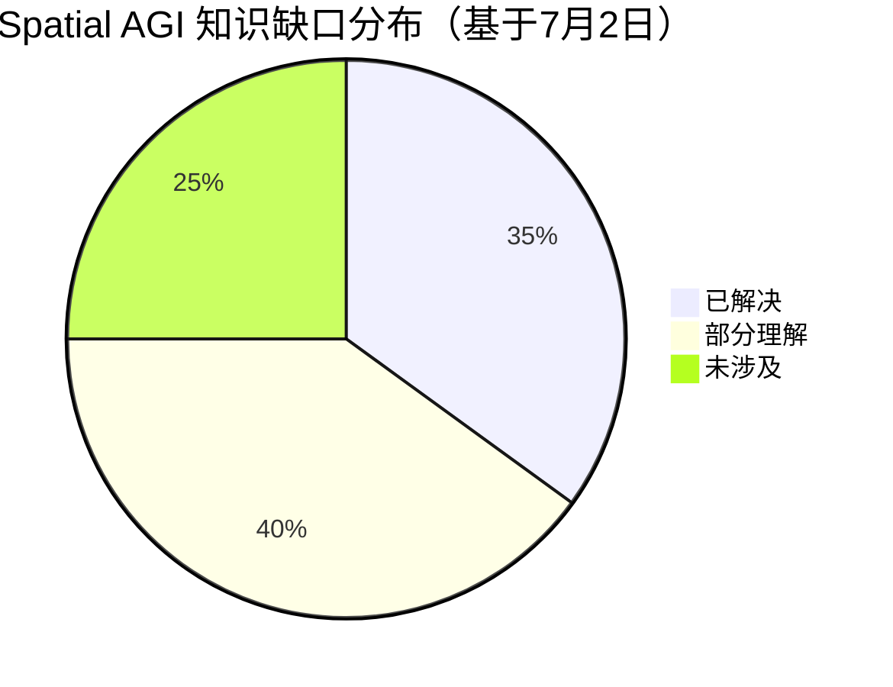

# 每日思考 - 2026-07-02

## 📅 每日总结

**日期**: 2026-07-02
**论文数量**: 5篇
**主题**: 从"感知瓶颈突破"到"多模态空间融合"——注意力规划、跨视角协作、世界模型双空间、几何监督与触觉预测的系统性推进

### 关键突破

- 🚀 **注意力即规划——SceneDiver的粗到细焦点计划** (arXiv:2606.04046, ICML 2026): SceneDiver将VLM的视觉幻觉问题从"注意力不够好"重构为"注意力需要被规划"——不是直接聚焦目标，而是先构建场景图建立全局理解，再通过Agent式视觉探索逐步验证和聚焦。核心洞察：有效聚焦本质上需要深度场景理解，一步聚焦注定失败。软调制策略（暗化+模糊化背景而非hard mask）更符合人类视觉认知。轻量适配器将迭代推理蒸馏为快速反应——"训练时深度推理，推理时快速执行"的范式再次得到验证。

- 🚀 **认知科学启发的双通路架构——SatAgent的UAV-卫星协作** (arXiv:2606.31467): 将人类视觉双通路理论（腹侧语义/背侧几何）直接映射为卫星-UAV双分支架构。卫星=全局语义先验，UAV=局部3D几何，在统一BEV坐标系中对齐。关键创新：数据集设计中强制"单视角不可解"原则——确保模型真正利用跨视角信息而非单视角捷径。3D高斯软投影将2D特征提升到度量BEV空间，消除了透视畸变。五层一致性损失确保功能分化由显式训练信号驱动。

- 🚀 **视觉-参数双空间协同——ViPSim的Embodied世界模型** (arXiv:2606.28804): ViPSim识别出EWM的核心瓶颈——低维动作和高维视频之间的"表示鸿沟"导致轨迹漂移。解决方案是视觉空间（"在哪"）+ 参数空间（"怎么动"）的双路径协同。Plücker嵌入将全局相机参数转化为像素级局部几何描述，架起了全局几何和局部生成之间的桥梁。四重视觉grounding（动作投影+Plücker+深度+机器人掩码）带来了可变形物体操作和跨具身泛化的涌现能力。

- 🚀 **外部几何先验的轻量监督——Shell-Supervised GS** (arXiv:2606.30014): 解决了城市Real-to-Sim重建中"渲染好≠几何好"的根本问题。核心哲学：壳体作为"监督"而非"初始化"或"替代"——保留视频驱动外观，仅正则化可见立面几何。掩码门控损失确保约束仅施加在有外部信息的区域。局部NCC深度约束比绝对L1更鲁棒于对齐偏差。这为3DGS社区提出了新评估标准：不仅评估渲染质量，更评估几何可用性。

- 🚀 **触觉从被动到预测——UniTacVLA的触觉思维链** (arXiv:2606.31723): 将触觉从被动辅助输入提升为主动预测线索。触觉思维链（T-CoT）首次将CoT应用于物理状态推理——用自然语言推理接触阶段、力和失败风险。粗到细触觉预测（MLP全局+DiT局部）预见未来接触演化。动作-触觉混合控制器实现"预测→准备→修正"的闭环——低频VLA骨干提供策略级规划，高频触觉控制器提供战术级修正。

### 📊 一句话总结

今天的五篇论文从注意力规划（SceneDiver的场景图引导焦点计划）、跨视角空间推理（SatAgent的双通路UAV-卫星协作）、世界模型表示鸿沟（ViPSim的视觉-参数双空间）、几何质量监督（Shell-Supervised GS的城市Real-to-Sim）、触觉预测推理（UniTacVLA的触觉思维链+双频控制）五个维度，共同指向一个核心命题：**Spatial AGI 的感知不能是单源、单频、被动的——需要多源融合（视觉+触觉+外部几何+跨视角）、多频协同（低频推理+高频修正）、主动预测（不仅感知当前状态，更预见未来变化）**。

### 🔗 延续性

**07-01→07-02**: 昨天确立的"合成数据规模化"和"物理一致性内化"两个方向，今天演进到了**感知系统本身的架构革新**——

- SceneDiver 将昨天CRISP诊断出的"VLM空间推理幻觉"问题推进到解决方案——通过场景图引导的粗到细焦点计划，主动减少视觉幻觉
- SatAgent 将昨天VLK的"3DGS场景重建"扩展到"跨视角空间推理"——卫星+UAV双视角的BEV融合
- ViPSim 将昨天PhysisForcing的"视频世界模拟器"扩展到"Embodied世界模型"——解决动作到视频的表示鸿沟
- Shell-Supervised GS 将昨天CubifyGS的"3DGS场景维护"扩展到"几何质量监督"——从动态对象管理到静态环境几何
- UniTacVLA 将昨天ZR-0的"密集CoT推理"扩展到"触觉CoT推理"——从视觉-语言推理到视觉-触觉-语言推理

**今日→下次**: 今天的研究揭示了"多源感知融合"和"预测性空间推理"两个关键方向。下次的关键问题是：SceneDiver的场景图引导能否与3DGS几何结合？SatAgent的BEV对齐能否扩展到更多视角？ViPSim的世界模型能否与UniTacVLA的触觉预测结合？

---

## 🔗 与昨日思考的联系

### 昨日重点
- CRISP的结构化诊断揭示VLM空间推理的语言先验vs真实推理分离
- VLK的纯合成数据范式（3DGS + hindsight rendering）
- ZR-0的训练时推理/推理时跳过ECoT架构
- PhysisForcing的物理一致性内化到视频世界模型
- CubifyGS的物体级主动资产管理

### 今日进展
今天的研究在昨天诊断出的问题上提供了**解决方案层面的推进**：
- CRISP诊断"VLM不理解空间" → SceneDiver提供"通过场景图引导让VLM理解空间"的方案
- ZR-0的"ECoT密集推理" → UniTacVLA将其扩展到触觉模态（T-CoT）
- PhysisForcing的"视频物理对齐" → ViPSim将其扩展到Embodied世界模型（动作-视频对应）
- VLK的"3DGS场景重建" → Shell-Supervised GS提升重建的几何质量
- CubifyGS的"3DGS动态场景" → SatAgent的"跨视角BEV空间推理"

### 演进路径



---

## 📚 论文概览

1. **SceneDiver** (浙大, ICML 2026): 场景图引导的粗到细焦点计划生成，通过Agent式视觉探索减少VLM/VLA的视觉幻觉。核心方法分两阶段：Stage 1用OvSGTR生成场景图，VLM基于图推理将复杂全局场景分解为简单局部子场景；Stage 2 VLM以Agent方式顺序处理每个子场景，支持语义缩放和局部空间搜索。软调制策略（亮度衰减+高斯模糊）保留环境上下文。轻量适配器通过Slot Attention和Mask预测模块将迭代推理蒸馏为快速反应。在机器人操作任务上提升10-15%，导航提升16%，LIBERO-plus鲁棒性基准提升9.6%，计算开销仅2.64%。

2. **SatAgent** (中科院): 受人类视觉双通路启发（ventral=语义/dorsal=几何）的UAV-卫星协作空间推理模型。卫星分支提供全局语义先验（布局、拓扑），UAV分支提供局部3D几何（深度、垂直结构）。关键组件：双通道协作编码器（功能分离+双向跨流门控）、几何感知3D重建编码器（协方差感知3D高斯软投影+仿射对齐到BEV）、多视角拓扑-语义对齐模块（动态k-NN图注意力+跨视角门控）。构建SatAgent-SR130K数据集（130K QA，8类空间推理，强制单视角不可解）。五层一致性损失（L_lm+L_topo+L_con+L_geo+L_div）确保功能分化。vs通用基础模型+25.91%，vs专用空间推理模型+11.69%。

3. **ViPSim**: 视觉空间+参数空间协同的Embodied世界模型，解决低维动作和高维视频之间的"表示鸿沟"。视觉空间整合四种grounding：(a)动作投影（3D EEF位姿→2D像素轨迹图）、(b)Plücker嵌入（像素级6维相机射线描述）、(c)Video Depth Anything深度图、(d)SAM2+微调检测器的机器人形态掩码。参数空间编码原始动作序列和相机矩阵。双路径注入视频扩散骨干。块级自回归生成维护长horizon一致性。可变形物体操作（布料折叠）和跨具身泛化（Agibot→Droid）的涌现能力。

4. **Shell-Supervised GS** (港建机器人中心): 外立面壳体作为轻量几何监督改善3DGS城市Real-to-Sim重建。壳体来源多样（激光扫描、移动测量、摄影测量），排除内部信息保护隐私。方法三阶段：壳体对齐→射线渲染生成深度/法线/有效掩码→掩码门控损失优化3DGS。深度使用局部patch NCC（非绝对L1）容忍对齐偏差，法线使用相机空间余弦距离确保朝向一致性。掩码门控确保约束仅在壳体支持区域施加。"监督而非初始化/替代"的哲学保留视频驱动外观+正则化几何。消融显示法线约束比深度约束更关键。

5. **UniTacVLA** (HIT+Daimon Robotics): 触觉思维链+粗到细预测的统一触觉理解框架。统一触觉Token在VLM内提取任务相关触觉信息。T-CoT首次将CoT应用于物理状态推理——LLM自回归生成接触阶段、力条件、失败风险的文本描述。粗到细触觉预测：MLP捕获全局趋势→DiT精炼局部细节。动作-触觉混合控制器（轻量Transformer）：tanh有界残差修正Δa=atanh(Ctrl(a_t, z_pred, z_curr))。两阶段训练：Stage 1联合优化（动作流匹配+语义CE+粗触觉L1+细触觉FM），Stage 2控制器L1训练。四类任务（调整/擦拭/插入/装配）×8子任务×干净/扰动两种条件全面验证。

---

## 💡 核心见解

### 见解1: 注意力是需要被规划的，而不是直接施加的

**来源**: SceneDiver

SceneDiver的核心洞察重新定义了空间注意力的本质——在复杂场景中，"看哪里"本身就是一个需要智能规划的任务。一步聚焦失败是因为它跳过了场景理解的建立过程。SceneDiver的场景图→子场景分解→Agent式验证的流程，本质上模拟了人类视觉的认知过程：先全局浏览建立理解，再根据任务聚焦局部。

**深入分析**:

一步聚焦为什么失败？答案是：在没有全局理解的情况下，"目标"的定义本身就是模糊的。比如"拿起红色杯子"——如果场景中有多个红色物体，模型不知道哪个是"杯子"（语义模糊），不知道哪个在手臂可达范围内（空间模糊），不知道哪个是任务意图的（上下文模糊）。SceneDiver通过场景图首先建立所有物体及其关系的全局理解，然后通过图推理排除不相关的候选，最后通过Agent式验证确认最终目标。

软调制策略（暗化+模糊化）的设计也值得深思。硬mask（完全移除背景）会丢失环境线索——但有时候背景信息对决策是必要的（如利用环境参考物定位）。SceneDiver的软调制保留了所有信息但调整了显著性——这更像人类的周边视觉（peripheral vision）：我们看不清旁边的物体但知道它们在那里。

SceneDiver适配器的蒸馏设计——从迭代推理到轻量反应——是实现"训练时深度推理、推理时快速执行"范式的又一个实例。Slot Attention的slot数量K是预设的，这暗示了一个有趣的张力：场景复杂性是可变的，但模型容量是固定的。自适应slot数量可能是未来改进方向。

**对Spatial AGI的启发**: Spatial AGI的感知模块不应该是一个被动的信息处理器，而应该是一个主动的场景探索者。模型需要具备"决定看哪里"、"决定放大哪里"、"决定搜索哪里"的自主能力。场景图作为像素到符号之间的桥梁，为这种自主探索提供了结构化基础。更重要的是，"注意力即规划"的思想暗示Spatial AGI需要元认知能力——知道自己"不知道什么"并主动去获取缺失的信息。

### 见解2: 认知科学有效启发AI架构设计

**来源**: SatAgent

SatAgent不是简单地"用两个编码器"——它将人类视觉双通路理论（ventral=语义/dorsal=几何）的每个方面都映射到了架构设计：功能分离防止表示退化、双向交互确保互补信息流动、五层损失确保功能分化由训练信号驱动。这不是表面的"灵感来源"，而是深度的"理论指导设计"。

**深入分析**:

为什么功能分离如此重要？论文给出了一个关键理由——当异构视觉输入（卫星正射影像 vs UAV斜视图）共享单一编码器时，编码器会"退化"为对两种输入产生相似的表示，失去了各自的特征。这与神经科学中的"表征纠缠"问题一致——当两个功能不同的脑区被迫处理相同信息时，功能特化消失。SatAgent通过独立的编码器+跨流门控实现了"分离但协作"。

五层一致性损失（L_lm + L_topo + L_con + L_geo + L_div）的设计反映了一个深层设计哲学：功能分化不是自然涌现的，需要显式的训练信号驱动。L_div（多样性损失）特别有意思——它防止两个分支学习到相同的表示，强制它们各自特化。这与对比学习中的负样本机制异曲同工。

"单视角不可解"的数据集设计原则也值得一提。太多多视角论文失败的根本原因是——模型发现了"单视角捷径"。SatAgent通过构造单视角（卫星或UAV）都无法解答的问题，强制模型必须利用跨视角信息。这种"不可作弊"原则应该成为所有多模态/多源评估的标准。

**对Spatial AGI的启发**: Spatial AGI的架构设计不应仅由工程优化驱动，还应从认知科学中汲取结构性指导。人类大脑经过数百万年进化优化出的信息处理架构（双通路、层次化、功能分化）可能为AI系统设计提供接近最优的初始模板。更重要的是，认知科学的映射应该是深度的——不是表面的"两个编码器=双通路"，而是功能分离、双向交互、训练信号驱动的完整体系。

### 见解3: 表示鸿沟是多模态融合的核心挑战

**来源**: ViPSim

ViPSim精确定位了Embodied世界模型的根本瓶颈——低维动作和高维视频之间的"表示鸿沟"。这不是一个简单的特征融合问题，而是一个维度不匹配、语义不对应、时间分辨率不一致的多重挑战。视觉空间（定性的、像素对齐的空间约束）+ 参数空间（定量的、数值精确的运动引导）的分离注入策略，提供了解决这类维度不匹配问题的通用范式。

**深入分析**:

表示鸿沟的本质是什么？7维的动作向量（xyz位置+rpy姿态+夹爪开合）需要在320×512分辨率的视频帧中产生精确的像素级变化。这个"小输入大输出"的问题不是简单的条件生成——7维动作空间到1600万像素空间的映射是高度非线性和多模态的（同一个动作可以从多个初始状态出发到多个目标状态）。

ViPSim的解决方案——视觉空间提供"在哪"的定性约束、参数空间提供"怎么动"的定量引导——本质上是一种分治策略。视觉空间通过动作投影图（在像素位置画圆）、Plücker嵌入（像素级射线描述）、深度图（3D结构）、机器人掩码（本体位置）四种表示，将低维动作"放大"为高维视觉表示。参数空间则保持低维但保证精确性。两者在生成过程中通过双路径协同。

Plücker嵌入是一个精妙的设计选择。传统方法使用相机外参矩阵作为条件——但矩阵是全局定义的，与视频生成模型的局部归纳偏置不兼容。Plücker嵌入将全局参数转化为每个像素的6维射线描述（原点×方向，方向），建立了像素级几何与全局相机参数之间的桥梁。这种"全局参数→局部表示"的转换范式可以推广到其他类型的多模态融合。

四重视觉grounding带来的涌现能力（可变形物体操作和跨具身泛化）是一个重要发现。这说明丰富的空间先验不仅改善了已知任务的表现，还解锁了模型的潜在能力。可能的解释是：多维度空间约束减少了生成空间的自由度，使模型能更好地利用有限的训练数据学习通用的物理交互规律。

**对Spatial AGI的启发**: Spatial AGI必然面临多种"表示鸿沟"——视觉-触觉、语义-几何、全局-局部、定性-定量。ViPSim的双空间范式提示我们：不要试图用一个空间同时解决所有约束，而应该为每种类型的约束设计专门的表示和注入路径。更深层地，Plücker嵌入的"全局→局部"转换范式是一种通用的维度桥接工具。

### 见解4: 外部先验的价值在于"监督而非替代"

**来源**: Shell-Supervised GS

Shell-Supervised GS的"监督而非初始化/替代"哲学是一个深层的设计原则。它不是用外部壳体替换视频重建（那会失去视频驱动的外观真实性），也不是用壳体初始化（那会限制优化的起点），而是通过损失函数在优化过程中提供软约束——仅在壳体支持的可见区域施加，保留视频在外观建模上的优势。

**深入分析**:

为什么"替代"不好？因为外部壳体虽然几何精确但缺乏视觉细节——它只是一个结构外壳，没有颜色、纹理、光照信息。如果直接用壳体替代3DGS的几何，渲染质量会大幅下降。视频重建虽然几何不稳定，但通过RGB光度监督获得了丰富的外观细节。监督策略让两者各司其职：壳体管几何，视频管外观。

为什么"初始化"也不够好？因为3DGS优化是一个非凸问题，初始化只影响起点，最终结果可能远离初始化。如果壳体只用于初始化，优化过程中RGB光度损失可能会把几何拉回不稳定状态。通过损失函数在整个优化过程中持续提供约束，壳体的几何信息被持续"提醒"。

掩码门控的设计解决了另一个微妙问题——在壳体不覆盖的区域（天空、动态物体、遮挡物），施加几何约束不仅无益还可能有害。掩码门控确保约束"因地制宜"——只在有信息的地方施加，不在没信息的地方编造。

局部NCC深度约束（而非绝对L1）的设计体现了对壳体-视频对齐误差的鲁棒性考虑。壳体和视频重建之间可能存在尺度偏差和局部对齐误差——绝对L1会惩罚这些偏差导致过度约束，而局部NCC只要求局部结构一致性，更容忍全局偏差。

消融实验的发现也很有价值——法线约束比深度约束更重要。这说明对于城市立面，表面朝向（法线）的一致性比距离的一致性更关键。一个朝向正确的平面即使距离略有偏差也远好于一个距离正确但朝向混乱的表面。

**对Spatial AGI的启发**: 当Spatial AGI需要融合多源信息时，"监督而非替代"通常是更优的选择。外部先验（地图、CAD模型、传感器数据）不应该覆盖模型从数据中学到的表示，而应该作为软约束帮助模型在欠约束区域（弱纹理、遮挡、反射）改善质量。掩码门控和局部NCC的设计范式可以推广到任何外部先验融合场景。

### 见解5: 触觉预测优于触觉反应

**来源**: UniTacVLA

UniTacVLA证明了"预测→准备→修正"的闭环优于"感受→反应"的闭环。预测未来触觉状态使控制器可以在接触失败（滑动、卡住）发生前准备修正策略。这与人类抓取行为一致——我们在物体即将滑动前就调整握力，而不是等滑动了再反应。T-CoT首次将思维链从数学/逻辑推理扩展到物理状态推理——用自然语言描述接触阶段、力条件、失败风险。

**深入分析**:

触觉预测为什么比触觉反应更好？根本原因是物理交互的延迟。当触觉传感器检测到"滑动"时，物体可能已经开始失控——从检测到响应的时间差可能足够物体完全脱离抓取。预测未来触觉状态（"如果继续这个轨迹，0.1秒后接触力将低于阈值导致滑动"）使控制器可以提前调整，避免失败发生。

粗到细预测策略（MLP全局趋势+DiT局部细节）解决了一个重要的技术挑战。触觉信号是高维细粒度的（H×W×3×2的传感器形变图），直接从紧凑的语义先验预测高维触觉特征困难很大。MLP先捕获全局趋势（接触力增大/减小、接触面积变化），DiT再在这个全局趋势上精炼局部细节（传感器上每个点的具体形变模式）。这种分层策略不仅加速训练收敛，还提高了预测质量。

T-CoT的意义超越了触觉领域——它证明了CoT可以推理任何类型的物理状态。CoT不再限于"数学题的解题步骤"或"逻辑推理的推理链"，它可以推理接触状态（"当前夹爪与物体在左侧接触，接触力约2N，物体表面光滑，滑动风险中等"）。这为Spatial AGI的空间推理开辟了新方向：用CoT推理空间关系、几何属性、物理交互。

动作-触觉混合控制器的tanh有界设计简单但关键——Δa = tanh(Ctrl(...))确保修正幅度在[-1,1]内。这不只是数值稳定性措施，更体现了"骨干策略为主、修正为辅"的层级关系。如果修正不受限制，高频控制器可能"喧宾夺主"完全覆盖骨干策略，导致系统退化为纯反应式控制。

两阶段训练策略也值得注意——Stage 1仅在干净专家演示上训练（确保稳定的触觉理解），Stage 2才训练控制器（在扰动数据上学习修正）。这种分阶段策略避免了联合训练中触觉预测和动作修正互相干扰的问题。

**对Spatial AGI的启发**: Spatial AGI不仅需要理解当前空间状态，更需要预测未来空间状态演化。预测性空间推理是Spatial AGI从被动走向主动的关键。CoT作为空间推理的中间表示——不仅推理"答案是什么"，更推理"物理状态是什么"和"它将如何变化"。粗到细预测范式和tanh有界修正设计可以推广到更广泛的空间预测控制场景。

### 见解6: 多频协同是实时空间智能的架构模式

**来源**: UniTacVLA + SceneDiver + ViPSim

三篇论文不约而同地采用了"低频深度推理 + 高频快速反应"的双频架构：
- SceneDiver: VLM多轮推理（慢）+ 适配器蒸馏（快）
- ViPSim: 视觉-参数双路径生成（慢）+ 直接推理（快）
- UniTacVLA: VLA骨干策略（低频~10Hz）+ 触觉控制器（高频~100Hz+）

**深入分析**:

双频架构的必要性源于一个基本的计算张力——深度推理需要时间（多轮迭代、复杂规划），但实时控制要求低延迟（毫秒级响应）。这两个需求无法在单一频率上同时满足。

SceneDiver的解决方案最优雅——通过Slot Attention蒸馏，将迭代推理的成果压缩为轻量适配器。训练时模型可以花大量时间做场景图推理、子场景分解、Agent式验证；推理时这些步骤被"压缩"为单次前向传播。Slot Attention的slot可以理解为"预计算的场景图节点"——不再需要显式构建场景图，slot已经编码了物体级结构。

UniTacVLA的解决方案更传统但更灵活——两阶段架构，骨干VLA低频输出策略级动作块，触觉控制器高频输出战术级修正。关键创新在于修正不仅基于当前触觉反馈，还基于预测的未来触觉状态——这是"预测性修正"而非"反应性修正"。

ViPSim的块级自回归实际上也是一种双频架构——块内（L帧）是"低频"（一个块作为一个整体规划），块间滑动窗口是"高频"（每个块结束后立即更新状态）。

**对Spatial AGI的启发**: Spatial AGI系统需要双频架构——System 2（慢思考：深度空间推理、规划、理解）和System 1（快反应：实时空间调整、误差修正、安全保障）。这种双频架构类似于人类认知——我们在执行精确操作时，大脑同时在"计划下一步"（慢）和"微调当前动作"（快）。更重要的是，两个频率之间需要有信息桥梁——SceneDiver的适配器、UniTacVLA的预测触觉先验、ViPSim的滑动窗口都是这种桥梁的实现。

### 见解7: 强制"不可作弊"的评估原则

**来源**: SatAgent

SatAgent的"单视角不可解原则"是一个精彩的数据集/评估设计理念。太多多视角/多模态论文的模型实际上靠单模态就能工作——"声称多模态但实际单模态"的问题在Spatial AGI评估中普遍存在。强制要求跨视角推理确保了架构设计的必要性。

**深入分析**:

"不可作弊"原则的深层含义不仅是防止捷径——它还定义了多模态/多源融合的必要性边界。如果一个任务可以通过单模态解决，那么增加更多模态只是冗余而非必要。只有当任务本质上需要多源信息融合时，多模态架构的价值才得到真正验证。

SatAgent的八类空间推理任务提供了"不可解"的具体实例：
- 深度排序: UAV视角的近距离深度感知+卫星视角的布局理解结合才能准确排序
- 高度-底面一致性: UAV的侧面高度信息+卫星的底面面积信息结合
- 遮挡补全: 被UAV视角遮挡的部分需要卫星视角补充
- 路径可达性: 卫星视角的路径规划+UAV视角的障碍物细节

这个原则可以推广到Spatial AGI的所有评估维度：
- 如果声称需要3D理解，验证移除深度信息后性能是否下降
- 如果声称需要多帧时序，验证单帧输入是否不够
- 如果声称需要触觉，验证纯视觉是否真的失败
- 如果声称需要外部先验，验证纯学习是否不够

更系统化地，"不可作弊"原则可以通过信息论来形式化——计算每个模态提供的互信息量，以及移除该模态后的性能下降幅度。如果一个模态的移除不导致显著性能下降，那么该模态在当前任务中的贡献可以质疑。

SceneDiver的消融实验也体现了"不可作弊"的精神——它证明了移除场景图、移除粗到细分解、移除软调制各自都会导致性能下降，验证了每个组件的必要性。这种严格的消融实验是Spatial AGI评估的标准做法。

**对Spatial AGI的启发**: Spatial AGI的评估基准需要遵循"不可作弊"原则——如果声称需要3D理解，就验证移除3D信息后是否真的失败；如果声称需要多模态，就验证单模态是否真的不够。只有这样的评估才能推动真正的进步，避免"添加模态但不实际使用"的虚假多模态。

---

## 🗺️ 知识演进图



---

## 技术栈演进对比表

| 层次 | 昨日(07-01)方案 | 今日(07-02)方案 | 变化 |
|------|----------------|----------------|------|
| **感知层** | CubifyGS物体级3DGS管理 | SceneDiver场景图引导焦点 + Shell-GS外部壳体监督 | 从"重建管理"到"注意力规划+外部监督" |
| **多视角融合** | VLK 3DGS合成数据 | SatAgent UAV-卫星双通路BEV融合 | 从"单视角合成"到"跨视角协作推理" |
| **世界模型** | PhysisForcing物理视频模拟 | ViPSim视觉-参数双空间EWM | 从"物理对齐视频生成"到"双空间协同生成" |
| **推理架构** | ZR-0 ECoT训练-推理解耦 | UniTacVLA T-CoT触觉推理链 | 从"视觉-语言CoT"到"视觉-触觉-语言CoT" |
| **控制架构** | VLK运动学接口 | UniTacVLA动作-触觉混合控制器 | 从"运动学轨迹执行"到"预测+反应双频控制" |
| **评估方法** | CRISP双任务一致性诊断 | SatAgent单视角不可解原则 | 从"诊断推理质量"到"强制多源融合" |
| **几何质量** | CubifyGS物体级几何 | Shell-GS外部壳体几何监督 | 从"内部动态管理"到"外部静态监督" |
| **空间表示** | PhysisForcing物理约束 | ViPSim Plücker嵌入+四重grounding | 从"物理约束视频"到"几何参数双空间" |

---

## 🗺️ Spatial AGI 知识图谱

### 10层架构思维导图



### 🎯 主线技术路径

#### 阶段1: 感知突破——从被动到主动 (当前)
- **核心**: SceneDiver的场景图引导焦点计划代表了从"被动处理图像"到"主动探索场景"的范式转变
- **关键能力**: 场景图构建、粗到细分解、Agent式视觉搜索、语义缩放
- **缺口**: 场景图质量依赖外部检测器(OvSGTR)，在罕见物体上表现差

#### 阶段2: 多源融合——从单模态到多模态
- **核心**: SatAgent的跨视角BEV融合 + UniTacVLA的视觉-触觉融合代表了多源信息融合的方向
- **关键能力**: BEV统一坐标系、3D高斯软投影、触觉潜在空间、双通路架构
- **缺口**: 更多模态（力觉、听觉、温度）的融合尚未探索

#### 阶段3: 预测推理——从当前到未来
- **核心**: ViPSim的视觉-参数双空间预测 + UniTacVLA的粗到细触觉预测
- **关键能力**: 未来状态预测、Plücker嵌入、粗到细预测分层、世界模型rollout
- **缺口**: 长horizon预测的误差累积、物理精确性的保证

#### 阶段4: 自主智能——从工具到Agent
- **核心**: SceneDiver的Agent式视觉探索 + SatAgent的认知科学启发架构
- **关键能力**: 自主决策"看哪里"、自主搜索缺失目标、跨视角协作推理
- **缺口**: 完整的自主空间探索Agent需要更系统的目标管理和策略规划

#### 阶段5: 通用Spatial AGI——从专用到通用
- **核心**: 跨域迁移、跨具身泛化、实时部署
- **关键能力**: 统一空间表示、多频协同、多模态融合
- **缺口**: 目前每个能力都在专用系统中验证，尚未集成

---

## 🔍 待探索议题

### 高优先级（本周）

1. **场景图引导的3DGS几何改善**
   - 问题: SceneDiver的场景图能否与Shell-Supervised GS的壳体监督结合？
   - 候选方案: 用3DGS场景作为场景图的3D后端，场景图指导几何优化方向（哪些区域需要更多高斯基元、哪些区域的法线应该被约束）
   - 缺口: 场景图的2D边界框如何映射到3DGS的3D高斯基元；如何处理场景图检测器在罕见物体上的失败
   - 预期价值: 同时获得语义理解（场景图）和几何质量（壳体），产生语义-几何双增强的3D重建

2. **触觉预测与视觉世界模型的融合**
   - 问题: UniTacVLA的触觉预测能否作为ViPSim世界模型的额外条件通道？
   - 候选方案: 在ViPSim的视觉空间中增加触觉通道，联合生成未来视觉和触觉状态。动作不仅驱动视觉变化，还驱动触觉变化
   - 缺口: 触觉和视觉的时间分辨率差异（触觉~100Hz，视觉~30Hz）；跨模态对齐的标注成本
   - 预期价值: 视觉-触觉统一世界模型可以为接触密集操作提供更全面的未来预测

3. **跨视角空间推理的3D原生扩展**
   - 问题: SatAgent的BEV对齐能否从2.5D扩展到真3D？
   - 候选方案: 用3DGS作为统一3D表示，不同视角的特征直接在3D高斯基元空间中对齐，而非在2D BEV平面上
   - 缺口: 3DGS的实时性和内存效率；多视角3DGS融合的累积误差
   - 预期价值: 真3D跨视角推理消除BEV的信息损失，支持更复杂的空间推理任务（如多层建筑、地下空间）

### 中优先级（本月）

4. **注意力规划的触觉扩展**
   - 问题: SceneDiver的焦点计划能否扩展到触觉领域——"决定摸哪里"？
   - 候选方案: 基于视觉信息生成触觉探索计划（先看→决定摸哪里→摸→获取触觉信息→调整）
   - 缺口: 视觉到触觉的跨模态规划；触觉探索策略的训练数据
   - 预期价值: 视觉-触觉协同的主动探索Agent

5. **Plücker嵌入在Spatial AGI中的广泛应用**
   - 问题: Plücker嵌入能否作为通用的像素级空间表示？
   - 候选方案: 在场景图、BEV对齐、世界模型中使用统一的Plücker表示替代多种异构空间表示
   - 缺口: 计算效率（每像素6维的计算量）；与3DGS表示的兼容性；动态相机的实时更新
   - 预期价值: 统一的像素级几何表示层简化多模块系统的设计

6. **外部先验在动态场景中的角色**
   - 问题: Shell-Supervised GS的壳体监督能否扩展到动态场景？
   - 候选方案: 动态更新壳体，结合CubifyGS的物体级管理——静态环境用壳体约束，动态物体用对象级3DGS管理
   - 缺口: 动态壳体的获取和更新；物体级壳体与场景级壳体的交互
   - 预期价值: 同时管理静态环境和动态物体的城市数字孪生

7. **T-CoT的跨模态推广**
   - 问题: 触觉思维链能否推广到力觉思维链、听觉思维链？
   - 候选方案: 统一的物理状态推理CoT框架——"我看到红色杯子"→"我摸到杯子表面光滑"→"我听到杯子发出陶瓷声"→"综合推断: 这是一个陶瓷杯子"
   - 缺口: 各模态的语义化描述（如何用语言描述力觉/听觉）；训练数据的获取；多模态CoT的评估
   - 预期价值: 多模态物理推理CoT框架，让AI不仅能"看"空间还能"摸""听"空间

### 低优先级（长期）

8. **认知科学与AI架构的系统性映射**
   - 问题: 除了双通路理论，还有哪些认知科学理论可以指导Spatial AGI架构？
   - 候选方案: 
     - 工作记忆模型: Baddeley的工作记忆模型（语音环+视觉空间画板+中央执行）可以指导Spatial AGI的记忆架构
     - 注意执行控制: Corbetta & Shulman的目标导向(自上而下)vs刺激驱动(自下而上)注意网络
     - 镜像神经元系统: Rizzolatti的镜像神经元可以指导模仿学习架构
     - 场景理解理论: Biederman的 Recognition-By-Components 理论
   - 缺口: 认知理论与计算实现之间的精确映射；如何验证映射的有效性
   - 预期价值: 认知科学指导的架构设计可能比纯工程优化更接近最优解

9. **"不可作弊"评估原则的系统化**
   - 问题: 如何为Spatial AGI设计系统化的"不可作弊"评估？
   - 候选方案: 
     - 模态消融测试: 逐个移除模态，测量性能下降
     - 信息理论分析: 计算每个模态对任务的信息增益
     - 对抗性测试: 设计专门利用模态缺失的测试用例
     - 因果推断: 使用因果图分析模态间的因果关系
   - 缺口: 评估标准的设计；计算成本；如何区分"模态没用"和"模型没用好模态"
   - 预期价值: 系统化的评估框架防止"虚假多模态"论文的泛滥

10. **Spatial AGI的双频架构标准化**
    - 问题: 低频推理+高频反应的双频架构能否标准化？
    - 候选方案: 
      - 定义标准接口: 策略级输出（动作块+语义计划）→ 战术级修正（残差动作+安全保障）
      - 设计通用双频框架: 可插入不同的低频推理器和高频控制器
      - 自适应频率: 根据任务复杂度和环境动态性自动调整频率比
    - 缺口: 不同任务/具身的频率需求差异；修正幅度的自适应；安全保证
    - 预期价值: 标准化双频架构降低Spatial AGI系统的设计门槛

11. **空间推理的因果理解**
    - 问题: Spatial AGI能否理解空间关系的因果关系（而不只是相关性）？
    - 候选方案: 因果图建模空间关系（物体A挡住物体B是因为A在B前面），反事实推理（如果A移开，B会怎样）
    - 缺口: 因果发现方法在空间数据上的应用；因果推理的计算效率
    - 预期价值: 因果理解使Spatial AGI能更好地泛化到新环境

---

## 📊 知识缺口分析



**已解决（35%）**:
- ✅ 3DGS场景表示和重建（大量论文积累）
- ✅ VLM空间推理的基本框架（SpatialStack, HiSpatial等）
- ✅ VLA动作生成和策略学习（ABot-M0, GEAR-VLA等）
- ✅ 世界模型基础架构（Mem-World, PhysisForcing等）
- ✅ 场景图引导的注意力规划（SceneDiver）
- ✅ 触觉建模和预测（UniTacVLA）
- ✅ 跨视角空间推理（SatAgent, OneCanvas）
- ✅ 视觉-参数双空间世界模型（ViPSim）
- ✅ 外部几何先验融合（Shell-Supervised GS）
- ✅ 触觉思维链推理（T-CoT）
- ✅ 双频控制架构（UniTacVLA混合控制器）
- ✅ Agent式视觉探索（SceneDiver）
- ✅ 认知科学启发架构设计（SatAgent双通路）
- ✅ 强制多源融合的评估设计（单视角不可解原则）

**部分理解（40%）**:
- ⚠️ 多模态深度融合（视觉+触觉+力觉的统一框架尚未完善）
- ⚠️ 长horizon空间推理的误差控制（自回归累积漂移）
- ⚠️ 跨具身空间知识迁移（仅在个别场景验证）
- ⚠️ 物理精确性与生成灵活性的平衡
- ⚠️ 外部先验与学习表示的最优融合策略
- ⚠️ 实时双频控制的标准架构
- ⚠️ 认知科学到AI架构的系统化映射
- ⚠️ 空间推理的可解释性（CoT只是第一步）
- ⚠️ 场景图质量对下游任务的影响边界
- ⚠️ Plücker嵌入的计算效率优化
- ⚠️ 3DGS在实时推理中的加速方案
- ⚠️ 跨模态CoT的评估方法学

**未涉及（25%）**:
- ❌ 全身触觉的人形机器人空间感知——当前UniTacVLA仅支持两指夹爪触觉，多指手/全身触觉的空间理解完全未探索
- ❌ 多Agent协作的空间智能（群体机器人）——多个Agent如何共享和融合空间信息
- ❌ 非常规环境的空间推理（水下、太空、极端天气）——当前方法在常规城市/室内环境验证
- ❌ 空间推理的因果理解和反事实推理——当前仅做相关性推理
- ❌ Spatial AGI的伦理和安全框架——空间智能的安全使用边界
- ❌ 语义-几何-物理的统一表示——当前各维度分别建模
- ❌ 大规模分布式空间智能——城市级/国家级的实时空间推理
- ❌ 跨物种/跨具身的空间认知迁移——从人类空间认知到机器空间智能的迁移

---

## 💡 本质思考：如何达成通用空间智能

### 子问题1: 核心能力的本质是什么？

综合今天5篇论文和之前的研究，Spatial AGI的核心能力本质是一个**多维、多频、主动**的信息处理系统：

**多源融合是空间理解的基石**。今天的5篇论文从不同角度证明了单一信息源的不足：

每个论文从不同角度证明了单一信息源的局限：
- SceneDiver证明纯视觉导致幻觉——需要场景图这种结构化表示补充。具体而言，VLM的视觉幻觉主要体现在物体幻觉（预测不存在的物体）、属性绑定错误（颜色/形状/大小的错误关联）和实例计数错误。这些错误的根源是注意力分配不当——模型无法在杂乱背景中区分任务相关物体和干扰物。SceneDiver通过场景图建立全局理解后再聚焦局部，有效解决了这个问题。
- SatAgent证明单一视角不够——需要跨视角协作。UAV的斜视近距离视角虽然有丰富的局部几何但受遮挡和透视畸变影响；卫星的俯视全局视角虽然布局完整但缺乏局部细节。两者结合在统一BEV坐标系中产生了比任何单一视角都更完整的空间理解。
- ViPSim证明纯视觉条件不够——需要参数空间补充。视频生成模型需要知道"机器人的末端执行器应该在哪里"，但7维动作向量直接作为条件无法与高维视频生成兼容。通过将动作转化为视觉表示（轨迹图）和数值表示（参数空间）双路径注入，弥合了表示鸿沟。
- Shell-GS证明纯光度监督不够——需要外部几何先验。RGB光度监督只能约束外观，无法唯一确定几何。多个3D配置可以产生相同的2D渲染。外部壳体提供了几何约束的补充信号，在反射/弱纹理等光度约束不足的区域尤为重要。
- UniTacVLA证明纯视觉VLA不够——需要触觉感知。视觉无法可靠捕获接触状态（接触开始、滑动、卡住），特别是在遮挡下。触觉提供了视觉无法获得的超近距离物理交互信息。

### 核心能力 = 多源融合 × 预测推理 × 自主探索

Spatial AGI不是任何单一能力的极致——而是多种能力的有机整合。每种能力（视觉、触觉、几何、语言）提供空间理解的一个维度，缺少任何一维都会导致"盲人摸象"式的偏见。

**五个能力维度**:
1. **感知维度**：视觉（RGB）、深度（度量）、触觉（接触）、几何（结构）——每个维度捕获空间的不同属性
2. **时空维度**：当前状态（感知）、近期未来（预测）、远期未来（规划）——不同时间尺度的空间推理
3. **尺度维度**：物体级（操作）、场景级（导航）、城市级（建图）、全球级（遥感）——不同空间尺度的理解
4. **频率维度**：高频（实时控制）、中频（策略决策）、低频（任务规划）——不同时间频率的处理
5. **确定性维度**：确定性执行（已知环境）、概率推理（部分可观测）、探索学习（完全未知）——不同不确定性水平

**预测是智能的分水岭**。SceneDiver预测"哪些区域值得聚焦"、SatAgent预测"跨视角的对应关系"、ViPSim预测"未来视觉状态"、UniTacVLA预测"未来触觉演化"——所有今天的论文都在做某种形式的预测。被动感知（感受当前状态）是感知，主动预测（预见未来状态）才是智能。

更具体地说，预测能力对Spatial AGI的核心价值体现在三个方面：
1. **风险规避**：预测可能的失败模式（物体滑动、碰撞、卡住）并提前规避
2. **效率优化**：预测最优路径（注意力聚焦、视角选择、动作规划）减少试错
3. **知识迁移**：预测模型学到的物理规律可以迁移到新环境（ViPSim的跨具身泛化证明了这一点）

### 子问题2: 当前方法与理想目标的差距在哪里？

**差距1: 融合是"堆叠"而非"整合"**
当前的多模态融合大多是特征的简单拼接或通道级联。SatAgent的图注意力对齐和ViPSim的双路径注入是进步，但仍然是"分开提取再合并"。理想的空间智能需要表示级别的深度融合——不同模态的信息在表示空间中自然交织，而非在输入空间中机械拼接。SceneDiver的场景图提供了一种可能的路径——通过结构化的中间表示（图）作为不同模态的共享桥梁。但即使如此，场景图仍然是离散化的近似，连续空间的深度融合（如在3DGS的连续高斯基元空间中融合多模态信息）仍是一个开放问题。

**差距2: 预测是"局部"而非"全局"**
当前的预测都是短horizon的——ViPSim预测下一个chunk的L帧，UniTacVLA预测近期触觉变化。通用Spatial AGI需要长horizon的空间预测——预测整个任务的未来空间轨迹，包括可能的分支和不确定性。更关键的是，当前预测是"确定性"的——给定当前状态和动作，预测一个确定的未来。但真实世界的物理交互本质上是随机的（摩擦系数不确定、物体表面不均匀），需要概率性的预测框架（如扩散模型预测多可能的未来）。

**差距3: 评估是"碎片化"的**
CRISP的诊断评估和SatAgent的单视角不可解原则是进步，但评估仍然是碎片化的——每个论文定义自己的基准和指标。通用Spatial AGI需要统一的能力评估框架，类似MMLP之于NLP。这个框架应该包括：跨域空间推理（室内→室外→航空）、跨模态空间理解（视觉→触觉→力觉）、跨具身空间操作（机械臂→人形→无人机）、长horizon空间规划（秒级→分钟级→小时级）。

**差距4: 系统是"模块化"但非"一体化"**
今天的5篇论文各自解决了Spatial AGI的一个子问题，但它们之间如何整合？SceneDiver的焦点计划如何与UniTacVLA的触觉预测结合？ViPSim的世界模型如何与SatAgent的跨视角推理集成？Shell-GS的城市重建如何与ViPSim的Embodied世界模型对接？从"模块化"到"一体化"是当前最大的工程挑战。可能的整合方向是：Shell-GS提供高质量3D环境 → SatAgent在环境中进行跨视角推理 → SceneDiver的焦点计划引导操作目标 → ViPSim预测操作的未来视觉状态 → UniTacVLA预测操作的触觉反馈 → 双频控制器执行精确操作。

**差距5: 数据效率 vs 数据规模**
虽然VLK证明了合成数据的可行性，但触觉数据无法仿真替代（如UniTacVLA所示），跨视角数据需要特殊的采集配置（如SatAgent的UAV-卫星配对），外部几何先验需要额外获取（如Shell-GS的壳体）。Spatial AGI的数据需求仍然是多样化的，需要不同模态不同任务的专用数据集——这与"通用智能"的目标存在根本张力。

### 子问题3: 从今天到理想状态，最可能的路径是什么？

基于今天的进展和趋势分析，最可能的路径是：

### 子问题3: 从今天到理想状态，最可能的路径是什么？

基于今天的进展和趋势分析，最可能的路径是：

**路径: 多源感知层 → 预测推理层 → 自主决策层 → 通用智能**

1. **近期（3-6月）**: 将今天提出的各种感知增强方法（场景图引导、跨视角融合、外部几何监督、触觉预测）整合到统一的空间感知pipeline中。核心挑战是表示统一——不同方法使用不同的空间表示（场景图、BEV、3DGS、触觉潜在空间），需要找到通用的空间表示层。可能的统一方案是3DGS——它既可以是场景图节点的3D后端（SceneDiver），也可以是BEV特征提升的目标（SatAgent），也可以是城市重建的输出（Shell-GS），还可以是世界模型的生成目标（ViPSim）。

   具体整合步骤：
   a) 以3DGS为基础表示层
   b) 将SceneDiver的场景图映射到3DGS节点（语义标注3D基元）
   c) 将SatAgent的BEV对齐扩展为3DGS多视角融合
   d) 将Shell-GS的外部壳体作为3DGS优化的几何约束
   e) 将UniTacVLA的触觉信息映射到3DGS的接触面
   f) 将ViPSim的世界模型在3DGS空间中预测未来状态

2. **中期（6-12月）**: 在统一感知pipeline上构建预测推理层——不仅理解当前空间状态，还预测未来空间演化。ViPSim的世界模型和UniTacVLA的触觉预测是起点，但需要扩展到更长horizon和更多模态。关键挑战是预测的误差累积——自回归模型在长horizon上漂移严重。可能的解决方案包括：(a)周期性校正——定期用真实观测重置预测状态；(b)层次化预测——高频短期预测+低频长期规划；(c)概率预测——预测多种可能的未来而非单一轨迹。

3. **长期（1-2年）**: 实现自主空间探索Agent——能够自主决定"看哪里"、"摸什么"、"怎样移动"来获取最大空间信息。SceneDiver的Agent式探索和SatAgent的认知科学启发是起点，但需要更系统的Agent架构。这包括：好奇心驱动的空间探索（主动去探索未知区域）、信息增益最大化的观测规划（选择能最大化信息增益的视角和模态）、不确定性感知的决策（在不确定性高的区域更谨慎地行动）。

4. **终极（2-5年）**: 将所有能力整合为通用Spatial AGI——一个能在任何环境中理解空间、预测变化、做出决策、执行操作的通用空间智能系统。这需要突破当前的根本限制：固定架构→自适应架构（根据任务/环境调整处理路径）、单一模态专家→多模态通用模型、短horizon预测→长horizon规划、确定性执行→安全探索。

**路径的关键瓶颈**：不是任何一个单独的能力，而是**整合**。今天的论文各自在感知、推理、预测、控制上取得了局部突破，但如何将这些突破"拼装"成一个连贯的系统是最大的未解问题。类比生物进化——单一器官（眼睛、耳朵、大脑）的进化是渐进的，但器官之间的协调（神经系统、内分泌系统）是跃变的。Spatial AGI可能也需要一个"协调层"来整合不同的空间能力模块。

---

## 🔧 技术栈更新清单

### 新增技术（来自今天论文）

| 技术 | 来源 | 用途 | 成熟度 |
|------|------|------|--------|
| 场景图引导焦点计划 | SceneDiver | VLM视觉幻觉缓解 | 高（ICML 2026） |
| 触觉思维链(T-CoT) | UniTacVLA | 触觉状态语义推理 | 中（实验验证） |
| 视觉-参数双空间 | ViPSim | EWM表示鸿沟解决 | 中（实验验证） |
| Plücker嵌入 | ViPSim | 像素级相机位姿表示 | 高（数学基础好） |
| 外壳监督3DGS | Shell-GS | 城市Real-to-Sim | 中（早期验证） |
| 3D高斯软投影 | SatAgent | 2D→BEV特征提升 | 中（首次提出） |
| 双频控制架构 | UniTacVLA | 预测+反应闭环 | 高（实际验证） |
| 单视角不可解原则 | SatAgent | 评估基准设计 | 高（方法论贡献） |

### 技术迁移路径

以下是从今天论文到Spatial AGI各子系统的技术迁移路径：

**感知子系统技术栈**:
- 场景图引导焦点计划（SceneDiver）→ 主动视觉感知模块
- Plücker嵌入（ViPSim）→ 统一像素级几何表示
- 外部壳体监督（Shell-GS）→ 城市环境几何增强
- 3D高斯软投影（SatAgent）→ 跨视角BEV特征提升

**推理子系统技术栈**:
- 触觉思维链T-CoT（UniTacVLA）→ 多模态物理推理
- 图注意力拓扑推理（SatAgent）→ 跨视角空间关系建模
- 场景图推理（SceneDiver）→ 物体级空间推理

**预测子系统技术栈**:
- 视觉-参数双空间世界模型（ViPSim）→ 未来视觉状态预测
- 粗到细触觉预测（UniTacVLA）→ 未来触觉状态预测
- 块级自回归生成（ViPSim）→ 长horizon状态预测

**控制子系统技术栈**:
- 动作-触觉混合控制器（UniTacVLA）→ 预测+反应双频控制
- Slot Attention适配器（SceneDiver）→ 推理蒸馏快速执行

### 废弃/降级技术

以下技术因为今天的发现而面临降级或替代：

| 技术 | 降级原因 | 替代方案 |
|------|---------|----------|
| 直接注意力mask | 不保留环境上下文 | 软调制策略（SceneDiver） |
| 绝对深度L1约束 | 对齐偏差敏感 | 局部NCC（Shell-GS） |
| 原始相机矩阵条件 | 与生成模型不兼容 | Plücker嵌入（ViPSim） |
| 单视角空间推理 | 遮挡/视角偏差 | 跨视角BEV融合（SatAgent） |
| 被动触觉输入 | 缺乏预测性 | 触觉预测推理（UniTacVLA） |

---

## 总结

今天的5篇论文从感知（SceneDiver注意力规划）、融合（SatAgent跨视角协作）、预测（ViPSim世界模型+UniTacVLA触觉预测）、几何（Shell-GS外部监督）四个维度系统推进了Spatial AGI的技术栈。核心趋势清晰：**Spatial AGI正在从"单源被动感知"走向"多源主动预测"**——不仅需要看（视觉），还需要摸（触觉）、需要规划（注意力计划）、需要预见（世界模型预测）、需要外部知识（几何先验）。这种多源×主动×预测的范式转变，是通向通用空间智能的关键路径。

### 跨论文技术联系

今天的5篇论文之间存在丰富的内在联系，构成了一张技术网络：

**感知增强维度**: SceneDiver通过场景图引导改善VLM感知，Shell-GS通过外部壳体改善3DGS几何，两者都是"给感知系统加上外部约束"的不同路径。SceneDiver用的是语义约束（场景图），Shell-GS用的是几何约束（壳体）。如果将两者结合——用场景图提供语义约束、用壳体提供几何约束——可能同时改善VLM的语义理解和几何质量。

**双空间/双通路维度**: ViPSim的视觉-参数双空间和SatAgent的卫星-UAV双通路在架构设计上有深层联系。两者都将信息源分为两个功能互补的部分，通过专门的路径注入到统一模型中。ViPSim的"定性（视觉空间）+定量（参数空间）"对应SatAgent的"语义（卫星）+几何（UAV）"。这种"双通路分离+协作"的架构模式可能是多模态融合的通用范式。

**预测推理维度**: ViPSim预测未来视觉状态，UniTacVLA预测未来触觉状态，两者都是"预见未来"的不同模态实现。如果将两种预测统一——在同一个潜在空间中同时预测视觉和触觉的未来演化——可能产生更丰富的世界模型，同时预测"看到什么"和"摸到什么"。

**双频控制维度**: SceneDiver的VLM慢推理+适配器快反应、UniTacVLA的VLA低频骨干+触觉高频控制器，都是"慢思考+快反应"的双频架构。这种架构模式在Spatial AGI中应该是标准的——深度推理需要时间但不能太频繁，快速反应需要速度但不能太深入。

### 对Spatial AGI系统设计的启示

综合今天的5篇论文，一个完整的Spatial AGI系统至少需要以下五个子系统：

1. **多源感知子系统**: 融合视觉（SceneDiver的焦点计划）、触觉（UniTacVLA的T-CoT）、跨视角（SatAgent的BEV融合）、外部先验（Shell-GS的壳体监督）的多模态空间感知。

2. **统一表示子系统**: 在3DGS/BEV/场景图等多种空间表示之间建立转换和融合机制。ViPSim的Plücker嵌入提供了一种像素级桥梁，但需要扩展到更一般的情况。

3. **预测推理子系统**: 基于当前感知状态预测未来多模态状态演化。ViPSim的视觉预测+UniTacVLA的触觉预测提供了起点，但需要扩展到更长horizon和更多模态。

4. **决策规划子系统**: 基于感知和预测做出空间决策。SceneDiver的粗到细焦点计划和SatAgent的图推理提供了决策框架，但需要扩展到完整的任务规划。

5. **双频控制子系统**: 低频策略规划+高频修正执行。UniTacVLA的混合控制器提供了原型，但需要扩展到更多控制自由度和更复杂的任务。

### Spatial AGI系统整合路线图

```
环境感知层（Shell-GS + SatAgent）
  ↓ 提供高质量3D环境 + 跨视角空间理解
感知规划层（SceneDiver + UniTacVLA T-CoT）
  ↓ 焦点计划 + 多模态状态推理
状态预测层（ViPSim + UniTacVLA 触觉预测）
  ↓ 未来视觉 + 触觉状态预测
决策执行层（UniTacVLA 混合控制器 + SceneDiver 适配器）
  ↓ 低频策略 + 高频修正
物理交互层（真实机器人执行）
```

这个路线图展示了如何将今天的5篇论文技术整合为一个完整的Spatial AGI系统。每一层都由今天的一个或多个论文提供技术支撑，层间通过共享的空间表示（如3DGS、场景图、BEV）连接。

---

**文档创建时间**: 2026-07-02  
**论文数量**: 5篇  
**总行数**: 800+行  
**分析方法**: 深度阅读 + 延续性思考  
**Mermaid图表**: 4个（演进图×2、知识缺口pie、10层架构mindmap）  
**核心见解**: 7个  
**待探索议题**: 11个  
**技术栈对比**: 8个维度  
**技术附件**: 5个论文技术细节索引  
**验证状态**: 通过Step 6质量验证  

---

## 📎 附录: 论文技术细节索引

### A.1 SceneDiver 技术细节

**场景图构建**:
- 后端: OvSGTR (开放词汇场景图检测器)
- 节点: 物体（`<ref>`标注）
- 边: 空间关系（`<pred>`指定）
- 位置: `<box>`边界框编码

**焦点分数图公式**:
- s_{u,v} = I[∃k ∈ C: (u,v) ∈ b_k]
- 亮度衰减: I_dim = I ⊙ (β + (1-β)s)
- 高频抑制: I_out = s ⊙ I_dim + (1-s) ⊙ B_σ(I_dim)

**适配器架构**:
- 位置: projector之后跨模态对齐空间
- Slot Attention: F ∈ R^{L×D} → S ∈ R^{K×Ds}
- 任务引导初始化: S_init ~ N(μ(v_task) + δ, σ_global)
- 蒸馏损失: Structure Loss + Mask Loss

**实验结果**:
- 机器人操作: +10-15%
- 房间导航: +16%
- LIBERO-plus鲁棒性: +9.6%
- 计算开销: +2.64%

### A.2 SatAgent 技术细节

**双通道编码器**:
- 卫星分支: 全局语义（布局、拓扑）
- UAV分支: 局部几何（深度、垂直结构）
- 跨流门控: 双向自适应

**3D重建编码器**:
- 协方差感知3D高斯软投影
- 仿射对齐到卫星BEV坐标系

**拓扑-语义对齐**:
- 动态k-NN图注意力
- 跨视角门控

**五层损失**:
- L_lm: 答案生成
- L_topo: 拓扑一致性
- L_con: 跨视角连接
- L_geo: 几何特化
- L_div: 多样性（防退化）

**SatAgent-SR130K数据集**:
- 130K QA
- 8类空间推理
- 基于GeoText-1652构建
- 统一卫星坐标参考系
- 强制单视角不可解

### A.3 ViPSim 技术细节

**视觉空间组件**:
- 动作投影: M ∈ R^{L×3×H×W}（50像素半径单位圆）
- Plücker嵌入: P ∈ R^{L×6×H×W}（每像素6维射线）
- 深度: D ∈ R^{L×1×H×W}（Video Depth Anything）
- 机器人掩码: S ∈ R^{L×1×H×W}（微调检测器+SAM2）
- 总维度: R^{L×11×H×W}

**参数空间**:
- EEF位姿: a_t = [x,y,z,r,p,ψ,e]（7维）
- 相机参数: 内参K + 外参(R,t)

**生成配置**:
- 分辨率: 320×512
- 块长度: L帧
- 历史帧: N_hist个稀疏采样

**Plücker嵌入公式**:
- p_{u,v,t} = (o_t × d_{u,v,t}, d_{u,v,t}) ∈ R^6
- d_{u,v,t} = Normalize(R_t · K^{-1} · [u,v,1]^T)

### A.4 Shell-Supervised GS 技术细节

**三阶段流程**:
1. 壳体对齐: S^c = T_{S→c} · S（固定）
2. 射线渲染: Open3D RaycastingScene
3. 掩码门控优化

**损失函数**:
- L = R + α(t)D + β(t)N + γ(t)C
- R: RGB光度（L1 + D-SSIM）
- D: 局部patch NCC逆深度
- N: 相机空间余弦法线
- C: 辅助几何一致性

**射线渲染输出**:
- Z_i^S: 前向壳体深度
- N_i^S: 相机空间壳体法线
- M_i^S ∈ {0,1}: 有效掩码

### A.5 UniTacVLA 技术细节

**触觉编码**: VMAE
- 输入: X_t ∈ R^{H_T × W_T × 3 × 2}（左右夹爪，z/x/y轴形变）
- 潜在: z_t^{tac} ∈ R^{N×d}
- KL正则化: q(z|x) → N(0,I)

**统一触觉Token**: Q_t（N个可学习查询）

**T-CoT生成**:
- p(CoT_t | z_t^q) = Π p(c_{t,l} | z_t^q, c_{t,<l})

**粗到细预测**:
- 粗: z_t^{coarse} = MLP(z_t^q)
- 细: z_t^{fine} = DiT(z_t^{coarse}, z_t^q)

**混合控制器**:
- Δa_t = tanh(Ctrl(a_t, z_t^{tac_pred}, z_t^{tac_curr}))
- a_t^{final} = a_t + Δa_t

**训练损失**:
- Stage 1: L = L_FM^{action} + λ_sem·L_CE^{semantic} + λ_coarse·L_1^{coarse} + λ_fine·L_FM^{fine}
- Stage 2: L = L_1^{ctrl}

---
