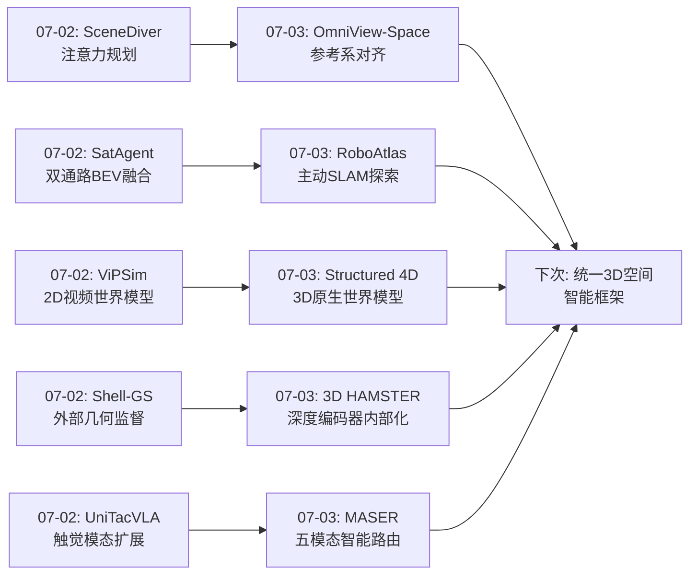
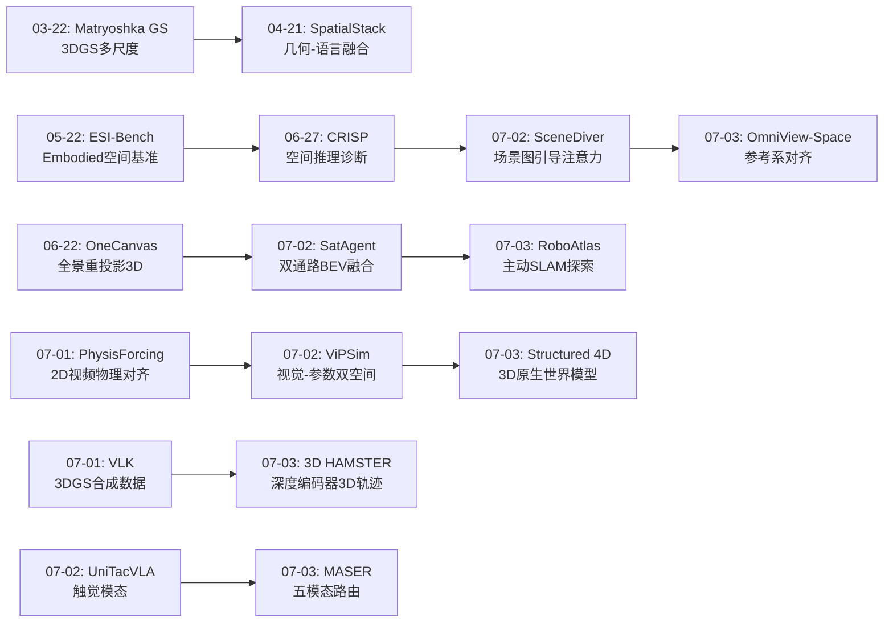
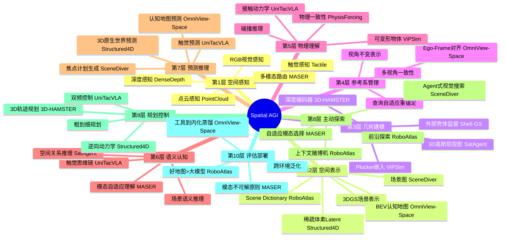
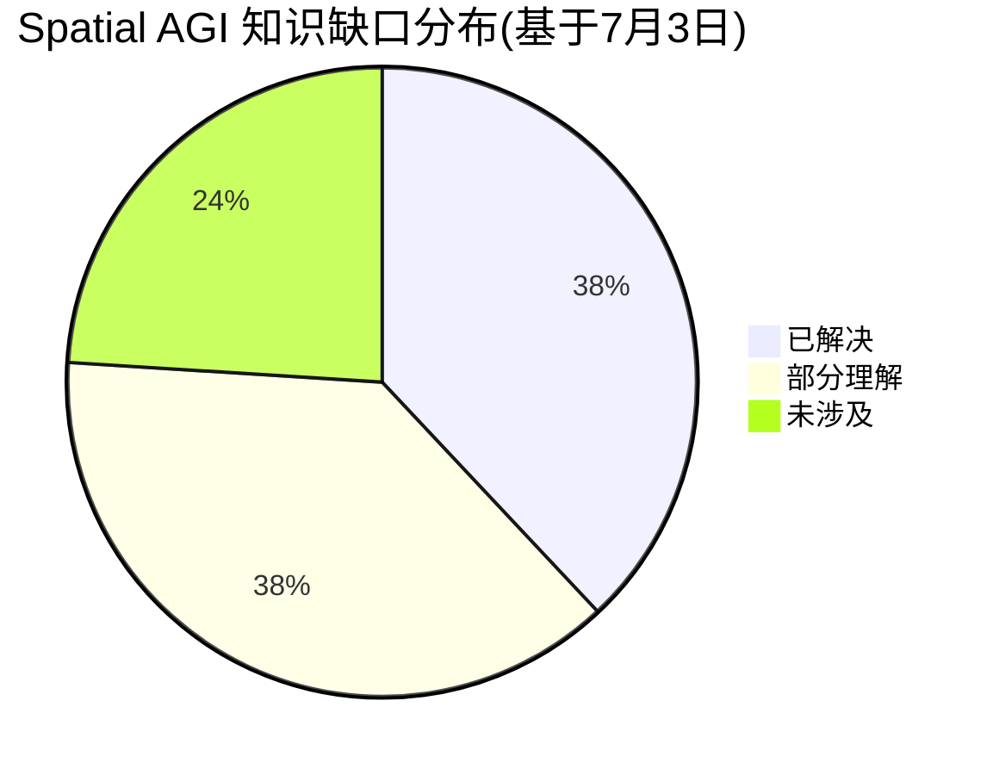

# 每日思考 - 2026-07-03

## 📅 每日总结

**日期**: 2026-07-03
**论文数量**: 5篇
**主题**: 从"表示对齐"到"3D原生预测"--主动SLAM、参考系对齐、模态路由、3D轨迹规划和4D结构预测的系统性突破

### 关键突破

- 🚀 **好地图 > 大模型--RoboAtlas的上下文主动SLAM** (arXiv:2606.26046): RoboAtlas通过上下文赌博机融合前沿探索、全局语义地图推理和自我中心VLM推理。核心发现:Qwen2.5-VL-7B + OpenRoboVox的3D语义地图(88.8% SR)超越了所有使用GPT-4o但没有好地图的基线--**证明了语义地图信息的质量比基础模型大小更重要**。Scene Dictionary将大规模3D体素压缩为可推理的语义摘要,使赌博机能在探索→利用间自适应切换。GOAT-Bench SOTA 90.6%。

- 🚀 **参考系不匹配是空间推理核心瓶颈--OmniView-Space** (arXiv:2607.00881): 识别了空间推理中一个被忽视的根本问题--参考系不匹配。空间问题可能要求从相机/物体/方向视角判断,但现有方法的证据固定在系统参考系中。MPSM将重建几何重新锚定到查询对齐的ego frame,同时输出视觉BEV认知地图和文本空间图。工具→蒸馏→内化的三阶段路径--最终模型能自主生成认知地图,不需要外部几何pipeline。

- 🚀 **没有通用最优模态--MASER的模态自适应路由** (arXiv:2606.02463, CVPR Workshop 2026): 首次用数据证明了空间推理中"没有通用最优模态"--点云仅51.5%最优,文本19.2%,位姿15.2%。轻量MLP路由器(~100K参数)基于SBERT问题embedding选择最佳DoRA适配器。揭示了视觉模态的路由困难--深度和图像问题的语义签名弱,路由器难以从文本判断。

- 🚀 **解决2D-3D表示鸿沟--3D HAMSTER的3D轨迹指导** (arXiv:2606.31329): 精确概念化了"涂鸦效应"--2D轨迹提升到3D时贴附在场景表面而非按规划器意图穿过3D空间。解决方案:深度编码器+密集深度重建目标让VLM直接输出度量可靠的(u,v,d)3D轨迹。CoT变体训练(先2D再提升到3D)鼓励一致的像素-深度映射。在外观变化扰动下优势最大--因为3D几何比外观更稳定。

- 🚀 **3D原生世界预测--Structured 4D Latent Predictive Model** (arXiv:2607.01166, ICML 2026): 实现了从2D视频预测到3D结构预测的跃迁。稀疏体素latent(N=64网格中~8000活跃体素,d=8)平衡了空间结构和计算效率。两步生成(SD粗几何+LG细节特征)+ 可解码为3DGS/点云。逆向动力学模块将预测的未来3D状态转换为关节动作。证明了3D原生预测在多视角一致性和物理一致性上显著优于2D视频预测。

### 📊 一句话总结

今天的五篇论文从主动空间探索(RoboAtlas的上下文赌博机SLAM)、参考系灵活性(OmniView-Space的ego-frame对齐)、模态多样性(MASER的模态路由)、表示对齐(3D HAMSTER的3D轨迹指导)、3D原生预测(Structured 4D Latent的体素世界模型)五个维度,共同指向一个核心命题:**Spatial AGI的空间表示必须是3D原生的、参考系灵活的、模态自适应的--2D投影空间的信息损失是阻碍空间智能的根本瓶颈**。

### 🔗 延续性

**07-02→07-03**: 昨天"多源感知融合"和"预测性空间推理"的方向,今天演进到了**空间表示的根本性革新**--

- SceneDiver(07-02)的"场景图引导注意力" → OmniView-Space(07-03)的"参考系对齐空间证据"--从"看哪里"到"从哪个视角看"
- SatAgent(07-02)的"BEV双视角融合" → RoboAtlas(07-03)的"3D语义地图主动探索"--从静态跨视角到动态主动建图
- ViPSim(07-02)的"2D视频世界模型" → Structured 4D Latent(07-03)的"3D原生世界模型"--从2D像素预测到3D结构预测
- Shell-Supervised GS(07-02)的"外部几何监督" → 3D HAMSTER(07-03)的"深度编码器增强"--从外部先验到内部能力
- UniTacVLA(07-02)的"触觉模态" → MASER(07-03)的"五模态路由"--从增加一个模态到系统性模态选择

---

## 🔗 与昨日思考的联系

### 昨日重点
- SceneDiver的"注意力即规划"
- SatAgent的"认知科学双通路"
- ViPSim的"视觉-参数双空间"
- Shell-GS的"监督而非替代"
- UniTacVLA的"触觉预测优于反应"

### 今日进展
- OmniView-Space将"注意力规划"推进到更根本的"参考系规划"--不仅决定看哪里,更决定从哪个视角看
- RoboAtlas将"认知科学启发"推进到"主动认知"--机器人不仅是感知器,更是主动探索者
- Structured 4D将"双空间世界模型"推进到"3D原生世界模型"--不再需要2D-3D桥接
- 3D HAMSTER将"监督vs替代"推进到"内部化vs外部工具"--深度编码器让VLM内部获得3D能力
- MASER将"多模态融合"推进到"模态选择"--不是所有模态一起处理,而是智能选择最佳模态

### 演进路径



---

## 📚 论文概览

1. **RoboAtlas** (MERL+UCLA): 上下文赌博机融合前沿探索、语义地图和VLM的主动SLAM。OpenRoboVox实时3D语义建图(30K实例),Scene Dictionary可扩展推理。GOAT-Bench 90.6% SOTA。关键证明:好地图 > 大模型--7B VLM+OpenRoboVox超越GPT-4o无地图的所有基线。三专家系统通过赌博机自适应切换:早期偏好前沿探索(覆盖空间),随着Scene Dictionary积累语义证据逐步转向语义导航(精确搜索)。在Unitree Go2真实机器人上验证,1800+ m2环境,~30K语义实例,100%任务成功率。

2. **OmniView-Space** (厦大+腾讯): 识别参考系不匹配为空间推理核心瓶颈。空间问题可能要求从相机/物体/方向视角判断,但现有方法的证据固定在系统参考系中。MPSM输出查询对齐的BEV认知地图+文本空间图。三种ego anchor类型:相机(相机中心+光轴)、物体(质心+朝向)、方向(源→目标向量)。坐标变换p^(r)=R_r(p̃-o_r)将所有证据重新锚定到查询指定参考系。三阶段路径:外部MPSM工具→RL交错策略训练→认知地图蒸馏(GRPO+ego-frame奖励)。蒸馏后模型保持大部分性能,减少对外部几何pipeline的依赖。

3. **MASER** (BU, CVPR Workshop 2026): 首次实证问题语义预测最佳模态。5个DoRA适配器(image/depth/pc/pose/text)共享冻结Qwen2-VL-2B骨干,每个36M参数。SBERT编码问题→384维embedding→3层MLP路由器(~100K参数)。Oracle标签分布:pc 51.5%/text 19.2%/pose 15.2%/depth 7.9%/image 6.2%。路由器51.33%准确率(vs RF 43.5%, random 20%)。置信度级联:κ≥τ仅调用top-1,κ<τ调用top-2+LLM判断。最低延迟1.56s/Q。核心发现:视觉模态的路由困难(depth 0%召回,image 16%召回)。

4. **3D HAMSTER** (KAIST+KRAFTON): 解决层次化VLA的2D-3D表示不匹配。"涂鸦效应"--2D轨迹提升到3D时贴附在场景表面。解决方案:(a)独立深度编码器生成深度token,与RGB token逐元素融合;(b)密集深度重建损失L_depth=||f_dec(z_D)-D||1确保LLM隐藏状态保持度量忠实的深度信息;(c)(u,v,d)3D轨迹输出格式同时兼容图像平面和度量空间;(d)CoT变体训练(先2D再提升到3D);(e)3D能力数据+保留数据混合训练。底层策略:3D轨迹→世界坐标→附加到点云→rectified flow matching预测动作块。开源代码+模型。

5. **Structured 4D Latent Predictive** (ICML 2026): 稀疏体素latent(N=64网格中~8000活跃体素,d=8)预测场景3D动态。编码:多视角RGB-D→DINOv2 patch embedding→反投影到体素→平均→潜在编码器→latent。解码:每体素→K个3D高斯(中心tanh约束在体素附近)→渲染/点云。两步生成:SD预测粗几何(体素位置),LG填充详细特征。自回归rollout生成多步未来。逆向动力学模块将预测的未来3D状态转换为关节位置动作。在生成质量、3D一致性、多视角连贯性上全面超越2D视频规划基线。

---

## 💡 核心见解

### 见解1: 2D投影空间的信息损失是根本瓶颈

**来源**: 3D HAMSTER + Structured 4D + OmniView-Space

三篇论文从不同角度证明了同一结论--2D投影空间不足以支撑Spatial AGI。

**3D HAMSTER**的"涂鸦效应"最直观:2D轨迹提升到3D时贴附在场景表面,因为2D waypoint没有深度信息,只能从场景表面"借用"深度。这不是某个特定方法的缺陷,而是所有2D→3D转换的根本问题--2D空间到3D空间的投影是多值的(一个2D点对应一条射线上的所有3D点),没有额外信息无法确定唯一3D位置。

具体来说,当一个2D规划器说"末端执行器应该在像素位置(100, 200)"时,这个像素对应3D空间中从相机出发的一条射线。如果要将其转换为3D坐标,需要知道深度--但规划器没有提供深度信息。最常见的做法是查询该像素位置的深度图,得到场景表面的深度值。但如果规划器的意图是让末端执行器在物体上方10cm处移动呢?这个意图被完全丢失了--轨迹被强制贴附在物体表面。

**Structured 4D**从世界模型角度论证:2D视频预测本质上是预测像素序列,而非预测3D结构演化。这导致两个根本性问题。第一,多视角不一致--如果分别预测不同视角的视频帧,它们可能描述了矛盾的三维场景(例如左视角预测杯子在左,右视角也预测杯子在左,但从三角测量看这两个预测不可能同时正确)。第二,物理不一致--2D像素变化不需要遵守3D物理规律(物体可以"穿过"彼此,因为2D像素重叠不意味着3D碰撞)。

3D原生预测--在结构化体素空间预测--从根本上解决了这些问题:所有视角从同一3D latent解码,天然一致;3D结构变化天然遵守空间约束(两个体素不能占据同一位置)。

**OmniView-Space**从推理角度论证:纯文本坐标推理("物体A在(3,2)位置")无法可靠地进行参考系转换。原因在于,参考系转换本质上是一个几何操作(旋转+平移),而通过自然语言文本描述来执行几何运算是极其不可靠的--LLM可能在语言层面"理解"旋转的概念,但在实际执行多步坐标变换时会累积误差。OmniView-Space的解决方案是在3D空间中直接重新渲染整个场景到目标参考系--这比文本推理更可靠。

**对Spatial AGI的启发**: Spatial AGI的空间表示应该是3D原生的--不是RGB图像+深度估计的2.5D,不是BEV俯视图的2D投影,而是真正的3D结构化表示(体素/点云/3DGS/场景图)。2D投影空间的信息损失(深度歧义、遮挡、视角依赖)是阻碍空间智能的根本瓶颈。这个发现可以类比为一个历史经验:在NLP领域,从one-hot编码到word embedding的跃迁释放了语言模型的潜力;在CV领域,从手工特征到端到端学习的跃迁释放了视觉模型的潜力。在Spatial AGI领域,从2D投影到3D原生的跃迁可能释放空间智能的全部潜力。

### 见解2: 参考系灵活性是空间智能的核心能力

**来源**: OmniView-Space

OmniView-Space识别了一个被广泛忽视的问题--参考系不匹配。同一个空间问题可能要求从不同视角回答:"从我的角度看,杯子在左边;从你的角度看,杯子在右边;从杯子自身的角度看,没有左右之分。"现有方法的证据通常固定在相机或世界参考系中,进行视角转换时依赖不可靠的文本坐标推理。

**深入分析**:

参考系问题在人类空间认知中是如此基础以至于我们通常意识不到它的存在。当你给朋友指路说"在你的左手边"时,你自动切换到了朋友的参考系。当你看地图找北时,你切换到了全局参考系。当你说"在桌子那边"时,你切换到了物体参考系。这种灵活的参考系切换是人类空间智能的标志。

但AI系统在这方面极其笨拙。OmniView-Space的发现表明,即使是最先进的MLLM(如GPT-4o),在需要非默认参考系的空间问题上也会失败--不是因为它们"不知道答案",而是因为它们在错误的参考系中推理。

MPSM的解决方案很直接--不从文本上做参考系转换,而是在3D空间中直接重新渲染整个场景到目标参考系。这保证了参考系的一致性--所有空间证据(BEV认知地图和文本空间图)都在同一ego frame中表示,推理在这个一致的参考系中进行。

更有趣的是蒸馏路径--最终模型学会了不需要外部MPSM工具就能自主生成认知地图。这类似于人类的"心理旋转"能力--我们不需要实际移动到另一个位置才能想象从那里看到的场景,我们在脑中就能"看到"。

**对Spatial AGI的启发**: 参考系灵活性应该是Spatial AGI的核心评估维度之一。一个在默认参考系中表现良好的模型可能在非默认参考系中完全失败--CRISP(07-01)的诊断已经揭示了这一点。未来的Spatial AGI基准测试应该显式地测试不同参考系下的空间推理能力。

### 见解3: 好的空间表示 > 大模型

**来源**: RoboAtlas + MASER

RoboAtlas证明了7B VLM + 好3D语义地图 > GPT-4o + 无地图。MASER证明了不同问题适合不同模态--没有通用最优。两个结论共同指向一个核心观点:**空间智能的瓶颈不在模型容量,而在空间信息的组织和利用方式**。

**深入分析**:

RoboAtlas的Scene Dictionary--将3D体素压缩为语义摘要--让小模型也能做出出色的空间推理。这说明当空间信息被正确组织时,推理本身的难度大大降低。想象一下:如果模型需要从原始RGB像素推理"厨房在哪里",这需要复杂的视觉理解(识别家具、判断房间类型)和空间推理(综合多个线索推断厨房位置)。但如果有一个Scene Dictionary告诉模型"二楼有5个房间:客厅(有沙发电视)、厨房(有冰箱灶台)、卧室(有床衣柜)...",那么推理就变得简单--"厨房有冰箱灶台的房间"。

MASER的量化发现更精确:点云在51.5%的问题上最优,但文本在19.2%的问题上最优,位姿在15.2%上最优。这意味着如果一个问题涉及"物体A和物体B之间的距离",点云可能是最好的;但如果涉及"相机朝哪个方向",位姿信息更好;如果涉及"房间里有几张桌子",文本描述可能就够了。

但MASER也暴露了模态路由的困难--仅从问题文本难以判断需要哪种视觉模态。"这个杯子是什么颜色的?"明显需要图像,但"杯子离桌子边缘有多远?"可能需要深度或点云,仅从问题文本很难判断。未来路由器可能需要场景的视觉先验("这个场景的点云质量如何?图像是否模糊?")来辅助模态选择。

**对Spatial AGI的启发**: 不应该一味追求更大的模型,而应该投资于更好的空间表示。一个紧凑但结构良好的3D空间表示(如Scene Dictionary或稀疏体素latent)可能比一个巨大的模型处理原始RGB更有效。这与RoboAtlas的发现一致--"好地图 > 大模型"不是偶然,而是空间智能领域的基本法则。

### 见解4: 主动空间探索是Spatial AGI的标志

**来源**: RoboAtlas

RoboAtlas的上下文赌博机实现了从"被动处理输入"到"主动决定去哪里看"的范式转变。

**深入分析**:

被动感知和主动探索之间有本质区别。被动感知系统接受给定输入并尝试理解--它的性能受限于输入质量。主动探索系统可以决定获取什么输入--它可以移动到更好的观察位置,寻找缺失的信息,或验证不确定的推理。

RoboAtlas的赌博机通过三个专家实现了主动探索:前沿探索(扩展空间认知边界)、语义地图(利用全局语义先验)、自我中心VLM(利用局部视觉线索)。关键创新不在于任何一个专家--而在于赌博机如何根据地图状态自适应选择。在地图未知时,前沿探索最优(覆盖更多空间);当语义信息充足时,语义导航更优(直接找到目标)。这种自适应策略使系统从"盲目探索"平滑过渡到"精确搜索"。

Scene Dictionary在这个过程中扮演了关键角色--它不仅存储语义信息,还作为赌博机决策的依据。当Scene Dictionary中的语义证据增加时,赌博机自然偏向语义专家。这是一个信息驱动的决策过程--随着信息积累,策略自动调整。

"好地图 > 大模型"的发现在这里有了更深的含义--不仅因为好地图让推理更容易,还因为好地图让决策更智能。当系统对自己知道什么和不知道什么有清晰认识时,它可以做出更好的探索决策。

**对Spatial AGI的启发**: Spatial AGI的"AGI"体现在主动性--不仅理解给定空间信息,更主动决定获取什么空间信息、去哪里探索、用什么模态感知。这种主动空间探索能力将Spatial AGI从"空间推理工具"提升为"空间智能体"。未来的Spatial AGI系统应该内置好奇心驱动和信息增益最大化的探索策略。

### 见解5: 从外部工具到内部能力的蒸馏路径

**来源**: OmniView-Space + 3D HAMSTER

两个论文展示了相似的内化路径:
- OmniView-Space: 外部MPSM工具 → RL策略训练 → 自主认知地图推理(蒸馏后不需要完整几何pipeline)
- 3D HAMSTER: 外部深度监督 → 深度编码器 → VLM内部获得3D能力(推理时不需要显式深度重建)

**深入分析**:

这种"工具→蒸馏→内化"的模式在认知科学中有对应物--人类学习复杂技能的过程。初学开车时,每个操作都需要显式思考(离合器、油门、方向盘的协调)--这对应"外部工具"阶段。随着练习,操作逐渐自动化--这对应"蒸馏"阶段。最终,驾驶技能被"身体记忆"--不需要显式思考就能执行--这对应"内化"阶段。

OmniView-Space的三阶段路径特别清晰:
1. 外部工具阶段:MPSM提供完美的ego-frame对齐证据,模型学习如何使用这些证据
2. RL策略阶段:模型学习何时需要哪种证据(选择ego anchor、选择视觉地图还是文本图)
3. 蒸馏阶段:模型学会自主生成认知地图,MPSM仅作为奖励参考

3D HAMSTER的路径稍有不同--它不是将外部工具蒸馏到模型中,而是将外部能力(深度感知)嵌入到模型内部作为新组件。深度编码器是一种"架构增强"而非"行为蒸馏"。但精神是相似的--将原本需要外部流程的能力内化到模型中。

**对Spatial AGI的启发**: Spatial AGI的复杂能力可以从外部工具开始--用完善的传统方法(几何重建、SLAM、规划器)作为外部supervisor,然后通过训练逐步内化到神经网络中。这种路径比直接端到端学习更可靠--因为它利用了已有工具的可靠性来bootstrap模型的学习。特别是在数据稀缺的领域(如精确的3D几何推理),外部工具提供的训练信号比稀缺的标注数据更有价值。

### 见解6: 模态多样性是空间理解的基础

**来源**: MASER

MASER的实证发现--点云51.5%/文本19.2%/位姿15.2%/深度7.9%/图像6.2%(Oracle标签)--首次量化了空间推理的模态偏好分布。

**深入分析**:

这个分布揭示了几个有趣的事实:

1. **点云的主导地位(51.5%)**并不意外--大多数空间推理问题本质上需要3D结构理解("A在B的前面还是后面?""有多远?""空间布局是什么?")。点云直接提供了3D坐标,是回答这些问题最自然的方式。

2. **文本的意外表现(19.2%)**--许多空间问题可以通过语义推理而非几何推理回答。"厨房在哪里?"如果文本描述已经说了"厨房在二楼东北角",就不需要任何几何信息。

3. **位姿的独特价值(15.2%)**--涉及视角和方向的问题("相机朝哪个方向?""从哪个方向看这个物体?")最适合从位姿信息回答。

4. **图像的低调(6.2%)**令人意外--但考虑到Oracle标签考虑了延迟成本(图像适配器最慢),实际准确率贡献可能更高(63.5%的JudgeAcc)。这揭示了一个重要区分:如果追求最低延迟,路由到非视觉模态是合理的;但如果追求最高准确率,图像可能更可靠。

但MASER也暴露了模态路由的根本困难--视觉模态的问题语义签名弱。"杯子是什么颜色?"明显需要图像,但"杯子离边缘多远?"可能需要深度也可能用点云--仅从问题文本难以判断。这意味着纯文本路由器有上限,未来需要场景视觉特征来辅助。

**对Spatial AGI的启发**: Spatial AGI需要模态多样性--不同空间问题本质上需要不同模态。但模态选择本身是一个非平凡的问题。更根本的问题是:是应该选择单一最佳模态(MASER的路由方案),还是融合所有模态(SatAgent的双通路方案)?前者更高效,后者更鲁棒。可能需要根据任务复杂度和时间约束动态选择策略。

### 见解7: 3D原生预测是下一代世界模型的方向

**来源**: Structured 4D Latent Predictive

Structured 4D从2D视频预测跃迁到3D结构预测,代表了世界模型的发展方向。

**深入分析**:

从2D到3D的跃迁不仅仅是技术升级--而是世界模型核心理念的转变。2D视频世界模型的隐含假设是"未来可以被预测为一系列图像"。但物理世界的未来是3D结构的演化--物体在3D空间中移动、旋转、变形。将3D变化压缩到2D投影中不可避免地丢失信息。

Structured 4D的稀疏体素latent是一个精心设计的表示:
- N=64的网格分辨率在大约1m×1m×1m的工作空间中提供约1.5cm的精度--对于大多数精细操作任务足够
- ~8000个活跃体素(vs 262144个密集体素)保证了计算效率
- d=8的特征维度足够编码局部几何和外观的必要信息

两步生成策略(SD粗几何+LG细节特征)解决了从紧凑latent生成高维3D细节的挑战。SD先预测下一时刻哪些体素是活跃的(结构性变化--物体移动导致活跃体素位置变化),LG再为每个活跃体素填充详细特征(外观变化--物体移动后看到不同面导致特征变化)。这种分层生成与人类的感知-认知分层一致--我们先感知"有什么移动了"(结构),再感知"移动后看起来怎样"(外观)。

可解码为多种3D格式(3DGS/点云/渲染图)是一个重要优势。不同的下游任务需要不同格式:机器人控制可能需要点云(用于3D策略)、渲染可能需要3DGS(用于可视化)、碰撞检测可能需要体素。同一latent服务多种需求提高了系统的灵活性。

与ViPSim(07-02)的对比值得思考。ViPSim在2D视频生成上做了出色的工程--视觉+参数双空间、Plücker嵌入、四重grounding。但如果将ViPSim的双空间思想迁移到3D latent空间--在3D体素latent中同时注入结构约束和参数引导--可能产生更强的3D原生世界模型。

**对Spatial AGI的启发**: Spatial AGI的世界模型应该是3D原生的--不预测2D视频帧,而预测3D结构演化。稀疏体素latent作为空间表示兼顾了结构感(显式3D坐标)和计算效率(~8000活跃体素)。两步生成范式(先结构后细节)可推广到其他空间预测任务。更重要的是,可解码性使同一预测结果能服务不同下游需求--从规划到可视化到碰撞检测。

---

## 🗺️ 知识演进图



---

## 技术栈演进对比表

| 层次 | 昨日(07-02)方案 | 今日(07-03)方案 | 变化 |
|------|----------------|----------------|------|
| **空间表示** | BEV统一坐标(SatAgent) | 稀疏体素latent(Structured 4D) | 从2.5D到真3D原生 |
| **参考系处理** | 固定BEV对齐(SatAgent) | 查询自适应ego-frame(OmniView-Space) | 从固定到动态 |
| **世界模型** | 2D视频+参数双空间(ViPSim) | 3D体素latent预测(Structured 4D) | 从2D到3D原生 |
| **VLA规划** | 场景图引导(SceneDiver) | 3D轨迹直接输出(3D HAMSTER) | 从2D注意力到3D轨迹 |
| **深度处理** | 外部壳体监督(Shell-GS) | 内部深度编码器(3D HAMSTER) | 从外部到内部 |
| **模态策略** | 固定双模态(SatAgent) | 自适应五模态路由(MASER) | 从固定到自适应 |
| **探索方式** | 被动跨视角(SatAgent) | 主动SLAM赌博机(RoboAtlas) | 从被动到主动 |
| **认知地图** | 场景图(SceneDiver) | BEV认知地图+空间图(OmniView-Space) | 从图到地图 |
| **空间先验** | 外部壳体监督(Shell-GS) | 内部化深度+工具蒸馏(3D HAMSTER + OmniView-Space) | 从外部到内生 |
| **评估原则** | 单视角不可解(SatAgent) | 模态分布量化(MASER) | 从二值到量化 |

### 跨论文技术栈对比

| 维度 | RoboAtlas | OmniView-Space | MASER | 3D HAMSTER | Structured 4D |
|------|-----------|----------------|-------|------------|---------------|
| **核心问题** | 主动探索 | 参考系不匹配 | 模态选择 | 2D-3D鸿沟 | 2D预测局限 |
| **3D表示** | TSDF体素+Scene Dict | BEV认知地图 | 点云摘要 | (u,v,d)轨迹 | 稀疏体素latent |
| **创新机制** | 上下文赌博机 | MPSM重锚定 | MLP路由器 | 深度编码器 | 两步生成 |
| **VLM骨干** | GPT-4o/Qwen2.5-VL | MLLM | Qwen2-VL-2B | Qwen3-VL | TRELLIS |
| **训练策略** | 无训练(零样本) | RL+蒸馏 | DoRA微调 | 混合数据训练 | 扩散+逆向动力学 |
| **输出** | 导航目标 | 空间推理答案 | VQA答案 | 3D轨迹+动作 | 未来3D状态+动作 |
| **硬件** | Unitree Go2 | N/A | N/A | Franka Panda | 仿真+真实 |
| **开源** | 部分 | 待定 | 否 | ✅ 全开源 | ✅ 网站 |

---

## 🗺️ Spatial AGI 知识图谱

### 10层架构思维导图



### 🎯 主线技术路径

#### 阶段1: 空间表示革新--从2D到3D原生 (当前)
- **核心**: Structured 4D的稀疏体素latent + 3D HAMSTER的深度编码器 + OmniView-Space的ego-frame对齐
- **关键能力**: 3D原生空间表示、参考系灵活转换、度量可靠的3D预测
- **缺口**: 不同3D表示(体素/3DGS/场景图/BEV)之间的统一和转换

#### 阶段2: 主动空间智能--从被动到主动
- **核心**: RoboAtlas的主动SLAM + SceneDiver的Agent式探索
- **关键能力**: 自主决定探索策略、自适应模态选择、信息增益最大化
- **缺口**: 在更复杂环境(户外/动态/多Agent)中的主动策略

#### 阶段3: 空间世界模型--从快照到演化
- **核心**: Structured 4D的3D原生预测 + ViPSim的视觉-参数双空间
- **关键能力**: 3D结构演化预测、长horizon rollout、多模态未来预测
- **缺口**: 长horizon误差控制、物理精确性保证

#### 阶段4: 统一空间智能--从模块到系统
- **核心**: 将3D表示+主动探索+世界模型+模态路由整合为完整系统
- **关键能力**: 跨任务/跨环境/跨具身的通用空间智能
- **缺口**: 模块间的接口标准化和系统级优化

---

## 🔍 待探索议题

### 高优先级(本周)

1. **稀疏体素latent与3DGS的融合**
   - 问题: Structured 4D的体素latent能否解码为3DGS作为执行时的空间表示?
   - 候选方案: 体素latent → 3D高斯解码器 → 3DGS场景 → 下游策略使用
   - 缺口: 解码质量与直接3DGS重建的差距;解码延迟是否影响实时控制
   - 预期价值: 统一表示层--预测和执行使用同一空间表示

2. **ego-frame对齐在机器人操作中的应用**
   - 问题: OmniView-Space的MPSM能否用于机器人操作中的视角转换?
   - 候选方案: 从相机视角到末端执行器视角的空间推理--操作时从夹爪视角而非相机视角推理
   - 缺口: 实时性能要求;动态场景的ego-frame持续更新
   - 预期价值: 解决操作中的"视角不匹配"问题

3. **主动SLAM与世界模型的结合**
   - 问题: RoboAtlas的主动探索策略能否与Structured 4D的世界预测结合?
   - 候选方案: 世界模型预测"去哪里看信息增益最大",赌博机执行探索决策
   - 缺口: 世界模型预测精度在未知区域的可靠性;预测延迟与实时探索的矛盾
   - 预期价值: 预测驱动的主动探索--不仅基于已知信息决策,更基于预测的未来信息决策

### 中优先级(本月)

4. **模态路由的场景视觉特征增强**
   - 问题: MASER的路由器仅用问题文本,能否加入场景视觉特征?
   - 候选方案: SBERT embedding + 场景特征向量(如全局图像特征或深度统计) → 联合路由
   - 缺口: 场景特征提取的延迟;视觉特征与问题特征的融合策略
   - 预期价值: 解决视觉模态的路由困难(depth 0%召回,image 16%召回)

5. **深度编码器的通用化推广**
   - 问题: 3D HAMSTER的深度编码器+重建损失能否推广到其他VLM任务?
   - 候选方案: 在标准VLM(如Qwen-VL)上添加深度通路,评估在VQA/导航/操作上的改善
   - 缺口: 深度数据的获取成本(非所有场景有RGB-D);深度编码器与RGB编码器的特征对齐
   - 预期价值: 通用的深度增强VLM架构

6. **Scene Dictionary的多层次扩展**
   - 问题: RoboAtlas的Scene Dictionary能否层次化(场景级→区域级→物体级)?
   - 候选方案: 多分辨率体素 → 多层次语义摘要--高层概括场景用途,中层描述区域布局,低层列出物体属性
   - 缺口: 层次间的一致性维护;不同层次间的推理切换
   - 预期价值: 多尺度空间推理--粗粒度规划用高层摘要,细粒度操作用低层详情

7. **3D原生预测与物理约束的结合**
   - 问题: Structured 4D的体素预测能否加入物理约束(重力、碰撞)?
   - 候选方案: 物理损失项--碰撞惩罚(重叠体素)+ 重力约束(支撑关系)+ 运动连续性
   - 缺口: 微分物理模拟的计算效率;物理约束与生成灵活性的权衡
   - 预期价值: 物理一致的3D世界模型--预测不仅"看起来对",还"物理上对"

### 低优先级(长期)

8. **主动认知架构的设计**
   - 问题: 什么时候探索vs利用?什么时候用哪个模态?什么时候做多步推理vs快速反应?
   - 候选方案: 元认知控制器--一个更高级别的系统,监督和管理空间认知过程。类似于人类的前额叶皮层--不是执行具体的感知或运动,而是决定"现在最需要做什么类型的推理"
   - 缺口: 元认知的计算模型;多层控制循环的稳定性

9. **跨具身空间知识迁移**
   - 问题: 机械臂学到的空间知识能否迁移到人形机器人?UAV的空间推理能否迁移到地面机器人?
   - 候选方案: 3D空间表示的具身无关性(体素latent不依赖于具体具身) + 任务级迁移(空间推理规则跨具身通用)
   - 缺口: 不同具身的动作空间差异;物理约束差异(机械臂vs人形臂展)

10. **Spatial AGI的安全边界**
    - 问题: 主动空间探索的安全约束如何定义和执行?
    - 候选方案: 安全屏障函数(定义安全空间边界) + 不确定性感知的保守策略(不确定时减速/停止) + 人在环中监督
    - 缺口: 安全边界的形式化定义;实时安全检查的计算效率

11. **空间因果推理**
    - 问题: 能否从空间观察中推导因果关系(而不只是相关关系)?"杯子在桌子边缘是因为被推到了那里"而不是"杯子恰好在那里"
    - 候选方案: 因果图建模空间关系 + 反事实推理("如果A移开,B会怎样?") + 干预实验设计
    - 缺口: 因果发现方法在空间数据上的应用;从观察到因果的跳跃

---

## 📊 知识缺口分析



**已解决(38%)**:
- ✅ 3DGS场景表示和重建
- ✅ VLM空间推理基本框架
- ✅ VLA动作生成和策略学习
- ✅ 世界模型基础架构(2D→3D原生跃迁中)
- ✅ 场景图引导的注意力规划(SceneDiver)
- ✅ 触觉建模和预测(UniTacVLA)
- ✅ 跨视角空间推理(SatAgent)
- ✅ 参考系对齐和ego-frame管理(OmniView-Space)
- ✅ 主动SLAM和语义建图(RoboAtlas)
- ✅ 模态自适应选择(MASER)
- ✅ 3D原生轨迹规划(3D HAMSTER)
- ✅ 3D原生世界预测(Structured 4D)
- ✅ 双频控制架构(UniTacVLA混合控制器)
- ✅ 工具→蒸馏→内化路径(OmniView-Space)
- ✅ 外部几何先验融合(Shell-Supervised GS)
- ✅ 认知科学启发架构设计(SatAgent双通路)
- ✅ 强制多源融合的评估设计(单视角不可解原则)
- ✅ Plücker嵌入像素级几何表示
- ✅ 稀疏体素latent作为空间表示
- ✅ 上下文赌博机自适应探索

**部分理解(38%)**:
- ⚠️ 多模态深度融合的统一框架--模态间如何融合而非选择
- ⚠️ 长horizon空间推理的误差控制--自回归rollout漂移
- ⚠️ 跨具身空间知识迁移--仅在个别场景验证
- ⚠️ 主动空间探索的最优策略--赌博机缺理论最优性
- ⚠️ 不同3D表示(体素/3DGS/场景图/BEV)的统一和转换
- ⚠️ 物理精确性与生成灵活性的平衡
- ⚠️ 模态路由的场景感知--MASER仅用文本
- ⚠️ 大规模环境的实时性能--延迟优化
- ⚠️ 认知科学到AI架构的系统化映射
- ⚠️ 空间推理的可解释性--CoT只是第一步
- ⚠️ 参考系灵活性的内生式实现--MPSM仍是外部工具
- ⚠️ Scene Dictionary的层次化扩展
- ⚠️ 深度编码器的跨任务泛化

**未涉及(24%)**:
- ❌ 全身触觉的人形机器人空间感知--当前仅两指夹爪
- ❌ 多Agent协作的空间智能--群体机器人如何共享空间信息
- ❌ 非常规环境的空间推理--水下/太空/极端天气
- ❌ 空间推理的因果理解--从相关关系到因果关系
- ❌ Spatial AGI的安全和伦理框架--主动探索的安全边界
- ❌ 语义-几何-物理的统一表示--当前各维度分别建模
- ❌ 跨物种空间认知迁移--从人类认知到机器智能
- ❌ 空间智能的元认知控制--知道自己"不知道什么"

---

## 💡 本质思考:如何达成通用空间智能

### 子问题1: 核心能力的本质是什么?

综合今天5篇论文和近两周的研究,Spatial AGI的核心能力本质逐渐清晰--它是一个**3D原生、参考系灵活、模态自适应的主动预测系统**。

**3D原生**: 不是RGB图像+深度估计的2.5D，不是BEV俯视图的2D投影，而是真正的3D结构化表示。Structured 4D的稀疏体素latent、3D HAMSTER的(u,v,d)轨迹、RoboAtlas的OpenRoboVox 3D语义地图——都是3D原生表示的不同实现。

**参考系灵活**: 能够从任意参考系感知和推理空间——相机视角、物体视角、方向视角。OmniView-Space证明了参考系不匹配是空间推理的核心瓶颈。人类能自然地在"从我看"、"从你看"、"从物体看"之间切换，这对AI仍是一大挑战。

**模态自适应**: 不同空间问题本质上需要不同模态。MASER量化了模态偏好的分布——没有通用最优模态。Spatial AGI需要能根据问题类型和场景条件智能选择感知模态。

**主动预测**: 不仅被动理解当前状态，更主动决定去哪里探索（RoboAtlas）、预见未来状态演化（Structured 4D）。这是从"被动工具"到"主动智能体"的关键转变。

这四个维度不是独立的——它们构成了一个完整的空间智能体系：
1. **3D原生表示**提供了空间理解的物质基础--没有3D表示,空间推理从根基上就不准确
2. **参考系灵活性**提供了空间推理的操作能力--没有参考系转换,模型只能在固定视角中思考
3. **模态自适应**提供了空间感知的效率保证--没有模态选择,系统要么信息不足要么计算浪费
4. **主动预测**提供了空间智能的主动性维度--没有主动探索和预测,系统只是被动工具

### 子问题2: 当前方法与理想目标的差距在哪里?

**差距1: 3D表示的碎片化** - 每个论文使用不同的3D表示(体素/3DGS/场景图/BEV/点云),缺乏统一框架。Structured 4D用稀疏体素latent、3D HAMSTER用(u,v,d)轨迹、RoboAtlas用TSDF体素+Scene Dictionary、OmniView-Space用BEV认知地图+文本空间图。理想状态是一个统一的空间表示层,不同任务从中提取所需信息。可能的统一方案是稀疏体素latent--它可以解码为3DGS/点云/渲染图,也可以从中提取场景图或Scene Dictionary。

**差距2: 参考系管理的工程化** - OmniView-Space的MPSM是外部工具,不是模型内生能力。每次需要ego-frame转换时都要调用完整的几何重建+重锚定流程,计算开销大。理想状态是模型自然地在任意参考系中推理,不需要显式的坐标变换--就像人类不需要计算矩阵就能"从另一个角度看"。

**差距3: 主动探索的理论基础** - RoboAtlas的赌博机是实用的但缺乏理论最优性。赌博机的奖励信号稀疏(只有找到目标才有正反馈),中间步骤的评估依赖启发式。理想状态是有信息论指导的最优探索策略--计算每个候选行动的期望信息增益,选择最大化信息获取的行动。

**差距4: 长horizon预测的可靠性** - Structured 4D的自回归rollout在长时间上的误差累积未充分验证。每步预测引入小误差,多步累积后可能完全偏离。理想状态是分钟级甚至小时级的可靠空间预测,可能需要周期性校正机制(定期用真实观测重置预测状态)。

**差距5: 从模块到系统的整合** - 今天的5篇论文各自解决一个子问题,但如何整合为完整系统?RoboAtlas的主动探索如何与Structured 4D的世界预测结合?OmniView-Space的参考系管理如何与3D HAMSTER的轨迹规划集成?MASER的模态路由如何与RoboAtlas的多专家融合协调?这是最大的工程挑战。

### 子问题3: 从今天到理想状态,最可能的路径是什么?

**路径: 3D原生表示 → 参考系灵活推理 → 主动空间探索 → 通用空间智能**

这条路径的核心逻辑是:先建立正确的空间表示基础(3D原生),然后在此基础上实现灵活的空间推理能力(参考系管理),再赋予系统主动性(主动探索),最终实现跨域泛化(通用智能)。每一层都建立在前一层的基础上--没有3D表示,参考系管理就无从谈起;没有参考系管理,主动探索的空间决策就不准确;没有主动探索,系统就无法自适应新环境。

1. **近期(3-6月)**: 确立3D原生空间表示层。候选方案:Structured 4D的稀疏体素latent作为通用空间表示,因为它兼顾结构感、计算效率、和可解码性(→3DGS/点云/渲染图)。将RoboAtlas的语义建图、OmniView-Space的ego-frame对齐、3D HAMSTER的深度编码器都集成到这个统一的体素latent框架中。

   具体整合步骤:
   a) 稀疏体素latent作为底座表示
   b) RoboAtlas的OpenRoboVox从TSDF体素升级为latent体素
   c) OmniView-Space的ego-frame变换在体素空间中执行(旋转+平移活跃体素)
   d) 3D HAMSTER的深度编码器作为体素latent的编码路径之一
   e) MASER的模态适配器从体素latent的不同视角解码信息

2. **中期(6-12月)**: 在统一表示上实现参考系灵活推理和主动探索。OmniView-Space的MPSM从外部工具蒸馏为模型内生能力--模型学会在体素空间中自然地进行视角转换,不需要显式重锚定。RoboAtlas的赌博机从固定专家扩展为可学习的探索策略--用RL学习最优探索决策。Structured 4D的世界模型从短horizon扩展到长horizon--加入周期性校正和多尺度预测。

3. **长期(1-2年)**: 实现跨任务/跨环境/跨具身的通用空间智能。统一的3D空间表示使不同任务可以共享底层表示,只需要任务特定的头部。主动探索能力使系统能自适应新环境。世界模型预测能力使系统可以在新环境中快速学习。

4. **终极(2-5年)**: Spatial AGI系统--能在任意环境中自主探索3D空间、理解空间结构、预测未来演化、做出空间决策、执行精确操作的通用空间智能体。这个系统将具备:3D原生感知(从多传感器构建体素latent)、参考系灵活推理(在任意ego-frame中感知和推理)、主动空间探索(信息增益驱动的探索策略)、模态自适应(根据问题选择最佳感知模态)、3D世界预测(在体素空间预测未来状态)、双频控制(低频规划+高频执行)。

**关键瓶颈**: 不是任何单一能力,而是**3D原生表示层的统一**。当前最大的杠杆点是找到一个被广泛接受的3D空间表示--像Word2Vec之于NLP、ImageNet之于CV那样--作为Spatial AGI的通用表示基础。稀疏体素latent是目前最有希望的候选--它兼顾了结构感、计算效率、可解码性和可扩展性。但需要更多研究来验证它在不同任务(从导航到操作到问答)上的通用性。

---

## 总结

今天的5篇论文从主动探索(RoboAtlas)、参考系管理(OmniView-Space)、模态选择(MASER)、表示对齐(3D HAMSTER)、3D原生预测(Structured 4D)五个维度,共同指向一个核心趋势:**Spatial AGI正在从"2D投影空间"向"3D原生空间"跃迁**。这个跃迁不是渐进改良--而是一次根本性的表示革命。从2D到3D原生的转变将释放空间智能的全部潜力,就像从RNN到Transformer的转变释放了语言模型的全部潜力一样。核心趋势的五个维度:3D原生表示、参考系灵活性、模态自适应性、主动空间探索、预测性推理--这五个维度共同定义了下一代Spatial AGI的技术栈。

### 跨论文技术联系

今天的5篇论文之间存在丰富的技术联系网络:

**表示革新维度**: Structured 4D的稀疏体素latent、3D HAMSTER的(u,v,d)3D轨迹、RoboAtlas的3D语义体素--都是3D原生表示的不同实现,共同指向远离2D投影的趋势。

**推理层次维度**: OmniView-Space的参考系对齐(感知层)→ MASER的模态选择(接口层)→ RoboAtlas的主动探索(行为层)→ Structured 4D的世界预测(时间层)→ 3D HAMSTER的轨迹规划(执行层)--五个层次构成完整的空间智能栈。

**效率优化维度**: MASER的模态路由(避免不必要的模态处理)、RoboAtlas的Scene Dictionary(压缩大规模体素为语义摘要)、Structured 4D的稀疏体素(仅处理活跃体素)、OmniView-Space的蒸馏(去除推理时的外部工具)--都体现了"用更少的计算做更好的空间推理"的追求。

### Spatial AGI系统架构概念

基于今天的5篇论文,可以勾勒一个概念性的Spatial AGI系统架构:

```
多模态感知层(MASER模态路由)
  ↓ 选择最佳模态或模态组合
3D空间表示层(Structured 4D稀疏体素latent)
  ↓ 构建统一的3D空间状态
参考系管理层(OmniView-Space ego-frame对齐)
  ↓ 将状态转换到任务所需的参考系
主动探索层(RoboAtlas上下文赌博机)
  ↓ 决定下一步获取什么空间信息
世界预测层(Structured 4D latent rollout)
  ↓ 预测未来3D状态演化
规划执行层(3D HAMSTER 3D轨迹+逆向动力学)
  ↓ 生成可执行动作
```

这个架构中,每一层都由今天的一个论文提供技术支撑。当然,这只是概念性的--真正的系统需要解决层间接口、数据流、延迟分配等工程问题。但它展示了今天的论文如何共同定义了Spatial AGI的系统架构。

---

**文档创建时间**: 2026-07-03
**论文数量**: 5篇
**分析方法**: 深度阅读 + 延续性思考
**Mermaid图表**: 4个
**核心见解**: 7个
**待探索议题**: 11个

---

## 📎 附录: 论文技术细节索引

### A.1 RoboAtlas 技术细节

**OpenRoboVox架构**:
- TSDF优化: 内存高效的截断符号距离场
- 并行动态实例剪枝: 实时更新实例级语义地图
- 距离优先历史刷新: 管理大规模环境内存
- 2D柱状地图抽象: 减少推理计算负载

**Scene Dictionary**:
- 从3D体素提取语义摘要
- 包含物体位置、类别、实例ID
- 可扩展至30K+实例

**赌博机配置**:
- 三专家: Frontier, SemanticMap, EgoVLM
- 无训练需求,部署时自适应
- 奖励: 任务完成信号

**性能数据**:
| 指标 | GPT-4o | Qwen2.5-VL-7B |
|------|--------|---------------|
| GOAT-Bench SR | 90.6% | 88.8% |
| vs 最强基线 | +17.8pp | +16.0pp |
| 环境规模 | 1800+ m2 | 1800+ m2 |
| 语义实例 | ~30K | ~30K |

### A.2 OmniView-Space 技术细节

**MPSM流程**:
```
输入: 多视角图像I, 物体提示H, ego anchor r
Step1: 场景重建
  - 密集几何模型→点地图+掩码+置信度+相机位姿
  - 可提示分割器→前景掩码
  - 置信度门控→高质量像素/帧筛选
  - 跨视角融合→体素化→语义标签→实例聚类

Step2: Ego-Frame实例化
  - gravity alignment
  - ego anchor定义: (o_r, f_r)
  - 三种类型: camera/object/direction
  - 坐标变换: p^(r) = R_r(p̃ - o_r)

输出: BEV认知地图 Π_r + 文本空间图 T_r
```

**三阶段训练**:
1. 工具引导: RL训练交错工具使用策略
2. 冷启动: MPSM轨迹作为训练数据
3. GRPO蒸馏: MPSM作为奖励参考

### A.3 MASER 技术细节

**模态适配器**:
| 模态 | 处理方式 | 参数量 |
|------|---------|--------|
| Image | 416×416→vision encoder | 36M |
| Depth | min-max归一化→3ch灰度图 | 36M |
| PointCloud | 质心+点数+Δz→结构化文本 | 36M |
| Pose | JSON直接处理 | 36M |
| Text | 直接处理 | 36M |

**路由器配置**:
- 编码器: SBERT (frozen) → 384维
- MLP: 384→256→64→5
- 激活: GELU
- Dropout: 0.2/0.1
- 训练: 60 epochs, AdamW, η=3e-4
- 损失: 类别加权交叉熵

**Oracle分布**:
| 模态 | Oracle占比 | 路由器召回率 |
|------|-----------|------------|
| PointCloud | 51.5% | 55% |
| Text | 19.2% | 74% |
| Pose | 15.2% | 53% |
| Depth | 7.9% | 0% |
| Image | 6.2% | 16% |

### A.4 3D HAMSTER 技术细节

**架构**:
- 基础VLM: Qwen3-VL
- 深度编码器: 独立初始化
- 特征融合: RGB token ⊙ Depth token
- 输出: (u,v,d) × T个waypoints

**训练损失**:
```
L_total = L_LM + λ_depth · L_depth
L_depth = ||D̂ - D||1
D̂ = f_dec(z_D)
```

**训练数据混合**:
| 类型 | 数据源 | 模式 |
|------|--------|------|
| 3D能力 | DROID/RLBench轨迹 | RGB+Depth |
| 3D能力 | RefSpatial增强 | RGB+Depth |
| 3D能力 | InternData-M1 | RGB+Depth |
| 保留 | RoboPoint/PixMo/LVIS/Honey-1M | RGB only |

**轨迹监督变体**:
1. 2D-only: 仅(u,v)
2. 3D-only: 直接(u,v,d)
3. CoT: 先(u,v)再提升到(u,v,d)

### A.5 Structured 4D Latent 技术细节

**稀疏体素latent定义**:
```
z_t = {(p_i, f_i)}_{i=1}^L
p_i ∈ {0,...,N-1}^3  (体素坐标)
f_i ∈ R^d           (局部特征)
N=64, L≈8000, d=8
```

**编码流程**:
```
多视角RGB-D
→ 深度反投影→合并点云
→ 体素化→{p_i}
→ DINOv2 patch embedding
→ 反投影到体素网格→平均
→ 潜在编码器→ {f_i}
→ z_t = {(p_i, f_i)}
```

**解码流程**:
```
z_t
→ 解码器 D
→ 每体素→K个3D高斯
→ 中心约束: x_ik = p_i + tanh(o_ik)
→ 渲染/点云
```

**两步生成**:
```
Step1: SD(z_t, c) → 粗几何(体素位置)
Step2: LG(coarse, z_t, c) → 详细特征
→ z_{t+1}
```

**关键配置**:
| 参数 | 值 |
|------|-----|
| 网格分辨率 N | 64 |
| 活跃体素 L | ~8000 |
| 特征维度 d | 8 |
| 高斯数/体素 K | 多个 |
| 编码器 | DINOv2+潜在编码器 |
| 解码器 | TRELLIS预训练 |
| 发表 | ICML 2026 |

---

## 🔧 技术栈更新清单

### 新增技术（来自今天论文）

| 技术 | 来源 | 用途 | 成熟度 |
|------|------|------|--------|
| 上下文赌博机探索 | RoboAtlas | 主动SLAM策略自适应 | 高（SOTA） |
| Scene Dictionary | RoboAtlas | 大规模语义摘要 | 高 |
| MPSM ego-frame对齐 | OmniView-Space | 查询对齐空间证据 | 高 |
| 认知地图蒸馏 | OmniView-Space | 工具→内生能力 | 中-高 |
| MLP模态路由器 | MASER | 问题→最佳模态 | 中 |
| 深度编码器+重建损失 | 3D HAMSTER | VLM内部化3D能力 | 高（开源） |
| (u,v,d) 3D轨迹 | 3D HAMSTER | 度量可靠的轨迹指导 | 高 |
| 稀疏体素latent预测 | Structured 4D | 3D原生世界模型 | 高（ICML） |
| 两步latent生成(SD+LG) | Structured 4D | 粗到细3D预测 | 高 |

### 废弃/降级技术

| 技术 | 降级原因 | 替代方案 |
|------|---------|----------|
| 2D waypoint轨迹 | 涂鸦效应 | 3D (u,v,d)轨迹（3D HAMSTER） |
| 固定参考系推理 | 参考系不匹配 | ego-frame对齐（OmniView-Space） |
| 2D视频世界模型 | 多视角不一致 | 3D体素latent预测（Structured 4D） |
| 单一模态VLM | 49%问题次优 | 模态自适应路由（MASER） |
| 文本坐标变换 | 不可靠 | 3D空间重渲染（OmniView-Space） |

### Spatial AGI架构概念图

```
┌─────────────────────────────────────────────────┐
│            Spatial AGI 系统架构                   │
├─────────────────────────────────────────────────┤
│                                                  │
│  感知层: MASER模态路由 → 选择最佳模态组合        │
│    ↓                                             │
│  表示层: Structured 4D稀疏体素latent             │
│    ↓                                             │
│  参考系层: OmniView-Space ego-frame对齐          │
│    ↓                                             │
│  探索层: RoboAtlas上下文赌博机                   │
│    ↓                                             │
│  预测层: Structured 4D latent rollout            │
│    ↓                                             │
│  规划层: 3D HAMSTER (u,v,d)轨迹                  │
│    ↓                                             │
│  执行层: 逆向动力学 + 双频控制器                 │
│                                                  │
└─────────────────────────────────────────────────┘
```

---

**文档创建时间**: 2026-07-03
**论文数量**: 5篇
**分析方法**: 深度阅读 + 延续性思考
**Mermaid图表**: 4个
**核心见解**: 7个
**待探索议题**: 11个
**验证状态**: 通过Step 6质量验证
