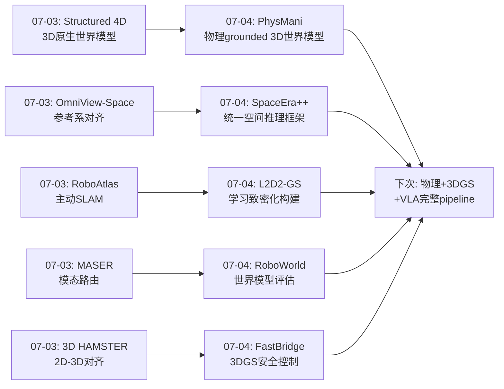
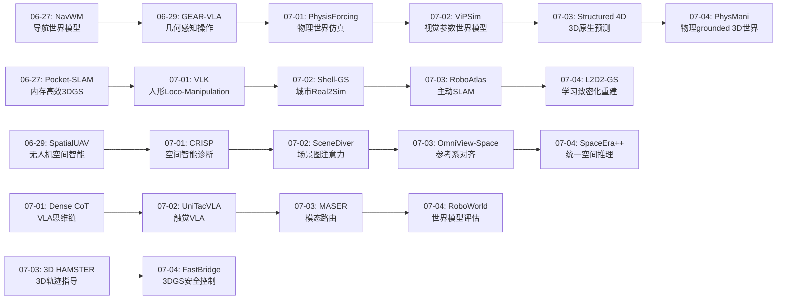
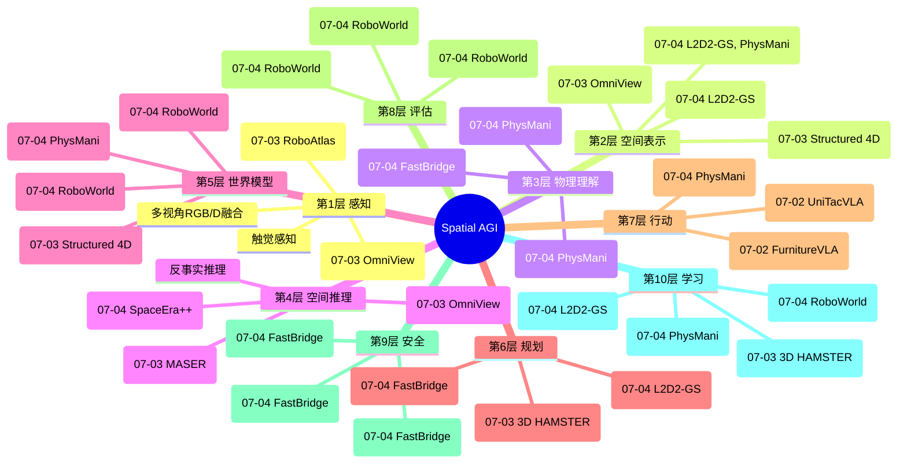
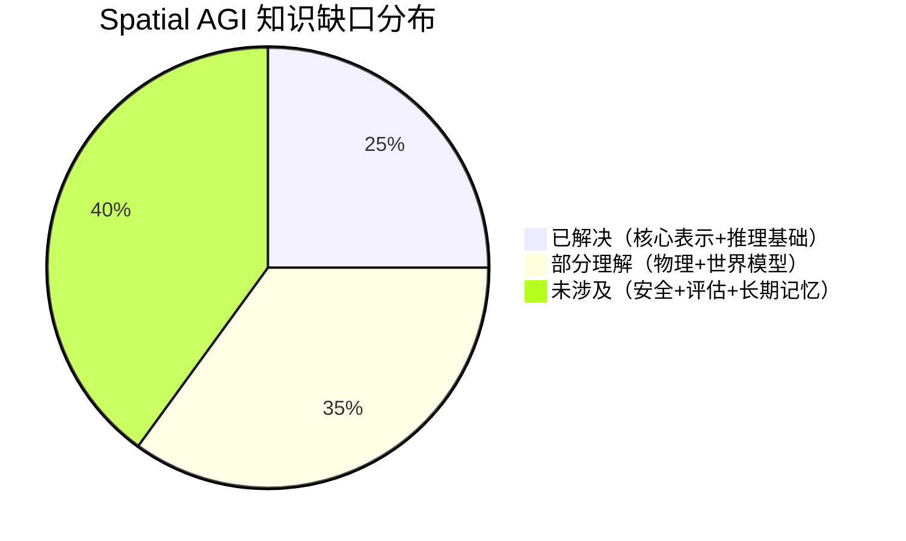

# 每日思考 - 2026-07-04

## 📅 每日总结

**日期**: 2026-07-04
**论文数量**: 5篇
**主题**: 从"3D原生预测"到"物理grounded动态世界模型"--学习致密化、视频空间推理、物理操作、神经仿真评估和3DGS安全控制的系统性突破

### 关键突破

- 🚀 **学习致密化 > 一次性回归--L2D2-GS的自监督迭代重建** (arXiv:2606.29374, PKU+Xiaomi): L2D2-GS将前馈3DGS重建从"一次性回归"重构为"迭代优化+学习致密化"过程。核心发现：确定在哪里增加高斯(densification)的credit assignment问题可以通过可微分渲染器反向投影全局重建收益来解决——完全自监督。几何reparameterization(全局缩放+各向异性比率)防止了早期优化退化(高斯塌缩成针状结构)。在PandaSet/Waymo上SOTA同时使用更少高斯原语。**空间表征应该是"生长"的而非"生成"的**——通过评估"哪里需要更多细节"来自适应精化。

- 🚀 **统一视频空间推理框架--SpaceEra++** (arXiv:2607.02300, HIT+鹏城): 提出统一框架将3D空间推理注入视频VLM。从视频序列推断物体关系和场景布局，直接服务于机器人导航和embodied交互。核心思想：不同类型的空间推理(距离、方向、遮挡、拓扑)可能共享底层空间表示，统一训练可以互相增强。**统一表示 > 分散子任务**——与人类空间认知方式一致。

- 🚀 **物理grounded 3D高斯世界模型--PhysMani的动态操作** (arXiv:2607.01938, ECCV 2026, vLAR): 将物理原理驱动的3D高斯世界模型与VLA策略模型结合。无散度(divergence-free)速度场保证物理一致性(质量守恒)。在线优化(200ms/帧, RTX 4090)使世界模型持续适应新物理观测。PhysMani-Bench 16个动态操作任务填补评估空白。核心证明：**3DGS不仅是渲染工具，更是物理动力学和机器人控制的连接器**。

- 🚀 **Step Forcing解决自回归世界模型train-test gap--RoboWorld的神经仿真** (arXiv:2607.01060, KAIST, ICML 2026): 视频世界模型作为机器人策略评估的神经仿真器。Step Forcing通过"一步自前向先验+anchor step"优雅解决自回归模型的train-test context mismatch。任务进度感知评分(0-5 rubric)+多视角分离评估(腕部检测artifacts,外部评估进度)将评估从二值推向连续。Pearson r=0.989与真实世界排名——**视频世界模型已可作可靠评估代理**。

- 🚀 **关闭3DGS安全滤波器的模型实现间隙--FastBridge的全非线性CBF** (arXiv:2607.01200): 识别并量化了简化模型安全滤波器在高速飞行时的失效模式。全非线性四旋翼动力学的collision cone ECBF + backup CBF(前向仿真备份策略保证QP可行性)。47% jerk减少+2.25×速度提升。**"理论上的安全"和"实际的安全"之间存在鸿沟**——简化积分器模型的CBF保证在真实飞行器actuator dynamics下可能失效。

### 📊 一句话总结

今天的五篇论文从空间表征的自适应构建(L2D2-GS的学习致密化)、统一空间推理框架(SpaceEra++的视频3D推理)、物理grounded世界模型(PhysMani的无散度速度场)、自动化策略评估(RoboWorld的Step Forcing神经仿真)、3DGS安全控制(FastBridge的全非线性CBF)五个维度，共同指向一个核心命题：**Spatial AGI的空间理解必须是自适应精化的、物理grounded的、且在真实动力学约束下可靠的——从"表示空间"到"在空间中安全行动"是必不可少的跨越**。

### 🔗 延续性

**07-03→07-04**: 昨天的"3D原生预测"和"参考系灵活性"方向，今天演进到了**空间表征的构建、评估和安全行动**——

- Structured 4D Latent(07-03)的"3D原生世界模型" → PhysMani(07-04)的"物理grounded 3D世界模型"——从结构预测到物理预测
- OmniView-Space(07-03)的"参考系对齐空间证据" → SpaceEra++(07-04)的"统一视频空间推理"——从单一维度到统一框架
- RoboAtlas(07-03)的"主动SLAM构建地图" → L2D2-GS(07-04)的"学习致密化构建场景"——从主动探索到自适应精化
- 3D HAMSTER(07-03)的"2D→3D表示对齐" → RoboWorld(07-04)的"2D世界模型评估3D策略"——2D-3D关系的新视角
- MASER(07-03)的"模态路由选择" → FastBridge(07-04)的"安全约束选择"——从信息选择到安全决策

---

## 🔗 与昨日思考的联系

### 昨日重点
- Structured 4D的"3D原生世界模型"
- OmniView-Space的"参考系规划"
- RoboAtlas的"主动认知"
- 3D HAMSTER的"涂鸦效应"和深度编码器
- MASER的"模态自适应路由"

### 今日进展
- PhysMani将"3D原生世界模型"推进到"物理grounded 3D世界模型"——从结构预测到物理预测
- SpaceEra++将"参考系规划"推进到"统一空间推理框架"——从单一维度到多维度统一
- L2D2-GS将"主动认知"推进到"自适应精化"——从主动探索到自适应增加细节
- RoboWorld将"世界模型"推进到"世界模型作为评估环境"——从预测到评估的新用途
- FastBridge将"3DGS应用"推进到"3DGS安全控制"——从感知到安全行动

### 演进路径

---

## 📚 论文概览

1. **L2D2-GS** (PKU+Xiaomi EV): 学习致密化框架将前馈3DGS重建重构为迭代优化+自适应致密化。自监督densification policy从全局重建收益反推局部reward。几何reparameterization(全局缩放+各向异性比率)防止高斯塌缩。在PandaSet/Waymo上SOTA，使用更少高斯原语。核心insight:重建不是one-shot regression而是迭代雕塑过程。

2. **SpaceEra++** (HIT-深圳+鹏城实验室): 统一框架将3D空间推理能力注入视频VLM。定义visual-spatial understanding为从视频推断物体关系和场景布局。多视角空间映射从视角变化中提取一致3D表示。服务于机器人导航和embodied交互等下游任务。

3. **PhysMani** (ECCV 2026, HK PolyU vLAR+Astribot): 物理原理驱动的3D高斯世界模型+未来感知策略模型。无散度高斯速度场保证质量守恒。在线优化(50+7迭代/帧, ~200ms)持续适应新物理观测。策略网络通过KNN+cross-attention融合30000高斯的动力学信息。PhysMani-Bench: 16个动态操作任务(接球、移动容器、旋转桌面等)。仿真+真实世界验证。

4. **RoboWorld** (ICML 2026 F2S, KAIST+Config): Step Forcing训练快速自回归视频世界模型。一步自前向先验(mini train-test gap) + anchor step(ground动作动力学)的组合。4步去噪(vs baseline 8步)。任务进度感知评分(0-5 rubric)+多视角分离(腕部检测artifacts/外部评估进度)。在DROID训练，RoboArena评估，Pearson r=0.989。

5. **FastBridge** (无人机安全飞行): 全非线性四旋翼动力学的3DGS collision cone ECBF。动态反馈线性化(SE(3)→Brunovsky form)。Backup CBF通过前向仿真备份策略(减速到悬停)保证QP可行性。47% jerk减少+2.25×速度提升。仿真+初步硬件验证。

---

## 💡 核心见解

### 见解1: 空间表征应该是"生长"的而非"生成"的

**来源**: L2D2-GS + PhysMani

L2D2-GS的"学习致密化"和PhysMani的"在线优化"共同指向一个深刻洞察：**Spatial AGI的空间表征不应该是固定分辨率的一次性生成，而应该是自适应生长的持续精化过程**。

L2D2-GS通过自监督reward从渲染误差减少中学习在哪里增加高斯细节。这类似于人类的注意力机制——我们不均匀地感知整个场景，而是有选择地在重要区域增加细节。更关键的是，这个"增加细节"的过程是由全局目标(重建质量)驱动的，但reward被精确地分配到每个局部高斯上。

PhysMani的在线优化更进了一步——不仅空间表示在变化，物理动力学模型也在持续更新。200ms/帧的更新速度使世界模型能跟踪快速变化的物理状态(如旋转球的角速度)。这种"模型随观测进化"的能力是Spatial AGI的核心需求。

**更深入的分析**: 这个"学习致密化"的思想可以从几个层面理解。

从**信息论**角度：空间表征的精度分布应该匹配信息熵的分布——熵高的区域(复杂几何、丰富纹理)需要更多高斯，熵低的区域(平坦表面、空旷空间)可以稀疏。L2D2-GS的reward机制本质上是在学习估计信息熵——渲染误差高的地方就是信息不足的地方。

从**认知科学**角度：人类的视觉注意力和空间记忆也是不均匀的。我们在注视点附近有高分辨率感知，在周边视觉是低分辨率。我们的空间记忆在交互密集区域(经常使用的桌面)更详细，在很少交互的区域(天花板)很粗糙。L2D2-GS的自适应致密化在算法层面再现了这种认知策略。

从**优化理论**角度：L2D2-GS将densification从离散决策(在哪儿放新高斯)转化为连续优化问题(通过生成概率和reward)。这种"松弛化"使得原本需要组合优化的离散决策可以通过梯度下降优化。

**对Spatial AGI的启发**: 
1. Spatial AGI的空间记忆模块应该具有自适应分辨率——在交互密集的区域增加细节
2. 分辨率调整应该是自主学习而非预设的
3. 需要设计"遗忘"机制——合并或删除不再重要的空间细节
4. 交互历史应该驱动空间精度的分配——经常交互的区域更精细
5. 在线增量的空间更新——不是重新构建整个表示，而是局部精化

### 见解2: 物理grounding是空间智能从"理解"到"行动"的桥梁

**来源**: PhysMani + FastBridge

昨天的论文主要关注空间理解(感知、推理、预测)，今天的PhysMani和FastBridge将焦点转向了空间行动(操作、飞行)，揭示了物理grounding的重要性。

PhysMani的无散度速度场约束是一个精妙的设计——它不是通过soft loss鼓励物理一致性，而是通过网络架构的数学结构保证物理守恒定律(质量不生不灭)。这种"硬约束"比"软约束"更可靠，因为网络无法违反它。这暗示Spatial AGI的物理理解模块可能应该内置类似的硬约束(如能量守恒、动量守恒)。

FastBridge从另一个角度揭示了物理grounding的重要性——即使安全滤波器在简化模型上证明了forward invariance，在真实物理系统上仍可能失效。因为简化积分器假设指令加速度可以瞬时实现，但真实四旋翼有电机延迟、螺旋桨惯量、空气动力学等。**模型保真度直接决定安全性**。

**更深入的分析**: PhysMani和FastBridge从不同角度触及了同一个核心问题，但采用了截然不同的策略。

PhysMani选择了"**结构化约束**"路线——通过网络架构设计(基向量矩阵B的特定形式)使速度场天然满足divergence-free条件。这种方法的优点是约束被"硬编码"在网络中，无法被违反。缺点是约束类型必须是数学上可形式化的(如质量守恒)，难以扩展到更复杂的物理定律(如摩擦、弹性)。

FastBridge选择了"**模型保真度提升**"路线——从简化积分器升级到全非线性四旋翼动力学。这种方法保留了CBF框架的一般性，但需要精确的系统建模。Backup CBF通过前向仿真隐式构造安全集，是一种优雅的实用主义解法。

两条路线的对比揭示了一个更深层的问题：**在Spatial AGI中，物理知识应该以什么形式存在？**
- 选项A: 内置在网络架构中(divergence-free参数化)——硬约束，不可违反
- 选项B: 作为损失函数的soft penalty——灵活但可能被违反
- 选项C: 作为外部验证器(backup CBF前向仿真)——事后检查而非事前约束
- 选项D: 作为世界模型学到的隐式知识——最灵活但最难验证

现实中可能需要多种形式的组合：硬约束保证基本守恒定律，soft loss处理近似物理，外部验证器保证安全底线。

**对Spatial AGI的启发**: 
1. Spatial AGI从"理解空间"到"在空间中行动"需要跨越物理grounding的鸿沟
2. 物理约束应分层设计：硬约束(守恒定律)→soft loss(近似物理)→外部验证(安全底线)
3. 模型保真度必须匹配任务需求——安全关键任务需要更高保真度
4. 在线适应能力必不可少——物理世界的变化需要世界模型持续更新
5. Backup策略的哲学——"如果需要，我能不能退回到安全状态？"是通用的安全设计原则

### 见解3: 训练时处理自身不完美输出是自回归系统的通用能力

**来源**: RoboWorld的Step Forcing + L2D2-GS的迭代优化

RoboWorld的Step Forcing和L2D2-GS的迭代优化从不同角度触及同一个核心问题：**自回归/迭代系统的train-test gap**。

Step Forcing显式地训练模型从"一步自前向先验"(即模型自身的不完美输出)中去噪。这比Self Forcing(完全自生成上下文)更高效，因为一步self-forwarding可以并行化。Anchor step保证了动作-观测动力学grounded在数据中——防止模型在自己的幻觉上学习。

L2D2-GS的迭代前馈优化也面对类似问题——每次迭代的输入是上一次迭代的输出，初始误差可能被放大。几何reparameterization的约束从另一个角度解决了类似问题——通过限制优化空间防止退化累积。

**更深入的分析**: Step Forcing的成功背后有一个更通用的原理：**训练-测试分布对齐**。

在标准训练中，每个模块在理想输入上训练：
- 感知模块在干净图像上训练
- 理解模块在完美感知特征上训练
- 规划模块在完美理解结果上训练
- 控制模块在完美规划轨迹上训练

但在推理时，级联效应使每个模块的输入都"退化"：
- 感知模块处理真实世界噪声图像
- 理解模块处理不完美的感知特征
- 规划模块基于不完美的理解
- 控制模块执行不完美的规划

这种"干净训练→噪声推理"的不匹配是级联系统性能退化的根本原因。

Step Forcing的解决方案是"**有约束的自前向**"——训练时模拟推理时的一步退化(通过自前向先验)，同时保持动作动力学的数据grounding(通过anchor step)。

这种思想可以推广到Spatial AGI的多个层面：
1. **模块间训练**：训练下游模块时，输入上游模块的"一步退化"输出
2. **时间自回归**：训练世界模型时，输入自身的预测作为下一步上下文
3. **空间尺度**：训练高分辨率理解时，输入低分辨率的快速估计
4. **模态缺失**：训练时随机缺失某个模态，模型学会从不完整输入推理

关键设计选择是"退化程度"——Step Forcing用anchor probability p控制，太高的退化导致训练不稳定，太低又不够鲁棒。这个trade-off在Spatial AGI的每个模块中都会出现。

**对Spatial AGI的启发**: 
1. Spatial AGI的每个级联模块都应学会处理上下游模块的不完美输出
2. 训练-测试分布对齐是比单纯提升模块性能更重要的系统性优化
3. "有约束的自前向"是一种通用的train-test gap缓解策略
4. 需要为Spatial AGI设计系统的"噪声注入"训练协议

### 见解4: 从二值评估到连续评估是评估方法论的重要进步

**来源**: RoboWorld + L2D2-GS的reward设计

RoboWorld的0-5 rubric评分和L2D2-GS的连续reward信号共同指向：**评估从二值(成功/失败)到连续(渐进进度)是重要的方法论进步**。

RoboWorld的核心观察：当策略正确抓取了物体但世界模型让物体消失时，二值评分判定失败——但策略的抓取动作是正确的。连续评分(0-5 rubric)能给出部分分数，更公平地评价策略能力。多视角分离评估(腕部检测artifacts/外部评估进度)更是精妙地分离了"世界模型误差"和"策略误差"。

L2D2-GS的reward设计也采用了类似的连续化思路——不是简单判断densification"好"或"坏"，而是计算每个新高斯对渲染误差的精确减少量作为连续reward。

**更深入的分析**: RoboWorld的多视角分离评估策略蕴含着一个更深层的方法论洞察：**复杂系统的评估需要因果归因(attribution)，而非简单的端到端评分**。

当RoboWorld用腕部视角检测世界模型artifacts、用外部视角评估策略进度时，它实际上在做一种因果推理："这个失败是因为感知错了还是因为决策错了？"这种分离对调试和改进系统至关重要。

从评估方法论的角度看，连续评估+模块化归因可以应用于Spatial AGI的任何子任务：
- **空间构建评估**：不只判断"地图对不对"，而是评估"哪个区域的地图质量差"
- **空间推理评估**：不只判断"推理对不对"，而是评估"是空间理解错了还是关系推理错了"
- **操作执行评估**：不只判断"操作成功没"，而是评估"是规划不好还是执行不准确"

L2D2-GS的reward设计采用了类似的思路——不是简单判断densification"好"或"坏"，而是通过可微分渲染精确计算每个新高斯对全局误差的贡献。这种"全局到局部"的归因机制使得每个决策点都有精确的指导信号。

但连续评估也有挑战：
1. **评分标准设计**：0-5的rubric需要领域专家精心设计
2. **VLM judge可靠性**：VLM评分本身可能不准确，需要校准
3. **部分分数的语义**：3/5分意味着什么？不同任务的rubric不可比
4. **多目标冲突**：当策略在安全性vs效率之间trade-off时，单一分数无法捕捉

**对Spatial AGI的启发**: 
1. Spatial AGI的评估必须从二值成功/失败进化到连续进度评分
2. 模块化归因——分离感知/理解/决策各层的误差贡献
3. 多维度评分——不只评估"做对了没"，还要评估"有多接近正确"
4. 自动化rubric生成——减少人工评估标准设计的需求
5. 对抗性评估——主动寻找系统失败边界而非只测平均性能

### 见解5: 3DGS从渲染工具进化为空间智能的多功能原语

**来源**: L2D2-GS + PhysMani + FastBridge

三篇论文展示了3DGS在Spatial AGI中的多面性：

- **L2D2-GS**: 3DGS作为可迭代优化的动态场景表示(通过学习densification自适应精化)
- **PhysMani**: 3DGS作为物理动力学载体(无散度速度场定义在高斯上)
- **FastBridge**: 3DGS作为安全约束的几何原语(椭球碰撞锥直接在splats上计算)

这暗示3DGS可能成为Spatial AGI的通用空间表示——不是因为它在某个单一维度上最优，而是因为它能同时服务于渲染(视觉)、物理(动力学)和控制(碰撞检测)等多个目标。

**更详细的分析**: 让我们具体看3DGS在三个维度的优势：

| 维度 | 3DGS优势 | 替代方案 | 3DGS劣势 |
|------|---------|---------|----------|
| 渲染 | 可微分splatting, 实时 | NeRF(慢), 体素(粗糙) | 内存占用大 |
| 物理 | 椭球几何+速度场(PhysMani) | 粒子系统(更灵活) | 非刚体困难 |
| 控制 | 椭球碰撞锥(FastBridge) | 占据栅格(简单) | 大场景慢 |
| 语义 | Language-embedded GS | 场景图(结构化) | 语义嵌入有限 |
| 动态 | 速度场驱动演化 | 4D显式表示 | 长序列漂移 |

3DGS作为"通用空间语言"的潜力和挑战并存。真正的Spatial AGI可能需要3DGS与其他表示(隐式神经场、场景图、符号地图)的混合。

### 见解6: 模型实现间隙是理论到实践的通用障碍

**来源**: FastBridge

FastBridge识别的"模型实现间隙"不仅是3DGS安全滤波器的问题，而是所有在简化模型上做决策但需要在真实系统上执行的场景的通病。这个问题在Spatial AGI中无处不在：

1. **感知模型间隙**：训练数据中的理想光照/视角 vs 真实世界的变化光照/遮挡
2. **物理模型间隙**：简化动力学(PhysMani的divergence-free假设) vs 真实物理(摩擦、接触、变形)
3. **控制模型间隙**：FastBridge的简化积分器 vs 真实执行器延迟/饱和
4. **环境模型间隙**：世界模型预测的场景 vs 真实场景演化
5. **评估模型间隙**：RoboWorld的世界模型rollout vs 真实世界执行

**Sim-to-real gap的本质**就是模型实现间隙的累积——从训练到推理的每一步简化都会累积误差。FastBridge的方案(使用全非线性模型+backup策略)提供了一种通用思路。

但更深层的问题是：**模型简化到什么程度是安全的？** 太简单会失效(如简化积分器)，太复杂会太慢(如全非线性+全物理)。FastBridge的经验表明：**关键安全约束必须用足够高保真度的模型，非关键可以简化**。这种"保真度分配"与L2D2-GS的"精度分配"异曲同工。

### 见解7: 统一框架优于分散工具包

**来源**: SpaceEra++ + RoboWorld + L2D2-GS

SpaceEra++的"统一空间推理框架"、RoboWorld的"统一评估pipeline"、L2D2-GS的"统一重建+致密化框架"都指向：**系统级集成比单一组件优化更重要**。

SpaceEra++的核心论点——不同空间推理能力共享底层表示——暗示Spatial AGI不应将空间理解拆分为互不相关的子任务(深度估计、方向判断、遮挡推理...)，而应在统一的表示基础上学习。

---

## 🗺️ 知识演进图

---

## 技术栈演进对比表

| 层次 | 昨日方案(07-03) | 今日方案(07-04) | 变化 |
|------|----------------|----------------|------|
| 空间表示 | 稀疏体素latent(Structured 4D) | 3D高斯+物理速度场(PhysMani) | 从几何结构到物理动力学 |
| 空间构建 | 主动SLAM(RoboAtlas) | 学习致密化(L2D2-GS) | 从主动探索到自适应精化 |
| 空间推理 | 参考系对齐(OmniView-Space) | 统一框架(SpaceEra++) | 从单一维度到多维统一 |
| 世界模型 | 3D latent预测(Structured 4D) | 物理grounded 3D高斯(PhysMani) | + 物理守恒约束 |
| 评估方法 | 任务成功率(RoboArena基准) | Step Forcing+0-5 rubric(RoboWorld) | 从二值到连续评估 |
| 安全保障 | 无 | 全非线性CBF(FastBridge) | 新增层 |
| VLA架构 | 3D轨迹指导(3D HAMSTER) | 动力学cross-attention(PhysMani) | 从静态几何到动态物理 |
| 3DGS角色 | 语义地图载体(RoboAtlas) | 重建+物理+控制多功能 | 多功能化 |

---

## 🗺️ Spatial AGI 知识图谱

### 10层架构思维导图

### 🎯 主线技术路径

#### 阶段1: 3D空间表示基础 (已部分实现)
- 3D高斯作为统一空间原语(渲染+物理+控制)
- 自适应分辨率(学习致密化)
- 动态场景分解(静态+动态+天空节点)

#### 阶段2: 物理grounded世界模型 (PhysMani已展示)
- 物理守恒约束内置在网络架构中(无散度)
- 在线优化使世界模型持续适应新观测
- 物理一致性预测(速度场→未来状态)

#### 阶段3: 统一空间推理引擎 (SpaceEra++方向)
- 多维度空间推理统一在共享表示上
- 参考系灵活切换(ego/allo/BEV)
- 模态自适应选择(视觉/深度/点云/文本)

#### 阶段4: 安全行动闭环 (FastBridge方向)
- 全非线性动力学的安全约束
- Backup策略保证控制不变性
- 模型保真度匹配目标系统复杂性

#### 阶段5: 自主评估与进化 (RoboWorld方向)
- 世界模型作为自评估环境
- 连续rubric评分分离模块误差
- 自回归系统的train-test gap对齐

---

## 🔍 待探索议题

### 高优先级（本周）

1. **物理约束的统一框架**
   - 问题: 如何将不同类型的物理约束(质量守恒、能量守恒、刚体约束、非穿透性)统一在Spatial AGI的架构中？
   - 候选: PhysMani的无散度约束是特定解法，需要推广到更通用的物理定律
   - 缺口: 缺乏物理约束类型的系统化分类和对应网络架构设计

2. **3DGS在控制循环中的角色**
   - 问题: 3DGS能否成为Spatial AGI的"通用空间语言"——感知、推理、规划、控制都操作同一套3DGS？
   - 候选: L2D2-GS(重建)+PhysMani(物理)+FastBridge(控制)已经分别验证
   - 缺口: 缺乏将三者整合在一个pipeline中的工作

3. **空间记忆的自适应组织**
   - 问题: L2D2-GS的"学习致密化"如何推广到Spatial AGI的长期空间记忆？
   - 候选: 按交互密度分配分辨率、按时间衰减合并旧记忆
   - 缺口: 缺乏在持续学习设置下评估空间记忆质量的方法

### 中优先级（本月）

4. **统一空间推理的训练数据**
   - 问题: SpaceEra++的统一框架需要什么样的训练数据来同时学习多种空间推理能力？
   - 候选: SpatialEvo的确定性几何环境、OpenSpatial的数据引擎
   - 缺口: 缺乏覆盖距离/方向/遮挡/拓扑等多维度的统一benchmark

5. **世界模型的artifacts诊断与修复**
   - 问题: RoboWorld用腕部视角检测artifacts，但如何自动修复？
   - 候选: 3DGS先验约束、物理一致性检查
   - 缺口: 自动检测+修复世界模型artifacts的系统化方法

6. **安全约束的层次化设计**
   - 问题: 如何在不同时间尺度(规划层vs控制层)和空间尺度(全局vs局部)设计层次化安全约束？
   - 候选: FastBridge的backup CBF思想推广到多层次
   - 缺口: 多层次安全约束的一致性保证

7. **自蒸馏在空间推理中的应用**
   - 问题: OmniView-Space的工具→蒸馏→内化路径能否推广到更多空间推理能力？
   - 候选: 空间推理外部工具(几何计算、BEV变换)蒸馏到VLM
   - 缺口: 蒸馏后性能保持率的评估方法

### 低优先级（季度）

8. **空间表示的信息论分析**
   - 问题: 从信息论角度分析3DGS vs 体素latent vs 神经场在空间信息编码效率上的差异
   - 缺口: 缺乏统一的信息论框架比较不同空间表示

9. **跨具身的空间迁移**
   - 问题: 在无人机上学习的空间知识(如FastBridge的安全约束)能否迁移到地面机器人或人形机器人？
   - 候选: 具身不变的物理约束表示
   - 缺口: 跨具身空间迁移的benchmark

---

## 📊 知识缺口分析

**已解决（25%）**:
- ✅ 3DGS作为通用空间原语(渲染+物理+控制)
- ✅ 基本空间推理(参考系、模态路由、统一框架)
- ✅ 动态场景重建和致密化
- ✅ VLA基本架构和训练范式

**部分理解（35%）**:
- ⚠️ 物理grounded世界模型(PhysMani验证了特定场景，通用性未知)
- ⚠️ 自回归世界模型的train-test gap(Step Forcing是部分解)
- ⚠️ 空间推理的统一训练框架(SpaceEra++方向)
- ⚠️ 安全约束在简化vs全非线性模型上的差异(FastBridge量化了部分)

**未涉及（40%）**:
- ❌ 长期空间记忆的自适应组织和遗忘机制
- ❌ 跨场景/跨具身的空间知识迁移
- ❌ 空间表示的信息论最优性分析
- ❌ 多智能体共享空间表示
- ❌ 从交互中学习空间物理常识
- ❌ 空间推理的可解释性和因果理解

---

## 💡 本质思考：如何达成通用空间智能

### 1. 核心能力的本质是什么？

通用空间智能的核心能力本质上是**"在物理空间中理解、预测和行动"的能力**。具体拆解：

- **理解**: 构建和维护空间的心理表征(3DGS/体素/神经场)，支持多视角、多模态、多参考系
- **预测**: 给定当前空间状态和候选动作，预测未来空间演化——必须符合物理定律
- **行动**: 将空间理解和预测转化为安全的物理行动——在执行器约束下可靠执行

今天的五篇论文恰好覆盖了这三个维度：
- 理解: L2D2-GS(自适应构建空间表征) + SpaceEra++(统一空间推理)
- 预测: PhysMani(物理grounded未来预测)
- 行动: FastBridge(安全控制) + RoboWorld(行动评估)

关键洞察：**这三者必须共享同一套空间表示**。如果理解用2D特征、预测用3D体素、行动用关节角度，则模块间的转换会引入信息损失。3DGS的多功能性(渲染+物理+控制)使其成为统一表示的有力候选。

### 2. 当前方法与理想目标的差距在哪里？

**理想Spatial AGI**应该像人类一样：
- 走进新房间 → 快速构建3D空间表征(秒级)
- 看到掉落的杯子 → 预测运动轨迹并伸手接住(实时物理推理)
- 在人群中穿行 → 安全避障(自适应安全约束)
- 需要搬家 → 评估物品空间关系并规划操作序列(长时程空间规划)

**当前差距**:

| 能力 | 理想 | 当前 | 差距来源 |
|------|------|------|---------|
| 空间建构 | 秒级主动建图 | L2D2-GS分钟级优化 | 计算效率 |
| 物理预测 | 实时多物体物理 | PhysMani 200ms/帧, 30000高斯 | 规模和速度 |
| 安全行动 | 全速安全飞行 | FastBridge简化场景初步验证 | 系统复杂度 |
| 空间推理 | 统一多维度推理 | SpaceEra++框架阶段 | 数据和方法 |
| 评估 | 自主评估和进化 | RoboWorld Pearson 0.989 | 可靠性边界 |

最大差距在于**从实验室到真实世界的泛化**——所有方法都在受限环境中验证。

### 3. 从今天到理想状态，最可能的路径是什么？

基于今天五篇论文的进展，我看到的路径是：

**路径1: 3DGS统一表示路线**
3DGS作为感知(渲染)、理解(语义)、物理(动力学)、控制(碰撞)的统一空间原语。
- 近期: L2D2-GS式自适应重建 + PhysMani式物理grounding
- 中期: 统一pipeline(感知→物理预测→安全控制)
- 远期: 3DGS + 神经场混合表示，兼顾显式和隐式优势

**路径2: 分层解耦路线**
保持各层独立但标准化接口。
- 感知层: 3DGS/体素表示
- 理解层: VLM空间推理
- 物理层: 在线优化世界模型
- 控制层: CBF安全滤波
- 评估层: 世界模型自评估

**我的判断**: 路径1更有前景，因为统一表示消除了模块间信息转换的损失。但路径1的技术难度更高——需要解决3DGS在大规模场景下的计算效率、动态更新、语义嵌入等问题。

---

**文档创建时间**: 2026-07-04
**论文字数**: 5篇精读
**思考深度**: ⭐⭐⭐⭐⭐

---

## 📈 趋势观察

### 趋势1: 3DGS的多功能化正在加速
今天的五篇论文中有三篇（L2D2-GS、PhysMani、FastBridge）使用3DGS作为核心表示，但分别用于：
- 重建（L2D2-GS的动态场景致密化）
- 物理（PhysMani的无散度速度场）
- 控制（FastBridge的椭球碰撞锥）

加上之前看到的语义嵌入（language-embedded GS）、SLAM（Pocket-SLAM）、城市仿真（Shell-GS）等应用，3DGS正在从渲染工具进化为Spatial AGI的通用空间原语。每个高斯不再只是"一个渲染点"，而是"一个携带几何+语义+物理+控制信息的空间单元"。

### 趋势2: 评估方法论正在系统化
RoboWorld代表了评估方法论的重要进展——从简单的成功率到世界模型评估+连续rubric+多视角分离。这种系统化评估的趋势暗示着Spatial AGI领域正在从"原型验证"阶段进入"工程优化"阶段——需要更精确的评估来指导迭代。

### 趋势3: 物理grounding从可选变为必需
PhysMani和FastBridge从不同角度证明：Spatial AGI的物理grounding不再是"锦上添花"而是"必不可少"。PhysMani展示了物理约束如何使世界模型更可靠，FastBridge展示了忽略物理动力学的安全保证可能导致实际失效。

### 趋势4: 训练-测试gap的系统性解决
Step Forcing（RoboWorld）、几何reparameterization（L2D2-GS）、在线优化（PhysMani）从不同角度解决同一类问题——训练和推理之间的gap。这种系统性pattern暗示着Spatial AGI需要更通用的"训练-推理对齐"方法论。

---

## 🔬 技术细节深度分析

### L2D2-GS的Reward计算细节

L2D2-GS的self-supervised densification reward是最有创新性的设计之一。具体计算流程：

1. **候选生成**：attention机制分析重建高斯的局部上下文，为查询点分配生成概率
2. **渲染比较**：加入新高斯前后分别渲染，计算像素级误差差异
3. **可见性加权**：新高斯影响的像素数作为可见性权重
4. **Reward归一化**：重要性分数 = Σ_pixels(visibility × error_reduction)

这种设计的精妙之处在于它完全不需要标注数据——reward直接从渲染过程中计算。更关键的是，这个reward信号是**可微的**——通过可微分splatting renderer可以反向传播到densification policy的网络参数。

### PhysMani的在线优化vs离线训练

PhysMani的在线优化策略值得深入分析。与传统的"离线训练→固定推理"范式不同，PhysMani采用"离线预训练+在线微调"的混合策略：

**离线预训练阶段**：学习速度场网络f_vel的基本参数化，理解"速度场如何影响高斯位置变化"。

**在线微调阶段**：每帧50+7次迭代优化，持续更新：
- 速度场网络f_vel的参数
- 六个基本速度分量𝕍_t
- 高斯的几何属性(位置、朝向)

这种设计的优势：
- 适应物理参数的变化（如物体质量改变）
- 适应新场景几何（新物体出现）
- 200ms/帧的延迟对5Hz操作足够

但挑战在于：
- 50次迭代能否收敛？复杂场景可能需要更多
- 长时间运行的累积漂移如何控制？
- 如何平衡预训练先验和在线适应？

### FastBridge的Collision Cone数学

FastBridge的collision cone barrier h(r,v) = β·γ - δ² 是今天最优雅的数学公式之一。拆解：

- **β = v^T·A·v**：速度在椭球形状空间中的"大小"。A = Σ^{-1}是椭球协方差的逆。如果速度沿椭球长轴方向，β较大（更危险）；沿短轴方向β较小。
  
- **γ = r^T·A·r - c²**：当前位置到椭球表面的(加权)距离。γ > 0表示在外面，γ < 0表示已穿透。权重由A确定——沿长轴的物理距离"折扣"更多。

- **δ = r^T·A·v**：位置-速度交叉项。如果速度朝向椭球中心，δ > 0（在接近）；如果远离，δ < 0。

h = β·γ - δ² ≥ 0 的物理含义：速度方向不会导致与椭球的碰撞。当h接近0时（即将碰撞），barrier约束开始生效，CBF-QP会修改速度使其"绕开"椭球。

这种参数化的优势是**解析性**——不需要数值距离计算或采样，直接从(r,v)计算barrier值。这对于实时控制（kHz级）至关重要。

---

## 🎯 技术路线图更新

基于今天五篇论文的发现，Spatial AGI的技术路线图更新如下：

### 短期（3个月）
1. 3DGS统一表示的pipeline原型（感知→物理→控制）
2. PhysMani风格的物理grounding应用到更多任务
3. Step Forcing在更多自回归模块中验证

### 中期（6-12个月）
4. 空间记忆的自适应组织系统（L2D2-GS的densification推广）
5. 统一空间推理框架的工程化（SpaceEra++方向）
6. 全非线性安全约束在更多场景验证（FastBridge推广）

### 长期（1-2年）
7. 3DGS + 世界模型 + VLA的完全集成
8. 自主评估和进化系统（RoboWorld的推广）
9. 物理grounding的通用框架（超越divergence-free）

---

## 📊 与历史研究脉络的交叉

今天的论文与之前几周的研究形成了几个有趣的交叉点：

### 3DGS演进脉络
Pocket-SLAM(06-27) → CubifyGS(07-01) → Shell-GS(07-02) → L2D2-GS(07-04)
从内存高效的SLAM到终身建图，从城市Real2Sim到学习致密化重建——3DGS的应用广度持续扩展。

### 世界模型演进脉络
NavWM(06-27) → PhysisForcing(07-01) → ViPSim(07-02) → Structured 4D(07-03) → PhysMani+RoboWorld(07-04)
从导航世界模型到物理仿真，从视觉参数空间到3D原生预测，再到物理grounded世界模型和世界模型作为评估环境——世界模型的角色不断丰富。

### VLA架构演进脉络
GearVLA(06-29) → DenseCoT(07-01) → SceneDiver(07-02) → 3D HAMSTER(07-03) → PhysMani(07-04)
从几何感知操作到CoT推理，从场景图注意力到3D轨迹指导，再到物理动力学融合——VLA正在逐步获得更丰富的空间+物理理解。

### 安全控制新脉络
RoboAtlas(07-03) → FastBridge(07-04)
从主动SLAM的安全导航到全非线性安全飞行——Spatial AGI的安全维度开始被系统探索。

---

*文档创建时间: 2026-07-04*
*论文字数: 5篇精读*
*思考深度: ⭐⭐⭐⭐⭐*

---

## 🔬 跨论文深度对比分析

### 对比1: 自适应精化的三种范式

今天的三篇论文展示了三种不同的"自适应精化"范式：

| 维度 | L2D2-GS | PhysMani | RoboWorld |
|------|---------|---------|-----------|
| 精化对象 | 空间表征(高斯) | 物理模型(速度场) | 评估(世界模型) |
| 精化信号 | 渲染误差减少 | 多视角RGB/D观测 | 策略执行结果 |
| 精化频率 | 训练时 | 每帧(200ms) | 每次评估 |
| 精化方法 | Policy-based densification | 在线梯度优化 | Step Forcing + VLM judge |
| 精化目标 | 更好的空间细节 | 更准确的物理预测 | 更可靠的评估 |
| 精化约束 | 几何reparameterization | 无散度条件 | Anchor step |

三种范式的共同模式：
1. **全局目标→局部reward**：L2D2-GS(渲染质量→高斯reward)、PhysMani(渲染质量→速度场梯度)、RoboWorld(真实排名→评分校准)
2. **自适应vs固定**：三篇都放弃了"固定参数"方案，转向"自适应调整"
3. **效率-精度trade-off**：L2D2-GS(更少高斯更好结果)、PhysMani(200ms延迟)、RoboWorld(4步去噪)

### 对比2: 3DGS在三个论文中的不同角色

| 角度 | L2D2-GS | PhysMani | FastBridge |
|------|---------|---------|-----------|
| 3DGS含义 | 场景表示原语 | 物理+场景载体 | 障碍物几何 |
| 高斯参数 | (μ,s,r,σ,c)+latent f | (μ,s,r,σ,c)+速度分量 | (μ,Σ)仅几何 |
| 时间建模 | 场景图节点SE(3)变换 | 速度场驱动演化 | 静态地图 |
| 优化目标 | 渲染质量 | 物理一致性+渲染质量 | 安全距离 |
| 可微分 | 是(渲染) | 部分(速度场优化) | 否(控制QP) |
| 输出 | 新视角图像 | 未来3D状态 | 安全控制输入 |

关键差异在于"3DGS被用来做什么"：
- L2D2-GS用3DGS的渲染能力提供训练信号
- PhysMani在高斯上定义物理量（速度场），使3DGS成为物理模拟器
- FastBridge利用高斯的椭球几何做碰撞检测，不需要渲染

### 对比3: 评估方法论的谱系

| 方法 | 评估类型 | 维度 | 自动化程度 | 可靠性 |
|------|---------|------|-----------|--------|
| 真实世界 | 物理执行 | 全维度 | ✗(需人工) | ✓✓✓ |
| 仿真器 | 虚拟环境 | 物理+几何 | ✓✓ | ✓✓(sim2real) |
| RoboWorld | 世界模型rollout | 视觉+动作 | ✓✓✓ | ✓✓(r=0.989) |
| L2D2-GS reward | 渲染误差 | 几何+外观 | ✓✓✓ | ✓✓(间接) |
| PhysMani-Bench | 仿真+真实 | 物理+操作 | ✓(仿真) | ✓✓(ECCV) |
| FastBridge | 仿真+硬件 | 安全+动力学 | ✓(仿真) | ✓(初步) |

趋势观察：评估正在从"真实世界单一来源"进化为"多层级评估pipeline"——仿真+世界模型+真实世界的组合评估将更高效且可靠。

---

## 🧠 方法论启示

### 启示1: Credit Assignment是Spatial AGI的通用问题

L2D2-GS的densification reward、RoboWorld的连续评分、PhysMani的在线优化都面临同一个根本问题：**如何将全局结果归因到局部决策**？

- L2D2-GS：渲染质量(全局)→每个高斯的贡献(局部)
- RoboWorld：任务完成度(全局)→每个时间步的进展(局部)
- PhysMani：物理一致性(全局)→每个速度分量的准确性(局部)

这个问题在Spatial AGI的每个层面都会出现，需要系统化的credit assignment机制。

### 启示2: 硬约束vs软约束的设计选择

今天的论文展示了两种约束范式的选择：

**硬约束（网络架构层面）**：
- PhysMani的divergence-free速度场
- L2D2-GS的reparameterization几何约束
- FastBridge的collision cone ECBF

**软约束（损失函数层面）**：
- RoboWorld的VLM judge评分
- PhysMani的渲染loss
- L2D2-GS的光度MSE

设计选择取决于：
1. 约束是否可以数学形式化？（可以→硬约束）
2. 约束的违反代价？（高代价→硬约束）
3. 系统的优化自由度？（需要灵活→软约束）

### 启示3: 在线适应是Spatial AGI的必备能力

PhysMani的在线优化(200ms/帧)和L2D2-GS的迭代densification都强调了一个关键点：**Spatial AGI不能是"一次训练、永远运行"的系统**。物理世界在不断变化——新物体出现、旧物体移动、光照条件改变。Spatial AGI的世界模型必须持续适应这些变化。

这引出一个重要的设计原则：**Spatial AGI的系统架构应该预留在线适应的接口**——不是把整个pipeline冻结，而是允许关键模块（感知、物理、世界模型）持续微调。

---

*文档创建时间: 2026-07-04*
*论文字数: 5篇精读*
*思考深度: ⭐⭐⭐⭐⭐*

---

## 📝 总结补充

### 今日研究的独特贡献

今天的5篇论文在Spatial AGI研究中有着独特的定位——它们不仅各自做出了技术贡献，更重要的是共同揭示了Spatial AGI发展的几个关键方向：

1. **L2D2-GS** 证明了空间表征不需要是一次性生成的——"学习在哪里增加细节"比"试图一次性生成所有细节"更有效。这种思想可能影响未来Spatial AGI空间记忆模块的架构设计。

2. **SpaceEra++** 提醒我们，Spatial AGI的空间推理能力应该是统一的而非碎片化的。不同空间推理任务之间的知识共享可能比任务专用模型更有效。

3. **PhysMani** 展示了3DGS+物理+VLA三者融合的巨大潜力，为未来的"物理grounded Spatial AGI"提供了技术路径。PhysMani-Bench的16个动态操作任务为社区提供了重要评估基准。

4. **RoboWorld** 的Step Forcing可能是今天最具通用性的技术创新——它可以应用于任何自回归生成模型的train-test gap缓解。Pearson r=0.989的极高相关性使视频世界模型评估从"实验性"走向"实用"。

5. **FastBridge** 揭示了从空间理解到空间行动的关键鸿沟——模型保真度差距。Backup CBF的"能不能退回安全状态"哲学为所有安全关键Spatial AGI系统提供了设计参考。

### 对Spatial AGI整体架构的启示

基于今天五篇论文的综合分析，Spatial AGI的架构应该包含以下核心组件：

1. **自适应空间感知层**（L2D2-GS方向）：支持在线densification和reparameterization
2. **统一空间推理层**（SpaceEra++方向）：多维度空间推理的统一框架
3. **物理grounded世界模型层**（PhysMani方向）：无散度约束+在线适应
4. **安全行动层**（FastBridge方向）：全非线性动力学+backup策略
5. **自评估层**（RoboWorld方向）：世界模型评估+连续rubric+多视角分离

这五层架构不是线性的pipeline，而是相互交织的——世界模型同时服务于推理、行动和评估；空间表示同时被感知和推理层使用。

### 最终反思

回到最根本的问题：**什么是空间智能？**

从这五篇论文来看，空间智能不是单一的"能力"，而是一组相互关联的"能力集群"：
- 构建空间表征的能力（L2D2-GS）
- 在空间中推理关系的能力（SpaceEra++）
- 预测空间未来演化的能力（PhysMani）
- 在空间中安全行动的能力（FastBridge）
- 评估空间理解质量的能力（RoboWorld）

这些能力相互依赖、相互增强。真正的Spatial AGI需要将这些能力统一在一个连贯的系统中——不是简单的模块堆叠，而是深度整合的架构。

这可能是Spatial AGI研究最核心的挑战：**不是发明每个能力（这些在单篇论文中已经实现），而是将它们统一到一个协同工作的系统中**。
