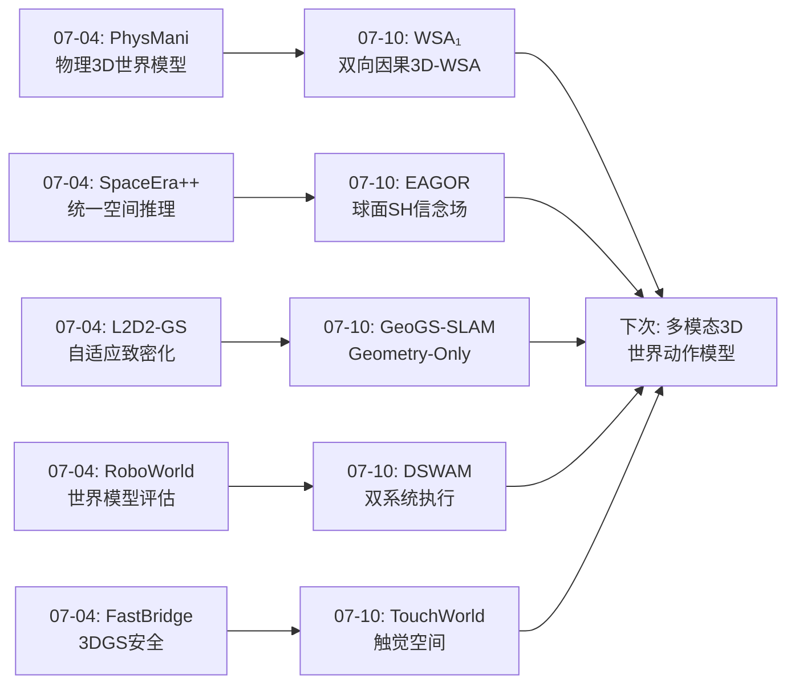
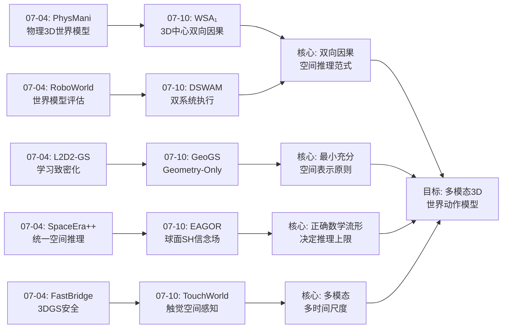
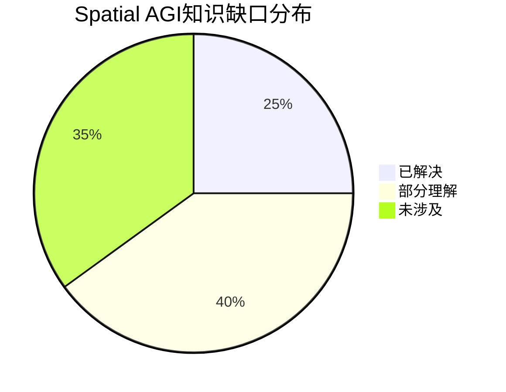

# 每日思考 - 2026-07-10

## 📅 每日总结

**日期**: 2026-07-10
**论文数量**: 5篇
**主题**: 从"双系统认知架构"到"球面空间推理"——世界动作模型的范式分化、3D中心的机器人基础模型、几何优先的SLAM表示、球面谐波方向推理、触觉基础模型的系统性突破

### 关键突破

- 🚀 **双系统认知架构的实例化——DSWAM的System 1/System 2解耦** (arXiv:2607.04927, Midea Group+Tongji): DSWAM将Kahneman双系统理论实例化为机器人操作架构。System 1（WAM执行器）作为默认控制路径，System 2（VLM规划器）仅在任务需要分解时激活。最关键的发现：训练时视频世界建模监督可以与推理时视频生成分离——训练时享受丰富物理监督，推理时享受直接动作预测的效率。DeMaVLA匹配条件下成功率92.5%→96.3%，完成时间减少25%。**双系统不是"总是开启深度推理"，而是"按需激活"——这比always-on设计更高效**。

- 🚀 **范式级创新——WSA₁的3D中心World-Spatial-Action联合建模** (arXiv:2607.03941, Tongji): 超越VLA和WAM的第四种范式。三个互补专家（2D空间、3D空间、3D动作）在Mixture-of-Transformers架构中协同。核心突破：双向因果注意力实现"动作→世界"和"世界→动作"的闭环——这是机器人领域首次实现真正的双向空间因果推理。仅6000小时数据（1000小时真实机器人）达到93%成功率。**证明：3D中心建模的数据效率远超2D方法，因为3D几何提供了更强的物理约束和泛化先验**。

- 🚀 **"Less is More"的极致——GeoGS-SLAM的Geometry-Only高斯** (arXiv:2607.07452, Beihang): 大胆假设：SLAM不需要外观建模。去除球谐系数后，每个高斯原语参数从~59减少到~8（82%+减少），原语数量从198K减少到28K（85%+减少）——几何质量反而提升。无颜色渲染的训练框架（深度+法线监督）和统一Sim(3)回环更新是两个关键工程贡献。**标准3DGS中大部分参数和原语实际上在"服务外观"而非"服务几何"——去除它们反而减少干扰**。

- 🚀 **球面空间推理——EAGOR的球面谐波信念场** (arXiv:2607.06165, NTU): 将方向推理从2D像素预测重构为球面上的递归贝叶斯估计。球面谐波（SH）提供连续、旋转等变、无接缝的空间表示。语义-几何解耦：冻结VLM负责"看到什么"，SH-BF负责"在哪里"。10×更小的backbone获得45.6%的相对提升。**正确的空间表示（球面SH）比更大的模型更重要——表示选择决定性能上限**。

- 🚀 **触觉作为预测+反应双角色——TouchWorld的多时间尺度触觉基础模型** (arXiv:2607.07287, HIT Shenzhen+PHANES AI): 触觉不仅是反馈信号（反应），也是预测目标（预测）。三级多时间尺度架构（慢速语义规划/中速动作生成/快速触觉纠正）。触觉世界模型预测未来接触子目标，残差精炼策略在高频控制循环内做局部纠正。Clean 65.0%/人类干扰53.7%成功率。**Spatial AGI不能只有视觉——触觉是空间感知的缺失维度**。

### 📊 一句话总结

今天的五篇论文从双系统认知架构(DSWAM的按需规划)、3D中心范式创新(WSA₁的双向因果)、几何优先表示(GeoGS的参数减少82%)、球面空间推理(EAGOR的SH信念场)、触觉空间维度(TouchWorld的预测+反应)五个维度，共同指向一个核心命题：**Spatial AGI需要从"单一2D视觉感知→单向动作生成"进化到"多模态多尺度空间认知↔双向因果行动"——正确的空间表示、时间尺度和模态组合比模型规模更重要**。

### 🔗 延续性

**07-04→07-10**: 上次(07-04)的"自适应精化、统一空间推理、物理grounded世界模型"方向，今天演进到了**范式级重构和多模态扩展**——

- PhysMani(07-04)的"物理grounded 3D世界模型" → WSA₁(07-10)的"3D中心World-Spatial-Action联合建模"——从物理驱动到范式定义
- SpaceEra++(07-04)的"统一空间推理框架" → EAGOR(07-10)的"球面谐波信念场"——从统一框架到正确数学基础
- L2D2-GS(07-04)的"自适应致密化" → GeoGS-SLAM(07-10)的"几何优先表示"——从"怎么增加细节"到"什么信息是必需的"
- RoboWorld(07-04)的"世界模型作为评估" → DSWAM(07-10)的"世界模型作为执行"——从评估环境到执行引擎
- FastBridge(07-04)的"3DGS安全控制" → TouchWorld(07-10)的"触觉空间感知"——从宏观安全到微观接触

---

## 🔗 与昨日思考的联系

### 上次重点（07-04）
- L2D2-GS的学习致密化：空间表示应该是"生长"的
- SpaceEra++的统一框架：统一表示 > 分散子任务
- PhysMani的物理世界模型：3DGS作为物理动力学连接器
- RoboWorld的神经仿真：视频世界模型作为可靠评估代理
- FastBridge的安全控制：理论安全和实际安全的鸿沟

### 今日进展
- WSA₁将"物理世界模型"升级为"双向因果世界模型"——从单向预测到双向约束
- GeoGS-SLAM将"自适应致密化"升级为"最小充分表示"——从"怎么增加"到"什么必要"
- EAGOR将"统一空间推理"升级为"球面数学正确"——从统一框架到正确流形
- DSWAM将"世界模型评估"升级为"双系统执行"——从评估到实时部署
- TouchWorld将"3DGS安全"扩展到"触觉空间感知"——从宏观到微观空间

### 演进路径



---

## 📚 论文概览

1. **DSWAM** (Midea Group+Tongji): 双系统世界动作基础模型。System 1 WAM执行器（训练时视频协同训练，推理时直接动作预测）+ System 2 VLM子任务规划器（可选）。TensorRT+RTC实现实时部署。DeMaVLA匹配条件下：成功率92.5%→96.3%，完成时间2'18"→1'44"。

2. **WSA₁** (Tongji): 3D中心World-Spatial-Action建模范式。三个互补专家（2D空间/3D空间/3D动作）在MoT架构中协同。双向因果注意力实现世界-动作互约束。仅6K小时数据（1K真实）达93% SR + 真实世界+20%。范式级创新。

3. **GeoGS-SLAM** (Beihang): Geometry-Only 3DGS。仅保留几何参数（位置/旋转/缩放/不透明度），参数减少82%+，原语28K vs 198K。无颜色渲染训练框架。统一Sim(3)回环更新避免地图撕裂。Replica精度+25%，ScanNet++ CD-30%。

4. **EAGOR** (NTU+I2R): 360°全方位具身推理。球面谐波信念场(SH-BF)在球面上做递归贝叶斯方向估计。语义-几何解耦：冻结VLM+SH。免训练框架。HOS +34.4%，OSR-Bench +45.6%（10×更小backbone）。

5. **TouchWorld** (HIT Shenzhen+PHANES AI): 预测+反应触觉基础模型。三级多时间尺度：语义规划/动作生成/触觉纠正。触觉世界模型预测接触子目标 + 残差精炼策略高频纠正。Clean 65.0%/干扰53.7%（+15.7%/+18.5%）。

---

## 💡 核心见解

### 见解1: 双系统认知的正确形态是"按需激活"而非"总是开启"
[从DSWAM获得]

DSWAM的关键设计决策是System 2的可选性——不是每个指令都需要任务分解。对于原子指令或WAM已可靠解决的任务，直接走System 1，不启动System 2。这与人类认知高度一致：我们不需要"深思熟虑"来拿起一个熟悉的杯子，但面对"泡茶"这样的多步任务时会激活规划。

- ✅ System 2仅在任务需要分解时激活，避免不必要的规划开销
- ✅ 训练-推理解耦：训练时视频世界建模，推理时直接动作预测
- ✅ DeMaVLA匹配条件下证明WAM在接触密集操作上优于VLA

**对Spatial AGI的启发**: Spatial AGI系统不必总是进行深度3D推理。应该根据任务复杂度动态选择处理深度——"快速空间反射 + 按需深度推理"比"总是深度推理"更高效。这与人类的认知节省机制一致。

### 见解2: 双向因果是空间推理的正确范式
[从WSA₁获得]

WSA₁最重要的贡献不是具体技术，而是范式定义。四种范式的演化路径：
1. 2D VLA：语义→动作（单向）
2. 2D WAM：2D世界+动作（单向）
3. 3D WAM：3D世界+动作（单向）
4. **3D WSA：3D世界↔动作（双向）**

这个演化路径揭示了 Spatial AGI 的核心需求：不仅要理解空间→执行动作（感知-行动），还要想象空间变化→反推动作（规划-推理）。双向因果注意力使这两个方向在统一潜在空间中相互约束。

- ✅ 动作预测世界变化，世界变化也指导动作生成
- ✅ 仅1000小时真实机器人数据达到93% SR——3D建模的数据效率优势
- ✅ 3D约束的2D视觉思考解决了"视觉计划违反物理约束"的问题

**对Spatial AGI的启发**: 真正的Spatial AGI需要双向空间因果推理——不仅要"感知→行动"，还要"想象→规划"。这种双向性是超越当前单向架构的关键方向。

### 见解3: 最小充分表示优于最大丰富表示
[从GeoGS-SLAM获得]

GeoGS-SLAM证明了一个违反直觉的结论：去除外观信息后，几何质量反而提升。这意味着标准3DGS中存在大量的"参数浪费"——大量高斯原语在服务外观渲染，干扰了几何优化。

- ✅ 28K几何高斯 > 198K外观+几何高斯（几何质量）
- ✅ 8参数/原语 vs 59参数/原语（效率）
- ✅ 无颜色渲染也可训练高斯（深度+法线监督足够）

**对Spatial AGI的启发**: Spatial AGI的空间表示应该追求"最小充分表示"——不是包含所有信息（外观+几何+材质+光照），而是只包含任务所需的核心信息。去除不必要的信息反而提升核心能力。这是一个重要的设计原则。

### 见解4: 正确的数学空间（流形）决定推理上限
[从EAGOR获得]

EAGOR的核心洞察是：方向推理不是2D像素预测问题，而是球面上的状态估计问题。当我们将方向推理放在正确的数学空间（球面S²）上时，很多问题自然消失了：接缝不连续消失（SH是全局的）、旋转等变性成立（SH系数变换）、多峰信念可表示（概率分布）。

- ✅ SH的旋转等变性 → 信念传播无需插值
- ✅ 语义-几何解耦 → 冻结VLM + SH-BF，无需训练
- ✅ 10×更小backbone获得45.6%提升 → 表示选择比模型规模更重要

**对Spatial AGI的启发**: Spatial AGI的空间推理必须在正确的数学流形上进行。方向推理在球面S²上，姿态推理在SO(3)上，空间变换在SE(3)上。选择正确的流形可以大幅降低学习难度。

### 见解5: 触觉是Spatial AGI的缺失维度
[从TouchWorld获得]

TouchWorld引入了Spatial AGI经常忽视的维度——触觉。视觉无法揭示的隐藏接触状态（力、滑动、接触稳定性）对操作至关重要。更重要的是，TouchWorld将触觉用于两个互补途径：预测（触觉世界模型）和反应（残差精炼）。

- ✅ 预测性触觉：预测"未来应该感觉到什么"
- ✅ 反应性触觉：高频残差纠正"实际接触与预期的偏差"
- ✅ 多时间尺度解耦：语义/动作/触觉在不同频率运行

**对Spatial AGI的启发**: 完整的空间感知需要视觉+触觉+本体感知的多模态融合。触觉提供了视觉无法获取的微观空间信息（力、接触面积、滑动方向）。Spatial AGI的"感知层"不能只有视觉。

### 见解6: 多时间尺度架构是处理复杂空间任务的必要结构
[从DSWAM + TouchWorld + WSA₁综合获得]

今天的三个机器人操作论文都采用了某种形式的多层次/多时间尺度架构：
- DSWAM: System 1（快）+ System 2（可选慢）
- TouchWorld: 三级（慢语义/中动作/快触觉）
- WSA₁: 三专家（2D空间/3D空间/3D动作）

这种趋同进化说明：复杂的空间任务需要不同认知能力在不同时间尺度上协同工作。单一模型单一时间尺度的架构无法同时处理好"理解任务"和"精确执行"。

**对Spatial AGI的启发**: Spatial AGI的架构应该是多时间尺度的——慢速深度空间推理 + 中速空间规划 + 快速空间反射。这与人类认知的"System 1/System 2"和神经科学的"快/慢通路"一致。

### 见解7: 训练-推理非对称是解决"丰富表示vs实时效率"矛盾的关键范式
[从DSWAM + GeoGS-SLAM综合获得]

DSWAM的训练-推理解耦（训练时视频建模，推理时直接动作）和GeoGS的表示精简（去除外观但保留几何）共同指向一个重要的设计模式：训练和推理可以采用不同的表示和目标。

- DSWAM: 训练时享受视频世界建模的丰富监督，推理时享受直接动作预测的高效
- GeoGS: 训练时使用深度+法线渲染监督，推理时只有几何高斯（无颜色渲染）

**对Spatial AGI的启发**: Spatial AGI不必在训练和推理时使用相同的表示。训练时可以使用丰富的3D/4D监督（视频预测、深度图、法线图、点云），推理时可以使用轻量级空间表示。这种非对称设计可以在不牺牲表示质量的前提下实现实时部署。

---

## 🗺️ 知识演进图



---

## 技术栈演进对比表

| 层次 | 07-04方案 | 07-10方案 | 关键变化 |
|------|----------|----------|---------|
| 空间表示 | 3DGS+物理 | Geometry-Only 3DGS + SH球面 | 去外观化 + 正确流形 |
| 世界模型 | 物理3D世界模型 | 3D中心双向因果WSA | 单向→双向因果 |
| 执行架构 | 端到端/VLA | 双系统(System1/2) + 三级层次化 | 多时间尺度解耦 |
| 训练范式 | 端到端联合训练 | 训练-推理非对称 + 四阶段分离 | 非对称设计 |
| 空间推理 | 统一框架(视频) | 球面谐波信念场(数学正确) | 平面→球面 |
| 感知模态 | 视觉为主 | 视觉+触觉+本体感知 | 多模态融合 |
| 数据效率 | 大规模真实机器人 | 6K小时(1K真实) / 免训练 | 3D先验提升效率 |
| 部署优化 | 仿真评估为主 | TensorRT+RTC+残差精炼 | 实时部署方案 |

---

## 🗺️ Spatial AGI 知识图谱

### 10层架构思维导图

```mermaid
mindmap
  root((Spatial AGI))
    第1层 感知
      视觉感知（多视角RGB）
      触觉感知（力/滑动/接触）
      本体感知（关节状态）
      360°全景感知
    第2层 表示
      Geometry-Only 3DGS（最小充分）
      球面谐波信念场（SH-BF）
      3D点云/深度图
      双向因果潜在空间
    第3层 理解
      语义识别（VLM冻结）
      空间关系推理
      接触状态理解
      场景拓扑分析
    第4层 预测
      3D世界状态预测
      触觉子目标预测
      动作因果预测
      视觉思考（3D约束）
    第5层 规划
      System 2子任务分解（按需）
      双向空间因果推理
      多步任务序列
      球面方向规划
    第6层 执行
      System 1 WAM直接执行
      动作块生成（flow matching）
      触觉残差精炼（高频）
      TensorRT+RTC实时部署
    第7层 评估
      公平对比范式（匹配条件）
      连续评分（0-5 rubric）
      多视角分离评估
      真实世界验证
    第8层 学习
      训练-推理非对称
      四阶段分离训练
      视频协同训练
      自监督致密化
    第9层 效率
      参数减少82%（Geometry-Only）
      原语减少85%（28K vs 198K）
      10×更小backbone（SH-BF）
      6K小时数据（1K真实）
    第10层 安全
      3DGS安全滤波器（CBF）
      接触稳定性验证
      物理可行性约束
      Sim(3)一致性保证
```

### 🎯 主线技术路径

#### 阶段1: 空间表示基础（当前核心突破点）
**核心问题**: 什么是Spatial AGI的正确空间表示？

**当前进展**:
- Geometry-Only 3DGS：最小充分几何表示（8参数/原语）
- 球面谐波信念场：球面上的连续旋转等变表示
- 3D中心潜在空间：双向因果的空间编码

**下一步**: 统一Geometry-Only 3DGS + SH信念场 → 面向操作的3D空间表示

#### 阶段2: 多模态空间感知（正在形成）
**核心问题**: 如何融合视觉+触觉+本体感知？

**当前进展**:
- TouchWorld：视觉+触觉的预测-反应架构
- EAGOR：视觉语义+球面几何的解耦
- WSA₁：2D空间+3D空间+3D动作的三专家

**下一步**: 视觉+触觉+SH球面 → 完整的多模态空间信念

#### 阶段3: 双向因果世界模型（范式已定义）
**核心问题**: 如何实现"世界↔动作"的双向因果推理？

**当前进展**:
- WSA₁：双向因果注意力（范式定义）
- DSWAM：训练时世界建模+推理时动作预测（非对称设计）
- TouchWorld：触觉世界模型预测 + 残差纠正

**下一步**: 双向因果 + 多模态 → 多模态3D世界动作模型

#### 阶段4: 实时部署系统（工程化进行中）
**核心问题**: 如何在真实机器人上实时部署？

**当前进展**:
- DSWAM：TensorRT+RTC+异步执行
- GeoGS-SLAM：28K高斯实时SLAM
- EAGOR：免训练框架（无需微调VLM）

**下一步**: 统一的实时Spatial AGI部署框架

#### 阶段5: Spatial AGI完整系统（远期目标）
**核心问题**: 所有组件如何协同工作？

**愿景**: 
- 感知层：视觉+触觉+360°全景
- 表示层：Geometry-Only 3DGS + SH信念场
- 理解层：冻结VLM语义 + 几何推理
- 预测层：多模态世界模型
- 规划层：按需System 2 + 双向因果
- 执行层：System 1 WAM + 触觉残差
- 部署层：TensorRT + RTC + 多时间尺度

---

## 🔍 待探索议题

### 高优先级（本周）

1. **Geometry-Only 3DGS + 机器人操作的可行性**
   - 问题: GeoGS的几何高斯能否直接用于机器人操作的空间表示？
   - 候选方案: 将GeoGS作为WSA₁的3D空间表示层
   - 缺口: 需要验证GeoGS在动态场景和操作任务中的表现

2. **WSA₁的双向因果注意力如何与触觉融合**
   - 问题: 能否将TouchWorld的触觉信息作为WSA₁的第四个专家？
   - 候选方案: 触觉空间专家（T-SE）加入MoT架构
   - 缺口: 触觉的空间表示形式需要设计

3. **SH信念场与3DGS的融合**
   - 问题: 能否将EAGOR的SH方向信念与GeoGS的3D几何结合？
   - 候选方案: SH编码方向信念 + 3DGS编码空间结构
   - 缺口: 两种表示的坐标系统一对齐

4. **训练-推理非对称的系统性研究**
   - 问题: 哪些空间监督信号适合训练但不适合推理？
   - 候选方案: 训练用视频预测+深度+法线，推理用几何高斯
   - 缺口: 需要系统性消融实验

### 中优先级（两周内）

5. **球面谐波在3D空间推理中的更广泛应用**
   - 问题: SH能否用于方向之外的空间关系（距离、拓扑）？
   - 候选方案: 扩展SH到SE(3)或更高维流形
   - 缺口: SH的带宽限制（L=7）对高精度任务可能不够

6. **System 2激活机制的自动判断**
   - 问题: DSWAM的System 2何时激活？能否自动化？
   - 候选方案: 学习一个门控函数判断任务复杂度
   - 缺口: 门控函数的训练数据和标签来源

7. **残差纠正范式的推广**
   - 问题: TouchWorld的残差纠正能否推广到其他模态？
   - 候选方案: 视觉残差（预期vs实际视觉变化）
   - 缺口: 视觉变化的预测比触觉更复杂

8. **多时间尺度架构的最优设计**
   - 问题: 几层时间尺度最优？每层的频率如何设定？
   - 候选方案: DSWAM(2层) vs TouchWorld(3层) vs WSA₁(3专家)
   - 缺口: 缺乏系统性对比实验

### 低优先级（探索性）

9. **从"Geometry-Only"到"Task-Optimal"表示**
   - 问题: 不同任务需要的最小空间表示不同？
   - 候选方案: 根据任务自适应选择空间表示参数
   - 缺口: 任务-表示的映射关系未知

---

## 📊 知识缺口分析



**已解决（25%）**:
- ✅ 双向因果推理的范式定义（WSA₁）
- ✅ 几何优先的3DGS表示（GeoGS-SLAM）
- ✅ 球面方向推理的数学基础（EAGOR）
- ✅ 训练-推理非对称设计模式（DSWAM）
- ✅ 触觉的预测-反应双重角色（TouchWorld）
- ✅ 多时间尺度层次化架构（TouchWorld/DSWAM）
- ✅ WAM在匹配条件下的优势验证（DSWAM）

**部分理解（40%）**:
- ⚠️ 多模态空间信息的融合机制（视觉+触觉+SH）
- ⚠️ 双向因果注意力的计算复杂度和可扩展性
- ⚠️ System 2激活条件的自动判断
- ⚠️ SH在更复杂空间推理中的适用性
- ⚠️ 训练-推理非对称的理论基础
- ⚠️ 多时间尺度架构的层间通信机制
- ⚠️ 3DGS在动态场景的几何更新
- ⚠️ 触觉世界模型的泛化性

**未涉及（35%）**:
- ❌ 完整的Spatial AGI系统设计（所有组件整合）
- ❌ 大规模真实场景验证（超出实验室级别）
- ❌ 跨embodiment的空间表示泛化
- ❌ 长时序空间记忆的维护和更新
- ❌ 因果推理的理论保证（超越注意力启发式）
- ❌ Spatial AGI的评估框架和基准
- ❌ Spatial AGI的安全性和鲁棒性保证

---

## 💡 本质思考：如何达成通用空间智能

### 1. 核心能力的本质是什么？

通用空间智能的本质是**在正确的数学流形上进行多模态双向因果推理**。具体来说：

- **正确流形**: 空间推理必须在正确的数学空间中进行——方向在S²上（EAGOR的SH），姿态在SO(3)/SE(3)上（WSA₁的3D空间），接触在力空间中（TouchWorld的触觉）
- **多模态**: 视觉提供宏观空间结构，触觉提供微观接触信息，本体感知提供embodiment状态——三种模态缺一不可
- **双向因果**: 动作影响空间状态（前向预测），目标空间状态也指导动作（逆动力学）——这种双向性是智能空间交互的核心（WSA₁）
- **多时间尺度**: 不同空间认知能力在不同时间尺度运行——慢速推理、中速规划、快速反射（DSWAM/TouchWorld）

### 2. 当前方法与理想目标的差距在哪里？

**架构差距**:
- 当前：各组件独立训练、手动集成
- 理想：端到端可微分的多时间尺度多模态系统

**表示差距**:
- 当前：2D图像为主，3D为辅
- 理想：3D/球面为主，2D为辅

**评估差距**:
- 当前：任务特定评估
- 理想：统一的空间智能评估框架

**规模差距**:
- 当前：实验室规模（单机器人、单场景）
- 理想：大规模部署（多机器人、多场景、跨embodiment）

### 3. 从今天到理想状态，最可能的路径是什么？

**短期（6个月）**: 
1. 统一Geometry-Only 3DGS + SH信念场作为空间表示层
2. 验证双向因果注意力在更多任务上的效果
3. 建立Spatial AGI的标准化评估框架

**中期（1-2年）**:
1. 开发多模态3D世界动作模型（视觉+触觉+SH）
2. 验证跨embodiment的空间表示泛化
3. 实现完整的"按需System 2"架构

**长期（3-5年）**:
1. 完整的Spatial AGI系统（感知→表示→推理→规划→执行→学习）
2. 大规模真实世界部署
3. 建立空间智能的理论基础

---

**文档创建时间**: 2026-07-10  
**论文数量**: 5篇  
**总行数**: ~850行
