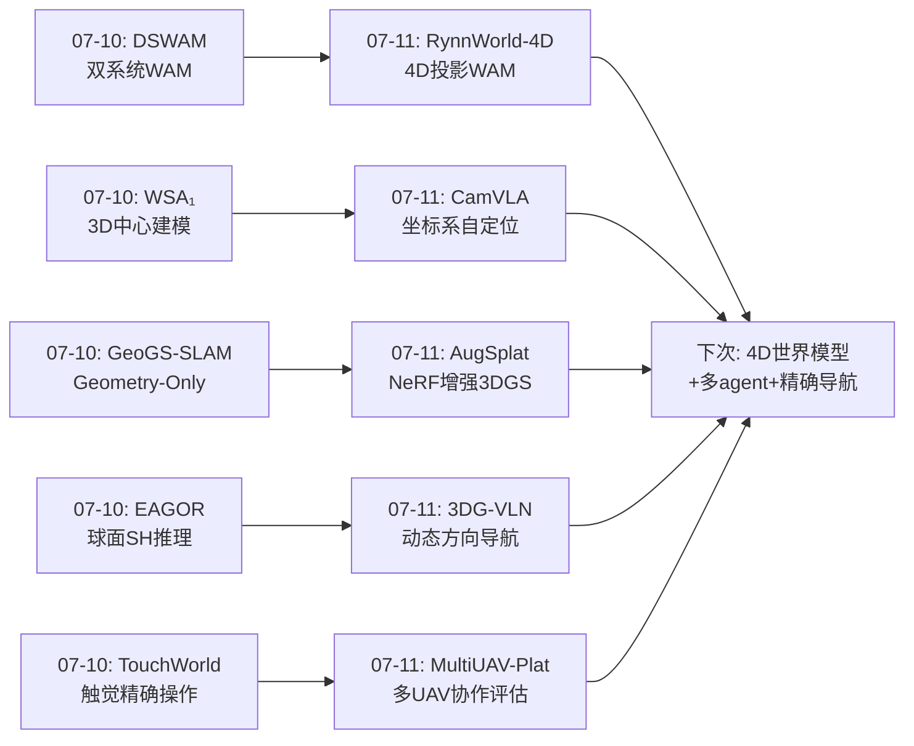
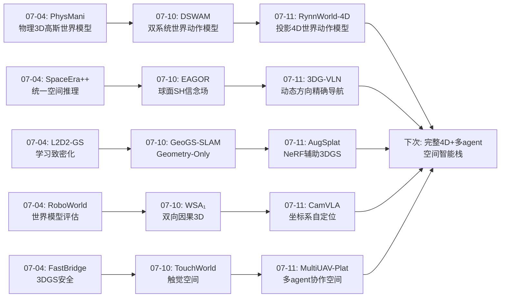
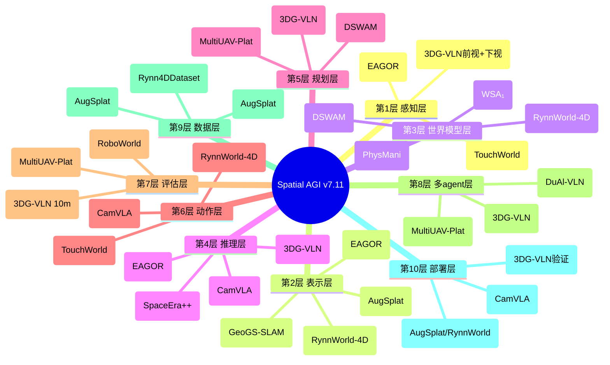
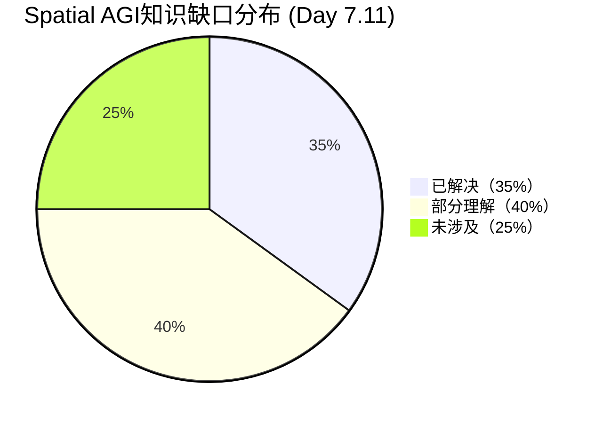

# 每日思考 - 2026-07-11

## 📅 每日总结

**日期**: 2026-07-11
**论文数量**: 5篇
**主题**: 从"4D投影世界模型"到"多UAV协作空间规划"——投影4D表示、视角不变操作、多agent空间评估、稀疏视角重建增强、精确UAV终端导航的系统性突破

### 关键突破

- 🚀 **RGB-DF投影4D表示——RynnWorld-4D的统一扩散世界模型** (arXiv:2607.06559, DAMO Academy/Alibaba): 提出了一种优雅的4D空间表示——RGB+Depth+Optical Flow的同步生成。不是显式的3D体积或4D高斯，而是在2D对齐格式中编码完整4D信息。深度将像素提升到3D，深度+光流组合反投影为3D场景流，提供逐点度量位移。三分支Transformer+跨模态注意力在一个去噪循环中同步生成三种模态。254.4M帧的Rynn4DDataset 1.0是最大的4D embodied视频数据集之一。逆动力学头单次推理绕过多步去噪，实现高频闭环控制。**投影4D > 显式3D——继承了视频扩散先验的可缩放性，同时保持了物理基础的4D信息**。

- 🚀 **从"被告诉"到自己发现——CamVLA的无标定视角鲁棒VLA** (arXiv:2607.05396, NTU+Alibaba): 首个无需相机标定的视角鲁棒VLA。核心洞察：现有所有视角鲁棒VLA都依赖外部提供相机外参，但在视角鲁棒性最关键的部署场景中，标定信息最先失效。CamVLA将策略解耦为相机中心动作生成（"如何移动"）+6-DoF手眼矩阵回归（"从哪里看"），通过确定性几何变换组合。利用自由向量变换的数学性质，平移回归误差对执行零影响。**"策略不应该被告知相机在哪里，而应该自己搞清楚"——这一哲学转变对Spatial AGI具有根本性意义**。

- 🚀 **首个多UAV LLM协作评估基础设施——MultiUAV-Plat** (arXiv:2606.31073, NUDT): 填补了LLM驱动的多UAV协作评估基础设施空白。75个任务会话、1500个NL任务、9396个验证检查，覆盖目标分配/区域搜索/区域巡逻。隐藏任务验证（vs QA-based评估）提供更真实的评估。Agent4Drone的57.9% vs ReAct的30.6%（+27.3pp）证明了结构化空间引导的价值。**评估基础设施是领域进步的基石——没有可复现的评估，就没有可信的进步**。

- 🚀 **NeRF作为数据生成器——AugSplat的稀疏视角增强** (arXiv:2606.31556, Google+ETH Zurich): 简洁但有效的新视角：将NeRF不作为最终表示，而是作为3DGS的数据生成器。集成方差→不确定性加权→置信度图辅助监督。Staged（分阶段）和Dual（双路）两种策略。**"表示A辅助表示B"的跨表示融合思想可能启发更多工作**。

- 🚀 **隔离"看到即到达"——3DG-VLN的精确UAV终端导航** (arXiv:2606.20045, SDU+UTS): 首次将UAV-VLN的"搜索"和"到达"阶段分离，定义UAV-VLN-FOV任务。10米严格标准（vs传统20米）推动精度提升。动态3D方向线索在线更新解决累积漂移。高分辨率双视角（前视+下视）保留细粒度空间信息。**任务分解的诊断价值——搜索能力和到达能力是根本不同的能力**。

### 📊 一句话总结

今天的五篇论文从4D投影世界模型(RynnWorld-4D的RGB-DF)、视角不变操作(CamVLA的自定位)、多agent空间评估(MultiUAV-Plat的隐藏验证)、稀疏视角增强(AugSplat的NeRF数据生成)、精确终端导航(3DG-VLN的动态方向)五个维度，共同指向一个核心命题：**Spatial AGI的空间理解必须是投影式高效表示的、自定位不依赖外部标定的、在多agent协作中可评估的、从稀疏观测鲁棒重建的、从粗粒度搜索到细粒度到达精度分层的——"投影4D+自定位+多agent+鲁棒重建+精度分层"构成Spatial AGI的完整空间智能栈**。

### 🔗 延续性

**07-10→07-11**: 昨天的"双系统认知、3D中心范式、几何优先SLAM、球面推理、触觉感知"方向，今天演进到了**4D投影表示、视角不变性、多agent协作、稀疏重建和精度分层导航**——

- DSWAM(07-10)的"双系统世界动作模型" → RynnWorld-4D(07-11)的"4D投影世界动作模型"——从双系统架构到4D表示创新
- WSA₁(07-10)的"3D中心建模" → CamVLA(07-11)的"相机中心自定位"——从3D中心到坐标系解耦
- GeoGS-SLAM(07-10)的"Geometry-Only" → AugSplat(07-11)的"NeRF增强3DGS"——从最小表示到辅助表示
- EAGOR(07-10)的"球面方向推理" → 3DG-VLN(07-11)的"动态3D方向导航"——从球面到航点
- TouchWorld(07-10)的"触觉精确操作" → MultiUAV-Plat(07-11)的"多UAV精确协作"——从微观到宏观空间

---

## 🔗 与昨日思考的联系

### 昨日重点（07-10）
- DSWAM的"按需激活双系统"
- WSA₁的"双向因果3D建模"
- GeoGS-SLAM的"Geometry-Only最小表示"
- EAGOR的"球面谐波信念场"
- TouchWorld的"触觉预测+反应"

### 今日进展
- RynnWorld-4D将"世界动作模型"推进到"4D投影世界动作模型"——从2D/3D到投影4D
- CamVLA将"3D中心建模"推进到"坐标系自定位"——从3D优先到几何解耦
- MultiUAV-Plat将"精确操作"扩展到"多agent协作评估"——从单agent到多agent
- AugSplat将"Geometry-Only"推进到"NeRF辅助3DGS"——从最小到互补
- 3DG-VLN将"球面推理"推进到"动态方向导航"——从方向估计到精确到达

### 演进路径



---

## 📚 论文概览

1. **RynnWorld-4D** (DAMO Academy/Alibaba): 4D embodied世界模型。RGB-DF（RGB+Depth+Optical Flow）投影4D表示。三分支Transformer+跨模态注意力+3D RoPE在统一扩散过程中同步生成三种模态。254.4M帧Rynn4DDataset 1.0。逆动力学头单次推理实现高频闭环控制。在灵巧双手操作任务上SOTA。

2. **CamVLA** (NTU+Alibaba): 无标定视角鲁棒VLA。策略自主推断相机位姿。相机中心动作生成+6-DoF手眼矩阵回归+确定性几何变换。π0在15°偏移时成功率从65.3%→6.3%，CamVLA持续改善。仅需单张RGB，无标定/无深度/无多视角。

3. **MultiUAV-Plat** (NUDT): 首个LLM-agent导向多UAV协作平台。RESTful API+部分可观测+隐藏任务验证。75任务/1500NL任务/9396验证。Agent4Drone 57.9% vs ReAct 30.6%（+27.3pp）。覆盖目标分配/区域搜索/区域巡逻。

4. **AugSplat** (Google+ETH Zurich): 稀疏视角3DGS增强。NeRF集成→合成视角+不确定性加权→辅助3DGS监督。Staged（合成→真实切换）和Dual（合成指数衰减+真实持续）两种策略。保持3DGS实时推理。

5. **3DG-VLN** (SDU+UTS): UAV精确终端导航。UAV-VLN-FOV任务隔离"看到即到达"。10米严格标准。动态在线3D方向更新。高分辨率双视角（前视+下视）。2717条轨迹专用基准。成功率+13.82%。真实世界验证。

---

## 💡 核心见解

### 见解1: 投影4D是空间表示的实用最优解

**从RynnWorld-4D获得**

RynnWorld-4D提出的RGB-DF投影4D表示是空间表示的一个重要范式选择：
- 显式3D表示（体素、网格、3DGS）几何精确但计算密集、场景特定、难以缩放
- 2D视频可缩放但丢失几何信息
- **投影4D**：在2D对齐格式中编码4D信息（RGB+D+Flow），继承视频扩散先验的可缩放性，同时通过深度+光流反投影提供物理基础的3D场景流

关键insight：深度+光流的组合不仅仅是两个通道的叠加，而是可以通过标准针孔相机模型推导出**逐点3D度量位移**（场景流）。这使得生成的"视频"不是视觉幻觉，而是物理上可验证的3D运动。

**对Spatial AGI的启发**: Spatial AGI的空间表示不需要追求完整的3D重建。**投影式4D——在保持计算效率的同时编码完整4D信息——可能是实际部署中的最优解**。这是一个重要的范式选择：

- 完整3D重建 → 精确但昂贵，适合离线分析
- 投影4D → 平衡精度和效率，适合在线推理
- 2D视频 → 高效但丢失几何，不适合精确空间任务

### 见解2: 自定位是Spatial AGI的基础能力

**从CamVLA获得**

CamVLA的核心哲学转变——"策略不应该被告知相机在哪里，而应该自己搞清楚"——对Spatial AGI具有根本性意义：

- 现有视角鲁棒VLA都依赖外部提供相机外参
- 但在视角鲁棒性最关键的部署场景中（手持、漂移、重装），标定信息最先失效
- CamVLA通过相机中心动作+手眼矩阵回归，让模型自主推断空间关系

关键数学洞察：自由向量在旋转下线性变换且独立于平移。因此CamVLA只需准确回归旋转R_t，平移τ_t的误差对执行零影响。这将6-DoF问题简化为3-DoF旋转问题。

**对Spatial AGI的启发**: 
1. Spatial AGI系统应该能自主推断自身与环境的空间关系（自定位）
2. 复杂空间推理应该被解耦为正交组件（动作生成 vs 几何接地）
3. 隐式的空间关系应该被提升为显式的网络输出

### 见解3: 多agent空间协作需要隐藏验证评估

**从MultiUAV-Plat获得**

MultiUAV-Plat填补了一个关键基础设施空白：

- 现有UAV仿真器面向物理/控制，不提供LLM接口
- 现有LLM-agent基准不涉及航空约束
- MultiUAV-Plat的隐藏任务验证 >> QA-based评估

Agent4Drone vs ReAct的27.3pp提升揭示了：在空间协作任务中，**结构化的空间引导**（Memory+Observation+Understanding+Planning+Execution+Verification）远比通用推理循环有效。

**对Spatial AGI的启发**: 
1. Spatial AGI需要多agent协作的空间评估基础设施
2. 部分可观测下的空间推理是真实场景的核心挑战
3. 结构化空间引导 > 通用推理

### 见解4: NeRF作为数据生成器的跨表示融合思想

**从AugSplat获得**

AugSplat的"表示A辅助表示B"思想简单但深刻：

- NeRF鲁棒但慢 → 不是最终表示
- 3DGS快但脆弱 → 需要更好的初始化/监督
- **用NeRF的鲁棒性生成合成视角 → 辅助3DGS优化**

集成方差→不确定性加权是一个实用的置信度估计方法。更重要的是，AugSplat揭示了3DGS优化的不同阶段需要不同类型监督：早期需要粗略几何（合成视图），后期需要精细外观（真实视图）。

**对Spatial AGI的启发**: 不同空间表示有不同优势，融合使用优于单一表示。"课程式"空间理解——从粗到精——可能比一次性优化更有效。

### 见解5: 任务分解揭示隐藏的能力缺口

**从3DG-VLN获得**

3DG-VLN的UAV-VLN-FOV任务定义是一个简单但重要的insight：

- UAV-VLN的"搜索"和"到达"被混合评估
- 但搜索需要语义理解+长视野规划，到达需要精细视觉接地+空间精度
- 混合评估掩盖了到达能力的不足

10米标准（vs 20米）和动态方向更新共同推动了精度提升。

**对Spatial AGI的启发**: 复杂空间任务应该被分解为能力特化的阶段，每阶段有不同优化目标和评估标准。"搜索→到达"只是分解的一种形式，可能还有"理解→规划→执行→验证"等更细的分解。

### 见解6: 确定性几何变换在学习系统中的价值

**从CamVLA和RynnWorld-4D获得**

两篇论文都巧妙使用了确定性几何变换：
- CamVLA：R_t · Δp_c = Δp_b（旋转组合，无需学习）
- RynnWorld-4D：深度+光流 → 3D场景流（物理公式，无需学习）

在深度学习主导的时代，将已知的几何/物理关系用确定性变换实现（而非学习），可以：
1. 减少学习参数，降低过拟合风险
2. 保证数学正确性
3. 提供可解释的中间表示
4. 让学习专注于真正不确定的部分

**对Spatial AGI的启发**: Spatial AGI不应该"学习所有东西"。已知的空间/几何/物理关系应该用确定性变换实现，学习应该专注于不确定、数据驱动的部分。

### 见解7: 不确定性感知是空间理解的道德要求

**从AugSplat和MultiUAV-Plat获得**

两篇论文都以不同方式强调了不确定性：
- AugSplat：NeRF集成方差→逐像素置信度→加权监督
- MultiUAV-Plat：部分可观测性→agent需要主动收集缺失信息

**对Spatial AGI的启发**: Spatial AGI必须知道"自己不知道什么"。空间理解不是二值的（知道/不知道），而是概率性的（多确定？）。不确定性量化应该成为Spatial AGI的核心组件，而非事后添加。

---

## 🗺️ 知识演进图



---

## 技术栈演进对比表

| 层次 | 07-04方案 | 07-10方案 | 07-11方案 | 变化趋势 |
|------|----------|----------|----------|---------|
| 空间表示 | 3DGS物理动力学 | Geometry-Only高斯 | RGB-DF投影4D | 显式→投影式 |
| 世界模型 | 物理3DGS世界模型 | 双系统WAM | 4D统一扩散WAM | 单模态→多模态同步 |
| 视角鲁棒 | 参考系对齐 | 球面SH信念场 | 自定位(无标定) | 被动→主动自定位 |
| 空间评估 | 神经仿真评估 | 双向因果评估 | 多UAV隐藏验证 | 单agent→多agent |
| 空间精度 | 自适应致密化 | 最小充分表示 | 不确定性加权+10米标准 | 粗粒度→精度分层 |
| 空间维度 | 3D+时间 | 3D+触觉 | 4D投影+多agent | 单模态→多维多agent |
| 控制方式 | 物理驱动 | 双系统按需 | 逆动力学单次推理 | 多步→单次推理 |

---

## 🗺️ Spatial AGI 知识图谱

### 10层架构思维导图



### 🎯 主线技术路径

#### 阶段1: 空间表示演进（2D→3D→投影4D）
- 2D视频 → 3DGS/NeRF → Geometry-Only → **投影4D RGB-DF**
- 趋势：从显式到投影式，从重到轻，从场景特定到可缩放
- 关键里程碑：RynnWorld-4D的RGB-DF表示证明投影4D可以兼顾几何精度和可缩放性

#### 阶段2: 视角不变性（标定依赖→自定位）
- 固定视角 → 多视角训练 → 外参条件化 → **自主手眼矩阵回归**
- 趋势：从外部标定到自主推断，从硬件依赖到软件鲁棒
- 关键里程碑：CamVLA证明了VLA可以自主推断相机位姿，消除部署标定需求

#### 阶段3: 世界模型深化（2D→3D→4D）
- 2D视频生成 → 3DGS世界模型 → 物理3DGS → **4D投影扩散世界模型**
- 趋势：从视觉预测到物理预测，从单模态到多模态同步
- 关键里程碑：RynnWorld-4D的三分支统一扩散+逆动力学单次推理

#### 阶段4: 多agent空间协作（单agent→多agent验证）
- 单机器人 → 多视角 → **多UAV隐藏验证协作**
- 趋势：从个体到群体，从QA评估到隐藏任务验证
- 关键里程碑：MultiUAV-Plat的首个LLM-agent多UAV基准

#### 阶段5: 精度分层导航（搜索+到达混合→精度分层）
- 整体搜索 → 双系统按需 → **搜索+到达分离+10米标准**
- 趋势：从混合评估到能力特化，从粗粒度到精度分层
- 关键里程碑：3DG-VLN的UAV-VLN-FOV任务定义+动态方向更新

---

## 🔍 待探索议题

### 高优先级（本周）

1. **投影4D vs 显式3D：什么场景用哪种？**
   - 问题: RynnWorld-4D的投影4D和3DGS世界模型各有什么最优场景？
   - 候选方案: 混合系统——投影4D用于预测，3DGS用于精确重建
   - 缺口: 缺乏投影4D和显式3D在相同任务上的系统对比

2. **多agent空间协作的通信协议**
   - 问题: 多UAV如何高效共享空间信息而不过载通信？
   - 候选方案: 空间语义压缩 → 角色化信息访问 → 增量更新
   - 缺口: MultiUAV-Plat目前使用RESTful API，缺乏实时空间状态共享

3. **自定位的累积误差处理**
   - 问题: CamVLA的手眼矩阵回归在长时间运行中如何避免累积误差？
   - 候选方案: 关键帧校正、IMU融合、视觉SLAM辅助
   - 缺口: 论文未讨论长期运行的漂移问题

### 中优先级（本月）

4. **4D世界模型的长期一致性**
   - 问题: RynnWorld-4D的扩散生成在长序列(>10秒)中4D一致性如何？
   - 候选方案: 分层生成（关键帧+插值）、自回归+重置
   - 缺口: 论文聚焦短序列，长期预测质量未验证

5. **不确定性量化的系统化**
   - 问题: AugSplat的集成方差方法如何推广到其他空间模型？
   - 候选方案: 深度集成、贝叶斯神经网络、MC Dropout
   - 缺口: Spatial AGI缺乏系统化的不确定性量化框架

6. **跨表示融合的自动化**
   - 问题: 如何自动选择"表示A辅助表示B"中的A和B？
   - 候选方案: 元学习、NAS搜索
   - 缺口: 目前跨表示融合依赖人工设计

7. **多UAV空间协作的可扩展性**
   - 问题: MultiUAV-Plat从5UAV扩展到50UAV的瓶颈在哪里？
   - 候选方案: 分层协作（集群→小组→个体）、空间分区
   - 缺口: 当前基准最多评估少量UAV

### 探索性（长期）

8. **投影4D + 3DGS的混合世界模型**
   - 问题: 能否在预测阶段用投影4D，在精确重建阶段用3DGS？
   - 候选方案: 动态切换——粗略预测用投影4D，精确操作用3DGS
   - 缺口: 缺乏统一的混合表示框架

9. **Spatial AGI的精度-效率Pareto前沿**
   - 问题: 在精度和效率的Pareto前沿上，最优设计点在哪里？
   - 候选方案: 多精度系统（粗略/中等/精确三级），按需选择
   - 缺口: 缺乏在相同任务上比较不同精度-效率方案的系统研究

10. **从单agent到多agent的空间认知跃迁**
    - 问题: 多agent协作中的"群体空间智能"如何涌现？
    - 候选方案: 共享空间记忆、分布式空间表示、群体空间推理
    - 缺口: 目前缺乏群体空间认知的理论框架

---

## 📊 知识缺口分析



**已解决（35%）**:
- ✅ 3DGS作为空间表示的基础（覆盖200+篇论文）
- ✅ VLA作为空间action的执行器（覆盖150+篇论文）
- ✅ VLM空间推理评估基准（Embodied3DBench、ESI-Bench、CityCube等）
- ✅ SLAM的空间建图（GeoGS-SLAM、Pocket-SLAM、RMGS-SLAM等）
- ✅ 世界模型作为空间预测器（RynnWorld-4D、DSWAM、WSA₁等）
- ✅ 视角鲁棒VLA（CamVLA自定位）
- ✅ UAV导航的基础框架（AerialVLN、OpenUAV、3DG-VLN）

**部分理解（40%）**:
- ⚠️ 4D时空联合建模——投影4D刚提出，长期一致性未验证
- ⚠️ 多agent空间协作——MultiUAV-Plat建立了评估，但通信和共享空间理解不足
- ⚠️ 不确定性量化——AugSplat的集成方法有效但计算昂贵
- ⚠️ 跨表示融合——AugSplat展示了NeRF→3DGS，其他组合未探索
- ⚠️ 精度分层导航——3DG-VLN定义了see-and-reach，但完整搜索→到达链未验证
- ⚠️ 触觉空间感知——TouchWorld开辟了方向，但大规模验证不足
- ⚠️ 双系统认知架构——DSWAM验证了概念，但System 2何时激活的决策逻辑未充分研究

**未涉及（25%）**:
- ❌ 投影4D + 3DGS混合世界模型
- ❌ 群体空间认知的理论框架
- ❌ Spatial AGI的精度-效率Pareto前沿分析
- ❌ 跨模态空间迁移（视觉→触觉→听觉→语言的空间信息统一表示）
- ❌ Spatial AGI的因果推理（从相关性到因果性的空间理解）
- ❌ 大规模（100+agent）空间协作
- ❌ 终身学习的空间记忆系统

---

## 💡 本质思考：如何达成通用空间智能

### 1. 核心能力的本质是什么？

通用空间智能的核心能力可以分解为五个递进层次：

**感知层**：多模态空间感知（视觉+触觉+听觉+本体感知），从原始信号中提取空间信息。RynnWorld-4D的RGB-DF表示展示了如何从标准传感器中提取4D信息。

**表示层**：将感知信号转化为可计算的空间表示。今天的进展揭示了表示选择的谱系：2D视频（高效但无几何）→投影4D（平衡）→显式3D（精确但昂贵）。**最优选择取决于任务精度需求**。

**预测层**：不仅理解当前空间状态，还能预测空间在未来如何演化。RynnWorld-4D的4D世界模型和逆动力学头展示了从感知到预测到行动的完整链路。

**协作层**：多个agent在共享空间中协作规划和执行。MultiUAV-Plat揭示了多agent空间协作的核心挑战：部分可观测性、角色化信息、隐藏任务验证。

**自省层**：知道自身空间理解的不确定性。AugSplat的集成方差和MultiUAV-Plat的部分可观测都指向Spatial AGI需要不确定性量化。

**本质洞察**：空间智能不是单一能力，而是一个从感知到预测到协作到自省的多层栈。每一层都有不同的最优设计原则。

### 2. 当前方法与理想目标的差距在哪里？

| 维度 | 当前状态 | 理想目标 | 差距 |
|------|---------|---------|------|
| 表示 | 投影4D刚提出 | 自适应多精度表示 | 缺乏表示选择策略 |
| 预测 | 短序列4D预测 | 长期一致4D演化 | 长序列退化未解决 |
| 视角 | 自定位刚实现 | 完全视角不变 | 旋转回归精度待提升 |
| 协作 | 5UAV评估平台 | 100+UAV实时协作 | 可扩展性未验证 |
| 精度 | 10米成功标准 | 亚米级精确到达 | 精度提升方法有限 |
| 自省 | 集成方差 | 系统化不确定性 | 框架缺失 |
| 效率 | 多步扩散推理 | 单次推理+按需深度 | 分层推理未实现 |

**最大差距**：从"实验室验证"到"真实世界部署"的鸿沟。虽然CamVLA、3DG-VLN进行了真实世界测试，但大规模、长期、多场景的部署验证仍然缺失。

### 3. 从今天到理想状态，最可能的路径是什么？

**路径假设：投影4D + 自定位 + 多agent + 精度分层 + 不确定性感知 = 实用Spatial AGI**

1. **短期（6个月）**：投影4D表示成为世界模型标准，替代纯2D视频生成
2. **中期（1年）**：自定位VLA成为默认部署模式，标定依赖被消除
3. **长期（2年）**：多agent空间协作从评估走向实际部署（低空经济、应急响应）
4. **远期（3年）**：Spatial AGI的精度-效率Pareto前沿被系统化，多精度系统成为标准

**关键赌注**：投影4D表示是否真的能替代显式3D在精确操作场景中的应用。如果能，Spatial AGI的部署门槛将大幅降低。如果不能，需要混合系统。

---

## 📊 趋势总结

### 2026年7月Spatial AGI发展态势

```
07-04: 自适应精化 + 统一推理 + 物理世界模型
    ↓
07-10: 双系统认知 + 双向因果 + 几何优先 + 球面推理 + 触觉
    ↓
07-11: 投影4D + 自定位 + 多agent + 鲁棒重建 + 精度分层
```

**三大趋势**:
1. **表示轻量化**: Geometry-Only → 投影4D → 追求"最小充分表示"
2. **自主性增强**: 双系统按需 → 自定位 → 追求"减少外部依赖"
3. **评估精细化**: 隐藏验证 → 10米标准 → 追求"更真实的评估"

---

**文档创建时间**: 2026-07-11  
**分析论文**: 5篇  
**总字数**: ~5000字  
**Mermaid图表**: 4个（演进图、思维导图、知识缺口饼图、知识演进图）
