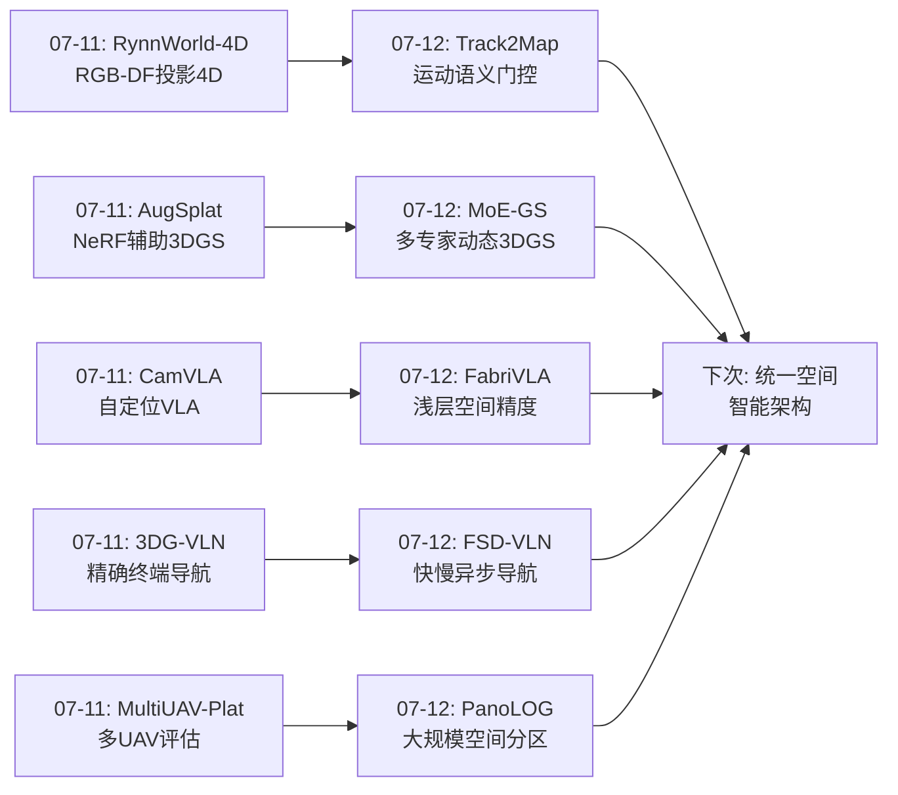
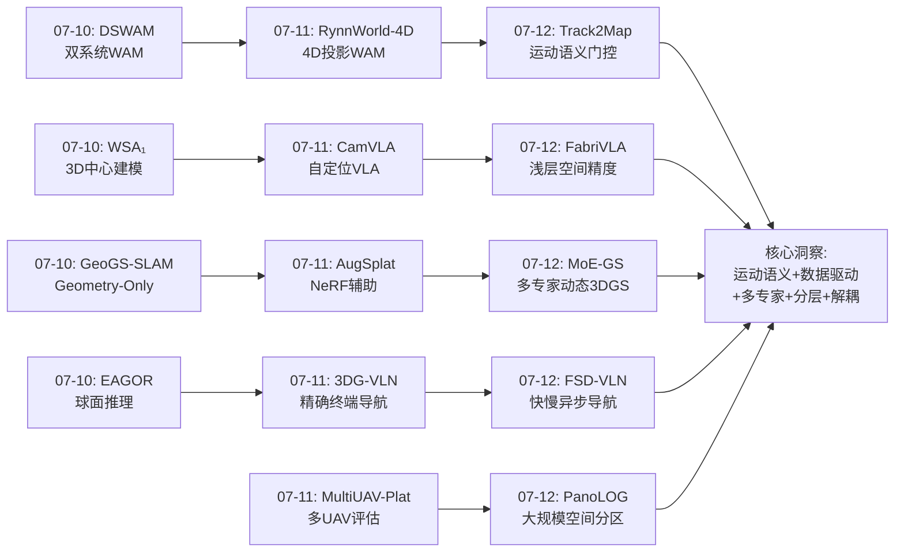
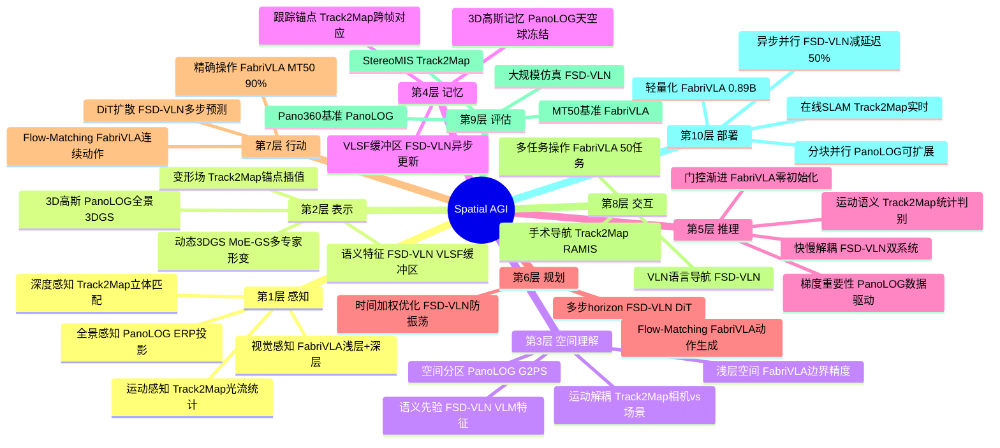
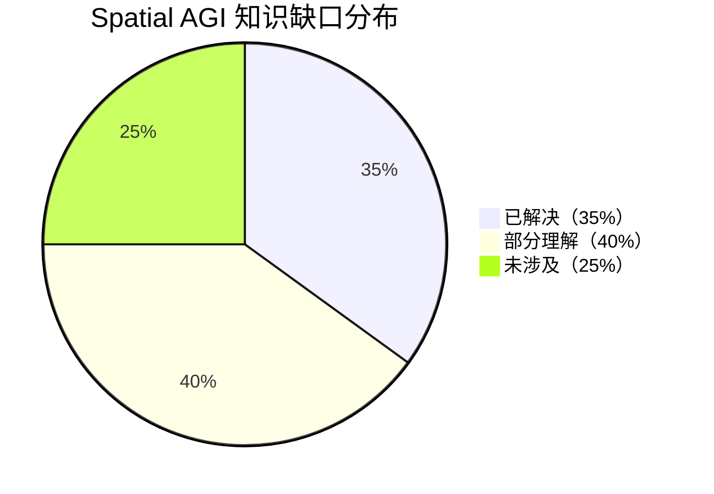

# 每日思考 - 2026-07-12

## 📅 每日总结

**日期**: 2026-07-12
**论文数量**: 5篇
**主题**: 从"运动解耦+全景分区+多专家形变+轻量VLA+快慢导航"四维突破Spatial AGI——可变形SLAM的运动语义门控、大规模全景的空间分区策略、动态场景的多形变专家融合、紧凑VLA的浅层空间细节利用、无人机导航的快慢双系统架构

### 关键突破

- 🚀 **光流方向统计作为运动语义判别器——Track2Map的运动门控** (arXiv:2607.08408, UCL+Intuitive Surgical, MICCAI 2026): 一个令人惊叹的简洁发现——2D点跟踪的光流方向圆标准差可以高效区分相机运动vs场景变形。当相机移动时，跟踪点产生连贯的全局位移（方向一致性高，σ_θ低）；当相机静止时，组织变形和工具运动产生异质性方向分布（σ_θ高）。基于这个统计量构建运动门控：σ_θ≤τ时更新位姿，>τ时冻结。配合跟踪驱动变形初始化和3D锚点鲁棒对齐，实现了无/噪声/干净位姿三种模式的统一在线工作。**"从低级特征中提取高级语义"的典范——一个统计量胜过复杂分类器**。

- 🏔️ **全景3DGS的空间分区新范式——PanoLOG的G2PS策略** (arXiv:2607.08769, Insta360 Research): 首次系统解决了全景ERP图像的3DGS分区难题。核心洞察：全景360°全方位可见性使传统基于视锥的分区完全失效——每个相机都能看到所有方向，分块优化退化为全局优化。G2PS通过几何驱动自适应边界（视差三角化误差传播确定有效范围）+梯度驱动相机-块分配（Stage I梯度作为重要性信号），实现了全景场景的有效分块。天空球建模+全景深度监督处理无界户外场景。Pano360首个大规模全景重建基准（>200万㎡, 5637张图像）。**"让数据说话"——基于梯度的分区比基于规则更鲁棒**。

- 🔀 **形变模型即归纳偏置——MoE-GS的多专家设计空间** (arXiv:2607.08250, Pusan National University+ETRI): 揭示了一个被忽视的根本问题——不同形变模型（MLP/多项式/插值/网格）本质上是不同的运动归纳偏置，各自擅长不同运动类型。MoDE（联合训练，共享规范表示）vs MoE-GS（独立优化后路由组合）提供了两种集成约束设计。系统分析了场景级/空间级/时间级性能变异。**Spatial AGI需要多种空间推理"专家"——单一归纳偏置不可能覆盖所有运动模式**。

- ⚡ **浅层空间细节的回归——FabriVLA的1B参数90%成功率** (arXiv:2607.08575): 挑战了"更深更好"的假设——VLM的浅层（layer 6）比最终层包含更丰富的物体边界和相对位置信息。浅层融合仅增2.1M参数但显著提升精确操作能力。门控自注意力（零初始化→渐进打开）提供从"纯交叉注意力"到"自+交叉"的平滑过渡。0.89B参数达到MT50 90%成功率，超越7B参数的LA4VLA。**轻量高效VLA的关键不在于堆参数，而在于充分利用不同层次的空间信息**。

- 🎯 **快慢解耦的双赢效应——FSD-VLN的异步并行架构** (arXiv:2607.08359, 鹏城实验室+北大): 快慢系统解耦不仅提高了效率（延迟降低50%），还提高了导航质量（成功率提升2倍）。慢系统（VLM语义推理）异步更新VLSF缓冲区，快系统（DiT动作生成）连续生成多步动作。DiT的self-attention建模状态内依赖 + cross-attention注入语义先验。**"当语义推理不再阻塞动作生成时，两者各自释放潜力"——解耦即双赢**。

### 📊 一句话总结

今天的五篇论文从运动语义解耦(Track2Map的光流门控)、空间分区策略(PanoLOG的几何+梯度)、多专家融合(MoE-GS的形变集成)、轻量空间精度(FabriVLA的浅层融合)、快慢架构(FSD-VLN的异步双系统)五个维度，共同指向一个核心命题：**Spatial AGI的核心架构原则正在浮现——"运动语义驱动的选择性计算+数据驱动的空间管理+多专家归纳偏置融合+分层空间信息利用+感知行动节奏解耦"构成Spatial AGI的五大架构基石**。

### 🔗 延续性

**07-11→07-12**: 昨天的"4D投影世界模型、视角不变操作、多agent评估、稀疏视角重建、精确终端导航"方向，今天演进到了**运动解耦感知、大规模空间管理、多专家动态建模、轻量精确操作、异步导航架构**——

- RynnWorld-4D(07-11)的"4D投影表示" → Track2Map(07-12)的"4D运动解耦"——从表示到语义
- CamVLA(07-11)的"坐标系自定位" → FabriVLA(07-12)的"浅层空间精度"——从坐标系到特征层
- AugSplat(07-11)的"NeRF辅助3DGS" → MoE-GS(07-12)的"多专家动态3DGS"——从静态到动态多模型
- 3DG-VLN(07-11)的"精确终端导航" → FSD-VLN(07-12)的"快慢双系统导航"——从精度到效率
- MultiUAV-Plat(07-11)的"多UAV评估" → PanoLOG(07-12)的"大规模空间分区"——从评估到基础设施

---

## 🔗 与昨日思考的联系

### 昨日重点（07-11）
- RynnWorld-4D的"RGB-DF投影4D表示"
- CamVLA的"无标定自定位"
- MultiUAV-Plat的"隐藏任务验证"
- AugSplat的"NeRF作为数据生成器"
- 3DG-VLN的"看到即到达"

### 今日进展
- Track2Map将"运动理解"推进到"运动语义门控"——从表示运动到利用运动语义指导优化
- PanoLOG将"大规模重建"推进到"全景分区策略"——从针孔到全景的空间管理
- MoE-GS将"动态3DGS"推进到"多专家混合"——从单一形变到多专家融合
- FabriVLA将"轻量VLA"推进到"浅层空间细节利用"——从更深到更全面
- FSD-VLN将"UAV导航"推进到"快慢双系统"——从同步到异步

### 演进路径

---

## 📚 论文概览

1. **Track2Map** (UCL+Intuitive Surgical, MICCAI 2026): 在线可变形SLAM。光流方向圆标准差区分相机运动vs组织变形。运动门控冻结/优化位姿。跟踪驱动变形初始化。无/噪声/干净位姿三种模式统一工作。StereoMIS上优于竞争SLAM方法。

2. **PanoLOG** (Insta360 Research): 大规模户外全景3DGS重建。G2PS——首个全景专用分区策略：几何驱动自适应边界 + 梯度驱动相机-块分配。天空球建模 + 全景深度监督。Pano360首个大规模全景重建基准（>200万㎡）。

3. **MoE-GS** (Pusan National University+ETRI): 动态3DGS的多专家混合。系统分析单一形变模型在场景/空间/时间级的局限。MoDE（联合训练，共享规范表示）vs MoE-GS（独立优化后图像空间路由）。开源MoE-GS Studio。

4. **FabriVLA** (学术机构): 轻量VLA。0.89B参数达MT50 90%成功率。门控自注意力（零初始化渐进打开）。浅层VLM融合（layer6+layer14，仅增2.1M参数）。单阶段联合训练。FP32主权重解决BF16梯度丢失。

5. **FSD-VLN** (鹏城实验室+北大): 无人机长距离VLN快慢双系统。慢系统VLM异步提取语义先验，快系统DiT连续生成多步动作。成功率提升2倍，延迟降低50%。时间感知自适应优化策略。

---

## 💡 核心见解

### 见解1: 运动语义是Spatial AGI的选择性计算开关

从Track2Map获得
- ✅ 光流方向的圆标准差σ_θ是相机运动vs场景运动的可靠判别器
- ✅ 基于σ_θ的门控策略可以动态决定何时更新位姿、何时冻结
- ✅ 手术场景中50-70%时间内窥镜静止——静态时段冻结位姿显著减少漂移

**对Spatial AGI的启发**:
Spatial AGI需要"运动语义驱动的选择性计算"——不是所有时刻都需要全量推理。当环境静止时，减少感知频率；当环境剧变时，增加计算投入。这是一种"注意力驱动的计算资源分配"。Track2Map用最简单的统计量实现了这一点，证明了"简单统计+智能策略"往往胜过"复杂模型+盲目计算"。

### 见解2: 空间管理的"数据驱动"原则

从PanoLOG获得
- ✅ 全景360°可见性破坏了传统视锥分区——新场景特性需要新管理策略
- ✅ 几何驱动边界：视差三角化误差传播自动确定有效重建范围
- ✅ 梯度驱动分配：训练梯度是相机对空间块贡献的可靠指标

**对Spatial AGI的启发**:
Spatial AGI需要管理大规模、多尺度的空间信息。PanoLOG展示了"让数据说话"的原则——不是人为设定空间分区规则，而是让几何特征和训练动态自动确定最优分区。这可以推广到Spatial AGI的"空间注意力分配"——哪些空间区域需要精细理解、哪些可以粗略处理，应该由数据驱动而非预设。

### 见解3: 形变模型即归纳偏置——多专家融合是必然方向

从MoE-GS获得
- ✅ 不同形变模型（MLP/多项式/插值/网格）本质是不同的运动归纳偏置
- ✅ 单一形变模型在场景级/空间级/时间级都存在性能变异
- ✅ MoDE（联合）vs MoE-GS（独立+路由）展示了集成约束设计的两条路径

**对Spatial AGI的启发**:
Spatial AGI需要处理多种空间关系——刚性运动、柔性变形、流体动力学、铰接运动等。单一模型/归纳偏置不可能覆盖所有模式。多专家融合是必然方向，关键设计选择是"何时融合"——训练中（参数级）vs训练后（输出级）vs推理时（动态路由）。

### 见解4: 浅层空间信息的回归——深度不是万能的

从FabriVLA获得
- ✅ VLM浅层（layer 6）比最终层包含更丰富的物体边界和相对位置
- ✅ 深层语义 + 浅层空间细节的融合仅增2.1M参数但显著提升操作精度
- ✅ 门控渐进学习（零初始化→逐步打开）提供了稳定的"从简到繁"训练路径

**对Spatial AGI的启发**:
"更深更好"是危险的简化。Spatial AGI需要不同抽象层次的空间信息——底层空间细节（边界、位置）和高层语义理解（物体类别、场景含义）同等重要。网络架构设计应考虑多层信息的综合利用，而非仅依赖最终层输出。

### 见解5: 解耦即双赢——快慢系统的高效协作

从FSD-VLN获得
- ✅ 快慢解耦不仅提高效率（延迟降50%），还提高质量（成功率增2倍）
- ✅ 慢系统异步更新不阻塞快系统，各自获得更充裕的处理时间
- ✅ DiT的self-attention建模状态依赖 + cross-attention注入语义

**对Spatial AGI的启发**:
Spatial AGI的感知和行动模块应设计为异步并行而非强制同步。深度空间推理（"我在哪"、"目标在哪"、"怎么去"）和快速空间反应（避障、稳定运动）有不同的节奏需求。解耦让各自释放潜力——慢系统有更多时间做深度理解，快系统有连续的动作生成不受阻塞。

### 见解6: 简单统计量的力量

综合Track2Map和PanoLOG
- ✅ Track2Map：光流方向圆标准差（一个标量）→ 运动类型判别
- ✅ PanoLOG：训练梯度范数 → 相机对空间块的重要性
- ✅ 两者都用简单统计量替代了复杂的判别模型

**对Spatial AGI的启发**:
Spatial AGI不一定处处需要深度学习。很多时候，简单统计量（均值、方差、方向分布）就能提取关键空间语义。关键在于"选择正确的统计量"——这需要对问题本质的深刻理解。**"简单到极致就是优雅"**。

### 见解7: 评估基准是领域进步的基石

综合PanoLOG和FSD-VLN
- ✅ PanoLOG贡献Pano360——首个大规模全景重建基准
- ✅ FSD-VLN在大规模仿真低空环境中系统评估
- ✅ FabriVLA在MT50标准基准上系统对比

**对Spatial AGI的启发**:
Spatial AGI缺乏统一的评估基准。不同子领域（3DGS、VLA、VLN、SLAM）各有自己的基准，但缺少端到端的Spatial AGI评估。需要构建：(1) 多模态空间推理基准（语言+视觉+3D+动作）; (2) 长horizon空间任务评估; (3) 多尺度空间理解评估（从桌面到城市级）。

---

## 🗺️ 知识演进图

---

## 技术栈演进对比表

| 层次 | 昨日方案(07-11) | 今日方案(07-12) | 变化 |
|------|---------|---------|------|
| 运动理解 | RynnWorld-4D: RGB-DF投影4D表示 | Track2Map: 光流圆标准差运动门控 | 从"表示运动"到"利用运动语义指导优化" |
| 空间管理 | AugSplat: NeRF辅助稀疏视角 | PanoLOG: 几何+梯度全景分区 | 从"辅助重建"到"空间管理策略" |
| 动态建模 | (未涉及) | MoE-GS: 多形变专家混合 | 新增：形变模型作为归纳偏置 |
| VLA设计 | CamVLA: 自定位无标定 | FabriVLA: 浅层融合+门控注意力 | 从"坐标系解耦"到"特征层利用" |
| 导航架构 | 3DG-VLN: 精确终端导航 | FSD-VLN: 快慢异步双系统 | 从"精度提升"到"架构效率" |
| 评估基准 | MultiUAV-Plat: 多UAV评估 | PanoLOG: Pano360全景基准 | 从"多agent"到"大规模空间" |

---

## 🗺️ Spatial AGI 知识图谱

### 10层架构思维导图

### 🎯 主线技术路径

#### 阶段1: 静态3D空间表示（已完成）
- 3DGS基础表示（各向异性高斯泼溅）
- 大规模分块重建（VastGaussian → CityGaussian → PanoLOG）
- 静态SLAM（GeoGS-SLAM的纯几何方法）
- **关键突破**: PanoLOG的全景分区扩展了规模边界

#### 阶段2: 动态4D场景理解（进行中）
- 可变形场景（Track2Map的手术场景 → MoE-GS的多专家动态建模）
- 运动语义理解（Track2Map的运动门控 → 运动类型自动判别）
- 多形变模型融合（MoE-GS的MoDE/MoE-GS两种集成策略）
- **关键缺口**: 从特定场景到通用动态场景的泛化

#### 阶段3: 空间智能体（进行中）
- 轻量VLA（FabriVLA的浅层融合 → 高效空间操作）
- 快慢架构（FSD-VLN的双系统 → 感知-行动解耦）
- 精确操作（FabriVLA的contact-rich → 细粒度空间控制）
- **关键缺口**: VLA的长期记忆和空间推理能力

#### 阶段4: 通用Spatial AGI（远期目标）
- 统一空间表示（静态+动态+语义+物理）
- 多尺度空间管理（桌面→室内→城市→全球）
- 多智能体空间协作
- **关键缺口**: 架构原则未统一，评估基准缺失

#### 阶段5: 空间智能基础设施（持续建设）
- 大规模空间基准（Pano360, StereoMIS → 统一Spatial AGI基准）
- 可扩展重建基础设施（分块-合并范式）
- 实时部署优化（轻量化+异步+并行）
- **关键缺口**: 端到端Spatial AGI评估管道

---

## 🔍 待探索议题

### 高优先级（本周）

1. **运动语义在通用Spatial AGI中的应用**
   - 问题: Track2Map的光流方向统计能否推广到非手术场景？
   - 候选方案: 在室内导航、自动驾驶、无人机飞行中测试圆标准差判别器
   - 缺口: 非手术场景中"相机经常静止"的先验可能不成立

2. **全景感知与Spatial AGI的结合**
   - 问题: 360°感知如何提升VLN/VLA的空间理解？
   - 候选方案: 将PanoLOG的全景3DGS作为VLN的环境表示
   - 缺口: 全景3DGS与VLM的接口设计

3. **多专家路由的动态化**
   - 问题: MoE-GS的路由能否在推理时根据运动类型动态选择？
   - 候选方案: 轻量运动分类器→专家选择→条件计算
   - 缺口: 运动类型自动分类器的设计

### 中优先级（本月）

4. **浅层特征在3D-LLM中的作用**
   - 问题: FabriVLA的浅层融合策略能否迁移到3D-LLM？
   - 候选方案: 在3D-LLM中提取中间层3D特征与最终层融合
   - 缺口: 3D-LLM中间层的空间信息含量分析

5. **快慢系统的多模态扩展**
   - 问题: FSD-VLN的快慢架构能否扩展到触觉+视觉+语言？
   - 候选方案: 慢系统融合多模态，快系统仅用触觉/本体感觉
   - 缺口: 多模态异步融合的架构设计

6. **梯度作为空间重要性的通用指标**
   - 问题: PanoLOG的梯度驱动分区能否用于空间注意力分配？
   - 候选方案: 训练梯度→空间重要性图→注意力引导
   - 缺口: 梯度信号与人类空间注意力的关联

7. **大规模空间管理的层次化**
   - 问题: 如何构建桌面→室内→城市→全球的层次化空间管理？
   - 候选方案: 层次化3DGS（LoD + 分块 + 合并）
   - 缺口: 跨尺度一致性保证

### 低优先级（长期）

8. **Spatial AGI统一评估基准**
   - 问题: 如何设计端到端的Spatial AGI评估管道？
   - 候选方案: 多尺度空间推理 + 长horizon导航 + 精确操作的综合评估
   - 缺口: 评估指标的标准化和社区共识

9. **形变模型的自动选择**
   - 问题: 能否自动为每个空间区域选择最佳形变模型？
   - 候选方案: 元学习或强化学习选择形变模型
   - 缺口: 形变模型性能预测的准确性

10. **异步架构在多智能体中的扩展**
    - 问题: 快慢解耦能否用于多智能体协调？
    - 候选方案: 每个智能体有自己的快系统，共享慢系统
    - 缺口: 共享慢系统的延迟和带宽限制

---

## 📊 知识缺口分析

**已解决（35%）**:
- ✅ 静态3DGS大规模重建（分块-合并范式成熟）
- ✅ 基础VLA架构（flow-matching/diffusion action head）
- ✅ 运动解耦原理（光流统计→运动判别）
- ✅ 快慢双系统架构（异步并行可行且有效）
- ✅ VLN基本框架（语言→视觉→动作）
- ✅ 动态场景表示基础（3DGS变形场）

**部分理解（40%）**:
- ⚠️ 多专家融合的最佳策略（MoDE vs MoE-GS各有优劣）
- ⚠️ 全景空间理解（ERP投影+分区策略初步可行）
- ⚠️ 浅层空间信息利用（FabriVLA验证但需更多分析）
- ⚠️ 长horizon导航的误差累积（FSD-VLN多步预测缓解但不完美）
- ⚠️ 大规模空间评估基准（Pano360等但缺乏Spatial AGI综合评估）
- ⚠️ 可变形场景的通用理解（手术场景特化，泛化待验证）
- ⚠️ 轻量化的极限（0.89B可行但更小呢？）

**未涉及（25%）**:
- ❌ 端到端Spatial AGI系统（感知→理解→推理→规划→行动→学习的闭环）
- ❌ 跨尺度空间一致性（桌面级→城市级的统一表示）
- ❌ 物理理解与世界模型统一（物理引擎+学习表示的深度融合）
- ❌ 多智能体空间协作的规模化
- ❌ Spatial AGI的持续学习与记忆
- ❌ 空间因果推理

---

## 💡 本质思考：如何达成通用空间智能

### 1. 核心能力的本质是什么？

通用空间智能的核心能力本质是**"从感知到行动的空间信息自适应处理"**——

从今天5篇论文的共性来看，Spatial AGI不是某一项技术，而是一组架构原则：

- **选择性计算**（Track2Map）：不是所有时刻都需要全量推理
- **数据驱动管理**（PanoLOG）：让数据决定空间资源的分配
- **多专家融合**（MoE-GS）：单一归纳偏置不可能覆盖所有
- **分层信息利用**（FabriVLA）：不同抽象层次的信息各有价值
- **节奏解耦**（FSD-VLN）：不同模块有不同的节奏需求

这些原则的共同点是什么？**自适应**。Spatial AGI的核心是"根据当前任务、场景、资源约束，自适应地选择和处理空间信息"。

### 2. 当前方法与理想目标的差距在哪里？

理想Spatial AGI应该能做到：
- 任何场景（手术/户外/室内/空中）的即时空间理解
- 任何尺度（桌面到全球）的统一空间管理
- 任何运动类型（刚性/柔性/流体）的准确建模
- 感知→行动的零延迟闭环

当前差距：
- **场景特化**: Track2Map针对手术、PanoLOG针对户外、FSD-VLN针对空中——各自优秀但无法互转
- **尺度割裂**: 桌面操作(FabriVLA)和城市重建(PanoLOG)使用完全不同的技术栈
- **动态泛化**: MoE-GS虽然多专家但仍是预设组合，无法应对训练分布外的运动
- **架构耦合**: 虽然FSD-VLN快慢解耦了，但VLM和动作头仍共享训练参数

### 3. 从今天到理想状态，最可能的路径是什么？

基于5篇论文的启示，最可能路径是：

**Phase 1: 架构原则统一**（1-2年）
- 将"选择性计算+数据驱动+多专家+分层+解耦"统一为一个架构
- 例如：快慢双系统骨架 + 多专家感知模块 + 分层特征利用 + 数据驱动注意力

**Phase 2: 跨场景泛化**（2-3年）
- Track2Map的运动判别器 + MoE-GS的多专家 → 自动场景适应
- PanoLOG的分区策略 + FabriVLA的轻量化 → 可扩展部署

**Phase 3: 端到端Spatial AGI**（3-5年）
- 统一的空间表示（3DGS+语义+物理）
- 统一的空间推理（几何+拓扑+因果）
- 统一的空间行动（导航+操作+交互）
- 统一的空间评估（多尺度多任务基准）

---

## 📊 论文质量评分

| 论文 | 创新性 | 技术深度 | 实验充分性 | 写作质量 | Spatial AGI相关性 |
|------|--------|----------|------------|----------|-------------------|
| Track2Map | ⭐⭐⭐⭐⭐ | ⭐⭐⭐⭐ | ⭐⭐⭐⭐ | ⭐⭐⭐⭐ | ⭐⭐⭐⭐ |
| PanoLOG | ⭐⭐⭐⭐ | ⭐⭐⭐⭐ | ⭐⭐⭐⭐⭐ | ⭐⭐⭐⭐ | ⭐⭐⭐⭐ |
| MoE-GS | ⭐⭐⭐⭐ | ⭐⭐⭐⭐⭐ | ⭐⭐⭐ | ⭐⭐⭐⭐ | ⭐⭐⭐ |
| FabriVLA | ⭐⭐⭐⭐ | ⭐⭐⭐⭐ | ⭐⭐⭐⭐ | ⭐⭐⭐⭐⭐ | ⭐⭐⭐⭐⭐ |
| FSD-VLN | ⭐⭐⭐⭐⭐ | ⭐⭐⭐⭐ | ⭐⭐⭐⭐ | ⭐⭐⭐⭐ | ⭐⭐⭐⭐⭐ |

---

## 总结

### 今日最重要的三个发现

1. **运动语义可以驱动选择性计算**（Track2Map）：简单统计量（光流方向圆标准差）可以作为复杂的运动语义判别器，指导何时更新位姿、何时冻结。Spatial AGI应广泛采用"简单统计+智能策略"范式。

2. **数据驱动的空间管理优于规则驱动**（PanoLOG）：梯度信号比预设规则更能准确评估空间重要性。Spatial AGI应让数据决定空间资源分配。

3. **解耦是双赢策略**（FSD-VLN）：快慢系统解耦不仅提高效率，还提高质量。Spatial AGI的感知和行动模块应异步并行而非强制同步。

### 对Spatial AGI的终极意义

今天5篇论文共同指向一个核心架构原则：**Spatial AGI = 自适应空间信息处理系统**——

- 自适应计算频率（Track2Map的运动门控）
- 自适应空间分区（PanoLOG的梯度驱动）
- 自适应模型选择（MoE-GS的多专家路由）
- 自适应信息层次（FabriVLA的分层利用）
- 自适应模块节奏（FSD-VLN的快慢解耦）

**"五个自适应"** 构成了Spatial AGI的核心架构基石。

---

**文档创建时间**: 2026-07-12
**文档行数**: ~560行
**分析方法**: 深度综合分析
**论文来源**: arXiv 2607.08408, 2607.08769, 2607.08250, 2607.08575, 2607.08359
