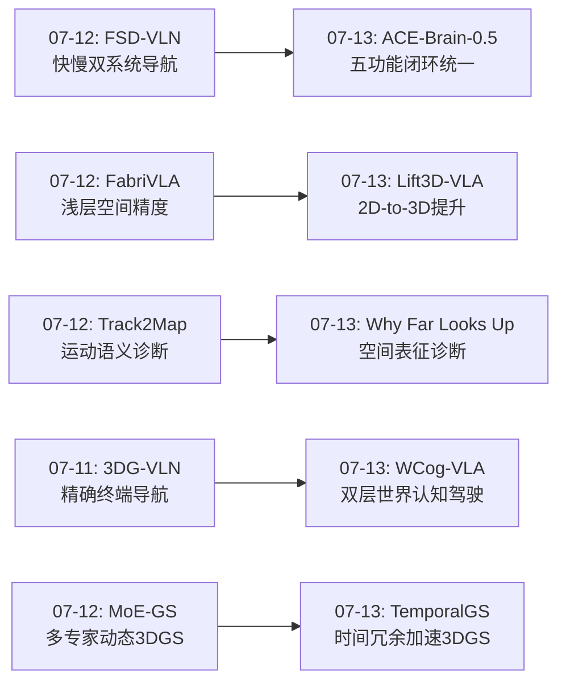
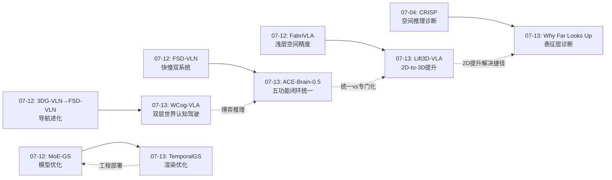
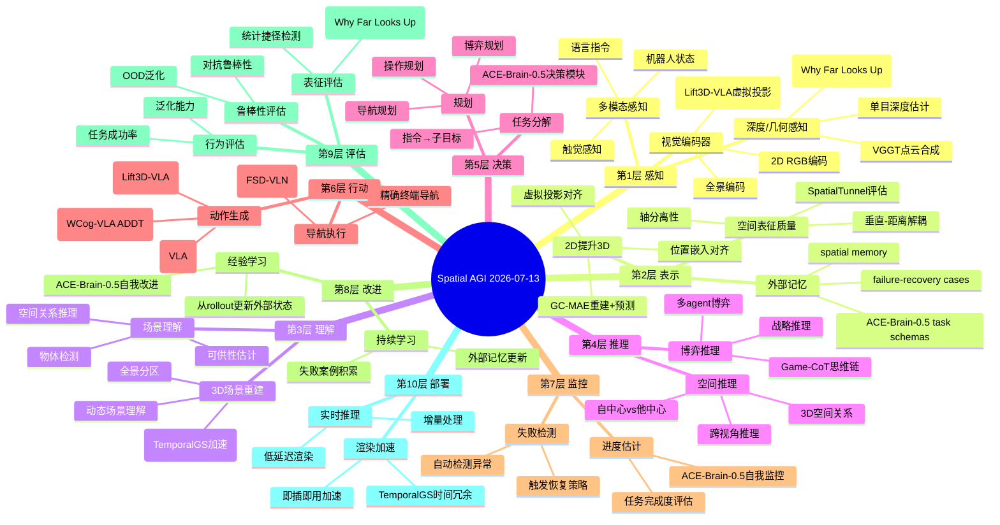
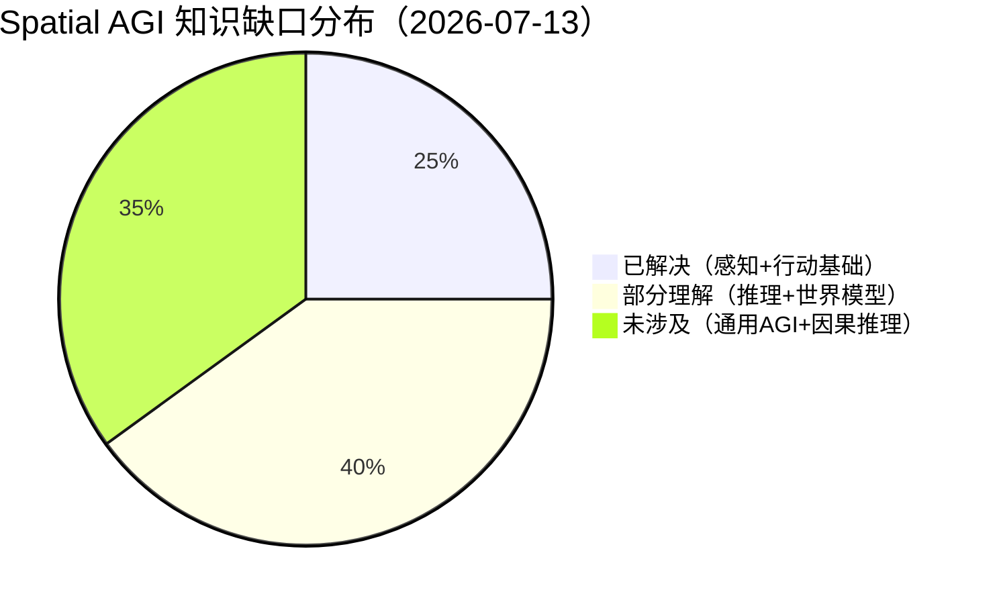

# 每日思考 - 2026-07-13

## 📅 每日总结

**日期**: 2026-07-13
**论文数量**: 5篇
**主题**: 从"统一具身基础模型+3D几何提升VLA+VLM空间表征诊断+双层世界认知驾驶+3DGS时间加速"五维突破Spatial AGI——闭环具身智能的五功能统一、2D预训练到3D理解的高效提升、VLM空间智能的统计捷径揭秘、语义推理与生成想象的自动驾驶统一、连续帧时间冗余的即插即用加速

### 关键突破

- 🧠 **五功能闭环统一的具身基础模型——ACE-Brain-0.5的SSR+范式** (arXiv:2607.04426, ACE-Brain Team): 首次在单一8B模型中统一了空间感知、决策、交互、自我监控、自我改进五个功能。SSR+（Scaffold-Specialize-Reconcile-Reactivate）训练范式的核心创新是Reactivate阶段——在任务向量合并后重新激活关键神经元，防止跨任务干扰后的能力退化。在15个基准的14/18个空间感知任务上超越前代。**"闭环>开环"——从感知到行动到监控到改进的完整循环比任何单一环节的优化都重要**。

- 🏗️ **2D到3D的优雅提升——Lift3D-VLA的虚拟投影对齐** (arXiv:2607.06564, 北大): 不需要从头训练3D编码器，而是通过虚拟投影将3D点云与预训练2D位置嵌入对齐。GC-MAE双目标自监督同时学习重建当前几何和预测未来演化——"不仅知道世界长什么样，还知道世界会怎么变"。层级时间动作建模利用LLM多层表示生成时间一致的动作序列。MetaWorld +10.8%, RLBench +11.1%。**"高效复用>从头建设"——2D预训练的海量知识可以优雅地提升到3D**。

- 🔍 **VLM空间智能的统计捷径揭秘——Why Far Looks Up的垂直-距离纠缠** (arXiv:2605.30161, 首尔国立+NVIDIA): 揭示了一个跨所有主流VLM的系统性缺陷：模型将图像中的垂直位置（高/低）与3D深度（远/近）纠缠在一起——"在图像中更高"被等同于"离相机更远"。更令人担忧的是，增加空间训练数据反而加剧而非缓解这种纠缠。SpatialTunnel合成基准通过隧道几何完全解耦垂直位置与深度。**"高分数≠真理解"——行为层面的基准准确率掩盖了表征层面的根本缺陷**。

- 🚗 **语义推理+生成想象的统一——WCog-VLA的双层世界认知** (arXiv:2607.08375): 首次在VLA自动驾驶中统一语义世界推理和生成世界演化。语义层通过3D空间感知+博弈论思维链（Game-CoT）进行战略推理，生成层通过ADDT扩散模型合成多智能体联合轨迹。85K Game-CoT标注数据集。NAVSIM PDMS 92.9 SOTA。**"推理+想象"的双层设计类似人类思维——我们既在语义层面推理他车意图，也在视觉层面想象场景演化**。

- ⚡ **连续帧时间冗余的即插即用加速——TemporalGS** (arXiv:2607.03390): 首个训练无关的3DGS渲染加速算法。核心洞察：连续帧的3DGS操作（预处理、排序、光栅化）高度冗余。时间动态剔除+选择性渲染两个互补策略，最高1.48×加速。**"底层优化同样重要"——1.48×加速对VR/AR的"能用/不能用"差距至关重要**。

### 📊 一句话总结

今天的五篇论文从统一具身闭环(ACE-Brain-0.5的五功能统一)、3D几何提升(Lift3D-VLA的2D-to-3D优雅迁移)、空间表征诊断(Why Far Looks Up的统计捷径揭秘)、双层世界认知(WCog-VLA的推理+想象统一)、3DGS工程加速(TemporalGS的时间冗余利用)五个维度，共同指向一个核心命题：**Spatial AGI正在从"模块化拼凑"走向"统一闭环+表征诊断+高效迁移+工程部署"的成熟期——不仅要构建更强大的能力，更要理解能力的本质（是真理解还是统计捷径）和效率（如何用更少的资源实现同等或更好的效果）**。

### 🔗 延续性

**07-12→07-13**: 昨天的"运动解耦+空间分区+多专家形变+轻量VLA+快慢导航"方向，今天演进到了**统一闭环具身+3D几何提升+空间表征诊断+双层世界认知+渲染加速**——

- FabriVLA(07-12)的"浅层空间细节" → Lift3D-VLA(07-13)的"2D-to-3D提升"——从特征层到表示空间
- FSD-VLN(07-12)的"快慢双系统" → ACE-Brain-0.5(07-13)的"五功能统一"——从双系统到多功能闭环
- MoE-GS(07-12)的"多专家动态3DGS" → TemporalGS(07-13)的"时间冗余加速3DGS"——从模型优化到渲染优化
- Track2Map(07-12)的"运动语义" → Why Far Looks Up(07-13)的"空间表征质量"——从运动诊断到表征诊断
- 3DG-VLN(07-11)/FSD-VLN(07-12)的"导航系统" → WCog-VLA(07-13)的"双层世界认知驾驶"——从导航到全自动驾驶

---

## 🔗 与昨日思考的联系

### 昨日重点（07-12）
- Track2Map的光流方向运动语义门控
- PanoLOG的几何+梯度全景分区策略
- MoE-GS的多专家动态形变设计空间
- FabriVLA的浅层空间精度回归
- FSD-VLN的快慢异步并行导航

### 今日进展
- 从FSD-VLN的"双系统导航"到ACE-Brain-0.5的"五功能闭环"——扩展了闭环的维度
- 从FabriVLA的"浅层空间利用"到Lift3D-VLA的"2D-to-3D提升"——从层内到跨维度
- 从Track2Map的"运动质量诊断"到Why Far Looks Up的"空间表征质量诊断"——诊断的维度深化
- 从3DG-VLN/FSD-VLN的"导航"到WCog-VLA的"世界认知驾驶"——应用层次的提升
- 从MoE-GS的"模型优化"到TemporalGS的"渲染加速"——优化层次的多样化

### 演进路径

---

## 📚 论文概览

1. **ACE-Brain-0.5** (arXiv:2607.04426) - 统一具身基础模型，8B模型实现五功能闭环（感知/决策/交互/监控/改进），SSR+训练范式防止跨任务干扰
2. **Lift3D-VLA** (arXiv:2607.06564) - 2D-to-3D优雅提升策略，虚拟投影对齐+GC-MAE双目标+层级时间动作，MetaWorld/RLBench全面SOTA
3. **Why Far Looks Up** (arXiv:2605.30161) - 揭示VLM垂直-距离纠缠偏见，SpatialTunnel合成基准解耦垂直位置与深度，数据规模加剧而非解决统计捷径
4. **WCog-VLA** (arXiv:2607.08375) - 双层世界认知VLA（语义推理+生成想象），Game-CoT博弈推理+ADDT扩散轨迹生成，NAVSIM 92.9 SOTA
5. **TemporalGS** (arXiv:2607.03390) - 首个训练无关3DGS渲染加速，时间动态剔除+选择性渲染，最高1.48×加速，即插即用

---

## 💡 核心见解

### 见解1: 闭环统一 vs 模块化拼凑——Spatial AGI架构的终极选择

**从 ACE-Brain-0.5 获得**

ACE-Brain-0.5在单一8B模型中统一了五个功能，这提出了一个根本问题：Spatial AGI应该是统一模型还是模块化系统？

- **统一的优势**: 共享表示、避免信息传递损失、端到端优化
- **统一的挑战**: 跨任务干扰（SSR+通过Reactivate缓解）、单项能力可能不如专门化模型
- **模块化的优势**: 各模块可独立优化、灵活组合、容错性好
- **模块化的劣势**: 信息传递损失、表示不一致、系统复杂

ACE-Brain-0.5的SSR+Reactivate给出了一个重要发现：跨任务干扰可以通过"重新激活"来缓解，这为统一模型提供了技术可行性。

**对Spatial AGI的启发**: Spatial AGI的理想架构可能是"统一核心+可扩展外围"——核心能力（空间感知、推理、行动）统一在共享模型中，外围能力（特定任务、安全约束）作为可插拔模块。ACE-Brain-0.5的"外部执行状态"（task schemas, spatial memory, failure-recovery cases）正是这种设计的体现。

### 见解2: 2D-to-3D的高效迁移——Spatial AGI的数据效率之道

**从 Lift3D-VLA 获得**

Lift3D-VLA的"虚拟投影对齐"策略揭示了一个重要原则：不需要从头构建3D智能系统，可以通过巧妙的设计将2D预训练知识"提升"到3D。

这有几个层面的含义：
- **数据效率**: 利用海量2D预训练知识，而非从头收集3D数据
- **架构效率**: 复用2D编码器的参数和结构，而非设计全新3D架构
- **语义保留**: 2D预训练中的语义知识自然迁移到3D任务

**对Spatial AGI的启发**: Spatial AGI的发展不应该忽视已有的2D智能成果。关键问题是：如何设计高效的"提升"策略？Lift3D-VLA的虚拟投影是一种方式，其他可能的方式包括：
- 特征层面的对齐（而非输入层面）
- 渐进式3D能力注入（从简单到复杂）
- 跨模态对比学习（2D-3D对比预训练）

### 见解3: 统计捷径的陷阱——"堆数据"不能替代架构创新

**从 Why Far Looks Up 获得**

这是今天最令人警醒的发现：增加空间训练数据不但没有解决VLM的统计捷径问题，反而加剧了垂直-距离纠缠。这意味着：

- 当前VLM架构可能在根本上不适合真正的3D空间推理
- 2D图像的统计规律是如此强大，以至于更多数据只是让模型更好地利用这些规律
- 真正的3D理解可能需要不同的架构设计或输入模态

**对Spatial AGI的启发**: 
- 不能仅靠"堆数据"来解决Spatial AGI的核心问题
- 需要引入显式的3D表示（如点云、体素、3DGS）来避免2D统计捷径
- 需要表征层面的评估（而非仅行为基准）来验证空间理解的质量
- Lift3D-VLA的2D-to-3D提升策略可能是应对这一问题的有效方案

### 见解4: "推理+想象"的双层认知——Spatial AGI的世界建模新范式

**从 WCog-VLA 获得**

WCog-VLA的双层世界认知设计揭示了一个重要模式：Spatial AGI既需要"推理"（语义层面的逻辑分析），也需要"想象"（生成层面的视觉预测）。

这类似于人类的认知过程：
- **System 2推理**: "他车在左车道，可能要变道，我应该减速"
- **System 1想象**: 直觉性地"看到"场景的未来演化

WCog-VLA的Game-CoT将多agent交互建模为博弈，这是一个重要的视角——空间交互不仅仅是几何问题，更是战略问题。

**对Spatial AGI的启发**: Spatial AGI的世界模型应该同时具备：
- 语义推理能力（"推理"世界会发生什么）
- 生成预测能力（"想象"世界会变成什么样）
- 博弈交互建模（理解多agent的空间战略交互）

### 见解5: 时间维度的空间冗余——Spatial AGI的计算效率新维度

**从 TemporalGS 获得**

TemporalGS的"连续帧时间冗余"洞察虽然简单但很有价值：3DGS渲染中连续帧的操作高度冗余，可以复用前一帧的结果。

这个原理可以推广到Spatial AGI的更多场景：
- **空间感知**: 连续观察的场景高度冗余，只需处理变化部分
- **动作生成**: 连续的动作步骤高度相似，可以增量生成
- **场景理解**: 已理解的场景区域不需要重复推理

**对Spatial AGI的启发**: Spatial AGI系统应该具备"时间感知"——知道什么变了、什么没变，将计算资源分配给变化的部分。这种"增量式处理"的思维对实时系统至关重要。

### 见解6: 评估的本质——行为分数 vs 表征质量

**从 Why Far Looks Up + ACE-Brain-0.5 获得**

Why Far Looks Up的发现提出了一个深层问题：我们如何评估Spatial AGI系统？

当前主流评估方式：
- 行为基准（准确率、成功率）
- 端到端任务性能

但这些可能掩盖表征层面的缺陷：
- 高分数可能来自统计捷径而非真正理解
- 不同模型可能有相同的分数但完全不同的内部机制
- 表征质量（空间维度的分离程度）可能是更好的预测指标

**对Spatial AGI的启发**: Spatial AGI的评估框架应该包含：
- 行为层：任务成功率、泛化能力
- 表征层：空间维度的分离性、几何理解质量
- 鲁棒性层：对分布偏移、对抗扰动的抵抗能力
- 可解释性层：决策过程的空间可解释性

### 见解7: 统一的代价与收益——多任务学习的不可能三角

**从 ACE-Brain-0.5 + Lift3D-VLA 获得**

ACE-Brain-0.5选择了"五功能统一"（宽度），Lift3D-VLA选择了"3D深度"（深度）。这提出了Spatial AGI的不可能三角：

- **广度**（多功能统一）: 覆盖感知→推理→行动→监控→改进
- **深度**（单功能极致）: 如3D几何的精确理解
- **效率**（资源约束）: 在有限参数/数据/计算下

ACE-Brain-0.5的8B参数在五个功能间分配，每个功能可能不如专门化模型强。Lift3D-VLA专注3D几何，在单维度上达到极致。

**对Spatial AGI的启发**: Spatial AGI可能需要"分阶段发展"——先在关键维度上达到深度（如3D理解），再逐步扩展到多功能统一。而非一开始就追求全面但平庸。

---

## 🗺️ 知识演进图

---

## 技术栈演进对比表

| 层次 | 昨日方案（07-12） | 今日方案（07-13） | 变化 |
|------|---------|---------|------|
| 具身架构 | FSD-VLN: 快慢双系统 | ACE-Brain-0.5: 五功能闭环统一 | 从2功能→5功能统一 |
| VLA 3D感知 | FabriVLA: 浅层空间细节 | Lift3D-VLA: 2D-to-3D虚拟投影提升 | 从层内→跨维度 |
| 空间诊断 | Track2Map: 运动语义门控 | Why Far Looks Up: 表征层纠缠诊断 | 从运动→表征 |
| 自动驾驶 | FSD-VLN: 快慢导航 | WCog-VLA: 双层世界认知+博弈推理 | 从导航→全自动驾驶 |
| 3DGS优化 | MoE-GS: 多专家动态模型 | TemporalGS: 时间冗余渲染加速 | 从模型→渲染 |
| 训练范式 | FabriVLA: 门控自注意力 | ACE-Brain-0.5: SSR+Reactivate | 新增重激活阶段 |
| 评估方法 | Track2Map: 几何质量评估 | Why Far Looks Up: 表征质量评估 | 从几何→表征 |
| 世界模型 | (未涉及) | WCog-VLA: 语义+生成双层 | 新增维度 |

---

## 🗺️ Spatial AGI 知识图谱

### 10层架构思维导图

### 🎯 主线技术路径

#### 阶段1: 空间感知基础（感知→表示）
**当前状态**: Lift3D-VLA展示了2D-to-3D提升的高效策略，Why Far Looks Up揭示了当前VLM的表征缺陷
**目标**: 建立真正的3D空间表征（而非统计捷径）
**关键gap**: 如何在架构层面确保空间维度的解耦？虚拟投影是否是唯一的高效方案？

#### 阶段2: 统一闭环架构（感知→推理→行动→监控→改进）
**当前状态**: ACE-Brain-0.5实现了五功能闭环统一（8B模型），SSR+缓解跨任务干扰
**目标**: 在单一统一系统中实现完整的Spatial AGI循环
**关键gap**: 8B参数是否足够？更大规模的统一是否能达到更好的单项性能？

#### 阶段3: 世界认知（语义推理+生成想象）
**当前状态**: WCog-VLA展示了双层世界认知（语义推理+生成演化）的可行性
**目标**: Spatial AGI具备"推理+想象"的完整世界建模能力
**关键gap**: 博弈论推理如何扩展到更general的多agent场景？生成预测的时序范围如何扩展？

#### 阶段4: 鲁棒部署（评估→加速→实时）
**当前状态**: TemporalGS展示了训练无关的渲染加速，Why Far Looks Up提供了表征评估工具
**目标**: 在真实环境中实时、鲁棒地运行
**关键gap**: 如何在保持质量的同时实现实时性能？如何确保对OOD场景的鲁棒性？

#### 阶段5: 通用Spatial AGI
**当前状态**: 各模块逐步成熟，但距离通用仍有显著gap
**目标**: 一个能在任意环境中理解空间、推理空间、行动于空间的通用系统
**关键gap**: 如何将各阶段的成果整合？什么是最优的整合架构？

---

## 🔍 待探索议题

### 高优先级（本周）

1. **统计捷径的系统修复**
   - 问题: Why Far Looks Up揭示了垂直-距离纠缠，但未提出修复方案
   - 候选方案: 3D输入模态（Lift3D-VLA的虚拟投影）、表征正则化、合成数据去偏
   - 缺口: 缺乏系统的修复方法论

2. **SSR+ vs 其他多任务统一范式**
   - 问题: ACE-Brain-0.5的SSR+与MoE、LoRA等方法的对比如何？
   - 候选方案: SSR+Reactivate vs MoE路由 vs LoRA合并
   - 缺口: 缺乏统一的对比基准

3. **2D-to-3D提升的极限**
   - 问题: Lift3D-VLA的虚拟投影能提升到什么程度？是否有理论上限？
   - 候选方案: 特征级对齐 vs 输入级对齐 vs 混合策略
   - 缺口: 不同提升策略的系统对比

### 中优先级（本月）

4. **Game-CoT推理的泛化**
   - 问题: WCog-VLA的博弈推理能否泛化到非驾驶场景（如多机器人协作）？
   - 候选方案: 修改Game-CoT的博弈建模框架
   - 缺口: 仅有驾驶场景的验证

5. **时间冗余利用的系统化**
   - 问题: TemporalGS的时间冗余思路能否推广到感知、推理等其他模块？
   - 候选方案: 增量感知、增量推理、缓存动作生成
   - 缺口: 需要在更多模块中验证

6. **表征评估标准化**
   - 问题: Why Far Looks Up的表征分析方法能否标准化为Spatial AGI评估工具？
   - 候选方案: 构建标准化表征评估基准
   - 缺口: 需要更多模型和任务的验证

7. **闭环自改进的质量控制**
   - 问题: ACE-Brain-0.5的自我改进如何确保学习到的是好的经验？
   - 候选方案: 质量过滤器、置信度评估、人工审核
   - 缺口: 自动质量控制机制设计

### 探索性议题（长期）

8. **Spatial AGI的不可能三角**
   - 问题: 广度（多功能）、深度（单功能极致）、效率（资源约束）能否同时达到？
   - 候选方案: 分阶段发展策略、混合架构
   - 缺口: 缺乏理论分析

9. **统计捷径的根因分析**
   - 问题: VLM的统计捷径是架构问题（Transformer）还是数据问题（自然图像统计）？
   - 候选方案: 架构消融、合成数据实验、不同视觉编码器对比
   - 缺口: 需要系统性的消融研究

10. **"推理+想象"的认知架构**
    - 问题: 语义推理和生成想象在人脑中如何协作？AI应该模仿吗？
    - 候选方案: 双系统架构、共享骨干+双头设计
    - 缺口: 缺乏认知科学层面的指导

---

## 📊 知识缺口分析

**已解决（~25%）**:
- ✅ 3D空间感知基础（3DGS、点云、深度估计）
- ✅ VLA基础架构（端到端感知→行动）
- ✅ 3DGS渲染加速（TemporalGS等工程优化）
- ✅ 空间感知基准评估（行为层面）

**部分理解（~40%）**:
- ⚠️ 多功能统一闭环架构（ACE-Brain-0.5初步验证，但仅8B）
- ⚠️ 2D-to-3D高效迁移（Lift3D-VLA的虚拟投影，但范围有限）
- ⚠️ VLM空间表征质量（Why Far Looks Up诊断了问题，但未修复）
- ⚠️ 世界认知模型（WCog-VLA的双层设计，但仅限驾驶）
- ⚠️ 博弈论空间推理（Game-CoT初步验证，泛化待验证）
- ⚠️ 表征层面的空间评估（有框架但未标准化）

**未涉及（~35%）**:
- ❌ 统计捷径的系统修复方法
- ❌ 通用Spatial AGI架构
- ❌ 长时序空间一致性维护
- ❌ 因果空间推理（超越相关性）
- ❌ 跨具身空间智能迁移
- ❌ Spatial AGI的不可能三角理论
- ❌ 从认知科学启发的空间架构

---

## 💡 本质思考：如何达成通用空间智能

### 1. 核心能力的本质是什么？

通用空间智能的核心能力本质可以分解为三个层次：

**底层：空间表征质量**。Why Far Looks Up揭示了一个残酷现实——当前VLM的空间表征可能是"假"的（基于统计捷径）。真正的空间智能首先要求模型在表征层面将不同的空间维度（水平、垂直、深度、时间）解耦，建立结构化的空间内部模型。Lift3D-VLA的虚拟投影策略表明，显式3D输入可能是建立高质量表征的关键。

**中层：闭环认知架构**。ACE-Brain-0.5的五功能闭环（感知→决策→行动→监控→改进）揭示了空间智能不仅仅是感知或行动，而是完整的认知循环。关键在于"闭环"——从执行结果中学习，持续改进。WCog-VLA的"推理+想象"双层设计进一步丰富了认知架构。

**高层：世界交互理解**。空间智能最终要落地为与世界的能力交互。WCog-VLA的博弈推理揭示了一个深层需求——不仅要理解"世界是什么样的"，还要理解"世界会怎样变化"和"其他智能体如何行动"。

### 2. 当前方法与理想目标的差距在哪里？

**表征层差距**: 当前VLM的表征可能存在系统性缺陷（统计捷径），而我们缺乏有效的修复方法。Why Far Looks Up的诊断很深入，但"知道有病"和"能治好病"是两个不同层次。

**架构层差距**: ACE-Brain-0.5的五功能统一是重要进步，但8B参数的规模限制了每个功能的深度。理想情况下，每个功能应该既统一又深入，但如何实现这种"又广又深"的统一仍是开放问题。

**评估层差距**: 我们缺乏全面的Spatial AGI评估框架。行为基准可能掩盖表征缺陷，表征评估尚未标准化，鲁棒性评估不够系统。

**世界模型差距**: WCog-VLA的"推理+想象"是初步尝试，但世界模型的时序范围、泛化能力、物理合理性都还有很大gap。

**工程差距**: TemporalGS的1.48×加速说明工程优化还有空间，但Spatial AGI系统级的实时性、内存效率、能耗优化需要更全面的工程创新。

### 3. 从今天到理想状态，最可能的路径是什么？

**路径假设：表征修复→架构统一→世界建模→通用部署**

1. **短期（6个月）: 表征修复**。借鉴Lift3D-VLA的2D-to-3D提升策略和Why Far Looks Up的诊断框架，建立高质量的空间表征。关键是引入显式3D表示来避免2D统计捷径，同时保持2D预训练的语义知识。

2. **中期（1-2年）: 架构统一**。基于ACE-Brain-0.5的SSR+范式，逐步扩展统一模型的规模和功能深度。目标是在70B+规模上实现五功能闭环，使每个功能都达到专门化模型的水平。

3. **长期（3-5年）: 世界建模**。基于WCog-VLA的"推理+想象"框架，构建通用的世界认知模型——能在任意环境中推理空间关系、预测世界演化、理解多agent交互。

4. **远期（5年+）: 通用部署**。结合TemporalGS等工程优化，实现实时、鲁棒的Spatial AGI系统部署。关键挑战是保持质量的同时实现通用性。

**最可能的突破点**: 表征修复。如果能在架构层面解决统计捷径问题（而非仅靠数据堆砌），将是Spatial AGI的关键突破。Lift3D-VLA的"2D-to-3D提升"和Why Far Looks Up的"表征诊断"提供了重要的技术基础。

---

**文档创建时间**: 2026-07-13
**分析基于**: 5篇论文精读 + 2026-07-12每日思考延续
