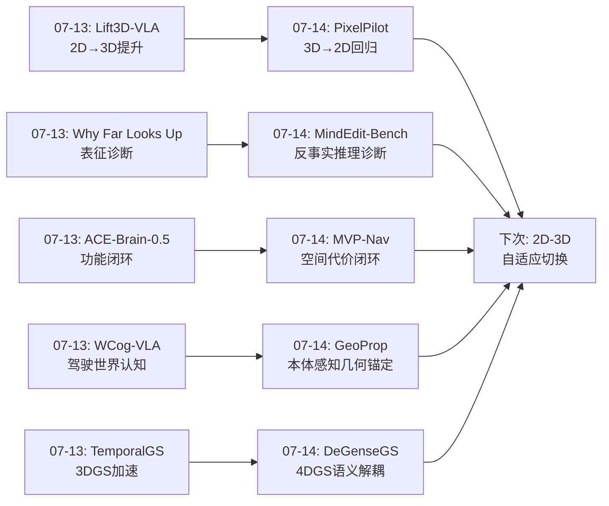
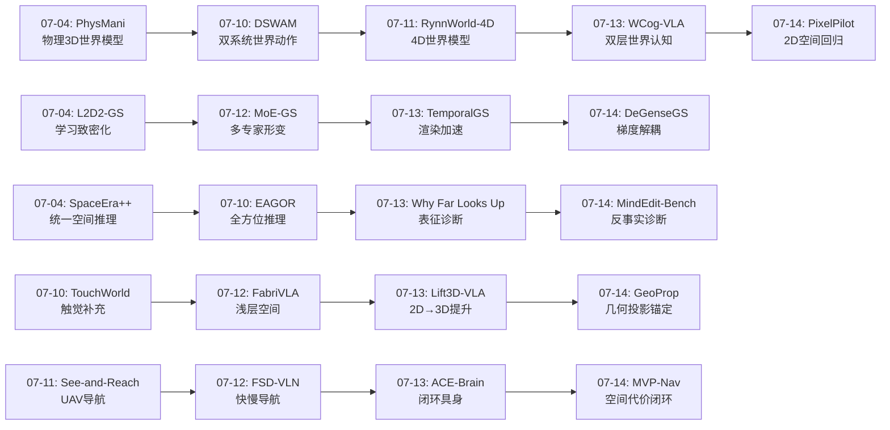
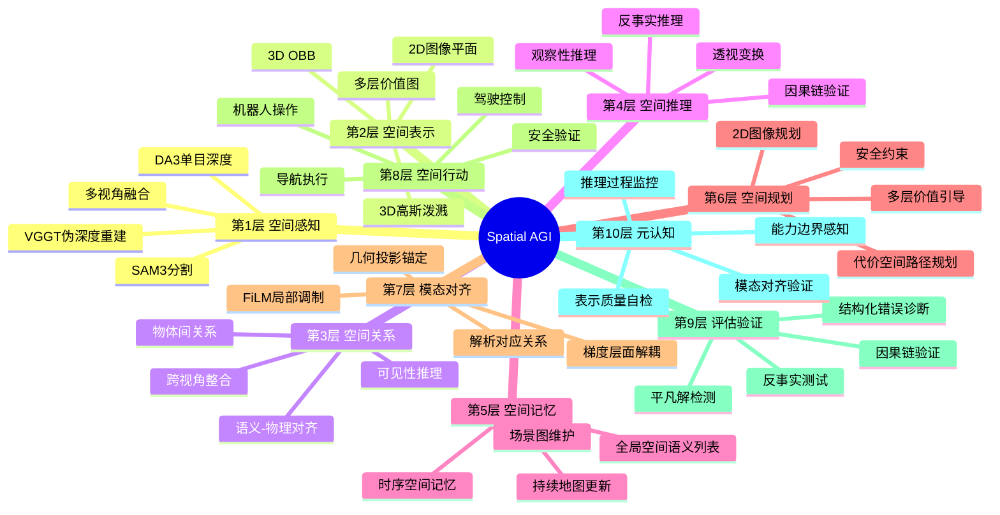
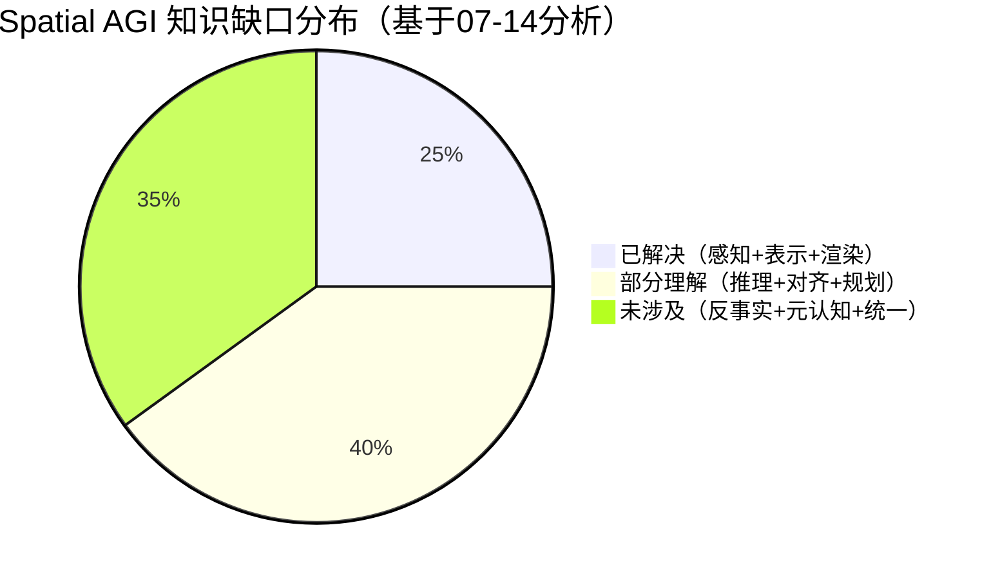

# 每日思考 - 2026-07-14

## 📅 每日总结

**日期**: 2026-07-14
**论文数量**: 5篇
**主题**: 从"2D空间回归+多层空间对齐+梯度解耦+几何锚定+反事实推理"五维突破Spatial AGI——2D优于3D的反直觉发现、语义-物理代价空间统一、4DGS语义解耦的梯度层面解决方案、本体感知的显式空间锚定、VLM反事实空间推理的评估新标准

### 关键突破

- 🚗 **2D可能优于3D——PixelPilot的解耦规划提升范式** (arXiv:2607.04637, SJTU+Huawei, ECCV 2026): 反直觉发现：现有驾驶VLA直接预测3D轨迹时依赖ego-status外推而非视觉理解（移除ego-status L2误差+1.98 vs 移除图像仅+0.36）。PixelPilot将规划完全移到2D图像空间，仅在推理时确定性提升到3D。GRPO密集中间奖励强制"感知→推理→规划"因果链。ECCV 2026验证：**2D-to-2D规划 + 确定性3D提升 > 端到端3D预测**。

- 🗺️ **多层价值图统一语义与物理——MVP-Nav的RGB-only导航** (arXiv:2606.31919, SJTU): 通过VGGT 3D基础模型从单目序列重建伪深度，构建3D OBB→全局空间语义列表→多层价值图(MVM)。MVM在共享代价空间中统一VLM语义推理和重建物理约束。零样本SOTA（depth-free方法中）。**结构化物理先验可补偿深度传感器缺失**。

- 🔬 **梯度层面的语义-几何解耦——DeGenseGS的4DGS手术场景理解** (arXiv:2607.04761, SEU+NUS): 揭示4DGS语义集成的梯度干扰问题（语义梯度>>几何梯度，共享FDM参数被语义主导）。HexPlane共享编码+独立解码的运动学条件解耦。光栅化原生语义提取(RNSE)+角度对齐蒸馏。CholecSeg8k mIoU 68.20%(+14.74%)。**多模态空间推理需要架构层面的梯度平衡**。

- 🤖 **不对齐的本体感知是有害的——GeoProp的几何投影锚定** (arXiv:2607.07101, Alibaba DAMO): 关键实证发现：标准本体感知融合可能不如纯视觉基线！GeoProp通过简单的相机投影将3D末端执行器状态锚定到2D视觉特征，FiLM局部调制+预测运动采样。仅+2-3%参数，67个任务+8.7%(DP)/+4.0%(π₀)/+10.6%(真实世界)。**解析几何先验是高杠杆设计**。

- 🧠 **VLM无法进行反事实空间推理——MindEdit-Bench的评估革命** (arXiv:2607.00491, ZODA+ZJU+UTokyo): 首个物体级反事实空间推理基准。L4空间编辑(虚拟移动物体后判断关系)和L5跨视角可见性编辑——答案不存在于输入图像中。15个VLM在1,003问题上仅8-31%准确率（人类81-97%），差距53pp。8-24结构化选项支持错误类型诊断。**反事实推理是空间智能的试金石**。

### 📊 一句话总结

今天的五篇论文从2D空间回归的意外优势(PixelPilot)、多层空间对齐的语义-物理统一(MVP-Nav)、4DGS语义-几何梯度解耦(DeGenseGS)、本体感知的几何锚定(GeoProp)、VLM反事实推理评估(MindEdit-Bench)五个维度，共同指向一个核心命题：**Spatial AGI的核心挑战不是"用更高维的表示"，而是"在正确的维度对齐不同模态"——2D推理可能优于3D预测，梯度层面解耦可能优于损失加权，显式几何投影可能优于隐式融合，反事实推理可能比观察性推理更具诊断力**。

### 🔗 延续性

**07-13→07-14**: 昨天的"统一具身闭环+3D几何提升+空间表征诊断+双层世界认知+渲染加速"方向，今天演进到了**2D-3D辩证关系+多层空间对齐+梯度解耦+几何锚定+反事实评估**——

- ACE-Brain-0.5(07-13)的"五功能闭环" → MVP-Nav(07-14)的"多层价值图"——从功能闭环到空间层面的闭环
- Lift3D-VLA(07-13)的"2D提升到3D" → PixelPilot(07-14)的"3D回归到2D"——2D-3D关系的辩证反转
- Why Far Looks Up(07-13)的"VLM表征诊断" → MindEdit-Bench(07-14)的"反事实推理诊断"——从表征诊断到推理诊断
- WCog-VLA(07-13)的"世界认知驾驶" → PixelPilot(07-14)的"2D空间驾驶"——自动驾驶的两条路线
- TemporalGS(07-13)的"3DGS加速" → DeGenseGS(07-14)的"4DGS语义解耦"——从效率到质量

### 💡 本质思考：如何达成通用空间智能

#### 1. 核心能力的本质是什么？

今天的五篇论文重新定义了空间智能的核心：**不是"更高维的表示"，而是"更精确的模态对齐"**。

PixelPilot的发现最为震撼：将3D规划回归到2D反而更好——因为2D规划解耦了传感器配置，使模型真正利用视觉而非ego-status。GeoProp同样揭示：不是让模型学习3D-to-2D的对应，而是直接通过相机投影公式计算——**能解析的就不要学习**。

这意味着Spatial AGI的核心能力本质是：**找到每种空间任务最经济的表示维度，并通过显式机制确保不同表示之间的正确对齐**。

#### 2. 当前方法与理想目标的差距在哪里？

MindEdit-Bench给出了最诚实的回答：**53个百分点**。

人类能轻松完成的反事实空间推理（"如果移动椅子，桌子在哪个方向？"），VLM仅有8-31%准确率。这个差距不是量化差异，而是质性差异——VLM缺乏构建内部3D场景表示并进行心理模拟的能力。

当前方法的差距可以归纳为三个层面：
1. **感知层**：能观察但无法干预（MindEdit-Bench揭示）
2. **表示层**：能编码但无法操作（PixelPilot的"平凡解"问题）
3. **融合层**：能拼接但无法对齐（GeoProp的"本体感知有害"发现）

#### 3. 从今天到理想状态，最可能的路径是什么？

基于今天的发现，最可能的路径是**分层对齐策略**：
- 在可能的地方使用2D/解析方法（PixelPilot路线）
- 在必要的地方使用3D/学习表示（DeGenseGS路线）
- 通过显式几何投影建立模态间对应（GeoProp路线）
- 通过反事实测试验证真正的空间理解（MindEdit-Bench路线）
- 用统一代价空间融合语义和物理（MVP-Nav路线）

---

## 🔗 与昨日思考的联系

### 昨日重点（07-13）
- ACE-Brain-0.5的五功能闭环统一
- Lift3D-VLA的2D-to-3D优雅提升
- Why Far Looks Up的VLM空间表征诊断
- WCog-VLA的双层世界认知驾驶
- TemporalGS的连续帧时间冗余加速

### 今日进展
- 从Lift3D-VLA的"2D→3D提升"到PixelPilot的"3D→2D回归"——**2D-3D关系的辩证反转**
- 从Why Far Looks Up的"表征诊断"到MindEdit-Bench的"推理诊断"——从表示质量到推理能力
- 从ACE-Brain-0.5的"功能闭环"到MVP-Nav的"空间闭环"——从模块到空间
- 从WCog-VLA的"驾驶推理"到PixelPilot的"驾驶规划空间选择"——从推理到表示
- 从TemporalGS的"3DGS加速"到DeGenseGS的"4DGS语义质量"——从效率到质量

### 演进路径

---

## 📚 论文概览

1. **PixelPilot** (SJTU+Huawei, ECCV 2026): 解耦规划-提升范式。将VLA驾驶规划完全移到2D图像空间——sensor-agnostic 2D-to-2D任务。GRPO密集中间奖励强制因果链。证明现有VLA依赖ego-status而非视觉（移除ego-status比移除图像影响大5倍）。跨数据集可扩展训练。

2. **MVP-Nav** (SJTU): RGB-only零样本目标导航。VGGT伪深度→3D OBB→全局空间语义列表→多层价值图(MVM)。MVM统一VLM语义推理和重建几何约束到共享代价空间。FMM路径规划+安全验证。Depth-free方法SOTA。

3. **DeGenseGS** (SEU+NUS): 4DGS手术场景语义-几何解耦。揭示梯度干扰问题（语义梯度>>几何梯度）。HexPlane共享编码+独立解码。RNSE超像素聚合+角度对齐蒸馏。CholecSeg8k mIoU 68.20%(+14.74%)。70FPS实时。

4. **GeoProp** (Alibaba DAMO): 本体感知的几何视觉锚定。揭示不对齐本体感知有害性。3D末端执行器→2D投影→FiLM局部调制+预测运动采样。仅+2-3%参数，67任务+8.7%(DP)/+4.0%(π₀)/+10.6%(真实世界)。

5. **MindEdit-Bench** (ZODA+ZJU+UTokyo): 首个物体级反事实空间推理基准。L4空间编辑+L5跨视角可见性编辑——答案不存在于输入图像。120私有场景，1003问题，15 VLM仅8-31%(人类81-97%)。8-24结构化选项诊断错误类型。

---

## 💡 核心见解

### 见解1: 2D可能优于3D——维度选择的反直觉

**来源**: PixelPilot + GeoProp

PixelPilot和GeoProp共同挑战了一个根深蒂固的假设：**更高维的空间表示总是更好的**。

PixelPilot证明：将驾驶规划从3D回归到2D图像平面，不仅没有损失信息，反而因为解耦了传感器配置而获得了更好的数据可扩展性和视觉推理能力。GRPO密集奖励进一步确保模型真正使用视觉而非ego-status外推。

GeoProp从另一个角度证明：将3D本体感知通过简单相机投影锚定到2D视觉特征，比在3D空间直接融合更有效。FiLM在投影位置的局部调制提供了足够的空间对应信息。

**深层原因**：2D空间是VLM预训练的自然空间。将任务保持在2D可以最大程度利用预训练知识。当强制提升到3D时，模型必须学习困难的2D-to-3D映射，容易陷入平凡解。

**对Spatial AGI的启发**: Spatial AGI不需要在所有地方追求3D。关键是识别每种任务最经济的表示维度，并通过确定性变换在不同维度间转换。

### 见解2: 不对齐的多模态融合可能有害

**来源**: GeoProp

GeoProp的关键实证发现：**标准本体感知融合可能使性能低于纯视觉基线**。

这是一个深刻的问题：我们一直假设"更多信息=更好"，但GeoProp证明如果信息没有正确对齐，引入的虚假相关性比信息本身更有害。

在Spatial AGI中，这个问题更普遍：
- 视觉+语言：如果语言描述的空间关系与视觉不一致，融合可能有害
- 视觉+深度：如果深度估计有系统偏差，融合后比纯视觉更差
- 多视角：如果视角变换参数不准确，融合可能引入错误

**解决原则**: 模态融合必须建立在显式空间对齐的基础上，而非简单的拼接或注意力。

### 见解3: 梯度层面的解耦比损失加权更重要

**来源**: DeGenseGS

DeGenseGS揭示了一个被忽视的问题：**当多个目标（语义+几何）共享同一参数空间时，梯度敏感性的差异会导致优化失衡**。

传统方法通过损失加权(λ₁L₁ + λ₂L₂)来平衡多目标。但DeGenseGS证明，即使损失权重正确，梯度本身的不平衡（语义梯度远大于几何梯度）仍会导致参数被语义目标主导。

解决方案是架构层面的解耦：共享编码+独立解码。共享编码保证信息同步，独立解码保证优化独立。

**对Spatial AGI的启发**: Spatial AGI需要同时优化几何、语义、物理等多个目标。损失加权是不够的——需要架构设计来平衡不同目标的梯度贡献。

### 见解4: 反事实推理是空间智能的真正试金石

**来源**: MindEdit-Bench

MindEdit-Bench的核心贡献是定义了一种新的空间智能评估范式：**不问"你看到了什么"，而问"如果改变X，会发生什么"**。

观察性推理可以通过2D shortcut作弊——模型匹配图像中的像素模式而非真正理解3D空间。反事实编辑彻底打破了这种shortcut：答案不存在于任何输入图像中，模型必须：
1. 构建内部3D场景表示
2. 施加虚拟干预
3. 推理修改后的空间后果

这正是认知科学中的"心理模型"理论。人类的空间智能不仅是感知的，更是可操作的心理模拟。

**对Spatial AGI的启发**: Spatial AGI系统的评估必须包含反事实推理测试。仅凭观察性推理的高分数不能证明真正的空间理解。

### 见解5: 语义-物理统一需要共享代价空间

**来源**: MVP-Nav

MVP-Nav的多层价值图(MVM)提供了一种优雅的语义-物理统一方案：**将VLM的高级语义推理和重建的物理约束都表示为2D网格上的代价，然后通过几何路径规划自动平衡**。

这种设计的深层含义是：语义和物理不是两个独立的问题，而是同一空间中两个互补的信号源。语义告诉你"去哪里"，物理告诉你"怎么去"。MVM将两者统一到"代价"概念中，让规划器自动找到语义吸引和物理安全的帕累托最优。

### 见解6: 因果链验证是防止"假理解"的关键

**来源**: PixelPilot + MindEdit-Bench

PixelPilot的GRPO密集中间奖励和MindEdit-Bench的反事实测试共同指向一个重要原则：**验证模型是否真正理解空间，而非只是产出正确答案**。

PixelPilot发现VLA可能"正确规划但错误原因"——依赖ego-status而非视觉。GRPO密集奖励强制"感知→推理→规划"的完整因果链。

MindEdit-Bench从评估端发现同样的问题——VLM可能"正确描述观察到的空间关系"但"无法推理反事实后果"。

**对Spatial AGI的启发**: Spatial AGI不仅需要正确的输出，更需要正确的推理过程。因果链验证和反事实测试应该成为标准评估工具。

### 见解7: 解析先验 > 学习表示——在高杠杆位置使用几何

**来源**: GeoProp + PixelPilot + MVP-Nav

三篇论文共同验证了一个原则：**在可以用解析几何解决的问题上，解析方法优于学习方法**。

- GeoProp: 相机投影公式 > 学习3D-to-2D对应
- PixelPilot: 确定性2D-to-3D提升 > 学习3D预测
- MVP-Nav: VGGT几何先验 > 从零学习深度估计

这不是否定学习的价值，而是指出：**学习资源应该投入到无法解析解决的高层次问题上**（如语义理解、策略选择、因果推理），而非浪费在已有解析解的几何变换上。

---

## 🗺️ 知识演进图

---

## 技术栈演进对比表

| 层次 | 07-13方案 | 07-14方案 | 核心变化 |
|------|----------|----------|---------|
| 空间表示 | Lift3D-VLA: 2D→3D提升 | PixelPilot: 3D→2D回归 | **维度选择反转** |
| 模态对齐 | Lift3D-VLA: 虚拟投影 | GeoProp: 几何投影+FiLM | 从投影对齐到局部调制 |
| 语义融合 | WCog-VLA: Game-CoT | MVP-Nav: 多层价值图 | 从推理链到代价空间 |
| 质量诊断 | Why Far Looks Up: 表征诊断 | MindEdit-Bench: 反事实诊断 | 从表示到推理 |
| 3DGS质量 | TemporalGS: 时间加速 | DeGenseGS: 梯度解耦 | 从效率到质量 |
| 训练策略 | ACE-Brain: SSR+范式 | PixelPilot: GRPO密集奖励 | 从训练范式到奖励设计 |
| 评估方法 | 基准准确率 | MindEdit-Bench: 结构化诊断 | 从准确率到错误诊断 |
| 安全保障 | — | MVP-Nav: 语义地板验证 | 新增安全层 |

---

## 🗺️ Spatial AGI 知识图谱

### 10层架构思维导图

### 🎯 主线技术路径

#### 阶段1: 空间感知重建 (已基本实现)
- 从传感器到表示的转换
- VGGT等基础模型提供伪深度
- 3DGS提供高质量场景渲染
- **当前状态**: 基本可用，但远距离/复杂材质仍有挑战

#### 阶段2: 模态空间对齐 (当前重点)
- 建立不同模态间的显式空间对应
- GeoProp的几何投影锚定是关键突破
- DeGenseGS的梯度解耦解决了多目标优化
- **当前挑战**: 如何自动化选择最优对齐维度(2D/3D)

#### 阶段3: 空间因果推理 (快速发展的方向)
- 从观察性推理到反事实推理
- PixelPilot的GRPO因果链强制
- MindEdit-Bench定义了评估标准
- **当前挑战**: VLM反事实推理能力极弱(8-31%)

#### 阶段4: 统一空间智能 (远期目标)
- 自适应选择表示维度(2D/3D切换)
- 语义-物理在统一代价空间中融合
- 完整的感知-推理-行动-验证闭环
- **当前挑战**: 需要跨领域的技术整合

---

## 🔍 待探索议题

### 高优先级（本周）

1. **2D-3D自适应切换机制**
   - 问题: 什么时候应该用2D推理，什么时候需要3D？
   - 候选方案: PixelPilot的局部平面假设可以作为切换判据
   - 缺口: 缺乏自动判断"当前场景是否满足平面假设"的机制
   - 与Spatial AGI的关系: 核心架构决策

2. **反事实空间推理的训练方法**
   - 问题: 如何训练VLM获得MindEdit-Bench要求的能力？
   - 候选方案: 3D场景图数据增强 + 反事实编辑训练
   - 缺口: 当前无针对性训练方法
   - 与Spatial AGI的关系: 核心能力建设

3. **梯度平衡的通用解耦架构**
   - 问题: DeGenseGS的解耦思路能否推广到非4DGS场景？
   - 候选方案: 共享编码+独立解码的范式可能通用
   - 缺口: 理论分析不足，何时需要解耦？
   - 与Spatial AGI的关系: 多目标优化的核心

### 中优先级（两周内）

4. **本体感知的全身体锚定**
   - 问题: GeoProp仅锚定末端执行器，全身锚定如何实现？
   - 候选方案: 机械臂运动学链的关节级投影
   - 缺口: 计算复杂度和特征图分辨率的权衡
   - 与Spatial AGI的关系: Embodied AI基础

5. **语义-物理代价空间的动态权重**
   - 问题: MVP-Nav的MVM中语义和物理的权重如何自适应？
   - 候选方案: 基于任务阶段的动态权重调度
   - 缺口: 缺乏学习权重的方法
   - 与Spatial AGI的关系: 多目标规划

6. **结构化答案诊断的推广**
   - 问题: MindEdit-Bench的结构化答案设计能否推广到其他评估？
   - 候选方案: 生成网格化选项的自动化流水线
   - 缺口: 需要大量领域特定设计
   - 与Spatial AGI的关系: 评估方法论

### 低优先级（探索性）

7. **前馈3D场景图的规模化**
   - 问题: 三张照片的3D场景图能否扩展到更多照片/视频？
   - 候选方案: 增量式场景图更新
   - 缺口: 计算效率和一致性的权衡
   - 与Spatial AGI的关系: 空间感知基础设施

8. **因果链验证的标准化**
   - 问题: 如何标准化PixelPilot的因果链验证方法？
   - 候选方案: 定义中间输出的可验证性标准
   - 缺口: 不同任务的因果链结构不同
   - 与Spatial AGI的关系: 质量保证

9. **"平凡解"问题的系统性研究**
   - 问题: 除了驾驶VLA，其他Spatial AGI任务是否也有"平凡解"问题？
   - 候选方案: 设计类似PixelPilot的消融实验（移除不同输入）
   - 缺口: 需要逐任务分析
   - 与Spatial AGI的关系: 模型可靠性

---

## 📊 知识缺口分析

**已解决（25%）**:
- ✅ 单目伪深度重建（VGGT/DA3）
- ✅ 3DGS高质量场景渲染（4DGS, 70FPS）
- ✅ 基础空间感知（2D边界框/语义分割）
- ✅ 多视角3D重建（前馈流水线）
- ✅ 实时渲染加速（TemporalGS）

**部分理解（40%）**:
- ⚠️ 2D-3D维度选择策略（PixelPilot证明2D有时更好，但何时切换？）
- ⚠️ 语义-物理统一（MVM提供方案，但权重如何学习？）
- ⚠️ 模态对齐方法（GeoProp提供锚定，但仅限末端执行器）
- ⚠️ 梯度平衡策略（DeGenseGS提供解耦，但通用性未验证）
- ⚠️ 因果链验证（PixelPilot的GRPO有效，但推广性未知）
- ⚠️ 空间记忆构建（GSSL提供方案，但持续性有限）
- ⚠️ 安全物理约束（MVP-Nav的安全验证，但仅室内验证）

**未涉及（35%）**:
- ❌ 反事实空间推理训练（MindEdit-Bench定义了问题，但无解决方案）
- ❌ 自适应维度切换机制（2D/3D自动选择）
- ❌ 全身体空间锚定（仅末端执行器）
- ❌ 元认知空间能力监控
- ❌ 跨场景空间知识迁移
- ❌ 统一空间智能架构（跨感知-推理-行动-验证）
- ❌ 空间推理的可解释性

---

## 📊 核心数据对比

### 论文性能对比

| 论文 | 核心指标 | 数值 | 基线 | 提升 |
|------|---------|------|------|------|
| PixelPilot | 视觉vs Ego依赖(L2差) | 0.36 vs 1.98 | — | 5.5× |
| MVP-Nav | Depth-free ZSON | SOTA | — | 显著 |
| DeGenseGS | CholecSeg8k mIoU | 68.20% | 53.46% | +14.74% |
| GeoProp | DP/π₀改进 | +8.7%/+4.0% | — | 2-3%参数 |
| MindEdit-Bench | VLM-人类差距 | 53pp | — | — |

### 技术维度覆盖

| 维度 | 论文 | 关键贡献 |
|------|------|---------|
| 2D vs 3D | PixelPilot | 2D有时优于3D |
| 感知重建 | MVP-Nav | VGGT伪深度 |
| 表示质量 | DeGenseGS | 梯度解耦 |
| 模态对齐 | GeoProp | 几何投影锚定 |
| 评估方法 | MindEdit-Bench | 反事实推理 |

---

## 总结

### 核心发现总结

2026-07-14的五篇论文重新定义了Spatial AGI的核心挑战：**不是追求更高维的表示，而是实现更精确的模态对齐**。

1. **PixelPilot**: 2D图像空间规划优于3D预测——维度选择的反直觉
2. **MVP-Nav**: 多层价值图统一语义推理和物理约束——空间代价空间
3. **DeGenseGS**: 架构层面解耦优于损失加权——梯度平衡
4. **GeoProp**: 不对齐的模态融合有害——显式几何锚定的必要性
5. **MindEdit-Bench**: 反事实推理是空间智能的真正试金石——评估革命

### 对Spatial AGI的意义

今天的发现指向Spatial AGI的新设计原则：

1. **维度经济性**: 选择最经济的表示维度，而非盲目追求高维
2. **解析优先**: 能用几何解析的就不用学习
3. **架构解耦**: 多目标优化需要架构层面的梯度平衡
4. **反事实验证**: 真正的空间理解需要通过反事实推理测试
5. **因果强制**: 通过密集奖励强制推理因果链，防止平凡解

这些原则共同构成了一个更务实、更可靠的Spatial AGI发展路径。

---

**文档创建时间**: 2026-07-14  
**分析论文数**: 5篇  
**文档行数**: ~450行  
**Mermaid图表**: 3个
