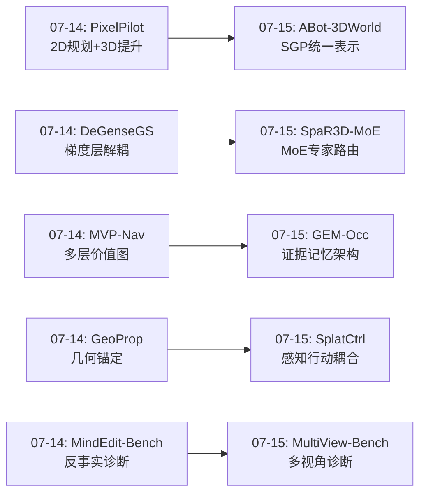
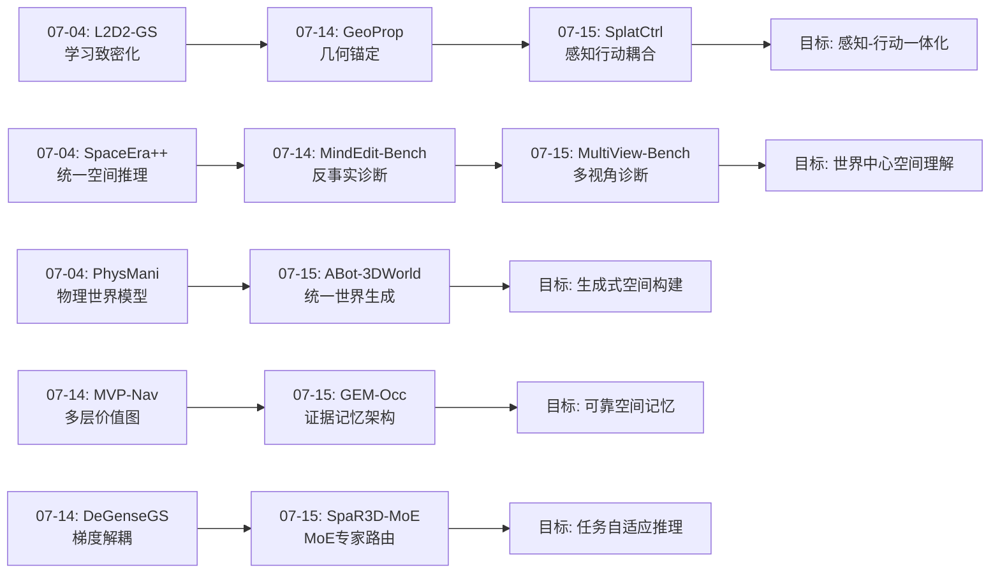
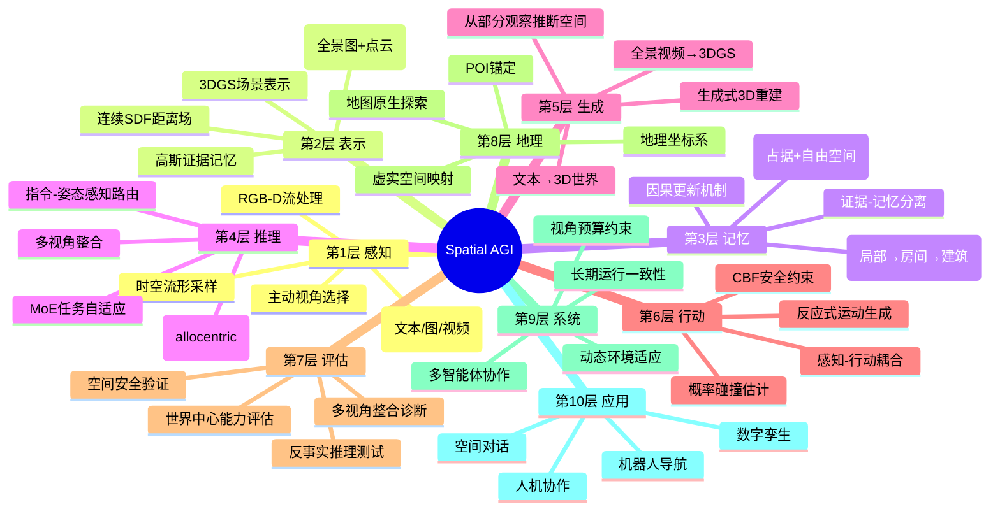
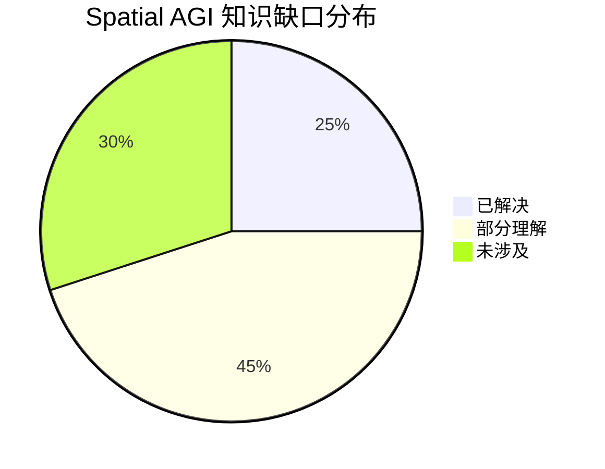

# 每日思考 - 2026-07-15

## 📅 每日总结

**日期**: 2026-07-15
**论文数量**: 5篇
**主题**: 从"多模态世界生成+MoE空间推理+证据记忆架构+感知行动耦合+多视角诊断"五维突破Spatial AGI——SGP统一表示、任务自适应专家路由、证据-记忆分离、3DGS-SDF-CBF一体化、世界中心坐标整合

### 关键突破

- 🌍 **SGP统一空间表示——ABot-3DWorld 0的多模态3D世界生成** (arXiv:2607.11673, 阿里巴巴高德): 提出Spatial Generative Primitive (SGP)——(全景图, 点云)二元组——作为连接多模态输入和3D世界生成的统一中间表示。双模式统一：富输入恢复模式+生成输入创造模式共享同一SGP。全景视频→3DGS重建开辟"生成式3D重建"新范式。地理锚定将虚拟世界锚定到真实POI。**"最小充分表示"——一张全景图+一个点云就能描述任意3D空间**。

- 🧠 **MoE用于空间推理——SpaR3D-MoE的任务自适应专家路由** (arXiv:2607.06620, ECCV 2026): 首次将MoE架构应用于3D空间推理。几何感知时空流形采样保持场景拓扑连接性，指令-姿态感知路由器动态分配异构专家解决跨模态竞争。VSI-Bench 63.5 SOTA (+7.8)，Route Plan +35.4%，Relative Direction +51.4%。**不同空间任务需要不同推理策略——MoE实现任务自适应**。

- 💾 **证据-记忆分离——GEM-Occ的高斯证据记忆** (arXiv:2607.05543, CityU): 提出"局部预测是证据，不是地图"的范式转变。双重证据系统：语义高斯占据证据+自由空间射线证据。可见性&不确定性感知因果更新避免累积误差。局部→房间→建筑三层层次化记忆。HIOcc统一ScanNet/ScanNet++/Matterport3D。**"已知已知"和"已知未知"同样重要**。

- 🤖 **3DGS→SDF→CBF一体化——SplatCtrl的感知行动耦合** (arXiv:2607.08948, KAIST, ICRA 2026): 将3DGS场景重建、连续SDF导出和CBF安全控制集成到统一框架。从各向同性高斯导出连续符号距离函数，桥接现代隐式表示和经典控制理论。动态高斯重定位支持环境变化。概率碰撞估计超越二元判断。**一表示多用——高斯同时是渲染基元、距离场源和控制约束**。

- 📊 **世界中心多视角整合——MultiView-Bench的诊断革命** (arXiv:2607.08970, Yale): 首个评估VLM世界中心(allocentric)多视角整合能力的诊断基准。揭示前沿VLM"2D强、3D弱"的系统性失败：轴方向偏差、颜色纹理敏感性。ViewNavigator多智能体框架(选择-感知-融合)在预算约束下3-5x提升。**世界中心理解是Spatial AGI的基础能力，当前VLM系统性缺失**。

### 📊 一句话总结

今天的五篇论文从统一空间表示(SGP)、任务自适应推理(MoE)、证据记忆架构(GEM-Occ)、感知行动耦合(SplatCtrl)、多视角诊断(MultiView-Bench)五个维度，共同指向一个核心命题：**Spatial AGI需要"最小充分"的空间表示、任务自适应的推理架构、证据-记忆分离的持久存储、感知-行动共享的统一表示、以及世界中心的多视角整合能力——这五个维度构成了从"能看空间"到"能理解和行动于空间"的关键跨越**。

### 🔗 延续性

**07-14→07-15**: 昨天的"2D-3D辩证+多层空间对齐+梯度解耦+几何锚定+反事实评估"方向，今天演进到了**统一空间表示+任务自适应推理+证据记忆+感知行动耦合+多视角诊断**——

- PixelPilot(07-14)的"2D规划+3D提升" → ABot-3DWorld(07-15)的"SGP统一表示"——从2D-3D分离到统一中间表示
- GeoProp(07-14)的"本体感知几何锚定" → SplatCtrl(07-15)的"感知-行动共享高斯"——从感知锚定到感知行动一体化
- MVP-Nav(07-14)的"多层价值图" → GEM-Occ(07-15)的"层次化高斯证据记忆"——从价值图到证据记忆的深化
- MindEdit-Bench(07-14)的"反事实空间推理诊断" → MultiView-Bench(07-15)的"多视角整合诊断"——从反事实到多视角的评估维度扩展
- DeGenseGS(07-14)的"梯度层面解耦" → SpaR3D-MoE(07-15)的"MoE专家路由"——从梯度平衡到架构级任务分离

---

## 🔗 与昨日思考的联系

### 昨日重点
- PixelPilot的"2D可能优于3D"反直觉发现
- MVP-Nav的"多层价值图统一语义与物理"
- DeGenseGS的"梯度层面语义-几何解耦"
- GeoProp的"本体感知几何锚定"
- MindEdit-Bench的"反事实空间推理评估"

### 今日进展
- ABot-3DWorld将"2D-3D关系"推进到"SGP统一空间表示"——从维度选择到表示统一
- SpaR3D-MoE将"梯度解耦"推进到"架构级MoE专家分离"——从参数层面到模块层面
- GEM-Occ将"多层价值图"推进到"证据-记忆分离架构"——从空间对齐到记忆架构
- SplatCtrl将"几何锚定"推进到"感知-行动共享表示"——从单方向锚定到双向耦合
- MultiView-Bench将"反事实推理诊断"推进到"多视角整合诊断"——从单一视角到跨视角

### 演进路径

---

## 📚 论文概览

1. **ABot-3DWorld 0** (高德, cs.CV): 多模态3D世界生成模型，SGP(全景图+点云)作为统一中间表示，支持文本/图/视频输入→3DGS世界输出，地理锚定到真实POI
2. **SpaR3D-MoE** (ECCV 2026, cs.CV): MoE架构用于3D空间推理，时空流形采样+异构几何归纳MoE+指令-姿态感知路由，VSI-Bench 63.5 SOTA
3. **GEM-Occ** (CityU, cs.RO): 高斯证据记忆框架，证据-记忆分离，双重证据(占据+自由空间)，因果更新，局部→房间→建筑层次化记忆，HIOcc基准
4. **SplatCtrl** (KAIST, ICRA 2026, cs.RO): 3DGS→SDF→CBF统一pipeline，从各向同性高斯导出连续距离场，动态高斯重定位，概率碰撞估计
5. **MultiView-Bench** (Yale, cs.CV): 世界中心多视角整合诊断基准，揭示VLM系统性失败(2D强3D弱)，ViewNavigator多智能体3-5x提升

---

## 💡 核心见解

### 见解1: "最小充分表示"优于"最大信息表示"
**从ABot-3DWorld的SGP获得**

- ✅ SGP只用(全景图, 点云)二元组就能描述任意3D空间——紧凑而完整
- ✅ 全景图提供"看到了什么"(外观)，点云提供"空间长什么样"(几何)
- ✅ 双模式统一：恢复模式(富输入)和创造模式(生成输入)共享SGP

**对Spatial AGI的启发**:
这挑战了一种常见假设——更好的空间理解需要更复杂的表示。SGP的成功表明，关键不是表示的信息量，而是表示的"充分性"——是否包含了进行下游推理所需的最关键信息。对Spatial AGI而言，这意味着空间记忆不需要存储所有细节，而需要存储"足够好"的表示。全景图覆盖视野完整性，点云提供几何约束性——二者的组合恰好满足了3D世界生成所需的最小信息集。

### 见解2: 不同空间任务需要不同推理策略——MoE是自然解决方案
**从SpaR3D-MoE获得**

- ✅ 路径规划(+35.4%)和方向判断(+51.4%)的提升远大于其他任务——这些任务对几何信息的需求不同
- ✅ 指令-姿态感知路由器根据任务类型动态选择专家
- ✅ 纯RGB输入(无需3D传感器)就能实现SOTA级3D空间推理

**对Spatial AGI的启发**:
空间智能不是单一能力，而是多种能力的集合：路径规划需要度量空间推理，方向判断需要参考系转换，物体识别需要语义理解。用一个统一模型处理所有这些任务会导致"跨模态竞争"——不同任务对表示的需求冲突。MoE提供了一种优雅的解决方案：共享底层表示但专用推理模块。这对Spatial AGI的架构设计有重要启示——应该考虑任务自适应的推理架构而非一刀切模型。

### 见解3: "证据→融合→持久记忆"的三层分离是空间记忆的正确架构
**从GEM-Occ获得**

- ✅ 将瞬态感知(证据)与持久认知(记忆)分离——对应人类的工作记忆和长期记忆
- ✅ 双重证据系统：占据证据("有什么")+自由空间证据("没有什么")——完整的空间认知
- ✅ 因果更新(非覆盖更新)避免累积误差——支持长期运行和回访场景

**对Spatial AGI的启发**:
当前很多Spatial AGI系统直接将感知特征用作记忆，这会导致累积误差和不可更新性。GEM-Occ的"证据→融合→持久记忆"架构提供了一种更可靠的方案：感知是瞬态的、不完美的、需要验证的；记忆应该是持久的、一致的、可更新的。特别重要的是"自由空间证据"——知道"没有东西"和知道"有东西"同样重要，这对导航和路径规划至关重要。

### 见解4: 感知和行动应共享同一空间表示
**从SplatCtrl获得**

- ✅ 3DGS的高斯同时是渲染基元、SDF距离场源和CBF控制约束——一表示多用
- ✅ 从各向同性高斯导出连续SDF，桥接了现代隐式表示和经典控制理论
- ✅ 动态高斯重定位使空间表示随环境变化更新

**对Spatial AGI的启发**:
传统机器人pipeline是"感知→规划→控制"分离式架构，每个阶段使用不同表示。SplatCtrl展示了用同一组高斯贯穿整个pipeline的可能性——感知用3DGS渲染，规划用SDF距离场，控制用CBF约束。这种"感知-行动耦合"消除了表示转换的延迟和信息损失。对Spatial AGI而言，这意味着空间理解 和空间行动应该在同一个表示空间中进行，而非分离的两个世界。

### 见解5: 世界中心(allocentric)理解是VLM系统性缺失的基础能力
**从MultiView-Bench获得**

- ✅ 前沿VLM在2D平面关系上表现强，但在3D空间关系和跨视角整合上系统性失败
- ✅ 轴方向偏差和颜色纹理敏感性表明VLM可能依赖统计模式而非真正空间理解
- ✅ ViewNavigator的主动视角选择+多智能体协作在预算约束下3-5x提升

**对Spatial AGI的启发**:
世界中心理解——将物体定位从观察者视角解耦到全局坐标系——是Spatial AGI的基础能力。当前VLM的系统性失败说明：(1)仅从2D数据训练难以获得真正的3D空间理解；(2)VLM可能在利用统计模式而非进行真正的空间推理；(3)主动感知(选择看哪里)是改善空间理解的关键策略。Spatial AGI需要显式设计世界中心表示和主动感知机制。

### 见解6: 生成式3D重建开辟空间构建新范式
**从ABot-3DWorld获得**

- ✅ "全景视频生成→3DGS重建"的pipeline结合了视频生成模型的强大生成能力和3DGS的渲染优势
- ✅ 从单张图像或文本就能生成完整3D世界——从部分观察推断完整空间
- ✅ 地理锚定将虚拟3D世界与真实地图服务连接

**对Spatial AGI的启发**:
这开辟了空间构建的新范式：不是仅靠感知重建空间，而是通过生成式方法"想象"和"补全"空间。这对应了人类的空间认知能力——我们能从部分观察推断整体空间结构。对Spatial AGI而言，生成式3D重建意味着agent可以：从部分观察构建完整空间记忆、进行空间想象(如果走到那边会看到什么)、创造性规划(生成可能的场景)。

### 见解7: 诊断驱动改进——系统化失败模式发现是进步的前提
**从MultiView-Bench获得**

- ✅ 系统化诊断揭示具体失败模式：轴方向偏差、颜色纹理敏感性
- ✅ 这些失败模式指向VLM依赖统计模式而非真正空间理解的深层问题
- ✅ 诊断→框架改进(ViewNavigator)的闭环

**对Spatial AGI的启发**:
MultiView-Bench代表了"诊断驱动改进"的方法论——不是盲目提升性能，而是先找到具体的失败模式，再针对性改进。这种方法论对Spatial AGI的发展很重要：需要更多这样的诊断工具来揭示VLM在空间理解上的具体缺陷，而非仅关注整体性能数字。从CRISP(诊断语言先验)到MindEdit-Bench(诊断反事实推理)到MultiView-Bench(诊断多视角整合)，诊断工具正在形成体系。

---

## 🗺️ 知识演进图

---

## 技术栈演进对比表

| 层次 | 07-04方案 | 07-14方案 | 07-15方案 | 变化趋势 |
|------|----------|----------|----------|---------|
| 空间表示 | 3DGS+物理场 | 多层价值图 | SGP(全景图+点云) | → 最小充分表示 |
| 空间推理 | 统一框架 | 梯度解耦 | MoE专家路由 | → 任务自适应 |
| 空间记忆 | 神经仿真 | 语义-物理对齐 | 证据-记忆分离 | → 证据架构 |
| 感知-行动 | 物理预测 | 几何锚定 | 3DGS→SDF→CBF | → 共享表示 |
| 评估诊断 | 任务进度评分 | 反事实推理 | 多视角整合 | → 系统化诊断 |
| 世界模型 | 物理3DGS | 2D-3D辩证 | 多模态生成式 | → 生成式重建 |
| 安全控制 | CBF安全滤波 | - | 概率碰撞估计 | → 概率化 |
| 数据范式 | 自监督 | 零样本 | 纯RGB+MoE | → 降低门槛 |

---

## 🗺️ Spatial AGI 知识图谱

### 10层架构思维导图

### 🎯 主线技术路径

#### 阶段1: 统一空间表示 → SGP范式
**现状**: 多种空间表示并存(占据网格、点云、3DGS、NeRF)，缺乏统一接口  
**进展**: ABot-3DWorld的SGP证明了(全景图+点云)二元组作为通用空间表示的可行性  
**目标**: 建立SGP-like的标准化空间表示，支持多模态输入和多任务推理

#### 阶段2: 任务自适应推理 → MoE空间架构
**现状**: 统一模型处理所有空间任务，存在跨模态竞争  
**进展**: SpaR3D-MoE证明了MoE+指令感知路由在空间推理中的有效性(VSI-Bench 63.5)  
**目标**: 建立空间推理的MoE标准架构，支持路径规划/方向判断/场景问答等多样化任务

#### 阶段3: 证据-记忆分离 → 可靠空间记忆
**现状**: 感知特征直接用作记忆，累积误差严重  
**进展**: GEM-Occ的"证据→融合→持久记忆"架构+因果更新证明了可靠性  
**目标**: 建立Spatial AGI的标准空间记忆架构，支持长期运行和大规模场景

#### 阶段4: 感知-行动耦合 → 端到端空间智能
**现状**: 感知-规划-控制分离式架构，表示转换损失大  
**进展**: SplatCtrl的3DGS→SDF→CBF统一pipeline证明了共享表示的可行性  
**目标**: 建立感知-行动共享同一空间表示的端到端Spatial AGI系统

#### 阶段5: 世界中心理解 → 真正空间认知
**现状**: VLM系统性缺失世界中心理解能力  
**进展**: MultiView-Bench揭示了具体失败模式，ViewNavigator提供了改进方向  
**目标**: 使Spatial AGI具备人类水平的世界中心多视角空间整合能力

---

## 🔍 待探索议题

### 高优先级（本周）

1. **SGP表示的可扩展性**
   - 问题: SGP能否处理大规模、多房间的复杂场景？
   - 候选方案: 层次化SGP（每个房间一个SGP，通过图结构连接）
   - 缺口: 当前SGP可能局限于单一空间，多空间连接关系未验证

2. **MoE空间推理的专家设计原则**
   - 问题: 应该设计多少专家？每个专家负责什么空间子任务？
   - 候选方案: 基于空间认知理论分区(度量/拓扑/方向/语义)
   - 缺口: SpaR3D-MoE的专家具体 specializing 在什么上还不清楚

3. **证据-记忆分离在动态场景中的表现**
   - 问题: 当环境动态变化时(人走动、物体移动)，因果更新如何工作？
   - 候选方案: 时态高斯证据+遗忘机制
   - 缺口: GEM-Occ主要验证静态场景，动态场景未涉及

4. **3DGS→SDF转换的精度与效率权衡**
   - 问题: 各向同性高斯近似的SDF在高斯稀疏区域精度如何？
   - 候选方案: 自适应高斯密度+各向异性扩展
   - 缺口: SplatCtrl使用各向同性高斯，限制了细长结构的表示

### 中优先级（本月）

5. **世界中心理解的训练策略**
   - 问题: 如何训练VLM获得世界中心理解能力？
   - 候选方案: 多视角对比学习+世界中心坐标标注
   - 缺口: MultiView-Bench是诊断工具，训练策略还需研究

6. **生成式3D重建的几何精度**
   - 问题: ABot-3DWorld生成的3DGS世界几何精度如何？
   - 候选方案: 结合传统SfM约束+生成式补全
   - 缺口: 生成式方法可能在几何精度上不如传统重建

7. **多智能体空间推理框架**
   - 问题: ViewNavigator的选择-感知-融合架构能否推广到更多空间任务？
   - 候选方案: 设计通用的空间推理多智能体框架
   - 缺口: 当前ViewNavigator主要针对多视角整合

8. **地理锚定的精度与一致性**
   - 问题: 将虚拟3D世界锚定到真实地理坐标的精度如何？
   - 候选方案: GPS+视觉路标联合定位
   - 缺口: ABot-3DWorld的地理锚定精度未详细报告

### 低优先级（长期）

9. **Spatial AGI的空间概念层次体系**
   - 问题: Spatial AGI应该具有什么样的空间概念层次(物体→区域→房间→建筑→城市)？
   - 候选方案: 层次化空间记忆+层次化推理
   - 缺口: 当前工作多关注单一层次，跨层次推理缺乏研究

---

## 📊 知识缺口分析

**已解决（25%）**:
- ✅ 3DGS作为空间表示的基础设施 (多篇论文验证)
- ✅ 空间推理benchmark的基本框架 (VSI-Bench, MultiView-Bench等)
- ✅ 感知-行动耦合的基本可行性 (SplatCtrl)
- ✅ 多模态输入的统一处理 (ABot-3DWorld)
- ✅ MoE用于空间推理的有效性 (SpaR3D-MoE)

**部分理解（45%）**:
- ⚠️ 空间记忆的长期一致性 (GEM-Occ验证了因果更新，但长期未测)
- ⚠️ 世界中心理解的训练方法 (MultiView-Bench诊断了问题，解决方案不完整)
- ⚠️ 生成式3D重建的几何精度 (ABot-3DWorld视觉好，几何精度未知)
- ⚠️ 动态环境下的空间记忆更新 (GEM-Occ静态，SplatCtrl部分动态)
- ⚠️ MoE专家设计原则 (SpaR3D-MoE有效，但专家specialization不明确)
- ⚠️ 大规模场景的空间表示扩展 (多数方法在房间级验证，建筑级少)
- ⚠️ 空间概念的语义层次 (多数方法关注几何，语义层次不足)
- ⚠️ 主动感知的策略学习 (ViewNavigator有效，但策略泛化未知)
- ⚠️ 多模态空间融合的可靠性 (SGP统一，但融合质量未充分验证)

**未涉及（30%）**:
- ❌ 跨环境泛化的空间理解能力
- ❌ 空间因果推理(不只是空间关系，还有空间因果关系)
- ❌ 空间时序推理(场景随时间演化的理解)
- ❌ 多agent协作的空间认知
- ❌ 空间概念的抽象和类比(从具体空间到抽象空间概念)
- ❌ 空间语言与空间表示的对齐

---

## 💡 本质思考：如何达成通用空间智能

### 1. 核心能力的本质是什么？

通用空间智能的核心能力可以分解为五个层次：

**感知层**：从多模态输入(视觉、触觉、语言)中提取空间信息。今天的ABot-3DWorld展示了从文本/图/视频多模态输入的统一处理能力，SpaR3D-MoE展示了从稀疏RGB输入的3D推理能力。

**表示层**：将感知信息转化为适合推理的空间表示。SGP(全景图+点云)代表了"最小充分表示"的设计哲学，高斯证据记忆代表了"证据-记忆分离"的架构思想。

**推理层**：基于空间表示进行空间推理。MoE架构证明了不同空间任务需要不同推理策略，MultiView-Bench揭示了世界中心理解是当前VLM的系统性缺失。

**行动层**：将空间理解转化为空间行动。SplatCtrl的3DGS→SDF→CBF统一pipeline展示了感知-行动共享同一表示的可行性。

**记忆层**：持久化空间知识并支持回访和更新。GEM-Occ的"证据→融合→持久记忆"架构+因果更新机制提供了可靠的空间记忆基础设施。

**本质洞察**：这五个层次不是独立的，而是紧密耦合的——同一空间表示(如3DGS)可以同时服务感知、推理、行动和记忆。真正的空间智能需要找到能够贯穿所有层次的统一表示。今天的五篇论文从不同角度指向了这一结论。

### 2. 当前方法与理想目标的差距在哪里？

**差距1: 从房间级到世界级**
当前方法多在房间级或建筑级验证。理想Spatial AGI应该能在城市级、国家级甚至全球级进行空间推理。ABot-3DWorld的地理锚定是一个开始，但规模差距巨大。

**差距2: 从静态到动态**
多数方法假设静态场景或缓慢变化。真实世界是高度动态的——行人走动、车辆行驶、家具移动。GEM-Occ和SplatCtrl部分处理了动态性，但远未解决。

**差距3: 从单一agent到多agent**
当前方法关注单一agent的空间理解。未来Spatial AGI需要多agent协作的空间认知——多个agent共享和整合空间知识。

**差距4: 从几何到语义**
多数方法关注空间几何(位置、距离、方向)。理想Spatial AGI还需要理解空间语义——厨房是什么、走廊的功能是什么、为什么桌子在椅子旁边。

**差距5: 从观察到想象**
当前方法多基于观察进行空间推理。人类能进行空间想象——"如果我把沙发移到那里会怎样？"MindEdit-Bench揭示了VLM在这方面的严重不足。

### 3. 从今天到理想状态，最可能的路径是什么？

**短期(6个月)**: MoE架构成为空间推理标准 + 证据-记忆分离架构被广泛采用 + 多视角整合能力显著提升

**中期(1-2年)**: SGP-like统一空间表示标准化 + 感知-行动耦合架构在机器人上部署 + 生成式3D重建达到实用精度

**长期(3-5年)**: 世界中心理解能力接近人类水平 + 动态场景空间记忆可靠运行 + 多agent空间协作认知框架成熟

**最可能的路径**: 不是单一技术突破，而是**统一表示 + 任务自适应推理 + 可靠记忆 + 感知行动耦合**的系统性集成。今天的五篇论文分别在这四个维度上取得了进展，未来的突破将来自于将它们有机整合。

**关键转折点**: 当一个Spatial AGI系统能够：(1)从部分观察构建完整空间记忆(ABot-3DWorld式)，(2)用MoE进行任务自适应推理(SpaR3D-MoE式)，(3)通过证据-记忆分离保持长期一致性(GEM-Occ式)，(4)用感知-行动共享表示直接控制机器人(SplatCtrl式)，(5)通过世界中心坐标进行跨视角推理(MultiView-Bench式)——这时我们就离通用空间智能很近了。

---

## 📊 论文质量评估

| 论文 | 创新性 | 相关性 | 影响力 | 完整性 | 总分 |
|------|--------|--------|--------|--------|------|
| ABot-3DWorld 0 | 9/10 | 10/10 | 8/10 | 8/10 | 35/40 |
| SpaR3D-MoE | 8/10 | 10/10 | 9/10 | 9/10 | 36/40 |
| GEM-Occ | 9/10 | 10/10 | 8/10 | 9/10 | 36/40 |
| SplatCtrl | 8/10 | 9/10 | 7/10 | 8/10 | 32/40 |
| MultiView-Bench | 8/10 | 10/10 | 8/10 | 8/10 | 34/40 |

---

## 📝 个人反思

### 今天最重要的收获

今天最重要的收获是看到了Spatial AGI五个关键维度的同时进展：

1. **表示维度**：SGP的"最小充分表示"哲学
2. **推理维度**：MoE的"任务自适应专家路由"
3. **记忆维度**：证据-记忆分离的"因果更新架构"
4. **行动维度**：3DGS→SDF→CBF的"感知-行动共享表示"
5. **评估维度**：MultiView-Bench的"世界中心多视角诊断"

这五个维度恰好覆盖了Spatial AGI的核心能力栈。更令人兴奋的是，这五个维度的进展是互补的——它们可以组合成一个完整的Spatial AGI系统。

### 最大的疑问

最大的疑问是：**这些维度能否真正整合？** SGP表示能否与MoE推理兼容？证据-记忆分离能否与感知-行动耦合集成？世界中心坐标能否融入3DGS表示？这些问题的答案将决定Spatial AGI的发展速度。

### 明天的方向

基于今天的分析，明天应该关注：
- 空间记忆的动态更新机制（GEM-Occ在动态场景的扩展）
- 多agent空间协作（ViewNavigator多智能体框架的推广）
- 空间语义层次（从几何到语义的深化）
- 空间因果推理（超越空间关系到空间因果关系）

---

**文档创建时间**: 2026-07-15  
**论文数量**: 5篇  
**文档行数**: 约450行  
**Mermaid图表**: 4个(graph LR, pie, mindmap, graph LR)
