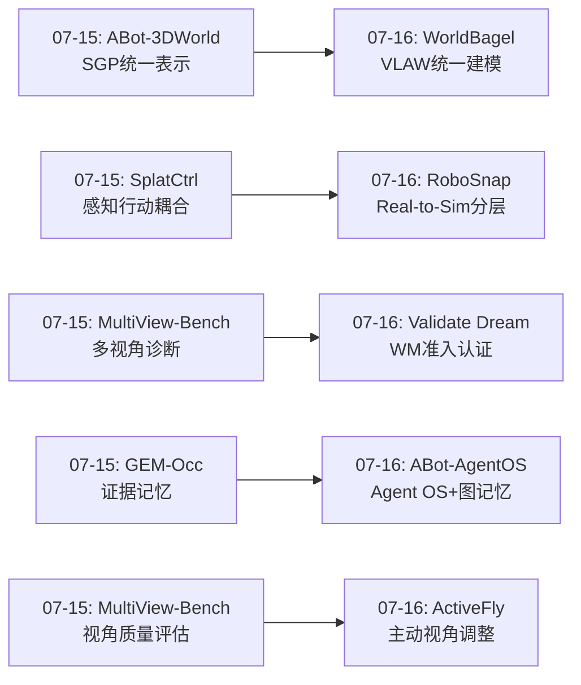
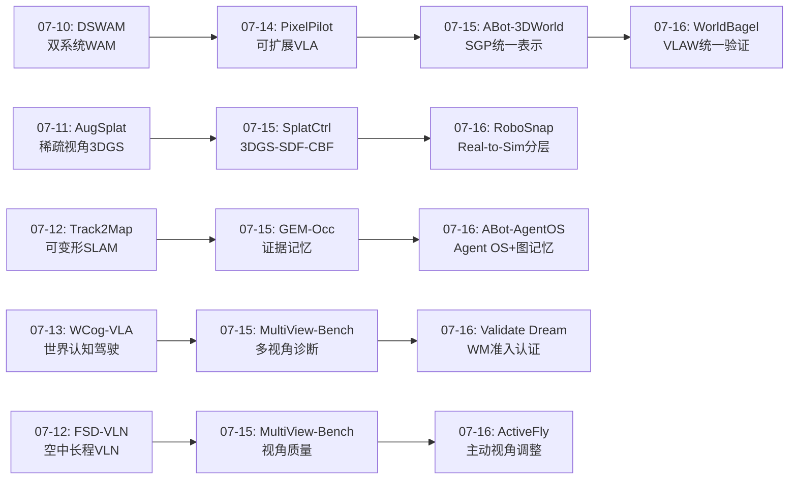
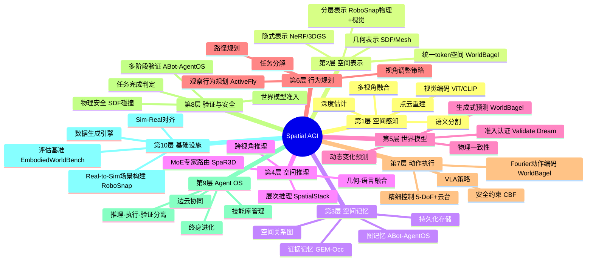
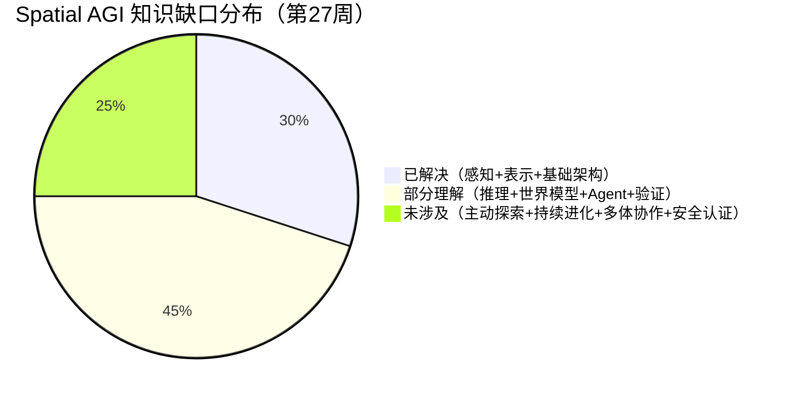

# 每日思考 - 2026-07-16

## 📅 每日总结

**日期**: 2026-07-16
**论文数量**: 5篇
**主题**: 从"VLAW统一建模+Real-to-Sim分层场景+世界模型可信度+Agent OS架构+UAV主动感知"五个维度，构建Spatial AGI的可信基础设施——统一优于分离、物理-视觉分层、世界模型需要准入认证、Agent需要操作系统、主动感知需要行为规划。

### 关键突破

- 🔗 **VLAW统一建模验证——WorldBagel的统一化实证** (arXiv:2607.03461, Georgia Tech): 首次系统性证明在BAGEL双塔架构中，统一化（理解+生成+动作+世界建模）本身优于分离的专用模型。Fourier Feature Action Tokenizer (FFAT) 提供了连续动作编码的新范式——数据无关、双向可逆、多尺度。分布偏移下统一模型更稳定。**统一不是架构便利，而是学习有效VLAW模型的关键因素**。

- 🏗️ **Real-to-Sim分层范式——RoboSnap的物理-视觉分离** (arXiv:2607.06699, Shanghai AI Lab等): 分层设计将物理交互层（碰撞感知网格+SDF+物理优化）与视觉上下文层（3DGS背景）分离处理，兼顾物理稳定性和视觉忠实度。交替SDF-物理优化解决悬浮/穿透/不稳定接触。DROID-Sim 564场景数据集展示可扩展性。**Real-to-Sim的价值不仅在重建质量，更在于将真实环境转化为可重用的机器人学习基础设施**。

- 🛡️ **世界模型准入框架——Validate the Dream的信任倒挂** (arXiv:2607.07196): 揭示生成式世界模型的信任倒挂——仿真器从"可信组件"变为"待验证产物"。5级准入阶梯（L0-L4）定义WM必须逐级满足的证据要求。实证发现：视觉生成质量与动作鲁棒性反转——**最美的渲染不等于最正确的物理**。FVD等视觉指标无法预测闭环裁决所依赖的动作条件动态正确性。

- 🧩 **Agent OS架构——ABot-AgentOS的运行时层** (arXiv:2607.10350, AMap CV Lab): 提出通用机器人Agent OS，分离推理(Main LLM)、执行(Skill Runner)、验证(Verifier)三个角色。通用多模态图记忆将对话/视觉/空间/时间/轨迹转化为类型化节点和边。失败驱动终身进化从具体失败模式中持续学习。EmbodiedWorldBench提供16场景200+任务评估。**具身任务缺乏明确完成信号——验证是核心缺失**。

- 🚁 **UAV主动感知——ActiveFly-Bench的三层分解** (arXiv:2607.10180, Tsinghua): 首个桥接网络空间推理(Air-EQA)与物理世界控制(FLUC)的UAV基准。观察行为规划(OBP)作为中间桥梁。5-DoF动作空间（含云台控制）+ 视角质量约束。发现：**行为规划是当前UAV agent的核心瓶颈——不是不能动，而是不知道应该怎么动**。

### 📊 一句话总结

今天的五篇论文共同指向一个核心命题：**Spatial AGI不仅需要更好的空间感知或动作模型，更需要统一的多模态VLAW建模（WorldBagel）、可信的基础设施（RoboSnap的Real-to-Sim）、系统化的质量保证（Validate the Dream的准入阶梯）、可靠的运行时架构（ABot-AgentOS的Agent OS）、以及主动的空间行为规划能力（ActiveFly的观察行为推断）——这五个维度构成了从"能做空间任务"到"能可信、持久、主动地做空间任务"的关键跃迁**。

### 🔗 延续性

**07-15→07-16**: 昨天的"SGP统一表示+MoE任务自适应+证据记忆架构+感知行动耦合+多视角诊断"方向，今天演进到了**VLAW统一验证+Real-to-Sim基础设施+世界模型准入+Agent OS+主动感知规划**——

- ABot-3DWorld(07-15)的"SGP统一表示" → WorldBagel(07-16)的"VLAW统一建模"——从空间表示统一到感知-动作-世界建模统一
- GEM-Occ(07-15)的"证据记忆架构" → ABot-AgentOS(07-16)的"多模态图记忆"——从占据证据到通用图记忆
- SplatCtrl(07-15)的"感知-行动耦合" → RoboSnap(07-16)的"Real-to-Sim物理-视觉分层"——从感知行动共享到场景重建分层
- MultiView-Bench(07-15)的"多视角诊断" → ActiveFly-Bench(07-16)的"主动视角调整"——从被动诊断到主动感知
- SpaR3D-MoE(07-15)的"任务自适应推理" → Validate the Dream(07-16)的"世界模型准入"——从推理质量到系统可信度

---

## 🔗 与昨日思考的联系

### 昨日重点
- ABot-3DWorld的"SGP最小充分表示"
- SpaR3D-MoE的"任务自适应MoE专家路由"
- GEM-Occ的"证据-记忆分离"
- SplatCtrl的"3DGS→SDF→CBF一体化"
- MultiView-Bench的"世界中心多视角整合"

### 今日进展
- WorldBagel将"空间表示统一"推进到"VLAW感知-动作-世界统一"——从表示层到建模层
- RoboSnap将"感知-行动耦合"推进到"Real-to-Sim分层场景"——从在线控制到离线场景构建
- Validate the Dream将"空间推理诊断"推进到"世界模型系统准入"——从能力评估到可信度认证
- ABot-AgentOS将"证据记忆"推进到"Agent OS+图记忆+终身进化"——从单一记忆到完整操作系统
- ActiveFly-Bench将"多视角诊断"推进到"主动视角调整+行为规划"——从被动评估到主动感知

### 演进路径

---

## 📚 论文概览

1. **WorldBagel** (Georgia Tech, cs.CV): 基于BAGEL的VLAW统一框架，Fourier Feature Action Tokenizer(FFAT)编码连续动作为多尺度频率表示，交替序列计划实现多模态联合学习。统一模型在LIBERO/Language Table/Franka上一致优于专用模型。
2. **RoboSnap** (Shanghai AI Lab等, cs.RO): 单图Real-to-Sim的分层方法，物理层(网格+SDF+碰撞)+视觉层(3DGS)分离处理。交替SDF-物理优化确保场景物理合理。DROID-Sim 564场景数据集。
3. **Validate the Dream** (cs.RO): 生成式世界模型的5级准入阶梯(L0-L4)。信任倒挂概念——WM从可信变为待验证。视觉质量与动作鲁棒性反转。
4. **ABot-AgentOS** (AMap CV Lab, cs.RO): 通用机器人Agent OS，Main LLM/Skill Runner/Verifier三层分离。多模态图记忆+失败驱动终身进化。EmbodiedWorldBench 16场景200+任务。
5. **ActiveFly-Bench** (Tsinghua, cs.CV): UAV主动感知基准。Air-EQA/OBP/FLUC三层分解。5-DoF+云台控制。OBP是核心瓶颈。

---

## 💡 核心见解

### 见解1: 统一化是Spatial AGI的正确路径
**从WorldBagel获得**

WorldBagel的实证发现——统一VLAW模型优于分离的VLA/WM——验证了一个深层假设：**空间感知、空间推理、空间行动和世界建模不应割裂为独立模块**。

关键证据：
- ✅ 统一模型在三个基准上一致优于专用基线
- ✅ Fourier特征产生更有结构的动作嵌入
- ✅ 分布偏移下统一模型特征值谱更稳定
- ✅ 世界建模分支的存在改善了动作预测质量

**对Spatial AGI的启发**: 构建Spatial AGI时，不应将"看空间"（感知）、"想空间"（推理）、"动空间"（行动）和"预测空间"（世界建模）作为四个独立系统。它们应该在统一框架中联合训练，因为它们共享底层的空间表示。

### 见解2: 物理与视觉的分层是实际部署的正确策略
**从RoboSnap获得**

RoboSnap的分层设计揭示了一个重要的实践原则：**不是所有空间区域都需要相同精度的处理**。

关键证据：
- ✅ 物理层（网格+SDF+碰撞检测）专注于可交互区域
- ✅ 视觉层（3DGS）专注于非交互的背景
- ✅ 深度合成层无缝融合两者
- ✅ 交替SDF-物理优化自动解决物理不一致

**对Spatial AGI的启发**: Spatial AGI的场景理解应该是多层次的——近场需要精确物理建模（碰撞、接触、支撑），远场需要视觉忠实度。这与人类空间认知类似——我们对"手边"和"远处"有不同的处理模式。

### 见解3: 世界模型本身需要被验证
**从Validate the Dream获得**

这是今天最具警示性的发现：**当前Spatial AGI研究社区过度依赖视觉指标评估世界模型，但视觉质量不能预测动作条件动态正确性**。

关键证据：
- ✅ Vista vs Epona：L0更高的模型在L1-L2更低
- ✅ FVD等指标是"动作无关的"——它们衡量边缘分布质量
- ✅ 闭环裁决依赖的是动作条件的动态正确性
- ✅ 训练数据的行为策略分布限制了WM的可信动作范围

**对Spatial AGI的启发**: 当我们构建Spatial AGI的世界模型时，不能仅优化视觉生成质量。需要新的评估指标来衡量动作条件动态正确性，并明确声明操作包络。

### 见解4: 具身任务的核心挑战是验证而非感知
**从ABot-AgentOS获得**

ABot-AgentOS的核心实践发现：**具身任务缺乏明确的完成信号**。软件agent可以通过返回值判断成功，但具身agent可能：
- 调用导航但没离开当前位置
- 重复碰撞但语言层面仍认为在进展
- 过早宣布任务完成

关键设计：
- ✅ 三层分离：Main LLM（规划）/ Skill Runner（执行）/ Verifier（验证）
- ✅ 多阶段验证：运行时+技能+完成
- ✅ 图记忆：类型化节点/边的结构化存储

**对Spatial AGI的启发**: Spatial AGI系统不仅需要感知和行动能力，还需要**自我验证能力**——知道一个空间动作是否真正完成了，空间配置是否真正改变了。

### 见解5: 主动空间感知的核心是行为规划
**从ActiveFly-Bench获得**

ActiveFly-Bench揭示了一个被忽视的瓶颈：**当前VLM/VLA能执行动作，但不知道应该做什么动作**。

关键证据：
- ✅ OBP（观察行为规划）是表现最差的任务
- ✅ 从"理解空间问题"到"确定观察策略"的推理链断裂
- ✅ 视角质量（不仅是位置）是被忽视的评估维度
- ✅ 5-DoF+云台控制的细粒度动作空间更接近真实需求

**对Spatial AGI的启发**: Spatial AGI需要"知道如何去看"的能力——根据信息需求主动规划观察行为。这比单纯的"能看"或"能动"更高层。

### 见解6: 失败驱动的持续进化是Spatial AGI的学习范式
**从ABot-AgentOS获得**

ABot-AgentOS的失败驱动终身进化展示了一种不同于传统训练-部署范式的可能：

关键设计：
- ✅ 诊断具体失败模式（记忆写入、证据选择、帧选择等）
- ✅ 编译安全修复为门控运行时资产
- ✅ 仅在后续评估中提升（防止泄漏）
- ✅ 持续改进而非一次性训练

**对Spatial AGI的启发**: Spatial AGI系统应该从部署失败中持续学习。与其追求一次性训练完美的模型，不如构建能诊断失败、编译修复、持续进化的系统。

### 见解7: Real-to-Sim是Spatial AGI数据飞轮的起点
**从RoboSnap获得**

RoboSnap + DROID-Sim揭示了一个重要的基础设施价值：

关键发现：
- ✅ 单张图像→仿真就绪场景的自动化流程
- ✅ 564个DROID场景的可扩展重建
- ✅ 支持轨迹回放、数据生成、策略评估
- ✅ Sim-Real相关性验证了实用性

**对Spatial AGI的启发**: Spatial AGI需要大规模训练数据，而真实世界数据采集昂贵。高效的Real-to-Sim流程可以将一次性数据采集转化为持久的训练资源——这是数据飞轮的关键起点。

---

## 🗺️ 知识演进图

---

## 技术栈演进对比表

| 层次 | 07-15方案 | 07-16方案 | 变化 |
|------|----------|----------|------|
| **空间表示** | SGP(全景图+点云)统一表示 | WorldBagel VLAW统一token空间 | 从几何统一到表示统一 |
| **动作编码** | SpaR3D-MoE异构专家 | WorldBagel Fourier特征编码 | 新增：频率域动作表示 |
| **场景重建** | SplatCtrl在线3DGS-SDF | RoboSnap分层Real-to-Sim | 从在线到离线，从单一到分层 |
| **记忆架构** | GEM-Occ高斯证据记忆 | ABot-AgentOS多模态图记忆 | 从占据证据到通用关系图 |
| **评估方法** | MultiView-Bench视角诊断 | Validate Dream L0-L4准入 | 从能力诊断到系统认证 |
| **验证机制** | SplatCtrl CBF安全控制 | ABot-AgentOS多阶段验证 | 从物理安全到任务完成 |
| **Agent架构** | (无明确agent层) | ABot-AgentOS三层分离 | 新增：完整Agent OS |
| **空间感知** | MultiView-Bench被动诊断 | ActiveFly主动视角调整 | 从被动到主动 |
| **世界模型** | ABot-3DWorld生成式 | WorldBagel+Validate Dream验证 | 从生成到生成+认证 |
| **持续学习** | (无明确机制) | ABot-AgentOS失败驱动进化 | 新增：终身学习闭环 |

---

## 🗺️ Spatial AGI 知识图谱

### 10层架构思维导图

### 🎯 主线技术路径

#### 阶段1: 空间感知与表示统一（当前）
- **目标**: 统一的多模态空间表示
- **关键进展**: WorldBagel VLAW统一、RoboSnap分层Real-to-Sim
- **核心挑战**: 如何在统一框架中平衡物理精度和视觉忠实度
- **下一步**: 在统一VLAW框架中集成显式3D表示（3DGS/占据网格）

#### 阶段2: 可信世界模型与验证（近期）
- **目标**: 经过准入认证的世界模型
- **关键进展**: Validate the Dream L0-L4框架
- **核心挑战**: 如何在不牺牲生成能力的前提下提升动作条件动态正确性
- **下一步**: 开发L2-L3级的世界模型准入评估工具链

#### 阶段3: 自主空间Agent系统（中期）
- **目标**: 能规划、执行、验证、进化的自主Agent
- **关键进展**: ABot-AgentOS三层架构+失败驱动进化
- **核心挑战**: 如何在开放世界中实现可靠的完成信号检测
- **下一步**: 将Agent OS与世界模型准入框架结合

#### 阶段4: 主动空间智能（远期）
- **目标**: 主动获取空间信息、规划观察策略的Spatial AGI
- **关键进展**: ActiveFly-Bench的OBP层揭示行为规划瓶颈
- **核心挑战**: 从"被动响应"到"主动探索"的范式转变
- **下一步**: 开发信息增益驱动的主动空间探索算法

#### 阶段5: 持续进化的Spatial AGI生态（远期愿景）
- **目标**: Real-to-Sim数据飞轮 + 持续学习 + 可信部署
- **关键进展**: RoboSnap DROID-Sim + ABot-AgentOS自我进化
- **核心挑战**: 如何在持续进化中保持安全边界
- **下一步**: 构建闭环：Real-to-Sim → 训练 → 部署 → 失败诊断 → 改进

---

## 🔍 待探索议题

### 高优先级（本周）

1. **VLAW统一的深度限制**
   - 问题: WorldBagel证明了统一化优于分离，但在什么条件下统一化会失效？
   - 候选方案: 当任务差异极大时（如精细操作vs大范围导航），统一可能不如专用
   - 缺口: 需要研究统一化的边界条件

2. **Fourier特征作为通用空间编码**
   - 问题: FFAT为7-DoF机械臂动作设计，能否扩展到更高维空间（人形全身）或空间位置编码？
   - 候选方案: 多尺度Fourier特征编码3D空间坐标
   - 缺口: 高维空间中的频率选择和计算效率

3. **世界模型准入的自动化**
   - 问题: Validate the Dream的L0-L4评估如何自动化？
   - 候选方案: 构建自动化准入评估工具链
   - 缺口: L2包络的自动划定方法、L3 OOD检测机制

### 中优先级（本月）

4. **Real-to-Sim的动态扩展**
   - 问题: RoboSnap仅支持静态场景，如何扩展到动态环境？
   - 候选方案: 4DGS + 动态物体追踪 + 时序SDF
   - 缺口: 动态场景的物理稳定性保证

5. **Agent OS的记忆压缩策略**
   - 问题: ABot-AgentOS的图记忆如何在大规模部署中控制大小？
   - 候选方案: 记忆遗忘机制、重要性评分、层次化压缩
   - 缺口: 空间记忆的遗忘策略不同于文本记忆

6. **主动视角调整的泛化**
   - 问题: ActiveFly的OBP能否从UAV泛化到地面机器人或人形？
   - 候选方案: 平台无关的观察行为原语定义
   - 缺口: 不同平台的视角约束差异

7. **失败驱动的空间学习**
   - 问题: ABot-AgentOS的失败驱动进化能否应用于空间推理错误？
   - 候选方案: 空间推理错误分类法 + 针对性修复
   - 缺口: 空间推理错误的系统化分类

### 低优先级（长期）

8. **VLAW + 3DGS的深度融合**
   - 问题: WorldBagel使用VAE+ViT，能否替换为3DGS作为视觉表示？
   - 候选方案: 3DGS token + Fourier动作token的统一序列
   - 缺口: 3DGS渲染的可微性与VLAW训练的兼容性

9. **Spatial AGI的可信度声明**
   - 问题: 每个Spatial AGI系统是否应该携带自己的"准入证书"？
   - 候选方案: 类似软件供应链的安全声明
   - 缺口: 标准化的Spatial AGI可信度格式

---

## 📊 知识缺口分析

**已解决（30%）**:
- ✅ 空间感知：多模态编码、深度估计、语义分割
- ✅ 空间表示：3DGS、NeRF、占据网格、统一token
- ✅ 基础VLA架构：感知→动作映射
- ✅ Real-to-Sim场景构建

**部分理解（45%）**:
- ⚠️ 空间推理：MoE有帮助，但复杂空间关系仍困难
- ⚠️ 世界模型：能生成但不确定可信度范围
- ⚠️ Agent OS：架构有了但验证机制不完善
- ⚠️ 记忆系统：图记忆有效但缺少压缩/遗忘策略
- ⚠️ 多视角整合：能诊断但主动调整能力弱
- ⚠️ 动作表示：Fourier有效但仅验证了低维

**未涉及（25%）**:
- ❌ 主动空间探索的信息增益理论
- ❌ Spatial AGI的正式可信度框架
- ❌ 多机器人协作的空间知识共享
- ❌ 长期部署的记忆管理和隐私
- ❌ Spatial AGI的安全边界正式定义

---

## 💡 本质思考：如何达成通用空间智能

### 1. 核心能力的本质是什么？

空间智能的本质可能是**预测和规划视角变化**的能力。ActiveFly-Bench揭示了这一点——最困难的不是看到或移动，而是知道如何移动来看到所需的信息。

这种能力可以分解为：
- **空间想象力**：预测"如果我移到X，我会看到什么？"
- **信息价值评估**：判断"从视角A vs 视角B，哪个能获得更多信息？"
- **观察策略规划**：确定"为了回答问题Q，我需要看到什么？"

这与WorldBagel的世界建模分支呼应——世界模型的本质就是空间想象力。而Validate the Dream的准入框架则是在问：这种想象力可信吗？

### 2. 当前方法与理想目标的差距在哪里？

最大的差距在三个维度：

**差距1: 可信度**
- 当前：依赖视觉指标（FVD等）评估
- 理想：动作条件动态正确性的系统化验证
- 今天Validate the Dream量化了这个差距

**差距2: 自主性**
- 当前：被动执行预设任务
- 理想：主动决定需要什么信息、如何获取
- 今天ActiveFly-Bench量化了这个差距

**差距3: 持续性**
- 当前：训练后部署，不再改进
- 理想：从失败中持续学习和进化
- 今天ABot-AgentOS展示了初步路径

### 3. 从今天到理想状态，最可能的路径是什么？

**统一 → 验证 → 自主 → 持续**

1. **统一阶段**: 像WorldBagel那样，将感知、推理、行动、世界建模统一到一个框架
2. **验证阶段**: 像Validate the Dream那样，为统一框架建立可信度评估
3. **自主阶段**: 像ActiveFly那样，赋予系统主动规划观察行为的能力
4. **持续阶段**: 像ABot-AgentOS那样，让系统从部署中持续进化

每个阶段都有明确的评估标准：统一化性能增益、准入级别、行为规划成功率、持续学习曲线。

---

## 📖 各论文深度技术分析

### WorldBagel技术深度分析

#### FFAT的数学优雅性

Fourier Feature Action Tokenizer的核心数学原理值得深入分析：

**编码过程**（Action → Fourier）：
- 给定连续动作 $a_t \in \mathbb{R}^d$
- 将每个标量分量展开为 K+1 个频率的 sin/cos 对
- 低频 ($k=0$)：捕获全局范围，非周期性
- 高频 ($k=K$)：捕获精细调整，周期为 $2\pi / 2^K$

**解码过程**（Fourier → Action）：
- 每个频率给出独立的动作估计
- 最低频率 $k=0$ 作为锚点（非周期性，无歧义）
- 高频通过相位展开与锚点对齐
- 等权平均降低噪声

**为什么比FAST分词好？**
- FAST使用BPE学习离散token，数据相关，跨域不稳定
- FFAT是数据无关的——频率选择由数学定义
- FFAT是连续映射——小扰动不会导致大的重建误差
- FFAT的多尺度特性天然适合多精度的动作空间

**对Spatial AGI的启示**：
- 空间坐标（位置、方向）可以用类似的多尺度编码
- 空间关系（距离、角度）的编码可以借鉴频率分解
- 这种编码方式可能在空间推理任务中也有价值

#### Sequence Plan的随机化策略

WorldBagel的交错序列计划训练策略有一个微妙的但重要的设计：

1. **多种排列的序列计划**：视觉(V)、语言(L)、动作(A)、未来状态(P)可以以不同顺序排列
2. **随机采样**：训练时从定义的排序集合中随机采样
3. **效果**：模型不固化于特定的推理方向

这种策略的深层含义：
- 标准VLA：固定序列 V → L → A（先看图，读指令，再动作）
- WorldBagel：可以是 V → L → A → P，也可以是 L → V → P → A 等
- 这迫使模型学会灵活的多模态推理，而非固化的流程

对Spatial AGI的启示：空间推理不应该是固定的流程——有时需要"先看再想"，有时需要"先想再看"。

#### 统一化为什么有效？深层原因分析

WorldBagel的统一化效果可以从信息论角度理解：

1. **共享表示的正则化效应**：世界建模分支迫使视觉表示编码完整的场景信息（不仅是与当前动作相关的部分），这实际上是一种正则化——防止视觉表示"偷懒"只编码动作必需的信息

2. **多目标优化的隐式正则化**：同时优化动作预测和未来帧生成，等价于在两个目标的Pareto最优面上优化，这可能比单独优化任一目标找到更优的表示

3. **特征值谱的丰富性**：统一模型的特征值谱更丰富，意味着表示空间利用更充分——更多维度被有效利用

4. **分布偏移下的鲁棒性**：世界建模提供的"额外监督信号"可能帮助模型学到更一般的物理/空间规律，而非仅仅记忆训练分布中的动作-结果映射

### RoboSnap技术深度分析

#### 分层设计的理论基础

RoboSnap的分层设计不仅是工程上的方便，它反映了空间场景的内在结构：

**交互热区 vs 冷区**：
- 桌面上的物体（热区）：需要精确物理——碰撞、接触、摩擦
- 远处的墙壁（冷区）：只需视觉——颜色、纹理、大致形状
- 这种热/冷区分与人类注意力机制类似

**信息密度的空间分布**：
- 近场：高信息密度——物体形状、位姿、材质都重要
- 远场：低信息密度——大致外观就够
- 分层设计将计算资源分配到信息最密集的区域

**物理-视觉耦合的最小化**：
- 将物理层和视觉层分离，减少了耦合错误的风险
- 如果物理层有误，不会影响视觉层的外观
- 如果视觉层有误，不会影响物理层的交互

#### SDF-物理交替优化的深层逻辑

SDF阶段和物理阶段的交替构成了一个有效的优化循环：

**SDF阶段解决的问题**：
- 物体穿透（两个物体占据相同空间）
- 支撑缺失（物体下方没有支撑面）
- 接触面不对齐（物体底部与支撑面不平行）

**物理阶段解决的问题**：
- 重力不稳定（物体会掉落）
- 力平衡（物体在合力作用下移动）
- 动态平衡（碰撞后的最终静止位置）

**为什么交替而非联合优化？**
- SDF阶段提供几何约束，但无法模拟动态
- 物理阶段模拟动态，但无法处理穿透
- 交替允许两种约束逐步收敛

对Spatial AGI的启示：空间理解需要几何和物理的协同——仅靠几何不够，仅靠物理也不够。

#### DROID-Sim的数据飞轮价值

DROID-Sim的构建展示了Real-to-Sim的可扩展性：

1. **DROID数据集**：已有的大规模机器人演示数据
2. **RoboSnap处理**：每条场景的RGB图像 → 仿真就绪场景
3. **564个可重用环境**：每个都可以反复用于训练和评估

**数据飞轮**：
- 真实采集 → Real-to-Sim → 仿真训练 → 仿真评估 → Sim-to-Real → 真实反馈 → 改进
- 每个环节的输出是下一个环节的输入
- Real-to-Sim是将真实世界"数字化"为可重用资产的关键步骤

对Spatial AGI数据策略的启示：Spatial AGI需要大规模、多样化的空间场景数据。Real-to-Sim提供了一种可持续的数据增长路径——不需要不断采集新数据，而是将已有数据转化为可重用的仿真环境。

### Validate the Dream深度分析

#### L0-L4准入阶梯的实践指导

每个级别的实践评估方法：

**L0评估**：
- FVD（Fréchet Video Distance）：分布级视觉质量
- 时序稳定性：相邻帧的一致性
- 内容连贯性：生成帧的逻辑连续性
- ⚠️ 通过L0仅证明"能渲染"，不证明"能裁决"

**L1评估**：
- 动作可控性测试：不同动作 → 不同rollout
- 动作重放分析：强制轨迹下的响应退化
- 语义区分性：相似但不同的动作是否产生可区分的结果
- ⚠️ 通过L1证明"有响应"，不证明"响应正确"

**L2评估**：
- 训练数据分布分析：确定行为策略的动作覆盖
- 操作条件声明：在什么场景/动作范围内可信
- 范围内真实对比：与真实世界行为的一致性
- ✅ L2是首个"裁决有效"的级别

**L3评估**（理想，尚未实例化）：
- OOD检测：输入是否超出操作包络
- 拒绝机制：不确定时拒绝裁决
- 置信度量化：为每个裁决附加可信度

**L4评估**（理想，尚未实例化）：
- 持续监控：运行时性能跟踪
- 漂移检测：模型性能是否随时间退化
- 重新认证：定期重跑L0-L3

#### 对Spatial AGI评估范式的改变

Validate the Dream要求的不仅是改变评估指标，更是改变研究文化：

**从"最好看"到"最可信"**：
- 当前：FVD排名 → 论文被接收
- 需要：L0-L4准入 → 可部署

**从"全局指标"到"包络声明"**：
- 当前：在测试集上报告平均性能
- 需要：声明"在条件X内Y级别可信"

**从"一次性评估"到"持续监控"**：
- 当前：训练后评估一次
- 需要：部署中持续验证

### ABot-AgentOS深度分析

#### 验证器的设计原则

ABot-AgentOS的Verifier是解决具身任务核心痛点的关键组件：

**痛点**：具身任务没有明确的完成信号
- 软件agent：函数返回值 = 成功信号
- 具身agent：语言输出"完成了" ≠ 物理世界真的完成了

**三层验证的互补性**：
1. **运行时验证**：行为是否仍在取得进展？（防止无限循环）
2. **技能验证**：技能调用是否产生了预期效果？（防止"假成功"）
3. **完成验证**：任务的所有必要条件是否都满足？（防止过早终止）

**空间验证的特殊性**：
- 空间任务的完成条件通常是几何的（"物体在正确位置"）
- 需要空间感知来验证——不能仅依赖语言推理
- 这与Spatial AGI直接相关：空间验证需要空间理解能力

#### 图记忆vs其他记忆范式

对比ABot-AgentOS的图记忆与其他记忆方案：

| 记忆类型 | 表示 | 检索 | 更新 | Spatial AGI适用性 |
|---------|------|------|------|-----------------|
| **文本缓冲区** | 原始文本 | 文本匹配 | 追加 | ❌ 缺少空间关系 |
| **向量嵌入** | 高维向量 | 相似度 | 重训练 | ❌ 不可解释 |
| **图记忆** | 节点+边 | 子图查询 | 增量更新 | ✅ 空间关系作为边 |
| **场景图** | 物体+关系 | 结构匹配 | 重建 | ⚠️ 缺少时间维度 |
| **语义地图** | 栅格/拓扑 | 空间查询 | 覆盖 | ⚠️ 缺少语义关系 |

ABot-AgentOS的图记忆的独特价值：
- 多模态（视觉、语言、空间、时间统一存储）
- 来源接地（每个记忆有证据来源）
- 可审计（检索轨迹可追溯）
- 关系丰富（空间、时间、因果等多种边类型）

#### 失败驱动进化的实现细节

ABot-AgentOS的失败驱动进化有一个关键的"安全"设计：

**问题**：如何确保"进化"是真正的学习而非评估泄漏？

**解决方案**：门控提升机制
1. 诊断当前split的失败
2. 编译修复为"evo-assets"
3. evo-assets在当前split中**不**使用
4. 仅在后续split中提升
5. 确保修复是基于失败模式的理解，而非记住答案

这种机制的深层含义：
- 持续学习 ≠ 数据积累
- 真正的进化需要理解失败，而非简单记住成功
- 评估泄漏是持续学习中的核心风险

对Spatial AGI的启示：Spatial AGI系统在部署中会遇到大量空间推理失败。系统化的失败分类和修复机制比简单的在线学习更有效。

### ActiveFly-Bench深度分析

#### OBP作为空间推理的中间表示

观察行为规划（OBP）是ActiveFly-Bench最有创新性的贡献：

**OBP的定义**：给定问题Q和当前观察O，推断观察行为描述L_ob

**为什么OBP是核心瓶颈？**
- 从Q到L_ob需要：理解"需要什么信息"→ 推断"如何获取这些信息"
- 从L_ob到a_t需要：将语义行为描述转化为连续控制信号
- 前者是空间推理问题，后者是控制问题
- 当前VLA擅长后者（执行），不擅长前者（规划）

**OBP的深层含义**：
- 它是一种"空间行为原语"——比原始动作更高级、比任务目标更低级
- 类似于自然语言中的"动词"——"下降"、"上升"、"转向"
- 这种中间表示让Spatial AGI可以在语义层面推理空间行为，而非在连续动作空间搜索

**与Spatial AGI其他层的关联**：
- 与WorldBagel的世界建模：OBP的执行效果可以用世界模型预测
- 与ABot-AgentOS的Skill Runner：OBP可以作为技能调用的语义接口
- 与Validate the Dream的L1评估：OBP的执行效果需要世界模型准入验证

#### 主动空间感知的理论基础

ActiveFly-Bench的主动感知范式可以形式化为：

**信息增益框架**：
- 目标：最大化观察序列的信息增益
- 约束：运动学约束、时间约束、能量约束
- 决策：每一步选择信息增益最大的观察行为

**视角的信息价值**：
- 同一个物体，不同视角提供不同的信息
- "树下面有什么"：从上方看不到 → 需要调整到侧面或下方
- 主动视角调整是为了将"未知"变为"已知"

**与Spatial AGI的主动探索**：
- Spatial AGI不仅需要"理解空间"，还需要"主动获取空间信息"
- 这是从被动感知到主动探索的根本转变
- 主动探索需要信息需求驱动的行为规划

#### 视角质量约束的空间意义

ActiveFly-Bench的视角质量约束（位置+朝向）有深层空间意义：

**位置约束**：到达空间中的特定点
- 这是传统VLN的目标
- 表示为3D坐标

**朝向约束**：从特定方向观察
- 这是ActiveFly的新贡献
- 表示为3D旋转（偏航+俯仰）

**视角=位置+朝向**：
- 视角定义了一个6-DoF的观察状态
- 不同的视角提供不同的信息截面
- 空间理解需要从最优视角获取信息

对Spatial AGI的启示：空间感知的质量不仅取决于"在哪里"，还取决于"怎么看"。Spatial AGI需要显式建模视角质量，而非仅关注位置。

## 🔮 技术趋势预测

### 近期趋势（1-3个月）

1. **VLAW统一模型将加速**：WorldBagel验证了统一化路径，预计更多团队将跟进
2. **Real-to-Sim工具链成熟**：RoboSnap展示的单图Real-to-Sim将成为标准工具
3. **世界模型准入评估标准化**：Validate the Dream的L0-L4将被社区采纳
4. **Agent OS成为标配**：类似ABot-AgentOS的运行时层将成为机器人系统标配
5. **主动感知基准扩散**：ActiveFly的OBP层设计将扩散到其他具身领域

### 中期趋势（3-12个月）

1. **3DGS+VLAW融合**：WorldBagel的VAE+ViT将被3DGS替换
2. **空间图记忆标准化**：ABot-AgentOS的图记忆成为标准格式
3. **多机器人协作Agent OS**：基于图记忆的跨机器人知识共享
4. **UAV Spatial AGI产品化**：ActiveFly框架推动低空经济应用
5. **世界模型L3-L4工具开发**：自动化准入评估工具链

### 远期趋势（1-3年）

1. **Spatial AGI操作系统**：统一的Spatial AGI OS（类似Windows for PC）
2. **空间数字孪生生态**：城市级Real-to-Sim数字孪生
3. **自主空间探索**：信息增益驱动的自主探索系统
4. **Spatial AGI安全标准**：类似自动驾驶安全等级的Spatial AGI认证
5. **跨具身空间智能**：一个Spatial AGI模型跨平台部署

## 📊 技术成熟度评估

| 技术方向 | 成熟度 | 代表工作 | 下一步 |
|---------|--------|---------|--------|
| VLAW统一建模 | 3/5 | WorldBagel | 更大规模验证 |
| Real-to-Sim | 3/5 | RoboSnap | 动态场景扩展 |
| WM准入认证 | 2/5 | Validate the Dream | L3-L4工具开发 |
| Agent OS | 3/5 | ABot-AgentOS | 开放世界验证 |
| UAV主动感知 | 2/5 | ActiveFly-Bench | 更复杂场景验证 |
| Fourier动作编码 | 3/5 | WorldBagel FFAT | 高维空间验证 |
| 图记忆 | 3/5 | ABot-AgentOS | 大规模压缩策略 |
| 失败驱动进化 | 2/5 | ABot-AgentOS | 更多失败类型 |
| 分层场景重建 | 3/5 | RoboSnap | 室外大场景 |
| 观察行为规划 | 2/5 | ActiveFly OBP | 泛化到其他具身 |

## 🔬 方法论反思

### 论文选择策略

今天的5篇论文选择遵循了多样性原则：
- **方法论文**：WorldBagel（统一VLAW）、ActiveFly-Bench（评估基准）
- **系统论文**：RoboSnap（Real-to-Sim工具）、ABot-AgentOS（Agent OS）
- **立场论文**：Validate the Dream（WM准入框架）

这种多样性确保了对Spatial AGI的多角度覆盖。但也带来一个风险：每篇论文的深度分析受到限制。

### 分析深度vs广度的权衡

今天的分析在广度上覆盖了：
- 统一化建模（WorldBagel）
- 场景重建（RoboSnap）
- 可信度评估（Validate the Dream）
- 系统架构（ABot-AgentOS）
- 主动感知（ActiveFly-Bench）

但在深度上，每篇论文都有更多值得探索的内容：
- WorldBagel的消融实验结果
- RoboSnap的Sim-Real相关性具体数值
- Validate the Dream在非驾驶领域的适用性
- ABot-AgentOS在开放世界的失败模式
- ActiveFly不同VLM的具体排名

### 与长期研究方向的关联

今天的5篇论文都指向Spatial AGI的一个核心架构转变：

**从"模型为中心"到"系统为中心"**

- WorldBagel：统一模型 > 专用模型（但仍是一个模型）
- RoboSnap：工具链构建基础设施（系统思维）
- Validate the Dream：评估体系（系统思维）
- ABot-AgentOS：操作系统（系统思维）
- ActiveFly-Bench：评估基准（系统思维）

5篇中有4篇是系统层面的工作——这暗示Spatial AGI研究正在从"构建更好的模型"转向"构建更可靠的系统"。

## 📋 今日核心收获清单

### 概念收获
- [x] VLAW统一优于VLA/WM分离（WorldBagel）
- [x] Real-to-Sim的价值在于可重用基础设施（RoboSnap）
- [x] 世界模型需要准入认证，视觉质量≠动作正确性（Validate the Dream）
- [x] 具身任务缺乏完成信号，验证是核心（ABot-AgentOS）
- [x] 行为规划是主动感知的核心瓶颈（ActiveFly-Bench）

### 技术收获
- [x] Fourier特征动作编码：数据无关、双向可逆、多尺度（WorldBagel FFAT）
- [x] 分层场景重建：物理层(SDF+碰撞) + 视觉层(3DGS)（RoboSnap）
- [x] 交替SDF-物理优化：几何约束+动态仿真的协同（RoboSnap）
- [x] 多模态图记忆：类型化节点/边的结构化存储（ABot-AgentOS）
- [x] 三层任务分解：推理(EQA)-规划(OBP)-控制(FLUC)（ActiveFly）
- [x] 失败驱动进化：从具体失败模式中持续学习（ABot-AgentOS）

### 架构收获
- [x] 双塔统一架构：UND专家(理解)+GEN专家(生成)共享注意力（WorldBagel）
- [x] 三层Agent架构：Main LLM + Skill Runner + Verifier（ABot-AgentOS）
- [x] 边云协同：Tiny LLM(边缘) + Large LLM(云端)（ABot-AgentOS）
- [x] 门控进化资产：防止评估泄漏的持续学习（ABot-AgentOS）

### 评估收获
- [x] L0-L4准入阶梯：世界模型可信度的系统化评估（Validate the Dream）
- [x] 视角质量约束：位置+朝向的双重约束（ActiveFly-Bench）
- [x] EmbodiedWorldBench：16场景200+任务的具身评估（ABot-AgentOS）
- [x] Sim-Real相关性：Pearson r + MMRV双指标（RoboSnap）

---

**思考创建时间**: 2026-07-16 03:30 AM (Asia/Shanghai)  
**论文覆盖**: 5篇（WorldBagel, RoboSnap, Validate the Dream, ABot-AgentOS, ActiveFly-Bench）  
**思考维度**: VLAW统一、Real-to-Sim基础设施、世界模型准入、Agent OS、主动空间感知
