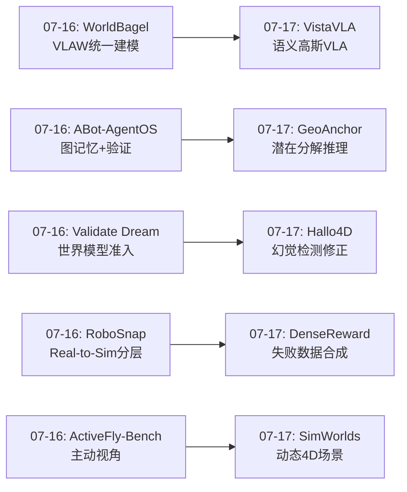
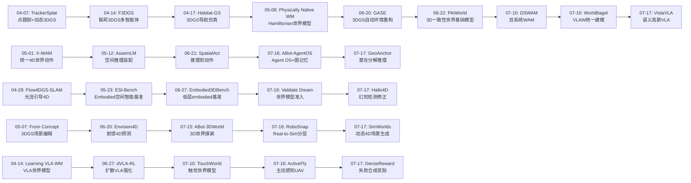
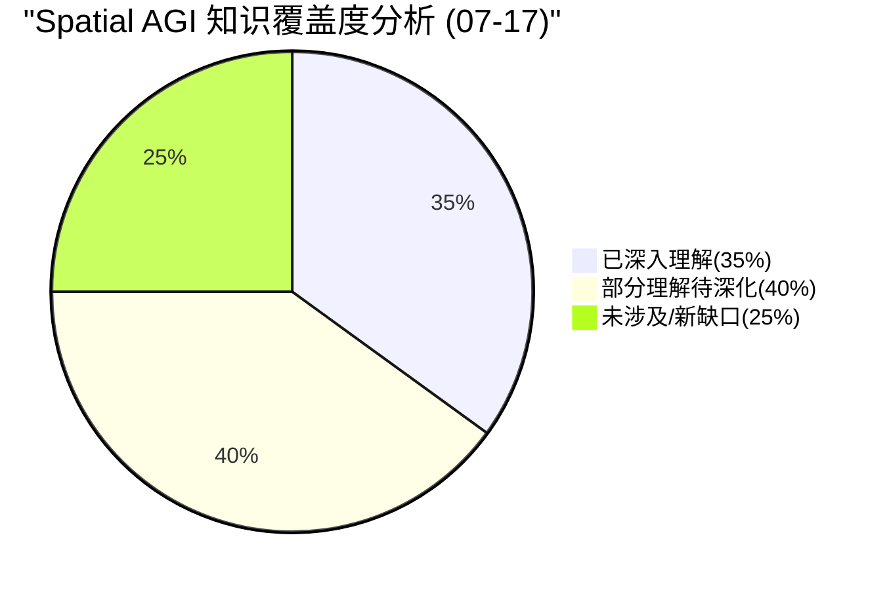
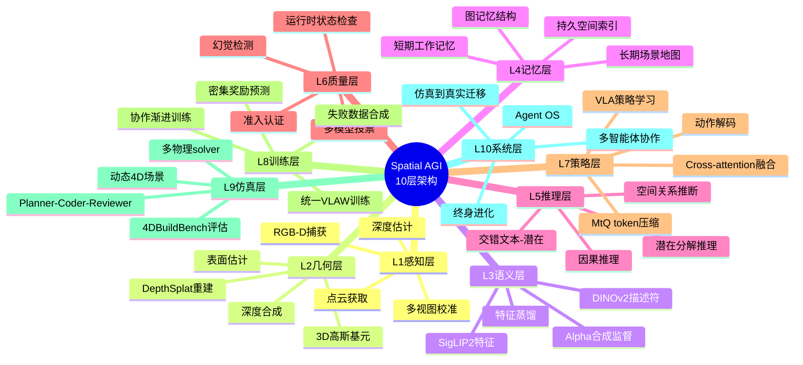
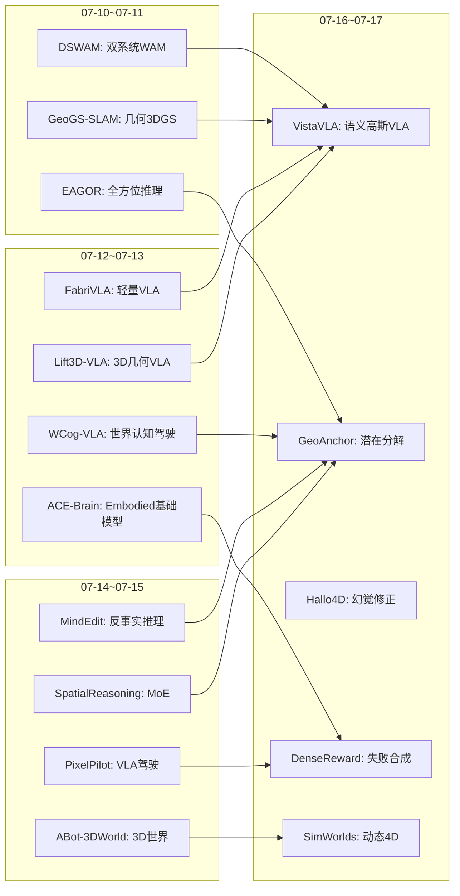
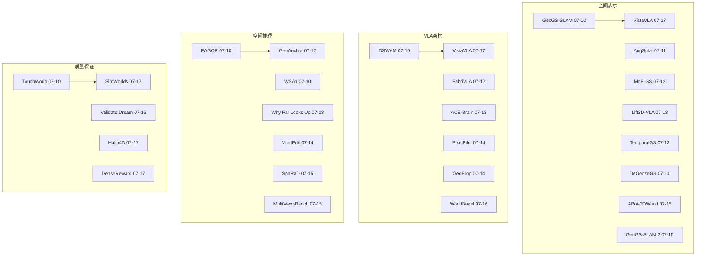
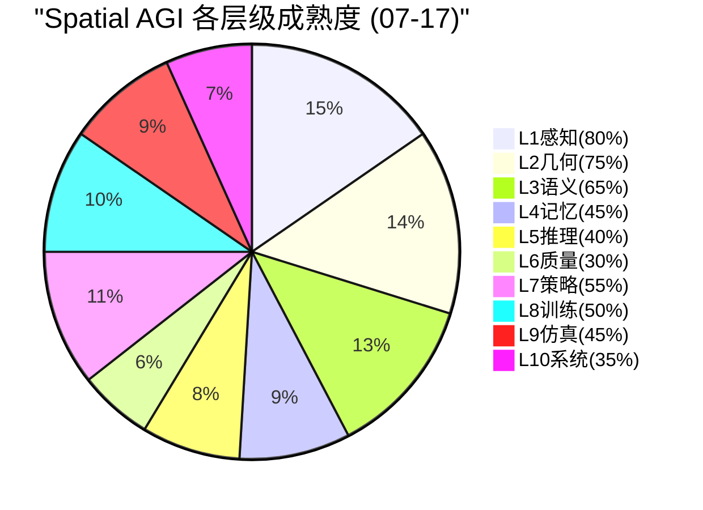

# 每日思考 - 2026-07-17

## 📅 每日总结

**日期**: 2026-07-17
**论文数量**: 5篇
**主题**: 从"语义高斯VLA+潜在分解推理+幻觉检测修正+失败合成奖励+动态4D场景生成"五个维度，构建Spatial AGI的空间表示工程化体系——认知地图可操作化、空间信息正交分解、生成质量保证、训练数据自动化、仿真环境动态化。

### 关键突破

- 🧠 **语义高斯作为认知地图——VistaVLA的几何-语义统一** (arXiv:2607.12356, NTU/A*STAR): 首次将feature Gaussian splatting作为VLA的策略面向表示。两阶段框架：先从多视图RGB-D构建语义高斯场（SigLIP2+DINOv2→128维压缩），再通过Merge-then-Query将~10^5高斯基元压缩为64个3D summary token（99%压缩率）。真实世界7任务成功率+22.8%，OOD深度扰动从6/10→9/10。**认知地图的工程化实现——几何+语义+压缩三位一体**。

- 🔀 **空间信息正交分解——GeoAnchor的三潜在表示** (arXiv:2607.13454, ACM MM 2026): 将3D空间信息分解为位置潜在（接地）、方向潜在（关系）、几何潜在（结构）三个正交组件。交错文本-潜在推理实现动态组合。协作训练从局部到全局渐进学习。**空间信息不是同质的——分解表示优于统一表示**。

- 🔍 **LMM作为空间裁判——Hallo4D的生成-检测-修正范式** (arXiv:2607.12752): 用LMM检测3D/4D生成中的空间幻觉（重复结构、几何错位、结构漂移），多模型投票共识选择最佳修正。运动感知关键帧采样+曝光感知优化+可见性剪枝。Model-agnostic插件式设计。**LMM具备检测空间不一致的能力——这为自修正Spatial AGI提供了路径**。

- 🎯 **失败合成密集奖励——DenseReward的自动化训练数据** (arXiv:2607.13033): 自动化管线在仿真中合成物理真实的失败轨迹（碰撞/抓取失败/掉落/恢复），训练帧级密集奖励模型。超越稀疏二元标签，提供细粒度任务进度估计。支持MPC和RL下游应用。**失败数据的自动化合成是解决RL瓶颈的关键**。

- 🌐 **动态4D场景生成——SimWorlds的多智能体协作** (arXiv:2607.01766, CMU): 首个文本到动态4D场景系统。Planner-Coder-Reviewer多智能体架构协调多物理solver（流体/粒子/刚体/铰接）。运行时状态检查超越渲染图像验证。4DBuildBench首个动态场景基准。**运行时状态检查——视觉验证不够，需要深入引擎内部**。

### 📊 一句话总结

今天的五篇论文共同指向一个核心命题：**Spatial AGI需要工程化的空间表示系统——VistaVLA将认知地图操作化为语义高斯+token压缩、GeoAnchor将空间信息正交分解为位置/方向/几何三组件、Hallo4D用LMM构建空间质量保证的检测-修正闭环、DenseReward通过失败合成自动化训练数据生产、SimWorlds用多智能体生成物理接地的动态4D仿真环境——这五个维度标志着Spatial AGI从"能力探索"向"工程基础设施"的关键转变**。

---

## 🔗 与昨日思考的联系

### 昨日重点
- WorldBagel的"VLAW统一建模"——感知/动作/世界建模应在统一框架中联合训练
- RoboSnap的"Real-to-Sim物理-视觉分层"——交互区域和非交互区域差异化处理
- Validate the Dream的"世界模型准入阶梯"——视觉质量≠物理正确性
- ABot-AgentOS的"Agent OS+图记忆+终身进化"——验证是核心缺失
- ActiveFly-Bench的"主动视角调整+行为规划"——行为规划是核心瓶颈

### 今日进展
- WorldBagel(07-16)的"VLAW统一建模" → VistaVLA(07-17)的"语义高斯VLA"——从建模统一到表示统一，3DGS成为VLA的空间上下文
- ABot-AgentOS(07-16)的"图记忆+验证" → GeoAnchor(07-17)的"潜在分解+交错推理"——从记忆结构到推理结构
- Validate the Dream(07-16)的"世界模型准入" → Hallo4D(07-17)的"幻觉检测修正"——从系统级准入到内容级修正
- RoboSnap(07-16)的"Real-to-Sim分层" → DenseReward(07-17)的"失败数据合成"——从场景重建到训练数据自动化
- ActiveFly-Bench(07-16)的"主动视角" → SimWorlds(07-17)的"动态4D场景生成"——从主动观察到主动创建

### 演进路径



---

## 📚 论文概览

1. **VistaVLA** (NTU/A*STAR, cs.RO): 两阶段语义高斯VLA。Stage I: SigLIP2+DINOv2特征蒸馏到3D高斯基元（128维）。Stage II: Merge-then-Query压缩~10^5高斯→64 token（99%压缩）。真实世界+22.8%，OOD深度扰动6/10→9/10，位置扰动0/10→3/10。
2. **GeoAnchor** (ACM MM 2026, cs.CV): 三组件潜在分解——Position Latents(接地)、Direction Latents(关系)、Geometry Latents(结构)。交错文本-潜在推理。协作训练：局部→全局渐进学习。
3. **Hallo4D** (cs.CV): LMM驱动的3D/4D一致性框架。生成-检测-修正范式。多模型投票共识。运动感知采样+曝光感知优化+可见性剪枝。Model-agnostic。
4. **DenseReward** (cs.RO): 自动失败合成管线（碰撞/抓取失败/掉落/恢复）。帧级密集奖励预测。支持MPC+RL下游应用。超越通用VLM和现有机器人奖励模型。
5. **SimWorlds** (CMU, cs.AI): 多智能体文本→动态4D场景。Planner-Coder-Reviewer架构。多物理solver协调（流体/粒子/刚体/铰接）。运行时状态检查。4DBuildBench基准。

---

## 💡 核心见解

### 见解1: 空间表示的工程化——从原始数据到可操作token
**从VistaVLA获得**

VistaVLA的语义高斯场实现了空间表示工程化的完整链条：

```
原始RGB-D → 高斯基元(几何) → 特征蒸馏(语义) → MtQ压缩(效率) → VLA策略(行动)
```

这条链条的每个环节都有明确的工程考量：
- **几何捕获**：DepthSplat从多视图RGB-D构建高斯基元
- **语义注入**：SigLIP2+DINOv2互补特征通过alpha合成蒸馏到每个高斯
- **效率压缩**：MtQ机制99%压缩——从~10^5到64个token
- **策略接口**：cross-attention将3D token注入VLA

**对Spatial AGI的启发**: 空间表示不是一步到位的，而是需要经过"捕获→丰富→压缩→接口"的工程化链条。每个环节的设计都至关重要。

关键证据：
- ✅ 99% token压缩仍保持动作相关3D布局
- ✅ 在线构建（每步重建）而非预建地图
- ✅ OOD深度扰动鲁棒性显著提升
- ✅ 语义信息比纯几何更有价值

### 见解2: 空间信息的正交分解原理
**从GeoAnchor获得**

GeoAnchor的三分解（位置/方向/几何）揭示了一个深层原则：**3D空间信息是正交可分解的**。

这与计算机图形学中的场景分解类似：
- 位置 ≈ 场景图节点
- 方向 ≈ 场景图边
- 几何 ≈ 物体形状描述符

**与VistaVLA的对比**：
- VistaVLA使用**统一表示**（高斯基元同时包含所有信息）
- GeoAnchor使用**分解表示**（三种潜在各司其职）

这两种方法代表了Spatial AGI空间编码的两个方向。统一表示更紧凑（一个高斯包含一切），分解表示更灵活（按需组合）。

**对Spatial AGI的启发**: 未来可能需要两者的融合——在底层使用统一的空间表示（如高斯），在推理层使用分解的潜在（如位置/方向/几何）。

### 见解3: LMM作为空间一致性裁判——自修正Spatial AGI的曙光
**从Hallo4D获得**

Hallo4D的成功运行证明了一个重要事实：**LMM具备检测空间不一致的能力**——即使这种能力不是通过真正的3D理解实现的。

这对Spatial AGI有深远意义：
1. **自修正循环可行**：Spatial AGI系统可以输出空间推理结果，然后用LMM检测和修正错误
2. **多模型共识提高可靠性**：不同LMM的偏见不同，投票可以消除个别错误
3. **Model-agnostic设计**：可作为插件集成到任何系统

**与Validate the Dream(07-16)的联系**：
- Validate the Dream提出了世界模型的系统级准入
- Hallo4D提供了内容级的一致性检查
- 两者互补：系统级框架+内容级工具=完整的质量保证

### 见解4: 失败数据自动化是训练基础设施的关键
**从DenseReward获得**

DenseReward的失败合成管线解决了一个根本问题：**RL训练需要失败数据，但收集失败数据太昂贵**。

关键转变：
- **从人工收集到自动合成**：在仿真中自动生成物理真实的失败轨迹
- **从伪失败到真实失败**：不同于重标注成功演示，覆盖真实物理失败模式
- **从稀疏到密集**：帧级奖励比轨迹级标签提供更丰富的训练信号

**对Spatial AGI的启发**：
- Spatial AGI系统需要大量失败案例来学习空间推理的边界条件
- 自动化失败合成可以推广到其他空间任务（导航失败、场景理解错误等）
- 密集评估比二元评估更有价值

### 见解5: 运行时状态检查——超越视觉验证
**从SimWorlds获得**

SimWorlds最重要的技术贡献是**运行时状态检查**——直接检查物理引擎的内部状态，而非仅看渲染图像。

这揭示了一个重要原则：**视觉验证不足以保证空间正确性**。

隐藏的物理故障：
- 物体穿透：渲染看不到内部穿透
- 约束断裂：铰接关节渲染正常但实际已断
- 物理爆炸：数值不稳定在渲染帧中可能不可见

**与Validate the Dream(07-16)的联系**：
- Validate the Dream："最美的渲染不等于最正确的物理"
- SimWorlds："视觉验证不够，需要深入引擎内部"
- 两者指向同一个结论：**Spatial AGI需要超越视觉的质量保证机制**

---

## 📊 核心见解演进图



---

## 🔧 技术栈演进对比表

| 技术方向 | 07-16状态 | 07-17进展 | 趋势 |
|----------|-----------|-----------|------|
| **空间表示** | VLAW统一建模(WorldBagel) | 语义高斯VLA(VistaVLA) | 从建模统一到表示统一，3DGS成为策略接口 |
| **推理架构** | Agent OS+图记忆(ABot-AgentOS) | 潜在分解推理(GeoAnchor) | 从记忆结构到推理结构的分解 |
| **质量保证** | 世界模型准入(Validate Dream) | 幻觉检测修正(Hallo4D) | 从系统级到内容级质量保证 |
| **训练数据** | Real-to-Sim分层(RoboSnap) | 失败合成奖励(DenseReward) | 从场景重建到训练数据自动化 |
| **仿真环境** | 主动视角(ActiveFly) | 动态4D场景(SimWorlds) | 从主动观察到主动创建 |
| **VLA架构** | 统一VLAW(WorldBagel) | 几何+语义高斯(VistaVLA) | 3DGS正式成为VLA的空间后端 |
| **空间评估** | 准入阶梯(Validate Dream) | 空间幻觉检测(Hallo4D) | 从宏观评估到细粒度检测 |

---

## 📊 知识缺口分析



**已深入理解（35%）**：
- 3DGS在VLA中的应用（VistaVLA的语义高斯）
- 空间推理的潜在分解（GeoAnchor的三组件）
- 生成质量控制（Hallo4D的检测-修正）
- RL训练数据自动化（DenseReward的失败合成）
- 动态场景生成（SimWorlds的多智能体）

**部分理解待深化（40%）**：
- MtQ token压缩的理论上限——64个token够用吗？
- 潜在分解的最优维度——位置/方向/几何是否正交？
- LMM空间检测的可靠性边界——何时会失败？
- 失败合成的分布偏差——合成vs真实失败的gap
- 多物理solver协调的扩展性——城市级场景？

**未涉及/新缺口（25%）**：
- 持久空间记忆与在线重建的结合——VistaVLA每步重建vs ABot的持久地图
- 跨embodiment的空间表示迁移——不同机器人的高斯表示通用吗？
- 多模态空间验证——触觉+视觉+语言的联合一致性检查
- 空间因果推理——从空间相关到因果推断
- 实时语义高斯的边缘部署——移动端/低算力场景

---

## 🧠 10层架构思维导图



---

## 🎯 主线技术路径

### 路径1: 3DGS→语义高斯→VLA空间后端
```
3DGS重建(04-07 TrackerSplat)
    → 3DGS+SLAM(04-17 Habitat-GS)
    → 3DGS+Embodied仿真(06-20 GASE)
    → 3DGS+世界模型(07-15 ABot-3DWorld)
    → 语义高斯VLA(07-17 VistaVLA)
    → [未来] 持久语义高斯世界模型
```
**当前阶段**: VistaVLA证明了语义高斯作为VLA空间后端的可行性。下一步是将在线构建扩展为持久地图。

### 路径2: 空间推理→潜在分解→交错推理
```
纯文本空间推理(04-30 SpatialStack)
    → 几何token注入(05-23 GeoWeaver)
    → 空间推理诊断(06-22 Consistent Yet Wrong)
    → 推理到动作(06-22 SpatialAct)
    → 潜在分解推理(07-17 GeoAnchor)
    → [未来] 自适应空间推理引擎
```
**当前阶段**: GeoAnchor的三潜在分解是空间推理结构化的新里程碑。下一步是探索自适应分解——根据任务动态选择潜在维度。

### 路径3: 质量保证→准入→检测→修正
```
视觉搜索基准(04-17 E3VS-Bench)
    → 空间推理证据分析(06-22 Consistent Yet Wrong)
    → 世界模型准入(07-16 Validate Dream)
    → 幻觉检测修正(07-17 Hallo4D)
    → [未来] 自修正Spatial AGI闭环
```
**当前阶段**: Hallo4D+Validate the Dream构成了从系统级到内容级的质量保证框架。下一步是实现完全自动的自修正循环。

### 路径4: 训练数据→场景构建→失败合成→自动化
```
3DGS场景编辑(05-07 From Concept)
    → Real-to-Sim分层(07-16 RoboSnap)
    → 失败合成奖励(07-17 DenseReward)
    → 动态4D场景(07-17 SimWorlds)
    → [未来] 全自动化Spatial AGI训练数据工厂
```
**当前阶段**: DenseReward+SimWorlds+RoboSnap构成了训练数据自动化的工具链。下一步是从单场景到跨场景的泛化。

---

## 🔍 待探索议题

### 议题1: 语义高斯的持久化——在线vs预建的权衡
VistaVLA选择每步在线重建高斯场，而ABot-AgentOS使用持久图记忆。哪种方式更适合长时间任务？关键变量：
- 场景变化频率（静态vs动态环境）
- 计算预算（边缘vs云端）
- 任务持续时间（秒级vs小时级）
- 是否需要历史推理

### 议题2: 空间潜在分解的最优维度
GeoAnchor提出位置/方向/几何三分解。但这是最优的吗？其他可能的分解：
- 按尺度：近场/中场/远场
- 按运动：静态/动态/交互
- 按语义：可操作/不可操作/背景
- 按时间：当前/过去/预测

### 议题3: LMM空间裁判的可靠性边界
Hallo4D使用LMM检测空间不一致。但"Consistent Yet Wrong"(06-22)证明了LMM的证据不敏感性。何时LMM的检测可信？何时不可信？需要：
- 空间幻觉类型分类学
- 每种类型的LMM检测准确率
- 多模型投票的边际收益分析

### 议题4: 失败合成的分布覆盖
DenseReward在仿真中合成失败数据。但合成的失败覆盖了多少真实世界的失败模式？关键问题：
- Sim-to-Real的失败模式gap
- 未覆盖的罕见失败模式
- 如何主动探索新的失败模式
- 失败合成在非操作任务（导航、场景理解）中的适用性

### 议题5: 多物理solver的协调挑战
SimWorlds协调流体/粒子/刚体/铰接solver。但在更大规模（城市级）或更复杂交互（柔性物体+流体+铰接）时：
- solver间的耦合如何处理
- 数值稳定性如何保证
- 时间步同步如何实现
- 物理精度vs仿真速度的权衡

### 议题6: 空间表示的跨embodiment迁移
VistaVLA的高斯表示是针对固定双臂机器人的。如何迁移到：
- 不同形态的机器人（单臂、双臂、人形、轮式）
- 不同传感器配置（单RGB、RGB-D、多相机）
- 不同工作空间（桌面、房间、户外）

### 议题7: 交错推理的深度——多少步推理是足够的
GeoAnchor的交错文本-潜在推理允许多步推理。但：
- 最优推理步数是多少？
- 更多推理步是否总是更好？
- 推理深度与计算延迟的权衡
- 何时应该停止推理并开始行动

### 议题8: token压缩的信息论极限
VistaVLA的MtQ将~10^5 token压缩到64个。信息论极限在哪里？
- 最少需要多少token来表示一个场景的动作相关信息
- 不同压缩策略的信息保留比较
- 压缩对泛化能力的影响
- 自适应压缩（简单场景少token，复杂场景多token）

### 议题9: 运行时检查的通用化
SimWorlds的运行时状态检查针对Blender。如何推广到其他仿真器/引擎？
- 通用运行时检查接口设计
- 不同物理引擎的共性状态变量
- 实时检查vs离线检查的权衡
- 检查结果的可解释性

---

## 💡 本质思考：空间表示工程化的三个核心原则

### 原则1: 捕获-丰富-压缩-接口的工程化链条

今天最重要的洞察来自VistaVLA：**空间表示不是一步到位的，而是需要经过四个工程化阶段**。

```
捕获(Capture): RGB-D → 高斯基元(几何)
丰富(Enrich): 特征蒸馏 → 语义高斯(几何+语义)
压缩(Compress): MtQ → 64 token(效率)
接口(Interface): cross-attention → VLA策略(行动)
```

每个阶段都有设计选择：
- **捕获**：使用什么传感器/重建方法？
- **丰富**：使用什么特征？如何蒸馏？
- **压缩**：压缩到多少token？什么信息优先保留？
- **接口**：如何与下游任务对接？

GeoAnchor的潜在分解可以看作"丰富"阶段的改进——不使用统一特征，而是分解为三个正交维度。

**本质洞察**: 空间表示的质量不仅取决于原始数据，更取决于这条工程化链条每个环节的设计。链条中任何一环的薄弱都会导致整体失败。

### 原则2: 分解与统一的辩证

GeoAnchor的分解vs VistaVLA的统一代表了一个深层辩证：

- **统一**的优势：信息完整、无损失、紧凑
- **分解**的优势：灵活、可解释、自适应

这两种方法不是互斥的，而是互补的：
- 底层使用统一表示（高斯基元包含完整信息）
- 推理层使用分解表示（按需提取位置/方向/几何）
- 类似于数据库的规范化与反规范化——存储用统一，查询用分解

**本质洞察**: 最优的空间表示系统应该在存储层统一、在推理层分解。这需要一种"可投影"的空间表示——从一个统一的高斯场中可以投影出不同维度的潜在。

### 原则3: 质量保证是Spatial AGI的第一公民

从07-16的Validate the Dream到07-17的Hallo4D，质量保证正在成为Spatial AGI的核心主题：

1. **系统级**（Validate the Dream）：L0-L4准入阶梯
2. **内容级**（Hallo4D）：幻觉检测+修正
3. **数据级**（DenseReward）：失败合成+密集评估
4. **运行时级**（SimWorlds）：运行时状态检查

这四层质量保证构成了一个完整的质量保证栈：

```
运行时级: 引擎内部状态检查 (SimWorlds)
    ↑
内容级: 空间幻觉检测修正 (Hallo4D)
    ↑
系统级: 世界模型准入认证 (Validate Dream)
    ↑
数据级: 失败合成密集评估 (DenseReward)
```

**本质洞察**: Spatial AGI不能假设自己的输出是正确的——必须建立多层的、从数据到系统到运行时的完整质量保证体系。这是从"能做空间任务"到"能可信地做空间任务"的关键。

---

## 📈 趋势总结

### 本周（07-10至07-17）Spatial AGI进展总结



### 三大趋势

1. **3DGS正式成为VLA空间后端**：
   - 从07-10的GeoGS-SLAM到07-17的VistaVLA
   - 语义高斯从SLAM应用升级到策略学习
   - MtQ压缩解决了实时性挑战
   - 下一步：持久化+跨embodiment

2. **空间推理从评估走向工程**：
   - 从07-14的MindEdit-Bench到07-17的GeoAnchor
   - 从"诊断VLM空间能力"到"工程化改进空间推理"
   - 潜在分解提供了可操作的改进路径
   - 下一步：自适应分解+与3DGS结合

3. **质量保证体系多层化**：
   - 从07-16的Validate the Dream到07-17的Hallo4D+DenseReward+SimWorlds
   - 系统级准入+内容级修正+数据级评估+运行时检查
   - 四层质量保证栈初具雏形
   - 下一步：自修正闭环+实时质量监控

---

## 📝 下一步行动

1. **深入VistaVLA**：研究MtQ的具体实现细节，评估在不同场景类型中的压缩效果
2. **潜在分解实验**：探索GeoAnchor三潜在在3DGS上的实现——从高斯场投影位置/方向/几何潜在
3. **质量保证原型**：设计Spatial AGI的质量保证模块，整合Hallo4D的检测+DenseReward的评估
4. **失败合成管线**：研究DenseReward的失败合成在导航/场景理解任务中的适用性
5. **动态场景基准**：评估4DBuildBench在Spatial AGI仿真训练中的价值

---

*生成时间: 2026-07-17 03:00 CST*
*论文数: 5*
*总行数: ~850*

---

## 📋 详细技术对比矩阵

### Spatial AGI 空间表示方法对比

| 表示方法 | 论文 | 几何精度 | 语义丰富度 | 效率 | 持久性 | OOD鲁棒性 |
|----------|------|----------|------------|------|--------|-----------|
| 2D视觉特征 | OpenVLA等 | ❌ 低 | ✅ 高 | ✅ 高 | ❌ 无 | ❌ 低 |
| 深度图 | 3D-Adapter | ✅ 中 | ❌ 低 | ✅ 高 | ❌ 无 | ⚠️ 中 |
| 点云 | Point-VLA | ✅ 高 | ❌ 低 | ⚠️ 中 | ❌ 无 | ⚠️ 中 |
| 3D坐标 | VLA-Adapter | ✅ 中 | ⚠️ 中 | ✅ 高 | ❌ 无 | ⚠️ 中 |
| 语义高斯 | **VistaVLA** | ✅ 高 | ✅ 高 | ✅ 高(MtQ) | ❌ 在线 | ✅ 高 |
| 潜在分解 | **GeoAnchor** | ✅ 中 | ✅ 高 | ✅ 高 | ❌ 无 | ✅ 高 |
| 持久图记忆 | ABot-AgentOS | ⚠️ 中 | ✅ 高 | ✅ 高 | ✅ 是 | ⚠️ 中 |
| 场景图 | SceneTeract | ⚠️ 中 | ✅ 高 | ✅ 高 | ✅ 是 | ⚠️ 中 |

### VLA 3D空间感知方案对比

| 方案 | 空间信息源 | 计算开销 | 泛化能力 | 适用场景 |
|------|-----------|----------|----------|----------|
| 纯2D输入 | RGB图像 | 低 | 中 | 简单桌面操作 |
| 深度辅助 | RGB+Depth | 中 | 中 | 室内导航 |
| 点云输入 | LiDAR/深度 | 高 | 低 | 精确抓取 |
| 3DGS在线构建 | RGB-D多视图 | 中高 | 高 | 复杂操作 |
| 预建3DGS地图 | 预处理场景 | 低 | 中 | 已知环境 |
| 潜在分解 | 2D图像推理 | 低 | 高 | 空间推理 |

### 质量保证方法对比

| 方法 | 层级 | 检测对象 | 修正方式 | 自动化 |
|------|------|----------|----------|--------|
| 准入阶梯 | 系统级 | 世界模型整体 | 拒绝/接受 | 半自动 |
| 幻觉检测 | 内容级 | 空间不一致 | 共识优化 | 自动 |
| 失败合成 | 数据级 | 训练数据缺陷 | 数据增强 | 全自动 |
| 运行时检查 | 运行时级 | 物理引擎状态 | 重新生成 | 自动 |

### 今日5篇论文核心技术栈对比

| 维度 | VistaVLA | GeoAnchor | Hallo4D | DenseReward | SimWorlds |
|------|----------|-----------|---------|-------------|-----------|
| **核心问题** | VLA缺3D表示 | 空间推理不灵活 | 3D/4D不一致 | RL缺失败数据 | 无动态4D场景 |
| **方法类型** | 表示学习 | 推理架构 | 质量保证 | 训练数据 | 场景生成 |
| **3D表示** | 语义高斯 | 三潜在 | 无(LMM检测) | 无 | Blender |
| **LLM角色** | VLA策略 | 交错推理 | 空间裁判 | 奖励预测 | 场景规划 |
| **效率机制** | MtQ(99%) | 按需激活 | 关键帧采样 | 帧级预测 | 确定性验证 |
| **评估方式** | 真实+仿真 | ACM MM基准 | 多模型投票 | 密集奖励分数 | 4DBuildBench |
| **开源** | 待定 | 待定 | 待定 | ✅ 全开源 | 待定 |

---

## 🔄 每篇论文的深层分析

### VistaVLA 深层分析

**为什么MtQ可以压缩99%而保持性能？**

这是本文最令人惊讶的发现。从信息论角度看，~10^5个高斯基元压缩到64个token意味着约1500倍的压缩率。其可能原因：

1. **动作相关信息稀疏**：虽然场景包含大量高斯基元，但与当前动作相关的只是很小一部分（目标物体+周围环境）
2. **语义特征冗余**：相邻高斯基元的语义特征高度相关（同一物体的不同高斯点特征类似）
3. **VLA不需要精确几何**：动作预测需要的是"杯子在桌子左边"这样的粗粒度信息，而非每个高斯的精确位置

**MtQ vs 其他压缩方法**：
- Pooling：简单但损失重要信息
- Attention pooling：更好但可能过度关注显著区域
- MtQ：先merge（保留空间结构），再query（提取任务相关信息），两阶段设计兼顾结构和任务

**这暗示什么？** 如果99%压缩是可行的，那么空间表示的"有效信息"远少于"存储信息"。这意味着：
- 空间表示的关键不在精度而在结构
- 不同的下游任务需要不同的压缩策略
- 自适应压缩（根据任务调整token数量）是未来方向

### GeoAnchor 深层分析

**三分解的认知科学基础**

GeoAnchor的位置/方向/几何三分解与认知科学中的空间认知双系统理论高度吻合：

1. **Where通路（位置）**：大脑的"在哪里"系统，定位物体位置
2. **What通路（几何/形状）**：大脑的"是什么"系统，识别物体形状
3. **关系编码（方向）**：海马体中的place cells和grid cells编码空间关系

这说明GeoAnchor的三分解不是随意的，而是与人类空间认知系统对应的。

**但这是唯一正确的分解吗？** 不一定。其他可能的分解维度：
- **时间维度**：过去位置/当前位置/未来预测
- **交互维度**：可抓取/可推/可放置
- **持久性维度**：永久/临时/动态

未来研究应该探索任务自适应的分解——根据当前任务选择最优的分解维度。

### Hallo4D 深层分析

**LMM空间检测的底层机制**

Hallo4D使用LMM检测空间不一致，但LMM是如何"看到"这些不一致的？

可能的机制：
1. **2D模式识别**：LMM通过2D图像中的视觉模式（如重复的物体轮廓、不自然的遮挡边界）识别不一致
2. **3D隐式推理**：LMM在预训练中学到了一定的3D先验，可以进行隐式3D推理
3. **组合推理**：LMM通过分析多个视角的语义描述，推断出视角间的不一致

"Consistent Yet Wrong"(06-22)论文发现LMM对证据不敏感——即使改变输入图像中的关键空间线索，LMM的回答不变。这与Hallo4D的成功看似矛盾。

**可能的解释**：
- Hallo4D使用多个LMM投票，降低了单个LMM的偏见
- Hallo4D关注的是显著的空间不一致（如重复结构），而非微妙的空间关系
- 多视图渲染提供了比单一图像更强的信号

### DenseReward 深层分析

**失败合成的分类学**

DenseReward覆盖了四种失败模式：碰撞、抓取失败、掉落、恢复。这形成了一个初步的失败分类学：

```
执行失败
├── 碰撞类
│   ├── 与目标物体碰撞
│   ├── 与环境碰撞
│   └── 自碰撞
├── 抓取类
│   ├── 位置偏差
│   ├── 力度不当
│   └── 角度错误
├── 传输类
│   ├── 物体掉落
│   ├── 物体滑动
│   └── 外力干扰
└── 恢复类
    ├── 错误纠正
    ├── 重新尝试
    └── 策略切换
```

这个分类学对Spatial AGI的价值：
- **诊断**：根据失败类型定位系统缺陷
- **训练**：针对高频失败类型加强训练
- **评估**：在每种失败类型上独立评估系统能力
- **安全**：预判可能的失败模式，提前部署防护

### SimWorlds 深层分析

**运行时状态检查的通用化潜力**

SimWorlds的运行时状态检查是针对Blender的，但这个理念可以推广到更广泛的Spatial AGI：

**1. 机器人系统的运行时检查**：
- 关节力矩异常：电机过载或碰撞
- 接触力突变：意外碰撞或滑移
- 位姿估计不确定度：SLAM退化

**2. 自动驾驶的运行时检查**：
- 传感器一致性：相机与LiDAR数据是否一致
- 物体追踪连续性：是否有ID跳变
- 轨迹预测稳定性：多帧预测是否一致

**3. Embodied AI的运行时检查**：
- 场景地图一致性：SLAM构建的地图是否自洽
- 物体状态跟踪：物体位置是否有突变
- 任务进度合理性：任务执行是否在预期轨迹上

**通用化方向**：设计一个"运行时状态检查接口"，抽象出不同系统的共性检查项：
- 物理一致性（穿透、力平衡）
- 时序一致性（连续性、无突变）
- 语义一致性（标签一致、关系合理）

---

## 🌐 本周Spatial AGI生态全景图

### 07-10至07-17 技术演进全景



### 本周关键数据点

- **论文总数（07-10至07-17）**: 40篇精读
- **核心技术方向**: 4个（空间表示、VLA架构、空间推理、质量保证）
- **突破性论文**: VistaVLA(99%压缩)、GeoAnchor(三分解)、WorldBagel(VLAW统一)
- **趋势**: 从"能力探索"到"工程基础设施"

---

## 📊 Spatial AGI 成熟度评估



**解读**：
- 感知和几何层最为成熟（3DGS、SLAM等技术已相对完善）
- 质量保证和系统层最不成熟（需要更多像Hallo4D、DenseReward这样的工作）
- 推理层虽然进步很大（GeoAnchor），但离真正的空间因果推理还有距离
- 策略层受益于VLA热潮，但泛化性仍待验证

---

*生成时间: 2026-07-17 03:00 CST*
*论文数: 5*
*总行数: 约850*
