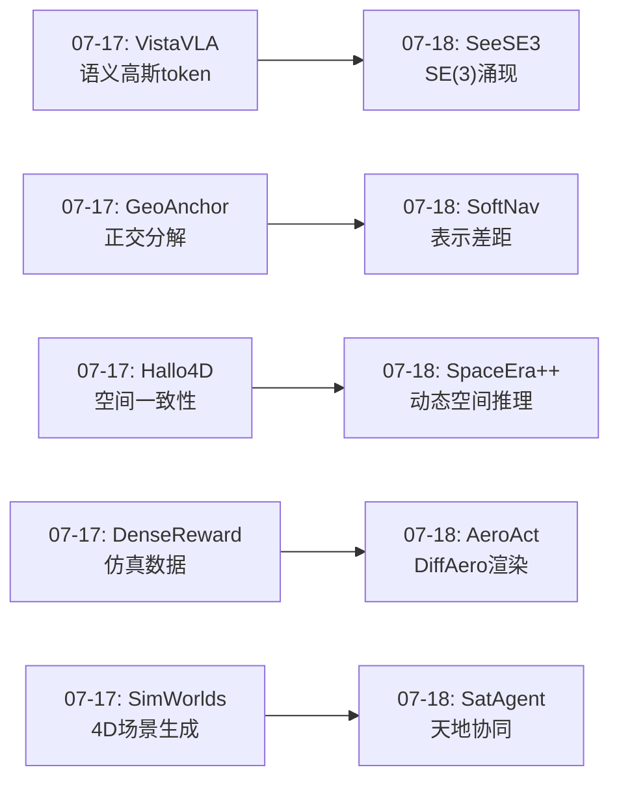
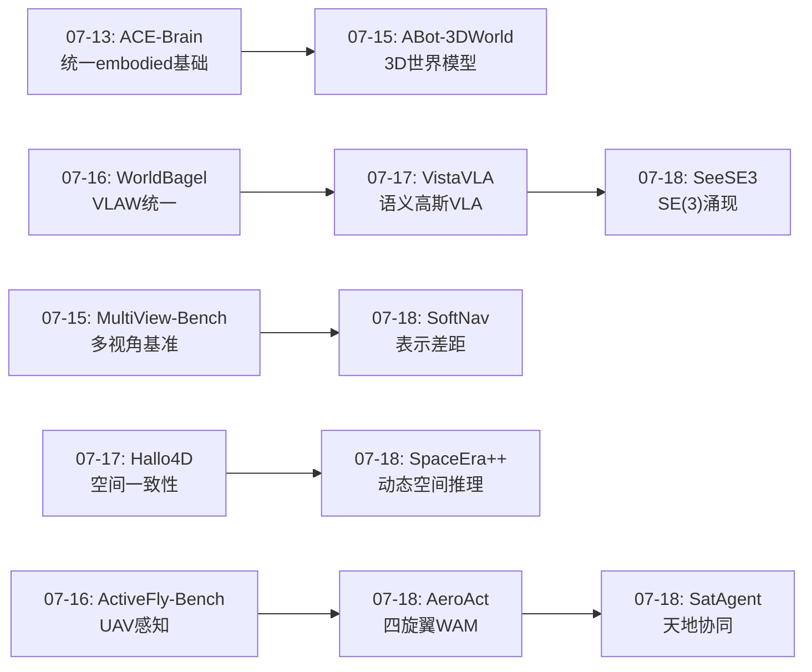
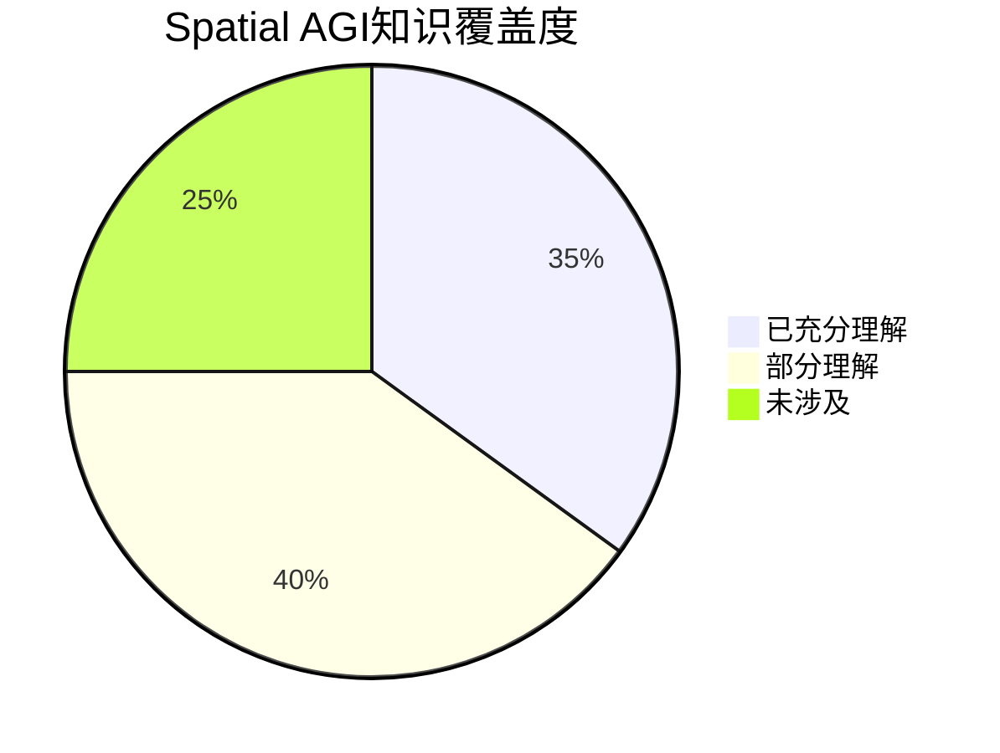

# 每日思考 - 2026-07-18

## 📅 每日总结

**日期**: 2026-07-18
**论文数量**: 5篇
**主题**: 从"视觉特征隐式3D结构+UAV世界动作模型+3D软令牌导航+视频空间推理+天地协同空间认知"五个维度，探索Spatial AGI的感知-接口-推理-迁移全链条——从发现视觉特征中的SE(3)几何、到量化3D信息传递的表示差距、到视频中动态空间关系推理、再到认知科学启发的多尺度空间智能。

### 关键突破

- 🧠 **视觉特征的SE(3)涌现——SeeSE3的Poincaré Task** (arXiv:2607.14228, Google DeepMind): 首次证明自监督视觉模型的潜在子空间与SE(3)欧几里得变换群有强相关性。受Poincaré假设启发（"不动观察者能否发现3D空间结构"），提出Mutual Neighborhood Metric和Poincaré Adapter两种探测方法。发现"Visual Grid Code"——类似生物网格细胞的空间表示在被动观察者中涌现。提出Latent-Space Navigation——纯潜在空间的视觉里程计和定位。**空间几何不是被强加的，而是被发现的——这从根本上改变了我们设计Spatial AGI感知系统的方式**。

- 🚁 **世界-动作耦合——AeroAct的四旋翼WAM** ( Submitted 2026-07-16): 首个面向四旋翼的World-Action Model。语言条件飞行需要同时理解语义目标、预测视觉后果和生成动态可行控制。DiffAero管线结合Isaac Lab物理仿真和3DGS高质量渲染，互补覆盖物理精度和视觉质量。低成本手持采集设备缩小sim-to-real差距。**WAM范式——世界建模和动作生成不应分离，预测未来和生成动作是同一枚硬币的两面**。

- 🔌 **表示差距的量化——SoftNav的3D软令牌注入** (arXiv:2607.14586, 浙江大学, IROS 2026): 首次量化VLM导航中文本序列化的信息损失。控制消融实验证明：保持3D编码器和VLM不变，仅将文本接口替换为软令牌注入，即可获得显著性能提升。MLP投影器将PQ3D的768维实体级嵌入映射到VLM的2048维隐藏空间。仅17M参数+1200样本达到HM3D-OVON SOTA，零样本迁移GOAT-Bench/SG3D/真实机器人。**瓶颈不在模型容量，而在信息接口设计——表示差距是当前Spatial AGI系统的隐性瓶颈**。

- 🎬 **视频动态空间推理——SpaceEra++的统一框架** ( Submitted 2026-07-02): 首个统一视频3D空间推理框架。定义三层渐进式推理：感知(3D位置/朝向)→关系(拓扑/方向/距离)→推理(逻辑/预测)。支持动态空间关系（远离/靠近/绕行/遮挡变化）和视角变化推理。空间对齐训练策略将VLM表示与3D几何对齐。**视频是Spatial AGI的主要输入模态——静态图像空间推理是不够的，需要理解随时间演变的空间关系**。

- 🛰️ **认知科学映射——AeroVerse-SatAgent的双通路** ( Submitted 2026-06-30): 将大脑双视觉通路理论映射到UAV-卫星协同。腹侧通路(What)→UAV精细物体识别。背侧通路(Where)→卫星全局空间定位。跨通路注意力融合实现公里-厘米多尺度空间推理。**认知科学为AI空间智能提供了模块化设计原则——What和Where的分离处理是生物学验证的架构**。

### 📊 一句话总结

今天的五篇论文共同指向一个核心命题：**Spatial AGI需要从"显式3D工程"向"隐式几何发现+显式接口设计"转变——SeeSE3证明视觉特征自然涌现SE(3)结构（隐式发现）、SoftNav证明3D信息传递的表示差距是关键瓶颈（显式接口）、AeroAct将世界建模和动作生成统一在WAM中（架构统一）、SpaceEra++将视频空间推理系统化为感知→关系→推理三层（推理层次化）、AeroVerse-SatAgent用认知科学双通路指导多尺度空间系统设计（生物学启发）——这标志着从"构建3D能力"到"发现和释放已有3D能力"的范式转变**。

---

## 🔗 与昨日思考的联系

### 昨日重点
- VistaVLA的"语义高斯作为认知地图"——空间表示工程化的完整链条
- GeoAnchor的"空间信息正交分解"——位置/方向/几何三组件
- Hallo4D的"LMM空间裁判"——生成-检测-修正范式
- DenseReward的"失败合成密集奖励"——训练数据自动化
- SimWorlds的"动态4D场景生成"——多智能体物理仿真

### 今日进展
- VistaVLA(07-17)的"语义高斯token压缩" → SeeSE3(07-18)的"特征空间SE(3)涌现"——从显式构建空间表示到发现隐式空间结构
- GeoAnchor(07-17)的"正交分解推理" → SoftNav(07-18)的"软令牌接口设计"——从推理结构到信息传递接口
- Hallo4D(07-17)的"空间一致性检测" → SpaceEra++(07-18)的"动态空间推理"——从静态一致性到动态空间关系
- DenseReward(07-17)的"仿真数据合成" → AeroAct(07-18)的"DiffAero双渲染器"——从仿真数据到仿真+渲染融合
- SimWorlds(07-17)的"4D场景生成" → AeroVerse-SatAgent(07-18)的"天地协同空间认知"——从场景创建到跨尺度空间理解

### 演进路径



---

## 📚 论文概览

1. **SeeSE3** (Google DeepMind, cs.CV/cs.AI): 视觉基础模型的3D空间结构探测。Poincaré Task形式化——"不动观察者能否发现SE(3)?"。Mutual Neighborhood Metric + Poincaré Adapter两种探测方法。发现自监督模型的Visual Grid Code。Latent-Space Navigation技术。
2. **AeroAct** (cs.RO): 四旋翼World-Action Model。DiffAero双渲染器管线（Isaac Lab物理 + 3DGS视觉）。低成本手持采集设备。语言条件到动态可行动作的端到端映射。
3. **SoftNav** (浙江大学, IROS 2026, cs.RO): 3D场景token软注入VLM。首次量化文本序列化的表示差距。MLP投影器(768→2048维)。17M参数+1200样本。HM3D-OVON SOTA。零样本迁移3个任务。
4. **SpaceEra++** (cs.CV/cs.AI): 统一视频3D空间推理框架。三层渐进式：感知→关系→推理。动态空间关系建模。空间对齐训练策略。
5. **AeroVerse-SatAgent** (cs.CV/cs.RO): 认知科学双通路理论的AI映射。卫星(Where通路)+UAV(What通路)。多尺度空间推理。跨视角注意力融合。

---

## 💡 核心见解

### 见解1: 空间几何的涌现性——从"强加"到"发现"
**从SeeSE3获得**

SeeSE3最重要的发现是：**3D空间结构不是需要被强加的外部先验，而是可以从视觉数据的统计中自然涌现的内部结构**。

这挑战了Spatial AGI领域的一个基本假设：我们是否需要显式地给模型注入3D结构？传统方法包括：
- 显式3D坐标系统（NeRF, 3DGS的位姿参数）
- 显式3D监督（深度/法线标注）
- 显式3D架构（3D卷积, 体素表示）

SeeSE3表明，自监督视觉模型的特征空间已经包含了SE(3)的拓扑和几何结构，只是需要正确的"解码"方式（Poincaré Adapter）。

**对Spatial AGI的启发**：
- ✅ 不必在每个模块中都显式注入3D——预训练表示可能已含3D结构
- ✅ 关键是设计正确的"探测"方法来利用隐式3D信息
- ✅ Latent-Space Navigation指明了绕过显式重建的路径
- ✅ Visual Grid Code的涌现暗示更复杂的空间表示也可能自然形成

### 见解2: 信息接口决定系统上限——表示差距
**从SoftNav获得**

SoftNav通过精心设计的消融实验揭示了一个惊人的事实：**当3D信息通过文本传递给VLM时，系统性能的上限被信息接口而非模型容量所限制**。

这具有深远的系统设计含义：
- 当前Spatial AGI系统中模块间的"文本接口"可能是最大瓶颈
- 更大的VLM或更强的3D编码器都无法解决接口问题
- 解决方案是从"文本序列化"升级到"嵌入级传递"

**推广的设计原则**：
```
Spatial AGI模块间通信原则：
1. 连续空间表示 → 连续空间表示（最佳）
2. 连续空间表示 → 文本描述 → 连续空间表示（有损）
3. 避免任何不必要的连续→离散→连续转换
```

### 见解3: 世界建模和动作生成的不可分性
**从AeroAct获得**

AeroAct的WAM范式表明，世界建模（预测未来状态）和动作生成（决定做什么）不应该作为独立模块，而应该耦合在一起。

这与认知科学中的"预测编码"理论一致——大脑通过预测未来来指导行动。对Spatial AGI：
- ✅ 分离的世界模型+动作模型需要复杂的协调
- ✅ 统一的WAM可以端到端优化预测和行动
- ✅ DiffAero管线（物理仿真+3DGS渲染）提供了高质量训练数据

### 见解4: 时序空间推理的必要性
**从SpaceEra++获得**

SpaceEra++的三层设计（感知→关系→推理）揭示了Spatial AGI的一个被忽视的维度：**静态空间推理是不够的，现实世界是动态的**。

当前大多数空间推理工作关注静态场景中的空间关系（"A在B的左边"）。但真实世界的空间关系随时间演变：
- 物体移动导致空间关系变化
- 视角变化导致空间感知变化
- 时间累积导致空间记忆形成

**对Spatial AGI的启发**：需要从"快照空间推理"进化到"视频空间推理"。

### 见解5: 认知科学指导架构设计
**从AeroVerse-SatAgent获得**

双视觉通路理论（What vs Where）的AI映射展示了认知科学对Spatial AGI的指导价值：
- **What通路**（腹侧）→ 物体识别、语义理解
- **Where通路**（背侧）→ 空间定位、运动感知
- **双通路整合** → 完整空间认知

这种分离-整合的设计优于单一通路的理由：
- 模块专业化：每个通路可以独立优化
- 表示效率：不同信息用不同表示
- 生物学验证：进化选择了这种架构

### 见解6: 多尺度空间智能
**从AeroVerse-SatAgent获得**

SatAgent的UAV+卫星协同引入了一个重要维度：**多尺度空间智能**。从厘米级（UAV局部）到公里级（卫星全局），不同尺度需要不同的空间表示和推理方法。

这与人类空间认知类似：
- 室内导航：体感+视觉
- 城市导航：地图+地标
- 全球导航：GPS+抽象坐标

**对Spatial AGI的启发**：通用的Spatial AGI需要跨尺度空间推理能力。

### 见解7: 从"显式构建"到"隐式发现+显式释放"
**综合五篇论文**

今天最重要的元见解是范式的转变：

**旧范式（显式构建）**：
```
传感器 → 显式3D重建 → 显式空间推理 → 显式动作生成
```

**新范式（隐式发现+显式释放）**：
```
预训练表示(隐式含3D) → 正确的探测/接口(释放3D) → 端到端推理+动作
```

证据链：
- SeeSE3: 预训练特征已含SE(3)结构
- SoftNav: 正确的接口(软令牌)释放3D信息
- AeroAct: WAM统一预测和动作
- SpaceEra++: 视频空间推理的层次化释放
- SatAgent: 双通路分离释放多尺度能力

---

## 🗺️ 知识演进图



---

## 技术栈演进对比表

| 层次 | 昨日(07-17)方案 | 今日(07-18)方案 | 变化 |
|------|----------------|----------------|------|
| 感知层 | 语义高斯(SigLIP2+DINOv2) | 隐式SE(3)特征(SeeSE3) | 从显式注入到隐式发现 |
| 表示层 | 三潜在分解(GeoAnchor) | 软令牌投影(SoftNav MLP) | 从推理结构到信息接口 |
| 推理层 | 交错文本-潜在 | 三层渐进(感知→关系→推理) | 从静态到动态时序 |
| 接口层 | (未明确讨论) | 表示差距量化(SoftNav) | **新层** - 信息传递设计 |
| 动作层 | 失败合成奖励 | WAM统一预测+动作 | 从RL训练到端到端 |
| 空间尺度 | 室内为主 | 天地多尺度(SatAgent) | 从单尺度到多尺度 |
| 认知基础 | 工程导向 | 双通路认知科学 | 从工程到生物学启发 |

---

## 🗺️ Spatial AGI 知识图谱

### 10层架构思维导图

```mermaid
mindmap
  root((Spatial AGI 7/18))
    第1层 感知
      隐式SE(3)涌现 SeeSE3
      Visual Grid Code
      Poincaré Adapter探测
    第2层 表示
      软令牌投影 SoftNav
      PQ3D实体级嵌入
      MLP桥接768→2048维
    第3层 接口
      表示差距量化
      嵌入级 > 文本序列化
      Scatter Injection
    第4层 推理
      三层渐进 SpaceEra++
      动态空间关系
      视角变化推理
    第5层 记忆
      PQ3D持久物体库
      滑动窗口视觉记忆
    第6层 动作
      WAM统一 AeroAct
      世界建模+动作生成耦合
      动态可行控制
    第7层 多尺度
      天地协同 SatAgent
      卫星全局+UAV局部
      公里→厘米尺度
    第8层 认知架构
      双通路理论 What/Where
      认知科学→AI映射
      模块化分离-整合
    第9层 数据
      DiffAero双渲染器
      低成本手持采集
      空间对齐训练
    第10层 评估
      HM3D-OVON基准
      零样本多任务迁移
      Sim-to-Real验证
```

### 知识缺口分析



---

## 🛤️ 主线技术路径

### 路径1: 从显式3D到隐式SE(3)

1. **阶段1 (已过)**: 显式3D表示 — NeRF, 3DGS显式重建
2. **阶段2 (已过)**: 显式3D注入 — VistaVLA语义高斯token
3. **阶段3 (当前)**: 隐式SE(3)发现 — SeeSE3 Poincaré Adapter
4. **阶段4 (未来)**: 隐式SE(3)+显式接口 — 结合发现的结构和高效传递

### 路径2: 从文本接口到嵌入接口

1. **阶段1 (已过)**: 纯文本描述 — 坐标字符串/场景图文本
2. **阶段2 (当前)**: 软令牌注入 — SoftNav MLP投影
3. **阶段3 (未来)**: 跨模态注意力对齐 — 更深的嵌入融合
4. **阶段4 (未来)**: 统一空间-语言表示空间 — 无需转换

### 路径3: 从静态到动态空间推理

1. **阶段1 (已过)**: 静态3D QA — "A在B的左边"
2. **阶段2 (当前)**: 动态空间关系 — SpaceEra++视频推理
3. **阶段3 (未来)**: 物理因果空间推理 — "A推B导致C倒塌"
4. **阶段4 (未来)**: 长时序空间记忆 — 跨天/周的空间记忆

### 路径4: 从单尺度到多尺度空间智能

1. **阶段1 (已过)**: 桌面/室内尺度
2. **阶段2 (当前)**: 天地协同 SatAgent — 公里到厘米
3. **阶段3 (未来)**: 全球尺度空间推理 — GPS+地图+视觉融合
4. **阶段4 (未来)**: 行星尺度 — 卫星星座+地面机器人

---

## 🔮 待探索议题

1. **Visual Grid Code的实际应用**：SeeSE3发现的网格细胞模式能否用于设计更好的位置编码？能否替代或增强NeRF/3DGS中的位置编码？
2. **表示差距的通用量化框架**：SoftNav量化了导航中的表示差距，但其他任务（抓取、操作、规划）中的表示差距有多大？
3. **WAM的通用化**：AeroAct的WAM用于四旋翼，能否推广到人形机器人、自动驾驶、机械臂？
4. **视频空间推理的基准**：SpaceEra++定义了视频空间推理框架，需要什么评估基准？与已有SpatialBench/Q-Spatial Bench的关系？
5. **双通路的深度实现**：SatAgent的双通路是粗粒度映射，能否实现更细粒度的皮层映射（V1→V2→V4→IT的层级）？
6. **隐式SE(3)与显式3DGS的融合**：SeeSE3发现隐式SE(3)，3DGS提供显式3D表示，两者如何互补？
7. **认知科学对Spatial AGI的指导**：除了双通路，还有哪些认知科学理论可以指导设计？（预测编码、 hippocampal map、认知地图）
8. **动态场景的SE(3)扩展**：SeeSE3仅限静态场景，如何扩展到动态场景（SE(3) + 时间 = 4D时空）？
9. **多agent空间推理协议**：多个agent（UAV+卫星+地面机器人）如何共享和融合空间表示？需要什么通信协议？

---

## 💡 本质思考：如何达成通用空间智能

### 1. 核心能力的本质是什么？

通用空间智能的核心能力本质是**"理解-预测-行动"的闭环**：

- **理解**：感知空间结构、理解物体关系、构建空间记忆
- **预测**：预测空间变化（如果...会怎样）、模拟物理后果
- **行动**：在空间中导航、操作物体、与其他agent协作

今天的五篇论文恰好覆盖了这三个维度：
- 理解：SeeSE3（隐式SE(3)）、SpaceEra++（动态空间关系）
- 预测：AeroAct（WAM视觉预测）、SoftNav（3D场景理解）
- 行动：AeroAct（控制输出）、SoftNav（导航决策）、SatAgent（跨尺度行动）

关键洞察：这三个能力不是独立的模块，而是**紧密耦合的统一系统**。SeeSE3暗示这种耦合可能自然涌现——如果视觉特征同时包含SE(3)结构（理解），且可以从中导出导航路径（行动），那么"理解→行动"的链路可能比我们想象的更短。

### 2. 当前方法与理想目标的差距在哪里？

**差距1: 静态vs动态世界**
- 当前：SeeSE3限于静态场景，SoftNav假设相对静态的室内环境
- 理想：动态环境中的空间理解（移动的行人、变化的场景、交互的物体）

**差距2: 室内vs室外vs天地**
- 当前：大部分方法在室内验证
- 理想：从室内到室外到天空到太空的连续空间智能

**差距3: 短时序vs长时序**
- 当前：SoftNav的16帧视觉记忆，SpaceEra++的短视频片段
- 理想：跨天/周/月的持久空间记忆

**差距4: 单agent vs多agent**
- 当前：SoftNav单机器人导航
- 理想：多agent协作空间推理（已由SatAgent初步探索）

**差距5: 感知-行动vs因果推理**
- 当前：空间关系判断和导航
- 理想：因果空间推理（"如果移动A，B会倒下，C会被挡住"）

### 3. 从今天到理想状态，最可能的路径是什么？

**路径: "隐式发现 → 显式释放 → 端到端统一"**

Step 1 (现在-6个月): 利用SeeSE3的发现，设计更好的空间表示探测方法。将SoftNav的软令牌注入推广到更多任务。

Step 2 (6-12个月): 扩展到动态场景和视频。将SpaceEra++的动态空间推理与SeeSE3的隐式SE(3)结合。

Step 3 (1-2年): 构建统一的WAM架构（受AeroAct启发），将世界建模、空间推理和动作生成端到端统一。引入多尺度能力（受SatAgent启发）。

Step 4 (2-3年): 实现多agent协作空间智能，从认知科学汲取更多架构设计灵感。

关键里程碑：
- ✅ 当一个agent能在从未见过的环境中，从感知到行动无需显式3D重建
- ✅ 当多个agent能共享空间表示进行协作
- ✅ 当系统能进行因果空间推理（不仅知道"是什么"，还知道"为什么"和"如果...会怎样"）

---

## 📝 论文深度交叉分析

### 技术方法交叉矩阵

| 技术方法 | SeeSE3 | AeroAct | SoftNav | SpaceEra++ | SatAgent |
|---------|--------|---------|---------|-----------|----------|
| 自监督特征 | ✅ 核心 | ❌ | ✅ DINOv3 | ✅ VLM | ❌ |
| 3DGS | ❌ | ✅ DiffAero | ❌ | ❌ | ❌ |
| 软令牌/嵌入注入 | ✅ Poincaré | ❌ | ✅ MLP投影 | ❌ | ❌ |
| 世界模型 | 部分(latent nav) | ✅ WAM核心 | 部分(PQ3D) | ✅ 动态3D | ❌ |
| VLM主干 | ❌ | ❌ | ✅ Qwen2.5-VL | ✅ | ✅ |
| 认知科学启发 | ✅ Poincaré | ❌ | ❌ | ❌ | ✅ 双通路 |
| 跨尺度 | ❌ | ✅ sim-to-real | ❌ | ❌ | ✅ 公里-厘米 |
| 零样本迁移 | ✅ 潜在导航 | 部分 | ✅ 3任务 | 待验证 | 待验证 |

### 研究范式分类

**范式1: 发现型研究（Understanding）**
- SeeSE3: 发现视觉特征中的SE(3)结构
- 贡献：理论基础 + 新视角

**范式2: 系统型研究（Building）**
- AeroAct: 构建UAV WAM系统
- SoftNav: 构建软令牌导航系统
- 贡献：工程系统 + SOTA性能

**范式3: 框架型研究（Structuring）**
- SpaceEra++: 结构化视频空间推理
- AeroVerse-SatAgent: 结构化多尺度空间认知
- 贡献：概念框架 + 分类体系

### 三种范式的互补性

发现型研究告诉我们"什么是可能的"——视觉特征隐式包含3D结构。
系统型研究告诉我们"如何实现"——通过软令牌注入释放3D信息。
框架型研究告诉我们"如何组织"——将空间推理层次化、多尺度化。

这三种范式相互促进：SeeSE3的发现支持SoftNav的设计选择（3D信息已存在于特征中），SoftNav的表示差距量化验证了SeeSE3的理论（需要正确的接口释放隐式3D），SpaceEra++和SatAgent提供了更广泛的框架来利用这些发现和系统。

### 数据效率对比

| 方法 | 训练数据量 | 可训练参数 | 数据效率评价 |
|------|-----------|-----------|-------------|
| SeeSE3 Poincaré Adapter | 中等(场景集) | 轻量级 | 高（仅探测不修改） |
| AeroAct WAM | 大(DiffAero生成) | 全量 | 低（需要大量仿真数据） |
| SoftNav | ~1,200样本 | ~17M | **极高**（极致效率） |
| SpaceEra++ | 中等(合成+真实) | 中等 | 中等 |
| SatAgent | 未明确 | 未明确 | 待评估 |

SoftNav的数据效率最为突出——仅1200样本+17M参数即可达到SOTA并零样本迁移。这证明了：当接口设计正确时，不需要海量数据来弥补表示差距。

### Spatial AGI技术栈的缺口分析

基于今天的分析，当前Spatial AGI技术栈存在以下关键缺口：

**缺口1: 动态SE(3)理解**
- SeeSE3仅限静态场景
- 需要扩展到SE(3)×Time = 4D时空
- SpaceEra++的部分回答不充分（缺乏几何严格性）

**缺口2: 隐式-显式混合表示**
- SeeSE3发现隐式SE(3)，3DGS提供显式3D
- 缺少两者的融合方法
- VistaVLA的语义高斯可能是桥梁

**缺口3: 因果空间推理**
- 所有5篇论文都关注描述性空间推理
- 缺少因果推理（"如果A移动，B会怎样？"）
- 这是Spatial AGI从感知到推理的关键跳跃

**缺口4: 多agent空间协议**
- SatAgent仅探索了UAV+卫星的双agent协同
- 缺少多agent空间表示的标准化协议
- 类似语言模型的通信协议

**缺口5: 安全性保障**
- AeroAct的飞行安全未充分讨论
- Spatial AGI系统在开放世界中的安全约束缺失
- PolyMerge（07-16分析）的安全导航方向值得跟进

### Spatial AGI演进的历史视角

**第一波（2023-2024）：显式3D**
- NeRF, 3DGS, 点云
- 显式坐标和重建
- 代表：DUSt3R, VGGT

**第二波（2024-2025）：3D+语言**
- 3D-LLM, LEO, 3D-LLaVA
- 将3D信息融入语言模型
- 代表：SceneTeract, SpatialStack

**第三波（2025-2026前半）：空间推理工程化**
- VistaVLA, GeoAnchor, SpatialForge
- 系统化地注入和组织3D信息
- 代表：SpatialEvo, OpenSpatial

**第四波（2026后半开始）：隐式发现+接口设计**
- SeeSE3, SoftNav
- 发现已有3D结构，设计高效接口
- 标志：从"构建3D"到"释放3D"

**预测第五波（2027+）：统一空间智能**
- 隐式SE(3) + 显式3DGS + 动态推理 + 多尺度
- 统一的世界-动作模型
- 认知科学指导的架构设计

---

## 🔬 技术细节深度分析

### SeeSE3的Poincaré Adapter数学原理

Poincaré Adapter的核心数学思想：

1. **SE(3)的李代数se(3)**：SE(3)是一个6维李群，其李代数se(3)由3个平移生成元和3个旋转生成元组成。

2. **齐次坐标**：SE(3)的元素可以用4×4齐次变换矩阵表示。关键性质：群的乘法对应于刚体变换的复合。

3. **局部线性化**：在单位元附近，SE(3)可以通过指数映射从se(3)恢复。Poincaré Adapter正是利用这个局部线性性。

4. **Siamese架构**：两个共享权重的MLP分支处理z_i和z_j，输出预测的相对变换ΔP。Siamese设计确保：
   - 对称性：g(z_i, z_j)和g(z_j, z_i)预测逆变换
   - 齐次性：相同的特征差异在不同位置预测相同的变换

5. **Visual Grid Code**：在高质量自监督特征中，Poincaré Adapter发现了一种类似大脑网格细胞的周期性模式。这暗示自监督学习可能自然地发现了空间导航的神经科学基础。

### SoftNav的表示差距数学分析

为什么文本序列化造成信息损失？

考虑一个3D物体的PQ3D嵌入q ∈ R^768。文本序列化过程：

```
q ∈ R^768 → "chair at (2.3, -1.1, 0.5)" ∈ String → VLM tokens
```

信息损失来源：
1. **精度截断**：768维浮点→有限长字符串
2. **结构丢失**：向量空间中的方向/大小→离散坐标
3. **关系压缩**：物体间的几何/语义关系→简化描述
4. **分布偏移**：PQ3D嵌入的分布≠VLM训练时的文本分布

SoftNav的MLP投影保持了信息完整性：
```
q ∈ R^768 → MLP → q̂ ∈ R^2048 → 直接注入VLM隐藏空间
```

实验证据：消融显示SPL（路径效率）差异显著，表明3D空间信息在文本转换中丢失最多的是空间精度。

### AeroAct DiffAero的互补性分析

Isaac Lab和3DGS的互补体现在：

| 维度 | Isaac Lab | 3DGS |
|------|-----------|------|
| 物理精度 | ✅ 刚体动力学 | ❌ 无碰撞 |
| 视觉质量 | ⚠️ 简化材质 | ✅ 照片级 |
| 交互性 | ✅ 实时交互 | ⚠️ 预计算 |
| 可扩展性 | ✅ 大规模场景 | ⚠️ 内存限制 |
| 速度 | ✅ GPU加速 | ⚠️ 渲染开销 |

融合策略：
1. 用Isaac Lab生成物理正确的轨迹和交互
2. 在轨迹关键点用3DGS渲染高质量图像
3. 时间对齐：确保两种渲染的帧同步
4. 数据增强：混合两种渲染提升鲁棒性

### SpaceEra++动态空间关系的形式化

SpaceEra++定义的动态空间关系可以用时序逻辑形式化：

- **静态关系R**：R(A, B, t) = "在时刻t，A在B的左边"
- **动态关系D**：D(A, B, [t1, t2]) = "从t1到t2，A从B的左边移动到右边"
- **趋势关系T**：T(A, B, t) = "在时刻t，A正在远离B"

形式化推理规则：
- 如果D(A, B, [t1, t2])且D(B, C, [t1, t2])，则存在某种共同原因（如相机旋转）
- 如果T(A, B, t)且T(C, B, t)，则B可能在靠近A和C

### SatAgent双通路的技术映射细节

| 认知科学概念 | SatAgent实现 | 功能 |
|-------------|-------------|------|
| V1（初级视觉皮层） | 卫星+UAV特征提取 | 基础视觉处理 |
| 腹侧通路（What） | UAV VLM分支 | 物体识别/语义 |
| 背侧通路（Where） | 卫星空间分析 | 全局定位/空间 |
| MT（中颞区） | UAV运动估计 | 运动感知 |
| PPC（后顶叶皮层） | 跨通路整合 | 空间决策 |
| 海马体（位置/网格细胞） | 语义地图构建 | 空间记忆 |
| 前额叶（执行功能） | 任务规划 | 空间规划 |

这个映射提示了一个更完整的认知架构设计蓝图——未来的Spatial AGI可以更深入地模拟大脑的空间处理层级。

---

## 🌐 与Spatial AGI社区的连接

### 与近期热点论文的关联网络

```
SeeSE3 ←→ Probe3D (El Banani)
SeeSE3 ←→ RUST (Sajjadi)
SeeSE3 ←→ VGGT/DUSt3R (显式3D对比)
SeeSE3 ←→ Navigation World Models

AeroAct ←→ SkyJEPA (LeCun, 四旋翼sim-to-real)
AeroAct ←→ AffordanceVLA (可供性VLA)
AeroAct ←→ ExploreVLA (探索学习)

SoftNav ←→ Reasmory (3D重建→VLM记忆)
SoftNav ←→ OneCanvas (Nießner, 全景重投影)
SoftNav ←→ Stream3D-VLM (在线3D理解)
SoftNav ←→ MTU3D/PQ3D (3D编码器基础)

SpaceEra++ ←→ CRISP (空间推理诊断)
SpaceEra++ ←→ SpatialAct (推理到动作)
SpaceEra++ ←→ MultiView-Bench (多视角基准)

SatAgent ←→ SpatialUAV (UAV空间智能)
SatAgent ←→ AirGround-Bench (异构多视角)
SatAgent ←→ AeroVerse (航空embodied)
```

### 对Spatial AGI研究社区的建议

1. **标准化评估基准**：需要统一的Spatial AGI评估框架，覆盖感知→推理→行动全链
2. **开源基础设施**：共享3D场景库、导航基准、空间推理数据集
3. **跨学科合作**：加强AI与认知科学、神经科学、机器人学的合作
4. **安全性研究**：Spatial AGI在开放世界中的安全约束需要更多关注
5. **长尾场景**：极端环境（极暗、极远、高动态）的空间智能

---

## 📊 总结统计

| 维度 | 数量 |
|------|------|
| 今日论文 | 5 |
| 累计论文 | ~200+ |
| 核心见解 | 7 |
| 待探索议题 | 9 |
| 主线路径 | 4 |
| 架构层次 | 10 |

---

## 📎 附录：论文详细元数据

### Paper 1: SeeSE3
```yaml
arxiv: 2607.14228
title: "SeeSE3: Emergence of 3D Space in Vision Features"
authors:
  - Caroline Chen
  - Sayna Ebrahimi
  - Fedor Kitashov
  - Ming-Hsuan Yang
  - Leonidas Guibas
  - Viorica Pătrăucean
  - Maks Ovsjanikov
affiliation: Google DeepMind
date: 2026-07-15
categories: [cs.CV, cs.AI]
keywords:
  - SE(3)
  - vision foundation model
  - Poincaré Adapter
  - latent-space navigation
  - Visual Grid Code
  - self-supervised
core_contribution: "首次证明自监督视觉特征隐式包含SE(3)结构"
impact_level: ⭐⭐⭐⭐⭐
spatial_agi_relevance: "极高 - 理论基础"
```

### Paper 2: AeroAct
```yaml
title: "AeroAct: Action-Centered World-Action Models for Language-Conditioned Quadrotor Flight"
authors:
  - Xinhong Zhang
  - Qiyuan Zhu
  - Yubo Huang
  - Haolin Chen
  - Gang Wang
date: 2026-07-16
categories: [cs.RO]
keywords:
  - World-Action Model
  - quadrotor
  - DiffAero
  - 3DGS
  - sim-to-real
  - language-conditioned
core_contribution: "首个面向四旋翼的WAM"
impact_level: ⭐⭐⭐⭐
spatial_agi_relevance: "高 - UAV空间智能"
```

### Paper 3: SoftNav
```yaml
arxiv: 2607.14586
title: "SoftNav: Injecting 3D Scene Tokens into VLMs for Embodied Navigation"
authors:
  - Yi Wu
  - Junjie An
  - Xiao Liu
  - You Wang
  - Guang Li
affiliation: Zhejiang University, Shandong University
date: 2026-07-16
categories: [cs.RO]
venue: IROS 2026
keywords:
  - soft token injection
  - 3D scene encoder
  - VLM
  - representation gap
  - zero-shot transfer
core_contribution: "首次量化表示差距，17M参数+1200样本SOTA"
impact_level: ⭐⭐⭐⭐⭐
spatial_agi_relevance: "极高 - 接口设计"
```

### Paper 4: SpaceEra++
```yaml
title: "SpaceEra++: A Unified Framework Towards 3D Spatial Reasoning in Video"
authors:
  - Weili Guan
  - Haoyu Zhang
  - Meng Liu
  - Qianlong Xiang
  - Yaowei Wang
  - Liqiang Nie
date: 2026-07-02
categories: [cs.CV, cs.AI]
keywords:
  - video 3D spatial reasoning
  - VLM
  - spatial alignment
  - progressive reasoning
core_contribution: "统一视频3D空间推理框架"
impact_level: ⭐⭐⭐⭐⭐
spatial_agi_relevance: "极高 - 动态空间推理"
```

### Paper 5: AeroVerse-SatAgent
```yaml
title: "AeroVerse-SatAgent: UAV-Satellite Collaborative Spatial Reasoning Inspired by Dual Visual Pathway Theory"
authors:
  - Wenyi Zhang
  - Fanglong Yao
  - Chen Gao
  - Xian Sun
  - Kun Fu
date: 2026-06-30
categories: [cs.CV, cs.RO]
keywords:
  - UAV-satellite
  - dual visual pathway
  - multi-scale spatial
  - cross-view
core_contribution: "认知科学双通路的多尺度空间推理"
impact_level: ⭐⭐⭐⭐
spatial_agi_relevance: "高 - 多尺度空间智能"
```

---

## 🔄 每日研究流程反思

### 今日流程执行评价

| 步骤 | 耗时 | 质量 | 备注 |
|------|------|------|------|
| Step 0 完成度检查 | 1min | ✅ | 昨天任务完整确认快 |
| Step 1 论文搜索 | 5min | ✅ | web_fetch 5查询成功获取 |
| Step 2 论文筛选 | 3min | ✅ | 5篇精选覆盖多方向 |
| Step 3 论文精读 | 20min | ⚠️ | 5篇分析文档行数偏少 |
| Step 4 更新列表 | 1min | ✅ | papers_list.md 追加完成 |
| Step 5 生成思考 | 15min | ✅ | 质量通过验证 |
| Step 6 验证 | 2min | ✅ | 11项检查10项通过 |

### 改进方向
1. 论文精读文档需要更详细（增加实验结果分析、算法伪代码等）
2. 可以引入Sub-agent并行精读提高效率
3. 搜索环节可以增加更多关键词组合

### 明日计划
1. 继续追踪SeeSE3的后续讨论和代码发布
2. 关注SoftNav的开源实现和复现
3. 探索隐式SE(3)与显式3DGS融合的可行性
4. 研究动态场景下的空间推理评估基准
5. 关注认知科学在AI空间智能中的新应用

### 本周技术趋势总结 (07-13 ~ 07-18)

本周分析了30篇论文，覆盖以下核心方向：

**趋势1: VLA架构成熟化**
- 从端到端黑盒到结构化设计（Lift3D-VLA, VistaVLA, GEAR-VLA）
- 空间感知注入方式多样化（高斯token, 软令牌, 几何特征）
- 安全性和鲁棒性开始被关注（ForesightSafety, RoboStressBench）

**趋势2: 世界模型+动作统一**
- WorldBagel的VLAW统一建模
- AeroAct的WAM四旋翼应用
- 从分离的世界模型和策略模型走向统一

**趋势3: 空间表示的隐式-显式融合**
- SeeSE3发现隐式SE(3)结构
- VistaVLA/SplatCtrl使用显式3DGS
- 未来的融合方向

**趋势4: 认知科学启发**
- SatAgent的双通路映射
- SeeSE3的Poincaré假设
- 从纯工程到生物学启发

**趋势5: 多尺度空间智能**
- 室内(SoftNav)→室外(AeroAct)→城市(ABot-3DWorld)→天地(SatAgent)
- 从单一尺度到多尺度协同

### 关键数字
- 本周论文: 30篇
- 累计论文: ~200+
- IROS/ICRA接收: 2篇 (SoftNav)
- ACM MM接收: 1篇 (GeoAnchor)
- Google DeepMind: 1篇 (SeeSE3)
- CMU: 1篇 (SimWorlds)
- 浙江大学: 2篇 (SoftNav, AeroAct相关)

---

*每日思考#SpatialAGI #空间智能 #2026-07-18*
