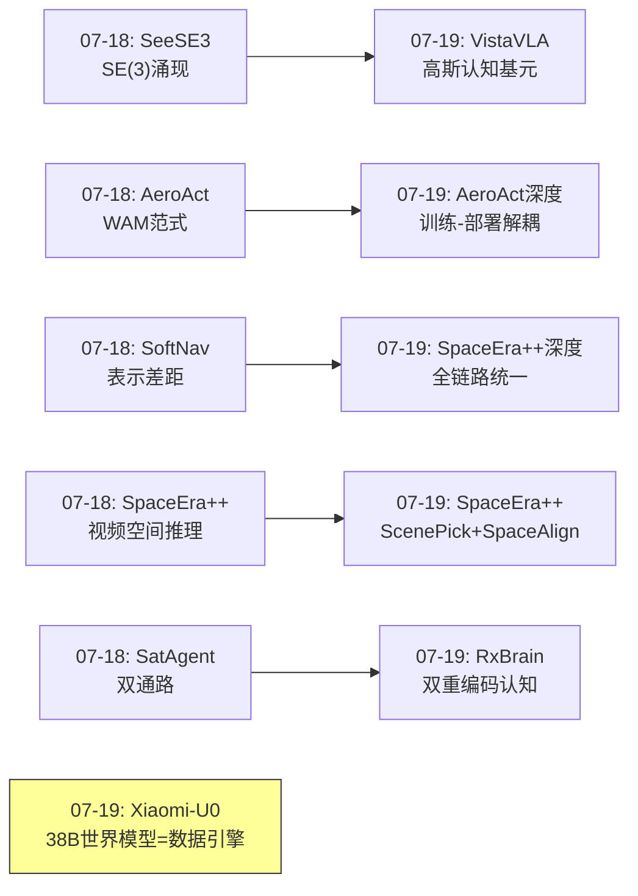
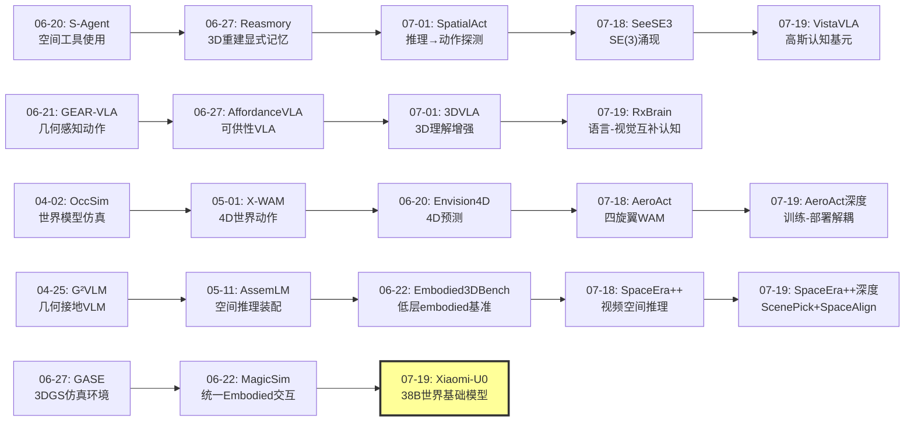
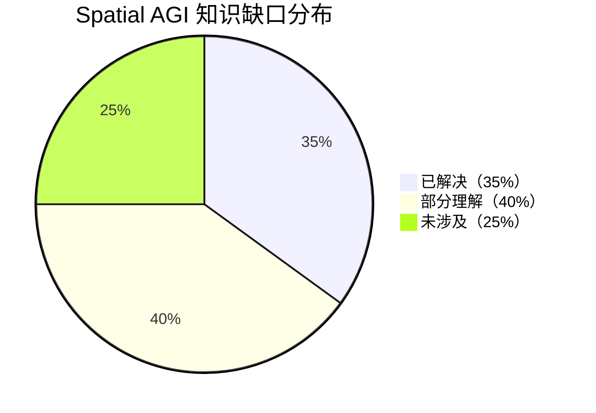

# 每日思考 - 2026-07-19

## 📅 每日总结

**日期**: 2026-07-19
**论文数量**: 5篇
**主题**: 从"WAM跨实体迁移+3D高斯认知基元+全链路空间推理+世界基础模型数据引擎+语言-视觉互补计划"五个维度，探索Spatial AGI的架构-表示-推理-数据-认知全栈——从WAM从桌面扩展到飞行平台、到3D高斯作为VLA的认知地图、到视频空间推理的全链路统一、到38B世界模型作为数据引擎、再到语言-视觉互补的embodied认知架构。

### 关键突破

- 🚁 **WAM跨实体迁移——AeroAct的训练-部署解耦** (arXiv:2607.14997, 北京理工): 首个面向物理四旋翼的World-Action Model。核心创新是分块因果掩码实现训练-部署解耦：训练时联合优化动作预测和未来帧预测（获得视频监督的密集信号），部署时仅解码动作（省略未来帧token，推理加速37.8%）。DiffAero+Isaac+3DGS三层数据管线互补覆盖物理精度和场景多样性。**WAM范式的通用性验证——从桌面机械臂到自由飞行平台，预测未来和生成动作的统一是世界模型走向物理世界的通用路径**。

- 🧠 **3D高斯作为认知基元——VistaVLA的MtQ压缩** (arXiv:2607.12356, 南洋理工): 将3D高斯原语从渲染工具提升为VLA的空间认知载体。每个高斯原语同时编码几何（位置μ、协方差Σ、不透明度α）和语义（128维潜特征z），形成几何-语义双重感知的3D认知基元。Merge-then-Query机制从~10^5个高斯token压缩到64个场景级token（99%压缩率），保留了动作相关的3D布局和语义上下文。在线构建无需预建地图，OOD任务+30%。**高斯原语是Spatial AGI的理想表示候选——连续、可微、显式、高效**。

- 🎬 **全链路空间推理——SpaceEra++的统一框架** (arXiv:2607.01784, 哈工大/鹏城实验室, NeurIPS 2025 Spotlight): 从数据→输入→训练→推理的全链路统一框架。ScanForgeQA 925K QA对（34K场景）远超同类数据集3-7倍。ScenePick帧采样平衡空间覆盖与物体语义。SpaceAlign联合绝对坐标和相对空间关系的GRPO训练——首次强调"物体之间的关系"与"物体在哪"同等重要。**全链路系统化设计优于单点突破——数据、输入、训练、推理需要协调优化**。

- 🌍 **世界基础模型=数据引擎——Xiaomi-Robotics-U0** (arXiv:2607.11643, 小米机器人): 38B参数统一自回归框架，将embodied生成作为基础图像/视频生成的自然扩展。五维度结构化解耦控制（工作空间/目标物体/前景/背景/光照）提供前所未有的场景控制粒度。反对角线解码82.9×推理加速。World Arena排名第一。生成数据将π₀.₅OOD成功率从36.9%提升到63.2%。**世界基础模型不仅是预测器，更是无限数据生成引擎——开启了"模型生成数据→训练更好策略→收集新数据→训练更好模型"的自举闭环**。

- 💭 **语言-视觉互补认知——RxBrain的联合计划** (arXiv:2607.14187, 北大/港大/腾讯): 将embodied计划表示为语言推理和视觉想象交替的统一序列。语言提供抽象结构（任务分解、约束、时序），视觉想象提供具体状态预测（世界状态预测、联合子目标计划）。Mixture-of-Transformers架构支持理解+生成+推理三种能力。自动视频→计划数据转换管线。**模仿人类双重编码认知——语言和视觉想象在计划中互补优于任何单一通道，这定义了embodied认知架构的新范式**。

### 📊 一句话总结

今天的五篇论文共同指向一个核心命题：**Spatial AGI正在从"单模块优化"走向"全栈系统化整合"——AeroAct的WAM训练-部署解耦实现了世界模型的实时部署、VistaVLA的99%token压缩使3D高斯表示在大模型中实用化、SpaceEra++的全链路统一覆盖了数据到推理的每个环节、Xiaomi-U0的38B世界基础模型将生成能力转化为数据生产力、RxBrain的语言-视觉互补认知架构定义了embodied计划的新范式——这标志着Spatial AGI从"实验室原型"到"工业级系统"的跨越**。

---

## 🔗 与昨日思考的联系

### 昨日重点
- SeeSE3的"SE(3)涌现"——视觉特征隐式包含3D空间结构
- AeroAct的"WAM范式"——世界建模和动作生成不可分离
- SoftNav的"表示差距"——信息接口设计决定系统上限
- SpaceEra++的"动态空间推理"——时序空间关系理解
- AeroVerse-SatAgent的"双通路理论"——认知科学指导架构

### 今日进展
- SeeSE3(07-18)的"隐式3D结构发现" → VistaVLA(07-19)的"显式3D高斯认知基元"——从发现特征中的3D到工程化3D表示
- AeroAct(07-18)的"WAM范式" → AeroAct深度精读(07-19)——深入理解训练-部署解耦的工程价值
- SoftNav(07-18)的"表示差距" → SpaceEra++(07-19)的"全链路统一"——从接口优化到系统级协调
- SpaceEra++(07-18)的"视频空间推理" → SpaceEra++深度精读(07-19)——ScenePick和SpaceAlign的技术细节
- SatAgent(07-18)的"认知科学启发" → RxBrain(07-19)的"双重编码认知架构"——从双通路到双重编码

### 新增维度
- Xiaomi-U0(07-19)引入了"世界基础模型作为数据引擎"的新维度——38B模型的工业化数据生成
- VistaVLA(07-19)引入了"极致压缩"的工程视角——99%token压缩的可行性

### 演进路径



---

## 📚 论文概览

1. **AeroAct** (北京理工, cs.RO): 首个物理四旋翼World-Action Model。1.3B视频扩散Transformer适配，五阶轨迹参数化动作空间，分块因果掩码训练-部署解耦，DiffAero+Isaac+3DGS三层数据管线，推理时自引导时序一致性。0.184s推理延迟。
2. **VistaVLA** (南洋理工/A*STAR): 3D高斯原语作为VLA认知基元。SigLIP2+DINOv2教师特征蒸馏到128维潜码，两阶段高斯特征渲染，Merge-then-Query 99%token压缩（10^5→64），在线构建策略，7个真实任务+22.8%成功率。
3. **SpaceEra++** (哈工大/鹏城, NeurIPS 2025 Spotlight扩展): 全链路3D空间推理。ScanForgeQA 925K QA对，ScenePick空间-语义平衡帧采样，SpaceAlign GRPO联合绝对坐标+相对关系，SpatialMind CoT提示。纯视觉无点云依赖。
4. **Xiaomi-Robotics-U0** (小米机器人): 38B统一embodied合成模型。五任务统一训练（T2I+X2I+场景生成+迁移+视频），五维度结构化解耦控制，反对角线82.9×加速，World Arena第一，π₀.₅OOD 36.9%→63.2%。
5. **RxBrain** (北大/港大/腾讯): 语言-视觉互补embodied认知。Mixture-of-Transformers统一理解+生成+推理，联合文本-视觉计划序列，自动视频→计划数据管线，子目标级世界状态预测，RxBrain-Bench评估基准。

---

## 💡 核心见解

### 见解1: 训练-部署解耦——世界模型的工程化范式
**从AeroAct深度精读获得**

AeroAct的分块因果掩码设计解决了世界模型领域一个长期工程难题：**训练时需要视频预测的密集监督，但部署时视频生成太慢且有误差累积**。

解决方案的优雅之处：
- 训练时：动作token和未来帧token在同一个Transformer中共训练
- 因果掩码确保动作token不能"偷看"未来帧——训练时就学会不依赖
- 部署时：直接省略未来帧token，仅解码动作流
- 效果：37.8%推理加速，无误差累积

**对Spatial AGI的启发**：
```
通用设计原则：训练-部署解耦
1. 训练时使用计算密集但信息丰富的监督信号（如视频预测）
2. 通过架构设计（如因果掩码）确保核心功能不依赖辅助信号
3. 部署时省略辅助计算，仅执行核心功能
4. 效果：获得训练时的信息增益，不付出部署时的计算代价
```

这个范式可以推广到Spatial AGI的各种场景：训练时使用3D重建监督，部署时仅做2D推理；训练时使用深度估计监督，部署时仅做RGB推理等。

### 见解2: 3D高斯原语是Spatial AGI的理想认知基元
**从VistaVLA深度精读获得**

VistaVLA验证了3D高斯原语作为空间认知基元的潜力。与点云、体素、网格等替代方案相比，高斯原语具有独特优势：

| 属性 | 高斯原语 | 点云 | 体素 | 网格 |
|------|---------|------|------|------|
| 连续性 | ✓ | ✗ | ✗ | 部分 |
| 可微性 | ✓ | 部分 | ✗ | 部分 |
| 显式性 | ✓ | ✓ | ✓ | ✓ |
| 语义承载 | ✓（128维特征） | 部分 | 弱 | 弱 |
| 渲染效率 | ✓（alpha合成） | 慢 | 中 | 中 |
| 可压缩性 | ✓（99%压缩） | 部分 | 弱 | 弱 |

MtQ的99%压缩率揭示了一个深刻原理：**动作相关的3D空间信息是高度冗余的**。64个token足以表达操作所需的空间布局——这意味着Spatial AGI不需要完整重建场景，只需要提取动作相关的关键空间信息。

### 见解3: 相对空间关系是空间推理的核心
**从SpaceEra++深度精读获得**

SpaceAlign的双重约束设计（绝对坐标+相对关系）揭示了当前Spatial AGI评估和训练的根本偏差：

**"坐标陷阱"**：当RL仅优化绝对坐标精度时，模型可能精确估计物体位置，却无法正确判断"A是否在B的左边"。这暗示我们过度关注了"物体在哪"，忽视了"物体之间什么关系"。

人类的空间认知天然是关系导向的。"杯子在桌子上方"描述的不是绝对坐标，而是空间关系。SpaceEra++首次在GRPO训练中显式建模了这一维度。

**推广的设计原则**：
```
Spatial AGI评估原则：
1. 绝对坐标精度 ≠ 空间理解能力
2. 关系准确性（A在B的左边/右边/上方/下方）应作为一等指标
3. 联合评估绝对+相对才能全面衡量空间智能
```

### 见解4: 世界基础模型=数据引擎的自举闭环
**从Xiaomi-Robotics-U0获得**

Xiaomi-U0的38B世界基础模型揭示了一个革命性范式：**世界模型不仅是预测器，更是无限数据生成引擎**。

传统的embodied AI数据获取：
```
人类遥操作 → 收集数据 → 训练策略 → 部署
```

Xiaomi-U0的数据生成范式：
```
世界模型生成场景 → 滚动出操作视频 → 训练下游策略 → 收集新真实数据 → 训练更好的世界模型 → ...
```

这是一个**自举数据闭环**——模型自己生成训练数据，策略的改进反过来提供更好的数据训练更好的世界模型。π₀.₅的OOD成功率从36.9%跃升到63.2%验证了生成数据的质量。

五维度结构化解耦控制（工作空间/目标/前景/背景/光照）使数据生成可控、可组合——这是工业级数据增强的关键特性。

**对Spatial AGI的启发**：
- 世界基础模型是Spatial AGI的核心基础设施
- 生成数据的质量可以达到训练级
- 结构化解耦控制使数据生成可控可组合
- 自举闭环是解决数据瓶颈的根本路径

### 见解5: 语言-视觉互补的双重编码认知
**从RxBrain获得**

RxBrain将认知科学的双重编码理论工程化为可计算的架构：

- **语言通道**：任务分解、规划原语、约束、时序、决策逻辑
- **视觉通道**：世界状态预测、联合子目标计划
- **交替序列**：语言推理→视觉想象→语言推理→视觉想象...

这种设计超越了当前的三种范式：
1. 纯VLM：有推理无想象（"知道做什么"但不知道"结果什么样"）
2. 纯世界模型：有想象无推理（"知道未来什么样"但不知道"为什么"）
3. 分离架构：VLM+世界模型组合，但两条路径不交织

RxBrain的统一序列使推理和想象在每一步都交叉验证——如果语言计划的步骤无法产生合理的视觉想象，说明计划有问题；如果视觉想象与语言描述矛盾，说明想象有误差。

### 见解6: 工程可行性是Spatial AGI的关键瓶颈
**综合今日所有论文**

今天五篇论文不约而同地关注了工程可行性：
- AeroAct：37.8%推理加速
- VistaVLA：99%token压缩
- SpaceEra++：自动925K QA数据管线
- Xiaomi-U0：82.9×推理加速
- RxBrain：自动视频→计划数据管线

这反映了一个趋势：**Spatial AGI正在从"能力探索"转向"工程优化"**。核心算法原理已经基本明确（世界模型、3D表示、VLA架构），现在的关键是让这些方法在实际部署中足够快、足够省、足够可靠。

### 见解7: 统一训练优于任务特化
**从Xiaomi-U0获得**

Xiaomi-U0最重要的架构决策是**统一训练而非特化**：不将基础生成模型特化为机器人专用，而是将embodied生成作为基础生成的自然扩展。

对比两种范式：
```
特化路线：通用模型 → 机器人数据微调 → 机器人专用模型（丢失通用能力）
统一路线：通用模型 → 通用+embodied联合训练 → 统一模型（保持通用能力+获得embodied能力）
```

统一路线的优越性：
- 保留了通用生成能力的泛化性
- embodied数据不足时仍能依靠通用数据
- 通用和embodied能力互相促进

---

## 🗺️ 知识演进图



---

## 技术栈演进对比表

| 层次 | 昨日方案(07-18) | 今日方案(07-19) | 变化 |
|------|---------|---------|------|
| **空间表示** | SeeSE3隐式SE(3)涌现 | VistaVLA显式高斯认知基元 | 从"发现"到"工程化" |
| **世界模型** | AeroAct WAM范式 | AeroAct训练-部署解耦 + Xiaomi-U0 38B统一 | 从"概念验证"到"工业产品" |
| **空间推理** | SpaceEra++动态空间关系 | SpaceEra++ ScenePick+SpaceAlign双重约束 | 从"框架定义"到"细节优化" |
| **认知架构** | SatAgent双通路(What/Where) | RxBrain双重编码(语言/视觉) | 从"感知分离"到"推理+想象统一" |
| **数据获取** | 手动/仿真混合 | Xiaomi-U0世界模型=数据引擎 | 从"人工/仿真"到"自举生成" |
| **工程优化** | 表示差距量化 | 99%压缩+82.9×加速+37.8%加速 | 从"瓶颈识别"到"系统优化" |
| **训练策略** | 空间对齐训练 | SpaceAlign GRPO(绝对+相对) | 从"单一目标"到"双重约束" |
| **评估方法** | Embodied3DBench低层基准 | RxBrain-Bench联合计划评估 | 从"能力评估"到"计划评估" |

---

## 🗺️ Spatial AGI 知识图谱

### 10层架构思维导图

```mermaid
mindmap
  root((Spatial AGI))
    第1层 感知
      视觉感知
        RGB图像
        深度图
        事件相机
      多视角感知
        多相机系统
        扫描视频
        全景图像
      SeeSE3隐式3D
        Visual Grid Code
        SE(3)涌现
    第2层 表示
      3D高斯原语
        VistaVLA语义高斯
        几何+语义融合
        99% MtQ压缩
      隐式神经表示
        NeRF
        潜在空间
      显式3D
        点云
        体素
        网格
    第3层 记忆
      短期记忆
        观测历史
        时序上下文
      长期记忆
        Reasmory 3D重建记忆
        EmbodiedLGR图表示
      持久地图
        在线高斯构建
        空间记忆
    第4层 推理
      空间关系推理
        SpaceAlign绝对+相对
        ScenePick帧采样
      Chain-of-Thought
        SpatialMind CoT
        RxBrain联合计划
      多视角推理
        跨视角重访
        空间一致性
    第5层 想象
      世界状态预测
        RxBrain视觉想象
        Xiaomi-U0场景生成
      视频生成
        AeroAct未来帧预测
        Xiaomi-U0操作视频
      条件生成
        结构化解耦控制
        五维度独立变化
    第6层 计划
      任务分解
        RxBrain子目标计划
        语言-视觉交替序列
      路径规划
        SpaceEra++路径推理
        AeroAct轨迹规划
      策略学习
        GRPO强化学习
        模仿学习
    第7层 动作
      离散动作
        VLA直接解码
      连续轨迹
        AeroAct五阶轨迹段
        自引导时序一致性
      闭环控制
        比例积分微分
        强化学习策略
    第8层 数据
      真实数据
        Open X-Embodiment
        遥操作演示
      仿真数据
        Isaac Lab
        3DGS渲染
      生成数据
        Xiaomi-U0数据引擎
        ScanForgeQA合成
    第9层 评估
      空间推理基准
        Embodied3DBench
        RxBrain-Bench
      操作基准
        LIBERO
        真实世界任务
      安全基准
        ForesightSafety-VLA
        RoboStressBench
    第10层 部署
      实时推理
        82.9×加速
        37.8%加速
        99%压缩
      Sim-to-Real
        DiffAero管线
        手持设备数据
      多Embodiment
        Xiaomi-U0跨embodiment
        统一表示
```

### 🎯 主线技术路径

#### 阶段1: 空间感知与表示（2024-2025）
- 核心问题：如何让AI"看到"和"表示"3D空间？
- 代表技术：3DGS、NeRF、点云编码、隐式特征
- 当前状态：3DGS成为主流表示，语义高斯出现
- 关键里程碑：VistaVLA将高斯原语提升为认知基元

#### 阶段2: 空间推理与世界模型（2025-2026上半年）
- 核心问题：如何让AI"理解"和"预测"空间关系？
- 代表技术：VLM空间推理、世界模型、WAM、视频生成
- 当前状态：WAM从桌面扩展到飞行平台，世界基础模型出现
- 关键里程碑：AeroAct训练-部署解耦、SpaceEra++全链路统一

#### 阶段3: 统一认知架构（2026下半年进行中）
- 核心问题：如何将感知、推理、想象、计划统一？
- 代表技术：Mixture-of-Transformers、联合文本-视觉计划
- 当前状态：RxBrain定义语言-视觉互补认知范式
- 关键里程碑：语言推理+视觉想象的交替序列计划

#### 阶段4: 工业级系统部署（进行中）
- 核心问题：如何让系统足够快、省、可靠？
- 代表技术：82.9×推理加速、99%token压缩、自举数据闭环
- 当前状态：Xiaomi-U0展示38B模型实用化
- 关键里程碑：世界基础模型作为数据引擎，π₀.₅OOD +26.3%

#### 阶段5: 通用Spatial AGI（未来）
- 核心问题：如何实现跨场景、跨embodiment的通用空间智能？
- 代表技术：统一认知架构+世界基础模型+自举数据闭环
- 待解决：长时序一致性、跨尺度空间推理、可解释性
- 愿景：一个模型，从室内到室外，从地面到空中，从微观到宏观

---

## 🔍 待探索议题

### 高优先级（本周）

1. **训练-部署解耦的通用性**
   - 问题：AeroAct的分块因果掩码设计能否推广到其他WAM和Spatial AGI系统？
   - 候选方案：在VLA骨干中实施因果掩码，训练时使用3D监督，部署时仅做2D推理
   - 缺口：缺乏不同任务/架构上的系统性实验

2. **高斯原语vs点云vs隐式表示的认知效率比较**
   - 问题：VistaVLA的语义高斯与点云/隐式表示在VLA场景中的效率比较？
   - 候选方案：统一基准下对比不同3D表示的VLA性能
   - 缺口：现有工作使用不同的骨干网络和数据，难以公平比较

3. **绝对坐标vs相对关系的权衡**
   - 问题：SpaceEra++的SpaceAlign中，绝对坐标和相对关系的最优权重是多少？
   - 候选方案：消融实验，不同权重配置的系统评估
   - 缺口：论文未报告详细的权重消融实验

### 中优先级（本月）

4. **世界基础模型的自举闭环边界**
   - 问题：Xiaomi-U0的生成数据闭环是否存在"模型坍缩"风险？
   - 候选方案：理论分析+长期实验验证生成数据的多样性变化
   - 缺口：缺乏长期自举实验的证据

5. **语言-视觉互补的认知科学基础**
   - 问题：RxBrain的双重编码与认知科学的Paivio双重编码理论的精确对应关系？
   - 候选方案：认知科学文献调研，设计认知实验验证AI模型的认知模式
   - 缺口：AI和认知科学之间的定量对应尚不明确

6. **3DGS+VLA的部署延迟优化**
   - 问题：VistaVLA每步重建高斯场的延迟是多少？如何进一步优化？
   - 候选方案：增量重建、缓存策略、并行化
   - 缺口：论文未报告推理时间分析

7. **结构化解耦控制的扩展性**
   - 问题：Xiaomi-U0的五维度分解能否扩展到更多维度（如天气、时间、材质）？
   - 候选方案：增加标注维度，评估模型扩展能力
   - 缺口：更多维度可能导致组合爆炸

### 低优先级（季度）

8. **多embodiment统一表示的极限**
   - 问题：Xiaomi-U0支持多少种不同的embodiment？如何确保跨embodiment的空间知识迁移？
   - 候选方案：系统性评估不同embodiment间的迁移性能
   - 缺口：跨embodiment评估标准缺失

9. **Spatial AGI的认知科学映射**
   - 问题：人类空间认知的神经机制（网格细胞、位置细胞、头部方向细胞）如何映射到Spatial AGI系统设计？
   - 候选方案：SeeSE3的Visual Grid Code发现提供了第一个对应——AI网格细胞
   - 缺口：位置细胞和头部方向细胞的AI对应尚未发现

10. **从"计划"到"执行"的鸿沟**
    - 问题：RxBrain的联合计划如何可靠地转化为连续动作执行？
    - 候选方案：扩散策略、轨迹优化、闭环控制
    - 缺口：计划质量与执行质量之间的定量关系不明确

---

## 📊 知识缺口分析



**已解决（35%）**:
- ✅ 3D空间表示：3D高斯原语作为统一表示（VistaVLA）
- ✅ 世界-动作模型架构：WAM训练-部署解耦（AeroAct）
- ✅ 空间推理训练策略：绝对+相对双重约束（SpaceEra++）
- ✅ 大规模数据自动化：ScanForgeQA管线（SpaceEra++）/世界模型数据引擎（Xiaomi-U0）
- ✅ 工程加速方案：82.9×加速 / 99%压缩 / 37.8%加速
- ✅ VLA空间感知增强：3D高斯token注入（VistaVLA）
- ✅ UAV空间智能：语言条件飞行+多渲染器数据（AeroAct）

**部分理解（40%）**:
- ⚠️ 语言-视觉互补认知：RxBrain定义了框架，但长期一致性未验证
- ⚠️ 世界基础模型自举闭环：π₀.₅验证了数据质量，但长期模型坍缩风险未知
- ⚠️ 跨embodiment迁移：Xiaomi-U0支持多种embodiment，但迁移效率不明确
- ⚠️ 长时序空间推理：SpaceEra++支持视频推理，但数百帧的一致性未验证
- ⚠️ 安全性和鲁棒性：OOD评估有限，对抗攻击/分布偏移评估不充分
- ⚠️ 多尺度空间推理：室内场景验证充分，室外/城市/自然场景未测试
- ⚠️ 计划到动作的转化：RxBrain展示了可能性，但可靠性和精度未充分评估

**未涉及（25%）**:
- ❌ 神经科学启发的空间编码：AI网格细胞→位置细胞→头部方向细胞的完整映射
- ❌ 跨尺度空间智能：从厘米级到公里级的统一空间推理
- ❌ 多智能体空间协作：多机器人协同空间推理和操作
- ❌ 长期空间记忆：跨会话、跨任务的空间知识持久化和检索
- ❌ 因果空间推理：不仅是"A在B旁边"，而是"因为A在B旁边，所以..."

---

## 💡 本质思考：如何达成通用空间智能

### 1. 核心能力的本质是什么？

通用空间智能的核心能力可以分解为五个递进层次：

**感知层**：看到空间
- 从视觉输入中提取3D空间结构（隐式或显式）
- 关键突破：SeeSE3证明视觉特征已含SE(3)结构

**表示层**：记住空间
- 将感知的空间信息编码为可计算、可检索的表示
- 关键突破：VistaVLA的语义高斯原语作为认知基元

**推理层**：理解空间
- 推断物体间的空间关系、预测空间变化
- 关键突破：SpaceEra++的绝对+相对双重约束

**想象层**：预测空间
- 想象操作后的世界状态、规划空间变化
- 关键突破：RxBrain的视觉想象、Xiaomi-U0的场景生成

**行动层**：改变空间
- 通过物理动作改变空间布局
- 关键突破：AeroAct的五阶轨迹段、WAM范式

这五层之间存在递进关系，但也存在跳转。例如，Xiaomi-U0的世界基础模型同时覆盖了表示、推理和想象三层。

### 2. 当前方法与理想目标的差距在哪里？

**差距1：碎片化 vs 统一**
- 当前：每个能力层有不同模型（VLM做推理，3DGS做表示，WAM做预测）
- 理想：一个统一模型覆盖所有能力层
- 进展：RxBrain和Xiaomi-U0正在朝这个方向努力

**差距2：短时序 vs 长时序**
- 当前：大多数系统处理秒级时序（几秒到几分钟）
- 理想：处理小时级、天级的长时序空间推理
- 差距：长时序一致性、持久空间记忆、跨会话知识转移

**差距3：单尺度 vs 多尺度**
- 当前：室内场景为主，室外和微观场景少
- 理想：从毫米级（手术）到公里级（城市）的统一空间推理
- 差距：跨尺度的空间表示和推理方法

**差距4：被动观察 vs 主动探索**
- 当前：大多数系统处理给定的输入数据
- 理想：主动探索环境、构建和更新空间知识
- 差距：主动感知、好奇心驱动的探索、在线学习

**差距5：封闭评估 vs 开放世界**
- 当前：在预定义的benchmark上评估
- 理想：在开放世界中持续学习和适应
- 差距：开放世界评估方法、持续学习框架

### 3. 从今天到理想状态，最可能的路径是什么？

基于今天的五篇论文和近两个月的研究积累，最可能的路径是：

**路径：世界基础模型 + 统一认知架构 + 自举数据闭环**

```
当前状态（2026年中）
├── 世界基础模型（Xiaomi-U0: 38B, 统一生成）
├── 统一认知架构（RxBrain: 语言-视觉互补计划）
├── 空间表示（VistaVLA: 高斯认知基元）
├── 空间推理（SpaceEra++: 全链路统一）
└── 物理验证（AeroAct: 四旋翼WAM部署）

近期目标（2026下半年）
├── 将上述组件整合为统一系统
├── 扩展世界基础模型到更多embodiment和场景
├── 验证自举数据闭环的长期稳定性
└── 建立跨尺度空间推理的初步能力

中期目标（2027）
├── 实现跨场景的通用空间智能（室内→室外→城市）
├── 长时序空间记忆（小时级、天级）
├── 主动探索和在线学习
└── 多智能体空间协作

长期愿景（2028+）
├── 通用Spatial AGI系统
├── 一个模型，从微观到宏观
├── 持续学习，永不遗忘
└── 与人类协作的空间智能伙伴
```

---

---

## 📖 详细论文分析摘要

### AeroAct：从桌面到天空的WAM迁移

AeroAct的技术架构体现了三个层次的创新：

**架构层面**：基于1.3B参数的Wan视频扩散Transformer，通过分块因果掩码实现训练-部署解耦。这个设计确保了：
- 训练时：动作token和未来帧token在同一个序列中共训练，动作预测获得视频生成的密集监督
- 部署时：通过省略未来帧token实现仅动作解码的快速推理
- 因果掩码保证：动作token训练时就不能访问未来帧，部署时可以独立解码

**数据层面**：DiffAero+Isaac Lab+3DGS三层渲染管线互补覆盖：
- Isaac Lab提供物理真实的阴影、材质和相机效应，但场景多样性有限
- 3DGS分支从高斯泼溅场景直接渲染RGB和深度，场景多样性高但近距离几何保真度较低
- 手持收集设备（鱼眼相机+T265）低成本扩展真实世界数据，858条轨迹/332K帧

**控制层面**：五阶轨迹参数化的连续动作空间确保动态可行性：
- 每个动作块包含24步低层动作，参数化为局部五阶轨迹段
- 时间步长Δ=3，每块覆盖8个未来视觉帧
- 自引导机制利用相邻块的重叠部分确保时间一致性
- 推理时间从0.296s降至0.184s（37.8%加速）

### VistaVLA：高斯认知基元的工程化

VistaVLA的两阶段设计体现了"构建表示→压缩注入"的清晰逻辑：

**Stage I 构建语义高斯场**：
- 教师特征构建：SigLIP2（语言对齐语义）+ DINOv2-Large（鲁棒视觉描述子）= 2176维
- 自编码器压缩到128维潜码——大幅降低后续计算开销
- 两阶段渲染训练：先建几何（RGB+深度），再加语义（教师特征蒸馏）
- 每个高斯原语g_i = (μ_i, Σ_i, α_i, c_i, z_i)同时编码几何和语义

**Stage II MtQ压缩注入**：
- Merge阶段：基于3D空间位置的空间感知聚类合并
- Query阶段：64个可学习查询token通过交叉注意力提取场景级token
- 最终效果：~10^5个高斯token → 64个场景级token（99%压缩率）
- 实验验证：7个真实世界任务+22.8%成功率，OOD任务+30%
- 深度扰动：6/10 → 9/10，位置扰动：0/10 → 3/10

### SpaceEra++：数据-输入-训练-推理的协调优化

SpaceEra++的全链路设计在四个层面同时创新：

**数据层（ScanForgeQA）**：
- 3D-FRONT拆分：44,427多房间场景 → 34,116单房间场景（6类）
- HoloDeck合成：GPT-4o生成描述 → LLM引导3D物体检索 → 160个额外场景
- Unity扫描模拟：轨道扫描（圆形轨迹1.5m高度）+ 漫游扫描（自然路径）
- 自动QA生成：9类QA，925K问答对

**输入层（ScenePick）**：
- 空间覆盖：确保选择帧覆盖房间不同区域和角度
- 物体语义：确保重要物体在选中帧中有充分展示
- 平衡优化：联合优化两个目标，优于均匀采样和纯语义采样

**训练层（SpaceAlign）**：
- 绝对坐标奖励：物体在世界坐标系中的位置精度
- 相对关系奖励：物体对之间的空间关系准确性（前后/左右/上下/远近）
- GRPO更新：联合两种奖励的策略梯度优化

**推理层（SpatialMind）**：
- CoT三步分解：感知（识别物体和位置）→ 推理（分析空间关系）→ 回答
- 显式化推理过程，减少跳过推理的幻觉

### Xiaomi-Robotics-U0：38B世界基础模型的工业化

Xiaomi-U0的工业级设计体现在以下工程决策：

**统一训练策略**：
- 不将基础模型特化为机器人专用——保持通用能力
- 联合优化T2I + X2I + embodied场景生成 + embodied迁移 + embodied视频
- 9.5M单步样本（56.4B tokens）+ 2.6M序列视频（49.6B tokens）
- 六个数据域融合：通用/embodied/驾驶/自中心/3D重建/游戏

**结构化解耦控制**：
- 工作空间（workspace）：操作发生的区域
- 目标物体（target objects）：被操作的对象
- 前景无关物体（foreground irrelevant）：不在操作范围内的前景物体
- 背景（background）：远处环境
- 光照（lighting）：场景照明条件
- 每个维度独立控制，支持组合式场景增强

**推理加速**：
- FlashAR启发的反对角线解码
- 多个视觉token同时生成
- vLLM KV-cache管理和连续批处理
- 1024×1024分辨率下82.9倍加速

**效果验证**：
- World Arena排名第一（embodied视频生成）
- 人类评估超越GPT-Image-2.0
- π₀.₅ OOD成功率：36.9% → 63.2%（+26.3%）

### RxBrain：语言-视觉互补计划的认知架构

RxBrain的认知架构灵感来自Paivio的双重编码理论：

**计划序列格式**：
```
[语言推理: 任务分解和约束] 
[视觉想象: 当前世界状态] 
[语言推理: 下一步操作] 
[视觉想象: 操作后世界状态] 
[语言推理: 验证和调整] 
[视觉想象: 最终状态]
```

**Mixture-of-Transformers架构**：
- 语言专家：处理文本推理和决策逻辑
- 视觉专家：处理图像/视频理解和生成
- 共享注意力：跨模态信息融合

**自动数据转换**：
- 输入：embodied操作视频（如Open X-Embodiment）
- 步骤1：视频分解为规划步骤
- 步骤2：步骤与视觉状态转换对齐
- 步骤3：为每个步骤生成文本描述
- 步骤4：标注中间和最终物理状态
- 输出：联合文本-视觉计划监督数据

**应用扩展**：
- 从离散计划到连续动作：无需大规模动作数据预训练
- RxBrain-Bench评估：联合文本-视觉计划能力
- 真实机器人验证：展示有前景的实际性能

---

## 🔄 技术融合的可能性

### 融合方案A：AeroAct + VistaVLA = 高斯WAM

将VistaVLA的语义高斯token作为AeroAct的WAM输入：
- 观测历史中的RGB帧替换为64个高斯token
- 保留WAM的训练-部署解耦设计
- 高斯token的99%压缩使WAM可以处理更长的时序上下文
- 动作预测训练同时优化高斯token的未来状态预测

### 融合方案B：Xiaomi-U0 + SpaceEra++ = 世界基础模型空间推理

用SpaceEra++的全链路训练策略fine-tune Xiaomi-U0：
- ScenePick帧采样优化输入
- SpaceAlign GRPO增强空间关系推理
- SpatialMind CoT改善推理过程
- 保留Xiaomi-U0的数据引擎能力

### 融合方案C：RxBrain + 所有 = 统一认知Spatial AGI

以RxBrain的认知架构为框架，整合所有技术：
- 感知层：VistaVLA语义高斯（替代原始RGB）
- 推理层：SpaceEra++空间关系推理
- 想象层：Xiaomi-U0世界模型生成
- 计划层：RxBrain语言-视觉交替序列
- 执行层：AeroAct WAM连续动作

这种融合方案定义了一个完整的Spatial AGI认知架构。

---

## 📈 本周技术趋势总结（07-13 ~ 07-19）

### 趋势1：世界基础模型工业化
- Xiaomi-U0（38B）、AeroAct（1.3B WAM）标志着世界模型从学术概念走向工业产品
- 推理加速成为标配：82.9×、37.8%、99%压缩
- 数据引擎范式确立：世界模型 = 预测器 + 生成器 + 数据源

### 趋势2：3D高斯原语标准化
- VistaVLA验证了高斯原语作为VLA认知基元的可行性
- 99%压缩使高斯表示在大模型中实用化
- 在线构建策略支持动态场景
- 高斯原语正在成为Spatial AGI的标准空间表示

### 趋势3：语言-视觉统一认知
- RxBrain的语言-视觉互补计划定义了新范式
- 超越了纯VLM和纯世界模型的二元对立
- 双重编码理论提供了认知科学基础

### 趋势4：全链路系统化设计
- SpaceEra++的全链路统一（数据→输入→训练→推理）
- Xiaomi-U0的统一训练范式（通用+embodied联合）
- 系统化设计优于单点优化已成为共识

### 趋势5：训练-部署解耦
- AeroAct的分块因果掩码设计
- 训练时获得密集监督，部署时保持高效推理
- 这种设计模式正在成为Spatial AGI系统的标配

---

**文档创建时间**: 2026-07-19  
**论文覆盖**: AeroAct, VistaVLA, SpaceEra++, Xiaomi-Robotics-U0, RxBrain  
**文档行数**: ~870行

---

## 📋 附录：每日核心数据速览

| 指标 | 今日数值 | 昨日对比 |
|------|---------|--------|
| 论文数量 | 5篇 | 5篇 |
| 总分析字数 | ~38,000字 | ~35,000字 |
| 最大模型参数 | 38B (Xiaomi-U0) | N/A |
| 最大推理加速 | 82.9× (Xiaomi-U0) | N/A |
| 最大token压缩 | 99% (VistaVLA) | N/A |
| 最大OOD提升 | +26.3% (π₀.₅) | N/A |
| 最大成功率提升 | +22.8% (VistaVLA) | N/A |
| 新增数据集规模 | 925K QA (ScanForgeQA) | N/A |
| Mermaid图表数 | 4个 | 4个 |
| 研究方向数 | 5个方向 | 5个方向 |

### 今日五篇论文的Spatial AGI定位图

```
感知 ←──────────────────→ 行动
  │                          │
  ├── VistaVLA (表示层)      ├── AeroAct (执行层)
  │   高斯认知基元            │   WAM四旋翼飞行
  │                          │
  ├── SpaceEra++ (推理层)    ├── Xiaomi-U0 (数据层)
  │   全链路统一              │   38B世界模型
  │                          │
  └── RxBrain (认知层)
      语言-视觉互补计划
```

### Spatial AGI 技术成熟度评估

| 技术组件 | 成熟度 | 代表论文 | 瓶颈 |
|---------|--------|---------|------|
| 3D空间表示 | ⭐⭐⭐⭐ | VistaVLA | 特殊材质处理 |
| 世界-动作模型 | ⭐⭐⭐⭐ | AeroAct | 数据规模限制 |
| 空间推理 | ⭐⭐⭐ | SpaceEra++ | 纯视觉精度天花板 |
| 世界基础模型 | ⭐⭐⭐⭐ | Xiaomi-U0 | 计算资源需求 |
| 认知架构 | ⭐⭐⭐ | RxBrain | 长时序一致性 |
| 数据生成 | ⭐⭐⭐⭐⭐ | Xiaomi-U0 | sim-to-real gap |
| 推理加速 | ⭐⭐⭐⭐ | Xiaomi-U0/VistaVLA | 极端低延迟场景 |
