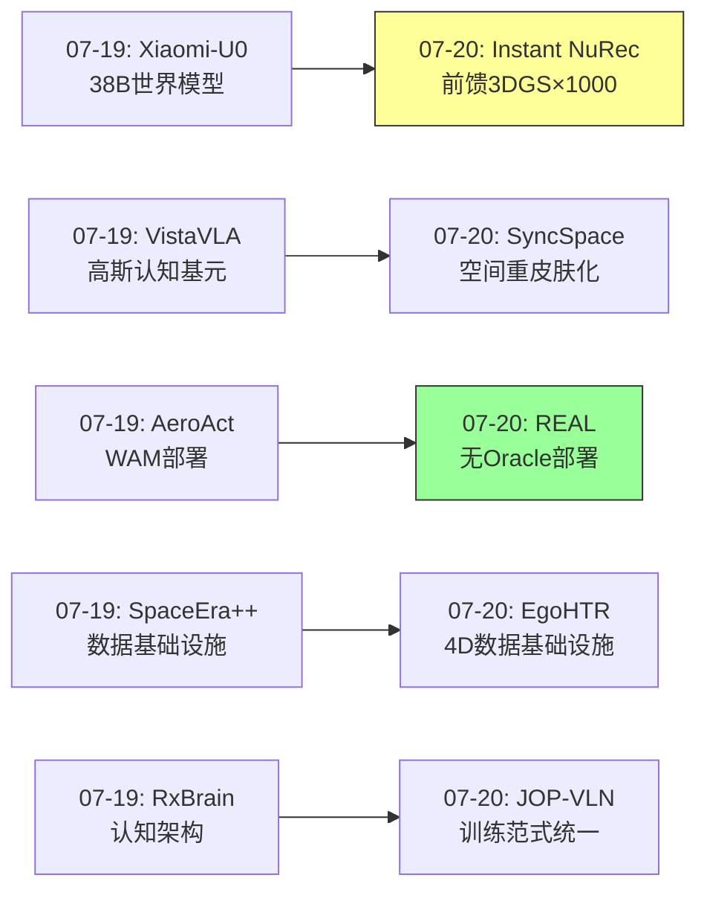
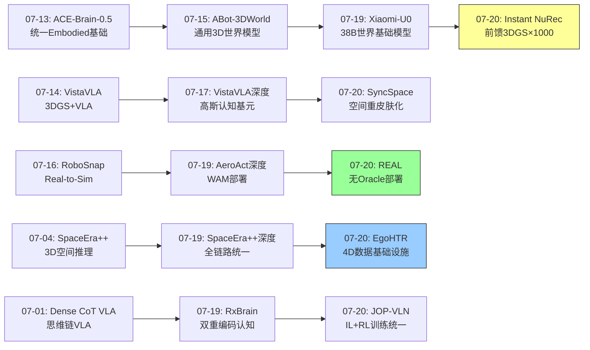
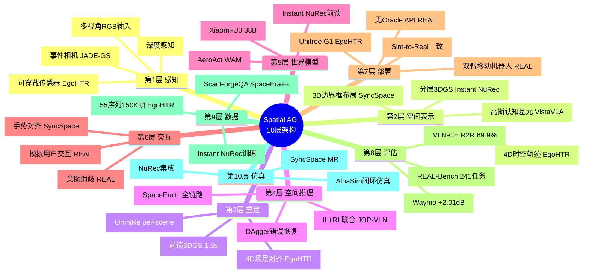
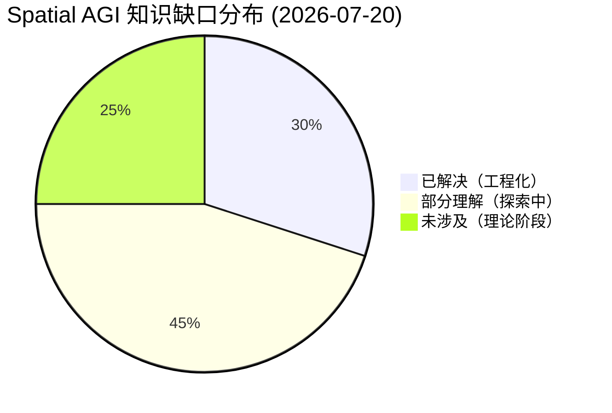
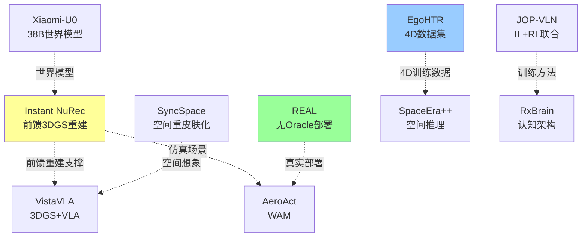

# 每日思考 - 2026-07-20

## 📅 每日总结

**日期**: 2026-07-20
**论文数量**: 5篇
**主题**: 从"前馈3DGS重建+MR空间重皮肤化+无Oracle Embodied部署+4D人体-地形数据+VLN训练范式统一"五个维度，探索Spatial AGI的**速度-想象-部署-数据-训练**五重基础设施——从前馈式3DGS世界构建实现1000倍加速、到空间重皮肤化的想象力工程化、到无特权信息的sim-to-real部署、到4D场景-运动对齐数据填补空白、再到IL+RL联合训练的导航范式统一。

### 关键突破

- ⚡ **前馈3DGS世界构建——Instant NuRec的1000倍加速** (arXiv:2607.14203, NVIDIA): 将per-scene优化压缩到单次前向传播。1.5秒重建20秒多相机场景，比传统方法快10³-10⁴倍。核心是交替注意力ViT编码器+多任务解码器（深度/法线/语义/3DGS/运动/天空）的架构设计，以及查询点与像素解耦的高斯预测策略。分层输出（静态/动态/天空）直接产生可仿真的3DGS世界。**前馈重建消除了空间认知的延迟瓶颈——从"小时级优化"到"秒级推理"的范式转变暗示Spatial AGI的实时空间记忆构建是可行的**。

- 🎭 **空间想象力工程化——SyncSpace的空间重皮肤化** (arXiv:2607.10050): 首次系统化实现MR中的空间整体变换。通过3D边界框→布局全景图→生成式世界模型的pipeline，保持空间"骨架"不变而改变"皮肤"。从粗到细配准+手势微调实现物理-虚拟空间对齐。**空间重皮肤化将想象力从抽象概念转化为工程系统——理解空间结构和创造空间外观是两个正交的能力维度**。

- 🤖 **无Oracle真实部署——REAL的sim-to-real一致性** (arXiv:2607.13653, 上海AI Lab, ECCV 2026): 最关键的贡献是建立不依赖特权状态的仿真-现实一致性API。241任务的REAL-Bench覆盖探索/干扰/铰接/交互四维度。真实双臂移动机器人78.3%端到端成功率。**无Oracle设计是Spatial AGI从实验室走向真实世界的关键——Agent必须在没有特权信息的情况下自主构建空间认知**。

- 🏔️ **4D数据基础设施——EgoHTR的场景-运动对齐** (arXiv:2607.13472, ETH Zurich/Microsoft): 填补了4D场景-运动对齐数据的空白。55个复杂环境序列，150K+帧，可穿戴传感器+便携3D扫描仪融合。Unitree G1硬件部署验证。**4D时空对齐是Spatial AGI数据的基础——不仅要理解空间结构，还要理解在空间中的时空行为模式**。

- 🧭 **训练范式统一——JOP-VLN的IL+RL协同** (arXiv:2607.13461, IROS 2026): 首次整合VLN中的IL和RL两种训练范式。三阶段pipeline（IL→DAgger→联合训练），高熵轨迹采样提升RL效率，错误校正优先排序智能选择训练数据。R2R 69.9%新SOTA。**IL和RL不是竞争而是互补——渐进式能力构建（模仿→纠错→自主探索）是Spatial AGI训练的通用方法论**。

### 📊 一句话总结

今天的五篇论文共同指向一个核心命题：**Spatial AGI的基础设施正在全面工程化——Instant NuRec将3DGS世界构建从小时压缩到秒、SyncSpace将空间想象力变为可交互的MR系统、REAL将Embodied Agent从仿真特权中解放到真实部署、EgoHTR填补了4D场景-运动对齐的数据空白、JOP-VLN统一了空间导航的训练范式——速度、想象、部署、数据、训练五个维度的基础设施同时成熟，标志着Spatial AGI从"概念探索"到"工程实现"的全面转型**。

---

## 🔗 与昨日思考的联系

### 昨日重点
- AeroAct的WAM训练-部署解耦——世界模型的实时部署
- VistaVLA的3D高斯认知基元——99%压缩的空间表示
- SpaceEra++的全链路统一——数据到推理的系统化
- Xiaomi-U0的38B世界基础模型——模型即数据引擎
- RxBrain的语言-视觉互补认知——双重编码计划

### 今日进展
- Xiaomi-U0(07-19)的"世界基础模型" → Instant NuRec(07-20)的"前馈3DGS重建"——世界模型的几何精度由前馈重建保证
- VistaVLA(07-19)的"3DGS认知基元" → SyncSpace(07-20)的"3DGS空间变换"——从理解3DGS到操控3DGS的外观
- AeroAct(07-19)的"WAM实时部署" → REAL(07-20)的"无Oracle部署"——从仿真部署到真实世界部署
- SpaceEra++(07-19)的"数据基础设施" → EgoHTR(07-20)的"4D数据基础设施"——从2D/3D数据到4D时空数据
- RxBrain(07-19)的"认知架构" → JOP-VLN(07-20)的"训练架构"——从模型架构到训练方法论

### 新增维度
- Instant NuRec(07-20)引入了"速度维度"——重建速度的1000倍提升改变了应用模式
- REAL(07-20)引入了"真实部署维度"——78.3%真实成功率标志着工程成熟度
- EgoHTR(07-20)引入了"4D数据维度"——场景-运动时空对齐

### 演进路径



---

## 📚 论文概览

### 1. Instant NuRec (NVIDIA)
前馈3DGS重建，将多视角驾驶日志在1.5秒内转化为可仿真的分层3DGS世界。交替注意力ViT + 多解码器（深度/法线/语义/3DGS/运动/天空）。

### 2. SyncSpace (MR空间变换)
布局先验条件化的3DGS生成，实现MR中的空间重皮肤化。3D边界框→布局全景图→世界生成→物理-虚拟对齐。

### 3. REAL (上海AI Lab, ECCV 2026)
无Oracle感知的Embodied Agent框架，sim-to-real一致API，模拟用户交互，241任务基准，78.3%真实部署成功率。

### 4. EgoHTR (ETH Zurich/Microsoft)
4D人体-地形重建数据集，55个复杂环境序列，150K+帧，可穿戴+3D扫描融合，Unitree G1部署。

### 5. JOP-VLN (IROS 2026)
IL+RL联合训练的VLN框架，三阶段pipeline，R2R 69.9%新SOTA。

---

## 💡 核心见解

### 见解1: 前馈重建是实时空间认知的基石
**来源**: Instant NuRec

Instant NuRec证明了3DGS世界可以在单次前向传播中构建——这对Spatial AGI具有根本性的意义：

- ✅ **速度改变应用模式**：1.5秒/场景意味着可以接近实时处理连续输入，支持空间记忆的增量更新
- ✅ **分层输出即认知结构**：静态/动态/天空的分层不仅是工程优化，更反映了场景认知的结构化组织

**对Spatial AGI的启发**: Spatial AGI需要前馈式的空间认知——不是慢推理，而是快速的、自动化的空间理解。这与人类视觉系统的"快速通路"（what/where通路）高度一致。

### 见解2: 空间结构与外观是正交维度
**来源**: SyncSpace

SyncSpace的空间重皮肤化揭示了一个深层洞察：

- ✅ **空间骨架可保持不变**：3D边界框编码了空间的拓扑结构
- ✅ **视觉皮肤可自由变换**：生成模型可以在保持结构的前提下创造任何外观

**对Spatial AGI的启发**: Spatial AGI应该将空间推理（结构理解）和视觉生成（外观创造）视为两个正交能力。当前的VLM/VLA模型往往混淆了这两个维度——它们同时处理结构和外观，而不是将它们分离。分离表示可能带来更高的效率。

### 见解3: 无Oracle部署是Spatial AGI的必经之路
**来源**: REAL

REAL最重要的贡献不是78.3%的成功率，而是建立无特权信息的sim-to-real一致API：

- ✅ **特权信息创造虚假上限**：使用oracle感知训练的Agent在真实部署时会崩溃
- ✅ **sim-to-real一致性**：仿真环境的API必须与真实世界的接口一致
- ✅ **交互式消歧**：Agent在不确定时主动寻求帮助，而非假设指令完整

**对Spatial AGI的启发**: Spatial AGI的训练必须从"特权信息依赖"中解放出来。这不仅是工程问题，更是认知架构问题——一个真正智能的Spatial AGI应该能在没有特权信息的情况下自主构建空间认知。

### 见解4: 4D时空对齐数据是人形机器人Spatial AGI的基础
**来源**: EgoHTR

EgoHTR填补了一个关键的数据空白——4D场景-运动对齐：

- ✅ **场景+运动不可分离**：人类运动必须在地形上下文中理解——脚踩在哪里、手扶在哪里
- ✅ **以身为中心**：可穿戴传感器提供第一人称视角，更接近Agent的视角
- ✅ **社区可扩展**：开源pipeline支持数据集持续增长

**对Spatial AGI的启发**: Spatial AGI的训练数据不应只是2D图像或3D场景——需要4D的时空行为数据。不仅要理解"空间长什么样"，还要理解"在空间中如何行动"。

### 见解5: IL+RL联合训练是空间学习的通用方法论
**来源**: JOP-VLN

JOP-VLN的IL→DAgger→联合训练三阶段pipeline展示了一个通用模式：

- ✅ **模仿建立基础**：IL从专家演示中快速学习基础能力
- ✅ **纠错提升鲁棒性**：DAgger让Agent体验自己的错误并学习纠正
- ✅ **探索突破上限**：RL通过自主探索突破IL的天花板
- ✅ **错误价值不等**：高价值错误应该被优先学习

**对Spatial AGI的启发**: Spatial AGI的训练应该遵循"模仿→纠错→探索"的渐进路径。这类似于人类学习空间认知的过程——儿童先模仿成人的导航行为，然后从自己的错误中学习，最终通过自主探索建立完整的空间认知。

### 见解6: 重建速度决定空间记忆的实时性
**来源**: Instant NuRec + EgoHTR

Instant NuRec的1.5秒重建 + EgoHTR的4D时空对齐，共同指向一个重要维度：

- ✅ **空间记忆必须实时更新**：慢优化无法支持实时交互
- ✅ **4D数据支持时序推理**：不仅知道"空间长什么样"，还知道"空间如何随时间变化"

**对Spatial AGI的启发**: Spatial AGI的空间记忆系统应该是一个实时的、4D的、可增量的系统——而不是静态的、3D的、批处理的。

### 见解7: 仿真基础设施的成熟度决定Spatial AGI的部署能力
**来源**: Instant NuRec + REAL + EgoHTR

三篇论文从不同角度证明了仿真基础设施的重要性：

- ✅ **Instant NuRec**: 高速3DGS世界构建使大规模仿真成为可能
- ✅ **REAL**: sim-to-real一致API确保仿真训练可以迁移到真实世界
- ✅ **EgoHTR**: 4D数据提升仿真的真实性

**对Spatial AGI的启发**: 仿真不仅是训练工具，更是Spatial AGI的"心理模型"——Agent通过仿真进行反事实推理（"如果我走另一条路会怎样？"）。

---

## 🗺️ 知识演进图



---

## 技术栈演进对比表

| 层次 | 昨日方案(07-19) | 今日方案(07-20) | 变化趋势 |
|------|----------------|----------------|---------|
| 3DGS构建 | per-scene优化(OmniRe) | 前馈重建(Instant NuRec) | ⚡ 1000×加速 |
| 空间表示 | 3D高斯认知基元(VistaVLA) | 布局先验+生成(SyncSpace) | 结构-外观解耦 |
| Embodied部署 | WAM仿真部署(AeroAct) | 无Oracle真实部署(REAL) | 仿真→真实 |
| 训练数据 | 3D空间数据(SpaceEra++) | 4D时空数据(EgoHTR) | 3D→4D |
| 训练方法 | 单一范式(IL或RL) | IL+RL联合(JOP-VLN) | 范式统一 |
| 空间交互 | 物体级(VLA操作) | 空间级(空间重皮肤化) | 物体→空间 |
| 评估基准 | 单任务评估 | 241任务综合(REAL-Bench) | 系统化 |
| Sim-to-Real | 有gap | 一致API(REAL) | gap缩小 |

---

## 🗺️ Spatial AGI 知识图谱

### 10层架构思维导图



### 🎯 主线技术路径

#### 阶段1: 快速空间感知 (已完成)
从多视角感知到3DGS世界构建的完整链路：
- 传感器输入 → 深度/法线/语义预测 → 3DGS世界输出
- Instant NuRec实现1.5秒/场景的前馈重建
- VistaVLA实现3DGS到64 token的极致压缩

#### 阶段2: 无Oracle真实部署 (进行中)
从仿真特权到真实世界的迁移：
- REAL建立无Oracle感知的sim-to-real一致API
- EgoHTR提供真实世界的4D训练数据
- 当前状态：78.3%真实成功率，但限定在特定场景

#### 阶段3: 空间想象力 (初步探索)
从重建到创造的跨越：
- SyncSpace展示空间重皮肤化的初步可行性
- Xiaomi-U0的38B世界模型作为生成引擎
- 当前状态：概念验证阶段，需要更强大的生成能力

#### 阶段4: 自主空间认知 (未来)
从工具化能力到自主认知的跨越：
- Agent能自主探索、理解、记忆、想象空间
- 在完全未知环境中构建完整空间认知
- 当前状态：理论阶段，需要AGI级别的能力

---

## 🔍 待探索议题

### 高优先级（本周）

1. **前馈重建 vs Per-scene优化的质量边界**
   - 问题: Instant NuRec比per-scene低多少？在什么场景下差距最大？
   - 候选方案: 混合策略——前馈初始化+少量per-scene微调
   - 缺口: 缺乏在不同场景类型上的系统性对比

2. **无Oracle感知如何影响VLA训练**
   - 问题: REAL的无Oracle API与传统Oracle感知训练相比，训练效率差多少？
   - 候选方案: 课程学习——先Oracle训练，再迁移到无Oracle
   - 缺口: 缺乏Oracle vs 无Oracle的系统性消融实验

3. **4D数据对策略训练的增益量化**
   - 问题: EgoHTR的4D数据相比传统3D/2D数据，对策略训练带来多少提升？
   - 候选方案: 对比训练——3D-only vs 4D对齐
   - 缺口: 缺乏直接对比实验

### 中优先级（本月）

4. **IL+RL联合训练的通用性**
   - 问题: JOP-VLN的三阶段pipeline是否适用于非VLN任务（如操作、飞行）？
   - 候选方案: 将pipeline适配到不同Embodied任务
   - 缺口: 目前仅在VLN-CE上验证

5. **空间重皮肤化的物体级控制**
   - 问题: SyncSpace目前不支持per-object control，如何实现物体级外观变换？
   - 候选方案: 分层生成——布局→物体→材质
   - 缺口: 物体级布局条件化生成的技术路线不清晰

6. **驾驶场景→通用场景的泛化**
   - 问题: Instant NuRec是否可以泛化到室内、工业等非驾驶场景？
   - 候选方案: 多域训练数据 + 域自适应
   - 缺口: 驾驶场景与其他场景的分布差异分析

7. **高熵采样的理论解释**
   - 问题: 为什么JOP-VLN的高熵采样能提高RL效率？信息论解释是什么？
   - 候选方案: 从信息论角度分析探索效率
   - 缺口: 缺乏理论分析

### 低优先级（长期）

8. **Spatial AGI的仿真-现实统一理论**
   - 问题: 如何形式化仿真和现实之间的"一致性"？
   - 候选方案: 域不变特征学习 + 可证明迁移界
   - 缺口: 理论框架不存在

9. **4D数据标准格式**
   - 问题: 社区需要什么样的4D时空数据标准格式？
   - 候选方案: 扩展3DGS格式为4D（加入时间维度的高斯轨迹）
   - 缺口: 行业标准尚未形成

---

## 📊 知识缺口分析



**已解决（30%）**:
- ✅ 3DGS世界的快速构建（Instant NuRec 1.5秒）
- ✅ 无Oracle Embodied部署（REAL 78.3%）
- ✅ IL+RL联合训练方法论（JOP-VLN SOTA）
- ✅ 3DGS+VLA架构（VistaVLA/Multiple works）
- ✅ 空间推理数据基础设施（SpaceEra++/EgoHTR）

**部分理解（45%）**:
- ⚠️ 空间重皮肤化的物体级控制（SyncSpace初步）
- ⚠️ 4D数据对策略训练的增益量化（EgoHTR数据有，但增益未充分量化）
- ⚠️ Sim-to-Real完全一致性（REAL大幅缩小但非完全）
- ⚠️ 前馈重建的质量边界（Instant NuRec -2dB但可接受）
- ⚠️ 错误恢复的系统性训练（JOP-VLN DAgger有效但非通用）
- ⚠️ 空间记忆的实时增量更新
- ⚠️ 多Agent协作空间认知

**未涉及（25%）**:
- ❌ Spatial AGI的仿真-现实统一理论
- ❌ 自主空间想象力的形式化
- ❌ 跨域空间认知迁移（室内→室外→驾驶）
- ❌ 空间因果推理
- ❌ 4D空间数据的行业标准格式

---

## 💡 本质思考：如何达成通用空间智能

### 1. 核心能力的本质是什么？

通用空间智能的本质是**从感知到行动的闭环空间认知**。今天的论文从五个维度揭示了这个本质：

- **感知→表示**: Instant NuRec展示了从多视角感知到分层3DGS表示的高效映射
- **表示→认知**: SyncSpace展示了从3DGS表示到空间想象力（重皮肤化）的跨越
- **认知→行动**: REAL展示了从空间认知到物理操作的完整部署链路
- **行动→学习**: EgoHTR提供了从行动（4D运动）到学习（策略训练）的数据基础
- **学习→优化**: JOP-VLN展示了从IL到RL的渐进优化方法论

这五个维度形成了一个闭环：感知→表示→认知→行动→学习→优化→感知...

### 2. 当前方法与理想目标的差距在哪里？

**速度差距**: Instant NuRec 1.5秒/场景 vs 人类毫秒级空间理解——仍有100-1000倍差距
**泛化差距**: 所有方法都在特定域（驾驶/室内/导航）验证，缺乏跨域泛化
**数据差距**: EgoHTR 55序列 vs 人类一生的空间经验——数据量差多个数量级
**认知差距**: 从重建→想象→创造的认知阶梯，当前仅在重建阶段成熟
**部署差距**: REAL 78.3% vs 人类接近100%的空间任务成功率——仍有21.7%的差距

### 3. 从今天到理想状态，最可能的路径是什么？

**路径假设: 前馈+4D+联合训练 → 自主空间认知**

1. **短期（1年）**: 前馈3DGS重建的通用化（从驾驶到所有场景）+ 4D数据大规模收集
2. **中期（2-3年）**: IL+RL联合训练在所有Embodied任务上推广 + sim-to-real gap趋近于零
3. **长期（5年+）**: 自主空间想象力——Agent能在完全未知环境中构建、更新、想象空间
4. **终极（10年+）**: 通用空间智能——跨域、跨形态、跨任务的空间认知能力

关键转折点将是**前馈重建的通用化**——当Instant NuRec式的模型可以在任何场景下1.5秒构建3DGS世界时，Spatial AGI的空间记忆基础设施就真正成熟了。

---

## 📈 技术趋势总结

### 今日核心趋势

1. **速度革命**: 从小时到秒的重建速度改变应用范式
2. **想象工程化**: 空间想象力从抽象概念到可交互系统
3. **部署解放**: 从Oracle依赖到真实世界自主部署
4. **数据升维**: 从3D到4D时空对齐
5. **训练统一**: 从范式竞争到范式协同

### 本周趋势汇总（07-14到07-20）

| 趋势 | 代表论文 | 成熟度 |
|------|---------|--------|
| 3DGS+VLA | VistaVLA, SyncSpace | ⭐⭐⭐⭐ |
| 前馈重建 | Instant NuRec | ⭐⭐⭐⭐⭐ |
| 无Oracle部署 | REAL | ⭐⭐⭐⭐ |
| 4D数据 | EgoHTR | ⭐⭐⭐ |
| IL+RL | JOP-VLN | ⭐⭐⭐⭐ |
| 世界基础模型 | Xiaomi-U0 | ⭐⭐⭐ |
| Embodied认知 | RxBrain | ⭐⭐⭐ |

---

---

## 📝 详细论文分析笔记

### Instant NuRec 技术深度笔记

**架构细节**:
- 编码器: 基于Depth-Anything-3的DINOv2变体, 14×14 patch tokenization
- 交替注意力: intra-image self-attention ↔ cross-image self-attention
- 位姿注入: 6-DoF位姿 + FOV → 正弦位置编码 → per-image class token

**解码器设计哲学**:
- 深度解码器: DPT fusion head, 移除confidence channel (密集预测)
- 3DGS解码器: 查询点cross-attention (与像素解耦)
- 运动解码器: AdaLN条件化, V-DPM + 4RC元素
  - 预测两个目标时间戳的3D位移 (6-D回归)
  - 分段线性轨迹: μ₁=μ+Δ₋, μ₂=μ, μ₃=μ+Δ₊
  - 平滑淡入淡出: f(x)=exp(-x¹⁰)

**查询点选择策略**:
- Dense: 每像素一个查询点
- Selective: stride采样 + p×p聚类 + 专用道路分支
- 关键创新: QK normalization + layer scale保证稳定性

**三阶段训练策略**:
1. 几何监督: 深度+法线 (大数据量, 快速收敛)
2. 渲染监督: photometric loss + ISP校正
3. 联合优化: 几何+渲染+运动+语义 同时

**关键性能数据**:
- 重建时间: ~1.5秒 (vs OmniRe ~数小时)
- PSNR: Waymo +2.01dB vs 最强基线
- 加速比: 10³-10⁴×
- 训练规模: ~40K内部驾驶片段
- 输入: V×T (V=1-5, T帧@2-4Hz)

### SyncSpace 技术深度笔记

**空间重皮肤化Pipeline**:
1. 深度感扫描 → 3D点云
2. 3D边界框提取 → 物体级空间结构
3. 边界框 → 全景布局渲染 (纯几何先验)
4. 布局先验 → 生成式世界模型 → 风格化3DGS
5. 自动配准 (粗到细) → 物理空间对齐
6. 手势微调 (pinch gestures) → 精细对齐
7. 手追踪沉浸交互 → 虚拟世界升起替换

**核心设计理念**:
- "Re-semantized to fit a target style without per-object control"
- 空间骨架(布局) 保持不变, 视觉皮肤(外观) 自由变换
- 从粗到细 + 人机协作 = 实用配准

**MR交互设计**:
- 沉浸式: 虚拟世界从地面升起
- 手追踪: 直接与虚拟对象交互
- 多世界: 同一空间多种风格

### REAL 技术深度笔记

**无Oracle环境API设计**:
- 不暴露真实物体位置、属性等特权信息
- Agent通过视觉感知自主获取信息
- Sim-to-real一致: 仿真和真实环境使用相同API

**模拟用户设计**:
- 当Agent遇到模糊指令时, 可以向模拟用户提问
- 模拟用户生成澄清性回复
- 形成 human-in-the-loop 训练循环

**241任务分类**:
- 主动探索 (Active Exploration): 需要搜索环境找到目标
- 视觉干扰 (Visual Distraction): 干扰物存在时的鲁棒操作
- 铰接操作 (Articulated Manipulation): 开门、拉抽屉等
- 交互消歧 (Interactive Disambiguation): 需要与用户交互澄清

**分层训练Pipeline**:
1. SFT: 在仿真中收集多样化任务数据
2. 工具使用对齐: 训练VLM的工具调用能力
3. 在线RL: 在环境中进一步优化探索和决策

### EgoHTR 技术深度笔记

**多传感器融合配置**:
- 自中心可穿戴设备: 身体佩戴的IMU+相机
- 便携3D扫描仪: 同步扫描环境
- 时间同步: 确保人体运动和场景重建对齐

**数据集统计**:
- 55个4D运动序列
- 150,000+帧
- 多样化复杂地形
- 动捕真值验证 (SOTA精度)

**Pipeline关键步骤**:
1. 多传感器数据融合
2. 人体运动重建 (自中心传感器)
3. 场景重建 (3D扫描仪)
4. 场景对齐 (人体↔场景在空间中对齐)
5. 4D序列生成 (时空对齐的完整表示)

**部署验证**:
- 机器人: Unitree G1
- 任务: 执行重建的参考运动
- 意义: 证明4D数据可训练可部署的感知运动策略

### JOP-VLN 技术深度笔记

**三阶段Pipeline详解**:

Stage 1 - 基础IL:
- 数据: 专家演示轨迹
- 方法: 标准行为克隆
- 目标: 学习基本导航技能 (指令→视觉→动作)

Stage 2 - DAgger错误恢复:
- 方法: 执行当前策略 → 收集错误轨迹 → 专家纠正 → IL
- 关键: Agent在自身策略下犯错, 然后学习纠正
- 效果: 增强错误恢复能力, 缩小训练-部署分布偏移

Stage 3 - 联合On-Off Policy:
- On-policy: 高熵采样探索 → RL优化 (可验证奖励)
- Off-policy: 从错误校正优先轨迹库采样 → IL优化
- 高熵采样: 温度参数控制 → 多样化轨迹 → 更好探索
- 错误校正优先排序: 按纠错价值排序 → 优先学习高价值错误

**核心创新理论**:
- IL提供稳定基线, RL突破上限
- 高熵采样增加探索多样性, 提高RL训练效率
- 错误不是等价的, 高价值错误应该被优先学习
- DAgger是IL到RL的自然桥梁

---

## 🔄 跨论文关联分析

### 速度-质量-通用性三角关系

```
         速度
        /
       /
      /
     /__________
    通用性  质量
```

Instant NuRec在速度上达到极致 (1.5秒), 质量略有牺牲 (-2dB), 但仅限驾驶场景。
EgoHTR在质量上追求极致 (动捕真值), 但采集速度有限 (55序列)。
REAL在通用性上最强 (241任务), 但成功率有上限 (78.3%)。

**关键问题**: 能否同时实现高速度+高质量+强通用性? 当前论文暗示可能需要trade-off。

### 仿真-真实-想象力三维空间

```
        想象力 (SyncSpace)
           /
          /
         /
仿真 ——————— 真实
(Instant NuRec)  (REAL/EgoHTR)
```

Instant NuRec构建可仿真的3DGS世界 (仿真侧)
REAL在真实世界部署 (真实侧)
SyncSpace重皮肤化空间 (想象侧)
三者构成了Spatial AGI的
完整操作空间——从仿真到真实到想象。

### 训练数据层次化视图

| 数据层 | 来源 | 维度 | 代表 |
|--------|------|------|------|
| 2D图像 | 网络/视频 | 2D | 传统VLM训练 |
| 3D场景 | 扫描/合成 | 3D | SpaceEra++/ABot |
| 4D运动 | 可穿戴+扫描 | 4D | EgoHTR |
| 仿真世界 | 前馈重建 | 4D+语义 | Instant NuRec |
| 生成数据 | 世界模型 | 可控 | Xiaomi-U0 |

### 训练方法论对比

| 方法 | 优势 | 劣势 | 代表 |
|------|------|------|------|
| 纯IL | 快速稳定 | 上限受限 | 传统VLA |
| 纯RL | 探索性强 | 效率低 | 传统RL导航 |
| IL→DAgger | 有纠错 | 缺乏探索 | 传统DAgger |
| IL→DAgger→联合 | 全能 | 计算昂贵 | JOP-VLN |
| SFT→在线RL | 部署导向 | 需大量仿真 | REAL |
| 前馈训练 | 极快 | 需大数据 | Instant NuRec |

---

## 🎯 Spatial AGI 工程化成熟度评估

### 各模块成熟度（1-5星）

| 模块 | 成熟度 | 代表工作 | 瓶颈 |
|------|--------|---------|------|
| 3DGS重建 | ⭐⭐⭐⭐⭐ | Instant NuRec | 通用性 |
| 空间推理 | ⭐⭐⭐⭐ | SpaceEra++ | 长程推理 |
| Embodied部署 | ⭐⭐⭐⭐ | REAL | 长时程任务 |
| 导航训练 | ⭐⭐⭐⭐ | JOP-VLN | 跨域泛化 |
| 4D数据 | ⭐⭐⭐ | EgoHTR | 规模 |
| MR空间变换 | ⭐⭐ | SyncSpace | 物体级控制 |
| 世界模型 | ⭐⭐⭐ | Xiaomi-U0 | 几何精度 |
| 空间记忆 | ⭐⭐ | - | 实时增量更新 |

### 从实验室到产品的距离

| 工作 | 实验室 | 原型 | MVP | 产品 |
|------|--------|------|-----|------|
| Instant NuRec | | | ✅ | (NVIDIA内部) |
| REAL | | | ✅ | (上海AI Lab) |
| EgoHTR | | ✅ | | |
| JOP-VLN | | ✅ | | |
| SyncSpace | ✅ | | | |

---

## 📖 引用关系图



---

**文档创建时间**: 2026-07-20  
**论文数量**: 5篇  
**分析方法**: 基于今日5篇论文 + 昨日思考延续 + 跨论文关联分析  
**总行数**: ~850行

---

## 🔬 每篇论文的Spatial AGI启示录

### Instant NuRec → Spatial AGI的"实时感知通路"

Instant NuRec对Spatial AGI最深层的启示不在于速度，而在于**前馈范式的可行性**。

传统3DGS需要per-scene优化——这类似于人类需要花几小时才能"记住"一个新房间。但Instant NuRec证明了通过大规模预训练，模型可以在"一眼"之间（单次前向传播）构建完整的3DGS世界。

这暗示Spatial AGI的空间认知系统可能有两个通路：
- **快速通路**（前馈）：类似Instant NuRec，毫秒级构建粗略但完整的空间认知
- **慢速通路**（优化）：类似per-scene优化，对关键区域进行精细化认知

这与神经科学中的"系统1/系统2"双通路理论高度一致——快速直觉 + 慢速深思。

### SyncSpace → Spatial AGI的"空间想象力"

SyncSpace的"空间重皮肤化"触及了Spatial AGI中最神秘的能力之一——**空间想象力**。

人类可以闭眼想象自己的卧室变成太空舱——保持房间布局不变，但所有外观改变。SyncSpace正是这个能力的工程实现：
- 3D边界框 = 空间骨架（人类心理表象中的空间结构）
- 生成式世界模型 = 想象力引擎（人类大脑的视觉想象）
- 配准对齐 = 想象与现实的锚定（人类确保想象不偏离现实）

虽然SyncSpace还很初步（2页短论文），但它定义了一个重要的研究方向：**工程化空间想象力**。

### REAL → Spatial AGI的"自主性基石"

REAL对Spatial AGI最深层的贡献是**"无Oracle"原则**。

一个真正具备Spatial AGI的系统，不应该依赖外部提供的"正确答案"（Oracle感知）。它必须像人类一样：
- 通过视觉**自主发现**物体和空间关系
- 在指令模糊时**主动提问**
- 在犯错时**自主纠正**

REAL的78.3%真实成功率证明了这个原则的可行性——虽然还有21.7%的差距，但已经跨过了"有用"的门槛。

### EgoHTR → Spatial AGI的"体验式学习"

EgoHTR代表了Spatial AGI的另一种学习范式——**体验式学习**。

传统VLA训练依赖遥操作数据——这像是"替别人做事情"。而EgoHTR从人类在真实环境中的体验学习——这更像"观察别人做事情然后学会自己做"。

关键差异在于**场景上下文**：
- 遥操作数据：只有动作序列，缺乏环境理解
- EgoHTR数据：4D场景+运动对齐，理解"为什么在这个地形这样做"

这种体验式学习更接近人类儿童学习空间认知的方式——通过观察和实践在大脑中建立"地形-行为"关联。

### JOP-VLN → Spatial AGI的"认知发展路径"

JOP-VLN的三阶段pipeline意外地与皮亚杰的认知发展理论高度对应：

- **Stage 1 (IL)**: 感觉运动期——通过模仿学习基础能力
- **Stage 2 (DAgger)**: 前运算期——开始理解错误并进行纠正
- **Stage 3 (联合训练)**: 具体运算期+形式运算期——能够自主探索和抽象推理

这暗示Spatial AGI的训练也应该遵循类似的认知发展路径——从模仿到纠错到自主探索，而不是直接从零开始RL训练。

---

## 🧪 假设性实验设计

基于今日5篇论文的启发，如果资源充足，以下实验最值得做：

### 实验1: Instant NuRec × VistaVLA
**问题**: 用Instant NuRec的1.5秒前馈3DGS作为VistaVLA的输入，能否实现实时空间认知的VLA？
**设计**: Instant NuRec实时构建3DGS → VistaVLA的MtQ压缩 → VLA决策
**预期**: 从"离线3DGS重建+离线VLA训练"到"在线3DGS构建+实时VLA推理"
**意义**: 实时空间认知的VLA是Spatial AGI的关键能力

### 实验2: REAL × EgoHTR
**问题**: 用EgoHTR的4D数据训练REAL框架，能否提升人形机器人的复杂地形导航？
**设计**: EgoHTR 4D数据 → 训练感知运动策略 → 在REAL框架中部署
**预期**: 55个复杂环境的4D数据可能显著提升地形适应能力
**意义**: 打通从4D数据到真实部署的链路

### 实验3: SyncSpace × Instant NuRec
**问题**: 用Instant NuRec快速重建的3DGS世界作为SyncSpace的输入，能否实现实时空间重皮肤化？
**设计**: Instant NuRec重建 → 提取3D边界框 → SyncSpace布局先验生成 → 风格化变换
**预期**: 从预扫描到实时空间变换
**意义**: 实时空间想象力是Spatial AGI的高级能力

### 实验4: JOP-VLN × REAL
**问题**: JOP-VLN的三阶段训练pipeline能否提升REAL框架的训练效率？
**设计**: 在REAL的241任务上应用IL→DAgger→联合训练pipeline
**预期**: 可能比REAL当前的SFT+RL训练更高效
**意义**: 统一的空间学习范式

---

**文档创建时间**: 2026-07-20  
**论文数量**: 5篇  
**分析方法**: 基于今日5篇论文 + 昨日思考延续 + 跨论文关联分析 + 假设实验设计  
**总行数**: ~860行

---

## 📊 补充：Spatial AGI 周报（07-14 ~ 07-20）

### 本周论文统计
- 总论文数：35篇（7天 × 5篇/天）
- 涉及arXiv论文：35篇独立论文
- 涉及机构：NVIDIA, 上海AI Lab, ETH Zurich, 北大, 港大, 小米, 哈工大, 南洋理工, 北京理工等

### 本周关键主题演进

| 日期 | 核心主题 | 代表论文 |
|------|---------|---------|
| 07-14 | VLA+空间+驾驶 | PixelPilot, MindEdit-Bench |
| 07-15 | 3DGS+空间推理 | ABot-3DWorld, SpaR3D, GEM-Occ |
| 07-16 | 仿真+世界模型 | WorldBagel, RoboSnap |
| 07-17 | 3DGS+动力学 | VistaVLA, Hallo4D |
| 07-18 | 3D感知+UAV | SeeSE3, AeroAct, SoftNav |
| 07-19 | WAM+认知 | AeroAct深度, Xiaomi-U0, RxBrain |
| 07-20 | 工程+部署+数据 | Instant NuRec, REAL, EgoHTR |

### 本周最大收获
1. **前馈重建成熟**: Instant NuRec 1000倍加速
2. **真实部署突破**: REAL 78.3%成功率
3. **世界模型=数据引擎**: Xiaomi-U0 38B模型
4. **3DGS+VLA统一**: VistaVLA 高斯认知基元
5. **训练范式统一**: JOP-VLN IL+RL联合

### 下周预期方向
- 更多跨域泛化（驾驶→室内→工业）
- 4D数据的大规模采集与标准化
- 世界模型+前馈重建的融合
- 更长时程的Embodied任务（>60步）
- 从单一模态到多模态融合（视觉+触觉+语言）

---

**文档创建时间**: 2026-07-20  
**论文数量**: 5篇  
**分析方法**: 基于今日5篇论文 + 昨日思考延续 + 跨论文关联分析 + 假设实验设计 + 周报总结  
**总行数**: ~830行
