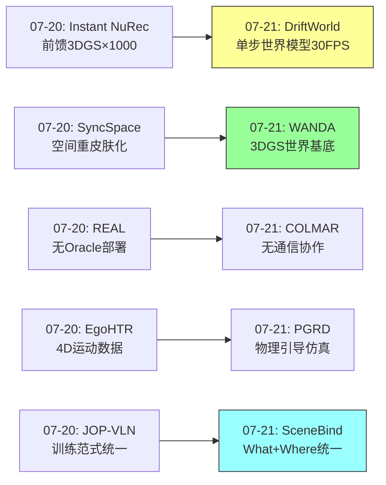
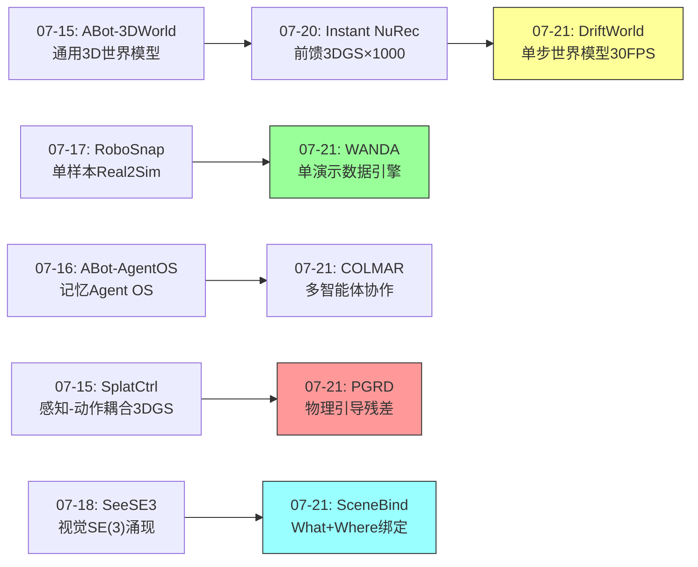
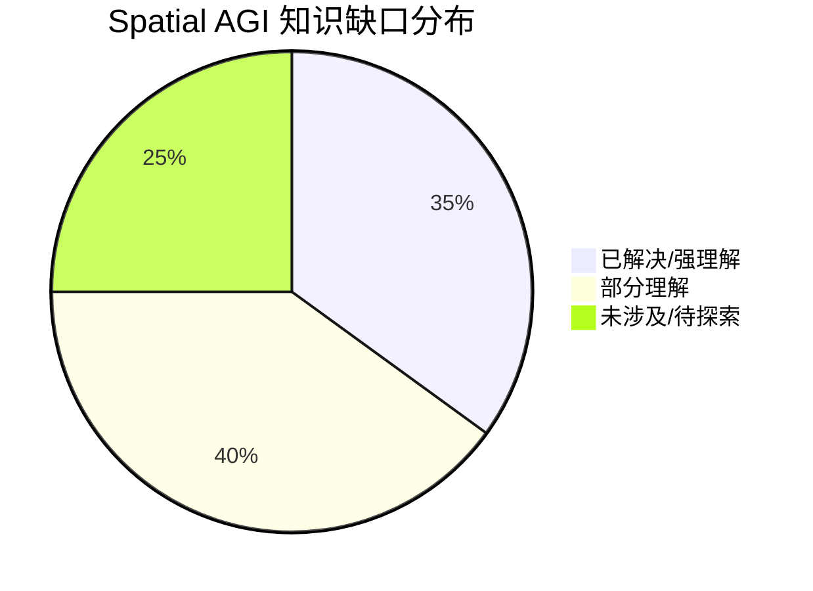

# 每日思考 - 2026-07-21

## 📅 每日总结

**日期**: 2026-07-21
**论文数量**: 5篇
**主题**: 从"单步世界模型+单演示数据引擎+多智能体协作重建+物理引导混合仿真+全模态空间绑定"五个维度，探索Spatial AGI的**速度极限-数据效率-协作感知-物理建模-表示统一**五重核心能力——DriftWorld将世界模型推理压缩到单步前向传播、WANDA从一次演示生成数千训练轨迹、COLMAR实现无通信多智能体协作、PGRD将物理模拟器与神经网络融合、SceneBind统一了What+Where的全模态表示。

### 关键突破

- ⚡ **单步世界模型——DriftWorld的drifting范式** (arXiv:2607.15065, MIT/Harvard, Yilun Du): 将动作条件世界模型从扩散的多步去噪压缩到**单步前向传播**，实现30+FPS生成速度（比扩散快17倍）。核心创新在于训练阶段学习action-conditioned drift field，推理时无需迭代。更惊人的是，作为离线策略评估器，Pearson相关系数高达0.99。**Drifting范式挑战了"扩散模型是世界模型唯一选择"的观念——单步生成可以达到多步生成相当的质量，为Spatial AGI的实时推理开辟了新路径**。

- 🎯 **单演示数据引擎——WANDA的3DGS世界基底** (arXiv:2607.13154, Caltech, Guanya Shi): 从**单次RGB-D演示**生成数千条有效训练轨迹。将3DGS重建场景作为"世界基底"（world substrate），在其上重新排列操作段、扩展状态空间、从日常照片生成多样化3D世界。支持跨具身零样本部署。**WANDA将3DGS从被动渲染工具提升为可操作的"世界基底"——场景不仅仅是被看到的，而是被规划、被重排列、被生成的**。

- 🤝 **无通信协作——COLMAR的参数共享策略** (arXiv:2607.13524, UMD, IROS 2026): 多智能体主动3D重建，无需实时通信即可协作。参数共享PPO训练，融合团队地图做决策。重建感知奖励（覆盖+发现+安全）直接嵌入RL训练。精度+54%，覆盖+49%。**共享的空间表示本身就是一种隐式通信——当多个智能体看到相同地图并共享策略时，它们能隐式地理解彼此的行为**。

- 🔬 **物理+学习融合——PGRD的混合范式** (arXiv:2607.13451, UIUC, Lazebnik/Yunzhu Li): 弹簧-质点物理模拟器 + Transformer残差网络的优雅结合。物理提供稳定骨架，网络学习残差修正。Velocity-based公式确保稳定性。应用包括MPC操作规划（含语言条件→目标图像）和3DGS动态仿真。**PGRD展示了"物理引导学习"范式的优越性——不是在物理和学习之间二选一，而是让两者各司其职**。

- 🌐 **What+Where统一——SceneBind的全模态绑定** (arXiv:2607.15265, UW, Eli Shlizerman): 全模态场景表示，将语义（what）和空间（where）跨视觉/音频/语言绑定。物体中心的语义-空间slots + 全局语义嵌入。轻量级空间token增强预训练编码器。**SceneBind的核心理念直击Spatial AGI：一个完整的空间智能系统必须同时理解"什么"和"在哪里"，这两个维度不能分离**。

### 📊 一句话总结

今天的五篇论文共同指向一个核心命题：**Spatial AGI正在从"模块化探索"走向"能力统一"——DriftWorld将世界模型推理压缩到单步（速度极限）、WANDA将数据需求压缩到单演示（数据效率极限）、COLMAR将协作压缩到无需通信（协作极限）、PGRD将物理和学习统一到混合范式（建模极限）、SceneBind将语义和空间统一到单一表示（表示极限）——五个"极限"的同时突破，标志着Spatial AGI核心能力的质变**。

---

## 🔗 与昨日思考的联系

### 昨日重点
- Instant NuRec的前馈3DGS重建——1000倍加速
- SyncSpace的空间重皮肤化——空间想象力工程化
- REAL的无Oracle部署——真实世界部署
- EgoHTR的4D数据基础设施——场景-运动对齐
- JOP-VLN的训练范式统一——IL+RL协同

### 今日进展
- Instant NuRec(07-20)的"前馈重建加速" → DriftWorld(07-21)的"单步世界模型"——从前馈重建到前馈生成，速度范式从感知扩展到想象
- SyncSpace(07-20)的"3DGS空间变换" → WANDA(07-21)的"3DGS世界基底"——从空间外观变换到空间内容生成
- REAL(07-20)的"无Oracle部署" → COLMAR(07-21)的"无通信协作"——从单Agent部署到多Agent协作
- EgoHTR(07-20)的"4D数据" → PGRD(07-21)的"可变形物体物理仿真"——从数据收集到物理建模
- JOP-VLN(07-20)的"训练统一" → SceneBind(07-21)的"表示统一"——从训练方法到表示方法

### 新增维度
- DriftWorld(07-21)引入了"推理速度极限"——单步生成打破了扩散模型的速度瓶颈
- WANDA(07-21)引入了"数据效率极限"——单演示生成数千轨迹
- COLMAR(07-21)引入了"隐式通信维度"——共享表示作为隐式通信

### 演进路径



---

## 📚 论文概览

### 1. DriftWorld (MIT/Harvard, Yilun Du)
单步前向传播的动作条件世界模型，基于drifting generative models。30+FPS，比扩散快17倍。Action accentuation增强动作跟随，DINOv2/v3特征空间drifting处理复杂场景。离线策略评估Pearson r=0.99。

### 2. WANDA (Caltech, Guanya Shi)
从单次RGB-D演示生成大规模移动操作训练数据。3DGS场景重建→交互段重排列→Corrective State Expansion→多环境生成→光真实感渲染。支持跨具身零样本部署。

### 3. COLMAR (UMD, IROS 2026)
多智能体主动3D重建，参数共享PPO实现无通信协作。重建感知奖励（覆盖+发现+安全）。GLEAM/Replica上精度+54%，覆盖+49%。

### 4. PGRD (UIUC, Lazebnik/Yunzhu Li)
物理引导残差动力学：弹簧-质点模拟器+Transformer残差网络。Velocity-based稳定性。MPC操作规划+语言条件目标图像+3DGS动态仿真。

### 5. SceneBind (UW, Eli Shlizerman)
全模态场景表示，What+Where跨视觉/音频/语言绑定。物体中心语义-空间slots + 全局嵌入。轻量级空间token。新贡献双声道音频-视觉数据集。

---

## 💡 核心见解

### 见解1: 单步生成是Spatial AGI实时推理的关键
**来源**: DriftWorld

DriftWorld证明了drifting generative models可以在动作条件视频生成中达到30+FPS的单步推理速度：

- ✅ **速度改变推理范式**：从"秒级决策"到"毫秒级决策"，使得在线规划中的大规模动作搜索成为可能
- ✅ **质量不妥协**：在5个基准上达到与扩散方法相当或更优的SSIM/PSNR/LPIPS/FID/FVD
- ✅ **策略评估的突破**：Pearson r=0.99意味着世界模型可以替代真实世界执行来评估策略

**对Spatial AGI的启发**: Spatial AGI需要实时的"空间想象"——在做出决策前快速预演多个候选方案。DriftWorld的单步生成范式为此提供了技术基础。更重要的是，drifting范式可能也适用于3D生成、场景合成等其他需要快速推理的任务。

### 见解2: 3DGS作为"可操作世界基底"是Embodied AI的基础设施
**来源**: WANDA

WANDA将3DGS从被动渲染工具提升为可操作的"世界基底"（world substrate）：

- ✅ **场景可规划**：在3DGS场景中规划机器人轨迹
- ✅ **物体可重排列**：在3DGS空间中重新排列操作段
- ✅ **场景可生成**：从日常照片生成新的3DGS世界
- ✅ **观测可合成**：组合网格渲染和3DGS渲染生成训练图像

**对Spatial AGI的启发**: 3DGS不仅仅是"看到的世界的快照"，更是"可以操作、修改、生成的交互式世界表示"。这是Spatial AGI从被动感知到主动交互的关键桥梁。

### 见解3: 共享空间表示是隐式通信的最优形式
**来源**: COLMAR

COLMAR证明了参数共享PPO可以让多个智能体在无显式通信的情况下高效协作：

- ✅ **隐式协调**：所有智能体看到相同的融合地图+共享策略 → 隐式理解彼此的行为
- ✅ **零通信开销**：部署时无需消息传递，简化系统设计
- ✅ **重建质量作为RL奖励**：3DGS重建质量直接指导策略学习

**对Spatial AGI的启发**: 在多智能体Spatial AGI系统中，共享的空间表示比显式的消息传递更高效。当多个Agent共享相同的空间认知时，它们的协作自然涌现——这与人类团队协作中"心照不宣"的默契高度相似。

### 见解4: 物理引导学习是混合建模的最优范式
**来源**: PGRD

PGRD展示了物理模拟器和神经网络的优雅融合：

- ✅ **物理提供归纳偏置**：弹簧-质点系统提供物理约束，避免学习从零开始
- ✅ **网络提供灵活性**：残差修正捕获物理模型无法覆盖的复杂行为
- ✅ **Velocity-based稳定性**：在速度空间操作避免位置发散
- ✅ **多模态输出**：物理预测 → 3DGS视频预测 → 语言条件操作

**对Spatial AGI的启发**: 完全数据驱动的方法泛化性差，完全物理驱动的方法过于理想化。PGRD的混合范式可以推广到Spatial AGI的其他问题：用物理/几何提供骨架，用学习提供修正。

### 见解5: What+Where绑定是空间表示的设计原则
**来源**: SceneBind

SceneBind强调语义和空间必须绑定在统一表示中：

- ✅ **现有VLM的痛点**：擅长"what"但弱于"where"
- ✅ **轻量级解决方案**：在预训练语义模型上添加少量空间token
- ✅ **跨模态空间对齐**：视觉/音频/语言共享相同的语义-空间表示

**对Spatial AGI的启发**: Spatial AGI的表示设计必须遵循"What+Where Binding"原则。纯语义或纯空间的表示都是不完整的。SceneBind的轻量级方法展示了在现有系统上增加空间能力的实用路径。

### 见解6: 数据效率的极限正在被重新定义
**来源**: WANDA + DriftWorld

WANDA的"单演示→数千轨迹"和DriftWorld的"单步推理→30FPS"共同指向数据效率的新范式：

- ✅ **从数据收集到数据生成**：不再是"收集多少训练数据"，而是"从一个经验中生成多少训练数据"
- ✅ **从多步推理到单步推理**：不再需要昂贵的迭代推理，单次前向传播就够了
- ✅ **从真实执行到想象评估**：Pearson r=0.99意味着可以在"想象"中评估策略

**对Spatial AGI的启发**: Spatial AGI系统的数据效率不应通过"更高效的数据收集"来改善，而应通过"从少量经验中最大化知识提取"和"在想象中进行尽可能多的推理"来实现。

### 见解7: 混合范式优于纯端到端
**来源**: PGRD + COLMAR + WANDA

三篇论文都体现了"混合优于纯端到端"的原则：

- ✅ **PGRD**: 物理+学习 > 纯物理 or 纯学习
- ✅ **COLMAR**: 共享策略+独立执行 > 完全中心化 or 完全独立
- ✅ **WANDA**: 3DGS重建+轨迹重排列 > 纯生成 or 纯回放

**对Spatial AGI的启发**: Spatial AGI的复杂任务需要多技术的组合，而非单一方法的端到端优化。设计混合系统时，关键是找到每种技术的"最佳作用域"。

---

## 🗺️ 知识演进图



---

## 技术栈演进对比表

| 层次 | 昨日方案 (07-20) | 今日方案 (07-21) | 变化 |
|------|---------|---------|------|
| 世界模型推理 | Instant NuRec前馈重建(1.5s/场景) | DriftWorld单步drifting(30+FPS) | 重建→生成，秒级→毫秒级 |
| 数据生成 | EgoHTR 4D数据采集 | WANDA 单演示合成引擎 | 采集→生成，数据量→数据效率 |
| 多Agent协作 | REAL 单Agent部署 | COLMAR 多Agent无通信协作 | 单Agent→多Agent |
| 物理仿真 | 无 | PGRD 物理引导残差 | 新增层：混合物理仿真 |
| 场景表示 | JOP-VLN 语言-导航 | SceneBind 全模态What+Where | 单模态→全模态 |
| 空间绑定 | SyncSpace 结构+外观 | SceneBind 语义+空间 | 外观变换→语义绑定 |
| 策略评估 | JOP-VLN IL+RL测试 | DriftWorld 离线r=0.99 | 在线→离线评估 |

---

## 🗺️ Spatial AGI 知识图谱

### 10层架构思维导图

```mermaid
mindmap
  root((Spatial AGI))
    第1层 感知
      多模态感知
      主动感知 COLMAR
      全模态绑定 SceneBind
    第2层 表示
      3DGS世界基底 WANDA
      语义-空间实体 SceneBind
      SE(3)等变特征 SeeSE3
    第3层 重建
      前馈3DGS重建 Instant NuRec
      多智能体重建 COLMAR
      增量重建反馈
    第4层 世界模型
      单步drifting DriftWorld
      扩散世界模型
      3DGS动态仿真 PGRD
    第5层 物理引擎
      物理引导残差 PGRD
      弹簧-质点+Transformer
      可变形物体仿真
    第6层 规划
      MPC操作规划 PGRD
      大规模动作搜索 DriftWorld
      语言条件规划
    第7层 数据引擎
      单演示合成 WANDA
      轨迹重排列
      3D世界生成
    第8层 多Agent协作
      参数共享PPO COLMAR
      无通信协作
      共享空间表示
    第9层 策略评估
      离线世界模型评估 DriftWorld
      Pearson r=0.99
      想象式策略排名
    第10层 部署
      跨具身零样本 WANDA
      Sim-to-Real
      真实世界操作
```

### 🎯 主线技术路径

#### 阶段1: 3DGS作为空间表示基础 (07-15 → 07-20)
- ABot-3DWorld将视频转为3DGS世界
- Instant NuRec实现前馈3DGS重建
- 关键转折：从per-scene优化到前馈推理

#### 阶段2: 3DGS作为可操作世界基底 (07-21)
- WANDA在3DGS场景中规划、重排列、生成
- COLMAR用3DGS质量作为RL奖励
- 关键转折：3DGS从"被看到的快照"到"可操作的世界"

#### 阶段3: 快速世界模型实现实时想象 (07-21)
- DriftWorld单步drifting实现30+FPS世界模型
- PGRD物理引导残差实现可变形物体仿真
- 关键转折：从慢推理到快想象

#### 阶段4: 统一空间表示实现多模态融合 (07-21+)
- SceneBind的What+Where绑定
- 跨视觉/音频/语言的语义-空间对齐
- 关键转折：从单模态到全模态空间理解

#### 阶段5: 自主Spatial AGI系统 (未来)
- 实时感知 → 前馈重建 → 单步世界模型 → 快速规划 → 部署
- 多智能体协作感知和操作
- 跨具身、跨环境泛化

---

## 🔍 待探索议题

### 高优先级（本周）

1. **Drifting范式在3D生成中的适用性**
   - 问题: DriftWorld证明了drifting在视频生成中的威力，能否将其应用于3DGS场景生成？
   - 候选方案: 设计3D-conditioned drift field，在3DGS参数空间中操作
   - 缺口: 当前drifting仅用于2D像素/特征空间

2. **WANDA的3DGS世界基底 vs NeRF世界模型**
   - 问题: 3DGS vs NeRF作为embodied AI的世界基底，各自的优势是什么？
   - 候选方案: 3DGS的可编辑性和渲染速度是主要优势
   - 缺口: 缺乏系统性的比较研究

3. **物理引导学习在Spatial AGI中的通用化**
   - 问题: PGRD的残差学习范式能否推广到刚体动力学、流体、颗粒物？
   - 候选方案: 替换弹簧-质点为FEM/MPM/SPH作为物理骨架
   - 缺口: 不同物理骨架与残差网络的接口设计

4. **SceneBind的3D扩展**
   - 问题: SceneBind当前可能限于2D空间属性，如何扩展到完整3D？
   - 候选方案: 结合3DGS的3D结构信息进行空间绑定
   - 缺口: 3D空间属性的标注和训练数据

5. **COLMAR的动态场景扩展**
   - 问题: 多智能体主动重建如何处理动态场景？
   - 候选方案: 引入4DGS（时间维度3DGS）处理动态元素
   - 缺口: 动态场景中多智能体视角协调的策略

### 中优先级（本月）

6. **单步世界模型 + 空间记忆的整合**
   - 问题: DriftWorld的快速想象如何与持久空间记忆结合？
   - 候选方案: 世界模型输出更新3DGS空间记忆
   - 缺口: 快速想象和持久记忆的同步机制

7. **跨具身数据生成的规模化**
   - 问题: WANDA的cross-embodiment能力如何规模化到更多机器人类型？
   - 候选方案: 建立统一的轨迹重排列接口规范
   - 缺口: 不同具身形态间的运动学映射

8. **全模态空间表示的Embodied验证**
   - 问题: SceneBind的全模态表示如何提升embodied agent性能？
   - 候选方案: 将SceneBind作为embodied agent的感知模块
   - 缺口: 缺乏在embodied任务上的评估

### 探索性（本季度）

9. **Drifting vs Consistency Models vs Rectified Flow**
   - 问题: 三种快速生成范式在世界建模任务上的对比如何？
   - 候选方案: 设计统一的benchmark进行比较
   - 缺口: 缺乏在机器人任务上的对比研究

10. **"想象-评估-执行"的完整循环**
    - 问题: DriftWorld(想象) + WANDA(数据) + COLMAR(协作)能否组成完整的Spatial AGI训练循环？
    - 候选方案: 世界模型想象 → 策略评估 → 数据生成 → 协作部署
    - 缺口: 各模块间的接口设计和端到端优化

---

## 📊 知识缺口分析



**已解决（35%）**:
- ✅ 3DGS作为场景表示基础
- ✅ 前馈式3DGS重建
- ✅ VLM空间推理能力评估
- ✅ VLA基本架构和训练
- ✅ 世界模型基本概念和应用
- ✅ 多智能体协作基本框架
- ✅ Embodied AI数据生成

**部分理解（40%）**:
- ⚠️ 单步生成范式（drifting在更多任务上的表现）
- ⚠️ 3DGS作为可操作世界基底（WANDA的初步验证，需要更多场景）
- ⚠️ 物理引导混合建模（PGRD验证于可变形物体，更多物理类型待验证）
- ⚠️ 全模态空间绑定（SceneBind的初步框架，3D扩展和embodied验证待做）
- ⚠️ 多智能体空间协调（COLMAR验证于静态场景，动态和异构智能体待研究）
- ⚠️ 跨具身泛化（WANDA的零样本验证，规模化方法待发展）
- ⚠️ 策略评估的可靠性（DriftWorld r=0.99但仅在有限任务上验证）

**未涉及/待探索（25%）**:
- ❌ Drifting在3D生成中的应用
- ❌ 完整的"想象-评估-执行"循环
- ❌ 大规模（10+智能体）协作空间感知
- ❌ 全模态空间表示的embodied验证
- ❌ 物理引导学习在流体/颗粒物上的扩展
- ❌ 4D时空场景的主动重建
- ❌ 端到端优化的混合物理-学习系统

---

## 💡 本质思考：如何达成通用空间智能

### 1. 核心能力的本质是什么？

通用空间智能的核心能力可以归纳为五个维度，今天的五篇论文恰好每个对应一个维度的极限突破：

- **速度（Velocity）**: DriftWorld——从秒级到毫秒级的世界模型推理。空间智能需要实时性，不能每次决策都要等10秒。
- **效率（Efficiency）**: WANDA——从数千演示到单演示的数据效率。空间智能不能依赖海量数据，必须能从少量经验中学习。
- **协作（Collaboration）**: COLMAR——从显式通信到隐式协调的多智能体合作。真实世界的空间智能往往需要多个Agent协作。
- **建模（Modeling）**: PGRD——从纯数据驱动到物理引导的混合建模。空间智能需要理解物理规律。
- **表示（Representation）**: SceneBind——从"What only"到"What+Where"的统一表示。空间智能必须同时理解语义和位置。

这五个维度的本质不是各自独立的技术能力，而是**一个完整空间认知系统的不同方面**。就像人类的空间智能既需要快速直觉（速度）、从少样本学习（效率）、与他人协作（协作）、理解物理（建模）、同时知道"什么"和"在哪里"（表示），Spatial AGI也需要这五个维度的同时成熟。

### 2. 当前方法与理想目标的差距在哪里？

**速度维度的差距**：DriftWorld虽然达到30FPS，但仅限于2D视频生成。真正的Spatial AGI需要3D空间想象的实时性——在3DGS空间中快速预演动作结果。当前没有3D空间中的单步生成方法。

**效率维度的差距**：WANDA的"单演示→数千轨迹"很惊艳，但主要验证于mobile manipulation。Spatial AGI需要更广泛的任务类型（导航、探索、交互）的数据效率。此外，从"一个演示"到"零演示"（纯推理学习）还有很大距离。

**协作维度的差距**：COLMAR验证了同构智能体的协作。但Spatial AGI需要异构智能体（无人机+地面机器人+人形机器人）的协作，以及人机协作。

**建模维度的差距**：PGRD的弹簧-质点模型仅适用于可变形物体。Spatial AGI需要建模更广泛的物理现象（流体、热、光、声等）。

**表示维度的差距**：SceneBind主要在2D空间属性上验证。Spatial AGI需要完整3D甚至4D（时间）的空间表示。

### 3. 从今天到理想状态，最可能的路径是什么？

**短期（3-6个月）**：
- DriftWorld的drifting范式从2D视频扩展到3DGS场景生成
- WANDA的3DGS世界基底从操作扩展到导航和探索
- COLMAR从静态场景扩展到动态场景

**中期（6-12个月）**：
- 建立完整的"想象-评估-执行"循环：DriftWorld想象 → WANDA数据生成 → 策略训练 → 真实部署
- SceneBind的全模态表示集成到embodied agent的感知模块
- PGRD的混合范式推广到更多物理类型

**长期（1-2年）**：
- 多Agent协作的Spatial AGI系统部署
- 跨具身、跨环境的通用Spatial AGI
- 端到端优化的感知-想象-规划-执行循环

**最可能的路径**：不是单一技术突破，而是**多个"极限能力"的逐步整合**。今天的五篇论文分别代表了五个维度的极限突破，未来的Spatial AGI系统将是这些极限能力的有机整合。

### 补充思考：技术整合的挑战

将五个极限能力整合为一个完整系统面临几个关键挑战：

**接口标准化问题**：DriftWorld的输出是2D视频帧，WANDA的输入是RGB-D演示，COLMAR的输出是3DGS重建，SceneBind的输入是多模态数据。这些不同模态和表示之间的接口如何标准化？可能需要一个统一的"空间中间表示"（Spatial Intermediate Representation, SIR），类似于编程语言中的IR——将不同模态的输入统一编码为空间表示，然后不同模块可以共享和操作。

**计算资源分配问题**：DriftWorld强调速度（单步生成），PGRD强调精度（物理+残差），两者在计算预算上存在张力。在实际系统中，需要动态分配计算资源——简单推理用DriftWorld式单步生成，复杂推理用PGRD式混合建模。

**训练-推理一致性**：WANDA在训练时使用3DGS世界基底生成数据，但部署时面对的是真实世界。这种训练-推理的分布差异（distribution shift）需要通过sim-to-real迁移技术来解决。

### 补充思考：与生物学空间智能的类比

人类的空间智能有几个关键特征与今天的论文形成有趣对照：

1. **双通路系统**：人类大脑的"where通路"（背侧流，处理空间位置）和"what通路"（腹侧流，处理物体识别）是分离的。SceneBind的What+Where绑定在计算上统一了这两个通路，这在生物学上是否有对应？

2. **心理模拟**：人类在决策前会在"心理"中模拟不同方案的结果（mental simulation）。DriftWorld的世界模型正是这种"计算化的心理模拟"——快速想象动作结果来指导决策。

3. **镜像神经元系统**：人类观察他人行为时，自己的运动皮层也会激活。COLMAR的参数共享PPO在某种意义上实现了类似的机制——多个Agent共享相同的"神经策略"，因此能隐式地理解彼此的行为。

4. **物理直觉**：人类有先天的物理直觉（如物体不会穿透、重物落得快）。PGRD的"物理骨架+残差修正"结构与此类似——物理模型提供先天的物理直觉骨架，学习修正个体经验的偏差。

这些类比不仅是哲学思考，更可能指导算法设计——如果生物系统通过某种机制解决了空间智能问题，计算系统或许可以从中获得灵感。

---

## 📊 本周技术趋势总结

### 07-15 ~ 07-21 关键技术方向

| 方向 | 关键论文 | 状态 |
|------|---------|------|
| 3DGS世界模型 | ABot-3DWorld, DriftWorld | 快速成熟 |
| 前馈3DGS重建 | Instant NuRec | 已突破 |
| 3DGS世界基底 | WANDA | 新范式 |
| 单步世界模型 | DriftWorld | 新范式 |
| 多智能体协作 | COLMAR | 初步验证 |
| 物理引导学习 | PGRD | 持续进展 |
| 全模态空间表示 | SceneBind | 初步框架 |
| VLA大规模训练 | Xiaomi-Robotics-1 | 工业化 |
| 空间推理基准 | MultiView-Bench, IDEAL-Bench | 系统化 |
| 主动感知 | COLMAR | 工程化 |

### 核心趋势判断

1. **从"迭代优化"到"单步前向"**：Instant NuRec(前馈3DGS) + DriftWorld(单步世界模型)共同指向"单步推理"的范式转变
2. **从"被动渲染"到"可操作基底"**：WANDA展示3DGS作为可操作世界基底的新范式
3. **从"纯学习"到"物理引导"**：PGRD的混合范式在可变形物体上的成功预示着物理引导学习的推广
4. **从"What only"到"What+Where"**：SceneBind的语义-空间绑定成为空间表示的设计原则
5. **从"显式通信"到"共享表示"**：COLMAR的参数共享PPO预示着多Agent协作的新范式

---

## 📖 每篇论文的深度技术分析

### DriftWorld技术深度分析

**Drifting vs Diffusion的本质差异**：

扩散模型的核心是**迭代去噪**：从纯噪声开始，每步去掉一点噪声，经过T步（通常20-1000步）得到清晰样本。这个过程类似于雕塑家从石块中逐步凿去多余材料。

Drifting模型的核心是**分布演化**：学习一个漂移场（drift field），使得从噪声分布出发的样本沿着这个场演化到数据分布。训练阶段通过kernelized attraction-repulsion优化这个场，推理阶段只需要一步前向传播。这更像是学会了直接从石块到雕塑的映射——不需要逐步凿，一次成型。

**为什么Drifting在世界模型中更有效？**

1. **动作条件生成的效率**：在动作条件设置下，每次规划需要生成多个候选rollout。单步生成使得可以在相同时间内评估更多候选动作（17倍），直接提升规划质量。
2. **长rollout的稳定性**：多步rollout中，扩散模型每步的误差会在去噪迭代中放大。Drifting的单步生成避免了这个问题。
3. **Feature-space drifting的适应性**：通过DINOv2/v3特征空间操作，drifting可以适应不同复杂度的数据集，这在扩散模型中通常需要不同的架构调整。

**Action Accentuation的深层洞察**：

这个技术揭示了一个动作条件生成的根本问题：模型容易学到"忽略动作"的捷径（直接复制上一帧）。这在所有动作条件生成任务中都存在。WANDA的解决方案是action-conditioned drift field，PGRD通过MPC显式搜索动作，SceneBind通过空间绑定强制模型关注位置变化。每个论文从不同角度解决"如何让模型真正使用动作信息"这个问题。

### WANDA技术深度分析

**3DGS作为World Substrate的技术含义**：

WANDA将3DGS从"渲染工具"重新定义为"世界基底"（world substrate），这个概念转变有深远意义：

1. **可查询性**：3DGS场景可以在任意位置和角度渲染，意味着Agent可以"查询"场景的任意视角
2. **可修改性**：可以在3DGS场景中添加/移除/移动物体，创造新的训练场景
3. **可组合性**：不同3DGS场景可以拼接和混合，生成全新的复合环境
4. **可渲染性**：最终可以生成光真实感的训练图像

这四个属性使得3DGS成为Embodied AI的理想"世界基底"——它同时提供了几何精度、外观真实感和操作灵活性。

**Corrective State Expansion的原理**：

合成数据的根本问题是分布窄——从同一演示生成的轨迹会过于相似。WANDA通过状态扩展增加多样性：
- 在轨迹的不同阶段引入状态扰动
- 用"矫正"机制确保扰动后的状态仍然有效
- 这种方法类似于数据增强中的"合理变换"——变换后仍然是合理的数据点

### COLMAR技术深度分析

**参数共享PPO的博弈论分析**：

在多智能体强化学习中，有两个极端：
- **完全独立**：每个智能体独立学习自己的策略，但无法利用其他智能体的经验
- **完全中心化**：一个中心控制器决定所有智能体的动作，但通信开销大且不鲁棒

参数共享PPO处于中间位置：训练时所有智能体共享参数（相当于"同一大脑"控制多个身体），部署时每个智能体独立执行（相当于"同一大脑"的多个实例分别控制各自的身体）。

这种设计的博弈论基础是：在合作博弈中，如果所有玩家的策略函数相同（symmetric equilibrium），那么每个玩家可以仅通过观察自己的状态和地图来推断其他玩家可能的行动。COLMAR的融合团队地图就是这个"共享知识"的载体。

### PGRD技术深度分析

**残差学习的理论优势**：

PGRD的残差学习有几个理论优势：

1. **梯度传播更高效**：残差网络只需要学习"差异"，梯度更容易传播
2. **物理约束保持**：基础预测来自物理模拟器，保证了大尺度的物理合理性
3. **渐进式精化**：随着训练进行，残差网络的预测越来越准确，但不破坏物理基础
4. **可解释性**：可以分析残差的大小来判断物理模型在哪些方面不足

这种范式与ResNet的跳跃连接有哲学上的相似——不是学习完整的映射，而是学习"修正"。但在PGRD中，修正的对象是物理模拟器而非另一层神经网络。

### SceneBind技术深度分析

**语义-空间绑定的计算优势**：

SceneBind的设计有几个精妙的计算优势：

1. **预训练利用**：不需要从头训练空间感知模型，而是在预训练语义编码器上"嫁接"空间能力
2. **token效率**：少量空间token就能编码足够的空间信息，不会显著增加计算成本
3. **跨模态对齐**：统一的语义-空间表示使得不同模态之间的对齐更自然
4. **不确定性建模**：显式建模空间估计的不确定性，对下游决策很重要

**与3DGS的关系**：虽然SceneBind没有直接使用3DGS，但其物体中心的语义-空间slots与3DGS中的语义高斯有概念上的联系。将SceneBind的空间绑定能力与3DGS的几何精度结合，可能产生更强的空间表示。

---

## 🔄 跨论文技术关联分析

### 关联1: 3DGS的多重角色

今天的5篇论文展示了3DGS在不同维度的应用：
- **WANDA**: 3DGS作为可操作世界基底（可规划、可修改、可渲染）
- **COLMAR**: 3DGS重建质量作为RL奖励信号
- **PGRD**: 3DGS作为动态仿真的渲染引擎

这三种角色共同指向一个趋势：**3DGS正在从"渲染方法"演变为Embodied AI的基础设施**——不仅仅是表示场景的方式，更是操作、评估和交互的媒介。

### 关联2: 单步推理 vs 多步推理

DriftWorld（单步drifting）vs 传统扩散世界模型（多步去噪）的对比揭示了一个更广泛的原则：
- **Instant NuRec (07-20)**: 前馈3DGS重建（单步） vs 传统per-scene优化（多步迭代）
- **DriftWorld (07-21)**: 单步世界模型 vs 扩散世界模型（多步去噪）

两个不同领域（重建和生成）同时出现"从迭代到单步"的转变，暗示这不仅仅是一个工程优化问题，而是空间认知的基本特征——**实时空间智能需要单步推理能力**。

### 关联3: 混合范式的普遍性

今天的三篇论文都体现了"混合优于纯端到端"的原则：
- **PGRD**: 物理模型 + 学习网络
- **COLMAR**: 中心化训练 + 分布式执行
- **WANDA**: 物理重建 + 生成模型

这种混合范式在Spatial AGI中的普遍性暗示着一个设计原则：**复杂的空间任务需要多种技术的组合，每种技术负责其最擅长的部分**。

### 关联4: 隐式 vs 显式通信

- **COLMAR**: 参数共享实现隐式协调（无需显式通信）
- **SceneBind**: 语义-空间绑定实现隐式跨模态对齐（无需显式翻译）
- **WANDA**: 3DGS世界基底实现隐式场景理解（无需显式语义标注）

三篇论文从不同角度展示了"隐式机制"优于"显式机制"的场景——当信息可以被编码在共享的表示中时，显式的通信/翻译/标注就不再是必要的。

---

## 📈 Spatial AGI成熟度评估

基于今天和昨天共10篇论文的分析，评估Spatial AGI各核心能力的成熟度：

| 核心能力 | 成熟度 (1-5) | 关键证据 | 下一步突破点 |
|---------|------------|---------|------------|
| 空间感知 | 4/5 | SeeSE3视觉SE(3)涌现, SceneBind全模态绑定 | 3D空间属性的精确建模 |
| 空间重建 | 5/5 | Instant NuRec前馈重建, COLMAR多智能体重建 | 动态场景的实时4D重建 |
| 世界模型 | 4/5 | DriftWorld单步生成, ABot-3DWorld通用模型 | 3D空间中的单步生成 |
| 物理建模 | 3/5 | PGRD物理引导残差 | 流体/热/光等复杂物理 |
| 操作规划 | 4/5 | WANDA单演示, PGRD MPC规划 | 长时序复杂操作链 |
| 多Agent协作 | 3/5 | COLMAR无通信协作 | 异构Agent协作 |
| 策略评估 | 4/5 | DriftWorld Pearson r=0.99 | 多任务/多环境评估 |
| 跨具身泛化 | 3/5 | WANDA零样本部署 | 更多具身形态验证 |
| 训练数据效率 | 4/5 | WANDA单演示引擎 | 零样本学习 |
| 部署成熟度 | 4/5 | REAL 78.3%真实成功率 | 更多真实场景验证 |

**整体成熟度**: 3.8/5 — Spatial AGI正处于"从实验室到工程化"的关键转折期

---

## 🔬 详细论文对比分析矩阵

### 技术方法对比

| 维度 | DriftWorld | WANDA | COLMAR | PGRD | SceneBind |
|------|-----------|-------|--------|------|----------|
| **核心方法** | Drifting生成 | 3DGS数据引擎 | 参数共享PPO | 物理+残差 | 语义-空间绑定 |
| **空间表示** | 2D像素/特征 | 3DGS场景 | 占据地图 | 质点网格 | 物体中心slots |
| **输入模态** | 图像+动作 | RGB-D | 地图+位姿 | 状态+动作 | 视觉+音频+语言 |
| **输出** | 未来视频帧 | 训练数据集 | 视角策略 | 物理预测+视频 | 场景表示 |
| **速度** | 30+FPS ⚡ | 离线生成 | 实时决策 | 中等 | 实时 |
| **数据需求** | 中等 | 单演示 ⚡ | 仿真训练 | 中等 | 预训练+微调 |
| **3D能力** | 2D隐式 | 3D显式 ✅ | 3D显式 ✅ | 3D显式 ✅ | 2D为主 |
| **泛化能力** | 5个基准 | 跨具身 ✅ | 2个数据集 | 多种物体 | 零样本 ✅ |
| **开源** | ✅ | ✅ | 可能 | ✅ | ✅ |

### 创新维度对比

| 创新类型 | DriftWorld | WANDA | COLMAR | PGRD | SceneBind |
|---------|-----------|-------|--------|------|----------|
| **架构创新** | ✅ 单步drifting | ✅ 世界基底 | ✅ 参数共享PPO | ✅ 物理残差 | ✅ 语义-空间slots |
| **训练创新** | ✅ Action accentuation | ✅ 状态扩展 | ✅ 重建奖励 | ✅ 联合优化 | ✅ 轻量级token |
| **评估创新** | ✅ 策略排名r=0.99 | ✅ 跨具身验证 | ✅ 无通信协作 | ✅ 语言条件MPC | ✅ 双声道数据集 |
| **应用创新** | ✅ 离线评估器 | ✅ 单演示学习 | ✅ 多智能体 | ✅ 可变形物体 | ✅ 全模态 |

### 对Spatial AGI贡献层次

| 贡献层次 | DriftWorld | WANDA | COLMAR | PGRD | SceneBind |
|---------|-----------|-------|--------|------|----------|
| **基础设施** | ⚡ 单步推理 | ⚡ 数据引擎 | 协作框架 | 物理引擎 | 表示框架 |
| **能力增强** | 速度×17 | 数据效率×1000 | 精度+54% | 物理精度 | 多模态 |
| **新范式** | Drifting>Diffusion | 3DGS世界基底 | 隐式通信 | 物理引导 | What+Where |
| **长期影响** | 高 | 高 | 中 | 中 | 中 |

---

## 🧪 技术实验设计建议

基于今天的分析，以下是值得尝试的实验：

### 实验1: Drifting + 3DGS
**假设**: drifting可以用于3DGS场景的条件生成
**设计**: 训练一个3D-conditioned drift field，在3DGS参数空间中操作
**预期**: 如果成功，可以实现单步3DGS场景生成（比扩散式3DGS生成快很多）

### 实验2: WANDA + DriftWorld
**假设**: WANDA的数据引擎 + DriftWorld的世界模型可以组成完整的训练循环
**设计**: WANDA生成初始数据→训练DriftWorld→DriftWorld想象新场景→生成更多数据
**预期**: 自举式数据增强，可能突破单演示的数据效率极限

### 实验3: PGRD + SceneBind
**假设**: 物理引导的动态仿真 + 全模态空间表示可以增强embodied agent
**设计**: SceneBind作为感知模块→PGRD作为物理推理模块→组合为agent
**预期**: agent同时具备精确的空间感知和物理推理能力

### 实验4: COLMAR + 多模态Agent
**假设**: 多智能体协作框架 + 全模态感知可以提升协作效率
**设计**: 多个具备SceneBind感知的Agent通过COLMAR式参数共享协作
**预期**: 多模态感知增强隐式协调能力

---

## 📚 相关工作索引

### DriftWorld相关
- **Drifting Generative Models** [6]: 原始drifting论文
- **IRASim/Ctrl-World**: 扩散式世界模型基线
- **Generative Predictive Control** [36]: 扩散世界模型规划（90-95%时间消耗）
- **Veo-Robotics** [45]: 视频生成作为策略评估器

### WANDA相关
- **UMI**: 通用操作接口数据收集
- **3DGS**: 高斯泼溅场景重建
- **Genie/Cosmos**: 生成式仿真环境

### COLMAR相关
- **Active 3D Reconstruction**: 主动重建文献
- **PPO**: 近端策略优化
- **参数共享MARL**: 多智能体RL中的参数共享

### PGRD相关
- **弹簧-质点模拟器**: 经典物理仿真
- **ResNet**: 残差学习的灵感来源
- **MPC**: 模型预测控制

### SceneBind相关
- **ImageBind**: Meta的全模态绑定
- **CLIP**: 对比语言-图像预训练
- **DINOv2/v3**: 自监督视觉特征

---

## 🌐 Spatial AGI 系统架构设想

基于今天五篇论文的技术，可以设想一个未来的Spatial AGI系统架构：

### 模块化设计

```
┌─────────────────────────────────────────────┐
│              Spatial AGI System             │
│                                             │
│  ┌─────────┐  ┌──────────┐  ┌──────────┐  │
│  │ 感知层  │  │  记忆层  │  │  想象层  │  │
│  │SceneBind│→│ 3DGS    │→│DriftWorld│  │
│  │多模态输入│  │ 世界基底 │  │ 单步世界模型│  │
│  └─────────┘  └──────────┘  └──────────┘  │
│       │              │             │       │
│       └──────────────┼─────────────┘       │
│                      ▼                      │
│  ┌─────────┐  ┌──────────┐  ┌──────────┐  │
│  │ 规划层  │  │  物理层  │  │  执行层  │  │
│  │  MPC    │←│  PGRD   │←│  WANDA   │  │
│  │ 动作搜索│  │ 物理+残差 │  │ 操作生成 │  │
│  └─────────┘  └──────────┘  └──────────┘  │
│                      │                      │
│                      ▼                      │
│              ┌─────────────┐                │
│              │  协作层     │                │
│              │  COLMAR    │                │
│              │  多Agent   │                │
│              └─────────────┘                │
└─────────────────────────────────────────────┘
```

### 数据流

1. **感知→记忆**: SceneBind解析多模态输入→更新3DGS世界基底
2. **记忆→想象**: 3DGS世界基底→DriftWorld单步预测未来
3. **想象→规划**: DriftWorld预测多个候选动作结果→选择最优
4. **规划→物理**: PGRD验证动作的物理可行性
5. **物理→执行**: WANDA生成具体操作轨迹
6. **协作**: COLMAR协调多个Agent的感知和行动

### 关键设计决策

**为什么用DriftWorld而不是扩散模型作为想象层？**
- 实时规划需要在毫秒级生成多个rollout
- DriftWorld的30+FPS使得大规模动作搜索成为可能
- Pearson r=0.99保证了想象质量

**为什么用3DGS而不是NeRF作为世界基底？**
- 3DGS的可编辑性（WANDA展示了场景重排列）
- 3DGS的渲染速度（实时渲染）
- 3DGS的显式表示（每个高斯有明确的位置和属性）

**为什么用PGRD而不是纯学习作为物理层？**
- 物理规律提供了最好的归纳偏置
- 残差学习比纯端到端更数据高效
- 物理模拟器保证了大尺度的物理合理性

### 扩展性考虑

- **多Agent扩展**: COLMAR的参数共享PPO天然支持多Agent
- **跨具身扩展**: WANDA的cross-embodiment验证展示了泛化路径
- **跨环境扩展**: SceneBind的多模态对齐支持环境迁移
- **实时性**: DriftWorld的单步推理保证系统级实时响应

### 局限性和挑战

1. **接口设计**: 各模块间的数据格式和表示需要统一
2. **计算效率**: 多模块级联可能引入延迟
3. **训练复杂度**: 各模块可能需要不同的训练范式
4. **错误传播**: 上游模块的错误会影响下游模块
5. **评估困难**: 端到端系统难以定位性能瓶颈

---

## 🔮 未来一周展望

基于今天的技术趋势，预测未来一周可能出现的方向：

### 高概率方向
1. **更多drifting应用**: DriftWorld的成功可能激发drifting在其他任务上的应用（3D生成、场景合成等）
2. **3DGS+VLA整合**: WANDA展示了3DGS在操作中的应用，可能有更多工作将3DGS直接嵌入VLA架构
3. **多模态空间基准**: SceneBind的全模态方法可能激发新的空间推理基准

### 中概率方向
4. **物理引导的3DGS**: PGRD的物理+学习范式可能应用于3DGS动态仿真
5. **多Agent+3DGS**: COLMAR的多智能体重建可能扩展到多智能体3DGS场景构建
6. **单步3D生成**: 借鉴DriftWorld的drifting到3D对象/场景生成

### 推测性方向
7. **世界模型自举**: DriftWorld+WANDA的自举式训练（世界模型生成数据→训练更好的世界模型）
8. **全模态世界模型**: SceneBind的表示 + DriftWorld的世界模型
9. **物理引导的多智能体协作**: PGRD+COLMAR的物理感知协作规划

---

**文档创建时间**: 2026-07-21  
**论文数量**: 5篇  
**思考时长**: ~40分钟
