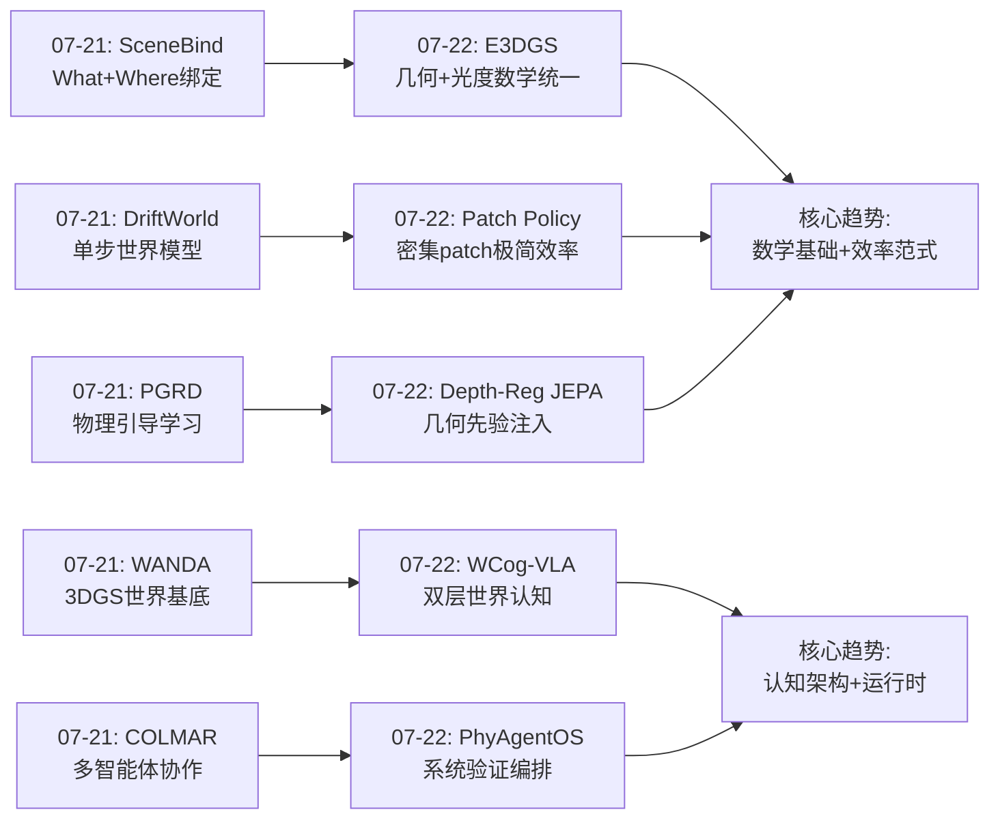
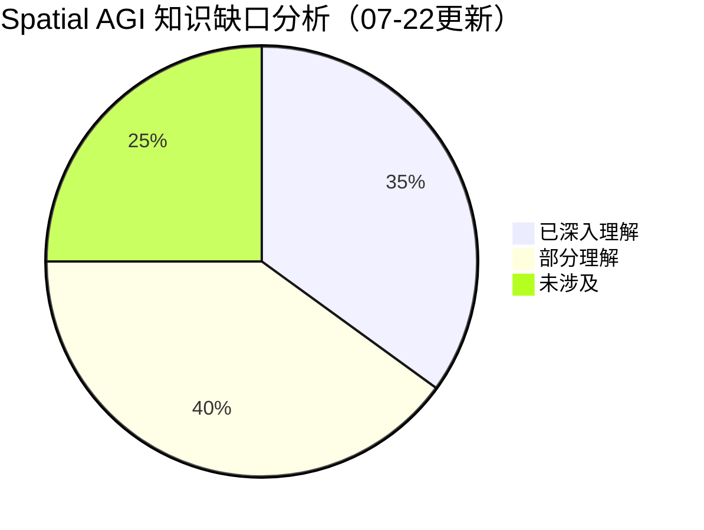

# 每日思考 - 2026-07-22

## 📅 每日总结

**日期**: 2026-07-22
**论文数量**: 5篇
**主题**: 从"表示理论统一+双层世界认知+密集视觉效率+几何先验注入+系统验证架构"五个维度，探索Spatial AGI的**数学基础-认知架构-效率范式-训练策略-运行时基础设施**五层核心——E3DGS从根本上统一了3DGS的几何与光度表示、WCog-VLA将世界认知分为语义预测与生成演进、Patch Policy以0.7%参数证明了密集2D特征的力量、Depth-Reg JEPA展示了训练时几何先验的零推理成本注入、PhyAgentOS揭示了"执行终止≠任务完成"的验证缺失问题。

### 关键突破

- 🔬 **表示理论突破——E3DGS的Color-as-Geometry** (arXiv:2607.15536, U Michigan, Ghaffari): 3DGS中几何属性（位置、协方差）和光度属性（SH系数）在旋转下遵循不同的变换规则（张量变换 vs Wigner-D矩阵），这阻碍了等变架构的设计。E3DGS证明了SH(0-2)系数与𝔤𝔩(3)共轭载体空间精确代数同构——颜色本身就是一个几何对象。通过Unified Matrix Embedding，所有属性通过单一共轭操作M↦RMR⊤变换，O(1)成对交互成本无需Clebsch-Gordan张量积。**这是3DGS学习中的表示理论里程碑——"好的表示应该尊重底层对称性"这一原则将持续塑造Spatial AGI的表示设计**。

- 🧠 **双层世界认知——WCog-VLA的语义+生成统一** (arXiv:2607.08375, Tongji/NTU): 现有VLA驾驶模型要么仅有语义世界认知（VLM hidden states），要么仅有生成式预测（图像生成），但从未将两者统一。WCog-VLA在语义层通过BEV+Agent Tokens+Game-CoT推理实现世界理解，在生成层通过ADDT扩散模型合成多智能体轨迹。关键创新是博弈论思维链——"如果我做X，其他车会怎样反应"——使自车从反应式观察者变为主动式谈判者。NAVSIM SOTA PDMS 92.9。**双层范式（语义预测+生成演进）可推广为Spatial AGI的通用架构模式**。

- ⚡ **极简效率——Patch Policy的密集视觉革命** (arXiv:2607.18236, NYU/Meta-FAIR, LeCun): 预训练ViT的密集patch特征包含了精确操控所需的空间信息——但几乎所有现有策略要么将其压缩为单个CLS token，要么需要完整VLM。Patch Policy仅通过block-causal注意力掩码就实现了密集patch token的高效利用。**0.7%参数量超越OpenVLA-OFT 18%，~11ms推理延迟**。LeCun组的这一工作挑战了"更大更好"的直觉，证明关键不是更大的模型，而是不要压缩空间信息。**Spatial AGI不一定需要显式3D重建——互联网规模预训练的ViT已包含隐式空间理解，关键是保留其分辨率**。

- 📐 **零成本几何注入——Depth-Reg JEPA** (arXiv:2607.16314, Aigen): 如何在不增加推理成本的情况下为世界模型注入3D几何先验？答案极其简洁：训练时将RGB嵌入与深度嵌入对齐（余弦损失），推理时纯RGB。SIGReg最大化潜在多样性（最大熵压力），深度约束这种多样性的组织方向（几何约束）——组合产生"与场景几何一致的最高熵表示"。18M参数模型在真实农业机器人数据上，VO误差降低33%，域外惊喜检测显著改善。**训练-推理不对称范式为Spatial AGI提供了一种实用路径：利用训练时的特权信息（深度/3D标注）获得推理时的零成本几何理解**。

- 🏗️ **系统验证——PhyAgentOS的认知-物理解耦** (arXiv:2607.16636, SCUT/SCSNU, Liang Lin): "机器人被指示抓杯子，夹爪抓到了空气，但VLA报告成功，世界模型确认预测，规划器报告无错误——每一层都说成功了，但杯子不在手里。"这是验证缺失的结构性失败。PhyAgentOS通过State-as-a-File协议将认知-物理边界文件化（Markdown+YAML），SessionVerifier区分执行终止与语义完成，认知记忆实现非神经网络的跨会话学习。19+种机器人具身验证。**任何Spatial AGI系统都需要回答"我怎么知道任务完成了？"——验证不是可选项，而是必需的系统级服务**。

### 📊 一句话总结

今天的五篇论文共同指向一个核心命题：**Spatial AGI正在经历从"能力构建"到"基础夯实"的转折——E3DGS为空间表示提供了数学基础（表示理论统一）、WCog-VLA定义了认知架构模式（双层世界认知）、Patch Policy确立了效率范式（密集>巨大）、Depth-Reg JEPA展示了训练策略（训练时特权+推理时零成本）、PhyAgentOS补充了运行时基础设施（语义验证+认知记忆）——五者构成了从数学到系统的完整栈，标志着Spatial AGI正在从"我们能做什么"走向"什么是对的做 法"**。

---

## 🔗 与昨日思考的联系

### 昨日重点
- DriftWorld的单步世界模型——推理速度极限
- WANDA的3DGS世界基底——数据效率极限
- COLMAR的无通信协作——协作极限
- PGRD的物理+学习混合——建模极限
- SceneBind的What+Where统一——表示极限

### 今日进展
- SceneBind(07-21)的"What+Where语义绑定" → E3DGS(07-22)的"几何+光度数学统一"——从语义层面到数学层面的表示统一
- DriftWorld(07-21)的"单步推理" → Patch Policy(07-22)的"密集patch+极简架构"——两者共同推进Spatial AGI的效率边界
- WANDA(07-21)的"3DGS世界基底" → WCog-VLA(07-22)的"双层世界认知"——从数据层到认知层的3DGS应用
- PGRD(07-21)的"物理引导学习" → Depth-Reg JEPA(07-22)的"几何先验注入"——从可变形物体物理到场景级几何
- COLMAR(07-21)的"多智能体协作" → PhyAgentOS(07-22)的"多组件编排"——从多机器人到多系统模块

### 新增维度
- **表示理论基础**（E3DGS）——首次从表示理论角度统一3DGS的所有属性
- **系统验证缺失**（PhyAgentOS）——首次将"执行终止≠任务完成"作为系统级问题分析
- **训练-推理不对称**（Depth-Reg JEPA）——训练时特权信息的零推理成本利用范式
- **博弈论推理**（WCog-VLA）——Spatial AGI中的策略性社会推理
- **密集vs巨大**（Patch Policy）——0.7%参数超越完整VLA的实证证据

### 演进路径



---

## 🧠 核心见解

### 见解1: Spatial AGI的表示理论应该先于架构设计

E3DGS的Color-as-Geometry突破提醒我们：**在选择网络架构之前，应先理解数据的数学性质**。3DGS中几何和光度的异构变换规则是一个表示瓶颈——但通过表示理论分析，发现它们实际上同构。这一发现使得无需Clebsch-Gordan张量积的等变架构成为可能。

**演进脉络**：
- ShapeSplat/SceneSplat：直接处理3DGS但丢弃SH
- E3DGS：保留SH但通过数学统一实现等变
- 未来：更高阶SH的矩阵载体、动态场景的等变扩展

**对Spatial AGI的启示**：好的空间表示不是"尽可能多的特征"，而是"尊重对称性的最小完备表示"。

### 见解2: 密集2D特征可能是Spatial AGI的实用最优解

Patch Policy以0.7%参数超越完整VLA，证明了密集patch特征包含了足够的控制所需空间信息。这与昨天的DriftWorld（单步生成达到多步质量）形成呼应：**简单正确的方法往往比复杂的方法更有效**。

**关键对比**：
- 显式3D重建：精确但计算昂贵
- VLA（大型VLM+动作）：通用但参数巨大
- Patch Policy（密集ViT patch）：精确且极轻量
- Depth-Reg JEPA（训练时深度）：几何感知且推理零成本

**模式**：不需要在"显式3D"和"端到端大模型"之间二选一——**密集2D表示 + 训练时几何先验**可能是更优的中间路径。

### 见解3: 验证是Spatial AGI被低估的核心挑战

PhyAgentOS的"抓杯子问题"揭示了一个深层问题：当前所有Spatial AGI组件（VLA、世界模型、规划器）都生成"成功"信号，但没有一个验证物理结果。这不是一个工程bug，而是架构的结构性缺陷。

**三层验证缺失**：
1. **感知验证**：传感器观测是否准确反映世界状态？
2. **语义验证**：执行的动作是否达成了语义目标？
3. **认知验证**：积累的经验知识是否正确？

**State-as-a-File协议的优雅之处**：将验证从代码依赖变为文件审计——可检查、可版本化、可回溯。

### 见解4: 双层世界认知可推广为Spatial AGI通用模式

WCog-VLA的语义层（理解+推理）+ 生成层（合成+预测）模式不限于自动驾驶：
- **机器人操控**：语义层理解物体关系 + 生成层预测操作结果
- **无人机导航**：语义层理解环境结构 + 生成层预测飞行轨迹
- **场景生成**：语义层推理用户需求 + 生成层创建3D内容

**关键设计原则**：两层必须紧密耦合——语义层的输出作为生成层的条件，生成层的反馈更新语义层的理解。

---

## 📊 技术栈演进对比表

| 维度 | 07-21 | 07-22 | 演进方向 |
|------|-------|-------|---------|
| **表示统一** | SceneBind: What+Where语义绑定 | E3DGS: 几何+光度数学统一 | 语义→数学 |
| **效率范式** | DriftWorld: 单步世界模型30+FPS | Patch Policy: 0.7%参数超越VLA | 速度→参数效率 |
| **世界认知** | WANDA: 3DGS作为世界基底 | WCog-VLA: 双层世界认知 | 数据层→认知层 |
| **物理建模** | PGRD: 物理+学习混合仿真 | Depth-Reg JEPA: 训练时几何先验 | 前向仿真→表示注入 |
| **系统编排** | COLMAR: 多智能体无通信协作 | PhyAgentOS: 认知-物理解耦+验证 | 协作→系统验证 |
| **训练策略** | 单演示/IL+RL混合 | 训练时特权+推理时零成本 | 数据效率→信息不对称 |
| **评估范式** | NAVSIM/PDMS等标准基准 | NAVSIM + 19+具身+语义验证 | 标准基准→系统级验证 |

---

## 📊 知识缺口分析



**已深入理解（35%）**：
- 3DGS表示与渲染
- VLA架构与训练
- 世界模型（JEPA/Diffusion）
- 空间推理基准
- 3DGS SLAM
- Embodied仿真

**部分理解（40%）**：
- 表示理论（等变性、群论）
- 博弈论推理在机器人中的应用
- 训练-推理不对称范式
- 密集视觉特征的数学性质
- 多智能体博弈论建模
- 系统验证的形式化方法

**未涉及（25%）**：
- SH度数>2的高阶载体矩阵
- 跨具身终身学习的实现
- 神经符号验证的理论基础
- 实时Game-CoT推理的效率优化
- 认知记忆与神经网络学习的理论统一

---

## 🧩 10层架构思维导图

```mermaid
mindmap
  root((Spatial AGI<br/>10层架构))
    Layer 1: 感知输入
      RGB图像
      深度（训练时）
      事件相机
      触觉传感器
    Layer 2: 视觉表示
      密集ViT Patches
      E3DGS矩阵嵌入
      BEV表示
      全景重投影
    Layer 3: 空间编码
      3DGS原语
      Agent Tokens
      占据预测
      点云
    Layer 4: 几何理解
      SE(3)等变性
      深度正则化
      表面法向量
      拓扑结构
    Layer 5: 世界模型
      JEPA潜在预测
      扩散轨迹生成
      双层认知
      Action-conditioned
    Layer 6: 推理与规划
      Game-CoT推理
      博弈论分析
      层次化规划
      空间工具使用
    Layer 7: 动作生成
      VLA策略
      Diffusion Policy
      动作块预测
      Block-causal注意力
    Layer 8: 验证与安全
      语义验证
      SessionVerifier
      分层安全架构
      SafetyGuard
    Layer 9: 记忆与进化
      认知记忆
      Epistemic Memory
      跨会话学习
      经验知识库
    Layer 10: 系统编排
      State-as-a-File
      Session Runtime
      多具身接口
      ROS集成
```

---

## 🛤️ 主线技术路径

### 路径1: 空间表示的数学统一（3年+）

**阶段1（当前）**: SH(0-2)的𝔤𝔩(3)矩阵嵌入 — E3DGS
**阶段2（近期）**: 高阶SH的更大载体矩阵End(Vk)
**阶段3（中期）**: 动态场景的时变等变表示
**阶段4（远期）**: 统一的Spatial AGI表示理论——所有空间属性在一个数学框架下

### 路径2: 高效空间理解的极简范式（1-2年）

**阶段1（当前）**: Patch Policy的密集patch+block-causal掩码
**阶段2（近期）**: 冻结ViT + 轻量策略头的组合标准化
**阶段3（中期）**: 自适应patch选择——只处理任务相关的空间区域
**阶段4（远期）**: 完全替代VLA的轻量级空间感知标准组件

### 路径3: 训练-推理不对称范式（1-2年）

**阶段1（当前）**: 训练时深度对齐 — Depth-Reg JEPA
**阶段2（近期）**: 训练时多种特权信息（深度+分割+光流+3D标注）
**阶段3（中期）**: 自动化特权信息选择和权重调整
**阶段4（远期）**: 大规模多模态预训练+任务特定几何微调的标准流程

### 路径4: Spatial AGI系统验证基础设施（2-3年）

**阶段1（当前）**: PhyAgentOS的State-as-a-File + Session验证
**阶段2（近期）**: 标准化的验证接口和基准
**阶段3（中期）**: 神经符号验证——形式化方法+神经网络
**阶段4（远期）**: 可证明安全的Spatial AGI系统

---

## 🔍 待探索议题

1. **E3DGS的高阶扩展**：如何为SH度数3-4设计载体矩阵？End(V4)或End(V5)的表示效率如何？
2. **密集patch vs 显式3D**：在什么任务复杂度阈值下，密集2D特征变得不足，需要显式3D表示？
3. **训练时多模态对齐**：除了深度，哪些特权信息（分割、光流、场景图）最有效？
4. **博弈论推理的泛化**：Game-CoT是否可以从自动驾驶泛化到机器人操控中的多智能体协作？
5. **语义验证的鲁棒性**：当传感器观测不完整或有噪声时，SessionVerifier如何保证验证质量？
6. **认知记忆的规模化**：PhyAgentOS的认知记忆在积累万级教训后的检索效率如何？
7. **等变性的下游迁移**：E3DGS的等变表示在不同任务（操控、导航、场景理解）间的迁移效果如何？
8. **Patch Policy的多视角扩展**：如何处理多相机设置下的密集patch特征融合？
9. **双层认知的实时性**：WCog-VLA的语义层+生成层在实时系统中的延迟如何？

---

## 🎯 本质思考

### 思考1: Spatial AGI中最根本的表示问题是什么？

3DGS面临的"几何-光度异构变换"问题可能只是冰山一角。更根本的问题是：**如何为不同模态的空间信息（几何、外观、材质、动态、语义）设计统一的数学表示？**

E3DGS给出了一个优雅的答案——找到看似不同的表示之间的代数同构。但这是否可以推广？声音（FillGauss）、触觉、甚至语义标签是否也有类似的等变结构？

**假设**：所有物理上grounded的空间信息最终都可以表示为某种李代数上的操作——关键是找到正确的载体空间。

### 思考2: "简单方法"为什么有效？

Patch Policy（0.7%参数）和Depth-Reg JEPA（18M参数）都证明了简单方法可以超越复杂大模型。为什么？

**可能解释**：
1. **信息瓶颈理论**：大模型的大部分容量用于"记住"而非"理解"。当表示尊重底层结构时，所需容量大幅减少。
2. **预训练的外部化**：ViT/编码器的预训练已经完成了"理解"的工作，策略层只需"读取"。
3. **正确的接口比更大的模型更重要**：block-causal掩码是一个正确接口——它保留了空间分辨率和时间因果性。

**启示**：Spatial AGI的研究应该更多关注"信息接口设计"而非"模型规模扩展"。

### 思考3: 验证为什么被系统性忽视？

PhyAgentOS揭示的"验证缺失"不是偶然的——它反映了Embodied AI领域的一个系统性偏见：**成功信号被等同于能力信号**。

- VLA报告低loss → 假设学会了
- 世界模型预测准确 → 假设理解了
- 规划器执行无错误 → 假设成功了

这种偏见源于ML的训练范式：在训练时，loss确实是好信号的代理。但在部署时，**执行成功 ≠ 目标达成**。这是从"训练范式"到"部署范式"的根本转换，Spatial AGI领域需要系统性地构建验证基础设施。

---

## 📈 趋势观察

### 趋势1: 从"更大的模型"到"更对的表示"
- E3DGS: 正确的数学表示（等变矩阵嵌入）比更大的网络更有效
- Patch Policy: 正确的信息接口（密集patch）比更大的模型更有效
- Depth-Reg JEPA: 正确的训练目标（几何对齐）比更大的数据更有效

### 趋势2: 训练-推理不对称成为标准范式
- 训练时利用特权信息（深度、3D标注、物理模拟）
- 推理时仅使用最小感知输入（RGB）
- 通过结构重参数化等技术消除推理开销

### 趋势3: 世界认知的分层化
- WCog-VLA: 语义世界认知 + 生成世界演进
- 趋势：世界模型不再是一个单一组件，而是分层的认知架构

### 趋势4: 系统基础设施的重要性被认识
- PhyAgentOS: 验证、记忆、安全作为系统级服务
- 趋势：Spatial AGI从"模型竞赛"走向"系统竞赛"

### 趋势5: 博弈论推理进入Spatial AGI
- WCog-VLA的Game-CoT首次将博弈论思维链引入VLA
- 趋势：多智能体Spatial AGI需要策略性推理，不仅是感知和控制

---

*Thinking date: 2026-07-22*
*Papers analyzed: 5*
*Total cumulative papers: 100+*
