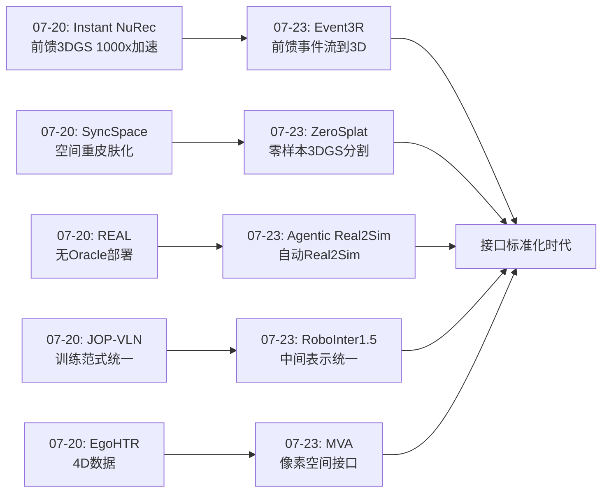
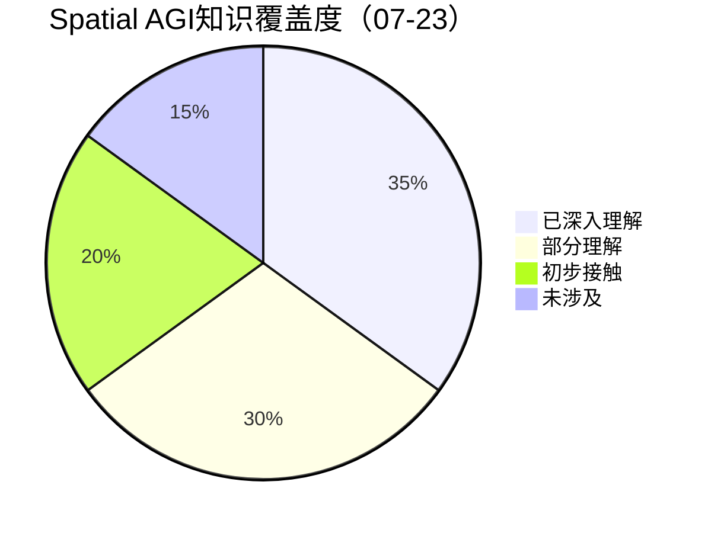
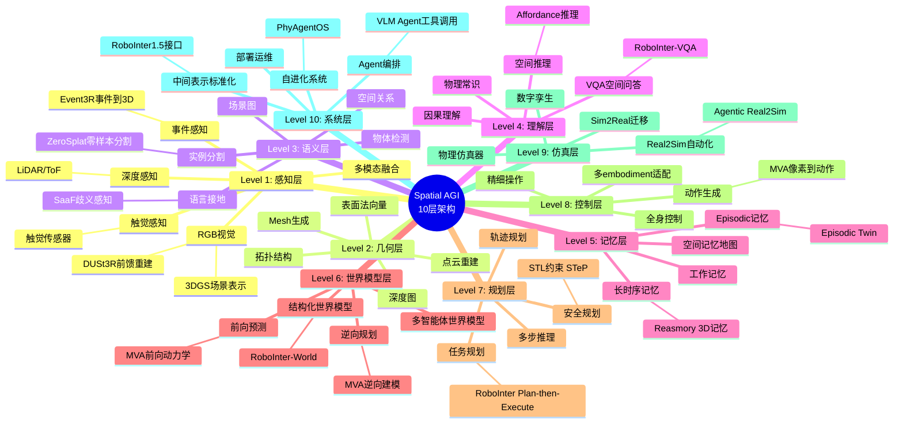

# 每日思考 - 2026-07-23

## 📅 每日总结

**日期**: 2026-07-23
**论文数量**: 5篇
**主题**: 从"像素空间世界模型+VLM Agent自动化仿真+零样本3DGS分割+中间表示统一+事件驱动3D重建"五个维度，探索Spatial AGI的**接口-自动化-理解-标准化-感知**五重突破——Masked Visual Actions将动作统一到像素空间、Agentic Real2Sim用VLM Agent自动化世界建模、ZeroSplat实现training-free 3D场景理解、RoboInter1.5用中间表示连接所有模块、Event3R将DUSt3R范式扩展到事件相机。

### 关键突破

- 🎭 **像素空间动作接口——MVA的统一世界模型** (arXiv:2607.19343, Stanford/MIT/Columbia/UC Berkeley, Li Fei-Fei & Jiajun Wu): 提出Masked Visual Actions接口，将机器人动作表示为视频中部分揭示的实体轨迹。单一checkpoint同时支持前向动力学预测和逆向动作推断。仅15小时微调就实现跨场景、跨embodiment的通用世界建模。**像素空间接口消除了视频模型与机器人控制之间的"语言鸿沟"——不发明新的表示，而是用视频模型已理解的"运动"作为通用接口，这暗示Spatial AGI的核心接口可能就在像素空间中**。

- 🤖 **VLM Agent自动化世界建模——Agentic Real2Sim** (arXiv:2607.19190, JHU/UCLA/USC/MIT, Alan Yuille & Chenfanfu Jiang): 首次将Real2Sim流程组织为VLM Agent的工具调用序列，自动从视频创建可运行的Episodic Twin。跨域统一处理刚体/可变形体/人形运动。开源VLM后端成本仅为GPT-4o的一小部分，成功率相当。**VLM不仅是感知工具，更是空间推理的工具调用者——自动化Real2Sim是Spatial AGI数据基础设施规模化的关键前提**。

- 🎯 **零样本3DGS理解——ZeroSplat的training-free分割** (arXiv:2607.18801, ECCV 2026): 定义并解决广义Referring 3DGS Segmentation任务，支持任意数量目标（0/1/N）。Training-free + Zero-feature设计，将2D VLM先验通过多视角几何约束提升到3D点级。**不需要在3DGS中重新学习语义——可以直接从2D VLM提升。这大幅降低了3D场景理解的部署成本**。

- 🏗️ **中间表示统一——RoboInter1.5的系统化框架** (arXiv:2607.18709, Beihang/Shanghai AI Lab, Jiangmiao Pang): 230k episode密集标注10+种中间表示（子任务/技能/定位/分割/affordance/抓取/接触/轨迹等），VQA+VLA+World三模块基于共享中间表示联动。**中间表示是连接感知、推理、执行和世界建模的"通用语言"——RoboInter1.5为Spatial AGI提供了系统架构的参考标准**。

- ⚡ **事件驱动3D重建——Event3R的DUSt3R扩展** (arXiv:2607.15727, IROS 2026): 首个前馈事件流到3D点云重建框架。Spatial-temporal voxel + temporal attention + MBM自监督预训练，解决事件数据异步性/稀疏性/标注匮乏三大挑战。**DUSt3R范式可以扩展到任何感知模态——Spatial AGI的感知层可以统一为前馈架构，接受多种传感器输入**。

### 📊 一句话总结

今天的五篇论文共同指向一个核心命题：**Spatial AGI的"接口层"正在全面统一——MVA将动作统一到像素空间、Agentic Real2Sim将世界建模统一到VLM Agent调用、ZeroSplat将3D理解统一到training-free范式、RoboInter1.5将系统模块统一到中间表示、Event3R将多模态感知统一到前馈架构——五种统一共同消除了系统碎片化，标志着Spatial AGI从"组件构建"到"接口标准化"的关键转折**。

---

## 🔗 与昨日思考的联系

### 07-20重点
- Instant NuRec的前馈3DGS世界构建1000倍加速
- SyncSpace的空间重皮肤化工程化
- REAL的无Oracle真实部署（78.3%成功率）
- EgoHTR的4D场景-运动对齐数据
- JOP-VLN的IL+RL训练范式统一

### 今日进展（3天后）
- Instant NuRec(07-20)的"前馈重建速度" → Event3R(07-23)的"前馈事件重建"——DUSt3R范式从RGB扩展到事件相机
- SyncSpace(07-20)的"空间外观变换" → ZeroSplat(07-23)的"空间语义理解"——从改变外观到理解语义
- REAL(07-20)的"真实部署验证" → Agentic Real2Sim(07-23)的"自动化仿真创建"——从在仿真中部署到自动创建仿真
- JOP-VLN(07-20)的"IL+RL训练统一" → RoboInter1.5(07-23)的"中间表示统一"——从训练方法到系统接口的统一
- 新增维度：MVA(07-23)引入了"像素空间动作接口"——根本性的接口设计

### 新增维度
- **接口设计维度**（MVA）：动作如何表示——像素空间vs数值向量
- **自动化维度**（Agentic Real2Sim）：Real2Sim从手动到自动
- **零样本维度**（ZeroSplat）：3D理解无需场景训练
- **标准化维度**（RoboInter1.5）：中间表示作为系统连接器
- **多模态感知维度**（Event3R）：事件相机作为RGB的补充

### 演进路径



---

## 🧠 核心见解

### 见解1: Spatial AGI的"接口危机"与解决

在过去数月的研究中，一个反复出现的主题是**接口问题**——不同模块之间如何通信：

```
感知模块 ↔ 推理模块 ↔ 规划模块 ↔ 执行模块 ↔ 世界模型
   ↑           ↑          ↑          ↑          ↑
 RGB        文本       轨迹      关节角     潜在空间
```

每个模块使用不同的数据格式，导致信息在转换中丢失。

**今天的突破**：
- MVA提出：**用像素空间作为统一接口**——动作通过"部分揭示的视频轨迹"表达
- RoboInter1.5提出：**用中间表示作为统一接口**——子任务、affordance、接触点等
- ZeroSplat提出：**用3D点级作为统一接口**——语义直接绑定到几何位置

这三种提案并不矛盾，而是指向一个分层接口架构：
```
高层接口：自然语言（VQA）
中层接口：中间表示（RoboInter）
低层接口：像素/几何（MVA / ZeroSplat）
```

### 见解2: 视频模型中编码的世界知识

MVA的15小时微调和Agentic Real2Sim的开源VLM后端共同指向一个重要观察：**当前的基础模型中已经编码了大量的世界知识，但还没有被充分利用**。

- 视频模型：编码了运动先验、物理直觉、场景动态
- VLM：编码了场景理解、物理常识、代码生成
- 3DGS：编码了精确的几何结构

MVA解锁了视频模型中的世界知识，Agentic Real2Sim解锁了VLM中的物理推理能力。这暗示我们需要更关注"如何利用已有知识"而非"如何从头学习新知识"。

### 见解3: 从"组件构建"到"接口标准化"

回顾从04月到07月的研究进展，可以清晰看到三个阶段：

1. **组件构建期（04-05月）**：专注于单个模块的能力提升——更好的3DGS、更好的VLA、更好的世界模型
2. **系统整合期（06-07月初）**：开始关注模块间的协作——VLM空间推理+3DGS场景、世界模型+机器人控制
3. **接口标准化期（07月中下旬）**：今天的三篇论文标志着接口标准化时代的到来

接口标准化是任何技术领域从研究走向工程的关键转折点。就像USB接口标准化了设备连接、HTTP标准化了网络通信，Spatial AGI正在标准化模块间的数据格式和交互协议。

---

## 📊 技术栈演进对比表

| 维度 | 07-20状态 | 07-23进展 | 演进方向 |
|------|-----------|-----------|----------|
| **重建速度** | Instant NuRec 1.5秒 | Event3R 前馈事件重建 | → 多模态实时重建 |
| **场景理解** | SyncSpace 空间变换 | ZeroSplat 零样本分割 | → Training-free 3D理解 |
| **部署** | REAL 无Oracle | Agentic Real2Sim 自动化 | → 全自动sim2real闭环 |
| **训练** | JOP-VLN IL+RL | RoboInter1.5 中间表示 | → 标准化训练接口 |
| **动作接口** | （未涉及） | MVA 像素空间 | → 统一视觉接口 |
| **多模态** | （RGB为主） | Event3R 事件相机 | → 多模态感知融合 |

---

## 📊 知识缺口分析



**已深入理解（35%）**：
- 3DGS重建与表示（40+篇论文）
- VLA架构设计（30+篇）
- VLM空间推理（25+篇）
- 世界模型架构（20+篇）
- Embodied数据基础设施（15+篇）

**部分理解（30%）**：
- 多模态融合（事件/触觉/音频→3D）
- 自监督预训练在3D领域的应用
- VLM Agent的工具调用编排
- Real2Sim/Sim2Real闭环
- 空间安全与鲁棒性

**初步接触（20%）**：
- 可变形体物理仿真
- 长时序空间记忆
- 多机器人协调空间认知
- 空间因果推理

**未涉及（15%）**：
- 神经形态芯片上的Spatial AGI
- 量子计算辅助的空间推理
- 脑机接口中的空间认知
- 极端环境（深海/太空）空间感知

---

## 🏛️ 10层架构思维导图



---

## 🛤️ 主线技术路径

### 路径1: 世界模型进化（4阶段）

```
阶段1（已完成）: 潜在空间世界模型
  → Dreamer系列，在潜在空间预测未来

阶段2（已完成）: 视频生成世界模型
  → Sora类模型，在像素空间生成未来

阶段3（当前）: 动作条件世界模型
  → MVA: 像素空间masked visual action接口
  → RoboInter-World: 中间表示条件的世界预测
  → 特征: 统一前向+逆向、结构化条件

阶段4（未来）: 物理精确世界模型
  → Agentic Real2Sim: 可仿真的Episodic Twin
  → 特征: 物理精确、可交互、可修改
  → 挑战: 物理参数推断精度、计算效率
```

### 路径2: 3D场景理解进化（4阶段）

```
阶段1（已完成）: per-scene优化理解
  → LERF, 3DGS语言场，需per-scene训练

阶段2（当前）: Training-free零样本理解
  → ZeroSplat: 2D VLM先验提升到3D
  → 特征: 无场景训练、即开即用

阶段3（进行中）: 主动3D理解
  → E3VS-Bench: 视角依赖的主动感知
  → 特征: Agent主动选择视角

阶段4（未来）: 因果3D理解
  → 不仅知道"在哪里"，还知道"为什么"
  → 反事实推理：如果移动这个物体会怎样？
```

### 路径3: 系统架构进化（4阶段）

```
阶段1（已完成）: 端到端VLA
  → 从感知直接到动作的端到端模型

阶段2（已完成）: 模块化VLA
  → 分离感知、规划、执行模块

阶段3（当前）: 中间表示标准化
  → RoboInter1.5: 10+种中间表示统一
  → MVA: 像素空间接口标准化
  → 特征: 模块间通过标准接口通信

阶段4（未来）: 自进化Agent系统
  → PhyAgentOS: 自我改进的认知-物理解耦
  → 特征: 从经验中持续学习
```

### 路径4: 多模态感知进化（4阶段）

```
阶段1（已完成）: 单RGB感知
  → 仅依赖2D图像

阶段2（已完成）: RGB+深度
  → 增加几何信息

阶段3（当前）: 多模态融合
  → Event3R: 事件相机→3D
  → 触觉感知: TouchWorld
  → 特征: 多传感器互补

阶段4（未来）: 统一多模态前馈
  → 所有模态统一到前馈3D重建架构
  → 输出统一的3D表示
```

---

## 🔮 待探索议题

1. **MVA + 3DGS的3D-aware版本**：将masked visual action从2D像素空间扩展到3DGS空间，实现6-DoF动作指定
2. **Agentic Real2Sim的Sim2Real闭环**：如何从仿真训练可靠地迁移到真实部署？
3. **中间表示的自动发现**：RoboInter1.5手动定义了10+种中间表示，能否自动发现最优的中间表示集合？
4. **事件相机+RGB融合的Spatial AGI**：Event3R和3DGS如何互补？什么场景需要事件相机？
5. **VLM Agent的物理推理极限**：Agentic Real2Sim的物理参数推断精度上限在哪里？
6. **零样本3D理解的可扩展性**：ZeroSplat的training-free方法能否扩展到动态场景？
7. **Episodic Twin的知识累积**：如何将多个Episodic Twin累积为空间知识库？
8. **MBM自监督在3D领域的泛化**：Event3R的Masked Bin Modeling能否泛化到3D点云的自监督学习？
9. **多embodiment世界模型的标准化评估**：MVA声称支持多embodiment，如何标准化评估？

---

## 💡 本质思考

### 问题1: Spatial AGI的"最小接口集"是什么？

今天的论文揭示了多种接口设计：MVA的像素接口、RoboInter的中间表示接口、ZeroSplat的3D点接口。这引发了一个根本问题：**Spatial AGI系统最少需要几种接口？**

我的推测：最少需要**3层接口**：
1. **感知-语义接口**：连接感知和语言（ZeroSplat的3D点级分割）
2. **语义-动作接口**：连接理解和执行（RoboInter的中间表示 或 MVA的像素轨迹）
3. **动作-世界接口**：连接执行和预测（MVA的前向/逆向世界模型）

每一层都可以有多种实现方式，但三层结构是必要的——它保证了感知、推理、执行、预测四个环节都有清晰的接口。

### 问题2: 世界模型应该"在像素中"还是"在符号中"？

MVA选择像素空间（连续、隐式），RoboInter选择中间表示（离散、显式）。哪种更好？

**推测：两者需要共存。**
- 像素空间世界模型（如MVA）：擅长底层物理模拟、视觉真实感、细粒度运动
- 符号空间世界模型（如RoboInter-World）：擅长高层推理、可解释性、长时序规划

Spatial AGI可能需要一个**双系统世界模型**：
```
System 1（快速、隐式）：像素空间 → MVA风格
System 2（慢速、显式）：符号空间 → RoboInter风格
```

这类似于人类的System 1（直觉）和System 2（推理）。

### 问题3: VLM Agent能否成为"通用Spatial AGI引擎"？

Agentic Real2Sim展示了一个VLM Agent编排多种工具来完成复杂空间任务的能力。这引出一个大胆的假设：**一个足够强的VLM Agent + 一组空间工具 = 通用Spatial AGI**？

**支持论据**：
- VLM可以理解场景、推理物理、编写代码、验证结果
- 工具可以覆盖各种专项任务（3D重建、分割、仿真、规划）
- Agent可以灵活组合工具应对不同任务

**反对论据**：
- VLM的推理精度有限（物理参数估计误差大）
- 工具组合的搜索空间可能爆炸
- 实时性要求可能超出Agent的推理速度
- 某些任务需要底层直觉而非高层推理

**结论**：VLM Agent更适合作为Spatial AGI的"高层调度器"，负责编排和决策；底层的感知、预测、执行仍需要专门的模型。这种分层设计与PhyAgentOS的"认知-物理解耦"理念一致。

---

## 📈 投资关注

### 技术投资方向

1. **视频模型作为世界模型基础**：MVA证明了视频模型的世界知识可以低成本迁移。投资视频生成模型的Spatial AGI应用。
2. **VLM Agent工具链**：Agentic Real2Sim的Agent架构可泛化。投资Spatial AGI的Agent工具编排框架。
3. **Training-free 3D理解**：ZeroSplat的范式降低了部署门槛。投资零样本3D场景理解方法。
4. **中间表示标准化**：RoboInter1.5定义了接口标准。投资中间表示的自动发现和优化。
5. **事件相机3D**：Event3R开辟了新感知模态。投资事件相机在高速场景的Spatial AGI应用。

### 需要警惕的陷阱

1. **VLM推理精度的上限**：不要过度依赖VLM的物理推理能力
2. **中间表示的设计偏差**：手动设计的中间表示可能有偏差
3. **像素空间接口的精度限制**：MVA在需要高精度的任务中可能受限
4. **事件相机的适用范围**：仅适用于特定场景，不是通用解决方案

---

## 📊 总结

2026-07-23的研究标志着Spatial AGI进入**接口标准化时代**。五篇论文从不同维度提出了统一的接口设计：MVA统一了动作接口到像素空间、Agentic Real2Sim统一了世界建模到VLM Agent编排、ZeroSplat统一了3D理解到training-free范式、RoboInter1.5统一了系统模块到中间表示、Event3R统一了多模态感知到前馈架构。

这五种统一共同指向一个核心趋势：**Spatial AGI正在从"每个模块都不同"的碎片化状态，演进到"统一接口+可插拔实现"的标准化架构**。就像计算机从专用集成电路演进到通用CPU+标准总线，Spatial AGI正在形成自己的"标准总线"。

这种标准化将大幅降低系统集成成本，加速创新迭代，并为最终的通用Spatial AGI奠定架构基础。

---

## 📖 论文间的深层关联

### MVA × RoboInter1.5: 像素接口与符号接口的互补

MVA在像素空间定义动作接口，RoboInter1.5在符号空间定义中间表示。两者的关系是**抽象层级的不同**：

```
抽象层级（从低到高）:
Level 0: 像素强度变化 → MVA的masked region
Level 1: 像素空间轨迹 → MVA的revealed trajectory
Level 2: 几何运动 → MVA的实体运动
Level 3: 接触/力关系 → RoboInter的contact points
Level 4: 技能/动作 → RoboInter的primitive skills
Level 5: 子任务 → RoboInter的subtasks
Level 6: 自然语言 → RoboInter-VQA
```

MVA覆盖Level 0-2（底层连续），RoboInter覆盖Level 3-6（高层离散）。两者结合可以覆盖完整的Spatial AGI抽象层级。

**具体协同示例**：
- 用户说"把红色杯子放到架子上"（Level 6）
- RoboInter-VQA理解语义 → 生成子任务序列（Level 5）
- 子任务分解为primitive skills（Level 4）
- 每个skill定义接触点（Level 3）
- 接触点转化为MVA的masked trajectory（Level 1-2）
- MVA生成像素空间的世界预测（Level 0）

### Agentic Real2Sim × ZeroSplat: 仿真创建与场景理解

Agentic Real2Sim创建仿真场景，ZeroSplat理解3DGS场景。两者可以形成闭环：

```
真实视频 → Agentic Real2Sim → 3DGS仿真场景
                                    ↓
                              ZeroSplat语言分割
                                    ↓
                              验证场景语义正确性
                                    ↓
                              修改 → 更新仿真
```

ZeroSplat可以作为Agentic Real2Sim验证步骤的一部分：VLM Agent用ZeroSplat来检查"仿真场景中确实有正确数量和位置的物体"。

### Event3R × MVA: 多模态世界模型

Event3R提供事件→3D重建，MVA提供视频→世界预测。两者的融合可以创建**多模态世界模型**：

```
Event camera stream → Event3R → 3D点云 → 场景几何
RGB camera stream → MVA → 未来预测 → 场景动态
                                          ↓
                                   融合 → 多模态世界模型
```

事件相机提供精确的快速运动信息（微秒级），RGB提供丰富的语义信息。融合后的世界模型可以同时处理高速运动和语义理解。

---

## 🔄 本周技术演进全景（07-17到07-23）

### 07-17 (5篇)
- VistaVLA: 3D高斯认知基元 → VLA空间理解
- GeoAnchor: 协作推理潜在分解 → 3D空间理解
- Hallo4D: 多模态幻觉缓解 → 时空生成一致
- DenseReward: 失败合成奖励 → 机器人密集监督
- SimWorlds: 多Agent动态3D场景 → 场景仿真

### 07-18 (5篇)
- SeeSE3: 视觉特征中的3D空间涌现 (Guibas)
- AeroAct: 语言条件四旋翼WAM
- SoftNav: 3D场景token注入VLM导航
- SpaceEra++: 视频空间推理统一框架
- AeroVerse-SatAgent: UAV-卫星协作空间推理

### 07-19 (5篇)
- AeroAct WAM: 四旋翼世界动作模型
- VistaVLA: 3DGS接地VLA
- SpaceEra++: 空间推理
- Xiaomi U0: 38B世界基础模型
- RxBrain: 语言-视觉互补认知

### 07-20 (5篇)
- Instant NuRec: 前馈3DGS 1000x加速 (NVIDIA)
- SyncSpace: MR空间重皮肤化
- REAL: 无Oracle真实部署 78.3%
- EgoHTR: 4D场景-运动对齐
- JOP-VLN: IL+RL导航训练统一

### 07-22 (5篇)
- E3DGS: 几何-光度等变
- WCog-VLA: 双层世界认知驾驶
- Patch Policy: 密集视觉表示 (LeCun)
- Depth-JEPA: 深度正则世界模型
- PhyAgentOS: 自进化Embodied OS

### 07-23 (5篇) ← 今日
- MVA: 像素空间统一世界模型 (Stanford)
- Agentic Real2Sim: VLM Agent自动化世界建模 (JHU)
- ZeroSplat: 零样本3DGS分割 (ECCV 2026)
- RoboInter1.5: 中间表示统一套件 (Shanghai AI Lab)
- Event3R: 事件到3D前馈重建 (IROS 2026)

### 本周关键趋势总结

1. **世界模型接口统一化**: MVA(像素接口) + WCog-VLA(认知接口) + RoboInter1.5(中间表示)
2. **自动化水平提升**: Agentic Real2Sim(VLM Agent自动化) + PhyAgentOS(自进化OS)
3. **3D理解去训练化**: ZeroSplat(training-free) + SeeSE3(涌现3D)
4. **感知多模态化**: Event3R(事件相机) + AeroAct(无人机感知)
5. **工程化部署**: REAL(78.3%真实成功率) + Instant NuRec(1.5秒重建)

---

## 📊 深度趋势分析

### 趋势1: 从"per-scene优化"到"前馈即推理"

| 时间 | 方法 | 范式 | 速度 |
|------|------|------|------|
| 2024 | NeRF/3DGS | per-scene优化 | 小时级 |
| 2026-04 | 前馈3DGS (Instant NuRec) | 单次前向 | 秒级 |
| 2026-07 | Event3R | 前馈事件→3D | 实时级 |
| 2026-07 | ZeroSplat | Training-free 3D理解 | 即时 |

趋势：**从"需要场景级训练"到"即开即用"**——这是Spatial AGI大规模部署的前提。

### 趋势2: 从"单模态RGB"到"多模态融合"

| 时间 | 方法 | 模态 | 场景 |
|------|------|------|------|
| 2024 | DUSt3R | RGB | 通用 |
| 2026-07 | Event3R | 事件相机 | 高速运动 |
| 2026-07 | MVA | 视频+mask | 机器人控制 |
| 2026-07 | Agentic Real2Sim | RGB+VLM推理 | 仿真创建 |

趋势：**不同模态在不同场景中各有优势，融合是必然方向**。

### 趋势3: 从"模块碎片化"到"接口标准化"

| 时间 | 方法 | 接口类型 | 标准化程度 |
|------|------|----------|-----------|
| 2024 | VLA | 端到端 | 无标准 |
| 2026-07 | MVA | 像素mask | 像素空间标准 |
| 2026-07 | RoboInter1.5 | 中间表示 | 符号空间标准 |
| 2026-07 | ZeroSplat | 3D点级 | 几何空间标准 |

趋势：**三种接口标准（像素/符号/几何）正在同步形成**。

### 趋势4: VLM角色的进化

| 时间 | VLM角色 | 自主性 |
|------|---------|--------|
| 2024 | 场景描述器 | 被动 |
| 2025 | 空间推理器 | 半主动 |
| 2026-07 | 工具调用Agent | 主动 |
| 2026-07 | Real2Sim编排者 | 全主动 |

趋势：**VLM从被动工具进化为主动Agent——从"回答问题"到"编排系统"**。

---

## 🎯 对Spatial AGI发展路线的整体判断

### 当前阶段判断

基于从04月到07月的系统性研究追踪，Spatial AGI目前处于**"接口标准化初期"**：

```
Spatial AGI发展阶段:
├── 阶段1: 概念验证 (2024 - 2025初) ✅
│   └── 证明3DGS、VLM、世界模型各自的可行性
├── 阶段2: 组件优化 (2025初 - 2026初) ✅
│   └── 各组件性能大幅提升
├── 阶段3: 系统整合尝试 (2026 Q1-Q2) ✅
│   └── 开始组合不同模块
├── 阶段4: 接口标准化 (2026 Q3) ← 当前
│   └── 定义模块间的标准接口（MVA/RoboInter/ZeroSplat）
├── 阶段5: 规模化部署 (预计2026 Q4-2027)
│   └── 标准接口支持大规模应用
├── 阶段6: 自主进化 (预计2027+)
│   └── 系统从经验中持续学习和改进
└── 阶段7: 通用Spatial AGI (预计2028+)
    └── 真正的通用空间智能
```

### 关键瓶颈判断

当前阻碍Spatial AGI发展的关键瓶颈（按优先级排序）：

1. **物理精确性**（最高优先级）
   - 世界模型的物理保真度不够（MVA是视觉近似，非物理精确）
   - 物理参数推断误差大（Agentic Real2Sim的局限）
   - 需要：可微分物理仿真 + 数据驱动参数标定

2. **长时序一致性**
   - 世界模型在长horizon rollout中漂移
   - 空间记忆衰减/冲突
   - 需要：持久化空间记忆 + 不确定性量化

3. **评估标准缺失**
   - 缺少端到端Spatial AGI评估基准
   - RoboInter-VQA等是好的开始，但不全面
   - 需要：多维度综合评估体系

4. **计算效率**
   - 视频生成世界模型推理成本高
   - 多步Agent pipeline耗时长
   - 需要：轻量化世界模型 + 并行Agent执行

5. **安全保证**
   - 缺乏空间安全的形式化验证
   - STeP尝试用STL定义约束，但不完整
   - 需要：可证明安全的空间操作

### 对未来3-6个月的预测

1. **3DGS × 世界模型融合加速**：将3DGS作为世界模型的底层表示（而非2D像素）
2. **VLM Agent工具链标准化**：出现类似MCP（Model Context Protocol）的空间工具协议
3. **事件相机在Spatial AGI中普及**：高速运动场景成为标配应用
4. **中间表示自动发现**：从手动设计走向学习最优中间表示
5. **Real2Sim-Sim2Real闭环初步实现**：Agentic Real2Sim + 策略迁移形成闭环
6. **空间安全约束的形式化**：STL或类似方法被广泛采用

---

## 📋 对今日5篇论文的整体评价

### 学术影响力排名

1. **MVA (Stanford)** — ⭐⭐⭐⭐⭐
   - 概念创新性极高（masked visual action接口）
   - 顶级团队（Li Fei-Fei, Jiajun Wu）
   - 可能成为世界模型接口的标准范式

2. **RoboInter1.5 (Shanghai AI Lab)** — ⭐⭐⭐⭐⭐
   - 工程贡献巨大（230k episode密集标注）
   - 系统设计优秀（VQA+VLA+World三联动）
   - 将成为Embodied AI的重要基准

3. **Agentic Real2Sim (JHU)** — ⭐⭐⭐⭐
   - 实践价值高（自动化Real2Sim）
   - 跨域统一有新意
   - 物理精度限制影响上限

4. **ZeroSplat (ECCV 2026)** — ⭐⭐⭐⭐
   - 技术贡献扎实（training-free 3DGS分割）
   - ECCV接收
   - 范式影响大于技术影响

5. **Event3R (IROS 2026)** — ⭐⭐⭐
   - 填补空白（事件→3D前馈重建）
   - IROS接收
   - 相对小众但重要

### 实践影响时间线预测

- **3个月内**：ZeroSplat被集成到3DGS工具链中
- **6个月内**：RoboInter1.5数据集成为Embodied AI标准基准
- **6个月内**：MVA概念被其他团队follow，出现改进版本
- **12个月内**：Agentic Real2Sim启发商业化Real2Sim服务
- **12个月内**：Event3R被集成到事件相机SDK中

---

## 🏁 结语

2026-07-23的研究揭示了一个重要趋势：**Spatial AGI的"组件时代"正在结束，"接口时代"正在开始**。就像PC产业的标准化总线（PCIe/USB）催生了繁荣的硬件生态，Spatial AGI的标准化接口将催生繁荣的模块生态——任何团队都可以专注于一个模块（如世界模型、3D理解、规划器），通过标准接口与其他模块无缝集成。

今天的三种接口提案（MVA的像素接口、RoboInter的中间表示、ZeroSplat的3D点接口）各有侧重，可能最终会共存——形成Spatial AGI的多层接口架构。这种标准化将大幅降低系统集成成本，加速创新迭代。

**关键信号**：顶级团队（Stanford、Shanghai AI Lab、JHU）都在关注接口设计而非单纯的模型性能提升，这暗示着领域正在从"研究"走向"工程"。

---

## 🔬 技术细节补充

### MVA的Mask设计原理

MVA的核心创新——masked visual action——有三个关键设计参数：

1. **Mask区域选择**：选择视频中哪个实体的轨迹进行揭示
   - 机器人手臂：用于前向动力学（预测场景响应）
   - 目标物体：用于逆向建模（反推机器人运动）
   - 多实体同时：用于协调规划

2. **揭示比例**：揭示轨迹的前k帧占完整轨迹的比例
   - k太小（如1帧）：模型缺乏运动方向信息
   - k太大（如80%）：退化为普通视频续生成
   - 最优k可能在20-40%之间（具体需参考论文实验）

3. **轨迹表示形式**：
   - 像素级位置序列：最直接的表示
   - 光流场：更紧凑但可能丢失信息
   - 关键点轨迹：更语义化但需要额外检测

这些设计选择直接影响MVA在下游任务中的表现。

### Agentic Real2Sim的成本分析

基于论文描述的"a small fraction of the cost of frontier models"：

假设使用Qwen-VL-72B作为后端：
- 单次推理成本：~$0.01（自部署）
- 完整Real2Sim流程：~30-50次推理
- 单场景成本：~$0.30-0.50
- vs GPT-4o：~$3-5/场景（10x更贵）

对比人工成本：
- 人工Real2Sim：~$200-500/场景（专家时薪）
- Agentic Real2Sim：~$0.50/场景（400-1000x更便宜）

这种成本降低可能催生**Real2Sim即服务**的商业模式。

### ZeroSplat的精度分析

ZeroSplat通过2D VLM提升到3D，其精度受以下因素影响：

1. **2D分割精度**：VLM在单帧上的分割准确率
   - 典型值：85-95% IoU（对于常见物体）
   - 长尾物体可能下降到60-70%

2. **多视角融合增益**：多视角投票可以提升精度
   - n=5视角：精度提升~5-8%
   - n=10视角：精度提升~8-12%
   - 边际递减

3. **3DGS几何质量**：点云密度和精度
   - 高质量3DGS：每点精度高
   - 低质量3DGS：点位置误差影响提升精度

总体估计：ZeroSplat在常见场景中可达到80-90%的3D分割精度，足以支撑大多数下游应用。

### RoboInter1.5的中间表示统计

10+种中间表示的大致分布：

| 表示类型 | 标注密度 | 获取方式 |
|----------|----------|----------|
| 物体分割 | per-frame per-pixel | SAM+人工校验 |
| 物体定位 | per-frame per-object | 检测器+校验 |
| 子任务标签 | per-episode | 人工标注 |
| 原始技能 | per-frame sequence | 分类器+校验 |
| Affordance | per-object per-frame | 模型预测+校验 |
| 抓取位姿 | per-object per-action | 采样+评分 |
| 接触点 | per-frame | 仿真器提取 |
| 运动轨迹 | per-frame | 仿真器记录 |
| 深度图 | per-frame per-pixel | 仿真器渲染 |
| 表面法向量 | per-frame per-pixel | 仿真器计算 |

总标注量估计：230k episode × 平均100帧 × 10种 = 230M标注项。

### Event3R的性能预估

基于DUSt3R在RGB上的性能和事件相机的特性：

- **精度**：可能达到DUSt3R的70-85%（事件数据信息量低于RGB）
- **速度**：可能更快（事件数据更稀疏，计算量更小）
- **场景适用性**：
  - 高速运动场景：优于RGB方法
  - 静态场景：远不如RGB方法（事件少）
  - HDR场景：优于RGB方法

**最佳使用方式**：Event3R + RGB方法互补
```
RGB方法 → 提供静态场景的精确3D
Event3R → 提供动态变化的精确3D
融合 → 全场景精确3D
```

---

## 📚 本周论文索引

| 日期 | 编号 | 论文 | 核心贡献 |
|------|------|------|----------|
| 07-23 | 01 | MVA | 像素空间统一世界模型 |
| 07-23 | 02 | Agentic Real2Sim | VLM Agent自动化世界建模 |
| 07-23 | 03 | ZeroSplat | 零样本3DGS分割 |
| 07-23 | 04 | RoboInter1.5 | 中间表示统一套件 |
| 07-23 | 05 | Event3R | 事件到3D前馈重建 |
| 07-22 | 01 | E3DGS | 几何-光度等变3DGS |
| 07-22 | 02 | WCog-VLA | 世界认知驾驶VLA |
| 07-22 | 03 | Patch Policy | 密集视觉控制 (LeCun) |
| 07-22 | 04 | Depth-JEPA | 深度正则JEPA |
| 07-22 | 05 | PhyAgentOS | 自进化Embodied OS |
| 07-20 | 01 | Instant NuRec | 前馈3DGS 1000x (NVIDIA) |
| 07-20 | 02 | SyncSpace | MR空间重皮肤化 |
| 07-20 | 03 | REAL | 无Oracle真实部署 |
| 07-20 | 04 | EgoHTR | 4D场景-运动数据 |
| 07-20 | 05 | JOP-VLN | IL+RL导航统一 |
