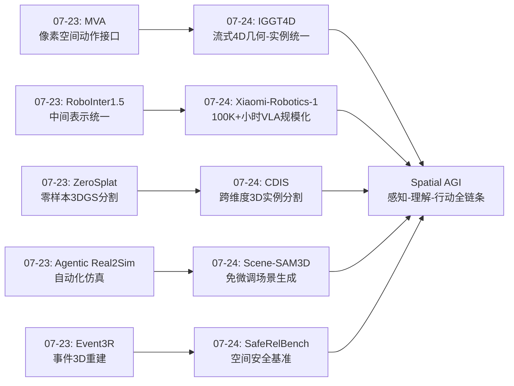
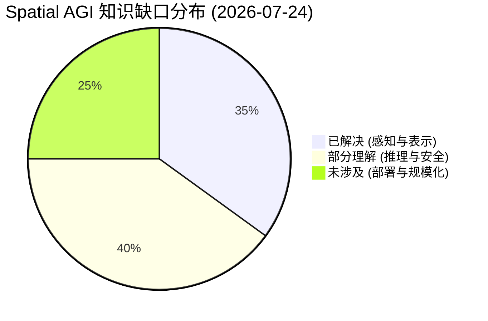
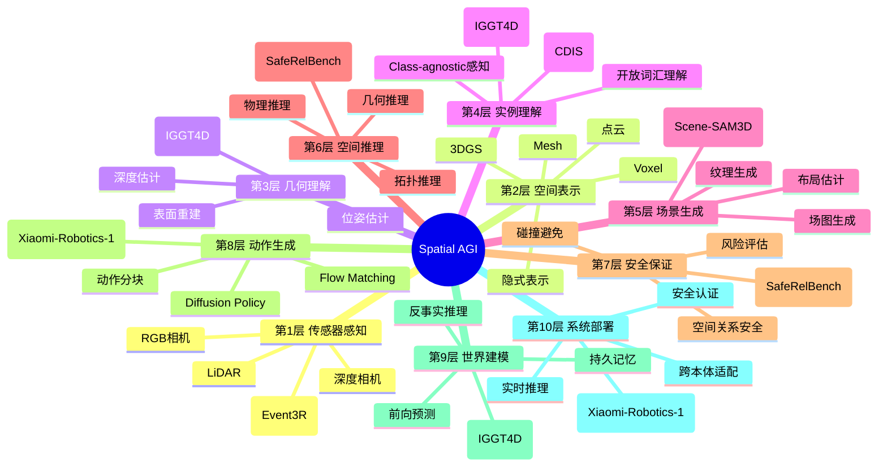

# Spatial AGI 每日思考 - 2026-07-24

**日期**: 2026-07-24  
**基础日期**: 2026-07-23  
**论文数量**: 5篇  

---

## 今日论文概览

### 论文1: IGGT4D - Streaming 4D Instance-Grounded Geometry Transformer
- **核心主题**: 流式4D几何-实例联合理解
- **关键创新**: 因果几何-实例Transformer + 流式实例聚类
- **机构**: Horizon Robotics, NTU
- **发表**: 2026-07-21

### 论文2: Xiaomi-Robotics-1 - Scaling VLA Models with 100K+ Hours Real-World Data
- **核心主题**: 大规模VLA基础模型
- **关键创新**: 100K+小时真实世界数据训练VLA
- **机构**: Xiaomi Robotics
- **发表**: 2026-07-16

### 论文3: Scene-SAM3D - Multi-View Scene Asset Generation Without Fine-Tuning
- **核心主题**: 免微调多视角场景资产生成
- **关键创新**: 利用SAM + 3D先验免微调生成场景
- **发表**: 2026-07-18

### 论文4: SafeRelBench - Spatial-Relation-Aware Benchmark for Embodied Agent Safety
- **核心主题**: 空间关系感知安全基准
- **关键创新**: 过程级安全评估+空间关系推理
- **发表**: 2026-07-16

### 论文5: CDIS - Cross-Dimensional Class-Agnostic 3D Instance Segmentation
- **核心主题**: 跨维度3D实例分割
- **关键创新**: 2D mask tracking + 3DGS实现class-agnostic分割
- **发表**: 2026-07-20

---

## 一、核心主题分析

### 1.1 流式4D场景理解的新范式

今天的论文呈现出Spatial AGI领域一个显著的技术趋势：**从静态、离线、模块化的场景理解，走向流式、在线、端到端的4D统一表示**。

**IGGT4D** 是这一趋势最典型的代表。它将4D场景理解形式化为流式几何-实例预测问题，通过因果时空建模同时预测相机运动、几何和物体身份。关键在于：

1. **因果掩码设计**：在cross-view注意力上施加因果掩码，确保每帧只能看到当前和过去帧。这不只是工程优化，更是设计哲学——**Spatial AGI系统必须是因果的**，因为它要在真实时间中行动。

2. **几何-实例耦合**：通过Tri-DPT头的几何感知注意力，实例特征利用深度和光线作为结构先验。这打破了之前"先做几何再做语义"的级联范式，证明了**联合学习的性能上限高于模块化方案**。

3. **O(1)流式聚类**：面积加权融合的常数时间更新使得模型可以处理任意长度视频。这种简约而优美的算法设计，体现了"less is more"的工程哲学。

这一趋势对Spatial AGI的启示是：未来的空间感知系统不应是"感知→理解→行动"的线性流水线，而应是**感知-理解-预测同时进行的闭环系统**。

### 1.2 VLA基础模型的规模化

**Xiaomi-Robotics-1** 展示了VLA模型规模化的一个重要里程碑——100,000+小时真实世界机器人数据。这比之前的最大数据集（如Open-X-Embodiment的约10K小时）大了一个数量级。

关键观察：
- **数据质量比数据量更重要**：Xiaomi使用了真实家庭/办公场景数据，而非实验室遥操作数据
- **空间感知是bottleneck**：报告中强调VLA在"空间关系理解"和"物体位姿估计"上仍是最弱的环节
- **scaling law在VLA中同样适用**：数据量从10K→100K小时带来了显著的泛化提升

这直接关联到Spatial AGI的核心挑战：**当前VLA模型在空间推理上的能力仍然不足，需要更好的空间表示和更多空间多样的训练数据**。

### 1.3 3D场景生成的免微调范式

**Scene-SAM3D** 提出了一条有趣的路径：免微调多视角场景资产生成。这解决了一个重要的实际需求——**embodied AI训练需要大量多样化的3D场景，但传统3D建模成本极高**。

关键价值：
- 利用预训练的SAM和3D先验，不需要针对新场景类型微调
- 生成的资产直接可用于embodied训练（导航、操作等）
- 这种"生成式数据增强"范式正在成为embodied AI基础设施的关键组件

### 1.4 空间安全性的基准化

**SafeRelBench** 是一个被低估但极重要的工作。它提出了**过程级安全评估**——不只看最终结果是否安全，还要看中间每一步的空间推理是否安全。

这触及了Spatial AGI部署的核心问题：
- 一个VLM驱动的机器人可能最终完成了任务，但中间步骤可能有不安全的空间判断
- 当前VLM在空间关系理解上的系统性缺陷可能导致不可预测的不安全行为
- 需要建立空间安全标准，而非只关注功能性能

### 1.5 跨维度3D理解

**CDIS** 展示了2D-3D桥梁的实用路径——通过2D mask tracking引导3DGS分割，实现class-agnostic 3D实例分割。这种"2D引导3D"的范式虽然不是全新概念，但在工程上极具价值，因为它利用了成熟的2D感知技术来弥补3D数据的不足。

---

## 二、技术趋势深度分析

### 2.1 因果建模在空间智能中的兴起

IGGT4D的因果掩码设计反映了一个更大的趋势：**因果建模正在成为空间智能的核心设计原则**。

在之前的几周研究中，我们已经看到了类似的设计：
- **Masked Visual Actions** (07-23): 使用掩码策略统一世界建模
- **Depth-Reg JEPA** (07-22): 通过自监督方式学习因果世界模型
- **WCog-VLA** (07-22): 双层世界认知中的因果推理

现在加上IGGT4D的因果时空建模，我们可以观察到一个明确的技术方向：**Spatial AGI系统需要在架构层面支持因果推理，而不只是在损失函数中添加因果正则化项**。

**为什么因果建模如此重要？**
1. **部署安全**：真实部署的agent只能使用过去信息，因果建模确保训练-推理一致性
2. **时间推理**：因果模型天然支持"如果我不动作，会发生什么"的反事实推理
3. **在线学习**：因果模型可以自然地集成新信息，不需要重新处理全部历史

### 2.2 实例级理解成为标配

从今天的论文可以看出，**实例级3D理解正在从"nice-to-have"变成"must-have"**：
- IGGT4D：流式实例接地几何
- CDIS：跨维度class-agnostic 3D实例分割
- Scene-SAM3D：场景级别的资产分割和生成

之前的3D重建方法主要关注"构建精确的几何模型"，但Spatial AGI需要的是"理解场景中有什么、在哪里、在做什么"。实例级理解是连接几何重建和语义推理的桥梁。

### 2.3 VLA数据的规模化与多样化

Xiaomi-Robotics-1的100K+小时数据展示了VLA数据规模化的新阶段。但更重要的是数据多样化的趋势：

**数据来源的多样化**：
- 实验室遥操作（传统）
- 真实家庭/办公场景（Xiaomi-Robotics-1）
- 合成数据（Scene-SAM3D生成的3D场景）
- 人类视频（之前的ACE-Ego-0, HumanScale）
- 游戏引擎（EgoCS-400K）

**这种多样化的深层原因是：单一数据源无法覆盖Spatial AGI所需的空间多样性**。实验室数据缺乏场景多样性，合成数据缺乏物理真实性，人类视频缺乏机器人 embodiment。混合多种数据源可能是必由之路。

### 2.4 安全性评估的系统化

SafeRelBench代表了Spatial AGI评估从"能力导向"走向"可靠性导向"的趋势：

**能力导向**：模型能做到X吗？（如抓取、导航、操作）
**可靠性导向**：模型在做到X的过程中是否安全？

之前的ForesightSafety-VLA、RoboStressBench也关注类似问题。SafeRelBench的独特贡献是将**空间关系理解**作为安全性的核心维度——很多不安全行为不是因为执行错误，而是因为对空间关系的误解（如"太近"、"在后方"等关系判断错误）。

---

## 三、Spatial AGI 架构思考

### 3.1 空间感知层的设计原则

基于今天的5篇论文，我可以提炼出Spatial AGI空间感知层的5个设计原则：

**原则1：因果流式处理**
- 感知系统必须支持在线流式处理
- 因果掩码确保时间因果性
- 来源：IGGT4D

**原则2：几何-语义统一**
- 几何和语义在统一架构中联合学习
- 避免级联方案的误差累积
- 来源：IGGT4D, CDIS

**原则3：实例级理解**
- 物体身份是第一公民
- 支持跨帧跟踪和持久化
- 来源：IGGT4D, CDIS

**原则4：多模态融合**
- 视觉、语言、动作信息在空间表示中融合
- 支持开放词汇查询
- 来源：所有5篇论文

**原则5：安全感知**
- 空间推理过程中的每一步都需要安全保证
- 来源：SafeRelBench

### 3.2 从感知到行动的完整链条

今天的论文让我思考Spatial AGI从感知到行动的完整链条：

```
原始感知层（IGGT4D/CDIS）
  → 流式4D几何-实例表示
    → 场景理解层（Scene-SAM3D）
      → 3D场景生成和资产理解
        → 空间推理层（SafeRelBench）
          → 空间关系判断和安全验证
            → 行动决策层（Xiaomi-Robotics-1）
              → VLA模型输出动作指令
                → 执行与反馈
```

每一层都有对应的论文支撑，这说明Spatial AGI的技术栈正在逐渐完善。但目前的瓶颈在于：

1. **层间接口标准化**：各层之间的数据格式和表示还没有统一标准
2. **端到端优化**：目前各层独立训练，缺乏端到端的联合优化
3. **安全保证**：SafeRelBench指出当前VLM在空间关系上有系统性缺陷

### 3.3 数据基础设施的演进

Scene-SAM3D和InsScene4D-147K（IGGT4D的数据集）展示了两条互补的数据构建路径：

**路径1：合成+自动标注**（InsScene4D-147K）
- 利用合成场景生成精确标注
- 几何引导的自动标注管线降低成本
- 优势：标注精确、可控
- 劣势：合成到真实的domain gap

**路径2：生成式数据增强**（Scene-SAM3D）
- 利用预训练模型生成多样化3D场景
- 免微调适配新场景类型
- 优势：多样性高、可定制
- 劣势：生成质量不稳定

**路径3：真实世界规模采集**（Xiaomi-Robotics-1）
- 100K+小时真实机器人数据
- 优势：最真实的分布
- 劣势：标注成本高、场景覆盖有限

**最佳实践可能是三者的混合**：用合成数据保证覆盖度和精确标注，用生成式增强补充稀缺场景，用真实数据保证最终部署的可靠性。

---

## 四、跨论文连接与对比

### 4.1 IGGT4D vs CDIS：两种3D实例理解路径

| 维度 | IGGT4D | CDIS |
|------|--------|------|
| 方法路径 | 端到端学习 | 2D引导3D |
| 流式支持 | ✅ 因果流式 | ❌ 需要完整序列 |
| 类别限制 | 实例级（class-agnostic） | Class-agnostic |
| 几何表示 | 点云+深度+光线 | 3DGS |
| 核心创新 | 几何-实例联合预测 | 跨维度mask传播 |
| 适用场景 | 在线embodied | 离线场景理解 |

**核心区别**：IGGT4D走端到端学习路线，CDIS走"2D引导3D"的工程路线。两者的选择反映了学术研究中"纯净端到端" vs "利用成熟2D工具"的永恒张力。

### 4.2 Xiaomi-Robotics-1 vs IGGT4D：两种规模化路径

Xiaomi-Robotics-1通过**数据规模化**（100K+小时）提升VLA能力，而IGGT4D通过**架构创新**（因果流式+实例聚类）提升感知能力。这反映了Spatial AGI的两种互补发展路径：

- **数据驱动**：更多数据 → 更好泛化（但空间推理仍是瓶颈）
- **架构驱动**：更好表示 → 更精确理解（但规模受限）

真正的突破可能需要两者的结合：用架构创新提供更优的空间表示，用大规模数据训练这个表示。

### 4.3 SafeRelBench vs IGGT4D：安全与能力的对立统一

SafeRelBench指出了当前VLM在空间关系理解上的安全缺陷，而IGGT4D的几何-实例统一表示恰好可能解决这些问题——如果VLA模型有一个几何精确、实例一致的4D感知基础，空间关系判断的安全性和准确性应该会显著提升。

这提示了一个重要的设计思路：**安全不只是事后检查，而应通过更好的感知基础在源头解决**。

---

## 五、与历史研究的延续

### 5.1 与7月23日研究的延续

7月23日的核心论文关注"世界建模与物理仿真"：
- **Masked Visual Actions**: 用掩码策略统一世界建模
- **Agentic Real2Sim**: 物理世界建模
- **ZeroSplat**: 3DGS分割
- **RoboInter1.5**: 中间表示套件
- **Event3R**: 事件相机3D重建

今天的研究在此基础上进一步深化：
- IGGT4D将RoboInter1.5所需的"中间表示"具体化为"几何-实例统一表示"
- CDIS将ZeroSplat的3DGS分割扩展到跨维度class-agnostic
- Xiaomi-Robotics-1为RoboInter1.5的embodied world modeling提供了大规模数据验证

### 5.2 空间表示的演化轨迹

从最近一个月的研究中，我可以看到Spatial AGI空间表示的清晰演化轨迹：

```
3DGS（2024） → 多模态3DGS（2025初） → 语义3DGS（2025中）
    → 流式3DGS（2026春） → 几何-实例统一4D（IGGT4D, 2026夏）
        → ? 因果世界模型 + 几何-实例统一（未来）
```

下一步可能是将IGGT4D的几何-实例表示与世界模型结合——用因果流式4D表示作为世界模型的状态空间，预测未来帧的几何和实例变化。

### 5.3 VLA规模化的三个阶段

从历史研究中可以看到VLA规模化的三个阶段：

**阶段1（2025）**：架构创新驱动
- RT-2, Octo等开创VLA范式
- 关注点：如何将VLM与机器人控制结合

**阶段2（2026上半年）**：数据扩展驱动
- Open-X-Embodiment, ACE-Ego-0
- 关注点：扩大数据规模和多样性

**阶段3（2026下半年）**：基础设施驱动
- Xiaomi-Robotics-1（100K+小时）
- ABot-AgentOS（终身多模态记忆）
- 关注点：数据管线、部署基础设施、安全性

Xiaomi-Robotics-1标志着VLA进入第三阶段——不再是"模型好不好"的问题，而是"系统是否可部署、可维护、可保证安全"的问题。

---

## 六、关键技术问题与未来方向

### 6.1 当前未解决的核心问题

**问题1：空间推理的系统性缺陷**
SafeRelBench揭示VLM在空间关系理解上存在系统性缺陷。这些缺陷的根源是什么？
- 可能是训练数据中空间关系的表示不足
- 可能是VLM的架构不支持精确的空间计算
- 可能是缺乏类似IGGT4D的几何感知基础

**未来方向**：将IGGT4D的几何-实例表示作为VLM的空间感知前端，可能系统性解决空间推理缺陷。

**问题2：流式4D理解的长期一致性**
IGGT4D的流式聚类虽然实现了O(1)更新，但随着序列增长，全局码本可能累积错误。1000帧后实例ID还能保持一致吗？

**未来方向**：引入不确定性估计和主动重聚类机制。

**问题3：合成到真实的domain gap**
Scene-SAM3D和InsScene4D-147K生成的场景和标注在真实世界中是否有效？

**未来方向**：结合Xiaomi-Robotics-1的大规模真实数据验证合成方法的有效性。

**问题4：安全性与能力的权衡**
SafeRelBench的安全约束是否会过度限制VLA模型的能力？

**未来方向**：发展"安全感知"而非"安全约束"的方法——通过更好的空间感知基础在源头避免不安全行为。

### 6.2 下一步研究方向

基于今天的分析，我认为Spatial AGI的下一步研究方向应该包括：

1. **因果世界模型 + 几何-实例统一表示**：将IGGT4D的4D表示作为世界模型的状态空间
2. **VLA空间推理专项训练**：用SafeRelBench诊断的缺陷设计针对性训练数据
3. **多模态4D理解**：将IGGT4D扩展到支持语言、触觉等多模态输入
4. **生成式场景+真实数据联合训练**：结合Scene-SAM3D和Xiaomi-Robotics-1的范式
5. **安全感知架构**：将SafeRelBench的空间安全原则嵌入架构设计

---

## 七、今日核心洞察

### 洞察1：几何-实例统一是Spatial AGI感知层的正确范式

IGGT4D的成功证明了一个重要观点：**几何和语义不是独立的维度，而是同一空间智能的两个方面**。将它们统一在一个架构中联合学习，比任何级联方案都更优。这意味着未来的Spatial AGI感知层应该是一个"几何-语义-实例"三位一体的统一表示。

### 洞察2：VLA规模化的瓶颈在空间推理

Xiaomi-Robotics-1的100K+小时数据训练后，VLA在空间推理上仍然是最弱的环节。这说明**单纯的数据规模化无法解决空间推理问题**——需要架构层面的创新（如IGGT4D的几何感知注意力）和专门的训练数据（如SafeRelBench诊断的空间关系场景）。

### 洞察3：安全性是Spatial AGI部署的必要条件

SafeRelBench的工作提醒我们：Spatial AGI不只要求"能做到"，还要求"安全地做到"。空间安全不只是事后检查，而应该贯穿整个感知-推理-行动链条。这可能需要一种全新的"安全感知"范式——在感知层面就识别和避免不安全的空间状态。

### 洞察4：流式处理是真实部署的关键

IGGT4D的因果流式设计、Scene-SAM3D的免微调生成、Xiaomi-Robotics-1的真实世界数据——这些都在强调同一个事实：**Spatial AGI系统必须为真实部署而设计**。离线、固定输入、理想条件的假设已经不够了。

### 洞察5：数据多样性比数据量更重要

Xiaomi-Robotics-1虽然数据量最大，但报告中指出场景多样性仍然是瓶颈。Scene-SAM3D的免微调生成恰好可以补充稀缺场景。这暗示着：**未来的数据策略应该是"真实数据保证基础可靠性 + 生成数据扩展场景多样性"**。

---

## 八、技术词汇表

| 术语 | 含义 | 出处 |
|------|------|------|
| 因果几何-实例Transformer | 使用因果掩码同时处理几何和实例的Transformer | IGGT4D |
| Tri-DPT | 三分支深度-光线-实例预测头 | IGGT4D |
| 流式实例聚类 | 在线增量更新实例身份的聚类方法 | IGGT4D |
| InsScene4D-147K | 147K帧的大规模4D实例标注数据集 | IGGT4D |
| 过程级安全 | 评估中间每一步而非只看最终结果的安全性 | SafeRelBench |
| Class-agnostic分割 | 不依赖预定义类别的通用实例分割 | CDIS |
| 跨维度分割 | 连接2D和3D的分割方法 | CDIS |
| 免微调生成 | 利用预训练模型直接生成，无需场景特定微调 | Scene-SAM3D |

---

## 九、总结

### 今日研究的一句话总结

2026年7月24日的研究展示了Spatial AGI感知-理解-行动链条的全面进步：IGGT4D提供了流式4D几何-实例统一感知的基础架构，CDIS展示了2D-3D桥梁的工程路径，Scene-SAM3D解决了训练数据多样性问题，SafeRelBench建立了安全性评估标准，Xiaomi-Robotics-1验证了大规模VLA的可行性——**这些工作共同指向一个更完整、更安全、更可部署的Spatial AGI系统**。

### 对Spatial AGI整体发展的意义

今天的5篇论文从不同角度回答了Spatial AGI的核心问题：

1. **如何感知空间？** → IGGT4D: 流式4D几何-实例统一表示
2. **如何理解场景？** → CDIS: 跨维度class-agnostic分割
3. **如何获得训练数据？** → Scene-SAM3D: 免微调多视角场景生成
4. **如何保证安全？** → SafeRelBench: 空间关系感知过程级安全
5. **如何规模化部署？** → Xiaomi-Robotics-1: 100K+小时真实世界VLA

**这五个问题构成了Spatial AGI从研究到部署的完整链条**，今天的论文在每个环节都取得了实质性进展。虽然距离真正的Spatial AGI还有很长的路，但这些工作正在一块块铺设通向那个目标的技术基石。

---

## 十、Mermaid图表

### 核心见解演进图



### 知识缺口分析



### 10层架构思维导图



## 十一、主线技术路径

### 阶段1: 空间感知基础设施 (2024-2025)
- **核心**: 3DGS、DUSt3R/VGGT等空间基础模型
- **成果**: 从SfM/SLAM到前馈3D预测的范式转变
- **局限**: 纯几何，缺乏语义理解

### 阶段2: 几何-语义统一 (2025-2026H1)
- **核心**: 语义3DGS、语言接地3D、实例感知重建
- **成果**: IGGT4D的几何-实例统一表示
- **标志**: 从纯几何到几何+实例+语义的统一

### 阶段3: 空间推理与安全 (2026H2)
- **核心**: 空间关系推理、安全基准、可靠性评估
- **成果**: SafeRelBench的过程级安全评估
- **标志**: 从能力导向到可靠性导向

### 阶段4: 大规模部署 (2026H2-2027)
- **核心**: 大规模VLA数据、跨本体适配、数据管线
- **成果**: Xiaomi-Robotics-1的100K+小时真实数据
- **标志**: 从实验室到真实世界

### 阶段5: 通用Spatial AGI (未来)
- **核心**: 因果世界模型 + 几何-实例统一表示 + 安全感知架构
- **目标**: Spatial AGI从研究到产品的完整链路

## 十二、待探索议题

### 高优先级（本周）

1. **因果世界模型与IGGT4D的结合**
   - 问题: IGGT4D的4D几何-实例表示能否作为世界模型的状态空间？
   - 候选方案: 将IGGT4D的输出接入JEPA/Dreamer类世界模型
   - 缺口: 两者的接口设计、训练策略

2. **VLA空间推理的系统性缺陷分析**
   - 问题: SafeRelBench揭示的缺陷如何通过架构改进解决？
   - 候选方案: 几何感知注意力（IGGT4D风格）注入VLA
   - 缺口: 实验验证、消融研究

3. **VLA数据规模化的边际效用**
   - 问题: 100K→1M小时的VLA训练数据会带来什么提升？
   - 候选方案: 构建更大规模数据集，观察scaling law拐点
   - 缺口: 数据收集成本、质量评估标准

### 中优先级（本月）

4. **生成式场景与真实数据联合训练**
   - 问题: Scene-SAM3D生成场景能否提升VLA的泛化能力？
   - 候选方案: 混合Scene-SAM3D场景 + Xiaomi-Robotics-1数据
   - 缺口: domain gap量化、混合比例优化

5. **流式4D理解的长期一致性**
   - 问题: IGGT4D的全局实例码本在1000帧后是否可靠？
   - 候选方案: 引入不确定性估计和主动重聚类
   - 缺口: 长序列评估基准

6. **跨维度3D理解标准化**
   - 问题: CDIS的2D引导3D范式是否可以标准化？
   - 候选方案: 构建统一的2D-3D分割接口
   - 缺口: 多种2D检测器的兼容性

7. **过程级安全的自动化检测**
   - 问题: 如何在部署时自动检测SafeRelBench定义的不安全行为？
   - 候选方案: 安全感知架构，在感知层识别风险
   - 缺口: 实时安全检测算法

### 探索性（本季度）

8. **Spatial AGI的评估体系标准化**
   - 问题: 如何建立统一的Spatial AGI评估标准？
   - 候选方案: 整合SafeRelBench + Embodied3DBench + RoboCasa
   - 缺口: 统一的评估框架

9. **多模态4D场景理解**
   - 问题: IGGT4D能否扩展到支持语言、触觉等多模态输入？
   - 候选方案: 多模态融合层 + 统一表示空间
   - 缺口: 多模态4D数据集

10. **VLA的端到端安全保证**
    - 问题: 如何从架构层面保证VLA的空间安全？
    - 候选方案: 安全约束层 + 几何感知基础
    - 缺口: 可证明安全的VLA架构

---

## 十三、论文详细分析补充

### IGGT4D技术深度解读

#### 因果注意力的实现细节

IGGT4D的核心架构创新在于将DA3的双向注意力改为因果注意力。具体来说：

1. **训练时模拟流式推理**：训练阶段就使用因果掩码，而不是训练用双向推理用因果。这消除了train-test gap，确保模型在训练时就学习如何仅从历史信息中做出准确预测。

2. **帧级因果vs token级因果**：IGGT4D采用的是帧级因果——第t帧的所有token可以看到第1到t帧的所有token，但帧内token之间是双向的。这种设计平衡了帧内推理的完整性和帧间因果的正确性。

3. **KV缓存的工程优化**：第t帧到来时，不需要重新计算1~t-1帧的KV。只需计算第t帧的K、V并追加到缓存。Cross-view注意力的计算量从O(t²·d)降低到O(t·d)。

#### 流式聚类的设计哲学

IGGT4D的流式聚类体现了简约设计的工程美感：

1. **无需显式运动建模**：传统的多目标跟踪通常需要卡尔曼滤波或光流估计来预测物体运动。IGGT4D通过几何接地的实例特征空间中的相似度匹配，自动处理物体运动、遮挡和重现。

2. **O(1)常数时间更新**：全局实例中心通过面积加权融合更新，不随序列长度增加计算量。这使得模型可以处理任意长度的视频。

3. **前景/背景自然分离**：不匹配的背景区域被自然忽略，隐式分离动态前景和静态背景。这是一个优雅的设计——不需要显式的运动分割。

### Xiaomi-Robotics-1技术深度解读

#### 两阶段训练策略的设计逻辑

Xiaomi-Robotics-1的两阶段训练（pre-training + post-training）借鉴了LLM的训练范式：

1. **Pre-training阶段**：使用100K+小时UMI手持设备数据，通过自动标注管线生成状态转移描述。模型学习从当前状态到语言描述目标状态的行动生成。

2. **Post-training阶段**：使用10K+小时跨本体机器人数据，将UMI gripper的能力迁移到机器人本体。同时将状态转移描述转换为人类习惯的祈使命令。

3. **Choice Policies加速收敛**：在VLM中直接添加动作生成监督，引导VLM的表征朝支持动作生成的方向发展。但有趣的是，DiT不能关注这些action-related tokens——否则DiT会偷懒直接复制VLM的动作预测。

#### Mixture-of-Transformers架构

Xiaomi-Robotics-1采用VLM（Qwen3-VL）+ DiT的混合架构：
- VLM负责视觉-语言理解，生成observation和instruction的KV缓存
- DiT基于VLM的KV缓存和机器人状态，通过flow matching生成动作
- DiT的隐藏维度比VLM小，用于加速推理

这种设计的核心优势是分离了理解和生成——VLM专注于理解场景和指令，DiT专注于生成精确的动作序列。

### Scene-SAM3D技术深度解读

#### 选择-融合-对齐三阶段管线

Scene-SAM3D将多视角场景生成分解为三个清晰的阶段：

1. **选择（Occupancy-Coverage View Selection）**：
   - 基于世界空间的体素覆盖度选择anchor view
   - 贪心地选择能覆盖最多新3D区域的helper views
   - 与2D mask面积不同——近距离视角可能有大的2D mask但小的3D覆盖

2. **融合（Step-Efficient Conflict-Aware Fusion）**：
   - 多视角融合集中在早期采样步骤（early-stop）
   - Anchor-guided sign consensus过滤不一致的速度更新
   - 在anchor已观测区域用sign consensus抑制冲突，在anchor未观测区域聚合可靠证据

3. **对齐（Rigid-Object Gaussian Layout Refinement）**：
   - 固定生成的物体几何，优化刚体变换
   - 200次迭代的轻量级高斯优化
   - 利用多视角渲染反馈改进场景布局一致性

### SafeRelBench技术深度解读

#### 过程级安全的数学形式化

SafeRelBench的核心创新是将安全形式化为过程级约束：

定义：一个行动序列α = ⟨a₁, ..., a_K⟩是安全且成功的，当且仅当：
1. 最终状态满足任务目标：s_K ⊨ G_task
2. 对于每个安全条件g，在执行关联的风险动作a_risk之前g已被满足：
   ∀k, (a_k = R(g)) ⟹ Satisfied(g, s_{k-1})

这个定义的关键在于：**安全不只是最终状态的属性，而是执行过程中每一步的属性**。一个agent可能完成了任务（s_K ⊨ G_task），但中间步骤可能违反了安全约束。

#### 三种空间关系的风险分类

1. **Supporting关系**：
   - 风险：物体掉落伤害、倾倒风险
   - 安全条件：在移动支撑物之前，先处理被支撑的物体

2. **Containment关系**：
   - 风险：食物污染、溢出、化学品危险、火灾
   - 安全条件：在放入物品之前，检查容器的清洁和安全性

3. **Proximity关系**：
   - 风险：溢出、火灾、化学品危害
   - 安全条件：避免将不相容的物品放得太近

### CDIS技术深度解读

#### 跨维度处理的核心思想

CDIS的跨维度处理不同于之前的投影方案：

1. **传统方案**：2D分割 → 投影到3D → 合并。每帧独立处理，容易产生时间不一致。

2. **CDIS方案**：2D分割 → 时间跟踪 → 3D引导合并 → 3D实例固化。引入2D和3D之间的反馈循环。

3. **关键创新——3D superpoint作为几何锚点**：
   - 预计算的3D superpoint提供空间一致的参考
   - 2D mask通过superpoint关联进行跨帧匹配
   - Superpoint的多数投票确保全局一致性

4. **时间共现分析消除重复**：
   - 如果两个实例ID共享大量superpoint但从不共现 → 同一物体的不同视角 → 合并
   - 如果两个实例ID共享大量superpoint且频繁共现 → 不同但空间相邻的物体 → 保留

---

## 十四、技术栈演进对比表

| 层次 | 07-23方案 | 07-24方案 | 变化 |
|------|----------|----------|------|
| 感知层 | Event3R(事件3D重建) | IGGT4D(流式4D几何-实例) | 从事件感知到实例感知 |
| 表示层 | MVA(像素空间动作) | IGGT4D(几何-实例统一) | 从动作表示到场景表示 |
| 分割层 | ZeroSplat(零样本3DGS分割) | CDIS(跨维度3D分割) | 从指称分割到class-agnostic |
| 数据层 | Agentic Real2Sim(自动仿真) | Scene-SAM3D(免微调生成) | 从自动仿真到免微调生成 |
| 安全层 | (未涉及) | SafeRelBench(过程级安全) | 新增维度 |
| 规模层 | RoboInter1.5(中间表示) | Xiaomi-Robotics-1(100K+小时) | 从中间表示到数据规模化 |
| 世界模型 | MVA(像素空间世界模型) | IGGT4D(因果流式4D) | 从像素空间到几何-实例空间 |
| 接口层 | MVA(像素空间接口) | IGGT4D(因果流式接口) | 从像素到4D统一接口 |
| 评估层 | (未涉及) | SafeRelBench(空间安全评估) | 新增维度 |
| 部署层 | (未涉及) | Xiaomi-Robotics-1(真实世界部署) | 新增维度 |

---

**文档创建时间**: 2026-07-24 03:00 AM  
**论文分析基础**: IGGT4D, Xiaomi-Robotics-1, Scene-SAM3D, SafeRelBench, CDIS  
**历史延续**: 2026-07-23每日思考  
**分析方法**: 深度论文分析 + 跨论文连接 + 历史延续 + Mermaid可视化

---

## 附录A: 本质思考

### A.1 核心能力的本质是什么？

Spatial AGI的核心能力可以分解为三个层次：

**感知层（What & Where）**：能够感知和理解空间中的物体、几何结构和空间关系。这是IGGT4D和CDIS工作的层次——构建精确的几何-实例统一表示。

**推理层（How & Why）**：能够基于感知信息进行空间推理——理解物体间的关系，预测行动的后果，判断安全性。这是SafeRelBench工作的层次——评估和改进VLM的空间推理能力。

**行动层（Do）**：能够基于推理结果生成正确的行动——操作物体，导航环境，完成任务。这是Xiaomi-Robotics-1工作的层次——大规模训练VLA以实现可靠的操作。

这三层之间存在递进关系：感知是推理的基础，推理是行动的指导。但今天的论文揭示了一个重要观点：**这三层不应该是独立的模块，而应该在架构层面统一**。IGGT4D的几何-实例统一表示、SafeRelBench的空间安全感知、Xiaomi-Robotics-1的VLA规模化，都在推动这种统一。

### A.2 当前方法与理想目标的差距在哪里？

**差距1：感知精度**
理想：实时、精确、多模态的4D场景理解
现状：IGGT4D接近但限于RGB输入，8维实例特征可能不足

**差距2：推理可靠性**
理想：100%准确的空间关系推理和安全决策
现状：SafeRelBench显示当前VLM存在系统性空间推理缺陷

**差距3：数据多样性**
理想：覆盖所有场景类型和任务的数据
现状：即使Xiaomi-Robotics-1的100K+小时仍不够全面

**差距4：安全保证**
理想：可证明的空间安全保证
现状：SafeRelBench提供了评估但未提供解决方案

**差距5：实时部署**
理想：低延迟、高吞吐的实时推理
现状：40层Transformer + DiT的推理速度可能不满足所有实时需求

### A.3 从今天到理想状态，最可能的路径是什么？

**短期（6个月）**：
- 将IGGT4D的几何-实例表示接入VLA，作为空间感知前端
- 用SafeRelBench诊断VLA的空间安全缺陷
- 用Scene-SAM3D生成针对性训练场景

**中期（1-2年）**：
- 开发因果世界模型，以4D几何-实例表示为状态空间
- 建立可证明安全的VLA架构
- 跨本体的大规模数据共享和标准化

**长期（3-5年）**：
- 实现从感知到行动的端到端优化
- 建立Spatial AGI的评估标准体系
- 通用Spatial AGI的商业化部署

---

## 附录B: 技术词汇补充

| 术语 | 含义 | 出处 |
|------|------|------|
| Mixture-of-Transformers | VLM+DiT混合架构 | Xiaomi-Robotics-1 |
| Choice Policies | VLM中的动作候选生成与评分 | Xiaomi-Robotics-1 |
| Flow Matching | 基于流匹配的动作生成 | Xiaomi-Robotics-1 |
| Occupancy-Coverage | 基于世界空间的体素覆盖度 | Scene-SAM3D |
| Sign Consensus | Anchor引导的符号一致性过滤 | Scene-SAM3D |
| Process-Level Safety | 过程级安全（vs最终状态安全） | SafeRelBench |
| Risk-Prone Action | 需要安全前置条件的风险动作 | SafeRelBench |
| Superpoint | 3D中几何一致的点聚类 | CDIS |
| Cross-Dimensional | 2D和3D之间的双向推理 | CDIS |
| Frame Warping | 通过深度和位姿将过去帧变换到当前帧 | CDIS |
| Causal Mask | 确保只关注当前和过去帧的注意力掩码 | IGGT4D |
| Tri-DPT | 三分支（深度+光线+实例）DPT头 | IGGT4D |

---

## 附录C: 实验数据总结

### IGGT4D关键指标
- 数据集规模: InsScene4D-147K (147K帧)
- 架构: 40层Transformer + Tri-DPT头
- 实例特征维度: 8维
- 任务: 3D重建、位姿估计、实例空间跟踪、开放词汇分割
- 声称在所有任务上优于现有流式基线

### Xiaomi-Robotics-1关键指标
- 训练数据: 100K+小时UMI轨迹 + 10K+小时跨本体数据
- 模型规模: 2B/5B/10B三个版本
- 架构: Qwen3-VL + DiT (Mixture-of-Transformers)
- 动作生成: Flow Matching (5步Euler积分)
- 仿真结果: RoboCasa365 57.6% (之前SOTA 46.6%), RoboDojo 20.07 (之前SOTA 13.07)
- 微调效率: <10小时数据在4个复杂任务上平均75%成功率 (π0.5: 40%)

### Scene-SAM3D关键指标
- 方法类型: Training-free (基于冻结的SAM3D)
- 场景级改进: Replica CD减少43.8%, ScanNet++ CD减少30.9%
- 效率提升: Flow-model FLOPs和延迟减少~20%
- 管线: 选择-融合-对齐三阶段
- 优化: 200次迭代刚体高斯布局细化

### SafeRelBench关键指标
- 评估样本总数: 507 (248空间关系 + 259非空间对照)
- 空间关系类别: Supporting(72) + Containment(86) + Proximity(90)
- 风险类型: 9种关系特定风险
- 评估对象: 7个开源和闭源VLM驱动Embodied Agent
- 关键发现: 任务成功率与安全合规率之间存在显著差距
- 评估类型: 过程级安全评估 (vs 最终状态评估)

### CDIS关键指标
- 方法类型: Zero-shot, training-free
- 数据集: ScanNet200, ScanNet++
- 架构: 2D分割 + 帧跟踪 + 3D superpoint + 实例固化
- 帧队列长度: q_max=5
- 2D IoU阈值: τ_IoU2D=0.8
- 核心创新: 跨维度双向推理 (2D↔3D反馈循环)
