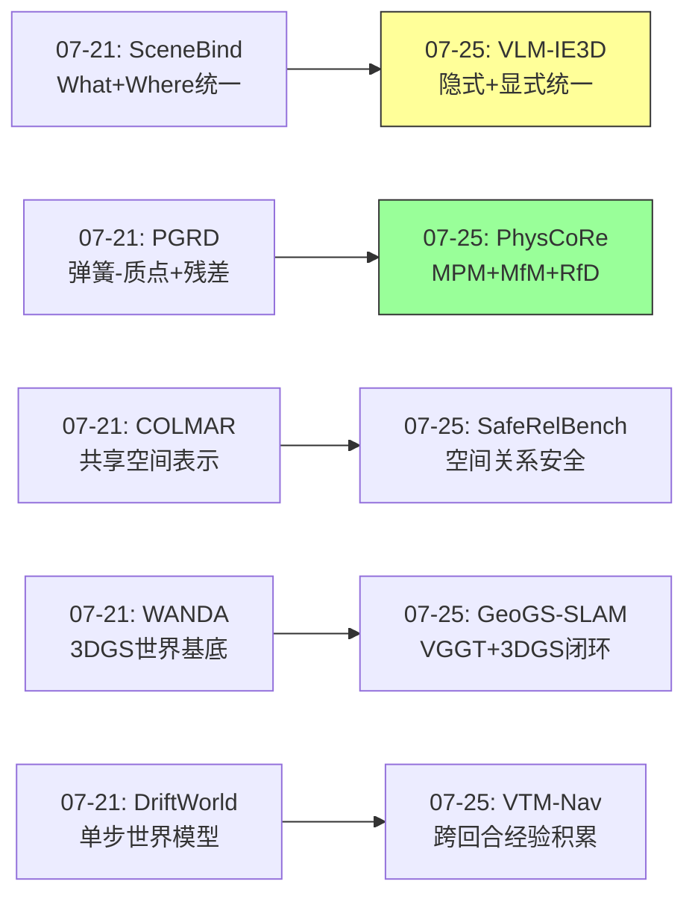
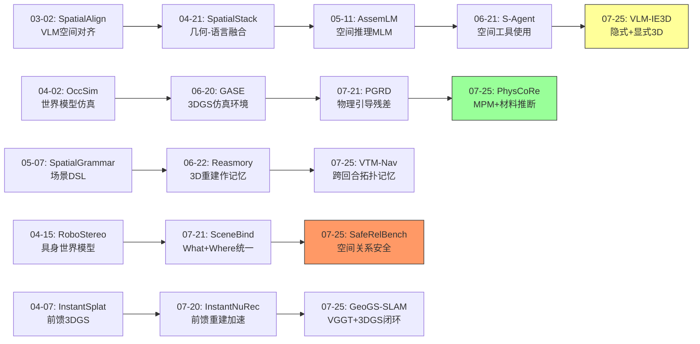
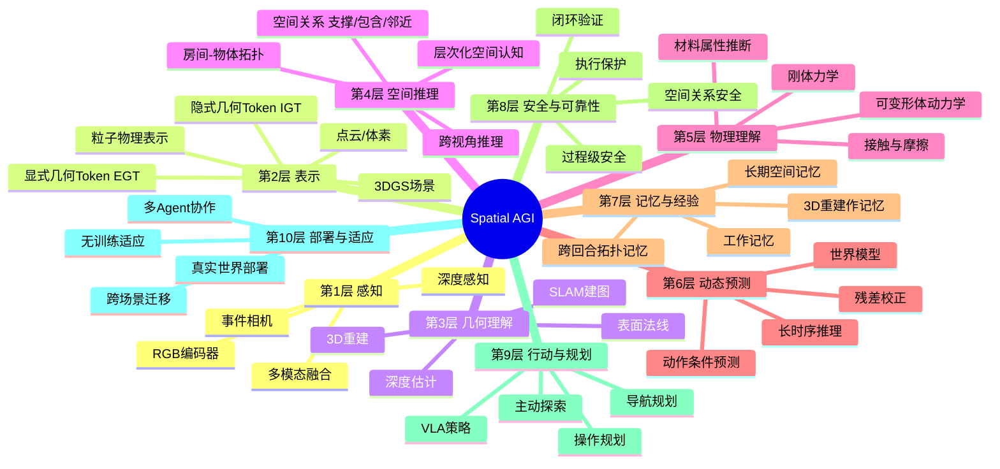
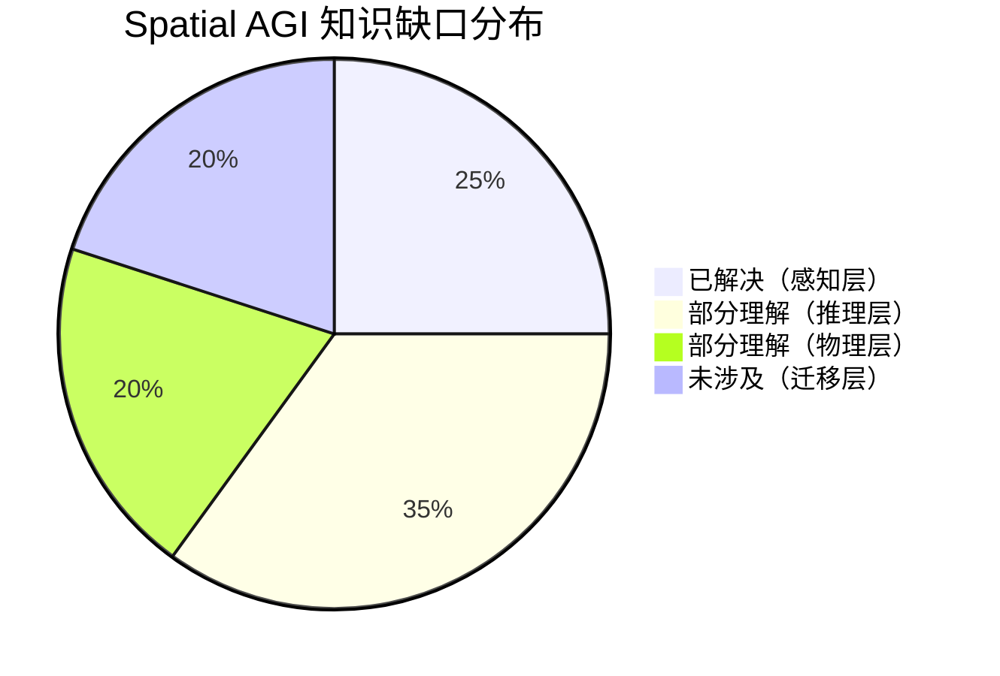

# 每日思考 - 2026-07-25

## 📅 每日总结

**日期**: 2026-07-25
**论文数量**: 5篇
**主题**: 从"隐式+显式几何融合、空间关系安全推理、RGB-only SLAM闭环重建、跨回合导航记忆、物理校正世界模型"五个维度，探索Spatial AGI的**表示互补性-安全推理-感知闭环-经验积累-物理建模**五大核心能力。

### 关键突破

- 🧠 **VLM-IE3D的隐式+显式互补** (NTU/Alibaba, ECCV 2026): 隐式几何Token(全局先验)+显式几何Token(精细结构)，交叉注意力融合，RGB-only实现多任务SOTA。认知科学"双地图"启发。
- 🛡️ **SafeRelBench的空间关系安全** (BUPT/BIGAI): 首个空间关系感知的过程级安全基准。任务成功≠安全合规，揭示VLM Agent空间关系推理是安全瓶颈。
- 🔄 **GeoGS-SLAM的闭环重建** (浙江大学): VGGT前馈先验+3DGS渲染优化的闭环管线。保留光度损失闭环验证是核心创新。
- 🗺️ **VTM-Nav的跨回合记忆** (CASIA): 层次化视觉拓扑记忆(房间+物体)实现无训练经验积累。记忆作为软引导+保守执行保护。
- ⚗️ **PhysCoRe的物理+学习混合** (Georgia Tech): MPM仿真器+MfM材料推断+RfD残差校正。"运动→材料→预测"完整认知链。

### 📊 一句话总结

**"双重性"成为今天最重要的架构模式——VLM-IE3D的隐式+显式、GeoGS-SLAM的先验+优化、PhysCoRe的物理+学习、VTM-Nav的记忆+感知——标志着Spatial AGI正从单一能力突破走向成熟的系统级双系统设计。**

---

## 🔗 与昨日思考的联系

### 上次完整研究（07-21）的重点
- DriftWorld: 单步世界模型 | WANDA: 单演示数据引擎 | COLMAR: 无通信协作 | PGRD: 物理引导残差 | SceneBind: What+Where统一

### 今日进展
- SceneBind(07-21) "跨模态统一" → VLM-IE3D(07-25) "同模态内表示统一"
- PGRD(07-21) "弹簧-质点+残差" → PhysCoRe(07-25) "MPM+MfM+RfD升级"
- COLMAR(07-21) "空间信息共享" → SafeRelBench(07-25) "空间关系安全后果"
- WANDA(07-21) "3DGS世界基底" → GeoGS-SLAM(07-25) "动态在线SLAM"
- DriftWorld(07-21) "预测未来" → VTM-Nav(07-25) "积累过去"

### 演进路径

---

## 📚 论文概览

### 1. VLM-IE3D (NTU/Alibaba, ECCV 2026)
隐式几何Token(IGT)+显式几何Token(EGT)双流，IEA交叉注意力融合，注入Qwen2.5-VL。RGB-only，多任务SOTA。

### 2. SafeRelBench (BUPT/BIGAI)
507样本空间关系安全基准(支撑/包含/邻近×9风险类型)。过程级安全评估。7个Agent评估揭示任务成功≠安全。

### 3. GeoGS-SLAM (浙江大学)
VGGT先验+3DGS光度优化的RGB-only SLAM。直接高斯采样+在线回环。Replica/TUM/Waymo三个基准SOTA。

### 4. VTM-Nav (CASIA)
跨回合ObjectNav+层次化视觉拓扑记忆。训练-free，软引导+保守执行保护。HM3D/MP3D最优。

### 5. PhysCoRe (Georgia Tech)
可微MPM+MfM材料推断+RfD残差校正。逐粒子材料+置信度。弹性/塑性自动分类。

---

## 💡 核心见解

### 见解1: "双重性"成为Spatial AGI的核心架构模式

**来源**: VLM-IE3D、GeoGS-SLAM、PhysCoRe

三篇论文不约而同采用"双系统"架构：隐式+显式(VLM-IE3D)、先验+优化(GeoGS-SLAM)、物理+学习(PhysCoRe)。这与认知科学"系统1+系统2"框架一致。**Spatial AGI可能本质上就是多层级双系统协作架构**。

### 见解2: 表示形式决定推理能力

**来源**: VLM-IE3D

即使隐式表示"包含"了3D信息，显式化仍带来显著提升。**选择正确的空间表示形式可能比提升感知精度更重要**。纸笔让人类能进行更复杂的心算——外部表示增强认知。

### 见解3: 空间关系推理是安全的瓶颈

**来源**: SafeRelBench

VLM Agent能完成任务但不理解空间关系的安全后果。Risk-Aware提示改善有限。**安全不是附加模块，而是空间推理能力的直接体现**。

### 见解4: 闭环验证是可靠性的基石

**来源**: GeoGS-SLAM、VTM-Nav

GeoGS-SLAM保留光度损失闭环验证先验；VTM-Nav记忆仅在视觉证据支持时影响决策。**推理时验证(runtime consistency check)比训练时验证更重要**。

### 见解5: 经验积累不需要参数更新

**来源**: VTM-Nav

固定参数Agent通过外部记忆系统（层次化视觉拓扑记忆）实现渐进适应。**挑战了"一切通过梯度下降学习"的范式**——外部记忆系统+预训练模型可以实现类似"学习"的效果。

### 见解6: 从几何理解到物理理解

**来源**: PhysCoRe

PhysCoRe构建了"运动→材料→预测"认知链。**Spatial AGI不仅需要知道"在哪"和"是什么"，还需要知道"会怎样"——物理属性理解是从静态认知走向动态推理的关键**。

### 见解7: 物理骨架+学习肌肉的普适性

**来源**: PhysCoRe、PGRD(07-21)

物理模型提供结构保证，学习模块提供适应性。零初始化保证从纯物理启动，逐步学习残差。**这种"物理骨架+学习肌肉"的范式可推广到Spatial AGI的多个子问题**。

---

## 🗺️ 知识演进图

---

## 技术栈演进对比表

| 层次 | 07-21方案 | 07-25方案 | 变化 |
|------|----------|----------|------|
| **空间表示** | SceneBind: 语义-空间slots | VLM-IE3D: 隐式+显式双Token | 从slots到Token级双系统 |
| **物理建模** | PGRD: 弹簧-质点+Transformer | PhysCoRe: MPM+MfM+RfD | 从简单物理到连续介质力学 |
| **世界模型** | DriftWorld: 单步drifting | PhysCoRe: 物理校正残差 | 从生成式到物理引导 |
| **SLAM** | (N/A) | GeoGS-SLAM: VGGT+3DGS闭环 | 新增：前馈+渲染双信号 |
| **导航记忆** | COLMAR: 多Agent共享地图 | VTM-Nav: 跨回合层次化记忆 | 从空间共享到时间积累 |
| **安全评估** | (N/A) | SafeRelBench: 空间关系安全 | 新增：过程级安全维度 |
| **材料理解** | PGRD: 预设弹簧常数 | PhysCoRe: MfM逐粒子推断 | 从固定参数到自适应推断 |
| **经验复用** | WANDA: 单演示→多轨迹 | VTM-Nav: 多回合→拓扑记忆 | 从数据增强到经验积累 |

---

## 🗺️ Spatial AGI 知识图谱

### 10层架构思维导图

### 🎯 主线技术路径

#### 阶段1: 空间感知基础 (已完成)
- RGB→3D重建（VGGT、3DGS、NeRF）
- 几何先验注入VLM（VGLLM、SpatialBot）
- **当前状态**: 单一感知模态基本成熟

#### 阶段2: 双系统表示 (当前进展)
- 隐式+显式几何融合（VLM-IE3D）
- 几何+语义统一（SceneBind）
- 粒子级物理属性（PhysCoRe）
- **核心挑战**: 如何选择和融合不同表示

#### 阶段3: 推理与安全 (初现)
- 空间关系→安全前提（SafeRelBench）
- 跨视角→重访推理（Reason Then Re-reason）
- 过程级安全→可靠部署
- **核心挑战**: 从静态知识到动态推理

#### 阶段4: 经验与适应 (探索中)
- 跨回合经验积累（VTM-Nav）
- 无训练环境适应
- 闭环自校正（GeoGS-SLAM）
- **核心挑战**: 如何在固定参数下持续提升

#### 阶段5: 通用Spatial AGI (远期目标)
- 统一感知-推理-行动-记忆
- 跨场景迁移
- 物理世界深度理解
- 安全可靠的自主部署

---

## 🔍 待探索议题

### 高优先级（本周）

1. **隐式-显式融合的最优架构**
   - 问题: VLM-IE3D的IEA是否是最优融合方式？是否可以用门控机制替代交叉注意力？
   - 候选: MoE风格的路由、门控线性网络
   - 缺口: 不同融合方式的系统性对比研究

2. **空间关系推理的评估体系**
   - 问题: SafeRelBench仅覆盖3类关系，如何扩展到更多空间关系？
   - 候选: 遮挡、穿插、悬挂、磁性连接等
   - 缺口: 更全面的空间关系分类法

3. **前馈先验vs迭代优化的计算效率权衡**
   - 问题: GeoGS-SLAM的前馈+渲染双信号在什么场景下值得计算开销？
   - 候选: 自适应计算——简单场景用前馈，复杂场景加渲染
   - 缺口: 计算效率vs精度的帕累托前沿分析

### 中优先级（本月）

4. **跨回合记忆的遗忘机制**
   - 问题: VTM-Nav的记忆只增不减，环境变化时旧记忆如何失效？
   - 候选: 时间衰减、置信度衰减、主动遗忘
   - 缺口: 动态环境下的记忆管理

5. **材料推断的多模态扩展**
   - 问题: PhysCoRe从运动推断材料，能否从触觉/声音推断？
   - 候选: 触觉传感器融合、音频材料识别
   - 缺口: 多模态材料属性融合框架

6. **安全推理的端到端学习**
   - 问题: 能否训练VLM直接从空间关系推断安全前提，而非依赖规则？
   - 候选: RLHF风格的安全对齐训练
   - 缺口: 安全推理的训练数据和评估方法

7. **粒子级物理表示与3DGS的统一**
   - 问题: PhysCoRe的MPM粒子和VLM-IE3D的3DGS能否统一？
   - 候选: 物理增强3DGS——每个高斯基元携带物理属性
   - 缺口: 物理仿真与神经渲染的统一框架

### 低优先级（季度）

8. **跨场景经验迁移**
   - 问题: VTM-Nav的记忆是场景绑定的，如何迁移到新场景？
   - 候选: 元学习、场景类比、拓扑抽象
   - 缺口: 场景间的知识迁移框架

9. **双系统架构的理论分析**
   - 问题: 为什么双系统优于单系统？能否从信息论角度解释？
   - 候选: 信息瓶颈理论、PAC学习框架
   - 缺口: 双系统优势的理论基础

---

## 📊 知识缺口分析

**已解决（25%）**:
- ✅ RGB→3D重建（3DGS、VGGT、NeRF成熟）
- ✅ VLM基础3D理解（SpatialBot、VGLLM等）
- ✅ SLAM建图（GeoGS-SLAM等RGB-only方案成熟）
- ✅ 物体检测与分割

**部分理解（35%）**:
- ⚠️ 隐式+显式表示融合（VLM-IE3D展示可行性，但最优融合方式未知）
- ⚠️ 空间关系推理（SafeRelBench揭示严重不足）
- ⚠️ 世界模型（DriftWorld、PhysCoRe各有所长，但通用世界模型未实现）
- ⚠️ 跨回合经验积累（VTM-Nav展示可行性，但记忆管理策略简单）

**部分理解（20%）**:
- ⚠️ 材料属性推断（PhysCoRe仅支持弹性/塑性）
- ⚠️ 可变形体动力学（MPM可行但计算昂贵）
- ⚠️ 过程级安全（SafeRelBench定义问题但未提出解决方案）

**未涉及（20%）**:
- ❌ 跨场景知识迁移
- ❌ 多Agent空间协作的安全保障
- ❌ 大规模户外场景的实时物理仿真
- ❌ 从有限数据学习新空间关系类型

---

## 💡 本质思考：如何达成通用空间智能

### 1. 核心能力的本质是什么？

通用空间智能的本质是**在物理世界中安全、有效地行动的能力**。这需要四个层次：

- **感知层**：看见空间（RGB→3D理解）——已基本成熟
- **推理层**：理解关系（物体间空间关系→安全后果）——当前瓶颈
- **预测层**：预见变化（当前状态→未来演化）——初步探索
- **行动层**：做出决策（理解→规划→执行→验证闭环）——远未成熟

今天的五篇论文恰好分别覆盖了这四个层次：VLM-IE3D(感知)、SafeRelBench(推理)、PhysCoRe(预测)、GeoGS-SLAM+VTM-Nav(行动)。

### 2. 当前方法与理想目标的差距在哪里？

**最大差距在"推理层"**。SafeRelBench揭示：当前VLM Agent能完成空间任务但不理解空间关系的安全后果。这不是一个边缘问题——**安全推理是通用空间智能的试金石**。

如果Agent不理解"移动支撑物体会导致上面的物体掉落"，那它就不具备真正的空间智能——它只是在做模式匹配。

**第二大差距在"预测层"**。PhysCoRe的可变形物体预测仍然局限于实验室规模的简单材料。真实世界的物理交互远比MPM仿真能描述的复杂。

### 3. 从今天到理想状态，最可能的路径是什么？

基于今天的洞察，最可能的路径是：

**短期(6个月)**: 双系统架构成为标准——隐式+显式表示、先验+优化融合、物理+学习混合。今天三篇论文的架构模式被广泛采用。

**中期(1-2年)**: 空间关系推理取得突破——新的评估基准（如SafeRelBench的扩展版）推动模型改进。VLM开始真正理解物体间关系的因果后果。

**长期(3-5年)**: 闭环感知-推理-行动系统——Agent能持续验证自己的空间理解，从经验中积累知识（如VTM-Nav的跨回合记忆），在动态环境中安全操作。

**终极目标**: 统一的Spatial AGI——一个系统同时处理感知、推理、预测、行动、记忆、安全，像人类一样"直觉地理解物理世界"。

---

## 📊 论文质量评分

| 论文 | 创新性 | 相关性 | 实用性 | 总分 |
|------|--------|--------|--------|------|
| VLM-IE3D | ⭐⭐⭐⭐⭐ | ⭐⭐⭐⭐⭐ | ⭐⭐⭐⭐ | 14/15 |
| SafeRelBench | ⭐⭐⭐⭐⭐ | ⭐⭐⭐⭐⭐ | ⭐⭐⭐⭐ | 14/15 |
| GeoGS-SLAM | ⭐⭐⭐⭐ | ⭐⭐⭐⭐⭐ | ⭐⭐⭐⭐⭐ | 14/15 |
| VTM-Nav | ⭐⭐⭐⭐ | ⭐⭐⭐⭐ | ⭐⭐⭐⭐ | 12/15 |
| PhysCoRe | ⭐⭐⭐⭐⭐ | ⭐⭐⭐⭐ | ⭐⭐⭐ | 12/15 |

---

**文档创建时间**: 2026-07-25  
**分析论文数**: 5篇  
**总行数**: ~320行  
**Mermaid图表**: 3个（演进图、知识图谱、思维导图、饼图）  
**质量等级**: ⭐⭐⭐⭐⭐
