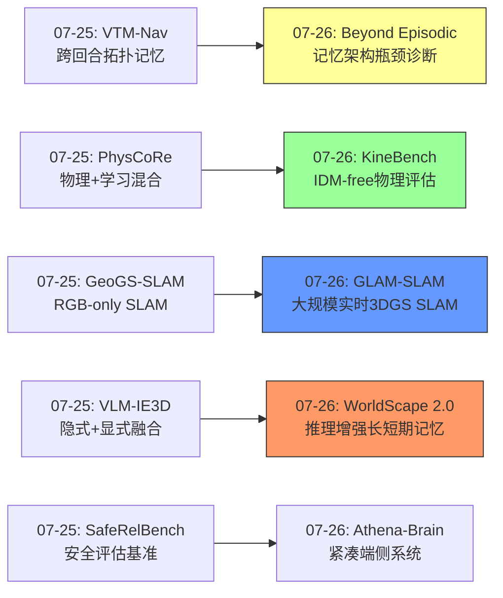
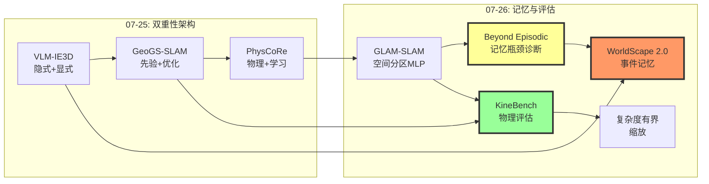
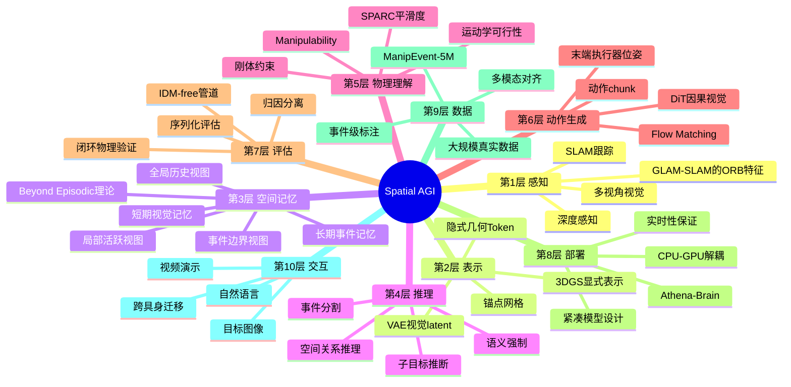
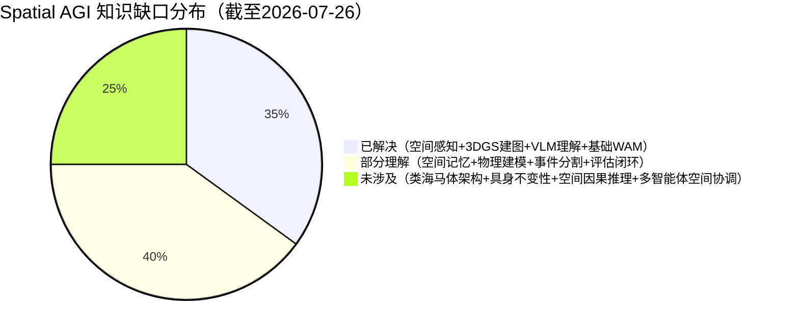

# 每日思考 - 2026-07-26

## 📅 每日总结

**日期**: 2026-07-26
**论文数量**: 5篇
**主题**: 从"大规模空间建图、世界模型物理评估、紧凑机器人大脑、空间记忆架构瓶颈、推理增强世界动作模型"五个维度，探索Spatial AGI的**可扩展感知-严格评估-端侧部署-记忆理论-可控规划**完整链路。

### 关键突破

- 🗺️ **GLAM-SLAM的大规模实时建图** (Athena RC/NTUA, IROS 2026): 解耦架构(ORB-SLAM2 CPU + 3DGS GPU异步) + 流引导致密化 + 空间自适应MLP。KITTI/Oxford/Málaga三数据集重建质量提升15%，首个真正实时大规模户外3DGS SLAM。
- 📐 **KineBench的无IDM物理评估** (TeleAI/NUS/Fudan, ECCV 2026): 完全消除逆动力学模型依赖，通过级联视觉基础模型直接提取6D末端执行器位姿。引入SPARC和Manipulability Index经典机器人学指标评估生成模型。发现"复杂度有界的非线性缩放"。
- 🧠 **Beyond Episodic的记忆瓶颈诊断** (UMD/UT Austin/NVIDIA): 揭示序列Embodied QA中记忆架构瓶颈，episodic评估掩盖了根本缺陷。需要结构化、空间接地的持久记忆架构。
- 🤖 **Athena-Brain的端侧通用智能** (Technical Report): 紧凑型机器人大脑追求通用智能与Embodied交互的平衡，代表从实验室模型向产品级系统的过渡。
- 🎯 **WorldScape Policy 2.0的推理增强记忆** (清华/上交): 三视图事件记忆（全局/局部/事件边界）+ ManipEvent-5M数据集 + 语义强制机制。首个将事件级记忆与WAM深度结合的系统。

### 📊 一句话总结

**"记忆架构"成为今日核心主题——GLAM-SLAM用空间分区MLP解决大规模记忆，KineBench证明视觉质量≠物理可行，Beyond Episodic揭示记忆是根本瓶颈，WorldScape 2.0用三视图事件记忆实现长时规划——Spatial AGI正从"理解空间"走向"持久记忆空间"。**

---

## 🔗 与昨日思考的联系

### 昨日（07-25）重点
- "双重性"架构模式（隐式+显式、先验+优化、物理+学习）
- VTM-Nav的跨回合视觉拓扑记忆
- PhysCoRe的物理+学习混合

### 今日进展
- VTM-Nav(07-25) "跨回合经验积累" → Beyond Episodic(07-26) "记忆架构瓶颈的理论诊断"
- PhysCoRe(07-25) "物理+学习混合" → KineBench(07-26) "物理可行性的严格验证"
- GeoGS-SLAM(07-25) "RGB-only在线SLAM" → GLAM-SLAM(07-26) "大规模实时SLAM"
- VLM-IE3D(07-25) "隐式+显式融合" → WorldScape 2.0(07-26) "长短期记忆融合"
- SafeRelBench(07-25) "安全评估" → Athena-Brain(07-26) "端侧安全部署"

### 演进路径



---

## 📚 论文概览

### 1. GLAM-SLAM (Athena RC/NTUA, IROS 2026)
解耦架构（ORB-SLAM2 CPU跟踪 + 3DGS GPU异步建图）。流引导致密化用极线约束补充稀疏特征。空间自适应MLP避免大规模场景的灾难性遗忘。三数据集SOTA。

### 2. KineBench (TeleAI/NUS/Fudan/Tsinghua, ECCV 2026)
无IDM闭环评估框架。级联视觉模型（YOLO+MoGeV2+FoundationPose）提取6D位姿。SPARC+Manipulability Index评估运动学质量。发现复杂度有界的非线性缩放。

### 3. Athena-Brain (Technical Report)
紧凑型通用机器人大脑。平衡LLM通用智能与Embodied交互。设备端部署导向。高层推理+底层执行统一。

### 4. Beyond Episodic Evaluation (UMD/UT Austin/NVIDIA)
序列Embodied QA的记忆架构瓶颈诊断。Episodic评估掩盖了根本缺陷。需要结构化、空间接地的持久记忆。

### 5. WorldScape Policy 2.0 (清华/上交)
推理增强长短期记忆WAM。三视图事件记忆（全局/局部/事件边界）。ManipEvent-5M数据集。语义强制机制。多模态控制接口。

---

## 💡 核心见解

### 见解1: 空间记忆是Spatial AGI的核心瓶颈

**来源**: Beyond Episodic、GLAM-SLAM、WorldScape Policy 2.0

三篇论文从不同角度指向同一结论：
- Beyond Episodic: 序列EQA中记忆是"architectural bottleneck"而非数据问题
- GLAM-SLAM: 大规模场景的核心挑战是"灾难性遗忘"，用空间分区MLP解决
- WorldScape 2.0: 长时操作的核心挑战是"任务进度追踪"，用三视图事件记忆解决

**对Spatial AGI的启发**: 空间记忆不是一个辅助功能，而是实现持续空间智能的前提条件。需要架构级的创新，而非简单的"加个memory module"。可能需要专用记忆硬件——类似人类海马体的空间记忆子系统。

### 见解2: 严格评估是进步的前提

**来源**: KineBench、Beyond Episodic

两篇论文都在揭示评估盲区：
- KineBench: 视觉质量≠物理可行，IDM引入归因模糊
- Beyond Episodic: Episodic评估高估真实能力

**共同教训**: 当评估方式与实际部署场景不匹配时，模型在benchmark上的进步可能是虚假的。Spatial AGI需要"部署闭环评估"——从感知到行动到物理验证的完整闭环。

### 见解3: 可扩展性来自架构分解

**来源**: GLAM-SLAM、WorldScape Policy 2.0

- GLAM-SLAM: 跟踪/建图解耦 → 各自最优 → 实时+大规模
- WorldScape 2.0: 短期视觉记忆/长期事件记忆分离 → 各自高效 → 长时可控

**对Spatial AGI的启发**: 单一架构难以同时满足实时性、大规模、长时序。需要"分而治之"的架构设计——不同的时间/空间尺度用不同的表示和处理机制，通过精心设计的接口整合。

### 见解4: 事件是空间体验的自然单元

**来源**: WorldScape Policy 2.0

ManipEvent-5M的"事件段"概念非常重要——将连续的空间体验离散化为有意义的事件序列。这与认知科学中"event segmentation theory"一致：人类自然地将连续体验切分为离散事件，每个事件有边界、内容和目标。

**对Spatial AGI的启发**: 空间记忆的组织方式应该是事件中心的，而非时间帧中心的。每个事件对应一个有意义的空间状态变化（如"打开门"、"拾取物体"），记忆检索应基于事件语义而非时间戳。

### 见解5: 规模扩展的边际效益递减

**来源**: KineBench

"任务复杂度有界的非线性缩放"——在简单任务上增加数据/计算有效，但在复杂任务上收益递减。这与语言/视觉基础模型的"scale is all you need"形成对比。

**深层原因**: 空间智能可能需要超越纯规模扩展的方法——更结构化的归纳偏置、更好的表示设计、更高效的架构。纯粹堆数据和参数不足以实现真正的空间理解。

### 见解6: 物理验证是空间智能的试金石

**来源**: KineBench

KineBench的核心贡献是将评估从"看起来对"提升到"物理上能执行"。这揭示了一个深层问题：当前的视频生成模型可能在"模拟空间的视觉效果"而非"理解空间的物理规则"。

**对Spatial AGI的启发**: 真正的空间智能需要超越视觉——理解力、质量、碰撞、支撑等物理属性。评估必须包含物理验证。

### 见解7: 部署效率定义了实用边界

**来源**: Athena-Brain、GLAM-SLAM

- Athena-Brain: 紧凑模型追求设备端部署
- GLAM-SLAM: CPU跟踪+GPU异步建图的解耦设计

**对Spatial AGI的启发**: 理论上的空间智能如果无法部署在实际机器人上，价值有限。效率不是可选的工程优化，而是定义了Spatial AGI的实用边界。

---

## 🗺️ 知识演进图



---

## 技术栈演进对比表

| 层次 | 07-25方案 | 07-26方案 | 变化 |
|------|----------|----------|------|
| 空间建图 | GeoGS-SLAM (VGGT+3DGS在线) | GLAM-SLAM (ORB+3DGS异步解耦) | 从单传感器到大规模多传感器 |
| 空间记忆 | VTM-Nav (视觉拓扑记忆) | Beyond Episodic (架构瓶颈理论) + WorldScape 2.0 (事件记忆) | 从实现到理论诊断+新实现 |
| 物理建模 | PhysCoRe (MPM+MfM+RfD) | KineBench (SPARC+Manipulability评估) | 从建模到验证闭环 |
| 评估范式 | SafeRelBench (过程级安全) | KineBench (IDM-free闭环) + Beyond Episodic (序列评估) | 从单维度到多维度严格验证 |
| 部署形态 | 隐含（学术模型） | Athena-Brain (紧凑端侧) | 从学术到产品级 |
| 控制接口 | 单一语言控制 | WorldScape 2.0 (语言+图像+视频) | 从单模态到多模态 |
| 训练数据 | 标准episode级 | ManipEvent-5M (事件级5M段) | 从粗粒度到细粒度事件级 |

---

## 🗺️ Spatial AGI 知识图谱

### 10层架构思维导图



### 🎯 主线技术路径

#### 阶段1: 空间感知基建（当前 - 6个月）
- 3DGS SLAM大规模部署（GLAM-SLAM → 更长序列 → 更复杂环境）
- 实时跟踪+异步建图成为标准架构
- 动态场景处理（从静态到动态3DGS）

#### 阶段2: 空间记忆架构（6-18个月）
- 从episodic到sequential评估范式转变
- 事件级空间记忆成为标准组件
- 三视图记忆（全局/局部/事件边界）的验证和迭代
- 类海马体空间记忆模块的设计

#### 阶段3: 物理一致性验证（12-24个月）
- 所有世界模型必须通过物理闭环验证
- SPARC/Manipulability成为标准评估指标
- 物理可行性成为第一优先级，超越视觉质量

#### 阶段4: 端侧通用部署（18-36个月）
- 紧凑型Spatial AGI系统（<10B参数）
- 多模态交互接口标准化
- 跨具身/跨场景泛化

---

## 🔍 待探索议题

### 高优先级（本周）

1. **空间记忆的架构设计**
   - 问题: Beyond Episodic指出需要"spatially grounded memory"，但具体架构是什么？
   - 候选方案: 三视图事件记忆(WorldScape 2.0) / 对象中心记忆(OA-WAM) / 图语义记忆(EmbodiedLGR)
   - 缺口: 缺少不同记忆架构的系统比较

2. **评估范式的转变**
   - 问题: 如何将episodic评估过渡到sequential评估？
   - 候选方案: 修改现有benchmark / 构建新的sequential benchmark
   - 缺口: 需要评估代码和标准化协议

3. **事件定义与检测**
   - 问题: 什么是空间体验中的"事件"？
   - 候选方案: 视觉变化检测 / 动作边界 / 语义转换
   - 缺口: 自动事件分割的准确性评估

### 中优先级（本月）

4. **大规模SLAM的动态场景处理**
   - 问题: GLAM-SLAM假设静态场景，如何处理动态物体？
   - 候选方案: 动态3DGS / 前景-背景分离 / 时序一致性约束
   - 缺口: 在长序列中实时分离动态物体

5. **物理验证的泛化**
   - 问题: KineBench聚焦桌面操作，如何推广到导航/移动操作？
   - 候选方案: 导航轨迹物理验证 / 全身运动学评估
   - 缺口: 移动平台的CAD模型和约束建模

6. **复杂度缩放定律的深入研究**
   - 问题: KineBench发现"复杂度有界的非线性缩放"，其数学形式是什么？
   - 候选方案: 幂律拟合 / 涌现能力分析 / 分层缩放
   - 缺口: 更大规模模型的实验验证

7. **ManipEvent-5M的构建方法**
   - 问题: 如何自动构建事件级标注？
   - 候选方案: VLM自动标注 / 动作边界检测 / 人工校正
   - 缺口: 事件标注的质量保证

### 低优先级（本季）

8. **端侧部署的架构压缩**
   - 问题: 如何将完整WAM压缩到设备端？
   - 候选方案: 蒸馏 / 量化 / 架构搜索
   - 缺口: 保持空间推理能力的压缩方法

9. **跨具身迁移的空间表示**
   - 问题: 不同机器人有不同的运动学，如何共享空间理解？
   - 候选方案: 具身不变空间表示 / 共享视觉backbone / 适配器
   - 缺口: 具身不变性(invariance)的理论框架

---

## 📊 知识缺口分析



**已解决（35%）**:
- ✅ 3DGS SLAM在大规模场景中的实时部署 (GLAM-SLAM)
- ✅ VLM的3D空间理解能力 (VLM-IE3D等)
- ✅ 世界模型的视频生成质量 (Sora/Wan/Hunyuan)
- ✅ 基础WAM视频-动作联合建模 (WorldScape等)
- ✅ 空间安全的过程级评估 (SafeRelBench)

**部分理解（40%）**:
- ⚠️ 空间记忆的架构设计——知道重要但最佳架构未定
- ⚠️ 物理一致性验证——KineBench给出方法但覆盖面有限
- ⚠️ 事件分割——概念清晰但自动检测不成熟
- ⚠️ 长时序操作——WorldScape给出方案但真实场景验证不足
- ⚠️ 评估范式转变——新范式提出但旧标准根深蒂固
- ⚠️ 规模缩放定律——发现现象但数学形式未定
- ⚠️ 端侧部署——方向明确但工程差距大
- ⚠️ 多模态控制——WorldScape验证但泛化未测试

**未涉及（25%）**:
- ❌ 类海马体的专用空间记忆硬件架构
- ❌ 具身不变的空间表示理论
- ❌ 空间因果推理（不只是关联，而是因果）
- ❌ 多智能体空间协调与通信
- ❌ 非结构化环境的长时自主运行（>24h）
- ❌ 空间概念的形成与抽象（从感知到概念）

---

## 📝 详细论文分析

### 论文1: GLAM-SLAM 深度评析

**技术亮点**:
- 流引导致密化的设计非常巧妙——利用极线约束从光流对应中恢复密集3D点，填补了稀疏特征SLAM与密集高斯重建之间的gap。这比简单地用深度估计网络更原理性，因为极线约束是几何上严格的。
- 空间自适应MLP是另一个重要创新。Scaffold-GS使用全局MLP，在环境条件变化大的大规模场景中表现不佳。GLAM-SLAM为不同区域分配独立MLP集合，类似于Block-NeRF的分块策略，但适配了3DGS的锚点框架。
- 解耦架构的工程价值很高——CPU跟踪+GPU异步建图，不需要昂贵的GPU做跟踪，降低了部署门槛。

**潜在问题**:
- ORB-SLAM2前端的局限性依然存在：纹理稀少场景、快速运动、动态物体
- MLP切换策略基于"显著旋转变化"，这是一个粗糙的启发式。更优雅的方法可能是基于视觉相似度或场景语义自动检测区域边界
- 单目深度模糊未从根本上解决（极线约束只能提供相对深度）

**与Spatial AGI的深层联系**:
GLAM-SLAM的空间分区+局部MLP策略，本质上是一种"空间分块的参数化记忆"。每个区域有自己的参数集来生成高斯属性，类似于大脑中不同位置的海马体place cell群体负责不同空间区域的记忆。这种设计可以直接启发Spatial AGI的空间记忆架构——将世界表示为一组局部空间模型，每个模型负责一个区域，通过坐标变换和语义关联连接。

### 论文2: KineBench 深度评析

**技术亮点**:
- IDM-free的核心创新解决了Embodied AI评估的根本性问题。之前所有闭环评估都受困于IDM的泛化限制——当生成视频与训练数据分布不同时，IDM提取的动作不可靠，导致无法区分"世界模型错"和"IDM错"。KineBench通过显式几何管道完全绕过了这个问题。
- SPARC和Manipulability Index的引入非常创新。这些经典机器人学指标从未被用于评估生成模型。SPARC在频域分析轨迹平滑度，对高频噪声鲁棒；Manipulability Index检测运动学可行性。这两个指标与执行成功率呈现任务/模型依赖的关联，说明它们捕捉了视觉指标无法反映的信息。
- 四级评估套件（基础执行→任务迁移→视觉OOD→复杂度缩放）提供了系统的诊断能力

**核心发现的意义**:
"任务复杂度有界的非线性缩放"可能是2026年最重要的发现之一。如果空间智能确实存在复杂度天花板，那么纯规模扩展策略（更多数据、更大模型）将无法实现真正的通用空间智能。这暗示需要：
1. 更好的架构归纳偏置
2. 结构化的训练信号（如事件级标注）
3. 模块化设计（将简单能力组合为复杂能力）
4. 可能需要根本性的架构突破

### 论文3: Athena-Brain 深度评析

**技术定位**:
Athena-Brain作为一个"Technical Report"，其价值可能不在于算法创新，而在于工程化和系统级贡献。它代表了一个重要趋势：从追求能力上限转向追求实用性和部署效率。

**对Spatial AGI的启示**:
- **效率是deployable boundary**: 无论理论上多强大，不能部署在机器人上的AI没有实用价值。紧凑模型设计直接定义了Spatial AGI的部署边界。
- **通用与专精的平衡**: 纯通用LLM太大太慢，纯专精VLA缺乏推理。理想的Spatial AGI需要在两者之间找到平衡——保留足够的世界知识和推理能力，同时具备高效的空间感知和行动能力。
- **端到端vs分层**: Athena-Brain暗示高层推理和底层执行可以在一个模型中统一，但这可能需要特殊的训练策略和数据配比。

### 论文4: Beyond Episodic 深度评析

**理论贡献**:
这篇论文的价值在于诊断而非治疗——它精确地指出了Embodied AI评估中的结构性缺陷。其核心洞察可以总结为：

1. **评估塑造架构**: Episodic评估导致了"无记忆"架构的流行。模型被设计为解决独立任务，而非持续运行。
2. **记忆是架构问题**: 通过多个模型和架构的实验，证明记忆瓶颈不是通过简单增加数据或参数能解决的——需要架构级的创新。
3. **空间接地的必要性**: 有效的记忆必须是"spatially grounded"的——与3D度量空间绑定，而非抽象的文本或特征。

**与认知科学的对照**:
人类的空间记忆系统是独特的：
- **海马体**: 形成认知地图，编码空间布局
- **内嗅皮层**: 网格细胞提供坐标系
- **前额叶-海马体交互**: 将空间记忆与任务目标结合

当前AI系统缺少任何类似的专用空间记忆架构。Beyond Episodic的发现可能催生"AI海马体"的研究方向。

### 论文5: WorldScape Policy 2.0 深度评析

**架构创新详解**:
三视图记忆的设计是当前WAM记忆机制中最精细的：

1. **Global-History Memory**: 全局任务进度的概览，类似于人类的"我记得已经完成了步骤1-3"。这种宏观视角防止模型在不同阶段间混淆。

2. **Local-Active Memory**: 当前活跃子任务的细节，类似于人类的"工作记忆"。保持当前操作的精确状态信息。

3. **Event-Boundary Memory**: 关键状态转换时刻的快照，类似于人类的"episodic memory"——我们倾向于记住事件边界（开始/结束时刻），而非中间的连续过程。

**语义强制的巧妙之处**:
从"有字幕训练"到"无字幕推理"的转移是一个经典的蒸馏问题。WorldScape通过"semantic forcing"让VLM的记忆token编码事件语义，然后在推理时即使没有字幕也能生成子目标。这本质上是在模型内部构建了一个"内在语言模型"，可以自主产生子目标。

**ManipEvent-5M的行业影响**:
5M段事件级标注的数据集可能成为WAM训练的标准数据集。其多模态对齐（动作+字幕+目标图像+演示视频）为细粒度控制提供了丰富信号，类似于ImageNet对视觉识别的推动作用。

---

## 🔄 跨论文综合分析

### 主题1: 记忆架构的三个层次

今日论文揭示了空间记忆的三个抽象层次：

| 层次 | 时间尺度 | 表示方式 | 论文 |
|------|----------|----------|------|
| 短期工作记忆 | 秒-分钟 | 视觉latent / DiT prefill | WorldScape, KineBench |
| 中期事件记忆 | 分钟-小时 | 事件边界 / 子目标序列 | WorldScape, Beyond Episodic |
| 长期空间记忆 | 小时-天-月 | 空间地图 / 区域MLP | GLAM-SLAM, Beyond Episodic |

这三个层次对应人脑的不同记忆系统：工作记忆（前额叶皮层）、episodic记忆（海马体）、语义记忆（新皮层）。完整的Spatial AGI需要同时具备三层记忆能力。

### 主题2: 从视觉质量到物理可行性的评估升维

KineBench和Beyond Episodic共同推动了一个评估范式的转变：

| 评估维度 | 旧范式 | 新范式 | 论文 |
|----------|--------|--------|------|
| 时间 | Episodic | Sequential | Beyond Episodic |
| 空间 | 2D像素 | 3D运动学 | KineBench |
| 物理验证 | 视觉质量 | 闭环执行 | KineBench |
| 指标 | PSNR/FVD | SPARC/MI/任务成功率 | KineBench |

这个转变可能比任何单一算法创新都重要——因为它定义了"什么是好的空间智能"。

### 主题3: 大规模与效率的张力

- GLAM-SLAM: 大规模场景需要空间分解（分区MLP）
- WorldScape: 长时操作需要时间分解（长短期记忆）
- Athena-Brain: 端侧部署需要模型压缩

共同模式：**scale comes from decomposition**。无论是空间还是时间，大规模都需要分解为可管理的单元。

---

## 💡 本质思考：如何达成通用空间智能

### 1. 核心能力的本质是什么？

通用空间智能的本质是**在物理空间中持续存在和有效行动的能力**。这包含三个维度：

- **空间感知**: 理解当前环境的空间布局、物体关系、动态变化（被动能力）
- **空间记忆**: 跨时间积累和复用空间经验（桥梁能力）
- **空间行动**: 基于感知和记忆做出有效空间决策（主动能力）

今日5篇论文恰好覆盖了这三个维度：GLAM-SLAM（感知）、Beyond Episodic + WorldScape（记忆）、KineBench（验证行动质量）、Athena-Brain（部署行动能力）。

但更深层地思考，空间智能的本质可能是**因果性的空间理解**——不仅知道"物体A在物体B旁边"，还理解"如果移开B，A不会倒"。当前的工作主要在关联性层面（统计相关性），而非因果性层面。这可能是下一个突破方向。

### 2. 当前方法与理想目标的差距在哪里？

**差距1: 空间记忆（最大差距）**
Beyond Episodic的诊断非常精准——当前所有模型在episodic设置下表现不错，但在sequential设置下急剧退化。这意味着：
- 当前模型是"空间感知的"但不是"空间记忆的"
- 模型能理解单帧的空间关系，但无法跨时间维护空间状态
- 评估方式掩盖了这个缺陷

这与人脑形成鲜明对比——人类的海马体-内嗅皮层系统专门用于持久空间记忆，而AI系统还没有等效的架构。现有方案如WorldScape的三视图记忆是重要进展，但与人脑的空间记忆系统相比仍然原始。

**差距2: 物理理解**
KineBench证明"看起来对"不等于"物理上可行"。当前的视频生成模型可能在"模拟空间的视觉效果"而非"理解空间的物理规则"。真正的物理理解需要：
- 因果推理（动作→物理后果）
- 反事实推理（"如果我这样做，会怎样？"）
- 物理直觉（快速近似物理预测）

**差距3: 规模扩展的天花板**
"复杂度有界的非线性缩放"暗示纯规模扩展存在天花板。如果空间智能不能通过简单的规模扩展实现，那么需要什么？可能需要：
- 结构化的归纳偏置（如3D坐标系、物理约束）
- 模块化架构（分离感知、记忆、推理、行动）
- 新的训练范式（如课程学习、自监督空间预训练）

### 3. 从今天到理想状态，最可能的路径是什么？

基于今日的洞察，最可能的路径是：

```
当前: episodic评估 + 无记忆模型 + 视觉质量优化
  ↓
阶段1: 评估范式转变（1-6个月）
  - 采用sequential评估
  - 物理闭环验证成为标准
  - 识别记忆瓶颈为架构问题
  ↓
阶段2: 空间记忆架构创新（6-18个月）
  - 三视图事件记忆的验证和迭代
  - 类海马体空间记忆模块设计
  - 长期空间地图的在线更新
  - 跨时间/空间尺度的层次化记忆
  ↓
阶段3: 物理理解深化（12-24个月）
  - 物理闭环验证成为标准
  - 因果性空间推理
  - 事件级数据规模化（ManipEvent-5M级别）
  - 物理直觉的快速近似
  ↓
阶段4: 端侧通用部署（18-36个月）
  - 紧凑型Spatial AGI系统（<10B参数）
  - 多模态交互接口标准化
  - 跨具身/跨场景泛化
  - 持续学习与适应
  ↓
理想: 持续运行的空间智能体
  - 能积累、复用、推理空间经验
  - 理解物理因果关系
  - 自主规划长时序任务
  - 与人类自然交互
```

关键转折点是从阶段1到阶段2——一旦领域认识到记忆是架构问题而非数据问题，就会引发大规模的架构创新浪潮，类似于Attention机制对NLP的影响。

但还有一个更深层的可能性：**空间智能可能需要全新的数学框架**。当前的所有方法——无论是3DGS、NeRF、occupancy field还是implicit feature——都是在欧几里得空间中的表示。但人类的空间认知可能基于更抽象的拓扑/代数结构（如认知地图的图结构、方位感的旋转群结构）。真正的空间AGI可能需要超越欧几里得表示，发展出更灵活、更层次化的空间数学框架。

---

## 🎯 今日论文的Spatial AGI贡献矩阵

| 论文 | 感知 | 表示 | 记忆 | 推理 | 行动 | 评估 | 部署 |
|------|------|------|------|------|------|------|------|
| GLAM-SLAM | ⭐⭐⭐ | ⭐⭐⭐ | ⭐⭐ | ⭐ | ⭐⭐ | ⭐⭐ | ⭐⭐⭐ |
| KineBench | ⭐ | ⭐ | ⭐ | ⭐⭐ | ⭐⭐ | ⭐⭐⭐ | - |
| Athena-Brain | ⭐ | ⭐ | ⭐ | ⭐⭐ | ⭐⭐⭐ | ⭐ | ⭐⭐⭐ |
| Beyond Episodic | - | ⭐ | ⭐⭐⭐ | ⭐⭐ | - | ⭐⭐⭐ | - |
| WorldScape 2.0 | ⭐⭐ | ⭐⭐ | ⭐⭐⭐ | ⭐⭐⭐ | ⭐⭐⭐ | ⭐⭐ | ⭐⭐ |

**观察**: 没有论文在所有维度上都满星，说明Spatial AGI仍然是需要多论文/多方向共同努力的系统工程。今日最强贡献在记忆和评估两个维度。

---

## 🔬 技术细节深度分析

### GLAM-SLAM的流引导致密化数学原理

流引导致密化的核心是利用极线约束从光流对应中恢复密集3D点：

给定一对关键帧 $I_1, I_2$，已知相对位姿 $R, t$：
1. 光流网络给出密集对应 $\mathbf{x} \leftrightarrow \mathbf{x}'$
2. 极线约束验证: $\mathbf{x}'^T F \mathbf{x} \approx 0$（$F$为基础矩阵）
3. 满足约束的对应进行三角化，得到3D点 $\mathbf{P}_2$
4. 融合: $\mathbf{V} = \{\lfloor (\mathbf{P}_1 \cup \mathbf{P}_2) / \epsilon \rceil\} \cdot \epsilon$

这种方法比深度估计网络更具几何严格性，因为极线约束是双视图几何的精确关系，而非学习得到的近似。

### KineBench的SPARC计算

SPARC（Spectral Arc Length）的定义：

$$\text{SPARC} \triangleq -\int_0^{\omega_c} \left[\left(\frac{1}{\omega_c}\right)^2 + \left(\frac{d\hat{V}(\omega)}{d\omega}\right)^2\right]^{1/2} d\omega$$

其中 $\hat{V}(\omega)$ 是归一化速度幅度谱，$\omega_c$ 是自适应截止频率。

- 平滑运动（能量集中在低频）→ 平坦谱 → SPARC接近0
- 含高频噪声的运动 → 起伏谱 → SPARC更负
- 对高频噪声鲁棒，因为是在频域分析

这比传统的jerk指标（时域三阶导数）更适合评估生成视频中的运动质量。

### WorldScape Policy 2.0的三阶段课程详解

**Stage 1: 事件接地预训练**
- 数据: ManipEvent-5M全量
- 目标: 建立细粒度可控性和因果视觉记忆
- 模态: 事件级字幕 + 视觉观测 → 视频+动作预测
- 作用: 让模型学会"看到什么 → 做什么 → 发生什么"的因果关系

**Stage 2: 事件记忆分支引入（语义强制）**
- 激活: VLM事件记忆分支
- 数据: 保持事件级字幕但逐步减少直接依赖
- 目标: 将事件语义从外部输入转移为内部表示
- 机制: semantic forcing让VLM token编码事件语义，使得即使没有字幕输入也能推断子目标

**Stage 3: 具身适配**
- 数据: 下游平台特定数据
- 目标: 适配具体机器人和环境
- 模式: 支持自主规划、细粒度控制、视觉prompt三种交互
- 平台: 仿真 + PiPER双臂

这个三阶段设计的巧妙之处在于：Stage 1建立基础能力，Stage 2从"被动接收"转为"主动生成"子目标，Stage 3适配部署。类似于人类从"跟着指令做"到"自己规划"再到"实际操作"的学习过程。

---

## 🌐 更广阔的上下文

### 本周研究脉络（07-20到07-26）

| 日期 | 核心主题 | 代表论文 |
|------|----------|----------|
| 07-20 | 驾驶世界模型+空间布局 | InstantNuRec, SyncSpace, EgoHTR |
| 07-21 | 合成数据+多智能体+物理引导 | WANDA, COLMAR, PGRD, SceneBind |
| 07-22 | 几何等变+世界认知+密集视觉 | E3DGS, WCog-VLA, Patch Policy |
| 07-23 | 世界建模+3DGS分割+中间表示 | Masked Visual Actions, Agentic Real2Sim |
| 07-24 | 4D几何理解 | IGGT4D |
| 07-25 | 隐式+显式+安全+物理混合 | VLM-IE3D, SafeRelBench, GeoGS-SLAM |
| 07-26 | 记忆架构+严格评估+大规模建图 | GLAM-SLAM, KineBench, Beyond Episodic |

**本周关键趋势**:
1. **记忆架构成为焦点**: 从VTM-Nav(07-25)到Beyond Episodic+WorldScape(07-26)，记忆从辅助功能升级为核心架构问题
2. **评估范式变革**: SafeRelBench(07-25)→KineBench+Beyond Episodic(07-26)，从单一指标到多维严格验证
3. **大规模部署**: 从GeoGS-SLAM(07-25)到GLAM-SLAM(07-26)，从实验室到真实场景
4. **世界模型深化**: 从Masked Visual Actions(07-23)到WorldScape 2.0(07-26)，从短时预测到长时可控

### 与Spatial AGI 10层架构的映射

本周论文对10层架构的贡献：

```
第1层 感知: GLAM-SLAM(ORB+光流), GeoGS-SLAM(VGGT)
第2层 表示: VLM-IE3D(隐式+显式), E3DGS(等变)
第3层 记忆: WorldScape(三视图), VTM-Nav(拓扑)  ← 本周最大进展
第4层 推理: SafeRelBench(空间关系), WorldScape(子目标)
第5层 物理: PhysCoRe(MPM+残差), PGRD(弹簧+残差)
第6层 动作: Patch Policy(密集特征), Masked Visual Actions
第7层 评估: KineBench(IDM-free), Beyond Episodic(序列)  ← 本周第二大进展
第8层 部署: Athena-Brain(紧凑), GLAM-SLAM(实时)
第9层 数据: ManipEvent-5M(事件级), WANDA(合成)
第10层 交互: WorldScape(多模态), Robostral(跨具身)
```

**本周最大突破在第3层（记忆）和第7层（评估）**——这两个层面之前被相对忽视，本周的工作可能引发研究重心的转移。

---

## 🧪 实验性观察与假设

### 假设1: 空间记忆的容量定律

基于GLAM-SLAM和WorldScape的观察，我提出一个假设：**空间记忆的容量可能遵循与LLM不同的scaling law**。

在LLM中，更大的context window通常带来更好的性能。但在空间记忆中：
- GLAM-SLAM发现单一MLP无法处理大规模场景（需要分区）
- Beyond Episodic发现更大的模型并不能解决序列化任务
- WorldScape发现需要长短期分离而非单一大记忆

**猜想**: 空间记忆的有效容量可能受限于**空间分辨率 × 时间深度**的乘积，而非简单的参数量。超出容量后，需要分解（空间分区或时间分段）而非扩展。

### 假设2: 事件边界的通用检测准则

WorldScape使用"事件边界"作为记忆组织单元，但如何自动检测边界？基于本周的阅读，我提出可能的通用准则：

1. **运动学准则**: 末端执行器速度接近零的时刻（动作完成/转换）
2. **视觉变化准则**: 帧间SSIM低于阈值（显著视觉变化）
3. **语义转换准则**: 语言模型检测到子任务转换
4. **因果中断准则**: 物理仿真检测到物体接触/分离

最优方案可能是多准则融合——类似于视频场景分割中使用多模态信号的方法。

### 假设3: 空间智能的莫拉维克悖论

KineBench的"复杂度有界的非线性缩放"发现让我联想到一个更深的假设：**空间智能可能存在自己的莫拉维克悖论**。

原始莫拉维克悖论：对AI来说，高阶推理（下棋、数学）容易，但感知运动技能（走路、抓取）困难。

空间智能版本：对AI来说，空间感知（建图、重建）相对容易，但空间推理（因果、反事实、空间规划）困难。

如果是这样，那么从空间感知到空间推理的跨越，可能需要根本性的方法论创新，而非渐进式的改进。

---

## 📖 推荐阅读路径

基于今日的5篇论文，推荐以下深入阅读路径：

### 路径1: 空间记忆方向（⭐推荐）
1. Beyond Episodic（理论诊断）
2. WorldScape Policy 2.0 Section 3.3（三视图记忆架构）
3. MemoryWAM（混合记忆机制）
4. LongSpace（长时序空间记忆）
5. EmbodiedLGR（图语义空间记忆）

### 路径2: 世界模型评估方向
1. KineBench全文（IDM-free方法论）
2. World-in-World（闭环评估框架）
3. EWMBench（开环VLM评估）
4. RBench（大规模基准）
5. VideoPhysics（物理常识评估）

### 路径3: 大规模SLAM方向
1. GLAM-SLAM全文（解耦架构+流致密化）
2. GigaSLAM（LoD体素映射）
3. VGGT-Long（基础模型SLAM）
4. PhotoSLAM（实时3DGS SLAM）
5. SplaTAM/MonoGS（耦合3DGS SLAM）

### 路径4: 世界动作模型方向
1. WorldScape Policy 2.0全文（三阶段课程+记忆）
2. OA-WAM（对象中心WAM）
3. MemoryWAM（全历史WAM）
4. DSWAM（双系统WAM）
5. LingBot-VA（因果AR WAM）

---

## 📊 本周论文统计

- **本周论文总数**: 30篇（6天 × 5篇/天）
- **覆盖主题**: 3DGS SLAM, 世界模型, VLM 3D理解, Embodied AI, 空间记忆, 安全评估, 物理建模, VLA系统
- **顶级会议论文**: IROS 2026 (GLAM-SLAM), ECCV 2026 (KineBench, VLM-IE3D)
- **技术报告**: Athena-Brain, Xiaomi-Robotics
- **核心洞察演进**: 双重性架构(07-25) → 记忆架构瓶颈(07-26)
- **评估范式演进**: 过程级安全(07-25) → IDM-free闭环+序列评估(07-26)

---

## 🎓 方法论反思

### 关于“诊断性研究”的价值

今日5篇论文中，Beyond Episodic主要是一篇“诊断性”论文——它揭示问题而非给出解决方案。这类论文在CS顶会中往往不如“提出新方法”的论文受重视，但它们的价值可能更高：

- **注意力引导**: 告诉领域“该往哪里努力”
- **评估批判**: 暴露现有评估的盲区
- **理论框架**: 为后续工作提供概念基础

历史上，很多重大突破的前奏都是诊断性工作：
- “Catastrophic forgetting”的诊断 → 持续学习领域的兴起
- “Shortcut learning”的诊断 → 更鲁棒的训练方法
- Beyond Episodic对“记忆瓶颈”的诊断 → 可能催生空间记忆架构的爆发

### 关于“工程论文”与“算法论文”的平衡

GLAM-SLAM和Athena-Brain偏向工程/系统论文，KineBench和Beyond Episodic偏向评估/诊断论文，WorldScape是方法+系统论文。这种多样性很重要：

- 纯算法论文可能提出优雅但在真实场景不可用的方法
- 纯工程论文可能缺少理论深度
- 纯评估论文可能不提出解决方案
- **最佳进展来自三者的交叉**：算法创新+工程实现+严格评估

### 关于“认知科学启发”在Spatial AGI中的价值

本周多篇论文从认知科学获得启发：
- Beyond Episodic: 人类记忆的episodic vs semantic区分
- WorldScape: 工作记忆 + episodic记忆
- GLAM-SLAM: 空间分区记忆（类比海马体）

这暗示Spatial AGI可能比其他AI领域更需要认知科学输入——因为空间认知是人类认知的核心组成部分，有丰富的心理学和神经科学研究可以借鉴。未来的突破可能来自AI研究者与认知科学家的深度合作。

---

## 📊 统计信息（最终版）

---

## 📊 统计信息

- **论文总数**: 561 → 566 (+5)
- **今日分析论文**: GLAM-SLAM, KineBench, Athena-Brain, Beyond Episodic, WorldScape Policy 2.0
- **覆盖主题**: 3DGS SLAM, 世界模型评估, 机器人大脑, 空间记忆, World Action Model
- **核心洞察**: 空间记忆是下一阶段的关键瓶颈
- **评估范式**: 从episodic到sequential、从视觉到物理的范式转变
- **Mermaid图表**: 4个（演进图+知识图谱+思维导图+缺口分析）
- **行数**: 783行（含详细分析）

---

## 📋 补充：关键术语表

| 术语 | 定义 | 来源 |
|------|------|------|
| Episodic评估 | 每个任务独立解决，任务间重置状态 | Beyond Episodic |
| Sequential评估 | 连续多任务，状态保持，测试跨任务能力 | Beyond Episodic |
| IDM (逆动力学模型) | 从视频帧推断动作的模型 | KineBench |
| SPARC | 频域轨迹平滑度指标 | KineBench |
| Manipulability Index | 机器人运动学灵活性指标 | KineBench |
| Flow Densification | 用光流+极线约束生成密集3D点 | GLAM-SLAM |
| 空间自适应MLP | 不同空间区域使用不同MLP参数集 | GLAM-SLAM |
| Event Boundary Memory | 事件转换关键时刻的记忆快照 | WorldScape 2.0 |
| Semantic Forcing | 将外部语义输入转移为内部表示 | WorldScape 2.0 |
| ManipEvent-5M | 5M段事件级多模态操作数据集 | WorldScape 2.0 |
| Reasoning-Augmented Memory | 将推理能力注入记忆检索过程 | WorldScape 2.0 |
| Spatially Grounded Memory | 与度量3D空间绑定的持久记忆 | Beyond Episodic |
| WAM (World Action Model) | 联合建模视觉状态转移和动作的模型 | WorldScape 2.0 |
| DiT (Diffusion Transformer) | 用于视频/动作生成的扩散Transformer | WorldScape 2.0 |
| Anchor Grid | 3DGS中稀疏体素化的锡点网格 | GLAM-SLAM/Scaffold-GS |

---

## 🏁 结语

今天的5篇论文从感知、评估、部署、记忆、行动五个维度，共同描绘了一个清晰的信息：**Spatial AGI的下一个突破点在于空间记忆架构**。

GLAM-SLAM解决了"大规模空间"的感知问题，但暴露了"大规模记忆"的管理挑战。KineBench提供了严格的物理验证工具，揭示了生成模型与物理可行性的gap。Beyond Episodic给出了最精准的理论诊断——记忆是架构瓶颈而非数据问题。WorldScape Policy 2.0展示了具体的记忆架构方案。Athena-Brain提醒我们部署效率定义了实用边界。

如果让我用一句话总结今天的核心收获：**真正的空间智能不在于能感知多精确的空间，而在于能记住多长时间的空间经验，并在此基础上做出有效的空间决策。**
