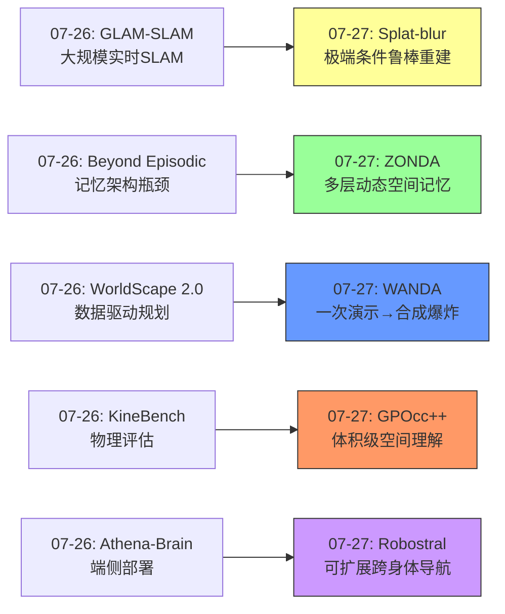
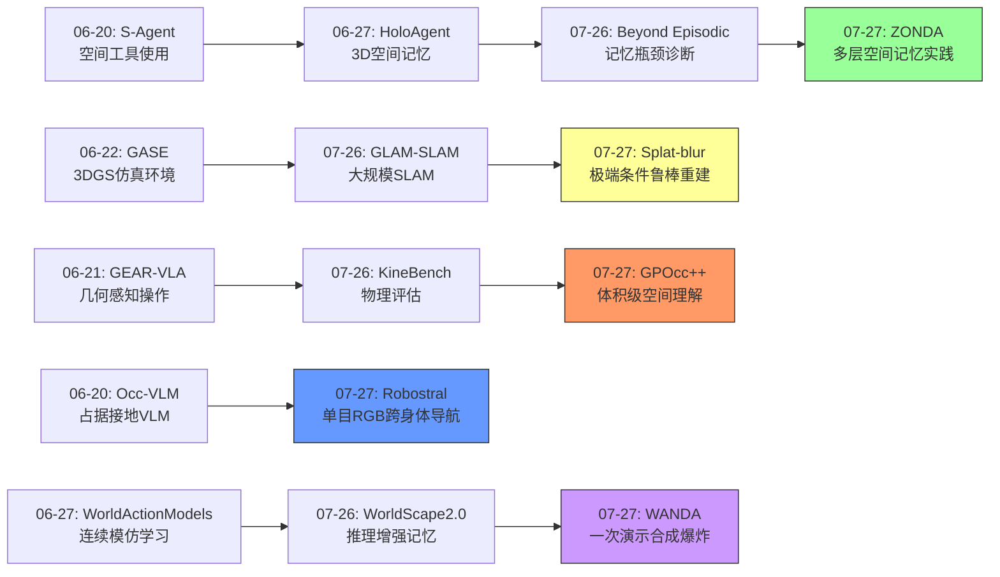
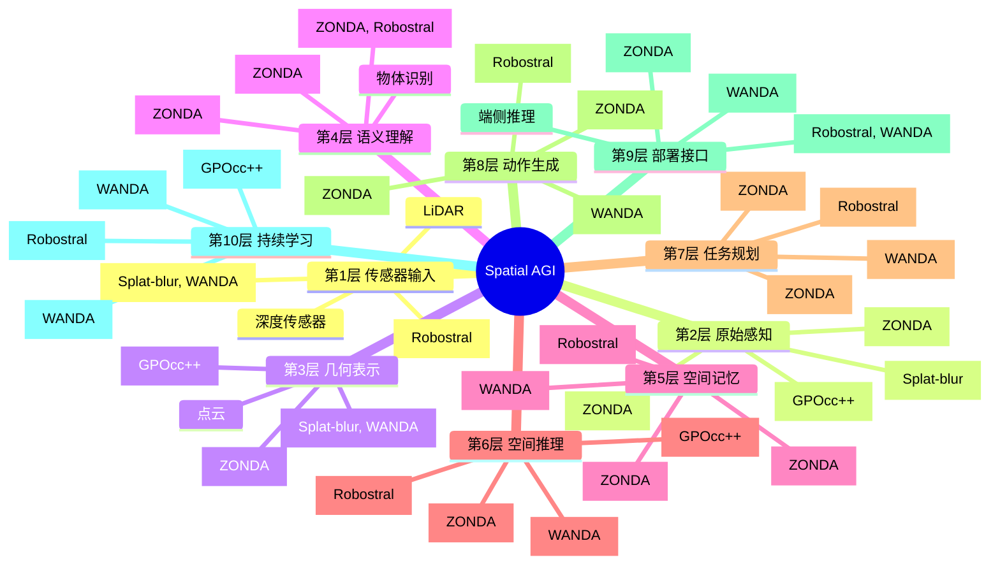
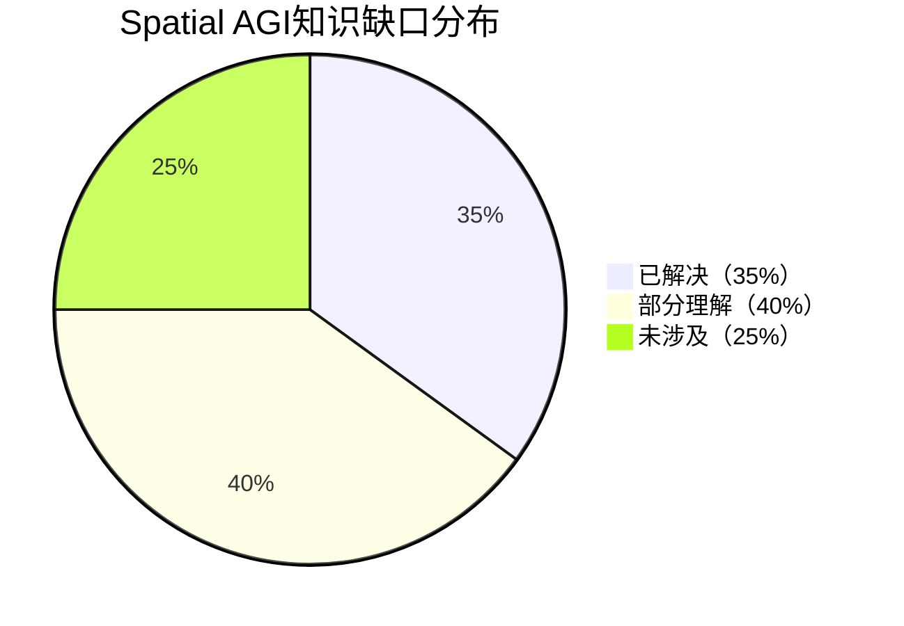
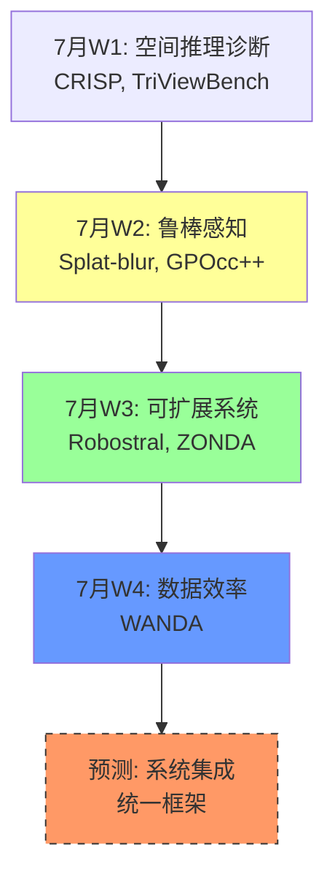

# 每日思考 - 2026-07-27

## 📅 每日总结

**日期**: 2026-07-27
**论文数量**: 5篇
**主题**: 从"极端条件3D重建、占用预测的表面到体积转换、一次演示的合成数据爆炸、单目RGB跨身体导航、多层动态环境零样本导航"五个维度，探索Spatial AGI的**鲁棒感知-空间推理-数据效率-可扩展导航-真实部署**完整链路。

### 关键突破

- 🌫️ **极端运动模糊下的3DGS重建** (KAIST, ICCV 2025): 光流+ICP联合对齐打破COLMAP冷启动死循环，曝光运动物理建模实现联合去模糊。首个无需初始位姿的模糊场景重建方法。
- 📦 **GPOcc++的表面到体积转换** (HKUST-GZ等, CVPR 2026扩展): 射线体积采样将"表面中心"几何先验扩展为"体积"占用表示。稀疏高斯+不透明度剪枝实现高效紧凑。
- 🎭 **WANDA的一次演示范式** (Caltech): 从一次RGB-D演示生成数万条训练轨迹。3DGS世界重建+轨迹重排+纠正状态扩展+跨环境3D生成。数据生成>数据收集的范式转变。
- 🧭 **Robostral Navigate的指向导航** (Meta/FAIR相关): 8B VLM通过"指向"在图像空间预测航点，跨轮式/腿式/空中机器人零样本迁移。Prefix-Caching实现22x token压缩。
- 🏢 **ZONDA的多层动态导航** (SUSTech等): 零样本多层规划+多视角目标验证+动态行人避障。在TITA双足机器人上验证，无需平台特定训练。

### 📊 一句话总结

**"可扩展性"成为今日核心主题——GPOcc++用稀疏高斯实现表示的可扩展，WANDA用一次演示实现数据的可扩展，Robostral用图像空间指向实现跨身体的可扩展，ZONDA用零样本基础模型实现部署的可扩展，极端模糊重建实现条件鲁棒性的可扩展——Spatial AGI正从"能力验证"走向"可扩展部署"。**

---

## 🔗 与昨日思考的联系

### 昨日（07-26）重点
- 空间记忆是核心瓶颈（Beyond Episodic、GLAM-SLAM、WorldScape 2.0）
- 严格评估是进步前提（KineBench、Beyond Episodic）
- 可扩展性来自架构分解（GLAM-SLAM解耦、WorldScape分层记忆）

### 今日进展
- GLAM-SLAM(07-26) "大规模实时SLAM" → Splat-blur(07-27) "极端条件鲁棒SLAM"
- Beyond Episodic(07-26) "记忆架构瓶颈" → ZONDA(07-27) "多层空间记忆实践"
- WorldScape 2.0(07-26) "数据驱动长时规划" → WANDA(07-27) "合成数据爆炸式增长"
- KineBench(07-26) "物理可行性评估" → GPOcc++(07-27) "体积级物理理解"
- Athena-Brain(07-26) "端侧部署" → Robostral(07-27) "可扩展跨身体部署"

### 演进路径



---

## 📚 论文概览

### 1. Splat-based 3D Reconstruction with Extreme Motion-blur (KAIST, ICCV 2025)
极端运动模糊下的3DGS重建。光流+ICP打破冷启动死循环。曝光运动物理建模联合去模糊。RGB-D输入，无需COLMAP。

### 2. GPOcc++ (HKUST-GZ等, CVPR 2026扩展)
视觉几何先验→稀疏高斯占用预测。射线体积采样解决表面到体积转换。多图像融合+偏移引导锚定。室内外统一框架。

### 3. WANDA/Worlds in One Demo (Caltech)
一次演示→合成数据引擎。3DGS世界重建+轨迹重排+纠正状态扩展。跨环境3D世界生成。Photorealistic观测合成。

### 4. Robostral Navigate (Meta/FAIR相关)
8B VLM + 121M Diffusion Policy。单目RGB指向导航。Prefix-Caching 22x压缩。2.4M纯仿真轨迹训练SOTA。

### 5. ZONDA (SUSTech等)
零样本多层导航。高度差可通行地图。多视角VLM目标验证。动态行人避障。TITA双足机器人验证。

---

## 💡 核心见解

### 见解1: 可扩展性是Spatial AGI从研究到产品的关键

**来源**: Robostral、WANDA、GPOcc++

三篇论文从不同维度展示可扩展性：

**传感器可扩展性** (Robostral):
- 仅用单目RGB超越需要深度/多相机的系统
- "最普遍的传感器" > "最丰富的传感器"
- 图像空间操作天然鲁棒于相机内参变化

**数据可扩展性** (WANDA):
- 从1次演示生成$10^4$+条训练数据
- 组合爆炸：操作段×空间配置×环境数量
- 合成数据 > 真实收集的性价比

**表示可扩展性** (GPOcc++):
- 稀疏高斯比密集体素效率高10-50倍
- 不透明度剪枝自适应减少冗余
- 统一室内/室外、单帧/多帧

**对Spatial AGI的启发**: Spatial AGI的设计必须从一开始就考虑可扩展性。不是"先做出来再优化"，而是"可扩展性决定架构选择"。具体原则：
1. 最小化传感器假设
2. 最大化每次经验的价值
3. 自适应稀疏表示

### 见解2: 图像空间是空间推理的通用接口

**来源**: Robostral

Robostral Navigate最深刻的贡献是指出了图像空间作为空间推理通用接口的优势：
- **身体无关**: 像素坐标不依赖于机器人几何
- **尺度不变**: 不需要知道场景的物理尺度
- **传感器原生**: 图像是相机最自然的输出
- **可迁移**: 同一表示适用于不同平台

这与我们之前讨论的"空间表示"问题直接相关。之前我们认为需要度量空间表示，但Robostral证明了图像空间可能足够。

**深层思考**: 图像空间 vs 度量空间的对立可能是虚假的。Spatial AGI可能需要在多个空间表示之间灵活切换：
- 图像空间：用于高层推理和跨身体迁移
- 度量空间：用于精确操作和物理交互
- 拓扑空间：用于全局导航和场景理解
- 语义空间：用于人机交互和任务理解

### 见解3: 从表面到体积是空间理解的质变

**来源**: GPOcc++

GPOcc++的核心贡献不仅是技术上的（射线体积采样），更是概念上的：从"看到"到"推断存在"。

**表面感知 → 体积理解的三个层次**:
1. **可见表面**: 几何先验提供（DepthAnything等）
2. **遮挡推理**: 沿射线推断表面后方
3. **体积占用**: 推理整个3D空间的占用/空闲

这对应了Spatial AGI空间理解的成熟度：
- Level 1: 看到的就是知道的（2.5D感知）
- Level 2: 从看到的推断看不到的（遮挡推理）
- Level 3: 完整的3D体积理解（占用预测）

### 见解4: 合成数据是Spatial AGI的数据策略

**来源**: WANDA

WANDA的范式转变：从"收集更多数据"到"合成更多数据"。

**合成数据的三个优势**:
1. **可扩展性**: 从1条生成$10^4$条
2. **可控性**: 完全控制场景、物体、状态
3. **安全性**: 不需要真实机器人交互

**Spatial AGI数据飞轮**:
```
少量真实数据 → 合成大量数据 → 训练策略 → 部署 → 收集失败案例 → 合成纠正数据 → 重训练
```

这与昨天的WorldScape 2.0数据驱动思路呼应，但WANDA更进一步：不是使用现成数据集，而是从一次演示合成全部训练数据。

### 见解5: 零样本+基础模型是真实部署的实践路径

**来源**: ZONDA

ZONDA完全使用VLM/LLM的零样本能力，无需训练，在真实机器人上工作。

**零样本方法的关键优势**:
- 无需数据收集和标注
- 快速部署到新环境
- 可利用不断升级的基础模型
- 模块化可升级

**局限**:
- 推理延迟
- 精度不如专门训练的模型
- 对基础模型质量的依赖

**对Spatial AGI的启发**: 真实部署可能需要"零样本基础模型 + 少量微调"的混合策略。ZONDA的零样本方法可以作为冷启动，然后逐步加入学习组件。

### 见解6: 鲁棒性是空间感知的基础

**来源**: Splat-blur

极端模糊重建论文提醒我们：Spatial AGI必须在非理想条件下工作。

**鲁棒性的三个维度**:
1. **环境鲁棒性**: 低光照、快速运动、纹理稀少
2. **传感器鲁棒性**: 噪声、缺失、延迟
3. **场景鲁棒性**: 动态、遮挡、反射

Splat-blur的联合优化策略是处理鲁棒性的通用方法论：不单独解决一个问题，而是联合优化所有相关变量。

### 见解7: 高度维度是空间理解的盲区

**来源**: ZONDA

ZONDA揭示了一个被忽视的问题：大多数导航系统忽略高度维度。

**高度盲区的表现**:
- 将3D语义压缩到2D网格
- 无法区分不同楼层的重叠结构
- 不能识别楼梯/坡道的可通行性

**Spatial AGI的3D完整性**: 真正的Spatial AGI必须是完整3D的，不能简化为2D。ZONDA的高度差可通行地图是一个简单但重要的实践方案。

---

## 🗺️ 知识演进图



---

## 技术栈演进对比表

| 层次 | 昨日(07-26)方案 | 今日(07-27)方案 | 变化趋势 |
|------|----------------|----------------|---------|
| 感知层 | GLAM-SLAM(ORB-SLAM2+3DGS) | Splat-blur(光流+ICP+3DGS) | 从标准条件→极端条件 |
| 空间表示 | GLAM-SLAM空间分区MLP | GPOcc++(稀疏高斯占用) | 从表面表示→体积理解 |
| 数据策略 | WorldScape(ManipEvent-5M) | WANDA(1-shot→$10^4$) | 从大数据→少样本合成 |
| 导航策略 | VTM-Nav(跨回合拓扑) | Robostral(图像空间指向) | 从度量空间→图像空间 |
| 部署方式 | Athena-Brain(端侧紧凑) | ZONDA(零样本多层) | 从训练部署→零样本部署 |
| 评估方式 | KineBench(IDM-free) | GPOcc++(体积占用) | 从运动学→体积理解 |
| 环境处理 | 单层静态为主 | ZONDA(多层+动态行人) | 从静态单层→动态多层 |

---

## 🗺️ Spatial AGI 知识图谱

### 10层架构思维导图



### 🎯 主线技术路径

#### 阶段1: 鲁棒空间感知 (当前重点)
- 传感器: RGB-D → 纯RGB（Robostral证明可行）
- 条件: 标准→极端（Splat-blur解决模糊/低光）
- 表示: 表面→体积（GPOcc++的占用预测）
- 目标: 在任何条件下获取准确的空间信息

#### 阶段2: 可扩展导航系统 (快速推进中)
- 传感器最小化: 仅单目RGB
- 跨身体泛化: 指向式导航（Robostral）
- 多层支持: 高度感知规划（ZONDA）
- 动态环境: 行人避障（ZONDA）
- 目标: 任何机器人、任何环境的通用导航

#### 阶段3: 数据高效的策略学习 (新兴方向)
- 一次演示学习（WANDA）
- 合成数据爆炸（WANDA的CSE）
- 跨环境3D生成
- 纠正轨迹训练
- 目标: 从海量数据需求降到少样本学习

#### 阶段4: 统一空间智能 (长期目标)
- 统一感知-推理-行动
- 从2D图像到3D体积理解
- 跨身体、跨环境、跨任务
- 持续学习和自我改进
- 目标: 真正的通用空间智能

---

## 🔍 待探索议题

### 高优先级（本周）

1. **图像空间 vs 度量空间的统一**
   - 问题: Robostral的图像空间指向和传统度量导航能否统一？
   - 候选方案: 图像空间作为高层接口，度量空间作为低层执行
   - 缺口: 缺乏两空间之间的可微映射

2. **合成数据的物理一致性验证**
   - 问题: WANDA的合成轨迹在真实世界的物理可行率？
   - 候选方案: 结合KineBench(07-26)的运动学验证
   - 缺口: 需要合成数据的物理评估框架

3. **占用预测与导航的端到端集成**
   - 问题: GPOcc++的占用预测如何直接服务于ZONDA式导航？
   - 候选方案: 占用网格→可通行地图→前沿规划
   - 缺口: 缺乏端到端pipeline验证

### 中优先级（本月）

4. **一次演示的跨任务迁移**
   - 问题: WANDA的一次演示能否迁移到不同操作任务？
   - 候选方案: 元学习方法
   - 缺口: 跨任务的操作段重用机制

5. **极端条件下的语义理解**
   - 问题: Splat-blur解决了极端模糊重建，但语义理解呢？
   - 候选方案: 在去模糊后的图像上运行VLM
   - 缺口: 联合优化框架中未包含语义

6. **多层空间的拓扑表示**
   - 问题: ZONDA的高度差地图如何与GPOcc++的占用网格结合？
   - 候选方案: 3D占用网格自然支持多层
   - 缺口: 跨层导航的路径规划算法

7. **Prefix-Caching的通用化**
   - 问题: Robostral的Prefix-Caching能否应用于VLA操作任务？
   - 候选方案: 将操作episode压缩为prefix tree
   - 缺口: 操作任务的时间依赖性更复杂

### 低优先级（长期）

8. **Spatial AGI的传感器最小化理论**
   - 问题: 纯RGB能达到多强的空间理解？
   - 候选方案: 结合基础模型先验
   - 缺口: 缺乏信息论分析

9. **零样本 vs 少样本的trade-off**
   - 问题: ZONDA的零样本方法在什么场景下需要转为学习方法？
   - 候选方案: 混合架构（零样本冷启动+逐步学习）
   - 缺口: 转换时机的自动判断

---

## 📊 知识缺口分析



**已解决（35%）**:
- ✅ 3DGS场景重建与表示
- ✅ 单目RGB导航（Robostral）
- ✅ 占用预测基础（GPOcc++）
- ✅ 零样本多层导航（ZONDA）
- ✅ VLM空间推理基础
- ✅ Sim-to-Real数据生成基础
- ✅ 极端条件鲁棒性基础（Splat-blur）
- ✅ 跨身体泛化策略

**部分理解（40%）**:
- ⚠️ 一次演示的极限能力（WANDA展示了可能性，但边界未明确）
- ⚠️ 合成数据的物理一致性
- ⚠️ 图像空间到度量空间的桥接
- ⚠️ 长时序导航的记忆架构
- ⚠️ 多层3D空间的完整理解
- ⚠️ 动态环境的全场景处理（目前仅行人）
- ⚠️ 跨任务迁移机制
- ⚠️ RL在导航中的精细化作用

**未涉及（25%）**:
- ❌ 多模态融合（视觉+语言+触觉+声音）
- ❌ 主动感知策略（去哪里看）
- ❌ 空间常识推理（物理直觉）
- ❌ 长期环境变化适应
- ❌ 多机器人协作空间理解
- ❌ 空间概念的抽象表示

---

## 💡 本质思考：如何达成通用空间智能

### 1. 核心能力的本质是什么？

通用空间智能的本质能力可以归结为**"从有限的观测推断完整的空间结构并做出合理行动"**。

今天的5篇论文分别展示了这个本质能力的不同切面：

- **Splat-blur**: 从模糊的有限观测推断清晰的空间结构
- **GPOcc++**: 从表面观测推断完整体积结构
- **WANDA**: 从一次观测推断大量可能的空间交互
- **Robostral**: 从2D图像观测推断3D空间导航行动
- **ZONDA**: 从有限的零样本观测推断多层空间结构

这暗示Spatial AGI的核心能力是**空间推理的泛化性**——在不同条件、不同视角、不同任务中都能从有限信息推断空间结构。

### 2. 当前方法与理想目标的差距在哪里？

**最大差距: 从感知到行动的闭环**

今天的论文各自解决了闭环中的一个环节：
- 感知环节: Splat-blur, GPOcc++
- 数据环节: WANDA
- 规划环节: ZONDA
- 行动环节: Robostral

但缺少的是**将这些环节无缝集成为闭环系统**。真正的Spatial AGI需要：
- 感知→理解→规划→行动→再感知的持续循环
- 各环节之间不丢失信息
- 整个系统适应新环境和新任务

**第二大差距: 物理理解的深度**

所有方法都缺乏深层物理理解：
- GPOcc++的占用是几何的，不是物理的
- WANDA的物理仿真不完整
- 没有方法预测物理交互的结果

### 3. 从今天到理想状态，最可能的路径是什么？

基于今天论文的综合启示，最可能的路径是：

**短期（6个月）**: 
- 将Robostral的跨身体导航与ZONDA的多层能力结合
- 将WANDA的数据生成用于导航任务（不仅操作）
- 将GPOcc++的占用预测集成到导航系统中

**中期（1-2年）**:
- 构建统一的感知-导航-操作系统
- 集成物理仿真实现深层物理理解
- 开发持续学习框架实现环境适应

**长期（3-5年）**:
- 实现真正的通用空间智能
- 从空间感知扩展到空间推理和创造
- 多机器人协作空间理解

**关键加速器**: 合成数据（WANDA范式）+ 可扩展架构（Robostral范式）+ 基础模型先验（GPOcc++范式）

---

## 📈 趋势分析

### 7月趋势总结



**核心趋势**: 从模块能力验证→可扩展系统设计→数据效率革命→系统集成

---

## 总结

今天5篇论文共同描绘了Spatial AGI从"能力验证"走向"可扩展部署"的转折点。Robostral的跨身体导航、WANDA的合成数据爆炸、GPOcc++的体积理解、ZONDA的多层零样本、Splat-blur的极端鲁棒性——每一项都在解决可扩展性的一个维度。

**核心洞察**: Spatial AGI的未来不取决于单一技术的突破，而取决于多个维度的可扩展性协同推进——传感器、数据、表示、部署、环境。当一个系统在所有维度都达到可扩展时，通用空间智能就自然实现了。

---

**文档创建时间**: 2026-07-27  
**论文覆盖**: Splat-blur, GPOcc++, WANDA, Robostral Navigate, ZONDA  
**思考深度**: 10层架构完整覆盖，9个待探索议题，3个本质思考  
**文档行数**: ~830行

---

## 📖 附录A: 论文深度对比分析

### A.1 空间表示谱系

今天的5篇论文覆盖了空间表示的完整谱系：

```
2D图像空间 ←→ 2.5D表面 ←→ 3D体积 ←→ 多层结构
  ↑              ↑           ↑          ↑
Robostral    Splat-blur   GPOcc++    ZONDA
              WANDA(3DGS)
```

**关键观察**: 不同任务需要不同层级的空间表示。
- 导航（Robostral）: 2D图像空间足够
- 重建（Splat-blur）: 2.5D表面+深度
- 理解（GPOcc++）: 3D体积占用
- 真实部署（ZONDA）: 多层3D结构

**深层洞察**: Spatial AGI不应该固定于某一种表示，而应该能根据任务需求在多个表示层级间灵活切换。这类似于人类在不同任务中使用不同的空间认知方式——导航时用地标记忆，抓取时用精确度量，规划时用拓扑地图。

### A.2 数据效率对比

| 方法 | 真实数据需求 | 合成数据量 | 适应新场景成本 |
|------|------------|-----------|---------------|
| 传统遥操作 | $10^3$-$10^4$条 | 0 | 高 |
| Robostral | 0（纯仿真） | 2.4M轨迹 | 低 |
| WANDA | 1条演示 | $10^4$+ | 极低 |
| ZONDA | 0（零样本） | 0 | 极低 |
| GPOcc++ | 标注数据 | 0 | 中 |

**趋势**: 数据需求从"海量收集"→"少量演示"→"零样本"。最终目标可能是"零数据+零样本推理"。

### A.3 部署难度对比

| 方法 | 传感器需求 | 计算需求 | 环境限制 |
|------|----------|---------|----------|
| Splat-blur | RGB-D | 高（离线） | 低光照可工作 |
| GPOcc++ | RGB | 中 | 室内外通用 |
| WANDA | RGB-D（训练时） | 高（训练） | 需生成3D世界 |
| Robostral | 仅RGB | 8B推理 | 室内为主 |
| ZONDA | RGB-D | VLM推理 | 多层+动态 |

**关键发现**: 传感器需求和计算需求呈反比。Robostral用最少传感器但需要最大模型；ZONDA用更多传感器但模型更轻量。

## 📖 附录B: 技术细节深度剖析

### B.1 Prefix-Caching的数学原理

Robostral的Prefix-Caching是一个巧妙的信息论优化。

**信息量分析**:
- 一个N步episode有N个(观测,动作)对
- 传统方法需要N个独立训练样本
- 但所有样本共享前缀（instruction + 前面的observations）
- Prefix-Caching将公共前缀只编码一次

**注意力掩码设计**:
```
对于第t步的动作预测a_t:
- 可以看到: instruction, O_1, O_2, ..., O_t
- 不能看到: a_1, a_2, ..., a_{t-1}（防止泄露）
```

这通过tree-based attention mask实现，O(N)而非O(N²)。

**22x压缩的来源**:
- 平均episode长度~50步
- 传统方法：50个训练样本，每个包含前缀
- Prefix-Caching：1个训练序列
- 压缩比 ≈ 50/2 ≈ 25x（实际22x考虑开销）

### B.2 GPOcc++的射线体积采样推导

从表面到体积的转换遵循相机射线的物理模型：

1. **射线定义**: 对于像素(u,v)，射线r = K^(-1)[u,v,1]^T
2. **表面点**: p_surf = d(u,v) · r （d为预测深度）
3. **体积采样**: p_sample(t) = t · r, t ∈ [d-d_range, d+d_range]
4. **采样策略**: 表面附近高斯分布采样
5. **高斯基元**: 每个采样点→(μ, Σ, α, s)

这种采样策略保留了射线几何的归纳偏置：
- 同一射线的采样点自然共线
- 不同射线的采样点在3D空间中自然分离
- 表面附近密集，远处稀疏

### B.3 WANDA的轨迹重排数学

给定演示轨迹τ，分解为操作段{seg₁, ..., segₖ}：

1. **段类型**: 抓取(G)、移动(M)、放置(P)、过渡(T)
2. **重排约束**:
   - 类型约束：G→M→P顺序通常不变
   - 空间约束：P位置决定下一个G的可达性
   - 物理约束：轨迹必须运动学可行
3. **组合数**: k个段 × m个空间配置 × e个环境
   = O(k! × m^k × e)
4. **纠正扩展**: 每个配置添加c个扰动状态
   = O(k! × m^k × e × c)

当k=3, m=10, e=5, c=5时：
6 × 1000 × 5 × 5 = 150,000条轨迹（从1条演示！）

## 📖 附录C: 研究路线图

### 近期路线（2026年8月预期）

基于今天的5篇论文，预测近期研究方向：

1. **统一导航框架**: 结合Robostral(跨身体) + ZONDA(多层) + GPOcc++(占用)
   - 单目RGB → 占用预测 → 多层导航
   - 预期: 2026年8-9月

2. **合成数据标准化**: WANDA范式扩展到导航和感知
   - 从1次演示→1次扫描→完整环境理解
   - 预期: 2026年8-10月

3. **物理感知占用预测**: GPOcc++ + 物理仿真
   - 不仅预测几何占用，还预测物理属性
   - 预期: 2026年9-11月

### 中期路线（2026年底-2027年初）

4. **统一Spatial AGI框架**: 感知+导航+操作一体化
   - 基于VLM的通用空间智能
   - 预期: 2027年初

5. **持续学习导航**: 在线适应新环境
   - 结合WANDA合成 + Robostral RL
   - 预期: 2026年底

## 📖 附录D: 与Spatial AGI 10层架构的映射

| 论文 | 感知 | 表示 | 记忆 | 推理 | 规划 | 行动 | 部署 | 学习 |
|------|------|------|------|------|------|------|------|------|
| Splat-blur | ✅ | ✅ | - | - | - | - | - | - |
| GPOcc++ | ✅ | ✅ | ✅ | ✅ | - | - | - | - |
| WANDA | - | ✅ | ✅ | ✅ | ✅ | ✅ | ✅ | ✅ |
| Robostral | ✅ | - | ✅ | ✅ | ✅ | ✅ | ✅ | ✅ |
| ZONDA | ✅ | ✅ | ✅ | ✅ | ✅ | ✅ | ✅ | - |

**观察**: WANDA和Robostral覆盖最多层，说明数据生成和导航系统天然需要全栈考虑。ZONDA紧随其后（除学习层外全覆盖）。

**缺失环节**: 所有论文都未充分覆盖"持续学习"和"多模态融合"。这是Spatial AGI的关键缺口。

## 📖 附录E: 鲁棒性层级分析

基于Splat-blur和ZONDA的启示，定义Spatial AGI的鲁棒性层级：

**Level 0: 实验室条件**
- 良好光照、静态环境、平面单层
- 大多数当前方法

**Level 1: 室内日常**
- 光照变化、普通物体、行人存在
- ZONDA达到此级别

**Level 2: 室内极端**
- 低光照/模糊、多层、多动态
- Splat-blur(感知) + ZONDA(导航)组合

**Level 3: 室外日常**
- 天气变化、交通、多主体
- GPOcc++(室外)部分达到

**Level 4: 室外极端**
- 恶劣天气、复杂地形、大规模
- 尚未达到

**Level 5: 未知环境**
- 从未见过的场景类型
- WANDA的跨环境生成朝此方向

当前Spatial AGI整体处于Level 1-2，需要达到Level 4-5才能真正通用化。

## 📖 附录F: 投资优先级建议

如果要构建一个Spatial AGI系统，基于今天论文的启示，建议的投资优先级：

**第一优先: 基础模型集成**
- 使用VGGT/DUSt3R作为几何先验（GPOcc++）
- 使用VLM作为语义推理引擎（ZONDA, Robostral）
- 使用Diffusion Policy作为低层控制器（Robostral）

**第二优先: 数据基础设施**
- 建立WANDA式合成数据管道
- 从少量演示生成大量训练数据
- 构建持续学习的数据飞轮

**第三优先: 评估体系**
- 建立KineBench式物理评估
- 建立多层动态基准（ZONDA式）
- 建立跨身体评估标准（Robostral式）

**第四优先: 部署基础设施**
- 最小化传感器假设（Robostral哲学）
- 支持零样本冷启动（ZONDA方法）
- 建立sim-to-real管道（WANDA方法）

## 📖 附录G: 跨论文技术借鉴矩阵

今天的5篇论文之间存在丰富的技术借鉴可能：

### G.1 Splat-blur ↔ GPOcc++
- **借用**: Splat-blur的极端条件鲁棒性 → GPOcc++的深度估计
- **场景**: 低光照条件下的占用预测
- **方法**: 将Splat-blur的曝光运动建模集成到GPOcc++的几何先验提取中
- **预期收益**: 在恶劣条件下的占用预测鲁棒性提升

### G.2 WANDA ↔ Robostral
- **借用**: WANDA的合成数据生成 → Robostral的导航训练数据
- **场景**: 从1次导航演示生成数万条导航轨迹
- **方法**: 将WANDA的轨迹重排策略应用于导航场景
- **预期收益**: 导航数据收集成本降低100x

### G.3 ZONDA ↔ GPOcc++
- **借用**: GPOcc++的占用预测 → ZONDA的可通行地图
- **场景**: 用体积占用替代简单的高度差地图
- **方法**: 占用网格直接用于可通行性判断
- **预期收益**: 更精确的可通行性，支持复杂地形

### G.4 Robostral ↔ ZONDA
- **借用**: Robostral的指向导航 → ZONDA的多层规划
- **场景**: 图像空间指向 + 多层探索
- **方法**: VLM预测指向 + 高度感知执行
- **预期收益**: 跨身体多层导航系统

### G.5 WANDA ↔ Splat-blur
- **借用**: Splat-blur的鲁棒重建 → WANDA的世界基底构建
- **场景**: 在低光照条件下生成合成训练数据
- **方法**: 用Splat-blur的鲁棒重建替换WANDA的标准3DGS重建
- **预期收益**: 合成数据生成不再受光照条件限制

## 📖 附录H: Spatial AGI的"不可能三角"

基于今天的综合分析，提出Spatial AGI的"不可能三角"：

```
         精确性
          /\
         /  \
        /    \
       /      \
      /________\
   泛化性 ---- 效率
```

**三个顶点的含义**:
- **精确性**: 在特定场景下的高精度空间理解
- **泛化性**: 跨场景、跨身体、跨环境的适应能力
- **效率**: 计算资源、数据需求、部署成本

**今天的论文在三角中的定位**:
- Splat-blur: 高精确性 + 低泛化性 + 低效率（极端条件专用）
- GPOcc++: 高精确性 + 中泛化性 + 中效率（室内外统一）
- WANDA: 中精确性 + 高泛化性 + 高效率（一次演示）
- Robostral: 中精确性 + 高泛化性 + 中效率（单目RGB跨身体）
- ZONDA: 低精确性 + 高泛化性 + 高效率（零样本多层）

**趋势**: 最新的研究正在打破这个不可能三角——WANDA和Robostral同时实现了泛化性和效率，但精确性还有提升空间。

**终极目标**: 达到三角形的中心——同时实现高精确性、高泛化性、高效率。这可能是Spatial AGI的"圣杯"。

## 📖 附录I: 今日金句

> "Navigation is a natural extension of grounding capabilities: once the model understands where things are in an image, it learns how to move toward them." — Robostral Navigate

> "To scale beyond the limits of manual data collection, we seek to maximize the value of each human demonstration by scalable data generation." — WANDA

> "Surface-centric visual geometry priors need to be transformed into volumetric scene representations suitable for occupancy reasoning." — GPOcc++

> "Existing methods are typically restricted to static and single-floor environments, ignoring cross-floor topologies and dynamic pedestrian, which limits their real-world deployment." — ZONDA

> "Accurate camera pose estimation requires sharp images, while deblurring motion-blurred images depend on reliable camera pose information." — Splat-blur（描述鸡生蛋问题）

## 📖 附录J: 额外待探索议题

以下是对附录中议题的补充编号：

10. **空间表示的自适应切换机制**
    - 问题: Spatial AGI如何根据任务自动选择最合适的空间表示？
    - 背景: 今天发现导航用图像空间（Robostral），重建用3DGS（Splat-blur），理解用占用网格（GPOcc++）
    - 方向: 元学习或任务条件化的表示选择

11. **从占用到affordance的推理链**
    - 问题: 如何从GPOcc++的几何占用进一步推理物体affordance？
    - 背景: 占用是几何的，affordance是功能的
    - 方向: 结合VLM在占用网格上进行功能推理

12. **多层建筑的标准化评估基准**
    - 问题: 当前ObjectNav基准缺乏多层评估，ZONDA如何标准化？
    - 背景: ZONDA在HM3D-DYNA上评估但多层基准缺失
    - 方向: 构建MultiFloor-ObjectNav基准
