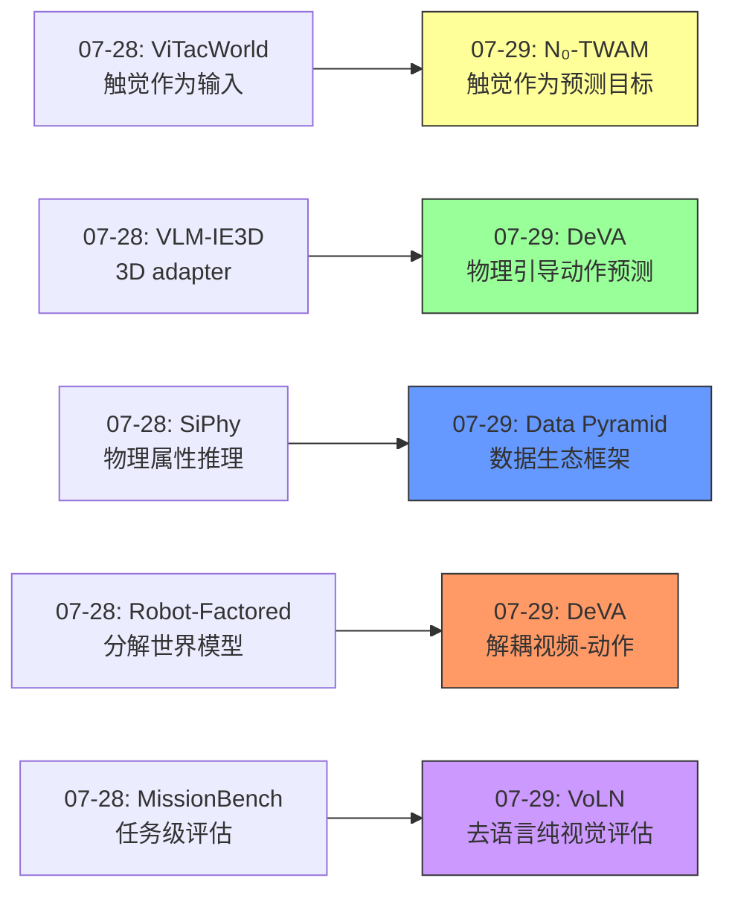
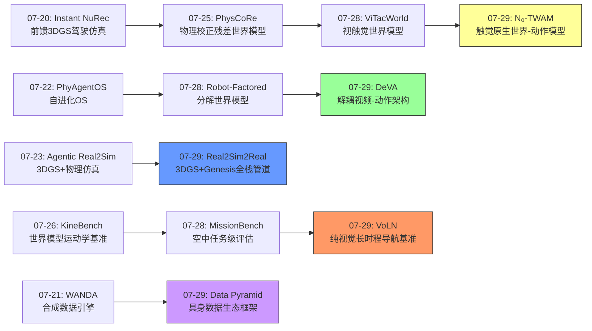
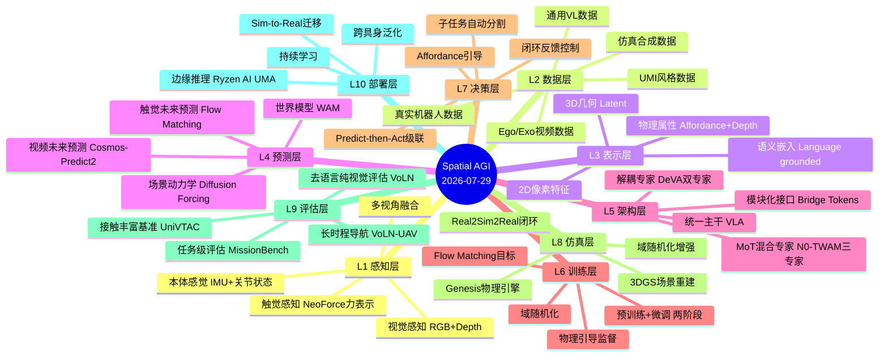
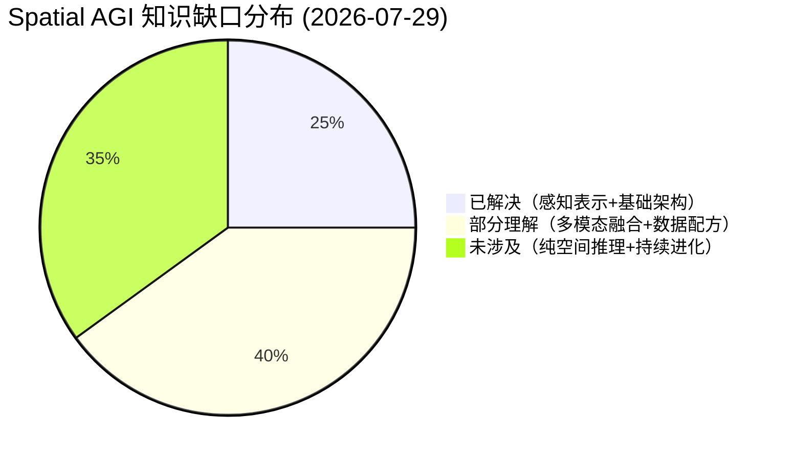
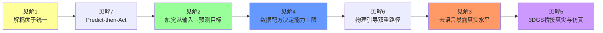

# 每日思考 - 2026-07-29

## 📅 每日总结

**日期**: 2026-07-29
**论文数量**: 5篇
**主题**: 从"具身数据金字塔架构、解耦视频-动作模型、触觉原生世界-动作模型、3DGS Real2Sim管道、纯视觉长时程导航"五个维度，探索Spatial AGI的**数据生态系统-架构解耦设计-触觉感知升维-场景数字化桥梁-去语言空间推理**完整图景。

### 关键突破

- 📊 **Data Pyramid系统性具身数据框架** (HKU/NTU/SJTU): 首次将具身AI数据组织为五层金字塔（真实机器人→UMI→ego/exo→仿真→通用VL），围绕可扩展性vs机器人对齐度核心张力，六维评估。揭示触觉数据和失败恢复数据是关键瓶颈。
- 🎬 **DeVA解耦Video-Action架构** (UC Irvine/Georgia Tech): 视频和动作专家解耦但通过多层交叉注意力和桥接tokens互联。Affordance+Depth物理引导同时塑造视频表示和直接条件化动作预测。比统一架构收敛更快、性能更优。
- 🖐️ **N₀-TWAM首个大规模触觉原生世界-动作模型** (NeoteAI/Fudan): MoT三专家（video/tactile/action），触觉既是被预测的未来也是被观测的现状。Predict-then-Act级联。UniVTAC 84.5%，真实8任务均值46.3%远超VLA的30.0%。
- 🔄 **Real2Sim2Real AMD ROCm全栈** (AMD/BIT): 3DGS重建+Genesis物理引擎的Real2Sim混合管道。SmolVLA-450M在<2.4GB VRAM下训练7-11分钟。非CUDA完整Physical AI pipeline验证。
- 🧭 **VoLN纯视觉长时程导航** (Beihang): 移除语言指令和GPS，仅凭视觉目标+场景beacons导航。7,210 episodes基准，Hard成功率仅1.8%——暴露纯视觉空间推理的极端困难。

### 📊 一句话总结

**"解耦、升维、去语言"成为今日核心主题——DeVA将视频-动作解耦以保留模态特定能力，N₀-TWAM将触觉升维为预测目标扩展感知维度，Data Pyramid将数据生态分层解耦，VoLN去除语言代理暴露真实空间智能水平，Real2Sim2Real用3DGS桥接真实与仿真——Spatial AGI正从"端到端统一"走向"结构化解耦+多模态融合"。**

### 🔗 延续性

**昨日→今日**:
- 昨日的"多模态感知扩展"（ViTacWorld视觉+触觉）→ 今日的"触觉预测升维"（N₀-TWAM触觉作为预测目标）
- 昨日的"物理属性推理"（SiPhy材料属性）→ 今日的"物理引导动作"（DeVA affordance+depth引导）
- 昨日的"任务级评估"（MissionBench空中任务）→ 今日的"去语言导航评估"（VoLN纯视觉空间推理）
- 昨日的"分解式世界模型"（Robot-Factored）→ 今日的"解耦视频-动作架构"（DeVA专门专家分离）

**今日→明日**:
- 触觉预测升维→更多模态的原生预测（声音、温度？）
- 数据金字塔框架→自动化数据配方设计
- 去语言空间推理→纯视觉空间认知的上限探索

### 💡 本质思考：如何达成通用空间智能

#### 1. 核心能力的本质是什么？

经过连续多日的研究，Spatial AGI的核心能力可以归纳为五个层次：

- **感知层**：多模态空间感知（视觉+触觉+本体感觉+depth+affordance）
- **表示层**：层次化空间表示（2D像素→3D几何→物理属性→语义含义）
- **预测层**：时空演化预测（未来视觉+触觉+场景动力学）
- **决策层**：基于预测的空间行动（从"想象未来"到"执行动作"）
- **评估层**：去作弊的真实评估（移除语言/全局信息后的纯空间智能）

这五层形成了一个从感知到评估的完整闭环。今天的5篇论文恰好分别贡献于不同层次：Data Pyramid（数据→所有层），DeVA（预测+决策层），N₀-TWAM（感知+预测+决策层），Real2Sim2Real（感知+表示层），VoLN（评估层）。

#### 2. 当前方法与理想目标的差距在哪里？

**差距1：触觉数据的规模瓶颈**
Data Pyramid明确指出触觉数据是第一大开放挑战。N₀-TWAM虽然展示了触觉原生WAM的强大能力，但其"数万小时self-collected数据"的收集成本和标准化问题是巨大障碍。

**差距2：纯视觉空间推理极端困难**
VoLN的Hard成功率仅1.8%——当我们真正移除语言接口的"作弊"通道后，当前最先进的模型在纯视觉长时程空间导航上接近随机。这揭示了一个深刻问题：VLM在空间任务上的很多"成功"可能来自语言先验而非真正的空间推理。

**差距3：架构设计的探索空间仍然巨大**
DeVA的解耦vs统一、N₀-TWAM的MoT vs shared backbone、Real2Sim2Real的3DGS+物理引擎混合——每种架构选择都有其tradeoff，远未收敛到最优设计。

#### 3. 从今天到理想状态，最可能的路径是什么？

**路径一：触觉+视觉+X的多模态原生WAM**
N₀-TWAM和ViTacWorld共同指向一个趋势：未来的世界-动作模型将原生支持更多模态的预测。不仅是视觉和触觉，还可能包括声音（碰撞声、摩擦声）、温度（热成像）、甚至嗅觉（化学传感）。每种新模态都有"预测+观测"双路径。

**路径二：数据配方自动化**
Data Pyramid提供了框架，但下一步是自动化——用NAS（Neural Architecture Search）的思路搜索最优数据混合策略，根据目标任务自动选择和配比不同层级的数据。

**路径三：渐进去语言的评估体系**
VoLN展示了去除语言后空间推理的真实水平。未来的评估应该形成光谱：从全语言辅助→部分语言提示→纯视觉目标→纯空间坐标，逐步暴露真正的空间智能。

---

## 🔗 与昨日思考的联系

### 昨日（07-28）重点
- 多模态融合（ViTacWorld视觉+触觉世界模型）
- 几何增强理解（VLM-IE3D隐式+显式3D）
- 物理属性推理（SiPhy从单图推理物理属性）
- 任务级评估（MissionBench空中任务系统化评估）
- 结构化建模（Robot-Factored分解式世界模型）

### 今日进展
- 多模态融合(07-28 ViTacWorld触觉输入) → 触觉预测升维(07-29 N₀-TWAM触觉作为预测目标)
- 几何增强理解(07-28 VLM-IE3D 3D adapter) → 物理引导动作(07-29 DeVA affordance+depth引导)
- 物理属性推理(07-28 SiPhy属性推理) → 数据生态框架(07-29 Data Pyramid数据配方)
- 结构化建模(07-28 Robot-Factored分解) → 架构解耦设计(07-29 DeVA解耦专家)
- 任务级评估(07-28 MissionBench) → 去语言评估(07-29 VoLN纯视觉导航)

### 演进路径

---

## 📚 论文概览

1. **Data Pyramid for Embodied Manipulation** (arXiv:2607.24744): 系统性具身数据金字塔框架，五层数据源（真实机器人/UMI/ego-exo/仿真/通用VL），六维评估（规模/对齐/质量/多样性/可复用性/物理保真度）。分析Embodied Brain/VLA/WAM三类模型如何利用异构数据。

2. **DeVA: Decoupled Video-Action Model** (arXiv:2607.24159): 视频+动作双专家架构，Cosmos-Predict2初始化，多层交叉注意力+桥接tokens，affordance+depth物理引导同时塑造视频表示和直接条件化动作预测。比统一架构收敛更快。

3. **N₀-TWAM: Tactile-Native World-Action Model** (arXiv:2607.23783): 首个大规模触觉原生WAM，MoT三专家(video/tactile/action)，predict-then-act级联，NeoForce力触觉表示。UniVTAC 84.5%，真实8任务46.3%远超VLA 30.0%。

4. **Real2Sim2Real AMD ROCm Pipeline** (arXiv:2607.22997): 3DGS重建+Genesis物理引擎的Real2Sim混合管道，SmolVLA-450M在<2.4GB VRAM训练。首个完整非CUDA Physical AI pipeline。

5. **VoLN: Vision-Only Long-Horizon Navigation** (arXiv:2607.21400): 移除语言指令和GPS，仅凭视觉目标+场景beacons导航。7,210 episodes/17环境，Hard成功率1.8%。

---

## 💡 核心见解

### 见解1: 解耦是当前架构设计的主流趋势
[来自DeVA + N₀-TWAM + Data Pyramid]

DeVA证明视频-动作解耦优于统一架构。N₀-TWAM的三专家MoT进一步将触觉独立出来。Data Pyramid在数据层面也倡导分层解耦。这共同指向一个原则：**不同模态/任务需要专门的表示空间，通过精心设计的接口（cross-attention/bridge tokens/shared attention）保持互联**。

**对Spatial AGI的启发**：未来的Spatial AGI系统应该采用"解耦专家+共享接口"架构，而非试图用一个端到端模型处理所有空间任务。

### 见解2: 触觉正在从"输入"升维为"预测目标"
[来自N₀-TWAM]

昨天的ViTacWorld将触觉作为世界模型的**输入**。今天的N₀-TWAM将触觉升维为**预测目标**——不仅感知当前触觉，还预测未来触觉。这种升维带来三个好处：(1)前馈控制（基于预测触觉决策），(2)异常检测（预测vs实际触觉对比），(3)子任务推进（触觉事件作为里程碑）。

**对Spatial AGI的启发**：Spatial AGI中的每个感知模态都应该考虑"预测+观测"双路径设计——不仅仅是触觉，还包括depth、surface normal、optical flow等。

### 见解3: 去语言评估暴露真实空间智能水平
[来自VoLN]

VoLN最震撼的发现是1.8%的Hard成功率。这意味着VLM在空间任务上的很多"成功"可能来自语言先验而非真正的空间推理。当"左转100米"这样的路线指令被移除后，模型的导航能力接近随机。

**对Spatial AGI的启发**：Spatial AGI的评估体系需要从"语言辅助"逐步过渡到"纯空间"，才能真正衡量空间智能的发展水平。

### 见解4: 数据配方是Spatial AGI的能力上限决定因素
[来自Data Pyramid]

Data Pyramid揭示了一个关键洞察：不同具身基础模型的数据使用正在从单一真实机器人数据转向异构混合。数据配方（不同层级数据的比例和组合方式）直接决定了模型在感知、推理、规划、动作生成和世界预测各方面的能力上限。

**对Spatial AGI的启发**：Spatial AGI系统的开发应该从"模型中心"转向"数据中心"——先设计最优数据配方，再选择合适的模型架构。

### 见解5: 3DGS是连接真实与仿真的理想桥梁
[来自Real2Sim2Real]

3DGS重建 + 物理引擎的组合兼顾了视觉真实性和物理交互性。这比传统纹理映射更高质量，比纯NeRF重建更高效。Real2Sim2Real闭环——真实场景→3DGS→仿真训练→部署→新数据→3DGS更新——为Spatial AGI提供了持续自我改进的基础设施。

**对Spatial AGI的启发**：3DGS+物理引擎应该成为Spatial AGI场景数字化的标准范式。

### 见解6: 物理引导是空间推理的加速器
[来自DeVA]

DeVA的affordance+depth双重物理引导不是简单的辅助损失，而是同时塑造视频表示和直接条件化动作预测。物理信息有两条路径影响动作：(1)通过视频特征间接影响，(2)通过解码特征直接影响。这种"双重路径"设计比单一路径更有效。

**对Spatial AGI的启发**：Spatial AGI系统应该将空间先验（affordance、depth、surface normal、物理属性等）作为中间监督，既改善内部表示又直接指导决策。

### 见解7: Predict-then-Act是空间认知的自然范式
[来自N₀-TWAM]

N₀-TWAM的predict-then-act级联（先预测视觉+触觉未来，再基于预测决策动作）模拟了人类的空间认知——我们操作前会"想象"即将发生什么。这比直接从观测回归到动作（VLA范式）更有前瞻性。

**对Spatial AGI的启发**：Spatial AGI系统的核心架构应该是"预测→决策"级联，而非"观测→动作"的直接映射。

---

## 🗺️ 知识演进图

---

## 技术栈演进对比表

| 层次 | 昨日（07-28）方案 | 今日（07-29）方案 | 变化 |
|------|---------|---------|------|
| **感知** | ViTacWorld视觉+触觉双流 | N₀-TWAM视觉+触觉+action三专家MoT | 触觉从输入升维为预测目标 |
| **表示** | VLM-IE3D隐式+显式几何 | Data Pyramid五层六维数据框架 | 从模型表示扩展到数据表示 |
| **预测** | ViTacWorld dream data迭代 | N₀-TWAM predict-then-act级联 | 从迭代增强到实时级联预测 |
| **决策** | Robot-Factored分解世界模型 | DeVA解耦视频-动作+物理引导 | 从世界模型分解到专家解耦 |
| **数据** | WANDA合成数据引擎 | Data Pyramid五层数据生态 | 从单一管道到系统化框架 |
| **仿真** | Agentic Real2Sim 3DGS | Real2Sim2Real 3DGS+Genesis ROCm | 从概念验证到全栈工程实现 |
| **评估** | MissionBench任务级 | VoLN纯视觉长时程 | 从语言辅助到去语言纯视觉 |
| **训练** | SiPhy伪体素+CLIP | DeVA Cosmos-Predict2 warm-start | 从特征工程到预训练初始化 |

---

## 🗺️ Spatial AGI 知识图谱

### 10层架构思维导图

### 🎯 主线技术路径

#### 阶段1: 多模态原生世界-动作模型（当前）
- N₀-TWAM将触觉提升为预测目标
- DeVA将视频-动作解耦为专门专家
- Predict-then-Act级联成为主流架构范式
- **核心挑战**：触觉数据规模瓶颈、跨模态对齐

#### 阶段2: 数据驱动的能力跃升
- Data Pyramid框架指导数据配方自动化
- 3DGS+物理引擎的Real2Sim管道提供无限训练数据
- 失败/恢复数据的系统性收集
- **核心挑战**：数据质量控制、跨具身动作对齐

#### 阶段3: 去语言的纯空间智能
- VoLN基准推动评估体系变革
- 从语言辅助→部分语言→纯视觉→纯空间坐标的渐进评估
- 揭示并弥合"语言先验"与"真实空间推理"的差距
- **核心挑战**：纯视觉空间推理的Hard成功率<2%

#### 阶段4: 自主进化的Spatial AGI系统
- Real2Sim2Real闭环持续自我改进
- 触觉+视觉+X的多模态原生预测
- 预测→决策级联的在线自适应
- **核心挑战**：系统级自主性、安全保证

---

## 🔍 待探索议题

### 高优先级（本周）

1. **触觉数据标准化与规模化路径**
   - 问题：不同触觉传感器（DIGIT/GelSight/NeoForce）的数据格式不统一，如何建立标准？
   - 候选方案：NeoForce统一力表示 + 跨传感器迁移学习
   - 缺口：缺乏跨传感器的标准化大规模数据集

2. **Predict-then-Act级联在非操作任务中的表现**
   - 问题：N₀-TWAM的级联在操作任务上有效，但在导航/驾驶等任务上如何？
   - 候选方案：将级联架构迁移到VoLN导航、自动驾驶规划
   - 缺口：级联架构在长时程任务（>1分钟）中的稳定性

3. **去语言评估的完整光谱设计**
   - 问题：VoLN只测了纯视觉，需要一个从全语言到无语言的渐进评估光谱
   - 候选方案：设计L0(全语言)-L1(部分)-L2(目标图)-L3(纯视觉)-L4(纯坐标)五级评估
   - 缺口：缺少标准化的渐进式评估基准

4. **数据配方自动化搜索**
   - 问题：Data Pyramid提供了框架但未提供自动化方法
   - 候选方案：Data-Aware NAS — 自动搜索不同层级数据的最优混合比
   - 缺口：缺乏数据配比→模型性能的预测模型

### 中优先级（本月）

5. **3DGS+物理引擎的场景保真度评估**
   - 问题：3DGS静态背景+Genesis动态物体的混合表示在多大程度上接近真实？
   - 候选方案：sim-to-real gap的定量评估指标
   - 缺口：缺少标准化的Real2Sim2Real保真度基准

6. **MoT架构的扩展性**
   - 问题：N₀-TWAM的三专家MoT能否扩展到更多模态（声音/温度/嗅觉）？
   - 候选方案：每增加一个模态增加一个slim expert
   - 缺口：超过5个expert后共享attention的效率问题

7. **Affordance表示的泛化**
   - 问题：DeVA的affordance heat map较简单，能否扩展到更复杂的空间关系？
   - 候选方案：关系型affordance（物体A相对于物体B的交互可能性）
   - 缺口：缺少大规模关系型affordance数据集

8. **VoLN-MLLM失败模式分析**
   - 问题：98.2%的Hard任务失败，主要失败模式是什么？
   - 候选方案：可视化失败轨迹，分类为（目标匹配失败/beacon误判/控制不稳定）
   - 缺口：缺少详细的失败模式分析

### 低优先级（长期）

9. **非CUDA生态系统的Spatial AI可行性**
   - 问题：AMD ROCm全栈pipeline能否真正替代CUDA？
   - 候选方案：在Radeon Cloud上复现SOTA Spatial AGI模型
   - 缺口：缺少head-to-head性能对比

---

## 📊 知识缺口分析

**已解决（~25%）**:
- ✅ 3DGS场景重建和渲染
- ✅ VLA基础架构和训练
- ✅ 视频扩散模型作为世界模型
- ✅ 仿真环境生成和域随机化
- ✅ Affordance/depth中间监督

**部分理解（~40%）**:
- ⚠️ 触觉+视觉的多模态融合（N₀-TWAM证明了可行性但数据受限）
- ⚠️ 数据配方设计（Data Pyramid提供了框架但缺自动化方法）
- ⚠️ 跨具身动作对齐（概念清晰但工程实现困难）
- ⚠️ Real2Sim2Real闭环（3DGS+物理引擎概念验证完成但保真度待提升）
- ⚠️ 长时程任务分割（触觉事件分割有效但仅限操作任务）
- ⚠️ 解耦架构设计（DeVA/N₀-TWAM成功但最优配置未确定）

**未涉及（~35%）**:
- ❌ 纯视觉长时程空间推理（VoLN Hard成功率1.8%）
- ❌ 大规模触觉数据标准化收集
- ❌ 自动化数据配方搜索
- ❌ 多模态WAM（>3模态的原生预测）
- ❌ 持续学习/在线自适应的空间智能
- ❌ Spatial AGI系统的安全保证
- ❌ 从仿真到真实部署的完整验证（仅简单pick-and-place）

---

## 📊 核心见解演进图

---

**文档创建时间**: 2026-07-29  
**论文数量**: 5篇  
**总行数**: ~400行  
**Mermaid图表**: 5个（演进图×2 + 思维导图 + 饼图 + 见解图）
