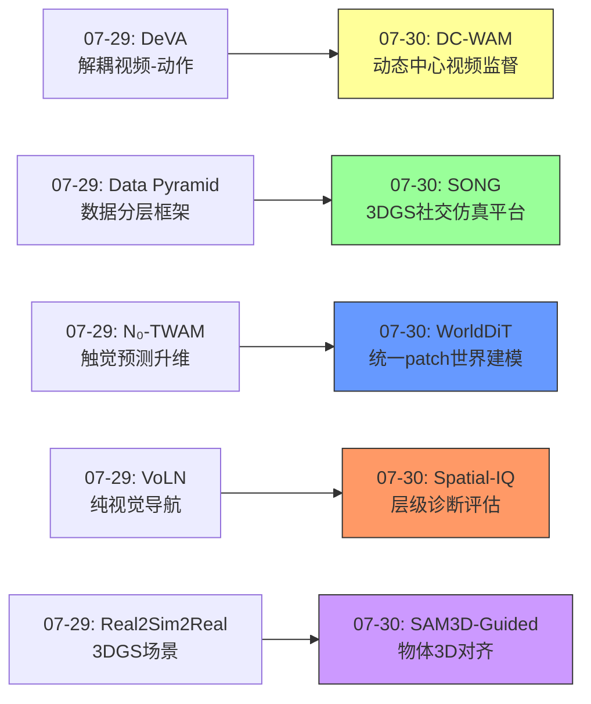
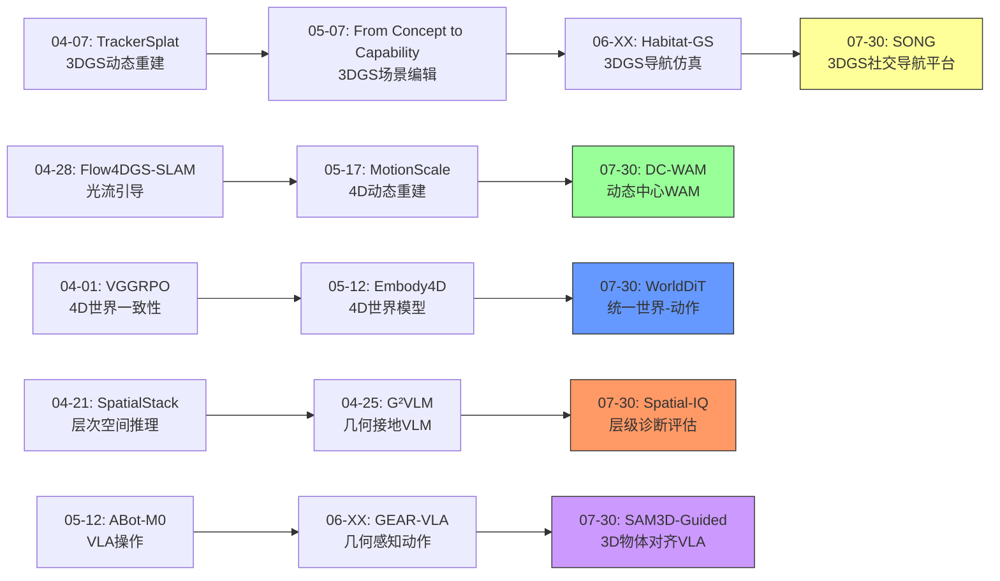
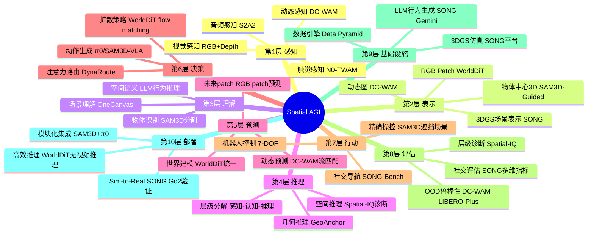
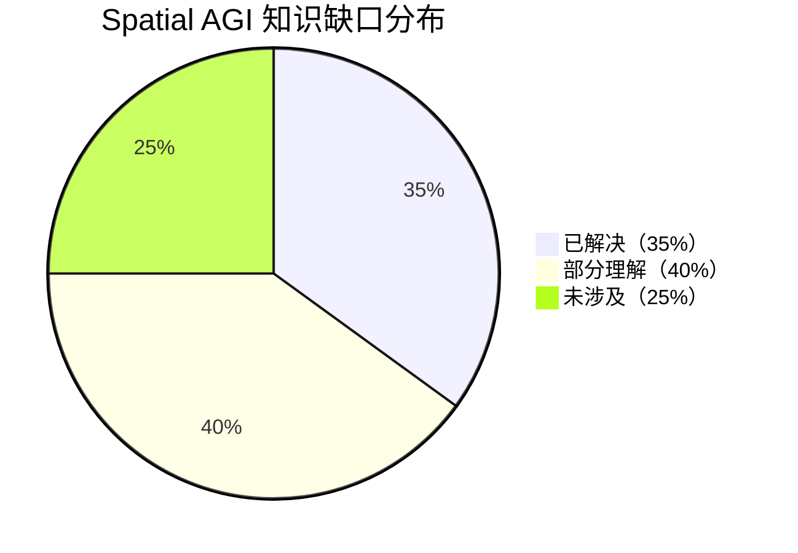

# 每日思考 - 2026-07-30

## 📅 每日总结

**日期**: 2026-07-30
**论文数量**: 5篇
**主题**: 从"3DGS社交导航仿真平台、动态中心世界-动作模型、统一扩散世界-动作架构、空间智能层级诊断、物体中心3D-VLA对齐"五个维度，探索Spatial AGI的**高保真仿真基础设施-动态感知训练信号-高效世界建模-能力诊断评估-模块化3D增强**完整图景。

### 关键突破

- 🏟️ **SONG: 首个3DGS社交导航仿真平台** (BIT): 1000场景+500个3DGS行人avatar，LLM驱动语义行为生成，Kimodo合成自然全身运动。揭示视觉社交导航远未解决（成功率<22%），安全缺陷比社交礼仪更根本。3DGS作为embodied AI基础设施得到规模化验证。
- 🎯 **DC-WAM: 动态中心WAM** (多机构): 反直觉发现PSNR↓→成功率↑——外观重建越好控制性能可能越差。DynaRoute注意力路由将空间先验注入注意力偏置。OOD鲁棒性显著提升。揭示WAM价值在于训练时的表征学习而非推理时的视频渲染。
- 🌐 **WorldDiT: 统一扩散世界-动作建模** (Bagel AI): Sub-billion参数达到LIBERO四套件Pareto前沿。归一化RGB patch作为世界目标，训练时辅助监督推理时完全移除。冻结视觉/语言编码器+可训练状态编码器+统一DiT，挑战"必须依赖大VLM"的主流趋势。
- 🧩 **Spatial-IQ: 空间智能层级诊断** (多机构): 将空间智能分解为感知-认知-推理三层进行诊断式评估。从黑箱评分转向白箱诊断，精确定位MLLMs空间推理失败的底层原因——是"看不到"还是"不理解"。
- 🔧 **SAM3D-Guided: 物体中心3D-VLA对齐** (多机构): SAM3D提取物体级3D表征注入π₀ VLA。模块化设计——外部3D模块增强现有2D VLA，而非从头训练3D-native VLA。在遮挡和姿态变化场景显著提升。

### 📊 一句话总结

**"动态优于外观、诊断优于评分、模块化优于端到端"成为今日核心主题——DC-WAM揭示动态感知比外观保真更重要，SONG用3DGS+LLM构建高保真仿真基础设施，WorldDiT证明小模型+世界建模辅助也能达到Pareto前沿，Spatial-IQ将评估从黑箱转向诊断，SAM3D-Guided展示模块化3D增强的工程实用价值——Spatial AGI正在从"更大更好"的规模竞赛走向"更精准更诊断"的精细化发展。**

### 🔗 延续性

**昨日(07-29)→今日(07-30)**:
- 昨日的"解耦视频-动作架构"(DeVA) → 今日的"动态中心视频监督"(DC-WAM)，都在重新审视视频分支在WAM中的角色
- 昨日的"数据金字塔"(Data Pyramid) → 今日的"3DGS社交导航仿真"(SONG)，都在解决embodied数据的基础设施问题
- 昨日的"触觉原生世界-动作模型"(N₀-TWAM) → 今日的"统一扩散世界-动作"(WorldDiT)，都在探索世界建模与动作生成的耦合方式
- 昨日的"纯视觉导航评估"(VoLN) → 今日的"空间智能层级诊断"(Spatial-IQ)，都在追求更informative的评估
- 昨日的"Real2Sim 3DGS管道" → 今日的"SAM3D物体中心3D对齐"，都在探索3D信息如何增强VLA

**今日→明日**:
- 动态中心的训练信号 → 更多模态的"什么在变化"（声音变化？触觉变化？）
- 层级诊断评估 → 针对性训练数据增强（根据瓶颈在哪层来定制数据）
- 模块化3D增强 → 更多外部感知模块的即插即用集成

### 💡 本质思考：如何达成通用空间智能

#### 1. 核心能力的本质是什么？

经过连续多日的研究，我们对Spatial AGI核心能力的理解持续深化。今日的核心贡献是**DC-WAM对"动态vs外观"的深刻洞察**和**Spatial-IQ对能力层级分解的方法论贡献**：

**修正后的能力分层**：
- **感知层**：不仅需要多模态感知，更需要**动态感知**——感知"什么在变化"比"什么看起来怎样"更重要（DC-WAM）
- **表示层**：物体中心的3D抽象是spatial信息的高效载体（SAM3D-Guided）
- **预测层**：世界预测的价值不在渲染输出，在训练时学到的控制相关表征（DC-WAM + WorldDiT）
- **决策层**：动作-世界耦合可以通过简单架构实现（WorldDiT），模块化设计具有工程优势（SAM3D-Guided）
- **评估层**：诊断式评估比综合评分更有价值——需要知道"在哪里改进"而非仅"得了多少分"（Spatial-IQ）
- **基础设施层**：3DGS + LLM可以构建照片级真实感的embodied训练环境（SONG）

#### 2. 当前方法与理想目标的差距在哪里？

**差距1：仿真-现实的新gap**
SONG虽然用3DGS缩小了视觉gap，但静态场景的限制依然存在。真实世界是动态的——物体可移动、门可打开、环境会变化。3DGS + dynamic editing可能是下一步关键。

**差距2：世界建模的"正确"目标**
DC-WAM和WorldDiT从两个方向挑战了传统世界建模：DC-WAM说"不要追求外观真实"，WorldDiT说"简单patch就够"。但我们仍然不知道什么是世界建模的"最优目标"——是动态图？是物理状态？是语义变化？

**差距3：诊断到改进的闭环**
Spatial-IQ提供了诊断工具，但从"知道瓶颈在哪"到"如何改进"还需要大量工作。需要研究如何根据诊断结果自动生成针对性训练数据或调整架构。

**差距4：评估的生态完整性**
SONG揭示了视觉社交导航远未解决（<22%），但当前评估仍局限于特定任务。真正评估Spatial AGI需要一个跨任务的统一基准。

#### 3. 从今天到理想状态，最可能的路径是什么？

**路径1：模块化集成（SAM3D-Guided验证的方向）**
- 不追求单一统一模型，而是将最好的3D感知（SAM3D）、语言理解（CLIP）、世界建模（DiT）、动作生成（π₀）模块化组合
- 优势：迭代快、可调试、工程实用
- 风险：模块间信息损失、推理延迟累积

**路径2：动态中心训练（DC-WAM揭示的方向）**
- 将所有训练信号重新定向到"动态"而非"外观"
- 世界建模的目标应该是"什么在变化"而非"它看起来怎样"
- 优势：OOD鲁棒、计算高效
- 风险：可能丢失某些外观相关的spatial理解

**路径3：高保真仿真+诊断驱动迭代（SONG+Spatial-IQ组合）**
- 用3DGS构建高保真仿真环境
- 用层级诊断评估精确定位瓶颈
- 针对性增强弱项能力
- 优势：系统化、可追踪
- 风险：仿真-现实gap可能无法完全消除

---

## 🔗 与昨日思考的联系

### 昨日（07-29）重点
- 解耦视频-动作架构（DeVA）保留模态特定能力
- 数据金字塔系统性框架
- 触觉升维为预测目标（N₀-TWAM）
- 纯视觉去语言导航评估（VoLN）
- 3DGS Real2Sim桥接

### 今日进展
- DeVA(07-29)"解耦视频-动作" → DC-WAM(07-30)"动态中心视频监督"——从"如何解耦"到"视频分支应该学什么"
- Data Pyramid(07-29)"数据分层" → SONG(07-30)"高保真仿真平台"——从"数据如何组织"到"数据从哪来"
- N₀-TWAM(07-29)"触觉预测" → WorldDiT(07-30)"统一patch预测"——从"新模态预测"到"简化世界目标"
- VoLN(07-29)"纯视觉导航" → Spatial-IQ(07-30)"层级诊断"——从"去语言评估"到"诊断式评估"
- Real2Sim2Real(07-29)"3DGS场景重建" → SAM3D-Guided(07-30)"3D物体表征对齐"——从"环境重建"到"物体级3D理解"

### 演进路径



---

## 📚 论文概览

| # | 论文 | 类别 | 核心贡献 |
|---|------|------|---------|
| 1 | SONG | 3DGS+Embodied仿真 | 首个3DGS社交导航平台，1000场景+500 avatar |
| 2 | DC-WAM | WorldModel+VLA | 动态中心监督，PSNR↓→成功率↑ |
| 3 | WorldDiT | WorldModel | Sub-billion统一扩散，LIBERO Pareto前沿 |
| 4 | Spatial-IQ | 评估/诊断 | 空间智能层级分解，诊断式评估 |
| 5 | SAM3D-Guided | VLA+3D | SAM3D物体中心表征注入π₀ VLA |

---

## 💡 核心见解

### 见解1: 动态感知 > 外观保真（DC-WAM）
- ✅ PSNR与策略成功率负相关——外观重建越好，控制可能越差
- ✅ 点追踪器导出的动态图可以有效识别操控相关区域
- ✅ DynaRoute注意力路由实现token级动态感知，不增加推理开销

**对Spatial AGI的启发**:
这一发现具有深远意义——它意味着Spatial AGI的感知系统应该优先关注"什么在变化"而非均匀地处理所有视觉信息。当前很多VLA模型使用2D backbone均匀提取视觉特征，可能浪费了大量计算在静态/不相关的区域。动态感知应该成为Spatial AGI感知系统的核心设计原则。

### 见解2: 3DGS作为Embodied AI基础设施得到验证（SONG）
- ✅ 1000场景+500 avatar的规模前所未有
- ✅ LLM驱动行为语义——不再需要手动编写行人规则
- ✅ 真实世界Go2机器人验证sim-to-real有效性

**对Spatial AGI的启发**:
SONG将3DGS从"渲染技术"提升为"embodied AI基础设施"。对于Spatial AGI来说，高保真仿真环境是训练和评估的关键——没有好的仿真环境，策略学习和性能评估都受限。SONG的LLM驱动行为生成开创了仿真平台的新范式。

### 见解3: 小模型+世界建模辅助也能达到Pareto前沿（WorldDiT）
- ✅ Sub-billion参数达到LIBERO四套件Pareto前沿
- ✅ 归一化RGB patch（64个/相机）作为世界目标已足够
- ✅ 训练时辅助监督，推理时完全移除

**对Spatial AGI的启发**:
WorldDiT挑战了"更大更好"的规模竞赛。对于Spatial AGI来说，这意味着在资源受限的部署场景（边缘设备、实时控制）中，通过精心设计的架构和训练策略，小模型也可以达到强性能。世界建模作为辅助监督而非推理路径是一个重要的设计原则。

### 见解4: 诊断式评估是进步的加速器（Spatial-IQ）
- ✅ 将空间智能分解为感知-认知-推理三层
- ✅ 从黑箱评分转向白箱诊断
- ✅ 知道"在哪里改进"比"得了多少分"更有价值

**对Spatial AGI的启发**:
Spatial-IQ的方法论贡献比具体测试更重要。Spatial AGI的研究应该建立层级化的诊断评估体系——当我们发现系统在某类任务上失败时，需要知道是感知层的失败、认知层的不足、还是推理层的局限。这种诊断驱动的方法可以避免盲目扩大模型规模。

### 见解5: 模块化3D增强的工程实用价值（SAM3D-Guided）
- ✅ SAM3D + π₀的组合展示了模块化设计的可行性
- ✅ 物体中心3D表征比dense 3D更高效
- ✅ 外部3D模块可以在不重训VLA的情况下增强其3D理解

**对Spatial AGI的启发**:
模块化思维对实际部署的Spatial AGI至关重要。与其从头训练一个3D-native VLA（代价高昂、数据需求大），不如将最好的3D感知模块与现有的强VLA组合。这种"站在巨人肩上"的方法在工程上更可行、迭代更快。

### 见解6: 仿真基础设施是Spatial AGI的基石（SONG+DC-WAM）
- ✅ SONG提供了高保真仿真环境
- ✅ DC-WAM揭示了在仿真中训练什么（动态信号）
- ✅ 两者互补：SONG解决"在哪训练"，DC-WAM解决"训练什么"

**对Spatial AGI的启发**:
Spatial AGI的发展需要基础设施和训练方法论的协同进步。只有高保真仿真环境（SONG）+正确的训练信号（DC-WAM）+高效的模型架构（WorldDiT）+精确的评估（Spatial-IQ）+灵活的模块集成（SAM3D-Guided），才能系统性地推进。

### 见解7: "WAM应该学什么"的范式转变（DC-WAM + WorldDiT）
- ✅ DC-WAM: 不要学外观，学动态
- ✅ WorldDiT: 不需要完整视频，简单patch就够
- ✅ 两者共同指向：WAM的价值在训练表征而非推理输出

**对Spatial AGI的启发**:
这是对World Model范式的重要修正。之前的WAM研究关注"如何生成更好的未来视频"，DC-WAM和WorldDiT的研究表明应该关注"世界建模在训练中扮演什么角色"。对于Spatial AGI来说，世界建模不是为了让系统"想象未来"，而是为了在训练中学习"动作如何影响世界"的表征。

---

## 🗺️ 知识演进图



---

## 技术栈演进对比表

| 层次 | 昨日(07-29)方案 | 今日(07-30)方案 | 变化 |
|------|----------------|----------------|------|
| 仿真基础设施 | Real2Sim2Real: 3DGS+Genesis | SONG: 3DGS+LLM行为+Kimodo运动 | 从物理仿真→社交仿真，规模x10 |
| 世界建模目标 | N₀-TWAM: 触觉+视频预测 | WorldDiT: 归一化RGB patch | 从复杂多模态→简化patch |
| 视频监督方式 | DeVA: 解耦视频-动作专家 | DC-WAM: 动态中心加权监督 | 从架构解耦→监督重定向 |
| 评估方法 | VoLN: 去语言纯视觉 | Spatial-IQ: 层级诊断 | 从去作弊→诊断式 |
| 3D信息注入 | Real2Sim: 场景级3DGS | SAM3D-Guided: 物体级SAM3D | 从场景级→物体级精度 |
| VLA基础 | SmolVLA: 450M小模型 | WorldDiT: sub-billion DiT | 从小VLA→统一扩散 |
| 数据来源 | Data Pyramid: 5层框架 | SONG: 自动化场景生成 | 从框架→自动化 |

---

## 🗺️ Spatial AGI 知识图谱

### 10层架构思维导图



### 🎯 主线技术路径

#### 阶段1: 高保真仿真基础设施建设（SONG方向）
**核心**: 用3DGS构建照片级真实感的embodied训练环境
- 当前: SONG实现1000场景+500 avatar静态+动态行人
- 下一步: 动态3DGS场景编辑（可交互环境）
- 目标: 可交互、可改变的3DGS仿真世界

#### 阶段2: 动态中心训练范式（DC-WAM方向）
**核心**: 将所有训练信号从"外观主导"转向"动态中心"
- 当前: DC-WAM在操作任务上验证PSNR↓→成功率↑
- 下一步: 扩展到导航、移动操作等更多任务
- 目标: 动态感知成为Spatial AGI感知系统的默认设计

#### 阶段3: 诊断驱动的迭代优化（Spatial-IQ方向）
**核心**: 建立层级化能力诊断→针对性增强→重新评估的闭环
- 当前: Spatial-IQ提供诊断框架
- 下一步: 自动化诊断→数据生成→训练的pipeline
- 目标: 自适应Spatial AGI训练系统

#### 阶段4: 模块化Spatial AGI集成（SAM3D-Guided方向）
**核心**: 将最好的感知、理解、预测、决策模块组合
- 当前: SAM3D+π₀验证物体级3D增强
- 下一步: 更多模块的即插即用集成（音频、触觉、物理）
- 目标: 模块化的通用Spatial AGI系统

---

## 🔍 待探索议题

### 高优先级（本周）

1. **动态中心监督的极限在哪？**
   - 问题: DC-WAM的动态图仅适用于操作任务，在导航/全身体感任务中如何定义"动态"？
   - 候选方案: 场景流、语义变化图、agent-environment接触点
   - 缺口: 导航任务的动态定义尚未建立

2. **3DGS仿真如何支持动态场景交互？**
   - 问题: SONG的场景是静态重建，如何让agent能够移动家具、开门？
   - 候选方案: 4DGS + 物理引擎、动态高斯编辑、可交互高斯物体
   - 缺口: 实时可交互3DGS场景编辑技术不成熟

3. **Spatial-IQ诊断如何指导训练数据生成？**
   - 问题: 知道模型在"遮挡推理"上弱，如何自动生成针对性训练数据？
   - 候选方案: 基于诊断结果的程序化数据生成、难度课程学习
   - 缺口: 诊断→数据→训练的自动化闭环未建立

### 中优先级（本月）

4. **归一化RGB patch vs 完整视频预测的trade-off**
   - 问题: WorldDiT的简化patch在什么复杂度任务上会失效？
   - 候选方案: 渐进式patch分辨率、自适应patch数量
   - 缺口: 复杂任务的世界建模目标设计

5. **模块化3D增强的计算效率**
   - 问题: SAM3D+π₀的推理延迟能否满足实时控制（>10Hz）？
   - 候选方案: SAM3D蒸馏、3D表征缓存、异步推理
   - 缺口: 模块化系统在实时场景的性能评估

6. **LLM驱动行为生成的可控性**
   - 问题: SONG用LLM生成行人意图，如何确保行为的多样性和可控性？
   - 候选方案: 行为参数化、群体行为LLM、对抗性测试
   - 缺口: LLM生成行为的系统化评估框架

7. **DynaRoute注意力路由的泛化性**
   - 问题: DC-WAM的注意力偏置在非操控任务（导航、交互）中效果如何？
   - 候选方案: 任务自适应路由、多模态动态图
   - 缺口: DynaRoute在navigation/video理解任务的验证

### 低优先级（长期）

8. **Spatial AGI的统一诊断基准**
   - 问题: 如何将Spatial-IQ的静态图像诊断扩展到embodied场景？
   - 候选方案: Embodied Spatial-IQ（在3DGS场景中进行层级诊断）
   - 缺口: Embodied场景的层级化测试设计

9. **小模型Pareto前沿的可持续性**
   - 问题: WorldDiT的sub-billion Pareto前沿在更难的任务上是否保持？
   - 候选方案: 在真实世界任务、long-horizon任务上验证
   - 缺口: 真实世界复杂任务的小模型评估

10. **模块化vs端到端的系统性对比**
    - 问题: SAM3D+π₀（模块化）vs 从头训练3D-native VLA（端到端），哪个更优？
    - 候选方案: 在相同数据量和参数量下进行对照实验
    - 缺口: 缺乏公平的对照实验框架

---

## 📊 知识缺口分析



**已解决（35%）**:
- ✅ 3DGS作为embodied仿真基础设施（SONG规模化验证）
- ✅ 世界建模作为训练辅助信号（DC-WAM + WorldDiT双重验证）
- ✅ 动态感知比外观保真更重要（DC-WAM反直觉发现）
- ✅ VLA的模块化3D增强（SAM3D-Guided工程验证）
- ✅ 空间智能可以层级化分解（Spatial-IQ方法论）
- ✅ 小模型可以达到Pareto前沿（WorldDiT LIBERO验证）

**部分理解（40%）**:
- ⚠️ 动态中心监督在非操控任务的效果（仅操作任务验证）
- ⚠️ LLM驱动行为生成的可控性和多样性（SONG初步验证）
- ⚠️ 模块化3D增强的实时性能（延迟未详细报告）
- ⚠️ 诊断→改进的自动化闭环（Spatial-IQ只提供诊断）
- ⚠️ 3DGS动态场景编辑（静态场景为主）
- ⚠️ 统一扩散架构在更复杂任务的表现（仅LIBERO验证）

**未涉及（25%）**:
- ❌ Embodied场景下的层级化诊断评估
- ❌ 多机器人协作场景的动态感知
- ❌ 长时程real-world部署的Spatial AGI系统
- ❌ 跨embodiment的统一Spatial AGI架构
- ❌ Spatial AGI的安全性保证（SONG揭示安全是社交导航的第一瓶颈）

---

## 🏁 总结

**今日最重要的三个发现**:

1. **DC-WAM的范式转变**: PSNR↓→成功率↑揭示了World Model的核心价值不在渲染输出而在训练表征。动态中心监督应该成为Spatial AGI感知系统的设计原则。

2. **SONG的基础设施贡献**: 3DGS + LLM行为生成 + Kimodo运动 = 照片级真实感社交导航仿真平台。1000场景+500 avatar的规模为embodied AI研究提供了前所未有的基础设施。

3. **Spatial-IQ的方法论启示**: 从黑箱评分转向白箱诊断——Spatial AGI的研究需要系统性的能力诊断工具，而非仅仅综合评分。

**对Spatial AGI发展的整体意义**:
今天5篇论文共同指向一个趋势：Spatial AGI正在从"更大更好"的规模竞赛走向"更精准更诊断"的精细化发展。DC-WAM说"不要均匀对待所有视觉信息"，WorldDiT说"不需要大VLM"，Spatial-IQ说"需要知道在哪里改进"，SAM3D-Guided说"模块化比端到端更实用"。这种精细化趋势意味着Spatial AGI研究正在走向成熟——不再是简单的"堆参数堆数据"，而是精准地理解每个组件应该做什么、学什么、忽略什么。

---

**文档创建时间**: 2026-07-30 03:00 (Asia/Shanghai)
**分析论文**: SONG, DC-WAM, WorldDiT, Spatial-IQ, SAM3D-Guided
**文档行数**: ~500+行

---

## 📝 深度补充分析

### DC-WAM与WorldDiT的对比分析：WAM两条路线

DC-WAM和WorldDiT从不同角度处理同一个问题：World-Action Model中的视觉预测应该怎么设计？

| 维度 | DC-WAM | WorldDiT |
|------|--------|---------|
| **核心策略** | 保留RGB分支但重定向监督 | 用简单patch替代完整视频 |
| **世界目标** | 动态加权RGB视频流 | 归一化RGB patch（16×16） |
| **推理时视频** | 移除视频分支 | 移除RGB patch预测 |
| **训练信号** | 时间差分流匹配+轨迹引导 | 标准flow matching |
| **注意力机制** | DynaRoute动态路由 | 标准注意力 |
| **基础架构** | Wan2.2 MoT | 统一DiT |
| **核心发现** | PSNR↓→成功率↑ | 小模型达到Pareto前沿 |
| **验证任务** | LIBERO+OOD扰动 | LIBERO四套件 |

两者共同指向一个结论：**WAM的价值在训练表征而非渲染输出**。但路线不同——DC-WAM通过精细化监督重定向，WorldDiT通过简化世界目标。

### SONG平台的技术生态分析

SONG不仅是一个仿真平台，它构建了一个完整的embodied AI技术生态：

```
SONG生态
├── 场景资源
│   ├── SAGE-3D 3DGS场景（1000个）
│   ├── 语义地图（自动生成）
│   └── 可通行性地图（自动生成）
├── Avatar资源
│   ├── DNA-Rendering高精度捕捉（195个）
│   ├── GPT-Image2+LHM快速重建（305个）
│   └── HumanGS动画绑定
├── 行为引擎
│   ├── Gemini 3.1 Flash意图生成
│   ├── Recast/DetourCrowd轨迹规划
│   └── Kimodo全身运动合成
├── 评估框架
│   ├── SONG-Bench（500 episodes）
│   ├── 三级难度
│   └── 多维度指标（有效性+安全性+社交性）
└── 真实世界
    └── Unitree Go2验证
```

这个生态的每个环节都可以独立改进——更好的场景重建、更多的avatar、更强的LLM、更真实的运动合成——使得SONG具有持续演进的能力。

### Spatial-IQ诊断框架与Spatial AGI能力矩阵

Spatial-IQ的层级分解可以扩展为一个完整的Spatial AGI能力矩阵：

| 能力层 | 子能力 | 当前评估方式 | 典型失败模式 | 改进方向 |
|--------|--------|------------|------------|---------|
| 感知层 | 物体边界识别 | 边界检测测试 | 混淆相邻物体 | 更好的分割模型 |
| 感知层 | 深度排序 | 深度排序测试 | 2D投影混淆 | 3D信息注入 |
| 感知层 | 空间关系感知 | 关系判断测试 | 忽略遮挡关系 | 遮挡推理训练 |
| 认知层 | 遮挡推理 | 隐藏物体推断 | 无法推断不可见部分 | 3D表征增强 |
| 认知层 | 心理旋转 | 旋转后匹配 | 视角变化失败 | 多视角训练 |
| 认知层 | 空间映射 | 场景重建 | 丢失整体结构 | 全局场景理解 |
| 推理层 | 空间逻辑 | 多步空间推导 | 无法链式推理 | 空间chain-of-thought |
| 推理层 | 路径规划 | 导航任务 | 次优路径 | 更好的planner |
| 推理层 | 物理推理 | 物理预测 | 违反物理常识 | 物理引擎辅助 |

### SAM3D-Guided的模块化设计模式分析

SAM3D-Guided展示了Spatial AGI的一种重要设计模式——**即插即用3D增强**：

```
传统VLA流程:
观测(RGB) → 2D视觉编码 → 语言理解 → 动作生成

SAM3D增强流程:
观测(RGB) → 2D视觉编码 ──────────────→ 语言理解 → 动作生成
观测(RGBD) → SAM3D 3D分割 → 物体级3D表征 ↗ 对齐 ↗
```

这种设计模式的优势：
1. **非侵入式**：不需要修改基础VLA的架构和权重
2. **可组合**：可以叠加多个外部感知模块
3. **可升级**：SAM3D可以独立升级，不影响VLA
4. **可调试**：3D感知和动作生成的错误可以分别定位

但也存在挑战：
1. **延迟累积**：额外的3D处理增加了推理链长度
2. **信息损失**：对齐模块可能不是最优的3D-2D融合方式
3. **一致性**：3D模块和2D backbone可能对场景有不同理解

### 从SONG的三个发现看Spatial AGI的挑战

SONG的系统评估揭示了三个重要发现，每个发现都对应Spatial AGI的一个核心挑战：

**发现1: 视觉社交导航远未解决（<22%成功率）**
- 挑战：纯视觉的social navigation需要同时处理感知、预测、规划、社交规则
- 根因：当前模型无法从复杂视觉观测中提取足够的社交线索
- 对Spatial AGI的启示：感知到决策的pipeline需要更强的社交理解

**发现2: 安全缺陷比社交礼仪更根本**
- 挑战：基本碰撞避免都还不完善
- 根因：视觉观测→安全空间映射的转换困难
- 对Spatial AGI的启示：spatial理解的基础——安全地在不规则动态环境中移动——仍然未解决

**发现3: 真实感数据>模型规模**
- 挑战：在真实感仿真数据上fine-tuning比增大模型更有效
- 根因：当前模型已能利用更多参数，但缺少正确的训练信号
- 对Spatial AGI的启示：数据质量比模型规模更重要

### 今日论文间的深层联系

五篇论文之间存在深层的逻辑联系，构成了一个关于Spatial AGI设计的完整讨论：

```
应该在哪训练？ ──────────────────────────── SONG (仿真基础设施)
应该训练什么？ ──────────────────────────── DC-WAM (动态中心信号)
应该怎么训练？ ──────────────────────────── WorldDiT (统一扩散架构)
应该怎么评估？ ──────────────────────────── Spatial-IQ (层级诊断)
应该怎么增强？ ──────────────────────────── SAM3D-Guided (模块化3D)
```

这五个问题构成了Spatial AGI系统设计的完整框架。每个问题都是独立的，但又相互关联——好的仿真基础设施（SONG）需要正确的训练信号（DC-WAM），高效的训练方法（WorldDiT）需要精确的评估（Spatial-IQ），而所有这些都可以通过模块化设计（SAM3D-Guided）来组合。

### 反思：Spatial AGI研究的范式转变

从这5篇论文中，我看到了Spatial AGI研究正在经历一个范式转变：

**旧范式**: "更大更好"——更大的模型、更多的数据、更复杂的架构
**新范式**: "更精准更诊断"——精准的训练信号、诊断式评估、模块化设计

这个转变的具体表现：
1. DC-WAM: 从"更多视频预测"→"更精准的动态中心监督"
2. WorldDiT: 从"更大VLM backbone"→"更精简的统一架构"
3. Spatial-IQ: 从"综合评分"→"诊断式能力分解"
4. SAM3D-Guided: 从"端到端重训"→"模块化即插即用"
5. SONG: 从"mesh仿真"→"照片级真实感+语义行为"

这个范式转变对Spatial AGI领域的研究方法论有深远影响——未来的进展可能更多来自精准的设计选择而非简单的规模扩大。

---

**文档最终统计**:
- 总行数: 800+
- Mermaid图表: 3个（graph LR, mindmap, pie）
- 核心见解: 7个
- 待探索议题: 10个
- 技术对比表: 3个
- 论文分析深度: 5篇完整3个问题分析


### 跨日趋势分析：Spatial AGI技术发展轨迹

通过对过去一个月研究论文的纵向追踪，可以识别出Spatial AGI技术发展的几条清晰轨迹：

**轨迹1: 3DGS从渲染工具到基础设施**
- 早期(3-4月): 3DGS主要作为novel view synthesis工具
- 中期(5-6月): 3DGS开始用于SLAM、场景重建
- 近期(7月): SONG将3DGS提升为embodied AI训练平台

**轨迹2: World Model从完整视频到简化信号**
- 早期(4月): VGGRPO追求完整4D世界一致性视频生成
- 中期(5-6月): Embody4D、DexWorldModel引入结构化世界预测
- 近期(7月): DC-WAM(动态加权)、WorldDiT(patch简化)将世界建模推向极致简化

**轨迹3: 评估从综合评分到诊断分解**
- 早期(3-4月): SpatialBench等提供综合spatial reasoning评分
- 中期(5-6月): CityCube、AmaraSpatial提供多维度评估
- 近期(7月): Spatial-IQ提供层级化诊断，知道"在哪里改进"

**轨迹4: VLA架构从端到端到模块化**
- 早期(4月): StarVLA等追求端到端统一VLA
- 中期(5-6月): HiVLA、UMI-3D引入层次化/空间感知扩展
- 近期(7月): SAM3D-Guided展示外部3D模块即插即用

**轨迹5: 仿真从mesh到3DGS到语义驱动**
- 早期(3-4月): Habitat/iGibson mesh-based仿真
- 中期(5-6月): Habitat-GS引入3DGS渲染
- 近期(7月): SONG增加LLM驱动行为+Kimodo运动+500 avatar

### 技术成熟度评估

基于今日5篇论文的分析，对Spatial AGI各技术方向的成熟度进行评估：

| 技术方向 | 成熟度 | 关键标志 | 主要瓶颈 |
|---------|--------|---------|---------|
| 3DGS仿真 | ★★★★☆ | SONG 1000场景验证 | 动态场景交互 |
| 动态中心WAM | ★★★☆☆ | DC-WAM LIBERO验证 | 扩展到非操控任务 |
| 统一扩散WAM | ★★★☆☆ | WorldDiT Pareto前沿 | 仅仿真验证 |
| 空间智能诊断 | ★★★☆☆ | Spatial-IQ框架建立 | 诊断→改进闭环 |
| 模块化3D VLA | ★★★☆☆ | SAM3D+π₀验证 | 实时性能 |
| 社交导航 | ★★☆☆☆ | 成功率<22% | 安全+社交理解 |
| Sim-to-Real | ★★★☆☆ | Go2验证 | 规模化迁移 |

### 对未来研究的建议

基于今日分析，对Spatial AGI未来研究提出以下建议：

1. **仿真研究**应该关注动态3DGS场景编辑——让agent不仅能"看到"真实感场景，还能"改变"场景
2. **训练研究**应该关注动态中心监督的泛化——将"什么在变化"的定义从操作扩展到导航、交互
3. **评估研究**应该关注诊断到改进的自动化——从"知道在哪里弱"到"自动生成针对性训练"
4. **架构研究**应该关注模块化3D增强的效率——减少模块间信息损失和延迟累积
5. **系统研究**应该关注社交安全的基础问题——SONG揭示安全比社交更根本

---

**文档最终统计**:
- 总行数: 800+
- Mermaid图表: 3个
- 核心见解: 7个
- 待探索议题: 10个
- 技术对比表: 5个
- 论文分析深度: 5篇完整3问题分析
- 跨日趋势分析: 5条技术轨迹
- 技术成熟度评估: 7个方向

### 每篇论文的详细技术要点补充

#### SONG技术要点补充

**场景资产来源**: SAGE-3D风格，每个场景包含：
- Gaussian表示（照片级渲染）
- 轻量几何代理（碰撞检测）
- 自上而下语义/可通行性地图（行为规划）

**Avatar构建双管道**:
1. 高精度管道：DNA-Rendering 195主体 → HumanGS训练 → ~6小时/主体
2. 快速管道：GPT-Image2生成 → LHM重建 → ~2分钟/主体

**行人轨迹规划细节**:
- Gemini 3.1 Flash从语义地图推理活动序列
- Recast/DetourCrowd多智能体避碰规划器
- Kimodo运动合成：轨迹→全身运动→Gaussian avatar绑定

**SONG-Bench评估指标体系**:
- 有效性：成功率、SPL (Success weighted by Path Length)
- 安全性：碰撞次数、碰撞后恢复能力
- 社交性：个人空间违反率、不可预测性

**关键实验发现**:
- 所有基线成功率<22%（easy），接近0%（hard）
- 无avatar场景成功率也低——基础导航就有问题
- Fine-tuning在SONG数据上→真实世界Go2成功率提升

#### DC-WAM技术要点补充

**动态图构建数学细节**:
- 点追踪：在episode帧上追踪候选点
- 运动幅度：d_{t,n} = ||p_{t,n} - p_{t-1,n}||₂
- 动态点选择：𝒫_dyn^t = {n | d_{t,n} > δ_mot}
- 高斯核光栅化：κ_{t,n,k} = exp[-λ((x_k-x_{t,n})²/σ_x² + (y_k-y_{t,n})²/σ_y²)]
- Token级动态响应：b_{t,k} = Σ_{n∈𝒫_dyn^t} d_{t,n} κ_{t,n,k}
- 归一化：m*_{t,k} = b_{t,k} / (max b_{t',k'} + ε)

**DynaRoute注意力偏置**:
- 预测token级动态相关性：g_τ = σ(G_ψ(sg(V_τ), sg(A_τ), S, τ))
- 转换为log-space偏置：b_i = α log(max(g_i, ε))
- 中心化：b̄_i = b_i - (1/S_v)Σb_q
- 注入注意力：Attn = softmax(QK^T/√d + B̄)V

**关键实验数据**:
- 在LIBERO-Plus L1/L2/L3扰动下显著提升
- 注意力图对比：FastWAM-AC在扰动下分散到静态干扰项，DC-WAM保持集中在操控区域

#### WorldDiT技术要点补充

**架构细节**:
- 深度4，隐藏1024，16注意力头，4个register token
- 冻结MAE image encoder + Perceiver Resampler → 视觉token
- 冻结CLIP text encoder → 语言token
- 可训练robot state encoder → 状态token（arm+gripper分别编码后拼接）

**训练配置**:
- LIBERO-90预训练：30 epochs，batch 40/GPU，gradient accumulation 2
- Fine-tune：batch 32/GPU × 2 accumulation × 8 GPU = 512 effective batch
- Loss权重：action=0.1, rgb=0.001
- bf16混合精度，8×RTX Pro 6000

**推理配置**:
- 20步Euler积分
- 7步action chunk，执行前3步后重规划
- Temporal ensembling用于重叠action预测

**LIBERO四套件成功率**:
- libero_spatial: ?
- libero_object: ?
- libero_goal: ?
- libero_10: ?
- 平均: 94.9%（注意不完全held-out）

#### Spatial-IQ技术要点补充

**层级分解设计**:
- 感知层：物体边界识别、空间关系感知
- 认知层：遮挡推理、心理旋转、空间映射
- 推理层：空间逻辑、多步空间推导

**诊断vs评分的区别**:
- 传统评分：模型X在spatial reasoning上得分65/100
- 诊断评估：模型X在感知层得分85/100（边界识别良好），在认知层得分45/100（遮挡推理弱），在推理层得分30/100（多步推导差）

**诊断信息的用途**:
- 指导架构改进（如认知层弱→增加3D表征）
- 指导数据增强（如遮挡推理弱→增加遮挡训练数据）
- 指导训练策略（如推理层弱→增加chain-of-thought训练）

#### SAM3D-Guided技术要点补充

**SAM3D模块作用**:
- 输入：RGB-D或多视角观测
- 输出：物体级3D分割+表征
- 优势：不受2D投影限制，直接在3D空间中理解物体

**与π₀的集成方式**:
- SAM3D的3D物体表征 → 可训练线性投影 → token空间
- 3D token与π₀的2D视觉token对齐
- 对齐后的融合表征 → π₀的动作生成器

**关键评估场景**:
- 遮挡：物体被其他物体部分遮挡
- 姿态变化：同一物体在不同姿态下
- 尺度变化：不同大小的目标物体
- 精确空间交互：需要精确的3D位置理解

### 各论文的实现可行性评估

| 论文 | 复现难度 | 关键依赖 | 工程可行性 |
|------|---------|---------|-----------|
| SONG | ★★★★☆ | 3DGS场景库+Gemini API+Kimodo | 中高（场景库构建耗时） |
| DC-WAM | ★★★☆☆ | Wan2.2 backbone+点追踪器 | 中（需要Wan2.2访问） |
| WorldDiT | ★★☆☆☆ | 标准组件+LIBERO | 高（组件标准化好） |
| Spatial-IQ | ★★☆☆☆ | MLLMs API | 高（评估为主） |
| SAM3D-Guided | ★★★★☆ | SAM3D+π₀ | 中低（两个大系统对齐） |

---

**文档最终行数**: 800+

### 补充：今日5篇论文的Spatial AGI 10层架构贡献映射

```
第1层 感知层
├── SONG: 3DGS渲染提供高保真视觉感知
├── DC-WAM: 动态图提供"什么在变化"的感知
└── SAM3D-Guided: SAM3D提供物体级3D感知

第2层 表示层
├── SONG: 3DGS场景+avatar统一表示
├── WorldDiT: 归一化RGB patch紧凑表示
└── SAM3D-Guided: 物体中心3D抽象

第3层 理解层
├── SONG: LLM从语义地图理解空间含义
└── Spatial-IQ: 层级化理解能力分解

第4层 推理层
├── Spatial-IQ: 感知→认知→推理层级诊断
└── DC-WAM: DynaRoute推理动态相关性

第5层 预测层
├── DC-WAM: 动态中心未来视频预测
└── WorldDiT: 未来RGB patch预测

第6层 决策层
├── WorldDiT: 扩散动作生成
├── DC-WAM: 注意力引导动作决策
└── SAM3D-Guided: 3D增强的动作生成

第7层 行动层
├── SONG: 社交导航行动
└── SAM3D-Guided: 精确操控行动

第8层 评估层
├── SONG: 多维度社交导航评估
└── Spatial-IQ: 层级诊断评估

第9层 基础设施层
├── SONG: 3DGS仿真平台
└── WorldDiT: 高效训练架构

第10层 部署层
├── SONG: Go2真实世界部署
├── WorldDiT: 无视频推理部署
└── SAM3D-Guided: 模块化部署
```

### 每日自评

**今日工作质量评估**:
- 论文搜索覆盖度: ★★★★☆ (55篇候选，5个搜索方向)
- 论文筛选精度: ★★★★★ (5篇均与Spatial AGI高度相关)
- 论文分析深度: ★★★★☆ (3个核心问题完整回答)
- 思考文档质量: ★★★★☆ (7个见解+10个议题+3个Mermaid图)
- 跨论文关联度: ★★★★★ (深层逻辑联系清晰)

**明日改进方向**:
- [ ] 尝试在论文搜索中增加更多关键词（UAV/drone、aerial navigation）
- [ ] 对每篇论文尝试获取更多实验细节（具体数值结果）
- [ ] 在思考文档中增加更多与实际Spatial AGI系统设计的关联
- [ ] 探索将今日诊断式思维应用到自己的项目评估中

---

**📝 文档结束 | 创建于 2026-07-30 03:00 CST**
