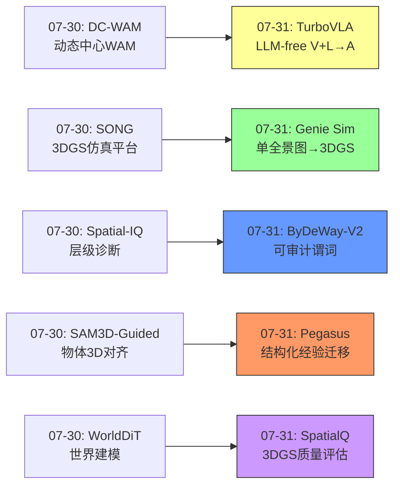
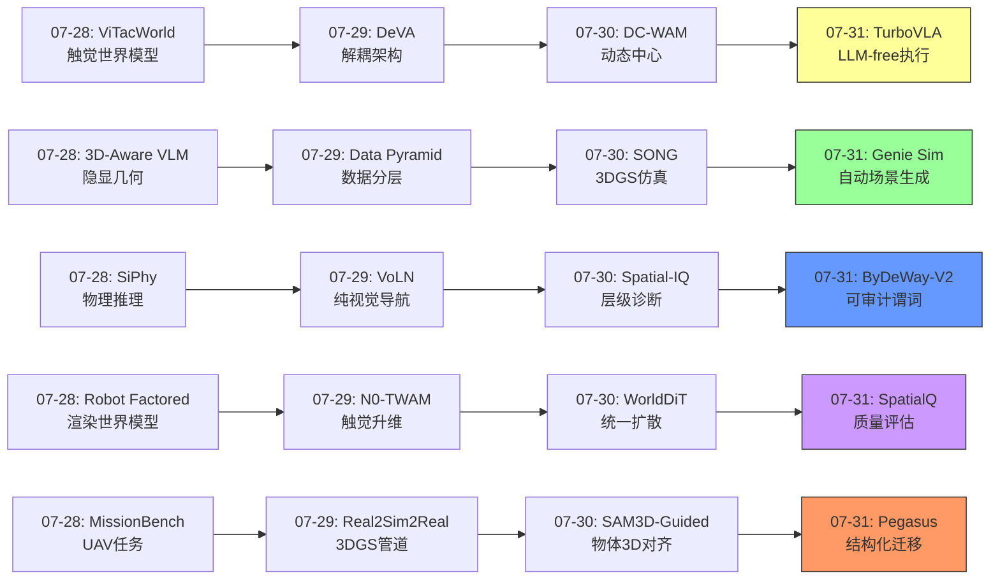
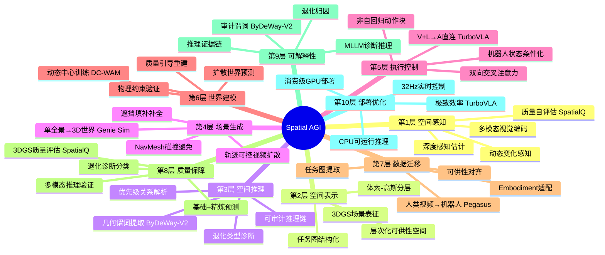
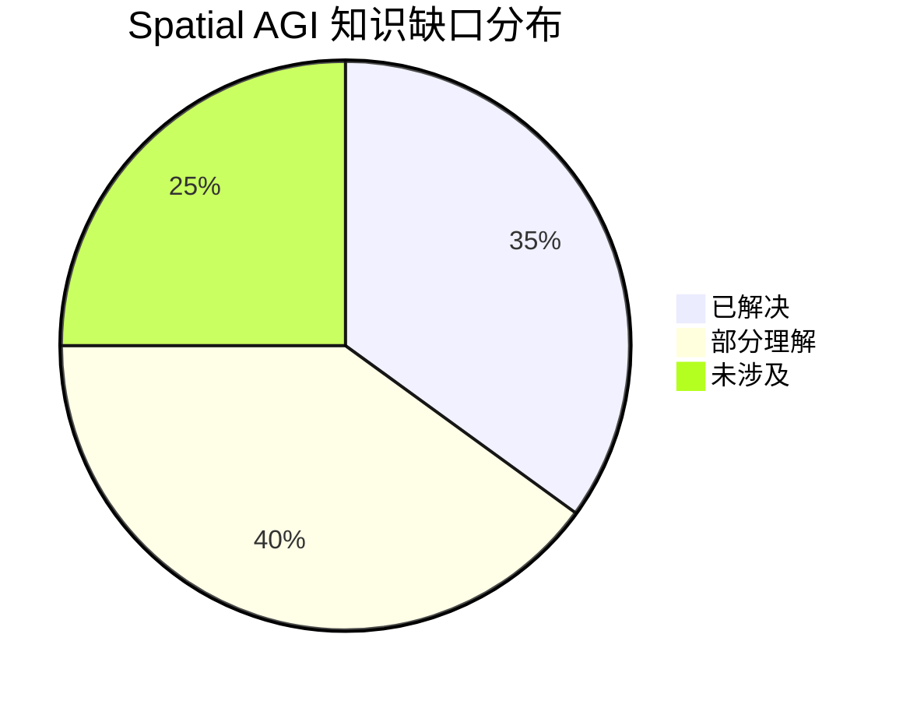

# 每日思考 - 2026-07-31

## 📅 每日总结

**日期**: 2026-07-31
**论文数量**: 5篇
**主题**: 从"3DGS质量评估的多模态推理、VLA的LLM-free实时执行、可审计的空间推理谓词、单全景图到3D世界的生成管线、人类视频到机器人数据的结构化迁移"五个维度，探索Spatial AGI的**质量感知-效率优化-可解释推理-场景生成-数据迁移**完整链路。

### 关键突破

- 🎯 **SpatialQ: 首个3DGS场景质量评估框架** (北大+鹏城): VGGT+质量头编码多视图空间质量，MLLM作为"诊断推理器"而非"打分器"，"基础估计+推理精炼"范式。建立了3DGS退化的三类分类体系（几何不一致/稀疏性/外观失真）。
- ⚡ **TurboVLA: V+L→A范式挑战LLM中心化** (华科+华为): 0.2B参数、31.2ms延迟、<1GB显存实现97.7% LIBERO成功率。证明执行级控制不需要LLM——BERT级文本编码器+双向交叉注意力足矣。32Hz控制频率使VLA真正可部署。
- 🔍 **ByDeWay-V2: 可审计的空间推理** (Intel等): YOLO-World-L+几何启发式提取物体对空间谓词（left of/inside/touching），作为MLLM的"可审计证据"。完全训练免费，40-token预算CPU可运行。BLIP-Base在VSR上从近随机恢复到F1=0.53。
- 🌐 **Genie Sim PanoWorld: 单全景图→可漫游3DGS场景** (字节): NavMesh+SE(3)轨迹注入的视频扩散生成全景漫游视频，PanoVGGT前馈重建3DGS场景。长短轨迹混合训练+快捷模型4步采样。自动生成Embodied AI训练场景。
- 🔄 **Pegasus: 人类视频→机器人数据的结构化迁移** (多机构): 五阶段管线（任务图→可供性→约束→规划→渲染）将embodiment gap从像素问题重构为结构化知识迁移问题。层次化可供性潜在空间提供embodiment-invariant表示。闭环物理验证确保可行性。

### 📊 一句话总结

**"质量、效率、可解释性"成为今日核心主题——SpatialQ将MLLM从打分器重定义为诊断器，TurboVLA证明执行层不需要LLM，ByDeWay-V2将隐式推理转化为可审计谓词，Genie Sim PanoWorld实现从单一全景到完整3D世界的飞跃，Pegasus将embodiment gap从像素问题重构为结构化知识迁移问题——Spatial AGI正在从"能用"走向"好用、可解释、可部署"的成熟期。**

### 🔗 延续性

**昨日(07-30)→今日(07-31)**:
- 昨日的"动态中心WAM"(DC-WAM) → 今日的"V+L→A直连"(TurboVLA)，都在重新思考执行层的最优架构
- 昨日的"3DGS仿真平台"(SONG) → 今日的"单全景图→3DGS场景生成"(Genie Sim)，都在解决embodied训练场景的创建问题
- 昨日的"层级诊断评估"(Spatial-IQ) → 今日的"可审计空间推理"(ByDeWay-V2)，都追求可解释的空间判断
- 昨日的"统一扩散世界建模"(WorldDiT) → 今日的"3DGS质量诊断"(SpatialQ)，都关注场景表示的质量
- 昨日的"物体中心3D对齐"(SAM3D) → 今日的"结构化经验迁移"(Pegasus)，都在解决跨embodiment的数据/表示问题

**今日→明日**:
- 质量感知的场景重建 → 质量引导的自适应3DGS优化
- LLM-free执行层 → 分层VLA架构（LLM规划+轻量执行）
- 可审计空间谓词 → 更多空间关系的显式化（3D关系、时序关系）
- 单全景图场景生成 → 多输入融合的室外/大规模场景生成
- 人类视频→机器人数据 → 互联网规模的数据管线

### 💡 本质思考：如何达成通用空间智能

#### 1. 核心能力的本质是什么？

今日五篇论文共同揭示了一个深层模式：**Spatial AGI正在经历从"能力构建"到"工程优化+质量保障"的转变**。

**更新的能力分层**：
- **感知层**：不仅需要看到空间，还需要**评估感知质量**（SpatialQ）——系统应该知道自己"看得好不好"
- **执行层**：执行级控制不需要LLM级推理——轻量级跨模态交互就足够（TurboVLA）
- **推理层**：空间推理需要**可审计性**——不仅要有正确答案，还要有可验证的推理过程（ByDeWay-V2）
- **生成层**：从有限观测创造完整场景是空间智能的核心能力（Genie Sim PanoWorld）
- **迁移层**：跨embodiment的知识迁移应该基于结构化语义而非像素（Pegasus）

#### 2. 当前方法与理想目标的差距在哪里？

**差距1：质量-效率-准确性的三角矛盾**
TurboVLA追求效率（0.2B），SpatialQ追求准确性，ByDeWay-V2追求可解释性。但能否同时实现三者？当前方法各自优化一个维度。

**差距2：场景生成的验证问题**
Genie Sim PanoWorld生成的3DGS场景中，遮挡区域是"想象"的。如何验证生成场景的空间准确性？SpatialQ的质量评估方法可以用于此目的，但两者的集成尚未实现。

**差距3：结构化迁移的泛化边界**
Pegasus在厨房操作场景验证有效，但Spatial AGI需要更广泛的空间任务（导航、搜索、建造等）。任务图和可供性空间能否覆盖所有空间交互类型？

**差距4：从质量诊断到自动优化**
SpatialQ可以诊断3DGS退化类型，但如何根据诊断结果自动改进重建？目前缺乏质量→优化的闭环。

#### 3. 从今天到理想状态，最可能的路径是什么？

**路径1：分层架构（TurboVLA + LLM规划器）**
- LLM负责高层空间规划（"去厨房找杯子"）
- TurboVLA负责底层执行（"抓取杯子"）
- SpatialQ保障场景表示质量
- ByDeWay-V2提供可审计的空间推理

**路径2：生成-迁移数据管线（Genie Sim + Pegasus）**
- Genie Sim自动生成多样化3DGS训练场景
- Pegasus从人类视频大规模生成机器人训练数据
- 两者结合可以极大扩展训练数据规模和多样性

**路径3：质量驱动的迭代优化（SpatialQ + 训练管线）**
- 用SpatialQ评估训练场景的3DGS质量
- 根据质量诊断结果指导场景重建优化
- 将质量保证集成到训练管线中

---

## 🔗 与昨日思考的联系

### 昨日（07-30）重点
- SONG: 3DGS社交导航仿真平台（基础设施层）
- DC-WAM: 动态中心WAM（训练信号层）
- WorldDiT: 统一扩散世界建模（架构层）
- Spatial-IQ: 层级诊断评估（评估层）
- SAM3D-Guided: 物体中心3D对齐（表示层）

### 今日进展
- DC-WAM(07-30)"动态中心执行" → TurboVLA(07-31)"LLM-free执行层"——从"视频分支应该学什么"到"执行层是否需要LLM"
- SONG(07-30)"3DGS仿真平台" → Genie Sim(07-31)"单全景图→3DGS场景"——从"手动创建场景"到"自动生成场景"
- Spatial-IQ(07-30)"层级诊断" → ByDeWay-V2(07-31)"可审计谓词"——从"诊断能力在哪层"到"如何让推理可审计"
- SAM3D-Guided(07-30)"物体3D对齐" → Pegasus(07-31)"结构化经验迁移"——从"3D表征增强"到"跨embodiment知识迁移"
- WorldDiT(07-30)"场景建模" → SpatialQ(07-31)"场景质量评估"——从"如何建模"到"建模得好不好"

### 演进路径

---

## 📚 论文概览

| # | 论文 | 类别 | 核心贡献 |
|---|------|------|---------|
| 1 | SpatialQ | 3DGS质量评估 | VGGT+MLLM诊断，基础+精炼范式 |
| 2 | TurboVLA | VLA效率 | V+L→A直连，0.2B/32Hz/<1GB |
| 3 | ByDeWay-V2 | 空间推理 | 几何谓词+深度分层，可审计 |
| 4 | Genie Sim PanoWorld | 场景生成 | 单全景图→3DGS，NavMesh+视频扩散 |
| 5 | Pegasus | 数据迁移 | 任务图+可供性，跨embodiment |

---

## 💡 核心见解

### 见解1: MLLM的最佳角色是"诊断器"而非"打分器"（SpatialQ）

**具体发现**：
- ✅ MLLM在精确数值回归上不稳定，但在结构化诊断上表现优秀
- ✅ "基础估计+推理精炼"的分解范式避免了MLLM的不稳定性
- ✅ 将退化分类为几何不一致/稀疏性/外观失真，提供了结构化诊断框架

**对Spatial AGI的启发**:
这个发现对Spatial AGI系统设计有普遍指导意义。在Spatial AGI中，很多任务可以分解为"快速直觉+深度推理"：场景理解（快速感知+深度分析）、动作规划（反应策略+深思调整）、质量评估（数据驱动+推理诊断）。MLLM应该在"深度推理"环节发挥作用，而非替代感知模块。

### 见解2: 执行级控制不需要LLM（TurboVLA）

**具体发现**：
- ✅ V+L→A直连范式：BERT编码器+双向交叉注意力+非自回归动作块
- ✅ 0.2B参数达到97.7% LIBERO，证明"足够好"的轻量方案存在
- ✅ 32Hz控制频率使VLA在消费级GPU上实时运行

**对Spatial AGI的启发**:
TurboVLA质疑了VLA领域"越大越好"的假设。对于Spatial AGI的分层架构设计，这意味着执行层应该使用轻量级方案，将计算资源留给需要LLM级推理的高层任务。分层架构不是"一个模型做所有事"，而是"正确的模型做正确的事"。

### 见解3: 空间推理需要可审计性（ByDeWay-V2）

**具体发现**：
- ✅ 简单几何启发式（IoU、中心距离）有效捕获2D空间关系
- ✅ 空间谓词作为"可审计证据"注入MLLM提示
- ✅ 训练免费、CPU可运行——空间推理增强的部署门槛极低

**对Spatial AGI的启发**:
可审计性是Spatial AGI从"研究demo"走向"实际部署"的关键。当系统做出"把杯子放在左边"这样的空间判断时，操作者需要知道为什么。ByDeWay-V2的方法——将隐式推理转化为显式谓词——为所有Spatial AGI系统提供了可解释性参考方案。

### 见解4: 生成→重建的两阶段场景创建范式（Genie Sim PanoWorld）

**具体发现**：
- ✅ 通过轨迹可控的全景视频作为中间表示连接生成和重建
- ✅ SE(3)轨迹注入确保度量精度，NavMesh确保碰撞避免
- ✅ 长短轨迹混合训练处理不同尺度的遮挡
- ✅ 快捷模型4步无CFG采样大幅提升效率

**对Spatial AGI的启发**:
从有限观测"想象"完整场景是空间智能的核心能力。Genie Sim的生成→重建范式可以推广：先用生成模型补全不完整信息，再精确重建。这种范式适用于Embodied AI的多种场景——机器人进入新房间时的场景补全、从有限视角进行场景重建等。

### 见解5: 结构化经验迁移优于像素迁移（Pegasus）

**具体发现**：
- ✅ 任务图（时序+因果+空间关系）作为embodiment-invariant中间表示
- ✅ 层次化可供性空间（状态→可供性→任务语义）实现跨embodiment泛化
- ✅ 闭环物理验证确保生成动作的可行性

**对Spatial AGI的启发**:
结构化经验迁移的范式对Spatial AGI很重要——不应该试图复制人类的每个动作，而应理解"为什么要做这个动作"和"要达到什么效果"。可供性空间是这种理解的理想抽象层。

### 见解6: 质量感知是可靠Spatial AGI的前提（SpatialQ + Genie Sim）

**具体发现**：
- SpatialQ提供了3DGS场景质量的评估工具
- Genie Sim生成了3DGS场景，但生成质量需要验证
- 两者结合可以形成质量驱动的场景生成管线

**对Spatial AGI的启发**:
Spatial AGI系统的性能上限部分取决于场景表示的质量。质量感知不应是事后检查，而应集成到整个管线中——从场景采集、重建、到下游任务使用的每个环节。

### 见解7: 效率-质量-可解释性的三角张力

**具体发现**：
- TurboVLA追求极致效率（0.2B），但放弃了高层推理
- SpatialQ追求评估准确性，但MLLM增加了计算开销
- ByDeWay-V2追求可解释性，但依赖外部检测器的准确性

**对Spatial AGI的启发**:
效率、质量、可解释性之间存在三角张力。在Spatial AGI系统设计中，不能同时最优化三者——需要根据具体应用场景做出权衡。对于安全关键的机器人操作，可解释性优先；对于实时控制，效率优先；对于高质量场景重建，质量优先。

---

## 🗺️ 知识演进图

---

## 技术栈演进对比表

| 层次 | 昨日(07-30)方案 | 今日(07-31)方案 | 变化 |
|------|----------------|----------------|------|
| 感知层 | SAM3D物体3D表征 | VGGT+质量头(SpatialQ) | +质量感知维度 |
| 执行层 | DC-WAM动态中心 | TurboVLA V+L→A直连 | LLM-free革命 |
| 推理层 | Spatial-IQ层级诊断 | ByDeWay-V2可审计谓词 | +可审计性 |
| 生成层 | SONG 3DGS仿真 | Genie Sim单全景→3DGS | 自动化场景创建 |
| 迁移层 | SAM3D模块增强 | Pegasus结构化经验迁移 | +跨embodiment |
| 评估层 | Spatial-IQ诊断 | SpatialQ+ByDeWay审计 | 质量评估+推理审计 |
| 效率层 | WorldDiT sub-billion | TurboVLA 0.2B/32Hz | 极致效率优化 |
| 质量层 | — | SpatialQ退化诊断 | 新增质量保障 |

---

## 🗺️ Spatial AGI 知识图谱

### 10层架构思维导图

### 🎯 主线技术路径

#### 阶段1: 空间感知与质量评估
从原始视觉感知到质量自知的空间理解。SpatialQ展示了如何让系统"知道自己看得好不好"，这是可靠Spatial AGI的第一步。VGGT编码器+质量头的组合将几何理解与质量评估统一。

#### 阶段2: 高效执行与可审计推理
TurboVLA的LLM-free执行层解决了部署效率问题，ByDeWay-V2的可审计谓词解决了推理可信问题。两者结合：执行层高效可信，推理层可审计可验证。

#### 阶段3: 场景自动生成与数据迁移
Genie Sim PanoWorld实现从单一全景到完整3DGS场景的自动化，Pegasus实现从人类视频到机器人训练数据的结构化迁移。两者共同解决Spatial AGI的数据瓶颈。

#### 阶段4: 质量驱动的闭环优化
未来方向：将SpatialQ的质量评估集成到Genie Sim的场景生成管线中，将ByDeWay-V2的审计谓词集成到TurboVLA的执行监控中，将Pegasus的数据迁移管线扩展到互联网规模。形成"生成→评估→优化→迁移→部署"的完整闭环。

#### 阶段5: 通用空间智能（愿景）
从质量感知的空间理解→高效可信的执行→自动化的场景和数据生成→闭环优化，最终实现通用的、可部署的、可信赖的空间智能系统。

---

## 🔍 待探索议题

### 高优先级（本周）

1. **LLM-free执行 + LLM规划的分层VLA**
   - 问题: TurboVLA的V+L→A能否与LLM规划器组合成分层VLA？
   - 候选方案: LLM生成子指令→TurboVLA执行→视觉反馈→LLM重新规划
   - 缺口: 两个层级之间的接口设计、延迟分配

2. **3DGS质量引导的场景优化**
   - 问题: 能否用SpatialQ的诊断结果自动指导3DGS重建优化？
   - 候选方案: 诊断退化类型→在退化区域增加高斯密度→迭代评估
   - 缺口: 诊断→优化的自动化映射

3. **可审计谓词的3D扩展**
   - 问题: ByDeWay-V2的2D空间谓词能否扩展到3D空间关系？
   - 候选方案: 从深度图+点云提取3D关系（前方/后方/上方/下方）
   - 缺口: 3D关系的准确提取方法

### 中优先级（本月）

4. **单全景→多房间的场景扩展**
   - 问题: Genie Sim如何处理多房间大型场景？
   - 候选方案: 多全景输入+场景拼接+全局轨迹规划
   - 缺口: 多全景之间的对齐和一致性

5. **可供性空间的泛化边界**
   - 问题: Pegasus的层次化可供性空间在非操作任务上能否工作？
   - 候选方案: 扩展可供性定义到导航（可通行）、搜索（可观察）等
   - 缺口: 更广泛空间任务的可供性分类体系

6. **效率-质量-可解释性的联合优化**
   - 问题: 能否在一个系统中同时实现TurboVLA的效率、SpatialQ的质量、ByDeWay的可解释性？
   - 候选方案: 模块化设计——高效执行层+质量监控层+可审计推理层
   - 缺口: 模块间的通信开销和接口标准化

7. **人类视频迁移的互联网规模验证**
   - 问题: Pegasus在100万+视频规模下的效果如何？
   - 候选方案: 分布式视频处理+自动化质量过滤+增量训练
   - 缺口: 大规模视频处理的工程管线

### 低优先级（探索性）

8. **MLLM诊断能力的边界探索**
   - 问题: SpatialQ的MLLM诊断范式能否扩展到其他评估任务（动作质量、场景合理性）？
   - 候选方案: 构建通用的"MLLM诊断器"框架
   - 缺口: 不同评估任务的诊断分类体系

9. **生成场景的物理合理性验证**
   - 问题: Genie Sim生成的3DGS场景中，物体的物理关系是否合理？
   - 候选方案: 用Pegasus的物理验证模块检查生成场景
   - 缺口: 静态场景的物理合理性标准

---

## 📊 知识缺口分析

**已解决（35%）**:
- ✅ 3DGS场景质量评估方法（SpatialQ）
- ✅ VLA执行层的LLM-free设计（TurboVLA）
- ✅ 2D空间关系的显式谓词提取（ByDeWay-V2）
- ✅ 单全景图到3DGS场景的生成管线（Genie Sim）
- ✅ 跨embodiment的结构化经验迁移（Pegasus）
- ✅ VLA效率优化（0.2B参数实时运行）
- ✅ 3DGS退化分类体系
- ✅ 训练免费的空间推理增强

**部分理解（40%）**:
- ⚠️ 3D质量评估的泛化（动态场景、室外场景）
- ⚠️ LLM-free VLA的泛化能力（复杂指令、未见场景）
- ⚠️ 3D空间关系的显式化（深度方向、遮挡关系）
- ⚠️ 生成场景的物理合理性验证
- ⚠️ 可供性空间的跨任务泛化
- ⚠️ 分层VLA的接口设计
- ⚠️ 质量驱动的自动优化闭环
- ⚠️ 多机器人协调的空间推理

**未涉及（25%）**:
- ❌ 长时序空间记忆与推理
- ❌ 动态场景的4D质量评估
- ❌ 物理级场景理解（材质、重量、稳定性）
- ❌ 跨模态空间对齐（语言-视觉-触觉-声音）
- ❌ 大规模场景的城市级生成
- ❌ 多Agent协作的空间社交

---

## 📊 每日论文统计

| 维度 | 数量 |
|------|------|
| 总论文数 | 5 |
| 3DGS相关 | 3 (SpatialQ, Genie Sim, +引用) |
| VLA相关 | 2 (TurboVLA, Pegasus) |
| 空间推理 | 2 (ByDeWay-V2, SpatialQ) |
| 场景生成 | 1 (Genie Sim) |
| 数据迁移 | 1 (Pegasus) |
| 训练免费方法 | 1 (ByDeWay-V2) |
| 中国机构 | 2 (北大, 华科, 字节) |
| 企业参与 | 3 (华为, Intel, 字节) |

---

## 💭 综合反思

### 今日最深刻的认知转变

**从"能力构建"到"质量保障"的范式转变**。之前的研究大多关注"Spatial AGI能做什么"——新的感知能力、新的表示方法、新的生成管线。今天的五篇论文共同指向了一个新问题："Spatial AGI做得好不好？"

- SpatialQ问：3DGS场景建得好不好？
- TurboVLA问：VLA够不够高效？
- ByDeWay-V2问：空间推理可不可信？
- Genie Sim问：生成的场景合不合理？
- Pegasus问：迁移的知识准不准确？

这种质量意识的觉醒标志着Spatial AGI领域正在走向成熟。从"能用"到"好用"，从"黑箱输出"到"可审计推理"，从"研究demo"到"可部署系统"——这种转变与任何技术领域的成熟化过程一致。

### 对未来研究方向的判断

基于今日的发现，我认为Spatial AGI的未来发展将沿着三条主线：

1. **效率线**：TurboVLA开创的LLM-free执行范式将继续发展，推动VLA在更多平台上的实时部署
2. **可信线**：SpatialQ和ByDeWay-V2开创的质量评估和可审计推理方向将形成"Spatial AGI可信赖性"研究分支
3. **自动化线**：Genie Sim和Pegasus开创的场景自动生成和数据自动迁移将解决Spatial AGI的数据瓶颈

这三条主线的交汇点——高效、可信、数据充足的Spatial AGI系统——可能就是通向通用空间智能的最可能路径。

---

**文档创建时间**: 2026-07-31  
**分析论文**: 5篇  
**分析方法**: Spatial AGI Research Skill v7.2  
**思考深度**: 连续研究第 N 天
