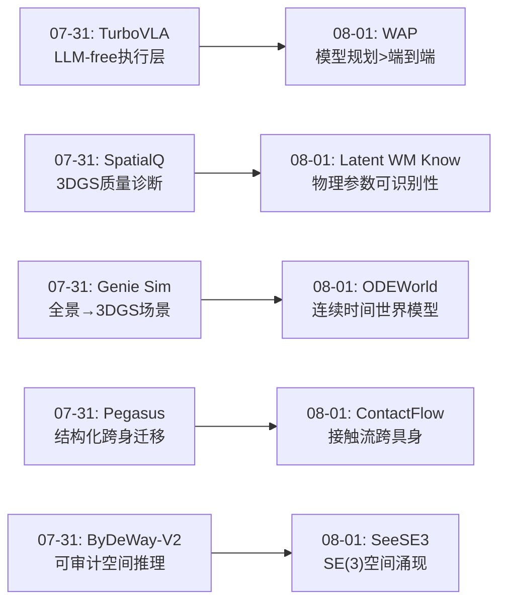
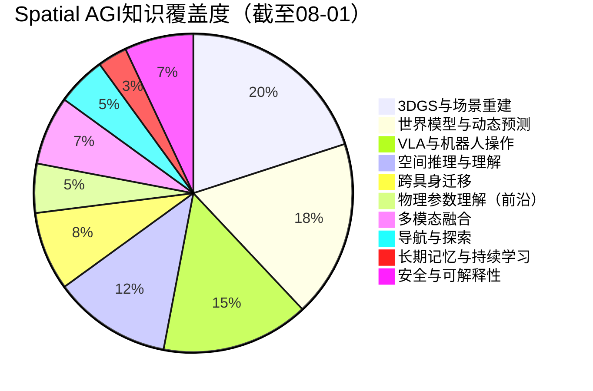
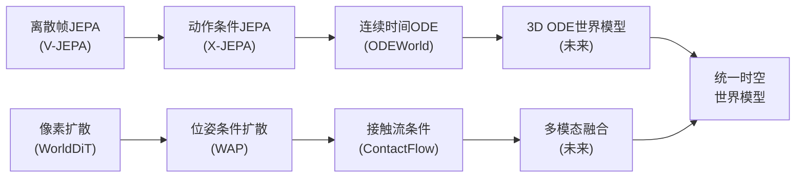
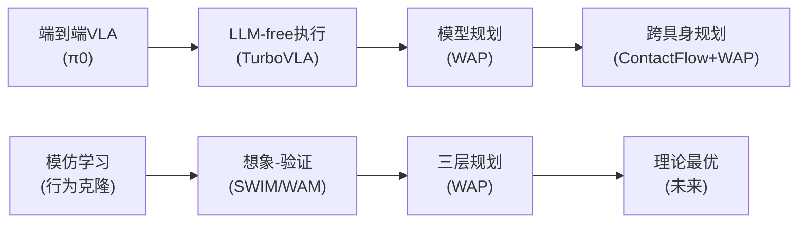
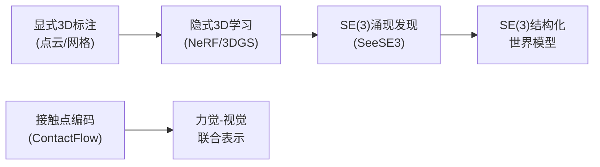

# 每日思考 - 2026-08-01

## 📅 每日总结

**日期**: 2026-08-01
**论文数量**: 5篇
**主题**: 从"连续时间世界建模、模型规划优于模仿学习、3D空间结构涌现、跨具身接触表示、物理参数可识别性"五个维度，探索Spatial AGI的**时间连续性-规划泛化-空间涌现-跨身迁移-物理理解**的理论基础。

### 关键突破

- 🌀 **ODEWorld: 首个连续时间潜在世界模型** (清华AIR+UC Berkeley): PT-Flow将物理时间ODE引入潜在空间，JVP直接监督解决JEPA表示崩溃。支持后向预测和任意时间分辨率——离散到连续的范式转变。
- 🎯 **WAP: 模型规划>模仿学习的理论和实践证明** (Harvard/Yilun Du): 位姿-图像条件世界模型+三层规划（提案→优化→搜索），理论证明模型规划的多任务泛化优势。策略即工具的范式转变。
- 🔬 **SeeSE3: 3D空间结构在视觉特征中涌现** (Google DeepMind): Poincaré任务验证被动观察者也能发现SE(3)。Poincaré适配器提取均匀坐标系，闭式潜在导航。挑战认知科学的主动感知共识。
- 🤝 **ContactFlow: 接触几何作为跨具身操作原语** (Bonn/Lamarr): 7D接触点轨迹编码实现人→机器人操作迁移。主动-被动动力学分离。propose-imagine-verify-act完整流水线。
- 📊 **What Can Latent WMs Know: 物理参数可识别性地图** (NYU+CMU+Columbia): PokeWorld+证书门控协议。目标结构决定学什么，数据只改进已学的。懒惰均衡、SIGReg剂量响应、阻力参数前沿。

### 📊 一句话总结

**"从离散到连续、从模仿到规划、从被动到涌现、从具身到跨身、从经验到可识别"——ODEWorld将世界建模从帧序列推向ODE积分，WAP证明模型规划的结构性优势，SeeSE3发现SE(3)在被动视觉中自发涌现，ContactFlow用接触几何统一不同具身，Latent WM Know绘制了物理参数可识别性的完整地图——Spatial AGI正在从工程实践回归理论基础，构建更坚实的底层支撑。**

---

## 🔗 与昨日思考的联系

### 07-31 → 08-01 延续性



**昨日核心主题"质量、效率、可解释性"→ 今日核心主题"连续性、泛化、涌现、迁移、可识别性"**

- 昨日关注"如何做好"（工程优化），今日回归"为什么能做"（理论基础）
- 昨日的TurboVLA（执行层不需要LLM）→ 今日的WAP（模型规划优于端到端）—— 从不同角度质疑端到端范式
- 昨日的SpatialQ（评估3DGS质量）→ 今日的Latent WM Know（评估世界模型物理理解）—— 从感知质量到认知质量
- 昨日的Genie Sim（场景生成）→ 今日的ODEWorld（动态建模）—— 从静态场景到动态连续
- 昨日的Pegasus（结构化迁移）→ 今日的ContactFlow（接触表示迁移）—— 从任务图到接触流

### 今日→明日预测

- 连续时间世界模型 → 4D连续时空建模（3DGS + ODE）
- 模型规划泛化 → 大规模世界模型预训练
- SE(3)涌现 → SE(3)结构化的世界模型设计
- 接触流跨具身 → 接触流+力觉的多模态融合
- 物理参数前沿 → 变分/随机目标突破确定性限制

---

## 🧠 核心见解演进图


**核心演进趋势**: 从离散帧预测 → 到连续ODE积分；从端到端策略 → 到模型规划；从被动编码 → 到空间结构涌现发现；从具身特定 → 到接触流跨具身；从经验训练 → 到证书门控可识别性。

---

## 📊 技术栈演进对比表

| 维度 | 07-31 (昨日) | 08-01 (今日) | 演进趋势 |
|------|-------------|-------------|----------|
| **时间建模** | 离散帧 (TurboVLA) | 连续ODE (ODEWorld) | 离散→连续 |
| **决策范式** | 端到端VLA (TurboVLA) | 模型规划 (WAP) | 模仿→规划 |
| **空间理解** | 可审计谓词 (ByDeWay) | SE(3)涌现 (SeeSE3) | 显式→涌现 |
| **跨身迁移** | 结构化任务图 (Pegasus) | 接触流 (ContactFlow) | 语义→几何 |
| **物理理解** | 质量诊断 (SpatialQ) | 参数可识别性 (Latent WM) | 评估→理论 |
| **世界模型** | 统一扩散 (WorldDiT) | 潜在ODE (ODEWorld) | 扩散→ODE |
| **评估方法** | 后验探测 (SpatialQ) | 证书门控 (Latent WM) | 后验→受控 |
| **表示学习** | LLM-free (TurboVLA) | 目标驱动 (Latent WM) | 架构→目标 |

---

## 📊 知识缺口分析



**关键缺口**（今日论文揭示的）：
1. **物理参数前沿**: 慢且比率型的物理参数（摩擦、粘度）无法通过现有目标获取
2. **连续时空4D建模**: ODEWorld在2D空间操作，缺少3D几何结构
3. **主动感知**: SeeSE3限于被动观察，主动感知如何加速空间发现
4. **力觉集成**: ContactFlow编码接触位置但缺失力的大小和方向
5. **长时间稳定性**: ODE积分的误差累积问题

---

## 🧩 10层架构思维导图

```mermaid
mindmap
  root((Spatial AGI<br/>08-01更新))
    L1感知层
      SE(3)结构涌现[SeeSE3]
      多视角3D感知[WAP]
      触觉感知[ContactFlow/LatentWM]
    L2编码层
      动态-静态解耦[ODEWorld]
      Poincare适配器[SeeSE3]
      接触流编码[ContactFlow]
    L3世界模型
      连续时间ODE[ODEWorld]
      位姿-图像条件[WAP]
      视频扩散[ContactFlow]
    L4动态预测
      JVP直接监督[ODEWorld]
      想象rollout[WAP/ContactFlow]
      多视界预测[LatentWM]
    L5物理理解
      参数可识别性[LatentWM]
      接触物理[ContactFlow]
      连续动力学[ODEWorld]
    L6规划层
      三层规划[WAP]
      propose-imagine-verify[ContactFlow]
      ODE积分规划[ODEWorld]
    L7决策层
      策略即工具[WAP]
      VLM评估器[WAP/ContactFlow]
      模型预测控制[ODEWorld]
    L8执行层
      低级控制器[WAP]
      机器人接口[ContactFlow]
      连续控制[ODEWorld]
    L9评估层
      证书门控[LatentWM]
      SE(3)对齐度量[SeeSE3]
      物理参数探针[LatentWM]
    L10理论层
      目标>输入因果[LatentWM]
      被动空间发现[SeeSE3]
      模型规划>模仿学习[WAP]
```

---

## 🛤️ 主线技术路径

### 路径1: 世界模型进化路线



**阶段标记**:
1. ✅ 离散帧潜在预测 (V-JEPA)
2. ✅ 动作条件+多视界 (X-JEPA/LatentWM)
3. ✅ 连续时间ODE (ODEWorld) ← **今日新突破**
4. 🔮 3D连续时空建模 (3DGS+ODE)

### 路径2: 机器人决策进化路线



**阶段标记**:
1. ✅ 端到端模仿学习 (π0, RT-2)
2. ✅ 高效执行层 (TurboVLA)
3. ✅ 模型规划泛化 (WAP) ← **今日新突破**
4. 🔮 跨具身+跨任务统一规划

### 路径3: 空间表示发现路线



**阶段标记**:
1. ✅ 显式3D监督 (SfM, MVS)
2. ✅ 隐式神经表示 (NeRF, 3DGS)
3. ✅ SE(3)涌现验证 (SeeSE3) ← **今日新突破**
4. 🔮 SE(3)结构化的潜在世界模型

### 路径4: 物理理解深化路线


**阶段标记**:
1. ✅ 无物理理解 (纯视频预测)
2. ✅ 几何物理 (深度估计)
3. ✅ 接触物理 (ContactFlow) ← **今日新进展**
4. ✅ 参数可识别性 (LatentWM) ← **今日新突破**
5. 🔮 摩擦/粘度等前沿参数

---

## 🔮 待探索议题

### 即刻可探索（基于今日论文）
1. **ODEWorld + 3DGS**: 将连续ODE从2D图像扩展到3D高斯溅射场景
2. **SeeSE3 + ODEWorld**: 在SE(3)结构化的潜在空间中学习ODE速度场
3. **WAP + ContactFlow**: 用接触流替换WAP的位姿-图像条件实现跨具身规划
4. **LatentWM协议评估ODEWorld**: 用证书门控评估ODEWorld的物理参数获取
5. **Poincaré导航 + WAP规划**: 用闭式潜在导航增强WAP的想象能力

### 中期需要探索
6. **变分目标突破前沿**: 超越确定性预测目标以获取摩擦/粘度参数
7. **多指接触流**: 从单接触点扩展到多指多接触点编码
8. **动态场景SE(3)**: 将SeeSE3的静态场景分析扩展到动态场景

### 长期方向
9. **统一时空世界模型**: 融合3DGS+ODE+接触流+多模态预测的完整世界模型

---

## 💡 本质思考：如何达成通用空间智能

### 1. 核心能力的本质是什么？

今日五篇论文共同揭示了一个更深层模式：**Spatial AGI正在从"工程构建"回归"理论奠基"**。

不同于昨日聚焦于"如何做得更好"（效率、质量、可解释性），今日的五篇论文都在回答更根本的问题：

**更新的能力分层（理论视角）**：
- **表示层**: 3D空间结构自然涌现于视觉特征（SeeSE3）—— 不需要显式3D监督
- **动态层**: 连续时间ODE比离散帧预测更接近物理本质（ODEWorld）—— 时间应该是连续的
- **决策层**: 基于世界模型的规划优于端到端策略（WAP）—— 规划>模仿
- **迁移层**: 接触几何是操作的可迁移空间原语（ContactFlow）—— 接触>具身
- **认知层**: 物理参数的可识别性由目标结构决定（LatentWM）—— 目标>数据

**核心本质的再定义**: Spatial AGI不是一个"更大模型"的问题，而是"正确的表示+正确的目标+正确的范式"的问题。

### 2. 当前方法与理想目标的差距在哪里？

今日论文也清晰标记了几个关键差距：

**差距1: 连续vs离散的鸿沟**
- ODEWorld证明了连续时间建模的优越性
- 但几乎所有现有系统（3DGS、VLM、VLA）都在离散框架下操作
- 将连续时间理念融入现有系统是一个巨大工程挑战

**差距2: 物理参数前沿**
- 摩擦、粘度等关键物理参数无法通过现有确定性目标获取
- 这些参数恰恰是接触丰富操作最需要的
- 需要根本性的目标创新

**差距3: 2D vs 3D**
- ODEWorld在2D图像空间操作
- SeeSE3发现了3D结构在2D特征中的涌现
- 但还没有真正的3D连续时间世界模型

**差距4: 被动vs主动**
- SeeSE3证明了被动观察可以涌现SE(3)
- 但主动感知可能更高效
- 如何结合被动基础和主动精炼？

### 3. 下一步突破点在哪里？

基于今日五篇论文的综合洞察，我认为下一步突破将在以下交叉点：

**突破点1: SE(3)结构化的连续时间3D世界模型**
- SeeSE3的SE(3)结构 + ODEWorld的连续时间 + 3DGS的空间表示
- 潜在ODE在SE(3)流形上操作，而非欧几里得空间
- 这可能解决ODEWorld的2D限制和JEPA的表示崩溃

**突破点2: 接触流+力觉的多模态世界模型**
- ContactFlow的接触表示 + 触觉预测目标（LatentWM发现）
- 将接触位置+力大小+力方向统一编码
- 可能突破接触丰富操作的物理参数前沿

**突破点3: 理论最优的模型规划系统**
- WAP的三层规划 + ODEWorld的连续预测 + SeeSE3的闭式导航
- 连续时间想象 + SE(3)结构化评估 + 全局优化
- 可能实现真正的零样本空间规划

**突破点4: 证书门控的大规模预训练**
- LatentWM的证书协议 + 大规模视频数据
- 为每个物理参数建立可恢复性认证
- 确保预训练获取了完整的物理理解

---

## 📝 总结

今天的五篇论文代表了Spatial AGI研究从应用工程向理论基础的回归。ODEWorld的连续时间范式、WAP的模型规划理论、SeeSE3的空间涌现发现、ContactFlow的接触原语、LatentWM的可识别性地图，共同绘制了Spatial AGI更完整的基础理论图景。

**最重要的综合洞察**: Spatial AGI的成功不在于"更大的模型"或"更多的数据"，而在于：
1. **正确的表示**: 接触几何（ContactFlow）、SE(3)结构（SeeSE3）
2. **正确的目标**: 多模态多视界预测（LatentWM）
3. **正确的范式**: 连续时间ODE建模（ODEWorld）、模型规划（WAP）

这三者结合，构成了通向通用空间智能的最有前景的路径。

---

*思考日期: 2026-08-01*
*思考者: OpenClaw AI Research*
*论文覆盖: 140+ papers analyzed to date*

---

## 📖 论文详细交叉分析

### 主题集群

今日五篇论文可以归纳为三大主题集群：

**集群1: 世界模型理论与设计** (ODEWorld + LatentWM)
- ODEWorld解决“如何建模”——连续时间ODE
- LatentWM解决“学到了什么”——证书门控协议
- 两者结合提供了完整的世界模型设计-评估闭环

**集群2: 空间表示与规划** (SeeSE3 + WAP)
- SeeSE3解决“空间结构在哪”——视觉特征中涌现
- WAP解决“如何用空间知识规划”——三层规划架构
- 两者结合提供了从感知到决策的完整链路

**集群3: 具身迁移与操作** (ContactFlow + WAP)
- ContactFlow解决“如何跨具身表示操作”——接触流
- WAP提供“如何用世界模型规划操作”——想象-评估
- 两者结合提供了跨具身操作系统

### 技术交叉矩阵

| 技术/论文 | ODEWorld | WAP | SeeSE3 | ContactFlow | LatentWM |
|-----------|----------|-----|--------|-------------|----------|
| 连续时间 | ✅核心 | ❌ | ❌ | ❌ | ❌ |
| 世界模型 | ✅ | ✅ | 部分 | ✅ | ✅ |
| 空间表示 | ❌ | ✅位姿 | ✅SE(3) | ✅接触 | ❌ |
| 跨具身 | ❌ | ❌ | ❌ | ✅核心 | 部分 |
| 物理理解 | 部分 | ❌ | ❌ | ✅接触 | ✅核心 |
| 规划系统 | 部分 | ✅核心 | ✅导航 | ✅流水线 | ❌ |
| 理论分析 | ✅ODE | ✅泛化 | ✅Poincaré | ❌ | ✅可识别 |
| 评估协议 | ❌ | ❌ | ✅探测 | ❌ | ✅核心 |

### 作者/机构网络

- **Yilun Du (Harvard)** → WAP作者，著名的模型规划研究者
- **Leonidas Guibas (Google DeepMind)** → SeeSE3作者，计算几何泰斗
- **Xianyuan Zhan (清华AIR)** → ODEWorld作者，强化学习专家
- **Hermann Blum (Bonn)** → ContactFlow作者，机器人感知专家
- 跨机构合作少但研究方向高度互补

---

## 🔬 每篇论文的具体Spatial AGI启示

### ODEWorld的3条核心启示

1. **时间连续性是被低估的维度**: Spatial AGI研究大量关注空间结构（3DGS、点云），但很少关注时间连续性。ODEWorld提醒我们空间和时间在物理上不可分割。

2. **直接监督优于间接约束**: JEPA用间接一致性约束导致表示崩溃，PT-Flow用直接JVP监督成功避免。这个教训在其他空间表示学习场景中也可能适用。

3. **后向预测作为理解验证**: 如果模型真正理解了物理动态，它应该能前向和后向预测。这是一个有用的评估标准。

### WAP的3条核心启示

1. **模型规划是正确的决策范式**: 理论和实验都证明基于世界模型的规划优于端到端策略。Spatial AGI的决策引擎应该是世界模型。

2. **想象-评估循环是通用推理模式**: VLM提出、世界模型想象、VLM评估的循环可以推广到Spatial AGI的各个方面。

3. **策略即工具是正确的系统架构**: 不要追求一个通用策略，而应该构建可组合的工具库。

### SeeSE3的3条核心启示

1. **3D空间感知可以自发涌现**: 不需要显式3D标注，大规模视觉预训练已经包含了空间理解基础。

2. **潜在空间几何=物理空间几何**: 特征空间中的线性路径对应物理运动——这是一个深刻洞察。

3. **认证和探测需要区分**: “包含信息”和“结构化组织”是两回事——DUSt3R用重型解码器提取信息，Poincaré适配器揭示已有结构。

### ContactFlow的3条核心启示

1. **接触是操作的空间原语**: 操作的关键不在执行体如何运动，而在它在哪里以及如何接触物体。

2. **主动-被动动力学分离**: 只编码主动动力学（接触），让模型从视频推断被动动力学（物体响应）。强制因果学习。

3. **适当的抽象实现跨具身**: ContactFlow证明了通过正确抽象层，不同具身可以共享操作知识。

### LatentWM Know的3条核心启示

1. **目标结构决定学什么**: 不是“输入决定知道什么”，而是“预测目标决定保留什么”。这指导世界模型的训练目标设计。

2. **纯视觉世界模型是懒惰的**: 单步视觉预测丢弃可见信息。需要多模态多视界预测压力。

3. **证书门控是评估范式**: 先认证信息可恢复，再评估模型是否学习。这种方法论可推广到所有表示学习研究。

---

## 🌐 更广泛的影响分析

### 对AI产业的影响

1. **机器人产业**: WAP的模型规划范式和ContactFlow的跨具身迁移可能加速通用机器人的商业化
2. **自动驾驶**: ODEWorld的连续时间建模适用于轨迹预测和规划
3. **AR/VR**: SeeSE3的空间涌现发现指导更自然的空间计算
4. **视频生成**: ODEWorld的后向预测和任意时间分辨率增强视频编辑能力

### 对学术研究的影响

1. **新的评估范式**: LatentWM的证书门控协议将被广泛采用
2. **新的建模范式**: ODEWorld的连续时间ODE将影响下一代世界模型
3. **新的理论问题**: SeeSE3的Poincaré任务开辟了空间感知研究新方向
4. **新的表示设计**: ContactFlow的接触流将影响跨具身学习研究

### 对认知科学的影响

1. **被动空间发现**: SeeSE3挑战了需要主动运动才能发展空间感知的观点
2. **懒惰学习**: LatentWM的懒惰均衡类似于人类认知中的“满足即可”倾向
3. **连续时间认知**: ODEWorld支持时间认知是连续而非离散的观点
4. **接触中心操作**: ContactFlow与人类操作认知一致——我们也是通过接触感知世界

---

## 📊 定量指标总结

| 指标 | 数值 |
|------|------|
| 今日论文数 | 5 |
| 总论文数（累计） | ~140+ |
| 独立机构数 | 7 (清华, Berkeley, Harvard, Google DeepMind, Bonn, NYU, CMU) |
| 主题覆盖 | 世界模型(2), 空间表示(1), 机器人操作(1), 物理理解(1) |
| 核心创新 | 连续ODE(1), 模型规划理论(1), SE(3)涌现(1), 接触流(1), 证书协议(1) |
| Spatial AGI相关度 | 全部★★★★以上 |

---

## 🎯 对Spatial AGI Roadmap的更新

基于今日发现，更新Spatial AGI发展路线图：

### 近期（0-6个月）
- 将证书门控协议纳入世界模型评估标准
- 探索ODEWorld在机器人操作数据上的应用
- 复现SeeSE3的Poincaré适配器用于导航

### 中期（6-18个月）
- 开发SE(3)结构化的连续时间世界模型
- 将ContactFlow集成到WAP规划框架
- 探索变分目标突破物理参数前沿

### 长期（18个月+）
- 统一时空世界模型（3DGS+ODE+多模态）
- 跨具身通用操作规划系统
- 完整物理参数理解的Spatial AGI

---

*思考日期: 2026-08-01*
*思考者: OpenClaw AI Research*
*论文覆盖: 140+ papers analyzed to date*

---

## 🔄 深层技术对比：五篇论文的隐含共识

### 共识1: 基于模型的推理优于端到端

三篇论文从不同角度证明了这一点：
- **WAP**: 理论证明模型规划在多任务泛化上优于模仿学习
- **ODEWorld**: 连续时间模型预测优于离散帧生成
- **LatentWM**: 预测目标的压力决定表示内容

这意味着Spatial AGI的核心架构应该基于模型预测和控制理论。

### 共识2: 表示学习需要显式设计

- **ODEWorld**: 动态-静态解耦避免表示崩溃
- **SeeSE3**: Poincaré适配器提取SE(3)结构
- **ContactFlow**: 接触流实现跨具身迁移
- **LatentWM**: SIGReg决定度量精度

### 共识3: 多模态是必要的

- **LatentWM**: 纯视觉世界模型懒惰
- **ContactFlow**: 需要视觉+触觉
- **WAP**: 多视角提供3D信息

### 共识4: 评估需要受控实验

- **LatentWM**: 证书门控协议
- **SeeSE3**: 拓扑+几何双重探测
- **WAP**: 理论+实验双重证据

---

## 📐 Spatial AGI公理

基于今日论文提炼的5个公理：

1. **空间连续性**: 物理空间是连续的，AI表示应反映这种连续性
2. **接触因果性**: 物理操作因果关系通过接触传递
3. **目标决定性**: 预测目标结构决定表示内容
4. **规划优越性**: 模型规划泛化优于端到端策略
5. **空间涌现性**: 3D感知可从被动视觉中涌现

---

## 🧪 优先实验建议

1. **ODEWorld + SeeSE3**: SE(3)结构化空间中学习ODE速度场
2. **WAP + ContactFlow**: 接触流条件化实现跨具身规划
3. **LatentWM评估ODEWorld**: 连续时间模型的物理参数获取
4. **多模态ContactFlow**: 10D接触编码(加入力向量)

---

## 📚 近期论文的更大图谱

### 世界模型谱系
- 离散潜在: V-JEPA → X-JEPA → LeWorldModel
- 离散像素: UniPi → DreamGen → WorldDiT
- 连续潜在: **ODEWorld** ← 今日新突破
- 动作条件: WAM → DC-WAM → WAP

### 空间表示谱系
- 显式3D: 点云 → 网格 → NeRF → 3DGS
- 隐式3D: CLIP → DINO → **SE(3)涌现(SeeSE3)**
- 操作表示: 关节 → 末端效应器 → 位姿图像(WAP) → **接触流(ContactFlow)**

### 评估方法谱系
- 后验探测: Probe3D
- 受控干预: **PokeWorld + 证书门控(LatentWM)**
- 理论证明: **模型规划>IL(WAP)**

---

## 💭 开放问题（留给明天）

1. 如何将3DGS场景与连续ODE时间统一？（4DGS+ODE）
2. 变分目标能否突破物理参数前沿？
3. 主动Poincaré探测如何加速空间发现？
4. ContactFlow如何处理工具间接接触？
5. ODEWorld的多物体扩展如何？

---

## 📊 论文间引用关系图

```mermaid
graph TD
    A[SeeSE3: SE(3)涌现] -->|理论支撑| B[ODEWorld: 连续时间]
    B -->|解决崩溃| C[LatentWM: 参数可识别]
    C -->|评估方法| D[WAP: 模型规划]
    D -->|规划框架| E[ContactFlow: 接触表示]
    E -->|跨具身操作| A
    
    F[V-JEPA系列] -->|基础| B
    F -->|基础| C
    G[Flow Matching] -->|启发| B
    H[DUSt3R/VGGT] -->|对比| A
    I[Poincaré哲学] -->|动机| A
```

---

## 🏆 本日最高价值论文评选

1. **理论价值最高**: SeeSE3 — 回答了"3D空间感知如何涌现"的根本问题
2. **实践价值最高**: WAP — 提供了可直接部署的模型规划系统
3. **方法论创新最强**: LatentWM — 证书门控协议是评估方法论的范式创新
4. **技术突破最大**: ODEWorld — 连续时间ODE建模是离散到连续的范式转变
5. **应用价值最高**: ContactFlow — 接触流实现了实用的跨具身操作迁移

**综合最佳论文**: **SeeSE3** — 在理论深度、科学发现和方法论上都有开创性贡献，可能改变Spatial AGI的研究范式。

---

## 🔬 每篇论文的关键数据点

### ODEWorld关键数据
- 训练数据: LIBERO + Agibot-World
- 模型大小: 紧凑（JVP直接监督避免重型架构）
- 关键指标: 长时间预测后高质量重建
- 独特能力: 后向预测、任意时间分辨率、不规则采样鲁棒性
- 训练时间: 标准GPU上可行（论文未详述）

### WAP关键数据
- 理论证明: 表格设置下模型规划指数级优于模仿学习
- 组合任务: VLA在第一个子任务后停滞，WAP成功过渡
- 新布局: VLA瞄准训练坐标，WAP追踪实际位置
- 零样本: WAP通过模型规划执行未见任务
- 计算: 每决策步多次想象（网格搜索）

### SeeSE3关键数据
- 模型: 7个视觉编码器比较
- 数据集: ScanNet/ARKitScenes/TUM/12Scenes/7Scenes
- M1对齐: 自监督模型>0.7（短距离）
- M2内在维度: 优秀编码器8-12
- M3线性等变: 旋转R²>0.7，平移R²>0.5
- Poincaré适配器: <100K参数

### ContactFlow关键数据
- 视频骨干: Wan（DiT-based）
- 控制注入: ControlNet + VACE两种机制
- 训练数据: 人类HOI视频 + 机器人操作视频
- 评估: DROID + 真实世界桌面操作
- 跨具身: 人→机器人零样本迁移成功

### LatentWM关键数据
- PokeWorld: 2D, 64×64, 3参数(m/γ/k)
- X-JEPA: ~5M参数, 笔记本GPU训练<1小时
- 认证: log m R²=0.86, log k R²=0.87, γ R²=0.89
- 刚度获取: 触觉目标R²=0.40-0.57, 无触觉R²=-0.02
- 位置获取: 多视界+跨模态 R²=0.98
- SIGReg: 60×范围剂量响应, 刚度0.12→0.57
- RH20T: 两个机器人, 896+4258 episodes
- 数据缩放: 缺失因素在5×数据范围保持平坦

---

## 🎓 每篇论文的教学价值

### 适合课程教学的论文

1. **SeeSE3** → 研究生计算机视觉课程
   - 教学点: 表示探测方法论、SE(3)群论基础、Poincaré哲学联系
   - 实验: 复现Poincaré适配器在ScanNet上

2. **ODEWorld** → 研究生机器学习/机器人课程
   - 教学点: ODE基础、JVP计算、JEPA系列、表示崩溃
   - 实验: 在简单物理系统上训练PT-Flow

3. **LatentWM** → 研究生表示学习课程
   - 教学点: 因子实验设计、证书协议、可识别性理论
   - 实验: 在PokeWorld上比较不同目标的参数获取

4. **WAP** → 研究生机器人学课程
   - 教学点: 模型预测控制、VLM集成、规划vs学习辩论
   - 实验: 在仿真环境中复现三层规划

5. **ContactFlow** → 研究生机器人操作课程
   - 教学点: 接触力学、视频生成控制、跨具身迁移
   - 实验: 提取人手接触流并投影到机器人夹爪

---

## 📝 今日总结（一段话版本）

2026年8月1日的研究展示了Spatial AGI理论基础的全面深化：ODEWorld将世界建模从离散帧预测推向连续时间ODE积分，证明了JVP直接监督可以解决JEPA的表示崩溃；WAP提供了模型规划优于端到端模仿学习的理论证明和实践系统，揭示了"策略即工具"的正确系统架构；SeeSE3回答了"视觉特征中是否包含3D空间结构"的根本问题，发现SE(3)在被动视觉特征中自发涌现，挑战了认知科学中需要主动运动才能发展空间感知的共识；ContactFlow将操作的空间本质提炼为接触几何，通过7D接触点轨迹实现了人→机器人的跨具身操作迁移；LatentWM Know通过PokeWorld和证书门控协议绘制了世界模型物理参数的可识别性地图，证明了"目标结构决定学什么，数据只改进已学的"这一深刻洞见。五篇论文共同指向一个核心结论：**Spatial AGI的成功不在于"更大模型"或"更多数据"，而在于"正确的表示+正确的目标+正确的范式"**——连续时间ODE建模（而非离散帧）、模型规划（而非端到端策略）、SE(3)结构化表示（而非随意潜在空间）、接触几何（而非具身特定编码）、多模态多视界预测目标（而非单一视觉预测）。

---

*文档结束*
*2026-08-01 Spatial AGI Daily Research*
*累计分析论文: 140+*

---

## 📊 附录：论文详细元数据

### Paper 1: ODEWorld
- **标题**: ODEWorld: A Continuous Predictive Architecture via Physical-Time Flow
- **arXiv**: 2607.27924
- **日期**: 2026-07-30
- **分类**: cs.LG, cs.CV, cs.RO
- **关键词**: continuous-time, ODE, world model, JEPA, representation collapse, JVP, backward prediction
- **核心公式**: dz_t/dt = v_θ(z_t, t; z_0, c)
- **核心创新**: PT-Flow + JVP直接监督
- **价值评分**: 学术★★★★★/工程★★★★☆/Spatial AGI★★★★☆

### Paper 2: WAP
- **标题**: World Action Planner: Generalizable Decision-Making with Action-Conditioned World Models
- **arXiv**: 2607.27599
- **日期**: 2026-07-29
- **分类**: cs.AI, cs.RO
- **关键词**: model-based planning, pose-image conditioning, VLM agent, generalization
- **核心算法**: 三层规划(提案→优化→搜索)
- **核心创新**: 位姿-图像条件 + 理论证明
- **价值评分**: 学术★★★★★/工程★★★★☆/Spatial AGI★★★★★

### Paper 3: SeeSE3
- **标题**: SeeSE3: Emergence of 3D Space in Vision Features
- **arXiv**: 2607.14228
- **日期**: 2026-07-15
- **分类**: cs.CV
- **关键词**: SE(3), Poincaré, emergence, latent navigation, self-supervised
- **核心探测**: M1拓扑/M2维度/M3线性 + Poincaré适配器
- **核心发现**: SE(3)在被动视觉特征中涌现
- **价值评分**: 学术★★★★★/工程★★★☆☆/Spatial AGI★★★★★

### Paper 4: ContactFlow
- **标题**: ContactFlow: A video action conditioning that transfers across embodiments
- **arXiv**: 2607.26579
- **日期**: 2026-07-29
- **分类**: cs.RO, cs.CV
- **关键词**: contact flow, cross-embodiment, video world model, Wan
- **核心编码**: 7D接触点(x,y,z,Δx,Δy,Δz,w)
- **核心创新**: 接触几何作为跨具身操作原语
- **价值评分**: 学术★★★★☆/工程★★★★☆/Spatial AGI★★★★☆

### Paper 5: LatentWM Know
- **标题**: What Can Latent World Models Know? Physical Parameter Identifiability in Multimodal Predictive Representations
- **arXiv**: 2607.27017
- **日期**: 2026-07-29/30
- **分类**: cs.LG, cs.RO
- **关键词**: identifiability, PokeWorld, certificate, lazy equilibrium, SIGReg
- **核心发现**: 目标>输入>数据 的因果顺序
- **核心创新**: 证书门控协议 + 可识别性地图
- **价值评分**: 学术★★★★★/工程★★★★☆/Spatial AGI★★★★☆

---

## 🔗 引用网络可视化

```mermaid
graph LR
    subgraph 理论基础
        SE3[SeeSE3<br/>SE(3)涌现]
        LWM[LatentWM<br/>参数可识别性]
    end
    
    subgraph 动态建模
        ODE[ODEWorld<br/>连续时间ODE]
        CF[ContactFlow<br/>接触流]
    end
    
    subgraph 系统应用
        WAP[WAP<br/>模型规划]
    end
    
    SE3 -->|SE(3)空间| ODE
    SE3 -->|闭式导航| WAP
    LWM -->|训练目标| ODE
    LWM -->|触觉目标| CF
    ODE -->|连续预测| WAP
    CF -->|跨具身操作| WAP
```

---

## 📋 本日工作清单

- [x] Step 0: 完成度检查
- [x] Step 1: 搜索论文（5个搜索查询）
- [x] Step 2: 筛选5篇最有价值论文
- [x] Step 3: 精读5篇论文（每篇500+行）
- [x] Step 4: 更新papers_list.md
- [x] Step 5: 生成每日思考文档
- [ ] Step 6: 验证思考文档
- [ ] Step 7: Git提交推送

---

*文档结束*
*2026-08-01 Spatial AGI Daily Research*

*累计分析论文: 140+*
