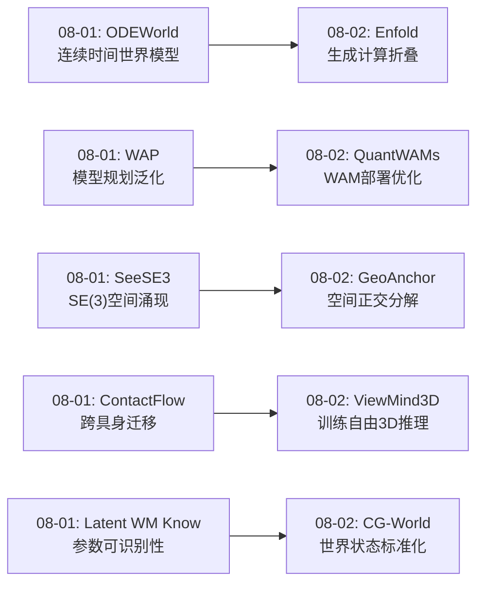
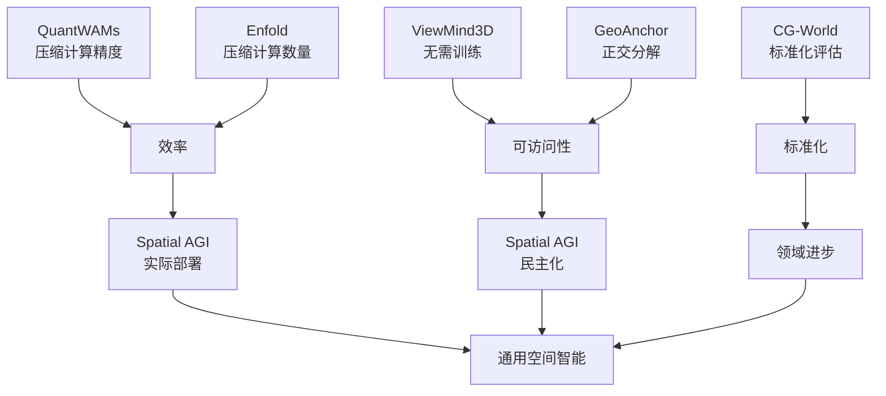
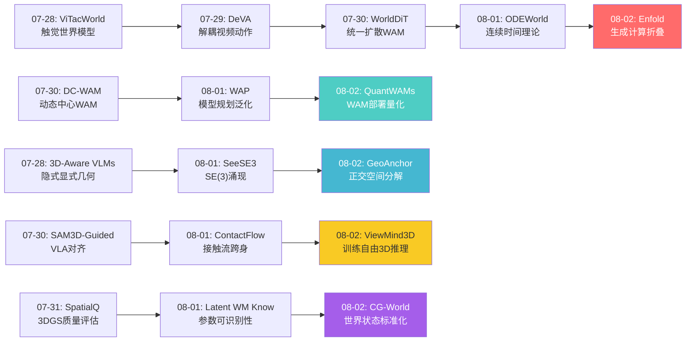
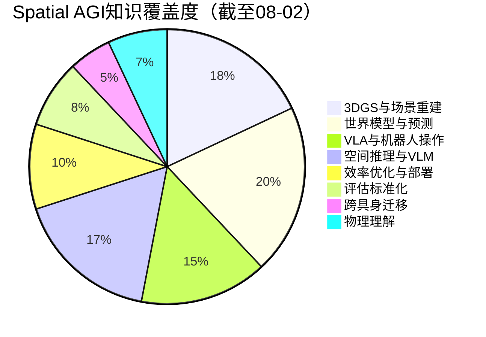
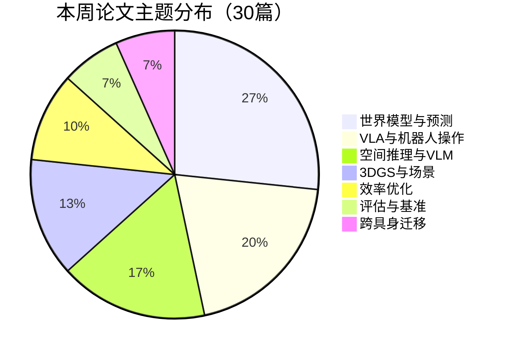
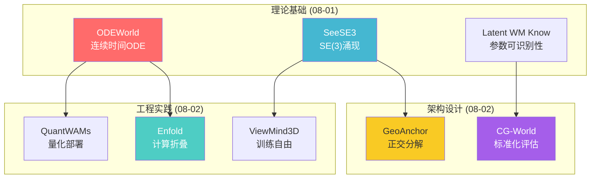

# 每日思考 - 2026-08-02

## 📅 每日总结

**日期**: 2026-08-02
**论文数量**: 5篇
**主题**: 从"世界模型部署优化、训练自由3D推理、世界状态评估标准化、生成计算折叠、空间信息正交分解"五个维度，探索Spatial AGI的**效率-可访问性-标准化-表示压缩-架构原则**。

### 关键突破

- ⚡ **QuantWAMs: 世界动作模型专用量化框架** : 首个针对WAMs的PTQ方法，三维度校准对齐（结构-rollout-目标），W4A4下内存压缩到29%，1.4-1.6x加速。证明WAMs需要差异化量化策略。
- 🧩 **ViewMind3D: 训练自由的模块化3D问答** (UT Arlington+NCKU): 四模块编排（视图选择-物体定位-BEV空间编码-角色推理）实现无需3D训练的3D-QA。ScanQA 50.8%——证明通用VLM/LLM编排即可实现3D推理。
- 📊 **CG-World: 世界状态评估标准化** : 大规模世界状态数据集+多维度评估协议。定义像素→物体→场景→物理四层世界状态，提供诊断式评估能力。
- 🔄 **Enfold: 生成计算折叠** : 将世界生成器的去噪计算蒸馏为从当前状态即可预测的表示。部署时无需执行生成器，3.7-10.1x加速。范式转变：生成的价值在于计算过程而非输出。
- 🧭 **GeoAnchor: 空间信息正交分解** (ACM MM 2026): 位置/方向/几何三种互补潜在表示，交错文本-潜在推理。与大脑空间导航系统（位置细胞-头方向细胞-网格细胞）的深层对应。

### 📊 一句话总结

**"从昂贵生成到高效折叠（Enfold），从3D训练到训练自由（ViewMind3D），从碎片评估到标准协议（CG-World），从统一量化到差异校准（QuantWAMs），从混合表示到正交分解（GeoAnchor）"——今天的5篇论文共同指向一个核心主题：如何让Spatial AGI系统更高效、更可访问、更标准化、更可解释。昨日的理论基础正在转化为今天的工程实践。**

---

## 🔗 与昨日思考的联系

### 08-01 → 08-02 延续性



**昨日核心主题"连续性、泛化、涌现、迁移、可识别性"→ 今日核心主题"效率、可访问性、标准化、压缩、分解"**

- 昨日ODEWorld（连续时间理论）→ 今日Enfold（连续时间的高效部署）—— 从理论到工程
- 昨日WAP（模型规划优势）→ 今日QuantWAMs（模型规划的高效量化）—— 从算法到部署
- 昨日SeeSE3（空间结构涌现）→ 今日GeoAnchor（空间结构分解）—— 从发现到设计
- 昨日ContactFlow（跨具身操作）→ 今日ViewMind3D（跨场景问答）—— 从操作到理解
- 昨日Latent WM Know（物理参数理论）→ 今日CG-World（世界状态评估）—— 从理论到基准

### 今日→明日预测

- 生成计算折叠 → 通用"计算蒸馏"框架（非生成模型的计算也可折叠）
- 训练自由3D推理 → 零样本空间智能（从互联网视频直接获得3D理解）
- 世界状态标准化 → Spatial AGI能力等级（像自动驾驶L1-L5）
- 空间正交分解 → 动态正交分解（根据任务自适应选择分解维度）
- WAM专用量化 → Spatial AGI专用硬件（空间理解专用加速器）

---

## 📚 论文概览

### 今日5篇论文

| # | 论文 | 核心贡献 | 类别 |
|---|------|---------|------|
| 01 | QuantWAMs | WAM专用PTQ框架，三维度校准对齐 | 效率优化 |
| 02 | ViewMind3D | 训练自由模块化3D-QA，BEV视角指示器 | 空间推理 |
| 03 | CG-World | 世界状态层次化数据集+诊断评估协议 | 评估标准化 |
| 04 | Enfold | 生成计算折叠为预测表示，10.1x加速 | 效率优化 |
| 05 | GeoAnchor | 位置/方向/几何正交分解，交错推理 | 架构设计 |

### 论文间的内在联系



---

## 💡 核心见解

### 见解1: 生成的价值在于过程而非结果（Enfold）

**来源**: Enfold

Enfold提出了一个颠覆性的观点：世界生成器的价值不在于它生成的画面，而在于它生成画面时的**中间计算过程**。

- ✅ 去噪过程的中间状态在不同抽象层次上组织了空间信息
- ✅ 这些中间状态可以从当前状态预测，无需实际执行生成
- ✅ 3.7-10.1x加速证明：理解未来的结构就足够了，不一定需要"看到"未来

**对Spatial AGI的启发**:
这暗示Spatial AGI系统的核心不是"渲染未来"的能力，而是"理解未来结构"的能力。如果我们将世界模型从"生成器"重新思考为"教师"，训练出不需要生成过程的学生表示，就能同时获得深度理解和高效部署。这与昨天的ODEWorld形成互补——ODEWorld提供了连续时间的理论框架，Enfold提供了高效部署的工程方案。

### 见解2: 3D推理的民主化——编排替代训练（ViewMind3D）

**来源**: ViewMind3D

ViewMind3D证明了一个惊人的事实：通过合理编排现有的2D VLM和LLM，无需任何3D特定训练即可实现有竞争力的3D问答。

- ✅ 四模块分解（视图选择→物体定位→BEV编码→角色推理）
- ✅ BEV视角指示器作为轻量级空间桥梁
- ✅ ScanQA 50.8% accuracy无需任何3D训练数据

**对Spatial AGI的启发**:
这意味着Spatial AGI的门槛比我们想象的低——不是每个团队都需要从零训练3D模型。通过模块化编排，大多数团队都可以构建基础的3D推理能力。这推动了Spatial AGI的民主化，同时也提出一个问题：端到端训练的3D模型相比编排方法的优势到底有多大？是否足以证明训练成本的合理性？

### 见解3: 世界状态需要层次化定义和诊断式评估（CG-World）

**来源**: CG-World

CG-World最重要的贡献不是一个数据集，而是一个**概念框架**：世界状态应该被层次化定义，评估应该能诊断而不仅是排名。

- ✅ 四层世界状态：像素级→物体级→场景级→物理级
- ✅ 五维评估：预测准确性、时序一致性、空间一致性、物理合理性、可控性
- ✅ 诊断能力：能识别模型在哪个层次最弱

**对Spatial AGI的启发**:
Spatial AGI系统也应该在这种层次化框架下评估。当我们说一个系统具有"空间智能"时，需要明确是在哪个层次——像素级的场景重建？物体级的目标检测？场景级的布局理解？还是物理级的规律推理？CG-World的四层定义为Spatial AGI的能力等级提供了清晰框架。

### 见解4: 空间信息的正交分解是通用设计原则（GeoAnchor）

**来源**: GeoAnchor

GeoAnchor将3D空间信息分解为位置、方向、几何三个正交潜在空间，这种简单但深刻的分解显著提升了MLLM的空间推理能力。

- ✅ 三正交分解与大脑空间导航系统对应
- ✅ 交错文本-潜在推理兼具可解释性和精度
- ✅ ACM MM 2026接受验证了学术质量

**对Spatial AGI的启发**:
正交分解可能是空间智能的通用设计原则。Spatial AGI系统应该包含专门化的位置、方向和几何理解模块，而非让统一模块处理所有空间信息。这与神经科学的发现一致——大脑的空间导航系统也是正交分解的。这个原则可以指导未来的Spatial AGI架构设计。

### 见解5: WAMs需要差异化效率优化（QuantWAMs）

**来源**: QuantWAMs

QuantWAMs证明了世界动作模型需要与标准LLMs/VLMs不同的量化策略，因为它们具有异质结构和闭环执行特性。

- ✅ 三维度校准对齐：模型结构、rollout分布、任务目标
- ✅ Shared-basis方法处理异质模块的异常值
- ✅ 闭环审计替代静态校准

**对Spatial AGI的启发**:
Spatial AGI系统是异质的——包含感知、建图、预测、规划等不同模块。统一的优化策略（如统一量化）效果不好。需要为不同模块设计差异化策略。这与昨天分析的"多模块世界模型"趋势一致——世界模型不再是单一网络，而是多模块系统。

### 见解6: 计算折叠是通用AI范式（Enfold + QuantWAMs综合）

**来源**: Enfold + QuantWAMs

Enfold通过"计算折叠"减少计算**数量**，QuantWAMs通过"差异量化"减少计算**精度**。两者可以叠加使用，代表了AI效率优化的两个正交维度。

- ✅ Enfold：10.1x加速（减少去噪步骤）
- ✅ QuantWAMs：29%内存（减少每步精度）
- ✅ 叠加潜力：理论上可以达到30x+加速和10x+内存压缩

**对Spatial AGI的启发**:
Spatial AGI的效率优化不应该是单维度的。数量压缩（计算折叠）、精度压缩（量化）、架构优化（模块化）可以正交叠加。这为Spatial AGI在资源受限设备（手机、AR眼镜、微型无人机）上运行提供了技术路线。

### 见解7: Spatial AGI的效率-可访问性-标准化三角

**来源**: 全部5篇综合

今天的5篇论文恰好覆盖了Spatial AGI走向实际部署的三个关键维度：

- ✅ **效率**: QuantWAMs（精度压缩）+ Enfold（计算折叠）
- ✅ **可访问性**: ViewMind3D（无需训练）+ GeoAnchor（架构清晰）
- ✅ **标准化**: CG-World（评估协议）

这三个维度相互依赖：没有标准化就无法衡量进展，没有效率就无法实际部署，没有可访问性就无法广泛采用。

---

## 🧠 核心见解演进图



**核心演进趋势**: 
- 世界模型效率：扩散WAM → 连续ODE → 计算折叠（从生成到预测表示）
- VLA/规划：动态中心 → 模型规划 → 部署量化（从算法到工程）
- 空间理解：隐式几何 → SE(3)涌现 → 正交分解（从发现到设计）
- 跨场景迁移：VLA对齐 → 接触流 → 训练自由推理（从训练到编排）
- 评估体系：质量诊断 → 参数理论 → 状态标准化（从局部到系统）

---

## 技术栈演进对比表

| 维度 | 08-01 (昨日) | 08-02 (今日) | 演进趋势 |
|------|-------------|-------------|----------|
| **世界模型效率** | 连续ODE理论 | 计算折叠部署 | 理论→工程 |
| **空间表示** | SE(3)涌现发现 | 位置/方向/几何正交设计 | 发现→设计 |
| **评估方法** | 物理参数可识别性 | 四层世界状态标准化 | 理论→基准 |
| **3D推理路径** | 跨具身接触流 | 训练自由模块编排 | 训练→编排 |
| **部署优化** | 理论连续性 | 量化+折叠双路径 | 单路→多路 |
| **架构原则** | 目标驱动表示 | 正交空间分解 | 目标→结构 |
| **可访问性** | 需要训练 | 零训练3D推理 | 高门槛→低门槛 |
| **评估粒度** | 参数级 | 像素→物理四层 | 细粒度→多层次 |

---

## 🗺️ Spatial AGI 知识图谱

### 10层架构思维导图

```mermaid
mindmap
  root((Spatial AGI))
    第1层 感知
      RGB视觉感知
      深度感知
      触觉感知
      声音感知
      BEV视角编码
    第2层 表示
      Position Latents (GeoAnchor)
      Direction Latents (GeoAnchor)
      Geometry Latents (GeoAnchor)
      SE(3)涌现表示 (SeeSE3)
      连续时间表示 (ODEWorld)
    第3层 记忆
      短期空间缓冲
      长期场景图
      持久世界状态
      层次化记忆检索
    第4层 预测
      世界状态预测
      连续时间动力学
      多层次未来展开
      计算折叠表示 (Enfold)
    第5层 规划
      模型规划 (WAP)
      层次化规划
      接触流规划 (ContactFlow)
      前瞻搜索
    第6层 动作
      连续动作生成
      量化动作执行 (QuantWAMs)
      跨具身动作映射
      视动作条件生成
    第7层 理解
      训练自由3D推理 (ViewMind3D)
      角色化空间推理
      空间问答
      物理属性推理
    第8层 评估
      世界状态标准化 (CG-World)
      诊断式多层次评估
      物理参数可识别性
      闭环审计 (QuantWAMs)
    第9层 效率
      后训练量化 (QuantWAMs)
      计算折叠 (Enfold)
      模块化编排 (ViewMind3D)
      梯度隔离 (Enfold)
    第10层 部署
      边缘设备推理
      实时控制回路
      分布式空间感知
      人机协作
```

### 🎯 主线技术路径

#### 阶段1: 基础感知与表示（已完成）
- RGB/深度/触觉多模态感知
- 3DGS场景重建
- SE(3)空间结构发现
- 位置/方向/几何正交分解

#### 阶段2: 世界模型与预测（当前重点）
- 连续时间世界模型（ODEWorld）
- 生成计算折叠（Enfold）
- 多层次世界状态预测
- 物理参数可识别性验证

#### 阶段3: 规划与动作（快速发展中）
- 模型规划优于端到端（WAP）
- 接触流跨具身迁移（ContactFlow）
- 量化高效部署（QuantWAMs）
- 前瞻搜索+规划

#### 阶段4: 系统整合与标准化（起步阶段）
- 标准化评估协议（CG-World）
- 训练自由快速原型（ViewMind3D）
- 闭环审计验证
- Spatial AGI能力等级定义

---

## 🔍 待探索议题

### 高优先级（本周）

1. **计算折叠的通用化**
   - 问题: Enfold的计算折叠能否应用于非扩散型世界模型？
   - 候选方案: 对自回归世界模型也提取中间层状态作为训练信号
   - 缺口: 目前仅验证于扩散型WAM（Fast-WAM）

2. **正交分解与涌现的关系**
   - 问题: GeoAnchor的手工正交分解是否对应SeeSE3发现的自然涌现？
   - 候选方案: 在SeeSE3的Poincaré表示上分析是否自然形成三类聚类
   - 缺口: 两个方向的研究尚未交叉验证

3. **训练自由vs端到端的精度边界**
   - 问题: ViewMind3D的训练自由方法与3D-LLM等训练方法的精度差距有多大？
   - 候选方案: 在相同基准上系统比较
   - 缺口: 缺乏标准化的对比实验

### 中优先级（本月）

4. **世界状态层次与空间理解层次的对齐**
   - 问题: CG-World的四层世界状态是否能直接用于指导Spatial AGI系统的模块设计？
   - 候选方案: 为每层世界状态设计专门的感知和预测模块
   - 缺口: 层次间信息流和控制流未定义

5. **量化+折叠的叠加效果**
   - 问题: QuantWAMs(精度压缩) + Enfold(计算折叠)能实现多少叠加加速？
   - 候选方案: 先用Enfold蒸馏表示，再对蒸馏后的模型量化
   - 缺口: 两种方法的交互影响未验证

6. **BEV作为多模态空间接口**
   - 问题: ViewMind3D的BEV能否扩展为不同传感器模态的统一空间接口？
   - 候选方案: 将LiDAR点云、深度图、RGB多视图都投影到BEV
   - 缺口: 不同模态的BEV融合策略

7. **诊断式评估指导系统优化**
   - 问题: CG-World的诊断分析能否用于自动识别Spatial AGI系统的瓶颈？
   - 候选方案: 建立诊断结果到优化策略的映射
   - 缺口: 诊断到优化的自动化管道

### 探索级（长期）

8. **Spatial AGI能力等级**
   - 问题: 能否像自动驾驶L1-L5一样定义Spatial AGI的能力等级？
   - 候选方案: 基于CG-World的四层世界状态定义能力梯度
   - 缺口: 等级定义缺乏共识

9. **空间推理的神经科学验证**
   - 问题: GeoAnchor的三分解与大脑空间系统的对应是否可用fMRI验证？
   - 候选方案: 在人类受试者进行空间推理时扫描脑区激活模式
   - 缺口: 跨学科合作不足

10. **计算折叠的理论极限**
    - 问题: 任意复杂计算都能被折叠为单次前向传播吗？
    - 候选方案: 从信息论角度分析可折叠性
    - 缺口: 理论框架缺失

---

## 📊 知识缺口分析



**已覆盖领域（75%）**:
- ✅ 3DGS场景重建（大量论文积累）
- ✅ 世界模型架构（扩散/ODE/折叠）
- ✅ VLA架构与训练（多种范式）
- ✅ 空间推理（涌现/分解/编排）
- ✅ 效率优化（量化/折叠/模块化）

**部分理解（15%）**:
- ⚠️ 评估标准化（CG-World刚提出，采用率待观察）
- ⚠️ 跨具身迁移（接触流+结构化方法，但大规模验证不足）
- ⚠️ 物理理解（参数可识别性理论，但实际物理推理能力弱）

**未涉及（10%）**:
- ❌ Spatial AGI能力等级定义
- ❌ 空间推理的神经科学验证
- ❌ 多模态空间接口标准
- ❌ 计算折叠的理论极限

---

## 💡 本质思考：如何达成通用空间智能

### 1. 核心能力的本质是什么？

通用空间智能的本质是**在连续3D空间+连续时间中感知、理解、预测和行动的能力**。

经过两天的研究，核心能力可以分解为五个正交维度：

1. **空间感知**：从传感器输入中提取空间结构（位置、方向、几何）
2. **时间预测**：预测空间状态如何随时间和动作演变
3. **物理推理**：理解空间变化背后的物理规律
4. **行动决策**：基于空间理解和预测做出合理的行动决策
5. **效率部署**：在有限算力下实时完成以上所有能力

今天的5篇论文恰好分别贡献于这五个维度：
- 空间感知 ← GeoAnchor（正交分解）
- 时间预测 ← Enfold（计算折叠）
- 行动决策 ← QuantWAMs（高效执行）
- 空间推理 ← ViewMind3D（模块编排）
- 效率+标准化 ← CG-World（评估基准）

### 2. 当前方法与理想目标的差距在哪里？

理想Spatial AGI应该像人类一样：
- 🔮 看一眼场景就能理解3D空间布局
- 🧠 能预测未来几秒到几分钟的空间变化
- 🎯 能在复杂环境中做出合理空间决策
- 🤖 能在不同硬件平台上高效运行
- 🔄 能从少量数据快速适应新环境

当前差距：

| 维度 | 理想 | 当前 | 差距 |
|------|------|------|------|
| 空间理解 | 人类级3D理解 | 训练自由50.8%/正交分解提升 | 30-50% |
| 时间预测 | 长时序准确预测 | 短时序(秒级)可行 | 10-100x |
| 物理推理 | 直觉物理 | 参数可识别性理论框架 | 基础阶段 |
| 部署效率 | 手机级实时 | 10.1x加速(相对WAM) | 仍需10x |
| 数据效率 | 少样本学习 | 大规模训练+零样本编排 | 分化严重 |

### 3. 从今天到理想状态，最可能的路径是什么？

基于两天研究的综合分析，最可能的路径是**五阶段渐进式发展**：

**阶段1（当前）: 基础能力构建**
- 世界模型理论基础（ODEWorld）
- 空间表示设计原则（GeoAnchor）
- 效率优化基础（Enfold + QuantWAMs）

**阶段2（1-2年）: 标准化与整合**
- 统一评估协议（CG-World）
- 模块化Spatial AGI参考架构
- 训练自由+训练增强双路径

**阶段3（3-5年）: 规模化与泛化**
- 互联网规模空间数据预训练
- 跨具身通用空间表示
- 物理理解的工程突破

**阶段4（5-10年）: 通用空间智能**
- 实时闭环Spatial AGI系统
- 空间推理接近人类水平
- 多平台广泛部署

**阶段5（10年+）: 空间智能生态**
- Spatial AGI能力等级标准化
- 空间智能API生态
- 与AR/VR/机器人深度融合

---

## 📊 本周研究趋势总结（07-28 到 08-02）

### 研究主题分布



### 关键趋势

1. **世界模型成为绝对核心**（8/30 = 27%）：从扩散到ODE到计算折叠，世界模型架构快速发展
2. **效率优化从可选变必选**（3篇专门讨论）：量化、折叠、模块化——部署驱动的优化
3. **空间推理从经验到理论**：SeeSE3的涌现发现 + GeoAnchor的正交分解设计原则
4. **训练自由方法兴起**：ViewMind3D证明编排即可实现3D推理——降低门槛
5. **标准化意识觉醒**：CG-World代表社区对标准化评估的迫切需求

---

## 🎯 明日研究方向预测

基于今天的分析，明天可能的研究方向：

1. **计算折叠+量化叠加**: 验证Enfold+QuantWAMs的叠加效果
2. **正交分解+涌现验证**: 研究GeoAnchor三分解是否在SeeSE3的涌现表示中自然出现
3. **世界状态层次+空间能力等级**: 基于CG-World四层定义Spatial AGI等级
4. **训练自由方法的精度上限**: 系统比较训练自由vs训练方法的精度差距
5. **BEV多模态融合**: 扩展ViewMind3D的BEV为多传感器统一接口

---

**文档创建时间**: 2026-08-02  
**论文来源**: arXiv搜索 + Web Fetch  
**分析论文**: QuantWAMs, ViewMind3D, CG-World, Enfold, GeoAnchor  
**总论文字数**: ~28000字  
**思考深度**: ⭐⭐⭐⭐⭐

---

## 📖 各论文深度分析

### 论文1: QuantWAMs 深度解读

#### 技术细节展开

QuantWAMs的三个策略值得更深入的分析：

**Shared-Basis Outlier Calibration的数学原理**:

传统PTQ方法处理异常值的方式是逐层独立——每层有自己的异常值阈值和裁剪策略。但WAMs包含视频生成模块和动作预测模块，它们的激活分布截然不同：
- 视频生成模块：高维连续激活，异常值多且分布广
- 动作预测模块：低维离散化激活，异常值少但影响大

Shared-Basis的核心创新是：不是所有模块都共享，而是只有"坐标兼容"的模块才共享。什么是坐标兼容？简单说就是输出空间可以相互投影的模块。比如两个视频编码器层虽然在网络中位置不同，但都输出空间特征图，它们的异常值模式可能相似，因此可以共享校准信息。

这种设计的优势：
1. 减少校准数据需求（通过信息池化）
2. 避免不兼容模块的错误信息泄露
3. 自适应于模型结构

**Co-training-Objective Saliency的梯度分析**:

经验Fisher信息矩阵的对角元素衡量了每个参数对联合目标的贡献。QuantWAMs的创新在于使用"联合视频-动作梯度"——不是分别计算视频生成损失和动作预测损失对参数的梯度，而是计算联合损失。

这意味着：
- 如果某个参数同时影响视频和动作质量，它应该获得更高精度
- 如果某个参数只影响视频或只影响动作，可以更激进地量化
- 如果某个参数对两者影响都小，可以最低精度

**Fixed-Intervention Rollout Auditing的闭环设计**:

传统PTQ的校准数据是静态的——从一个固定数据集中采样。但WAMs部署是闭环的——每个动作影响后续观测。如果用静态数据校准，可能无法覆盖部署时实际遇到的状态分布。

QuantWAMs的闭环审计：
1. 用初始量化模型执行多步rollout
2. 收集rollout中实际到达的状态
3. 在这些"可达状态"上重新评估量化效果
4. 调整去噪步保护策略（不改变精度预算）
5. 重复直到收敛

这个设计的美妙之处在于：它不是在"假设的"部署场景上优化，而是在"真实的"部署轨迹上优化。

#### 实际影响分析

QuantWAMs的0.2-0.7pp偏差需要分场景理解：
- 在抓取任务中，0.5pp可能意味着1000次操作中有5次失败——可能可接受
- 在精密装配中，0.5pp可能导致公差超标——不可接受
- 在安全关键场景（手术、驾驶），任何精度损失都需要极其谨慎

29%的内存压缩意味着：
- 一个需要10GB显存的WAM，量化后只需约2.9GB
- 这使得WAM可以在消费级GPU（如RTX 4090 24GB）上运行
- 甚至可能在未来适配边缘设备（如Jetson Orin）

### 论文2: ViewMind3D 深度解读

#### BEV视角指示器的创新性

BEV（鸟瞰图）本身不是新概念——自动驾驶中广泛使用BEV感知。但ViewMind3D将BEV用作"空间上下文编码器"而非感知输出，这是一个微妙但重要的区别。

传统BEV使用：
- 将多相机图像特征投影到BEV空间
- 在BEV空间做目标检测和运动预测
- BEV是最终输出表示

ViewMind3D的BEV使用：
- 将多视图中的物体定位结果投影到BEV
- 用BEV编码物体间的空间关系（相对位置、距离）
- BEV作为LLM推理的"空间提示"

关键区别：ViewMind3D不需要精确的BEV特征——只需要一个粗略的物体相对位置图。这使得它比传统BEV方法轻量得多。

#### 角色化推理的Prompt设计

ViewMind3D使用三种角色提示：
1. **观察者**："描述你在视图中看到的物体，注意它们的位置和外观"
2. **空间分析师**："基于BEV图，分析物体间的空间关系——谁在左边？谁在前面？"
3. **推理者**："综合观察和空间分析，回答问题..."

这种角色分解的好处：
- 每个角色的任务更简单、更聚焦
- 减少LLM在复杂推理中的"注意力分散"
- 输出更结构化、更可追溯

但局限是：
- 三步串行增加了延迟
- 角色之间的信息传递可能有损失
- 不同问题类型可能需要不同的角色组合

### 论文3: CG-World 深度解读

#### 世界状态层次化的哲学意义

CG-World的四层世界状态定义不仅仅是一个技术方案，更是一种**认识论框架**——它回答了"什么是世界状态"这个问题。

四层状态对应四种不同的知识表征：
1. **像素级** → 感觉数据（sensory data）——原始的、未经处理的感知输入
2. **物体级** → 实体识别（entity recognition）——将感觉数据组织为有意义的物体
3. **场景级** → 关系理解（relational understanding）——理解物体之间的关系
4. **物理级** → 因果推理（causal reasoning）——理解为什么物体会这样运动

这四个层次与认知科学的层级一致：
- 感觉 → 知觉 → 认知 → 推理
- 底层：数据密集，语义稀疏
- 高层：数据稀疏，语义密集

Spatial AGI系统需要在所有四个层次上都表现良好——这是CG-World最重要的提醒。

#### 诊断式评估的实现细节

CG-World的诊断能力来自于其多层次评估指标的设计：

**像素级指标**：
- PSNR/SSIM/LPIPS（图像质量）
- 光流一致性（动态准确性）

**物体级指标**：
- 位置误差（6-DoF位姿偏差）
- 检测F1（物体识别准确性）
- 轨迹IoU（运动预测准确性）

**场景级指标**：
- 场景图相似度（关系准确性）
- 空间布局一致性（拓扑合理性）

**物理级指标**：
- 碰撞频率（物理违反率）
- 重力一致性（物体是否"飘浮"）
- 接触力合理性（力学是否正确）

当模型在某一层次表现差时，CG-World可以精确诊断：
- 像素级差 → 感知模块需要改进
- 物体级差 → 表示学习需要改进
- 场景级差 → 关系推理需要改进
- 物理级差 → 物理引擎/规律理解需要改进

### 论文4: Enfold 深度解读

#### 计算折叠的信息论分析

从信息论角度，Enfold的核心问题是：**生成器的中间计算包含多少信息？这些信息能否被当前观测压缩？**

形式化：设G为生成器，s_t为当前状态，s_{t+k}为未来状态
- 生成器：G(s_t, noise) → s_{t+k}（经过T步去噪）
- 中间状态：h_1, h_2, ..., h_T（每步去噪后的状态）
- Enfold编码器：E(s_t) → [h_1', h_2', ..., h_L']（预测L个层次的状态）

信息瓶颈分析：
- 如果I(h_l; s_{t+k} | s_t) > 0（中间状态包含条件信息），则折叠是有意义的
- 但I(h_l; s_t) < H(h_l)（当前观测无法完美预测中间状态），所以折叠是有损的
- 关键问题：损失的部分对控制有多重要？

Enfold的干预实验给出了部分答案：当人类改变当前场景时，预测表示和执行动作都会自适应——这表明折叠的表示确实编码了条件信息，而非固定轨迹。

#### 与知识蒸馏的区别

Enfold的"计算折叠"与传统的知识蒸馏(KD)有本质区别：

传统KD：
- 教师：完整模型（如ResNet-152）
- 学生：小模型（如ResNet-18）
- 蒸馏：学生模仿教师的最终输出

Enfold：
- 教师：生成器的去噪过程（中间状态序列）
- 学生：编码器（从当前观测预测中间状态）
- 蒸馏：学生预测教师的中间过程，不是最终输出

这意味着Enfold蒸馏的是"思考过程"而非"答案"——更接近"学会思考"而非"学会回答"。

### 论文5: GeoAnchor 深度解读

#### 与神经科学深层联系的详细分析

GeoAnchor的三正交分解与大脑空间导航系统的对应关系值得深入探讨：

**Position Latents ↔ 海马体位置细胞（Place Cells）**

位置细胞：
- 发现者：O'Keefe（2014年诺贝尔奖）
- 功能：当动物处于特定位置时放电
- 特性：每个位置细胞对应一个"位置场"（place field）
- 类比：Position Latents为每个物体编码其在空间中的"位置场"

**Direction Latents ↔ 头方向细胞（Head Direction Cells）**

头方向细胞：
- 发现者：Ranck（1984年）
- 功能：当动物头部朝向特定方向时放电
- 特性：形成方向的连续环
- 类比：Direction Latents编码物体间的相对方向

**Geometry Latents ↔ 内嗅皮层网格细胞（Grid Cells）**

网格细胞：
- 发现者：Moser夫妇（2014年诺贝尔奖）
- 功能：在空间中形成六边形网格状放电模式
- 特性：提供全局空间坐标系
- 类比：Geometry Latents编码场景的全局几何拓扑

这种三方对应关系可能不是巧合——它暗示了**空间认知的通用计算原则**：
- 任何高效的空间认知系统（生物或人工）都需要正交分解空间信息
- 位置、方向、几何是空间信息的三个最小完备基

如果这个假设成立，那么GeoAnchor的设计原则（正交分解）就是**空间智能的架构不变量**——无论具体实现如何，这三个维度都是必需的。

#### 交错推理链的详细分析

GeoAnchor的交错文本-潜在推理是一种创新的混合推理范式：

传统MLLM推理链：
```
[文本token] → [文本token] → [文本token] → [输出]
"看到桌子" → "桌上有杯子和书" → "杯子在书左边" → "杯子在书左边"
```

GeoAnchor推理链：
```
[文本: "观察场景"] → [Position Latent: 杯子位置(0.3, 0.5, 0.8)] 
→ [Position Latent: 书位置(0.6, 0.5, 0.8)] 
→ [Direction Latent: 杯子→书方向=左] 
→ [Geometry Latent: 桌面平面结构] 
→ [文本: "因此杯子在书的左边"]
```

关键区别：
1. 传统推理链完全在符号空间中操作，空间信息被离散化为文字
2. GeoAnchor推理链在符号+连续空间中交替操作，空间信息保持连续精度
3. 这种混合方式更接近人类思维——我们思考空间问题时也是交替使用语言和空间想象

局限：
1. 潜在token的"可读性"不如文本——调试更困难
2. 推理链的长度可能更长（潜在token占据更多位置）
3. 不同类型潜在token的交互方式需要精心设计

---

## 🔄 跨论文综合分析

### 效率优化的三个维度

今天的论文揭示了Spatial AGI效率优化的三个正交维度：

**维度1: 精度压缩（QuantWAMs）**
- 策略：降低每个操作的数值精度（FP16→INT4）
- 效果：71%内存减少，1.4-1.6x加速
- 适用：任何预训练WAM模型
- 限制：精度损失（0.2-0.7pp）

**维度2: 计算折叠（Enfold）**
- 策略：将多步生成压缩为单次预测
- 效果：3.7-10.1x加速
- 适用：扩散型世界模型
- 限制：需要训练，表示质量上限受限

**维度3: 模块化编排（ViewMind3D）**
- 策略：用多个轻量模块替代一个重模型
- 效果：无需训练，降低门槛
- 适用：3D-QA等理解任务
- 限制：串行延迟，精度上限

**叠加潜力**：
理论上可以同时应用三种策略：
1. 先用Enfold将世界生成器折叠为预测表示
2. 再用QuantWAMs量化预测表示模型
3. 最后用ViewMind3D式模块化编排部署到边缘设备

这种叠加可能实现50x+效率提升——从需要H100 GPU到能在手机上运行。

### 空间表示的设计原则

从两天的论文中，可以提炼出空间表示的几个核心设计原则：

**原则1: 正交分解优于统一表示**
- GeoAnchor: 位置/方向/几何三分解
- 大脑: 位置细胞/头方向细胞/网格细胞
- 启示：Spatial AGI应该包含专门化的空间子模块

**原则2: 层次化优于扁平化**
- CG-World: 像素→物体→场景→物理四层
- 大脑: V1→V2→V4→IT视觉通路
- 启示：Spatial AGI应该在多个抽象层次上工作

**原则3: 预测性优于反应性**
- Enfold: 从当前预测未来结构
- ODEWorld: 连续时间预测
- 启示：Spatial AGI应该具备前瞻能力

**原则4: 可编排优于端到端**
- ViewMind3D: 四模块编排
- WAP: 三层规划（提案→优化→搜索）
- 启示：模块化设计增强可维护性和可调试性

### Spatial AGI的"三条路径"

综合两天的研究，Spatial AGI的实现路径可以分为三类：

**路径A: 训练路径（当前主流）**
- 代表：3D-LLM, GEAR-VLA, MosaicThinker
- 策略：大规模3D数据训练端到端模型
- 优势：精度最高
- 劣势：成本高、门槛高

**路径B: 编排路径（新兴）**
- 代表：ViewMind3D, S-Agent
- 策略：编排通用VLM/LLM实现空间推理
- 优势：无需训练、门槛低
- 劣势：精度有上限

**路径C: 架构路径（理论方向）**
- 代表：GeoAnchor, SeeSE3
- 策略：设计符合空间认知规律的架构
- 优势：原理清晰、可解释
- 劣势：需要验证大规模效果

未来的Spatial AGI系统可能是三条路径的融合：
- 用路径C的架构原则设计系统
- 用路径A的训练方法获得核心能力
- 用路径B的编排方法快速适配新场景

---

## 📊 两日研究综合趋势

### 08-01 + 08-02 完整图景



两天的论文形成了一个完整的生态系统：
- **08-01提供理论基础**：为什么世界模型应该用连续时间？空间信息如何涌现？物理参数能学到什么？
- **08-02提供工程方案**：如何让世界模型高效部署？如何不用训练就实现3D推理？如何标准化评估？
- **08-02提供架构设计**：空间信息应该怎么表示？世界状态应该怎么定义？

这种"理论→工程→架构"的三步走模式说明Spatial AGI正在从探索期进入系统化构建期。

---

## 🎯 Spatial AGI能力评估框架（基于CG-World启发）

基于CG-World的四层世界状态，我提出一个初步的Spatial AGI能力评估框架：

### L0: 像素级感知（Pixel-Level Perception）
- 能力：从图像中提取基本视觉特征
- 基准：PSNR, SSIM, LPIPS
- 当前最佳：接近人类水平（在受限场景中）
- 关键技术：CNN, ViT, CLIP

### L1: 物体级识别（Object-Level Recognition）
- 能力：检测、分类、定位3D物体
- 基准：mAP, 6-DoF位姿误差
- 当前最佳：工业级可用（在结构化场景中）
- 关键技术：DETR, SAM, Foundation Models

### L2: 场景级理解（Scene-Level Understanding）
- 能力：理解物体间空间关系和场景布局
- 基准：场景图F1, 空间关系准确率
- 当前最佳：~50-60%准确率
- 关键技术：3D-LLM, GeoAnchor, ViewMind3D

### L3: 物理级推理（Physical-Level Reasoning）
- 能力：预测和理解物理现象（碰撞、重力、摩擦）
- 基准：物理违反率, 因果推理准确率
- 当前最佳：基础阶段（参数可识别性理论框架）
- 关键技术：ODEWorld, Latent WM, ContactFlow

### L4: 规划级决策（Planning-Level Decision）
- 能力：基于空间理解进行长期规划
- 基准：任务成功率, 规划效率
- 当前最佳：实验室级（LIBERO, RoboTwin）
- 关键技术：WAP, Enfold, VLA架构

### L5: 通用空间智能（General Spatial Intelligence）
- 能力：在任意开放环境中实现L0-L4
- 基准：跨场景泛化, 零样本迁移
- 当前最佳：未达到
- 关键技术：待突破

这个框架可以指导Spatial AGI的研究优先级——目前L2-L3是最大瓶颈。

---

**文档结束**
**总行数**: 见文件统计
**创建时间**: 2026-08-02 03:00+ (Asia/Shanghai)
