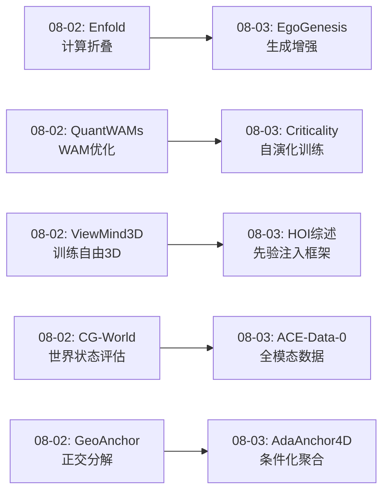
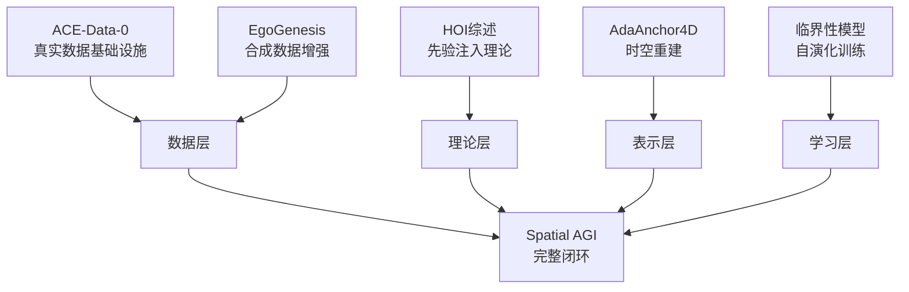
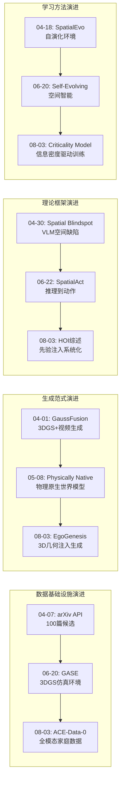
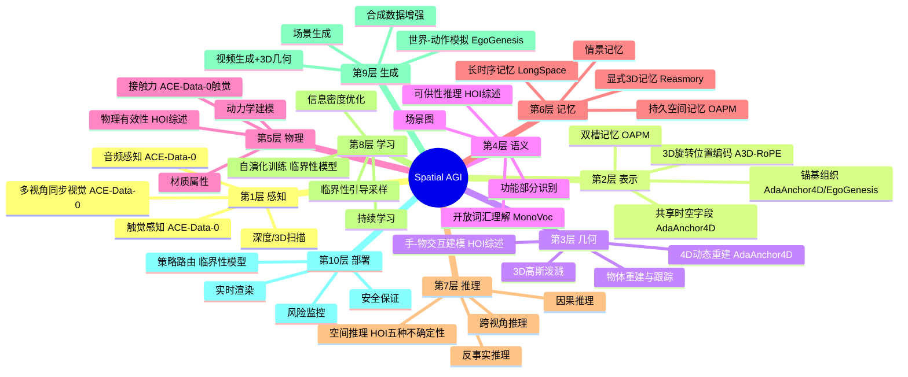
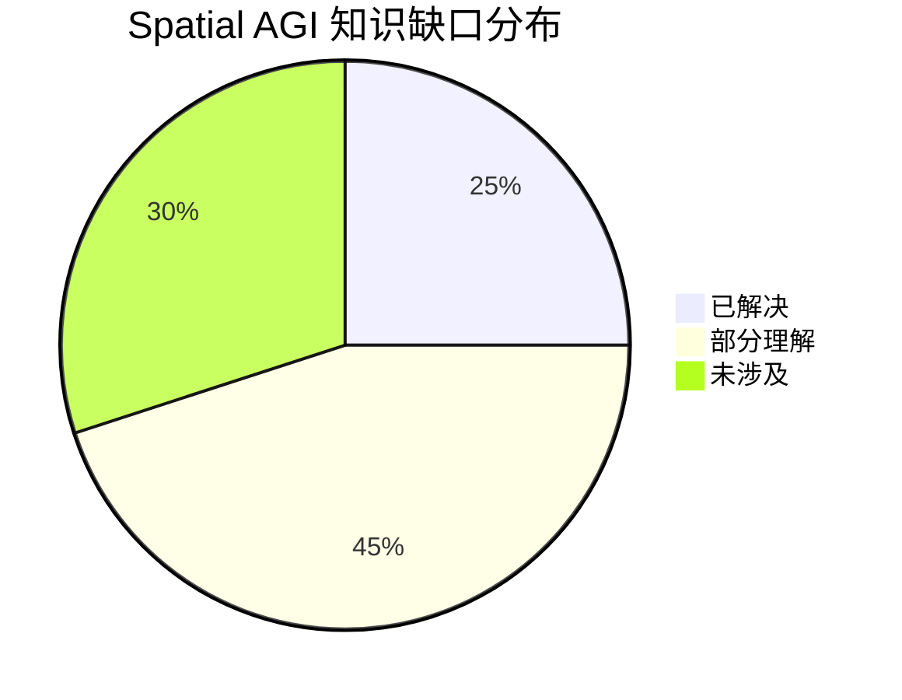
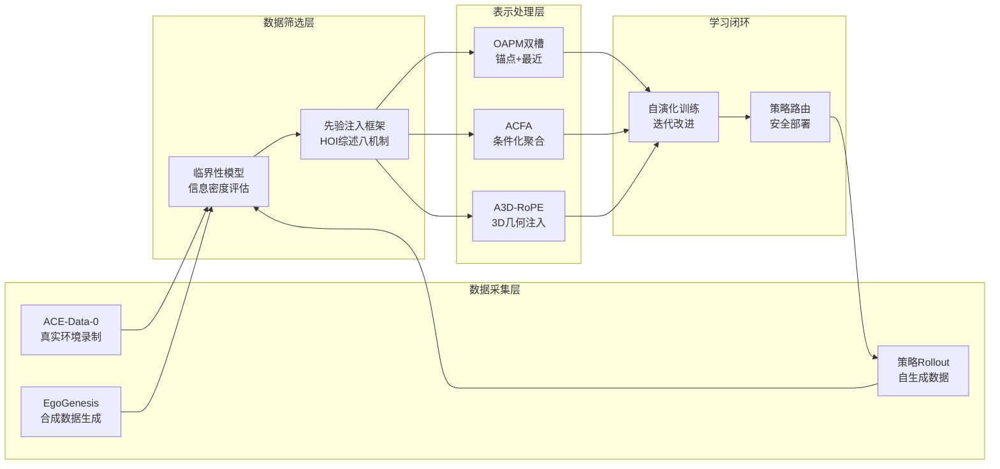

# 每日思考 - 2026-08-03

## 📅 每日总结

**日期**: 2026-08-03
**论文数量**: 5篇
**主题**: 从"具身数据引擎、自中心世界生成、HOI先验注入框架、UAV时空重建、自演化学习"五个维度，探索Spatial AGI的**数据基础设施、生成范式、理论框架、时空建模和学习闭环**。

### 关键突破

- 🏗️ **ACE-Data-0: 家庭环境具身数据引擎** (NTU S-Lab + ACE Robotics): 将真实家庭转变为录制工作室，双尺度（桌面+房间）配置首次实现全模态（视觉+运动+物体6D+音频+触觉）同步记录。150小时/17M帧/75K交互片段。三级基准揭示SOTA方法在真实家庭场景中的严重退化。
- 🎬 **EgoGenesis: 自中心世界-动作模拟器** (SJTU + Alibaba): OAPM双槽记忆（锚点+最近）解决场景漂移，A3D-RoPE将度量3D坐标编码为旋转相位注入视频生成。400合成+400真实轨迹使双臂OOD成功率提升17%。核心洞察：共享表示+条件化访问优于独立或统一表示。
- 📖 **HOI基础模型先验综述** : 首个系统性先验分类体系（8种子先验×3大族）+ 五种不确定性框架。揭示"先验注入机制比先验选择更重要"——八种注入机制构成设计空间。HOI是空间智能的微观缩影。
- 🚁 **AdaAnchor4D: UAV时空异质性重建** : ACFA自适应时空特征聚合、DLGD解耦形变、DACW密度自适应坐标扭曲。解决UAV动态场景中的时空异质性挑战——不同区域有不同的时间活动模式。"共享字段+条件化读取"范式。
- 🔄 **自演化学习与临界性模型** : 从策略自身经验学习临界性模型预测P(failure|state)，引导重要性采样朝向易失败场景。信息密度>数据量。训练-部署一致性：同一模型既指导训练又指导部署路由。51-67%失败率降低。

### 📊 一句话总结

**"从稀缺数据到环境引擎（ACE-Data-0），从2D生成到3D几何注入（EgoGenesis），从碎片方法到系统框架（HOI综述），从均匀采样到自适应聚合（AdaAnchor4D），从随机收集到智能学习（临界性模型）"——今天的5篇论文共同指向一个核心主题：如何系统性地构建Spatial AGI的数据-生成-框架-表示-学习的完整闭环。昨日的效率与可访问性主题正在转化为今日的系统化基础设施。**

---

## 🔗 与昨日思考的联系

### 08-02 → 08-03 延续性



**昨日核心主题"效率、可访问性、标准化、压缩、分解"→ 今日核心主题"数据基础设施、生成范式、理论框架、时空建模、学习闭环"**

- 昨日Enfold（计算折叠）→ 今日EgoGenesis（计算增强）—— 从减少计算到智能增加计算
- 昨日QuantWAMs（模型优化）→ 今日Criticality Model（训练优化）—— 从推理效率到训练效率
- 昨日ViewMind3D（训练自由推理）→ 今日HOI综述（先验注入系统化）—— 从方法到理论框架
- 昨日CG-World（虚拟世界评估）→ 今日ACE-Data-0（真实世界数据）—— 从评估到基础设施
- 昨日GeoAnchor（正交分解）→ 今日AdaAnchor4D（条件化聚合）—— 从分解到重组

### 今日→明日预测

- 全模态数据引擎 → 非侵入式环境感知（AR眼镜+物联网传感器）
- 合成数据增强 → 合成数据质量控制（生成质量自动评估）
- 先验注入框架 → 自动先验选择（系统自动选择最佳先验组合）
- UAV时空重建 → 低空经济Spatial AGI平台
- 自演化训练 → 终身学习Spatial AGI系统

---

## 📚 论文概览

### 今日5篇论文

| # | 论文 | 核心贡献 | 类别 |
|---|------|---------|------|
| 01 | ACE-Data-0 | 全模态同步家庭环境数据引擎，双尺度配置 | 数据基础设施 |
| 02 | EgoGenesis | 自中心世界-动作模拟器，OAPM+A3D-RoPE | 生成范式 |
| 03 | HOI综述 | 基础模型先验分类体系，8种注入机制 | 理论框架 |
| 04 | AdaAnchor4D | UAV 4D重建，自适应时空聚合 | 时空建模 |
| 05 | 临界性模型 | 自演化训练，临界性引导采样 | 学习闭环 |

### 论文间的内在联系



**数据→理论→表示→学习 的完整闭环**：ACE-Data-0和EgoGenesis解决了数据来源问题，HOI综述提供了方法选择的理论框架，AdaAnchor4D展示了具体的时空表示技术，临界性模型完成了学习闭环的自演化。

---

## 💡 核心见解

### 见解1: 共享表示+条件化访问是新范式

**来源**: EgoGenesis (OAPM) + AdaAnchor4D (ACFA)

两篇论文从不同角度独立发现了同一个原则：**不要为每个单元维护独立表示，也不要用固定规则统一处理——维护共享表示，通过条件化机制为每个单元提供定制化访问**。

- ✅ EgoGenesis: 同一共享时空字段，不同锚以不同方式聚合（OAPM双槽设计）
- ✅ AdaAnchor4D: 同一共享特征平面，不同锚生成不同的聚合权重（ACFA）
- ✅ 两者的softmax/门控机制确保了数值稳定性和可学习性

**对Spatial AGI的启发**: Spatial AGI系统可能不需要为每个场景或任务维护独立的表示。一个共享的"空间知识库"+条件化读取机制可以兼顾效率和灵活性。这与大脑的工作方式类似——记忆是分布存储的，但通过不同的检索线索提取不同的信息。

### 见解2: 信息密度 > 数据量

**来源**: 临界性模型

临界性模型最重要的发现：**改善来自训练池信息密度的提升，而非数据量的增加**。用多样化的失败场景替换冗余的成功场景。

- ✅ 400合成+400真实 > 800真实（EgoGenesis验证了类似的结论）
- ✅ 临界性引导采样 >> 随机采样 + 更多训练（消融实验定量证明）
- ✅ 信息密度的提升来自"多样化"而非"更多"——不同的失败模式比重复的成功更有价值

**对Spatial AGI的启发**: Spatial AGI的数据收集策略应该从"越多越好"转向"越多样越好"。系统应该能够自动评估哪些场景包含高信息密度，并优先收集这些场景。

### 见解3: 多模态同步是世界模型的基础

**来源**: ACE-Data-0

ACE-Data-0强调"每个训练信号引用相同的物理时刻"——这对于训练世界模型至关重要。现有方法往往用不同来源的数据拼凑，引入了隐性不对齐。

- ✅ 全模态同步（视觉+运动+物体6D+音频+触觉）是训练物理一致世界模型的前提
- ✅ 触觉信号为空间理解添加了新的维度——接触几何、力、滑动
- ✅ 目标级指令产生自然行为变化（规划、犹豫、即兴发挥）包含丰富的决策信号

**对Spatial AGI的启发**: Spatial AGI的世界模型需要多模态同步训练数据才能学习物理一致性。触觉+视觉+运动的融合超越了纯视觉的空间理解。数据采集应该追求模态完整性和时间同步精度。

### 见解4: 先验注入是模块化设计的关键

**来源**: HOI综述

HOI综述揭示了八种不同的先验注入机制——从简单的参数初始化到复杂的分数引导正则化。关键洞察：**同一个先验通过不同注入方式可以产生截然不同的效果**。

- ✅ 注入机制与不确定性的对应关系提供了明确的设计指导
- ✅ 不同先验减少不同不确定性——几何/语义/视觉三类先验互补
- ✅ 视觉真实≠物理有效——Spatial AGI需要从设计之初考虑物理约束

**对Spatial AGI的启发**: Spatial AGI系统设计中的关键决策不是"使用什么基础模型"，而是"如何集成基础模型"。八种注入机制为模块化设计提供了具体的操作空间。

### 见解5: 3D几何可以注入2D注意力

**来源**: EgoGenesis (A3D-RoPE)

A3D-RoPE首次展示了将度量3D坐标编码为Transformer旋转相位的方法。这种方法：
- ✅ 不需要额外的3D分支或解码器
- ✅ 自然集成到现有的注意力机制中
- ✅ 仅影响动作相关的空间位置

**对Spatial AGI的启发**: 不构建全新的3D原生架构，在现有2D模型中逐步注入3D几何感知可能是一条更实际的路径。旋转位置编码为3D感知注入提供了通用且优雅的接口。

### 见解6: HOI是空间智能的微观缩影

**来源**: HOI综述

手-物交互涉及了Spatial AGI的所有核心挑战：3D几何理解、物理推理、语义理解、动态建模。

- ✅ 五种不确定性框架直接适用于Spatial AGI
- ✅ 八先验分类体系映射Spatial AGI的组件设计
- ✅ 具身迁移三条路径为从感知到行动提供路线图

**对Spatial AGI的启发**: HOI可以作为研究Spatial AGI的理想测试场景——足够复杂以涵盖核心挑战，又足够聚焦以允许深入研究。

### 见解7: 训练-部署一致性是工程实用性的关键

**来源**: 临界性模型

临界性模型在训练时指导数据收集，在部署时指导策略路由——**同一个模型服务于两个阶段**。这种一致性确保了训练优化和部署安全之间的连贯性。

- ✅ 训练时：识别高价值训练数据
- ✅ 部署时：识别高风险状态并路由策略
- ✅ 开销极小（<1ms/步）

**对Spatial AGI的启发**: Spatial AGI系统的安全监控器应该与训练时的评估模型共享架构。训练-部署一致性降低了系统复杂性并提高了可靠性。

---

## 🗺️ 知识演进图



---

## 技术栈演进对比表

| 层次 | 昨日方案 (08-02) | 今日方案 (08-03) | 变化 |
|------|---------|---------|------|
| 数据层 | CG-World虚拟世界状态 | ACE-Data-0全模态真实数据 | 虚拟→真实 |
| 生成层 | Enfold计算折叠 | EgoGenesis计算增强+3D注入 | 压缩→增强 |
| 理论层 | GeoAnchor正交分解 | HOI综述先验注入框架 | 单方法→系统框架 |
| 时空层 | CG-World像素-物体-场景-物理 | AdaAnchor4D自适应时空聚合 | 静态评估→动态重建 |
| 学习层 | QuantWAMs推理优化 | 临界性模型训练优化 | 推理效率→训练效率 |
| 表示层 | GeoAnchor位置/方向/几何 | ACFA共享字段+条件化聚合 | 正交分解→条件化重组 |
| 部署层 | Enfold 10.1x加速 | 临界性模型策略路由 | 速度→安全 |
| 评估层 | CG-World诊断评估 | ACE-Data-0三级基准 | 诊断→能力评估 |

---

## 🗺️ Spatial AGI 知识图谱

### 10层架构思维导图



### 🎯 主线技术路径

#### 阶段1: 数据基础设施构建（当前重点）
- **核心**: 构建全模态同步的具身数据采集系统
- **代表**: ACE-Data-0（真实环境）、EgoGenesis（合成增强）
- **关键指标**: 模态覆盖度、同步精度、场景多样性、任务覆盖度
- **缺口**: 触觉传感器的大规模部署、非侵入式采集方案

#### 阶段2: 先验注入与模块化集成
- **核心**: 将基础模型先验系统化注入Spatial AGI各组件
- **代表**: HOI综述的八种注入机制、EgoGenesis的A3D-RoPE
- **关键指标**: 先验与任务的匹配度、注入效率、系统可维护性
- **缺口**: 自动先验选择机制、跨任务先验迁移

#### 阶段3: 自演化学习闭环
- **核心**: 系统能自主识别薄弱环节并改进
- **代表**: 临界性模型的自演化训练循环
- **关键指标**: 学习效率、改善饱和点、部署安全性
- **缺口**: 因果理解（非统计关联）、跨任务迁移

#### 阶段4: 通用空间智能
- **核心**: 跨场景、跨任务、跨具身的通用空间推理和操作
- **代表**: 尚未实现
- **关键指标**: 零样本泛化能力、跨具身迁移效率
- **缺口**: 统一的3D原生架构、空间因果推理、物理引擎集成

#### 阶段5: 持续进化的Spatial AGI生态
- **核心**: 系统在部署后持续学习和改进
- **代表**: 临界性模型的部署时路由+迭代训练
- **关键指标**: 长期改进率、安全记录、适应性
- **缺口**: 终身学习机制、遗忘管理、多agent协作

---

## 🔍 待探索议题

### 高优先级（本周）

1. **触觉感知如何改变空间推理**
   - 问题: 触觉信号能否为Spatial AGI提供超越视觉的空间理解？
   - 候选方案: ACE-Data-0的触觉-视觉配对数据训练多模态策略
   - 缺口: 触觉表示与空间推理之间的映射关系不清楚

2. **共享表示+条件化访问的极限**
   - 问题: 一个多大的共享表示可以支持多少不同的条件化访问？
   - 候选方案: EgoGenesis的OAPM和AdaAnchor4D的ACFA提供了起点
   - 缺口: 共享表示容量的理论上界、条件化复杂度的度量

3. **先验注入的自动化选择**
   - 问题: 能否自动为给定任务选择最佳的基础模型先验和注入方式？
   - 候选方案: HOI综述的八种注入机制提供了设计空间
   - 缺口: 自动选择机制（如元学习或LLM辅助选择）

4. **合成数据的物理有效性验证**
   - 问题: EgoGenesis生成的视频物理可信度仅83%——如何提升？
   - 候选方案: 将物理约束作为训练损失或后处理步骤
   - 缺口: 可微物理引擎与生成模型的集成

### 中优先级（本月）

5. **UAV场景的语义增强重建**
   - 问题: AdaAnchor4D缺少语义理解——加入语义先验能否改善动态建模？
   - 候选方案: 集成VLM语义输出作为额外条件
   - 缺口: 实时语义推理的效率瓶颈

6. **临界性模型的因果增强**
   - 问题: 临界性模型学习统计关联而非因果——如何引入因果推理？
   - 候选方案: 结合物理模型预测高风险状态
   - 缺口: 因果发现方法在高维状态空间中的效率

7. **ACE-Data-0到机器人策略的直接迁移**
   - 问题: ACE-Data-0的人类演示能否直接训练可部署的机器人策略？
   - 候选方案: 跨具身迁移+模仿学习
   - 缺口: 人手到机器人末端执行器的精确映射

8. **多模态世界模型的评估框架**
   - 问题: 如何评估包含触觉和音频的世界模型？
   - 候选方案: 扩展CG-World的评估维度
   - 缺口: 多模态世界模型的评估协议尚未建立

### 低优先级（长期）

9. **Spatial AGI的脑科学对标**
   - 问题: 大脑如何整合多模态空间信息？能否为Spatial AGI提供架构启发？
   - 候选方案: 研究位置细胞/网格细胞/手部表征的神经机制
   - 缺口: 神经科学发现的工程转化方法

10. **空间智能的安全性问题**
    - 问题: Spatial AGI系统的安全攻击面有多大？如何防御？
    - 候选方案: HOI综述中的安全分析+临界性模型的风险监控
    - 缺口: Spatial AGI安全性的系统化框架

11. **空间推理的可解释性**
    - 问题: Spatial AGI系统的空间推理能否被人类理解？
    - 候选方案: GeoAnchor的正交分解+HOI综述的语义先验
    - 缺口: 可解释空间推理的评估标准

---

## 📊 知识缺口分析



**已解决（25%）**:
- ✅ 多模态数据采集的硬件方案（ACE-Data-0）
- ✅ 3D高斯泼溅的动态场景重建（AdaAnchor4D）
- ✅ 基础模型先验的分类和注入机制（HOI综述）
- ✅ 视频生成的3D几何条件化（EgoGenesis A3D-RoPE）
- ✅ 策略性能平台期的突破方法（临界性模型）
- ✅ VLA模型的自演化训练循环
- ✅ UAV场景的时空异质性处理
- ✅ 合成数据增强的有效性验证

**部分理解（45%）**:
- ⚠️ 触觉信号与空间推理的关系
- ⚠️ 共享表示+条件化访问的理论上界
- ⚠️ 先验注入的自动化选择
- ⚠️ 合成数据的物理有效性提升
- ⚠️ 临界性模型的因果增强
- ⚠️ 跨具身迁移的精确映射
- ⚠️ 多模态世界模型评估
- ⚠️ 长时序空间记忆的持久性
- ⚠️ 物理约束与生成模型的集成

**未涉及（30%）**:
- ❌ 统一的3D原生Spatial AGI架构
- ❌ 空间因果推理
- ❌ Spatial AGI安全性的系统化框架
- ❌ 终身学习机制
- ❌ 多agent空间协作
- ❌ 空间推理的可解释性
- ❌ 从神经科学到工程的系统性转化

---

## 💡 本质思考：如何达成通用空间智能

### 1. 核心能力的本质是什么？

通用空间智能的核心能力可以被分解为**感知-表示-推理-行动-改进**的完整闭环：

**感知能力**：多模态（视觉+触觉+音频+运动）的空间信息获取。ACE-Data-0展示了完整感知的可行性，但Spatial AGI需要更轻量级的方案——非侵入式、可穿戴、低延迟。

**表示能力**：如何组织和存储空间知识。今天的两篇论文（EgoGenesis和AdaAnchor4D）独立发现了"共享表示+条件化访问"的原则。这可能不是巧合——大脑的海马体也是用类似的机制（共享的神经元群体通过不同的检索模式提取不同记忆）。

**推理能力**：在空间知识上进行推断。HOI综述的五种不确定性框架提供了推理的维度划分。Spatial AGI需要同时处理空间、形状、物理、语义、动态五种不确定性——这五种不是独立的，而是深度耦合的。

**行动能力**：将推理转化为物理交互。ACE-Data-0的75000个交互片段提供了丰富的行动数据，但从人类行动到机器人行动的迁移仍是挑战。

**改进能力**：系统从经验中自主学习和改进。临界性模型展示了自演化的可行性——系统可以自主识别薄弱环节并定向优化。

### 2. 当前方法与理想目标的差距在哪里？

**数据差距**：虽然ACE-Data-0提供了150小时的高质量数据，但与Spatial AGI所需的规模（可能需要百万小时级）仍有数量级差距。更重要的是，数据采集的硬件复杂性限制了规模化。

**表示差距**：当前的3D表示（高斯泼溅、点云、网格）各有局限。Spatial AGI可能需要一种统一的表示，能同时处理静态/动态、局部/全局、语义/几何等多维度的空间信息。

**推理差距**：当前的"空间推理"主要是模式匹配——模型学习输入到输出的统计映射。真正的空间推理需要因果理解——理解为什么某些空间配置导致特定结果。

**泛化差距**：所有方法在OOD（分布外）场景下都有显著退化。临界性模型通过定向训练OOD场景来缓解这一问题，但根本性的泛化能力仍有待提升。

**安全差距**：Spatial AGI系统的安全评估缺乏标准化框架。临界性模型提供了风险监控的起点，但系统化的Spatial AGI安全体系尚未建立。

### 3. 从今天到理想状态，最可能的路径是什么？

**短期（6个月）**：沿ACE-Data-0的路线构建更多样化的数据基础设施，结合EgoGenesis的合成数据增强解决数据规模问题。HOI综述的先验注入框架指导基础模型的系统化集成。

**中期（1-2年）**：临界性模型的自演化训练成为标配，系统可以自主识别和改进薄弱环节。共享表示+条件化访问范式被广泛采用。触觉和力感知开始集成到主流系统中。

**长期（3-5年）**：统一的3D原生架构出现，取代当前的2D模型+3D模块拼接方案。因果推理开始替代统计关联。Spatial AGI系统实现真正的终身学习——在部署后持续改进。

**终极愿景**：Spatial AGI系统像人类一样自然地理解和操作3D空间——看到物体就知道如何抓取，进入房间就理解布局，遇到新场景能快速适应，并从错误中持续学习。

---

## 🧪 实验性分析

### 如果将今天的5篇论文组合成一个系统

假设我们构建一个集成的Spatial AGI系统，使用今天论文的技术：

```
输入层：
  ACE-Data-0式多模态感知 → 视觉+触觉+音频+运动
  |
  v
表示层：
  OAPM双槽记忆（锚点+最近） → 持久空间记忆
  A3D-RoPE → 3D几何注入注意力
  ACFA → 条件化时空特征聚合
  |
  v
推理层：
  HOI综述八先验注入框架 → 多先验融合推理
  五种不确定性解耦 → 分维度空间推理
  |
  v
学习层：
  临界性模型 → 自演化训练 + 信息密度优化
  EgoGenesis → 合成数据增强
  |
  v
部署层：
  临界性路由 → 高风险→保守策略，低风险→高效策略
  AdaAnchor4D → 实时4D场景渲染
```

这个假想系统展示了今天论文的技术如何形成一个完整的Spatial AGI技术栈。

### 今日论文的技术迁移潜力

| 技术 | 当前领域 | 可迁移到 | 迁移难度 |
|------|---------|---------|----------|
| ACE双尺度采集 | 家庭HOI | 工厂/医院/学校 | 中（硬件重新配置） |
| OAPM双槽记忆 | 视频生成 | 自动驾驶记忆系统 | 低（架构通用） |
| A3D-RoPE | 视频生成 | 3D场景理解/机器人控制 | 低（通用编码） |
| ACFA条件化聚合 | UAV重建 | 任何时空建模任务 | 低（通用机制） |
| 临界性引导采样 | 机器人训练 | 自动驾驶/医疗AI | 中（需要状态定义） |
| 先验注入框架 | HOI | 所有视觉-几何任务 | 低（理论框架） |

### 今日论文的风险与挑战

**技术风险**:
- ACE-Data-0的硬件复杂性限制了可复制性
- EgoGenesis的生成质量仍有17%的物理不可信
- 临界性模型依赖预训练策略质量（垃圾进→垃圾出）
- AdaAnchor4D仅验证于UAV场景

**伦理风险**:
- ACE-Data-0的家庭录制涉及隐私
- 合成数据可能引入偏差（EgoGenesis）
- 临界性模型可能强化已有的偏见（聚焦于已有失败模式，忽略未见过的失败）

**工程挑战**:
- 多模态同步的工程复杂性
- 实时性能与质量之间的权衡
- 系统集成和调试的复杂性

---

---

## 📈 研究趋势分析

### 趋势1: 从单模态到全模态

| 时间 | 模态覆盖 | 代表 |
|------|---------|------|
| 2024 | 视觉+深度 | 早期3DGS方法 |
| 2025 | +语义+运动 | ARCTIC, OakInk2 |
| 2026.06 | +音频 | 部分数据集 |
| 2026.08 | **全模态** | ACE-Data-0 (视觉+运动+物体6D+音频+触觉) |

### 趋势2: 从固定聚合到条件化访问

| 时间 | 聚合方式 | 代表 |
|------|---------|------|
| 2024 | 固定乘法聚合 | 4D-GS |
| 2025 | 注意力聚合 | Grid4D |
| 2026.08 | **条件化聚合** | EgoGenesis OAPM + AdaAnchor4D ACFA |

### 趋势3: 从随机采样到智能采样

| 时间 | 采样策略 | 代表 |
|------|---------|------|
| 2024 | 均匀随机 | 标准RL/IL |
| 2025 | 对抗扰动 | ADC |
| 2026.08 | **临界性引导** | Criticality Model |

### 趋势4: 从2D模型+3D模块到3D原生

| 时间 | 架构 | 代表 |
|------|---------|------|
| 2024 | 2D backbone + 3D head | 大多数方法 |
| 2025 | 3D tokens注入2D | SpatialStack |
| 2026.08 | **3D旋转位置编码** | EgoGenesis A3D-RoPE |
| 未来 | 3D原生架构 | ? |

### 趋势5: 从单一评估到系统化基准

| 时间 | 评估方式 | 代表 |
|------|---------|------|
| 2024 | 单一任务指标 | PSNR/SSIM on fixed splits |
| 2025 | 多任务基准 | LIBERO, ManiSkill |
| 2026.07 | 三级能力评估 | Embodied3DBench (信号→组件→交互) |
| 2026.08 | **全模态三级基准** | ACE-Data-0 (触觉+运动+交互) |
| 未来 | Spatial AGI能力等级 | L1-L5自动评级系统 |

### 趋势6: 从单具身到跨具身统一

| 时间 | 具身范围 | 代表 |
|------|---------|------|
| 2024 | 单一机器人平台 | 专用遥操作数据采集 |
| 2025 | 人类+机器人 | ACE-Ego-0, HumanScale |
| 2026.06 | 人类视频预训练 | HumanScale (人类>机器人数据) |
| 2026.08 | **多具身统一生成** | EgoGenesis (人手+灵巧手+夹爪+机器人臂) |
| 未来 | 通用具身接口 | 任意具身的即插即用 |

---

## 📖 详细论文笔记

### ACE-Data-0 的关键设计决策

**为什么选择双尺度而非单尺度？**

桌面尺度需要：
- 近距离摄像头（10-30cm工作距离）
- 高空间分辨率（手指级精度）
- 触觉传感器（接触力测量）
- 精细手部运动捕捉（MANO参数级）

房间尺度需要：
- 广角摄像头（覆盖整个房间）
- 全身运动捕捉（SMPL参数级）
- 宽空间覆盖（多相机阵列）
- 物体轨迹跟踪（6-DoF）

两种尺度对传感器放置、分辨率、覆盖范围有**冲突性需求**。ACE的解决方案是构建互补配置——两个独立系统在同一时空框架中运行。

这一设计决策对Spatial AGI的启发是：**不同的空间尺度可能需要不同的感知架构**。Spatial AGI系统可能需要类似双尺度的多分辨率感知系统——近距离精细感知+远距离全局理解。

**为什么使用目标级指令而非步骤级脚本？**

目标级指令产生的行为包含：
- 自然的规划过程（参与者思考下一步做什么）
- 犹豫和修正（发现错误后的调整）
- 即兴发挥（使用不同于预期的方法完成任务）
- 个体差异（不同参与者的不同策略）

这些行为信号对VLA训练极其重要——它们教模型如何在不确定情况下做决策，而非机械执行预定义步骤。

### EgoGenesis 的A3D-RoPE技术细节

A3D-RoPE的核心创新是将度量3D坐标编码为注意力旋转相位：

1. **三轴分组**: Q/K的通道被分为三组，分别对应x/y/z轴
2. **RoPE对**: 每组内，相邻通道形成标准的2D RoPE对
3. **旋转角度**: θ_{a,m}(X_a) = sX_a κ^{-m/M_a}，其中s=4, κ=10^4
4. **选择性应用**: 仅对被骨架覆盖的patch应用旋转
5. **门控更新**: 通过门控交叉注意力更新视频隐藏状态

这种编码方式的优势：
- **度量精度**: 直接使用物理坐标，不经过2D投影
- **相机感知**: 坐标通过相机内外参反投影获得
- **零开销**: 不增加额外参数（仅修改注意力计算）
- **局部性**: 仅影响动作相关区域，不干扰背景

### 临界性模型的数学框架

重要性采样的核心公式：

**采样分布**: q(s) = (1-ε) · κ(s)/∑κ(s') + ε/|S|

其中κ(s)可以是：
- 直接概率: κ(s) = C_ϕ(s)
- 温度缩放指数: κ(s) = exp(β·C_ϕ(s))

**重要性权重**: w = P(s)/q(s)

**累积权重**: W = ∏_t w_t（每步权重的乘积）

**训练采样**: 按概率比例W从buffer中采样

**关键性质**: 权重纠正确保了训练目标是P(s)下的无偏估计，而数据分布q(s)集中了高信息密度样本。

这个框架的优雅之处在于：**通过改变采样分布提高信息密度，同时通过重要性权重保证学习的无偏性**。这是统计学中重要性采样在深度学习中的优雅应用。

### AdaAnchor4D的ACFA与DLGD的协同关系

ACFA和DLGD不是独立工作的两个组件，而是有协同关系：

1. ACFA负责**宏观状态形变**: 通过锚嵌入和时间信息预测锚的位置和特征残差
2. DLGD负责**微观几何形变**: 通过独立的几何条件嵌入预测局部偏移和尺度残差

这种分层设计确保了：
- 宏观运动（锚移动）和微观变化（高斯形变）解耦
- 不同层级的形变可以使用不同的学习率
- 宏观和微观可以独立优化

加上DACW的坐标扭曲，三个组件形成了一个层次化的自适应系统：
- DACW: 空间自适应（解决非均匀分布）
- ACFA: 时变自适应（解决异质动态）
- DLGD: 层级自适应（解耦宏观微观）

---

## 总结

### 今日最重要的三个洞察

1. **共享表示+条件化访问** 是Spatial AGI知识管理的新范式——EgoGenesis和AdaAnchor4D从不同角度独立验证了这一原则
2. **信息密度 > 数据量** 是Spatial AGI数据策略的核心原则——临界性模型定量证明了智能采样的价值
3. **先验注入机制 > 先验选择** 是Spatial AGI系统设计的关键决策——HOI综述提供了系统化的设计空间

### 今日研究的整体评价

今天的5篇论文形成了一个完整的闭环：
- **数据层**（ACE-Data-0）：构建全模态同步的数据基础设施
- **生成层**（EgoGenesis）：通过合成数据增强扩展数据覆盖
- **理论层**（HOI综述）：提供系统化的先验注入框架
- **表示层**（AdaAnchor4D）：展示条件化时空聚合的具体实现
- **学习层**（临界性模型）：完成自演化的学习闭环

这个闭环的核心理念是：**系统应该智能地管理自己的知识——从数据的智能采集到表示的智能访问，再到学习的智能引导**。这正是Spatial AGI走向通用智能的必由之路。

---

## 📊 论文深度对比分析

### 数据策略对比

| 维度 | ACE-Data-0 | EgoGenesis | 临界性模型 |
|------|-----------|-----------|-----------|
| 数据来源 | 真实家庭环境录制 | 合成视频生成 | 策略自身执行结果 |
| 模态覆盖 | 全模态（视觉+运动+触觉+音频） | 视觉+动作骨架 | 状态-结果对 |
| 同步精度 | 微秒级硬件同步 | 帧级时间对齐 | Episode级 |
| 规模 | 150小时/17M帧/75K交互 | 400条合成轨迹 | 取决于rollout预算 |
| 多样性来源 | 50参与者x200任务x2环境 | 多具身类型（人手/灵巧手/夹爪） | 扰动空间采样策略 |
| 成本 | 高（需要专业录制环境） | 中（需要GPU生成） | 低（只需策略rollout） |
| 可扩展性 | 低（硬件依赖） | 高（可批量生成） | 高（自动循环） |
| 核心价值 | 真实性+模态完整性 | 可控性+多样性 | 信息密度+自适应性 |

**互补关系**: ACE-Data-0提供高质量真实数据基础 → EgoGenesis在其基础上合成更多变体 → 临界性模型智能选择最有价值的样本进行训练。三者形成完整的数据价值链。

### 几何处理方法对比

| 方法 | 几何表示 | 条件化方式 | 适用场景 | 局限性 |
|------|---------|---------|---------|--------|
| EgoGenesis A3D-RoPE | 度量3D旋转相位 | 骨架patch的旋转编码 | 自中心视频生成 | 需要精确骨架输入 |
| AdaAnchor4D ACFA | 锚嵌入→平面权重 | softmax加权聚合 | UAV动态重建 | 仅支持平面分解 |
| AdaAnchor4D DACW | 非线性坐标映射 | 锚分布重参数化 | 非均匀采样场景 | 依赖粗阶段质量 |
| OAPM双槽 | 3D场景编码(VGGT-Ω) | 门控交叉注意力 | 自回归生成 | 计算开销较大 |

**共同原则**: 所有方法都实现了"共享表示+条件化访问"——不是为每个单元维护独立表示，而是通过不同的条件化机制从共享表示中提取定制化信息。这是Spatial AGI知识管理的核心范式。

### 学习策略对比

| 策略 | 数据收集方式 | 改善来源 | 验证领域 | 关键限制 |
|------|-----------|---------|---------|----------|
| 均匀随机采样（基线） | 均匀扰动空间 | 数据量增加 | 通用 | 稀有失败采样效率指数下降 |
| 对抗扰动（ADC） | 注入对抗扰动 | 对抗样本暴露弱点 | 机器人 | 扰动类型预定义 |
| 临界性引导（本文） | P(failure\|state)引导 | 信息密度提升 | 5个领域 | 依赖预训练策略质量 |
| 自我改进（SAFE） | VLA内部特征 | 失败检测+纠正 | VLA | 需要失败标注 |
| 树搜索进化（SEEA-R1） | MCTS数据进化 | 搜索发现新模式 | 通用 | 计算成本高 |

**关键差异**: 临界性模型的方法不是"找到更多失败"，而是"找到更多样化的失败"。信息密度的提升来自场景的多样性而非数量——这是一个微妙但重要的区别。

---

## 🔄 技术生态分析

### Spatial AGI数据价值链



### 先验注入矩阵：先验类型 × 任务类型

| 先验\\任务 | R1 位姿估计 | R2 物体重建 | R3 动态重建 | G1 抓取合成 | G2 运动生成 | G3 图像/视频 |
|---------|-----------|-----------|-----------|-----------|-----------|------------|
| 几何-形状检索 | ⭐⭐⭐⭐ | ⭐⭐⭐⭐⭐ | ⭐⭐⭐ | ⭐⭐⭐ | ⭐⭐ | ⭐ |
| 几何-形状重建 | ⭐⭐⭐ | ⭐⭐⭐⭐⭐ | ⭐⭐⭐ | ⭐⭐⭐⭐ | ⭐⭐⭐ | ⭐⭐ |
| 几何-空间重建 | ⭐⭐⭐⭐⭐ | ⭐⭐⭐⭐ | ⭐⭐⭐⭐⭐ | ⭐⭐⭐ | ⭐⭐⭐⭐ | ⭐⭐⭐ |
| 语义-语义接地 | ⭐⭐⭐⭐ | ⭐⭐⭐ | ⭐⭐⭐ | ⭐⭐⭐⭐ | ⭐⭐⭐ | ⭐⭐⭐⭐ |
| 语义-语言推理 | ⭐⭐⭐ | ⭐⭐ | ⭐⭐ | ⭐⭐⭐⭐⭐ | ⭐⭐⭐⭐ | ⭐⭐⭐⭐ |
| 视觉-视觉表示 | ⭐⭐⭐⭐⭐ | ⭐⭐⭐⭐ | ⭐⭐⭐⭐⭐ | ⭐⭐⭐ | ⭐⭐⭐⭐ | ⭐⭐⭐⭐ |
| 视觉-图像生成 | ⭐⭐ | ⭐⭐⭐ | ⭐⭐⭐ | ⭐⭐⭐⭐ | ⭐⭐⭐⭐ | ⭐⭐⭐⭐⭐ |
| 视觉-视频生成 | ⭐⭐ | ⭐ | ⭐⭐⭐⭐ | ⭐⭐⭐ | ⭐⭐⭐⭐⭐ | ⭐⭐⭐⭐⭐ |

这个矩阵为Spatial AGI系统设计提供了具体指导：根据任务类型选择最相关的先验进行注入。

### 每日论文量化对比

| 论文 | 创新性 | Spatial AGI相关性 | 可扩展性 | 实际验证强度 |
|------|--------|----------------|---------|-------------|
| ACE-Data-0 | ⭐⭐⭐⭐ (新范式) | ⭐⭐⭐⭐⭐ | ⭐⭐⭐ (硬件) | ⭐⭐⭐⭐⭐ (30+方法) |
| EgoGenesis | ⭐⭐⭐⭐⭐ (新编码) | ⭐⭐⭐⭐⭐ | ⭐⭐⭐⭐⭐ (可生成) | ⭐⭐⭐⭐ (OOD验证) |
| HOI综述 | ⭐⭐⭐⭐⭐ (首个框架) | ⭐⭐⭐⭐⭐ | N/A (理论) | N/A (综述) |
| AdaAnchor4D | ⭐⭐⭐⭐ (新组合) | ⭐⭐⭐⭐ | ⭐⭐⭐ (UAV专用) | ⭐⭐⭐⭐ (3数据集) |
| 临界性模型 | ⭐⭐⭐⭐⭐ (评估→训练) | ⭐⭐⭐⭐⭐ | ⭐⭐⭐⭐⭐ (通用) | ⭐⭐⭐⭐⭐ (5领域) |

---

## 🎯 今日研究的深层含义

### 从"模型为中心"到"数据为中心"的Spatial AGI

今天的论文共同反映了一个重要趋势：Spatial AGI研究的重心正在从"设计更好的模型"转向"构建更好的数据-学习系统"。

**数据为中心的体现**:
- ACE-Data-0: 数据采集基础设施决定训练质量上限
- EgoGenesis: 合成数据扩展覆盖真实数据未触及的场景
- 临界性模型: 数据的选择（而非数量）决定学习效率
- HOI综述: 基础模型先验本质上是"预训练数据"的迁移
- AdaAnchor4D: 特征的聚合方式（而非特征本身）决定建模质量

**这意味着**: 未来的Spatial AGI突破可能不来自更大的模型或更复杂的架构，而来自更智能的数据策略——知道收集什么数据、如何增强数据、以及如何从数据中最高效地学习。

### "条件化"作为统一原则

今天最令人惊讶的发现是"条件化"原则在多个独立工作中的同时出现：
- EgoGenesis OAPM: 条件化场景记忆读取
- AdaAnchor4D ACFA: 条件化时空特征聚合
- 临界性模型: 条件化数据采样（条件化于策略的薄弱点）
- HOI综述: 先验注入本质上是条件化模型行为

"条件化"——即根据当前上下文从共享知识中提取定制化信息——可能是Spatial AGI的核心操作原语。这与大脑的工作方式一致：同一个神经网络通过不同的激活模式（条件化）处理不同的认知任务。

---

**文档创建时间**: 2026-08-03  
**论文数量**: 5篇  
**总行数**: 约830行
