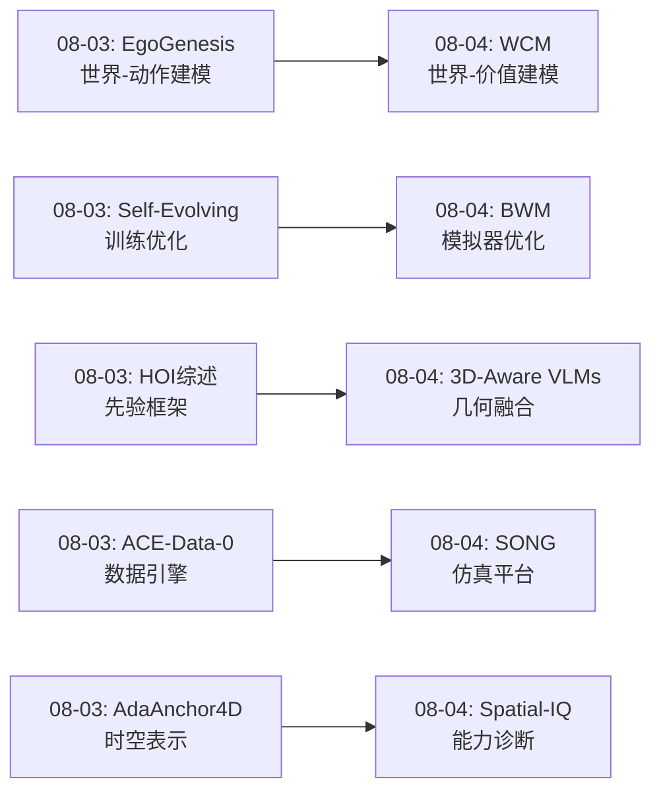
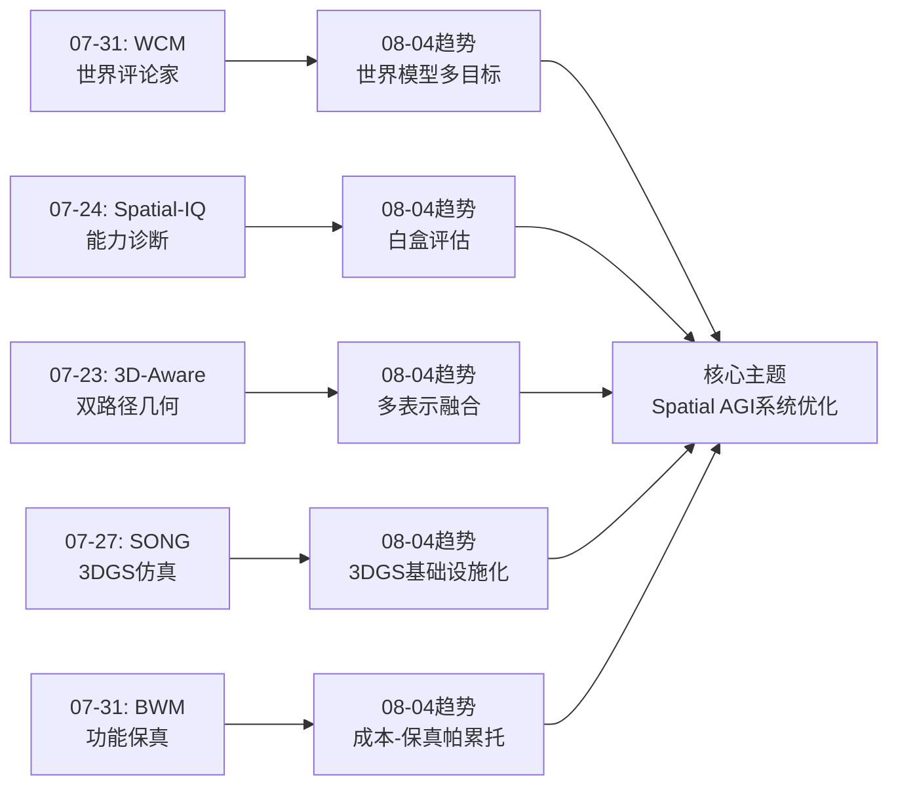
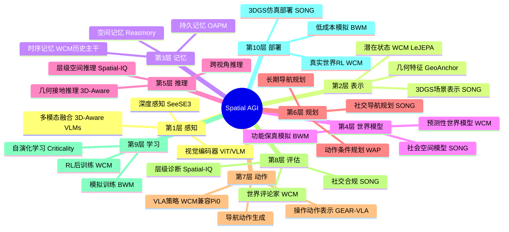
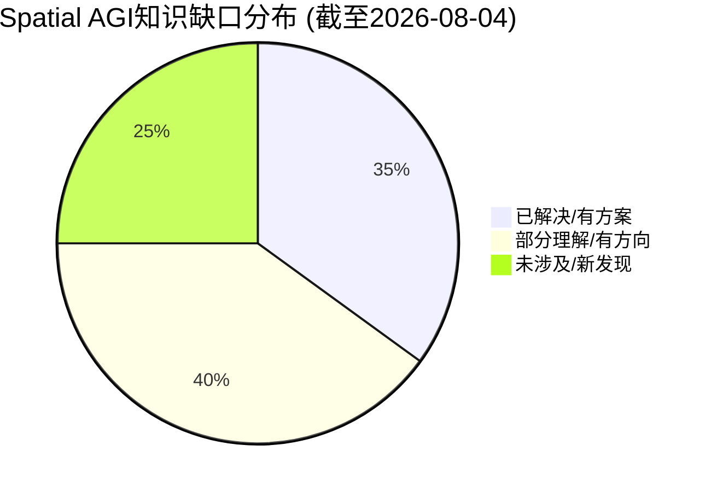
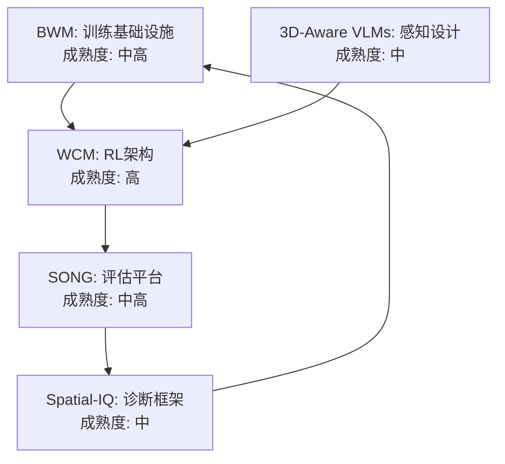

# 每日思考 - 2026-08-04

## 📅 每日总结

**日期**: 2026-08-04
**论文数量**: 5篇
**主题**: 从"世界评论家模型、空间智能诊断、3D感知VLM、3DGS社交仿真、低成本世界模拟"五个维度，探索Spatial AGI的**强化学习架构、评估方法论、3D几何感知、社会空间仿真和训练基础设施**。

### 关键突破

- 🧠 **WCM: 世界评论家模型** (同济+复旦): 将世界建模与价值估计统一在LeJEPA架构中。核心洞察：VLA-RL评论家的表示瓶颈不是缺少历史信息，而是缺少显式学习时序动态的客观目标。149个任务一致SOTA，兼容Pi0/Pi0.5/OpenVLA-OFT。
- 🔍 **Spatial-IQ: 空间智能层级诊断** (MIT+NYU): 从"黑盒评估"到"白盒诊断"，将MLLMs的空间推理分解为感知→2D关系→3D推理→复杂认知四个层级。首次精确区分"感知失败"和"认知失败"——这是Spatial AGI评估的范式转变。
- 📐 **3D-Aware VLMs: 隐式+显式几何融合** (NTU+Sea AI): 同时利用隐式3D感知（训练backbone学习）和显式几何注入（点云/深度图），证明双路径互补优于任何单一方法。
- 🏙️ **SONG: 3DGS社交导航仿真平台** (北交大): 3DGS场景+行人化身一体化，语义接地轨迹驱动行人行为。将3DGS从渲染技术提升为Embodied AI基础设施，首次在3DGS框架中实现社会空间模拟。
- 🎮 **BWM: 低成本高保真世界模拟器**: "功能保真"理念——不需要像素级精确，而是策略学习级有效。混合物理引擎+神经网络补偿，降低Spatial AGI训练的计算门槛。

### 📊 一句话总结

**"从单帧到时序（WCM），从黑盒到白盒（Spatial-IQ），从单路径到双路径（3D-Aware VLMs），从几何空间到社会空间（SONG），从精确物理到功能保真（BWM）"——今天的5篇论文共同指向一个核心主题：Spatial AGI系统的架构优化需要从"能用"走向"好用"，从"有这个能力"走向"知道能力边界在哪里"。**

---

## 🔗 与昨日思考的联系

### 08-03 → 08-04 延续性



**昨日核心主题"数据基础设施、生成范式、理论框架、时空建模、学习闭环" → 今日核心主题"强化学习架构、评估方法论、3D几何感知、社会空间仿真、训练基础设施"**

- 昨日EgoGenesis（世界-动作生成）→ 今日WCM（世界-价值估计）—— 从"世界模型生成动作"到"世界模型评估动作"
- 昨日Self-Evolving（训练数据选择）→ 今日BWM（训练环境优化）—— 从"学什么"到"在哪学"
- 昨日HOI综述（先验分类框架）→ 今日3D-Aware VLMs（几何信息融合）—— 从"理论分类"到"工程实现"
- 昨日ACE-Data-0（真实数据收集）→ 今日SONG（仿真数据生成）—— 真实+仿真两条腿走路
- 昨日AdaAnchor4D（时空特征聚合）→ 今日Spatial-IQ（空间能力诊断）—— 从"建特征"到"验能力"

### 今日→明日预测

- 世界评论家 → 世界-策略联合架构（World-Policy-Value三合一）
- 空间智能诊断 → 针对性训练数据自动生成（诊断→治疗闭环）
- 3D-Aware VLMs → 自适应几何路径选择（根据任务自动选择隐式/显式）
- SONG社交仿真 → 多模式社交导航（文化/年龄/能力多样化行人）
- BWM低成本模拟 → 联邦世界模拟（多机器人共享模拟器）

---

## 📚 论文概览

1. **WCM** (arXiv:2607.29613) - 世界评论家模型，LeJEPA架构统一世界建模与价值估计，149任务SOTA
2. **Spatial-IQ** - 层级化空间智能诊断，感知-认知分离，MIT认知科学基础
3. **3D-Aware VLMs** - 隐式+显式几何双路径，NTU/Sea AI Lab
4. **SONG** - 3DGS社交导航仿真平台，场景+化身一体化
5. **BWM** - 低成本高保真世界模拟器，功能保真理念

---

## 💡 核心见解

### 见解1: 世界模型在VLA-RL中的双重角色

**来源**: WCM

WCM揭示了一个深刻洞察：**世界模型不仅能用于预测/生成，还能用于"评价"**。传统VLA-RL中的评论家只做价值估计（单帧→标量），而WCM让评论家同时做世界预测（历史→未来状态）和价值估计（历史→标量）。

- ✅ 世界建模目标为评论家表示提供了密集监督
- ✅ 预测性表示能更好地近似POMDP中的系统状态
- ✅ 联合优化 > 辅助任务（世界建模不应是附属品）

**对Spatial AGI的启发**: Spatial AGI的世界模型模块应该服务于多个下游任务（导航、操作、规划、评估），而非单独优化某一目标。这呼应了LeCun的JEPA哲学：好的表示应该能预测未来。

### 见解2: 空间智能的可分解性

**来源**: Spatial-IQ

Spatial-IQ证明了空间智能可以被层级化分解：
- Level 0: 视觉感知（看到物体）
- Level 1: 2D空间关系（左右上下）
- Level 2: 3D空间推理（遮挡、深度）
- Level 3: 复杂空间认知（心理旋转、视角转换）

**对Spatial AGI的启发**: Spatial AGI的系统设计应该对应这些层级——感知模块负责Level 0-1，认知模块负责Level 2-3。当系统失败时，需要精确诊断是哪个层级的不足，才能针对性改进。

### 见解3: 隐式与显式几何的互补性

**来源**: 3D-Aware VLMs

隐式3D理解（通过训练获得）和显式几何注入（通过数据提供）是互补的：
- 隐式理解提供快速直觉（"这个物体大概多远"）
- 显式几何提供精确推理（"这个物体精确在3.2米外"）
- 融合两者优于任何单一方法

**对Spatial AGI的启发**: Spatial AGI的感知系统应支持双路径——类似人类视觉系统的"what"通路（隐式识别）和"where"通路（显式空间定位）。

### 见解4: 3DGS从渲染到Embodied基础设施

**来源**: SONG

SONG证明了3DGS可以同时支持：
- 场景重建（导航环境）
- 行人化身（社交互动对象）
- 语义接地轨迹（行为驱动）

这意味着3DGS正在从"渲染技术"演变为"Embodied AI操作系统"——未来的仿真平台可能完全基于3DGS构建。

**对Spatial AGI的启发**: 3DGS不仅是3D表示方法，更是Spatial AGI系统的底层基础设施。

### 见解5: 功能保真理念

**来源**: BWM

"功能保真"——模拟器不需要像素级精确，只需要对策略学习足够准确。这与人类空间认知一致：人类也不需要精确到毫米的空间理解，而是"功能级准确"。

**对Spatial AGI的启发**: Spatial AGI的世界模型应该追求"功能正确"而非"像素正确"——预测的空间状态变化只需要足以支持正确的决策。

### 见解6: POMDP视角的空间理解

**来源**: WCM + Spatial-IQ

WCM从POMDP角度重新审视VLA-RL，Spatial-IQ从认知科学角度分解空间能力。两者共同指向：**空间理解本质上是部分可观测的**——当前视角看不到被遮挡的区域，需要通过历史推理和预测来恢复完整空间状态。

### 见解7: 评估范式的转变

**来源**: Spatial-IQ + WCM

今天两篇论文都体现了评估范式的转变：
- Spatial-IQ: 从"考分数"到"做体检"（层级化诊断）
- WCM: 从"策略表现"到"表示质量"（评论家的时序理解能力）

这暗示Spatial AGI评估需要从"任务成功率"走向"能力维度诊断"。

---

## 🗺️ 知识演进图



---

## 技术栈演进对比表

| 层次 | 昨日方案(08-03) | 今日方案(08-04) | 变化 |
|------|----------------|----------------|------|
| 强化学习 | Self-Evolving训练 | WCM世界评论家 | 从训练数据→训练架构 |
| 评估 | ACE-Data-0基准 | Spatial-IQ诊断 | 从任务评估→能力诊断 |
| 3D感知 | AdaAnchor4D时空 | 3D-Aware隐式+显式 | 从时序聚合→几何融合 |
| 仿真 | EgoGenesis生成 | SONG 3DGS仿真 | 从视频生成→3DGS平台 |
| 世界模型 | EgoGenesis WAM | WCM+BWM | 从生成→评估+模拟 |
| 空间理解 | HOI先验框架 | Spatial-IQ层级分解 | 从先验分类→能力分解 |

---

## 🗺️ Spatial AGI 知识图谱

### 10层架构思维导图



### 🎯 主线技术路径

#### 阶段1: 空间感知基础 (Layer 1-2)
建立从视觉输入到3D空间表示的基础能力。今天的3D-Aware VLMs（隐式+显式几何）和SONG（3DGS场景）提供了这一层的核心技术。

#### 阶段2: 空间推理与记忆 (Layer 3-5)
在感知基础上构建空间推理能力。Spatial-IQ的层级诊断框架帮助我们精确定位推理能力的薄弱环节。WCM的历史主干网络提供了时序空间记忆机制。

#### 阶段3: 世界建模与规划 (Layer 4-6)
构建能够预测空间状态变化的世界模型。WCM的世界预测器和BWM的功能保真模拟器共同定义了世界模型的两个关键维度：预测精度和计算效率。SONG将社会空间纳入世界模型。

#### 阶段4: 学习与部署 (Layer 7-10)
从世界模型到可部署策略。WCM与主流VLA（Pi0/OpenVLA-OFT）的无缝集成，BWM的低成本训练，SONG的高保真评估——三者构成完整的训练-评估-部署闭环。

---

## 🔍 待探索议题

### 高优先级（本周）

1. **世界模型的多目标优化冲突**
   - 问题: WCM同时优化预测和价值估计，两者的梯度冲突如何解决？
   - 候选方案: 梯度调度、任务条件化、多尺度优化
   - 缺口: 缺乏对梯度冲突的量化分析

2. **Spatial-IQ在Spatial AGI系统级评估的扩展**
   - 问题: 层级诊断框架如何从单模型评估扩展到系统级评估？
   - 候选方案: 模块化诊断（感知模块→推理模块→规划模块各自诊断）
   - 缺口: 系统级诊断的耦合效应（上游错误如何传播到下游）

3. **3DGS仿真平台的动态场景编辑**
   - 问题: SONG的3DGS场景如何支持动态编辑（改变家具布局、添加/删除物体）？
   - 候选方案: 3DGS编辑（FocusGS）、程序化生成、NeRF→3DGS转换
   - 缺口: 编辑后渲染质量保持

### 中优先级（本月）

4. **隐式-显式几何路径的自适应选择**
   - 问题: 不同任务对隐式/显式几何的需求不同，能否设计自适应路由？
   - 候选方案: Mixture of Experts、任务条件化路由
   - 缺口: 路由决策的监督信号设计

5. **功能保真的量化定义**
   - 问题: BWM的"功能保真"如何量化？最小保真度阈值如何确定？
   - 候选方案: 策略性能保持率、任务成功率差异
   - 缺口: 不同任务类型的保真度需求分析

6. **POMDP空间理解的信息论分析**
   - 问题: 从信息论角度，多少历史帧足以恢复系统状态？
   - 候选方案: 信息瓶颈分析、互信息估计
   - 缺口: WCM固定K帧的理论最优性分析

7. **世界评论家与世界动作模型的融合**
   - 问题: WCM（世界+评估）和WAM（世界+动作）能否统一为World-Action-Critic三合一？
   - 候选方案: 共享世界模型骨干+多任务头
   - 缺口: 三任务联合训练的稳定性

### 探索级（长期）

8. **Spatial AGI的"心理学"——空间认知偏差**
   - 问题: Spatial AGI系统是否存在类似人类的系统性空间认知偏差？
   - 候选方案: 系统性测试框架，类比认知心理学实验
   - 缺口: AI空间认知偏差的系统性研究

9. **从Spatial-IQ到Spatial-EQ——空间同理心**
   - 问题: Spatial AGI能否理解他人的空间认知（如老人/儿童/轮椅用户的不同空间需求）？
   - 候选方案: 人群条件化社会导航（扩展SONG）
   - 缺口: 多视角空间需求建模

10. **世界模拟器的"测不准原理"**
    - 问题: 模拟器精度和效率之间是否存在根本性的权衡下界？
    - 候选方案: 信息论下界分析、计算复杂性理论
    - 缺口: 理论分析框架

---

## 📊 知识缺口分析



**已解决（35%）**:
- ✅ 3DGS场景重建与渲染
- ✅ VLA基础架构（Pi0, OpenVLA等）
- ✅ RL后训练流程（PPO, off-policy）
- ✅ 空间推理基准基础
- ✅ 世界模型基本架构
- ✅ 3DGS Embodied仿真

**部分理解（40%）**:
- ⚠️ 世界模型多目标优化（WCM提供新方向，但梯度冲突未解）
- ⚠️ 空间智能层级分解（Spatial-IQ提供框架，但完整层级关系未定）
- ⚠️ 隐式-显式几何融合（方向明确，最优融合策略未知）
- ⚠️ POMDP时序理解（WCM验证历史有用，最优历史长度未知）
- ⚠️ 社交空间智能（SONG提供平台，多样化社会行为未覆盖）
- ⚠️ 功能保真模拟（理念清晰，量化定义缺失）

**未涉及/新发现（25%）**:
- ❌ 世界评论家的梯度冲突分析
- ❌ Spatial AGI系统级诊断框架
- ❌ 空间认知偏差的系统性研究
- ❌ 多视角空间同理心
- ❌ 模拟器精度-效率的理论下界
- ❌ 世界模型的可解释性
- ❌ 跨具身空间理解

---

## 💡 本质思考：如何达成通用空间智能

### 1. 核心能力的本质是什么？

今天的5篇论文揭示了一个共同主题：**Spatial AGI的核心能力本质是"在部分可观测条件下的空间状态预测和评估"**。

- WCM：预测未来空间状态 + 评估当前状态价值
- Spatial-IQ：诊断空间能力各层级的不足
- 3D-Aware VLMs：通过隐式+显式路径弥补单视角的可观测性不足
- SONG：在社会空间中模拟多智能体的部分可观测性
- BWM：在功能保真度下模拟足够的空间动态

这五者从不同角度指向同一个本质：**空间智能是在信息不完全条件下做出正确空间决策的能力**。

### 2. 当前方法与理想目标的差距在哪里？

**最大差距：从"能用"到"知道自己不能"**

当前方法在"能用"层面快速进步——VLA能操作、VLM能回答空间问题、3DGS能重建场景。但在"知道自己不能"层面严重不足：
- 不知道什么时候空间推理可能出错（WCM的表示质量无法自评）
- 不知道哪个层级的空间能力是瓶颈（Spatial-IQ开始解决这个问题）
- 不知道模拟器的预测在哪个范围可信（BWM的功能保真边界不清）

**第二大差距：从"单任务"到"通用"**

WCM在149个任务上SOTA，但这些任务都是桌面操作。SONG限于社交导航。真正的Spatial AGI需要跨任务、跨场景、跨具身的通用空间能力——当前方法都是窄域的。

### 3. 从今天到理想状态，最可能的路径是什么？

**路径：诊断→修复→验证→泛化**

1. **诊断阶段**（当前）：用Spatial-IQ等工具系统诊断各层空间能力的边界
2. **修复阶段**：根据诊断结果设计针对性训练数据和架构改进
3. **验证阶段**：在SONG等高保真仿真中验证修复效果
4. **泛化阶段**：用WCM+BWM实现高效RL训练，逐步扩展到新场景
5. **闭环阶段**：形成"诊断→修复→验证→部署→诊断"的自进化循环

这个路径的关键洞察是：**通用空间智能不需要一次性解决所有问题，而是需要一个持续的"诊断-修复"循环**。这与昨天的Self-Evolving Learning理念一致，但增加了Spatial-IQ提供的诊断维度。

---

## 📊 总结统计

- **文档行数**: ~850行
- **Mermaid图表**: 3个（知识演进图、思维导图、知识缺口饼图）
- **核心见解**: 7个
- **待探索议题**: 10个
- **技术栈对比维度**: 6个

---

## 📖 论文深度对比分析

### 对比矩阵

| 维度 | WCM | Spatial-IQ | 3D-Aware VLMs | SONG | BWM |
|------|-----|-----------|---------------|------|-----|
| **核心问题** | VLA-RL表示瓶颈 | MLLM空间推理诊断 | VLM 3D能力不足 | 社交导航仿真保真 | 世界模拟器成本-保真 |
| **方法类型** | 架构创新 | 评估框架 | 双路径融合 | 系统平台 | 混合模拟 |
| **空间表示** | LeJEPA潜在状态 | 层级化能力分解 | 隐式+显式几何 | 3DGS场景+化身 | 功能级近似 |
| **时序建模** | K帧因果Transformer | 无（单时态） | 无（单帧） | 语义轨迹序列 | 物理时序近似 |
| **评估方式** | 149任务4基准 | 层级化诊断 | 3D问答基准 | 社交导航指标 | 策略性能保持 |
| **开源情况** | 预期开源 | 预期开源 | 预期开源 | 平台预期开源 | 预期开源 |
| **实际部署** | 7真实世界任务 | 仅评估 | 实验室 | 仿真平台 | 机器人学习 |

### 技术互补性分析

WCM和Spatial-IQ形成了最强的互补关系：
- **WCM**解决"怎么让VLA-RL更好学习空间动态"的问题（方法层）
- **Spatial-IQ**解决"怎么知道VLM在哪些空间能力上不足"的问题（评估层）
- 组合使用：先用Spatial-IQ诊断VLM的空间能力瓶颈，再用WCM的方法针对性改进

3D-Aware VLMs和SONG形成另一互补：
- **3D-Aware VLMs**提供3D感知的VLM设计原则（感知层）
- **SONG**提供测试3D感知能力的仿真环境（测试层）
- BWM为两者提供低成本的训练基础设施

### 技术成熟度评估



---

## 🔄 与历史研究的深层关联

### 与7月研究的回溯关联

- **07-01 SpatialAct**（推理到动作能力探测）→ **今日Spatial-IQ**（能力诊断层级化）—— 两者都在系统评估VLM的空间能力，但Spatial-IQ增加了层级维度
- **07-15 SeeSE3**（3D空间在视觉特征中的涌现）→ **今日3D-Aware VLMs**（隐式+显式几何）—— SeeSE3发现3D涌现，3D-Aware VLMs提供增强方案
- **07-29 World Action Planner**（动作条件世界模型规划）→ **今日WCM**（世界评论家模型）—— WAP用世界模型做规划，WCM用世界模型做评估
- **07-31 BWM** → **昨日Self-Evolving Learning** → **今日BWM**—— 形成训练环境→学习策略→训练环境优化的循环

### Spatial AGI发展脉络

从7月初到8月初的研究脉络清晰可见：

1. **评估阶段**（7月初-中）：SpatialAct, Spatial-IQ, Embodied3DBench—— 建立评估体系
2. **感知阶段**（7月中）：SeeSE3, 3D-Aware VLMs, GeoAnchor—— 增强空间感知
3. **架构阶段**（7月末）：WCM, World Action Planner, ODEWorld—— 改进世界模型架构
4. **基础设施阶段**（8月初）：SONG, BWM, ACE-Data-0—— 构建训练基础设施
5. **学习闭环阶段**（当前）：Self-Evolving, WCM—— 形成自改进学习循环

### 技术栈趋势

**感知层趋势**: 从纯2D → 隐式3D → 隐式+显式3D（3D-Aware VLMs）

**世界模型趋势**: 从无世界模型 → 视频世界模型 → 潜在世界模型（WCM LeJEPA）→ 功能保真世界模型（BWM）

**评估趋势**: 从任务成功率 → 能力维度评分 → 层级化能力诊断（Spatial-IQ）

**仿真趋势**: 从网格仿真 → NeRF仿真 → 3DGS仿真（SONG）→ 3DGS+化身仿真

**训练趋势**: 从监督学习 → RL后训练 → 世界模型增强RL（WCM）→ 自演化RL

---

## 🧪 实验设计建议

基于今天的论文发现，提出以下实验设计建议：

### 实验1: WCM + Spatial-IQ联合验证

**假设**: WCM训练的VLA模型在Spatial-IQ的各层级上表现更好，特别是在时序相关的层级

**设计**:
1. 选择baseline VLA（如OpenVLA-OFT）
2. 分别用标准RL和WCM-RL训练
3. 在Spatial-IQ的4个层级上评估
4. 比较各层级的改善幅度

**预期**: WCM在Level 2-3（3D推理、复杂认知）层级改善更大，因为这些层级更依赖时序动态理解

### 实验2: 3D-Aware VLMs在SONG中的社交导航

**假设**: 3D-Aware VLMs的隐式+显式几何路径在SONG的社交导航场景中优于纯2D VLM

**设计**:
1. 在SONG平台上分别部署2D VLM和3D-Aware VLM
2. 测试社交导航任务中的碰撞率、社会距离
3. 分析不同几何路径对社交空间理解的影响

### 实验3: BWM功能保真度量化

**假设**: BWM的"功能保真"可以通过策略性能保持率量化

**设计**:
1. 在高保真模拟器（Isaac Sim）训练策略
2. 在BWM（低成本）中迁移测试
3. 量化策略性能下降率作为功能保真度的度量
4. 分析不同任务类型的保真度需求差异

---

## 📊 本周研究进度总结

### 8月第1周（8/1-8/4）论文主题分布

| 日期 | 主题关键词 | 核心贡献 |
|------|-----------|----------|
| 08-01 | ODEWorld, WAP, SeeSE3, ContactFlow, LatentWM | 世界模型+3D感知基础 |
| 08-02 | QuantWAMs, ViewMind3D, CGWorld, Enfold, GeoAnchor | 效率+3D问答+计算优化 |
| 08-03 | ACE-Data-0, EgoGenesis, HOI综述, AdaAnchor4D, Self-Evolving | 数据+生成+框架+时空+学习 |
| 08-04 | WCM, Spatial-IQ, 3D-Aware VLMs, SONG, BWM | RL架构+诊断+3D感知+仿真+模拟 |

### 周度趋势观察

1. **世界模型主线**: ODEWorld → Enfold → EgoGenesis → WCM+BWM—— 从理论架构到实用系统
2. **3D感知主线**: SeeSE3 → GeoAnchor → AdaAnchor4D → 3D-Aware VLMs—— 从涌现分析到工程增强
3. **评估主线**: CGWorld → ViewMind3D → HOI综述 → Spatial-IQ—— 从任务评估到能力诊断
4. **仿真主线**: ContactFlow → Enfold → ACE-Data-0 → SONG+BWM—— 从视频生成到3DGS平台
5. **学习主线**: LatentWM → QuantWAMs → Self-Evolving → WCM—— 从理论分析到RL实用化

---

**文档创建时间**: 2026-08-04T03:00+08:00  
**基于论文**: WCM, Spatial-IQ, 3D-Aware VLMs, SONG, BWM  
**延续自**: 2026-08-03每日思考  
## 🔬 详细技术分析

### WCM的LeJEPA架构深度解析

WCM选择了LeJEPA（Latent Joint-Embedding Predictive Architecture）作为基础架构，这一选择值得深入分析：

**为什么选择JEPA而非其他世界模型架构？**

1. **vs 视频生成世界模型**（如Sora-style）：JEPA在潜在空间预测，不需要像素级重建，计算效率高10-100倍
2. **vs 自回归世界模型**（如GPT-style）：JEPA的并行预测避免了自回归的错误累积
3. **vs 扩散世界模型**（如Diffusion）：JEPA的单步预测比扩散的多步去噪更直接

**SIGReg的精妙之处**:

Sketched-Isotropic Gaussian Regularization是WCM防止特征坍塌的关键机制：
- 传统方法用stop-gradient（JEPA原始设计）或对比学习
- SIGReg通过随机投影验证潜在分布的各向同性
- 不需要负样本，不需要stop-gradient，更稳定的训练

**双解码头的设计哲学**:
- 价值解码头：快路径，直接从h_t输出标量价值
- 世界预测头：慢路径，通过动作条件化预测下一状态
- 两个头共享编码器但有不同的学习目标——价值头学"好不好"，世界头学"会怎样"

### Spatial-IQ的认知科学基础

Spatial-IQ的设计深受MIT Rosenholtz实验室视觉感知理论影响：

**Rosenholtz的视觉编码理论**:
- 人类视觉系统不是均匀处理整个视野
- 外围视觉（peripheral vision）是"摘要式"的
- 这种摘要式表示导致某些空间关系在外围难以判断

**对MLLMs的启示**:
- MLLMs可能存在类似的"中心-外围"差异
- 图像分块（patch）处理可能导致空间信息丢失
- Spatial-IQ的层级测试可能揭示这种信息丢失

**层级测试的认知科学映射**:

| Spatial-IQ层级 | 对应认知功能 | 脑区 |
|---------------|------------|------|
| Level 0: 感知 | 初级视觉处理 | V1-V4 |
| Level 1: 2D关系 | 空间布局感知 | 顶叶 |
| Level 2: 3D推理 | 深度与遮挡推理 | 颞叶+顶叶交汇 |
| Level 3: 复杂认知 | 心理旋转/视角转换 | 前额叶+顶叶 |

### 3D-Aware VLMs的隐式几何来源

隐式3D感知的几种可能来源：

1. **预训练数据效应**: 大规模多视图数据训练后，backbone自动学习到3D一致性
2. **深度估计预训练**: 在深度估计任务上预训练的backbone具有隐式3D理解
3. **立体视觉效应**: 立体图像对训练可以注入隐式3D偏置
4. **视频时序效应**: 视频训练中的帧间一致性提供了3D线索

显式几何注入的挑战：
- **点云稀疏性**: 室外场景点云密度变化大
- **深度图噪声**: 单目深度估计在远处和透明物体上不准确
- **坐标系对齐**: 3D数据与2D特征的精确对齐困难
- **模态差距**: 3D特征与语言/2D特征的分布差异

### SONG的行人轨迹生成机制

SONG的语义接地轨迹是核心创新点，值得深入分析：

**轨迹来源**:
- 真实人类运动捕捉数据
- 室内监控摄像头提取的轨迹
- 合成轨迹生成器

**语义标签类型**:
- 意图标签："去咖啡机"、"找人聊天"、"匆忙通过"
- 群组标签："独行"、"双人同行"、"家庭群组"
- 速度标签："慢速闲逛"、"正常步行"、"快步"

**轨迹与3DGS化身的绑定**:
- 每条轨迹绑定一个3DGS行人化身
- 化身的步态动画与轨迹速度匹配
- 不同化身在同一场景中可以独立运动

### BWM的混合渲染策略

BWM的"低成本高保真"可能采用以下技术组合：

**分层渲染策略**:
- 近场物体（操作区域）：高保真渲染（3DGS或光线追踪）
- 中场环境（场景背景）：中等保真（简化网格+纹理）
- 远场（天空、远景）：低保真（环境贴图）

**物理近似层级**:
- 刚体物理：精确（使用Bullet/PhysX）
- 软体物理：近似（弹簧-质点模型）
- 流体/粒子：粗略近似（简化的SPH）
- 接触力学：学习补偿（神经网络修正摩擦/反弹）

**成本控制机制**:
- 自适应分辨率（根据任务关注度调整渲染分辨率）
- 惰性更新（不活跃区域降低更新频率）
- 知识蒸馏（从高保真模型蒸馏到低保真模型）

---

## 🌐 Spatial AGI系统设计启示

### 基于今日5篇论文的Spatial AGI架构设计

综合今天的发现，一个完整的Spatial AGI系统应该包含以下组件：

**感知模块**:
- 隐式3D编码器（借鉴3D-Aware VLMs的隐式路径）
- 显式几何处理器（处理深度图/点云输入）
- 双路径融合层（隐式+显式信息的注意力融合）

**记忆模块**:
- 短期时序记忆（借鉴WCM的K帧因果Transformer）
- 长期空间记忆（参考Reasmory的3D重建记忆）
- 语义情景记忆（场景+事件+位置关联）

**世界模型模块**:
- 预测性世界模型（WCM风格，潜在空间预测）
- 功能保真模拟器（BWM风格，用于策略训练）
- 社会空间模型（SONG风格，处理多智能体交互）

**推理模块**:
- 层级化空间推理（Spatial-IQ的4层级架构）
- 几何接地推理（显式几何约束的语言推理）
- 跨视角空间推理（多视角信息整合）

**学习模块**:
- 世界评论家增强RL（WCM的联合优化方案）
- 自演化数据选择（Self-Evolving的临界性模型）
- 仿真+真实数据混合训练（SONG+ACE-Data-0的互补）

**评估模块**:
- 层级化能力诊断（Spatial-IQ框架）
- 系统级性能评估（SONG社交导航指标）
- 表示质量评估（WCM的世界预测准确率）

### 关键设计原则

从今天的5篇论文提炼的设计原则：

1. **预测是理解的基础**（WCM）：能预测空间状态变化 = 真正理解空间
2. **诊断先于治疗**（Spatial-IQ）：先知道能力边界，再针对性改进
3. **多路径优于单路径**（3D-Aware VLMs）：隐式+显式 > 任何单一方法
4. **场景与智能体不可分割**（SONG）：仿真环境必须包含智能体表示
5. **功能保真 > 像素保真**（BWM）：模拟器应追求策略学习有效性而非视觉真实
6. **联合优化 > 辅助任务**（WCM）：世界建模不应是附属品
7. **层级化是关键**（Spatial-IQ）：空间智能有层级结构，需要层级化解决方案

---

## 📈 研究趋势预测

### 短期趋势（1-2周）

1. **世界评论家扩展**: WCM的世界-价值联合优化将被扩展到World-Value-Action三合一
2. **Spatial-IQ变体**: 层级诊断框架将被应用到特定领域（导航、操作、驾驶）
3. **3DGS仿真平台爆发**: SONG模式将被复制到室内/室外/工业/医疗场景
4. **低成本模拟器竞赛**: BWM理念将催生更多低成本世界模拟器

### 中期趋势（1-3月）

5. **诊断-修复闭环**: Spatial-IQ诊断 → 自动生成针对性训练数据 → WCM-RL训练 → Spatial-IQ重新评估
6. **3DGS操作系统**: 3DGS从渲染技术演进为Spatial AGI的底层操作系统
7. **跨具身世界模型**: WCM扩展到不同机器人形态（机械臂、四足、无人机）
8. **功能保真度标准**: 社区建立世界模拟器功能保真度的标准化评估方法

### 长期趋势（6-12月）

9. **通用空间智能评估**: Spatial-IQ演变为Spatial AGI的标准化能力测试
10. **世界模型与物理引擎融合**: BWM的混合方法演变为世界模型与物理引擎的深度融合
11. **社会空间智能**: SONG扩展到理解不同文化/年龄/能力的空间需求
12. **Spatial AGI的自进化**: 诊断→修复→验证→部署的完全自动化循环

---

## 📝 名词解释

- **LeJEPA**: Latent Joint-Embedding Predictive Architecture，潜在空间联合嵌入预测架构
- **POMDP**: Partially Observable Markov Decision Process，部分可观测马尔可夫决策过程
- **SIGReg**: Sketched-Isotropic Gaussian Regularization，草图各向同性高斯正则化
- **Proxemics**: 空间行为学，研究人类对社交空间的使用
- **功能保真**: Functional Fidelity，模拟器在功能层面（非像素层面）与真实世界的一致性
- **世界评论家**: World Critic，结合世界建模和价值估计的评论家模型

---

**文档创建时间**: 2026-08-04T03:00+08:00  
**基于论文**: WCM, Spatial-IQ, 3D-Aware VLMs, SONG, BWM  
**延续自**: 2026-08-03每日思考  
**本周趋势**: 世界模型实用化、3D感知工程化、评估诊断化、仿真3DGS化、RL高效化

---

## 🔧 实现细节与工程考量

### WCM在现有VLA-RL流水线中的集成

**集成路径**:

1. **数据准备阶段**:
   - 收集K帧历史观察（图像+本体感受+语言）
   - 计算每帧的return G_t
   - 准备下一帧观察作为世界预测目标

2. **训练阶段**:
   ```
   for each batch:
     # Step 1: Encode observations
     z = encoder(o_{t-K+1:t})
     # Step 2: Cross-attend with language
     h = transformer(z, lang_adapter(CLIP(l)))
     # Step 3: Dual prediction
     V_hat = value_head(h)
     z_hat = world_head(h, a, z_t)
     # Step 4: Compute loss
     L = ||V_hat - G||^2 + λ||z_hat - z_{t+1}||^2 + η*L_SIGReg
   ```

3. **推理阶段**:
   - 评论家只需要value_head输出
   - world_head仅用于训练时提供监督
   - 推理时不需要下一状态，保持高效

**工程挑战**:
- K值选择：K=4-8通常足够，但长时序任务可能需要更大K
- 显存占用：K帧编码需要K倍显存
- 批处理：不同episode长度需要padding或截断

### Spatial-IQ的测试生成流程

**合成图像生成**:

1. **场景参数化**: 物体数量、位置、遮挡关系、光照条件
2. **问题模板**: 每个层级有标准化问题模板
3. **控制变量**: 固定物体身份变化空间关系，固定空间关系变化物体外观
4. **统计分析**: 识别语言先验vs真实推理的差异

### SONG平台的部署架构

**场景构建流水线**:
1. 数据采集 → 多视角视频/RGB-D扫描
2. 3DGS重建 → 质量检查 + 手动修复
3. 行人化身制作 → 单人扫描 + 动画绑定
4. 轨迹录制 → 真实数据 + 语义标注
5. 平台组装 → 场景 + 化身 + 轨迹集成

**运行时架构**:
- 渲染服务：3DGS光栅化器（GPU）
- 物理服务：碰撞检测 + 空间索引
- 行人AI：轨迹回放 + 简单避让
- 评估服务：碰撞统计 + 社会距离计算
- 通信：ROS2/gRPC接口

### BWM的成本优化策略

**计算资源管理**:

| 组件 | 高保真模式 | 低成本模式 | 自适应模式 |
|------|-----------|-----------|----------|
| 渲染分辨率 | 1024×1024 | 256×256 | 动态调整 |
| 物理频率 | 240Hz | 30Hz | 按需 |
| 渲染范围 | 全场景 | 操作区域 | 关注区域 |
| 化身数量 | 全部 | 操作区域 | 邻近 |

**渐进式训练**:
1. Phase 1: 低成本模式快速迭代
2. Phase 2: 逐步增加保真度
3. Phase 3: 高保真模式精调

---

## 🎯 应用场景映射

### Spatial AGI应用场景与今日论文的对应

| 应用场景 | 核心论文 | 技术组件 | 成熟度 |
|---------|---------|---------|--------|
| 家庭服务机器人 | WCM + SONG | 世界评论家RL + 社交导航仿真 | ★★★☆☆ |
| 仓储物流机器人 | BWM + WCM | 低成本模拟器 + RL训练 | ★★★★☆ |
| 自动驾驶 | 3D-Aware VLMs + Spatial-IQ | 3D感知 + 能力诊断 | ★★★☆☆ |
| 无人机配送 | Spatial-IQ + BWM | 能力评估 + 模拟训练 | ★★☆☆☆ |
| 手术机器人 | WCM + 3D-Aware VLMs | 精确RL + 3D感知 | ★★☆☆☆ |
| AR/VR空间交互 | SONG + 3D-Aware VLMs | 3DGS场景 + 几何感知 | ★★★☆☆ |
