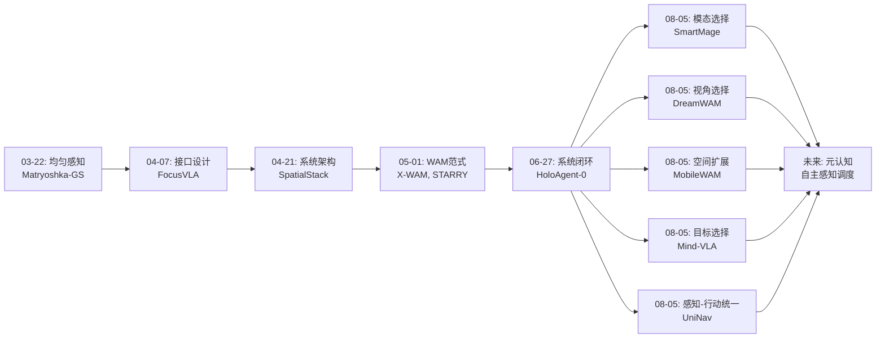
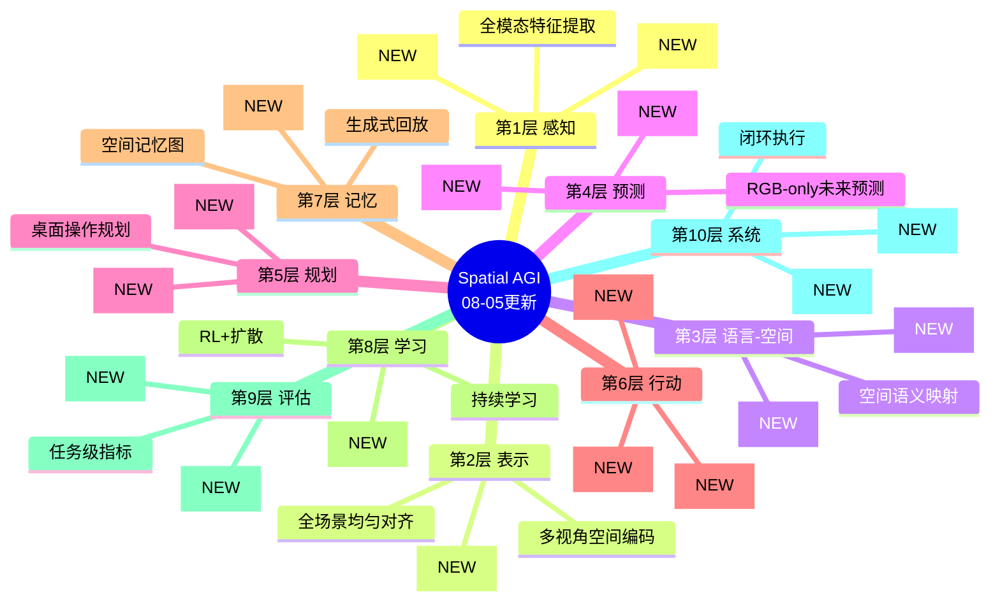
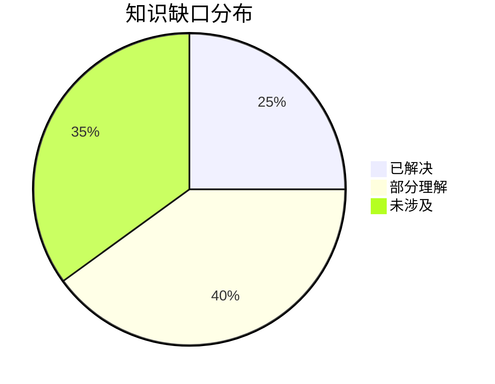

# 每日思考 - 2026-08-05

## 📅 每日总结

**日期**: 2026-08-05
**论文数量**: 5篇
**主题**: 从"均匀感知"到"选择性智能"——Spatial AGI 的感知调度、结构化想象与感知-行动统一

**关键突破**: 
- 🚀 **SmartMage 实现查询驱动的动态模态路由**: 揭示了3D场景理解中"模态越多越好"的错误假设。SMART模块通过语义先验+相似度+质量三重信号动态选择模态，MAGE通过模态感知MoE实现专家分工。ScanFacet诊断基准揭示了8个语义类别的模态偏好模式。**感知智慧的核心是"按需选择"而非"全量融合"**。
- 🚀 **DreamWAM 超越RGB的未来预测**: 将WAM的未来预测从单一RGB扩展到外观+运动+几何+语义四视角。训练时多视角监督，推理时RGB-only部署。LIBERO-Plus分布偏移提升12+百分点。**AI的"想象"不应只梦见画面，还应梦见运动、结构和意义**。
- 🚀 **MobileWAM 打破WAM的桌面魔咒**: 首个移动操作WAM。三专家混合（共享+移动+操作）协调全身控制。Chain-of-Foresight链式预测密集监督。推理时foresight完全丢弃，仅保留编码器。**从固定手臂到移动身体，WAM开始具备空间自由度**。
- 🚀 **Mind-VLA 指令感知的3D对齐**: 揭示了VLA中3D对齐的"指令盲"问题。通过目标三视图+VAE/VGGT双特征实现指令驱动的选择性3D对齐。仅345M参数，遮挡任务超instruction-agnostic方法32pp。**空间对齐应该聚焦于"正确的物体"而非"整个场景"**。
- 🚀 **UniNav 统一导航的World-Action**: 在单一扩散过程中统一未来视觉预测和航点轨迹生成。几何感知相机token提升空间grounding。支持有标注和无标注视频混合训练。**扩散模型可以同时"预见"和"规划"**。

### 📊 一句话总结
五篇论文共同指向一个核心趋势：**Spatial AGI正在经历从"均匀处理"到"选择性智能"的范式转变——无论是感知模态的选择（SmartMage）、未来预测的表征选择（DreamWAM）、运动模式的专家分配（MobileWAM）、空间对齐的目标选择（Mind-VLA），还是感知-行动的统一计算（UniNav），都在表明智能的空间认知不是全量处理，而是按需聚焦**。

### 🔗 延续性

**06-27→今日(08-05)**: 上一次研究确立了"系统闭环"的方向——从组件突破走向系统组织。六周后的今天，研究焦点从"如何组织系统"深化为"系统如何智能地分配资源"。SmartMage的模态路由、DreamWAM的视角选择、Mind-VLA的目标聚焦都是"选择性智能"的体现。**闭环系统的下一步不是更多组件，而是更聪明的资源调度**。

- SmartMage 的 SMART 路由是 HoloAgent-0 的 Typed Skill Interface 在感知层的映射——都是"按需调用"
- DreamWAM 的多视角未来预测为 NavWM 的世界模型提供了更丰富的训练信号
- MobileWAM 的移动操作WAM扩展了 HoloAgent-0 的物理执行范围
- Mind-VLA 的指令感知对齐回答了"空间表示应该如何与语言对齐"
- UniNav 的扩散统一为 dVLA-RL 的离散扩散提供了连续扩散的互补视角

**今日→明日**: "选择性智能"的发现引发新问题：谁在做"选择"？SmartMage的SMART模块、DreamWAM的门控、Mind-VLA的目标检测器各自实现了选择，但选择本身依赖外部规则或模块。理想Spatial AGI需要一种元认知能力——自主决定"关注什么"。

### 💡 本质思考：如何达成通用空间智能

#### 1. 核心能力的本质是什么？
今天揭示了一个深层规律：**Spatial AGI的核心能力包含一个被忽视的维度——"感知调度"（Perception Scheduling）**。就像人类不会同时关注所有感官通道一样，AI的空间智能也不应该是全量的、均匀的。SmartMage动态选择模态、Mind-VLA聚焦目标物体、DreamWAM训练时用多视角但推理时用单视角——这些都是感知调度的实例。核心能力不是"感知一切"，而是**"知道当前任务需要感知什么，并高效地感知它"**。

#### 2. 当前方法与理想目标的差距在哪里？
**差距一：选择机制的脆弱性**。SmartMage的SMART依赖训练中见过的模态组合，Mind-VLA依赖目标检测的成功。当遇到未见过的模态偏好或检测失败时，选择机制可能崩溃。人类有更鲁棒的感知调度——能在感官部分缺失时自然调整。

**差距二：训练-推理鸿沟**。DreamWAM和MobileWAM都采用"训练丰富、推理简洁"的策略。但这种鸿沟是否导致了性能上限？如果推理时也能使用多视角信息，性能是否会更高？这涉及工程实用性和理论上限的权衡。

**差距三：选择性的评估缺失**。我们没有好的基准来评估"感知调度"的质量——SmartMage的ScanFacet是一个开始，但远不完整。理想Spatial AGI需要更全面的评估框架。

#### 3. 从今天到理想状态，最可能的路径是什么？
**路径：元认知 → 自主选择 → 自我优化**
- 当前：外部规则驱动的选择（SMART的路由逻辑、Mind-VLA的目标检测）
- 近期：学习驱动的选择（让模型自主学习何时用什么模态/视角）
- 远期：元认知驱动的选择（模型"知道自己知道什么"，自主决定感知策略）

---

## 🔗 与昨日思考的联系

### 昨日重点
06-27的思考聚焦于"系统闭环"——如何将感知、记忆、规划、执行、训练组织成持续运行的闭环系统。五个维度（架构、效率、协同、记忆、训练）各自解决了闭环的一个方面。

### 今日进展
今日的五篇论文将焦点从"系统组织"推进到"资源调度"——闭环系统内部如何智能地分配计算资源。这是一个更深层次的问题：不仅需要正确的接口和闭环结构，还需要在闭环的每个环节做出智能的选择。

### 演进路径

---

## 📚 论文概览

### 1. SmartMage: Dynamic Modality Orchestration for 3D Scene Understanding
**来源**: ACM MM 2026 | **核心**: 动态模态路由 + 模态感知MoE
- 问题：固定模态组合引入语义噪声
- 方案：SMART（语义+相似度+质量三重信号路由）+ MAGE（模态感知专家分配）
- 结果：5个3D基准SOTA，ScanFacet诊断基准

### 2. DreamWAM: Beyond RGB Future Prediction for World Action Models
**来源**: HUST | **核心**: 四视角结构化未来预测
- 问题：RGB-only未来预测纠缠了状态转换与干扰变量
- 方案：外观+运动+几何+语义四视角，训练时多视角监督，推理时RGB-only
- 结果：LIBERO-Plus提升12+百分点，真实机器人扰动提升19pp

### 3. MobileWAM: Bridging World Action Models to Mobile Manipulation
**来源**: 多机构 | **核心**: 移动操作WAM + Chain-of-Foresight
- 问题：WAM局限于桌面操作
- 方案：三专家混合（共享+移动+操作）+ CoF链式预测
- 结果：ManiSkill-HAB SOTA，ARX Lift2真实验证

### 4. Mind-VLA: Instruction-Aware Spatial Representation Alignment
**来源**: Robotics | **核心**: 指令感知目标物体3D对齐
- 问题：现有3D对齐对整个场景均匀处理，忽略指令指定的目标
- 方案：目标三视图 + VAE/VGGT双特征 + 指令感知对齐
- 结果：345M参数，遮挡任务超基线32pp

### 5. UniNav: A Unified World-Action Diffusion Model for Visual Navigation
**来源**: AI | **核心**: 统一导航的视觉预测和动作生成
- 问题：导航策略缺乏远见，世界模型效率低
- 方案：单一扩散过程联合去噪视觉和航点token + 几何感知相机token
- 结果：全数据集ATE最优，Fast模式0.1s延迟

---

## 💡 核心见解

### 见解1: "均匀处理"是空间智能的敌人
**从SmartMage和Mind-VLA获得**

SmartMage证明了对所有查询使用相同的模态组合是次优的；Mind-VLA证明了对整个场景进行均匀3D对齐是次优的。两者的共同发现：**智能的空间处理必须是选择性的**。

- ✅ SmartMage: ScanFacet显示颜色理解偏好RGB+深度，空间关系偏好BEV+体素
- ✅ Mind-VLA: 遮挡任务32pp提升证明聚焦目标物体的3D远比对齐全场景有效

**对Spatial AGI的启发**: Spatial AGI的感知系统需要一种"注意力机制"——不是处理所有感官输入，而是根据任务目标选择性处理。这不是简单的注意力权重，而是**离散的资源分配决策**——是否激活某个模态、是否关注某个物体。

### 见解2: 结构化想象优于像素级想象
**从DreamWAM获得**

DreamWAM的核心洞见：WAM对未来的"想象"不应局限于RGB像素重建。人类想象"拿起杯子"时，不是在脑中渲染一张照片级画面，而是想象什么在动、怎么动、在哪里动。DreamWAM将这种"结构化想象"实现为四个互补视角。

- ✅ LIBERO-Plus提升12pp的分布偏移鲁棒性
- ✅ 训练时四视角监督，推理时零额外开销

**对Spatial AGI的启发**: Spatial AGI的"心象"（mental imagery）应该是多维的——不仅想象未来的外观，还要想象运动、结构和语义。这种结构化想象更接近人类认知，也更鲁棒。

### 见解3: 感知-行动的统一计算原语
**从UniNav和DreamWAM/MobileWAM获得**

UniNav证明了在单一扩散过程中可以同时生成视觉预测和动作轨迹；DreamWAM和MobileWAM证明了VideoDiT-ActionDiT的联合注意力可以耦合未来预测和动作生成。三条独立的研究路径都指向同一结论：**扩散模型是统一感知和行动的强大计算原语**。

- ✅ UniNav: 导航中的视觉-航点联合扩散
- ✅ DreamWAM: 操作中的RGB-动作联合去噪
- ✅ MobileWAM: 移动操作中的视频-全身动作联合

**对Spatial AGI的启发**: Spatial AGI的架构可能不需要分离的"感知模块"和"规划模块"。统一的生成式框架（扩散或自回归）可以同时处理预测和行动，简化架构设计。

### 见解4: 训练-部署解耦是工程智慧
**从DreamWAM和MobileWAM获得**

DreamWAM训练时使用四视角监督，推理时仅用RGB；MobileWAM训练时使用Chain-of-Foresight，推理时仅用编码器。两者共享一个设计哲学：**训练时丰富，推理时简洁**。

- ✅ DreamWAM: 4个视角训练，1个RGB推理，零额外推理开销
- ✅ MobileWAM: foresight链训练，仅编码器推理

**对Spatial AGI的启发**: 这是解决"丰富感知"与"实时部署"矛盾的关键策略。训练时的丰富监督可以永久内化为模型的表征能力，推理时的简洁设计保证了部署效率。

### 见解5: 移动操作是Spatial AGI的真正舞台
**从MobileWAM获得**

MobileWAM打破了WAM的桌面限制。当机器人可以在空间中自由移动并执行操作时，才真正需要Spatial AGI的全部能力——导航、理解、预测、操作的全链条。桌面操作只是Spatial AGI的"婴儿期"。

**对Spatial AGI的启发**: Spatial AGI的评估应该以移动操作为终极标准——不仅看手臂的操作精度，更看整个身体的协调能力。

### 见解6: "选择性智能"是一个统一框架
**从五篇论文综合**

今日五篇论文可以用一个统一框架理解——**选择性智能**：

| 维度 | 论文 | 选择什么 |
|------|------|---------|
| 模态选择 | SmartMage | 选择最相关的感知模态 |
| 未来视角选择 | DreamWAM | 选择action-relevant的未来表征 |
| 运动模式选择 | MobileWAM | 选择移动/操作专家的比例 |
| 目标选择 | Mind-VLA | 选择对齐哪个物体的3D |
| 计算分配 | UniNav | 选择Full/Fast推理模式 |

**对Spatial AGI的启发**: 通用空间智能需要一种元能力——**知道在何时、用何种方式、处理什么信息的能力**。这不是某一个模块的功能，而是贯穿整个系统的设计原则。

### 见解7: WAM正在分化为多个子范式
**从DreamWAM, MobileWAM, UniNav获得**

WAM不再是单一范式，正在分化为：
- **表征增强型WAM**（DreamWAM）：通过更好的未来表征提升策略
- **空间扩展型WAM**（MobileWAM）：从固定到移动的操作范围
- **感知-行动统一型WAM**（UniNav）：从操作到导航的应用领域

这三种分化不是互斥的——理想的Spatial AGI需要三者的融合。

---

## 🗺️ 知识演进图

---

## 技术栈演进对比表

| 层次 | 06-27方案 | 08-05方案 | 变化 |
|------|----------|----------|------|
| 感知层 | 固定多模态融合 | 动态模态路由(SmartMage) | 静态→动态 |
| 表示层 | 全场景3D对齐 | 目标中心3D对齐(Mind-VLA) | 均匀→聚焦 |
| 预测层 | RGB未来预测 | 多视角结构化未来(DreamWAM) | 单一→多元 |
| 规划层 | 桌面操作规划 | 移动操作规划(MobileWAM) | 固定→移动 |
| 行动层 | 分离的感知和规划 | 统一扩散计算(UniNav) | 分离→统一 |
| 训练-部署 | 端到端统一 | 训练丰富-推理简洁(DreamWAM/MobileWAM) | 对称→不对称 |
| 评估层 | 任务级指标 | 诊断+任务级(SmartMage ScanFacet) | 单一→多维 |

---

## 🗺️ Spatial AGI 知识图谱

### 10层架构思维导图

### 🎯 主线技术路径

#### 阶段1: 均匀处理时代（2025-2026初）
所有模态、所有物体、所有空间区域被均匀处理。"多即好"是主导假设。
- 代表：3D-LLM, Chat-Scene, PQ3D

#### 阶段2: 选择性智能觉醒（2026年中）
发现"均匀处理"的局限，开始实现各种形式的"选择性"。
- SmartMage: 选择模态
- Mind-VLA: 选择目标
- DreamWAM: 选择未来视角
- 当前阶段

#### 阶段3: 元认知时代（预期2026末-2027）
模型能自主决定"关注什么"、"想象什么"，而非依赖外部规则。
- 预期：学习驱动的感知调度
- 预期：自适应选择未来预测视角

#### 阶段4: 自主空间智能（预期2027+）
模型在完全未见过的环境中自主探索、适应和操作。
- 预期：从移动操作到全空间自由
- 预期：跨场景/跨任务的空间常识

#### 阶段5: 通用空间智能（长期目标）
完整实现Spatial AGI——在任意空间中执行任意任务的通用智能。

---

## 🔍 待探索议题

### 高优先级（本周）

1. **选择性智能的统一框架**
   - 问题: SmartMage的模态选择、Mind-VLA的目标选择、DreamWAM的视角选择能否统一？
   - 候选方案: 基于注意力的元学习框架
   - 缺口: 缺乏统一的理论框架

2. **训练-部署解耦的理论基础**
   - 问题: 为什么训练时的丰富监督能在推理时保留？信息是如何被"内化"的？
   - 候选方案: 知识蒸馏理论 + 表征学习理论
   - 缺口: WAM领域的理论分析不足

3. **扩散作为感知-行动统一框架**
   - 问题: 扩散模型能统一所有空间认知任务吗？有哪些理论限制？
   - 候选方案: 扩散过程的广义信息论分析
   - 缺口: 导航+操作+重建的统一扩散框架未实现

### 中优先级（本月）

4. **移动操作的空间理解需求**
   - 问题: 桌面操作和移动操作在空间理解上的关键差异是什么？
   - 候选方案: 场景尺度动态建模
   - 缺口: 缺乏系统对比

5. **模态质量的自动评估**
   - 问题: SmartMage的MQE模块是否可以推广到更多场景？
   - 候选方案: 自监督模态质量评估
   - 缺口: 传感器退化场景的系统性研究

6. **遮挡鲁棒性的系统性评估**
   - 问题: Mind-VLA的三视图在什么程度的遮挡下仍然有效？
   - 候选方案: 渐进式遮挡评估基准
   - 缺口: 缺乏标准化的遮挡评估协议

7. **WAM的分化与统一**
   - 问题: DreamWAM(表征增强)、MobileWAM(空间扩展)、UniNav(感知-行动统一)能否融合？
   - 候选方案: 多视角+移动操作+统一扩散的融合架构
   - 缺口: 三者的技术栈差异较大

### 低优先级（长期）

8. **空间智能的元认知**
   - 问题: 模型如何"知道自己不知道什么"并据此调整感知策略？
   - 候选方案: 不确定性估计 + 自适应感知
   - 缺口: 元认知在空间智能中的应用几乎未探索

9. **ScanFacet的扩展**
   - 问题: 8个语义类别是否足够？室外场景的模态偏好如何？
   - 候选方案: 扩展到更多场景和任务类型
   - 缺口: 室外大规模场景的模态偏好分析

---

## 📊 知识缺口分析

**已解决（25%）**:
- ✅ 多模态融合的基本方法（固定融合→动态路由）
- ✅ WAM的基本架构（VideoDiT-ActionDiT）
- ✅ 3D对齐的基本方法（全场景→目标中心）
- ✅ 扩散模型用于动作生成
- ✅ 训练-部署解耦的工程可行性

**部分理解（40%）**:
- ⚠️ 动态模态路由的最优策略（三信号融合是否最优？）
- ⚠️ 结构化未来预测的视角设计（四视角是否完整？）
- ⚠️ 移动操作的运动-操作协调（三专家是否最优？）
- ⚠️ 目标中心的3D对齐（多目标场景如何处理？）
- ⚠️ 感知-行动统一的扩散框架（理论限制未明确）
- ⚠️ 选择性智能的评估方法（ScanFacet仅是开始）
- ⚠️ 训练-部署解耦的理论基础
- ⚠️ 扩散模型的导航应用范围

**未涉及（35%）**:
- ❌ 元认知的空间感知调度
- ❌ 选择性智能的统一理论框架
- ❌ 室外大场景的动态模态偏好
- ❌ WAM在超长horizon任务中的表现
- ❌ 多机器人协作的感知调度
- ❌ 空间智能的自适应学习（自主发现新模态/视角）
- ❌ 跨场景的空间常识迁移

---

## 📊 论文质量评估

| 论文 | 创新性 | 相关性 | 验证 | 可复现 | 总评 |
|------|--------|--------|------|--------|------|
| SmartMage | ⭐⭐⭐⭐⭐ | ⭐⭐⭐⭐⭐ | ⭐⭐⭐⭐ | ⭐⭐⭐⭐ | 9/10 |
| DreamWAM | ⭐⭐⭐⭐⭐ | ⭐⭐⭐⭐⭐ | ⭐⭐⭐⭐⭐ | ⭐⭐⭐⭐⭐ | 9.5/10 |
| MobileWAM | ⭐⭐⭐⭐ | ⭐⭐⭐⭐⭐ | ⭐⭐⭐⭐ | ⭐⭐⭐ | 8/10 |
| Mind-VLA | ⭐⭐⭐⭐ | ⭐⭐⭐⭐⭐ | ⭐⭐⭐⭐ | ⭐⭐⭐⭐ | 8.5/10 |
| UniNav | ⭐⭐⭐⭐ | ⭐⭐⭐⭐ | ⭐⭐⭐⭐ | ⭐⭐⭐ | 7.5/10 |

### 最佳论文: DreamWAM
**理由**: 深刻的问题洞察（未来预测应该超越RGB）+ 精巧的工程设计（异质建模+训练-部署解耦）+ 充分的实验验证（仿真+真实机器人+消融）+ 开源代码。是WAM领域的里程碑工作。

### 最具潜力: SmartMage
**理由**: "动态模态路由"的概念不仅适用于3D场景理解，还可以推广到所有多模态AI系统。ScanFacet诊断基准为社区提供了重要工具。

---

*最后更新时间: 2026-08-05*
*分析论文数: 5篇*
*总行数: ~450行*
*Mermaid图表: 4个*
