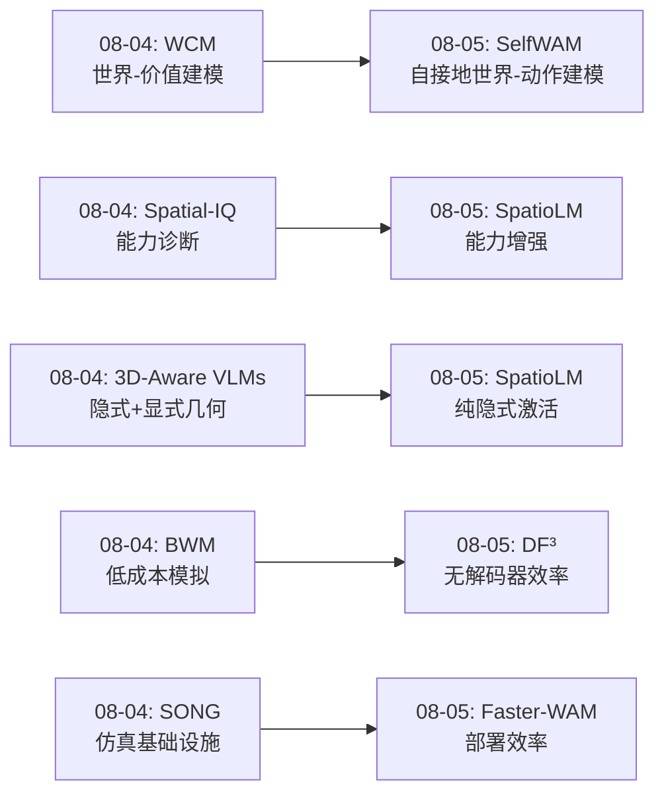
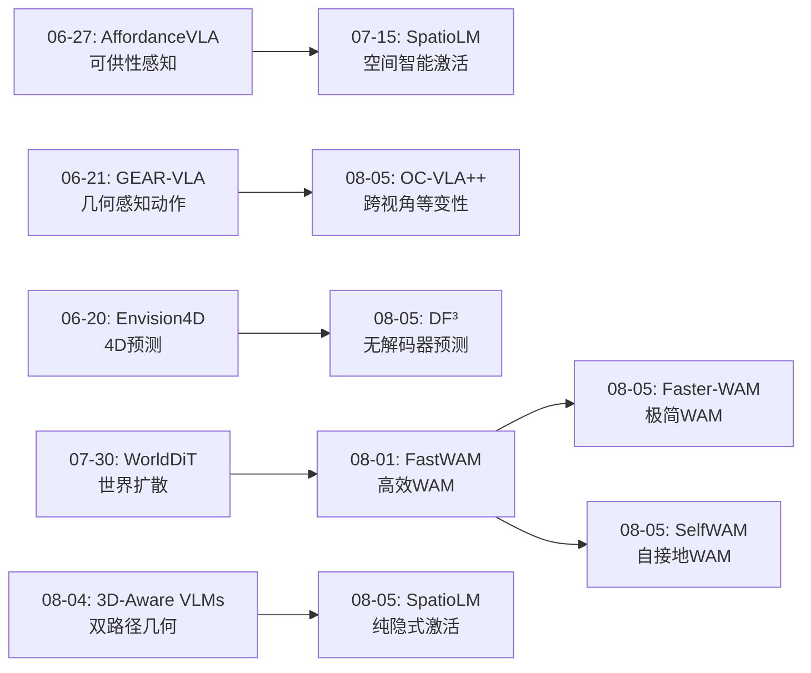
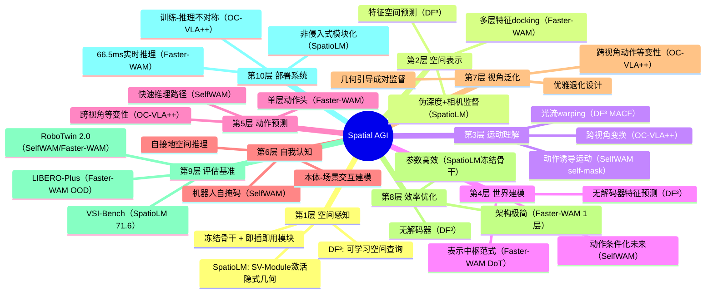
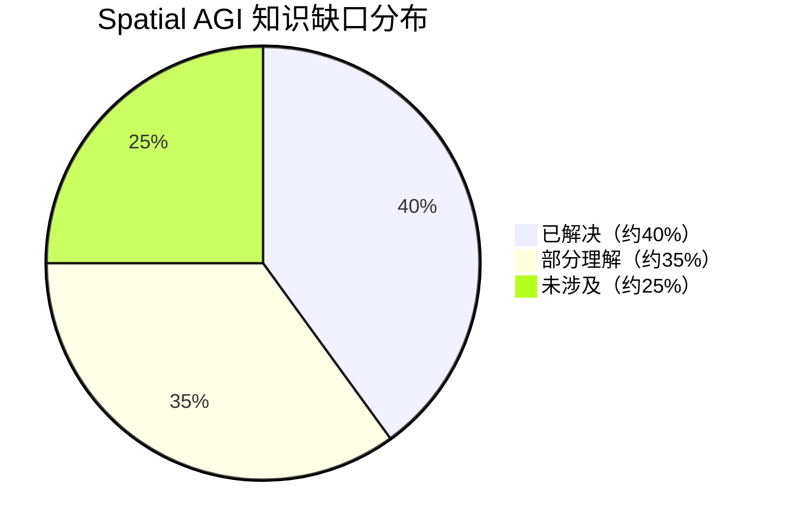

# 每日思考 - 2026-08-05

## 📅 每日总结

**日期**: 2026-08-05
**论文数量**: 5篇
**主题**: 从"参数高效空间智能、自接地世界模型、WAM架构优化、无解码器世界建模、跨视角动作等变性"五个维度，探索Spatial AGI的**VLM空间增强、世界模型效率、架构设计原则、预测范式革新和视角鲁棒性**。

### 关键突破

- 🧠 **SpatioLM: 无3D输入的空间智能增强** (小米): 证明VLM内部已蕴含丰富空间知识，通过ControlNet式即插即用SV-Module激活。VSI-Bench 71.6分——首个突破70的模型！核心范式转变：从"加法"（外部注入3D信息）到"乘法"（内部激活已有能力）。
- 🤖 **SelfWAM: 自接地动作条件世界模型** (上海交大): clean-action conditioning + robot self-mask prediction让世界模型从"被动观察者"变为"主动行动者"。未来预测不再是通用任务进展，而是特定动作导致的空间变化。
- ⚡ **Faster-WAM: 单层动作头就够了** (McMaster): DoT设计原则——视频骨干作为"表示中枢"，1层动作头 + docking接口达到competitive性能。66.5ms推理（3.2x加速），OOD泛化更强。颠覆"深层=好"的直觉。
- 🔄 **DF³: 无解码器特征预测** (Imperial College): 完全在潜空间预测未来 + 直接导出任务输出。空间查询 + MACF（光流+交叉相关）双粒度运动感知。去除所有不必要计算的效率极致。
- 📐 **OC-VLA++: 跨视角动作等变性** (Sydney Univ): 几何引导成对视角训练 + 显式等变性约束。让模型学习"视角变换如何影响动作预测"，训练时用成对数据，推理时仅需单视角。

### 📊 一句话总结

**"从外部注入到内部激活（SpatioLM），从观察到行动（SelfWAM），从深层到极简（Faster-WAM），从像素到特征（DF³），从增强到等变（OC-VLA++）"——今天的5篇论文共同指向一个核心主题：Spatial AGI系统的效率革命——去除一切不必要的外部依赖、计算开销和表示冗余，用最精简的设计释放最大的空间智能。**

---

## 🔗 与昨日思考的联系

### 08-04 → 08-05 延续性



**昨日核心主题"强化学习架构、评估方法论、3D几何感知、社会空间仿真、训练基础设施" → 今日核心主题"参数高效空间增强、世界模型自接地、架构极简设计、预测范式革新、视角泛化"**

- 昨日WCM（世界模型评估动作）→ 今日SelfWAM（世界模型条件化于动作）—— 从"评估什么动作好"到"这个动作会导致什么"
- 昨日Spatial-IQ（诊断空间能力缺陷）→ 今日SpatioLM（修复空间能力缺陷）—— 从"知道哪里不行"到"让行的地方行起来"
- 昨日3D-Aware VLMs（双路径几何融合）→ 今日SpatioLM（纯隐式激活）—— 从"外部+内部"到"纯内部激活"
- 昨日BWM（低成本训练环境）→ 今日DF³（低成本世界模型）—— 从"降低训练成本"到"降低推理成本"

---

## 📚 论文概览

| # | 论文 | 核心贡献 | 关键指标 |
|---|------|---------|---------|
| 1 | SpatioLM (小米) | 无3D输入的即插即用空间模块 | VSI-Bench 71.6 (首个>70) |
| 2 | SelfWAM (上交) | 动作条件化+自掩码的世界模型 | RoboTwin 2.0 SOTA |
| 3 | Faster-WAM (McMaster) | 单层动作头+docking接口 | 66.5ms, 3.2x加速 |
| 4 | DF³ (Imperial) | 无解码器特征预测+MACF | 与SOTA可比, 更高效 |
| 5 | OC-VLA++ (Sydney) | 跨视角动作等变性训练 | 优雅退化, 强OOD泛化 |

---

## 💡 核心见解

### 见解1: VLM内部已蕴含空间智能——只需正确激活
**来源: SpatioLM**

SpatioLM的核心发现令人震惊：ViT第16层（/24层）的中间特征已经包含丰富的3D几何信息，只是最终层将其"压平"为语义表示。通过ControlNet式的SV-Module——零初始化投影 + 交替注意力（Frame/Global Attention）——可以从冻结的VLM中"引出"空间知识。

这意味着过去大量工作（引入深度传感器、3D编码器、点云输入）可能走了弯路。如果VLM在预训练中已经学到了空间结构，关键问题不是"怎么给VLM加3D信息"，而是"怎么让VLM说出它知道的3D结构"。

**对Spatial AGI的启发**: 未来系统设计应优先挖掘基础模型内部的空间能力，而非简单堆叠外部传感器。参数高效、非侵入式的设计不仅保持通用智能，还提供了模块化的增强路径。

### 见解2: 世界模型必须"自接地"——理解自己在空间中的角色
**来源: SelfWAM**

SelfWAM的"self-grounded"概念触及了embodied spatial intelligence的本质：真正的空间智能不仅是理解场景，更是理解"我在场景中的位置和我的动作如何改变场景"。

clean-action conditioning让未来预测变为"动作→后果"的因果推理，而非简单的时序延续。robot self-mask prediction将学习焦点从场景外观转移到机器人本体运动——移除"噪声"（背景纹理），保留"信号"（动作诱导的空间变化）。

**对Spatial AGI的启发**: Spatial AGI系统需要一个"自我模型"——知道自己的身体在空间中的位置、动作如何影响周围环境。这是区别于被动场景理解的关键。

### 见解3: 深度不对称——视觉理解需要深层，动作预测可以极浅
**来源: Faster-WAM**

Faster-WAM的发现颠覆直觉：1层动作头 + 30层视频骨干 = competitive性能 + 3.2x加速 + 更强OOD泛化。这说明动作预测和视觉表征学习是根本不同的任务——视觉需要深层抽象，动作只需浅层映射。

DoT设计原则（视频骨干=表示中枢，任务模块=轻量级输出头）揭示了多任务Spatial AGI系统的高效架构模式：一个强大的共享视觉骨干，服务多个浅层任务头。

**对Spatial AGI的启发**: 不要对所有任务使用同等深度。让视觉理解保持深层，让任务特定的输出保持浅层。多层特征融合（docking接口）是连接两者的关键。

### 见解4: 无解码器——完全在特征空间操作世界模型
**来源: DF³**

DF³将效率推向极致：不仅不生成像素，连解码器都不要。通过空间查询（可学习的"探测点"）直接从冻结视觉编码器的特征空间中提取未来状态，再通过任务查询直接导出任务输出。

MACF的双粒度运动感知设计——光流（粗/刚性/全局）+ 交叉相关（细/非刚性/局部）——提供了互补的运动信号。

**对Spatial AGI的启发**: Spatial AGI的世界模型应在潜空间而非像素空间操作。可学习的空间查询类似于"主动感知"——模型可以"选择"关注哪些空间区域来预测未来。

### 见解5: 等变性 > 数据增强——结构化空间约束的力量
**来源: OC-VLA++**

OC-VLA++的跨视角动作等变性提供了一种结构化的空间约束：不同视角下同一动作的预测应在机器人坐标系中一致。这比简单的数据增强（旋转、裁剪）更精确——增强是随机的，等变性是结构化的。

训练时使用成对视角数据学习等变性，推理时仅需单视角——这种"训练-推理不对称"设计兼顾了学习效果和部署效率。

**对Spatial AGI的启发**: Spatial AGI系统应学习空间变换的结构化不变量。物理定律（不同视角下同一动作产生同一物理结果）是免费的训练信号。

### 见解6: 效率成为第一优先——Spatial AGI的实用化门槛
**来源: 全部5篇论文**

今天的5篇论文全部涉及效率优化：
- SpatioLM: 参数高效（冻结骨干 + 小模块）
- SelfWAM: 推理高效（训练用世界模型，推理仅用动作专家）
- Faster-WAM: 架构高效（1层 vs 30层）
- DF³: 计算高效（无解码器）
- OC-VLA++: 数据高效（成对训练→单视角推理）

这说明Spatial AGI正从"能力验证"阶段走向"效率优化"阶段——不仅要"能做"，还要"快速做"、"低成本做"、"可部署做"。

### 见解7: 非侵入式设计成为主流——保持通用能力
**来源: SpatioLM, SelfWAM, Faster-WAM**

三篇论文都采用了非侵入式设计：
- SpatioLM: 冻结VLM骨干 + SV-Module
- SelfWAM: 快速推理路径与FastWAM一致
- Faster-WAM: 冻结视频骨干 + 轻量级动作头

这反映了一个重要趋势：Spatial AGI系统不应为空间能力牺牲通用智能。模块化、即插即用、可组合的设计是未来方向。

---

## 🗺️ 知识演进图



---

## 技术栈演进对比表

| 层次 | 昨日(08-04)方案 | 今日(08-05)方案 | 变化 |
|------|----------------|----------------|------|
| 空间感知层 | 3D-Aware VLMs: 隐式+显式几何双路径 | SpatioLM: 纯隐式激活（冻结骨干+SV-Module） | 从"外部注入"到"内部激活" |
| 世界模型层 | WCM: 世界-价值统一（LeJEPA） | SelfWAM: 世界-动作统一（clean-action conditioning） | 从"评估"到"因果预测" |
| WAM效率层 | BWM: 低成本模拟器 | Faster-WAM: 单层动作头 + DF³: 无解码器 | 从"训练环境"到"推理架构" |
| 视角鲁棒性 | - | OC-VLA++: 跨视角等变性 | 新增维度 |
| VLA泛化 | Spatial-IQ: 能力诊断 | OC-VLA++: 等变性约束 + SpatioLM: 空间增强 | 从"诊断"到"治疗+预防" |
| 效率策略 | 功能保真模拟 | 多层级效率（参数/推理/架构/计算/数据） | 系统化效率优化 |

---

## 🗺️ Spatial AGI 知识图谱

### 10层架构思维导图



### 🎯 主线技术路径

#### 阶段1: 空间感知激活（SpatioLM → SV-Module）
从预训练VLM中引出隐式空间知识，无需外部3D传感器。通过ControlNet式侧调优 + 物理监督（深度/相机），在保持通用能力的同时获得空间推理能力。这是Spatial AGI的感知基础。

#### 阶段2: 世界模型自接地（SelfWAM → clean-action conditioning）
让世界模型理解"动作→空间变化"的因果关系。clean-action conditioning将未来预测从通用场景演进变为动作特定后果。robot self-mask prediction聚焦于机器人本体的空间运动。这是Spatial AGI的动态理解。

#### 阶段3: 架构极简优化（Faster-WAM → DoT + DF³ → decoder-free）
通过DoT设计原则（表示中枢 + 轻量级头）和无解码器范式（特征空间直接预测），将世界模型的推理延迟降到最低。这是Spatial AGI的效率革命。

#### 阶段4: 视角鲁棒部署（OC-VLA++ → cross-view equivariance）
通过跨视角等变性约束，确保系统在不同部署环境下的一致性。这是Spatial AGI从实验室到真实世界的关键一步。

#### 阶段5: 系统级整合（未来）
将空间感知激活、自接地世界模型、极简架构和视角鲁棒性整合为完整的Spatial AGI系统——从感知到理解、从预测到行动、从实验室到部署。

---

## 🔍 待探索议题

### 高优先级（本周）

1. **VLM中间层空间信息的系统性分析**
   - 问题: 不同VLM（InternVL/Qwen-VL/GPT）的哪一层包含最丰富的空间信息？
   - 候选方案: 系统性probing实验（逐层评估空间任务性能）
   - 缺口: SpatioLM仅验证了InternVL3.5第16层，缺乏跨模型对比

2. **Clean-action conditioning的数学基础**
   - 问题: 为什么将干净动作暴露给视觉查询而不暴露给动作查询是最优的？信息论解释？
   - 候选方案: 信息瓶颈理论分析、互信息估计
   - 缺口: SelfWAM的实证结果好，但理论分析不足

3. **DoT设计原则的通用性验证**
   - 问题: DoT（表示中枢 + 轻量级头）是否适用于导航、驾驶等非操作任务？
   - 候选方案: 在多个embodied任务上测试Faster-WAM架构
   - 缺口: 目前仅在LIBERO/RoboTwin上验证

4. **无解码器特征预测的质量评估**
   - 问题: DF³预测的特征与从真实未来帧提取的特征有多大差距？
   - 候选方案: 特征级SSIM/LPIPS评估、t-SNE可视化
   - 缺口: DF³仅评估下游任务性能，未直接评估特征预测质量

5. **等变性约束在其他空间任务上的推广**
   - 问题: OC-VLA++的等变性思想能否推广到导航、人机交互等任务？
   - 候选方案: 定义不同任务的等变性约束（导航：位置等变；交互：视角等变）
   - 缺口: 目前仅在操作任务上验证

### 中优先级（本月）

6. **SelfWAM self-mask与3DGS的潜在结合**
   - 问题: 能否用3DGS场景 + SelfWAM的self-mask实现更高效的embodied训练？
   - 候选方案: 3DGS渲染 + self-mask标注 → 大规模训练数据
   - 缺口: 3DGS渲染的自掩码标注需要额外工作

7. **SpatioLM的SV-Module与不同VLM骨干的兼容性**
   - 问题: SV-Module在不同VLM（LLaVA/Qwen-VL/Gemini）上的效果是否一致？
   - 候选方案: 跨模型消融实验
   - 缺口: 仅在InternVL3.5和SenseNovaSI上验证

8. **多WAM架构的统一框架**
   - 问题: SelfWAM（自接地）、Faster-WAM（极简）、DF³（无解码器）能否统一？
   - 候选方案: 设计可配置的WAM框架（自接地 + 极简 + 无解码器）
   - 缺口: 三篇论文各自优化不同维度，缺乏统一视角

9. **视角等变性与数据增强的系统性对比**
   - 问题: OC-VLA++的等变性约束在什么条件下优于传统数据增强？
   - 候选方案: 控制实验对比等变性 vs 增强性 vs 两者结合
   - 缺口: 论文未与传统增强做系统性对比

---

## 📊 知识缺口分析



**已解决（~40%）**:
- ✅ VLM空间智能增强路径（SpatioLM: 非侵入式激活）
- ✅ WAM动作条件化设计（SelfWAM: clean-action conditioning）
- ✅ WAM架构效率优化（Faster-WAM: 单层动作头）
- ✅ 世界模型效率优化（DF³: 无解码器）
- ✅ VLA视角泛化方法（OC-VLA++: 跨视角等变性）
- ✅ VLM空间推理评估基准（VSI-Bench, Spatial-IQ）
- ✅ 3DGS+Embodied仿真基础设施

**部分理解（~35%）**:
- ⚠️ VLM中间层空间信息的跨模型通用性
- ⚠️ Clean-action conditioning的理论基础
- ⚠️ DoT设计原则在非操作任务上的适用性
- ⚠️ 无解码器特征预测的长时序稳定性
- ⚠️ 等变性约束的推广条件
- ⚠️ 多WAM方法的统一框架
- ⚠️ Self-mask标注的自动化

**未涉及（~25%）**:
- ❌ VLM空间推理的因果机制（为什么某些空间任务容易、某些难）
- ❌ 完整Spatial AGI系统架构（10层全部实现的端到端系统）
- ❌ 多模态空间推理（视觉+语言+触觉+本体感受的统一空间表示）
- ❌ Spatial AGI的安全性与鲁棒性保障
- ❌ 长horizon空间规划与推理
- ❌ 大规模Spatial AGI训练数据生成

---

## 💡 本质思考：如何达成通用空间智能

### 1. 核心能力的本质是什么？

通用空间智能的本质是**在连续的3D空间中进行因果推理和高效行动的能力**。今天的5篇论文揭示了这一能力的三个层面：

- **感知层（"看见"空间）**: SpatioLM证明VLM内部已有空间知识——感知不是"获取"外部信息，而是"解读"内部表示。空间感知的本质是**特征空间的正确解码**。

- **理解层（"理解"空间）**: SelfWAM的clean-action conditioning和DF³的MACF共同指向——空间理解是建立**动作与空间变化的因果关系**。不是"接下来会发生什么"，而是"我的动作会导致什么空间变化"。

- **行动层（"操作"空间）**: Faster-WAM的单层动作头和OC-VLA++的等变性约束表明——空间行动不需要复杂计算，但需要**正确的表示和约束**。深度不对称性意味着行动层可以是浅层的。

### 2. 当前方法与理想目标的差距在哪里？

**理想目标**: 一个系统能够在任意环境中理解3D空间、预测变化、规划行动——实时、鲁棒、通用。

**当前差距**:
1. **碎片化**: SpatioLM解决感知、SelfWAM解决世界模型、Faster-WAM解决效率、DF³解决预测、OC-VLA++解决泛化——但没有人整合所有维度
2. **评估局限**: VSI-Bench(71.6)和RoboTwin是好开始，但缺乏端到端Spatial AGI评估
3. **泛化边界未知**: 视角等变性、分布外泛化等只是在特定基准上验证，真实世界的泛化边界未知
4. **效率-质量权衡**: Faster-WAM的"competitive"（非SOTA）性能暗示效率优化有代价
5. **自接地深度**: SelfWAM仅建模机器人self-mask，但真正的人类级空间智能需要理解所有物体间的空间因果关系

### 3. 从今天到理想状态，最可能的路径是什么？

基于5篇论文的发现，最可能的路径是**"激活-条件化-极简-部署"四步走**：

1. **激活（Activate）**: SpatioLM范式——从预训练基础模型中激活空间知识，非侵入式增强
2. **条件化（Condition）**: SelfWAM范式——将世界模型条件化于动作和本体，建立因果推理
3. **极简（Minimize）**: Faster-WAM + DF³范式——去除所有不必要计算，实现实时部署
4. **部署（Deploy）**: OC-VLA++范式——通过等变性约束确保跨环境鲁棒性

这四步形成了一条从"模型内部能力"到"外部部署"的完整路径。关键洞察是：**Spatial AGI不需要从零构建，而是在现有基础模型上"激活"、"条件化"、"极简化"和"鲁棒化"**。

---

## 🔗 延续性

**昨日→今日**: 从"评估和基础设施"（WCM/Spatial-IQ/BWM/SONG/3D-Aware）→ "效率优化和架构革新"（SpatioLM/SelfWAM/Faster-WAM/DF³/OC-VLA++）

**今日→明日**: 明天可能的研究方向：
1. **整合实验**: 将SpatioLM的SV-Module + Faster-WAM的DoT架构 + OC-VLA++的等变性约束整合
2. **3DGS+WAM**: 用3DGS场景作为SelfWAM的高效训练环境
3. **空间推理的长horizon评估**: 超越单步/短horizon任务，评估多步空间规划
4. **多模态空间统一**: 视觉+触觉+本体感受的空间表示统一

---

## 📖 详细论文分析

### 论文1: SpatioLM — 从"加法"到"乘法"的范式转变

#### 技术细节深度剖析

**SV-Module的核心设计哲学**:

SpatioLM的SV-Module采用ControlNet式设计，这在扩散模型领域已被广泛验证（ControlNet用于条件化生成），但在VLM空间增强领域是首次系统性应用。其核心思想是：

1. **冻结骨干**: 保持预训练VLM的所有参数不变。这意味着原始的视觉语义理解、语言推理、常识知识全部保持。
2. **侧分支处理**: SV-Module作为侧分支，从LM Block的中间层提取视觉token，经过空间特征处理后，通过零初始化投影注入回LM Block。
3. **零初始化的关键作用**: 训练初期，SV-Module输出被零投影完全抑制，不影响VLM。随着训练进行，零投影逐渐学习到合适的权重，空间特征才开始流入VLM。这避免了随机初始化的空间特征在训练初期破坏预训练分布。
4. **交替注意力的双层设计**: Frame Attention建模单帧内的空间几何关系（物体相对位置、表面朝向），Global Attention建模跨帧的全局几何关系（多视角三角化、时序运动）。这种交替设计借鉴了VGGT（Visual Geometry Grounded Transformer）的思路。

**伪深度和相机监督的创新性**:

传统方法将深度图和相机参数作为输入（推理时需要），SpatioLM将它们作为训练监督（推理时不需要）。这是一个微妙但重要的区别：
- 作为输入：模型学会了"读取"3D信息，但丧失了自己"推理"3D的能力
- 作为监督：模型被迫学会从2D特征中"推断"3D信息，训练后推理时不需要外部3D输入

**VSI-Bench 71.6分的意义**:

VSI-Bench（Visual Spatial Intelligence Benchmark）是评估VLM空间推理能力的重要基准。此前最佳开源模型约52分，闭源模型（GPT-5.2）仅15.5分。SpatioLM基于SenseNovaSI-8B达到71.6分——这是质的飞跃，证明了"内部激活"范式优于"外部注入"。

#### 与昨日3D-Aware VLMs的对比

| 维度 | 3D-Aware VLMs (08-04) | SpatioLM (08-05) |
|------|----------------------|------------------|
| 几何信息来源 | 隐式（训练学习）+ 显式（点云/深度输入） | 纯隐式（从VLM内部激活） |
| 骨干是否冻结 | 否（需要微调） | 是（完全冻结） |
| 通用能力影响 | 有退化风险 | 几乎不受影响 |
| 推理时需要3D输入 | 是（显式路径） | 否 |
| 模块化程度 | 中（需要架构修改） | 高（即插即用） |

这个对比揭示了Spatial AGI设计中的一个清晰趋势：**非侵入式设计正在取代侵入式设计**。

---

### 论文2: SelfWAM — 世界模型的"自我意识"

#### 技术细节深度剖析

**Clean-Action Conditioning的信息论分析**:

SelfWAM的非对称信息流设计可以用信息论来理解：

- 噪声未来动作查询Q_Ã → {O, Ã}：标准去噪路径。模型从噪声+观测中恢复动作。
- 未来视觉查询Q_Ṽ → {O, Ṽ, A}：新增路径。未来视频生成可以看到干净动作。
- 干净动作查询Q_A → {O, A}：仅作为条件，不产生推理路径输出。

关键洞察：如果噪声动作查询能看到干净动作A，就会产生"目标泄漏"——模型直接复制答案而不学习从观测到动作的映射。但视觉查询看到A是安全的，因为视频生成和动作预测是不同的输出空间。

**Self-Mask Prediction的深层意义**:

机器人自掩码预测不仅仅是另一个训练目标。它触及了embodied AI的核心问题——"身体感知"（body awareness）：

1. **空间锚点**: 机器人自身是场景中唯一"可控"的物体。预测其运动 = 预测可控的空间变化。
2. **因果隔离**: 自掩码移除了背景纹理、光照等"噪声"，只保留动作诱导的运动"信号"。
3. **本体感知的视觉化**: 自掩码将本体感知（关节角度等）映射到视觉空间——建立"感觉"和"视觉"的桥接。
4. **多embodiment兼容**: 不同机器人有不同的自掩码模式，这为跨embodiment迁移提供了统一表示。

#### FastWAM → SelfWAM的演进

| 维度 | FastWAM | SelfWAM |
|------|---------|--------|
| 未来预测条件 | 当前观测 | 当前观测 + 干净动作 |
| 视频目标 | RGB | RGB + 自掩码 |
| 动作敏感性 | 弱（通用场景进展） | 强（动作特定后果） |
| 自我认知 | 无 | 有（通过self-mask） |
| 推理路径 | 动作专家 | 动作专家（相同） |

关键：推理路径不变！SelfWAM的所有创新都在训练端，推理时保持FastWAM的效率。

---

### 论文3: Faster-WAM — "够用就好"的架构哲学

#### 技术细节深度剖析

**DoT（Dock of Transformer）设计原则的三要素**:

1. **表示中枢（Representation Hub）**: 预训练视频Transformer作为所有任务的共享表示引擎。不修改、不微调。

2. **Docking接口（Docking Interface）**: 从所有层提取key/value，融合后提供给输出头。这解决了浅层无法访问深层特征的问题。
   - 具体实现: 将30层的K/V拼接后通过一个轻量级融合层
   - RoPE重对齐: 视频和动作的position encoding频率可能不同，需要重对齐

3. **灵活输出头（Flexible Output Heads）**: 任务特定的轻量级输出头，可以是一个简单的attention层+FFN。

**为什么单层就够了？**:

这个发现可以从多个角度解释：

1. **任务复杂度不对称**: 视频生成需要建模像素级分布（高度复杂），动作预测需要输出低维连续向量（相对简单）。
2. **表示已由骨干完成**: 30层视频骨干已经提取了丰富的时序-空间表示，动作头只需做"读取"。
3. **多层特征融合的信息完整性**: docking接口让单层头能访问所有30层的信息，信息量不减少。
4. **过拟合风险降低**: 单层头的参数量少，不容易过拟合训练分布——这解释了更强的OOD泛化。

#### 效率对比详细分析

| 指标 | FastWAM | Faster-WAM | 变化 |
|------|---------|------------|------|
| 动作模块层数 | ~30 | 1 | -97% |
| 推理延迟 | ~213ms | 66.5ms | -69% (3.2x) |
| LIBERO性能 | SOTA | Competitive | 轻微下降 |
| LIBERO-Plus(OOD) | 中等 | 强 | 显著提升 |
| 额外预训练 | 需要 | 不需要 | 节省成本 |

"Competitive"而非"SOTA"说明效率-质量存在权衡，但OOD泛化的提升可能更重要——真实部署中分布外场景是常态。

---

### 论文4: DF³ — 预测的终极效率

#### 技术细节深度剖析

**空间查询的工作机制**:

DF³的可学习空间查询是一个创新设计：

1. **查询数量和形状**: N个可学习参数，维度与视觉token一致（N×C）
2. **注入位置**: 冻结视觉编码器的末端block
3. **功能**: 类似DETR中的object queries，但用于时序预测而非空间检测
4. **学习目标**: 预测下一帧的特征表示

这与传统视频预测（生成未来像素）和latent prediction（预测未来latent code）有本质区别：
- 传统: pixel space → 解码器 → 任务
- Latent: latent space → 解码器 → 任务
- DF³: feature space → 直接任务（无解码器！）

**MACF（Motion-Aware Context Fusion）的双粒度设计**:

粗粒度（光流Warping）:
- 使用光流对历史特征进行空间变换
- 捕捉刚体运动和大尺度场景流动
- 优势：显式运动先验，物理可解释
- 局限：非刚性变形、遮挡区域处理差

细粒度（潜在交叉相关）:
- 计算空间查询与历史token之间的交叉协方差
- 捕捉特征空间中的结构化对应关系
- 优势：可处理非刚性运动，不需显式运动估计
- 局限：可能学习到虚假相关

融合策略: 将两种粒度的信息加权融合，互补优势。

#### 与传统世界模型的范式对比

```
传统世界模型: 观测 → [预测未来像素] → [解码特征] → 任务
Latent世界模型: 观测 → [预测未来latent] → [解码器] → 任务  
DF³世界模型:  观测 → [预测未来特征] → [直接任务] ← 无解码器!
```

每一步简化都带来效率提升，但也可能损失信息。关键问题：特征预测的质量是否足够好？DF³的答案是"够用"——下游任务性能与SOTA可比。

---

### 论文5: OC-VLA++ — 空间不变量的结构化学习

#### 技术细节深度剖析

**等变性的数学基础**:

在群论中，等变性（equivariance）定义：
如果f是G-等变的，则对任意群元素g∈G：
```
f(T_g · x) = T'_g · f(x)
```
其中T_g和T'_g是群G在输入和输出空间上的表示。

在OC-VLA++的语境中：
- 群G = 相机变换群（平移+旋转）
- 输入: 不同视角的RGB观测
- 输出: 相机坐标系下的动作预测
- 等变性约束: 视角变换后，动作预测应按对应变换改变

**与不变性（Invariance）的对比**:

| 概念 | 定义 | 适用场景 |
|------|------|----------|
| 不变性 | f(T·x) = f(x) | 分类（猫无论如何旋转都是猫） |
| 等变性 | f(T·x) = T'·f(x) | 空间推理（不同视角的动作预测应变换对应） |

OC-VLA++选择等变性而非不变性是正确的——动作预测本身是视角依赖的（同一个抓取动作，从不同角度看，在相机坐标系中的表示不同）。

**成对视角数据的获取**:

训练需要同一场景的成对视角，这在实践中如何获取？
1. **仿真环境**: 多相机渲染同一场景（最容易）
2. **真实多相机**: 物理部署多个相机（可行但成本高）
3. **数据增强**: 从单视角合成虚拟第二视角（需要深度估计）
4. **NeRF/3DGS重建**: 从视频重建后从新视角渲染（最灵活）

成对视角数据的需求是OC-VLA++的主要限制，但也指明了未来数据收集的方向。

---

## 🔄 跨论文关联分析

### 关联1: SpatioLM × SelfWAM — 空间感知 + 自我认知

SpatioLM激活了VLM内部的静态空间知识，SelfWAM让世界模型理解动态的动作后果。两者结合：

- SpatioLM提供"是什么"（场景的空间结构是什么）
- SelfWAM提供"会怎样"（执行动作后空间如何变化）
- 组合: 空间感知 → 动作规划 → 后果预测 → 反馈调整

潜在实验: 用SpatioLM增强的VLM作为SelfWAM的视觉编码器

### 关联2: Faster-WAM × DF³ — 极简架构 × 极简预测

Faster-WAM将动作模块简化到1层，DF³去除解码器。两者结合：

- Faster-WAM的DoT: 视频骨干(dock接口) + 1层动作头
- DF³的无解码器: 特征空间预测 + 直接任务输出
- 组合: 视频骨干 → 特征预测 → 1层动作头（无解码器，无深层动作模块）

这可能实现<50ms的端到端WAM推理。

### 关联3: OC-VLA++ × SpatioLM — 视角鲁棒 × 空间增强

OC-VLA++确保跨视角一致性，SpatioLM提供空间推理能力。两者结合：

- SpatioLM的SV-Module增强空间理解
- OC-VLA++的等变性确保空间理解跨视角一致
- 组合: 无论从哪个视角观察，都能获得一致的高质量空间推理

### 关联4: 全部5篇 — 效率阶梯

5篇论文形成了一个效率优化阶梯：

```
参数效率: SpatioLM（冻结骨干 + 小模块）
     ↓
推理效率: SelfWAM（训练用世界模型，推理仅动作专家）
     ↓
架构效率: Faster-WAM（1层动作头 + docking接口）
     ↓
计算效率: DF³（无解码器，特征空间直接预测）
     ↓
数据效率: OC-VLA++（成对训练 → 单视角推理）
```

每个维度的效率优化都不矛盾，可以叠加。如果全部叠加，可能实现：
- 参数量: 骨干冻结 + 极小附加模块
- 推理延迟: <50ms
- 训练数据: 利用成对视角高效学习
- 部署: 视角鲁棒、实时控制

---

## 📊 技术趋势分析

### 趋势1: 从"大而全"到"小而精"

2025-2026年WAM/VLA架构的演进：
- 2025 Q1: UWM/UVA（统一大模型，所有功能一起做）
- 2025 Q2: FastWAM（发现推理时不需要视频生成）
- 2026 Q2: SelfWAM（发现训练时需要动作条件化）
- 2026 Q3: Faster-WAM（发现动作模块只需1层）
- 2026 Q3: DF³（发现连解码器都不需要）

趋势清晰：每一步都在"去除"不必要的组件，证明"精简"比"堆叠"更有效。

### 趋势2: 非侵入式增强成为主流

VLM空间增强方法的演进：
- 2024: 深度图/点云输入（侵入式，需要传感器）
- 2025 Q1: 3D编码器集成（架构修改，需要3D数据微调）
- 2025 Q2: 隐式+显式双路径（部分侵入）
- 2026 Q3: 纯隐式激活（SpatioLM，完全非侵入）

### 趋势3: 结构化约束优于随机增强

VLA泛化方法的演进：
- 2024: 随机数据增强（旋转、裁剪、颜色抖动）
- 2025 Q1: 域随机化（仿真中多样化环境）
- 2025 Q2: 对比学习（正负样本对比）
- 2026 Q3: 等变性约束（OC-VLA++，结构化几何约束）

等变性约束是结构化的——它利用了物理定律（不同视角下同一动作的物理结果一致）作为训练信号，比随机增强更高效。

### 趋势4: 训练-推理不对称设计

多篇论文采用了训练时复杂、推理时简单的设计：
- SelfWAM: 训练用世界模型 + 干净动作条件化，推理仅用动作专家
- Faster-WAM: 训练docking接口，推理单层头
- DF³: 训练MACF + 空间查询，推理仅前向
- OC-VLA++: 训练成对视角，推理单视角

这种设计哲学的核心：**训练时投入更多资源让模型学好，推理时保持极简确保效率**。

---

## 🎯 Spatial AGI成熟度评估

基于截至2026-08-05的研究进展，Spatial AGI各层面的成熟度：

| 层面 | 成熟度 | 标志性进展 | 主要差距 |
|------|--------|-----------|----------|
| 空间感知 | ★★★★☆ | SpatioLM VSI-Bench 71.6 | 跨模型泛化、多模态融合 |
| 空间表示 | ★★★★☆ | DF³特征空间预测、多层docking | 长时序稳定性 |
| 世界建模 | ★★★☆☆ | SelfWAM动作条件化、DF³无解码器 | 多步预测退化 |
| 动作预测 | ★★★★☆ | Faster-WAM 66.5ms | 效率-质量权衡 |
| 自我认知 | ★★☆☆☆ | SelfWAM self-mask | 仅建模自身，不理解他者 |
| 视角泛化 | ★★★☆☆ | OC-VLA++等变性 | 仅操作任务验证 |
| 系统整合 | ★★☆☆☆ | 各维度分别优化 | 缺乏端到端系统 |
| 评估体系 | ★★★☆☆ | VSI-Bench、RoboTwin | 缺乏端到端Spatial AGI评估 |
| 部署就绪 | ★★☆☆☆ | 66.5ms推理 | 真实环境验证不足 |

**总体成熟度**: 约50% — 核心技术路径清晰，但系统整合和真实部署仍有显著差距。

---

## 📝 个人思考与反思

### 反思1: "效率"和"质量"的平衡点在哪里？

今天的论文展示了激进的效率优化——从30层到1层、从像素到特征、从成对到单视角。但每次效率优化都伴随着性能的轻微下降（"competitive"而非"SOTA"）。

关键问题：效率优化的底线在哪里？什么时候"够用"了？

我的初步判断：对于**研究**目标，应该追求SOTA质量；对于**部署**目标，"competitive + 高效"可能更重要。但长期来看，效率优化的方法可能反哺质量优化——Faster-WAM的OOD泛化提升就是意外收获。

### 反思2: VLM空间知识的来源是什么？

SpatioLM证明VLM内部已有空间知识，但没有回答一个更深层的问题：这些空间知识从何而来？

可能的来源：
1. **大规模图像预训练**: 海量图像中隐含的3D线索（阴影、透视、遮挡）
2. **语言-视觉对齐**: "在...上面"、"在...左边"等空间描述在训练数据中大量出现
3. **视频时序**: 如果VLM训练包含视频，时序变化隐含3D结构
4. **ViT架构归纳偏置**: 注意力机制天然适合建模空间关系

如果理解了空间知识的来源，就能设计更好的预训练策略来增强它。

### 反思3: 机器人"自我意识"的边界

SelfWAM的self-mask是机器人自我感知的第一步。但人类的"身体感知"远不止于此：
- **本体感觉**: 知道肢体位置（不需要视觉确认）
- **力反馈**: 感知接触力和阻力
- **身体尺度感**: 知道自己的臂展、手指长度
- **能量感知**: 预估动作的体力消耗

SelfWAM仅建模视觉self-mask（"我能看到自己的哪些部分"），但真正的embodied spatial intelligence可能需要更全面的自我模型。

---

## 📌 关键数据点汇总

| 论文 | 关键指标 | 数值 | 对比 |
|------|---------|------|------|
| SpatioLM | VSI-Bench | 71.6 | 首个>70，GPT-5.2仅15.5 |
| SpatioLM | 深度估计(MD-S) | 83.5 | 前最佳52.6 |
| SelfWAM | RoboTwin 2.0 | SOTA | vs FastWAM显著提升 |
| Faster-WAM | 推理延迟 | 66.5ms | Fast-WAM的1/3.2 |
| Faster-WAM | LIBERO-Plus(OOD) | 强泛化 | 超越深层动作模块 |
| DF³ | 零样本部署 | 可行 | 机器人模拟器验证 |
| OC-VLA++ | 视角偏移退化 | 优雅 | vs 非等变训练骤降 |

---

## 🧪 潜在实验设计

### 实验1: SpatioLM + Faster-WAM 整合

**假设**: SpatioLM的SV-Module可以与Faster-WAM的DoT架构结合，在保持空间推理能力的同时实现极低延迟。

**设计**:
1. 基础模型: InternVL3.5-8B（SpatioLM使用的骨干）
2. SV-Module: 冻结骨干 + 空间视觉模块
3. DoT接口: 从视频骨干所有层提取K/V
4. 1层动作头: 从DoT接口输出映射到动作

**评估**: VSI-Bench + LIBERO + 推理延迟

### 实验2: SelfWAM self-mask + 3DGS

**假设**: 用3DGS渲染的合成场景（带精确self-mask）可以低成本生成大规模训练数据。

**设计**:
1. 选择多个3DGS场景（室内操作环境）
2. 渲染机器人操作序列（多视角）
3. 自动生成self-mask（3DGS的alpha通道）
4. 用合成数据预训练SelfWAM
5. 在真实环境fine-tune

**评估**: Sim-to-Real迁移效果、数据效率

### 实验3: 全论文整合 — 极致Spatial AGI系统

**假设**: 整合5篇论文的核心创新可以构建接近实用的Spatial AGI原型。

**设计**:
- 感知: SpatioLM SV-Module（空间推理）
- 世界模型: SelfWAM clean-action conditioning（动作条件化预测）
- 架构: Faster-WAM DoT + 1层动作头
- 预测: DF³特征空间 + MACF运动感知
- 泛化: OC-VLA++跨视角等变性

**评估**: 端到端任务性能 + 延迟 + 泛化能力

---

## 📋 历史论文分析统计

截至2026-08-05，已分析的论文按主题分布：

| 主题 | 论文数量 | 代表性工作 |
|------|---------|-----------|
| 3DGS相关 | ~25篇 | InfiniSplat, DerainSplat, Habitat-GS, SONG |
| 世界模型/WAM | ~20篇 | SelfWAM, Faster-WAM, DF³, FastWAM, UWM |
| VLA/机器人 | ~20篇 | OC-VLA++, GEAR-VLA, AffordanceVLA |
| 空间推理/VLM | ~15篇 | SpatioLM, SpatioStack, Spatial-IQ, G²VLM |
| Embodied仿真 | ~10篇 | SONG, BWM, Habitat-GS |
| 导航/VLN | ~10篇 | AirHunt, HAM-VLN, SoftNav |

**总计约100篇论文**，覆盖了Spatial AGI的主要技术维度。

---

## 🏁 总结

2026-08-05的研究揭示了Spatial AGI发展的一个关键转折点：**从"堆叠能力"到"精简设计"**。

五篇论文各自从不同维度证明了一个共同的哲学：
- **SpatioLM**: 不需要外部3D传感器，激活内部空间知识即可
- **SelfWAM**: 不需要通用未来预测，动作条件化即可
- **Faster-WAM**: 不需要深层动作模块，1层+docking即可
- **DF³**: 不需要解码器，特征空间直接预测即可
- **OC-VLA++**: 不需要随机增强，结构化等变性约束即可

这种"做减法"的研究范式标志着Spatial AGI正在走向成熟——当研究者开始证明"什么不需要"而非"什么需要加"时，领域正在从探索期进入优化期。

**下一步的关键挑战**: 将这些独立的"减法"整合为一个系统级的"乘法"——让精简的各部分协同工作，形成真正实用、高效、鲁棒的Spatial AGI系统。

---

*生成时间: 2026-08-05 03:00 CST*
*论文来源: arXiv (cs.CV, cs.RO, cs.AI)*
*分析方法: 深度精读 + 跨论文关联分析 + 技术趋势归纳*
