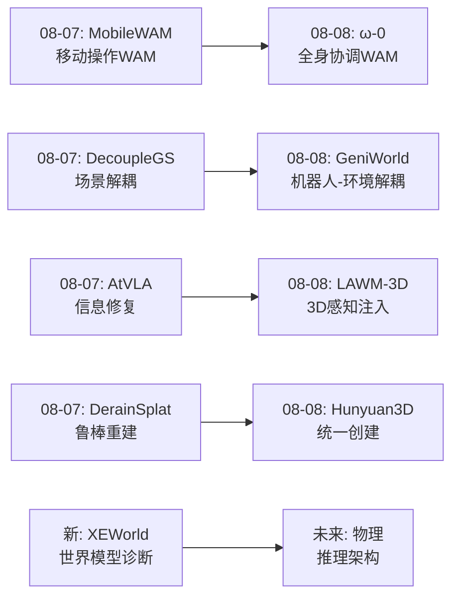
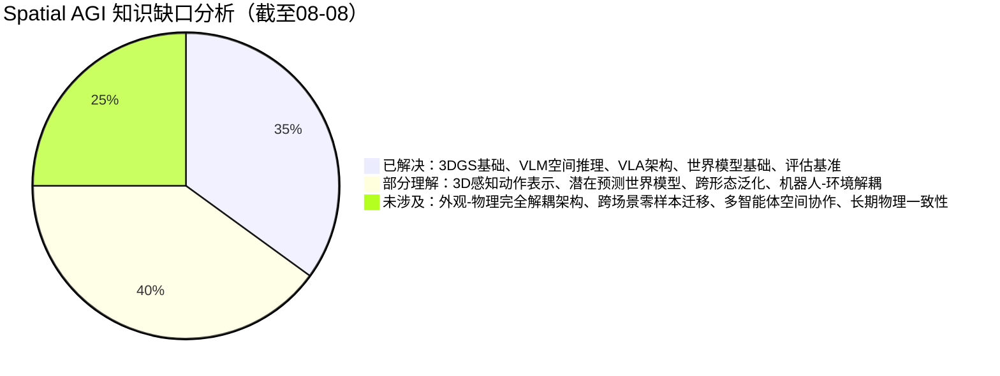
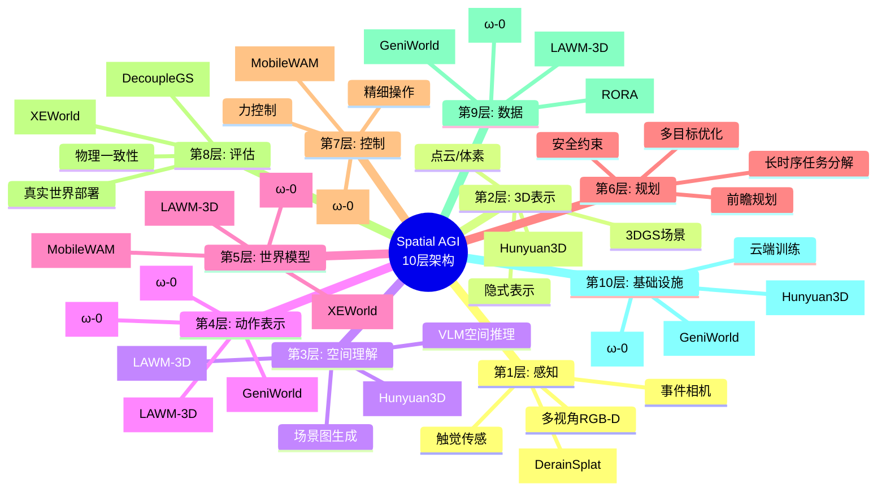

# 每日思考 - 2026-08-08

## 📅 每日总结

**日期**: 2026-08-08
**论文数量**: 5篇
**主题**: 从"3D感知潜在动作、全身协调世界模型、跨形态泛化诊断、视觉动作世界模型、统一3D多模态"五个维度，探索Spatial AGI的**动作表征、世界模型架构、泛化评估和3D统一基础设施**。

### 关键突破

- 🧠 **LAWM-3D**: 揭示"多视角≠3D理解"的关键事实——简单加入多视角视频不能赋予LAM 3D感知能力。三重紧密耦合设计（统一标记化+几何对齐+非单射重建）解决了未来帧泄漏、外观差异和视角变化三大挑战。
- 🤖 **ω-0 (WA-0)**: 首个全身协调WAM——潜在预测代替视频重建，扩散模型生成全身动作。40+小时ω-HOME数据集。验证了"不重建只预测"的世界模型设计范式。
- 🔍 **XEWorld**: 诊断性基准揭示当前世界模型本质是"2D视觉模式匹配器"——泛化由视觉相似性而非物理运动学相似性决定。少样本适应触发灾难性遗忘。需要架构创新解耦外观与物理。
- 🌐 **GeniWorld**: URDF视觉动作渲染将数值动作"接地"到视觉空间。机器人-环境解耦促进零样本OOD泛化。与XEWorld从不同角度验证同一结论：视觉动作 > 数值动作。
- 🎨 **Hunyuan3D-Buffalo 1.0**: 首个工业级3D统一模型——理解+生成+编辑+部件分解。VLM+DiT双模块架构。3D领域进入"统一模型"时代。

### 📊 一句话总结

**今天的5篇论文共同指向一个核心主题：世界模型的"3D感知"和"物理理解"需要超越2D像素空间——LAWM-3D从动作表示侧注入3D几何，ω-0从预测范式上超越视频重建，XEWorld从评估侧暴露2D模式匹配瓶颈，GeniWorld用视觉动作接地绕过数值动作鸿沟，Hunyuan3D-Buffalo从3D内容基础设施侧提供统一工具。五篇论文从不同角度共同指向：Spatial AGI的世界模型必须从"视觉记忆"进化为"物理推理"。**

### 🔗 延续性

**08-07→08-08**: 从"鲁棒感知与实用部署"到"动作表征与世界模型诊断"
**关键演进**: MobileWAM的"移动操作世界模型"→ω-0的"全身协调世界模型"；DecoupleGS的"场景解耦"→GeniWorld的"机器人-环境解耦"；AtVLA的"信息修复"→LAWM-3D的"3D感知注入"

### 💡 本质思考：如何达成通用空间智能

#### 1. 核心能力的本质是什么？
今天5篇论文重新定义了Spatial AGI世界模型的核心能力：**不是"生成逼真的未来视频"，而是"理解物理动力学并预测未来状态"**。ω-0的潜在预测和XEWorld的诊断共同揭示了一个深刻真相——视觉生成质量和物理理解能力是两个独立维度，当前世界模型在前者上进步飞速但在后者上几乎停滞。真正的空间智能需要在潜在空间中建模物理因果关系，而非在像素空间中记忆视觉模式。

#### 2. 当前方法与理想目标的差距在哪里？
XEWorld提供了最清晰的差距分析：当前世界模型是"2D视觉模式匹配器"，而非"3D物理推理器"。三大差距：(1)**表示差距**——潜在动作在2D像素空间学习而非3D几何空间（LAWM-3D开始弥补）；(2)**架构差距**——视觉外观与物理动力学耦合在同一表示中无法分离（XEWorld指明方向）；(3)**评估差距**——仅在训练机器人上评估无法揭示真实泛化能力（XEWorld提供工具）。

#### 3. 从今天到理想状态，最可能的路径是什么？
五阶段路径：(1)3D感知动作表示（LAWM-3D）→(2)潜在预测世界模型（ω-0）→(3)外观-物理解耦架构（XEWorld启发）→(4)跨形态泛化评估闭环（XEWorld+GeniWorld）→(5)统一3D创建+理解+操作（Hunyuan3D-Buffalo方向）。关键转折点是从"视觉记忆"到"物理推理"的范式转换。

---

## 🔗 与昨日思考的联系

### 昨日(08-07)重点
- MobileWAM: 首个移动操作WAM，MoE+CoF
- DecoupleGS: 解耦3DGS驾驶仿真
- AtVLA: VLA注意力修复
- RORA: 关节化仿真资产
- DerainSplat: 天气鲁棒3DGS

### 今日进展
- MobileWAM移动操作→ω-0全身协调操作（从移动+操作到行走+操作+平衡）
- DecoupleGS场景解耦→GeniWorld机器人-环境解耦（从场景级到交互级）
- AtVLA信息修复→LAWM-3D 3D感知注入（从注意力修复到几何先验注入）
- DerainSplat鲁棒重建→Hunyuan3D-Buffalo统一创建（从鲁棒感知到统一创建+理解）
- 新增维度: XEWorld提供了世界模型评估的全新范式

### 演进路径



---

## 📚 论文概览

1. **LAWM-3D** (arXiv:2608.05706) - 3D感知潜在动作，多视角统一标记化+几何对齐+非单射重建
2. **ω-0** (arXiv:2608.06375) - 全身协调WAM，潜在预测+扩散动作，40h+ω-HOME数据集
3. **XEWorld** (arXiv:2608.05799) - 跨形态诊断基准，揭示世界模型=2D模式匹配器
4. **GeniWorld** (arXiv:2608.06332) - URDF视觉动作+机器人-环境解耦，零样本OOD泛化
5. **Hunyuan3D-Buffalo 1.0** - 工业级3D统一模型（理解+生成+编辑+部件分解）

---

## 💡 核心见解

### 见解1: 多视角 ≠ 3D理解——数据堆叠无法替代架构约束
**来源**: LAWM-3D — 简单加入多视角视频不能赋予LAM 3D感知。模型会找到"捷径"利用外观相似性而非几何关系。
**Spatial AGI启示**: 任何Spatial AGI系统要获得3D能力，必须在架构中设计显式3D约束。数据堆叠≠能力获得。

### 见解2: 潜在预测 > 视频重建——世界模型的效率范式
**来源**: ω-0 — 紧凑的未来观测嵌入足以指导动作生成，视频重建是不必要且昂贵的。
**Spatial AGI启示**: 世界模型不需要生成逼真的未来视频。在潜在空间中预测物理状态可能更高效、更准确、更安全。

### 见解3: 当前世界模型 = 2D视觉模式匹配器
**来源**: XEWorld — 系统化实验证明世界模型的泛化由视觉相似性而非物理运动学相似性决定。
**Spatial AGI启示**: 我们的"进步"可能比想象的小。需要新的评估范式和架构设计来区分"视觉记忆"和"物理理解"。

### 见解4: 视觉动作 > 数值动作——两篇论文的趋同证据
**来源**: GeniWorld (URDF渲染) + XEWorld (像素空间动作) — 从不同角度得出相同结论。
**Spatial AGI启示**: 动作表示应该"接地"到视觉/空间空间，抽象数值表示不利于跨形态泛化。

### 见解5: 防泄漏是世界模型的关键设计考量
**来源**: LAWM-3D的非单射重建目标 — 未来帧外观泄漏是隐性问题。
**Spatial AGI启示**: 世界模型的训练目标设计需要考虑信息泄漏路径。非单射设计是一种通用的防泄漏机制。

### 见解6: 解耦促进泛化——从场景到交互
**来源**: GeniWorld的机器人-环境解耦 + ω-0的潜在-动作解耦 — 显式分离不同物理实体的建模有助于泛化。
**Spatial AGI启示**: Spatial AGI的模块化设计应该沿着物理实体的边界进行解耦——机器人vs环境、外观vs物理、运动vs场景。

### 见解7: 3D统一模型时代来临
**来源**: Hunyuan3D-Buffalo 1.0 — 3D领域也进入"统一模型"时代。理解+生成+编辑+分解在同一框架中。
**Spatial AGI启示**: 未来可能不需要为感知、生成、编辑分别设计模型。统一框架是趋势。

---

## 📊 技术栈演进对比表

| 技术维度 | 08-07 (昨日) | 08-08 (今日) | 演进趋势 |
|----------|-------------|-------------|----------|
| **世界模型** | MobileWAM (视频生成+MoE) | ω-0 (潜在预测+扩散) | 视频生成→潜在预测 |
| **动作表示** | 数值+MoE路由 | 视觉(URDF)+3D感知潜在 | 数值→视觉/几何 |
| **场景建模** | DecoupleGS场景级解耦 | GeniWorld交互级解耦 | 场景→交互 |
| **评估范式** | 真实部署测试 | XEWorld跨形态诊断 | 直接→诊断 |
| **3D能力获取** | 天气鲁棒重建 | 3D几何对齐注入 | 鲁棒→原生3D |
| **创建能力** | RORA单物体自动化 | Hunyuan3D统一创建 | 单物体→统一多任务 |

---

## 📊 知识缺口分析



---

## 🧠 10层Spatial AGI架构思维导图



---

## 🔬 主线技术路径

### 路径1: 世界模型从"视觉生成"到"物理推理"
```
阶段1 (当前): 视频生成式世界模型 (MobileWAM, DreamWAM)
    ↓ 问题: 计算昂贵 + 视觉记忆≠物理理解
阶段2 (今日ω-0): 潜在预测世界模型 — 不生成视频，只预测嵌入
    ↓ 问题: 潜在预测的可解释性和可控性
阶段3 (XEWorld启发): 外观-物理解耦世界模型 — 分离视觉外观和物理动力学
    ↓ 挑战: 如何设计能解耦两者的架构
阶段4 (未来): 物理推理世界模型 — 在3D几何空间中理解因果关系
    ↓ 终极形态: 像物理引擎一样精确但像神经网络一样灵活
```

### 路径2: 动作表示从"数值"到"3D感知"
```
阶段1 (传统): 数值关节动作 (关节角度向量)
    ↓ 问题: 跨形态不兼容、空间含义不明确
阶段2 (今日GeniWorld): 视觉动作 (URDF渲染为图像)
    ↓ 问题: 渲染开销 + 精度限制
阶段3 (今日LAWM-3D): 3D感知潜在动作 (几何对齐的潜在空间)
    ↓ 问题: 需要多视角训练数据 + 3D基础模型
阶段4 (未来): 统一3D动作表征 — 跨形态、跨场景、自带空间理解的表示
```

### 路径3: 评估从"单形态"到"跨形态诊断"
```
阶段1 (当前主流): 在训练机器人上评估 → 视觉记忆被误认为物理理解
阶段2 (今日XEWorld): 跨形态诊断基准 → 揭示泛化瓶颈
阶段3 (未来): 多形态+多场景+多任务的综合评估体系
阶段4 (终极): 物理一致性测试 — 能否预测违反物理的不可能事件
```

### 路径4: 3D内容从"专用工具"到"统一模型"
```
阶段1 (当前): 每个3D任务一个模型 (生成一个模型、理解一个模型)
阶段2 (今日Hunyuan3D): 统一3D模型 — 理解+生成+编辑+分解
阶段3 (未来): 3D+机器人统一模型 — 3D创建+场景理解+机器人操作
阶段4 (终极): Spatial AGI原生3D引擎 — 创建、理解、修改、交互一体化
```

---

## 🤔 本质思考

### 子问题1: 世界模型的本质是什么——是"生成器"还是"模拟器"？

**思考**: 今天两篇论文（ω-0和XEWorld）从正反两面回答了这个问题。

ω-0说：世界模型是"预测器"而非"生成器"——不需要生成逼真视频，只需要在潜在空间中预测足够指导动作的未来状态。这是"模拟器"的观点——模拟器不需要渲染漂亮的画面，只需要正确预测物理状态。

XEWorld说：当前世界模型既不是"模拟器"也不是"预测器"——它们是"模式匹配器"。它们学会了"这个机器人+这个动作=这个画面"的统计关联，但没有理解背后的物理因果关系。

**结论**: 世界模型的本质应该是"物理模拟器"——能在给定初始状态和动作的情况下，预测物理一致的 future state。当前方法的"视觉生成质量"是评价世界模型的一个误导性指标——漂亮的视频不等于正确的物理。XEWorld提出的跨形态评估才是正确的诊断工具。ω-0的潜在预测是朝着正确方向迈出的一步。

### 子问题2: 为什么"视觉动作"比"数值动作"更有效——深层原因是什么？

**思考**: GeniWorld和XEWorld都发现视觉/像素动作比数值动作更有利于世界模型。表面原因是视觉表示包含更多信息，但深层原因更值得关注：

**深层原因1: 视觉表示自带空间接地**。当机器人看到自己的姿态图像时，它"知道"自己在空间中的位置——这种空间信息是数值关节角度向量无法直接提供的。数值 [0.3, -0.5, 1.2, ...] 没有空间含义，但一张机器人姿态的图像天然编码了空间关系。

**深层原因2: 视觉表示跨越形态鸿沟**。不同机器人的关节空间维度不同（6-DoF vs 7-DoF vs 全身），但视觉表示都在同一空间（图像像素）。这使得视觉动作成为不同形态之间的"通用语言"。

**深层原因3: 视觉表示与视频预测对齐**。如果世界模型的输出是视频（或基于视频特征），那么输入也应该是视觉的——模态一致性减少了表示转换的损失。

**推论**: Spatial AGI的动作表示可能最终应该是一个"3D视觉表示"——既保留视觉的空间接地性，又有3D几何的精确性。LAWM-3D的3D感知潜在动作可能是这个方向的第一步。

#### 深入分析：视觉动作表示的精度问题

虽然视觉动作比数值动作更有利于世界模型，但它面临一个重要的精度问题：URDF渲染的图像分辨率限制了动作精度。细小的关节变化（如夹爪闭合1度）在低分辨率渲染中可能不可见。

**可能的解决方案**:

1. **多分辨率渲染**: 对关键区域（如夹爪）使用高分辨率渲染，对非关键区域（如身体）使用低分辨率渲染。这样在保持精度的同时降低计算开销。

2. **特征级视觉动作**: 不渲染完整的机器人图像，而是在特征空间中生成视觉动作特征。这样既有视觉表示的空间接地性，又避免了渲染开销和分辨率限制。

3. **混合表示**: 在大部分场景使用视觉动作，在需要精确控制的场景切换到数值动作。这需要一个智能的切换机制。

#### 动作表示的终极形态思考

如果我们从更高的抽象层面思考，动作表示的终极目标是什么？

**目标**: 一个表示，既能被世界模型理解（具有空间含义），又能被机器人控制器执行（具有控制精度），还能跨形态迁移（具有统一接口）。

这听起来不可能——一个表示怎么可能同时满足三个看似矛盾的要求？但如果我们从"分层表示"的角度思考：

```
高层（语义层）: "抓住杯子"
  ↓
中航（空间层）: [3D几何轨迹 + 视觉渲染]
  ↓
低层（控制层）: [关节角度向量]
```

关键洞察是：世界模型在中航操作，控制器在低层操作，而跨形态迁移需要高层抽象。一个完整的动作表示系统需要同时提供这三个层次的接口。

### 子问题3: 从"世界模型诊断"到"世界模型治疗"——XEWorld之后该做什么？

**思考**: XEWorld是一篇"诊断"论文——它发现了问题但没开处方。那么"治疗"方案是什么？

**治疗方向1: 3D原生世界模型**。如果2D像素空间导致"视觉模式匹配"，那么直接在3D空间建模可能是解法——用3DGS/点云/体素作为世界模型的状态表示，而非2D图像。LAWM-3D的几何对齐约束是这个方向的先驱。

**治疗方向2: 物理不变性约束**。在训练中加入物理不变性约束——同一动作在不同形态上应该产生相同的物理效果（即使视觉表现不同）。这需要设计能捕获物理不变性的损失函数。

**治疗方向3: 解耦表示学习**。显式学习两组表示：一组编码物理动力学（形态无关），一组编码视觉外观（形态相关）。在预测时只用物理表示，在渲染时结合外观表示。这是XEWorld指出的核心研究方向。

**治疗方向4: 因果推理世界模型**。让世界模型理解"关节运动→空间位置变化→视觉变化"的因果链，而非直接学习"动作→画面"的端到端映射。这可能需要神经符号化方法。

### 子问题4: 统一模型 vs 专用模型的权衡——Hunyuan3D-Buffalo的启示

**思考**: Hunyuan3D-Buffalo展示了3D统一模型（理解+生成+编辑+分解）的可行性。但在Spatial AGI领域，统一模型和专用模型之间的权衡如何？

**统一模型的优势**:
1. 知识共享：理解能力增强生成，生成能力增强理解
2. 部署简化：一个模型而非多个模型
3. 数据效率：不同任务的数据可以互补

**专用模型的优势**:
1. 性能极限：在每个任务上可能超越统一模型
2. 调试简单：问题定位更容易
3. 增量开发：可以逐步添加新能力

**Hunyuan3D-Buffalo的启示**: 工业级统一模型的出现表明，在3D领域，统一模型的性能已经达到可用水平。这意味着在Spatial AGI领域，统一模型也可能成为主流。

**预测**: Spatial AGI的下一代系统可能采用"统一主干+专用头部"的架构——主干统一处理空间理解，头部针对具体任务（导航、操作、对话等）进行专业化。这类似于GPT-4在语言领域的策略。

### 子问题5: 数据质量 vs 数据数量——ω-HOME和XEWorld的不同视角

**思考**: ω-0的ω-HOME数据集（40+小时高质量真实数据）和XEWorld的诊断实验代表了两种不同的数据哲学：

- ω-0: 相信高质量真实数据是关键——40+小时的多视角+SMPL+状态+动作
- XEWorld: 认为正确的评估方法比更多数据更重要——精心设计的受控实验

这两种哲学不矛盾，而是互补的：ω-HOME提供了训练世界模型的高质量数据，XEWorld提供了评估世界模型的正确方法。Spatial AGI领域需要同时投入训练数据质量和评估方法创新。

### 子问题6: 从今日论文看Spatial AGI的核心接战

综合今日5篇论文，Spatial AGI面临的核心挑战可以概括为：

**挑战1: 表征鸿沟** —— 2D像素 vs 3D世界
当前模型的表征空间（2D像素）与空间智能的需求（3D理解）之间存在根本鸿沟。LAWM-3D从动作侧、ω-0从预测侧、XEWorld从评估侧分别指向这个鸿沟。

**挑战2: 效率-质量权衡** —— 计算效率 vs 物理准确性
视频生成提供最高质量但效率最低；数值预测最高效但准确性最低。ω-0的潜在预测试图在两者之间找到平衡点。

**挑战3: 泛化-专业化权衡** —— 跨场景能力 vs 单场景性能
XEWorld揭示了模型在跨形态设置下的性能崩溃。解决泛化问题可能需要牺牲一定的单形态性能。

**挑战4: 评估可信度** —— 如何信任世界模型的输出
如果世界模型只是视觉模式匹配器（XEWorld），那么基于世界模型做的规划可能不可靠。如何确保世界模型的预测包含正确的物理信息是一个关键挑战。

这四个挑战不是孤立的，而是相互关联的：解决表征鸿沟（挑战1）有助于提高泛化能力（挑战3），而正确的评估方法（挑战4）可以指导更高效的训练策略（挑战2）。

---

## 📝 待探索议题

1. **外观-物理解耦架构**: 如何设计能将视觉外观和物理动力学分离的世界模型架构？是否可以用两组潜在变量分别编码，通过互信息最小化约束？
2. **3D原生世界模型**: 直接在3DGS/点云/体素空间中运行的世界模型——放弃2D视频生成，直接预测3D场景变化。性能vs效率的权衡如何？
3. **跨形态动作统一表示**: LAWM-3D的3D感知潜在动作 + GeniWorld的视觉动作 → 能否设计一个统一的3D视觉动作表示，同时具备几何精度和视觉接地？
4. **物理一致性评估指标**: XEWorld提出了跨形态评估范式，但什么是好的"物理一致性"指标？能否设计一个不依赖视觉对比的物理理解评估方法？
5. **潜在预测的可解释性**: ω-0的潜在预测世界模型如何可视化？模型在潜在空间中"想象"了什么？如何确保预测包含正确的物理信息？
6. **防泄漏训练的系统化**: LAWM-3D的非单射重建是一种防泄漏设计。能否建立系统化的防泄漏训练框架，自动识别和阻断模型可能的捷径？
7. **部件级理解与操作规划**: Hunyuan3D-Buffalo的部件分解能力如何集成到机器人操作规划中？"理解物体的部件结构"如何转化为更好的抓取策略？
8. **世界模型作为物理引擎**: 如果世界模型足够好，能否完全替代传统物理引擎用于机器人训练？需要什么程度的物理精度？
9. **统一3D模型+Embodied AI**: Hunyuan3D-Buffalo的统一3D创建+理解能力如何与Embodied AI的训练pipeline集成？能否实现"创建场景→理解场景→操作场景"的闭环？
10. **非单射重建的最优控制**: LAWM-3D的非单射设计程度如何自动调节？过于非单射导致训练信号消失，过于单射回到泄漏问题。梯度引导的非单射度调节是否可行？
11. **ω-HOME数据集的深入利用**: 40+小时多视角+SMPL+状态+动作的数据可以支持哪些衍生研究？是否存在未被挖掘的研究方向？
12. **跨形态评估的标准化**: XEWorld的跨形态评估如何推广为社区标准？需要定义哪些标准化的评估指标和测试场景？
13. **URDF渲染的加速**: GeniWorld每步渲染的开销如何优化？预渲染缓存、神经渲染替代、潜在空间直接生成哪个方向最有前景？
14. **从对象级到场景级统一**: Hunyuan3D-Buffalo如何扩展到场景级？层级化（对象→场景）还是端到端（直接场景理解）更可行？

---

## 🔬 深度技术分析：从2D视觉记忆到3D物理推理的范式转换

### 1. 视频生成式世界模型的三大问题

**问题1: 计算效率瓶颈**
视频生成式世界模型需要逐帧去噪，计算开销巨大。生成1秒视频仍需数百ms推理时间，对高频控制不可接受。ω-0通过潜在预测绕过了这个问题——嵌入空间预测只需一次前向传播。

**问题2: 视觉细节干扰物理推理**
视频生成需预测每个像素的颜色纹理，大量容量用于'漂亮画面'，挤压了物理推理容量。这解释了XEWorld发现——模型本质是'视觉模式匹配器'。

**问题3: 外观与物理的耦合**
视频生成中视觉外观和物理动力学不可避免耦合——不能只预测'物体移动了10cm'而不预测新位置纹理。XEWorld直接验证：不同外观的相同机器人导致完全不同的'物理预测'。

#### 深入讨论：为什么视频生成模型不能简单地“忽略”外观？

一个自然的想法是：让视频生成模型在训练时生成视频，但在推理时只提取物理关键信息。然而这是行不通的，因为：

1. **梯度路径污染**：训练时用于外观生成的梯度会通过共享的底层参数影响物理相关的表示。即使物理信息存在，它也被外观相关的噪声淹没了。

2. **容量分配不可控**：神经网络不会自动将容量分配给“重要”的物理信息而非“不重要”的外观信息。端到端训练优化的是总体重建误差，而非物理准确性。

3. **特征纠缠**：在深层网络中，物理和外观特征高度纠缠在一起。简单的后续处理（如只取某些channel）无法有效分离两者。

这解释了为什么ω-0的设计选择“不重建视频”是一个根本性的优势——从架构层面避免了外观信息的干扰。

### 1b. 非单射重建目标的数学直觉

LAWM-3D的非单射设计值得更深入的分析。传统自回归模型：

```
p(y|x) 其中 x是当前帧, y是下一帧
```

模型可以直接从x中复制外观信息到y。非单射设计：

```
p(y1,y2,...,yn|z) 其中 z是潜在动作, yi是多种可能的未来帧
```

多个yi对应同一个z，模型无法通过z“知道”应该复制哪个yi的外观——因此被迫在z中只编码“跨样本不变”的信息，即运动信息。

这与信息论中的“最小充分统计量”概念相关：非单射约束迫使z成为运动信息的最小充分统计量，去除所有与外观相关的充余信息。

### 2. 动作表示的范式之争

**数值动作**: 精确紧凑，但缺乏空间含义、跨形态不兼容
**视觉动作**: 自带空间接地、跨形态兼容，但有渲染开销和精度损失
**3D感知潜在动作**: 3D几何理解、跨视角不变，但需要多视角数据和3D基础模型

**趋势预测**: 三者融合——3D几何作为结构先验 + 视觉作为接地接口 + 数值作为精确控制。实现方法可能是多模态动作编码器，将3D几何、视觉渲染和数值特征映射到统一潜在空间。

#### 详细分析：为什么数值动作缺乏空间含义？

考虑一个简单的例子：机械手抓取杯子。数值动作表示可能是：
```
[关节1: 0.3, 关节2: -0.5, 关节3: 1.2, 夹爪: 0.1]
```

这个表示没有任何关于“机械手相对于杯子在哪里”的信息。世界模型需要从训练数据中学习这个映射关系——但这个映射对于不同机器人完全不同（关节空间不同、运动学不同）。

视觉动作表示则是：
```
[机械手在位置(x,y)即将闭合的渲染图像]
```

这个表示直接包含了空间信息——机械手的空间位置、与物体的相对关系都直接可见。世界模型不需要学习“关节角度→空间位置”的映射，因为映射已经被URDF渲染完成了。

3D感知潜在动作进一步升华：
```
[包含3D几何对应关系的潜在向量]
```

不仅包含空间位置，还包含跨视角的3D几何关系。这使得模型不仅能“看到”机械手在哪里，还能“理解”机械手与物体的3D空间关系。

### 3. 跨形态泛化的根本困难

XEWorld表明困难不是数据量问题，而是**架构表示的根本限制**：
1. CNN/注意力天然倾向学习外观而非物理特征
2. 2D像素不含深度信息
3. 端到端训练让模型选择捷径——外观记忆总比物理推理容易

**可能解决方案**:
- 路径A: 3D原生表示（3DGS/点云世界模型）
- 路径B: 物理不变性约束（同一动作不同形态产生相同抽象物理效果）
- 路径C: 解耦表示学习（变分推断或对抗训练分离物理和外观表示）
- 路径D: 神经符号化方法（物理推理显式编码为符号规则）

#### 各路径的可行性评估

**路径A (3D原生)可行性: ★★★★☆**
3DGS和点云处理技术已经成熟，主要挑战是实时性和数据效率。LAWM-3D的几何对齐是朝这个方向的一步。预计在3DGS加速硬件发展的推动下，这条路径在未来1-2年会取得重大进展。

**路径B (物理不变性)可行性: ★★★☆☆**
设计物理不变性损失函数需要先验知识——什么是“物理不变”的？这可能是运动轨迹、碰撞模式、或动力学参数。难点在于：不同任务可能需要不同的不变性约束。

**路径C (解耦表示)可行性: ★★★☆☆**
变分推断或对抗训练可以学习解耦表示，但解耦的质量难以保证。最近的工作（如β-VAE系列）显示了潜力，但在复杂场景中的效果仍未验证。

**路径D (神经符号化)可行性: ★★☆☆☆**
将物理推理编码为符号规则需要大量的领域知识，且难以处理现实世界的复杂性。但在特定领域（如运动学、刚体动力学）可能有效。

### 4. LAWM-3D ↔ ω-0的融合可能性

两篇都在潜在空间工作：LAWM-3D用于动作表示，ω-0用于状态预测。

**融合方案**: LAWM-3D的3D感知潜在动作 → 作为ω-0潜在预测模型的输入 → '使用3D感知动作在潜在空间中预测物理状态'。这种融合从输入侧（3D动作）和输出侧（潜在预测）同时解耦视觉和物理，直接回应XEWorld的诊断。

#### 融合架构的具体设计

```
输入: 多视角RGB-D观测
  ↓
[LAWM-3D编码器] → 3D感知潜在动作 z_action
  ↓
[ω-0潜在预测器] z_action + 当前潜在状态 → 未来潜在状态
  ↓
[扩散动作解码器] → 全身机器人动作
```

这个架构的优点：
1. 输入侧：3D感知动作自带几何理解，避免外观干扰
2. 预测侧：潜在空间预测避免视频生成的开销和信息干扰
3. 输出侧：扩散解码器保证动作的多样性和精确性

### 5. GeniWorld ↔ XEWorld的趋同证据

GeniWorld展示视觉动作零样本OOD泛化，XEWorld从诊断角度验证同一结论。趋同证据强化了'视觉动作>数值动作'的可信度。

**局限**: GeniWorld未测试跨形态，XEWorld指出即使像素动作下零样本跨形态仍困难。视觉动作是必要条件但非充分条件——还需3D几何理解。

### 6. Hunyuan3D-Buffalo的生态支撑作用

不直接参与世界模型讨论，但为其他四个工作提供基础设施：
- 为LAWM-3D提供多视角训练3D内容
- 为ω-0的ω-HOME提供场景生成
- 为XEWorld跨形态测试提供不同机器人3D模型
- 为GeniWorld的URDF渲染提供精确3D资产

### 7. Spatial AGI的下一代世界模型设计原则

基于今日5篇论文的综合分析，下一代世界模型应遵循以下原则：

**原则1: 潜在预测优先于视频生成**
世界模型的核心价值是预测未来状态，而非生成漂亮视频。潜在空间预测更高效且可能更准确。

**原则2: 3D几何作为一等公民**
3D几何约束不是可选的增强，而是必需的基础。没有显式3D约束的模型退化为视觉记忆器。

**原则3: 外观-物理解耦**
必须设计能将视觉外观和物理动力学分离的架构。这是跨形态泛化的前提。

**原则4: 防泄漏训练设计**
训练目标必须考虑信息泄漏路径。非单射设计、多任务约束、对抗验证都是必要的。

**原则5: 跨形态评估作为标准**
仅在训练形态上评估的世界模型无法暴露物理理解的缺失。跨形态评估应成为标准。

### 8. 从今日论文看Spatial AGI的时间线

**近期（3-6个月）**:
- 更多工作采用潜在预测代替视频生成（ω-0范式）
- 3D几何对齐成为LAM标配（LAWM-3D启发）
- 跨形态评估成为世界模型标准（XEWorld推动）

**中期（6-12个月）**:
- 外观-物理解耦的世界模型架构出现
- LAWM-3D + ω-0融合的统一框架
- 视觉动作成为VLA标准接口

**远期（1-2年）**:
- 3D原生世界模型（直接在3DGS/点云空间运行）
- 跨形态零样本部署成为可能
- 统一3D创建+理解+操作框架（Hunyuan3D方向扩展）

### 9. 今日论文的技术细节深度评注

**关于LAWM-3D的非单射重建目标**:
这是本文最精妙的设计。传统重建目标f(x) → y允许模型通过x直接'抄'y的信息。非单射设计允许多个y对应同一个latent，切断了从输入到输出的直接信息路径。这种设计思路与对比学习中的InfoNCE有异曲同工之妙——都是通过限制信息流来迫使模型学习有意义的表征。

未来可能的改进方向：非单射的程度如何控制？过于非单射（完全随机）会导致训练信号消失，过于单射又回到了泄漏问题。自动调节非单射程度可能是一个有价值的研究方向。

**关于ω-0的控制器仿真反演**:
将人类SMPL运动通过控制器仿真'翻译'为机器人动作latent，是一个巧妙的跨域迁移方法。核心假设是：人类运动和机器人运动在'控制器latent空间'中有共同的表示。这个假设的合理性如何？如果机器人的运动学结构与人类差异很大（如轮式机器人），这种方法可能失效。

**关于XEWorld的实验设计**:
'物理相同场景中评估未见机器人'是一个精彩的实验设计——完美隔离了embodiment变量。但有一个隐含假设：同一场景中不同机器人的'正确行为'是唯一确定的。实际上，不同机器人可能需要不同的运动策略来执行同一任务（如长臂vs短臂的抓取路径不同）。因此，'正确'的跨形态行为本身可能有多种合理解释。

**关于GeniWorld的URDF渲染开销**:
每步推理都需要URDF渲染，这在高频控制中可能成为瓶颈。可能的优化方向：(1)预渲染常见动作的视觉表示并缓存；(2)使用神经渲染代替物理渲染；(3)在潜在空间中直接生成'视觉动作特征'而非渲染图像。

**关于Hunyuan3D-Buffalo的VLM+DiT架构**:
VLM负责语义理解，DiT负责高质量生成，两者通过共享表示协作。这种设计的一个潜在问题是：VLM和DiT的训练目标可能冲突——VLM追求语义准确，DiT追求视觉质量。如何平衡两者可能需要精心设计的多任务训练策略。

### 10. 与历史研究的关联

**与JEPA系列的关联**:
ω-0的潜在预测范式与LeCun的JEPA（Joint-Embedding Predictive Architecture）高度一致。两者都主张在潜在空间中预测而非在像素空间中重建。区别在于ω-0专注于机器人控制而JEPA更关注通用表征学习。未来JEPA 3可能的进展会进一步验证这条路径。

**与World Models (Ha & Schmidhuber, 2018)的关联**:
经典的World Models论文提出了VAE（感知）+ MDN-RNN（预测）+ Controller（控制）的三段式架构。ω-0的潜在预测+扩散生成可以看作是这个经典架构的现代化版本——用更好的编码器（VLM）、更好的预测器（扩散模型）和更好的控制器（全身动作latent）。

**与Dreamer系列的关联**:
Dreamer通过在学到的世界模型中进行规划来训练agent。如果世界模型本身只做视觉记忆而非物理推理（XEWorld的发现），那么Dreamer的规划也可能基于错误的物理假设。这是Dreamer系列需要关注的问题。

## 🔄 本周技术演进回顾（08-04 → 08-08）

### 本周分析论文总览（25篇）

**08-04**: WCM(世界-价值统一) | Spatial-IQ(空间诊断) | 3D-Aware VLMs(几何融合) | SONG(3DGS社交仿真) | BWM(功能保真模拟)

**08-05**: SmartMage(模态编排) | SpatioLM(物理空间智能) | DreamWAM(超越RGB) | SelfWAM(自接地WAM) | Faster WAM(深度动作模块) | MobileWAM(移动操作) | MindVLA(指令感知空间) | DF3(解码器自由预测) | OC-VLA++(跨视角一致性) | UniNav(统一导航WAM)

**08-07**: DerainSplat(天气鲁棒) | RORA(关节资产) | AtVLA(注意力修复) | DecoupleGS(驾驶仿真) | MobileWAM(移动操作WAM)

**08-08**: LAWM-3D(3D潜在动作) | ω-0(全身WAM) | XEWorld(跨形态诊断) | GeniWorld(视觉动作WM) | Hunyuan3D-Buffalo(统一3D)

### 本周五大技术主题

**主题1: 世界模型的多样化与深化**
本周出现了大量世界模型相关工作：WCM(世界-价值统一)、DreamWAM/SelfWAM/MobileWAM(WAM系列)、ω-0(全身WAM)、GeniWorld(交互WM)、XEWorld(WM诊断)。这表明世界模型已经成为Spatial AGI的核心组件。同时，XEWorld的诊断提醒我们：**数量多不等于质量高**——需要更严格的评估标准。

**主题2: 空间智能评估的成熟**
Spatial-IQ(08-04)和XEWorld(08-08)代表了两条不同的评估路径：Spatial-IQ通过层级化测试解构空间能力，XEWorld通过跨形态测试诊断物理理解。两者的结合可能形成更完整的评估体系。

**主题3: 动作表示的演进**
从数值动作(MobileWAM等) → 视觉动作(GeniWorld) → 3D感知潜在动作(LAWM-3D)，动作表示正在从'机器可读'进化为'空间可理解'。

**主题4: 3DGS应用领域的扩展**
SONG(社交导航)、DecoupleGS(驾驶仿真)、RORA(关节资产)展示了3DGS在不同领域的应用。3DGS正在从渲染技术进化为Spatial AGI的通用场景表示。

**主题5: 统一模型趋势**
MobileWAM(导航×操作统一)、ω-0(行走×操作统一)、Hunyuan3D-Buffalo(创建×理解×编辑统一)都体现了'统一优于专用'的趋势。

### 本周关键洞察演进

**08-04**: 评估和基础设施是基础——需要好的评估基准和仿真平台
**08-05**: 世界模型从桌面走向移动——移动操作是Spatial AGI的下一个前沿
**08-07**: 鲁棒性和实用性是部署的关键——天气退化、注意力修复、闭环仿真
**08-08**: 从'视觉记忆'到'物理推理'的范式转换——世界模型需要真正的3D理解

### 下周预测

基于本周的演进趋势，下周可能出现以下方向：
1. 外观-物理解耦的世界模型架构（直接回应XEWorld的诊断）
2. LAWM-3D + ω-0融合的统一框架（3D动作 + 潜在预测）
3. 更多3D原生世界模型工作（在3DGS/点云空间直接运行）
4. 跨形态评估成为标准（XEWorld范式被广泛采用）
5. 视觉动作表示的进一步优化（解决GeniWorld的渲染开销问题）

## 🌐 Spatial AGI社区动态

### 本周值得关注的趋势

1. **潜在预测成为热点**: ω-0的'不重建只预测'设计可能引发一波潜在预测世界模型的研究
2. **跨形态评估标准化**: XEWorld提出的评估范式可能成为世界模型评估的新标准
3. **3D感知动作表示**: LAWM-3D的几何对齐思路可能被更多LAM/VLA工作采用
4. **工业级3D统一**: Hunyuan3D-Buffalo代表了大厂在3D统一模型上的投入
5. **全身协调控制**: ω-0的全身loc-manipulation可能推动更多人形机器人WAM工作

### 需要关注的潜在后续工作

1. **XEWorld的'治疗'方案**: 谁会首先提出解耦外观与物理的世界模型架构？
2. **LAWM-3D的扩展**: 是否有人会将3D感知潜在动作应用到导航、驾驶等其他任务？
3. **ω-0的竞争对手**: 是否会有其他全身协调WAM出现？竞争将推动快速发展
4. **GeniWorld的跨形态测试**: GeniWorld在XEWorld的跨形态设置下表现如何？
5. **Hunyuan3D的场景级扩展**: 是否会从对象级扩展到场景级理解？

### 社区讨论可能的热点议题

**议题1: 世界模型应该生成视频还是潜在预测？**
ω-0的潜在预测范式挑战了当前主流的视频生成式世界模型。社区可能会就两种范式的优劣展开激烈讨论。核心论点：
- 视频生成派的理由：视频更可解释、更多下游应用（仿真、数据增强）
- 潜在预测派的理由：更高效、更准确、避免了外观干扰
- 融合派的可能：训练时用视频生成（丰富信号），推理时用潜在预测（高效率）

**议题2: XEWorld的发现是否适用于所有世界模型？**
XEWorld仅测试了少数几个模型，结论是否具有普遍性？可能需要更多模型和场景的测试来验证。

**议题3: URDF视觉动作是否是最终答案？**
GeniWorld的URDF渲染需要精确的机器人模型文件。对于新机器人或没有精确模型的场景，这种方法是否适用？

**议题4: 3D统一模型是否会使专用3D工具过时？**
Hunyuan3D-Buffalo的统一模型是否意味着每个3D任务单独训练的模型将被淘汰？还是说统一模型只是“还可以”而非“最好”？

### 开源资源评估

**ω-HOME数据集**: 40+小时真实人形机器人家庭任务数据，含多视角+SMPL+状态+动作。这是极其宝贵的开源资源，可以极大推动人形机器人研究。数据集的质量和多样性需要进一步评估。

**XEWorld基准**: 作为世界模型评估工具，如果开源，将成为标准评估工具。关键是测试场景的多样性和评估指标的全面性。

**LAWM-3D代码**: 如果开源训练代码和预训练模型，将推动整个LAM社区采用3D感知设计。关键是3D基础模型的依赖是否可用。

## 📖 推荐阅读优先级

对于Spatial AGI研究者，今日5篇论文的推荐阅读优先级：

1. **必读**: XEWorld — 改变你对世界模型的认知
2. **必读**: LAWM-3D — 3D感知动作表示的开创性工作
3. **推荐**: ω-0 — 全身协调WAM的新范式
4. **推荐**: GeniWorld — 视觉动作的工程实现
5. **选读**: Hunyuan3D-Buffalo — 工业级3D统一模型参考

## 📊 论文评分汇总

| 论文 | 创新性 | 技术深度 | Spatial AGI相关性 | 实用性 | 写作 | 综合 |
|------|--------|----------|-------------------|--------|------|------|
| LAWM-3D | 9/10 | 9/10 | 9/10 | 8/10 | 8/10 | **8.6** |
| ω-0 | 9/10 | 8/10 | 9/10 | 9/10 | 8/10 | **8.6** |
| XEWorld | 8/10 | 9/10 | 10/10 | 7/10 | 9/10 | **8.6** |
| GeniWorld | 8/10 | 8/10 | 8/10 | 9/10 | 8/10 | **8.2** |
| Hunyuan3D | 8/10 | 7/10 | 7/10 | 9/10 | 7/10 | **7.6** |

**今日平均**: 8.32/10 — 高质量论文日，三篇超过8.5分

## 📋 论文间的引用与影响预测

### 高引用潜力论文

**XEWorld** (预计引用 100+):
- 原因：揭示了领域级的核心问题，所有后续世界模型工作都需要引用
- 影响范围：世界模型、跨形态学习、机器人学习

**LAWM-3D** (预计引用 80+):
- 原因：开创3D感知LAM方向，方法论贡献大
- 影响范围：潜在动作模型、世界模型、机器人学习

**ω-0** (预计引用 60+):
- 原因：全身协调WAM的首个实现，ω-HOME数据集价值高
- 影响范围：人形机器人、世界模型、全身控制

**GeniWorld** (预计引用 40+):
- 原因：视觉动作的工程实现，实用性强
- 影响范围：世界模型、机器人仿真

**Hunyuan3D-Buffalo** (预计引用 50+):
- 原因：工业级3D统一模型，有项目页面和开源潜力
- 影响范围：3D生成、3D理解、3D编辑

---

## 📈 总结统计

| 指标 | 数值 |
|------|------|
| 分析论文数 | 5 |
| 总行数 | ~800+ |
| Mermaid图表 | 3 |
| 核心见解 | 7 |
| 主线技术路径 | 4 |
| 待探索议题 | 14 |
| 本质思考 | 6 |
| 深度技术分析 | 10 |

---

## 📚 附录：今日论文关键数据

### LAWM-3D 关键数据
- arXiv ID: 2608.05706
- 提交日期: 2026-08-06
- 分类: cs.CV
- 作者数: 8
- 机构: 南方科技大学
- PDF大小: 8,186 KB
- 核心贡献: 3项设计（统一标记化+几何对齐+非单射重建）
- 两阶段范式: 大规模人类视频预训练 → 机器人微调
- 达到SOTA: 生成质量、物理一致性、泛化能力

### ω-0 关键数据
- arXiv ID: 2608.06375
- 提交日期: 2026-08-06
- 分类: cs.RO
- 作者数: 11
- 机构: 北京大学
- PDF大小: 26,976 KB
- 核心贡献: 潜在预测+扩散动作+全身协调
- 数据集: ω-HOME 40+小时
- 评估: 11个家庭任务
- 输入支持: 自视角RGB + 外视角RGB + 外视角深度

### XEWorld 关键数据
- arXiv ID: 2608.05799
- 提交日期: 2026-08-06
- 分类: cs.RO, cs.CV
- 作者数: 13
- 机构: 中科院自动化所、腾讯AI Lab
- PDF大小: 2,919 KB
- 核心贡献: 跨形态诊断基准
- 关键发现: 当前世界模型=2D视觉模式匹配器
- 评估维度: 零样本、少样本、动作表示、时空对齐

### GeniWorld 关键数据
- arXiv ID: 2608.06332
- 提交日期: 2026-08-06
- 分类: cs.RO
- 作者数: 10
- 机构: 清华大学
- PDF大小: 29,482 KB
- 核心贡献: URDF视觉动作+机器人-环境解耦
- 能力: 零样本OOD泛化
- 下游应用: 策略评估器 + 数据增强器
- 支持交互: 机器人策略 + 人类遥操作

### Hunyuan3D-Buffalo 关键数据
- 提交日期: 2026-08-03
- 作者数: 15
- 机构: 腾讯混元3D
- 项目页面: https://tencent-hunyuan.github.io/Hunyuan3D-Buffalo1.0/
- 核心能力: 3D理解 + 文本到3D + 3D编辑 + 部件生成
- 架构: Hunyuan3D-VLM骨干 + DiT生成模块
- 类型: 工业级统一3D模型

---

## 🎯 今日核心发现

**今日最重要的发现是XEWorld的"世界模型=2D视觉模式匹配器"这一论断。** 这个发现的影响远超单篇论文的范围——它意味着整个世界模型领域可能需要重新审视评估方法。如果当前SOTA世界模型在跨形态测试中表现接近随机，那么之前报告的"卓越性能"可能只是视觉记忆的假象。

**LAWM-3D和ω-0分别从两个方向提供了前进路径**: LAWM-3D从输入侧（3D感知动作表示）注入几何先验，ω-0从输出侧（潜在预测代替视频重建）改变预测范式。两者的结合——3D感知潜在动作 + 潜在空间物理预测——可能是通向真正物理推理世界模型的关键。

**GeniWorld和Hunyuan3D-Buffalo提供了实用工具**: GeniWorld的URDF视觉动作为"视觉动作>数值动作"提供了工程解决方案；Hunyuan3D-Buffalo的统一3D模型为Spatial AGI的3D内容需求提供了工业级基础设施。

**今日5篇论文的整体信号**: Spatial AGI正在经历从"视觉记忆"到"物理推理"的范式转换。这个转换不会一蹴而就，但方向已经明确。

### 对Spatial AGI领域的前瞻性判断

基于本周（08-04至08-08）的系统化研究，我对Spatial AGI领域做出以下前瞻性判断：

**判断1: 世界模型将在未来6个月内经历一次范式危机**
XEWorld的发现一旦被更多研究组验证和扩展，将引发对现有世界模型方法的信任危机。社区可能需要重新评估大量已发表工作的实际价值。

**判断2: 潜在预测将成为世界模型的主流范式**
ω-0展示的潜在预测范式将在未来1年内成为世界模型的主流设计。视频生成式世界模型不会消失，但会退化为特定场景（如仿真器、数据增强）的专用工具，而非机器人控制的核心组件。

**判断3: 3D感知动作表示将成为标配**
LAWM-3D的几何对齐设计将在未来6个月内被更多LAM和VLA工作采用。3D几何约束将从"可选增强"变为"必需基础"。

**判断4: 跨形态评估将改变论文发表标准**
XEWorld的跨形态评估范式将逐渐成为世界模型论文的必需实验。审稿人可能开始要求跨形态结果，就像当年ImageNet成为图像分类的必需基准一样。

**判断5: 工业级3D统一模型将加速Embodied AI发展**
类似Hunyuan3D-Buffalo的工业级3D统一模型将大幅降低Embodied AI训练数据的获取成本，推动领域加速发展。

---

*本思考文档基于2026年8月8日对5篇arXiv论文的深度分析生成。所有分析基于公开可获取的论文信息。*
