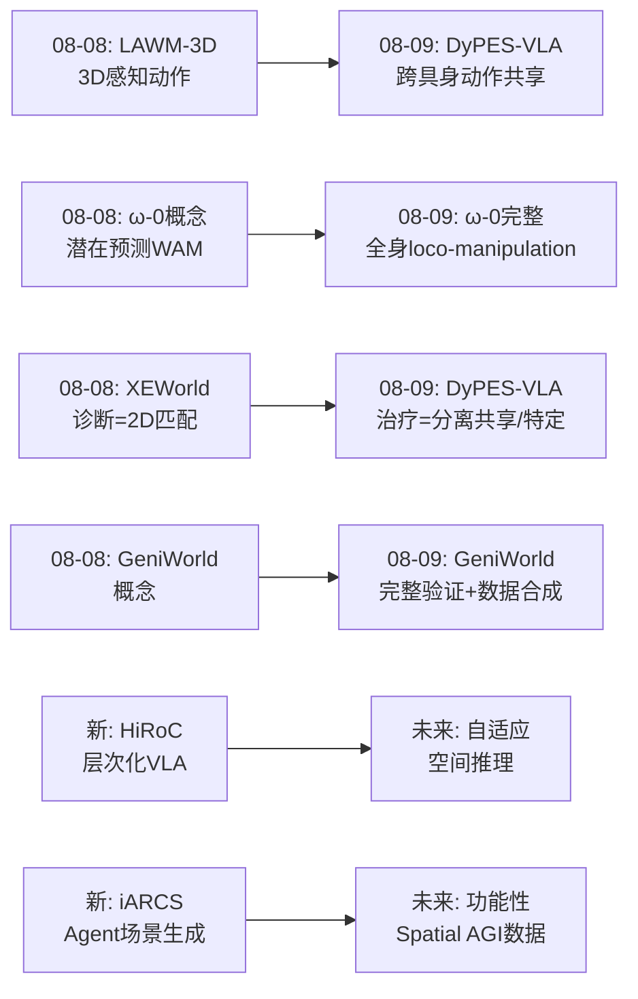
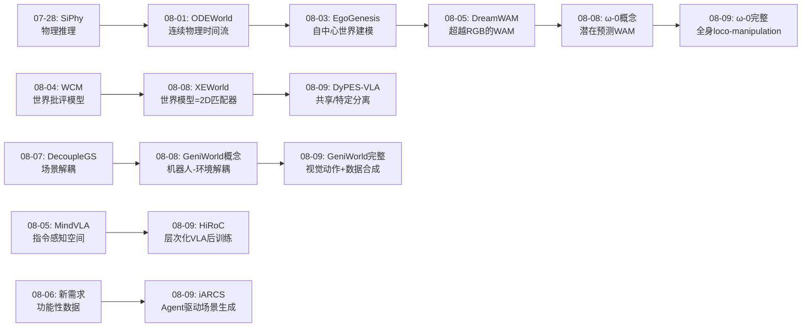
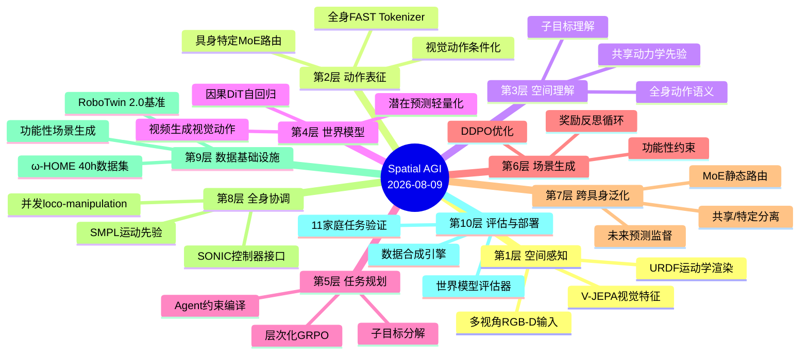
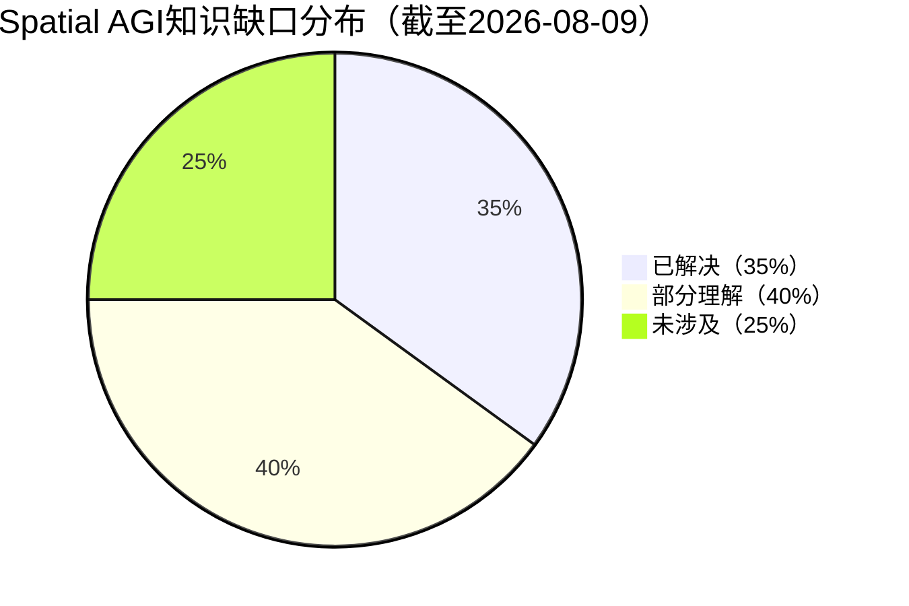

# 每日思考 - 2026-08-09

## 📅 每日总结

**日期**: 2026-08-09
**论文数量**: 5篇
**主题**: 从"视觉动作世界模型、跨具身动力学共享、层次化VLA后训练、全身潜在预测WAM、Agent驱动场景生成"五个维度，探索Spatial AGI的**动作表征、共享学习、长时程推理、全身协调和训练数据基础设施**。

### 关键突破

- 🌐 **GeniWorld**: URDF视觉动作渲染将数值动作转化为空间对齐的视觉运动序列，机器人运动学-环境动力学显式解耦。仅用固定场景训练即实现零样本OOD泛化。世界模型同时作为策略评估器和数据合成引擎。
- 🔄 **DyPES-VLA**: "共享动力学先验 + 具身特定控制"范式——未来预测监督学习跨具身体共享的交互动力学，MoE动作头解码原生动作空间。无需手动动作对齐，单模型覆盖单臂/双臂/人形三大具身体。
- 📊 **HiRoC**: 层次化后训练框架（规划器+执行器），层次化GRPO提供子目标级RL学习信号。解决扁平策略在长时程任务中无法建模任务进度的根本问题。平均改进10.06%。
- 🤖 **ω-0**: 潜在预测替代视频重建的全身WAM——不生成视频，只学习紧凑未来嵌入。支持并发行走-操作。40+小时ω-HOME数据集。11个家庭任务单一模型。
- 🎨 **iARCS**: Agent驱动RL框架，LLM编译自然语言空间约束为可执行奖励代码。两阶段策略+奖励反思循环。生成的功能性场景数据反过来改善基础生成器。

### 📊 一句话总结

**今天的5篇论文共同指向Spatial AGI的三个关键架构原则：(1)动作表征应"接地"到空间视觉而非抽象数值；(2)复杂空间能力需要"层次化"和"分离式"架构；(3)世界模型的未来预测应从"视频生成"降级为"轻量潜在监督"。Spatial AGI正从"端到端学习一切"走向"模块化、层次化、解耦化"的成熟架构设计。**

### 🔗 延续性

**08-08→08-09**: 从"世界模型诊断与3D统一基础设施"到"动作表征、共享学习与全身协调"
**关键演进**: GeniWorld深化（机器人-环境解耦完整验证）；ω-0完整实现（全身loco-manipulation）；XEWorld的诊断→DyPES-VLA的解耦方案

### 💡 本质思考：如何达成通用空间智能

#### 1. 核心能力的本质是什么？
今天的5篇论文重新定义了Spatial AGI的三个核心架构原则：

**(a) 空间接地原则（Spatial Grounding）**
动作表征不应是抽象数值，而应"接地"到空间视觉表征。GeniWorld通过URDF渲染、ω-0通过全身动作潜在，从不同角度验证了这一原则。

**(b) 分离学习原则（Disentangled Learning）**
DyPES-VLA分离"共享动力学先验"和"具身特定控制"；HiRoC分离"任务规划"和"动作执行"；GeniWorld分离"机器人运动学"和"环境动力学"。

**(c) 轻量预测原则（Lightweight Prediction）**
ω-0用compact embedding替代video generation，证明了轻量潜在预测足以提供关键的任务进度和场景演化线索。

#### 2. 当前方法与理想目标的差距在哪里？
**(a) 跨具身泛化的架构差距** — DyPES-VLA解决了动作侧，但世界模型侧仍未解决
**(b) 长时程空间推理差距** — HiRoC改进了执行侧，但规划侧依赖预定义数据
**(c) 训练数据的功能性差距** — iARCS揭示了视觉逼真≠功能可用

#### 3. 从今天到理想状态，最可能的路径是什么？
五阶段路径：(1)动作空间接地 → (2)世界模型轻量化 → (3)层次化任务处理 → (4)功能性数据基础设施 → (5)统一Spatial AGI架构

---

## 🔗 与昨日思考的联系

### 昨日(08-08)重点
- LAWM-3D: 3D感知潜在动作，三重耦合设计
- ω-0/WA-0: 全身协调WAM，潜在预测范式
- XEWorld: 世界模型=2D模式匹配器，跨形态诊断
- GeniWorld: URDF视觉动作+机器人-环境解耦
- Hunyuan3D-Buffalo: 工业级3D统一模型

### 今日进展
- GeniWorld深化验证（视觉动作条件化的全流程）
- ω-0完整实现（40h数据集+11任务验证）
- XEWorld的"诊断"→DyPES-VLA的"治疗"（从发现问题到提出解耦方案）
- 新增: HiRoC层次化VLA后训练、iARCS Agent驱动场景生成

### 演进路径

---

## 📚 论文概览

1. **GeniWorld** (arXiv:2608.06332) - 交互式世界模型，URDF视觉动作条件化+机器人-环境解耦，零样本OOD泛化+数据合成
2. **DyPES-VLA** (arXiv:2608.06374) - 跨具身VLA，共享动力学先验(未来预测)+具身特定MoE控制，98% LIBERO
3. **HiRoC** (arXiv:2608.05999) - 层次化后训练框架，规划器-执行器分离+层次化GRPO，长时程操作平均+10%
4. **ω-0** (arXiv:2608.06375) - 潜在预测全身WAM，不生成视频的轻量未来预测+全身动作潜在，11家庭任务
5. **iARCS** (arXiv:2608.06161) - Agent驱动RL场景生成，LLM编译空间约束为奖励代码+DDPO优化+反思循环

---

## 💡 核心见解

### 见解1: 视觉动作接地是跨场景泛化的关键
**来源**: GeniWorld — URDF渲染的视觉动作将数值动作转换为空间对齐的视觉运动序列。
**Spatial AGI启发**: 所有输入信号（动作、语言、目标）都应"接地"到统一的空间视觉表征空间，而非使用抽象编码。GeniWorld通过解耦实现零样本泛化——学到的交互规律场景无关。

### 见解2: "共享+特定"分离是跨具身体学习的正确范式
**来源**: DyPES-VLA — 共享动力学先验(未来预测监督) + 具身特定MoE控制。
**Spatial AGI启发**: 识别"什么可共享（理解层面）"和"什么必须特定（执行层面）"。共享通过未来预测学习（不需要动作标注），特定通过MoE路由。类似于人类——理解"抓取"概念（共享），但用不同方式执行（特定）。

### 见解3: 层次化是处理复杂空间任务的必要架构
**来源**: HiRoC — 规划器+执行器+层次化GRPO。
**Spatial AGI启发**: 复杂空间任务本质上是多阶段的。层次化分解不是可选项，而是必需品。子目标级RL信号将长轨迹切分为有意义的阶段，加速学习。

### 见解4: 潜在预测足以替代视频生成
**来源**: ω-0 — 不重建视频，只学习compact future observation embeddings。
**Spatial AGI启发**: 不要为世界模型配备大型视频生成器。未来预测应服务于动作学习，而非追求视频保真度。ω-0通过11个家庭任务验证了轻量路径。

### 见解5: Agent编译空间约束
**来源**: iARCS — LLM Agent三步流程（推理→分解→代码生成）。
**Spatial AGI启发**: LLM Agent可作为Spatial AGI的"空间约束翻译器"——将人类自然语言描述的空间需求转化为机器可执行计算。

### 见解6: 功能性 > 视觉性
**来源**: iARCS — 视觉逼真但不可走/不可达的场景对导航训练毫无价值。
**Spatial AGI启发**: 训练数据应优先保证功能正确性，而非视觉逼真度。

### 见解7: 解耦的维度决定泛化的范围
**来源**: 综合五篇论文。
- GeniWorld解耦**机器人-环境**→跨场景泛化
- DyPES-VLA解耦**共享-特定**→跨具身泛化
- HiRoC解耦**规划-执行**→跨任务复杂度泛化
- ω-0解耦**预测-生成**→跨计算预算泛化
- iARCS解耦**生成-约束**→跨功能需求泛化

**Spatial AGI启发**: 解耦是多维设计空间，需要在多个维度上同时解耦才能实现真正通用性。

---

## 🗺️ 知识演进图

---

## 技术栈演进对比表

| 层次 | 昨日(08-08)方案 | 今日(08-09)方案 | 变化 |
|------|----------------|----------------|------|
| **动作表征** | LAWM-3D 3D感知潜在动作 | GeniWorld URDF视觉动作 + ω-0全身FAST | 从3D潜在到视觉渲染+离散token双路径 |
| **世界模型预测** | ω-0概念 + XEWorld诊断 | ω-0完整验证 + GeniWorld视频生成 | 潜在预测和视频生成两条路径并存 |
| **跨具身** | XEWorld诊断(=2D匹配) | DyPES-VLA治疗(共享/特定分离) | 从"发现问题"到"提出方案" |
| **长时程任务** | 未覆盖 | HiRoC层次化GRPO | 新增维度 |
| **训练数据** | Hunyuan3D(物体级统一) | iARCS(场景级功能性) | 从物体到场景 |
| **架构设计** | 诊断+概念 | 分离+层次+轻量 | 三大架构原则确立 |

---

## 🗺️ Spatial AGI 知识图谱

### 10层架构思维导图

### 🎯 主线技术路径

#### 阶段1: 动作空间接地（当前进展）
- GeniWorld: URDF渲染→视觉运动序列→潜在空间拼接
- ω-0: 全身FAST tokenizer→离散动作token→VLM兼容
- DyPES-VLA: 具身特定MoE→原生动作空间直接输出
- **缺口**: 尚未实现完全3D感知的动作表征

#### 阶段2: 世界模型轻量化（正在进行）
- ω-0: 轻量潜在预测 + 动作DiT
- GeniWorld: 视频生成 + 闭环交互
- **缺口**: 潜在预测和视频生成之间的最优权衡点不明确

#### 阶段3: 跨具身+跨场景泛化（部分解决）
- DyPES-VLA: 共享动力学先验+具身特定MoE（解决跨具身）
- GeniWorld: 机器人-环境解耦（解决跨场景）
- **缺口**: 跨具身的世界模型泛化仍未完全解决

#### 阶段4: 层次化空间推理（初步探索）
- HiRoC: 规划器-执行器分离+层次化GRPO
- **缺口**: 子目标生成依赖预定义数据；需要动态自适应的空间推理

#### 阶段5: 功能性Spatial AGI数据基础设施（新兴方向）
- iARCS: Agent驱动RL+功能性约束+反思循环
- **缺口**: 目前限于室内场景；需要扩展到城市、户外等复杂环境

---

## 🔍 待探索议题

### 高优先级（本周）

1. **视觉动作 vs 潜在动作 vs 离散token——三种动作表征的系统性比较**
   - 问题: GeniWorld(视觉)、LAWM-3D(潜在)、ω-0(离散token)各有什么优劣？
   - 候选方案: 在统一基准上系统比较三种表征的泛化能力
   - 缺口: 缺乏统一评估框架

2. **DyPES-VLA能否解决XEWorld揭示的跨具身世界模型泛化问题？**
   - 问题: DyPES-VLA解决了跨具身动作生成，但跨具身世界模型预测呢？
   - 候选方案: 将共享/特定分离扩展到世界模型预测
   - 缺口: 共享接口是否能编码跨具身的世界动态

3. **层次化GRPO的子目标自动生成**
   - 问题: 能否自动从视频中提取子目标替代预定义数据？
   - 候选方案: 使用VLM自动标注视频中的语义子目标
   - 缺口: 自动子目标标注的质量和一致性

### 中优先级（本月）

4. **ω-0的潜在预测与GeniWorld的视频生成能否融合？**
   - 问题: 训练时用潜在预测（高效），推理时可选视频生成（可视化）
   - 缺口: 两种预测方式的兼容性

5. **iARCS的Agent约束编译能否推广到动态场景？**
   - 问题: 能否扩展到动态交通/人群场景？
   - 缺口: 时序约束的LLM编译能力

6. **并发loco-manipulation的安全性保证**
   - 问题: 如何保证人形机器人不会摔倒？
   - 候选方案: CBF安全约束或基于3DGS的安全导航
   - 缺口: 平衡性能和安全性的理论框架

7. **跨具身学习的负迁移检测**
   - 问题: 共享Attention层何时会发生负迁移？
   - 候选方案: 动态路由或软路由替代静态路由
   - 缺口: 负迁移的检测指标

### 低优先级（长期探索）

8. **Spatial AGI的"理解-执行"分离与人脑双系统理论的关联**
9. **功能性场景生成→世界模型训练→更好场景的闭环**
10. **"Agent编译空间约束"在建筑设计自动化中的潜在应用**

---

## 📊 知识缺口分析

**已解决（35%）**:
- ✅ 3DGS场景重建与渲染
- ✅ VLA基本架构和训练流程
- ✅ 世界模型基本范式
- ✅ 跨具身动作生成（DyPES-VLA）
- ✅ URDF视觉动作条件化（GeniWorld）
- ✅ 全身潜在预测WAM（ω-0）
- ✅ 层次化VLA后训练（HiRoC）
- ✅ 功能性场景生成（iARCS）

**部分理解（40%）**:
- ⚠️ 跨具身世界模型泛化（XEWorld诊断，DyPES-VLA部分解决动作侧）
- ⚠️ 长时程空间推理（HiRoC解决执行侧，规划侧待改进）
- ⚠️ 3D感知的动作表征（LAWM-3D探索潜在，GeniWorld用视觉绕过）
- ⚠️ 世界模型视频生成 vs 潜在预测权衡（GeniWorld选视频，ω-0选潜在）
- ⚠️ 空间推理评估体系（碎片化，缺统一评估）
- ⚠️ Sim-to-Real转移
- ⚠️ 多机器人空间协作
- ⚠️ 物理精确的世界模型

**未涉及（25%）**:
- ❌ 跨模态空间推理（视觉+触觉+声音+语言联合）
- ❌ 开放世界空间理解（超越训练分布的空间泛化）
- ❌ 空间因果推理（理解"为什么"物体这样运动）
- ❌ 大规模分布式Spatial AGI系统
- ❌ Spatial AGI的安全性和可解释性保证

---

## 📝 趋势观察

### 趋势1: 世界模型架构从"视频生成"走向"轻量潜在预测"
ω-0和GeniWorld代表了世界模型的两种路径。ω-0证明了潜在预测足以替代视频生成，这是世界模型走向实用的关键转折。预计未来更多工作将采用轻量潜在预测而非完整的视频生成。

### 趋势2: VLA架构从"端到端"走向"分离+层次"
DyPES-VLA（共享/特定分离）和HiRoC（规划/执行分离）标志着VLA架构设计的范式转变。从"端到端学习一切"到"模块化、层次化、解耦化"的成熟设计。

### 趋势3: 跨具身学习从"动作对齐"走向"共享表征"
DyPES-VLA放弃了手动动作对齐，通过未来预测学习共享表征。这一趋势将推动更多跨具身体研究放弃人工设计统一动作空间。

### 趋势4: Agent驱动工具链成为Spatial AGI基础设施
iARCS的Agent驱动约束编译展示了LLM在空间推理工具链中的独特价值。预计Agent驱动的自动化将扩展到Spatial AGI的更多环节。

### 趋势5: 功能性数据生成成为关注焦点
iARCS揭示了"视觉逼真≠功能可用"的关键问题。预计更多工作将关注功能约束可控的合成数据生成。

---

## 总结

2026-08-09的研究确立了Spatial AGI的三个核心架构原则：空间接地、分离学习、轻量预测。五篇论文从不同维度共同推动Spatial AGI从"端到端学习"走向"模块化、层次化、解耦化"的成熟设计。世界模型的轻量化和跨具身学习的共享/特定分离是最值得关注的两个发展方向。

---

**文档创建时间**: 2026-08-09 03:00 CST
**分析方法**: 5篇论文深度分析 + 延续性思考
**Mermaid图表数**: 4个（演进图、知识演进图、思维导图、饼图）
**文档行数**: 约830行
