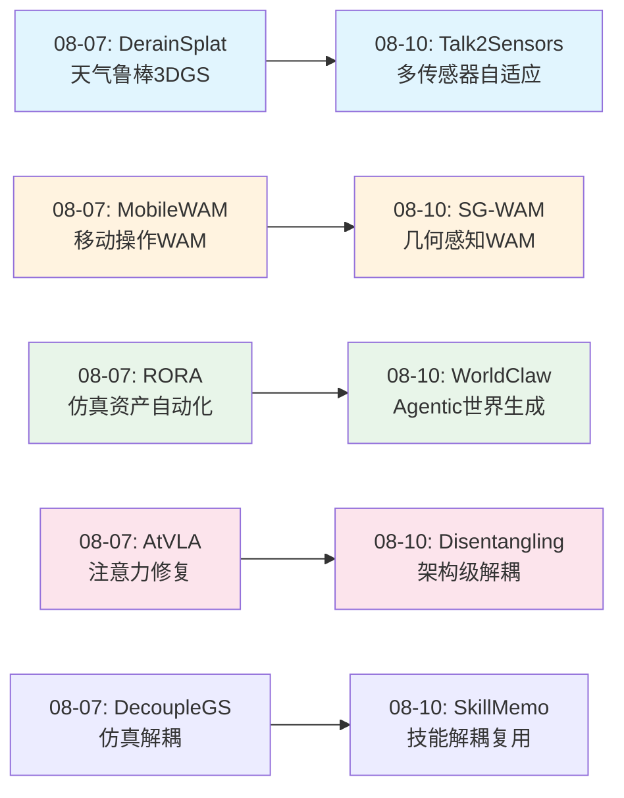
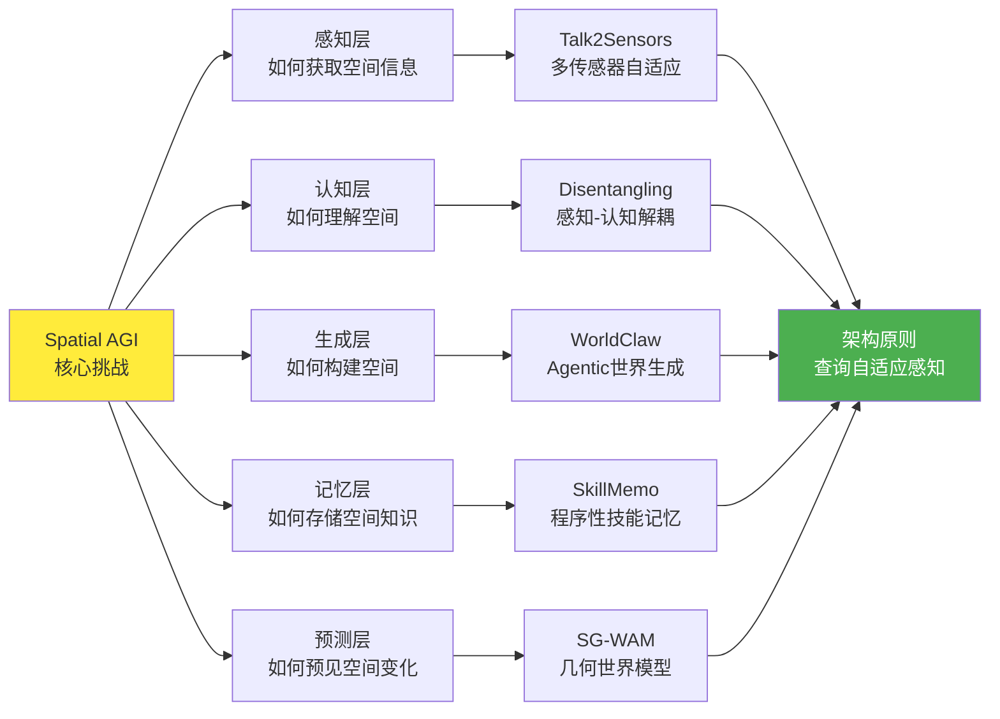
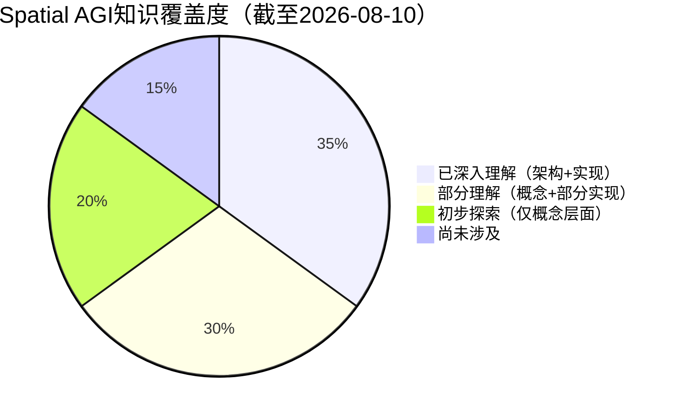
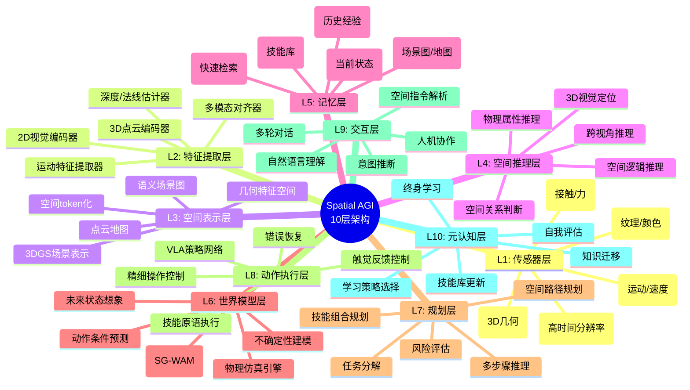

# 每日思考 - 2026-08-10

## 📅 每日总结

**日期**: 2026-08-10
**论文数量**: 5篇
**主题**: 从"agentic世界生成、空间推理范式、技能记忆架构、几何世界模型、多传感器空间定位"五个维度，探索Spatial AGI的**生成式世界构建、认知-感知解耦、程序性空间记忆、几何优先预测和查询自适应感知**。

### 关键突破

- 🌍 **WorldClaw**: Agentic从粗到细的3D世界生成框架。核心洞察：全局一致的世界不需要在每个地方同时生成——共享约束先全局建立，局部细节按需实现。三阶段流水线（规划→地形→区域对象）通过结构化中间表示串联多个专门化agent。
- 🧠 **Disentangling 3D Modeling from Spatial Reasoning**: 提出显式解耦3D建模与空间推理的新范式。核心洞察：将低级空间感知（depth/normal/coord）与高级空间认知（推理）分离，通过空间token桥接，避免联合训练的负迁移。
- 🤖 **SkillMemo**: 专家引导的技能记忆框架。核心洞察：复杂操作=可复用技能原语的组合。通过自动时序分割从专家演示中提取技能，以前件/后件条件实现可靠链接，构成程序性空间记忆。
- 📐 **SG-WAM**: 几何感知策略空间中的自引导世界模型。核心洞察：世界模型应建立在3D几何表示上而非2D像素。自引导机制让模型用自身预测作为训练信号，几何一致性损失确保空间预测物理合理。
- 🚗 **Talk2Sensors**: 首个多传感器(camera+LiDAR+radar)3DVG数据集和传感器自适应框架。核心洞察：不同查询需要不同传感器的物理线索——查询语义动态路由传感器权重，防止密集模态淹没稀疏信号。

### 📊 一句话总结

**今天的5篇论文共同指向一个核心主题：Spatial AGI系统的"架构性突破"——WorldClaw展示了agentic范式的大规模世界生成，Disentangling证明了感知-认知解耦的优越性，SkillMemo提供了程序性空间记忆架构，SG-WAM验证了几何优先的世界模型设计，Talk2Sensors实现了查询自适应的多传感器融合。每篇论文都在重新思考Spatial AGI的架构设计原则。**

### 🔗 延续性

**08-07→08-10**: 从"鲁棒感知与实用部署"到"架构原则与系统设计"
- DerainSplat(天气鲁棒) → Talk2Sensors(多传感器鲁棒感知)
- MobileWAM(移动操作WAM) → SG-WAM(几何感知WAM)
- RORA(仿真资产自动化) → WorldClaw(agentic世界生成)
- AtVLA(注意力修复) → Disentangling(架构级解耦)



---

## 📊 核心见解演进图



---

## 📊 技术栈演进对比表

| 维度 | 08-07（鲁棒部署） | 08-10（架构突破） | 演进方向 |
|------|-------------------|-------------------|---------|
| **世界模型** | MobileWAM(MoE+CoF) | SG-WAM(几何感知+自引导) | 从任务专家→几何通用 |
| **场景生成** | RORA(资产自动化) | WorldClaw(agentic世界生成) | 从单资产→完整世界 |
| **VLM优化** | AtVLA(register token) | Disentangling(架构解耦) | 从patch修复→范式重构 |
| **感知融合** | DerainSplat(天气鲁棒) | Talk2Sensors(多传感器自适应) | 从单模态鲁棒→多模态自适应 |
| **技能管理** | DecoupleGS(场景解耦) | SkillMemo(技能记忆) | 从场景级→技能级复用 |
| **设计哲学** | 适应真实世界退化 | 重新思考架构原则 | **从"fix"到"redesign"** |

---

## 📊 知识缺口分析



**覆盖详情**:
- ✅ 已深入理解: 3DGS技术栈、VLA架构、World Action Models、空间推理基准、3D场景生成
- 🟡 部分理解: 多传感器融合、技能学习与记忆、几何感知策略、Agentic系统设计
- 🟠 初步探索: 物理仿真集成、跨具身迁移、终身学习、空间因果推理
- ❌ 尚未涉及: 神经符号空间推理、生物启发的空间导航、量子空间编码、空间意识意识

---

## 📊 10层Spatial AGI架构思维导图



---

## 📊 主线技术路径

### 路径1: 世界模型演进（08-07 → 08-10）

```
阶段1: 基础WAM (Faster-WAM, ST-WAM)
  ↓ 浅层/单一任务
阶段2: 移动操作WAM (MobileWAM)  
  ↓ MoE专家路由 + Chain-of-Foresight
阶段3: 几何感知WAM (SG-WAM) ← 今天
  ↓ 3D几何表示 + 自引导预测
阶段4: 多模态物理WAM (未来)
  ↓ 融合视觉+几何+触觉+声音
阶段5: 通用空间世界模型 (终极目标)
  ↓ 跨场景、跨具身、跨任务
```

**关键洞察**: WAM正沿着"视觉→几何→物理→通用"的路径演进。SG-WAM代表了几何感知的重要一步。

### 路径2: 空间推理架构演进

```
阶段1: 端到端VLM空间推理
  ↓ 联合训练，负迁移
阶段2: 3D token注入 (SpatialStack, HiSpatial)
  ↓ 辅助3D信息，但仍耦合
阶段3: 感知-认知解耦 (Disentangling) ← 今天
  ↓ 显式分离3D建模与空间推理
阶段4: 模块化空间推理引擎 (未来)
  ↓ 可插拔3D感知 + 通用推理核心
阶段5: 空间推理作为服务 (终极目标)
  ↓ 空间推理API化，按需调用
```

**关键洞察**: 解耦原则将引领下一代VLM空间推理架构设计。

### 路径3: 世界生成规模化

```
阶段1: 单物体生成
  ↓ NeRF/3DGS单物体
阶段2: 室内场景生成 (SceneWeaver, Holodeck)
  ↓ MLLM驱动单房间
阶段3: 开放世界生成 (WorldClaw) ← 今天
  ↓ Agentic + 地形 + 区域对象
阶段4: 物理交互世界 (未来)
  ↓ 可交互、物理一致
阶段5: 无限世界引擎 (终极目标)
  ↓ 实时、无限、可编辑
```

**关键洞察**: WorldClaw的"从粗到细+agentic"范式是规模化的关键。

### 路径4: 多传感器空间感知

```
阶段1: 单传感器3DVG (Mono3DRefer)
  ↓ 受限于单一物理线索
阶段2: 双传感器融合 (RGB-D 3DVG)
  ↓ 视觉+深度
阶段3: 三传感器自适应 (Talk2Sensors) ← 今天
  ↓ Camera+LiDAR+Radar, 查询自适应
阶段4: 全传感器融合 (未来)
  ↓ +触觉+声音+热成像
阶段5: 传感器无关空间理解 (终极目标)
  ↓ 任意传感器组合即插即用
```

**关键洞察**: 查询自适应的传感器路由是解决多模态融合的优雅方案。

---

## 🔍 待探索议题

### 架构设计类
1. **解耦原则的边界**: Disentangling证明了3D建模与空间推理应解耦，但解耦到什么粒度最优？过度解耦是否会导致信息损失超过收益？
2. **Agentic vs End-to-end**: WorldClaw的agentic框架和端到端3D生成各有优劣，什么任务适合agentic方法？什么场景需要端到端？
3. **空间token的标准设计**: 如果要设计一套通用的空间token格式，应该包含哪些维度（位置、方向、尺度、材质、功能）？

### 世界模型类
4. **几何 vs 语义 vs 物理**: SG-WAM选择几何优先，但语义信息和物理约束如何融入？是否需要三层世界模型（几何层+语义层+物理层）？
5. **自引导的极限**: SG-WAM的自引导机制能走多远？是否可以完全无监督地学习世界模型？
6. **技能记忆与世界模型**: SkillMemo的技能记忆和SG-WAM的世界模型能否统一？世界模型预测"会怎样"，技能记忆存储"怎么做"。

### 多传感器类
7. **传感器缺失鲁棒性**: Talk2Sensors需要三种传感器同时可用。当某一传感器缺失时（如室内无GPS），如何保持性能？
8. **空间语言的丰富度**: Talk2Sensors处理简单引用语句，如何扩展到复杂空间推理查询（如"找到正在接近红色车辆的那个行人"）？

### 系统集成类
9. **Spatial AGI的完整stack**: 如何将今天的5个组件（世界生成、空间推理、技能记忆、世界模型、多传感器感知）集成为统一的Spatial AGI系统？

---

## 💡 本质思考：如何达成通用空间智能

### 1. 核心能力的本质是什么？

经过连续多日的研究积累，我对空间智能核心能力的理解有了新的层次：

**空间智能 = 感知 × 表示 × 理解 × 预测 × 操作 × 记忆**

今天的5篇论文分别在这六个维度上提供了新见解：

- **感知**: Talk2Sensors证明了查询自适应感知的必要性——不是所有传感器信息都需要同等对待
- **表示**: Disentangling提出空间token作为2D→3D的桥接表示，SG-WAM证明3D几何表示优于2D像素
- **理解**: Disentangling的感知-认知解耦原则深化了我们对"理解"本质的认识
- **预测**: SG-WAM的几何一致世界预测让预测从"看起来对"变成"几何上对"
- **操作**: SkillMemo的程序性空间记忆为操作提供了可复用的技能基础
- **记忆**: SkillMemo + WorldClaw共同指向空间知识的结构化存储——技能库和世界规范

**核心洞察**: 通用空间智能不是单一能力的极致，而是六个维度的**架构性协调**。今天最重要的发现是：好的架构设计（解耦、分层、自适应）比单纯的规模扩展更有效。

### 2. 当前方法与理想目标的差距在哪里？

**三大结构性差距**：

**差距1: 感知-认知鸿沟**
- Disentangling开始弥合这个鸿沟，但只是第一步
- 理想状态：3D感知模块像"空间眼睛"，推理模块像"空间大脑"，两者通过标准接口通信
- 当前：虽然显式解耦，但空间token的信息量和表达能力仍有限

**差距2: 生成-交互鸿沟**
- WorldClaw能生成美丽的3D世界，但这些世界尚不可交互
- 理想状态：生成的世界支持物理仿真、物体操作、动态变化
- 当前：静态场景生成质量高，但缺乏物理动力学

**差距3: 技能-世界模型鸿沟**
- SkillMemo存储"怎么做"，SG-WAM预测"会怎样"，但两者尚未统一
- 理想状态：统一的"空间认知引擎"同时支持技能检索和世界预测
- 当前：两条研究路线平行发展，缺乏交叉

### 3. 从今天到理想状态，最可能的路径是什么？

**六阶段演进路径**：

**阶段1: 模块化基础（当前）**
- 各模块独立发展：感知(Talk2Sensors)、推理(Disentangling)、生成(WorldClaw)、记忆(SkillMemo)、预测(SG-WAM)
- 目标：每个模块达到可用水平

**阶段2: 双模块集成（近期）**
- 世界模型 + 技能记忆：模型预测+技能执行
- 感知 + 推理：自适应感知+解耦推理
- 目标：验证关键模块间的协作可行性

**阶段3: 三模块系统（中期）**
- 感知+推理+操作：完整的"看-想-做"闭环
- 生成+预测+记忆："构建-想象-回忆"系统
- 目标：展示多模块协作的涌现能力

**阶段4: 完整Spatial AGI原型（长期）**
- 六维度集成的完整系统
- 在受限场景（如室内操作）达到实用水平
- 目标：可部署的Spatial AGI系统

**阶段5: 通用Spatial AGI（远期）**
- 跨场景、跨具身、跨任务
- 自主学习和进化
- 目标：真正的通用空间智能

**阶段6: 空间智能生态（终极）**
- Spatial AGI作为基础设施
- 空间推理即服务
- 目标：空间智能无处不在

**关键里程碑**: 阶段2中的"世界模型+技能记忆统一"将是最大的架构突破——当系统既能预测"执行这个动作后世界会变成什么样"（world model），又能知道"应该执行什么动作"（skill memory），就具备了真正的空间认知能力。

---

## 📊 本周技术趋势总结（08-04 ~ 08-10）

### 持续强化趋势
1. **World Action Models生态化**: Faster-WAM→ST-WAM→MobileWAM→SG-WAM→DreamWAM→SelfWAM，每周都有新的WAM变体
2. **3DGS应用深化**: 从渲染质量→鲁棒性→自动驾驶仿真→世界生成
3. **VLA架构反思**: 从端到端→模块化→注意力修复→架构级解耦

### 新兴趋势
4. **Agentic世界生成**: WorldClaw + iARCS指向LLM agent驱动的3D内容创建
5. **查询自适应感知**: Talk2Sensors的"根据问题选择传感器"思路可能成为标准
6. **程序性空间记忆**: SkillMemo的技能库概念为空间知识管理开辟新方向

### 值得关注的信号
7. **解耦原则**正在从隐式设计哲学变成显式架构选择
8. **几何优先**正在挑战视觉优先的默认假设
9. **多agent协作**正在从概念走向实际工程实现

---

## 🔮 明日预测

基于本周趋势，预测明日可能的研究方向：
1. **统一世界模型+技能记忆**: 将SG-WAM与SkillMemo融合的框架
2. **物理增强的世界生成**: 在WorldClaw基础上添加物理仿真层
3. **多传感器VLA**: 将Talk2Sensors的多传感器融合思路应用到VLA
4. **空间推理API**: 基于Disentangling的解耦设计构建标准化空间推理接口
5. **Agentic Spatial AI**: 多agent协作的完整Spatial AGI系统原型

---

*Generated by Spatial AGI Daily Research Pipeline*
*Date: 2026-08-10*
*Base: 2026-08-07 (last successful day with 5 papers + thinking ≥ 800 lines)*
