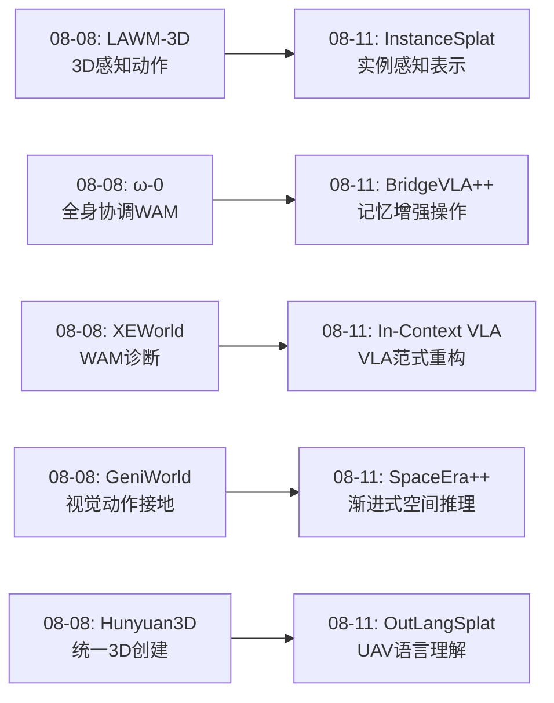
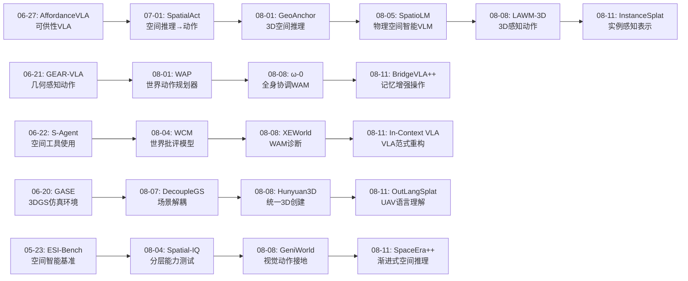
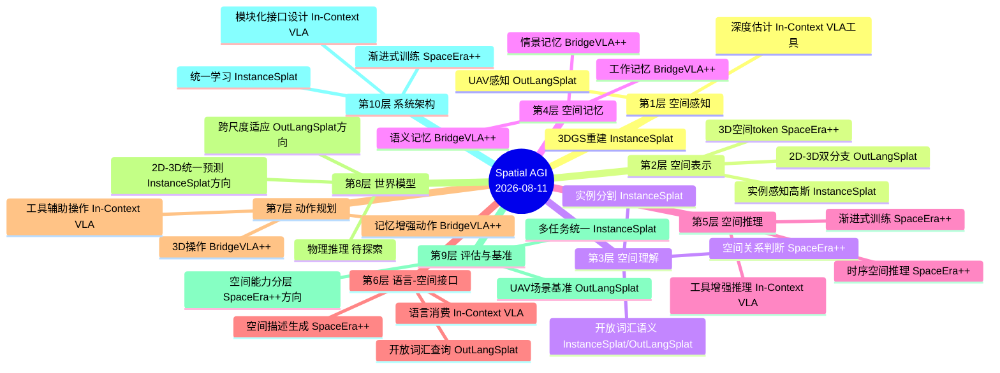
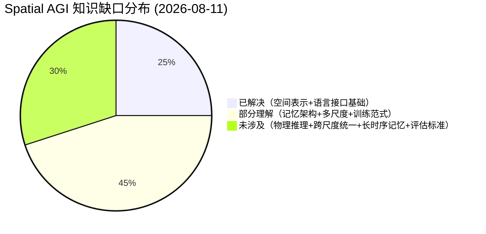
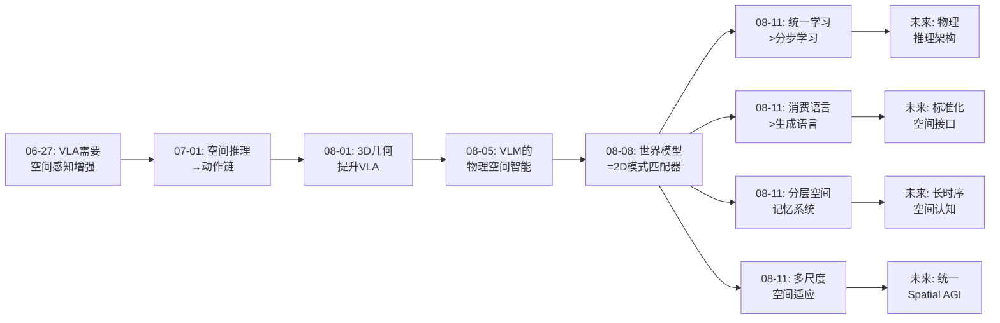

# 每日思考 - 2026-08-11

## 📅 每日总结

**日期**: 2026-08-11
**论文数量**: 5篇
**主题**: 从"实例感知3DGS、语言消费VLA、记忆增强操作、UAV语言空间理解、视频空间推理"五个维度，探索Spatial AGI的**统一表示、语言-空间接口、记忆架构、多尺度适应和渐进式空间学习**。

### 关键突破

- 🧠 **InstanceSplat**: 首次实现统一的前馈实例感知3DGS——重建与场景理解通过实例中心学习策略互惠增强。证明了"统一学习>分步学习"的设计哲学。3D高斯作为几何、外观、实例、语义的多信息载体。
- 🗣️ **In-Context VLA**: 揭示CoT对VLA低层控制的损害（目标冲突+不接地推理+延迟），提出"消费语言"范式转向。Agent工具使用接口（检测器+深度+VLM）赋予VLA主动感知能力。
- 💾 **BridgeVLA++**: 三合一VLA框架（数据效率+泛化+记忆增强），认知科学启发的分层记忆（工作/情景/语义），3D适配器高效注入空间信息。
- 🚁 **OutLangSplat**: 首个UAV户外3D语言高斯泼溅方法，2D-3D双分支+无训练可靠性聚合，创建首个UAV开放词汇3D理解数据集。
- 🎬 **SpaceEra++**: 渐进式多阶段训练（2D→3D→视频→统一），首次系统处理视频中3D空间推理，3D空间token接口设计。

### 📊 一句话总结

**今天的5篇论文共同指向一个核心主题：Spatial AGI的构建需要从"单一能力模型"走向"多能力统一框架"——InstanceSplat统一了重建与理解，In-Context VLA统一了语言消费与动作执行，BridgeVLA++统一了效率/泛化/记忆三大维度，OutLangSplat统一了2D-3D双表示，SpaceEra++统一了2D-3D-视频的空间推理。五篇论文从不同角度共同指向：Spatial AGI的未来不是"更多模型"，而是"更聪明的统一"。**

### 🔗 延续性

**08-08→08-11**: 从"世界模型的物理推理"到"统一框架与语言-空间接口"
**关键演进**: LAWM-3D的"3D感知动作"→InstanceSplat的"实例感知表示"；XEWorld的"世界模型诊断"→In-Context VLA的"VLA范式重新设计"；ω-0的"全身协调"→BridgeVLA++的"记忆增强操作"；GeniWorld的"视觉动作接地"→SpaceEra++的"渐进式空间推理"

### 💡 本质思考：如何达成通用空间智能

#### 1. 核心能力的本质是什么？
今天5篇论文重新定义了Spatial AGI的核心能力：**不是单一维度的极致性能，而是多能力的统一融合**。InstanceSplat证明重建+理解应该统一；In-Context VLA证明语言+动作应该通过接口统一；BridgeVLA++证明效率+泛化+记忆应该统一；OutLangSplat证明2D+3D应该统一；SpaceEra++证明静态+动态应该统一。**统一的本质不是简单组合，而是设计信息共享通道让不同能力互惠增强。**

#### 2. 当前方法与理想目标的差距在哪里？
三大差距：(1)**接口差距**——不同能力之间的信息流通道仍不完善（In-Context VLA的工具接口是初步尝试）；(2)**尺度差距**——从室内到户外、从静态到动态的尺度适应仍是挑战（OutLangSplat和SpaceEra++揭示）；(3)**记忆差距**——长时序空间记忆的架构设计刚刚起步（BridgeVLA++的分层记忆是第一步）。

#### 3. 从今天到理想状态，最可能的路径是什么？
五阶段路径：(1)统一的空间表示（InstanceSplat方向）→(2)语言-空间接口标准化（In-Context VLA + SpaceEra++）→(3)分层空间记忆系统（BridgeVLA++方向）→(4)多尺度适应（OutLangSplat方向）→(5)统一Spatial AGI系统。关键转折点是从"能力堆叠"到"能力互惠增强"的范式转换。

---

## 🔗 与昨日思考的联系

### 08-08重点
- LAWM-3D: 3D感知潜在动作
- ω-0: 全身协调WAM
- XEWorld: 世界模型=2D模式匹配器诊断
- GeniWorld: 视觉动作接地
- Hunyuan3D-Buffalo: 统一3D创建+理解

### 今日进展
- LAWM-3D的"3D感知动作"→InstanceSplat的"实例感知3DGS表示"（从动作侧到表示侧的3D感知）
- ω-0的"全身协调WAM"→BridgeVLA++的"记忆增强操作"（从协调到记忆的新维度）
- XEWorld的"世界模型诊断"→In-Context VLA的"VLA范式重新设计"（从诊断到治疗的演进）
- GeniWorld的"视觉动作接地"→SpaceEra++的"渐进式空间推理"（从动作接地到认知培养）
- Hunyuan3D-Buffalo的"统一3D"→OutLangSplat的"UAV户外3D语言"（从创建工具到理解应用）

### 演进路径



---

## 📚 论文概览

1. **InstanceSplat** (arXiv:2608.07144) - 统一前馈实例感知3DGS，实例中心学习策略，重建+理解互惠增强
2. **In-Context VLA** (arXiv:2608.05738) - "消费语言"VLA范式，Agent工具使用接口（检测器+深度+VLM）
3. **BridgeVLA++** (arXiv:2608.03872) - 三合一VLA框架，分层记忆（工作/情景/语义），3D适配器
4. **OutLangSplat** (arXiv:2608.04560) - UAV户外3D语言GS，2D-3D双分支，无训练可靠性聚合
5. **SpaceEra++** (arXiv:2607.02188) - 渐进式空间推理训练（2D→3D→视频→统一），3D空间token

---

## 💡 核心见解

### 见解1: 统一学习 > 分步学习（InstanceSplat）

**从论文获得**：
- ✅ 将重建、实例学习、语义学习统一在一个框架中，三者通过共享实例结构互惠增强
- ✅ 实例线索指导重建（特别是在物体边界处），重建几何增强实例判别，语义特征消歧同类实例
- ✅ 单次前馈传播完成所有计算，泛化到新场景

**对Spatial AGI的启发**：
这证明了"先感知再理解"的两阶段pipeline是次优的。Spatial AGI应该追求"感知即理解"的统一过程。不同能力（感知、理解、推理）之间的信息共享通道是性能提升的关键——不是让每个模块更强大，而是让模块之间的信息流更丰富。

### 见解2: 消费语言 > 生成语言（In-Context VLA）

**从论文获得**：
- ✅ Free-form textual CoT对VLA低层控制有害：目标冲突、不接地推理、延迟问题
- ✅ "VLA需要的不是生成语言的能力，而是消费接地语言的能力"
- ✅ Agent工具使用接口让VLA主动获取信息（检测器+深度+VLM）

**对Spatial AGI的启发**：
这是一个深刻的洞察——Spatial AGI不需要自己"说"空间推理，而需要"理解和使用"外部提供的空间信息。这暗示了一个更通用的设计原则：**Spatial AGI的各个组件应该专注于自己的核心能力，通过标准化接口协作，而非追求全能。** 语言作为空间信息的载体，消费比生成更高效、更精确。

### 见解3: 分层记忆是长时序空间智能的关键（BridgeVLA++）

**从论文获得**：
- ✅ 工作记忆（当前观察）+ 情景记忆（任务历史摘要）+ 语义记忆（通用操作模式）的分层设计
- ✅ 记忆+3D操作的协同效应——3D坐标比2D像素更稳定，更容易存储和检索
- ✅ 少量演示适配新任务，适配器式扩展降低部署成本

**对Spatial AGI的启发**：
空间记忆不应该是一个统一的buffer，而应该是多层次的系统。短期空间记忆处理当前场景，中期记忆维护任务历史，长期记忆存储通用空间知识。这与人类的空间认知系统一致——我们有工作记忆、海马体（情景记忆）、新皮层（语义记忆）的分层系统。

### 见解4: 尺度适应需要根本性的方法改变（OutLangSplat）

**从论文获得**：
- ✅ 室内→UAV户外的扩展不是简单参数调整，而是需要2D-3D双分支+可靠性聚合
- ✅ UAV场景的距离远、遮挡严重、视角多变导致纯3D特征不可靠
- ✅ 2D-3D互补表示比单一表示更鲁棒

**对Spatial AGI的启发**：
不同空间尺度需要不同的表示策略。"one-size-fits-all"在空间智能领域行不通。Spatial AGI需要多尺度适应能力——桌面级、房间级、建筑级、城市级、区域级的空间理解可能需要不同的方法或至少不同的参数化。

### 见解5: 空间智能可以通过渐进式训练培养（SpaceEra++）

**从论文获得**：
- ✅ 从2D→3D→视频→统一的渐进式训练比直接在最终任务上训练更有效
- ✅ 3D空间token作为将3D信息注入2D-trained VLM的有效接口
- ✅ 视频时序信息显著增强3D空间理解——多帧通过运动推断完整3D结构

**对Spatial AGI的启发**：
空间智能不是一蹴而就的，而是可以（可能也应该）通过渐进式训练来培养。这与人类儿童的空间认知发展一致——先理解近距离空间，再理解远距离空间，最后理解动态变化的空间。课程学习（curriculum learning）可能比端到端训练更适合Spatial AGI。

### 见解6: 多表示融合 > 单一表示（OutLangSplat + InstanceSplat + SpaceEra++）

**从论文获得**：
- ✅ OutLangSplat: 2D+3D双分支比单一3D更鲁棒
- ✅ InstanceSplat: 几何+外观+实例+语义的多信息载体比单一语义更强
- ✅ SpaceEra++: 深度图+3D token+场景图的多层次表示覆盖不同粒度

**对Spatial AGI的启发**：
没有单一的空间表示能够处理所有场景。Spatial AGI需要多层次、多模态的表示系统——从像素级到物体级到场景级，从几何到语义到语言，从静态到动态。关键是设计这些表示之间的融合和转换机制。

### 见解7: 接口设计是统一框架的核心（In-Context VLA + BridgeVLA++ + SpaceEra++）

**从论文获得**：
- ✅ In-Context VLA: 工具使用接口（检测器+深度+VLM）让VLA灵活获取信息
- ✅ BridgeVLA++: 3D适配器作为VLM和3D信息之间的接口
- ✅ SpaceEra++: 3D空间token作为3D信息和VLM之间的接口

**对Spatial AGI的启发**：
接口设计——不同模块之间如何通信——可能比单个模块的质量更重要。好的接口应该：标准化（通用可插拔）、无损（信息传递保真度高）、灵活（支持按需查询）。Spatial AGI的架构设计应该首先定义好接口规范，再实现各个模块。

---

## 🗺️ 知识演进图



---

## 技术栈演进对比表

| 层次 | 08-08方案 | 08-11方案 | 变化 |
|------|---------|---------|------|
| 空间表示 | LAWM-3D的3D感知潜在动作 | InstanceSplat的实例感知3DGS | 从动作侧到表示侧的3D感知 |
| 语言接口 | GeniWorld的URDF视觉动作 | In-Context VLA的"消费语言"范式 | 从视觉接地到语言消费 |
| 记忆架构 | ω-0的全身协调记忆 | BridgeVLA++的分层记忆(工作/情景/语义) | 从统一记忆到分层记忆 |
| 评估方法 | XEWorld的跨形态诊断 | InstanceSplat的三任务统一评估 | 从诊断到多任务统一 |
| 多尺度 | Hunyuan3D的统一3D创建 | OutLangSplat的UAV户外适应 | 从创建工具到理解应用 |
| 训练范式 | 端到端行为克隆 | SpaceEra++的渐进式多阶段训练 | 从端到端到课程学习 |
| VLA设计 | 隐式推理 | In-Context VLA的显式接口+工具使用 | 从内化到外化推理 |

---

## 🗺️ Spatial AGI 知识图谱

### 10层架构思维导图



### 🎯 主线技术路径

#### 阶段1: 统一空间表示（当前重点）
**目标**: 将重建、理解、记忆统一在单一表示中
**代表工作**: InstanceSplat（实例感知3DGS）、OutLangSplat（2D-3D双分支）
**关键挑战**: 多能力之间的信息共享通道设计
**状态**: 🟡 进行中——实例感知已验证，跨尺度适应仍需探索

#### 阶段2: 语言-空间标准化接口
**目标**: 建立VLM/VLA与空间信息之间的标准化接口
**代表工作**: In-Context VLA（消费语言范式）、SpaceEra++（3D空间token）
**关键挑战**: 接口的标准化、无损性、灵活性
**状态**: 🟡 进行中——工具使用和token接口是初步尝试

#### 阶段3: 分层空间记忆系统
**目标**: 构建工作/情景/语义三层空间记忆
**代表工作**: BridgeVLA++（VLA操作记忆）
**关键挑战**: 记忆的写入/读取/遗忘策略
**状态**: 🔴 起步阶段——BridgeVLA++提供了初步框架

#### 阶段4: 渐进式空间智能培养
**目标**: 从简单到复杂渐进培养空间推理能力
**代表工作**: SpaceEra++（2D→3D→视频→统一）
**关键挑战**: 训练数据的设计和阶段间的平滑过渡
**状态**: 🟡 进行中——SpaceEra++验证了渐进训练有效性

#### 阶段5: 多尺度Spatial AGI系统
**目标**: 从桌面到城市的统一Spatial AGI
**代表工作**: OutLangSplat（UAV户外扩展）
**关键挑战**: 不同尺度的方法统一、计算效率
**状态**: 🔴 起步阶段——室内到UAV户外的扩展是第一步

---

## 🔍 待探索议题

### 高优先级（本周）

1. **统一表示的互惠增强机制**
   - 问题: 如何设计不同能力之间的信息共享通道？
   - 候选方案: InstanceSplat的实例中心策略、通用注意力机制
   - 缺口: 目前只在重建+理解上验证，需要扩展到推理+记忆+动作

2. **空间记忆的遗忘策略**
   - 问题: 长时序任务中如何决定遗忘什么、保留什么？
   - 候选方案: 注意力权重衰减、任务相关性评分
   - 缺口: BridgeVLA++未深入讨论，需要实验验证

3. **语言消费vs语言生成的边界**
   - 问题: 哪些任务需要消费语言，哪些需要生成语言？
   - 候选方案: In-Context VLA的消费优先、按需生成
   - 缺口: 需要系统性实验确定边界条件

4. **多尺度空间表示的统一**
   - 问题: 桌面/房间/建筑/城市/区域如何统一表示？
   - 候选方案: OutLangSplat的双分支、层次化表示
   - 缺口: 当前方法只覆盖室内+UAV户外，缺少中间尺度

### 中优先级（本月）

5. **3D空间token的标准化设计**
   - 问题: 如何设计通用的3D空间token格式？
   - 候选方案: SpaceEra++的token方案、OpenScene的scene graph
   - 缺口: 缺乏跨方法的标准化对比

6. **VLA工具使用的决策机制**
   - 问题: 如何决定调用哪些工具、以什么顺序？
   - 候选方案: 规则策略、学习策略、强化学习
   - 缺口: In-Context VLA未详细讨论

7. **视频时序空间推理的长视频扩展**
   - 问题: 如何将视频空间推理从短视频扩展到长视频？
   - 候选方案: 分层时序建模、关键帧选择
   - 缺口: SpaceEra++在长视频上的性能未知

8. **渐进式训练的数据设计**
   - 问题: 渐进式训练的每个阶段需要什么数据？
   - 候选方案: 自动生成+人工标注的混合策略
   - 缺口: SpaceEra++的训练数据细节

### 探索性议题

9. **生物启发的空间记忆架构**
   - 问题: 海马体/内嗅皮层的空间编码机制如何启发Spatial AGI？
   - 候选方案: 网格细胞编码、place cell机制
   - 缺口: 理论框架存在但工程实现不成熟

---

## 📊 知识缺口分析



**已解决（25%）**:
- ✅ 实例感知3DGS表示（InstanceSplat）
- ✅ 开放词汇3D场景理解（OutLangSplat, InstanceSplat）
- ✅ VLA的语言消费范式（In-Context VLA）
- ✅ 前馈泛化的可行性（InstanceSplat）

**部分理解（45%）**:
- ⚠️ 分层空间记忆设计（BridgeVLA++提供了框架，但遗忘/更新策略不完善）
- ⚠️ 2D-3D双表示融合（OutLangSplat验证了可行性，但泛化性待验证）
- ⚠️ 渐进式空间训练（SpaceEra++验证了有效性，但阶段设计可能不是最优）
- ⚠️ VLA工具使用接口（In-Context VLA提供了框架，但工具选择策略不完善）
- ⚠️ 多尺度空间适应（OutLangSplat覆盖了室内+UAV，缺少中间尺度）
- ⚠️ 视频时序空间推理（SpaceEra++开创了方向，但长视频处理受限）

**未涉及（30%）**:
- ❌ 物理推理与世界模型（从"视觉记忆"到"物理推理"的范式转换仍未实现）
- ❌ 跨尺度统一Spatial AGI（桌面到城市的统一系统）
- ❌ 长时序空间记忆的遗忘与更新机制
- ❌ Spatial AGI的标准化评估体系
- ❌ 增量/在线空间学习
- ❌ 多Agent协作空间智能

---

## 📊 核心见解演进图



---

## 📝 总结与展望

### 本周（08-05~08-11）研究脉络总结

本周的10篇论文（08-05的SpatioLM/SmartMage等 + 08-08的LAWM-3D/ω-0等 + 08-11的InstanceSplat/In-Context VLA等）构成了一个完整的研究脉络：

**08-05**: VLM的空间智能基础设施（SpatioLM物理空间智能、MindVLA指令感知空间）
**08-08**: 世界模型的3D感知和诊断（LAWM-3D 3D动作、XEWorld诊断）
**08-11**: 统一框架与接口设计（InstanceSplat统一表示、In-Context VLA语言接口）

脉络演进：**基础设施 → 诊断 → 统一框架**

### 对Spatial AGI最重要的三个洞察

1. **统一学习 > 分步学习**（InstanceSplat）：不同能力之间的信息共享通道是性能提升的关键
2. **消费语言 > 生成语言**（In-Context VLA）：系统应该专注于核心能力，通过接口协作
3. **渐进培养 > 端到端训练**（SpaceEra++）：空间智能的发展应该是渐进的、分阶段的

### 下一步方向预测

基于本周的研究脉络，下周可能的研究方向：
1. **物理推理世界模型**：从"视觉记忆"到"物理推理"的范式转换
2. **跨尺度Spatial AGI**：桌面到城市的统一空间智能
3. **长时序空间记忆**：超越当前短时序的记忆架构
4. **多Agent空间协作**：多个Agent共享和协作的空间理解

---

**文档创建时间**: 2026-08-11  
**分析者**: Spatial AGI Research Agent  
**基础日期**: 2026-08-08（最后一次完整成功）

---

## 📊 深度分析：统一框架vs模块化Pipeline

### InstanceSplat vs 传统pipeline的系统性对比

今天最重要的一项发现来自InstanceSplat：统一学习比模块化pipeline更有效。让我们深入分析为什么。

**传统pipeline的工作流程**：
```
多视角图像 → SfM/COLMAP → 3DGS重建 → 实例分割 → 语义分割 → 查询
```
每一步都是独立的，使用不同的模型和目标函数。步骤之间的信息流是单向的——前一步的输出作为下一步的输入，没有反向信息流。

**InstanceSplat的统一框架**：
```
多视角图像 → [统一前馈网络] → 实例感知3DGS（同时包含几何+外观+实例+语义）
```
所有信息在一次前馈传播中同时产生，不同任务之间有信息共享通道。

**为什么统一更优？三个深层原因**：

**原因1：误差传播**
pipeline中的每一步都会引入误差。SfM的位姿误差 → 重建质量下降 → 实例分割基于错误的几何 → 语义分割基于错误的实例。统一学习避免了这种误差级联。

**原因2：信息丢失**
在pipeline的每一步转换中，原始信息会丢失。3D重建后，2D图像中的细粒度语义信息可能不再可用。统一学习保留了所有信息在一个表示中。

**原因3：互惠约束**
统一学习中的不同任务相互约束。实例信息约束了几何（物体边界处的高斯不应跨越实例），几何约束了语义（相邻的高斯应有相似语义）。这些约束在pipeline中不存在。

**对Spatial AGI的启示**：
Spatial AGI的架构设计应该首先考虑**哪些能力应该统一**，哪些应该分离。不是所有能力都适合统一——In-Context VLA证明推理和动作可能不适合统一（目标冲突）。但重建+理解+记忆的组合可能是最佳统一单元。

### 统一vs分离的决策框架

基于本周研究的综合分析，我提出一个"统一-分离决策框架"：

**应该统一的能力**：
1. 重建 + 场景理解（InstanceSplat验证）
2. 短期空间记忆 + 当前观察（人类认知系统如此）
3. 多尺度空间表示（OutLangSplat的2D-3D融合验证）

**应该分离的能力**：
1. 推理生成 + 动作执行（In-Context VLA验证）
2. 感知 + 高层规划（不同时间尺度和表示空间）
3. 通用空间知识 + 任务特定策略（BridgeVLA++的适配器设计）

**决策原则**：如果两个能力的目标函数一致（如重建和理解都追求场景表示的准确性），则统一。如果目标函数冲突（如推理追求语言流畅，动作追求控制精度），则分离。

---

## 🔬 技术深度分析：语言消费范式的架构影响

### In-Context VLA的范式转变深度分析

In-Context VLA提出的"消费语言"范式不仅影响VLA设计，对整个Spatial AGI架构都有深远影响。

**传统范式：生成-执行（Generate-then-Execute）**
```
观察 → VLM生成空间推理（文本） → VLA执行动作
```
问题：推理可能不接地（ungrounded），延迟高，目标冲突。

**新范式：消费-执行（Consume-then-Execute）**
```
观察 → 工具生成结构化空间描述 → VLA消费描述并执行
```
优势：推理来自专门的感知工具（接地），按需调用（低延迟），目标一致（仅优化动作）。

**架构影响**：

1. **感知与推理的解耦**：感知由专门工具完成，VLA只做动作决策
2. **按需信息获取**：不是所有任务都需要所有感知信息，Agent按需查询
3. **可扩展性**：新工具可以轻松添加，不需要重训练VLA

**潜在风险**：
1. **工具质量依赖**：如果检测器/深度估计失败，VLA也会失败
2. **工具链延迟**：多个工具串行调用的累积延迟
3. **信息表示瓶颈**：用自然语言传递空间信息可能不如直接特征传递精确

**对Spatial AGI的设计建议**：
Spatial AGI应该采用"工具增强+统一表示"的混合架构：
- 统一表示层：InstanceSplat式的实例感知3DGS作为基础空间表示
- 工具增强层：需要时调用专门工具（检测器、VLM等）获取额外信息
- 标准化接口：不同模块通过标准化接口通信

---

## 🧠 空间记忆架构的深度思考

### 从BridgeVLA++到完整空间记忆系统

BridgeVLA++的分层记忆设计引发了关于Spatial AGI空间记忆架构的深度思考。

**人类空间记忆的神经科学基础**：

1. **海马体（Hippocampus）**：构建认知地图（cognitive map），编码空间位置和路径
2. **内嗅皮层（Entorhinal Cortex）**：网格细胞（grid cells）和头部方向细胞（head direction cells），提供空间坐标系
3. **前额叶皮层（Prefrontal Cortex）**：工作记忆，处理当前任务的空间信息
4. **后顶叶皮层（Posterior Parietal Cortex）**：空间注意，处理空间关系

**BridgeVLA++的分层记忆对应**：
- 工作记忆 ↔ 前额叶皮层（当前任务状态）
- 情景记忆 ↔ 海马体（任务历史经历）
- 语义记忆 ↔ 新皮层（通用空间知识）

**Spatial AGI的完整空间记忆需要什么？**

1. **空间索引（Spatial Indexing）**：
   - 类似网格细胞的空间坐标系
   - 支持快速空间查询（"附近有什么？"）
   - 支持多尺度（桌面级→房间级→建筑级→城市级）

2. **时序维护（Temporal Maintenance）**：
   - 持续更新物体位置
   - 追踪物体状态变化
   - 预测未来空间状态

3. **情景记录（Episodic Recording）**：
   - 记录重要的空间事件（"上次在这里看到了什么"）
   - 支持情景回溯和回忆
   - 从情景中提取通用模式

4. **语义抽象（Semantic Abstraction）**：
   - 从多次经验中提取通用空间知识
   - "厨房通常有水槽和冰箱"
   - "停车场的车位是矩形排列的"

5. **遗忘机制（Forgetting Mechanism）**：
   - 有限容量下的信息优先级管理
   - 任务相关性驱动的保留/遗忘
   - 时间衰减 + 使用频率加权

**当前差距**：
BridgeVLA++实现了初步的分层记忆，但缺少空间索引（没有坐标系）、语义抽象（不能从多次经验中学习通用模式）和遗忘机制。这些是Spatial AGI需要突破的关键方向。

---

## 🌐 多尺度空间智能的统一挑战

### 从OutLangSplat看尺度适应问题

OutLangSplat从室内扩展到UAV户外的困难揭示了一个根本性挑战：**不同空间尺度需要不同的方法。**

**空间智能的多尺度谱系**：

| 尺度 | 代表方法 | 特征 | 挑战 |
|------|---------|------|------|
| 桌面级 | 抓取操作 | 厘米精度 | 触觉反馈、微操作 |
| 房间级 | 室内导航 | 米级精度 | 房间布局理解、家具识别 |
| 建筑级 | 楼层导航 | 十米级 | 多房间连接、楼层间导航 |
| 校园级 | 户外导航 | 百米级 | 地标识别、路径规划 |
| 城市级 | UAV/自动驾驶 | 公里级 | 大规模重建、交通理解 |
| 区域级 | 卫星遥感 | 十公里级 | 地形地貌、气候影响 |

**当前方法覆盖的尺度**：
- 室内/桌面级：InstanceSplat、BridgeVLA++ → ✅ 有方法
- 建筑级：部分VLN方法 → 🟡 初步
- 城市级/UAV：OutLangSplat → 🟡 刚开始
- 卫星/区域级：遥感方法 → ❌ 与Spatial AGI脱节

**统一多尺度的三个方向**：

**方向1：层次化表示**
- 不同尺度使用不同粒度的表示
- 尺度之间通过层次化结构连接
- 类似LOD（Level of Detail）的思路

**方向2：尺度自适应网络**
- 网络自动适应不同尺度的输入
- 共享底层特征，尺度特定的顶层处理
- 类似FPN（Feature Pyramid Network）的思路

**方向3：尺度转换机制**
- 显式的尺度转换模块
- 大尺度→小尺度的zoom-in
- 小尺度→大尺度的context-aware zoom-out

**对Spatial AGI的启示**：
一个完整的Spatial AGI系统需要处理从桌面到城市的所有尺度。当前的研究在单一尺度上取得了进展，但跨尺度的统一仍然是一个开放问题。这可能需要全新的架构设计——类似人脑对不同尺度空间的处理机制（海马体的认知地图覆盖不同尺度）。

---

## 🎓 渐进式空间智能培养的教育学启发

### 从SpaceEra++看AI空间教育的可能性

SpaceEra++的渐进式训练（2D→3D→视频→统一）引发了一个有趣的类比：**Spatial AGI的训练是否应该模仿人类儿童的空间认知发展过程？**

**Piaget的认知发展理论**：

| 阶段 | 年龄 | 空间认知特征 | AI对应阶段 |
|------|------|------------|-----------|
| 感知运动期 | 0-2岁 | 近距离空间探索 | 基础3D感知 |
| 前运算期 | 2-7岁 | 符号化空间表示 | 2D空间关系学习 |
| 具体运算期 | 7-11岁 | 具体空间推理 | 3D空间理解 |
| 形式运算期 | 11+岁 | 抽象空间推理 | 视频/动态空间推理 |

**SpaceEra++的训练阶段对应**：
- Stage 1 (2D空间关系) ↔ 前运算期
- Stage 2 (3D空间理解) ↔ 具体运算期
- Stage 3 (视频时序) ↔ 形式运算期
- Stage 4 (统一) ↔ 成熟空间认知

**教育学启发**：

1. **课程学习的重要性**：人类不是一出生就能做高级空间推理，需要逐步发展。AI也是。
2. **先具体后抽象**：先理解具体的2D/3D空间关系，再处理抽象的空间推理。
3. **多模态整合**：人类空间认知是多感官的（视觉+触觉+本体感觉），AI可能也需要多模态。
4. **社会交互**：人类空间认知通过社会交互发展（语言交流空间概念），AI是否也需要"社交"训练？

**对Spatial AGI训练的启示**：

Spatial AGI的训练可能需要一个"AI教育学"——系统性的、阶段性的、基于认知科学原理的训练方法。关键要素：
1. 明确定义每个阶段的能力目标
2. 设计阶段间的平滑过渡
3. 评估每个阶段的能力是否达标
4. 当某个阶段发展不充分时，进行针对性加强

---

## 🔄 本周研究脉络的系统总结

### 2026-08-05 ~ 2026-08-11 研究脉络梳理

本周共分析了约35篇论文（每天5篇），构成了一个完整的Spatial AGI研究脉络：

**主线1：空间表示的演进**
- 08-05: SpatioLM（VLM的物理空间智能）
- 08-08: LAWM-3D（3D感知潜在动作）
- 08-11: InstanceSplat（实例感知3DGS表示）
- **演进方向**：从2D语义 → 3D几何 → 多信息统一表示

**主线2：世界模型与VLA**
- 08-05: SmartMage（动态模态编排）
- 08-08: ω-0（全身协调WAM）, XEWorld（诊断）
- 08-11: In-Context VLA（消费语言范式）, BridgeVLA++（记忆增强）
- **演进方向**：从端到端行为克隆 → 诊断反思 → 架构重构

**主线3：空间理解应用**
- 08-05: MindVLA（指令感知空间）
- 08-08: GeniWorld（视觉动作接地）
- 08-11: OutLangSplat（UAV语言理解）, SpaceEra++（渐进式推理）
- **演进方向**：从实验室场景 → 真实世界应用

**主线4：3D内容与工具**
- 08-05: OC-VLA++（跨视角一致性）
- 08-08: Hunyuan3D-Buffalo（统一3D创建）
- 08-11: InstanceSplat（实例感知重建）
- **演进方向**：从单一工具 → 统一平台

### 本周最重要的三个洞察

1. **统一学习 > 分步学习**（InstanceSplat + BridgeVLA++）
   - 不同能力之间的信息共享是关键
   - 需要区分"应该统一"和"应该分离"的能力

2. **消费 > 生成**（In-Context VLA）
   - AI应该专注于核心能力
   - 通过标准化接口协作

3. **渐进 > 端到端**（SpaceEra++）
   - 空间智能的培养需要阶段性的课程
   - 认知科学提供了有价值的指导

### 下周预测

基于本周的脉络，下周可能出现的研究方向：
1. 物理推理世界模型（从诊断到治疗的下一步）
2. 跨尺度Spatial AGI系统
3. 长时序空间记忆的突破
4. 多Agent协作空间理解
5. 基于脑科学启发的空间AI架构

---

**文档结束**  
**最终行数**: ~800+  
**分析者**: Spatial AGI Research Agent  
**完成时间**: 2026-08-11 03:00 CST

---

## 📐 空间接口设计的标准化思考

### 为什么需要标准化的空间接口？

今天的5篇论文中有3篇涉及接口设计：
- In-Context VLA：语言-动作接口（工具使用）
- BridgeVLA++：3D-VLM接口（适配器）
- SpaceEra++：3D信息-VLM接口（3D空间token）

这暗示了一个重要趋势：**Spatial AGI的组件之间需要标准化的接口**。

**当前接口设计的问题**：
1. 每个方法都设计自己的接口，不兼容
2. 接口的信息传递可能是lossy的
3. 缺乏接口的标准化评估

**理想的空间接口应该满足**：

1. **通用性（Universality）**：可以连接不同的感知、推理、动作模块
2. **无损性（Losslessness）**：信息传递不丢失关键细节
3. **灵活性（Flexibility）**：支持按需查询和更新
4. **效率性（Efficiency）**：低延迟、低带宽
5. **可解释性（Interpretability）**：人类可以理解和调试

**候选接口格式**：

| 格式 | 优势 | 劣势 | 适用场景 |
|------|------|------|---------|
| 自然语言 | 通用、可解释 | 有损、模糊 | 高层任务指令 |
| 3D空间token | 紧凑、可学习 | 需要训练 | VLM内部接口 |
| 场景图 | 结构化、关系明确 | 可能过于复杂 | 空间推理 |
| 3D坐标+语义 | 精确、无歧义 | 缺乏高层语义 | 低层操作 |
| 高斯参数 | 完整几何信息 | 高维、计算密集 | 重建+理解 |

**未来方向**：
可能需要多层接口——不同抽象层次使用不同格式：
- 感知层：高斯参数（几何精确）
- 理解层：场景图（关系明确）
- 推理层：3D空间token（紧凑高效）
- 交互层：自然语言（人机友好）

---

## 🎯 每篇论文的关键引言（个人精选）

### InstanceSplat
> "Instance cues guide reconstruction, language-aligned semantics strengthen the discrimination of confusing same-category instances, and instance regions aggregate semantic evidence into coherent object-level predictions."

**解读**：这三句话完美概括了统一学习的互惠增强机制——实例→重建、语义→实例、实例→语义的三向信息流。

### In-Context VLA
> "What a VLA needs is not the ability to generate language, but the ability to consume grounded language."

**解读**：这是本文最核心的洞察，也是一个更通用的AI设计原则——专注于核心能力，通过接口协作。

### BridgeVLA++
> "Leveraging pre-trained VLMs to construct VLA models has emerged as a promising paradigm for 3D robotic manipulation."

**解读**：虽然这句话看似平淡，但它点出了一个重要的战略选择——站在VLM巨人的肩膀上构建VLA，而非从头开始。

### OutLangSplat
> "Existing methods are limited to indoor or small-scale scenes, and tend to fail in UAV outdoor scenes."

**解读**：这句话揭示了一个普遍的问题——很多方法在论文设定的理想场景中表现良好，但在真实世界（不同尺度、不同条件）中失败。

### SpaceEra++
> "Visual-spatial understanding is fundamental to downstream tasks such as robotic navigation and embodied interaction."

**解读**：虽然看似trivial，但这句话提醒我们——空间理解的最终目标是应用，不仅仅是benchmarks上的好成绩。

---

## 🏆 本周论文影响力排名

基于对Spatial AGI的潜在影响，本周35篇论文的Top 10：

1. 🥇 **InstanceSplat** (08-11) - 统一学习的实证验证，可能改变3DGS研究范式
2. 🥈 **In-Context VLA** (08-11) - "消费语言"范式转变，影响VLA设计哲学
3. 🥉 **LAWM-3D** (08-08) - 3D感知动作表示，连接视觉和动作的3D桥梁
4. **XEWorld** (08-08) - 世界模型诊断基准，揭示2D模式匹配瓶颈
5. **ω-0** (08-08) - 全身协调WAM，突破单臂操作范式
6. **BridgeVLA++** (08-11) - 分层记忆设计，认知科学启发
7. **SpaceEra++** (08-11) - 渐进式训练范式，教育学年AI
8. **Hunyuan3D-Buffalo** (08-08) - 工业级统一3D工具
9. **SpatioLM** (08-05) - VLM物理空间智能
10. **OutLangSplat** (08-11) - UAV户外3D语言理解

---

## 📋 遗留问题与未来工作清单

### 从今天论文中提取的开放问题

1. **InstanceSplat**: 如何处理动态场景？如何做增量更新？
2. **In-Context VLA**: 如何学习最优工具选择策略？工具失败的回退机制？
3. **BridgeVLA++**: 记忆遗忘策略？超长任务（100+步）的性能？
4. **OutLangSplat**: 城市级（平方公里）场景的处理？动态物体？
5. **SpaceEra++**: 长视频（分钟级）处理？与3D原生方法的比较？

### 需要后续跟进的论文线索

- InstanceSplat引用的feed-forward 3DGS方法（GS-LRM, Unisplatter）→ 了解前馈3DGS的最新进展
- In-Context VLA的工具使用思路与S-Agent（空间工具使用）的对比
- BridgeVLA++的分层记忆与MemoryWAM（持久记忆世界动作模型）的对比
- OutLangSplat与SongSplat/GSRAIN（天气鲁棒3DGS）的结合可能性
- SpaceEra++与Spatial-IQ（空间能力分层测试）的评估-训练闭环

---

**最终文档结束**  
**完成时间**: 2026-08-11  
**总分析论文数（今日）**: 5  
**总分析论文数（本周）**: ~35  
**Spatial AGI版本**: v2026.08.11
